# Claude Code、Cursor 与 Codex Agent Dashboard（Agent 监控面板）

### Claude Code、Cursor 与 Codex Agent 活动实时监控平台 🚀

专业的 Dashboard，用于实时追踪和可视化 Claude Code、Cursor 与 Codex Agent 会话、工具使用、对话历史、成本和子 Agent 编排。基于 Node.js、Express、React 和 SQLite，结合原生 Hook 与按提供方识别的本地 transcript 发现。


**语言支持 / Language Support**: English (`en`) · 中文 (`zh`) · 越南语 (`vi`) · 韩语 (`ko`) · Español (`es`)

切换文档：[`README-EN.md`](./README-EN.md) · [`README-CN.md`](./README-CN.md) · [`README-VN.md`](./README-VN.md) · [`README-KO.md`](./README-KO.md) · [`README-ES.md`](./README-ES.md)

> [!NOTE]
> 需要按任务查阅的帮助？[GitHub Wiki](https://github.com/hoangsonww/Claude-Code-Agent-Monitor/wiki) 是面向日常使用、团队运维、故障排查、CLI/MCP 自动化和部署操作的实用手册。[本地化静态 Wiki](https://hoangsonww.github.io/Claude-Code-Agent-Monitor/wiki/) 继续提供英语、越南语、中文、韩语和西班牙语的产品与架构导览；精确的技术契约仍以 [`docs/`](./docs/README.md) 为准。

---

## 目录

- [概述](#概述)
- [多语言支持（i18n）](#多语言支持i18n)
- [功能特性](#功能特性)
- [快速开始](#快速开始)
- [工作原理](#工作原理)
- [配置](#配置)
- [npm 脚本](#npm-脚本)
- [Agent 扩展](#agent-扩展)
- [MCP 集成](#mcp-集成)
- [API 参考](#api-参考)
- [Hook 事件](#hook-事件)
- [浏览器通知](#浏览器通知)
- [更新提醒](#更新提醒)
- [Tabby — 浮动猫咪伴侣](#tabby--浮动猫咪伴侣)
- [声音提示](#声音提示)
- [连接状态弹窗](#连接状态弹窗)
- [VS Code 扩展](#vs-code-扩展)
- [桌面应用（macOS 与 Windows）](#桌面应用macos-与-windows)
- [数据存储](#数据存储)
- [插件市场](#插件市场)
- [状态栏](#状态栏)
- [服务端架构](#服务端架构)
- [客户端路由](#客户端路由)
- [Hook 处理流程](#hook-处理流程)
- [部署模式](#部署模式)
- [项目结构](#项目结构)
- [常见问题](#常见问题)
- [贡献](#贡献)
- [许可证](#许可证)

---

## 概述

通过专业的暗色主题 Web 界面追踪会话、实时监控 Agent、可视化工具使用、回放对话并观察子 Agent 编排。Claude Code 和 Codex 使用原生 Hook；Cursor 则通过兼容的实时事件和原生 `~/.cursor` Transcript 发现开箱即用。

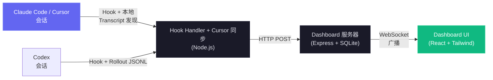

### 多语言支持（i18n）

Dashboard 内置多语言界面，支持 `en`、`zh`、`vi`、`ko`、`es` 五种语言，适用于跨语言协作和团队共享。语言选择使用自定义下拉菜单，便于未来继续扩展。

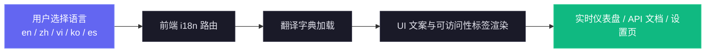

完整实现细节与排障指南请见 [docs/I18N.md](./docs/I18N.md)。

### 用户界面

响应式暗色界面覆盖完整工作流。每张预览图都使用适合移动端的缩略图，并链接到清晰的原图。

<p align="center">
  <a href="images/dashboard.png"></a>
  <br>
  <em>📡 <strong>Dashboard</strong> · Agent 总量、活跃 Agent、最近活动和实时健康信号</em>
</p>

<p align="center">
  <a href="images/tasks-overview.png"></a>
  <br>
  <em>📋 <strong>任务进度</strong> · 紧凑显示完成度和带归属信息的工作预览</em>
</p>

<p align="center">
  <a href="images/dashboard-health.png"></a>
  <br>
  <em>🩺 <strong>系统健康</strong> · 存储、缓存、错误、工具、模型、Subagent 和压缩指标</em>
</p>

<p align="center">
  <a href="images/board.png"></a>
  <br>
  <em>📋 <strong>Kanban 看板 · Agent</strong> · 清晰展示工作中、等待中、已完成和失败的 Agent 及等待原因</em>
</p>

<p align="center">
  <a href="images/board-sessions.png"></a>
  <br>
  <em>🗂️ <strong>Kanban 看板 · 会话</strong> · 展示活跃、等待中、已完成、错误和已废弃会话</em>
</p>

<p align="center">
  <a href="images/sessions.png"></a>
  <br>
  <em>📂 <strong>会话</strong> · 可搜索、可筛选、服务端分页的历史记录，包含成本和活动</em>
</p>

<p align="center">
  <a href="images/session-agents.png"></a>
  <br>
  <em>🤖 <strong>会话 Agent</strong> · 实时总量、工具用量、Token 流和 Agent 层级</em>
</p>

<p align="center">
  <a href="images/tasks-details.png"></a>
  <br>
  <em>✅ <strong>任务详情</strong> · 完成度分段、当前工作、归属信息和分页任务</em>
</p>

<p align="center">
  <a href="images/session-conversation.png"></a>
  <br>
  <em>💬 <strong>对话</strong> · 渲染 Transcript、代码、工具调用、命令输出和会话标记</em>
</p>

<p align="center">
  <a href="images/session-timeline.png"></a>
  <br>
  <em>🔬 <strong>时间线</strong> · 按时间排列的事件、多维筛选和配对工具活动</em>
</p>

<p align="center">
  <a href="images/feed.png"></a>
  <br>
  <em>📰 <strong>活动流</strong> · 可暂停的实时事件、分组、筛选和会话跳转</em>
</p>

<p align="center">
  <a href="images/analytics.png"></a>
  <br>
  <em>📊 <strong>分析</strong> · 模型 Token、工具频率、活动热力图和会话趋势</em>
</p>

<p align="center">
  <a href="images/workflows.png"></a>
  <br>
  <em>🔀 <strong>工作流</strong> · 编排图、工具流、协作、委派和模式</em>
</p>

<p align="center">
  <a href="images/dynamicworkflows-workflows.png"></a>
  <br>
  <em>🧬 <strong>工作流运行</strong> · 基于日志的状态、Agent、Token、工具和时长</em>
</p>

<p align="center">
  <a href="images/dynamicworkflows-workflows2.png"></a>
  <br>
  <em>🧬 <strong>展开的运行</strong> · 阶段筛选、逐 Agent 指标、提示和完整结果</em>
</p>

<p align="center">
  <a href="images/dynamicworkflows-session.png"></a>
  <br>
  <em>🧬 <strong>会话工作流</strong> · 关联动态运行和合并计算的 Token 成本</em>
</p>

<p align="center">
  <a href="images/config.png"></a>
  <br>
  <em>🧰 <strong>Agent 配置</strong> · 检查并安全编辑支持的 Claude Code 和 Codex 配置</em>
</p>

<p align="center">
  <a href="images/config-codex.png"></a>
  <br>
  <em>🧰 <strong>Codex 配置</strong> · 模型、Profile、MCP、项目、技能、Hook、规则、插件和指令</em>
</p>

<p align="center">
  <a href="images/config-skills.png"></a>
  <br>
  <em>🧩 <strong>技能</strong> · 可搜索的用户、项目和插件技能，支持带备份编辑</em>
</p>

<p align="center">
  <a href="images/run.png"></a>
  <br>
  <em>▶️ <strong>Run Agent</strong> · 使用 Provider 原生控制启动 Claude Code 或 Codex</em>
</p>

<p align="center">
  <a href="images/run-results.png"></a>
  <br>
  <em>💬 <strong>实时运行</strong> · 流式聊天、推理、命令、文件变更、工具和重新连接</em>
</p>

<p align="center">
  <a href="images/settings.png"></a>
  <br>
  <em>⚙️ <strong>设置</strong> · 定价、Hook、通知、数据、远程数据源和系统状态</em>
</p>

<p align="center">
  <a href="images/alerts.png"></a>
  <br>
  <em>🔔 <strong>告警</strong> · 规则、冷却时间、活动，以及内置或签名通用 Webhook</em>
</p>

<p align="center">
  <a href="images/remote.png"></a>
  <br>
  <em>🛰️ <strong>远程数据源</strong> · Provider 感知的 SSH 同步和按来源监控</em>
</p>

<p align="center">
  <a href="images/palette.png"></a>
  <br>
  <em>⌘ <strong>命令面板</strong> · 用一个键盘启动器访问页面、会话、项目、筛选器和操作</em>
</p>

侧边栏链接 Dashboard、Kanban 看板、会话、活动流、分析、工作流、Agent 配置、Run Agent 和设置。以下章节说明这些视图背后的完整行为。
---

## 功能特性

Dashboard 覆盖完整的本地 Agent 生命周期。详细运行契约仍见相关章节和 `docs/` 参考文档。

| 功能 | 摘要 |
| --- | --- |
| **任务进度** | 汇总 Claude 任务工具、旧版 `TodoWrite` 与 Codex `update_plan` 的按归属进度。卡片和表格行显示紧凑预览；会话详情增加状态分段、当前工作、归属信息和每页 10 行的分页。新的顶层工作会清除陈旧的未完成状态，已完成历史仍保留。 |
| **Dashboard** | 持久化的 **Monitor** 和 **Health** 标签页汇总 Agent 总量、活跃层级、最近活动、加权的成功率/缓存/错误/堆内存健康度，以及存储、工具、模型、Subagent 效能和压缩指标。Health 每 5 秒从 `/api/settings/info` 和 `/api/workflows` 刷新。 |
| **Kanban 看板** | Agent 列覆盖 Working、Waiting、Completed 和 Error，会话列另含 Active 和 Abandoned。卡片每次显示 10 张，仅订阅当前 WebSocket 视图，保留完整标题，并说明权限输入、回合完成、提示符空闲或中断等等待原因。 |
| **会话** | 可搜索、可筛选、服务端分页的历史记录，费用仅按可见页计算，并包含临时的内存 Codex 启动行。搜索以 300 ms 防抖匹配 `id`、`name` 和 `cwd`。名称依次取显式标题、AI 标题和首条有意义的用户提示。 |
| **会话详情** | 实时统计、当前工作、工具用量、Subagent、Token、层级、筛选后的事件时间线、`tool_use_id` 分组和工具专用渲染器。对话视图渲染排队回合、系统通知、Markdown、高亮代码和样式化工具；等待横幅显示原因和已等待时长。 |
| **活动流** | 可暂停的实时事件流，带共享筛选器、服务端分页、分组、项目/会话/Subagent 来源、会话链接，以及一致的 Claude/Codex 状态徽标。 |
| **分析** | 模型 Token、工具频率、从周日开始的活动热力图、会话趋势、连接状态、与布局匹配的加载骨架和分页长图例。 |
| **命令面板** | `Cmd/Ctrl+K` 搜索最近命令、所有路由、实时服务端会话、页面操作、项目目录、子视图、筛选器、Settings、Agent Config、偏好、范围和语言。支持子序列排序、`>`/`@`/`#` 范围、完整键盘控制、已翻译标签、静默处理搜索失败，并且对破坏性操作只导航不执行。 |
| **唯一快捷键** | `Cmd/Ctrl+K` 是 Dashboard 唯一的全局组合键，在输入框中也有效。移除多键导航可避免隐藏模式；Tabby 保留 `Cmd/Ctrl+B`。 |
| **实时更新** | WebSocket 推送直接更新界面，无需轮询。 |
| **自动发现** | Provider 信号自动创建会话和 Agent。Claude 在 `SessionStart` 时出现；Codex 在获得持久 ID 前显示临时的本地 Waiting 卡片，可安全接管已结束后恢复的线程，并且绝不把预身份卡片写入持久总量、分析、告警或通知。 |
| **历史导入** | 来自 `~/.claude/` 的 Claude Transcript 和来自 `~/.codex/sessions` 的 Codex rollout 使用各自的扫描与上传流程、共享的实时摄取计数和幂等写入。外部 Codex rollout 会保存快照，使源文件删除后对话仍可用。 |
| **Subagent 层级** | Dashboard 和会话详情中的可折叠父子树会在子项活跃时自动展开。 |
| **后台 Agent** | 后台 Subagent 会持续受跟踪，不会过早完成。 |
| **Subagent 工具归属** | `SubagentStop` 和启动扫描导入每个 Subagent 的 JSONL 工具，按 `tool_use_id` 配对结果并去重，在 30 秒内合并匹配的实时行，再根据已生成的子项 ID 重建真实嵌套父级。重新归属只追加变更，即使未插入行也会触发 UI 刷新。 |
| **成本跟踪** | 可配置的按模型和按会话定价支持带日期的介绍价、可编辑促销类别、每个 Subagent 自身的成本，以及跨压缩安全的总计。Transcript 读取使用缓存的增量字节偏移。 |
| **Transcript 缓存** | 增量 JSONL 解析提取 Token、压缩、API 错误、回合时长、思考和用量元数据；完整解析修复旧版重复，尾部解析保持只追加。数组上限为 `TRANSCRIPT_CACHE_MAX_ARRAY_LEN`，默认 `1000`，条目仅存文件元数据和解析结果。 |
| **Transcript 快照保留** | 持久的 Claude、Codex 和 Cursor 快照保存最完整的对话。源文件已消失的 Claude 和 Cursor 副本会在往返验证后 gzip 压缩；清除会删除快照；可选年龄/大小上限可在 Settings 试运行预览后清理唯一的旧副本。 |
| **通知** | VAPID Web Push 在后台或浏览器关闭时发送配置的事件，并支持 macOS 音频和订阅控制。 |
| **告警** | Settings 提供 Rules、Channels 和 Activity，用于事件模式、不活动、Agent 卡住和 Token 告警。事件规则在摄取后运行，时间规则每 60 秒扫描。持久告警按规则/会话冷却，默认 300 秒，并支持 WebSocket 投递、确认，以及按范围扇出至 14 个命名 Provider 或带脱敏 Secret、超时和有界重试的通用签名 JSON。 |
| **更新提醒** | 非阻塞定时 `git fetch` 将当前检出与规范远程比较，再在模态框、侧边栏和终端显示准确的更新命令。CCAM 从不自行拉取或重启。 |
| **设置** | 系统与 Hook 状态、按 Provider 的定价、通知、清理、Provider 主目录、即时数据刷新，以及最大 25 MiB 的导出 JSON 幂等恢复。定价支持 Provider 级默认值、通配规则、公开费率指引、272K GPT 边界，以及独立的 Cursor 原生与第三方目录。 |
| **Run Agent + Agent 配置** | `/run` 启动 Claude Code 或原生 Codex app-server 线程，提供对应 Provider 的模型、审批、沙箱、恢复、停止、流式输出和重新连接。`/cc-config` 并列提供可编辑的 Claude 与 Codex 浏览器；受支持的用户文件使用受保护的原子保存和带时间戳备份、Secret 脱敏预览、准确的 Profile 命令和 Provider 专用监听器。 |
| **Codex Agent 配置** | 显示完整账户模型目录及基础/Profile 覆盖，创建标准 `<name>.config.toml` Overlay，并通过规范路径包含检查和符号链接检查保护编辑。Profile、Hook、规则、技能和指令支持来源/路径/编辑/删除操作，删除前备份；`config.toml` 仅可编辑。 |
| **MCP Server（本地）** | stdio、HTTP+SSE 和 REPL 三种传输在 16 个模块中暴露 103 个类型化工具。统一的已验证目录强制 localhost 或 HTTPS 目标、Bearer Token 规则、拒绝重定向、变更门禁、每文件 50 MiB 和每调用 100 MiB 上传、10 MiB 二进制响应，以及 25 MiB 恢复。 |
| **工作流** | 11 个 D3 区域覆盖编排、工具流、协作、效能、模式、委派、错误、并发、复杂度、压缩和会话下钻。本地化说明 Tooltip、交叉筛选、JSON 导出、3 秒防抖的实时刷新，以及从日志重建的动态运行，会保留每个 Agent 的阶段、Token、工具、时长、提示和结果详情。 |
| **压缩跟踪** | Transcript 扫描创建零时长的压缩 Agent/事件、修复旧版负时长、回填旧会话，并通过缓存的 `sessions.transcript_path` 值定期只检查活跃会话。 |
| **子会话/恢复会话** | 新事件会重新激活恢复或孤立会话；每隔 `DASHBOARD_STALE_MINUTES` 的四分之一执行一次扫描，间隔限制在 60 秒至 5 分钟，用于发现已废弃会话。 |
| **既有会话检测** | 启动导入会将最近修改的 Transcript 标记为活跃；之后到达的 Stop 事件会先重新激活已导入的 completed 或 abandoned 会话，再更新状态。 |
| **连续项目同步** | 立即启动扫描、防抖文件系统监听器与 `DASHBOARD_SESSION_SYNC_MS` 轮询共用 mtime 缓存和合并扫描，默认 30 秒。只重新解析新增或有进展的文件，监听范围适配 Linux，并实时广播会话。 |
| **远程数据源** | SSH 数据源通过 `scp` 或 WSL `tar` 分别镜像 Claude 和 Codex 主目录，标记 `sessions.source`，协调生命周期，并在任一 Provider 正常时保持健康。默认每 15 秒轮询；陈旧回退仅影响失败的 Provider。凭据保留在宿主 SSH 中。 |
| **远程推送摄取** | `POST /api/hooks/ingest-batch` 支持 NAT 后方的机器。配置 `REMOTE_PUSH_TOKEN` 前保持禁用，拒绝查询字符串 Token 和本机拥有的会话，每批最多 1000 项，按 `(session_id, event_type, uuid)` 去重，返回逐项部分错误，并且只在提交后广播。 |
| **响应式设计** | 移动端布局会堆叠网格、滚动宽表格并收起导航。 |
| **UI 本地化** | 英语、中文、越南语、韩语和西班牙语覆盖 UI 文案、无障碍标签、工作流说明与 Tooltip、模型定价指引、Provider 主目录和 Import History。 |
| **示例数据** | 内置脚本提供贴近实际的演示和开发数据。 |
| **状态栏** | 彩色 CLI 条显示模型、上下文、Git 分支、方向性 Token 和美元会话成本。 |
| **模型名称格式化** | Claude、GPT 和 Gemini 标识符会移除 Provider、日期和 `latest` 后缀，合并数字版本并格式化上下文标签，转换为可读名称；Settings 保留原始定价模式。 |
| **Claude + Codex 插件市场** | 同一套 14 个共享插件目录树提供两种 Manifest 和 Catalog、66 个插件技能、18 个 Claude Subagent、34 个 Claude 命令、3 个 CLI 辅助工具和 OpenAI 元数据。`npx skills add hoangsonww/Claude-Code-Agent-Monitor --list` 可发现 77 个仓库技能。 |
| **Run Claude** | 对话和单次模式支持恢复/查看历史、并行后台运行、Transcript 感知的重新连接、模型/effort/权限/cwd 控制、部分消息平滑、保留思考过程、斜杠命令、`@` 文件、上下文与成本计量，以及实时状态。同源保护阻止绕过页面的启动；并发默认安全上限为 10000，可用 `RUN_MAX_CONCURRENT` 降低。 |
| **Claude Config Explorer** | 12 个标签页检查技能、Agent、命令、样式、插件、市场、MCP、Hook、设置、Memory、Keybinding 和状态栏。规范路径阻止符号链接逃逸；受支持的文本界面使用原子创建/编辑/删除并在根目录外生成带时间戳备份，敏感配置保持只读并提供准确 CLI 指引。`cc-watcher` 以 500 ms 防抖广播外部变化。 |
| **Tabby** | 无依赖的 WebSocket 吉祥物，包含由活动派生的 8 种情绪、节流台词、快捷操作、本地状态回答，以及对更广泛问题的 Run Claude 移交。支持键盘、减少动态效果、断线安全、配置和本地化。 |
| **声音提示** | 7 种无依赖 Web Audio 提示音覆盖会话、错误、Subagent、通知、连接和点击。冷却、全局突发预算、低通滤波、自动播放安全、持久化音量和逐项设置使其保持克制。 |
| **Progressive Web App (PWA)** | Dashboard、Landing Page 和 Wiki 各有独立 Manifest 与 Service Worker。不可变 Vite 资源使用 cache-first，导航和可变 Shell 文件使用 network-first；Push 保持有效；Landing Page 与 Wiki 预缓存 Shell 并按需缓存截图；SVG 和 Apple 元数据支持安装。 |
| **桌面应用（macOS 与 Windows）** | Electron 35 将同一进程内 Express 服务器和 React 客户端打包为 macOS DMG、Windows 安装版或便携 EXE。增加原生菜单、托盘状态/操作、登录启动、退出确认、原生通知、单实例锁、安全端口回退/接管、SQLite 干净关闭，以及首次运行 Hook/后台设置。 |
| **自托管资源（无 CDN）** | 字体、脚本、Wiki Mermaid 和扩展回退全部位于本地。应用、Landing Page 和 Wiki 无需请求 Google Fonts、jsDelivr 或其他第三方资源即可离线工作。 |
| **会话启动画面** | 每个浏览器会话显示一次的本地化问候和节点图动画从首帧起保持不透明，持续约 2.5 秒，支持点击跳过并遵循减少动态效果设置。 |

> **Provider 范围和主目录：** Settings 在 Claude 兼容（Claude Code + Cursor）/ Codex / Both 之间保持全局一致。Claude Code 和 Codex 主目录无需重启 Dashboard 即可编辑；Cursor 自动从 `~/.cursor` 或 `DASHBOARD_CURSOR_HOME` 发现。
>
> **本地安全边界：** Run Agent 接受任意已存在的绝对工作目录，并在使用前进行规范化，因此仍支持从主目录和最近项目启动。托管 Webhook Provider 必须使用 HTTPS；generic 和 n8n 目标可为本地/自托管接收端使用 HTTP，且投递从不跟随重定向。
---

## 快速开始

### 前置条件

- **Node.js** >= 22.22.0（推荐 Node 24 LTS）
- **npm** >= 9.0.0

### 1. 安装

```bash
git clone https://github.com/hoangsonww/Claude-Code-Agent-Monitor.git
cd Claude-Code-Agent-Monitor
npm run setup
```

### 2. 配置 Claude Code Hook

```bash
npm run install-hooks
```

使用方向键、Space 和 Enter 选择 **Claude Code**、**Codex (beta)** 或两者。Claude Hook 存储在 `~/.claude/settings.json`，Codex Hook 存储在 `~/.codex/hooks.json`。重新安装只替换 CCAM 条目并保留无关 Hook；同一操作也可在 **Settings → Hook Configuration** 中执行。

首次启动时，CCAM 只检查当前数据范围所选的 Provider，并提示安装缺少的 Hook。若就绪检查失败，则回退到手动设置，不会阻塞 Dashboard。

设置完成后，Provider 发现会持续运行：

- **Claude Code 和 Cursor：** Claude Hook 提供实时事件。Cursor 无需 Hook；选择 Claude Code 后也会监视 `~/.cursor/chats` 和 `~/.cursor/projects/*/agent-transcripts`，在 Cursor 清理前保存对话快照，并遵循 `DASHBOARD_CURSOR_HOME`。
- **Codex：** Hook 与 `~/.codex/sessions` rollout 增量监听共同保持生命周期、提示、标题、工具、Token、成本、压缩、对话和 WebSocket 状态最新。坏文件会独立重试；精确的 rollout/进程匹配可防止幽灵活跃卡片；原生 `/rename` 标题和基于游标分页的对话历史会实时更新。
- **Both：** 卡片保留最近两条不同的人类提示，渲染持久化图片附件，并对重复的 Codex 响应去重。仅 Codex 的范围会隐藏只适用于 Claude 的 Dynamic Workflow 日志。
### 3. 启动

```bash
# 开发模式（服务端和客户端均支持热重载）
npm run dev

# 生产模式（单进程，构建后的客户端）
npm run build && npm start
```

> [!TIP]
> **Makefile 替代方案** — 如果你安装了 `make`，所有命令也可通过 `make` 执行。运行 `make help` 查看所有目标，或使用快捷命令如 `make dev`、`make build`、`make test` 等。

### 4. 访问

| 模式 | 地址 |
| ----------- | ----------------------- |
| 开发 | `http://localhost:5173` |
| 生产 | `http://localhost:4820` |

> [!NOTE]
> 服务器默认绑定 `127.0.0.1`（开箱即用不可从网络访问 —— GHSA-gr74-4xfh-6jw9）；如需在局域网暴露，请设置 `DASHBOARD_HOST` 和 `DASHBOARD_TOKEN`（设置后 `/api/*` 与 WebSocket 都需要该 token），并在 `DASHBOARD_ALLOWED_HOSTS` 中列出局域网主机名。参见 `.env.example` / `.github/SECURITY.md`。

### 5. 可选：构建并运行本地 MCP 服务器

```bash
npm run mcp:start              # stdio（默认 — 用于 MCP 宿主集成）
npm run mcp:start:http         # HTTP + SSE 服务器，端口 8819
npm run mcp:start:repl         # 带 Tab 补全的交互式 CLI
ccam mcp stdio                 # 内置插件使用的稳定启动器
```

stdio 模式下，配置你的 MCP 宿主（Claude Code / Claude Desktop / 其他 MCP 客户端）：

- command: `ccam`
- args: `["mcp", "stdio"]`

HTTP 模式下，远程 MCP 客户端连接 `http://127.0.0.1:8819/mcp`（Streamable HTTP）或 `http://127.0.0.1:8819/sse`（传统 SSE）。

详见 [mcp/README.md](./mcp/README.md) 了解完整的宿主配置、传输详情、安全标志和工具目录。

### 可选：生成演示数据

```bash
npm run seed
```

创建 8 个示例会话、23 个 Agent 和 106 个事件，让你可以立即浏览 UI。

### 替代方案：桌面应用（macOS 与 Windows）

如果你不想一直开着终端窗口，可以安装可选的**原生桌面应用**。它将 Express 服务器以进程内方式嵌入运行，提供菜单栏 / 通知区域（托盘）图标，并支持开机自启（macOS 登录项 / Windows 启动项）。

最快的方式是从 [最新 GitHub Release](https://github.com/hoangsonww/Claude-Code-Agent-Monitor/releases/latest) **下载预构建的安装包**（每当 `master` 上的 `package.json` 版本号被提升时，CI 都会自动发布一个新的 `vX.Y.Z`）：

- **macOS** —— 下载 `ClaudeCodeMonitor-<version>-arm64.dmg`（Apple Silicon）或 `-x64.dmg`（Intel），并将 **Claude Code Monitor.app** 拖入 `/Applications`。
- **Windows** —— 下载 `ClaudeCodeMonitor-Setup-<version>-x64.exe`（安装版）或 `ClaudeCodeMonitor-<version>-x64-portable.exe`（免安装版），然后运行它。

若希望自行构建：

```bash
npm run desktop:install        # 在 desktop/ 中安装 Electron + electron-builder（预检原生依赖；失败时打印安装帮助）
npm run desktop:dmg:arm64      # macOS：Apple Silicon 专用 DMG（快速）
npm run desktop:win            # Windows：NSIS 安装包 .exe（在 Windows 上运行）
```

> [!TIP]
> DMG 在 macOS 上构建，Windows `.exe` 在 Windows 上构建 —— electron-builder 针对宿主操作系统打包。为自己的 Mac 构建时，请使用架构专用命令（`desktop:dmg:arm64` 或 `desktop:dmg:x64`），它们速度快得多；`desktop:dmg` 会按架构把应用构建两次，产出两个按架构的 DMG（arm64 + x64，不做任何合并），仅在制作发布产物时才需要。

完整的生命周期语义、托盘/菜单功能、签名与公证钩子详见下文的 [桌面应用（macOS 与 Windows）](#桌面应用macos-与-windows) 章节，以及 [`DESKTOP.md`](./DESKTOP.md)。

### 替代方案：Docker / Podman

OCI 镜像以非 root 用户运行，丢弃全部 capability，使用 Tini 作为 PID 1，并包含 Git、OpenSSH 与 SQLite。Docker Compose 和 Podman Compose 使用同一份文件。

```bash
# 仅 Dashboard
docker compose up -d --build
# 或
podman compose up -d --build

# 完整认证栈
umask 077
openssl rand -hex 32 > deployments/secrets/dashboard-token
openssl rand -hex 32 > deployments/secrets/hook-token
openssl rand -hex 32 > deployments/secrets/mcp-token
openssl rand -base64 32 > deployments/secrets/grafana-admin-password
npm run docker:full:up
```

宿主机端口默认仅绑定 loopback：Dashboard `4820`、MCP `8819`、Nginx `8080`、Prometheus `9090`、Grafana `3000`。Claude/Codex home 只读挂载，命名卷保存 SQLite 与 Dashboard 配置。Nginx 代理 UI、认证 REST 与 WebSocket，默认在边缘阻止 Hook、指标和 MCP。

> [!IMPORTANT]
> Hook 必须在宿主机安装。远程 Hook 使用 `CCAM_DASHBOARD_URL=https://...` 和 `CCAM_HOOK_TOKEN`；非 loopback URL 必须使用 HTTPS。详见 [DEPLOYMENT.md](DEPLOYMENT.md)。

---

## 工作原理

Dashboard 通过 Claude Code 原生 Hook 系统集成，提供 Agent 活动的实时监控。以下是架构和数据流概览：

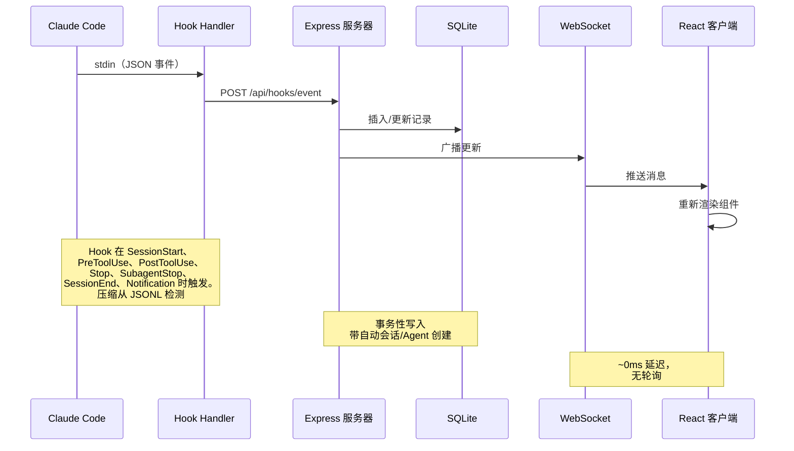

### Hook 生命周期

1. **Claude Code** 发出会话、提示、工具、通知、Subagent、回合和退出 Hook。
2. **`scripts/hook-handler.js`** 从 stdin 读取每个事件，并通过 `~/.claude/.agent-dashboard.json` 或 `CLAUDE_DASHBOARD_PORT` 发现实时 Dashboard。每个独立 SQLite 数据目录只发送一次；对于重复监听器选择最低端口，同时仍向使用不同数据库的 Dashboard 提供事件。投递采用故障安全设计，每个目标彼此隔离，处理器会在 5 秒内退出。
3. **服务器** 在一个 SQLite 事务中提交事件及相关状态：
   - 首次接触会创建会话和主 Agent。`SessionStart` 从 **Waiting** 开始；`UserPromptSubmit` 或 `PreToolUse` 将其移至 **Working**；`PostToolUse` 让它保持工作中。
   - `Stop` 将主 Agent 恢复为 **Waiting**，后台 Agent 继续运行。`stop_reason=error` 将 Agent 和会话标记为 **Error**。权限通知同样会等待输入；只有新的提示或工具启动可从错误中恢复。
   - `SubagentStop` 完成该子项，不改变等待用户的状态。随后进行独立扫描，导入其 JSONL 工具，按 `tool_use_id` 配对调用与结果，进行去重并重建真实嵌套父级。
   - `SessionEnd` 清除等待状态并完成会话，除非必须保留错误。新的工作会重新激活 completed、errored 或 abandoned 会话，包括导入和恢复的会话。
   - `SessionStart` 和周期维护会在 `DASHBOARD_STALE_MINUTES` 后废弃不活跃会话，默认 180。扫描每隔该值的四分之一运行一次，间隔限制在 60 秒至 5 分钟。
   - 共享的增量 Transcript 解析无需重复读取未变化的字节，即可记录压缩、API 与工具错误、回合时长、Token 和元数据。活跃会话扫描使用索引化的 `sessions.transcript_path` 值，并驱逐已废弃的缓存条目。
   - 15 秒看门狗会在 10 秒无 Hook 后查找 Transcript API 错误。它也会根据 Transcript 标记恢复 Esc 中断；若没有标记，则在 `DASHBOARD_WORKING_IDLE_SECONDS` 后恢复，默认 120，且仅当没有工具运行、Hook 和 Transcript 都未推进时触发。
   - 同一个看门狗会在 `DASHBOARD_LIVENESS_IDLE_SECONDS` 后通过进程存活探测完成已结束的本地会话，默认 60。启动探测会立即执行，并在约 5 秒后再次执行，不受该空闲门槛限制。探测会跳过 Windows、容器、转发的非 POSIX 路径、远程数据源会话、工具失败和 `DASHBOARD_LIVENESS_PROBE=0`；之后到达的真实 Hook 会自愈误判。
   - 连续项目同步组合立即扫描、防抖 `fs.watch` 与 `DASHBOARD_SESSION_SYNC_MS` 轮询，默认 30 秒。单个 mtime 缓存只重新解析新增或增长的 Transcript，并广播与 Hook 相同的会话帧。
4. **WebSocket** 发布已提交的变更。
5. **UI** 无需轮询即可刷新受影响视图。
### Agent 状态机

持久化状态:`working | waiting | completed | error`。`awaiting_input_since`
字段是补充性的 — 它记录 Agent 开始等待的时间点,用于显示等待时长,但 `waiting`
现在是真正的持久化状态。

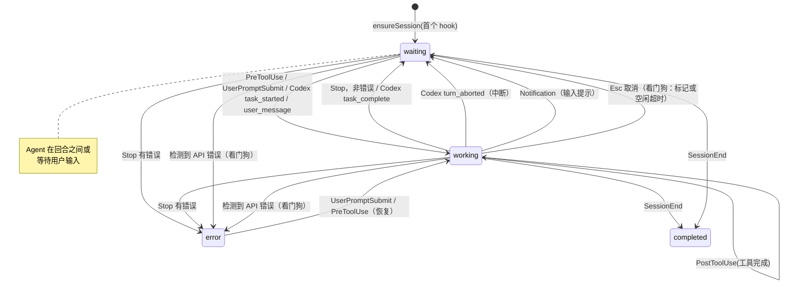

### 会话状态机

持久化状态:`active | completed | error | abandoned`。**等待中**会话状态
是 UI 覆盖层(status=`active` 加上 `awaiting_input_since` 被设置)。

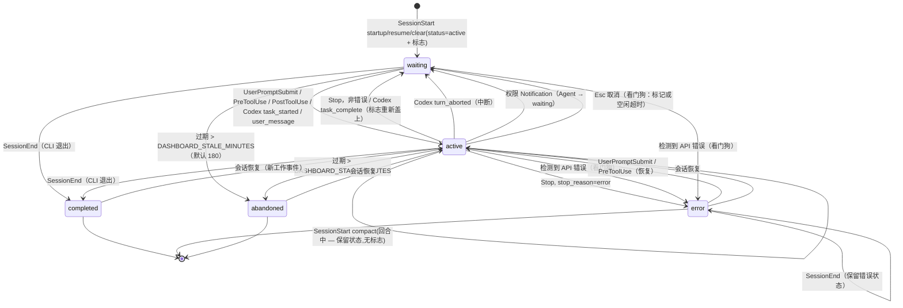

### 成本计算流程

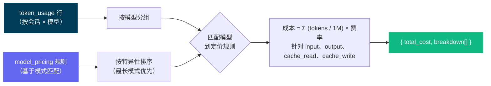

> [!IMPORTANT]
> 成本计算流程基于 Token 使用量和模型定价规则。确保你的定价规则是最新的以反映准确成本。通过设置页面更新模型定价表以保持准确的成本追踪 — Dashboard 不会自动从外部来源获取定价更新。设置定价规则后，Dashboard 会追溯应用于所有会话以保持一致的成本报告。

---

## 配置

| 环境变量 | 默认值 | 用途 |
| --- | --- | --- |
| `DASHBOARD_PORT` | `4820` | Express 服务器端口。 |
| `CLAUDE_DASHBOARD_PORT` | `4820` | Hook Handler 使用的端口。 |
| `NODE_ENV` | `development` | 设为 `production` 时提供构建后的客户端。 |
| `DASHBOARD_UPDATE_CHECK` | 已启用 | 设为 `0`、`false` 或 `off` 可禁用定时上游检查。 |
| `DASHBOARD_UPDATE_CHECK_INTERVAL_MS` | `300000` | 更新检查间隔，最小 60,000 ms。手动 **Check now** 仍可使用。 |
| `DASHBOARD_STALE_MINUTES` | `180` | 活跃或 Waiting 会话转为 abandoned 前的无活动时长。看门狗负责执行，维护任务每隔该值的四分之一运行一次，间隔限制在 60 秒至 5 分钟。 |
| `DASHBOARD_WORKING_IDLE_SECONDS` | `120` | 在工具、Hook 和 Transcript 都未推进时恢复没有标记的 Esc 取消。较小的值响应更快，但可能短暂误判长时间静默回合；新活动会自愈。Cursor 使用相同规则。 |
| `DASHBOARD_LIVENESS_PROBE` | `1` | 设为 `0` 可禁用本地 Claude/Codex 死亡会话的进程完成探测。Windows、容器、转发的非 POSIX 路径和远程数据源会自动跳过。 |
| `DASHBOARD_LIVENESS_IDLE_SECONDS` | `60` | 看门狗存活检查的 Transcript 或最后 Hook 空闲门槛。启动探测忽略此门槛，使已经结束的会话立即清除。 |
| `DASHBOARD_SESSION_SYNC_MS` | `30000` | 新增或变化的 `~/.claude/projects` 文件的安全轮询间隔。`fs.watch` 仍会立即响应；`0` 只禁用轮询。 |
| `DASHBOARD_CURSOR_HOME` | `~/.cursor` | Cursor Chat、Transcript、回填和持久快照的状态根目录。 |
| `DASHBOARD_CURSOR_SYNC_MS` | `5000` | 基于指纹的 Cursor 安全轮询。设为 `0` 时监听器仍保持活动。 |
| `DASHBOARD_CODEX_HOME` | `CODEX_HOME` 或 `~/.codex` | Codex 状态根目录。Settings 会持久化覆盖值、重新启用监听并立即扫描。 |
| `DASHBOARD_CODEX_SYNC_MS` | `4000` | Codex rollout 安全轮询。设为 `0` 时 Hook 和监听器仍保持活动。 |
| `DASHBOARD_CODEX_MAX_ATTEMPTS` | `5` | 一个未变化且无法读取的 rollout 的尝试次数，包括首次尝试。大小或 mtime 变化会重置预算；耗尽时只记录一次。 |
| `DASHBOARD_CODEX_HOOK_IDLE_SECONDS` | `60` | 当已报告结束的 `stop` 从未收到 `SessionEnd` 时，完成仅依赖 Hook 的 Codex 会话，例如 `codex exec --ephemeral`。单纯静默永远不会触发。 |
| `DASHBOARD_TASK_SUMMARY_TTL_MS` | `2000` | 任务摘要和 `todo_snapshot` 的过期仍可服务窗口。追加内容会增量解析；增长超过 32 MiB 时会从新的尾部重新开始。`0` 会解析每次追加。 |
| `DASHBOARD_SNAPSHOT_COMPRESS` | `1` | 设为 `0`、`false` 或 `off` 可停止对源文件已消失且闲置 24 小时的 Claude/Cursor 快照进行验证后的 gzip 转换。不可读的源树和 Codex 快照会跳过。 |
| `DASHBOARD_SNAPSHOT_MAX_AGE_DAYS` | 未设置 | 可选的每 6 小时保留任务，清理超过该天数的已结束会话。被清理的会话会留下墓碑，恢复的会话受保护。由于快照可能是唯一副本，请先用 `ccam snapshots prune --days N` 预览。 |
| `DASHBOARD_SNAPSHOT_MAX_BYTES` | 未设置 | 可选的快照总大小上限，单位为字节或 `5GB` 等。最旧的已结束会话优先清理；活跃或最近 24 小时的会话保持受保护。 |
| `DASHBOARD_REMOTE_SYNC_MS` | `15000` | Claude 项目、Codex rollout 和 Codex 标题索引的 SSH 远程数据源轮询。新增或重新启用的数据源立即同步；`0` 仍保留手动同步。 |
| `DASHBOARD_REMOTE_ACTIVE_WINDOW_MS` | `600000` | 镜像的远程 Transcript 在最近事件仍处于此新鲜度窗口内时视为活跃，之后协调为 completed。失败的 Provider 回退到常规 stale 处理。 |
| `DASHBOARD_REMOTE_SYNC_TIMEOUT_MS` | `600000` | 每个数据源执行 SSH 拉取和导入的超时。 |
| `DASHBOARD_REMOTE_TEST_TIMEOUT_MS` | `15000` | 远程数据源 SSH 测试的超时。 |
| `DASHBOARD_HOST` | `127.0.0.1` | 绑定接口。`0.0.0.0` 会暴露服务并记录警告。 |
| `DASHBOARD_TOKEN` | 未设置 | 通过 Bearer Header、`x-dashboard-token` 或 `?token=` 保护 `/api/*` 和 WebSocket。默认信任边界为 loopback。 |
| `DASHBOARD_TOKEN_FILE` | 未设置 | 用于 Docker/Kubernetes Secret 的文件型 Dashboard Token；`DASHBOARD_TOKEN` 优先。 |
| `DASHBOARD_HOOK_TOKEN` / `DASHBOARD_HOOK_TOKEN_FILE` | 未设置 | 对 `/api/hooks/event` 和 `/api/hooks/codex` 提供超出 loopback 的独立保护。 |
| `REMOTE_PUSH_TOKEN` / `REMOTE_PUSH_TOKEN_FILE` | 未设置 | 单独把守公网 `POST /api/hooks/ingest-batch`。该路由默认禁用，且绝不继承本地 Hook Token。 |
| `DASHBOARD_ALLOWED_HOSTS` | loopback | DNS 重绑定防护允许的额外逗号分隔 HTTP 和 WebSocket `Host` 值。 |
| `DASHBOARD_ENV_PATH` | 仓库 `.env` | 用于持久化 Provider 主目录覆盖值的可写 dotenv 文件；容器默认使用 `/app/config/.env`。 |
| `CCAM_DASHBOARD_URL` | localhost 发现 | 远程 Hook 目标。非 loopback URL 需要 HTTPS 和 Hook Token。 |
| `CCAM_HOOK_TOKEN` / `CCAM_HOOK_TOKEN_FILE` | 未设置 | Hook 客户端作为 `x-ccam-hook-token` 发送的凭据。 |

> [!IMPORTANT]
> 服务器默认仅绑定 loopback。LAN 访问需要 `DASHBOARD_HOST`、`DASHBOARD_TOKEN` 和匹配的 `DASHBOARD_ALLOWED_HOSTS` 值。参见 [`.env.example`](./.env.example) 和[安全策略](./.github/SECURITY.md)。

Git clone 会定期拉取规范远程，并将其默认分支与当前检出比较。落后时，终端和 UI 会显示准确的手动更新命令。CCAM 从不自行拉取或重启。
---

## `ccam` CLI

**`ccam`** CLI（`bin/ccam.js` → `cli/`）通过 Commander.js 命令树在任意终端中提供 Dashboard 功能，包括继承选项、校验、建议、生成式帮助和 Shell 补全。`npm run setup` 会自动链接它。服务器解析依次检查 `--server` / `CCAM_URL`、已配置端口、实时服务器注册表，最后使用 `http://127.0.0.1:4820`。

```bash
# 服务器
ccam status | health                  # ● 运行中 / ○ 未运行；版本 + 时间戳
ccam start [--port N] | stop | restart  # 后台生产服务器
ccam logs [-n N] [-f]                 # 查看 data/ccam-server.log
ccam open [page] [--session id]       # 打开仪表盘、某个页面或某个会话
ccam repl                             # 交互式 shell（也可用 shell、i）

# 监控
ccam overview [--watch]               # 单屏实时概览（别名：top）
ccam stats | kanban                   # 总量 + 状态分布 / 状态泳道
ccam tail [--session id] [--type T] [--tool N]   # 实时事件流
ccam stream [--type new_event,…]      # 原始实时 WebSocket 推送
ccam watch -n 5 <command …>           # 按间隔重复运行任意命令

# 数据
ccam sessions [--status s] [--q text] [--cwd dir] [--sort price] [--limit n]
ccam sessions get|stats|cost|agents|events|transcripts <id>
ccam sessions transcript <id>         # 以可读聊天记录形式查看对话
ccam sessions rename <id> <name…> | update <id> | create | facets
ccam agents [list|get|update|create]  # agent；ccam session <id> = sessions get
ccam events [--type T] [--tool N] [--q text] [--from iso] | events facets

# 洞察
ccam analytics                        # token、成本、热门工具、每日迷你走势图
ccam workflows [session <id>]         # 工作流智能 + 模式
ccam runs [list|get <run-id>]         # Workflow 工具运行
ccam run list|history|start|follow|send|stop …   # 仪表盘启动的 agent
ccam cost [--session id] [--daily]    # 按模型成本、附加费、未定价模型

# 告警与 Webhook
ccam alerts [--unacked] | ack <id> | ack-all
ccam alert-rules list|types|create|update|enable|disable|delete
ccam webhooks list|get|providers|deliveries|create|update|enable|disable|delete|test

# 定价
ccam pricing [list] | set <pattern> --input N --output N [--fast-* …] [--intro-* …] | delete | reset
ccam pricing gpt|cursor [list|set|delete]   # OpenAI/Codex 与 Cursor 价目表

# 导入与远程数据源
ccam import guide|rescan|path <dir>|upload <files…>|reimport
ccam import-data <file.json>          # 恢复导出（幂等）
ccam remote-sources list|get|add|update|enable|disable|test|sync|rm

# 管理
ccam doctor | info | export [file|-] | cleanup --hours N --days M
ccam snapshots [status|compress] | snapshots prune --days N   # 对话记录快照；prune 默认试运行，需 --apply --confirm PRUNE_SNAPSHOTS 才删除
ccam hooks [status|install] | reinstall-hooks | config claude|codex …
ccam updates [status|check] | update-check | metrics [--grep re]
ccam home [set claude|codex <path>] | push key|send|subscribe|unsubscribe
ccam api [METHOD] /api/path [--data JSON]   # 任意端点；写入需 --yes
ccam mcp [stdio|http|repl] | clear-data --yes

# CLI
ccam help [command…] | commands [--json] | completion bash|zsh|fish | version
```

命令组默认列出内容（`ccam alerts` 等同于 `ccam alerts list`）；每个命令都支持 `--help`；`ccam commands` 输出命令树，`ccam commands --json` 输出机器可读 Schema。

- **输出：** TTY 显示表格、状态图标、图表、迷你走势图、Agent 树、Transcript 视图和彩色帮助。管道输出为纯文本。`--json` 或 `CCAM_OUTPUT=json` 返回稳定 JSON；`tail`、`stream` 和 `run follow` 使用 NDJSON；错误以 `{"error":{"code":"…","message":"…"}}` 写到 stderr，退出码为 `0` 或 `1`。
- **写入：** 使用交互式 `y/N` 或 `--yes`；非交互写入必须带 `--yes`，`clear-data` 始终要求该字面 Flag。
- **离线模式：** 只读命令会回退到 `data/dashboard.db`，显示 `⚠ Offline mode` 横幅，并通过存活视图修正已结束但仍标为 active 的会话。仅限服务器的命令会说明 Dashboard 不可用的原因。
- **REPL 与补全：** `ccam repl` 提供由命令树驱动的补全、持久历史、实时提示符，以及 `help`、`json` 和 `watch` 内置命令，每行都在独立子进程中运行。使用 `source <(ccam completion zsh)` 启用 zsh 补全。

如果 `ccam` 不在 `PATH` 中，请在仓库根目录运行一次 `npm link`。完整契约见 [docs/CLI.md](./docs/CLI.md)。

## npm 脚本

| 命令 | 描述 |
| ----------------------- | ---------------------------------------------------------- |
| `npm run setup` | 安装根目录、客户端、扩展与 MCP 依赖，构建 MCP 并链接 `ccam` |
| `npm run dev` | 同时启动服务端（watch 模式）+ 客户端（Vite HMR） |
| `npm run dev:server` | 使用防抖、优雅重启的源码监视器启动 Express 服务器 |
| `npm run dev:client` | 仅启动 Vite 开发服务器 |
| `npm run build` | 构建 React 客户端到 `client/dist/` |
| `npm start` | 启动生产服务器（提供构建后的客户端） |
| `npm run install-hooks` | 在 `~/.claude/settings.json` 中配置 Claude Code Hook |
| `npm run seed` | 用示例数据填充数据库 |
| `npm run import-history` | 从 `~/.claude/` 导入历史会话（启动时也会运行） |
| `npm run reconcile-tokens` | 刷新已导入会话的 Token 总计（不会降低已有的总计） |
| `npm run repair-tokens` | 为每个 Transcript 仍在磁盘上的 **Claude** 会话（在 `~/.claude/projects/` 中查找，或按会话已保存的 `transcript_path`）重新推导**非 workflow** 的 Token 总计，并将上下文压缩基线清零；workflow 与 Codex 行保持不变。这是针对 v2.0.9 之前按记录累加用量而虚高，或遗漏同模型扁平子 Agent 用量的数据库的一次性修复。请先停止 Dashboard |
| `DASHBOARD_TOKEN_REPAIR` | 默认启用（`1`）。一次性自动修复受按记录虚高或遗漏同模型扁平子 Agent 影响的历史 Token 总计。实时修复无法重新处理所有已完成会话，而 `replaceTokenUsage` 也无法降低旧的高水位标记。每个数据库只运行一次（有标记文件、延后于启动路径、当另一个 Dashboard 共用数据目录时跳过），并会先将旧行快照到 `token_usage_pre_repair_v2`。设为 `0` 可跳过，改用 `npm run repair-tokens` 手动修复 |
| `npm run clear-data` | 删除所有会话、Agent、事件和 Token 用量 |
| `npm run mcp:install` | 安装本地 MCP 包（`mcp/`）的依赖 |
| `npm run mcp:build` | 构建 MCP 服务器 TypeScript 到 `mcp/build/` |
| `npm run mcp:start` | 启动 MCP 服务器（stdio 传输 — 用于 MCP 宿主） |
| `npm run mcp:start:http` | 启动 MCP 服务器（HTTP + SSE 传输，端口 8819） |
| `npm run mcp:start:repl` | 启动 MCP 服务器（带 Tab 补全的交互式 REPL） |
| `npm run mcp:dev` | 以开发模式运行 MCP 服务器（`tsx`，stdio） |
| `npm run mcp:dev:http` | 以开发模式运行 MCP 服务器（`tsx`，HTTP + SSE） |
| `npm run mcp:dev:repl` | 以开发模式运行 MCP 服务器（`tsx`，交互式 REPL） |
| `npm run mcp:typecheck` | 类型检查 MCP 源码，不生成构建输出 |
| `npm run mcp:docker:build` | 用 Docker 构建 MCP 容器镜像（`agent-dashboard-mcp:local`） |
| `npm run mcp:podman:build` | 用 Podman 构建 MCP 容器镜像（`localhost/agent-dashboard-mcp:local`） |
| `npm run desktop:install` | 在 `desktop/` 工作区安装 Electron + electron-builder（为 Electron 的 ABI 重新编译 `better-sqlite3`）；预检原生 `better-sqlite3` 构建，失败时打印可操作的安装帮助（含无工具链的替代方案） |
| `npm run desktop:build` | 预构建校验 + `tsc`，编译 Electron 主进程到 `desktop/out/` |
| `npm run desktop:dev` | 构建后启动 Electron，加载本地桌面应用 |
| `npm run desktop:test` | 运行桌面应用冒烟测试（启动 Electron 并探测 `/api/health`） |
| `npm run desktop:dmg` | **macOS：** 构建**两个按架构的** DMG（arm64 + x64）— 用于发布，**构建较慢** |
| `npm run desktop:dmg:arm64` | **macOS：** 构建 Apple Silicon 专用 DMG — **快速** |
| `npm run desktop:dmg:x64` | **macOS：** 构建 Intel 专用 DMG — **快速** |
| `npm run desktop:dmg:universal` | **macOS：** 构建**一个**合并的通用（universal）DMG（arm64 + x86_64，单个文件）——可选，**最慢**，不是发布版本附带的内容。 |
| `npm run desktop:win` | **Windows：** 构建 NSIS **安装包** `.exe`（x64）— 在 Windows 上运行 |
| `npm run desktop:win:portable` | **Windows：** 构建**免安装便携版** `.exe`（x64）— 在 Windows 上运行 |
| `npm run monitoring:install` | 在 `monitoring/` 中运行 `npm install` — 通过 `postinstall` 下载 Prometheus + Grafana |
| `npm run monitoring:setup` | `monitoring:install` 的别名 |
| `npm run monitoring:up` | 在后台启动 Prometheus（:9090）+ Grafana（:3000）（无需 Docker） |
| `npm run monitoring:down` | 停止 npm 管理的监控栈 |
| `npm run monitoring:start` | 前台启动监控栈（Ctrl+C 停止两者） |
| `npm run monitoring:docker:up` | 通过 Docker Compose 启动 Prometheus + Grafana |
| `npm run monitoring:docker:down` | 关闭 Docker 监控栈 |
| `npm run docker:up` | 启动 Dashboard 容器 |
| `npm run docker:down` | 停止 Dashboard 容器 |
| `npm run docker:full:up` | Dashboard + 认证 MCP + Nginx + Prometheus + Grafana |
| `npm run docker:full:down` | 停止完整容器栈 |
| `npm run deploy:validate` | 审查 Docker、Compose、Nginx、Helm、Kustomize、Terraform 与单 writer 约束。结果仅供参考（退出码 0）；设置 `CCAM_DEPLOY_VALIDATE_STRICT=1` 可将其变为硬性门禁 |

---

## Agent 扩展

本仓库包含 Claude Code 和 Codex 的完整扩展层：

- Claude Code：`CLAUDE.md`、`.claude/rules/`、`.claude/skills/`
- Claude 子 Agent：`.claude/agents/`
- Codex：`AGENTS.md`、`.codex/rules/`、`.codex/agents/`、`.codex/skills/`

### 扩展架构

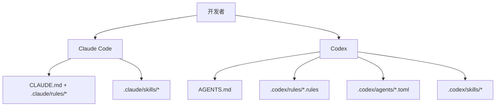

### Claude Code 层

- 持久上下文：
  - [`CLAUDE.md`](./CLAUDE.md)
- 路径作用域规则：
  - [`.claude/rules/backend-node.md`](./.claude/rules/backend-node.md)
  - [`.claude/rules/frontend-react.md`](./.claude/rules/frontend-react.md)
  - [`.claude/rules/mcp-typescript.md`](./.claude/rules/mcp-typescript.md)
  - [`.claude/rules/docs-markdown.md`](./.claude/rules/docs-markdown.md)
  - [`.claude/rules/file-headers.md`](./.claude/rules/file-headers.md)
  - [`.claude/rules/wiki-i18n.md`](./.claude/rules/wiki-i18n.md)
  - [`.claude/rules/i18n-parity.md`](./.claude/rules/i18n-parity.md)
- 技能：
  - `repo-onboarding`
  - `ship-feature`
  - `version-release`
  - `mcp-operations`
  - `debug-live-issue`
  - `update-project-docs`
  - `file-headers`
  - `push-to-forked-pr`
  - `i18n-parity`
- 子 Agent：
  - `backend-reviewer`
  - `frontend-reviewer`
  - `mcp-reviewer`

### Codex 层

- 持久上下文：
  - [`AGENTS.md`](./AGENTS.md)
- 执行策略：
  - [`.codex/rules/default.rules`](./.codex/rules/default.rules)
- 自定义子 Agent 模板：
  - [`.codex/agents/`](./.codex/agents)
- 技能：
  - [`.codex/skills/`](./.codex/skills)
- 设置：
  - [`.codex/README.md`](./.codex/README.md)

---

## MCP 集成

本项目在 `mcp/` 目录下包含一个本地生产级 MCP 服务器，将 Dashboard 操作暴露为 AI Agent 的工具。支持三种传输模式以适应不同的集成场景。

### MCP 传输模式

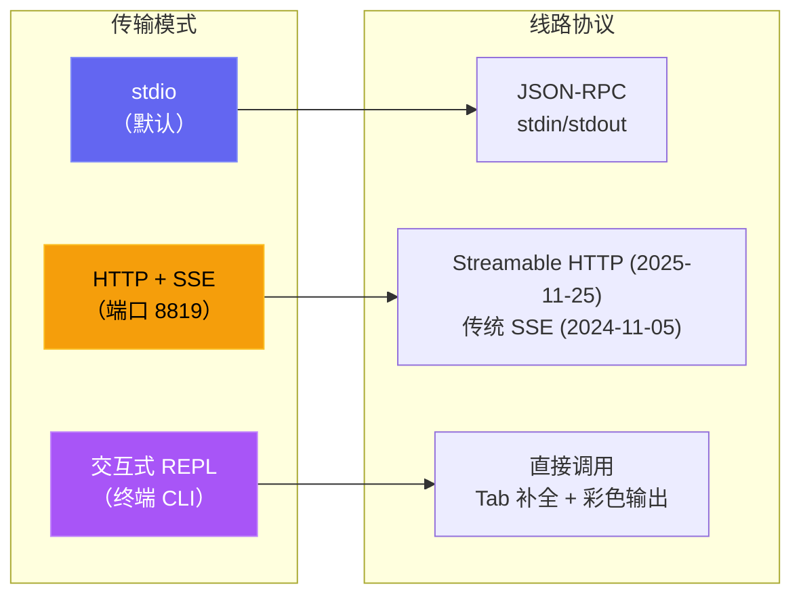

| 模式 | 命令 | 使用场景 |
| --- | --- | --- |
| **stdio** | `npm run mcp:start` | Claude Code、Claude Desktop、IDE MCP 宿主 |
| **HTTP** | `npm run mcp:start:http` | 远程 MCP 客户端、Web 集成、多会话 |
| **REPL** | `npm run mcp:start:repl` | 运维调试、手动工具调用、本地管理 |

<p align="center">
  <a href="images/mcp.png"></a>
</p>

### MCP 架构

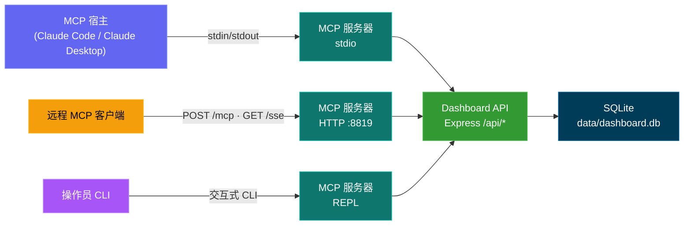

### MCP 工具全景

```mermaid
graph TD
    ROOT["MCP 工具"]
    OBS["可观测性<br/>health, stats, analytics,<br/>system info, export, snapshot"]
    SES["会话<br/>list/get/create/update"]
    AGT["Agent<br/>list/get/create/update"]
    EVT["事件和 Hook<br/>list events, ingest hook events"]
    PRC["定价和成本<br/>规则 CRUD, 总成本/会话成本, 重置默认"]
    MNT["维护<br/>cleanup, reimport, reinstall hooks, clear-all（受保护）"]
    WFL["工作流<br/>统计、运行、下钻、编排"]
    ALT["告警<br/>规则与触发记录"]
    WHK["Webhook<br/>提供方、目标与投递"]
    IMP["导入<br/>指南、扫描、上传、恢复"]
    CFG["配置<br/>Claude/Codex 文件与备份"]
    RUN["Run<br/>模型、目录、启动与控制"]
    SET["设置<br/>更新、Home 与 Hook"]
    DET["会话详情<br/>Transcript、图片与工作流"]
    PSH["推送<br/>订阅、取消与发送"]

    ROOT --> OBS
    ROOT --> SES
    ROOT --> AGT
    ROOT --> EVT
    ROOT --> PRC
    ROOT --> MNT
    ROOT --> WFL
    ROOT --> ALT
    ROOT --> WHK
    ROOT --> IMP
    ROOT --> CFG
    ROOT --> RUN
    ROOT --> SET
    ROOT --> DET
    ROOT --> PSH
```

### MCP 安全模型

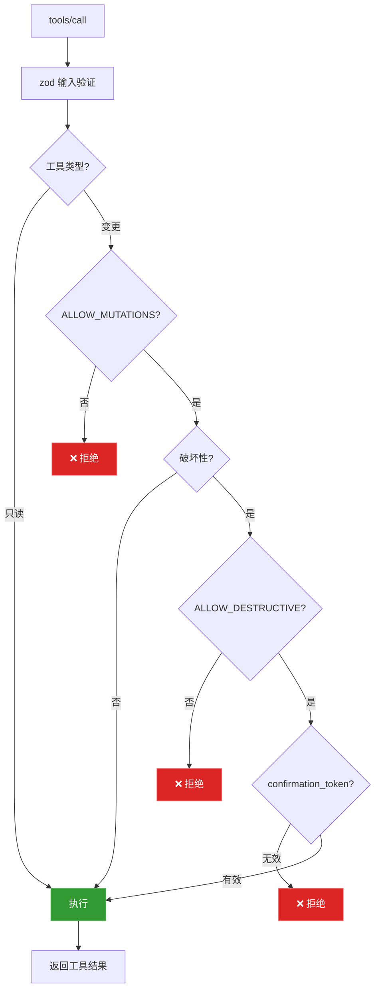

### MCP 运行模式

- 只读模式（默认）：`MCP_DASHBOARD_ALLOW_MUTATIONS=false`
- 管理模式：`MCP_DASHBOARD_ALLOW_MUTATIONS=true`
- 认证：`MCP_DASHBOARD_API_TOKEN` / `_FILE` 应与 Dashboard token 一致；`MCP_HTTP_AUTH_TOKEN` / `_FILE` 保护 HTTP/SSE client
- 传输防护：直接回环 HTTP 可携带 Token；容器主机别名必须使用 HTTPS；所有重定向都会被拒绝
- 负载防护：历史上传单文件 50 MiB、每次调用合计 100 MiB、二进制响应 10 MiB、备份恢复 25 MiB
- 破坏性模式：需要同时满足：
  - `MCP_DASHBOARD_ALLOW_MUTATIONS=true`
  - `MCP_DASHBOARD_ALLOW_DESTRUCTIVE=true`
  - 工具输入 `confirmation_token: "CLEAR_ALL_DATA"`

完整详情：[mcp/README.md](./mcp/README.md)

---

## API 参考

所有端点返回 JSON。错误响应遵循格式 `{ error: { code, message } }`。

### OpenAPI / Swagger

| 方法 | 路径 | 描述 |
| ------ | ------------------- | ----------------------------------- |
| `GET` | `/api/openapi.json` | 原始 OpenAPI 3.0 规范 |
| `GET` | `/api/docs` | 交互式 Swagger UI 文档 |
| `GET` | `/api/redoc` | ReDoc 参考文档（针对阅读优化的三栏式 API 文档）。**自托管**：捆绑包从本地 `/api/redoc/redoc.standalone.js` 提供，不依赖 CDN，可离线使用 |
| `GET` | `/api/redoc/redoc.standalone.js` | 自托管 ReDoc Bundle，由后端本地提供，无需 CDN 即可离线使用 |

OpenAPI 文档由 `server/openapi.js` 生成，Swagger UI 由后端直接提供。

仓库根目录还提交了一份 `openapi.yaml`，它镜像实时规范，并通过 `npm run openapi:yaml` 重新生成（唯一可信来源为 `server/openapi.js`，切勿手动编辑）。

API 文档现已**全面覆盖**：每个后端路由都有文档说明（共 82 个路径条目），包含参数、Schema、字段描述与示例；新增文档的路由组包括 `/api/push`、`/api/cc-config`、`/api/run`、`/api/workflows/runs`、`/api/sessions/facets` 与 `/api/settings/claude-home`。

<p align="center">
  <a href="images/swagger.png"></a>
</p>

<p align="center">
  <a href="images/redoc.png"></a>
</p>

### 健康检查

| 方法 | 路径 | 描述 |
| ------ | ------------- | ------------------------------------- |
| `GET` | `/api/health` | 返回 `{ status: "ok", timestamp }` |

### 会话

| 方法    | 路径                            | 查询参数                                                         | 描述                                                                                              |
| ------- | ------------------------------- | ---------------------------------------------------------------- | ------------------------------------------------------------------------------------------------- |
| `GET`   | `/api/sessions`                 | `status`、`q`、`limit`、`offset`                                 | 列出会话（含 Agent 计数与每会话费用）。`q` 对 `id` / `name` / `cwd` 做不区分大小写搜索；`limit` 默认 50，最大 10000；响应包含 `total` 字段供分页器使用 |
| `GET`   | `/api/sessions/:id`             | --                                                               | 会话详情（含 Agent 和事件）                                                                       |
| `GET`   | `/api/sessions/:id/stats`       | --                                                               | 会话详情概览面板使用的聚合计数：事件总数、按类型分类的事件、Top 工具用量、错误数、按类型/状态的 Agent 数、子 Agent 类型分布、Token 总量、时间范围 |
| `GET`   | `/api/sessions/:id/transcripts` | --                                                               | 列出会话的可用 JSONL 转录文件（主 + 子 Agent + 压缩）                                              |
| `GET`   | `/api/sessions/:id/transcript`  | `agent_id`、`limit`、`offset`、`after`、`before`                 | 从指定转录文件流式读取消息，使用游标分页                                                          |
| `POST`  | `/api/sessions`                 | --                                                               | 创建会话（基于 `id` 幂等）                                                                        |
| `PATCH` | `/api/sessions/:id`             | --                                                               | 更新会话状态/元数据                                                                               |

### Agent

| 方法 | 路径 | 查询参数 | 描述 |
| ------- | ----------------- | ----------------------------------------- | ----------------------------- |
| `GET` | `/api/agents` | `status`、`session_id`、`limit`、`offset` | 列出 Agent（支持筛选） |
| `GET` | `/api/agents/:id` | -- | 单个 Agent 详情 |
| `POST` | `/api/agents` | -- | 创建 Agent |
| `PATCH` | `/api/agents/:id` | -- | 更新 Agent 状态/任务/工具 |

### 事件

| 方法 | 路径 | 查询参数 | 描述 |
| ------ | ------------- | ------------------------------- | -------------------------- |
| `GET` | `/api/events` | `session_id`、`limit`、`offset` | 列出事件（最新优先） |

### 统计

| 方法 | 路径 | 描述 |
| ------ | ------------ | ------------------------------------------------------ |
| `GET` | `/api/stats` | 聚合计数、状态分布、WS 连接数 |

### 分析

| 方法 | 路径 | 描述 |
| ------ | ---------------- | ---------------------------------------------------------- |
| `GET` | `/api/analytics` | 用于图表和趋势视图的 Token / 工具 / 会话聚合数据 |

### 远程数据源

| 方法 | 路径 | 描述 |
| -------- | -------------------------------- | ---------------------------- |
| `GET`    | `/api/remote-sources`            | 列出已配置的远程数据源 |
| `POST`   | `/api/remote-sources`            | 添加新的远程源 |
| `PATCH`  | `/api/remote-sources/:id`        | 更新某个远程源 |
| `DELETE` | `/api/remote-sources/:id`        | 删除某个远程源 |
| `POST`   | `/api/remote-sources/:id/test`   | 测试到该源的 SSH 连接 |
| `POST`   | `/api/remote-sources/:id/sync`   | 立即触发该源的 `scp` + 导入 |

### Hook

| 方法 | 路径 | 描述 |
| ------ | ------------------ | -------------------------------------------- |
| `POST` | `/api/hooks/event` | 接收并处理 Claude Code Hook 事件 |
| `POST` | `/api/hooks/ingest-batch` | 由处于漫游/NAT 后方的机器推送一批会话数据（默认禁用；参见下文的 `REMOTE_PUSH_TOKEN` 以及 `server/README.md` 中完整的载荷结构） |

**Hook 事件载荷：**

```json
{
  "hook_type": "PreToolUse",
  "data": {
    "session_id": "abc-123",
    "tool_name": "Bash",
    "tool_input": { "command": "ls -la" }
  }
}
```

### 定价

| 方法 | 路径 | 描述 |
| -------- | ------------------------ | ---------------------------------------- |
| `GET` | `/api/pricing` | 列出所有定价规则 |
| `PUT` | `/api/pricing` | 创建或更新定价规则 |
| `DELETE` | `/api/pricing/:pattern` | 删除定价规则 |
| `GET` | `/api/pricing/cost` | 所有会话的总成本 |
| `GET` | `/api/pricing/cost/:id` | 指定会话的成本明细 |

### 工作流

| 方法 | 路径 | 描述 |
| ------ | ----------------------------- | ------------------------------------------------------- |
| `GET` | `/api/workflows` | 按 Provider/来源限定的工作流数据（编排、已记录工具、模式、Codex 压缩）。可选的 `?status=active\|completed`、`?sources=...` 和 `?providers=claude\|codex` 筛选器适用于全部 11 个数据区域 |
| `GET` | `/api/workflows/session/:id` | 按 provider/source 的单会话 drill-in（agent 树、已记录工具时间线、事件） |

### 告警

| 方法 | 路径 | 描述 |
| --- | --- | --- |
| `GET` | `/api/alerts` | 已触发告警流，最新优先（`?unacked=true`、`limit`、`offset`） |
| `POST` | `/api/alerts/:id/ack` | 确认一条告警 |
| `POST` | `/api/alerts/ack-all` | 确认所有未确认告警 |
| `GET` | `/api/alerts/rules` | 列出告警规则 |
| `POST` | `/api/alerts/rules` | 创建规则（`event_pattern` \| `inactivity` \| `status_duration` \| `token_threshold`） |
| `PATCH` | `/api/alerts/rules/:id` | 更新名称 / 配置 / 启用状态 / 冷却时间，规则类型不可变 |
| `DELETE` | `/api/alerts/rules/:id` | 删除规则及其已触发告警历史 |

### Webhook

| 方法 | 路径 | 描述 |
| --- | --- | --- |
| `GET` | `/api/webhooks/providers` | 支持的 Provider 及其配置字段，用于驱动 UI 表单 |
| `GET` | `/api/webhooks` | 列出 Webhook 目标，URL 和 Secret 均脱敏 |
| `POST` | `/api/webhooks` | 创建目标，支持 14 个一等 Provider 和 `generic` |
| `PATCH` | `/api/webhooks/:id` | 更新名称 / URL / 启用状态 / Secret / Header / 规则范围，类型不可变 |
| `DELETE` | `/api/webhooks/:id` | 删除目标及其投递日志 |
| `POST` | `/api/webhooks/:id/test` | 发送合成测试告警并报告投递结果 |
| `GET` | `/api/webhooks/:id/deliveries` | 目标的最近投递日志（`limit`、`offset`） |

托管 Provider 必须使用 HTTPS。`generic` 和 `n8n` 可为本地或自托管接收端使用 HTTP。投递拒绝重定向，因此凭据、自定义 Header 和 HMAC 签名绝不会转发到第二个 URL。

### 设置

| 方法 | 路径 | 描述 |
| ------ | ------------------------------ | ------------------------------------------------ |
| `GET` | `/api/settings/info` | 系统信息、数据库统计、Hook 状态 |
| `POST` | `/api/settings/clear-data` | 删除所有会话、Agent、事件、Token 用量 |
| `POST` | `/api/settings/reimport` | 从 `~/.claude/` 重新导入旧会话 |
| `POST` | `/api/settings/reinstall-hooks` | 重新安装 Claude Code Hook |
| `POST` | `/api/settings/reset-pricing` | 将 Claude、Codex 或两者的定价重置为默认值 |
| `GET` | `/api/settings/export` | 以 JSON 下载方式导出所有数据 |
| `POST` | `/api/settings/import` | 从 `/export` 恢复一个不超过 25 MiB 的导出包（multipart `file` 或 JSON `{ path }`）。幂等且非破坏性——已存在的会话会被整体跳过 |
| `POST` | `/api/settings/cleanup` | 废弃过期会话、清除旧数据（及被清除会话的快照） |
| `GET`  | `/api/settings/snapshots`      | 各提供方的对话记录快照占用 + 保留策略 |
| `POST` | `/api/settings/snapshots/compress` | 无损压缩原始对话记录已不存在的快照 |
| `POST` | `/api/settings/snapshots/prune` | 规划（默认试运行）或执行快照清理；执行需要 `confirm: "PRUNE_SNAPSHOTS"` |

### Claude Config Explorer（`/api/cc-config`）

只读检查全部 Claude Code 配置界面，并为低风险文本文件提供严格受限的修改能力。文件读取会规范化请求路径和允许的根目录，使符号链接无法逃离可信的 Claude 目录。所有写入路径都会在变更前将带时间戳的备份保存到 `<root>/cc-config-backups/<type>/`。

| 方法 | 路径 | 描述 |
| --- | --- | --- |
| `GET` | `/api/cc-config/overview` | 根目录（Claude Home、项目 `.claude`、项目根目录、`~/.claude.json`）及各界面的数量 |
| `GET` | `/api/cc-config/skills` | `<scope>/.claude/skills/<name>/SKILL.md` 中的技能及解析后的 Frontmatter；`?scope=user\|project\|all` |
| `GET` | `/api/cc-config/agents` | `<scope>/.claude/agents/*.md` 中的 Subagent |
| `GET` | `/api/cc-config/commands` | `<scope>/.claude/commands/*.md` 中的斜杠命令 |
| `GET` | `/api/cc-config/output-styles` | `<scope>/.claude/output-styles/*.md` 中的输出样式 |
| `GET` | `/api/cc-config/plugins` | 来自 `~/.claude/plugins/installed_plugins.json` 的已安装插件，与 Settings 中的 `enabledPlugins` 关联；每项包含 `contributes` 数量和 `plugin.json` 元数据 |
| `GET` | `/api/cc-config/marketplaces` | 来自 `known_marketplaces.json` 的已注册市场，并补充各市场 `marketplace.json` 中的插件数、所有者和说明 |
| `GET` | `/api/cc-config/mcp` | 来自 `~/.claude.json` 顶层/每项目配置和 `settings.json` 的 MCP Server |
| `GET` | `/api/cc-config/hooks` | 聚合用户、项目和项目本地 `settings.json` 文件中的 Hook |
| `GET` | `/api/cc-config/hook-scripts` | `~/.claude/hooks/` 中由 `hooks.<event>.command` 引用的辅助脚本 |
| `GET` | `/api/cc-config/keybindings` | 将 `~/.claude/keybindings.json` 解析为按上下文分组的按键/操作对 |
| `PUT` | `/api/cc-config/keybindings` | 使用 `{ groups: [{ context, bindings: [{ key, action }] }] }` 覆盖 `keybindings.json`。先备份，保留顶层元数据（`$schema`/`$docs`），拒绝重复上下文或按键 |
| `GET` | `/api/cc-config/statusline` | `settings.json.statusLine` 配置，以及存在时的实际 `statusline.py` / `statusline-command.sh` 内容 |
| `GET` | `/api/cc-config/settings` | 用户、项目和项目本地 Settings JSON，其中匹配 `/token\|secret\|password\|api[_-]?key\|auth/i` 的类 Secret 键会替换为 `"<redacted>"` |
| `GET` | `/api/cc-config/memory` | 用户与项目范围的 `CLAUDE.md`，以及 `~/.claude/projects/<slug>/memory/` 下每个 `*.md` 的项目文件型 Memory；通过 `PUT`/`DELETE /api/cc-config/file` 修改 `scope: "auto-memory"` 项 |
| `GET` | `/api/cc-config/file?path=…` | 单个文件的正文，路径限制在 `CLAUDE_HOME`、项目 `.claude` 或项目 `CLAUDE.md` 内 |
| `GET` | `/api/cc-config/backups` | 列出全部带时间戳的备份，可用 `?scope=&type=` 筛选 |
| `PUT` | `/api/cc-config/file` | 创建或覆盖文本文件。Body：`{ scope, type, name?, content }`。文件存在时自动备份，采用原子临时文件 + 重命名，内容上限 256 KB，并严格校验 `name` |
| `DELETE` | `/api/cc-config/file` | 备份后删除文本文件；删除 Skill 目录前会整体备份，保留捆绑资源 |

### Prometheus 指标与 Grafana

`GET /api/metrics` 以 Prometheus 文本格式暴露会话和 Agent 状态、事件、Token、实时客户端、远程数据源、进程运行时间与内存，以及构建版本。[`monitoring/`](./monitoring/README.md) 提供 Prometheus 和四个自动配置的 Grafana Dashboard，默认页面为 **CCAM · Overview**。

```bash
# 原生 Dashboard 和监控
npm start
npm run monitoring:install       # 一次性二进制设置
npm run monitoring:up            # Grafana on :3000

# 容器
npm run docker:up                 # 仅 Dashboard
npm run docker:full:up            # Dashboard + Prometheus + Grafana

# 混合原生/容器设置
DASHBOARD_ALLOWED_HOSTS=host.docker.internal npm start
npm run monitoring:docker:up
npm run monitoring:verify
```

<p align="center">
  <a href="images/grafana.png"></a>
  <br>
  <em>📊 <strong>Grafana · CCAM Overview</strong> · 来自实时 <code>/api/metrics</code> 抓取的 Agent 总体状态、数据库总量、分类与速率</em>
</p>

<p align="center">
  <a href="images/prometheus-console.png"></a>
  <br>
  <em>🔥 <strong>Prometheus · CCAM 控制台</strong> · 抓取健康度、会话、事件、Token 和 Graph 下钻链接</em>
</p>

<p align="center">
  <a href="images/prometheus-query.png"></a>
  <br>
  <em>📈 <strong>Prometheus · Graph</strong> · 对已抓取的 CCAM 指标运行 PromQL 查询</em>
</p>

指标名称、认证和抓取配置见 [docs/API.md → Metrics](./docs/API.md#metrics)。

### Run Claude（`/api/run`）

用于从 Dashboard 启动和监管 `claude` 子进程的 HTTP 界面。每条路由都受同源保护，浏览器请求必须来自 localhost Origin；无 Origin 的 CLI/curl 请求可以通过。提供的 `cwd` 必须是已存在的绝对目录，并使用 `realpath` 规范化。它可位于仓库之外，因此 Run Agent 能从用户主目录或任意最近项目启动。

| 方法 | 路径 | 描述 |
| --- | --- | --- |
| `GET` | `/api/run` | 列出所有内存运行句柄，包括正在运行和最近完成的句柄，并返回 `maxConcurrent` 和 `activeCount` |
| `GET` | `/api/run/binary` | 检查 `claude` 是否在 `PATH` 中及其位置，供 UI 在启动前显示明确错误 |
| `GET` | `/api/run/cwds` | 建议工作目录，包括 Dashboard Server cwd、`$HOME` 和 Sessions 表中的最近 cwd |
| `GET` | `/api/run/files?cwd=…&q=…` | 在 `cwd` 内模糊搜索 Run 页面 `@` 文件自动补全。跳过 `node_modules`、`.git`、`dist`、`build`、`.next`、`.cache`、`coverage` 等目录；结果有上限并按文件名匹配排序 |
| `POST` | `/api/run` | 启动新运行。Body：`{ prompt, mode: "headless"\|"conversation", cwd?, model?, permissionMode?, resumeSessionId?, effort? }`。Headless 通过 `-p` 将提示放入 argv 并关闭 stdin；Conversation 通过 stream-json Envelope 写入 stdin 并保持打开。`resumeSessionId` 仅用于 Conversation，添加 `--resume <id>`；设置后 `prompt` 可为空。`effort`（`low` / `medium` / `high`）映射到 `--effort`。始终传入 `--output-format stream-json --verbose --include-partial-messages`。并发默认安全上限为 10000，可用 `RUN_MAX_CONCURRENT` 覆盖 |
| `GET` | `/api/run/:id` | 当前句柄状态；`?envelopes=1` 包含内存 Envelope 日志，供 UI 重新连接时回放 |
| `POST` | `/api/run/:id/message` | 向运行中的 Conversation 发送后续回合。Body：`{ text }` |
| `DELETE` | `/api/run/:id` | 停止运行。先发送 SIGTERM，5 s 后升级为 SIGKILL |

输出通过现有 Dashboard WebSocket 发送三种消息：`run_stream`、`run_status` 和 `run_input_ack`。Config Explorer 还订阅 `server/lib/cc-watcher.js` 和成功 PUT/DELETE 后的 `cc_config_changed`。Sessions 列表和 Session Detail 页面轮询 `/api/run` 并监听 `run_status`，为正在进行的 Run 显示可点击的 **▶ Run** 标记并链接回 `/run`。

### 导入历史（Import History）

**Settings → Import History** 通过 Provider 专用文件夹扫描或上传，从 `~/.claude/projects` 导入 Claude Code Transcript，从 `~/.codex/sessions` 导入 Codex rollout。两者都复用实时摄取逻辑，保留 Token、成本、工具、压缩基线、生命周期和原生 Codex 标题，并保持幂等。上传的 Codex 历史会复制到 Dashboard 存储中，使源文件清理后对话仍可用。

**Restore backup** 接受由 UI、`ccam export` 或 `GET /api/settings/export` 导出的 Dashboard `.json`。`POST /api/settings/import` 和 `ccam import-data <file>` 会恢复所有表而不覆盖现有会话，可安全合并多台机器的数据。

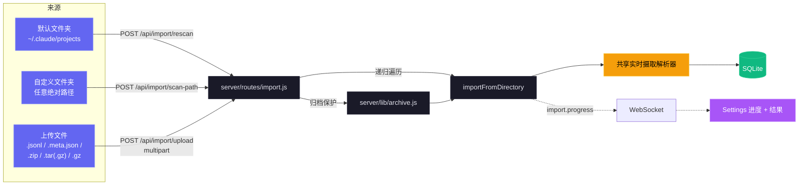

| 方法 | 路径 | 用途 |
| --- | --- | --- |
| `GET` | `/api/import/guide` | 通过 `?provider=claude\|codex` 返回 Provider 感知的路径、归档命令、扩展名和说明。 |
| `POST` | `/api/import/rescan` | 从 `{ provider }` 重新扫描所选默认根目录。 |
| `POST` | `/api/import/scan-path` | 递归扫描绝对 `{ path, provider }`。 |
| `POST` | `/api/import/upload` | 使用 `provider` 上传支持的文件或归档。 |

- **输入：** 支持嵌套布局中的独立 `.jsonl`、`.meta.json`、`.zip`、`.tar`、`.tar.gz`/`.tgz` 和 `.gz` 文件。Claude 支持两种规范 Subagent 布局；Codex 识别递归的 `rollout-*.jsonl` 或包含 `session_meta` 的 JSONL，并可选读取 `session_index.jsonl` 标题。
- **准确性：** UUID 和事件高水位去重可防止重复计数。压缩基线保留早期 Token；之后的活动会推进 `ended_at` 并刷新消息元数据。
- **大文件：** 共享的 4 MiB 分块逐行解析可处理超过 V8 约 512 MiB 字符串上限的 Transcript。可增长数组上限为 `TRANSCRIPT_CACHE_MAX_ARRAY_LEN`，默认 `1000`，解析期间在两倍上限时裁剪。
- **安全：** 解压拒绝绝对路径和 `..` 路径。默认限制解压后数据为 4 GB、每次上传为 1 GB、每个请求为 2000 个文件；每个请求的暂存内容总会被回收。
- **进度：** 节流的 `import.progress` WebSocket 阶段包括 `start`、`scan`、`extract`、`parse`、`complete` 和 `error`。UI 提供拖放指引，以及 imported、enriched、skipped 和 error 总计。
### WebSocket

连接 `ws://localhost:4820/ws` 接收实时推送消息：

```json
{
  "type": "agent_updated",
  "data": { "id": "...", "status": "working", "current_tool": "Edit" },
  "timestamp": "2026-03-05T15:43:01.800Z"
}
```

**消息类型：** `session_created`、`session_updated`、`agent_created`、`agent_updated`、`new_event`、`remote_source.status`

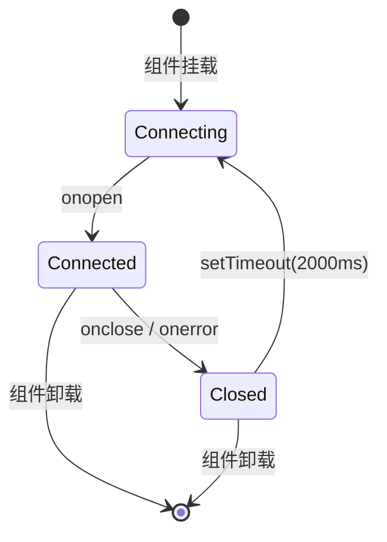

---

## Hook 事件

Dashboard 处理以下 Claude Code Hook 类型：

| Hook 类型 | 触发时机 | Dashboard 操作 |
| -------------- | ------------------------------ | -------------------------------------------------------------------------------------------- |
| `SessionStart` | Claude Code 会话开始 | 创建会话和主 Agent。盖上 `awaiting_input_since`(附带 `awaiting_reason=session_start`),使新会话立即落入**等待中**——但 `compact` 来源的 SessionStart(回合中自动压缩)不改动标志,使正在工作的会话保持**活动**。重新激活恢复的会话。废弃无活动超过 `DASHBOARD_STALE_MINUTES`(默认 180)的孤立会话 |
| `UserPromptSubmit` | 用户在提示符前按下回车 | 清除等待标志并将主 Agent 提升为 `working` — 文本响应回合开始的唯一可靠信号,因为它们不发出 `PreToolUse` |
| `PreToolUse` | Agent 开始使用工具 | 清除等待标志,设置 Agent 为 `working`,设置 `current_tool`。如果工具是 `Agent`,创建子 Agent 记录 |
| `PostToolUse` | 工具执行完成 | 清除等待标志(用于处理用户在工具运行期间批准权限提示的场景)。清除 `current_tool`。Agent 保持 `working` |
| `Stop` | Claude 完成响应 | 非错误：主 Agent → `waiting` — Claude 完成本回合，主动权交给用户。`stop_reason=error`：将 Agent 和会话标记为 `error`。后台子 Agent 继续运行 |
| `SubagentStop` | 后台 Agent 完成 | 通过描述、类型或任务匹配并完成子 Agent。故意不清除等待标志 — 子 Agent 完成不能说明用户是否已响应。**触发 fire-and-forget 的 JSONL 扫描**(`scanAndImportSubagents`),在子 Agent 自己的 `agent_id` 下为每个 tool 发出 `PreToolUse` + `PostToolUse` 事件,使 Timeline 显示子 Agent 运行的所有 tool,而不仅仅是 spawn 标记 |
| `Notification` | Agent 通知 | 记录事件。权限/输入提示消息将 Agent 设为 `waiting` 并盖上 `awaiting_input_since`（附带 `awaiting_reason=notification`，按模式匹配：`permission`、`waiting for input`、`needs your approval` 等）。压缩通知标记为 `Compaction` 事件。如果启用,触发浏览器通知 |
| `SessionEnd` | Claude Code CLI 进程退出 | 清除等待标志。如果会话已处于 `error` 状态，则保留错误状态；否则将所有 Agent 和会话标记为 `completed` |
| `Compaction` | JSONL 中检测到 `/compact` | 创建压缩子 Agent（类型 `compaction`）和 Compaction 事件。通过 Transcript JSONL 中的 `isCompactSummary` 条目检测。也可由周期性扫描器对活跃会话检测 |
| `APIError` | JSONL Transcript 中的 API 错误 | 从 `isApiErrorMessage` 条目（配额、速率限制、invalid_request）和原始 `type: "error"` 响应中提取。**立即将会话和 Agent 标记为 `error`** — 之前仅记录事件而不更改状态。存储为包含错误详情的事件 |
| `RemoteToolEvent` | 由远程机器推送的工具调用 | 由 `POST /api/hooks/ingest-batch` 为推送的每一项 `tool_events[]` 写入。按 `(session_id, event_type, uuid)` 针对已提交行以及同一批次内部去重，因此重发批次是安全的 |
| `RemoteTurn` | 由远程机器推送的回合时长 | 由 `POST /api/hooks/ingest-batch` 为每一项 `turns[]` 写入，携带该回合的 `duration_ms`。去重方式与 `RemoteToolEvent` 相同 |
| `Interrupted` | 用户取消的回合（Esc） | 由看门狗合成 —— `Esc` 不触发任何 Hook，因此从 Transcript 的 `[Request interrupted by user]` 标记，或当 Esc 发生在任何输出之前时从空闲工作超时（`DASHBOARD_WORKING_IDLE_SECONDS`）检测出卡住的 `working` 会话。会话转入**等待中**（与正常 `Stop` 相同） |
| `TurnDuration` | JSONL Transcript 中的回合计时 | 从 `system` 子类型 `turn_duration` 消息中提取，含 `durationMs`。存储为回合级计时分析事件 |
| `ToolError` | JSONL 中的工具结果错误 | 从 `toolUseResult.is_error` 条目中提取。追踪工具级失败用于错误传播分析 |

---

## 浏览器通知

Dashboard 支持通过 Web Push (VAPID) 实现持久化浏览器通知。即使 Dashboard 标签页未聚焦或浏览器处于后台，也能提供实时警报。

### 工作原理

1. **启用** — 在设置页面通过主开关启用通知
2. **授权** — 在浏览器提示时授予权限 — 这将注册一个 Service Worker 并创建一个推送订阅
3. **配置** — 选择哪些事件触发通知：

| 事件 | 默认 | 描述 |
| ---------------------------- | ------- | --------------------------------------------------------------- |
| 新会话开始 | 开 | 新 Claude Code 会话创建时触发 |
| Claude 完成响应 | 关 | Claude 完成响应回合时 `Stop` 事件触发 |
| 会话关闭 | 关 | CLI 进程退出时 `SessionEnd` 触发 |
| 会话错误 | 开 | 会话以错误结束时触发 |
| 子 Agent 生成 | 关 | 后台子 Agent 创建时触发 |

此外，来自 Claude Code 的任何 `Notification` Hook 事件都会触发浏览器通知（只要主开关启用），不受按事件开关影响。

### 通知架构

- **VAPID 管道：** 服务端使用 `web-push` 进行安全消息传递。VAPID 密钥自动生成并存储在 `data/vapid-keys.json`。
- **Service Worker：** 专用 Worker (`client/public/sw.js`) 处理传入的 `push` 事件，并以 `silent: false` 显示通知，以确保在 macOS 上播放音效。
- **订阅：** 浏览器特定的端点存储在 SQLite 的 `push_subscriptions` 表中。
- **持久性：** 由于 Service Worker 在后台运行，即使浏览器已关闭，通知仍能送达。
- **测试通知：** 设置页面中的按钮可让你验证 VAPID 管道和音效播放。

### PWA 与离线支持

Dashboard、Landing Page 和 Wiki 是三个独立的可安装 PWA，各自拥有 Manifest 和 Service Worker。

| 界面 | Manifest | Service Worker | 缓存策略 |
| --- | --- | --- | --- |
| Dashboard（`client/`） | `client/public/manifest.json` | `client/public/sw.js` | 不可变的 `/assets/*` 使用 cache-first；导航、Worker、Manifest、图标和 `/` 使用 network-first 并提供回退。`/api/*`、`/ws` 和 Vite HMR 从不缓存，Push Handler 保持活动。Express 为资源发送一年期 immutable Header，为 Shell 文件发送重新验证 Header。升级时 `controllerchange` 只重新加载一次，首次安装不会。 |
| Landing Page（根目录） | `manifest.json` | `sw.js` | 预缓存 Shell、Favicon 和 OG 图片。截图首次查看时缓存；导航使用 network-first 并提供离线回退。 |
| Wiki（`wiki/`） | `wiki/manifest.json` | `wiki/sw.js` | 预缓存 HTML、CSS、JS、Manifest 和 Favicon。HTML 保持 network-first；CSS 和 JS 使用 cache-first，访问一次后即可离线使用。 |

所有 Worker 都调用 `skipWaiting()`，在激活时删除带版本号的旧缓存，并在缓存版本变化后干净刷新。每个 HTML 文件都包含 iOS 独立运行元数据；Manifest 和 Apple Touch Icon 使用带 `sizes="any"` 的 `favicon.svg`。

---

## 更新提醒

Dashboard 会监视自身的 git 检出，当规范默认分支领先于 HEAD 时弹出模态框。**支持分支与 fork：** 若配置了 `upstream` 远程（fork 的常规约定），则优先于 `origin`；所选远程的 `master`/`main`/`HEAD` 即为对比引用。`manual_command` 会根据用户处境调整——只有在本地分支真正跟踪规范引用时才用 `git pull --ff-only`，否则用 `git fetch`（fork 场景再加上 fast-forward 合并），命令永不撒谎。用户得到的是要在终端里执行的确切命令——服务端**永远不会**自动拉取或重启自己，这样机制在开发会话、pm2/systemd/launchd/Docker 等进程管理以及远程部署中都保持可移植性。

<p align="center">
  <a href="images/update.png"></a>
</p>

### 工作原理

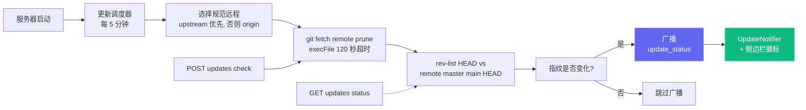

单次检查开销很小（针对所选规范远程的 `git fetch <remote> --prune`——若配置了 `upstream` 则优先使用，否则用 `origin`），使用 `execFile`（不经 shell）封装并设有 120 秒超时。各种失败场景——离线、非 git 安装、未配置远程、无法解析上游引用——都会返回**软失败载荷**（例如 `fetch_error: "..."`）而非抛错，因此不稳定的远程永远不会阻塞 Dashboard。

### UI 入口

| 位置 | 行为 |
| --- | --- |
| **模态框**（`client/src/components/UpdateNotifier.tsx`） | 遇到新的可用 `remote_sha` 时打开；显示落后的提交数、所跟踪的引用、可选的分支/fork 说明、准确命令，以及**复制命令**、**立即检查**和**关闭**。按 Escape 或点击背景可关闭。关闭状态按 `remote_sha` 存储在 `localStorage` 中，因此新的 SHA 会再次打开。 |
| **侧边栏按钮**（`client/src/components/Sidebar.tsx`） | 始终可见。绿色表示落后，琥珀色表示拉取失败。点击会清除关闭状态并调用 `POST /api/updates/check`。 |
| **服务器终端** | 状态从最新变为落后时打印带边框的命令，无头运行的用户也能看到。 |

### API 端点

| 端点 | 作用 |
| --- | --- |
| `GET /api/updates/status` | 只读检查：对规范远程运行 `git fetch`，比较 HEAD 与其默认分支，返回载荷。 |
| `POST /api/updates/check` | 相同的检查，但会同时通过 WebSocket 广播 `update_status`，让所有连接的客户端同步更新。 |

两个端点返回相同的载荷结构：

```json
{
  "git_repo": true,
  "update_available": true,
  "repo_root": "/Users/you/Claude-Code-Agent-Monitor",
  "remote_ref": "upstream/master",
  "canonical_remote": "upstream",
  "current_branch": "master",
  "tracking_upstream": "origin/master",
  "tracks_canonical": false,
  "situation": "fork_or_diverged_tracking",
  "local_sha": "abc1234...",
  "remote_sha": "def5678...",
  "commits_behind": 3,
  "manual_command": "cd \"/...\" && git fetch upstream && git merge --ff-only upstream/master && npm run setup",
  "situation_note": "You're on 'master' tracking 'origin/master'. This command fast-forwards your branch from upstream/master (the canonical default).",
  "message": "3 commit(s) on upstream/master not in your checkout."
}
```

`situation` 取值：`tracking_canonical`（典型克隆，本地分支跟踪规范引用——`git pull --ff-only` 即可）；`fork_or_diverged_tracking`（本地分支名与规范一致但跟踪了不同的远程，例如 fork——`git fetch <remote> && git merge --ff-only <ref>`）；`feature_branch`（不在规范默认分支上——只 fetch，由用户决定如何整合）；`detached_head`。

### 为何**没有**自动更新

这里没有 `POST /api/updates/apply`，也没有自重启脚本——这是有意为之。在没有外部进程管理的情况下让进程自我替换并不可靠：`npm run dev`（concurrently）、`npm start`、`pm2`、`systemd`、`launchd`、Docker 各自需要不同的重启逻辑，而 `git pull` / `npm install` 在一个即将退出的进程里失败时没有干净的回滚路径。只做检测能让行为在所有进程管理器、所有操作系统、所有分支状态下都保持可预测，同时仍然解决"什么时候需要拉取？"的信息缺口；实际的更新操作由用户在自己的 shell 中完成。

### 配置

| 环境变量 | 默认值 | 说明 |
| --- | --- | --- |
| `DASHBOARD_UPDATE_CHECK` | 启用 | 设为 `0` / `false` / `off` 可完全禁用调度器。 |
| `DASHBOARD_UPDATE_CHECK_INTERVAL_MS` | `300000`（5 分钟） | 两次自动检查的间隔。下限为 60 000 毫秒——低于此值会被钳制。 |

---

## Tabby — 浮动猫咪伴侣

**Tabby** 是一只固定在 Dashboard 每个页面右下角的可爱浮动猫咪伴侣。它始终存在，将实时会话流变成一眼可见、会做出反应且可以交谈的吉祥物。

<p align="center">
  <a href="images/tabby.png"></a>
</p>

### 会做出反应的吉祥物

Tabby 是一只眼睛跟随光标的 SVG 猫，会根据实时会话流呈现 **8 种情绪**，每种都有自己的动画：

| 情绪 | 出现场景 | 动画 |
| --- | --- | --- |
| `idle` | 没有值得关注的活动 | 休息时甩动尾巴 |
| `watching` | 会话处于活跃状态 | 竖起耳朵，眼睛跟随光标 |
| `happy` | 会话或 Run 顺利完成 | 点头并闪光 |
| `worried` | 出现异常迹象 | 轻微摇晃 |
| `stuck` | 会话似乎受阻 | 告警 `!` |
| `thinking` | Agent 正在工作 | 缓慢点头 |
| `sleeping` | 一段时间没有活动 | `zzz` |
| `disconnected` | WebSocket 断开 | 平静的静止姿态 |

### 气泡台词

Tabby 会在重要事件发生时自动显示简短台词，包括会话开始/结束、错误和 Run 完成。气泡会**节流和合并**，因此突发事件不会刷屏；它们通过 `aria-live` 支持屏幕阅读器，也可在面板中**静音**。

### 面板

点击猫咪或按 **⌘B / Ctrl+B** 打开面板，Esc 可关闭。面板显示：

- 实时**状态行**，格式为 `N live · M errored · connection state`。
- **快捷操作**，可跳转到 Run Claude、活动、会话或错误会话，也可静音气泡和清除提醒。
- **Ask** 提问框，详见下文。

### Ask 提问框 → Run Claude 移交

**Ask** 提问框会根据缓存数据在本地回答简单的状态问题，例如“正在运行什么”“是否有错误”或“状态”。其他问题会移交给现有的 **Run Claude** 页面，通过深层链接 `/run?prompt=…` 启动真正的 Claude Code 会话。Tabby 本身从不调用 LLM，只对快速状态查询之外的问题复用 Run Claude 页面。

### 无障碍与安全降级

Tabby 支持键盘操作，气泡使用 `aria-live`，并遵循 `prefers-reduced-motion`。WebSocket 断开时，它会安全降级为平静的 `disconnected` 状态，而不会报错。可在 **Settings** 中启用或禁用 Tabby，该设置已本地化为英语、中文、越南语、韩语和西班牙语。实现位于 `client/src/components/Tabby/`。

---

## 声音提示

Dashboard 为实时会话活动提供**轻柔的音频反馈**，即使放在副屏上，也能听到某次运行完成或失败。声音**默认开启**，可一键完全关闭。

### 零依赖合成

仓库中没有 `.mp3` 或 `.wav` 资源，`package.json` 中也没有音频库。每个提示音都在播放时由 **Web Audio API** 生成。短振荡器列表使用正弦波或三角波，每个都有独立的指数增益包络，再通过主增益节点和低通滤波器混合，使结果不会干扰工作。整个引擎位于 `client/src/lib/sound.ts`。

### 提示音一览

| 提示音 | 触发时机 | 听感 |
| --- | --- | --- |
| `sessionStart` | 出现新会话 | 上行纯五度（C5 → G5） |
| `sessionComplete` | 会话回复完成（`Stop`）或关闭（`SessionEnd`） | 大三和弦解决音（E5 → G5 → C6） |
| `sessionError` | 会话进入 `error` 状态 | 三角波上的轻柔下行小三度，能察觉但不刺耳 |
| `subagentSpawn` | Subagent 启动 | 单次短促拨弦 |
| `notification` | Claude Code 发出 `Notification` 事件 | 失谐音对，如同小铃铛 |
| `connected` / `disconnected` | Dashboard WebSocket 恢复或断开 | 双音上行 / 下行 |
| `click` | 按下按钮、链接、标签页或开关 | 几乎听不见的滴答声 |

所有提示音都位于 C 大调音集中，因此叠加的尾音不会不协和。每个包络都以指数衰减，而非硬切断，避免硬停时的爆音。

### 不打扰你的工作

三重保护让音频保持克制：

- **单个提示音冷却：** 同一提示音在约 350 ms 内不会重复，交互滴答声为 45 ms。
- **全局突发预算：** 任意 1.2 s 窗口内最多启动 4 个提示音，因此导入历史或断线重连不会把 WebSocket 消息洪流变成提示音洪流。
- **自动播放策略：** 按浏览器规则，在首次指针、按键或触摸交互前不播放任何声音。此前的提示音会被静默丢弃，而不是排队。

如果浏览器完全不支持 Web Audio，每次调用都是安全的空操作，Dashboard 只会保持静音。

### 设置

**Settings → Sound** 提供总开关、音量滑块和每种提示音的独立开关。开启某项时会立即播放对应提示音；**Preview Sound** 按钮可按需播放完成提示音。偏好保存在 `localStorage` 的 `agent-monitor-sound` 键中，并在整个应用内立即生效，无需重新加载。面板支持英语、中文、越南语、韩语和西班牙语。

默认开启会话开始、会话完成、会话错误、Claude Code 通知和交互滴答声；Subagent 启动与连接变化默认关闭，因为它们最频繁。实现位于 `client/src/lib/sound.ts` 和 `client/src/hooks/useSoundCues.ts`，并在 `client/src/App.tsx` 中挂载一次。

---

## 连接状态弹窗

点击侧边栏底部的 **Live** / **Disconnected** 标签，可打开一个关于 Dashboard WebSocket 传输的小型详情面板。它会显示当前的 `ws://` 端点、本次连接保持的时长、累计接收的事件数、以横向条形图展示的高频事件类型、最近 60 秒的吞吐量折线图，以及最近 8 个事件的活动列表。累计统计（总数、类型分布、最近列表）通过 `localStorage` 中的 `sidebar-connection-stats` 键持久化，可在刷新后保留；滚动折线图和"已连接时长"则有意保持临时性。底部的 **Reset** 按钮可一键清空所有数据。

<p align="center">
  <a href="images/live.png"></a>
</p>

---

## VS Code 扩展

**Claude Code Agent Monitor** 现已作为官方 VS Code 扩展提供，让你无需离开编辑器即可监控 AI Agent。

<p align="center">
  <a href="vscode-extension/vscode.png"></a>
</p>

### 🚀 核心功能
- **实时侧边栏**：专用的 Activity Bar 视图，实时显示 Agent 状态（工作中、等待中、已完成、错误）。
- **使用分析**：直接在侧边栏追踪总 Token 消耗、实时美元成本和事件计数。
- **状态栏集成**：底部状态栏显示活跃会话和 Agent 的实时脉搏。
- **深度导航**：一键访问特定的 Dashboard 页面（看板、分析、设置）或近期会话。
- **集成标签页**：作为原生 VS Code Webview 标签页打开完整的监控面板。

### 📦 安装与设置
1. 打开 [vscode-extension](./vscode-extension) 目录。
2. 从 Marketplace 安装或使用 `vsce package` 自行打包安装。
3. 确保本地 Dashboard 服务器正在运行（`npm run dev`）。
4. 点击 VS Code Activity Bar 中的 **雷达图标** 即可开始使用。

有关详细的开发人员配置，请参阅 [.vscode](./.vscode) 和 [vscode-extension](./vscode-extension) 目录。

> [!TIP]
> Extension on VS Code Marketplace: [Claude Code Agent Monitor](https://marketplace.visualstudio.com/items?itemName=hoangsonw.claude-code-agent-monitor)

---

## 桌面应用（macOS 与 Windows）

可选的 Electron 35 桌面应用通过 `desktop/` 工作区，将同一个 Dashboard 打包为 macOS `.dmg`、Windows NSIS 安装包或便携 `.exe`。

<p align="center">
  <a href="images/macos.png"></a>
  <br>
  <em>🍎🪟 <strong>桌面应用</strong> · 带菜单栏 / 通知区域（托盘）图标、登录时启动和单实例锁的原生外壳。同一个 Dashboard，运行在真正的操作系统窗口中，图示为 macOS。</em>
</p>

<p align="center">
  <a href="images/windows_app.png"></a>
  <br>
  <em>🪟 同一个 Dashboard 的原生 Windows 应用，带通知区域（托盘）图标、原生窗口菜单和登录时启动。</em>
</p>

它在 `localhost:4820` 提供的同一 UI 外层增加原生窗口、托盘、菜单、登录和关闭行为。

### 工作原理

桌面应用无需 `npm start`、打开的 Shell 或第二份服务器。Electron **主进程**在同一 Node Runtime 中直接 `require()` `server/index.js`，以**进程内**方式托管 Express Server，不使用子进程或 IPC，再让 Chromium `BrowserWindow` 打开构建后的 React Client。

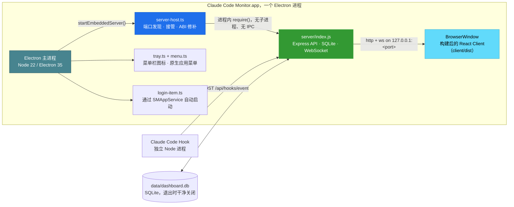

启动时，应用会：

1. 选择空闲端口，优先 **4820**，然后尝试 **4821–4829**，如果都被占用则使用随机高位端口。
2. 如果 `4820` 上已有健康的 Dashboard Server 响应 `/api/health`，例如终端中运行了 `npm start`，应用会**接管该服务器**，避免端口冲突和 SQLite 争用。退出应用后，被接管的服务器继续运行。
3. 否则启动嵌入式服务器，并在**首次拥有服务器的启动**中自动安装 Claude Code Hook，再启动后台服务，包括更新调度器、`cc-watcher` 和孤立 Run 协调。仅使用 DMG 的用户无需 Checkout 或 `npm run install-hooks` 即可收到事件。
4. **macOS：** 恢复登录 Shell 的 `PATH`，使 **Run Claude** 能找到并启动 `claude` CLI。否则从 Finder/Dock 启动的应用只会继承 launchd 的最小 `PATH`，从而错过 `~/.local/bin`、`/opt/homebrew/bin` 和版本管理器目录等。Windows 进程已继承用户 `PATH`。
5. 打开 Dashboard 窗口。若应用由登录项启动，在 macOS 上通过 Login Items，在 Windows 上通过带标记的 `HKCU\…\Run` 条目，则保持仅托盘运行。
6. 退出时优雅关闭嵌入式服务器并**干净关闭 SQLite**，包括 WAL Checkpoint。

### 功能

- **托盘与窗口：** 左键切换窗口；右键提供 **Open Dashboard**、**Open in Browser**、**Restart Server**、**Show Logs**、**Open at Login** 和 **Quit**。macOS 使用着色模板托盘图标；Windows 和窗口/任务栏使用彩色应用图标，未打包的开发运行也一样。
- **原生菜单：** 标准应用菜单以及 `⌘` / `Ctrl` 快捷键。只有 macOS 在隐藏时保留 **File → Open Dashboard**（`⌘1`）；Windows/Linux 通过托盘可靠地重新打开。
- **登录与生命周期：** `SMAppService` 注册 macOS Login Items；Windows 写入当前用户的 `HKCU\Software\Microsoft\Windows\CurrentVersion\Run` 条目。关闭窗口时会隐藏窗口，托盘和服务器继续运行；再次启动会聚焦唯一的现有实例。
- **持久数据：** SQLite 和 VAPID Key 位于 Bundle 外的 `~/Library/Application Support/Claude Code Monitor/data/` 或 `%APPDATA%\Claude Code Monitor\data\`。重新安装、更新和默认 NSIS 卸载都会保留已导入历史。
- **CLI 与日志：** macOS 恢复登录 Shell 的 `PATH`，使 Finder/Dock 启动的应用可以运行 `claude`；Windows 使用继承的用户 `PATH`。**Show Logs** 打开 `~/Library/Logs/Claude Code Monitor/desktop.log` 或 `%APPDATA%\Claude Code Monitor\logs\desktop.log`。

### 获取应用

**方案 A：下载预构建安装包，推荐。** 从 **[Releases → latest](https://github.com/hoangsonww/Claude-Code-Agent-Monitor/releases/latest)** 下载，无需登录 GitHub。每当 `master` 上 `package.json` 的版本提升时，CI 会自动发布新的 `vX.Y.Z`，因此该链接始终提供当前构建：

| 平台 | 资源 | 说明 |
| --- | --- | --- |
| macOS（Apple Silicon） | `ClaudeCodeMonitor-<ver>-arm64.dmg` | 拖入 `/Applications` |
| macOS（Intel） | `ClaudeCodeMonitor-<ver>-x64.dmg` | 拖入 `/Applications` |
| Windows（安装版） | `ClaudeCodeMonitor-Setup-<ver>-x64.exe` | 当前用户安装，无需管理员权限 |
| Windows（便携版） | `ClaudeCodeMonitor-<ver>-x64-portable.exe` | 无需安装即可运行 |

每个提交的新鲜构建也作为 CI Artifact 提供，需要登录，保留 14 天。`🍎 macOS Desktop (DMG)` Job 生成 `ClaudeCodeMonitor-dmg`，`🪟 Windows Desktop (EXE)` Job 生成 `ClaudeCodeMonitor-win`，适合在下一个 Release Tag 前测试 `master`。

**方案 B：自行构建。** 在仓库根目录运行：

```bash
npm run setup                # install root + client deps, build client, install hooks
npm run build                # build the React client (client/dist)
npm run desktop:install      # install Electron + electron-builder into desktop/ (preflights native deps; prints setup help on failure)
npm run desktop:dmg:arm64    # macOS:   fast single-arch DMG → desktop/release/ClaudeCodeMonitor-<ver>-arm64.dmg
npm run desktop:win          # Windows: NSIS installer → desktop/release/ClaudeCodeMonitor-Setup-<ver>-x64.exe
```

> [!NOTE]
> DMG 在 macOS 上构建，Windows `.exe` 在 Windows 上构建，electron-builder 针对宿主操作系统打包。macOS 的 `npm run desktop:dmg` 会将应用分别按架构打包两次，并输出 `arm64` 和 `x64` 两个单架构 DMG，这是 Release Build，不会合并为 Universal Binary。自己的 Mac 请使用单架构的 `desktop:dmg:arm64` / `desktop:dmg:x64`。在 Windows 上，`npm run desktop:install` 会将 `better-sqlite3` 获取为预构建的 Electron Binary，因此通常不需要 Visual Studio C++ Toolchain。若构建仍失败，例如没有预构建 Binary 或缺少 C++ Toolchain，`desktop:install` 会打印各操作系统的准确修复方法和无需 Toolchain 的替代方案，并明确失败，而不会留下损坏的安装。

### 安装

**macOS：**

1. 双击 `.dmg` 进行挂载。
2. 将 **Claude Code Monitor.app** 拖入 `/Applications` 文件夹。
3. DMG 默认使用 **ad-hoc signing**，因此 macOS Gatekeeper 首次启动时会警告 *"Apple could not verify…"*。清除 Quarantine Attribute：

   ```bash
   xattr -cr "/Applications/Claude Code Monitor.app"
   ```

   或打开 **System Settings → Privacy & Security** 并点击 **Open Anyway**。

4. 启动应用。托盘图标出现，Dashboard 窗口打开。

**Windows：**

运行 `ClaudeCodeMonitor-Setup-<ver>-x64.exe`，以无需管理员权限的当前用户方式安装到 `%LOCALAPPDATA%\Programs\Claude Code Monitor`，并可选择目标目录；也可直接使用 `*-portable.exe`，无需安装。默认构建未签名，首次启动可能触发 SmartScreen；请选择 **More info → Run anyway**。从 Start 或桌面快捷方式启动后，Dashboard 和托盘图标会打开。

<p align="center">
  <a href="images/setup_win_wizard.png"></a>
  <br>
  <em>🪟 <strong>Windows 安装 · 选项</strong> · 选择仅为当前用户或所有用户安装</em>
</p>

<p align="center">
  <a href="images/setup_win_wizard2.png"></a>
  <br>
  <em>🪟 <strong>Windows 安装 · 位置</strong> · 选择安装目录，默认为 <code>%LOCALAPPDATA%\Programs</code></em>
</p>

<p align="center">
  <a href="images/setup_win_wizard3.png"></a>
  <br>
  <em>🪟 <strong>Windows 安装完成</strong> · 完成安装并启动 Claude Code Monitor</em>
</p>

### 构建命令

所有命令均在**仓库根目录**运行：

| 命令 | 作用 |
| --- | --- |
| `npm run desktop:install` | 在 `desktop/` 中安装 Electron + electron-builder；为 Electron ABI 重新构建 `better-sqlite3`；预检原生 `better-sqlite3` 构建，失败时打印可操作的设置帮助，包括无需 Toolchain 的替代方案 |
| `npm run desktop:build` | 将桌面 TypeScript 源码编译到 `desktop/out/` |
| `npm run desktop:dev` | 构建并启动 Electron 应用，供本地迭代 |
| `npm run desktop:test` | 运行 Smoke Test，启动 Electron、探测 `/api/health` 后关闭 |
| `npm run desktop:dmg` | **macOS：** 构建 arm64 + x64 两个 DMG，适用于 Release，速度较慢，因为会分别打包每个架构 |
| `npm run desktop:dmg:arm64` | **macOS：** 构建仅用于 Apple Silicon 的 DMG，速度快，约 1 min，推荐自己的 Mac 使用 |
| `npm run desktop:dmg:x64` | **macOS：** 构建仅用于 Intel 的 DMG，速度快，约 1 min |
| `npm run desktop:dmg:universal` | **macOS：** 构建一个合并的 Universal DMG（arm64 + x86_64），可选且最慢，并非 Release 提供的形式 |
| `npm run desktop:win` | **Windows：** 构建 NSIS 安装版 `.exe`（x64） |
| `npm run desktop:win:portable` | **Windows：** 构建免安装便携 `.exe`（x64） |

生成的 macOS DMG 约为 **~80 MB**，安装后约占 ≈ 250 MB。Windows 安装包大小相近，这是标准 Electron Bundle 的体积成本。

### 签名与公证

macOS 默认使用 ad-hoc signing，并设置 `CSC_IDENTITY_AUTO_DISCOVERY=false`，避免意外选择本地证书。Developer ID Signing 使用 `CSC_LINK` 和 `CSC_KEY_PASSWORD`；Notarization 另需 `APPLE_ID`、`APPLE_TEAM_ID` 和 `APPLE_APP_SPECIFIC_PASSWORD`。Windows 默认未签名，并通过同一组 `CSC_LINK` 和密码变量启用 Authenticode。提供凭据后 CI 会自动启用对应流程，无需修改代码。

### 实现说明

- **原生 ABI：** `desktop/` 保留为 Electron 构建的 `better-sqlite3`，并将 `server/db.js` 重定向到它；根目录副本继续兼容系统 Node 和服务端测试。按架构构建 DMG 后，桌面 `prebuild` 会自动修复本地 ABI；若 Binary 缺失，则提前失败并给出设置帮助。
- **服务器一致性：** 导出的 `startBackgroundServices()` 让嵌入式服务器使用与 `node server/index.js` 相同的更新调度器、配置监听器和孤立 Run 协调。独立运行路径和其他工作区的行为保持不变。
- **CI 与 Release：** 按路径筛选的 macOS 和 Windows Job 会运行 Smoke Test，并上传两个单架构 DMG、NSIS 和便携 EXE。`master` 上的版本提升会将全部资源附加到 `vX.Y.Z`；使用 `npm run build:win-icon` 重新生成 `desktop/assets/icon.ico`。

安装与日常使用见 [`DESKTOP.md`](./DESKTOP.md)，进程、生命周期、端口和构建见 [`desktop/README.md`](./desktop/README.md)。

---
## 数据存储

- **引擎：** SQLite 3，通过 `better-sqlite3`（可选）或 Node.js 内置 `node:sqlite`
- **位置：** `data/dashboard.db`
- **日志模式：** WAL（写入期间支持并发读取）
- **重置：** 删除 `data/dashboard.db` 清除所有数据

### 实体关系图

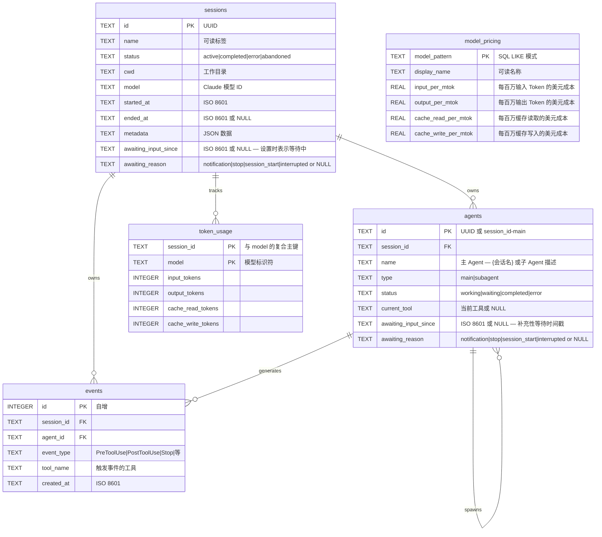

---

## 插件市场

CCAM 从同一套共享源码目录提供 **14 个共享插件**。Claude Code 读取 `.claude-plugin/marketplace.json`；Codex 读取 `.agents/plugins/marketplace.json` 和每个插件的 `.codex-plugin/plugin.json`。整套内容包含 **66 个插件技能、18 个 Claude Subagent、34 个 Claude 命令、3 个 CLI 辅助工具、3 个 Hook 配置，以及 2 个支持 MCP 的插件**。

```bash
# Claude Code
claude plugin marketplace add hoangsonww/Claude-Code-Agent-Monitor
claude plugin install ccam-platform@claude-code-agent-monitor-plugins

# Codex
codex plugin marketplace add hoangsonww/Claude-Code-Agent-Monitor
codex plugin add ccam-platform@claude-code-agent-monitor-plugins

# Open Agent Skills / skills.sh-compatible CLI
npx skills add hoangsonww/Claude-Code-Agent-Monitor --list

# Install one skill for Claude Code and Codex in the current project
npx skills add hoangsonww/Claude-Code-Agent-Monitor \
  --skill mcp-server \
  --agent claude-code \
  --agent codex \
  --yes

# Verify, update, and remove the project-scoped skill
npx skills list --json
npx skills update --project --yes
npx skills remove mcp-server --yes

# Add --global to install at user scope, then manage that scope explicitly
npx skills add hoangsonww/Claude-Code-Agent-Monitor \
  --skill mcp-server \
  --agent claude-code \
  --agent codex \
  --global \
  --yes
npx skills list --global --json
npx skills update --global --yes
npx skills remove --global mcp-server --yes
```

`skills` CLI 可发现 **77 个仓库技能**，包括 66 个插件技能和仓库维护技能。项目安装使用 `.agents/skills/` 及各 Agent 的专用链接。Claude Code 全局技能默认位于 `~/.claude/skills/`，设置后也可位于 `$CLAUDE_CONFIG_DIR/skills/`。Codex 全局技能默认位于 `~/.codex/skills/`，设置后也可位于 `$CODEX_HOME/skills/`。多 Agent 安装可以通过共享存储去重文件，并链接到这些目标。每个插件技能都包含规范的 `name`/`description` Frontmatter 和 `agents/openai.yaml` 元数据。安装无需向 `vercel-labs/skills` 提交上游 PR。公开 GitHub 仓库是来源，skills.sh 可见性取决于发布状态和真实安装遥测。

新的聚焦插件补充了现有的分析、生产力、质量、会话、工作流、配置和 Dashboard 插件：

- `ccam-runner`：受监控的 Claude Code/Codex 启动、后续消息、停止、恢复和 Run 历史
- `ccam-integrations`：告警规则、Webhook、Push 通知和 SSH 远程收集
- `ccam-platform`：Claude/Codex Config Explorer、Provider 感知导入、Backup 恢复、Hook 设置、更新和 MCP 操作
- `ccam-reports`：面向利益相关者的执行、成本、可靠性和工作流报告

使用以下命令验证并重新生成分发元数据：

```bash
npm run extensions:sync
npm run extensions:validate
```

完整目录、安装命令、skills.sh 行为、公开提交边界和全新安装检查见 [docs/PLUGINS.md](docs/PLUGINS.md)。

---
## 状态栏

Claude Code 的独立 CLI 状态栏工具，显示模型名称、用户、工作目录、Git 分支、上下文窗口使用率条和 Token 计数 — 全部使用 ANSI 转义序列彩色编码。

```
Sonnet 4.6 | nguyens6 | ~/agent-dashboard/client | main | ████████░░ 79% | 3↑ 2↓ 156586c
```

| 段 | 颜色 | 示例 |
| ----------- | -------------------- | ------------------- |
| 模型 | 青色 | `Sonnet 4.6` |
| 用户 | 绿色 | `nguyens6` |
| 工作目录 | 黄色 | `~/agent-dashboard` |
| Git 分支 | 品红色 | `main` |
| 上下文条 | 绿色 / 黄色 / 红色 | `████████░░ 79%` |
| Token | 暗色 | `3↑ 2↓ 156586c` |

参见 [`statusline/README.md`](statusline/README.md) 了解安装说明。

<p align="center">
  <a href="images/statusline.png"></a>
</p>

---

## 服务端架构

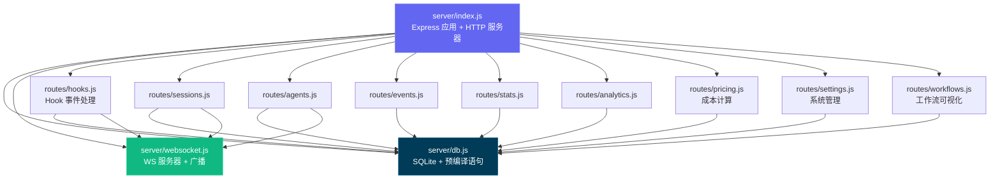

---

## 客户端路由

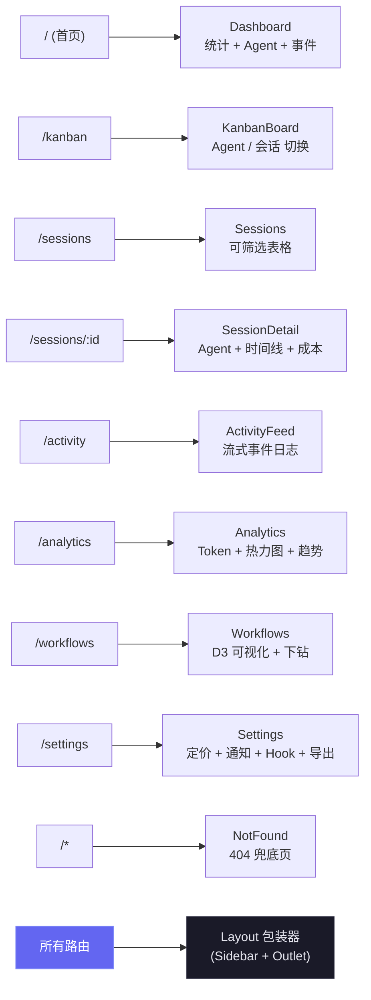

---

## Hook 处理流程

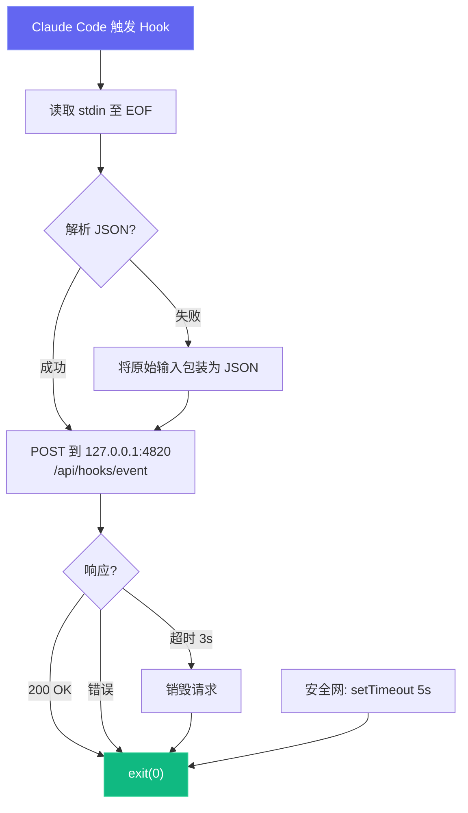

---

## 部署模式

我们支持开发和生产两种部署模式，使用不同的进程架构：

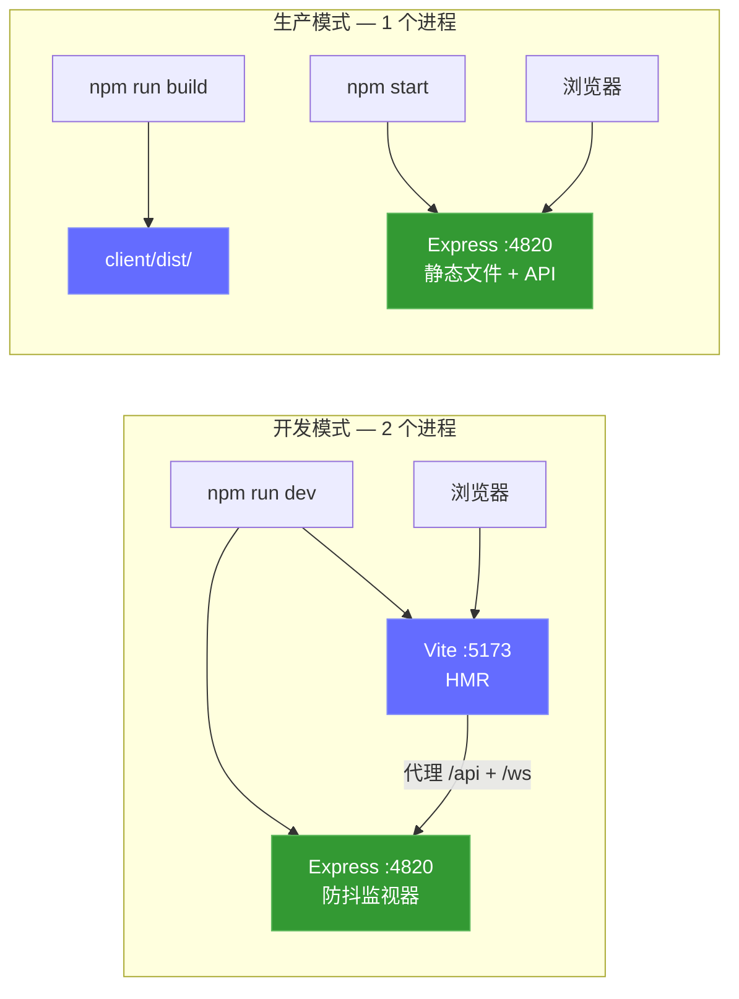

可选的本地 MCP Sidecar（支持 stdio、HTTP+SSE 和 REPL 传输）：

```mermaid
graph LR
    subgraph "MCP 传输选项"
        M_STDIO["MCP 服务器 (stdio)<br/>npm run mcp:start"]
        M_HTTP["MCP 服务器 (HTTP)<br/>npm run mcp:start:http<br/>:8819"]
        M_REPL["MCP 服务器 (REPL)<br/>npm run mcp:start:repl"]
    end

    H["MCP 宿主"] -->|"stdin/stdout"| M_STDIO
    RC["远程客户端"] -->|"POST /mcp · GET /sse"| M_HTTP
    OP["操作员"] -->|"交互式 CLI"| M_REPL

    M_STDIO --> D["Dashboard 服务器<br/>:4820"]
    M_HTTP --> D
    M_REPL --> D

    style M_STDIO fill:#0f766e,stroke:#14b8a6,color:#fff
    style M_HTTP fill:#0f766e,stroke:#14b8a6,color:#fff
    style M_REPL fill:#0f766e,stroke:#14b8a6,color:#fff
```

### 云部署

`deployments/` 可部署到任何兼容 Kubernetes 的平台，包括 EKS、GKE、AKS、OKE 和自建集群。CCAM 使用 SQLite，因此所有受支持的清单都强制 **每个持久卷只有一个活动 Dashboard writer**，并采用 Recreate 更新。只要 SQLite 仍是持久化后端，就不支持 HPA、active-active、多副本、蓝绿或金丝雀。

- **Helm：** Schema 拒绝多副本/HPA，支持镜像 digest、保留 PVC、Ingress 或 Gateway API、外部 Secret、NetworkPolicy、可选 MCP 与 ServiceMonitor。
- **Kustomize：** Restricted PSS 基础、dev/staging/production overlay，以及 MCP、监控、Gateway API、CSI Snapshot 组件。
- **Terraform：** 将经过验证的 Helm Chart 部署到现有 Kubernetes 集群；云网络、身份、CSI、TLS 与 Secret 同步由平台层负责。
- **运维：** SQLite 在线备份、完整性检查、SHA-256、scale-to-zero 恢复、部署/回滚/拆除前备份、带认证的健康检查。
- **CI 供应链：** app 与 MCP 镜像会被扫描，发布 amd64/arm64，并附带 SBOM、SLSA provenance 和 Cosign keyless 签名。

```bash
npm run deploy:validate
REGISTRY="ghcr.io/$(gh repo view --json owner -q .owner.login)"
IMAGE_TAG="$(git rev-parse --short HEAD)"

helm upgrade --install agent-monitor deployments/helm/agent-monitor \
  --namespace agent-monitor-production --create-namespace \
  --values deployments/helm/agent-monitor/values-production.yaml \
  --set image.registry= \
  --set image.repository=${REGISTRY}/claude-code-agent-monitor \
  --set image.tag=${IMAGE_TAG} \
  --atomic --wait --timeout 10m
```

> [!NOTE]
> Secrets、Docker/Podman、Gateway API、Terraform、备份、恢复与回滚详见 [DEPLOYMENT.md](DEPLOYMENT.md) 和 [deployments/README.md](deployments/README.md)。

---

## 项目结构

```
agent-dashboard/
|-- CLAUDE.md                   # Claude Code 项目记忆和工作约定
|-- AGENTS.md                   # Codex 项目指令
|-- package.json                # 根脚本（Dashboard + MCP 辅助）+ 服务端依赖
|-- .claude/
|   +-- rules/                  # 路径作用域的 Claude 规则
|   +-- skills/                 # Claude 可复用项目技能
|   +-- agents/                 # Claude 自定义子 Agent
|-- .claude-plugin/
|   +-- marketplace.json        # Claude Code 插件市场清单（14 个插件）
|-- .agents/plugins/
|   +-- marketplace.json        # Codex 插件市场清单（14 个插件）
|-- plugins/
|   |-- ccam-analytics/         # 分析：会话报告、成本明细、使用趋势、生产力评分
|   |   |-- .claude-plugin/plugin.json
|   |   |-- skills/ (4)         # session-report, cost-breakdown, usage-trends, productivity-score
|   |   |-- agents/             # analytics-advisor（Sonnet 模型）
|   |   |-- hooks/hooks.json    # Stop + SubagentStop 事件日志
|   |   +-- bin/ccam-stats      # 终端 Dashboard CLI
|   |-- ccam-productivity/      # 生产力：站会、报告、冲刺、工作流优化
|   |-- ccam-devtools/          # 开发工具：调试、诊断、导出、健康检查
|   |-- ccam-runner/            # Run Agent：启动、跟进、停止、恢复与历史
|   |-- ccam-integrations/      # 集成：告警、Webhook、推送与远程采集
|   |-- ccam-platform/          # 平台：配置、导入/恢复、Hook 与 MCP 管理
|   |   +-- bin/                # ccam-doctor + ccam-export CLI
|   |-- ccam-insights/          # 洞察：模式、异常、优化、比较
|   |-- ccam-cost-guard/        # 成本护栏：预算、支出预测、成本告警、模型节省
|   |-- ccam-sessions/          # 会话取证：搜索、时间线、转录回放、按 cwd 汇总、清理
|   |-- ccam-workflows/         # 工作流编排：DAG 映射、委派审计、并发、舰队运行
|   |-- ccam-quality/           # 可靠性与 SLO：错误扫描、API 错误报告、Hook 失败审计、SLO 检查
|   |-- ccam-config/            # 配置与记忆治理：配置审计、记忆审查、技能/MCP/Hook 清单
|   +-- ccam-dashboard/         # Dashboard 连接器：状态、快速统计、MCP 集成
|       +-- .mcp.json           # MCP 服务器配置
|-- server/
|   |-- index.js                 # Express 应用、HTTP 服务器、静态文件服务
|   |-- db.js                    # SQLite Schema、迁移、预编译语句
|   |-- websocket.js             # WebSocket 服务器（含心跳）
|   +-- routes/
|       |-- hooks.js             # Hook 事件处理（事务性）
|       |-- sessions.js          # 会话 CRUD
|       |-- agents.js            # Agent CRUD
|       |-- events.js            # 事件列表
|       |-- stats.js             # 聚合统计
|       |-- analytics.js         # Token、工具和趋势分析
|       |-- workflows.js         # 聚合工作流数据和按会话下钻
|       |-- pricing.js           # 模型定价 CRUD 和成本计算
|       +-- settings.js          # 系统信息、数据管理、导出、清理
|   +-- lib/
|       +-- transcript-cache.js  # 基于 stat 的 JSONL Transcript 缓存，增量读取。采用 4 MiB 分块的同步字节流读取器并按行解析，避免一次性将整个文件加载为 JS 字符串，因此即使 JSONL 大于 V8 的最大字符串长度（64 位 Node 20 约 512 MiB）也能解析，不会让进程崩溃于 "FATAL ERROR: v8::ToLocalChecked Empty MaybeLocal"。提取 Token、压缩、API 错误、回合耗时、思考块和用量附加信息（service_tier、speed、inference_geo）
|   +-- compat-sqlite.js         # node:sqlite 兼容性封装（better-sqlite3 的后备方案）
|-- client/
|   |-- package.json             # 客户端依赖
|   |-- index.html               # HTML 入口
|   |-- vite.config.ts           # Vite + 代理配置
|   |-- tailwind.config.js       # 自定义暗色主题
|   |-- tsconfig.json            # 严格 TypeScript
|   +-- src/
|       |-- main.tsx             # React 入口
|       |-- App.tsx              # 路由 + WebSocket Provider
|       |-- index.css            # Tailwind + 自定义工具类
|       |-- lib/
|       |   |-- types.ts         # 共享 TypeScript 接口
|       |   |-- api.ts           # 类型化 fetch 客户端
|       |   |-- format.ts        # 日期/时间格式化工具
|       |   +-- eventBus.ts      # WebSocket 分发的发布/订阅
|       |-- hooks/
|       |   |-- useWebSocket.ts      # 自动重连 WebSocket hook
|       |   +-- useNotifications.ts  # WebSocket 事件触发的浏览器通知
|       |-- components/
|       |   |-- Layout.tsx       # 带 Sidebar + Outlet 的外壳
|       |   |-- Sidebar.tsx      # 导航 + 连接指示器
|       |   |-- AgentCard.tsx    # Agent 信息卡片（含状态）
|       |   |-- StatCard.tsx     # 指标卡片
|       |   |-- StatusBadge.tsx  # 彩色编码状态标签
|       |   |-- EmptyState.tsx   # 空列表占位符
|       |   +-- workflows/       # D3.js 工作流可视化组件
|       |       |-- OrchestrationDAG.tsx            # Agent 生成模式的水平 DAG
|       |       |-- ToolExecutionFlow.tsx           # 工具到工具转换的 d3-sankey 图
|       |       |-- AgentCollaborationNetwork.tsx   # 力导向 Agent 管道图
|       |       |-- SubagentEffectiveness.tsx       # 带 SVG 成功率环的记分卡网格
|       |       |-- WorkflowPatterns.tsx            # 自动检测的编排序列
|       |       |-- ModelDelegationFlow.tsx         # 通过 Agent 层级的模型路由
|       |       |-- ErrorPropagationMap.tsx         # 按层级深度的错误聚类
|       |       |-- ConcurrencyTimeline.tsx         # 泳道式并行 Agent 执行
|       |       |-- SessionComplexityScatter.tsx    # D3 气泡图（耗时 vs Agent vs Token）
|       |       |-- CompactionImpact.tsx            # Token 压缩事件和恢复
|       |       |-- WorkflowStats.tsx               # 聚合工作流统计
|       |       +-- SessionDrillIn.tsx              # 按会话的 Agent 树、工具时间线、事件
|       +-- pages/
|           |-- Dashboard.tsx      # 概览页
|           |-- KanbanBoard.tsx    # Agent / 会话切换的状态列
|           |-- Sessions.tsx       # 会话表格
|           |-- SessionDetail.tsx  # 单会话深入查看
|           |-- ActivityFeed.tsx   # 实时事件流
|           |-- Analytics.tsx      # Token 使用、热力图、趋势
|           |-- Workflows.tsx      # D3.js 工作流可视化和会话下钻
|           |-- Settings.tsx       # 模型定价、通知、Hook、导出、清理
|           +-- NotFound.tsx       # 404 兜底页
|-- scripts/
|   |-- hook-handler.js          # 轻量级 stdin-to-HTTP 转发器
|   |-- install-hooks.js         # 自动配置 ~/.claude/settings.json
|   |-- import-history.js        # 从 ~/.claude/ 导入会话，含增强 JSONL 提取（API 错误、回合耗时、入口点、权限模式、思考块、用量附加信息、工具错误、子 Agent JSONL 文件）。重新导入完全增量：在每次导入前按事件类型查询 `MAX(created_at) GROUP BY event_type` 作为基准，只插入 `ts > cutoff[type]` 的 JSONL 条目，长跨度会话即使 transcript 在多天内持续追加，也能在每次重跑时继续接收 Stop / PostToolUse / TurnDuration / ToolError 事件；同时在 JSONL 推进时前向更新 `sessions.ended_at`，并刷新消息计数元数据
|   +-- seed.js                  # 示例数据生成器
|-- mcp/
|   |-- package.json             # MCP 包脚本 + 依赖
|   |-- README.md                # MCP 设置、宿主配置、工具目录、安全模型
|   |-- src/
|   |   |-- index.ts             # MCP 运行时入口（传输路由器）
|   |   |-- server.ts            # MCP 服务器组装
|   |   |-- clients/             # 带重试/退避的 Dashboard API 客户端
|   |   |-- config/              # 环境/CLI 配置解析
|   |   |-- core/                # 日志器、工具注册、结果辅助
|   |   |-- policy/              # 变更/破坏性守卫
|   |   |-- tools/               # 16 个领域模块注册 103 个工具
|   |   |-- transports/          # HTTP+SSE 服务器、REPL、工具收集器
|   |   |-- ui/                  # ANSI 横幅、颜色、格式化器、表格
|   |   +-- types/               # 共享 MCP 类型定义
|   +-- build/                   # 构建后的 MCP 运行时输出
|-- deployments/
|   |-- README.md                # 生产部署参考
|   |-- nginx/                   # Rootless Nginx 边缘与可选 Hook/MCP 策略
|   |-- secrets/                 # Git 忽略的 Compose token/password 文件
|   |-- terraform/               # 将 Helm 部署到现有 Kubernetes 集群
|   |-- kubernetes/              # 单 writer Kustomize 基础与环境 Overlay
|   |   |-- base/                # Restricted PSS、Recreate Deployment、PVC、Service、Ingress
|   |   |-- overlays/            # dev、staging、production 命名空间与资源
|   |   +-- components/          # MCP、ServiceMonitor、Gateway API、VolumeSnapshot
|   |-- helm/agent-monitor/      # Schema 强制安全的 Helm Chart 与环境 values
|   +-- scripts/                 # validate、deploy、backup、restore、rollback、health、teardown
|-- .codex/
|   |-- config.toml              # Codex 运行时配置
|   |-- README.md                # Codex Agent 和技能设置指南
|   |-- rules/                   # Codex 执行策略规则
|   |-- agents/                  # Codex 自定义 Agent 模板
|   +-- skills/                  # Codex 项目技能
|-- desktop/
|   |-- README.md                # 桌面应用贡献者 / 架构参考
|   |-- electron-builder.yml     # DMG 打包配置；签名 / 公证钩子
|   |-- src/
|   |   |-- main.ts              # 主进程入口 —— 生命周期、对话框、装配
|   |   |-- server-host.ts       # 进程内 Express 启动、端口发现、服务器采用、SQLite 关闭
|   |   |-- window.ts            # BrowserWindow + 持久化窗口几何状态
|   |   |-- menu.ts              # 原生应用菜单（File ▸ Open Dashboard 仅在 macOS 上可用）
|   |   |-- tray.ts              # 菜单栏（托盘）图标 + 上下文菜单
|   |   |-- login-item.ts        # macOS 登录项（SMAppService）开机自启
|   |   +-- logger.ts            # 写入 desktop.log 的文件日志器
|   |-- scripts/                 # prebuild 校验、build-icons、notarize 钩子
|   +-- tests/smoke.test.mjs     # 启动 Electron 并探测 /api/health 的冒烟测试
|-- statusline/
|   |-- README.md                # 状态栏安装和使用指南
|   |-- statusline.py            # 渲染状态栏的 Python 脚本
|   +-- statusline-command.sh    # Claude Code statusLine 配置的 Shell 包装
+-- data/
    +-- dashboard.db             # SQLite 数据库（gitignored）
```

---

## 常见问题

| 问题 | 解决方案 |
| --------------------------------- | ---------------------------------------------------------------------------------------------------------------------------------------------------------------- |
| `better-sqlite3` 安装失败 | 这是非致命错误 — 服务器会自动回退到 Node.js 内置的 `node:sqlite`（Node 22+）。在旧版 Node 上，安装 Python 3 和 C++ 构建工具，然后运行 `npm rebuild better-sqlite3` |
| Hook 未触发 | 运行 `npm run install-hooks` 并重启 Claude Code。验证 `~/.claude/settings.json` 中存在 Hook 配置 |
| Dashboard 无数据 | 确保服务器正在运行（`npm run dev`）后再启动 Claude Code 会话。检查 `http://localhost:4820/api/health` |
| WebSocket 断开连接 | 客户端每 2 秒自动重连。检查端口 4820 未被防火墙阻止 |
| 重启后数据过期 | 数据库在重启间持久化。运行 `npm run seed` 获取新的演示数据，或删除 `data/dashboard.db` 重置 |
| MCP 工具连接失败 | 确认 Dashboard API 在 `MCP_DASHBOARD_BASE_URL` 上正常运行，并重新构建/启动 MCP（`npm run mcp:build`、`npm run mcp:start`） |

---

## 贡献

欢迎贡献，请参阅 [`.github/CONTRIBUTING.md`](.github/CONTRIBUTING.md) 中的完整指南。

所有贡献者都必须签署[贡献者许可协议](https://github.com/hoangsonww/Claude-Code-Agent-Monitor/blob/master/CLA.md)。每个 Pull Request 都会由 `🖋️ CLA Assistant` GitHub Action 自动检查。首次提交 PR 时，Bot 会要求通过评论 `I have read the CLA Document and I hereby sign the CLA` 完成签署。一次签署覆盖之后的全部贡献。

---

## 许可证

MIT。详见 [LICENSE](LICENSE)。
