# Agent-Dashboard für Claude Code, Cursor und Codex

### Echtzeit-Überwachungsplattform für die Agent-Aktivität von Claude Code, Cursor und Codex 🚀

Ein professionelles Dashboard, um Agent-Sitzungen von Claude Code, Cursor und Codex, Tool-Nutzung, Konversationsverlauf, Kosten und Subagent-Orchestrierung in Echtzeit zu verfolgen und zu visualisieren. Gebaut mit Node.js, Express, React und SQLite, kombiniert es native Hooks mit anbieterbewusster lokaler Erkennung von Transkripten.


> [!TIP]
> Siehe auch: [README.md](./README.md) (English), [README-CN.md](./README-CN.md) (中文版本), [README-VN.md](./README-VN.md) (Phiên bản tiếng Việt), [README-KO.md](./README-KO.md) (한국어 버전), [README-ES.md](./README-ES.md) (versión en español), [README-FR.md](./README-FR.md) (version française), [README-PT.md](./README-PT.md) (versão em português) und [README-IT.md](./README-IT.md) (versione italiana) für lokalisierte Dokumentation mit regionsspezifischen Tipps und Best Practices.

> [!NOTE]
> Sie brauchen aufgabenorientierte Hilfe? Das [GitHub-Wiki](https://github.com/hoangsonww/Claude-Code-Agent-Monitor/wiki) ist das praktische Handbuch für den Alltag, den Teambetrieb, die Fehlerbehebung, die Automatisierung per CLI/MCP und Deployment-Rezepte. Das [lokalisierte statische Wiki](https://hoangsonww.github.io/Claude-Code-Agent-Monitor/wiki/) bleibt die Produkt- und Architekturtour auf Englisch, Vietnamesisch, Chinesisch, Koreanisch, Spanisch, Französisch, Deutsch, Portugiesisch und Italienisch; die genauen technischen Verträge liegen in [`docs/`](./docs/README.md).

---

## Inhaltsverzeichnis

- [Übersicht](#übersicht)
- [Internationalisierung (i18n)](#internationalisierung-i18n)
- [Funktionen](#funktionen)
- [Schnellstart](#schnellstart)
- [Funktionsweise](#funktionsweise)
- [Konfiguration](#konfiguration)
- [npm-Skripte](#npm-skripte)
- [Plugin-Marketplace](#plugin-marketplace)
- [Agent-Erweiterungen](#agent-erweiterungen)
- [MCP-Integration](#mcp-integration)
- [API-Referenz](#api-referenz)
- [Hook-Ereignisse](#hook-ereignisse)
- [Browser-Benachrichtigungen](#browser-benachrichtigungen)
- [Update-Benachrichtigung](#update-benachrichtigung)
- [Tabby — schwebende Katzen-Begleiterin](#tabby--schwebende-katzen-begleiterin)
- [Tonsignale](#tonsignale)
- [Dialog Verbindungsstatus](#dialog-verbindungsstatus)
- [VS-Code-Erweiterung](#vs-code-erweiterung)
- [Desktop-App (macOS und Windows)](#desktop-app-macos-und-windows)
- [Datenspeicherung](#datenspeicherung)
- [Statuszeile](#statuszeile)
- [Serverarchitektur](#serverarchitektur)
- [Client-Routing](#client-routing)
- [Ablauf des Hook-Handlers](#ablauf-des-hook-handlers)
- [Deployment-Modi](#deployment-modi)
- [Projektstruktur](#projektstruktur)
- [Fehlerbehebung](#fehlerbehebung)
- [Mitwirken](#mitwirken)
- [Lizenz](#lizenz)

---

## Übersicht

Verfolgen Sie Sitzungen, überwachen Sie Agents in Echtzeit, visualisieren Sie die Tool-Nutzung, spielen Sie Konversationen erneut ab und beobachten Sie die Subagent-Orchestrierung in einer professionellen Weboberfläche mit dunklem Theme. Claude Code und Codex nutzen ihre nativen Hooks; Cursor ist über seine kompatiblen Live-Ereignisse und die native Erkennung von Transkripten in `~/.cursor` direkt enthalten.

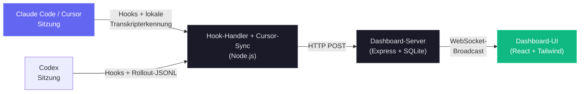

### Cursor-Unterstützung

Cursor erfordert keine eigene Einrichtung: Die Auswahl von **Claude Code** auf dem Startbildschirm aktiviert auch die Cursor-Überwachung. Ein Dateisystem-Watcher findet `~/.cursor/chats/*/<session>/meta.json`, sobald `agent` startet, noch bevor Cursor ein Transkript anlegt; Änderungen an `prompt_history.json` aktualisieren Sitzungskarte, Arbeitszustand und Konversation sofort, wenn ein Prompt gesendet wird. Trifft `~/.cursor/projects/*/agent-transcripts` ein, führt das Dashboard es in die ausstehende Konversation zusammen, ohne den Benutzerzug zu duplizieren, ergänzt native Titel, Projekte, Runden und Subagents und sichert die JSONL von Haupt-Agent und Subagents als Snapshot, damit die Konversation verfügbar bleibt, nachdem Cursor seinen eigenen Verlauf bereinigt hat.

Cursor-Karten erhalten native Überschriften `Cursor · <title>` sowie Untertitel zu Projekt, Runden und Subagents. Die Kosten nutzen eine eigene, bearbeitbare Tabelle **Cursor-Preise** in den Einstellungen – mit Cursor Grok 4.6/4.5, Composer 2.5 und dem veröffentlichten Katalog der Drittanbietermodelle –, statt die Preise von Claude oder Codex zu übernehmen. Überschreiben Sie das Quellverzeichnis mit `DASHBOARD_CURSOR_HOME`; stellen Sie das Fallback-Polling mit `DASHBOARD_CURSOR_SYNC_MS` ein (`0` deaktiviert nur das periodische Durchsuchen; die Live-Dateisystemüberwachung bleibt aktiv).

Neben dem Echtzeit-Überwachungsdashboard enthält das Projekt eine lokale MCP-Server-Implementierung in `mcp/`, die einen Tool-Katalog zum Untersuchen und Verwalten des Dashboards selbst bereitstellt, sodass sich Dashboard-Operationen direkt in Ihre Workflows mit Claude Code und Codex einbinden lassen. Außerdem gibt es eine Schicht für Agent-Erweiterungen mit Plugins, Skills und Subagents für Claude Code und Codex zur Interaktion mit dem Dashboard, für Analysen und Workflow-Intelligenz.

### Internationalisierung (i18n)

Die Oberfläche bietet eine integrierte Sprachumschaltung für Englisch (`en`), Chinesisch (`zh`), Vietnamesisch (`vi`), Koreanisch (`ko`), Spanisch (`es`), Französisch (`fr`), Deutsch (`de`), Portugiesisch (`pt`) und Italienisch (`it`). Ein eigenes Sprach-Dropdown verhindert, dass die Auswahl die Seitenleiste überfrachtet, wenn weitere Sprachen hinzukommen. Sprachressourcen werden pro Namespace geladen und im Browserspeicher gehalten, damit die Einstellung über Neuladen hinweg stabil bleibt.

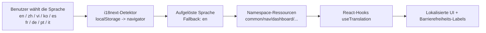

Die vollständige Architektur und Betriebshinweise finden Sie in [docs/I18N.md](./docs/I18N.md).

### Benutzeroberfläche

Mit elegantem dunklem Theme, responsivem Design und intuitiver Navigation, um die Aktivität Ihrer Agents zu erkunden:

<p align="center">
  
  <br>
  <em>📡 <strong>Dashboard · Überwachung</strong> — Übersichtsstatistiken, Karten aktiver Agents und Feed der letzten Aktivität</em>
</p>

<p align="center">
  
  <br>
  <em>📋 <strong>Aufgabenfortschritt · Übersicht</strong> — Agent-Karten im Dashboard und Zeilen in Sitzungen nutzen denselben kompakten Fortschrittsring neben dem Status; Hover oder Fokus öffnet eine Vorschau der aktuellen Arbeit und der Aufgabenzustände nach Verantwortlichen</em>
</p>

<p align="center">
  
  <br>
  <em>🩺 <strong>Dashboard · Zustand</strong> — Ring des Gesamtzustandswerts, Ringdiagramm der Speicher-Engine, Anzeigen für Cache-Treffer, Fehler und Erfolg, Balken der Tool-Aufrufe, Subagent-Effektivität, Token-Verteilung nach Modell und Compaction-Statistiken – alles mit automatischer Aktualisierung alle 5 s</em>
</p>

<p align="center">
  
  <br>
  <em>📋 <strong>Kanban-Board (Agents)</strong> — Agents nach Status in 4 Spalten gruppiert: Arbeitet / Wartend / Abgeschlossen / Fehler. Die gelbe Spalte Wartend zeigt Sitzungen, die auf eine Benutzereingabe warten (Berechtigungsabfragen, Rundenende oder ein frischer Prompt) – fahren Sie über ein Wartend-Badge, um zu sehen, <em>warum</em> (Eingabe nötig / Runde beendet / Am Prompt / Unterbrochen). Jede Karte zeigt auf einen Blick Modell, Kosten und aktuelles Tool.</em>
</p>

<p align="center">
  
  <br>
  <em>🗂️ <strong>Kanban-Board (Sitzungen)</strong> — Sitzungen nach Status in 5 Spalten gruppiert: Aktiv / Wartend / Abgeschlossen / Fehler / Abgebrochen, auf derselben Seite umschaltbar. Fahren Sie über einen Spaltenkopf für einen Tooltip, der den Lebenszyklusübergang erklärt.</em>
</p>

<p align="center">
  
  <br>
  <em>📂 <strong>Sitzungen</strong> — durchsuchbare, filterbare, serverseitig paginierte Tabelle aller aufgezeichneten Sitzungen mit Kosten, Modell, Agent-Anzahl und Dauer; die Projektauswahl unterstützt durchsuchbare Mehrfachauswahl, und die Sortierung nutzt ein eigenes Menü</em>
</p>

<p align="center">
  
  <br>
  <em>🤖 <strong>Sitzungsdetails · Agents</strong> — Übersichtskacheln in Echtzeit (Ereignisse, Tool-Aufrufe, Subagents, Compactions, Fehler, Dauer), Balken der meistgenutzten Tools, Aufschlüsselung nach Subagent-Typ, Token-Fluss und der Hierarchiebaum der Agents</em>
</p>

<p align="center">
  
  <br>
  <em>✅ <strong>Aufgabenfortschritt · Sitzungsdetails</strong> — der vollständige Tracker nach Verantwortlichen vereint einen segmentierten Fortschrittsring, die aktive Aufgabe, einen Fortschrittsbalken, eine Aufschlüsselung nach Verantwortlichen und eine Aufgabenliste mit 10 Zeilen pro Seite</em>
</p>

<p align="center">
  
  <br>
  <em>💬 <strong>Sitzungsdetails · Konversation</strong> — Live-Transkript-Viewer mit Markdown-Rendering, syntaxhervorgehobenen Codeblöcken (Zeilennummern + Kopieren), pro Tool gestalteten Tool-Aufrufen, Slash-Befehl-Chips mit ihrer erfassten TUI-Ausgabe und Markierungen für Sitzungsumbenennungen</em>
</p>

<p align="center">
  
  <br>
  <em>🔬 <strong>Sitzungsdetails · Zeitleiste</strong> — chronologische Ereignis-Zeitleiste mit mehrdimensionalen Filtern, Pre/Post-Gruppierung nach `tool_use_id` und tool-spezifischer Payload-Darstellung</em>
</p>

<p align="center">
  
  <br>
  <em>📰 <strong>Aktivitäts-Feed</strong> — Ereignisprotokoll in Echtzeit mit Pausieren / Fortsetzen, Gruppierung, mehrdimensionalen Filtern und einer Schaltfläche „Session →“ in jeder Zeile</em>
</p>

<p align="center">
  
  <br>
  <em>📊 <strong>Analysen</strong> — Token-Nutzung nach Modell, Tool-Häufigkeit, Aktivitäts-Heatmap und Sitzungstrends mit Online-/Offline-Anzeige; lange Diagrammlegenden werden paginiert, kurze bleiben unverändert</em>
</p>

<p align="center">
  
  <br>
  <em>🔀 <strong>Workflows</strong> — DAGs der Agent-Orchestrierung, Sankey-Diagramme der Tool-Ausführung, Kollaborationsnetze, begrenzte datengetriebene Legenden und 11 interaktive Abschnitte zur Workflow-Intelligenz</em>
</p>

<p align="center">
  
  <br>
  <em>🧬 <strong>Workflow-Läufe (Seite Workflows)</strong> — vom Tool <code>Workflow</code> gestartete „dynamische Workflows“, rekonstruiert aus den Laufjournalen auf der Festplatte: Status, Agent-Anzahl, Tokens und Tool-Aufrufe, aufklappbar zu einer Aufschlüsselung pro Agent (Phase, Zustand, Tokens, Tools, Dauer) mit lesbaren Ergebnisvorschauen</em>
</p>

<p align="center">
  
  <br>
  <em>🧬 <strong>Workflow-Läufe · aufgeklappt</strong> — ein geöffneter Lauf: anklickbare, farbcodierte Phasenfilter, die Metriktabelle pro Agent und eine vollständige Liste anklickbarer Ergebniseinträge, die den kompletten Prompt und das Ergebnis jedes Agents aufklappen</em>
</p>

<p align="center">
  
  <br>
  <em>🧬 <strong>Workflow-Läufe (Sitzungsdetails)</strong> — dieselben Flotten, verknüpft mit der Sitzung, die sie gestartet hat, sodass die Subagents dynamischer Workflows einer Sitzung und ihre eingerechneten Token-Kosten direkt sichtbar sind</em>
</p>

<p align="center">
  
  <br>
  <em>🧰 <strong>Agent-Konfiguration</strong> — wechseln Sie zwischen dem vollständigen Claude-Code-Explorer und einem Live-Codex-Arbeitsbereich für Standardwerte, Modelle, Profile, MCP, Projekte, Skills, Regeln, Hooks, Plugins und Anweisungen. Codex-Vorschauen schwärzen Geheimnisse; seine benutzerverwaltete Konfiguration, Hooks, Regeln, Skills und Anweisungen lassen sich sicher mit Backups bearbeiten.</em>
</p>

<p align="center">
  
  <br>
  <em>🧰 <strong>Codex-Konfigurations-Explorer</strong> — der Codex-Arbeitsbereich vereint <code>config.toml</code>, Kontomodelle, Profile, MCP-Server, Projekte, Skills, Hooks, Regeln, Plugins und Anweisungen. Bearbeiten Sie unterstützte benutzerverwaltete Dateien mit Backups mit Zeitstempel; <code>config.toml</code> kann nur bearbeitet werden.</em>
</p>

<p align="center">
  
  <br>
  <em>🧩 <strong>Claude-Konfigurations-Explorer · Skills</strong> — der Tab Skills listet jede gefundene Skill (Benutzer, Projekt und Plugin) mit Beschreibung und Quelle auf, ist über den gesamten Bestand durchsuchbar und öffnet jede Skill-Datei für eine sichere Bearbeitung mit Backup und Zeitstempel</em>
</p>

<p align="center">
  
  <br>
  <em>▶️ <strong>Agent starten</strong> — wählen Sie bei jedem Öffnen des Starters Claude Code oder Codex. Claude behält die Steuerung Konversation / Einmalig; Codex startet einen nativen interaktiven App-Server-Thread mit eigener Genehmigungs- und Sandbox-Steuerung. Codex-Modelle stammen aus dem Katalog der angemeldeten CLI, während Claude beobachtete Modelle und seine unterstützten Aliasse auflistet.</em>
</p>

<p align="center">
  
  <br>
  <em>💬 <strong>Agent starten · Live-Stream</strong> — Claude-stream-json- und Codex-App-Server-Ereignisse werden beide als Chat dargestellt, einschließlich Reasoning, Befehlen, Dateiänderungen und Tool-Aktivität. Mit den Dashboard-Läufen können Sie einen Agent im Hintergrund weiterarbeiten lassen und sich später wieder verbinden.</em>
</p>

<p align="center">
  
  <br>
  <em>⚙️ <strong>Einstellungen</strong> — Preisregeln der Modelle, Installationsstatus der Hooks, Datenverwaltung, Benachrichtigungseinstellungen und Systeminformationen</em>
</p>

<p align="center">
  
  <br>
  <em>🔔 <strong>Einstellungen · Alarme</strong> — regelbasierte Alarm-Engine und ausgehende Webhooks an einem Ort: Alarmregeln (Ereignismuster / Inaktivität / hängender Agent / Token-Schwelle) mit Abklingzeit pro Regel, ein Live-Feed ausgelöster Alarme und 14 integrierte Webhook-Anbieter (Slack, Discord, Teams, Google Chat, Mattermost, Rocket.Chat, Telegram, PagerDuty, Opsgenie, Splunk On-Call, Zapier, Make, n8n, Pipedream) sowie ein generischer JSON-Endpunkt mit optionaler HMAC-Signatur</em>
</p>

<p align="center">
  
  <br>
  <em>🛰️ <strong>Einstellungen · Entfernte Datenquellen</strong> — holen Sie Aktivität von Claude Code und Codex per SSH von anderen Rechnern: Legen Sie optional getrennte Pfade für das entfernte Claude-Home und das entfernte Codex-Home fest, testen Sie jeden Anbieter, synchronisieren Sie manuell oder per Hintergrund-Poller und schalten Sie den globalen Datenbereich zwischen lokal, allen Quellen oder einem bestimmten Rechner um, mit Quellen-Badges pro Sitzung</em>
</p>

<p align="center">
  
  <br>
  <em>⌘ <strong>Befehlspalette</strong> — <kbd>Cmd/Ctrl+K</kbd> öffnet von überall aus den einzigen Starter des Dashboards. Eine Abfrage deckt neun Gruppen ab: letzte Befehle, die neun Seiten, serverseitige Live-Sitzungssuche, die eigenen Aktionen der aktuellen Seite, jedes bekannte Projektverzeichnis, Unteransichten und Listenfilter der Seiten, alle 13 Abschnitte der Einstellungen, alle 12 Tabs der Agent-Konfiguration sowie Aktionen für Einstellungen, Datenbereich und Sprache. Der Abgleich basiert auf Teilfolgen und hebt die gefundenen Zeichen hervor, sodass <code>mcp</code> „MCP servers“ findet</em>
</p>

Die Seitenleiste bietet schnellen Zugriff auf alle neun Seiten — Dashboard, Kanban-Board, Sitzungsliste, Aktivitäts-Feed, Analysen, Workflows, Agent-Konfiguration, Agent starten und Einstellungen. Jede Seite soll Ihnen mit Echtzeit-Updates und umfangreichen Visualisierungen tiefe Einblicke in die Aktivität Ihrer Claude-Code-Agents geben.

---

## Funktionen

Das Dashboard bietet einen umfassenden Funktionsumfang, um Ihre Claude-Code-Sitzungen und -Agents zu überwachen und zu analysieren:

> **Cursor ist integriert:** CCAM erkennt den nativen Cursor-Verlauf in `~/.cursor/projects/*/agent-transcripts`, reichert ihn mit den Metadaten aus `~/.cursor/chats` an, speichert ihn als eigenen Anbieter `cursor` und sichert Konversationen als Snapshot, bevor Cursor seine Dateien bereinigt. Cursor ist enthalten, sobald der Dashboard-Bereich Claude Code ausgewählt ist. Entfernte SSH-Quellen spiegeln derzeit nur Claude-Code- und Codex-Homes; binden Sie ein entferntes Cursor-Home lokal ein oder stellen Sie es bereit, um es mit `DASHBOARD_CURSOR_HOME` einzulesen.

| Funktion | Beschreibung |
|---|---|
| **Aufgabenfortschritt** | Aufgabenverfolgung nach Verantwortlichen, abgeleitet aus dem beobachtbaren Anbieterzustand: aktuelle Claude-Ereignisse `TaskCreate` / `TaskGet` / `TaskUpdate` / `TaskList` und Lebenszyklusereignisse, das ältere `TodoWrite` sowie direktes oder per unified-exec umhülltes Codex-`update_plan`. Sitzungen mit Aufgabenzustand zeigen denselben kompakten Ring und dieselbe per Portal gerenderte Hover-/Fokus-Vorschau neben dem Status in der Sitzungstabelle und auf jeder Agent-Karte im Dashboard; die Sitzungsdetails zeigen das vollständige Fortschrittspanel mit Statussegmenten, aktueller Arbeit, Aufschlüsselung nach Verantwortlichen und Aufgabenzeilen, 10 pro Seite. Der Fortschritt bezieht sich auf die jüngste Arbeit der obersten Ebene: Eine neuere menschliche Claude-Runde oder Codex-Aufgabe ohne ausgegebenen Tracker löscht den älteren Zustand, und unfertiger Zustand wird verworfen, wenn diese Runde/Aufgabe ohne abschließendes Update endet. Vollständig abgeschlossener Verlauf bleibt sichtbar. |
| **Dashboard** | Zwei in `localStorage` gespeicherte Tabs: **Überwachung** — Übersichtsstatistiken (6 Statistikkarten), Karten aktiver Agents mit einklappbarer Subagent-Hierarchie und ein Feed der letzten Aktivität, dessen Eintragsanzahl sich per `ResizeObserver` an die verfügbare Höhe anpasst. **Zustand** — Ring des zusammengesetzten Systemzustandswerts (gewichtet: 0,4 × Erfolgsquote + 0,25 × Cache-Trefferquote + 0,25 × (100 − Fehlerquote) + 0,1 × (100 − Heap-%)), Ringdiagramm der Speicher-Engine mit Datensatzverteilung, Anzeigen für Cache-Leistung / Fehlerquote / Erfolgsquote, horizontales Balkendiagramm der Tool-Aufrufe (Top 8), Balken der Subagent-Effektivität, Token-Verteilung nach Modell und Statistiken zur Wirkung der Compaction. Alle Zustandsmetriken werden alle 5 s aus `/api/settings/info` und `/api/workflows` aktualisiert. Dem Cursor folgende Tooltips mit Erkennung der Fensterränder in jedem Diagramm |
| **Kanban-Board** | Zwei Ansichten mit Umschalter im Kopfbereich (in `localStorage` gespeichert): **Agents** — 4 Spalten (Arbeitet / Wartend / Abgeschlossen / Fehler) — und **Sitzungen** — 5 Spalten (Aktiv / Wartend / Abgeschlossen / Fehler / Abgebrochen). Die Spalte **Wartend** entspricht direkt dem gespeicherten Status `waiting` der Agents — gesetzt, wenn Claude Code an einem Prompt wartet (neue Sitzung, zwischen Runden oder blockiert durch eine Berechtigungs-Notification), und wechselt zu `working`, sobald der Benutzer fortfährt (UserPromptSubmit / PreToolUse). Jeder Spaltenkopf zeigt einen `?`-Tooltip, der die Lebenszyklusübergänge erklärt. Karten werden nach gespeichertem Status vom Server geladen (praktisch unbegrenzt pro Status) und dann clientseitig mit 10 Karten pro Spalte und einer Schaltfläche „Mehr anzeigen“ paginiert. Das WS-Abonnement beschränkt sich auf die aktive Ansicht (`agent_*`- bzw. `session_*`-Frames), damit Updates außerhalb der Ansicht kein Neuladen auslösen. Wartend-Badges zeigen den `awaiting_reason` der Zeile als Hover-Tooltip — **Eingabe nötig** (`notification`), **Runde beendet** (`stop`), **Am Prompt** (`session_start`), **Unterbrochen** (`interrupted`) — auf den kompakten Karten nur als Tooltip, damit die Titel ihren Platz behalten; breitere Flächen (Sitzungstabelle, Kopf der Sitzungsdetails) zeigen den Grund zusätzlich inline als verschachtelten Chip, dringende Gründe (Berechtigungsabfragen, Unterbrechungen) in kräftigerem Bernstein |
| **Sitzungen** | Durchsuchbare, filterbare, **serverseitig paginierte** Tabelle aller aufgezeichneten Sitzungen. Jeder Seitenklick ruft `/api/sessions?status=&q=&limit=10&offset=…` auf, sodass die Kostenberechnung nur über die sichtbare Seite läuft — unabhängig davon, wie viele Sitzungen in der Datenbank liegen. Die erste Seite enthält außerdem dieselbe lokale, im Speicher gehaltene Codex-Startzeile wie Dashboard und Kanban; sie ist sofort sichtbar, aber nicht navigierbar, bis eine dauerhafte Sitzungs-ID sie ersetzt, und ändert weder dauerhafte Summen noch die Paginierung. Das Suchfeld (`q=`) gleicht serverseitig ohne Beachtung der Groß-/Kleinschreibung über `id` / `name` / `cwd` ab, mit 300 ms Entprellung, und die Antwort enthält eine `total`-Zahl für den Paginator. Statusfilter, Suche und Paginierung lassen sich kombinieren. Der lesbare **Name** jeder Sitzung wird aus dem Transkript gelesen und in Echtzeit synchron gehalten — ein expliziter Titel aus `/rename`, `claude -n` oder `Ctrl+R` in der Auswahl (die JSONL-Zeile `custom-title`) hat immer Vorrang, sonst greift der automatisch erzeugte `ai-title`, sonst füllt der **erste Benutzer-Prompt** der Sitzung (gekürzt, ohne Rauschen aus Tool-Ergebnissen und Slash-Befehlen) den Platzhalternamen sowie Platzhaltername und -aufgabe des Haupt-Agents — so zeigen auch Sitzungen ohne Titel (einschließlich importierter), was sie tun; das Dashboard zeigt diesen Namen (ersatzweise die kurze ID) auf Karten, im Dashboard, im Aktivitäts-Feed und in der Fortsetzungsauswahl von Agent starten. |
| **Sitzungsdetails** | Echtzeit-Übersichtspanel pro Sitzung mit Banner des aktiven Agents (aktuelles Tool + Aufgabe), sechs Zählerkacheln (Ereignisse mit Rate pro Minute, Tool-Aufrufe, Subagents, Compactions, Fehler, laufende Dauer), Balken der meistgenutzten Tools, Aufschlüsselung nach Subagent-Typ, gestapeltem Token-Fluss-Streifen und einer Wolke von Ereignistyp-Pillen — alles live bei Hook-Ereignissen aktualisiert. Darunter: Hierarchiebaum der Agents, vollständige Ereignis-Zeitleiste mit mehrdimensionalen Filtern (Status, Ereignistyp, Tool, Agent, Textsuche, Zeitraum), Pre/Post-Gruppierung nach `tool_use_id`, lesbarer Zusammenfassungsblock, tool-spezifische Darstellungen von Eingabe/Antwort (Terminal für Bash, Unified Diff für Edit, Code mit Zeilennummern für Read/Write, Trefferliste für Grep, Schlüssel/Wert-Karte für MCP-Tools) und ein Tab Konversation, der Transkripte darstellt — einschließlich mitten in einer Runde getippter Nachrichten (eingereiht, während Claude noch arbeitete), platziert dort, wo Claude sie tatsächlich erhalten hat, mit Harness-Benachrichtigungen, die System zugeordnet werden — mit Markdown (Überschriften, Listen, Zitate, Tabellen, Aufgabenlisten), syntaxhervorgehobenen Codeblöcken (js/ts, python, json, bash, html, css, sql, yaml, diff) mit Zeilennummern und Kopieren in die Zwischenablage sowie pro Tool gestalteten Tool-Aufrufen (Bash → Terminal, Edit → alt/neu nebeneinander, Write → Dateilabel, Read → Pfad-Chip, Grep → Musterkarte). Wartet die Sitzung auf den Menschen, nennt ein gelbes **Banner „Wartet auf Eingabe“** unter dem Kopf den `awaiting_reason`, seine Erklärung und wie lange die Sitzung schon wartet (pulsierender Punkt + relative Zeit); das Wartend-Badge im Kopf trägt denselben Grund als verschachtelten Chip |
| **Aktivitäts-Feed** | Ereignisprotokoll mit Echtzeit-Streaming, Pausieren/Fortsetzen, mehrdimensionalen Filtern (dieselbe Werkzeugleiste wie in den Sitzungsdetails plus Sitzungsfilter), serverseitiger Paginierung „Mehr laden“, entprellter, filterbewusster Live-Aktualisierung, die die geladene Seitengröße beibehält, Gruppierungsschalter, Herkunftspräfix Projekt › Sitzung › Subagent, einer Schaltfläche „Session →“ pro Zeile und einem Status-Badge pro Zeile aus der einen Zuordnung, die mit Dashboard und Sitzungsdetails geteilt wird (für Claude- wie Codex-Ereignistypen) |
| **Analysen** | Token-Nutzung, Tool-Häufigkeit, Aktivitäts-Heatmap (zentriert, nach Wochentagen ab Sonntag ausgerichtet, Tooltips mit Tagesnamen), Sitzungstrends, Online-/Offline-Verbindungsanzeige. Während die Analysedaten laden, zeigt der Diagrammbereich (nicht nur die Statistikkacheln) **pulsierende Skelett-Platzhalter**, die das Diagrammlayout nachbilden, sodass die Seite nie leere oder auf null stehende Diagramme aufblitzen lässt. Lange Legenden auf Analysen und Workflows werden paginiert; Legenden, die auf eine Seite passen, bleiben unverändert |
| **Befehlspalette** | Globaler `Cmd/Ctrl+K`-Starter über das **gesamte** Dashboard. Eine Abfrage deckt neun Gruppen ab: zuletzt ausgeführte Befehle, die neun Routen der Seitenleiste (abgeglichen mit ihren **übersetzten** Bezeichnungen, daher in jeder Sprache nutzbar), serverseitige Live-Sitzungssuche über `/api/sessions?q=` (entprellt und bereichsbewusst, sodass nie ein veralteter clientseitiger Index Tausender Sitzungen vorgehalten wird), die eigenen Aktionen der aktuellen Seite, jedes bekannte Projektverzeichnis, jede Unteransicht und jeden Listenfilter der Seiten, alle 13 Abschnitte der Einstellungen, alle 12 Tabs der Agent-Konfiguration sowie Aktionen für Einstellungen, Datenbereich, Sprache, Verlauf und Seitenoperationen. Die Rangfolge basiert auf Teilfolgen-Abgleich mit hervorgehobenen Treffern, sodass `mcp` „MCP servers“ und `kbrd` „Kanban Board“ findet; ein führendes `>` / `@` / `#` schränkt auf Aktionen / Seiten / Sitzungen ein. Vollständig per Tastatur bedienbar — Pfeiltasten, `Home`/`End`, `PageUp`/`PageDown`, `Tab` zwischen Gruppen, `Enter`, `Escape` — und degradiert still, wenn die Sitzungsabfrage fehlschlägt. Da es keine dauerhafte Schaltfläche gibt, erfolgt die Entdeckung über Hinweise, die sich selbst zurückziehen: Der Startbildschirm nennt die Tastenkombination beim ersten Start, und ein `⌘K`-Chip steht in den Suchfeldern von Sitzungen und Agent-Konfiguration – beide verschwinden endgültig, sobald Sie die Palette einmal geöffnet haben. Ein angezeigter Befehl ist ein funktionierender Befehl: Seitenaktionen werden aus der aktiven Handler-Registry gelesen und nie dort gelistet, wo sie nichts bewirken würden, und alles, was einen Zustand ändert, ohne Sie weiterzuleiten, bestätigt sich per Toast. Destruktive Operationen fehlen bewusst: Die Palette navigiert zu ihnen, führt sie aber nie aus |
| **Ein einziges Tastenkürzel** | `Cmd/Ctrl+K` ist die einzige Tastenkombination, die das Dashboard beansprucht – auch dann, wenn ein Feld den Fokus hat. Eine frühere Version brachte eine komplette Kürzel-Ebene mit — mit `g` eingeleitete Navigationssequenzen, Seitentasten, ein `?`-Spickzettel, eine Hinweisüberlagerung beim Halten einer Modifikatortaste — und wurde bewusst entfernt: Eine Sequenz ist ein versteckter Modus mit Timer, ein Druck auf `g` wirkte, als passiere nichts, und zwei Navigationsmechanismen teilten das Muskelgedächtnis ohne Gewinn, da die Palette bereits jede Seite per unscharfer Suche erreicht. Tabby behält sein altbewährtes `Cmd/Ctrl+B` |
| **Live-Updates** | WebSocket-Push — kein Polling, sofortige UI-Aktualisierung |
| **Automatische Erkennung** | Sitzungen und Agents werden automatisch aus Anbietersignalen erzeugt. Claude Code legt beim `SessionStart` sofort eine **Wartend**-Karte an. Codex stellt zunächst eine lokale, im Speicher gehaltene **Wartend**-Karte bereit, sobald sein interaktiver TUI-Prozess startet – auch bevor Codex eine stabile Sitzungs-ID vergibt. Ein Hook, eine Live-Thread-Zeile oder ein Rollout erzeugt dann die dauerhafte Sitzung und ersetzt diese temporäre Karte. Öffnet der Benutzer die Resume-Auswahl von Codex und wählt einen bestehenden Thread, erkennt CCAM den Rollout oder die Schreibsperre, die genau dieser Codex-PID bereits geöffnet hat, und wechselt vor der ersten neuen Nachricht zur dauerhaften fortgesetzten Sitzung. Diese Übergabe übernimmt nur einen Thread, dessen dauerhafter Datensatz bereits abgeschlossen ist, und läuft einmal pro Prozess, sodass eine Runde, die Codex noch steuert, den Arbeitszustand und Wartegrund behält, den ihr eigener Rollout meldet. Die Karte vor der Identitätsvergabe wird nie in SQLite, Verlauf, Analysen, Preise, Workflows, Alarme oder Abschlussbenachrichtigungen geschrieben und verschwindet, wenn der Prozess endet. |
| **Verlaufsimport** | Der anbieterbewusste Verlaufsimport holt Claude-Code-Transkripte aus `~/.claude/` und Codex-Rollout-JSONL aus `~/.codex/sessions`. Jeder Tab hat seinen eigenen Standardpfad, Anweisungen, Ordnerscan und Upload-Ablauf; beide nutzen ihre Live-Ingestion-Logik wieder, erhalten die Abrechnung von Tokens, Kosten und Tools und sind idempotent. Externe Codex-Rollouts werden in den Dashboard-Speicher kopiert, damit ihre Konversation verfügbar bleibt, nachdem das Archiv oder der Quellordner entfernt wurde. |
| **Subagent-Hierarchie** | Einklappbarer Eltern-Kind-Baum der Agents im Dashboard und in den Sitzungsdetails. Agents mit Subagents zeigen Auf-/Zuklapp-Pfeile; Blatt-Agents zeigen einen Punkt. Klappt automatisch auf, wenn Subagents aktiv sind |
| **Hintergrund-Agents** | Verfolgt in den Hintergrund verschobene Subagents korrekt, ohne sie vorzeitig als abgeschlossen zu markieren |
| **Tool-Zuordnung der Subagents** | Subagent-interne Tool-Aufrufe (Read, Bash, Edit, Grep, …) stehen nur in den JSONL-Dateien des jeweiligen Subagents — Claude Code sendet für sie keine Hooks. Bei jedem `SubagentStop` startet das Dashboard einen nicht wartenden `scanAndImportSubagents`-Durchlauf, der jede `subagents/agent-*.jsonl` parst, `tool_use`-Blöcke über `tool_use_id` mit ihrem passenden `tool_result` paart und `PreToolUse`- + `PostToolUse`-Ereignisse unter der eigenen `agent_id` des Subagents ausgibt. Idempotent (Deduplizierung per `data LIKE '%"tool_use_id":"X"%'`) und mit einer live per Hook angelegten Subagent-Zeile zusammengeführt, wenn diese nach Typ + Startzeit innerhalb von 30 s übereinstimmt, sodass keine parallelen `<sid>-jsonl-*`-Zeilen entstehen. Derselbe Pfad läuft beim Startimport von `npm run setup` für einen vollständigen historischen Nachtrag — Sitzungen, die älter als das Dashboard sind, erhalten vollständige Tool-Zeitleisten pro Subagent. Aktivitäts-Feed und Sitzungsdetails zeigen die Elternkette verschachtelter Subagents als `main › coder › explorer`. Diese Kette wird von `reconcileSubagentParents` verbindlich rekonstruiert: Eine Subagent-Zeile wird zunächst flach unter dem Haupt-Agent eingefügt (ein einzelnes Hook-Ereignis oder eine JSONL-Datei trägt keine Identität des Erzeugers), dann wird der Erzeuger aus dem Task-Tool-Ergebnis jedes Subagent-Transkripts ermittelt (`toolUseResult.agentId`, erfasst als `spawnedChildren`), sodass ein Subagent, der eigene Subagents startet, unter seinem **wahren** Erzeuger eingeordnet wird, statt auf eine Ebene unter main zusammenzufallen. Idempotent und additiv — es setzt nur `parent_agent_id` neu, fügt nie Zeilen ein oder löscht sie — und läuft im selben `SubagentStop`-Scan, der eine `reparented`-Anzahl zurückgibt, damit das Dashboard auch dann neu lädt, wenn nur die Neuzuordnung die Baumform geändert hat |
| **Kostenverfolgung** | Kostenschätzung pro Modell mit konfigurierbaren Preisregeln und Aufschlüsselung pro Sitzung. Unterstützt **zeitlich begrenzte Einführungspreise** (`intro_*` + `intro_until` in einer Preisregel): Nutzung bis einschließlich des Stichtags wird zum Einführungspreis berechnet, spätere Nutzung zum Standardpreis, sodass befristete Angebote für vergangene **und** künftige Nutzung korrekt bleiben — der Kosten-Endpunkt bewertet die Nutzung jedes Tages mit dem an diesem Tag gültigen Preis. Claude Sonnet 5 bleibt mit 2 $/10 $ pro Million Eingabe-/Ausgabe-Tokens bei seinem Standardpreis. **Einführungspreise sind in den Einstellungen vollständig bearbeitbar** — der Editor für Modellpreise bietet ein Enddatum der Aktion sowie Einführungspreise pro Kategorie (Eingabe / Ausgabe / Cache-Lesen / Cache-Schreiben 5 min & 1 h), sodass eine künftige Einführungsaktion keine Codeänderung erfordert, nur eine Eingabe. **Subagent-Karten zeigen die EIGENEN Kosten jedes Subagents** (abgeleitet aus der Token-Nutzung seines Transkripts und zu aktuellen Preisen bewertet), nicht die Sitzungssumme — eine Haupt-Agent-Karte steht für die ganze Sitzung und zeigt deren Summe, während eine Subagent-Karte nur zeigt, was dieser Subagent ausgegeben hat, sodass sie nicht mehr irreführend wirkt, als hätte sie die gesamte Sitzung gekostet. Compaction-bewusste Token-Abrechnung erhält die Summen über Kontextkomprimierungen hinweg. Transkript-Lesevorgänge werden mit inkrementellen Byte-Offset-Updates zwischengespeichert, um Tokens effizient zu extrahieren |
| **Transkript-Cache** | Echtzeit-Extraktion aus JSONL-Transkripten: Tokens, Compactions, API-Fehler (`isApiErrorMessage`-Einträge, als `APIError`-Ereignisse gespeichert), Rundendauern (als `TurnDuration`-Ereignisse gespeichert), Anzahl der Thinking-Blöcke und zusätzliche Nutzungsdaten (service_tier, speed, inference_geo). Rundendauern tragen stabile Transkript-Identitäten; vollständige Parses reparieren alte doppelte Zeilen und aufgeblähte Metadatensummen, während begrenzte Tail-Parses nur anhängen. Wachsende Arrays pro Eintrag werden am Ende auf `TRANSCRIPT_CACHE_MAX_ARRAY_LEN` begrenzt (Standard `1000`, konfigurierbar) — sowohl beim Parsen als auch beim Abschließen —, sodass selbst eine tagelang laufende Sitzung keinen Cache-Eintrag unbegrenzt wachsen lässt. Jeder Eintrag speichert nur `{mtimeMs, size, bytesRead, result}`, also keine Schattenkopie derselben Daten auf oberster Ebene und in `result`. Die Sitzungsmetadaten werden in Echtzeit um diese Felder ergänzt |
| **Benachrichtigungen** | Vollständige Web-Push-Pipeline (VAPID) für zuverlässige Zustellung. Sie kommen auch an, wenn der Tab im Hintergrund oder der Browser geschlossen ist. Explizit für Ton unter macOS konfiguriert. Konfigurierbare Schalter pro Ereignis mit Abonnementverwaltung |
| **Alarme** | Regelbasierte Alarm-Engine — vollständig konfiguriert unter **Einstellungen → Alarme und Benachrichtigungen**, einer Steuerzentrale mit den Tabs **Regeln / Kanäle / Aktivität** (keine separate Seite). Definieren Sie Alarmregeln mit vier Bedingungstypen — **Ereignismuster** (Abgleich auf Ereignistyp / Tool-Name / Zusammenfassungstext, optional mit N passenden Ereignissen in einem Zeitfenster, z. B. „mehr als 5 Fehler in 2 Minuten“), **Inaktivität** (aktive Sitzung ohne Ereignisse seit N Minuten), **hängender Agent** (Agent in `working`/`waiting` ohne Aktivität seit N Minuten) und **Token-Schwelle** (Token-Summe der Sitzung über einem Limit). Ereignisgesteuerte Regeln werden serverseitig bei jeder Hook-Ingestion ausgewertet (nach der Ingestion-Transaktion — Alarme können die Hook-Zustellung nie verlangsamen oder scheitern lassen); zeitbasierte Regeln laufen in einem 60-s-Durchlauf. Ausgelöste Alarme werden in `alert_events` mit **Abklingzeit-Deduplizierung** pro Regel + pro Sitzung (Standard 300 s) gespeichert, als WebSocket-Nachrichten `alert_triggered` gesendet und im Live-Feed des Tabs **Aktivität** angezeigt, mit Bestätigen / Alle bestätigen, einem Filter „nur unbestätigte“ und Links „Sitzung ansehen“ pro Alarm. Regeln lassen sich aktivieren/deaktivieren und löschen ihren Verlauf kaskadierend. Ausgelöste Alarme gehen außerdem an **universelle Webhook-Ziele**, konfiguriert im Tab **Kanäle** — **14 integrierte Anbieter** plus ein generischer Endpunkt: **Slack**, **Discord**, **Microsoft Teams**, **Google Chat**, **Mattermost**, **Rocket.Chat** (native Chat-Payloads); **Telegram** (Bot API), **PagerDuty** (Events API v2), **Opsgenie** (Alert API + GenieKey-Authentifizierung), **Splunk On-Call** (VictorOps REST); sowie **Zapier**, **Make**, **n8n**, **Pipedream** oder jeder **generische** Endpunkt (sauberer JSON-Umschlag mit optionaler **HMAC-SHA256**-Signatur und eigenen Headern). Jeder Anbieter wird durch eine serverseitige Registry beschrieben, die seinen Payload-Formatierer festlegt, wie seine URL aufgelöst wird (einige leiten sie aus Zugangsdaten ab — z. B. Telegram aus dem Bot-Token, Opsgenie aus der Region —, andere haben einen Standardwert) und welche Zugangsdatenfelder die UI anzeigt. Ziele unterstützen eine optionale Beschränkung pro Regel, eine synchrone Probe „Test senden“ und ein Zustellprotokoll. Die Zustellung läuft losgelöst vom Alarmpfad mit Anfrage-Timeout und begrenzten Wiederholungen mit Backoff, kann die Überwachung also nie verlangsamen oder blockieren; Ziel-URLs, Geheimnisse und Zugangsdatenfelder werden serverseitig gespeichert und nie von der API zurückgegeben (in jeder Antwort maskiert/geschwärzt) |
| **Update-Benachrichtigung** | Der Server führt regelmäßig ein nicht blockierendes `git fetch` aus und vergleicht den lokalen Checkout mit `origin/master`/`origin/main`/`origin/HEAD`. Ist Upstream voraus, zeigt die UI einen Dialog mit dem genauen Befehl `git pull && npm run setup` und einer **Kopieren**-Schaltfläche; die Seitenleiste erhält eine dauerhafte Schaltfläche „Nach Updates suchen“ mit Live-Badge. Das Dashboard führt nie selbst einen Pull oder Neustart aus — der Benutzer startet den Befehl im Terminal —, sodass der Mechanismus weder Dev-Sitzungen noch die Überwachung durch pm2/systemd/Docker stören oder verwaiste Prozesse hinterlassen kann |
| **Einstellungen** | Systeminformationen, Hook-Status, Verwaltung der Modellpreise, Benachrichtigungseinstellungen, Datenexport **und -wiederherstellung** (der Modus **Backup wiederherstellen** im Panel Verlaufsimport akzeptiert einen Export als `.json` bis 25 MiB und importiert ihn idempotent erneut, ohne bestehende Zeilen zu überschreiben, sodass Sie den Verlauf mehrerer Rechner in einem Dashboard zusammenführen können), Sitzungsbereinigung. Der Abschnitt Modellpreise trennt **Preise der Anthropic-Claude-Modelle** von **Preisen der OpenAI-GPT-Modelle** mit gleichen Kopfbereichen, anbieterbezogenen Schaltflächen **Standardwerte zurücksetzen** und **Modell hinzufügen** sowie Info-Popovern, die die Regelsuche nach erstem Treffer, die SQL-artige `%`-Platzhaltersyntax, manuelle Preisaktualisierungen und Vorbehalte zu API-Preisen erklären. Das GPT-Popover erklärt zudem die Einheit USD pro Million Tokens, die Short/Long-Grenze von 272K für Standard- und Fast-Preise und warum unveröffentlichte Stufen ohne Preis bleiben statt geschätzt zu werden. Die Steuerung **Dashboard-Daten** lädt Sitzungen, Agents, Ereignisse, Tokens, Workflows, Analysen und Kosten sofort für Claude Code, Codex oder beide neu. Getrennte Eingaben für das Claude-Code- und das Codex-Home sind vollständig i18n-gesteuert und werden zur Laufzeit gespeichert; das Speichern des Codex-Homes schaltet die Live-Rollout-Überwachung neu und durchsucht dessen neuen Verzeichnisbaum. |
| **Agent starten + Agent-Konfiguration** | `/run` beginnt mit einer Auswahl Claude Code / Codex und behält den Anbieterumschalter neben seinem Live-Status. Claude-Läufe behalten ihre Headless- und stream-json-Konversationsmodi; Codex-Läufe nutzen das lokale `app-server`-Protokoll der CLI für einen echten interaktiven Thread, native Genehmigungs-/Sandbox-Richtlinien, Fortsetzen, Stoppen, Live-Ausgabe und erneutes Verbinden. Die Codex-Modellauswahl kommt direkt aus der angemeldeten CLI, sodass neue Modelle kein Dashboard-Update erfordern; Claude zeigt seine dauerhaften Aliasse plus lokal beobachtete Modelle, weil seine CLI keinen Befehl zum Auflisten von Modellen hat. `/cc-config` kombiniert den etablierten, bearbeitbaren Claude-Code-Explorer mit einem Codex-Arbeitsbereich für Konfigurationsstandards, Modell-Cache, Profile, MCP, Projekte, Skills, Regeln, Hooks, installierte Plugins und Anweisungsdateien. Seine normalen Vorschauen schwärzen Geheimnisse; der explizite lokale Editor unterstützt `config.toml`, `hooks.json`, Benutzerregeln, Skills und Anweisungen mit atomaren Speicherungen und verpflichtenden Backups mit Zeitstempel, warnt aber, dass er die Syntax nicht prüfen kann. Codex-Profilbefehle und Pfade verwalteter Artefakte lassen sich mit einem Klick kopieren, und Plugin-Karten nutzen die Registry installierter Plugins von Codex, statt Cache-Ordner anzuzeigen. Beide Explorer aktualisieren sich über ihren anbieterspezifischen Dateisystem-Watcher. |
| **Codex-Agent-Konfiguration** | Der Codex-Teil der Agent-Konfiguration liest den vollständigen lokalen Modellkatalog des Kontos ohne das generische Vorschaulimit, das fälschlich null Modelle anzeigen konnte, und berücksichtigt stets Basis- und Profilüberschreibungen. Erstellen Sie Standard-Codex-Overlays `<name>.config.toml` direkt in der App; jede Karte kopiert ihren genauen Befehl `codex --profile <name>` mit einem Klick und öffnet einen geschützten Editor. Vorschaupfade werden vor den Eingrenzungsprüfungen kanonisiert. Der Editor lehnt Pfadbestandteile mit symbolischen Links unterhalb der vertrauenswürdigen Wurzel ab, prüft die kanonische Eingrenzung des Elternverzeichnisses und verweigert Vorschauinhalte mit `[redacted]`. Profile, Hooks, Regeln, Skills und Anweisungen teilen die Claude-typischen Aktionen **Quelle ansehen / Pfad kopieren / Bearbeiten / Löschen**. Jede erlaubte Löschung wird bestätigt und vorher gesichert (eine Skill behält ihr gesamtes Verzeichnis); `config.toml` ist dauerhaft nur bearbeitbar. |
| **MCP-Server (lokal)** | Umfassender lokaler MCP-Server in `mcp/` mit drei Transportmodi (stdio, HTTP+SSE, interaktive REPL) und 97 typisierten Tools in 16 Domänenmodulen. Er deckt Beobachtbarkeit, bereichsbezogene Sitzungen/Agents/Ereignisse, Transkripte und Bilder, Claude/Cursor/GPT-Preise, Workflows, Alarme, Webhooks, Importe und Backup-Wiederherstellung, Claude/Codex-Konfiguration, Agent starten, entfernte Quellen, Hooks/Homes/Updates, Push und Wartung ab. Protokoll- und REPL-Modus teilen einen validierten Katalog, mit auf localhost beschränkten Zielen und gestuften Schranken für Änderungen und destruktive Aktionen. Direktes Loopback-HTTP darf ein Bearer-Token tragen; Container-Host-Aliasse mit Token erfordern HTTPS. Weiterleitungen werden abgelehnt, Uploads sind auf 50 MiB pro Datei und 100 MiB pro Aufruf begrenzt, binäre Antworten auf 10 MiB und die Backup-Wiederherstellung auf 25 MiB |
| **Workflows** | Mit D3.js betriebene Visualisierungsseite mit 11 interaktiven Abschnitten: DAG der Agent-Orchestrierung, Sankey-Diagramm der Tool-Ausführung, Kollaborationsnetz, Subagent-Effektivität (Sparklines nach Wochentag mit per Portal gerenderten Tooltips, die dem `overflow:hidden` der Karte entkommen und auf das Fenster begrenzt werden, damit sie nie abgeschnitten werden), erkannte Workflow-Muster, Delegationsfluss zwischen Modellen, Fehlerausbreitungskarte (horizontale Balken mit Quoten-Badges, Aufschlüsselung nach Agent-Typ, API-/Sitzungsfehlerkarten), Nebenläufigkeits-Zeitleiste, Streudiagramm der Sitzungskomplexität, Analyse der Compaction-Wirkung (neu gestaltet als klares Histogramm „Sitzungen nach Anzahl der Compactions“ mit Achsentiteln, Statistikkacheln — gesamt / betroffene Sitzungen / Durchschnitt / Spitze —, einer erklärenden Hilfezeile und Hover-Tooltips pro Balken) und Detailansicht pro Sitzung. Der rechtsbündige Untertitel jedes Abschnitts wird auf eine Zeile begrenzt (Auslassungspunkte + Hover-Titel), damit eine lange Übersetzung den Kopf nie umbricht. **Reichhaltige, i18n-fähige Tooltips überall:** Der Abschnittstitel jedes Diagramms trägt ein `i`-Symbol, das ein strukturiertes Popover „Was es zeigt / Wie man es liest / Warum es wichtig ist“ öffnet; das Überfahren von Knoten, Kanten, Balken und Blasen zeigt mehrteilige Tooltips mit deterministischen, wertabhängigen Deutungen (z. B. Anteil an Quelle / Anteil am Ziel in Prozent, Zustandsstufen der Erfolgsquote, Familienbeschreibungen für Opus / Sonnet / Haiku, Zeitmuster wie früh / mittig / spät in der Sitzung). Jede der sechs Kennzahlenkarten hat unten rechts ein Info-Popover, das erklärt, wie die Kennzahl berechnet wird und was ihr aktueller Wert in einfachen Worten bedeutet. Tooltips werden über eine einzige Ref pro Diagramm im DOM verändert, mit `mouseleave`-Rückfällen auf Containerebene, sodass sie dem Cursor nie hinterherhinken oder nach einem erneuten Rendern hängen bleiben. Ein Klick auf eine Zeile in **Erkannte Workflow-Muster** klappt an Ort und Stelle ein Detailpanel mit der vollständigen Schrittfolge, einem Statistikraster, einer deterministischen Beschreibung (Schleifenerkennung, Häufigkeitsstufe) und einem praktischen Vorschlag auf. Statusfilter-Tabs (Nur aktive / Abgeschlossen / Alle) filtern alle 11 Abschnitte. Kreuzfilterung, JSON-Export und automatische Echtzeit-Aktualisierung per WebSocket mit 3 Sekunden Entprellung. Ein Panel **Workflow-Läufe** zeigt „dynamische Workflows“ — die Flotten von Subagents, die das Tool `Workflow` (und das selbst getaktete `/loop`) startet —, die keine Hooks senden und daher aus den Laufjournalen auf der Festplatte (`workflows/wf_<runId>.json`) rekonstruiert werden: Jeder Lauf zeigt seine Phasen und eine Aufschlüsselung pro Agent nach Tokens / Tool-Aufrufen / Dauer, mit Live-Erkennung von `running`, bevor das Journal geschrieben ist, und einem verknüpften Unterabschnitt auf jeder Seite der Sitzungsdetails |
| **Compaction-Verfolgung** | Erkennt `/compact`-Ereignisse in JSONL-Transkripten und erzeugt Compaction-Agents und -Ereignisse. Trägt ältere Compactions beim Start nach. Ein periodischer Scanner (Takt abgeleitet von `DASHBOARD_STALE_MINUTES`) erfasst Compactions auch dann, wenn keine Hooks feuern. Er liest den Transkriptpfad jeder aktiven Sitzung direkt aus `sessions.transcript_path` (vom Hook-Handler beim ersten Ereignis gesetzt, das ihn trägt, plus ein einmaliger Nachtrag aus `events`), statt ein `SELECT DISTINCT json_extract(events.data, '$.transcript_path')` über die gesamte Ereignistabelle auszuführen — der Durchlauf ist also O(aktive Sitzungen) und bleibt auch bei einer gewachsenen Datenbank günstig. Er teilt den Transkript-Cache, sodass keine Datei doppelt gelesen wird. Synthetische Compaction-Zeilen erhalten den Zeitstempel des Transkripts sowohl in `started_at` als auch in `ended_at`, sodass die Dauer genau 0 ist (Compaction ist augenblicklich); eine Reparaturmigration beim Start heilt zudem bestehende Zeilen mit `ended_at < started_at` (Issue #156) |
| **Untersitzungen / fortgesetzte Sitzungen** | Reaktiviert Sitzungen automatisch, wenn neue Ereignisse eintreffen, und behandelt `/resume` und verwaiste Sitzungen korrekt. Ein periodischer Durchlauf (alle ¼ von `DASHBOARD_STALE_MINUTES`, begrenzt auf 60 s – 5 min) markiert abgebrochene Sitzungen, die der ereignisbasierten Erkennung entgehen |
| **Erkennung bereits laufender Sitzungen** | Sitzungen, die beim Serverstart bereits laufen, werden als „aktiv“ importiert (anhand der jüngsten Änderung der JSONL-Datei). Stop-Ereignisse reaktivieren auch importierte abgeschlossene/abgebrochene Sitzungen, sodass der erste Hook einer laufenden Sitzung sie immer im Dashboard erscheinen lässt |
| **Kontinuierliche Projektsynchronisierung** | Der automatische Startimport von `~/.claude/projects` erfolgt nur einmal (per Marker gesteuert), sodass ein **nach** dem ersten Start angelegter Projektordner — dessen Sitzungen nie über Hooks laufen (z. B. bei deaktivierten Host-Hooks) — bis zu einem manuellen Neuscan unsichtbar bliebe. Eine Hintergrundsynchronisierung (`startSessionSync`) schließt diese Lücke über drei Auslöser mit einem gemeinsamen mtime-Cache + einem einzigen zusammengefassten Durchlauf: einem **sofortigen** Durchlauf beim Start, einem entprellten **`fs.watch`**, der in dem Moment auslöst, in dem eine neue Sitzungsdatei oder ein neuer Projektordner erscheint (rekursiv unter macOS/Windows; unter Linux Wurzel + direkte Kinder, um die Risiken rekursiver Watcher im Userland zu vermeiden), und einem **periodischen Polling** (`DASHBOARD_SESSION_SYNC_MS`, Standard 30 s). Jeder Durchlauf parst nur Dateien neu, deren mtime vorgerückt ist, und sendet `session_created`/`session_updated` (plus den Haupt-Agent), damit sich die UI live aktualisiert; eine unveränderte Sitzung, die bereits in der DB steht, wird ohne erneutes Parsen übersprungen, sodass die Kosten eines Neustarts O(neue/geänderte Dateien) bleiben |
| **Entfernte Datenquellen** | Live-Erfassung von Claude Code und Codex auf entfernten bzw. mehreren Rechnern per SSH. Eine Quelle spiegelt unabhängig `~/.claude/projects` und `~/.codex/sessions` (plus die schlanke `session_index.jsonl` von Codex für native umbenannte Titel) über **scp** oder `wsl.exe` + `tar` für in WSL gehostete CLIs auf einem Windows-SSH-Host. Jede isolierte Stufe durchläuft den normalen Importer ihres Anbieters und markiert Zeilen mit `sessions.source`; eine Quelle ist gesund, wenn einer der Anbieter verfügbar ist, sodass reine Claude-, reine Codex- und gemischte Rechner alle funktionieren. Der 15-s-Poller `DASHBOARD_REMOTE_SYNC_MS` und sofortige Abrufe beim Hinzufügen/Reaktivieren senden anbieterbewusste Meldungen `remote_source.status`, `remote_data.updated` und Updates pro Sitzung. Der entfernte Lebenszyklus wird aus jedem gespiegelten Transkript abgeglichen. Ist ein Anbieter nicht verfügbar, fehlerhaft oder hängt er länger als `DASHBOARD_STALE_MINUTES` in der Synchronisierung, fallen nur dessen alte entfernte Sitzungen auf den gewöhnlichen Inaktivitätsdurchlauf zurück; ein gesunder Nachbaranbieter bleibt spiegelgesteuert. Legen Sie optionale, unabhängige Pfade für **Entferntes Claude-Home** und **Entferntes Codex-Home** unter **Einstellungen → Entfernte Datenquellen** fest oder nutzen Sie `ccam remote-sources`; die SSH-Authentifizierung verbleibt vollständig auf dem Host (keine Passwörter/Geheimnisse gespeichert). |
| **Entfernte Push-Ingestion** | Der dritte Ingestion-Pfad für Sitzungsdaten, für den Rechner, den SSH nicht erreicht: Ein mobiler Laptop hinter NAT oder ein Heimanschluss mit CGNAT **pusht** seine eigenen Sitzungsdaten an das Dashboard, statt dass das Dashboard sie abruft. `POST /api/hooks/ingest-batch` nimmt einen Stapel pro Push an — Token-Zähler (jeder Eintrag ist die vollständige aktuelle Summe dieses Zählers, wie bei einem erneuten Transkript-Parse), Tool-Ereignisse und Rundendauern — und ist die einzige Route des Servers, die aus dem öffentlichen Internet erreichbar sein soll. Sie ist daher **deaktiviert, bis `REMOTE_PUSH_TOKEN` gesetzt ist** (sonst `503 REMOTE_PUSH_NOT_CONFIGURED`), durch ein eigenes Token statt `DASHBOARD_HOOK_TOKEN` geschützt, damit das Härten der Loopback-Hook-Routen diese nie als Nebeneffekt öffnet, und lehnt `?token=` ab, damit die Zugangsdaten nicht in einem Proxy-Zugriffsprotokoll landen. Einträge werden nach `(session_id, event_type, uuid)` dedupliziert, sowohl gegen bereits gespeicherte Zeilen als auch innerhalb desselben Stapels, sodass ein erneutes Senden sicher ist; ein Stapel ist auf 1000 Einträge begrenzt (`413 BATCH_TOO_LARGE`); und eine `session_id`, die bereits einer lokalen oder per SSH abgerufenen Sitzung gehört, wird pro Eintrag abgelehnt (`SESSION_LOCALLY_OWNED`), statt sie kapern zu dürfen — eine gepushte Sitzung kann nur eine neue Sitzung anlegen oder an eine selbst angelegte anhängen. Teilfehler liefern `200` mit `errors[]` pro Eintrag, und der Broadcast erfolgt nach dem Commit der Transaktion. |
| **Responsives Design** | Mobilfreundliche Layouts mit stapelnden Rastern, scrollbaren Tabellen und einklappbarer Seitenleiste |
| **UI-Lokalisierung** | Integrierte Sprachumschaltung per eigenem Dropdown mit übersetzten UI-Texten und Barrierefreiheits-Labels für Englisch (`en`), Chinesisch (`zh`), Vietnamesisch (`vi`), Koreanisch (`ko`), Spanisch (`es`), Französisch (`fr`), Deutsch (`de`), Portugiesisch (`pt`) und Italienisch (`it`). Die Abdeckung reicht durchgängig bis zu den Workflow-Tooltips: Berechnungen der Statistikkarten und Deutungen nach Wertstufen, die Popover „Was / Wie lesen / Warum“ jedes Diagramms, der Hover-Tooltip jedes Graphen (Orchestrierung, Tool-Fluss, Pipeline, Modelldelegation, Nebenläufigkeit), die Beschreibungen und Vorschläge im Detailpanel der Workflow-Muster, das Info-Popover Einstellungen → Modellpreise, das CLAUDE_HOME-Panel und der gesamte Ablauf des Verlaufsimports. |
| **Beispieldaten** | Integriertes Seed-Skript für Demos und Entwicklung |
| **Statuszeile** | Farbcodierte CLI-Statuszeile mit Modell, Kontextnutzung, Git-Branch, Tokens pro Richtung und Sitzungskosten (USD) |
| **Formatierung der Modellnamen** | Lesbare Modellnamen in der gesamten UI: Rohbezeichner wie `claude-opus-4-7-20260101` oder `claude-opus-4-7[1m]` werden als „Claude Opus 4.7“ bzw. „Claude Opus 4.7 (1M)“ angezeigt. Unterstützt die Familien Claude, GPT und Gemini mit automatischem Zusammenfügen der Versionsnummern per Punkt, Entfernen von Datums-/latest-Suffixen, Entfernen des Anbieterpräfixes und Formatierung des Kontextfenster-Tags. Die Einstellungsseite behält die Rohnamen für die Konfiguration der Preisregeln |
| **Plugin-Marketplace für Claude + Codex** | Ein einziger Quellbaum mit 14 Plugins liefert kanonische Claude-Manifeste, Codex-Manifeste `.codex-plugin/plugin.json`, beide Marketplace-Kataloge, 66 gebündelte Plugin-Skills, 18 Claude-Subagents, 34 Claude-Befehle, 3 CLI-Hilfsprogramme und OpenAI-Skill-Metadaten. Die skills.sh-CLI findet insgesamt 77 Repository-Skills mit `npx skills add hoangsonww/Claude-Code-Agent-Monitor --list`. Installation mit `claude plugin marketplace add`, `codex plugin marketplace add` oder `npx skills add` |
| **Claude starten** | Starten Sie `claude`-Unterprozesse direkt aus dem Dashboard mit einer Streaming-Oberfläche im Chat-Stil. Zwei Modi: **Konversation** (mehrere Runden — stdin bleibt offen, Folgerunden werden als stream-json-Umschläge übergeben) und **Einmalig** (headless, ein Prompt → eine Antwort). Der Konversationsmodus unterstützt auch das **Fortsetzen jeder bestehenden Sitzung** über `claude --resume <id>` — wählen Sie mit einer durchsuchbaren Auswahl aus Ihrem gesamten Sitzungsverlauf. Der vereinte Dialog für aktive Läufe / Verlauf bietet außerdem zwei Direktschaltflächen ohne Konfiguration: **Fortsetzen** in einer früheren Konversationszeile startet sofort `claude --resume <id>` und füllt den Chat mit dem bisherigen Transkript vor, sodass Sie mit vollem Kontext in der Live-Ansicht landen (kein Prompt muss neu eingegeben werden — der Prozess wartet auf stdin, bis Sie nachfassen); **Ansehen** in einer früheren Einmal-Zeile lädt das erfasste Transkript schreibgeschützt in den Lauf-Viewer (kein Start — dasselbe Panel, ohne Stopp-/Nachfass-Steuerung). Der Umschalter für aktive Läufe im Kopfbereich lässt Sie einen Lauf im Hintergrund lassen, einen weiteren starten und sich später wieder verbinden. Das erneute Verbinden ist dauerhaft: Der Client gleicht das Umschlagprotokoll des Starters im Speicher (`?envelopes=1`) mit dem JSONL-Transkript der Sitzung auf der Festplatte ab und bevorzugt die Quelle mit mehr Benutzer-/Assistant-Nachrichten, sodass beim Verlassen und Zurückkehren zu einem fortgesetzten Lauf der gesamte bisherige Verlauf sichtbar bleibt (der Starter sieht nur Runden nach dem Start; die Transkriptdatei enthält frühere + aktuelle). Modell-Dropdown (Opus 4.7 / 1M / Sonnet 4.6 / Haiku 4.5 / benutzerdefiniert), Auswahl des Berechtigungsmodus mit ausdrücklicher Warnung bei `bypassPermissions`, Feld **Thinking-Aufwand** (low / medium / high — verbunden mit `--effort`), cwd-Autovervollständigung, vorbelegt mit dem **Home-Verzeichnis** des Benutzers — ein neutraler Startort, der den eigenen `.claude`-Projektkontext des Dashboard-Repos (Agents, Skills, Regeln, `CLAUDE.md`, `.mcp.json`) nicht erbt; Rückfall auf das cwd des Dashboards, wenn kein Home-Vorschlag verfügbar ist, wobei Home in den Vorschlagsgruppen zuerst steht (Home → Dashboard → zuletzt). Echtes zeichenweises Streaming über `--include-partial-messages`, plus eine clientseitige **Schreibmaschinen-Glättung**, die jedes `text_delta` / `thinking_delta` über `requestAnimationFrame` einträufelt, sodass selbst kurze Antworten (bei denen claude die ganze Antwort in ein oder zwei Stücke packt) wie getippt erscheinen. Der Merge-Code erhält das Flag `_streaming` und das per Deltas aufgebaute `content`-Array, wenn claudes kanonischer `assistant`-Umschlag mitten im Stream eintrifft, sodass Thinking-Blöcke beim Abschluss nicht verloren gehen. Die WebSocket-Verteilung hüllt jeden Umschlag in `flushSync`, damit Reacts automatisches Batching Delta-Schübe nicht zu einem einzigen Render zusammenfasst. **TUI-Parität (Stufe 1)**: ein einklappbares **Banner der Einschränkungen**, das sich zu einer schmalen Pille verkleinert (nie verschwindet) und erklärt, was der stream-json-Modus im Vergleich zur Terminal-TUI kann und nicht kann; ein **Prompt-Editor mit Slash-Befehl-Autovervollständigung** mit gestufter Bewertung (exakter Name → beginnt mit → Wortgrenze → enthält → Teilfolge → Beschreibung enthält), der Benutzer- / Projekt- / Plugin-Befehle auflistet (clientseitig per Vorlagenerweiterung vor dem Senden ausgeführt) und eingebaute CLI-Befehle wie `/clear`, `/model`, `/config` mit einem Badge „Nur CLI — läuft hier nicht“ anzeigt; **`@`-Dateiverweise** mit entprellter unscharfer Suche im cwd des Laufs (unter Auslassung von `node_modules`, `.git`, `dist`, `build` usw.); eine **Live-Anzeige für Kontextfenster / Tokens** mit Eingabe- + Ausgabe- + Cache-Lese-Tokens und laufenden Kosten, berechnet aus `stream_event`- und `result.usage`-Umschlägen während des Live-Streamings und aus den abgeschlossenen `usage`-Blöcken des Assistants (Eingabe / Ausgabe / Cache-Lesen / Cache-Erstellung), wenn sie beim Fortsetzen / Ansehen / erneuten Verbinden aus einem Transkript befüllt wird, sodass die Anzeige sofort gefüllt ist, statt bei 0/200k zu stehen. Der Fortschrittsbalken wechselt bei 80 % / 95 % der Kontextgrenze des Modells von Indigo über Bernstein zu Rot; ein **Statuskopf** mit aktivem Modell, Aufwand, Berechtigungsmodus, cwd, Sitzungs-ID, Anzahl der Umschläge und verstrichener Zeit. Autovervollständigungs-Dropdowns öffnen sich nach oben, damit sie nicht mit der cwd-Auswahl darunter kollidieren. Online-/Offline-Anzeige neben dem Titel. Ein Same-Origin-Schutz auf der Route verhindert ungewollte Starts aus dem Browser. Die Nebenläufigkeit ist standardmäßig praktisch unbegrenzt (Sicherheitsobergrenze von 10000, um Fork-Bomb-Unfälle durch einen fehlerhaften Client zu verhindern; die Terminal-TUI hat keine Grenze, wir auch nicht). Setzen Sie `RUN_MAX_CONCURRENT`, wenn Sie eine echte Obergrenze möchten. Gestartete Sitzungen lösen dieselben Hooks aus wie jeder `claude`-Prozess und erscheinen daher automatisch in Sitzungen / Analysen / Kanban / Workflows — und Sitzungen / SessionDetail zeigen ein grünes **▶ Run**-Badge / -Banner, das für jede gerade von dort gesteuerte Sitzung zur Seite Starten zurückführt |
| **Claude-Konfigurations-Explorer** | Ein Inspektor mit 12 Tabs unter `/cc-config` für alles, was Claude Code kennt: Skills, Subagents, Slash-Befehle, Ausgabestile, Plugins (mit Anzahl der Beiträge pro Plugin + Autor/Lizenz/Homepage aus `plugin.json`), Marketplaces (mit der aus jeder `marketplace.json` gelesenen Plugin-Anzahl), MCP-Server, Hooks (mit Auflistung der Skripte in `~/.claude/hooks/`), Einstellungen (eine Übersicht **Aktuelle Konfiguration** der Optionen, die `/config` steuert — Modell, verbose, Theme, Ausgabestil, Aufwand, Auto-Compact, Benachrichtigungen, … —, aufgelöst über die Bereiche Benutzer/Projekt/projektlokal, wobei nicht gesetzte Optionen als Standard angezeigt werden, plus die strukturierte Schlüssel-Wert-Ansicht pro Datei + Umschalter für rohes JSON, mit Schwärzung geheimer Schlüssel), Speicher (die `CLAUDE.md`-Dateien von Benutzer + Projekt **sowie** der dateibasierte Speicher pro Projekt — jede `*.md` unter `~/.claude/projects/<slug>/memory/`, also ein Index `MEMORY.md` plus eine Datei pro gemerktem Fakt, oft über 100; nach Projekt in einklappbaren Abschnitten gruppiert, die Indexdateien von Faktdateien trennen, mit einem Suchfeld und anklickbaren Links des `MEMORY.md`-Index, die zur passenden Faktdatei springen — Scrollen + Hervorheben), Tastenbelegungen (nach Kontext gruppiert mit `<kbd>`-Chips) und Statuszeile (Konfiguration + Skriptinhalt). Gelesene Pfade und ihre erlaubten Wurzeln werden mit `realpath` kanonisiert, sodass symbolische Links nicht aus den vertrauenswürdigen Claude-Wurzeln ausbrechen können. Für risikoarme Textdateiflächen (Skills / Agents / Befehle / Ausgabestile / Speicher — einschließlich der automatischen Speicherdateien pro Projekt) unterstützt die Seite **Anlegen / Bearbeiten / Löschen mit verpflichtenden Backups mit Zeitstempel**, atomar außerhalb der von Claude Code durchsuchten Verzeichnisse geschrieben, plus einen Backup-Dialog mit automatisch erzeugten `mv`-Wiederherstellungsbefehlen. Plugins, MCP, Hooks in den Einstellungen und `settings.json`-Dateien bleiben schreibgeschützt, mit erklärenden Bannern + kopierbaren CLI-Befehlen, damit der Benutzer genau weiß, welchen Befehl er selbst ausführen muss. **Live-Updates**: Ein serverseitiger `cc-watcher` nutzt `fs.watch` auf `~/.claude/` (rekursiv, wo die Plattform es unterstützt) plus `~/.claude.json`, mit 500 ms Entprellung, um eine WebSocket-Nachricht `cc_config_changed` zu senden, sobald sich die Claude-Code-Konfiguration ändert — sei es durch Änderungen im Dashboard oder durch externe Tools (CLI installiert ein Plugin, manuelles Bearbeiten von `settings.json`, Ablegen einer neuen Skill). Die Seite abonniert dies und lädt automatisch neu; eine Online-/Offline-Pille neben dem Titel zeigt den WebSocket-Status |
| **Tabby** | Eine schwebende Katzen-Begleiterin, angeheftet an die untere rechte Ecke jeder Seite. Vollständig auf dem vorhandenen WebSocket-`eventBus` aufgebaut — **kein neues Backend, kein API-Schlüssel, keine neuen Abhängigkeiten**. Ein reaktives SVG-Maskottchen mit Augen, die dem Cursor folgen, und **acht Stimmungen**, abgeleitet aus dem Live-Sitzungsstrom (`idle`, `watching`, `happy`, `worried`, `stuck`, `thinking`, `sleeping`, `disconnected`), jede mit eigener Animation (Schwanzzucken, gespitzte Ohren, Kopfnicken, Zittern, Funkeln, Zzz, Alarm „!“). **Automatische Sprechblasen** posten kurze, gedrosselte und zusammengefasste Sprüche bei bemerkenswerten Ereignissen (Sitzung gestartet/beendet, Fehler, Lauf abgeschlossen) und lassen sich stummschalten. Klicken Sie auf die Katze oder drücken Sie **⌘B / Ctrl+B** (Esc schließt), um ein **Panel** mit einer Live-Statuszeile (`N live · M errored · connection state`), Schnellaktionen (zu Claude starten / Aktivität / Sitzungen / fehlerhaften Sitzungen springen, Blasen stummschalten, Alarme löschen) und einem **Fragen**-Feld zu öffnen: Einfache Statusfragen („was läuft“, „gibt es Fehler“, „Status“) werden lokal aus zwischengespeicherten Daten beantwortet, während jede andere Frage an die Seite **Claude starten** übergeben wird (Deep-Link zu `/run?prompt=…`), um eine echte Claude-Code-Sitzung zu starten. Barrierefrei (per Tastatur bedienbar, `aria-live`-Blasen, beachtet `prefers-reduced-motion`), fällt sicher in einen ruhigen `disconnected`-Zustand zurück, wenn der Socket getrennt ist, in den **Einstellungen** umschaltbar (lokalisiert in en/zh/vi/ko/es/fr/de/pt/it). Die Implementierung liegt in `client/src/components/Tabby/` |
| **Tonsignale** | Dezentes akustisches Feedback zur Live-Aktivität, **standardmäßig aktiv** und vollständig abschaltbar. Jedes Signal wird **im Browser mit der Web Audio API synthetisiert** — Oszillatoren plus Hüllkurven, also **keine Audiodateien zum Herunterladen und keine neuen Abhängigkeiten**. Sieben Signale decken den Sitzungslebenszyklus ab: eine steigende Quinte beim Start einer Sitzung, ein auflösendes Dur-Arpeggio, wenn eine Antwort fertig ist, eine sanft fallende kleine Terz bei Fehlern, ein kurzes Zupfen beim Start eines Subagents, eine verstimmte Glocke für Claude-Code-Benachrichtigungen, ein Zwei-Ton-Anstieg/-Abfall, wenn die Live-Verbindung zurückkehrt oder abbricht, und ein kaum hörbares Ticken bei Schaltflächen und Links. Die Signale sind **ratenbegrenzt** (Abklingzeit pro Signal plus globales Burst-Budget), laufen durch einen Tiefpassfilter, damit sie hinter Ihrer Arbeit bleiben, und bleiben bis zur ersten Interaktion mit der Seite stumm (Autoplay-Richtlinie der Browser). **Einstellungen → Ton** bietet einen Hauptschalter, einen Lautstärkeregler und einen Schalter pro Signal mit sofortiger Vorschau; die Einstellungen werden in `localStorage` unter `agent-monitor-sound` gespeichert (lokalisiert in en/zh/vi/ko/es/fr/de/pt/it). Die Implementierung liegt in `client/src/lib/sound.ts` und `client/src/hooks/useSoundCues.ts` |
| **Progressive Web App (PWA)** | Drei unabhängige PWAs — Dashboard, Landingpage und Wiki —, jede mit eigenem Web-App-Manifest und Service Worker. Installieren Sie jede davon auf Ihrem Startbildschirm / Dock für ein eigenständiges Erlebnis ohne Browserrahmen. Der Dashboard-SW liefert Vites Bundles mit Inhalts-Hash unter `/assets/` cache-first aus (die URLs sind pro Build unveränderlich, Cache-Treffer sind also immer korrekt) und behandelt alles andere — Navigationen, den SW selbst, `manifest.json`, Icons, die Wurzel `/` — network-first mit Cache-Fallback. Zusammen mit expliziten `Cache-Control`-Headern in der statischen Express-Middleware der Produktion (`immutable` für `/assets/*`, `no-cache, must-revalidate` für `index.html`, `sw.js`, `manifest.json`) ersetzt ein neuer Build das Bundle im Browser immer ohne hartes Neuladen; ein `controllerchange`-Listener im Client lädt genau einmal neu, wenn ein neuer SW eine bereits kontrollierte Seite übernimmt. Die VAPID-Push-Benachrichtigungskette bleibt erhalten. Die SWs von Landingpage und Wiki cachen ihre jeweilige Hülle vorab und Bilder beim ersten Besuch, was nach einem einzigen Laden Offline-Zugriff ermöglicht. Alle Manifeste verwenden SVG-Icons (`favicon.svg`) mit `sizes="any"` für moderne Browser und enthalten die Meta-Tags `apple-mobile-web-app-capable` + `apple-touch-icon` für den iOS-Standalone-Modus |
| **Desktop-App (macOS und Windows)** | Optionale native Desktop-App auf Basis von Electron 35 im Workspace `desktop/` neben `client/`, `server/`, `mcp/` und `vscode-extension/`. Wird als macOS-`.app` (`.dmg`) **und** als Windows-`.exe` (NSIS-Installer + portable Version ohne Installation) ausgeliefert. Sie bettet den vorhandenen Express-Server **im selben Prozess** ein (`require()` von `server/index.js` — kein Kindprozess, kein IPC) und rendert den gebauten React-Client in einem `BrowserWindow`. Sie ergänzt eine native Titelleiste, ein Symbol in Menüleiste / Infobereich (Tray), dessen Dropdown per Einzelklick einen **Live-Statusschnappschuss** (Sitzungen, Agents, Ereignisse heute) zeigt, der beim Klick aus SQLite gelesen wird, ein natives Anwendungsmenü, Autostart bei der Anmeldung (macOS-Anmeldeobjekte über `SMAppService`; unter Windows benutzerbezogen `HKCU\…\Run`), einen **Bestätigungsdialog für ⌘Q / Ctrl+Q** (ein zweiter Druck umgeht ihn), Fensterschließen, das ausblendet, während der Server weiterläuft, eine Einzelinstanzsperre sowie Tray-Aktionen **Im Browser öffnen**, **Server neu starten** und **Protokolle anzeigen**. Sie bevorzugt Port 4820 (Rückfall auf 4821–4829, dann ein zufälliger hoher Port), übernimmt ein bereits auf 4820 laufendes, gesundes Dashboard, statt doppelt zu binden, und **koexistiert mit dem Web-Dashboard** — `npm run dev` und die Desktop-App können zusammen laufen, wobei Hooks an beide verteilt werden. Benachrichtigungen erscheinen als native Toasts des Betriebssystems (Web Push funktioniert in Electron nicht zuverlässig). Beim ersten Start mit eigenem Server installiert sie automatisch die Claude-Code-Hooks und startet die Hintergrunddienste, sodass bei reiner Installation Ereignisse ohne manuelle Einrichtung eintreffen. Siehe [`DESKTOP.md`](./DESKTOP.md) und [`desktop/README.md`](./desktop/README.md) |
| **Selbst gehostete Ressourcen (kein CDN)** | Jede Schrift und jedes Skript wird lokal ausgeliefert, sodass Dashboard und Dokumentation **keinerlei Anfragen an Drittanbieter-CDNs** stellen — sie funktionieren vollständig offline und geben nichts an externe Hosts preis. Die React-App bündelt Inter + JetBrains Mono über [`@fontsource`](https://fontsource.org/) (lateinische Teilmenge; Vite erzeugt beim Build WOFF2-Dateien mit Inhalts-Hash in `dist/assets/`, kein `<link>` zu Google Fonts). Landingpage und Wiki laden ein selbst gehostetes `@font-face`-Stylesheet `fonts/fonts.css` aus dem Verzeichnis `fonts/` im Repo-Stamm. Das Mermaid des Wikis ist lokal als `wiki/mermaid.min.js` eingebunden (das echte minifizierte `mermaid@10.9.6`) statt über jsDelivr, und die Fehlerseite der VS-Code-Erweiterung fällt auf einen System-Schriftstapel zurück. Nirgends verbleiben Aufrufe an `fonts.googleapis.com`, `fonts.gstatic.com` oder `cdn.jsdelivr.net` |
| **Sitzungs-Startbildschirm** | Ein kurzer Marken-Startbildschirm beim Laden der App (einmal pro Browsersitzung): eine **tageszeitabhängige Begrüßung** (Guten Morgen / Guten Tag / Guten Abend / Noch am Arbeiten), ein fetter Slogan, zwei Untertexte und ein animiertes Knotengraph-Logo vor einem dunklen, atmosphärischen Hintergrund (radiales Leuchten + treibende Konstellation + Körnung). Vollständig lokalisiert (en/zh/vi/ko/es/fr/de/pt/it). Die Überlagerung ist **ab dem ersten Rendern deckend**, sodass die App nie durchscheint, bleibt etwa 2,5 s stehen und blendet dann aus; ein Klick irgendwo überspringt sie, und sie beachtet `prefers-reduced-motion`. Reine CSS-Animationen, keine zusätzlichen Abhängigkeiten |

> **Anbieterbereich und Homes:** Die Einstellungen halten die Auswahl Claude-kompatibel (Claude Code + Cursor) / Codex / Beide überall konsistent. Die Homes von Claude Code und Codex bleiben bearbeitbar, ohne das Dashboard neu zu starten; Cursor wird automatisch aus `~/.cursor` oder `DASHBOARD_CURSOR_HOME` erkannt.
>
> **Lokale Sicherheitsgrenzen:** Agent starten akzeptiert jedes existierende absolute Arbeitsverzeichnis und kanonisiert es vor der Verwendung, sodass Starts aus dem Home und aus zuletzt genutzten Projekten weiterhin unterstützt werden. Gehostete Webhook-Anbieter erfordern HTTPS; generische und n8n-Ziele dürfen HTTP für lokale/selbst gehostete Empfänger nutzen, und die Zustellung folgt nie Weiterleitungen.

---

## Schnellstart

### Voraussetzungen

- **Node.js** >= 22.22.0 (24 LTS empfohlen)
- **npm** >= 9.0.0

### 1. Installieren

```bash
git clone https://github.com/hoangsonww/Claude-Code-Agent-Monitor.git
cd Claude-Code-Agent-Monitor
npm run setup
```

### 2. Claude-Code-Hooks konfigurieren

```bash
npm run install-hooks
```

Der Installer öffnet eine interaktive Mehrfachauswahl: Wählen Sie mit den Pfeiltasten, <kbd>Leertaste</kbd> und <kbd>Enter</kbd> **Claude Code**, **Codex (Beta)** oder beides (Claude Code ist vorausgewählt). Claude-Code-Einträge liegen in `~/.claude/settings.json`; Codex-Einträge in `~/.codex/hooks.json`. Existiert ein ausgewählter Dashboard-Hook-Satz bereits, warnt er, bevor er nur die Einträge dieses Dashboards ersetzt — fremde Hooks bleiben erhalten. Dieselbe Auswahl können Sie später unter **Einstellungen → Hook-Konfiguration → Hooks installieren** treffen.

Beim ersten Öffnen des Dashboards wählen Sie die Datenquelle; die App prüft die Hook-Bereitschaft nur für diese Auswahl. Claude Code erfordert Claude-Hooks, Codex erfordert Codex-Hooks, und Beide erfordert beide Hook-Sätze. Sind alle erforderlichen Hook-Sätze bereits installiert, öffnet sich das Dashboard sofort. Andernfalls listet der Einrichtungsschritt nur die fehlenden ausgewählten Anbieter auf und installiert sie, wobei fremde Hooks erhalten bleiben und eine fehlgeschlagene Statusprüfung sicher auf die manuelle Einrichtung zurückfällt.

Codex-Rollouts in `~/.codex/sessions` werden ebenfalls kontinuierlich erkannt. Das Dashboard liest ihr nur angehängtes JSONL inkrementell, priorisiert die neuesten Rollouts und isoliert eine fehlerhafte historische Datei für einen späteren Versuch, sodass Sitzungen, Tokens, Kosten, Konversationszeilen und WebSocket-Updates aktuell bleiben, selbst wenn eine Hook-Benachrichtigung verpasst wird.

Die Lebenszyklusdatensätze der Codex-Rollouts steuern dieselben Live-Kartenzustände wie Claude Code: `user_message` und `task_started` setzen den Haupt-Agent auf **Arbeitet**; `task_complete` lässt die Sitzung aktiv, zeigt aber **Wartend**; und `turn_aborted` zeigt **Wartend** mit einem Unterbrechungsgrund. Ein neuer Rollout-Datensatz heilt eine fälschlich abgeschlossene Sitzung selbst. Auf unterstützten lokalen Hosts wird die Aktivität der genauen `rollout-*.jsonl` zugeordnet, die jeder Codex-Prozess offen hält, sodass alte Rollouts im selben Projektverzeichnis als abgeschlossen importiert werden, statt als aktive Phantom-Agents zu erscheinen. Der Node-Starter und sein nativer Codex-Kindprozess werden zu einem logischen Prozess zusammengefasst, sodass eine TUI genau eine Karte erzeugt.

Codex-Titel aus `/rename` werden aus dessen nativem Sitzungsindex gelesen und aktualisieren Sitzungs- und Agent-Karten in Echtzeit. Die Konversationswiedergabe umfasst menschliche Runden sowie Aufrufe und Ausgaben des benutzerdefinierten Tools `exec`, mit Cursor-Paginierung, die ältere Nachrichten oben im Transkript nachlädt.

Karten von Claude Code und Codex zeigen unter dem anbieternativen Titel einen kompakten, zweizeiligen Verlauf ihrer letzten unterschiedlichen menschlichen Prompts, damit ein kurzer Name oder ein knappes Nachfassen nie die aktive Aufgabe verdeckt. Claude aktualisiert diesen Kontext bei Live-Hooks, Importen und Watchdog-Durchläufen aus seinem lokalen Transkript-Cache; Codex aktualisiert ihn aus Rollout-Datensätzen und greift bei älteren Importen auf gespeicherte `user_message`-Ereignisse zurück. Das Transkript zeigt gespeicherte PNG-/JPEG-/GIF-/WebP-Anhänge von Claude Code und Codex, sofern vorhanden, während doppelte Codex-Antwort-/Ereigniskopien zu einer menschlichen Runde zusammengefasst werden.

Codex-Tool-Aufrufe aus `response_item` werden über einen eigenen Rollout-Cursor genau einmal indiziert, sodass der Tool-Fluss in Workflows, die Detailansicht pro Sitzung, Modell-/Token-Summen und die `context_compacted`-Zähler die aufgezeichneten Codex-Daten widerspiegeln, ohne Lebenszyklus- oder Token-Zähler erneut abzuspielen. In einem reinen Codex-Datenbereich wird das nur für Claude Code verfügbare Journal-Panel der dynamischen Workflows ausgeblendet, statt als leere Codex-Daten dargestellt zu werden.

### 3. Starten

```bash
# Development (hot reload on both server and client)
npm run dev

# Production (single process, built client)
npm run build && npm start
```

> [!TIP]
> **Alternative mit Makefile** — alle Befehle sind auch über `make` verfügbar, sofern es auf Ihrem System installiert ist. Führen Sie `make help` aus, um alle Ziele zu sehen, oder nutzen Sie Kurzbefehle wie `make dev`, `make build`, `make test` usw.

### 4. Öffnen

| Modus | URL |
| ----------- | ----------------------- |
| Entwicklung | `http://localhost:5173` |
| Produktion | `http://localhost:4820` |

### 5. Optional: den lokalen MCP-Server starten

```bash
npm run mcp:start              # stdio (default — for MCP host integration)
npm run mcp:start:http         # HTTP + SSE server on port 8819
npm run mcp:start:repl         # interactive CLI with tab completion
ccam mcp stdio                 # stable launcher used by bundled plugins
```

`npm run setup` installiert und baut das MCP-Paket, bevor `ccam` verlinkt wird. Für den stdio-Modus konfigurieren Sie Ihren Host mit dem Befehl `ccam` und den Argumenten `["mcp", "stdio"]`.

Für den HTTP-Modus richten Sie entfernte MCP-Clients auf `http://127.0.0.1:8819/mcp` (Streamable HTTP) oder `http://127.0.0.1:8819/sse` (älteres SSE).

Siehe [mcp/README.md](./mcp/README.md) für die vollständige Host-Konfiguration, Transportdetails, Sicherheitsschalter und den Tool-Katalog.

### Optional: Demodaten einspielen

```bash
npm run seed
```

Erzeugt 8 Beispielsitzungen, 23 Agents und 106 Ereignisse, damit Sie die UI sofort erkunden können.

### Alternative: Desktop-App (macOS und Windows)

Wenn Sie kein Terminal offen halten möchten, installieren Sie die optionale **native Desktop-App**. Sie bettet den Server im selben Prozess ein, fügt ein Symbol in Menüleiste / Infobereich (Tray) hinzu und unterstützt den Autostart bei der Anmeldung (macOS-Anmeldeobjekte / Windows-Autostart).

Am schnellsten ist es, **einen vorgefertigten Installer** aus dem [neuesten GitHub-Release](https://github.com/hoangsonww/Claude-Code-Agent-Monitor/releases/latest) herunterzuladen (die CI veröffentlicht automatisch ein `vX.Y.Z`, sobald die Version in `package.json` auf `master` erhöht wird):

- **macOS** — laden Sie `ClaudeCodeMonitor-<version>-arm64.dmg` (Apple Silicon) oder `-x64.dmg` (Intel) und ziehen Sie **Claude Code Monitor.app** nach `/Applications`.
- **Windows** — laden Sie `ClaudeCodeMonitor-Setup-<version>-x64.exe` (Installer) oder `ClaudeCodeMonitor-<version>-x64-portable.exe` (ohne Installation) und führen Sie ihn aus.

So bauen Sie sie stattdessen selbst:

```bash
npm run desktop:install        # install Electron + electron-builder into desktop/ (preflights native deps; prints setup help on failure)
npm run desktop:dmg:arm64      # macOS: fast single-arch DMG (Apple Silicon)
npm run desktop:win            # Windows: NSIS installer .exe (run on Windows)
```

Die vollständige Beschreibung der Desktop-App — Download, Installation, Tray-/Menüfunktionen, Build-Befehle und Signierung — finden Sie weiter unten im Abschnitt [Desktop-App (macOS und Windows)](#desktop-app-macos-und-windows). Siehe auch [`DESKTOP.md`](./DESKTOP.md) (Benutzerhandbuch) und [`desktop/README.md`](./desktop/README.md) (Architektur).

### Alternative: Docker / Podman

Das OCI-Image und die Compose-Dateien unterstützen Docker und Podman. Die Laufzeit läuft ohne Root, verwirft alle Capabilities, nutzt Tini als PID 1, enthält Git/OpenSSH/SQLite und ist schreibgeschützt bis auf `/app/data`, `/app/config` und `/tmp`.

```bash
# Dashboard only
docker compose up -d --build
# or
podman compose up -d --build

# Complete stack: dashboard + authenticated MCP + Nginx + Prometheus + Grafana
umask 077
openssl rand -hex 32 > deployments/secrets/dashboard-token
openssl rand -hex 32 > deployments/secrets/hook-token
openssl rand -hex 32 > deployments/secrets/mcp-token
openssl rand -base64 32 > deployments/secrets/grafana-admin-password
npm run docker:full:up
```

Alle Host-Ports binden standardmäßig an Loopback: Dashboard `4820`, MCP `8819`, Nginx `8080`, Prometheus `9090` und Grafana `3000`. Die Claude- und Codex-Homes werden schreibgeschützt eingebunden; benannte Volumes erhalten SQLite und die dashboardeigene Konfiguration. Nginx leitet die UI, die authentifizierte REST-API und den WebSocket weiter, während Hooks, Metriken und MCP am Rand gesperrt bleiben, sofern sie nicht explizit aktiviert werden. Das optionale Docker-Ziel `agent-runtime` ergänzt versionsfixierte Claude-Code- und Codex-CLIs für containernative Workflows mit Agent starten.

> [!IMPORTANT]
> Installieren Sie die Claude-Code-/Codex-Hooks nach dem Start des Containers auf dem Host. Für entfernte Cloud-Hooks setzen Sie `CCAM_DASHBOARD_URL=https://...` und ein separates `CCAM_HOOK_TOKEN`; Hook-URLs außerhalb von Loopback erfordern HTTPS. Siehe [DEPLOYMENT.md](DEPLOYMENT.md).

---

## Funktionsweise

Das Dashboard integriert sich über das native Hook-System von Claude Code, um die Agent-Aktivität in Echtzeit zu überwachen. Hier ein Überblick über Architektur und Datenfluss:

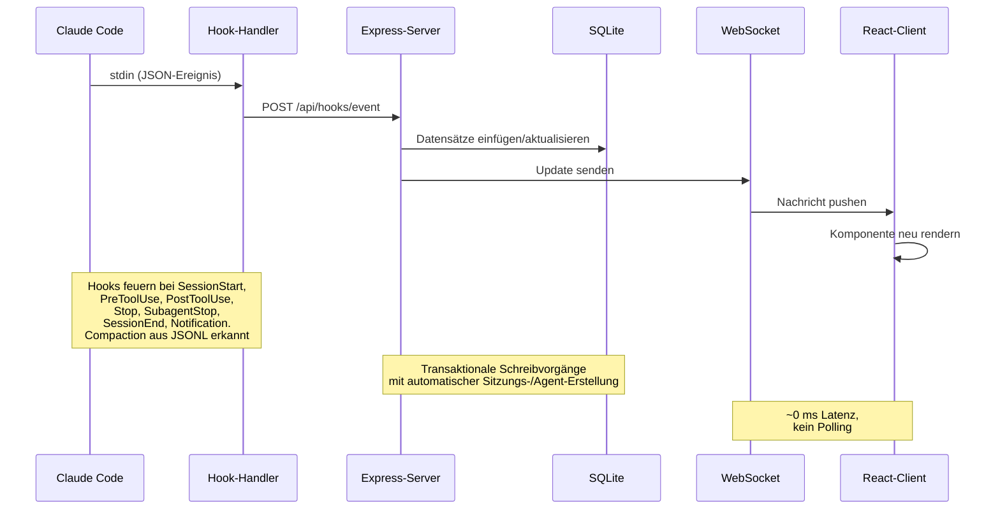

> [!IMPORTANT]
> Siehe [ARCHITECTURE.md](./ARCHITECTURE.md) für einen tiefen Einblick in Serverarchitektur, Datenbankschema, API-Routen, WebSocket-Design, Client-Routing, Ablauf des Hook-Handlers, Deployment-Modi und detaillierte Lebenszyklusdiagramme für Sitzungen und Agents.

### Hook-Lebenszyklus

1. **Claude Code** löst einen Hook bei Sitzungsstart, Tool-Nutzung, Rundenende, Abschluss eines Subagents und Sitzungsende aus
2. Der **Hook-Handler** (`scripts/hook-handler.js`) liest das JSON-Ereignis von stdin, ermittelt laufende Dashboards über `~/.claude/.agent-dashboard.json` (oder `CLAUDE_DASHBOARD_PORT`, falls gesetzt) und sendet dieselbe Payload per POST an **ein Ingestion-Ziel pro eindeutigem SQLite-Datenverzeichnis** (der niedrigste Port gewinnt, wenn Docker und `npm run dev` sich `~/.claude/agent-dashboard` teilen, sodass Ereignisse nie doppelt eingelesen werden). Server mit **unterschiedlichen** Datenbanken (z. B. die Desktop-App mit ihrem eigenen Application-Support-Verzeichnis neben `npm run dev`) erhalten weiterhin jeweils die Hooks. Er schlägt mit einem Sicherheits-Timeout von 5 s still fehl, damit er Claude Code nie blockiert, und die Promises pro Ziel werden nie abgelehnt, sodass ein einzelner toter Listener die anderen nicht aushungern kann.
3. Der **Server** verarbeitet das Ereignis in einer SQLite-Transaktion:
   - Legt Sitzungen und Haupt-Agents beim ersten Kontakt automatisch an
   - Erkennt Aufrufe des Tools `Agent`, um die Erstellung von Subagents zu verfolgen
   - Bei `SessionStart` setzt er `awaiting_input_since` von Sitzung und Haupt-Agent, sodass eine frische CLI, die am Prompt wartet, sofort in **Wartend** landet
   - Bei `UserPromptSubmit` (der Benutzer drückt Enter) löscht er das Warte-Flag und setzt den Haupt-Agent auf `working` — das einzige verlässliche Signal, dass reine Text-Runden des Assistants begonnen haben, da diese kein `PreToolUse` senden
   - Setzt den Agent bei `PreToolUse` auf „working“ (löscht dabei auch das Warte-Flag) und hält ihn über `PostToolUse` arbeitend
   - Bei `Stop` (Claude hat die Antwort beendet) wechselt der Haupt-Agent zu „waiting“ — Claude hat seine Runde beendet, der Ball liegt beim Benutzer. Hintergrund-Subagents laufen weiter. Die Sitzung bleibt `active`. Ein Stop mit `stop_reason=error` setzt den Agent auf `error` und die Sitzung auf `error`
   - Bei einer Berechtigungs-`Notification` (per Nachrichtenmuster erkannt: `permission`, `waiting for input`, `needs your approval`, …) setzt er den Agent auf `waiting` und `awaiting_input_since`
   - `SubagentStop` löscht das Warte-Flag bewusst NICHT (das Ende eines Hintergrund-Subagents sagt nichts über den Menschen aus)
   - Markiert Subagents einzeln über `SubagentStop` als abgeschlossen. Nachdem `res.json()` zurückgekehrt ist, startet er ohne zu warten einen `scanAndImportSubagents`-Durchlauf, der die Dateien `subagents/agent-*.jsonl` der Sitzung durchgeht, `tool_use`- ↔ `tool_result`-Blöcke über `tool_use_id` paart und `PreToolUse`- + `PostToolUse`-Ereignisse unter der eigenen `agent_id` jedes Subagents ausgibt — so wird die Lücke geschlossen, durch die Subagent-interne Tool-Aufrufe sonst für das Dashboard unsichtbar blieben
   - Bei `SessionEnd` (der CLI-Prozess endet) entfernt er das Warte-Flag. Ist die Sitzung in `error`, bleibt der Fehlerzustand erhalten; andernfalls werden alle Agents + die Sitzung als `completed` markiert
   - Bei `SessionStart` wird jede andere aktive Sitzung ohne Aktivität seit `DASHBOARD_STALE_MINUTES` (Standard 180 = 3 h, per Umgebungsvariable änderbar) automatisch als „abandoned“ markiert und ihre Agents abgeschlossen. Das deckt `/resume` innerhalb einer Sitzung, Ctrl+C und andere Fälle ab, in denen eine Sitzung ohne sauberes `SessionEnd` verwaist
   - Reaktiviert abgeschlossene/fehlerhafte/abgebrochene Sitzungen, wenn neue Arbeitsereignisse eintreffen (Sitzung fortgesetzt). Stop- und SubagentStop-Ereignisse reaktivieren ebenfalls abgeschlossene/abgebrochene Sitzungen — das deckt bereits vor dem Serverstart importierte Sitzungen ab, bei denen das erste Hook-Ereignis ein Stop sein kann
   - **Fehlerwiederherstellung**: Nur `UserPromptSubmit` und `PreToolUse` können eine Sitzung von `error` zurück auf `active` bringen — ein Zeichen, dass der Benutzer aktiv einen neuen Versuch gestartet hat
   - Erkennt Konversations-Compaction (`isCompactSummary`-Einträge im JSONL-Transkript) und erzeugt `Compaction`-Agents + -Ereignisse. Token-Basiswerte bleiben über Compactions hinweg erhalten, sodass keine Nutzung verloren geht. Transkript-Lesevorgänge nutzen einen gemeinsamen, `stat`-basierten Cache mit inkrementellem Lesen per Byte-Offset — nur seit dem letzten Lesen angehängte Bytes werden geparst, was bei langen Sitzungen etwa 50-fache Beschleunigung bringt
   - Extrahiert API-Fehler (`isApiErrorMessage`-Einträge: Kontingentgrenzen, Ratenlimits, invalid_request) und rohe `type: "error"`-Antworten aus JSONL-Transkripten und speichert sie als `APIError`-Ereignisse. Rundendauern (`system` mit Untertyp `turn_duration`) werden als `TurnDuration`-Ereignisse gespeichert. Fehler in Tool-Ergebnissen (`toolUseResult.is_error`) werden als `ToolError`-Ereignisse verfolgt
   - **Watchdog zur Fehlererkennung** — ein Hintergrund-Timer läuft alle 15 Sekunden und prüft aktive Sitzungen ohne jüngste Hook-Ereignisse (älter als 10 s). Er liest ihre Transkriptdateien erneut auf der Suche nach API-Fehlern (Authentifizierungsfehler, Ratenlimits, erschöpftes Kontingent), leitet für importierte Sitzungen ohne `transcript_path` in den Ereignisdaten die Transkriptpfade aus dem `cwd` der Sitzung ab und setzt Sitzungen/Agents auf `error`, wenn API-Fehler gefunden werden. Das erfasst Fälle, in denen die Claude-CLI nach einem API-Fehler keinen Hook auslöst (z. B. 401-Authentifizierungsfehler, bei denen die CLI den Fehler anzeigt und wartet)
   - **Wiederherstellung nach Benutzerabbruch (Esc)** — das Abbrechen einer Runde mit `Esc` löst **keinen Hook** aus (eine dokumentierte Einschränkung von Claude Code), sodass der Haupt-Agent ohne Eingreifen für immer in `working` hängen bliebe. Derselbe 15-s-Watchdog stellt diese Fälle auf zwei Wegen wieder her: (1) Hinterlässt der Abbruch eine Markierung `[Request interrupted by user]` im Transkript (Esc *nach* einer Ausgabe), kennzeichnet der Transkript-Cache dies über `pendingInterrupt` — rein aus der Reihenfolge im Transkript abgeleitet (letzte Unterbrechung gegenüber letzter echter Rundenaktivität, dieselbe Uhr, also auch bei einem Abbruch unter einer Sekunde zuverlässig) —, und die Sitzung wechselt innerhalb von ~15 s zu **Wartend**; (2) wird Esc *vor jeder Ausgabe* gedrückt, schreibt Claude Code gar keine Markierung, daher greift ein Leerlauf-Timeout: Ist der Haupt-Agent `working`, **ohne laufendes Tool**, und hat sich **weder ein Hook-Ereignis noch das Transkript** seit `DASHBOARD_WORKING_IDLE_SECONDS` (Standard `120`) bewegt, gilt die Runde als tot und die Sitzung wechselt zu **Wartend**. Beide Wege protokollieren ein `Interrupted`-Ereignis und bringen die Sitzung in denselben Wartend-Zustand wie ein normales `Stop`. Streaming-Ausgaben (Transkript wächst noch) und laufende Tool-Aufrufe (`current_tool` gesetzt) sind ausgenommen; ein seltener falscher Wechsel heilt beim nächsten echten Hook von selbst
   - **Bereinigung toter Sitzungen per Lebenszeichenprüfung** — das Beenden von Claude Code (Ctrl+C, Schließen des Terminals) löst einen `SessionEnd`-Hook aus, doch läuft das Dashboard in diesem Moment nicht, ist das Ereignis für immer verloren, und die Sitzung bliebe bis zum Inaktivitätsdurchlauf (standardmäßig 3 h) in **Wartend**. Derselbe 15-s-Watchdog schließt die Lücke mit einer **Prozess-Lebenszeichenprüfung**: Er listet laufende `claude`-CLI-Prozesse auf (`ps` + `lsof` unter macOS, `/proc` unter Linux) und schließt jede `active`-Sitzung ab, deren `cwd` keinen lebenden claude-Prozess hat — sie landet im selben `completed`-Zustand wie bei einem echten `SessionEnd`, mit einem synthetischen `SessionEnd`-Ereignis in der Zeitleiste. Schutzmechanismen: Bei Watchdog-Durchläufen darf das Transkript der Sitzung seit mindestens `DASHBOARD_LIVENESS_IDLE_SECONDS` (Standard `60`; ohne Transkript auf der Festplatte dient der letzte Hook-Schreibvorgang als Ersatzuhr) nicht beschrieben worden sein — die **Durchläufe beim Start überspringen diese Bedingung vollständig**, sodass eine Sitzung, die auch nur eine Sekunde vor dem Start beendet wurde, sofort bereinigt wird —, und die Prüfung meldet „keine Antwort“ (ohne etwas zu ändern) unter Windows, in Containern (Host-Prozesse sind dort unsichtbar), wenn `ps`/`lsof` fehlschlagen oder wenn sie über `DASHBOARD_LIVENESS_PROBE=0` explizit deaktiviert ist. In einem **gemischten** Deployment überspringt die Bereinigung zudem automatisch jede Sitzung, deren `cwd` kein absoluter POSIX-Pfad ist — eine über gemeinsame Hooks von einem anderen Rechner weitergeleitete Sitzung meldet den Pfad ihres Ursprungsrechners (z. B. ein Windows-`D:\Git\ai-deck`), den ein lokaler `ps`/`lsof`/`/proc`-Scan nie zuordnen kann, sodass entfernte Sitzungen geschützt sind, ohne die Prüfung für wirklich lokale abzuschalten. **Sitzungen aus entfernten Datenquellen** (`sessions.source` ≠ `local`) werden ebenfalls immer übersprungen — ihr `cwd` ist berechtigterweise ein absoluter POSIX-Pfad auf einem anderen Rechner, die lokale Prozessprüfung sagt also nichts über sie aus; ihr Lebenszyklus gehört vollständig dem oben beschriebenen Abgleich der entfernten Synchronisierung. Ein falscher Abschluss heilt von selbst: Das nächste Hook-Ereignis reaktiviert die Sitzung. Neben dem 15-s-Takt des Watchdogs läuft die Bereinigung **sofort beim Start** (sie räumt tote Sitzungen eines früheren Laufs aus der DB, bevor sie überhaupt angezeigt werden) und **erneut ~5 s später** (für die Sitzungen, die die Startsynchronisierung gerade importiert hat), sodass eine Sitzung, die bei gestopptem Dashboard beendet wurde, nie als Wartend erscheint
   - Ein periodischer Serverdurchlauf erfasst abgebrochene Sitzungen und neue Compactions, die der ereignisbasierten Erkennung entgangen sind (z. B. löst `/compact` keinen Hook aus, `/resume` wenige Sekunden nach dem Anlegen der Sitzung). Der Takt wird aus `DASHBOARD_STALE_MINUTES` abgeleitet (¼ des Schwellenwerts, begrenzt auf 60 s – 5 min). Der Durchlauf liest `transcript_path` direkt aus jeder aktiven Sitzungszeile (ein kleiner Indexzugriff), statt dafür die Ereignistabelle zu durchsuchen; die Spalte wird vom Hook-Handler befüllt, sobald er zum ersten Mal einen Transkriptpfad sieht, und von der Migration in `db.js` einmalig aus vorhandenen Ereignissen nachgetragen, mit einem partiellen Index `idx_sessions_active_tp`, der genau die vom Durchlauf gelesenen Zeilen abdeckt. Der Durchlauf teilt den Transkript-Cache mit dem Hook-Handler und vermeidet so doppelte E/A. Die Bereinigung abgebrochener Sitzungen entfernt außerdem den zugehörigen Eintrag aus dem Transkript-Cache, um den Speicher zu begrenzen. Sitzungen aus **entfernten Datenquellen** (`source` ≠ `local`) bleiben nur so lange spiegelgesteuert, wie ihr zugehöriger Claude-Code- oder Codex-Anbieter gesund ist; ist dieser nicht verfügbar, fehlerhaft oder hängt in `syncing`, wenden die periodische und die Start-Bereinigung die normale Inaktivitätsregel an, damit eine alte Wartend-Karte nicht ewig bestehen bleibt
   - Die **kontinuierliche Projektsynchronisierung** (`startSessionSync`) hält `~/.claude/projects` über den einmaligen, per Marker gesteuerten Startnachtrag hinaus auffindbar: Ein später hinzugefügtes Projekt, dessen Sitzungen nie über Hooks laufen, bliebe sonst bis zu einem manuellen Neuscan unsichtbar. Ein sofortiger Durchlauf beim Start, ein entprelltes `fs.watch` (rekursiv unter macOS/Windows; unter Linux Wurzel + direkte Kinder) und ein Polling über `DASHBOARD_SESSION_SYNC_MS` (Standard 30 s; `0` deaktiviert das Polling, der Watcher bleibt) teilen einen mtime-Cache und einen zusammengefassten Durchlauf, der nur Dateien neu parst, deren mtime vorgerückt ist — und eine bereits importierte, unveränderte Sitzung ohne erneutes Parsen überspringt, sodass die Kosten eines Neustarts O(neue/geänderte Dateien) bleiben. Jede neu entdeckte oder gewachsene Sitzung sendet `session_created`/`session_updated` sowie ihren Haupt-Agent, dieselben Frames, die auch Hooks erzeugen
4. Der **WebSocket** sendet die Änderung an alle verbundenen Clients
5. Die **UI** empfängt das Update und rendert die betroffenen Komponenten in Echtzeit neu, ohne Polling.

### Zustandsautomat der Agents

Gespeicherte Status: `working | waiting | completed | error`. Die
Spalte `awaiting_input_since` ist ergänzend — sie hält fest, wann der Agent
zu warten begann, und dient der Anzeige der Dauer, doch `waiting` ist inzwischen ein
echter gespeicherter Status.

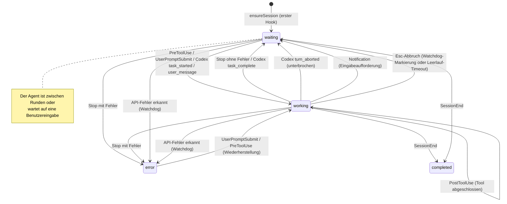

### Zustandsautomat der Sitzungen

Gespeicherte Status: `active | completed | error | abandoned`. Der
Sitzungszustand **Wartend** ist eine UI-Überlagerung (status=`active` mit
gesetztem `awaiting_input_since`).

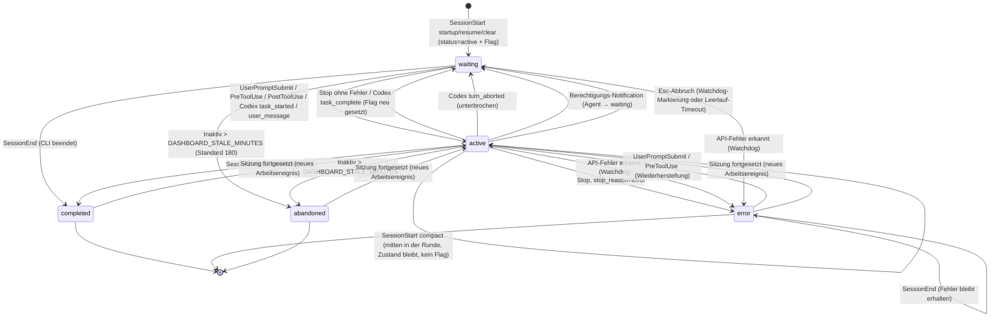

### Ablauf der Kostenberechnung

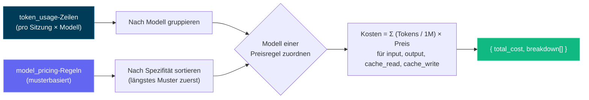

> [!IMPORTANT]
> Der Ablauf der Kostenberechnung basiert auf der Token-Nutzung und den Preisregeln der Modelle. Halten Sie Ihre Preisregeln aktuell, damit die Kosten korrekt sind. Aktualisieren Sie die Preistabelle der Modelle über die Seite Einstellungen, um die Kostenverfolgung genau zu halten — das Dashboard ruft Preisänderungen nicht automatisch aus externen Quellen ab. Sobald Sie die Preisregeln festgelegt haben, wendet das Dashboard sie rückwirkend auf alle Sitzungen an, für eine einheitliche Kostenauswertung.

---

## Konfiguration

| Umgebungsvariable | Standard | Beschreibung |
| ----------------------- | ------------- | --------------------------------------------- |
| `DASHBOARD_PORT` | `4820` | Port des Express-Servers |
| `CLAUDE_DASHBOARD_PORT` | `4820` | Port, über den der Hook-Handler den Server erreicht |
| `NODE_ENV` | `development` | Auf `production` setzen, um den gebauten Client auszuliefern |
| `DASHBOARD_UPDATE_CHECK` | _(aktiviert)_ | Auf `0` / `false` / `off` setzen, um die periodische Prüfung des Git-Upstreams zu deaktivieren |
| `DASHBOARD_UPDATE_CHECK_INTERVAL_MS` | `300000` (5 min) | Intervall zwischen automatischen Prüfungen; Minimum 60 000 ms. Benutzer können im Update-Dialog oder in der Seitenleiste auch auf **Jetzt prüfen** klicken, um eine Prüfung bei Bedarf auszuführen. |
| `DASHBOARD_STALE_MINUTES` | `180` (3 h) | Minuten Inaktivität, bevor eine noch `active` Sitzung (auch eine, die in **Wartend** auf Benutzereingabe steht — „Wartend“ ist eine UI-Überlagerung auf einer `active`-Zeile, kein gespeicherter Status) automatisch als **abandoned** markiert wird und aus der Liste der aktiven verschwindet. Durchgesetzt vom 15-s-Watchdog und vom periodischen Wartungsdurchlauf (der alle ¼ dieses Werts läuft, begrenzt auf 60 s – 5 min). Senken Sie ihn (z. B. `60`) für ein kürzeres Leerlauf-Timeout |
| `DASHBOARD_WORKING_IDLE_SECONDS` | `120` | Leerlauf-Timeout im Arbeitszustand, um eine mit `Esc` **vor jeder Ausgabe** abgebrochene Runde wiederherzustellen (die keine Markierung im Transkript hinterlässt). Ist der Haupt-Agent `working` ohne laufendes Tool und hat sich so lange weder ein Hook-Ereignis noch das Transkript bewegt, setzt der Watchdog die Sitzung auf **Wartend**. Senken Sie ihn für schnellere Wiederherstellung, auf Kosten gelegentlicher falscher Wechsel bei langen stillen Thinking-Runden (die von selbst heilen). Cursor-Sitzungen nutzen dasselbe Timeout: Eine `working`-Runde, deren `~/.cursor`-Dateien und Hooks so lange ruhen, wechselt zu **Wartend** |
| `DASHBOARD_LIVENESS_PROBE` | `1` (an) | Auf `0` setzen, um die **Bereinigung toter Sitzungen per Lebenszeichenprüfung** des Watchdogs zu deaktivieren (die auf `ps`/`lsof` basierende Prüfung, die `active` lokale Claude-Code- oder Codex-Sitzungen abschließt, deren zugehöriger CLI-Prozess nicht mehr existiert — um ein bei gestopptem Dashboard verlorenes `SessionEnd` nachzuholen). Von **einem anderen Rechner** weitergeleitete Sitzungen (gemeinsame Hooks) melden ein nicht-POSIX-`cwd` und werden von der Bereinigung automatisch übersprungen, sodass ein gemischtes Deployment aus lokal + weitergeleitet sie nicht mehr abschalten muss; deaktivieren Sie sie nur bei einem rein entfernten Aufbau, in dem lokale Prozesse nichts beweisen. Unter Windows und in Containern automatisch deaktiviert |
| `DASHBOARD_LIVENESS_IDLE_SECONDS` | `60` | Leerlaufschwelle für die Lebenszeichen-Bereinigung **bei Watchdog-Durchläufen**: Eine Sitzung wird nur abgeschlossen, wenn ihr Transkript mindestens so lange nicht beschrieben wurde (ohne Transkript auf der Festplatte dient der letzte Hook-Schreibvorgang als Ersatzuhr), damit eine Sitzung mitten in einer Runde oder frisch fortgesetzt nie wegen eines vorübergehenden Fehlschlags der Prüfung verschwindet. Die Startdurchläufe ignorieren diese Schwelle — beim Start entscheidet allein die Prüfung, sodass kurz vor dem Start beendete Sitzungen sofort bereinigt werden |
| `DASHBOARD_SESSION_SYNC_MS` | `30000` | Polling-Intervall (ms) der kontinuierlichen Hintergrundsynchronisierung von `~/.claude/projects`, die nach dem Start hinzugefügte Projekte sichtbar macht, deren Sitzungen nie über Hooks laufen. Der `fs.watch`-Watcher löst ohnehin nahezu sofort aus; dieses Polling ist das Sicherheitsnetz (Watcher können Ereignisse verpassen / auf Netzwerkdateisystemen nicht auslösen). Auf `0` setzen, um das Polling zu deaktivieren und den Watcher weiterlaufen zu lassen |
| `DASHBOARD_CURSOR_HOME` | `~/.cursor` | Optionales natives Cursor-Home. Das Dashboard liest `projects/*/agent-transcripts`, verknüpft die Metadaten aus `chats`, trägt bestehende Sitzungen nach und speichert dauerhafte Konversations-Snapshots im Datenverzeichnis des Dashboards. |
| `DASHBOARD_CURSOR_SYNC_MS` | `5000` | Sicherheitsintervall (ms) für die Fingerprint-basierte Erkennung von Cursor-Chats/-Transkripten. Die Dateisystemüberwachung importiert CLI-Start und Prompt-Änderungen weiterhin sofort; `0` deaktiviert nur den periodischen Scan. |
| `DASHBOARD_CODEX_HOME` | `CODEX_HOME` oder `~/.codex` | Optionales lokales Codex-Zustandsverzeichnis. Rollouts werden nur aus seinem `sessions/`-Baum gelesen; das Speichern eines neuen Orts in den Einstellungen sichert diese nur für das Dashboard geltende Überschreibung, schaltet die Live-Überwachung neu und durchsucht den neuen Baum sofort. |
| `DASHBOARD_CODEX_SYNC_MS` | `4000` | Sicherheits-Polling-Intervall (ms) für nur angehängte Codex-Rollouts. Codex-Hooks lösen dieselbe inkrementelle Ingestion sofort aus; auf `0` setzen, um nur das Polling zu deaktivieren und den Dateisystem-Watcher, sofern verfügbar, zu behalten. |
| `DASHBOARD_CODEX_MAX_ATTEMPTS` | `5` | Anzahl aufeinanderfolgender fehlgeschlagener Ingestion-Versuche, die der Codex-Durchlauf für einen **unveränderten** Rollout aufwendet, bevor er ihn in Ruhe lässt. Der Durchlauf stellt einen Rollout, den er nicht lesen konnte, bewusst erneut in die Warteschlange, damit sich ein vorübergehender Fehler (`SQLITE_BUSY`, ein halb geschriebener Datensatz) beim nächsten Durchlauf erholt; ohne Grenze wiederholte sich ein *dauerhafter* Fehler für die gesamte Lebensdauer des Prozesses — etwa 21.600 Versuche pro Datei und Tag beim Standard von 4 s für `DASHBOARD_CODEX_SYNC_MS`, jeder mit einer Protokollzeile auf dem einzigen Node-Thread. Die Zählung umfasst den ersten Versuch, wird pro Datei geführt und vollständig zurückgesetzt, sobald sich Größe oder mtime der Datei ändern, sodass sich ein nur halb geschriebener Rollout von selbst erholt. Der Versuch, der das Budget aufbraucht, protokolliert einmalig und nennt die Grenze. Erhöhen Sie den Wert, wenn ein langsames oder unzuverlässiges Volume mehr als einige Durchläufe braucht, um sich zu stabilisieren |
| `DASHBOARD_CODEX_HOOK_IDLE_SECONDS` | `60` | Wie lange eine **nur per Hooks** laufende Codex-Sitzung — deren Lauf keinen Rollout auf die Festplatte geschrieben hat (`codex exec --ephemeral`) — eine als beendet gemeldete Runde unbeantwortet lassen darf, bevor das Dashboard schließt, dass ihr `SessionEnd`-Hook verloren ging. Nur eine Sitzung mit `awaiting_reason` gleich `stop` kommt infrage: Codex sendet `SessionEnd` wenige hundert ms nach `Stop`, ein unbeantwortetes `Stop` ist also ein echter Beleg. Stille ist bewusst nie der Auslöser — ein Lauf ohne Rollout sendet während eines ganzen Tool-Aufrufs überhaupt keine Hooks, eine Leerlaufregel würde also einen laufenden CI-Build mittendrin abschließen |
| `DASHBOARD_TASK_SUMMARY_TTL_MS` | `2000` | Zeitfenster (ms), in dem veraltete Ergebnisse aus dem Aufgabenfortschritts-Cache pro Transkript ausgeliefert werden, der hinter Listenanfragen mit `include_task_progress` **und** dem `todo_snapshot` der Sitzungsdetails steht. Gewachsene Transkripte werden inkrementell ab der letzten vollständigen JSONL-Zeile geparst (ein Wachstum von mehr als 32 MiB seit dem letzten Lesen beginnt mit einem frischen Tail-Scan neu), während diese Untergrenze weiterhin Schübe von Listen-Neuladungen bündelt (z. B. durch WebSocket-Ereignisse ausgelöste Dashboard-Aktualisierungen). Innerhalb des Fensters wird stattdessen ein gerade geparstes (leicht veraltetes, nur zur Anzeige bestimmtes) Ergebnis zurückgegeben; auf `0` setzen, um jede Anhängung sofort zu parsen |
| `DASHBOARD_REMOTE_SYNC_MS` | `15000` (15 s) | Polling-Intervall (ms) der Hintergrundsynchronisierung der **entfernten Datenquellen**, die für jede aktivierte Quelle unabhängig `~/.claude/projects` und `~/.codex/sessions` (plus den schlanken Titelindex `session_index.jsonl` von Codex) per SSH abruft und jeweils über den lokalen Importer neu importiert. Neue/aktivierte Quellen synchronisieren sich ebenfalls sofort. Auf `0` setzen, um den Poller zu deaktivieren (manuelle / bedarfsweise Synchronisierungen funktionieren weiterhin) |
| `DASHBOARD_REMOTE_ACTIVE_WINDOW_MS` | `600000` (10 min) | Aktualitätsfenster für den Live-Status einer Sitzung aus einer **entfernten Datenquelle**. Bei jeder Synchronisierung gilt eine entfernte Claude-Code- oder Codex-Sitzung, deren gespiegeltes Transkript ein **letztes JSONL-Ereignis** innerhalb dieses Fensters hat, als noch laufend (`active`); sobald der Spiegel länger nicht vorankommt, wird die Sitzung auf `completed` abgeglichen. Entfernte Sitzungen erhalten keine Live-Hooks, daher ersetzt der anbieterbewusste Spiegelabgleich die lokale Lebenszeichenprüfung; fehlgeschlagene, nicht verfügbare oder hängende Anbieterspiegel fallen auf den normalen Inaktivitätsdurchlauf zurück. Erhöhen Sie den Wert für langsame Verbindungen oder sehr lange Leerlaufrunden |
| `DASHBOARD_REMOTE_SYNC_TIMEOUT_MS` | `600000` (10 min) | Timeout (ms) pro Quelle für eine einzelne entfernte Synchronisierung (`scp`-Abruf + Import), bevor sie abgebrochen wird |
| `DASHBOARD_REMOTE_TEST_TIMEOUT_MS` | `15000` (15 s) | Timeout (ms) für die SSH-Probe **Testen** (`POST /api/remote-sources/:id/test`), die prüft, ob eine entfernte Quelle erreichbar ist |
| `DASHBOARD_HOST` | `127.0.0.1` | Schnittstelle, an die der Server bindet. Standardmäßig Loopback (nicht aus dem Netzwerk erreichbar). Auf `0.0.0.0` setzen, um im LAN freizugeben (protokolliert beim Start eine Warnung) |
| `DASHBOARD_TOKEN` | _(nicht gesetzt)_ | Wenn gesetzt, muss jede `/api/*`-Anfrage und der WebSocket das Token vorweisen (`Authorization: Bearer <token>`, Header `x-dashboard-token` oder `?token=`). Standardmäßig aus — die Loopback-Bindung ist die Vertrauensgrenze |
| `DASHBOARD_TOKEN_FILE` | _(nicht gesetzt)_ | Dateibasiertes Dashboard-Token für Docker-/Kubernetes-Secrets; ein direktes `DASHBOARD_TOKEN` hat Vorrang |
| `DASHBOARD_HOOK_TOKEN` / `DASHBOARD_HOOK_TOKEN_FILE` | _(nicht gesetzt)_ | Unabhängiges Token für die lokalen Hook-Routen (`/api/hooks/event`, `/api/hooks/codex`), wenn sie über Loopback hinaus freigegeben sind |
| `REMOTE_PUSH_TOKEN` / `REMOTE_PUSH_TOKEN_FILE` | _(nicht gesetzt)_ | Separates Token, das `POST /api/hooks/ingest-batch` schützt (aus dem Internet erreichbare Push-Route, standardmäßig deaktiviert). Bewusst unabhängig vom obigen `DASHBOARD_HOOK_TOKEN` — dessen Setzen darf nicht zugleich diese aus dem Internet beschreibbare Route öffnen |
| `DASHBOARD_ALLOWED_HOSTS` | _(Loopback)_ | Kommagetrennte zusätzliche `Host`-Werte, die bei HTTP- und WebSocket-Upgrades erlaubt sind (Schutz gegen DNS-Rebinding). Tragen Sie hier Ihre LAN-Hostnamen ein, wenn Sie über Loopback hinaus binden |
| `DASHBOARD_ENV_PATH` | `.env` des Repos | Beschreibbarer dotenv-Pfad, den die Einstellungen zum Speichern der Claude-/Codex-Home-Überschreibungen nutzen; Standard im Container `/app/config/.env` |
| `CCAM_DASHBOARD_URL` | _(localhost-Erkennung)_ | Optionales entferntes Hook-Ziel. URLs außerhalb von Loopback müssen HTTPS und ein Hook-Token verwenden |
| `CCAM_HOOK_TOKEN` / `CCAM_HOOK_TOKEN_FILE` | _(nicht gesetzt)_ | Zugangsdaten des Hook-Clients, gesendet als `x-ccam-hook-token` |

> [!IMPORTANT]
> **Standardmäßig sicher.** Der Server bindet an `127.0.0.1` und ist ab Werk **nicht** aus dem Netzwerk erreichbar ([GHSA-gr74-4xfh-6jw9](./.github/SECURITY.md)). Um ihn im LAN freizugeben, setzen Sie **sowohl** `DASHBOARD_HOST` (z. B. `0.0.0.0`) **als auch** `DASHBOARD_TOKEN` (das dann `/api/*` und den WebSocket schützt) und tragen Ihre LAN-Hostnamen in `DASHBOARD_ALLOWED_HOSTS` ein. Details in [`.env.example`](./.env.example) und [`.github/SECURITY.md`](./.github/SECURITY.md).

Bei Git-Klonen führt der Server regelmäßig ein `git fetch` von `origin` aus und vergleicht Ihren Checkout mit `origin/master`, `origin/main` oder `origin/HEAD`. Liegen Sie zurück, erscheint eine Meldung im Serverterminal und in der UI ein Dialog mit dem genauen auszuführenden Befehl. Das Dashboard führt nie selbst einen Pull oder Neustart aus — Sie kopieren den Befehl, führen ihn in einem Terminal aus und starten den Server dann so neu, wie Sie ihn gestartet haben.

---

## `ccam`-CLI

Der gesamte Funktionsumfang des Dashboards ist auch aus jedem Terminal über die abhängigkeitsfreie **`ccam`**-CLI (`bin/ccam.js`) verfügbar. Sie wird von `npm run setup` automatisch verlinkt (über `npm link`), danach funktioniert `ccam <command>` in jedem Verzeichnis. Sie findet das laufende Dashboard über `~/.claude/.agent-dashboard.json` (dieselbe Registry laufender Server, die auch der Hook-Handler nutzt), mit den Umgebungsüberschreibungen `CLAUDE_DASHBOARD_PORT` / `DASHBOARD_PORT`, und fällt auf `http://127.0.0.1:4820` zurück.

```bash
# Server
ccam status                       # ● running / ○ not running indicator
ccam start [--port N]             # start the server in the background (detached)
ccam stop                         # stop the background server gracefully
ccam repl                         # interactive shell (also: shell, i)

# Monitoring
ccam health                       # is the dashboard up?
ccam stats                        # totals, today's events, status distributions
ccam kanban                       # sessions + agents grouped by status columns
ccam tail [--session <id>]        # live event feed in the terminal (Ctrl+C stops)

# Data
ccam sessions [--status s] [--q text] [--limit n]
ccam session <id>                 # detail: agent tree, cost, recent events
ccam agents   [--status s] [--session id]
ccam events   [--session id] [--limit n]

# Insights
ccam analytics                    # token totals, top tools, agent types
ccam workflows [--session id]     # workflow intelligence stats and patterns
ccam runs [--session id]          # dynamic Workflow-tool runs
ccam cost [--session <id>]        # total estimated cost with per-model breakdown
                                  # (--session scopes to one; shows tool surcharges;
                                  #  warns about models with usage but no pricing rule)

# Alerts & webhooks
ccam alerts [--unacked]           # fired-alert feed
ccam alerts ack <id> | ack-all    # acknowledge alerts
ccam rules                        # list alert rules
ccam webhooks                     # list webhook targets
ccam webhooks test <id>           # send a synthetic test alert

# Pricing
ccam pricing                      # list model pricing rules (incl. fast-mode & intro columns)
ccam pricing set <pattern> --input N --output N [--cache-read N --cache-write N]
                 [--cache-write-1h N] [--fast-input N --fast-output N]
                 [--intro-input N --intro-output N … --intro-until YYYY-MM-DD]
ccam pricing delete <pattern>
ccam pricing reset

# Import
ccam import rescan                # re-scan ~/.claude/projects
ccam import path <dir>            # import every .jsonl under a directory

# Administration
ccam doctor                       # connectivity, hooks, and database diagnosis
ccam info                         # raw system info JSON
ccam export [file.json]           # full JSON data export
ccam import-data <file.json>      # restore an export (idempotent, non-destructive)
ccam cleanup --hours N --days M   # abandon stale / purge old sessions
ccam reinstall-hooks              # reinstall Claude Code hooks
ccam update-check                 # is the checkout behind upstream? (prints the update command)
ccam clear-data --yes             # delete ALL data (requires --yes)
ccam open                         # open the dashboard in your browser
ccam version                      # print the CLI version (also --version / -v)
```

API-gestützte Befehle benötigen einen laufenden Server — läuft er nicht, **greifen schreibgeschützte Befehle direkt auf `data/dashboard.db` zurück** (mit einem ausdrücklichen Banner `⚠ Offline mode`, wobei gespeicherte, aber tote `active`-Sitzungen in der Anzeige von derselben Prozess-Lebenszeichenprüfung korrigiert werden, die der Watchdog des Servers nutzt), während Befehle, die ohne Server nicht korrekt laufen können (Live-`tail`, Analyse-/Kostenberechnungen, Änderungen), die Anzeige `○ Dashboard server is NOT running` mit dem konkreten Grund und den Startbefehlen ausgeben; `ccam start` startet einen Produktionsserver im Hintergrund. Lesebefehle sind immer sicher; der einzige destruktive Befehl (`clear-data`) verweigert die Ausführung ohne ausdrückliches `--yes`. Die Ausgabe ist eine vollwertige Terminal-UI — umrahmte Tabellen mit rechtsbündigen Zahlenspalten, Statussymbole (`● active`, `○ waiting`, `✔ completed`, `✖ error`), Inline-Balkendiagramme für Statistiken/Analysen/Kosten und echte Agent-Bäume mit `├─`/`└─` — mit ANSI-Farben, die auf einem TTY automatisch aktiv, in einer Pipe aus und über `--no-color` / `NO_COLOR` / `FORCE_COLOR` steuerbar sind. Für eine Live-Überwachung öffnet **`ccam repl`** (Aliasse `shell` / `i`) eine interaktive Shell, in der Sie Befehle ohne das Präfix `ccam` eingeben — mit CCAM-Willkommensbanner, Tab-Vervollständigung, dauerhaftem Verlauf per Pfeiltasten, einem Prompt mit Live-Serverstatus (`● host` läuft / `○ offline` gestoppt), einem gruppierten Menü `help` / `help <cmd>` und einem eingebauten `watch [secs] <cmd>`, der jeden Befehl automatisch aktualisiert (z. B. `watch 5 kanban`); jede Zeile läuft in einem isolierten Kindprozess, sodass eine Offline-Ablehnung oder ein blockierendes `tail` die Shell nie zum Absturz bringt. Ist `ccam` nicht in Ihrem PATH (z. B. weil `npm link` erhöhte Rechte brauchte), führen Sie einmal `npm link` im Repo-Stamm aus. Vollständige Referenz — Schalter, Erkennungsreihenfolge, REPL, Sicherheitsmodell, Skripting/Exit-Codes, Fehlerbehebung — in [docs/CLI.md](./docs/CLI.md).

## npm-Skripte

| Befehl | Beschreibung |
| ----------------------- | ---------------------------------------------------------- |
| `npm run setup` | Installiert die Abhängigkeiten von Wurzel/Client/Erweiterung/MCP, baut MCP und verlinkt `ccam` |
| `npm run update:pull-setup` | `git pull --ff-only`, dann `npm run setup` (manuelles Upgrade) |
| `npm run dev` | Startet Server (Watch-Modus) + Client (Vite-HMR) gleichzeitig |
| `npm run dev:server` | Startet Express mit entprelltem Quell-Watcher und sauberem Neustart |
| `npm run dev:client` | Startet nur den Vite-Entwicklungsserver |
| `npm run build` | Baut den React-Client nach `client/dist/` |
| `npm start` | Startet den Produktionsserver (liefert den gebauten Client aus) |
| `npm test` | Führt die gesamte Suite aus (Server `node --test` + Client Vitest) |
| `npm run verify` | Führt die gesamte lokale Prüfung in einem Befehl aus: Prüfung der Autoren-Header, Prettier-Check, Client-Typecheck, Backend-Tests, Frontend-Tests |
| `npm run check:headers` | Prüft, dass jede betroffene Quelldatei den Autoren-Header trägt |
| `npm run typecheck:client` | Typecheck des Clients (`tsc -b`) — dieselbe Prüfung, die der Produktions-Build vor Vite ausführt |
| `npm run test:server` | Führt die Backend-Tests aus (`node --test server/__tests__/`) |
| `npm run test:client` | Führt die Vitest-Tests des Frontends aus, einschließlich **Render-Snapshots für jeden Bildschirm** (`client/src/pages/__tests__/screens.snapshot.test.tsx`); erzeugen Sie die Referenzen nach beabsichtigten UI-Änderungen mit `cd client && npx vitest run -u` neu |
| `npm run install-hooks` | Konfiguriert die Claude-Code-Hooks in `~/.claude/settings.json` |
| `npm run seed` | Füllt die Datenbank mit Beispieldaten |
| `npm run import-history` | Importiert ältere Sitzungen aus `~/.claude/` (läuft auch beim Start) |
| `npm run reconcile-tokens` | Aktualisiert die Token-Summen importierter Sitzungen (senkt nie eine Summe) |
| `npm run repair-tokens` | Leitet die Token-Summen **ohne Workflows** für jede **Claude**-Sitzung mit Transkript auf der Festplatte neu ab (unter `~/.claude/projects/` oder über den gespeicherten `transcript_path` der Sitzung) und setzt die Compaction-Basiswerte auf null; Workflow- und Codex-Zeilen bleiben erhalten. Einmalige Reparatur für Datenbanken, die von der Summierung pro Datensatz vor v2.0.9 oder von ausgelassener Nutzung flacher Subagents desselben Modells betroffen sind. Stoppen Sie zuerst das Dashboard |
| `DASHBOARD_TOKEN_REPAIR` | Standardmäßig aktiviert (`1`). Einmalige automatische Reparatur historischer Token-Summen, die von Aufblähung pro Datensatz oder ausgelassenen flachen Subagents desselben Modells betroffen sind. Live-Korrekturen können nicht jede abgeschlossene Sitzung erneut aufsuchen, und `replaceTokenUsage` kann einen alten Höchststand nicht senken. Läuft einmal pro Datenbank (per Marker gesteuert, aus dem Startpfad verschoben, übersprungen, solange ein anderes Dashboard das Datenverzeichnis teilt) und sichert die alten Zeilen zuerst in `token_usage_pre_repair_v2`. Auf `0` setzen, um sie zu überspringen und manuell mit `npm run repair-tokens` zu reparieren |
| `npm run clear-data` | Löscht alle Sitzungen, Agents, Ereignisse und Token-Nutzungen |
| `npm run mcp:install` | Installiert die Abhängigkeiten des lokalen MCP-Pakets (`mcp/`) |
| `npm run mcp:build` | Baut das TypeScript des MCP-Servers nach `mcp/build/` |
| `npm run mcp:start` | Startet den MCP-Server (stdio-Transport — für MCP-Hosts) |
| `npm run mcp:start:http` | Startet den MCP-Server (HTTP- + SSE-Transport auf Port 8819) |
| `npm run mcp:start:repl` | Startet den MCP-Server (interaktive REPL mit Tab-Vervollständigung) |
| `npm run mcp:dev` | Führt den MCP-Server im Dev-Modus aus (`tsx`, stdio) |
| `npm run mcp:dev:http` | Führt den MCP-Server im Dev-Modus aus (`tsx`, HTTP + SSE) |
| `npm run mcp:dev:repl` | Führt den MCP-Server im Dev-Modus aus (`tsx`, interaktive REPL) |
| `npm run mcp:typecheck` | Prüft die Typen der MCP-Quellen, ohne Build-Ausgabe zu erzeugen |
| `npm run extensions:sync` | Erzeugt Skill-Namen/OpenAI-Metadaten, Codex-Manifeste und beide Marketplaces neu |
| `npm run extensions:validate` | Validiert alle 14 Plugins im Doppelformat und die 66 gebündelten Skills |
| `npm run mcp:docker:build` | Baut das MCP-Container-Image mit Docker (`agent-dashboard-mcp:local`) |
| `npm run mcp:podman:build` | Baut das MCP-Container-Image mit Podman (`localhost/agent-dashboard-mcp:local`) |
| `npm run desktop:install` | Installiert Electron + electron-builder in den Workspace `desktop/` (baut `better-sqlite3` für die ABI von Electron neu); prüft vorab den nativen Build von `better-sqlite3` und gibt bei einem Fehler konkrete Einrichtungshilfe aus (inkl. einer Alternative ohne Toolchain) |
| `npm run desktop:dev` | Baut und startet die Electron-Desktop-App für die lokale Entwicklung |
| `npm run desktop:build` | Kompiliert die TypeScript-Quellen des Desktops nach `desktop/out/` |
| `npm run desktop:test` | Führt den Smoke-Test des Desktops aus (startet Electron, prüft `/api/health`) |
| `npm run desktop:dmg` | Baut **beide** macOS-DMGs (arm64 + x64) — richtig für ein Release, **langsamer** (paketiert jede Architektur) |
| `npm run desktop:dmg:arm64` | Baut ein DMG nur für Apple Silicon — **schnell**, empfohlen für Ihren eigenen Mac |
| `npm run desktop:dmg:x64` | Baut ein DMG nur für Intel — **schnell** |
| `npm run desktop:dmg:universal` | Baut ein einzelnes zusammengeführtes **universelles** DMG (arm64 + x86_64) — optional, **am langsamsten**, nicht das, was das Release ausliefert |
| `npm run desktop:win` | Baut einen Windows-**NSIS-Installer** `.exe` (x64) — unter Windows ausführen |
| `npm run desktop:win:portable` | Baut eine **portable** Windows-`.exe` (ohne Installation, x64) — unter Windows ausführen |
| `npm run monitoring:install` | Führt `npm install` in `monitoring/` aus — lädt Prometheus + Grafana über `postinstall` herunter |
| `npm run monitoring:setup` | Alias für `monitoring:install` |
| `npm run monitoring:up` | Startet Prometheus (:9090) + Grafana (:3000) im Hintergrund (ohne Docker) |
| `npm run monitoring:down` | Stoppt den per npm verwalteten Monitoring-Stack |
| `npm run monitoring:start` | Monitoring-Stack im Vordergrund (Ctrl+C stoppt beide) |
| `npm run monitoring:docker:up` | Startet Prometheus + Grafana über Docker Compose |
| `npm run monitoring:docker:down` | Baut den Docker-Monitoring-Stack ab |
| `npm run monitoring:verify` | Zustandsprüfung von Dashboard, Prometheus, Grafana und Scrape-Ziel |
| `npm run docker:up` | Startet das Dashboard in Docker (`docker compose up -d --build`) |
| `npm run docker:down` | Stoppt den Dashboard-Container |
| `npm run docker:full:up` | Dashboard + authentifiziertes MCP + rootloses Nginx + Prometheus + Grafana |
| `npm run docker:full:down` | Baut den gesamten Docker-Stack ab |
| `npm run deploy:validate` | Prüft Docker, Compose, Nginx, Helm, Kustomize, Terraform, Abhängigkeitsaudits und die Ein-Schreiber-Invariante. Befunde sind nur Hinweise (Exit-Code 0); `CCAM_DEPLOY_VALIDATE_STRICT=1` macht daraus eine harte Schranke |

---

## Agent-Erweiterungen

Dieses Repository enthält eine umfassende Erweiterungsschicht für Claude Code und Codex:

- Claude Code: `CLAUDE.md`, `.claude/rules/`, `.claude/skills/`
- Claude-Subagents: `.claude/agents/`
- Codex: `AGENTS.md`, `.codex/rules/`, `.codex/agents/`, `.codex/skills/`
- Gemeinsame verteilbare Plugins: `plugins/`, jeweils mit `.claude-plugin/plugin.json` und `.codex-plugin/plugin.json`
- Marketplaces: `.claude-plugin/marketplace.json` für Claude Code und `.agents/plugins/marketplace.json` für Codex
- Open Agent Skills: Alle Plugin-Skills tragen kanonisches Frontmatter sowie `agents/openai.yaml`; `npx skills add hoangsonww/Claude-Code-Agent-Monitor --list` findet 77 Repository-Skills

### Architektur der Erweiterungen

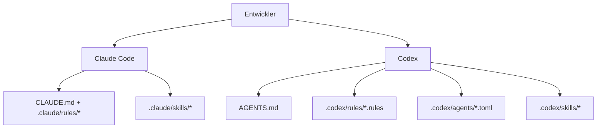

### Claude-Code-Schicht

- Dauerhafter Kontext:
  - [`CLAUDE.md`](./CLAUDE.md)
- Pfadbezogene Regeln:
  - [`.claude/rules/backend-node.md`](./.claude/rules/backend-node.md)
  - [`.claude/rules/frontend-react.md`](./.claude/rules/frontend-react.md)
  - [`.claude/rules/mcp-typescript.md`](./.claude/rules/mcp-typescript.md)
  - [`.claude/rules/docs-markdown.md`](./.claude/rules/docs-markdown.md)
  - [`.claude/rules/file-headers.md`](./.claude/rules/file-headers.md)
  - [`.claude/rules/wiki-i18n.md`](./.claude/rules/wiki-i18n.md)
  - [`.claude/rules/i18n-parity.md`](./.claude/rules/i18n-parity.md)
- Skills:
  - `repo-onboarding`
  - `ship-feature`
  - `version-release`
  - `mcp-operations`
  - `debug-live-issue`
  - `update-project-docs`
  - `file-headers`
  - `push-to-forked-pr`
  - `i18n-parity`
- Subagents:
  - `backend-reviewer`
  - `frontend-reviewer`
  - `mcp-reviewer`

### Codex-Schicht

- Dauerhafter Kontext:
  - [`AGENTS.md`](./AGENTS.md)
- Ausführungsrichtlinie:
  - [`.codex/rules/default.rules`](./.codex/rules/default.rules)
- Vorlagen für eigene Subagents:
  - [`.codex/agents/`](./.codex/agents)
- Skills:
  - [`.codex/skills/`](./.codex/skills)
- Einrichtung:
  - [`.codex/README.md`](./.codex/README.md)

---

## MCP-Integration

Dieses Projekt enthält einen lokalen MCP-Server in `mcp/` mit 97 Tools in 16 Domänenmodulen. Er stellt jede unterstützte App-Aktion bereit, darunter bereichsbezogene Datenabfragen, Transkripte/Bilder, Claude-, Cursor- und GPT-Preise, Workflows, Alarme/Webhooks, Importe und Backup-Wiederherstellung, Claude-/Codex-Konfiguration, Agent starten, entfernte Quellen, Einstellungen, Push und geschützte Wartung. Er unterstützt drei Transportmodi.

### MCP-Transportmodi

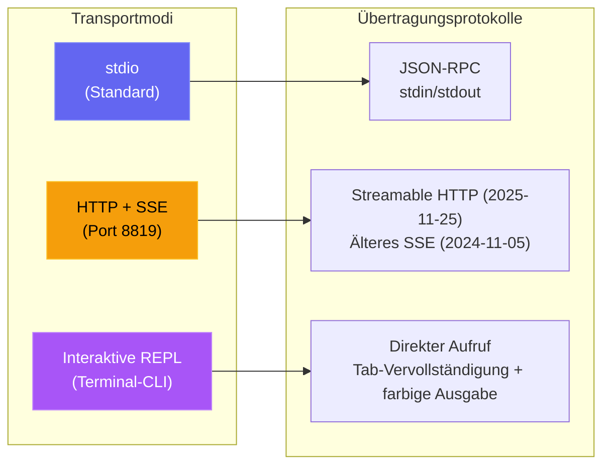

| Modus | Befehl | Einsatzzweck |
| --- | --- | --- |
| **stdio** | `npm run mcp:start` | Claude Code, Claude Desktop, MCP-Hosts in IDEs |
| **HTTP** | `npm run mcp:start:http` | Entfernte MCP-Clients, Web-Integrationen, mehrere Sitzungen |
| **REPL** | `npm run mcp:start:repl` | Betriebs-Debugging, manueller Tool-Aufruf, lokale Administration |

<p align="center">
  
</p>

### MCP-Architektur

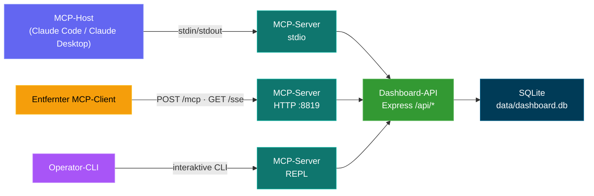

### MCP-Tool-Umfang

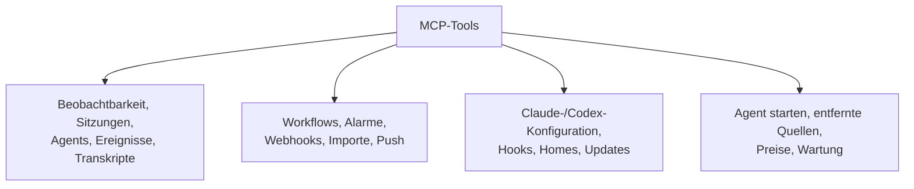

### MCP-Sicherheitsmodell

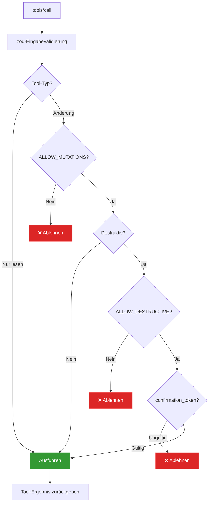

### MCP-Betriebsmodi

- Nur-Lese-Modus (Standard): `MCP_DASHBOARD_ALLOW_MUTATIONS=false`
- Admin-Modus: `MCP_DASHBOARD_ALLOW_MUTATIONS=true`
- Authentifiziertes Dashboard: Setzen Sie `MCP_DASHBOARD_API_TOKEN` / `_FILE` auf das Dashboard-Token
- Authentifizierter HTTP-/SSE-Transport: Setzen Sie `MCP_HTTP_AUTH_TOKEN` / `_FILE`; Clients senden Bearer-Authentifizierung oder `x-mcp-token`
- Transportschranken: Direktes Loopback-HTTP darf das Token tragen; Container-Host-Aliasse erfordern HTTPS; Weiterleitungen werden abgelehnt
- Payload-Schranken: 50 MiB pro hochgeladener Verlaufsdatei, insgesamt 100 MiB pro Aufruf, 10 MiB für binäre Antworten und 25 MiB für die Backup-Wiederherstellung
- Destruktiver Modus: erfordert alle drei:
  - `MCP_DASHBOARD_ALLOW_MUTATIONS=true`
  - `MCP_DASHBOARD_ALLOW_DESTRUCTIVE=true`
  - die Tool-Eingabe `confirmation_token: "CLEAR_ALL_DATA"`

Alle Details: [mcp/README.md](./mcp/README.md)

---

## API-Referenz

Alle Endpunkte geben JSON zurück. Fehlerantworten haben die Form `{ error: { code, message } }`.

### OpenAPI / Swagger / ReDoc

Es gibt drei Wege, die HTTP-API zu erkunden, alle gespeist aus einer einzigen OpenAPI-3.0.3-Spezifikation (Standard-Serverport `4820`):

| Methode | Pfad | Beschreibung |
| ------ | ------------------------------- | ------------------------------------------------------------------------------------------------- |
| `GET` | `/api/openapi.json` | Rohe OpenAPI-3.0.3-Spezifikation als JSON |
| `GET` | `/api/docs` | Interaktive **Swagger UI** — Anfragen direkt ausprobieren |
| `GET` | `/api/redoc` | **ReDoc**-Referenz — eine saubere, leseoptimierte dreispaltige Darstellung derselben Spezifikation |
| `GET` | `/api/redoc/redoc.standalone.js` | Selbst gehostetes ReDoc-Bundle (lokal über die Abhängigkeit `redoc` ausgeliefert, nie über ein CDN — funktioniert offline) |

Das OpenAPI-Dokument wird aus `server/openapi.js` (`createOpenApiSpec()`) erzeugt und mit ergänzenden Fragmenten unter `server/openapi-extra/` zusammengeführt. Swagger UI und ReDoc werden beide direkt vom Backend ausgeliefert; das ReDoc-Bundle wird lokal ausgeliefert (`GET /api/redoc/redoc.standalone.js`), sodass die Referenz vollständig offline / in abgeschotteten Netzen funktioniert, im Einklang mit der Projektregel ohne externe Ressourcen.

Die Abdeckung ist umfassend: Jede Backend-Route ist dokumentiert (82 Pfadeinträge) unter diesen Tags — Health, Sessions, Agents, Events, Stats, Metrics, Analytics, Hooks, Pricing, Workflows, Settings, Updates, Alerts, Webhooks, Push, CcConfig (Claude-Code-Konfigurations-Explorer), Run (vom Dashboard gestartete Läufe) und Documentation —, jeweils mit Parametern, Anfrage-/Antwortschemata, Beschreibungen auf Feldebene und realistischen Beispielen.

Eine versionierte **`openapi.yaml`** im Repo-Stamm spiegelt die Live-Spezifikation. Sie wird aus `server/openapi.js` erzeugt (nie von Hand bearbeitet) — erzeugen Sie sie nach API-Änderungen neu mit:

```bash
npm run openapi:yaml
```

### Prometheus-Metriken und Grafana

`GET /api/metrics` stellt die Live-Zähler des Dashboards bereit — Sitzungen/Agents nach Status, Ereignis- und Token-Summen, verbundene Echtzeit-Clients, konfigurierte entfernte Quellen, Laufzeit/Speicher des Prozesses und Build-Version — im Textformat von Prometheus, sodass CCAM von Ihrem eigenen Observability-Stack abgefragt werden kann. Ein schlüsselfertiger Prometheus- + Grafana-Stack mit **vier automatisch bereitgestellten Dashboards** (Standard-Startseite: **CCAM — Overview**) liegt in [`monitoring/`](./monitoring/README.md).

**npm (ohne Docker — macOS, Linux oder Windows):**

```bash
npm start                          # dashboard on :4820
npm run monitoring:install         # one-time: npm postinstall pulls binaries
npm run monitoring:up              # Grafana on :3000, auto-provisioned; see monitoring/README.md for credentials
```

**Docker / Podman** (wenn das Dashboard in einem Container läuft oder Sie Compose bevorzugen):

```bash
# Dashboard only
npm run docker:up

# Dashboard + Prometheus + Grafana (one command)
npm run docker:full:up

# Or mix: native/docker dashboard + docker monitoring
DASHBOARD_ALLOWED_HOSTS=host.docker.internal npm start   # or docker:up with same env
npm run monitoring:docker:up
npm run monitoring:verify
```

<p align="center">
  
  <br>
  <em>📊 <strong>Grafana · CCAM — Overview</strong> — Standard-Startdashboard (vier Dashboards automatisch bereitgestellt): Flottenübersicht, Datenbanksummen, Aufschlüsselungsdiagramme und Raten — alles aus Live-Abfragen von <code>/api/metrics</code></em>
</p>

<p align="center">
  
  <br>
  <em>🔥 <strong>Prometheus · CCAM-Konsole</strong> — vorgefertigte Startseite unter <code>/consoles/index.html</code>, die Prometheus direkt nach Scrape-Zustand, Sitzungssummen, Ereignissen und Tokens abfragt, mit Graph-Links zur Vertiefung</em>
</p>

<p align="center">
  
  <br>
  <em>📈 <strong>Prometheus · Graph</strong> — führen Sie PromQL gegen die abgefragten CCAM-Metriken aus (z. B. <code>sum(ccam_sessions)</code>, <code>ccam_events_total</code>, <code>rate(ccam_tokens_total[5m])</code>), mit Einstiegslinks aus der CCAM-Konsole und <a href="./monitoring/README.md">monitoring/README.md</a></em>
</p>

Siehe [docs/API.md → Metrics](./docs/API.md#metrics) für die vollständige Metrikliste und Details zu Abfrage/Authentifizierung.

<p align="center">
  
</p>

<p align="center">
  
</p>

### Zustand

| Methode | Pfad | Beschreibung |
| ------ | ------------- | ------------------------------------- |
| `GET` | `/api/health` | Gibt `{ status: "ok", timestamp }` zurück |

### Sitzungen

| Methode | Pfad | Query-Parameter | Beschreibung |
| ------- | ------------------------------- | ---------------------------------------------------------------- | -------------------------------------------------------------------------------------------- |
| `GET` | `/api/sessions` | `status`, `q`, `limit`, `offset` | Listet Sitzungen mit Agent-Anzahl und Kosten pro Sitzung. `q` sucht ohne Beachtung der Groß-/Kleinschreibung über `id` / `name` / `cwd`. `limit` ist standardmäßig 50, maximal 10000. Die Antwort enthält `total` für Paginatoren. |
| `GET` | `/api/sessions/:id` | -- | Sitzungsdetails mit Agents und Ereignissen |
| `GET` | `/api/sessions/:id/stats` | -- | Aggregierte Zählungen für das Übersichtspanel der Sitzungsdetails: Ereignisse, Ereignisse nach Typ, meistgenutzte Tools, Fehleranzahl, Zählungen nach Agent-Typ/-Status, Aufschlüsselung nach Subagent-Typ, Token-Summen, Zeitraum |
| `GET` | `/api/sessions/:id/transcripts` | -- | Listet die verfügbaren JSONL-Transkripte der Sitzung auf (Haupt + Subagents + Compactions) |
| `GET` | `/api/sessions/:id/transcript` | `agent_id`, `limit`, `offset`, `after`, `before` | Streamt Nachrichten aus einem bestimmten Transkript mit Cursor-Paginierung. Das `usage` des Assistants enthält `input_tokens`, `output_tokens`, `cache_read_input_tokens`, `cache_creation_input_tokens`, damit sich die Anzeige der Seite Starten beim Fortsetzen / erneuten Verbinden vollständig füllt |
| `POST` | `/api/sessions` | -- | Legt eine Sitzung an (idempotent auf `id`) |
| `PATCH` | `/api/sessions/:id` | -- | Aktualisiert Status/Metadaten der Sitzung |

### Agents

| Methode | Pfad | Query-Parameter | Beschreibung |
| ------- | ----------------- | ----------------------------------------- | ----------------------------- |
| `GET` | `/api/agents` | `status`, `session_id`, `limit`, `offset` | Listet Agents mit Filtern auf |
| `GET` | `/api/agents/:id` | -- | Details eines Agents |
| `POST` | `/api/agents` | -- | Legt einen Agent an |
| `PATCH` | `/api/agents/:id` | -- | Aktualisiert Status/Aufgabe/Tool des Agents |

### Ereignisse

| Methode | Pfad | Query-Parameter | Beschreibung |
| ------ | ------------- | ------------------------------- | -------------------------- |
| `GET` | `/api/events` | `session_id`, `limit`, `offset` | Listet Ereignisse auf (neueste zuerst) |

### Statistiken

| Methode | Pfad | Beschreibung |
| ------ | ------------ | ------------------------------------------------------ |
| `GET` | `/api/stats` | Aggregierte Zählungen, Statusverteilungen, WS-Verbindungen |

### Analysen

| Methode | Pfad | Beschreibung |
| ------ | ---------------- | ---------------------------------------------------------- |
| `GET` | `/api/analytics` | Aggregate zu Tokens/Tools/Sitzungen für Diagramme und Trendansichten |

### Entfernte Datenquellen

| Methode | Pfad | Query-Parameter | Beschreibung |
| -------- | ------------------------------- | ------------ | ------------------------------------------------------------------------------------------- |
| `GET` | `/api/remote-sources` | -- | Listet konfigurierte entfernte Quellen mit Status, letztem Fehler und Zählungen der letzten Synchronisierung auf |
| `POST` | `/api/remote-sources` | -- | Legt eine Quelle an. Body: `{ label, host, ssh_port?, identity_file?, remote_home?, remote_codex_home?, enabled? }` |
| `PATCH` | `/api/remote-sources/:id` | -- | Aktualisiert eine Quelle (Bezeichnung, Verbindungsfelder, aktiviert) |
| `DELETE` | `/api/remote-sources/:id` | `purge` | Löscht eine Quelle; `?purge=true` löscht auch die aus dieser Quelle importierten Sitzungen |
| `POST` | `/api/remote-sources/:id/test` | -- | Prüft die SSH-Verbindung zur Quelle |
| `POST` | `/api/remote-sources/:id/sync` | -- | Ruft sofort aus der Quelle ab und importiert neu |

`GET /api/sessions`, `/api/events`, `/api/agents`, `/api/stats` und `/api/analytics` akzeptieren außerdem einen optionalen Query-Parameter `sources` (kommagetrennte Quellen-IDs; für alle weglassen), um die Ergebnisse nach Herkunft einzugrenzen, und `GET /api/sessions/facets` liefert ein Array `sources` für die Auswahl des Datenbereichs.

### Hooks

| Methode | Pfad | Beschreibung |
| ------ | ------------------ | -------------------------------------------- |
| `POST` | `/api/hooks/event` | Empfängt und verarbeitet ein Hook-Ereignis von Claude Code |
| `POST` | `/api/hooks/ingest-batch` | Pusht einen Stapel Sitzungsdaten von einem mobilen Rechner/Rechner hinter NAT (standardmäßig deaktiviert; siehe `REMOTE_PUSH_TOKEN` unten und `server/README.md` für die vollständige Payload-Struktur) |

**Payload eines Hook-Ereignisses:**

```json
{
  "hook_type": "PreToolUse",
  "data": {
    "session_id": "abc-123",
    "tool_name": "Bash",
    "tool_input": { "command": "ls -la" }
  }
}
```

### Preise

| Methode | Pfad | Beschreibung |
| -------- | ------------------------ | ---------------------------------------- |
| `GET` | `/api/pricing` | Listet alle Preisregeln auf |
| `PUT` | `/api/pricing` | Legt eine Preisregel an oder aktualisiert sie |
| `DELETE` | `/api/pricing/:pattern` | Löscht eine Preisregel |
| `GET` | `/api/pricing/cost` | Gesamtkosten über alle Sitzungen |
| `GET` | `/api/pricing/cost/:id` | Kostenaufschlüsselung einer bestimmten Sitzung |

### Workflows

| Methode | Pfad | Beschreibung |
| ------ | ----------------------------- | ------------------------------------------------------- |
| `GET` | `/api/workflows` | Workflow-Daten nach Anbieter/Quelle eingegrenzt (Orchestrierung, aufgezeichnete Tools, Muster, Codex-Compactions). Die optionalen Filter `?status=active\|completed`, `?sources=...` und `?providers=claude\|codex` gelten für alle 11 Datenabschnitte |
| `GET` | `/api/workflows/session/:id` | Detailansicht pro Sitzung, nach Anbieter/Quelle eingegrenzt (Agent-Baum, Zeitleiste der aufgezeichneten Tools, Ereignisse) |

### Alarme

| Methode | Pfad | Beschreibung |
| -------- | ------------------------ | ---------------------------------------------------------------------- |
| `GET` | `/api/alerts` | Feed ausgelöster Alarme, neueste zuerst (`?unacked=true`, `limit`, `offset`) |
| `POST` | `/api/alerts/:id/ack` | Bestätigt einen Alarm |
| `POST` | `/api/alerts/ack-all` | Bestätigt alle unbestätigten Alarme |
| `GET` | `/api/alerts/rules` | Listet Alarmregeln auf |
| `POST` | `/api/alerts/rules` | Legt eine Regel an (`event_pattern` \| `inactivity` \| `status_duration` \| `token_threshold`) |
| `PATCH` | `/api/alerts/rules/:id` | Aktualisiert Name / Konfiguration / Aktivierung / Abklingzeit (der Regeltyp ist unveränderlich) |
| `DELETE` | `/api/alerts/rules/:id` | Löscht eine Regel und den Verlauf ihrer ausgelösten Alarme |

### Webhooks

| Methode | Pfad | Beschreibung |
| -------- | --------------------------------- | ------------------------------------------------------------------------------------ |
| `GET` | `/api/webhooks/providers` | Unterstützte Anbieter + ihre Konfigurationsfelder (steuert das UI-Formular) |
| `GET` | `/api/webhooks` | Listet Webhook-Ziele auf (URLs maskiert, Geheimnisse geschwärzt) |
| `POST` | `/api/webhooks` | Legt ein Ziel an (14 integrierte Anbieter + `generic`) |
| `PATCH` | `/api/webhooks/:id` | Aktualisiert Name / URL / Aktivierung / Geheimnis / Header / Regelbereich (der Typ ist unveränderlich) |
| `DELETE` | `/api/webhooks/:id` | Löscht ein Ziel und sein Zustellprotokoll |
| `POST` | `/api/webhooks/:id/test` | Sendet einen synthetischen Testalarm und meldet das Zustellergebnis |
| `GET` | `/api/webhooks/:id/deliveries` | Protokoll der letzten Zustellungen eines Ziels (`limit`, `offset`) |

Gehostete Anbieter erfordern HTTPS. `generic` und `n8n` dürfen HTTP für lokale oder selbst gehostete Empfänger nutzen. Die Zustellung lehnt Weiterleitungen ab, sodass Zugangsdaten, eigene Header und HMAC-Signaturen nie an eine zweite URL weitergegeben werden.

### Einstellungen

| Methode | Pfad | Beschreibung |
| ------ | ------------------------------ | ------------------------------------------------ |
| `GET` | `/api/settings/info` | Systeminformationen, DB-Statistiken, Hook-Status |
| `POST` | `/api/settings/clear-data` | Löscht alle Sitzungen, Agents, Ereignisse und Token-Nutzungen |
| `POST` | `/api/settings/reimport` | Importiert ältere Sitzungen aus `~/.claude/` neu |
| `POST` | `/api/settings/reinstall-hooks` | Installiert die Claude-Code-Hooks neu |
| `POST` | `/api/settings/reset-pricing` | Setzt die Preistabellen von Claude, Codex oder beiden auf die Standardwerte zurück |
| `GET` | `/api/settings/export` | Exportiert alle Daten (sessions, agents, events, token_usage, workflows, dashboard_runs, alert_rules, model_pricing, cursor_model_pricing, gpt_model_pricing) als einen versionierten JSON-Download |
| `POST` | `/api/settings/import` | Stellt ein Paket bis 25 MiB aus `/export` wieder her (multipart `file` oder JSON `{ path }`). Idempotent + nicht destruktiv — bestehende Sitzungen werden vollständig übersprungen |
| `POST` | `/api/settings/cleanup` | Bricht inaktive Sitzungen ab, bereinigt alte Daten |

### Claude-Konfigurations-Explorer (`/api/cc-config`)

Schreibgeschützte Einsicht in jede Konfigurationsfläche von Claude Code sowie sorgfältig abgesicherte Änderungen für risikoarme Textdatei-Artefakte. Datei-Lesevorgänge kanonisieren den angeforderten Pfad und die erlaubten Wurzeln, sodass symbolische Links nicht aus den vertrauenswürdigen Claude-Verzeichnissen ausbrechen können. Alle Schreibpfade legen vor jeder Änderung Backups mit Zeitstempel unter `<root>/cc-config-backups/<type>/` an.

| Methode | Pfad | Beschreibung |
| -------- | ----------------------------------- | ----------- |
| `GET` | `/api/cc-config/overview` | Wurzeln (Claude-Home, .claude des Projekts, Projektwurzel, ~/.claude.json) + Zählungen für jede Fläche |
| `GET` | `/api/cc-config/skills` | Skills unter `<scope>/.claude/skills/<name>/SKILL.md` mit geparstem Frontmatter; `?scope=user\|project\|all` |
| `GET` | `/api/cc-config/agents` | Subagents `<scope>/.claude/agents/*.md` |
| `GET` | `/api/cc-config/commands` | Slash-Befehle `<scope>/.claude/commands/*.md` |
| `GET` | `/api/cc-config/output-styles` | Ausgabestile `<scope>/.claude/output-styles/*.md` |
| `GET` | `/api/cc-config/plugins` | Installierte Plugins aus `~/.claude/plugins/installed_plugins.json`, verknüpft mit `enabledPlugins` aus den Einstellungen; jeder Eintrag enthält `contributes` (Anzahl der Skills/Agents/Befehle/Hooks/Ausgabestile im Installationsverzeichnis des Plugins) plus die Metadaten aus `plugin.json` |
| `GET` | `/api/cc-config/marketplaces` | Registrierte Marketplaces aus `known_marketplaces.json`, angereichert mit der eigenen `marketplace.json` jedes Marketplace (Plugin-Anzahl, Besitzer, Beschreibung) |
| `GET` | `/api/cc-config/mcp` | MCP-Server aus `~/.claude.json` (oberste Ebene + pro Projekt) und `settings.json` |
| `GET` | `/api/cc-config/hooks` | Hooks, zusammengeführt aus den `settings.json`-Dateien für Benutzer / Projekt / projektlokal |
| `GET` | `/api/cc-config/hook-scripts` | Dateien in `~/.claude/hooks/` (die von `hooks.<event>.command` referenzierten Hilfsskripte) |
| `GET` | `/api/cc-config/keybindings` | `~/.claude/keybindings.json`, geparst in nach Kontext gruppierte Taste/Aktion-Paare |
| `PUT` | `/api/cc-config/keybindings` | Überschreibt `keybindings.json` anhand von `{ groups: [{ context, bindings: [{ key, action }] }] }`. Sichert zuerst, erhält Metadaten der obersten Ebene (`$schema`/`$docs`), lehnt doppelte Kontexte/Tasten ab. Sicher zu bearbeiten (anders als `settings.json` schreibt die CLI sie nie mitten in einer Sitzung neu) |
| `GET` | `/api/cc-config/statusline` | Konfiguration `settings.json.statusLine` + der tatsächliche Inhalt von `statusline.py` / `statusline-command.sh`, falls vorhanden |
| `GET` | `/api/cc-config/settings` | Einstellungs-JSON für Benutzer / Projekt / projektlokal, wobei geheimnisartige Schlüssel (passend zu `/token\|secret\|password\|api[_-]?key\|auth/i`) durch `"<redacted>"` ersetzt werden |
| `GET` | `/api/cc-config/memory` | `CLAUDE.md`-Dateien auf Benutzer- + Projektebene sowie der dateibasierte Speicher pro Projekt: Einträge `scope:"auto-memory"` (jeweils mit `project`, `name`, `isIndex` und geparstem `frontmatter`) für jede `*.md` unter `~/.claude/projects/<slug>/memory/`. Ändern über `PUT`/`DELETE /api/cc-config/file` mit `{ scope: "auto-memory", type: "auto-memory", project, name }` (Backups landen in `<memory-dir>/.cc-config-backups/auto-memory/`) |
| `GET` | `/api/cc-config/file?path=…` | Inhalt einer einzelnen Datei (Pfad beschränkt auf CLAUDE_HOME / .claude des Projekts / CLAUDE.md des Projekts) |
| `GET` | `/api/cc-config/backups` | Auflistung aller Backups mit Zeitstempel, optional gefiltert mit `?scope=&type=` |
| `PUT` | `/api/cc-config/file` | Legt ein Textdatei-Artefakt an oder überschreibt es. Body: `{ scope, type, name?, content }`. Automatisches Backup, falls die Datei existiert. Atomar per Temp-Datei + Umbenennen. Inhalt auf 256 KB begrenzt, strikte Regex für `name` |
| `DELETE` | `/api/cc-config/file` | Sichert und löscht dann ein Textdatei-Artefakt. Skill-Verzeichnisse werden vor dem rekursiven Entfernen vollständig gesichert (einschließlich gebündelter Ressourcen) |

### Claude starten (`/api/run`)

HTTP-Schnittstelle zum Starten und Überwachen von `claude`-Unterprozessen aus dem Dashboard. Same-Origin-Schutz auf jeder Route — Browseranfragen müssen von einem localhost-Ursprung kommen; Anfragen ohne Origin (CLI/curl) werden durchgelassen. Ein angegebenes `cwd` muss ein existierendes absolutes Verzeichnis sein und wird mit `realpath` kanonisiert. Es darf bewusst außerhalb dieses Repositorys liegen, damit Agent starten aus dem Home des Benutzers oder einem beliebigen zuletzt genutzten Projekt starten kann.

| Methode | Pfad | Beschreibung |
| -------- | --------------------------------- | ----------- |
| `GET` | `/api/run` | Listet alle Lauf-Handles im Speicher auf (laufend + kürzlich beendet); gibt außerdem `maxConcurrent` und `activeCount` zurück |
| `GET` | `/api/run/binary` | Prüft, ob `claude` im `PATH` liegt und wo — von der UI genutzt, um vor dem Start einen klaren Fehler anzuzeigen |
| `GET` | `/api/run/cwds` | Vorgeschlagene Arbeitsverzeichnisse: cwd des Dashboard-Servers, `$HOME` und zuletzt genutzte cwds aus der Sitzungstabelle |
| `GET` | `/api/run/files?cwd=…&q=…` | Unscharfe Dateisuche in `cwd` für die `@`-Datei-Autovervollständigung der Seite Starten. Überspringt `node_modules`, `.git`, `dist`, `build`, `.next`, `.cache`, `coverage` usw. Das cwd ist erforderlich und muss existieren; die Ergebnisse sind begrenzt und nach Übereinstimmung mit dem Dateinamen sortiert |
| `POST` | `/api/run` | Startet einen neuen Lauf. Body: `{ prompt, mode: "headless"\|"conversation", cwd?, model?, permissionMode?, resumeSessionId?, effort? }`. Headless übergibt den Prompt per `-p` in argv und schließt stdin. Conversation übergibt den Prompt über stdin als stream-json-Umschlag und hält stdin für Folgerunden offen. `resumeSessionId` (nur conversation) ergänzt `--resume <id>`; ist es gesetzt, darf `prompt` leer sein — der Starter überspringt das anfängliche Schreiben auf stdin, und `claude` wartet in der fortgesetzten Konversation, bis der Benutzer über `POST /api/run/:id/message` nachfasst. `effort` (`low` / `medium` / `high`) wird auf `--effort` abgebildet. Der Starter übergibt immer `--output-format stream-json --verbose --include-partial-messages`, damit die UI Deltas zeichenweise darstellen kann. Die Nebenläufigkeit ist praktisch unbegrenzt (Standardobergrenze 10000 — mit `RUN_MAX_CONCURRENT` überschreibbar) |
| `GET` | `/api/run/:id` | Aktueller Zustand des Handles. `?envelopes=1` enthält das Umschlagprotokoll im Speicher, damit die UI beim erneuten Verbinden den Verlauf wiedergeben kann |
| `POST` | `/api/run/:id/message` | Sendet eine Folgerunde an eine laufende Konversation (nur im Konversationsmodus). Body: `{ text }` |
| `DELETE` | `/api/run/:id` | Stoppt einen Lauf. SIGTERM, nach 5 s eskalierend zu SIGKILL |

Die Ausgabe wird über den vorhandenen Dashboard-WebSocket in drei Nachrichtentypen gestreamt: `run_stream` (geparster stream-json-Umschlag, einschließlich `stream_event`-Deltas aus `--include-partial-messages`), `run_status` (Statuswechsel), `run_input_ack` (Schreiben auf stdin bestätigt). Die Seite des Konfigurations-Explorers abonniert eine vierte Nachricht — `cc_config_changed` —, die von `server/lib/cc-watcher.js` (über `fs.watch` auf `~/.claude/`) und von `routes/cc-config.js` nach jedem erfolgreichen PUT/DELETE gesendet wird, mit der Payload `{ source: "dashboard"|"fs", action?, scope?, type?, name?, paths? }`. Die Sitzungsliste und die Seite SessionDetail fragen `/api/run` ab (und hören auf `run_status`), um jede gerade von einem laufenden Lauf gesteuerte Sitzung mit einer anklickbaren **▶ Run**-Anzeige zu kennzeichnen, die zu `/run` zurückführt.

### Verlaufsimport

Importieren Sie vorhandenen Verlauf von **Claude Code** oder **Codex** über die
Anbieter-Tabs unter **Einstellungen → Verlaufsimport**. Claude Code nutzt seinen
gemeinsamen JSONL-Parser für `~/.claude/projects`; Codex nutzt für
`~/.codex/sessions` denselben Ingestor für nur angehängte Rollouts wie die
Echtzeitüberwachung, einschließlich Token-Snapshots, response-item-Tool-Aufrufen,
Lebenszykluszustand und nativer `/rename`-Titel, wenn `session_index.jsonl`
enthalten ist. Erneute Importe sind idempotent: Claude erhält die
Compaction-Basiswerte und Codex behält seine Byte-Cursor, sodass kein Anbieter
Nutzung oder Kosten doppelt zählt. Aus einem Ordner oder per Browser
hochgeladener Codex-Verlauf wird in den Speicher des Dashboards kopiert, bevor
temporäre Dateien bereinigt werden, damit die Konversationsansicht später
verfügbar bleibt.

Ein vierter Modus — **Backup wiederherstellen** — importiert einen vollständigen
Dashboard-Export als `.json` (erzeugt über die Schaltfläche **Daten exportieren**,
`ccam export` oder `GET /api/settings/export`) statt roher Claude-Transkripte.
Er ist das Gegenstück zum Export: Er stellt jede Tabelle wieder her (sessions,
agents, events, token_usage, workflows, dashboard_runs, alert_rules,
model_pricing, cursor_model_pricing, gpt_model_pricing) und ist idempotent +
nicht destruktiv — eine bereits vorhandene Sitzung wird vollständig
übersprungen, sodass Sie **mehrere Rechner** gefahrlos in einem Dashboard
**zusammenführen** können, ohne etwas zu duplizieren oder zu überschreiben.
Umgesetzt in `server/lib/data-transfer.js` und
`POST /api/settings/import` (auch `ccam import-data <file>`).

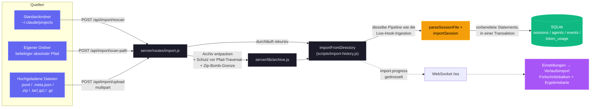

**Routen**

| Methode | Pfad | Beschreibung |
| ------ | ----------------------- | ------------------------------------------------------------------------ |
| `GET` | `/api/import/guide` | Anbieterbezogene Betriebssystempfade, Archivbefehl, Erweiterungen und Anweisungen (`?provider=claude\|codex`) |
| `POST` | `/api/import/rescan` | Durchsucht den gewählten Standardort erneut: `~/.claude/projects` oder `~/.codex/sessions` (`{ provider }`) |
| `POST` | `/api/import/scan-path` | Durchsucht ein absolutes Verzeichnis mit `{ path, provider }`; rekursiv |
| `POST` | `/api/import/upload` | Multipart-Upload von `.jsonl`, `.meta.json`, `.zip`, `.tar(.gz)`, `.gz` mit `provider` |

**Unterstützte Eingaben.** Einzelne JSONL-Sitzungstranskripte (`.jsonl`), die
zugehörigen `.meta.json`-Begleitdateien sowie Archive (`.zip`, `.tar`,
`.tar.gz`/`.tgz`, einfaches `.gz`) mit beliebig verschachtelter Verzeichnisstruktur.
Beide kanonischen Layouts von Claude Code werden automatisch erkannt:
`<project>/<sessionId>/subagents/agent-*.jsonl` (Standard) und
`<project>/subagents/<sessionId>/agent-*.jsonl` (Alternative).
Für Codex erkennt der Importer rekursiv Sitzungsdateien `rollout-*.jsonl`
(einschließlich einzelner JSONL-Dateien mit `session_meta`) sowie eine optionale
`session_index.jsonl` für native Sitzungsnamen.

**Genauigkeitsgarantien.** Sitzungen werden per UUID dedupliziert; ein erneuter
Lauf des Importers ist immer sicher. Die Compaction-Spalten `baseline_input` /
`baseline_output` / `baseline_cache_read` / `baseline_cache_write`
erhalten die Token-Zählungen aus der Zeit vor der Compaction eines Transkripts,
sodass das erneute Einlesen eines JSONL nach einer Compaction nie historische Kosten löscht.
Die Deduplizierung auf Ereignisebene nutzt einen Höchststand pro Ereignistyp
(`MAX(created_at) GROUP BY event_type` für die Sitzung): Bei jedem
erneuten Import werden nur JSONL-Einträge mit `ts > cutoff[type]` eingefügt, sodass
lang laufende Sitzungen, deren Transkripte über mehrere Tage wachsen,
weiterhin Stop- / PostToolUse- / TurnDuration- / ToolError-Ereignisse erhalten,
ohne frühere Arbeit zu duplizieren. `sessions.ended_at` wird auf die
letzte Aktivität im JSONL vorgerückt, wenn diese den gespeicherten Wert
übersteigt, und die Metadaten zur Nachrichtenanzahl werden bei jedem Durchlauf aktualisiert.

**Sicherheit bei riesigen Transkripten.** Der gemeinsame Transkript-Cache
(`server/lib/transcript-cache.js`) liest JSONL-Dateien in Stücken von 4 MiB
und dekodiert jeweils nur eine Zeile, sodass Transkripte, die größer als die
maximale JS-Stringlänge von V8 sind (~512 MiB unter 64-Bit-Node 20), geparst werden,
ohne den Prozess mit `FATAL ERROR: v8::ToLocalChecked Empty
MaybeLocal` abzubrechen. Derselbe stückweise Pfad wird von der Hook-Ingestion, dem
periodischen Compaction-Durchlauf und dem Verlaufsimporter genutzt — keiner von ihnen
lädt die ganze Datei als einzelnen JS-String. Wachsende Arrays pro Eintrag
(`turnDurations`, `errors`, `compaction.entries`,
`usageExtras.*`) werden am Ende auf `TRANSCRIPT_CACHE_MAX_ARRAY_LEN` begrenzt
(Standard `1000`), wobei das Kürzen schon beim Parsen ab einer Marke von `2 × cap` greift,
damit ein frisches vollständiges Parsen einer mehrtägigen Sitzung vor dem Abschluss
keine unbegrenzte Zwischenstruktur aufbauen kann.

**Sicherheit.** Beim Entpacken von Archiven wird jeder Eintrag auf Pfad-Traversal
geprüft (absolute Pfade und `..`-Segmente werden abgelehnt). Eine
konfigurierbare Entpackgrenze (`CCAM_IMPORT_MAX_EXTRACT_BYTES`, Standard
4 GB) stoppt Zip-/Tar-/Gzip-Bomben. Die Upload-Größe ist pro Datei
(`CCAM_IMPORT_MAX_BYTES`, Standard 1 GB) und pro Anfrage
(`CCAM_IMPORT_MAX_FILES`, Standard 2000) begrenzt. Alle Staging-Verzeichnisse gelten
pro Anfrage und werden in `finally` freigegeben, auch wenn multer
alle Dateien von vornherein ablehnt.

**Fortschritt.** Die Importaktivität wird über den vorhandenen WebSocket
als `import.progress`-Nachrichten gesendet (`phase`: `start` / `scan` / `extract` /
`parse` / `complete` / `error`), gedrosselt, um den Kanal bei großen
Importen nicht zu überfluten.

**UI.** Nutzen Sie das Panel **Einstellungen → Verlaufsimport** für eine geführte
Drag-and-Drop-Erfahrung mit schrittweisen Anweisungen, Live-Fortschritt
und einer Zusammenfassung nach dem Import mit den Zählungen importiert / angereichert / übersprungen /
fehlerhaft.

<p align="center">
  
</p>

### WebSocket

Verbinden Sie sich mit `ws://localhost:4820/ws`, um Push-Nachrichten in Echtzeit zu erhalten:

```json
{
  "type": "agent_updated",
  "data": { "id": "...", "status": "working", "current_tool": "Edit" },
  "timestamp": "2026-03-05T15:43:01.800Z"
}
```

**Nachrichtentypen:** `session_created`, `session_updated`, `agent_created`, `agent_updated`, `new_event`, `alert_triggered`, `alert_updated`, `remote_source.status` (Daten `{ id, status: "idle"|"syncing"|"ok"|"error"|"deleted", error?, last_sync_at? }`)

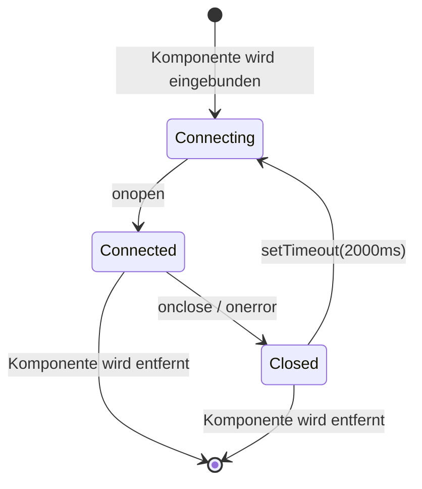

---

## Hook-Ereignisse

Das Dashboard verarbeitet diese Hook-Typen von Claude Code:

| Hook-Typ | Auslöser | Aktion des Dashboards |
| ------------------- | ------------------------------ | -------------------------------------------------------------------------------------------- |
| `SessionStart` | Eine Claude-Code-Sitzung beginnt | Legt Sitzung und Haupt-Agent an. Setzt `awaiting_input_since` (mit `awaiting_reason=session_start`), sodass eine frische Sitzung in **Wartend** landet — außer bei einem SessionStart mit Quelle `compact` (automatische Compaction mitten in der Runde), der das Flag unberührt lässt, damit eine arbeitende Sitzung **Aktiv** bleibt. Reaktiviert fortgesetzte Sitzungen. Bricht verwaiste Sitzungen ohne Aktivität seit `DASHBOARD_STALE_MINUTES` (Standard 180) ab |
| `UserPromptSubmit` | Der Benutzer bestätigt einen Prompt | Löscht das Warte-Flag und setzt den Haupt-Agent auf `working` — das einzige Signal, dass reine Text-Runden des Assistants begonnen haben, da diese kein `PreToolUse` senden |
| `PreToolUse` | Ein Agent beginnt, ein Tool zu nutzen | Löscht das Warte-Flag, setzt den Agent auf `working` und `current_tool`. Ist das Tool `Agent`, wird ein Subagent-Datensatz angelegt |
| `PostToolUse` | Tool-Ausführung abgeschlossen | Löscht das Warte-Flag (behandelt Freigaben von Berechtigungsabfragen, bei denen die Notification es mitten im Tool gesetzt hat). Löscht `current_tool`. Der Agent bleibt `working` |
| `Stop` | Claude hat die Antwort beendet | Ohne Fehler: Haupt-Agent → `waiting` — Claude hat seine Runde beendet, der Ball liegt beim Benutzer. `stop_reason=error`: setzt Agent und Sitzung auf `error`. Hintergrund-Subagents laufen weiter |
| `SubagentStop` | Ein Hintergrund-Agent ist fertig | Ordnet den Subagent über Beschreibung, Typ oder Aufgabe zu und schließt ihn ab. Löscht das Warte-Flag bewusst NICHT — das Ende eines Subagents sagt nichts über den Menschen aus. **Löst ohne Warten einen JSONL-Scan aus** (`scanAndImportSubagents`), der `PreToolUse`- + `PostToolUse`-Ereignisse pro Tool unter der eigenen `agent_id` des Subagents ausgibt, sodass die Zeitleiste jedes vom Subagent ausgeführte Tool zeigt, nicht nur die Startmarkierung |
| `Notification` | Benachrichtigung eines Agents | Protokolliert das Ereignis. Nachrichten zu Berechtigungs-/Eingabeabfragen setzen den Agent auf `waiting` und `awaiting_input_since` (mit `awaiting_reason=notification`, per Muster erkannt: `permission`, `waiting for input`, `needs your approval`, …). Compaction-Benachrichtigungen werden als `Compaction`-Ereignisse markiert. Löst eine Browser-Benachrichtigung aus, falls aktiviert |
| `SessionEnd` | Der CLI-Prozess von Claude Code endet | Entfernt das Warte-Flag. Ist die Sitzung bereits in `error`, bleibt der Fehlerzustand erhalten; andernfalls werden alle Agents und die Sitzung als `completed` markiert |
| `Compaction` | `/compact` im JSONL erkannt | Legt einen Compaction-Subagent (Typ `compaction`) und ein Compaction-Ereignis an. Erkannt über `isCompactSummary`-Einträge im Transkript-JSONL. Für aktive Sitzungen auch vom periodischen Scanner erkannt |
| `APIError` | API-Fehler im JSONL-Transkript | Extrahiert aus `isApiErrorMessage`-Einträgen (Kontingent, Ratenlimit, invalid_request) und rohen `type: "error"`-Antworten. **Setzt Sitzung und Agent jetzt sofort auf `error`** — früher nur als Ereignis ohne Statusänderung erfasst. Als Ereignis mit Fehlerdetails gespeichert |
| `TurnDuration` | Rundendauer im JSONL-Transkript | Extrahiert aus `system`-Nachrichten mit Untertyp `turn_duration` und `durationMs`. Als Ereignis für die Analyse der Rundendauern gespeichert |
| `ToolError` | Fehler im Tool-Ergebnis im JSONL | Extrahiert aus `toolUseResult.is_error`-Einträgen. Verfolgt Fehlschläge auf Tool-Ebene für die Analyse der Fehlerausbreitung |
| `RemoteToolEvent` | Von einem entfernten Rechner gepushter Tool-Aufruf | Von `POST /api/hooks/ingest-batch` für jeden Eintrag in `tool_events[]` geschrieben, den ein mobiler Rechner/Rechner hinter NAT pusht. Dedupliziert nach `(session_id, event_type, uuid)` gegen gespeicherte Zeilen und innerhalb des Stapels, sodass das erneute Senden eines Stapels sicher ist |
| `RemoteTurn` | Von einem entfernten Rechner gepushte Rundendauer | Von `POST /api/hooks/ingest-batch` für jeden Eintrag in `turns[]` geschrieben, mit der `duration_ms` dieser Runde. Dieselbe Deduplizierung nach `(session_id, event_type, uuid)` wie bei `RemoteToolEvent` |
| `Interrupted` | Vom Benutzer abgebrochene Runde (Esc) | Vom Watchdog erzeugt — `Esc` löst keinen Hook aus, daher wird eine in `working` hängende Sitzung über die Markierung `[Request interrupted by user]` im Transkript erkannt oder, wenn Esc vor jeder Ausgabe gedrückt wurde, über das Leerlauf-Timeout im Arbeitszustand (`DASHBOARD_WORKING_IDLE_SECONDS`). Die Sitzung wechselt zu **Wartend** (wie nach einem normalen `Stop`) |

---

## Browser-Benachrichtigungen

Das Dashboard unterstützt dauerhafte Browser-Benachrichtigungen per Web Push (VAPID) für Echtzeit-Alarme, auch wenn der Dashboard-Tab keinen Fokus hat oder der Browser im Hintergrund läuft.

### Funktionsweise

1. **Aktivieren** Sie Benachrichtigungen auf der Seite Einstellungen über den Hauptschalter
2. **Erteilen** Sie die Browserberechtigung, wenn Sie gefragt werden — dadurch wird ein Service Worker registriert und ein Push-Abonnement angelegt
3. **Konfigurieren** Sie, welche Ereignisse Benachrichtigungen auslösen:

| Ereignis | Standard | Beschreibung |
| ---------------------------- | ------- | --------------------------------------------------------------- |
| Neue Sitzung gestartet | An | Wird ausgelöst, wenn eine neue Claude-Code-Sitzung angelegt wird |
| Claude hat die Antwort beendet | Aus | Wird bei `Stop`-Ereignissen ausgelöst, wenn Claude eine Antwortrunde beendet |
| Sitzung geschlossen | Aus | Wird bei `SessionEnd` ausgelöst, wenn der CLI-Prozess endet |
| Sitzungsfehler | An | Wird ausgelöst, wenn eine Sitzung mit einem Fehler endet |
| Subagent gestartet | Aus | Wird ausgelöst, wenn ein Hintergrund-Subagent angelegt wird |

Außerdem löst jedes `Notification`-Hook-Ereignis von Claude Code unabhängig von den Schaltern pro Ereignis eine Browser-Benachrichtigung aus (solange der Hauptschalter aktiviert ist).

### Architektur der Benachrichtigungen

- **VAPID-Pipeline:** Nutzt `web-push` auf dem Server für eine sichere Zustellung der Nachrichten. VAPID-Schlüssel werden automatisch erzeugt und in `data/vapid-keys.json` gespeichert.
- **Service Worker:** Ein eigener Worker (`client/public/sw.js`) verarbeitet eingehende `push`-Ereignisse und zeigt Benachrichtigungen mit `silent: false` an, um die Tonwiedergabe unter macOS sicherzustellen.
- **Abonnements:** Browserspezifische Endpunkte werden in der Tabelle `push_subscriptions` in SQLite gespeichert.
- **Beständigkeit:** Benachrichtigungen kommen auch bei geschlossenem Browser an, da der Service Worker im Hintergrund arbeitet.
- **Testbenachrichtigung:** Eine Schaltfläche in den Einstellungen prüft die VAPID-Pipeline und die Tonwiedergabe.

### PWA und Offline-Unterstützung

Das Projekt liefert drei unabhängige Progressive Web Apps — je eine für das **Dashboard**, die **Landingpage** und das **Wiki**. Jede hat ihr eigenes `manifest.json` und ihren eigenen Service Worker, sodass der Browser sie als getrennt installierbare Anwendungen behandelt.

| Oberfläche | Manifest | Service Worker | Caching-Strategie |
| --- | --- | --- | --- |
| Dashboard (`client/`) | `client/public/manifest.json` | `client/public/sw.js` | Vites Bundles mit Inhalts-Hash unter `/assets/*` werden cache-first ausgeliefert (URLs sind pro Build unveränderlich). Alles andere — Navigationen, der SW selbst, `manifest.json`, Icons, die Wurzel `/` — ist network-first mit Cache-Fallback, sodass ein neuer Build immer die aktuellste UI ohne hartes Neuladen zeigt. API- (`/api/*`), WebSocket- (`/ws`) und Vite-HMR-Anfragen werden nie zwischengespeichert. Die Handler für Push-Benachrichtigungen bleiben neben der Caching-Logik erhalten. Die statische Express-Middleware (`server/index.js`) verstärkt dies, indem sie `Cache-Control: public, max-age=31536000, immutable` für `/assets/*` und `Cache-Control: no-cache, must-revalidate` für `index.html`, `sw.js` und `manifest.json` sendet. `client/src/main.tsx` hört auf `controllerchange`: Wird ein neuer SW auf einer bereits kontrollierten Seite aktiv, lädt sie genau einmal neu (bei Erstinstallationen nicht). |
| Landingpage (Wurzel) | `manifest.json` | `sw.js` | Cacht die HTML-Hülle, das Favicon und das OG-Bild vorab. Screenshot-PNGs werden beim ersten Aufruf nachgeladen und zwischengespeichert (cache-first), um einen schweren initialen Vorab-Cache zu vermeiden. Navigation ist network-first mit Offline-Fallback. |
| Wiki (`wiki/`) | `wiki/manifest.json` | `wiki/sw.js` | Cacht `index.html`, `style.css`, `script.js`, das Manifest und das Favicon vorab. Nach einem Besuch vollständig offline nutzbar. HTML network-first, CSS/JS cache-first. |

**Cache-Lebenszyklus:** Alle drei SWs rufen bei der Installation `skipWaiting()` auf und löschen bei der Aktivierung veraltete Caches (gekennzeichnet durch Versionsstrings wie `dashboard-v2`, `landing-v1`, `wiki-v1`). Das Erhöhen der Versionskonstante erzwingt eine saubere Aktualisierung.

**iOS-Unterstützung:** Alle drei HTML-Dateien enthalten `<meta name="apple-mobile-web-app-capable" content="yes">` und `<meta name="apple-mobile-web-app-status-bar-style" content="black-translucent">` für den Standalone-Modus auf dem Home-Bildschirm in Safari.

**Icons:** Die Manifeste verweisen auf `favicon.svg` mit `sizes="any"` und `type="image/svg+xml"` — unterstützt in Chrome 107+, Firefox 110+, Edge 107+. Apple-Touch-Icons nutzen ebenfalls das SVG-Favicon.

---

## Update-Benachrichtigung

Das Dashboard beobachtet seinen eigenen Git-Checkout und zeigt einen Dialog, sobald der kanonische Standardbranch Commits vor HEAD hat. **Branch- und Fork-bewusst:** Gibt es ein Remote `upstream` (die übliche Konvention für Forks), wird es `origin` vorgezogen; `master`/`main`/`HEAD` des gewählten Remotes dient als Vergleichsreferenz. Der `manual_command` passt sich Ihrer Lage an — `git pull --ff-only` nur dann, wenn Ihr Branch die kanonische Referenz tatsächlich verfolgt, sonst ein `git fetch` (und im Fork-Fall ein Fast-Forward-Merge), damit der Befehl nie falsch ist. Benutzer erhalten den genauen Befehl für ein Terminal — der Server führt **nie** selbst einen Pull oder Neustart aus, was den Mechanismus über Dev-Sitzungen, Überwachung durch pm2/systemd/launchd/Docker und entfernte Deployments hinweg portabel hält.

<p align="center">
  
</p>

### Funktionsweise

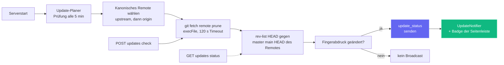

Eine einzelne Prüfung ist günstig (`git fetch <remote> --prune` gegen das kanonische Remote — `upstream`, falls konfiguriert, sonst `origin`), gekapselt in `execFile` (ohne Shell) mit 120 s Timeout. Fehler — Offline-Netz, Installation ohne Git, keine Remotes konfiguriert, nicht auflösbare Upstream-Referenz — liefern alle **weiche Payloads** (z. B. `fetch_error: "..."`), statt eine Ausnahme zu werfen, sodass ein unzuverlässiges Remote das Dashboard nie blockiert.

### UI-Flächen

| Fläche | Verhalten |
| --- | --- |
| **Dialog** (`client/src/components/UpdateNotifier.tsx`) | Erscheint, wenn `update_available === true` ist und der Benutzer genau diesen `remote_sha` noch nicht verworfen hat. Zeigt die Anzahl der fehlenden Commits, die verfolgte Referenz, eine optionale `situation_note` (auf einem Feature-Branch / Fork erklärt die Notiz, warum der Befehl abweicht), den kopierbaren Befehl und drei Schaltflächen: **Befehl kopieren** (primär), **Jetzt prüfen**, **Verwerfen**. Esc und Klicks auf den Hintergrund schließen ihn. Per `remote_sha` in `localStorage` verschlüsselt, sodass ein neuerer Upstream-Commit den Dialog automatisch wieder öffnet. |
| **Schaltfläche der Seitenleiste** (`client/src/components/Sidebar.tsx`) | Stets sichtbare Schaltfläche „Nach Updates suchen“ in der Fußzeile. Smaragdgrüner Rahmen + grüner Badge-Punkt bei Rückstand, Bernstein, wenn die letzte Prüfung einen Fetch-Fehler hatte. Ein Klick löscht jede frühere Verwerfung und löst dann `POST /api/updates/check` aus. |
| **Serverterminal** | Wechselt der Planer von „aktuell“ zu „im Rückstand“, gibt er auf stdout einen umrahmten Block mit dem Befehl aus, damit ihn auch Benutzer ohne UI sehen. |

### API-Schnittstelle

| Endpunkt | Zweck |
| --- | --- |
| `GET /api/updates/status` | Schreibgeschützte Prüfung: führt `git fetch` gegen das kanonische Remote aus, vergleicht HEAD mit dessen Standardbranch und liefert die Payload. |
| `POST /api/updates/check` | Dieselbe Prüfung, sendet aber zusätzlich `update_status` über WebSocket, damit sich alle verbundenen Clients auf einmal aktualisieren. |

Beide Endpunkte liefern dieselbe Payload-Struktur:

```json
{
  "git_repo": true,
  "update_available": true,
  "repo_root": "/Users/you/Claude-Code-Agent-Monitor",
  "remote_ref": "upstream/master",
  "canonical_remote": "upstream",
  "current_branch": "master",
  "tracking_upstream": "origin/master",
  "tracks_canonical": false,
  "situation": "fork_or_diverged_tracking",
  "local_sha": "abc1234...",
  "remote_sha": "def5678...",
  "commits_behind": 3,
  "manual_command": "cd \"/...\" && git fetch upstream && git merge --ff-only upstream/master && npm run setup",
  "situation_note": "You're on 'master' tracking 'origin/master'. This command fast-forwards your branch from upstream/master (the canonical default).",
  "message": "3 commit(s) on upstream/master not in your checkout."
}
```

`situation` ist einer der Werte `tracking_canonical` (typischer Klon auf dem Standardbranch — `git pull --ff-only` funktioniert), `fork_or_diverged_tracking` (der lokale Branchname entspricht dem kanonischen, verfolgt aber ein anderes Remote — `git fetch <remote> && git merge --ff-only <ref>`), `feature_branch` (abseits des Standardbranch — nur Fetch, die Integration bleibt dem Benutzer überlassen) oder `detached_head`.

### Was hier **bewusst fehlt**

Es gibt kein `POST /api/updates/apply` und keinen Selbstneustart-Helfer — mit Absicht. Einen Prozess von innen heraus selbst zu aktualisieren ist ohne externen Supervisor unzuverlässig — `npm run dev` (concurrently), `npm start`, `pm2`, `systemd`, `launchd` und Docker brauchen jeweils eine andere Neustartlogik, und Fehler bei `git pull` / `npm install` auf einem sterbenden Server haben keinen sauberen Rückweg. Die Beschränkung auf die Erkennung hält das Verhalten über jeden Supervisor, jedes Betriebssystem und jeden Branch-Zustand vorhersehbar und schließt dennoch die Informationslücke „wann muss ich pullen?“; die eigentliche Aktualisierung liegt beim Benutzer in seiner eigenen Shell.

### Konfiguration

| Umgebungsvariable | Standard | Hinweise |
| --- | --- | --- |
| `DASHBOARD_UPDATE_CHECK` | aktiviert | Auf `0` / `false` / `off` setzen, um den Planer vollständig zu deaktivieren. |
| `DASHBOARD_UPDATE_CHECK_INTERVAL_MS` | `300000` (5 min) | Intervall zwischen automatischen Prüfungen. Minimum 60 000 ms — kleinere Werte werden angehoben. |

---

## Tabby — schwebende Katzen-Begleiterin

**Tabby** ist eine niedliche schwebende Katzen-Begleiterin, angeheftet an die untere rechte Ecke jeder Seite des Dashboards. Stets präsent, verwandelt sie den Live-Sitzungsstrom in ein reaktives Maskottchen, das Sie mit einem Blick erfassen und mit dem Sie auch sprechen können.

<p align="center">
  
</p>

### Reaktives Maskottchen

Tabby ist eine SVG-Katze, die dem Cursor folgt, mit **acht Stimmungen**, abgeleitet aus dem Live-Sitzungsstrom, jede mit eigener Animation:

| Stimmung | Wann | Animation |
| --- | --- | --- |
| `idle` | Nichts Bemerkenswertes passiert | Ruhiges Schwanzzucken |
| `watching` | Sitzungen sind aktiv | Gespitzte Ohren, Augen folgen dem Cursor |
| `happy` | Eine Sitzung oder ein Lauf wurde sauber beendet | Kopfnicken + Funkeln |
| `worried` | Etwas wirkt nicht in Ordnung | Leichtes Zittern |
| `stuck` | Eine Sitzung scheint blockiert | Alarm „!“ |
| `thinking` | Ein Agent ist mitten in der Arbeit | Langsames Kopfnicken |
| `sleeping` | Eine Weile ruhig | `zzz` |
| `disconnected` | Der WebSocket ist getrennt | Ruhige, stille Haltung |

### Sprechblasen

Tabby zeigt bei bemerkenswerten Ereignissen (Sitzung gestartet/beendet, Fehler, Lauf abgeschlossen) automatisch kurze Sprüche. Die Blasen sind **gedrosselt und zusammengefasst**, damit ein Schwall von Ereignissen den Bildschirm nie überflutet, nutzen `aria-live` für Screenreader und lassen sich im Panel **stummschalten**.

### Panel

Öffnen Sie das Panel per Klick auf die Katze oder mit **⌘B / Ctrl+B** (Esc schließt). Es zeigt:

- Eine Live-**Statuszeile** — `N live · M errored · connection state`.
- **Schnellaktionen** — zu Claude starten, Aktivität, Sitzungen oder fehlerhaften Sitzungen springen; Blasen stummschalten; Alarme löschen.
- Ein **Fragen**-Feld (siehe unten).

### Fragen-Feld → Übergabe an Claude starten

Das Feld **Fragen** beantwortet einfache Statusfragen lokal aus zwischengespeicherten Daten — zum Beispiel „was läuft“, „gibt es Fehler“ oder „Status“. Jede andere Frage wird an die vorhandene Seite **Claude starten** übergeben (Deep-Link zu `/run?prompt=…`), um eine echte Claude-Code-Sitzung zu starten. Tabby ruft nie selbst ein LLM auf; es nutzt für alles, was über eine schnelle Statusabfrage hinausgeht, einfach die Seite Claude starten.

### Barrierefreiheit und sicherer Rückfall

Tabby ist per Tastatur bedienbar, nutzt `aria-live` für ihre Blasen und beachtet `prefers-reduced-motion`. Ist der WebSocket getrennt, fällt sie sicher in einen ruhigen `disconnected`-Zustand zurück, statt einen Fehler zu erzeugen. Sie können Tabby in den **Einstellungen** ein- oder ausschalten (lokalisiert auf Englisch, Chinesisch, Vietnamesisch, Koreanisch, Spanisch, Französisch, Deutsch, Portugiesisch und Italienisch); die Implementierung liegt in `client/src/components/Tabby/`.

---

## Tonsignale

Das Dashboard gibt Ihnen **dezentes akustisches Feedback** zur Live-Aktivität der Sitzungen, sodass Sie es auf einem zweiten Monitor laufen lassen und trotzdem hören, wann ein Lauf endet oder fehlschlägt. Ton ist **standardmäßig aktiv** und lässt sich mit einem Klick vollständig abschalten.

### Synthese ohne Abhängigkeiten

Im Repo gibt es keinerlei `.mp3`- oder `.wav`-Dateien und keine Audiobibliothek in `package.json`. Jedes Signal wird beim Abspielen mit der **Web Audio API** erzeugt: eine kurze Liste von Oszillatoren (Sinus oder Dreieck), jeder mit eigener exponentieller Lautstärke-Hüllkurve, gemischt über einen Master-Gain-Knoten und einen Tiefpassfilter, damit das Ergebnis hinter Ihrer Arbeit bleibt, statt sie zu durchschneiden. Die gesamte Engine ist eine einzige Datei, `client/src/lib/sound.ts`.

### Die Signale

| Signal | Wann es ertönt | Wie es klingt |
| --- | --- | --- |
| `sessionStart` | Eine neue Sitzung erscheint | Steigende reine Quinte (C5 → G5) |
| `sessionComplete` | Eine Sitzung hat die Antwort beendet (`Stop`) oder wird geschlossen (`SessionEnd`) | Auflösendes Dur-Arpeggio (E5 → G5 → C6) |
| `sessionError` | Eine Sitzung geht in den Zustand `error` | Sanft fallende kleine Terz auf einer Dreieckwelle — wahrnehmbar, nicht alarmierend |
| `subagentSpawn` | Ein Subagent wird gestartet | Einzelnes kurzes Zupfen |
| `notification` | Claude Code sendet ein `Notification`-Ereignis | Verstimmtes Paar, das wie eine kleine Glocke klingt |
| `connected` / `disconnected` | Der Dashboard-WebSocket kehrt zurück oder bricht ab | Zwei-Ton-Anstieg / -Abfall |
| `click` | Sie drücken eine Schaltfläche, einen Link, einen Tab oder einen Schalter | Kaum hörbares Ticken |

Die Signale liegen in einem C-Dur-Tonvorrat, damit sich überlagernde Ausklänge nie dissonant klingen, und jede Hüllkurve klingt exponentiell aus, statt abrupt abzubrechen, was das Knacken eines harten Stopps vermeidet.

### Nicht im Weg stehen

Drei Schutzmechanismen verhindern, dass Ton zu Lärm wird:

- **Abklingzeit pro Signal** — dasselbe Signal wiederholt sich nicht innerhalb von ~350 ms (45 ms für das Interaktions-Ticken).
- **Globales Burst-Budget** — höchstens 4 Signale starten innerhalb eines Fensters von 1,2 s, sodass ein Verlaufsimport oder eine Wiederverbindung nach einem Abbruch nie eine Flut von WebSocket-Nachrichten in eine Flut von Pieptönen verwandelt.
- **Autoplay-Richtlinie** — gemäß den Browserregeln ertönt nichts vor Ihrer ersten Interaktion mit der Seite (Zeiger, Taste oder Berührung). Signale davor werden still verworfen, nicht eingereiht.

Unterstützt der Browser Web Audio überhaupt nicht, ist jeder Aufruf eine sichere Nulloperation — das Dashboard bleibt einfach stumm.

### Einstellungen

**Einstellungen → Ton** bietet einen Hauptschalter, einen Lautstärkeregler und einen eigenen Schalter pro Signal. Beim Einschalten eines Schalters ertönt das Signal sofort, damit Sie genau hören, was Sie gerade aktiviert haben, und eine Schaltfläche **Ton anhören** spielt das Abschluss-Glockenspiel bei Bedarf ab. Die Einstellungen werden in `localStorage` unter `agent-monitor-sound` gespeichert und wirken sofort in der gesamten App — ohne Neuladen. Das Panel ist auf Englisch, Chinesisch, Vietnamesisch, Koreanisch, Spanisch, Französisch, Deutsch, Portugiesisch und Italienisch lokalisiert.

Standardmäßig sind Sitzungsstart, Sitzungsabschluss, Sitzungsfehler, Claude-Code-Benachrichtigungen und das Interaktions-Ticken aktiv; Subagent-Starts und Verbindungswechsel sind aus (sie sind am gesprächigsten). Die Implementierung liegt in `client/src/lib/sound.ts` (Engine + Einstellungen) und `client/src/hooks/useSoundCues.ts` (Anbindung an den Ereignisbus), einmalig eingebunden in `client/src/App.tsx`.

---

## Dialog Verbindungsstatus

Klicken Sie auf die Pille **Live** / **Getrennt** in der Fußzeile der Seitenleiste, um ein kleines Detailpanel zum WebSocket-Transport des Dashboards zu öffnen. Es zeigt den aktiven `ws://`-Endpunkt, wie lange der aktuelle Socket schon besteht, die Gesamtzahl empfangener Ereignisse, die häufigsten Ereignistypen als horizontales Balkendiagramm, eine Sparkline des Durchsatzes über 60 Sekunden und die letzten 8 Ereignisse als Liste der jüngsten Aktivität. Kumulierte Statistiken (Summen, Aufschlüsselung nach Typ, jüngste Liste) bleiben über `localStorage` unter `sidebar-connection-stats` über Neuladen hinweg erhalten; die gleitende Sparkline und der Timer „verbunden seit“ sind bewusst flüchtig. Eine Schaltfläche **Zurücksetzen** in der Fußzeile löscht bei Bedarf alles.

<p align="center">
  
</p>

---

## VS-Code-Erweiterung

Der **Claude Code Agent Monitor** ist als vollwertige VS-Code-Erweiterung verfügbar, sodass Sie Ihre KI-Agents überwachen können, ohne Ihren Editor zu verlassen.

<p align="center">
  
</p>

### 🚀 Wichtigste Funktionen
- **Live-Seitenleiste**: Eigene Ansicht in der Aktivitätsleiste mit dem Zustand der Agents in Echtzeit (Arbeitet, Wartend, Abgeschlossen usw.).
- **Nutzungsanalysen**: Verfolgen Sie Token-Summen, Live-Kosten in USD und Ereigniszahlen direkt in der Seitenleiste.
- **Integration in die Statusleiste**: Pulsanzeige auf einen Blick in der unteren Leiste mit aktiven Sitzungen und Agents.
- **Direkte Navigation**: Zugriff mit einem Klick auf bestimmte Dashboard-Ansichten (Kanban, Analysen, Einstellungen) oder zuletzt genutzte Sitzungen.
- **Integrierter Tab**: Öffnet das vollständige Überwachungs-Dashboard als nativen Webview-Tab in VS Code.

### 📦 Installation und Einrichtung
1. Öffnen Sie das Verzeichnis [vscode-extension](./vscode-extension).
2. Installieren Sie die Erweiterung aus dem Marketplace oder paketieren Sie sie selbst mit `vsce package`.
3. Stellen Sie sicher, dass Ihr lokaler Dashboard-Server läuft (`npm run dev`).
4. Klicken Sie auf das **Radar-Symbol** in der Aktivitätsleiste von VS Code, um loszulegen.

Für die detaillierte Konfiguration für Entwickler siehe die Verzeichnisse [.vscode](./.vscode) und [vscode-extension](./vscode-extension).

> [!TIP]
> Erweiterung im VS Code Marketplace: [Claude Code Agent Monitor](https://marketplace.visualstudio.com/items?itemName=hoangsonw.claude-code-agent-monitor)

---

## Desktop-App (macOS und Windows)

Das Dashboard gibt es auch als optionale **native Desktop-Anwendung**, die Sie einmal installieren und vergessen können — eine macOS-`.app` (als `.dmg` verteilt) und eine Windows-`.exe` (ein NSIS-Installer plus eine portable Version ohne Installation). Sie liegt im Workspace `desktop/` neben `client/`, `server/`, `mcp/` und `vscode-extension/` und ist mit **Electron 35** gebaut.

<p align="center">
  
  <br>
  <em>🍎🪟 <strong>Desktop-App</strong> — native Hülle mit Symbol in Menüleiste / Infobereich (Tray), Start bei Anmeldung und Einzelinstanzsperre. Dasselbe Dashboard in einem echten Betriebssystemfenster (hier macOS).</em>
</p>

<p align="center">
  
  <br>
  <em>🪟 Dasselbe Dashboard als native Windows-App — Symbol im Infobereich (Tray), natives Fenstermenü und Start bei Anmeldung.</em>
</p>

Alles, was Sie im Browser unter `localhost:4820` sehen, befindet sich in diesem Fenster, ergänzt um den nativen Lebenszyklus des Betriebssystems: ein Tray-Symbol, ein natives Anwendungsmenü, die Autostart-Integration und eine einzige Beenden-Schaltfläche, die den Server sauber herunterfährt.

### Funktionsweise

Anders als beim Start des Dashboards aus einem Terminal braucht die Desktop-App weder `npm start` noch eine offene Shell noch eine zweite Kopie des Servers. Der **Hauptprozess** von Electron hostet den Express-Server **im selben Prozess** — er lädt `server/index.js` direkt per `require()` in derselben Node-Laufzeit, **ohne Kindprozess und ohne IPC** — und richtet ein Chromium-`BrowserWindow` auf den gebauten React-Client.

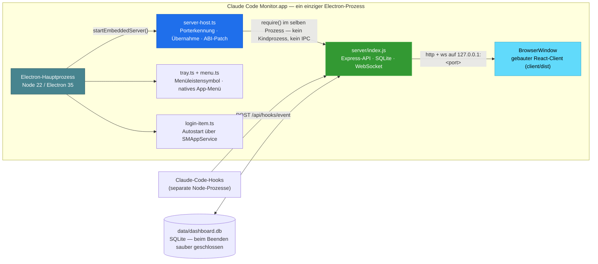

Beim Start führt die App Folgendes aus:

1. Sie wählt einen freien Port — bevorzugt **4820**, sonst **4821–4829**, dann einen zufälligen hohen Port, wenn alle belegt sind.
2. Antwortet bereits ein gesunder Dashboard-Server auf `/api/health` an `4820` (z. B. weil Sie `npm start` in einem Terminal ausgeführt haben), **übernimmt sie diesen Server**, statt doppelt zu binden — kein Portkonflikt, kein SQLite-Konkurrenzzugriff. Ein übernommener Server läuft nach dem Beenden der App weiter.
3. Andernfalls startet sie den eingebetteten Server und installiert beim **ersten Start mit eigenem Server** automatisch die Claude-Code-Hooks und startet die Hintergrunddienste (Update-Planer, `cc-watcher`, Abgleich verwaister Läufe). Wer nur das DMG installiert, erhält Ereignisse also **ohne jede manuelle Einrichtung** — kein Checkout, kein `npm run install-hooks`.
4. **(macOS)** Sie stellt den **`PATH` der Login-Shell** wieder her, damit die Funktion **Claude starten** die `claude`-CLI finden und starten kann — eine aus Finder/Dock gestartete App erbt sonst nur den minimalen `PATH` von launchd und fände CLIs in `~/.local/bin`, `/opt/homebrew/bin`, den Verzeichnissen von Versionsmanagern usw. nicht. (Unter Windows erbt der Prozess den `PATH` des Benutzers bereits.)
5. Sie öffnet das Dashboard-Fenster — außer wenn die App bei der Anmeldung gestartet wurde (unter macOS über die Anmeldeobjekte; unter Windows über den markierten Eintrag `HKCU\…\Run`); dann bleibt sie nur im Tray.
6. Beim Beenden fährt sie den eingebetteten Server sauber herunter und **schließt SQLite sauber** (WAL-Checkpoint).

### Funktionen

- **Tray-Symbol** — stets präsente Statusfläche (macOS-Menüleiste / Windows-Infobereich). Ein Linksklick blendet das Dashboard-Fenster ein oder aus; ein Rechtsklick öffnet ein Kontextmenü mit **Dashboard öffnen**, **Im Browser öffnen**, **Server neu starten**, **Protokolle anzeigen**, **Bei Anmeldung öffnen** (Umschalter) und **Beenden**. macOS nutzt ein eingefärbtes Vorlagensymbol; Windows nutzt das farbige `icon.ico` (eine schwarze Vorlage würde auf der dunklen Taskleiste verschwinden).
- **Fenster- und Taskleistensymbol** — das `BrowserWindow` ist mit dem farbigen App-Logo verbunden (`icon.ico` unter Windows, `icon.png` anderswo), sodass Titelleiste / Taskleiste das echte Symbol von Claude Code Monitor zeigen — selbst ein nicht paketierter Lauf mit `npm run desktop:dev` zeigt nicht mehr das generische Electron-Symbol.
- **Natives Anwendungsmenü** — Standardmenü `About` / `File` / `Edit` / `View` / `Window` / `Help` mit `⌘`- / `Ctrl`-Kürzeln. Der Eintrag **File → Open Dashboard** (`⌘1`) gibt es **nur unter macOS**: macOS behält nach dem Ausblenden des Fensters eine globale Menüleiste und kann das Fenster daher wieder öffnen — unter Windows/Linux hängt das Menü am Fenster und kann nicht auslösen, solange es ausgeblendet ist; öffnen Sie es dort stattdessen über **Dashboard öffnen** im Tray (was das Fenster zuverlässig hervorholt, auch wenn es minimiert oder hinter anderen Fenstern liegt).
- **Autostart bei der Anmeldung** — schalten Sie **Bei Anmeldung öffnen** im Tray oder im App-Menü um. Unter macOS erfolgt die Registrierung über die moderne API `SMAppService`, sodass der Eintrag unter **Systemeinstellungen → Allgemein → Anmeldeobjekte** erscheint; unter Windows wird ein benutzerbezogener Eintrag `HKCU\Software\Microsoft\Windows\CurrentVersion\Run` geschrieben, sichtbar unter **Task-Manager → Autostart**.
- **Fenster schließen blendet aus, der Server läuft weiter** — das Schließen des Fensters blendet es nur aus; Server und Tray bleiben aktiv. Klicken Sie auf den Tray, um das Fenster zurückzuholen.
- **Einzelinstanzsperre** — ein zweiter Start holt einfach das vorhandene Fenster in den Vordergrund; kein zweiter Server, kein Portkonflikt. (Gilt auf allen Plattformen.)
- **Daten überstehen Neuinstallationen und Updates** — die SQLite-Datenbank und die VAPID-Schlüssel liegen im benutzerbezogenen App-Datenverzeichnis **außerhalb des App-Bundles / Installationsverzeichnisses** — `~/Library/Application Support/Claude Code Monitor/data/` unter macOS, `%APPDATA%\Claude Code Monitor\data\` unter Windows. Ein paketiertes Bundle ist schreibgeschützt, sodass das Schreiben der Datenbank darin den Verlaufsimport und die Speicherung von Ereignissen zerstören würde; die Ablage in den App-Daten behebt das und lässt Ihren importierten Verlauf unberührt, wenn Sie die App ersetzen oder aktualisieren. (Der NSIS-Deinstaller unter Windows behält diese Daten standardmäßig.)
- **`claude`-CLI im PATH** — unter macOS stellt die App beim Start den `PATH` Ihrer Login-Shell wieder her, sodass die Funktion **Claude starten** funktioniert, obwohl eine aus Finder/Dock gestartete App sonst nur den minimalen `PATH` von launchd erben würde. (Unter Windows enthält der geerbte Benutzer-`PATH` sie bereits.)
- **Protokolle** — der Hauptprozess schreibt nach `~/Library/Logs/Claude Code Monitor/desktop.log` (macOS) bzw. `%APPDATA%\Claude Code Monitor\logs\desktop.log` (Windows); erreichbar über **Protokolle anzeigen** im Tray-Menü.

### Herunterladen

**Option A — einen vorgefertigten Installer herunterladen (empfohlen).** Unter **[Releases → latest](https://github.com/hoangsonww/Claude-Code-Agent-Monitor/releases/latest)** (öffentlich, ohne GitHub-Anmeldung). Die CI veröffentlicht automatisch ein neues Release `vX.Y.Z`, sobald die Version in `package.json` auf `master` erhöht wird, sodass dieser Link immer den aktuellen Build liefert:

| Plattform | Datei | Hinweise |
| --- | --- | --- |
| macOS (Apple Silicon) | `ClaudeCodeMonitor-<ver>-arm64.dmg` | nach `/Applications` ziehen |
| macOS (Intel) | `ClaudeCodeMonitor-<ver>-x64.dmg` | nach `/Applications` ziehen |
| Windows (Installer) | `ClaudeCodeMonitor-Setup-<ver>-x64.exe` | benutzerbezogene Installation, ohne Adminrechte |
| Windows (portabel) | `ClaudeCodeMonitor-<ver>-x64-portable.exe` | läuft ohne Installation |

Frische Builds pro Commit gibt es auch als CI-Artefakte (Anmeldung erforderlich, 14 Tage Aufbewahrung): `ClaudeCodeMonitor-dmg` aus dem Job `🍎 macOS Desktop (DMG)` und `ClaudeCodeMonitor-win` aus dem Job `🪟 Windows Desktop (EXE)` — nützlich, um `master` vor dem nächsten Release-Tag zu testen.

**Option B — selbst bauen.** Im Repo-Stamm:

```bash
npm run setup                # install root + client deps, build client, install hooks
npm run build                # build the React client (client/dist)
npm run desktop:install      # install Electron + electron-builder into desktop/ (preflights native deps; prints setup help on failure)
npm run desktop:dmg:arm64    # macOS:   fast single-arch DMG → desktop/release/ClaudeCodeMonitor-<ver>-arm64.dmg
npm run desktop:win          # Windows: NSIS installer → desktop/release/ClaudeCodeMonitor-Setup-<ver>-x64.exe
```

> [!NOTE]
> **DMGs werden unter macOS gebaut, Windows-`.exe`-Dateien unter Windows** — electron-builder paketiert für das Host-Betriebssystem. Der macOS-Build `npm run desktop:dmg` paketiert die App **zweimal** (einmal pro Architektur) und erzeugt **beide** DMGs pro Architektur (`arm64` + `x64`) — das ist der Release-Build; er führt sie nicht zu einer universellen Binärdatei zusammen. Für Ihren eigenen Mac nutzen Sie das Einzelarchitektur-Ziel `desktop:dmg:arm64` / `desktop:dmg:x64`. Unter Windows wird `better-sqlite3` von `npm run desktop:install` als vorgefertigte Electron-Binärdatei geladen, sodass im Normalfall keine Visual-Studio-C++-Toolchain nötig ist. Schlägt der Build dennoch fehl (keine vorgefertigte Binärdatei oder fehlende C++-Toolchain), gibt `desktop:install` die genaue Lösung pro Betriebssystem plus eine Alternative ohne Toolchain aus und bricht deutlich ab, statt eine defekte Installation zu hinterlassen.

### Installieren

**macOS:**

1. Doppelklicken Sie auf die `.dmg`, um sie einzubinden.
2. Ziehen Sie **Claude Code Monitor.app** in Ihren Ordner `/Applications`.
3. Das DMG ist standardmäßig **ad hoc signiert**, daher warnt Gatekeeper beim ersten Start (*„Apple konnte nicht überprüfen …“*). Entfernen Sie das Quarantäne-Attribut:

   ```bash
   xattr -cr "/Applications/Claude Code Monitor.app"
   ```

   Oder öffnen Sie **Systemeinstellungen → Datenschutz & Sicherheit** und klicken Sie auf **Dennoch öffnen**.

4. Starten Sie die App. Das Tray-Symbol erscheint und das Dashboard-Fenster öffnet sich.

**Windows:**

1. Führen Sie `ClaudeCodeMonitor-Setup-<ver>-x64.exe` aus. Er installiert **benutzerbezogen** unter `%LOCALAPPDATA%\Programs\Claude Code Monitor` (ohne Administratorrechte) und lässt Sie das Installationsverzeichnis wählen; alternativ starten Sie die `*-portable.exe` ohne Installation.
2. Der Installer ist standardmäßig **nicht signiert**, daher zeigt Windows **SmartScreen** beim ersten Start möglicherweise *„Der Computer wurde durch Windows geschützt“* — klicken Sie auf **Weitere Informationen → Trotzdem ausführen**.
3. Starten Sie die App über das Startmenü / die Desktop-Verknüpfung. Das Symbol im Infobereich (Tray) erscheint und das Dashboard-Fenster öffnet sich.

<p align="center">
  
  <br>
  <em>Windows-Installer · Schritt 1 — <strong>Choose Installation Options</strong> (pro Benutzer „Only for me“ oder alle Benutzer).</em>
</p>

<p align="center">
  
  <br>
  <em>Windows-Installer · Schritt 2 — <strong>Choose Install Location</strong> (standardmäßig benutzerbezogen <code>%LOCALAPPDATA%\Programs</code>).</em>
</p>

<p align="center">
  
  <br>
  <em>Windows-Installer · Schritt 3 — <strong>Completing Setup</strong> (fertigstellen und die App starten).</em>
</p>

### Build-Befehle

Alle Befehle werden im **Repo-Stamm** ausgeführt:

| Befehl | Was er tut |
| --------------------------- | ---------------------------------------------------------------------------- |
| `npm run desktop:install` | Installiert Electron + electron-builder in `desktop/`; baut `better-sqlite3` für die ABI von Electron neu; prüft vorab den nativen Build von `better-sqlite3` und gibt bei einem Fehler konkrete Einrichtungshilfe aus (inkl. einer Alternative ohne Toolchain) |
| `npm run desktop:build` | Kompiliert die TypeScript-Quellen des Desktops nach `desktop/out/` |
| `npm run desktop:dev` | Baut und startet die Electron-App für die lokale Entwicklung |
| `npm run desktop:test` | Führt den Smoke-Test aus (startet Electron, prüft `/api/health`, fährt herunter) |
| `npm run desktop:dmg` | **macOS:** baut **beide** DMGs (arm64 + x64) — richtig für ein Release, **langsamer** (paketiert jede Architektur) |
| `npm run desktop:dmg:arm64` | **macOS:** baut ein DMG nur für Apple Silicon — **schnell** (~1 min), empfohlen für Ihren eigenen Mac |
| `npm run desktop:dmg:x64` | **macOS:** baut ein DMG nur für Intel — **schnell** (~1 min) |
| `npm run desktop:dmg:universal` | **macOS:** baut ein einzelnes zusammengeführtes **universelles** DMG (arm64 + x86_64) — optional, **am langsamsten**, nicht das, was das Release ausliefert |
| `npm run desktop:win` | **Windows:** baut den NSIS-Installer `.exe` (x64) |
| `npm run desktop:win:portable` | **Windows:** baut die portable `.exe` ohne Installation (x64) |

Das resultierende macOS-DMG ist **~80 MB** groß (≈ 250 MB auf der Festplatte nach der Installation), der Windows-Installer ist vergleichbar — der übliche Preis eines Electron-Bundles.

### Signierung und Notarisierung

Das macOS-DMG ist standardmäßig **ad hoc signiert**, damit jeder ohne kostenpflichtiges Apple-Developer-Konto eine funktionierende `.app` bauen kann — das Skript `package` setzt `CSC_IDENTITY_AUTO_DISCOVERY=false`, damit ein bereits im Schlüsselbund des Beitragenden liegendes Signaturzertifikat nie automatisch gewählt wird. Echte **Developer-ID-Signierung** wird optional über `CSC_LINK` (eine base64-kodierte `.p12`) und `CSC_KEY_PASSWORD` aktiviert; **Apple-Notarisierung** optional über `APPLE_ID`, `APPLE_TEAM_ID` und `APPLE_APP_SPECIFIC_PASSWORD`. Der **Windows**-Build ist standardmäßig **nicht signiert** (SmartScreen kann beim ersten Start nachfragen — *Weitere Informationen → Trotzdem ausführen*); die Authenticode-Signierung wird nur aktiv, wenn über `CSC_LINK` + `CSC_KEY_PASSWORD` ausdrücklich ein Zertifikat bereitgestellt wird. Die CI übernimmt all das automatisch, sobald es bereitgestellt wird — ohne Codeänderung.

### Hinweise zur Implementierung

- **`better-sqlite3`** ist das einzige native Modul im Abhängigkeitsbaum, und ein natives Modul muss gegen genau die Node-ABI kompiliert werden, unter der es läuft. Der Workspace `desktop/` liefert eine **eigene Kopie** von `better-sqlite3`, neu gebaut für die ABI von Electron, und nutzt eine prozesslokale `require`-Umleitung, um `server/db.js` darauf zeigen zu lassen; die Kopie im Repo-Stamm bleibt für das System-Node gebaut (sodass `npm run test:server` weiter funktioniert).
- **Das Bauen eines DMG baut `better-sqlite3` für die Zielarchitektur neu**, was die Desktop-Kopie für die andere CPU-Architektur gebaut zurücklassen und `npm run desktop:dev` / `npm run desktop:test` mit `ERR_DLOPEN_FAILED` scheitern lassen kann. Der Desktop-Schritt `prebuild` **repariert** das native Modul beim nächsten Build nun **automatisch** für den lokalen Rechner, sodass Dev- und Smoke-Test-Abläufe nach einem architekturspezifischen DMG-Build weiter funktionieren. Der Schritt `prebuild` **bricht zudem sofort mit Einrichtungshilfe ab**, wenn die native Binärdatei von `better-sqlite3` ganz fehlt, und macht so aus einem Absturz zur Laufzeit einen kopierbaren Fehler zur Build-Zeit.
- Die **einzige Änderung außerhalb von `desktop/`** ist ein verhaltenserhaltendes Refactoring von `server/index.js`: Sein Bootstrap nach dem Listen (Update-Planer, `cc-watcher`, Abgleich verwaister Läufe) wurde in eine exportierte Funktion `startBackgroundServices()` ausgelagert, damit der eingebettete Server genau das ausführt, was `node server/index.js` ausführt. Der eigenständige Pfad `node server/index.js` ist funktional unverändert; `client/`, `scripts/`, `mcp/` und `vscode-extension/` bleiben unberührt.
- Zwei pfadgefilterte Desktop-CI-Jobs bauen, testen und paketieren die App: **`🍎 macOS Desktop (DMG)`** auf `macos-latest` (lädt das Artefakt `ClaudeCodeMonitor-dmg` hoch — zwei DMGs mit je einer Architektur) und **`🪟 Windows Desktop (EXE)`** auf `windows-latest` (lädt das Artefakt `ClaudeCodeMonitor-win` hoch — NSIS-Installer + portable Version). Bei einem Push mit Versionserhöhung auf `master` hängt der Job `release` **sowohl** die macOS-DMGs als auch die Windows-`.exe`-Dateien an das veröffentlichte GitHub-Release `vX.Y.Z` an. Das Windows-Symbol (`desktop/assets/icon.ico`) ist im Repo versioniert (neu erzeugen aus `icon.png` mit `npm run build:win-icon`, PowerShell + .NET, ohne zusätzliche Werkzeuge).

Für das vollständige Benutzerhandbuch (Download, Installation, Gatekeeper / SmartScreen, Tray-Menü, Autostart) siehe [`DESKTOP.md`](./DESKTOP.md); für die Referenz für Beitragende / Architektur (Prozessmodell, Startablauf, Porterkennung, Build-Pipeline — mit Mermaid-Diagrammen) siehe [`desktop/README.md`](./desktop/README.md).

---

## Datenspeicherung

- **Engine:** SQLite 3 über `better-sqlite3` (optional) oder das in Node.js integrierte `node:sqlite`
- **Ort:** `data/dashboard.db`
- **Journal-Modus:** WAL (parallele Lesevorgänge während Schreibvorgängen)
- **Zurücksetzen:** Löschen Sie `data/dashboard.db`, um alle Daten zu entfernen

### Entity-Relationship-Diagramm

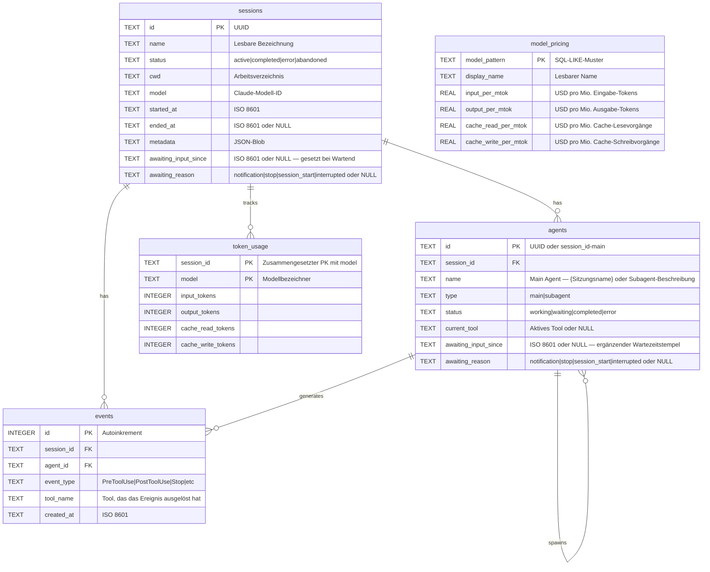

---

## Plugin-Marketplace

CCAM liefert **14 Plugins** aus einem gemeinsamen Quellbaum. Claude Code liest `.claude-plugin/marketplace.json`; Codex liest `.agents/plugins/marketplace.json` sowie die `.codex-plugin/plugin.json` jedes Plugins. Das Paket enthält **66 Plugin-Skills, 18 Claude-Subagents, 34 Claude-Befehle, 3 CLI-Hilfsprogramme, 3 Hook-Konfigurationen und 2 Plugins mit MCP**.

```bash
# Claude Code
claude plugin marketplace add hoangsonww/Claude-Code-Agent-Monitor
claude plugin install ccam-platform@claude-code-agent-monitor-plugins

# Codex
codex plugin marketplace add hoangsonww/Claude-Code-Agent-Monitor
codex plugin add ccam-platform@claude-code-agent-monitor-plugins

# Open Agent Skills / skills.sh-compatible CLI
npx skills add hoangsonww/Claude-Code-Agent-Monitor --list

# Install one skill for Claude Code and Codex in the current project
npx skills add hoangsonww/Claude-Code-Agent-Monitor \
  --skill mcp-server \
  --agent claude-code \
  --agent codex \
  --yes

# Verify, update, and remove the project-scoped skill
npx skills list --json
npx skills update --project --yes
npx skills remove mcp-server --yes

# Add --global to install at user scope, then manage that scope explicitly
npx skills add hoangsonww/Claude-Code-Agent-Monitor \
  --skill mcp-server \
  --agent claude-code \
  --agent codex \
  --global \
  --yes
npx skills list --global --json
npx skills update --global --yes
npx skills remove --global mcp-server --yes
```

Die CLI `skills` findet **insgesamt 77 Repository-Skills**, darunter die 66 Plugin-Skills und die Skills zur Pflege des Repositorys. Projektinstallationen nutzen `.agents/skills/` plus agentenspezifische Links. Globale Claude-Code-Skills liegen standardmäßig in `~/.claude/skills/` oder in `$CLAUDE_CONFIG_DIR/skills/`, falls gesetzt. Globale Codex-Skills liegen standardmäßig in `~/.codex/skills/` oder in `$CODEX_HOME/skills/`, falls gesetzt. Installationen für mehrere Agents können Dateien über einen gemeinsamen Speicher deduplizieren und diese Ziele verlinken. Jede Plugin-Skill hat kanonisches `name`/`description`-Frontmatter und `agents/openai.yaml`-Metadaten. Für die Installation ist kein Upstream-PR an `vercel-labs/skills` nötig. Das öffentliche GitHub-Repository ist die Quelle, und die Sichtbarkeit auf skills.sh folgt der Veröffentlichung und der tatsächlichen Installationstelemetrie.

Neue fokussierte Pakete ergänzen die bestehenden Plugins für Analysen, Produktivität, Qualität, Sitzungen, Workflows, Konfiguration und Dashboard:

- `ccam-runner`: überwachter Start, Nachfassen, Stoppen und Fortsetzen von Claude Code/Codex sowie Laufverlauf
- `ccam-integrations`: Alarmregeln, Webhooks, Push-Benachrichtigungen und entfernte Erfassung per SSH
- `ccam-platform`: Claude-/Codex-Konfigurations-Explorer, anbieterbewusster Import, Backup-Wiederherstellung, Hook-Einrichtung, Updates und MCP-Operationen
- `ccam-reports`: präsentationsfertige Berichte für Führung, Kosten, Zuverlässigkeit und Workflows

Validieren und erzeugen Sie die Distributionsmetadaten neu mit:

```bash
npm run extensions:sync
npm run extensions:validate
```

Vollständiger Katalog, Installationsbefehle, Verhalten von skills.sh, Grenzen der öffentlichen Einreichung und Prüfungen einer sauberen Installation: [docs/PLUGINS.md](docs/PLUGINS.md).

---

## Statuszeile

Ein eigenständiges CLI-Statuszeilenwerkzeug für Claude Code, das Modellname, Benutzer, Arbeitsverzeichnis, Git-Branch, einen Balken der Kontextfensternutzung, Token-Zahlen pro Richtung und die Sitzungskosten anzeigt — alles farbcodiert mit ANSI-Escape-Sequenzen.

```
nguyens6@host ~/agent-dashboard/client | Sonnet 4.6 | main | ████████░░ 79% | 3↑ 2↓ 156586c | $0.4231
```

| Segment | Farbe | Beispiel |
| ----------- | -------------------- | -------------------------------------------------------------- |
| Modell | Cyan | `Sonnet 4.6` |
| Benutzer | Grün | `nguyens6` |
| CWD | Gelb | `~/agent-dashboard` |
| Git-Branch | Magenta | `main` |
| Kontextbalken | Grün / Gelb / Rot | `████████░░ 79%` |
| Tokens | Grün / Cyan / Gedimmt | `3↑ 2↓ 156586c` (grünes `↑` Eingabe, cyanes `↓` Ausgabe, gedimmtes `c` Cache) |
| Kosten (USD) | Grün / Gelb / Rot | `$0.4231` (Sitzungssumme — bei API- und Abo-Plänen angezeigt) |

Farbschwellen der Kosten: grün unter 5 $, gelb 5–20 $, rot ab 20 $.

Siehe [`statusline/README.md`](statusline/README.md) für die Installationsanleitung.

<p align="center">
  
</p>

---

## Serverarchitektur

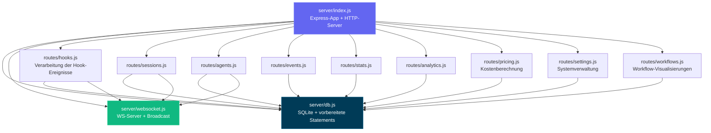

---

## Client-Routing

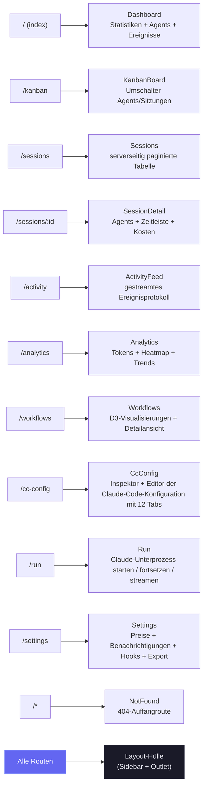

---

## Ablauf des Hook-Handlers

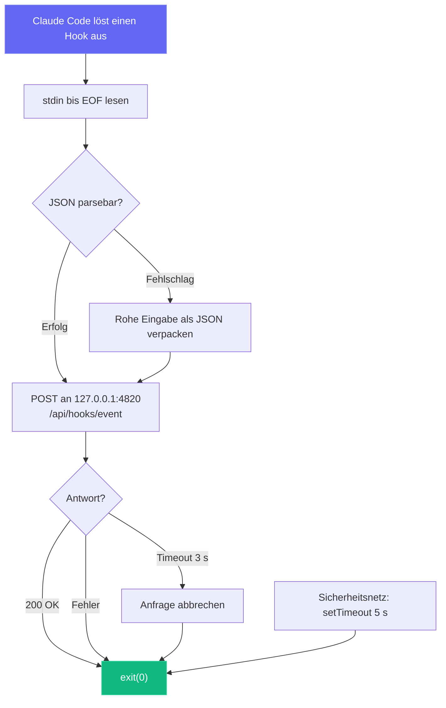

---

## Deployment-Modi

Wir unterstützen Entwicklungs- und Produktions-Deployments mit unterschiedlichen Prozessarchitekturen:

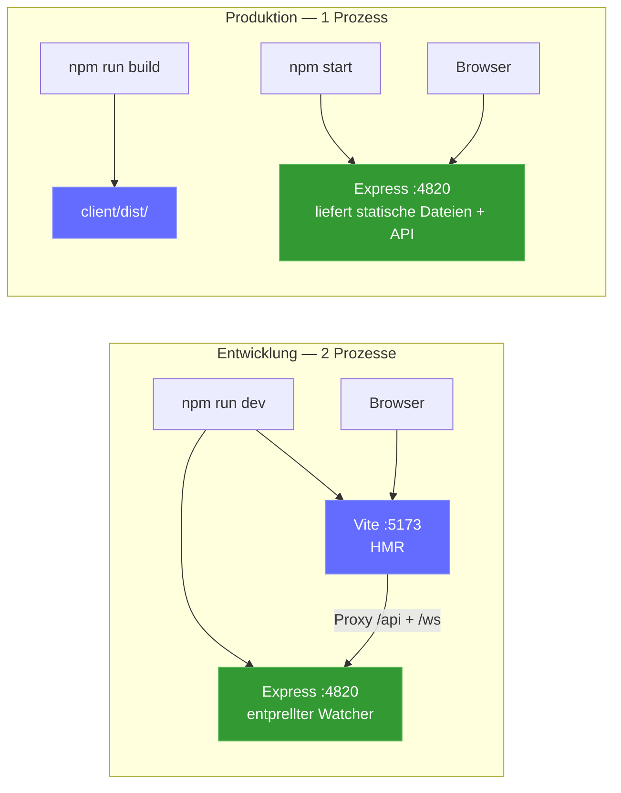

Optionaler lokaler MCP-Sidecar (unterstützt die Transporte stdio, HTTP+SSE und REPL):

```mermaid
graph LR
    subgraph "MCP-Transportoptionen"
        M_STDIO["MCP-Server (stdio)<br/>npm run mcp:start"]
        M_HTTP["MCP-Server (HTTP)<br/>npm run mcp:start:http<br/>:8819"]
        M_REPL["MCP-Server (REPL)<br/>npm run mcp:start:repl"]
    end

    H["MCP-Host"] -->|"stdin/stdout"| M_STDIO
    RC["Entfernter Client"] -->|"POST /mcp · GET /sse"| M_HTTP
    OP["Operator"] -->|"interaktive CLI"| M_REPL

    M_STDIO --> D["Dashboard-Server<br/>:4820"]
    M_HTTP --> D
    M_REPL --> D

    style M_STDIO fill:#0f766e,stroke:#14b8a6,color:#fff
    style M_HTTP fill:#0f766e,stroke:#14b8a6,color:#fff
    style M_REPL fill:#0f766e,stroke:#14b8a6,color:#fff
```

Optionale **Desktop-App (macOS und Windows)** — ein einziger Electron-Prozess, der den Express-Server im selben Prozess hostet (kein Terminal, kein Kindprozess):

```mermaid
flowchart LR
    subgraph desktop["Desktop-App (macOS und Windows) — 1 Electron-Prozess"]
        E_MAIN["Electron-Hauptprozess<br/>(Node 22 / Electron 35)"]
        E_HOST["server-host.ts<br/>require() server/index.js"]
        E_SRV["Eingebettetes Express :4820<br/>API · SQLite · WebSocket"]
        E_WIN["BrowserWindow<br/>gebauter React-Client"]
        E_TRAY["Menüleistensymbol (Tray)<br/>+ natives App-Menü"]
        E_MAIN --> E_HOST
        E_HOST -->|"require() im selben Prozess"| E_SRV
        E_MAIN --> E_TRAY
        E_SRV -->|"http + ws auf 127.0.0.1"| E_WIN
    end

    E_HOOKS["Claude-Code-Hooks"] -->|"POST /api/hooks/event"| E_SRV

    style E_MAIN fill:#47848F,stroke:#2f5a62,color:#fff
    style E_SRV fill:#339933,stroke:#5cb85c,color:#fff
    style E_WIN fill:#61DAFB,stroke:#3aa9c9,color:#000
```

### Cloud-Deployment

Der Stack `deployments/` zielt auf jeden konformen Kubernetes-Dienst, einschließlich EKS, GKE, AKS, OKE und selbst verwalteter Cluster. CCAM nutzt SQLite, daher erzwingt jedes unterstützte Manifest **einen einzigen aktiven Dashboard-Schreiber pro persistentem Volume** mit einem Recreate-Rollout. HPA, Aktiv-Aktiv-Replikate, Blue-Green und Canary werden bewusst nicht unterstützt, solange SQLite das Persistenz-Backend bleibt.

```mermaid
flowchart LR
  CI["CI: testen · validieren · scannen · bescheinigen · signieren"] --> HELM["Helm / Kustomize / Terraform"]
  HELM --> APP["CCAM-Dashboard<br/>genau 1 Replikat"]
  APP --> PVC[("Beibehaltene ReadWriteOnce-PVC")]
  EDGE["Ingress oder Gateway API<br/>TLS + WebSocket"] --> APP
  PROM["Prometheus Operator"] -->|"Bearer /api/metrics"| APP
  MCP["Authentifizierter MCP-Sidecar"] --> APP
```

- **Helm:** per Schema erzwungener einzelner Schreiber, Digest-Unterstützung, beibehaltene PVC, Ingress oder Gateway API, mit External Secrets kompatible Token-Einbindung, NetworkPolicy, optionales MCP und ServiceMonitor.
- **Kustomize:** Basis nach eingeschränktem PSS plus Overlays für Dev/Staging/Produktion und optionale Komponenten für MCP, Monitoring, Gateway API und CSI-Snapshots.
- **Terraform:** stellt das validierte Helm-Chart in einem bestehenden Kubernetes-Cluster bereit. Cloud-Netzwerk, Cluster-Identität, CSI, TLS und die Synchronisierung von Geheimnissen bleiben Sache des Anbieters.
- **Betrieb:** konsistentes Online-Backup von SQLite mit SHA-256, geprüfte Wiederherstellung mit Skalierung auf null, Deploy/Rollback/Abbau jeweils mit vorherigem Backup und authentifizierte Zustandsprüfungen.
- **CI-Lieferkette:** App- und MCP-Images werden gescannt, für amd64/arm64 mit SBOM und SLSA-Herkunftsnachweis veröffentlicht und schlüssellos mit Cosign signiert.

```bash
npm run deploy:validate
REGISTRY="ghcr.io/$(gh repo view --json owner -q .owner.login)"
IMAGE_TAG="$(git rev-parse --short HEAD)"

helm upgrade --install agent-monitor deployments/helm/agent-monitor \
  --namespace agent-monitor-production --create-namespace \
  --values deployments/helm/agent-monitor/values-production.yaml \
  --set image.registry= \
  --set image.repository=${REGISTRY}/claude-code-agent-monitor \
  --set image.tag=${IMAGE_TAG} \
  --atomic --wait --timeout 10m
```

> [!NOTE]
> Vollständige Produktionseinrichtung, Geheimnisse, Docker-/Podman-Stack, Gateway API, Terraform, Backup, Wiederherstellung und Rollback sind in [DEPLOYMENT.md](DEPLOYMENT.md) und [deployments/README.md](deployments/README.md) dokumentiert.

---

## Projektstruktur

```
agent-dashboard/
|-- CLAUDE.md                   # Claude Code project memory and working agreements
|-- AGENTS.md                   # Codex project instructions
|-- package.json                # Root scripts (dashboard + MCP helpers) + server dependencies
|-- .claude/
|   +-- rules/                  # Path-scoped Claude rules
|   +-- skills/                 # Claude reusable project skills
|   +-- agents/                 # Claude custom subagents
|-- .claude-plugin/
|   +-- marketplace.json        # Claude Code marketplace manifest (14 plugins)
|-- .agents/plugins/
|   +-- marketplace.json        # Codex marketplace manifest (same 14 plugins)
|-- plugins/
|   |-- ccam-analytics/         # Analytics: session reports, cost breakdown, usage trends, productivity score
|   |   |-- .claude-plugin/plugin.json
|   |   |-- skills/ (4)         # session-report, cost-breakdown, usage-trends, productivity-score
|   |   |-- agents/             # analytics-advisor (Sonnet model)
|   |   |-- hooks/hooks.json    # Stop + SubagentStop event logging
|   |   +-- bin/ccam-stats      # Terminal dashboard CLI
|   |-- ccam-productivity/      # Productivity: standups, reports, sprints, workflow optimizer
|   |-- ccam-devtools/          # DevTools: debug, diagnostics, export, health checks
|   |   +-- bin/                # ccam-doctor + ccam-export CLIs
|   |-- ccam-insights/          # Insights: patterns, anomalies, optimization, comparison
|   |-- ccam-cost-guard/        # Cost guardrails: budgets, spend forecast, cost alerts, model savings
|   |-- ccam-sessions/          # Session forensics: search, timeline, transcript replay, cwd rollup, cleanup
|   |-- ccam-workflows/         # Workflow orchestration: DAG map, delegation audit, concurrency, fleet runs
|   |-- ccam-quality/           # Reliability & SLOs: error scan, API-error report, hook-failure audit, SLO check
|   |-- ccam-config/            # Config & memory governance: config audit, memory review, skill/MCP/hook inventory
|   +-- ccam-dashboard/         # Dashboard connector: status, quick stats, MCP integration
|       +-- .mcp.json           # MCP server configuration
|-- server/
|   |-- index.js                 # Express app, HTTP server, static serving
|   |-- db.js                    # SQLite schema, migrations, prepared statements
|   |-- websocket.js             # WebSocket server with heartbeat
|   +-- routes/
|       |-- hooks.js             # Hook event processing (transactional)
|       |-- sessions.js          # Session CRUD
|       |-- agents.js            # Agent CRUD
|       |-- events.js            # Event listing
|       |-- stats.js             # Aggregate statistics
|       |-- analytics.js         # Token, tool, and trend analytics
|       |-- workflows.js         # Aggregate workflow data and per-session drill-in
|       |-- pricing.js           # Model pricing CRUD and cost calculation
|       +-- settings.js          # System info, data management, export, cleanup
|   +-- lib/
|       +-- transcript-cache.js  # Stat-based JSONL transcript cache with chunked sync byte-stream reader (4 MiB chunks, line-by-line UTF-8 decode) so files larger than V8's max string length (~512 MiB) parse without aborting Node with "FATAL ERROR: v8::ToLocalChecked Empty MaybeLocal". Extracts tokens, compactions, API errors, turn durations, thinking blocks, and usage extras (service_tier, speed, inference_geo)
|   +-- compat-sqlite.js         # node:sqlite compatibility wrapper (fallback for better-sqlite3)
|-- client/
|   |-- package.json             # Client dependencies
|   |-- index.html               # HTML entry point
|   |-- vite.config.ts           # Vite + proxy config
|   |-- tailwind.config.js       # Custom dark theme
|   |-- tsconfig.json            # Strict TypeScript
|   +-- src/
|       |-- main.tsx             # React entry
|       |-- App.tsx              # Router + WebSocket provider
|       |-- index.css            # Tailwind + custom utilities
|       |-- lib/
|       |   |-- types.ts         # Shared TypeScript interfaces
|       |   |-- api.ts           # Typed fetch client
|       |   |-- format.ts        # Date/time formatting utilities
|       |   +-- eventBus.ts      # Pub/sub for WebSocket distribution
|       |-- hooks/
|       |   |-- useWebSocket.ts      # Auto-reconnecting WebSocket hook
|       |   +-- useNotifications.ts  # Browser notification triggers from WebSocket events
|       |-- components/
|       |   |-- Layout.tsx       # Shell with sidebar + outlet
|       |   |-- Sidebar.tsx      # Navigation + connection indicator
|       |   |-- AgentCard.tsx    # Agent info card with status
|       |   |-- StatCard.tsx     # Metric card
|       |   |-- StatusBadge.tsx  # Color-coded status pills
|       |   |-- EmptyState.tsx   # Placeholder for empty lists
|       |   +-- workflows/       # D3.js workflow visualization components
|       |       |-- OrchestrationDAG.tsx            # Horizontal DAG of agent spawning patterns
|       |       |-- ToolExecutionFlow.tsx           # d3-sankey diagram of tool-to-tool transitions
|       |       |-- AgentCollaborationNetwork.tsx   # Force-directed agent pipeline graph
|       |       |-- SubagentEffectiveness.tsx       # Scorecard grid with SVG success rings
|       |       |-- WorkflowPatterns.tsx            # Auto-detected orchestration sequences
|       |       |-- ModelDelegationFlow.tsx         # Model routing through agent hierarchies
|       |       |-- ErrorPropagationMap.tsx         # Error clustering by hierarchy depth
|       |       |-- ConcurrencyTimeline.tsx         # Swim-lane parallel agent execution
|       |       |-- SessionComplexityScatter.tsx    # D3 bubble chart (duration vs agents vs tokens)
|       |       |-- CompactionImpact.tsx            # Token compression events and recovery
|       |       |-- WorkflowStats.tsx               # Aggregate workflow statistics
|       |       +-- SessionDrillIn.tsx              # Per-session agent tree, tool timeline, events
|       +-- pages/
|           |-- Dashboard.tsx      # Overview page
|           |-- KanbanBoard.tsx    # Agents/Sessions toggle, status columns
|           |-- Sessions.tsx       # Server-paginated sessions table
|           |-- SessionDetail.tsx  # Single session deep dive
|           |-- ActivityFeed.tsx   # Real-time event stream
|           |-- Analytics.tsx      # Token usage, heatmap, trends
|           |-- Workflows.tsx      # D3.js workflow visualizations and session drill-in
|           |-- Settings.tsx       # Model pricing, notifications, hooks, export, cleanup
|           +-- NotFound.tsx       # 404 catch-all page
|-- scripts/
|   |-- hook-handler.js          # Lightweight stdin-to-HTTP forwarder
|   |-- install-hooks.js         # Auto-configures ~/.claude/settings.json
|   |-- import-history.js        # Imports sessions from ~/.claude/ with enhanced JSONL extraction (API errors, turn durations, entrypoint, permission modes, thinking blocks, usage extras, tool errors, subagent JSONL files). Re-import is fully incremental: a per-event-type high-water mark (`MAX(created_at) GROUP BY event_type` per session) is computed up-front and only JSONL entries with `ts > cutoff[type]` are inserted, so long-running sessions whose transcripts grow across multiple days continue to receive Stop / PostToolUse / TurnDuration / ToolError events on every re-run. Also rolls `sessions.ended_at` forward when the JSONL advances past the stored value and refreshes message-count metadata on every pass
|   +-- seed.js                  # Sample data generator
|-- mcp/
|   |-- package.json             # MCP package scripts + dependencies
|   |-- README.md                # MCP setup, host config, tool catalog, safety model
|   |-- src/
|   |   |-- index.ts             # MCP runtime entrypoint (transport router)
|   |   |-- server.ts            # MCP server assembly
|   |   |-- clients/             # Dashboard API client with retry/backoff
|   |   |-- config/              # Environment/CLI config parsing
|   |   |-- core/                # Logger, tool registry, result helpers
|   |   |-- policy/              # Mutation/destructive guards
|   |   |-- tools/               # 16 domain modules registering 97 tools
|   |   |-- transports/          # HTTP+SSE server, REPL, tool collector
|   |   |-- ui/                  # ANSI banner, colors, formatter, tables
|   |   +-- types/               # Shared MCP type definitions
|   +-- build/                   # Built MCP runtime output
|-- desktop/
|   |-- package.json             # Electron + electron-builder dependencies and scripts
|   |-- electron-builder.yml     # DMG packaging config; signing/notarization hooks
|   |-- tsconfig.json            # Strict TypeScript (src/ -> out/)
|   |-- README.md                # Desktop app architecture reference (contributor docs)
|   |-- assets/                  # icon.svg + generated icon.icns + tray PNGs
|   |-- src/
|   |   |-- main.ts              # Electron main process entry — lifecycle, wiring
|   |   |-- server-host.ts       # In-process Express boot, port discovery, adoption, DB close
|   |   |-- window.ts            # BrowserWindow + persisted window geometry
|   |   |-- tray.ts              # Menu-bar (tray) icon + context menu
|   |   |-- menu.ts              # Native application menu (File ▸ Open Dashboard is macOS-only)
|   |   |-- login-item.ts        # macOS Login Items auto-start toggle (SMAppService)
|   |   |-- logger.ts            # File logger -> ~/Library/Logs/Claude Code Monitor/desktop.log
|   |   |-- constants.ts         # App name, ports, timeouts, window size
|   |   +-- preload.ts           # Intentionally empty (zero renderer privilege)
|   |-- scripts/
|   |   |-- install.js           # Preflights native deps for desktop:install; prints setup help + exits non-zero on failure
|   |   |-- preflight.js         # Shared better-sqlite3 binary check + actionable per-OS setup help (incl. no-toolchain alternative)
|   |   |-- prebuild.js          # Ensures root + client are built before tsc; fails fast with setup help if native binary missing
|   |   |-- build-icons.sh       # SVG -> PNG/ICNS via qlmanage/sips/iconutil
|   |   +-- notarize.js          # electron-builder afterSign hook (opt-in notarization)
|   +-- tests/
|       +-- smoke.test.mjs       # Spawn Electron + probe /api/health
|-- deployments/
|   |-- README.md                # Production deployment reference
|   |-- nginx/                   # Rootless Nginx edge and opt-in hook/MCP policies
|   |-- secrets/                 # Ignored Compose token/password files
|   |-- terraform/               # Helm deployment to an existing Kubernetes cluster
|   |-- kubernetes/              # One-writer Kustomize base + environment overlays
|   |   |-- base/                # Restricted PSS, Recreate Deployment, PVC, Service, Ingress
|   |   |-- overlays/            # Dev, staging, production namespaces and resources
|   |   +-- components/          # MCP, ServiceMonitor, Gateway API, VolumeSnapshot
|   |-- helm/agent-monitor/      # Schema-enforced Helm chart and environment values
|   +-- scripts/                 # Validate, deploy, backup, restore, rollback, health, teardown
|-- .codex/
|   |-- config.toml              # Codex runtime configuration
|   |-- README.md                # Codex setup guide for agents and skills
|   |-- rules/                   # Codex execution policy rules
|   |-- agents/                  # Codex custom agent templates
|   +-- skills/                  # Codex project skills
|-- statusline/
|   |-- README.md                # Statusline installation & usage guide
|   |-- statusline.py            # Python script that renders the statusline
|   +-- statusline-command.sh    # Shell wrapper for Claude Code's statusLine config
+-- data/
    +-- dashboard.db             # SQLite database (gitignored)
```

---

## Fehlerbehebung

| Problem | Lösung |
| --------------------------------- | ---------------------------------------------------------------------------------------------------------------------------------------------------------------- |
| Installation von `better-sqlite3` schlägt fehl | Das ist nicht kritisch — der Server greift automatisch auf das in Node.js integrierte `node:sqlite` zurück (Node 22+). Installieren Sie bei älteren Node-Versionen Python 3 und die C++-Build-Werkzeuge und führen Sie dann `npm rebuild better-sqlite3` aus |
| Hooks werden nicht ausgelöst | Führen Sie `npm run install-hooks` aus und starten Sie Claude Code neu. Prüfen Sie, ob die Hooks in `~/.claude/settings.json` stehen |
| Dashboard zeigt keine Daten | Stellen Sie sicher, dass der Server läuft (`npm run dev`), bevor Sie eine Claude-Code-Sitzung starten. Prüfen Sie `http://localhost:4820/api/health` |
| WebSocket getrennt | Der Client verbindet sich alle 2 Sekunden automatisch neu. Prüfen Sie, dass Port 4820 nicht von einer Firewall blockiert wird |
| Veraltete Daten nach Neustart | Die Datenbank bleibt über Neustarts hinweg erhalten. Führen Sie `npm run seed` für frische Demodaten aus oder löschen Sie `data/dashboard.db`, um alles zurückzusetzen |
| MCP-Tools verbinden sich nicht | Prüfen Sie, dass die Dashboard-API unter `MCP_DASHBOARD_BASE_URL` erreichbar ist, und bauen/starten Sie MCP neu (`npm run mcp:build`, `npm run mcp:start`) |

---

## Mitwirken

Beiträge sind willkommen — siehe [`.github/CONTRIBUTING.md`](.github/CONTRIBUTING.md) für den vollständigen Leitfaden.

Alle Beitragenden müssen das [Contributor License Agreement](https://github.com/hoangsonww/Claude-Code-Agent-Monitor/blob/master/CLA.md) unterzeichnen. Dies wird bei jedem Pull Request automatisch von der GitHub Action `🖋️ CLA Assistant` durchgesetzt: Beim ersten Öffnen eines PR bittet Sie ein Bot, mit dem Kommentar `I have read the CLA Document and I hereby sign the CLA` zu unterzeichnen. Die Statusprüfung **CLA Assistant** des PR bleibt rot, bis Sie das getan haben, und eine einmalige Unterzeichnung gilt für alle künftigen Beiträge.

---

## Lizenz

MIT. Details in [LICENSE](LICENSE).
