# Panel de agentes para Claude Code, Cursor y Codex

### Plataforma de monitoreo en tiempo real para agentes Claude Code, Cursor y Codex 🚀

Un panel profesional para rastrear sesiones, herramientas, historial de conversaciones, costos y subagentes de Claude Code, Cursor y Codex en tiempo real. Combina hooks nativos con detección local de transcripciones específica por proveedor.


> [!TIP]
> Consulta también [README-EN.md](./README-EN.md) (English), [README-CN.md](./README-CN.md) (中文), [README-VN.md](./README-VN.md) (Tiếng Việt) y [README-KO.md](./README-KO.md) (한국어). Este es el README en español.

> [!NOTE]
> ¿Necesitas ayuda orientada a tareas? La [Wiki de GitHub](https://github.com/hoangsonww/Claude-Code-Agent-Monitor/wiki) es el manual práctico para el uso diario, las operaciones de equipo, la solución de problemas, la automatización con CLI/MCP y las recetas de despliegue. La [Wiki estática localizada](https://hoangsonww.github.io/Claude-Code-Agent-Monitor/wiki/) sigue siendo el recorrido del producto y la arquitectura en inglés, vietnamita, chino, coreano y español; los contratos técnicos exactos permanecen en [`docs/`](./docs/README.md).

---

## Índice de contenidos

- [Visión general](#resumen-general)
- [Internacionalización (i18n)](#internacionalización-i18n)
- [Funciones](#características)
- [Inicio rápido](#inicio-rápido)
- [Cómo funciona](#cómo-funciona)
- [Configuración](#configuración)
- [Scripts npm](#scripts-npm)
- [Marketplace de plugins](#marketplace-de-plugins)
- [Extensión de agentes](#extensión-de-agentes)
- [Integración MCP](#integración-mcp)
- [Referencia de API](#referencia-de-api)
- [Eventos de conexión](#eventos-de-enganchamiento)
- [Notificaciones del navegador](#notificaciones-del-navegador)
- [Notificador de actualización](#notificador-de-actualización)
- [Tabby — Compañero de gato flotante](#tabby--compañero-de-gato-flotante)
- [Señales de sonido](#señales-de-sonido)
- [Modal de estado de conexión](#modal-de-estado-de-conexión)
- [Extensión de VS Code](#extensión-de-vs-code)
- [Aplicación de escritorio (macOS y Windows)](#aplicación-de-escritorio-macos-y-windows)
- [Almacenamiento de datos](#almacenamiento-de-datos)
- [Línea de estado](#línea-de-estado)
- [Arquitectura del servidor](#arquitectura-del-servidor)
- [Routing del cliente](#enrutamiento-del-cliente)
- [Flujo del gestor de ganchos](#flujo-del-gestor-de-ganchos)
- [Modos de despliegue](#modos-de-despliegue)
- [Estructura del proyecto](#estructura-del-proyecto)
- [Solución de problemas](#solución-de-problemas)
- [Contribuyendo](#contribuyendo)
- [Licencia](#licencia)

---

## Resumen general

Siga sesiones, supervise agentes en tiempo real, visualice el uso de herramientas, reproduzca conversaciones y observe la orquestación de subagentes mediante una interfaz web profesional con tema oscuro. Claude Code y Codex usan sus hooks nativos; Cursor se incluye de fábrica mediante eventos en vivo compatibles y el descubrimiento nativo de transcripciones en `~/.cursor`.

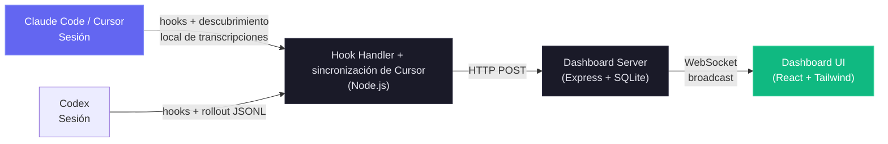

Además del panel de control de monitoreo en tiempo real, también incluye una implementación local del servidor MCP en `mcp/` que expone un catálogo de herramientas para introspeccionar y gestionar el propio panel de control, lo que facilita la integración de las operaciones del panel de control directamente en sus flujos de trabajo de Claude Code & Codex. También hay una capa de extensión de agentes, que proporciona complementos, habilidades y subagentes de Claude Code & Codex para la interacción del panel de control, el análisis y la inteligencia de los flujos de trabajo.

### Internacionalización (i18n)

La interfaz de usuario incluye selección de idioma para inglés (`en`), chino (`zh`), vietnamita (`vi`), coreano (`ko`) y español (`es`). El selector personalizado en forma de menú desplegable evita que la barra lateral se sature a medida que se agregan idiomas. Los recursos se cargan por espacio de nombres y la preferencia se conserva en el almacenamiento del navegador entre actualizaciones.

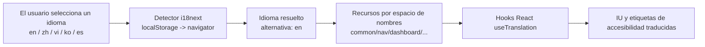

Para obtener una guía completa de arquitectura y funcionamiento, consulte [docs/I18N.md](./docs/I18N.md).

### Interfaz de usuario

La interfaz oscura y adaptable cubre todo el flujo de trabajo. Cada vista previa usa una miniatura apta para móviles y enlaza la imagen original nítida.

<p align="center">
  <a href="images/dashboard.png"></a>
  <br>
  <em>📡 <strong>Panel</strong> · totales del conjunto, agentes activos, actividad reciente y señales de estado en vivo</em>
</p>

<p align="center">
  <a href="images/tasks-overview.png"></a>
  <br>
  <em>📋 <strong>Progreso de tareas</strong> · finalización compacta y vistas del trabajo por propietario</em>
</p>

<p align="center">
  <a href="images/dashboard-health.png"></a>
  <br>
  <em>🩺 <strong>Estado del sistema</strong> · almacenamiento, caché, errores, herramientas, modelos, subagentes y compactaciones</em>
</p>

<p align="center">
  <a href="images/board.png"></a>
  <br>
  <em>📋 <strong>Tablero Kanban · Agentes</strong> · agentes trabajando, en espera, completados y con errores, con motivos de espera claros</em>
</p>

<p align="center">
  <a href="images/board-sessions.png"></a>
  <br>
  <em>🗂️ <strong>Tablero Kanban · Sesiones</strong> · sesiones activas, en espera, completadas, con errores y abandonadas</em>
</p>

<p align="center">
  <a href="images/sessions.png"></a>
  <br>
  <em>📂 <strong>Sesiones</strong> · historial con búsqueda, filtros y paginación del servidor, con costos y actividad</em>
</p>

<p align="center">
  <a href="images/session-agents.png"></a>
  <br>
  <em>🤖 <strong>Agentes de sesión</strong> · totales en vivo, uso de herramientas, flujo de tokens y jerarquía de agentes</em>
</p>

<p align="center">
  <a href="images/tasks-details.png"></a>
  <br>
  <em>✅ <strong>Detalles de tareas</strong> · segmentos de finalización, trabajo activo, propietarios y tareas paginadas</em>
</p>

<p align="center">
  <a href="images/session-conversation.png"></a>
  <br>
  <em>💬 <strong>Conversación</strong> · transcripciones renderizadas, código, llamadas a herramientas, salida de comandos y marcadores de sesión</em>
</p>

<p align="center">
  <a href="images/session-timeline.png"></a>
  <br>
  <em>🔬 <strong>Cronología</strong> · eventos cronológicos, filtros multidimensionales y actividad emparejada de herramientas</em>
</p>

<p align="center">
  <a href="images/feed.png"></a>
  <br>
  <em>📰 <strong>Feed de Actividad</strong> · eventos en vivo que se pueden pausar, agrupación, filtros y saltos a sesiones</em>
</p>

<p align="center">
  <a href="images/analytics.png"></a>
  <br>
  <em>📊 <strong>Analíticas</strong> · tokens por modelo, frecuencia de herramientas, mapas de calor de actividad y tendencias de sesiones</em>
</p>

<p align="center">
  <a href="images/workflows.png"></a>
  <br>
  <em>🔀 <strong>Flujos</strong> · gráficos de orquestación, flujo de herramientas, colaboración, delegación y patrones</em>
</p>

<p align="center">
  <a href="images/dynamicworkflows-workflows.png"></a>
  <br>
  <em>🧬 <strong>Ejecuciones de flujos</strong> · estado respaldado por diarios, agentes, tokens, herramientas y duración</em>
</p>

<p align="center">
  <a href="images/dynamicworkflows-workflows2.png"></a>
  <br>
  <em>🧬 <strong>Ejecución ampliada</strong> · filtros de fase, métricas por agente, prompts y resultados completos</em>
</p>

<p align="center">
  <a href="images/dynamicworkflows-session.png"></a>
  <br>
  <em>🧬 <strong>Flujos de sesión</strong> · ejecuciones dinámicas vinculadas y costos de tokens incorporados</em>
</p>

<p align="center">
  <a href="images/config.png"></a>
  <br>
  <em>🧰 <strong>Configuración del agente</strong> · consulta y edita de forma segura la configuración compatible de Claude Code y Codex</em>
</p>

<p align="center">
  <a href="images/config-codex.png"></a>
  <br>
  <em>🧰 <strong>Configuración de Codex</strong> · modelos, perfiles, MCP, proyectos, skills, hooks, reglas, plugins e instrucciones</em>
</p>

<p align="center">
  <a href="images/config-skills.png"></a>
  <br>
  <em>🧩 <strong>Skills</strong> · skills de usuario, proyecto y plugins con búsqueda y edición respaldada</em>
</p>

<p align="center">
  <a href="images/run.png"></a>
  <br>
  <em>▶️ <strong>Ejecutar agente</strong> · inicia Claude Code o Codex con controles nativos del proveedor</em>
</p>

<p align="center">
  <a href="images/run-results.png"></a>
  <br>
  <em>💬 <strong>Ejecución en vivo</strong> · chat en streaming, razonamiento, comandos, cambios de archivos, herramientas y reconexión</em>
</p>

<p align="center">
  <a href="images/settings.png"></a>
  <br>
  <em>⚙️ <strong>Configuración</strong> · precios, hooks, notificaciones, datos, fuentes remotas y estado del sistema</em>
</p>

<p align="center">
  <a href="images/alerts.png"></a>
  <br>
  <em>🔔 <strong>Alertas</strong> · reglas, cooldowns, actividad y webhooks integrados o genéricos firmados</em>
</p>

<p align="center">
  <a href="images/remote.png"></a>
  <br>
  <em>🛰️ <strong>Fuentes de datos remotas</strong> · sincronización SSH por proveedor y supervisión limitada por fuente</em>
</p>

<p align="center">
  <a href="images/palette.png"></a>
  <br>
  <em>⌘ <strong>Paleta de comandos</strong> · un iniciador de teclado para páginas, sesiones, proyectos, filtros y acciones</em>
</p>

La barra lateral enlaza Panel, Tablero Kanban, Sesiones, Feed de Actividad, Analíticas, Flujos, Configuración del agente, Ejecutar agente y Configuración. Las secciones siguientes describen el comportamiento completo detrás de estas vistas.

---
## Características

El panel cubre todo el ciclo de vida de los agentes locales. Los contratos operativos detallados se mantienen en las secciones enlazadas y en las referencias de `docs/`.

| Característica | Resumen |
| --- | --- |
| **Progreso de tareas** | Progreso por propietario a partir de las herramientas de tareas de Claude, el `TodoWrite` heredado y `update_plan` de Codex. Las tarjetas y filas muestran vistas previas compactas. Detalles de la sesión añade segmentos de estado, trabajo activo, propietarios y paginación de 10 filas. El trabajo principal nuevo elimina el estado incompleto obsoleto, mientras que se conserva el historial completado. |
| **Panel** | Las pestañas persistentes **Monitor** y **Salud** combinan totales del conjunto, jerarquías activas, actividad reciente, estado ponderado de éxito, caché, errores y heap, almacenamiento, herramientas, modelos, eficacia de subagentes y métricas de compactación. Salud se actualiza cada 5 segundos desde `/api/settings/info` y `/api/workflows`. |
| **Tablero Kanban** | Las columnas de agentes cubren Trabajando, En espera, Completados y Error. Las columnas de sesiones añaden Activas y Abandonadas. Las tarjetas se paginan de 10 en 10, se suscriben solo a la vista WebSocket activa, conservan los títulos completos y explican motivos de espera como permisos, fin de turno, inactividad en el prompt o interrupción. |
| **Sesiones** | Historial con búsqueda, filtros y paginación del servidor, cálculo del costo de la página visible y una fila temporal en memoria para el inicio de Codex. La búsqueda cubre `id`, `name` y `cwd` con un debounce de 300 ms. Los nombres se obtienen del título explícito, el título de IA y, por último, el primer prompt relevante del usuario. |
| **Detalles de la sesión** | Estadísticas en vivo, trabajo activo, uso de herramientas, subagentes, tokens, jerarquía, cronologías filtradas, agrupación por `tool_use_id` y renderizadores específicos por herramienta. La vista Conversación muestra turnos en cola, avisos del sistema, Markdown, código resaltado y herramientas con estilo. Los avisos de espera muestran el motivo y el tiempo transcurrido. |
| **Feed de Actividad** | Eventos en tiempo real que se pueden pausar, con filtros compartidos, paginación del servidor, agrupación, origen por proyecto, sesión o subagente, enlaces a sesiones e insignias de estado coherentes para Claude y Codex. |
| **Analíticas** | Tokens por modelo, frecuencia de herramientas, mapas de calor de actividad alineados al domingo, tendencias de sesiones, estado de conexión, esqueletos de carga acordes al diseño y paginación de leyendas largas. |
| **Paleta de comandos** | `Cmd/Ctrl+K` busca comandos recientes, todas las rutas, sesiones en vivo del servidor, acciones de página, directorios de proyectos, subvistas, filtros, Configuración, Configuración del agente, preferencias, alcance e idioma. Admite clasificación por subsecuencia, ámbitos `>`/`@`/`#`, control completo con teclado, etiquetas traducidas, fallo silencioso de búsqueda y solo navegación para las acciones destructivas. |
| **Un solo atajo** | `Cmd/Ctrl+K` es la única combinación global del panel, incluso dentro de campos. La eliminación de la navegación con varias teclas evita modos ocultos. Tabby conserva `Cmd/Ctrl+B`. |
| **Actualizaciones en vivo** | WebSocket envía cambios a la interfaz sin polling. |
| **Detección automática** | Las señales del proveedor crean sesiones y agentes automáticamente. Claude aparece en `SessionStart`. Codex muestra una tarjeta local temporal En espera antes de tener un ID persistente, adopta de forma segura hilos finalizados que se reanudan y nunca guarda tarjetas sin identidad en totales, analíticas, alertas o notificaciones persistentes. |
| **Importación del historial** | Las transcripciones de Claude en `~/.claude/` y los rollouts de Codex en `~/.codex/sessions` usan flujos específicos de exploración y carga, contabilidad compartida con la ingesta en vivo y escrituras idempotentes. Los rollouts externos de Codex se guardan como snapshots para que las conversaciones sobrevivan a la eliminación del origen. |
| **Jerarquía de subagentes** | Los árboles plegables de relaciones padre-hijo en Panel y Detalles de la sesión se expanden automáticamente mientras los hijos están activos. |
| **Agentes en segundo plano** | Los subagentes en segundo plano siguen rastreados sin completarse antes de tiempo. |
| **Atribución de herramientas de subagentes** | `SubagentStop` y las exploraciones iniciales importan herramientas JSONL por subagente, emparejan resultados por `tool_use_id`, eliminan duplicados, fusionan filas en vivo coincidentes en un plazo de 30 segundos y reconstruyen los padres anidados reales mediante IDs de hijos generados. La reasignación de padres es aditiva y actualiza la interfaz aunque no se inserte ninguna fila. |
| **Seguimiento de costos** | Los precios configurables por modelo y sesión admiten tarifas introductorias con fecha, categorías promocionales editables, el costo propio de cada subagente y totales seguros ante compactaciones. Las lecturas de transcripciones usan offsets de bytes incrementales en caché. |
| **Caché de transcripciones** | El análisis JSONL incremental extrae tokens, compactaciones, errores de API, duraciones de turnos, razonamiento y metadatos de uso. Los análisis completos reparan duplicados heredados y los análisis de cola solo añaden. Los arrays tienen un límite de `TRANSCRIPT_CACHE_MAX_ARRAY_LEN`, predeterminado en `1000`, y las entradas guardan solo metadatos del archivo y el resultado analizado. |
| **Retención de snapshots de transcripciones** | Los snapshots persistentes de Claude, Codex y Cursor conservan la conversación más completa. Las copias de Claude y Cursor sin origen se comprimen con gzip tras verificar el recorrido completo. La purga elimina snapshots. Los límites opcionales de edad y tamaño pueden eliminar la única copia antigua después de una vista previa de simulación en Configuración. |
| **Notificaciones** | VAPID Web Push entrega eventos configurados cuando el navegador está en segundo plano o cerrado, con audio en macOS y controles de suscripción. |
| **Alertas** | Configuración ofrece Reglas, Canales y Actividad para patrones de eventos, inactividad, agentes atascados y alertas de tokens. Las reglas de eventos se ejecutan tras la ingesta y las temporales cada 60 segundos. Las alertas persistentes usan un cooldown por regla y sesión, predeterminado en 300 segundos, entrega por WebSocket, confirmación y envío limitado a 14 proveedores con nombre o JSON genérico firmado, con secretos ocultos, timeouts y reintentos acotados. |
| **Notificador de actualizaciones** | Un `git fetch` programado y no bloqueante compara el checkout con el remoto canónico y muestra el comando exacto de actualización en el modal, la barra lateral y el terminal. CCAM nunca hace pull ni se reinicia. |
| **Configuración** | Estado del sistema y de hooks, precios por proveedor, notificaciones, limpieza, homes de proveedores, actualización instantánea de datos y restauración idempotente de JSON de exportación de hasta 25 MiB. Los precios admiten valores predeterminados por proveedor, reglas comodín, orientación de tarifas publicadas, el límite GPT de 272K y catálogos separados de Cursor nativo y proveedores externos. |
| **Ejecutar agente + Configuración del agente** | `/run` inicia Claude Code o hilos nativos del app-server de Codex con modelos, aprobaciones, sandbox, reanudación, detención, transmisión y reconexión específicos del proveedor. `/cc-config` reúne exploradores editables de Claude y Codex. Los archivos de usuario compatibles usan guardados atómicos protegidos y copias de seguridad con marca de tiempo, vistas previas con secretos ocultos, comandos exactos de perfil y watchers específicos del proveedor. |
| **Configuración del agente de Codex** | Muestra el catálogo completo de modelos de la cuenta y las sobreescrituras base y de perfil, crea overlays estándar `<name>.config.toml` y protege la edición con comprobaciones de contención canónica y symlinks. Perfiles, hooks, reglas, skills e instrucciones admiten acciones de origen, ruta, edición y eliminación con copia previa. `config.toml` solo se puede editar. |
| **Servidor MCP (local)** | Tres transportes, stdio, HTTP+SSE y REPL, exponen 103 herramientas tipadas en 16 módulos. Un catálogo validado exige destinos localhost o HTTPS, aplica reglas de bearer token, rechaza redirecciones, controla mutaciones y limita las cargas a 50 MiB por archivo y 100 MiB por llamada, las respuestas binarias a 10 MiB y las restauraciones a 25 MiB. |
| **Flujos** | Once secciones D3 cubren orquestación, flujo de herramientas, colaboración, eficacia, patrones, delegación, errores, concurrencia, complejidad, compactación y análisis detallado de sesiones. Las explicaciones y tooltips localizados, el filtrado cruzado, la exportación JSON, la actualización en vivo con debounce de 3 segundos y las ejecuciones dinámicas reconstruidas desde diarios conservan fase, tokens, herramientas, duración, prompt y resultado por agente. |
| **Seguimiento de compactaciones** | Las exploraciones de transcripciones crean agentes y eventos de compactación de duración cero, reparan duraciones negativas heredadas, completan sesiones antiguas y revisan periódicamente solo las sesiones activas mediante valores `sessions.transcript_path` indexados. |
| **Subsesiones y sesiones reanudadas** | Los eventos nuevos reactivan sesiones reanudadas o huérfanas. Un barrido en cada cuarto de `DASHBOARD_STALE_MINUTES`, acotado entre 60 segundos y 5 minutos, detecta sesiones abandonadas. |
| **Detección de sesiones preexistentes** | La importación al iniciar marca como activas las transcripciones modificadas recientemente. Los eventos Stop posteriores reactivan las sesiones importadas completadas o abandonadas antes de actualizarlas. |
| **Sincronización continua de proyectos** | Un barrido inicial inmediato, un watcher del sistema de archivos con debounce y el sondeo `DASHBOARD_SESSION_SYNC_MS`, predeterminado en 30 segundos, comparten una caché de mtime y una exploración combinada. Solo se vuelven a analizar archivos nuevos o ampliados, con un alcance de watcher seguro en Linux y emisiones de sesión en vivo. |
| **Fuentes de datos remotas** | Las fuentes SSH replican de forma independiente los homes de Claude y Codex mediante `scp` o `tar` de WSL, etiquetan `sessions.source`, concilian el ciclo de vida y se mantienen saludables si cualquiera de los proveedores funciona. El polling predeterminado es de 15 segundos y el fallback obsoleto solo afecta al proveedor que falló. Las credenciales permanecen con el SSH del host. |
| **Ingesta push remota** | `POST /api/hooks/ingest-batch` admite máquinas detrás de NAT. Permanece deshabilitada hasta configurar `REMOTE_PUSH_TOKEN`, rechaza tokens en query strings y sesiones locales, limita los lotes a 1000, elimina duplicados por `(session_id, event_type, uuid)`, devuelve errores parciales por elemento y solo emite después del commit. |
| **Diseño adaptable** | Los diseños móviles apilan cuadrículas, permiten desplazar tablas anchas y contraen la navegación. |
| **Localización de la interfaz** | Inglés, chino, vietnamita, coreano y español cubren el texto de la interfaz, las etiquetas de accesibilidad, las explicaciones y tooltips de flujos, la orientación sobre precios de modelos, los homes de proveedores y el Historial de importaciones. |
| **Datos de ejemplo** | Un script integrado aporta datos realistas para demostraciones y desarrollo. |
| **Línea de estado** | Una franja CLI en color muestra el modelo, el contexto, la rama de Git, los tokens por dirección y el costo de la sesión en USD. |
| **Formato de nombres de modelos** | Los identificadores de Claude, GPT y Gemini se convierten en nombres legibles eliminando sufijos de proveedor, fecha y latest, uniendo versiones numéricas y formateando etiquetas de contexto. Configuración conserva los patrones de precios sin procesar. |
| **Marketplace de plugins de Claude + Codex** | Un árbol de 14 plugins compartidos incluye ambos formatos de manifest y catálogos, 66 habilidades empaquetadas, 18 subagentes de Claude, 34 comandos de Claude, 3 asistentes de CLI y metadatos OpenAI. `npx skills add hoangsonww/Claude-Code-Agent-Monitor --list` descubre 77 habilidades del repositorio. |
| **Ejecutar Claude** | Los modos Conversación y una ejecución admiten reanudación y visualización del historial, ejecuciones simultáneas en segundo plano, reconexión basada en transcripciones, controles de modelo, esfuerzo, permisos y cwd, suavizado de mensajes parciales, conservación del razonamiento, comandos slash, archivos `@`, medidores de contexto y costo y estado en vivo. La protección del mismo origen impide inicios externos. La concurrencia usa un límite de seguridad predeterminado de 10000 y puede reducirse con `RUN_MAX_CONCURRENT`. |
| **Explorador de configuración de Claude** | Doce pestañas examinan skills, agentes, comandos, estilos, plugins, marketplaces, MCP, hooks, configuración, memoria, combinaciones de teclas y línea de estado. Las rutas canónicas bloquean escapes por symlink. Las superficies de texto compatibles permiten crear, editar y eliminar de forma atómica con copias de seguridad con marca de tiempo fuera del árbol, mientras que la configuración sensible sigue siendo de solo lectura con instrucciones CLI exactas. Un `cc-watcher` de 500 ms emite los cambios externos. |
| **Tabby** | Una mascota WebSocket sin dependencias, con ocho estados de ánimo derivados de la actividad, mensajes moderados, acciones rápidas, respuestas de estado locales y transferencia a Ejecutar Claude para prompts más amplios. Es accesible por teclado, respeta el movimiento reducido, funciona con seguridad sin conexión, se puede configurar y está localizada. |
| **Señales de sonido** | Siete señales de Web Audio sin dependencias cubren sesiones, errores, subagentes, notificaciones, conexión y clics. Los cooldowns, un presupuesto global de ráfagas, el filtrado de paso bajo, la protección frente a la reproducción automática, el volumen persistente y la configuración por señal evitan molestias. |
| **Aplicación web progresiva (PWA)** | Panel, página de inicio y Wiki tienen manifests y service workers independientes. Los recursos Vite inmutables usan cache-first. La navegación y los archivos mutables del shell usan network-first. Push se mantiene intacto. La página de inicio y Wiki precargan sus shells y cargan capturas en caché de forma diferida. SVG y los metadatos de Apple permiten la instalación. |
| **Aplicación de escritorio (macOS y Windows)** | Electron 35 empaqueta DMGs de macOS y EXEs de instalador y portátiles de Windows alrededor del mismo servidor Express en proceso y cliente React. Añade menús nativos, estado y acciones en tray, inicio de sesión, confirmación al salir, notificaciones nativas, bloqueo de instancia única, fallback y adopción segura de puertos, cierre limpio de SQLite y configuración inicial de hooks y servicios en segundo plano. |
| **Recursos autoalojados (sin CDN)** | Las fuentes, scripts, Mermaid de Wiki y fallbacks de la extensión son locales. La aplicación, la página de inicio y Wiki funcionan sin conexión y sin solicitudes a Google Fonts, jsDelivr u otros recursos de terceros. |
| **Pantalla inicial de sesión** | Un saludo localizado por sesión del navegador y una animación de gráfico de nodos aparecen opacos desde el primer render, duran unos 2.5 segundos, se pueden omitir con un clic y respetan la reducción de movimiento. |

> **Alcance y homes de los proveedores:** Configuración mantiene coherente en toda la aplicación la elección Claude-compatible (Claude Code + Cursor), Codex o Ambos. Los homes de Claude Code y Codex se pueden editar sin reiniciar el panel. Cursor se detecta automáticamente desde `~/.cursor` o `DASHBOARD_CURSOR_HOME`.
>
> **Límites de seguridad local:** Ejecutar agente acepta cualquier directorio de trabajo absoluto existente y lo canoniza antes de usarlo, por lo que se mantienen los inicios desde el home y proyectos recientes. Los proveedores de webhooks alojados exigen HTTPS. Los destinos generic y n8n pueden usar HTTP para receptores locales o autoalojados, y la entrega nunca sigue redirecciones.

---

## Inicio rápido

### Requisitos previos

- **Node.js** >= 22.22.0 (se recomienda 24 LTS)
- **npm** >= 9.0.0

### 1. Instalar

```bash
git clone https://github.com/hoangsonww/Claude-Code-Agent-Monitor.git
cd Claude-Code-Agent-Monitor
npm run setup
```

### 2. Configurar hooks de Claude Code

```bash
npm run install-hooks
```

Elige **Claude Code**, **Codex (beta)** o ambos con las teclas de flecha, Space y Enter. Los hooks de Claude se guardan en `~/.claude/settings.json` y los de Codex en `~/.codex/hooks.json`. Reinstalar sustituye solo las entradas de CCAM y conserva los hooks no relacionados. La misma acción está disponible en **Configuración → Configuración de hooks**.

En el primer inicio, CCAM comprueba solo los proveedores seleccionados para el alcance de datos actual y ofrece instalar los hooks que falten. Si la comprobación de preparación falla, recurre a la configuración manual sin bloquear el panel.

La detección de proveedores continúa después de la configuración:

- **Claude Code y Cursor:** los hooks de Claude suministran eventos en vivo. Cursor no necesita hooks. Seleccionar Claude Code también observa `~/.cursor/chats` y `~/.cursor/projects/*/agent-transcripts`, guarda snapshots de las conversaciones antes de que Cursor las limpie y respeta `DASHBOARD_CURSOR_HOME`.
- **Codex:** los hooks y la observación incremental de rollouts en `~/.codex/sessions` mantienen actualizados el ciclo de vida, los prompts, títulos, herramientas, tokens, costos, compactaciones, conversaciones y el estado de WebSocket. Los archivos dañados se reintentan de forma aislada. La coincidencia exacta de rollout y proceso evita tarjetas activas fantasma. Los títulos nativos de `/rename` y el historial de conversación paginado por cursor permanecen en vivo.
- **Ambos:** las tarjetas conservan los dos prompts humanos distintos más recientes, muestran adjuntos de imagen persistentes y eliminan respuestas repetidas de Codex. El alcance exclusivo de Codex oculta los diarios de Dynamic Workflow exclusivos de Claude.

### 3. Iniciar

```bash
# Development (hot reload on both server and client)
npm run dev

# Production (single process, built client)
npm run build && npm start
```

> [!TIP]
> **Alternativa con Makefile**: todos los comandos también están disponibles mediante `make` si lo tienes instalado. Ejecuta `make help` para ver todos los objetivos o usa atajos como `make dev`, `make build` y `make test`.

### 4. Abrir

| Modo | URL |
| --- | --- |
| Desarrollo | `http://localhost:5173` |
| Producción | `http://localhost:4820` |

### 5. Opcional: Ejecutar el servidor MCP local

```bash
npm run mcp:start              # stdio (default — for MCP host integration)
npm run mcp:start:http         # HTTP + SSE server on port 8819
npm run mcp:start:repl         # interactive CLI with tab completion
ccam mcp stdio                 # stable launcher used by bundled plugins
```

`npm run setup` instala y compila el paquete MCP antes de enlazar `ccam`. Para el modo stdio, configura el host con el comando `ccam` y los argumentos `["mcp", "stdio"]`.

Para el modo HTTP, dirige los clientes MCP remotos a `http://127.0.0.1:8819/mcp` (Streamable HTTP) o `http://127.0.0.1:8819/sse` (SSE heredado).

Consulta [mcp/README.md](./mcp/README.md) para ver la configuración completa del host, los transportes, las opciones de seguridad y el catálogo de herramientas.

### Opcional: Cargar datos de demostración

```bash
npm run seed
```

Crea 8 sesiones de ejemplo, 23 agentes y 106 eventos para que puedas explorar la interfaz de inmediato.

### Alternativa: Aplicación de escritorio (macOS y Windows)

Si prefieres no mantener un terminal abierto, instala la **aplicación de escritorio nativa** opcional. Integra el servidor en el proceso, añade un icono en la barra de menús o el área de notificaciones (tray) y admite el inicio automático al entrar en macOS o Windows.

La vía más rápida es **descargar un instalador precompilado** desde la [versión más reciente de GitHub](https://github.com/hoangsonww/Claude-Code-Agent-Monitor/releases/latest). CI publica automáticamente una `vX.Y.Z` cuando se incrementa `package.json` en `master`.

- **macOS**: descarga `ClaudeCodeMonitor-<version>-arm64.dmg` (Apple Silicon) o `-x64.dmg` (Intel) y arrastra **Claude Code Monitor.app** a `/Applications`.
- **Windows**: descarga `ClaudeCodeMonitor-Setup-<version>-x64.exe` (instalador) o `ClaudeCodeMonitor-<version>-x64-portable.exe` (sin instalación) y ejecútalo.

Para compilarla tú mismo:

```bash
npm run desktop:install        # install Electron + electron-builder into desktop/ (preflights native deps; prints setup help on failure)
npm run desktop:dmg:arm64      # macOS: fast single-arch DMG (Apple Silicon)
npm run desktop:win            # Windows: NSIS installer .exe (run on Windows)
```

La sección [Aplicación de escritorio (macOS y Windows)](#aplicación-de-escritorio-macos-y-windows) ofrece todos los detalles sobre descarga, instalación, tray y menús, comandos de compilación y firma. Consulta también [`DESKTOP.md`](./DESKTOP.md) para la guía del usuario y [`desktop/README.md`](./desktop/README.md) para la arquitectura.

### Alternativa: Docker / Podman

La imagen OCI y los archivos de Compose admiten Docker y Podman. El runtime se ejecuta sin root, elimina todas las capabilities, usa Tini como PID 1, incluye Git, OpenSSH y SQLite y pasa a ser de solo lectura excepto en `/app/data`, `/app/config` y `/tmp`.

```bash
# Dashboard only
docker compose up -d --build
# or
podman compose up -d --build

# Complete stack: dashboard + authenticated MCP + Nginx + Prometheus + Grafana
umask 077
openssl rand -hex 32 > deployments/secrets/dashboard-token
openssl rand -hex 32 > deployments/secrets/hook-token
openssl rand -hex 32 > deployments/secrets/mcp-token
openssl rand -base64 32 > deployments/secrets/grafana-admin-password
npm run docker:full:up
```

Todos los puertos del host se enlazan con loopback de forma predeterminada: Panel `4820`, MCP `8819`, Nginx `8080`, Prometheus `9090` y Grafana `3000`. Los homes de Claude y Codex se montan como solo lectura. Los volúmenes con nombre conservan SQLite y la configuración propiedad del panel. Nginx actúa como proxy de la interfaz, la API REST autenticada y WebSocket. Los hooks, las métricas y MCP quedan bloqueados en el perímetro salvo que se habiliten expresamente. El objetivo Docker opcional `agent-runtime` añade las CLI fijadas de Claude Code y Codex para flujos de Ejecutar agente nativos del contenedor.

> [!IMPORTANT]
> Instala los hooks de Claude Code/Codex en el host después de iniciar el contenedor. Para hooks remotos en la nube, configura `CCAM_DASHBOARD_URL=https://...` y un `CCAM_HOOK_TOKEN` independiente. Las URL de hooks que no usen loopback requieren HTTPS. Consulta [DEPLOYMENT.md](DEPLOYMENT.md).

---

## Cómo funciona

El panel de control se integra con Claude Code a través de su sistema de ganchos nativo para proporcionar un monitoreo en tiempo real de la actividad del agente. Aquí hay una descripción general de la arquitectura y el flujo de datos:

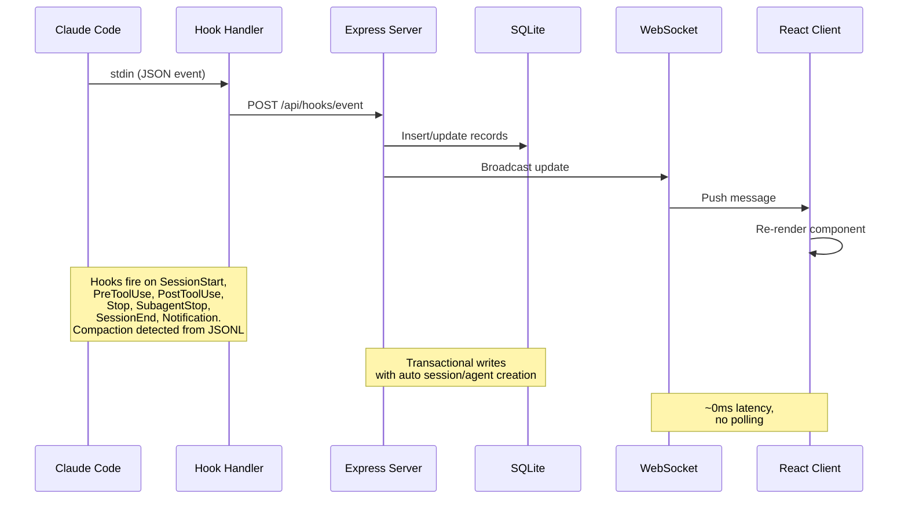

> [!IMPORTANT]
> Consulte [ARCHITECTURE.md](./ARCHITECTURE.md) para una inmersión profunda en la arquitectura del servidor, el esquema de la base de datos, las rutas de la API, el diseño de WebSocket, la enrutación de clientes, el flujo del gestor de ganchos, los modos de despliegue y los diagramas detallados del ciclo de vida para sesiones y agentes.

### Ciclo de vida de los hooks

1. **Claude Code** emite hooks de sesión, prompt, herramienta, notificación, subagente, turno y salida.
2. **`scripts/hook-handler.js`** lee cada evento desde stdin y descubre paneles activos mediante `~/.claude/.agent-dashboard.json` o `CLAUDE_DASHBOARD_PORT`. Envía una sola vez por cada directorio de datos SQLite único y elige el puerto más bajo si hay listeners duplicados, aunque sigue alimentando los paneles con bases de datos distintas. La entrega es fail-safe. Cada destino está aislado y el handler termina en un máximo de 5 segundos.
3. **El servidor** confirma el evento y el estado relacionado en una transacción SQLite:
   - El primer contacto crea la sesión y el agente principal. `SessionStart` comienza en **En espera**. `UserPromptSubmit` o `PreToolUse` lo mueve a **Trabajando**. `PostToolUse` lo mantiene trabajando.
   - `Stop` devuelve el agente principal a **En espera** mientras continúan los agentes en segundo plano. `stop_reason=error` marca el agente y la sesión como **Error**. Las notificaciones de permisos también esperan una entrada. Solo un prompt nuevo o el inicio de una herramienta recuperan un error.
   - `SubagentStop` completa ese hijo sin cambiar el estado de espera humana. Una exploración separada importa sus herramientas JSONL, empareja uso y resultado mediante `tool_use_id`, elimina duplicados y reconstruye los padres anidados reales.
   - `SessionEnd` elimina la espera y completa la sesión salvo que deba conservarse un error. El trabajo nuevo reactiva sesiones completadas, con errores o abandonadas, incluidas las importadas y reanudadas.
   - `SessionStart` y el mantenimiento periódico abandonan sesiones inactivas después de `DASHBOARD_STALE_MINUTES`, cuyo valor predeterminado es 180. El barrido se ejecuta cada cuarto de ese valor, acotado entre 60 segundos y 5 minutos.
   - El análisis incremental compartido de transcripciones registra compactaciones, errores de API y herramientas, duraciones de turnos, tokens y metadatos sin volver a leer bytes sin cambios. Los barridos de sesiones activas usan valores `sessions.transcript_path` indexados y expulsan entradas abandonadas de la caché.
   - Un watchdog de 15 segundos detecta errores de API en transcripciones después de 10 segundos sin hooks. También recupera interrupciones con Esc a partir de marcadores de transcripción o, si no hay marcador, después de `DASHBOARD_WORKING_IDLE_SECONDS`, predeterminado en 120, solo si no hay ninguna herramienta ejecutándose y no avanzan los hooks ni la transcripción.
   - El mismo watchdog completa sesiones locales muertas mediante una comprobación de actividad del proceso después de `DASHBOARD_LIVENESS_IDLE_SECONDS`, predeterminado en 60. Las comprobaciones al iniciar se ejecutan inmediatamente y de nuevo tras unos 5 segundos sin esa espera. La comprobación omite Windows, contenedores, rutas no POSIX reenviadas, sesiones de fuentes remotas, fallos de herramientas y `DASHBOARD_LIVENESS_PROBE=0`. Un hook real posterior corrige automáticamente una finalización falsa.
   - La sincronización continua de proyectos combina un barrido inmediato, `fs.watch` con debounce y el polling de `DASHBOARD_SESSION_SYNC_MS`, predeterminado en 30 segundos. Una caché de mtime vuelve a analizar solo transcripciones nuevas o ampliadas y emite los mismos mensajes de sesión que los hooks.
4. **WebSocket** publica el cambio confirmado.
5. **La interfaz** actualiza las vistas afectadas sin polling.

### Máquina de Estado del Agente

Estados persistentes: `working | waiting | completed | error`. La columna
`awaiting_input_since` es complementaria. Registra cuándo el agente empezó a
esperar y se usa para mostrar la duración, pero `waiting` ahora es un estado
persistente real.

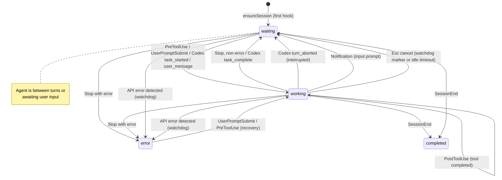

### Máquina de estado de sesión

Estados persistentes: `activo | completado | error | abandonado`. el
El estado de la sesión **esperando** es una superposición de interfaz de usuario (estado=`activo` con
`awaiting_input_since` establecido).

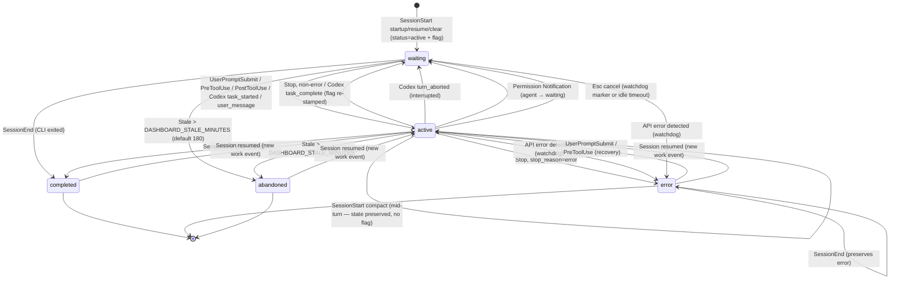

### Flujo de cálculo de costos

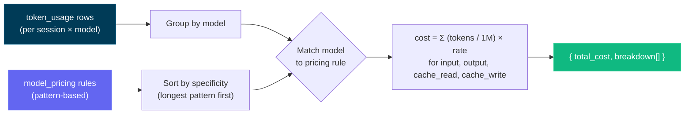

> [!IMPORTANT]
> El flujo de cálculo de costos se basa en el uso de tokens y las reglas de precios del modelo. Asegúrese de que sus reglas de precios estén actualizadas para reflejar costos precisos. Actualice la tabla de precios del modelo a través de la página de Configuración para mantener un seguimiento preciso de los costos, ya que el panel de control no obtiene automáticamente actualizaciones de precios de fuentes externas. Una vez que haya establecido las reglas de precios, el panel de control las aplica retroactivamente a todas las sesiones para un informe de costos consistente.

---

## Configuración

| Variable de entorno | Valor predeterminado | Propósito |
| --- | --- | --- |
| `DASHBOARD_PORT` | `4820` | Puerto del servidor Express. |
| `CLAUDE_DASHBOARD_PORT` | `4820` | Puerto usado por el handler de hooks. |
| `NODE_ENV` | `development` | Usa `production` para servir el cliente compilado. |
| `DASHBOARD_UPDATE_CHECK` | enabled | Configura `0`, `false` u `off` para desactivar las comprobaciones programadas del upstream. |
| `DASHBOARD_UPDATE_CHECK_INTERVAL_MS` | `300000` | Intervalo de actualización, mínimo 60,000 ms. **Comprobar ahora** sigue disponible. |
| `DASHBOARD_STALE_MINUTES` | `180` | Inactividad necesaria para que una sesión activa o En espera pase a abandonada. El watchdog lo aplica y el mantenimiento se ejecuta cada cuarto de este valor, acotado entre 60 segundos y 5 minutos. |
| `DASHBOARD_WORKING_IDLE_SECONDS` | `120` | Recupera una cancelación con Esc sin marcador cuando no avanza ninguna herramienta, hook o actividad de transcripción. Los valores menores reaccionan antes, pero pueden clasificar brevemente turnos silenciosos largos. La actividad nueva lo corrige. Cursor usa la misma regla. |
| `DASHBOARD_LIVENESS_PROBE` | `1` | Configura `0` para desactivar la finalización basada en procesos de sesiones locales muertas de Claude o Codex. Omite automáticamente Windows, contenedores, rutas no POSIX reenviadas y fuentes remotas. |
| `DASHBOARD_LIVENESS_IDLE_SECONDS` | `60` | Umbral de inactividad de la transcripción o del último hook para las comprobaciones de actividad del watchdog. Las comprobaciones iniciales ignoran este umbral para limpiar de inmediato las sesiones ya muertas. |
| `DASHBOARD_SESSION_SYNC_MS` | `30000` | Polling de seguridad para archivos nuevos o modificados en `~/.claude/projects`. `fs.watch` sigue siendo inmediato. `0` solo desactiva el polling. |
| `DASHBOARD_CURSOR_HOME` | `~/.cursor` | Raíz del estado de Cursor para chats, transcripciones, backfill y snapshots persistentes. |
| `DASHBOARD_CURSOR_SYNC_MS` | `5000` | Polling de seguridad de Cursor con fingerprint. Los watchers siguen activos cuando `0` desactiva el polling. |
| `DASHBOARD_CODEX_HOME` | `CODEX_HOME` or `~/.codex` | Raíz del estado de Codex. Configuración conserva una sobreescritura, reactiva el watcher y explora de inmediato. |
| `DASHBOARD_CODEX_SYNC_MS` | `4000` | Polling de seguridad para rollouts de Codex. Los hooks y watchers siguen activos cuando se configura en `0`. |
| `DASHBOARD_CODEX_MAX_ATTEMPTS` | `5` | Intentos para un rollout ilegible sin cambios, incluido el primero. Un cambio de tamaño o mtime reinicia el presupuesto. El agotamiento solo se registra una vez. |
| `DASHBOARD_CODEX_HOOK_IDLE_SECONDS` | `60` | Completa sesiones de Codex basadas solo en hooks, como `codex exec --ephemeral`, cuando un `stop` que informa finalización nunca recibe `SessionEnd`. El silencio por sí solo nunca es suficiente. |
| `DASHBOARD_TASK_SUMMARY_TTL_MS` | `2000` | Ventana de servicio obsoleto para resúmenes de tareas y `todo_snapshot`. Las adiciones se analizan de forma incremental. El crecimiento por encima de 32 MiB reinicia desde una cola nueva. `0` analiza cada adición. |
| `DASHBOARD_SNAPSHOT_COMPRESS` | `1` | Configura `0`, `false` u `off` para detener la conversión gzip verificada de snapshots de Claude o Cursor inactivos durante 24 horas cuyo origen desapareció. Se omiten árboles de origen ilegibles y snapshots de Codex. |
| `DASHBOARD_SNAPSHOT_MAX_AGE_DAYS` | unset | Paso de retención opcional cada seis horas para sesiones finalizadas más antiguas que esta edad. Las sesiones eliminadas quedan marcadas y las reanudadas se protegen. Obtén una vista previa con `ccam snapshots prune --days N`, ya que el snapshot puede ser la única copia. |
| `DASHBOARD_SNAPSHOT_MAX_BYTES` | unset | Límite total opcional de snapshots en bytes o unidades como `5GB`. Se eliminan primero las sesiones finalizadas más antiguas. Se protegen las activas o las de las últimas 24 horas. |
| `DASHBOARD_REMOTE_SYNC_MS` | `15000` | Polling de fuentes remotas SSH para proyectos de Claude, rollouts de Codex e índices de títulos de Codex. Las fuentes nuevas o reactivadas se sincronizan de inmediato. `0` mantiene disponible la sincronización manual. |
| `DASHBOARD_REMOTE_ACTIVE_WINDOW_MS` | `600000` | Trata una transcripción remota replicada como activa mientras su evento más reciente tenga esta antigüedad máxima y luego la concilia como completada. Los proveedores con fallos vuelven al manejo habitual de sesiones obsoletas. |
| `DASHBOARD_REMOTE_SYNC_TIMEOUT_MS` | `600000` | Timeout por fuente para la descarga SSH y la importación. |
| `DASHBOARD_REMOTE_TEST_TIMEOUT_MS` | `15000` | Timeout para la prueba SSH de una fuente remota. |
| `DASHBOARD_HOST` | `127.0.0.1` | Interfaz de enlace. `0.0.0.0` expone el servicio y registra una advertencia. |
| `DASHBOARD_TOKEN` | unset | Protege `/api/*` y WebSocket mediante el encabezado Bearer, `x-dashboard-token` o `?token=`. Loopback es el límite de confianza predeterminado. |
| `DASHBOARD_TOKEN_FILE` | unset | Token del panel basado en archivo para secretos de Docker o Kubernetes. `DASHBOARD_TOKEN` tiene prioridad. |
| `DASHBOARD_HOOK_TOKEN` / `DASHBOARD_HOOK_TOKEN_FILE` | unset | Protección independiente para `/api/hooks/event` y `/api/hooks/codex` fuera de loopback. |
| `REMOTE_PUSH_TOKEN` / `REMOTE_PUSH_TOKEN_FILE` | unset | Control independiente para el `POST /api/hooks/ingest-batch` público. La ruta está desactivada de forma predeterminada y nunca hereda el token local de hooks. |
| `DASHBOARD_ALLOWED_HOSTS` | loopback | Valores `Host` adicionales, separados por comas, para HTTP y WebSocket en la protección contra DNS rebinding. |
| `DASHBOARD_ENV_PATH` | repo `.env` | Archivo dotenv escribible usado para guardar sobreescrituras de homes de proveedores. Los contenedores usan `/app/config/.env` de forma predeterminada. |
| `CCAM_DASHBOARD_URL` | localhost discovery | Destino remoto de hooks. Las URL que no usan loopback requieren HTTPS y un token de hooks. |
| `CCAM_HOOK_TOKEN` / `CCAM_HOOK_TOKEN_FILE` | unset | Credencial del cliente de hooks enviada como `x-ccam-hook-token`. |

> [!IMPORTANT]
> El servidor solo escucha en loopback de forma predeterminada. El acceso desde LAN requiere `DASHBOARD_HOST`, `DASHBOARD_TOKEN` y valores coincidentes de `DASHBOARD_ALLOWED_HOSTS`. Consulta [`.env.example`](./.env.example) y [la política de seguridad](./.github/SECURITY.md).

Los clones Git consultan periódicamente el remoto canónico y comparan su rama predeterminada con el checkout actual. Cuando hay retraso, el terminal y la interfaz muestran el comando manual exacto de actualización. CCAM nunca hace pull ni se reinicia.

---
## CLI de `ccam`

La CLI **`ccam`** (`bin/ccam.js` → `cli/`) permite usar el panel desde cualquier terminal mediante un árbol de comandos de Commander.js con opciones heredadas, validación, sugerencias, ayuda generada y autocompletado del shell. `npm run setup` la enlaza automáticamente. La resolución del servidor comprueba `--server` / `CCAM_URL`, los puertos configurados, el registro de servidores activos y, por último, `http://127.0.0.1:4820`.

```bash
# Server
ccam status | health                  # ● running / ○ not running; version + timestamp
ccam start [--port N] | stop | restart  # background production server
ccam logs [-n N] [-f]                 # tail data/ccam-server.log
ccam open [page] [--session id]       # open the dashboard, a page, or a session
ccam repl                             # interactive shell (also: shell, i)

# Monitoring
ccam overview [--watch]               # one-screen live snapshot (alias: top)
ccam stats | kanban                   # totals + status distributions / status lanes
ccam tail [--session id] [--type T] [--tool N]   # live event feed
ccam stream [--type new_event,…]      # raw real-time WebSocket feed
ccam watch -n 5 <command …>           # re-run any command on an interval

# Data
ccam sessions [--status s] [--q text] [--cwd dir] [--sort price] [--limit n]
ccam sessions get|stats|cost|agents|events|transcripts <id>
ccam sessions transcript <id>         # the conversation as a readable chat log
ccam sessions rename <id> <name…> | update <id> | create | facets
ccam agents [list|get|update|create]  # agents; ccam session <id> = sessions get
ccam events [--type T] [--tool N] [--q text] [--from iso] | events facets

# Insights
ccam analytics                        # tokens, cost, top tools, daily sparklines
ccam workflows [session <id>]         # workflow intelligence + patterns
ccam runs [list|get <run-id>]         # Workflow-tool runs
ccam run list|history|start|follow|send|stop …   # dashboard-launched agents
ccam cost [--session id] [--daily]    # per-model cost, surcharges, unpriced models

# Alerts & webhooks
ccam alerts [--unacked] | ack <id> | ack-all
ccam alert-rules list|types|create|update|enable|disable|delete
ccam webhooks list|get|providers|deliveries|create|update|enable|disable|delete|test

# Pricing
ccam pricing [list] | set <pattern> --input N --output N [--fast-* …] [--intro-* …] | delete | reset
ccam pricing gpt|cursor [list|set|delete]   # OpenAI/Codex and Cursor rate cards

# Import & remote sources
ccam import guide|rescan|path <dir>|upload <files…>|reimport
ccam import-data <file.json>          # restore an export (idempotent)
ccam remote-sources list|get|add|update|enable|disable|test|sync|rm

# Administration
ccam doctor | info | export [file|-] | cleanup --hours N --days M
ccam snapshots [status|compress] | snapshots prune --days N   # transcript snapshots; prune dry-runs unless --apply --confirm PRUNE_SNAPSHOTS
ccam hooks [status|install] | reinstall-hooks | config claude|codex …
ccam updates [status|check] | update-check | metrics [--grep re]
ccam home [set claude|codex <path>] | push key|send|subscribe|unsubscribe
ccam api [METHOD] /api/path [--data JSON]   # any endpoint; writes need --yes
ccam mcp [stdio|http|repl] | clear-data --yes

# CLI
ccam help [command…] | commands [--json] | completion bash|zsh|fish | version
```

Los grupos muestran la lista de forma predeterminada (`ccam alerts` equivale a `ccam alerts list`). Todos los comandos admiten `--help`. `ccam commands` imprime el árbol y `ccam commands --json` emite su esquema legible por máquinas.

- **Salida:** los TTY reciben tablas, iconos de estado, gráficos, sparklines, árboles de agentes, vistas de transcripción y ayuda con color. Los pipes reciben texto plano. `--json` o `CCAM_OUTPUT=json` devuelve JSON estable, con NDJSON para `tail`, `stream` y `run follow`. Los errores usan `{"error":{"code":"…","message":"…"}}` en stderr y salen con `0` o `1`.
- **Escrituras:** usan `y/N` interactivo o `--yes`. Las escrituras no interactivas requieren `--yes` y `clear-data` siempre requiere el flag literal.
- **Modo sin conexión:** los comandos de solo lectura recurren a `data/dashboard.db`, muestran un banner `⚠ Offline mode` y corrigen las sesiones activas muertas mediante la vista de actividad. Los comandos exclusivos del servidor explican por qué el panel no está disponible.
- **REPL y autocompletado:** `ccam repl` añade autocompletado basado en el árbol, historial persistente, un prompt en vivo y comandos integrados `help`, `json` y `watch`, con cada línea aislada en un proceso hijo. Activa el autocompletado de zsh con `source <(ccam completion zsh)`.

Si `ccam` no está en `PATH`, ejecuta `npm link` una vez desde la raíz del repositorio. Consulta [docs/CLI.md](./docs/CLI.md) para ver el contrato completo.
## Scripts npm

| Comando                 | Descripción                                                |
| ----------------------- | ---------------------------------------------------------- |
| `npm run setup`         | Instalar dependencias de root, cliente, extensión y MCP, compilar MCP y enlazar `ccam` |
| `npm run update:pull-setup` | `git pull --ff-only` luego `npm run setup` (actualización manual) |
| `npm run dev`           | Iniciar el servidor (modo de observación) + el cliente (Vite HMR) de forma concurrente |
| `npm run dev:server` | Inicia Express con un supervisor de código con antirrebote y reinicio ordenado |
| `npm run dev:client` | Iniciar solo el servidor de desarrollo Vite                             |
| `npm run build`         | Construir el cliente React en `client/dist/`                   |
| `npm start`             | Iniciar el servidor de producción (sirve al cliente construido)              |
| `npm test`              | Ejecuta la suite completa (servidor `node --test` + cliente Vitest)  |
| `npm run test:server` | Ejecutar pruebas de backend (`node --test server/__tests__/`) |
| `npm run test:client` | Ejecuta las pruebas de Vitest de la interfaz de usuario, incluidas **capturas de pantalla de renderizado para cada pantalla** (`client/src/pages/__tests__/screens.snapshot.test.tsx`); regenera las líneas de base después de cambios intencionados en la interfaz de usuario con `cd client && npx vitest run -u` |
| `npm run install-hooks` | Configurar los ganchos de código Claude en `~/.claude/settings.json` |
| `npm run seed`          | Rellenar la base de datos con datos de muestra                         |
| `npm run import-history`| Importar sesiones heredadas desde `~/.claude/` (también se ejecuta al iniciar la sesión) |
| `npm run reconcile-tokens`| Actualizar los totales de tokens de las sesiones importadas (nunca reduce un total existente) |
| `npm run repair-tokens` | Volver a derivar los totales de tokens **ajenos a workflow** de todas las sesiones de **Claude** cuya transcripción siga en disco (localizada en `~/.claude/projects/` o mediante el `transcript_path` guardado de la sesión) y poner a cero las líneas base de compactación; las filas de workflow y de Codex se conservan. Reparación única para bases de datos afectadas por la suma de usage por registro anterior a v2.0.9 o por usage omitido de subagentes planos del mismo modelo. Detén el dashboard primero |
| `DASHBOARD_TOKEN_REPAIR` | Activada de forma predeterminada (`1`). Reparación automática única de los totales históricos de Token afectados por inflación por registro o por subagentes planos omitidos del mismo modelo. Las correcciones en vivo no pueden volver a procesar cada sesión completada y `replaceTokenUsage` no puede reducir una marca máxima anterior. Se ejecuta una vez por base de datos (con marcador, diferida fuera del arranque, omitida si otro dashboard comparte el directorio de datos) y guarda primero las filas antiguas en `token_usage_pre_repair_v2`. Ponlo a `0` para omitirla y reparar a mano con `npm run repair-tokens` |
| `npm run clear-data` | Eliminar todas las sesiones, agentes, eventos y uso de tokens |
| `npm run mcp:install` | Instalar dependencias para el paquete MCP local (`mcp/`) |
| `npm run mcp:build` | Construir el servidor MCP TypeScript en `mcp/build/` |
| `npm run mcp:start` | Iniciar el servidor MCP (transporte stdio — para hosts MCP) |
| `npm run mcp:start:http`| Iniciar el servidor MCP (transporte HTTP + SSE en el puerto 8819)      |
| `npm run mcp:start:repl`| Iniciar el servidor MCP (REPL interactivo con completación de pestañas) |
| `npm run mcp:dev`       | Ejecutar el servidor MCP en modo dev (`tsx`, stdio)                 |
| `npm run mcp:dev:http` | Ejecutar el servidor MCP en modo de desarrollo (`tsx`, HTTP + SSE) |
| `npm run mcp:dev:repl` | Ejecutar el servidor MCP en modo de desarrollo (`tsx`, REPL interactivo) |
| `npm run mcp:typecheck` | Verificar el tipo de la fuente MCP sin emitir la salida de la compilación |
| `npm run mcp:docker:build` | Construir la imagen del contenedor MCP con Docker (`agent-dashboard-mcp:local`) |
| `npm run mcp:podman:build` | Construir la imagen del contenedor MCP con Podman (`localhost/agent-dashboard-mcp:local`) |
| `npm run desktop:install` | Instala Electron + electron-builder en el espacio de trabajo `desktop/` (reconstruye `better-sqlite3` para la ABI de Electron); realiza pruebas preliminares de la construcción nativa de `better-sqlite3` e imprime ayuda de configuración factible (incluyendo una alternativa sin cadena de herramientas) en caso de fallo |
| `npm run desktop:dev` | Construye y lanza la aplicación Electron para escritorio para iteraciones locales |
| `npm run desktop:build` | Compila las fuentes TypeScript del escritorio en `desktop/out/`      |
| `npm run desktop:test` | Ejecuta la prueba de humo del escritorio (inicia Electron, prueba `/api/health`) |
| `npm run desktop:dmg` | Construir **ambos** DMG de macOS (arm64 + x64) - correctos para la versión, **más lentos** (paquetes para cada arquitectura) |
| `npm run desktop:dmg:arm64` | Construye un DMG solo de Apple-Silicona - **rápido**, recomendado para tu propio Mac |
| `npm run desktop:dmg:x64` | Construye un DMG solo para Intel — **rápido**                           |
| `npm run desktop:dmg:universal` | Construye un DMG **universal** fusionado (arm64 + x86_64) - opcional, **más lento**, no es lo que se envía con la versión |
| `npm run desktop:win` | Construir un instalador **NSIS** para Windows `.exe` (x64) — ejecutar en Windows |
| `npm run desktop:win:portable` | Construir un **portátil** de Windows (sin instalar) `.exe` (x64) — ejecutar en Windows |
| `npm run monitoring:install` | Ejecuta `npm install` en `monitoring/` — descarga Prometheus + Grafana a través de `postinstall` |
| `npm run monitoring:setup` | Alias para `monitoring:install` |
| `npm run monitoring:up` | Iniciar Prometheus (:9090) + Grafana (:3000) en segundo plano (sin Docker) |
| `npm run monitoring:down` | Detener la pila de monitoreo gestionada por npm |
| `npm run monitoring:start` | Pilas de monitoreo en primer plano (Ctrl+C detiene ambas) |
| `npm run monitoring:docker:up` | Iniciar Prometheus + Grafana a través de Docker Compose |
| `npm run monitoring:docker:down` | Desmontar la pila de monitoreo de Docker |
| `npm run monitoring:verify` | Panel de control de verificación de salud, Prometheus, Grafana y scraping de destino |
| `npm run docker:up` | Iniciar el panel de control en Docker (`docker compose up -d --build`) |
| `npm run docker:down` | Detener el contenedor del panel de control |
| `npm run docker:full:up` | Panel de control + Prometheus + Grafana, todo en Docker |
| `npm run docker:full:down` | Desmontar la pila Docker completa |

---

## Extensión de agentes

Este repositorio incluye una capa de extensión integral tanto para Claude Code como para Codex:

- Código Claude: `CLAUDE.md`, `.claude/rules/`, `.claude/skills/`
- Subagentes de Claude: `.claude/agents/`
- Codex: `AGENTS.md`, `.codex/rules/`, `.codex/agents/`, `.codex/skills/`

### Arquitectura de extensión

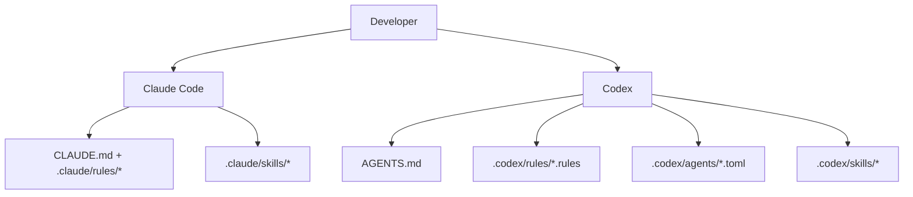

### Capa de código Claude

- Contexto persistente:
  - [`CLAUDE.md`](./CLAUDE.md)
- Reglas de alcance de ruta:
  - [`.claude/rules/backend-node.md`](./.claude/rules/backend-node.md)
  - [`.claude/rules/frontend-react.md`](./.claude/rules/frontend-react.md)
  - [`.claude/rules/mcp-typescript.md`](./.claude/rules/mcp-typescript.md)
  - [`.claude/rules/docs-markdown.md`](./.claude/rules/docs-markdown.md)
  - [`.claude/rules/file-headers.md`](./.claude/rules/file-headers.md)
  - [`.claude/rules/wiki-i18n.md`](./.claude/rules/wiki-i18n.md)
  - [`.claude/rules/i18n-parity.md`](./.claude/rules/i18n-parity.md)
- Habilidades:
  - `repo-onboarding`
  - `ship-feature`
  - `version-release`
  - `mcp-operations`
  - `debug-live-issue`
  - `update-project-docs`
  - `file-headers`
  - `push-to-forked-pr`
  - `i18n-parity`
- Subagentes:
  - `backend-reviewer`
  - `frontend-reviewer`
  - `mcp-reviewer`

### Capa del Codex

- Contexto persistente:
  - [`AGENTS.md`](./AGENTS.md)
- Política de ejecución:
  - [`.codex/rules/default.rules`](./.codex/rules/default.rules)
- Plantillas de subagentes personalizadas:
  - [`.codex/agents/`](./.codex/agents)
- Habilidades:
  - [`.codex/skills/`](./.codex/skills)
- Configuración:
  - [`.codex/README.md`](./.codex/README.md)

---

## Integración MCP

Este proyecto incluye un servidor MCP local de grado de producción en `mcp/` que expone las operaciones del panel de control como herramientas para agentes de IA. Soporta tres modos de transporte para adaptarse a diferentes escenarios de integración.

### Modos de transporte MCP

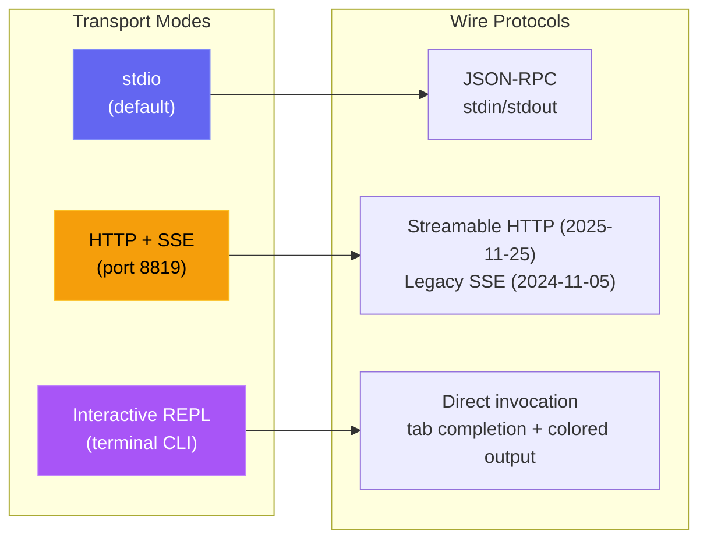

| Modo | Comando | Caso de uso |
| --- | --- | --- |
| **stdio** | `npm run mcp:start` | Código Claude, Claude Desktop, hosts IDE MCP |
| **HTTP** | `npm run mcp:start:http` | Clientes MCP remotos, integraciones web, múltiples sesiones |
| **REPL** | `npm run mcp:start:repl` | Debug de operaciones, invocación manual de herramientas, administrador local |

<p align="center">
  <a href="images/mcp.png"></a>
</p>

### Arquitectura MCP

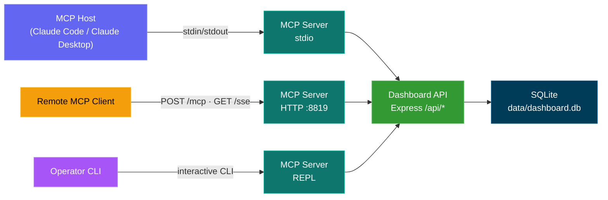

### Superficie de la herramienta MCP

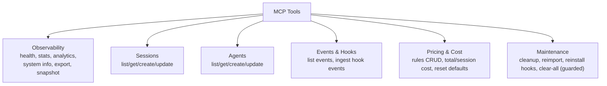

### Modelo de seguridad MCP

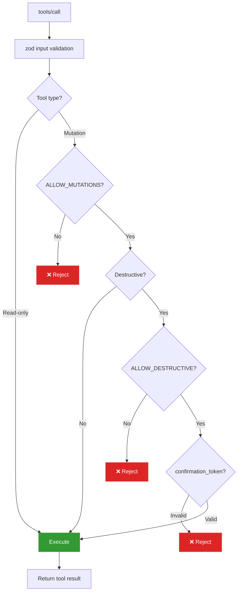

### Modos operativos del MCP

- Modo de lectura única (por defecto): `MCP_DASHBOARD_ALLOW_MUTATIONS=false`
- Modo de administrador: `MCP_DASHBOARD_ALLOW_MUTATIONS=true`
- Autenticación: `MCP_DASHBOARD_API_TOKEN` (con `DASHBOARD_API_TOKEN` como respaldo) debe coincidir con `DASHBOARD_TOKEN`
- Protección de transporte: HTTP de loopback directo puede llevar el token; los alias de host de contenedor exigen HTTPS; todas las redirecciones se rechazan
- Protección de carga: 50 MiB por archivo de historial, 100 MiB por llamada, 10 MiB para respuestas binarias y 25 MiB para restaurar copias
- Modo destructivo: requiere ambos:
- `MCP_DASHBOARD_ALLOW_MUTATIONS=true`
- `MCP_DASHBOARD_ALLOW_DESTRUCTIVE=true`
- entrada de la herramienta `confirmation_token: "CLEAR_ALL_DATA"`

Detalles completos: [mcp/README.md](./mcp/README.md)

---

## Referencia de API

Todos los puntos finales devuelven JSON. Las respuestas de error siguen la forma `{ error: { código, mensaje } }`.

### OpenAPI / Swagger / ReDoc

Hay tres maneras de explorar la API HTTP, todas impulsadas por una sola especificación OpenAPI 3.0.3 (Puerto de servidor predeterminado `4820`):

| Método | Camino                            | Descripción                                                                                       |
| ------ | ------------------------------- | ------------------------------------------------------------------------------------------------- |
| `GET` | `/api/openapi.json` | Especificación JSON Raw OpenAPI 3.0.3                                                                                 |
| `GET` | `/api/docs`                     | **Interactiva interfaz de usuario Swagger** — ejecución de la solicitud de prueba                                         |
| `GET` | `/api/redoc`                    | Referencia de **ReDoc**: una renderización limpia y optimizada para lectura de tres paneles de la misma especificación |
| `GET` | `/api/redoc/redoc.standalone.js` | Paquete ReDoc alojado por sí mismo (servido localmente a través de la dependencia `redoc`, nunca un CDN, funciona sin conexión) |

El documento OpenAPI se genera desde `server/openapi.js` (`createOpenApiSpec()`), fusionado con fragmentos suplementarios en `server/openapi-extra/`. Tanto la interfaz de usuario Swagger como ReDoc son servidas directamente por el backend; el paquete ReDoc se sirve localmente (`GET /api/redoc/redoc.standalone.js`), por lo que la referencia funciona completamente sin conexión a Internet, consistente con la política del proyecto de no tener recursos externos.

La cobertura es completa: cada ruta de backend está documentada (82 entradas de ruta) en estas etiquetas: Salud, Sesiones, Agentes, Eventos, Estadísticas, Métricas, Análisis, Ganchos, Precios, Flujos de trabajo, Configuración, Actualizaciones, Alertas, Webhooks, Push, CcConfig (explorador de configuración de Claude Code), Ejecución (ejecuciones iniciadas por el panel de control) y Documentación, cada una con parámetros, esquemas de solicitud/respuesta, descripciones a nivel de campo y ejemplos realistas.

Un **`openapi.yaml`** comprometido en la raíz del repositorio refleja la especificación en vivo. Se genera a partir de `server/openapi.js` (nunca editado manualmente) - regeneréalo después de los cambios en la API con:

```bash
npm run openapi:yaml
```

<p align="center">
  <a href="images/swagger.png"></a>
</p>

<p align="center">
  <a href="images/redoc.png"></a>
</p>

### Salud

| Método | Camino | Descripción                           |
| ------ | ------------- | ------------------------------------- |
| `GET` | `/api/health` | Devuelve `{ status: "ok", timestamp }` |

### Sesiones

| Método | Ruta                                | Parámetros de la consulta                                                                 | Descripción                                                                                  |
| ------- | ------------------------------- | ---------------------------------------------------------------- | -------------------------------------------------------------------------------------------- |
| `GET` | `/api/sessions`                 | `status`, `q`, `limit`, `offset`                                 | Lista las sesiones con el número de agentes y el costo por sesión. `q` realiza una búsqueda insensible a mayúsculas y minúsculas en `id` / `name` / `cwd`. `limit` por defecto es 50, máximo 10000. La respuesta incluye `total` para los paginadores. |
| `GET` | `/api/sessions/:id` | --                                                                | Detalles de la sesión con agentes y eventos                                                        |
| `GET` | `/api/sessions/:id/stats` | --                                                                 | Contas agregadas que alimentan el panel de resumen de detalles de la sesión: eventos, eventos por tipo, uso principal de las herramientas, número de errores, contadores de tipo/estatus del agente, desglose del tipo de subagente, totales de tokens, rango de tiempo |
| `GET` | `/api/sessions/:id/transcripts` | --                                                               | Lista de transcripciones JSONL disponibles para la sesión (principales + subagentes + compactaciones)            |
| `GET` | `/api/sessions/:id/transcript` | `agent_id`, `limit`, `offset`, `after`, `before` | Transmite mensajes de un transcripción específica con paginación basada en el cursor. El `uso` del asistente incluye `input_tokens`, `output_tokens`, `cache_read_input_tokens`, `cache_creation_input_tokens`, por lo que el medidor de la página de Ejecución puede hidratarse completamente al reiniciar / volver a adjuntar |
| `POST` | `/api/sessions`                 | --                                                               | Crear sesión (idempotente en `id`)                                                          |
| `PATCH` | `/api/sessions/:id`             | --                                                               | Actualizar el estado/metadata de la sesión                                                               |

### Agentes

| Método | Ruta | Parámetros de la consulta | Descripción |
| ------- | ----------------- | ----------------------------------------- | ----------------------------- |
| `GET` | `/api/agents` | `status`, `session_id`, `limit`, `offset` | Lista de agentes con filtros |
| `GET` | `/api/agents/:id` | --                                        | Detalles de un solo agente |
| `POST` | `/api/agents` | --                                        | Crear agente                  |
| `PATCH` | `/api/agents/:id` | --                                        | Actualizar el estado/tarea/herramienta del agente |

### Eventos

| Método | Ruta | Parámetros de la consulta | Descripción |
| ------ | ------------- | ------------------------------- | -------------------------- |
| `GET` | `/api/events` | `session_id`, `limit`, `offset` | Lista de eventos (los más recientes primero) |

### Estadísticas

| Método | Camino | Descripción                                            |
| ------ | ------------ | ------------------------------------------------------ |
| `GET` | `/api/stats` | Contas agregadas, distribuciones de estado, conexiones WS |

### Análisis

| Método | Camino | Descripción                                                |
| ------ | ---------------- | ---------------------------------------------------------- |
| `GET` | `/api/analytics` | Agregados de tokens/herramientas/sesiones para gráficos y vistas de tendencias |

### Fuentes de datos remotas

| Método | Ruta                            | Parámetros de la consulta | Descripción                                                                                 |
| -------- | ------------------------------- | ------------ | ------------------------------------------------------------------------------------------- |
| `GET` | `/api/remote-sources` | -- | Lista de fuentes remotas configuradas con estado, último error y conteos de última sincronización |
| `POST` | `/api/remote-sources` | -- | Crear una fuente. Cuerpo: `{ label, host, ssh_port?, identity_file?, remote_home?, remote_codex_home?, enabled? }` |
| `PATCH` | `/api/remote-sources/:id` | -- | Actualizar una fuente (etiqueta, campos de conexión, habilitado)                                         |
| `DELETE` | `/api/remote-sources/:id`       | `purge`      | Eliminar una fuente; `?purge=true` también elimina las sesiones importadas de esa fuente' |
| `POST` | `/api/remote-sources/:id/test` | --           | Probar la conectividad SSH a la fuente                                                        |
| `POST` | `/api/remote-sources/:id/sync` | --           | Extraiga e importe de nuevo desde la fuente ahora                                                      |

`GET /api/sessions`, `/api/events`, `/api/agents`, `/api/stats`, y `/api/analytics` también aceptan un parámetro de consulta opcional `sources` (ids de fuente separados por coma; omitir para todos) para restringir los resultados por origen, y `GET /api/sessions/facets` devuelve una matriz `sources` para el selector de rango de datos.

### Ganchos

| Método | Camino | Descripción                                  |
| ------ | ------------------ | -------------------------------------------- |
| `POST` | `/api/hooks/event` | Recibir y procesar un evento de gancho de código Claude |
| `POST` | `/api/hooks/ingest-batch` | Enviar un lote de datos de sesión desde una máquina itinerante o tras NAT (deshabilitado por defecto; consulte `REMOTE_PUSH_TOKEN` más abajo y `server/README.md` para la forma completa del payload) |

**Peso de carga del evento de conexión:**

```json
{
  "hook_type": "PreToolUse",
  "data": {
    "session_id": "abc-123",
    "tool_name": "Bash",
    "tool_input": { "command": "ls -la" }
  }
}
```

### Precios

| Método | Ruta                     | Descripción                              |
| -------- | ------------------------ | ---------------------------------------- |
| `GET` | `/api/pricing` | Lista todas las reglas de precios |
| `PUT` | `/api/pricing` | Crear o actualizar una regla de precios |
| `DELETE` | `/api/pricing/:pattern` | Eliminar una regla de precios                    |
| `GET` | `/api/pricing/cost` | Costo total de todas las sesiones |
| `GET` | `/api/pricing/cost/:id` | Desglose de costos para una sesión específica |

### Flujos de trabajo

| Método | Camino                          | Descripción                                             |
| ------ | ----------------------------- | ------------------------------------------------------- |
| `GET` | `/api/workflows` | Agrupa los datos del flujo de trabajo (orquestación, herramientas, patrones). El filtro opcional de la consulta `?status=active\|completed` filtra todas las 11 secciones de datos por el estado de la sesión |
| `GET` | `/api/workflows/session/:id` | Entrenamiento por sesión (árbol de agentes, cronología de herramientas, eventos) |

### Alertas

| Método | Ruta                     | Descripción                                                                 |
| -------- | ------------------------ | ---------------------------------------------------------------------- |
| `GET` | `/api/alerts` | Feed de alertas de disparos, desde el más reciente primero (`?unacked=true`, `limit`, `offset`) |
| `POST` | `/api/alerts/:id/ack` | Reconocer una alerta                                                  |
| `POST` | `/api/alerts/ack-all` | Reconocer cada alerta no reconocida                                        |
| `GET` | `/api/alerts/rules` | Lista de reglas de alertas                                                       |
| `POST` | `/api/alerts/rules` | Crear una regla (`event_pattern` \| `inactivity` \| `status_duration` \| `token_threshold`) |
| `PATCH` | `/api/alerts/rules/:id` | Actualizar nombre / configuración / habilitado / tiempo de espera (el tipo de regla es inmutable) |
| `DELETE` | `/api/alerts/rules/:id` | Eliminar una regla y su historial de alertas activadas |

### Webhooks

| Método | Ruta                                | Descripción                                                                                |
| -------- | --------------------------------- | ------------------------------------------------------------------------------------ |
| `GET` | `/api/webhooks/providers` | Proveedores compatibles + sus campos de configuración (ejecuta el formulario de la interfaz de usuario) |
| `GET` | `/api/webhooks`                   | Lista de objetivos de webhook (URLs encriptadas, secretos redactados)                                 |
| `POST` | `/api/webhooks`                   | Crear un objetivo (14 proveedores de primera clase + `genérico`)                               |
| `PATCH` | `/api/webhooks/:id`               | Actualizar nombre / URL / habilitado / secreto / encabezados / alcance de la regla (el tipo es inmutable)      |
| `DELETE` | `/api/webhooks/:id`               | Eliminar un objetivo y su registro de entrega                                                 |
| `POST` | `/api/webhooks/:id/test` | Enviar una alerta de prueba sintética y informar el resultado de la entrega                           |
| `GET` | `/api/webhooks/:id/deliveries` | Registro de entregas recientes para un objetivo (`limit`, `offset`)                                  |

### Configuración

| Método | Camino                           | Descripción                                      |
| ------ | ------------------------------ | ------------------------------------------------ |
| `GET` | `/api/settings/info` | Información del sistema, estadísticas de la base de datos, estado del gancho |
| `POST` | `/api/settings/clear-data` | Eliminar todas las sesiones, agentes, eventos, uso de tokens |
| `POST` | `/api/settings/reimport`       | Reimportar sesiones heredadas desde `~/.claude/`      |
| `POST` | `/api/settings/reinstall-hooks`| Reinstalar los ganchos de código Claude |
| `POST` | `/api/settings/reset-pricing` | Restablecer los precios a los valores predeterminados                        |
| `GET` | `/api/settings/export` | Exportar todos los datos (sesiones, agentes, eventos, uso de tokens, flujos de trabajo, ejecuciones de panel de control, reglas de alerta, precios de modelos) como una descarga JSON versificada |
| `POST` | `/api/settings/import`         | Restaurar un paquete de hasta 25 MiB desde `/export` (`file` multipart o `{ path }` JSON). Idempotente + no destructivo: se omiten por completo las sesiones existentes |
| `POST` | `/api/settings/cleanup`        | Abandonar sesiones obsoletas, purgar datos antiguos (y las instantáneas de las sesiones purgadas) |
| `GET`  | `/api/settings/snapshots`      | Almacenamiento de instantáneas por proveedor + política de retención |
| `POST` | `/api/settings/snapshots/compress` | Comprime sin pérdida las instantáneas cuyo original ya no existe |
| `POST` | `/api/settings/snapshots/prune` | Planifica (modo de prueba, por defecto) o aplica una depuración; aplicar requiere `confirm: "PRUNE_SNAPSHOTS"` |

### Explorador de configuración de Claude (`/api/cc-config`)

Inspección de lectura única de cada superficie de configuración de Claude Code, además de mutaciones cuidadosamente controladas para artefactos de archivos de texto de bajo riesgo. Todos los caminos de escritura crean copias de seguridad con hora y fecha bajo `<root>/cc-config-backups/<type>/` antes de mutar.

| Método | Ruta                                | Descripción |
| -------- | ----------------------------------- | ----------- |
| `GET` | `/api/cc-config/overview` | Raíces (claude home, proyecto .claude, raíz del proyecto, ~/.claude.json) + contadores para cada superficie |
| `GET` | `/api/cc-config/skills` | Habilidades bajo `<scope>/.claude/skills/<name>/SKILL.md` con materia principal parseada; `?scope=user\|project\|all` |
| `GET` | `/api/cc-config/agents` | Subagentes `<scope>/.claude/agents/*.md` |
| `GET` | `/api/cc-config/commands` | Comandos de guiones bajos `<scope>/.claude/commands/*.md` |
| `GET` | `/api/cc-config/output-styles` | Estilos de salida `<scope>/.claude/output-styles/*.md` |
| `GET` | `/api/cc-config/plugins` | Plugins instalados desde `~/.claude/plugins/installed_plugins.json`, unidos con `enabledPlugins` de la configuración; cada entrada incluye `contributes` (cuenta de habilidades/agentes/comandos/gatillos/estilos de salida dentro de la carpeta de instalación del plugin) más metadatos `plugin.json` |
| `GET` | `/api/cc-config/marketplaces` | Mercados registrados de `known_marketplaces.json`, enriquecidos con el propio `marketplace.json` de cada mercado (número de complementos, propietario, descripción) |
| `GET` | `/api/cc-config/mcp`                | Servidores MCP desde `~/.claude.json` (nivel superior + por proyecto) y `settings.json` |
| `GET` | `/api/cc-config/hooks` | Hooks agregados en los archivos `settings.json` de usuario / proyecto / proyecto local |
| `GET` | `/api/cc-config/hook-scripts` | Archivos en `~/.claude/hooks/` (los scripts auxiliares que se refieren a `hooks.<event>.command`) |
| `GET` | `/api/cc-config/keybindings` | `~/.claude/keybindings.json` parseado en pares clave/acción agrupados por grupo de contexto |
| `PUT` | `/api/cc-config/keybindings` | Sustituye `keybindings.json` por `{ groups: [{ context, bindings: [{ key, action }] }] }`. Hace una copia de seguridad primero, preserva los metadatos de nivel superior (`$schema`/`$docs`), rechaza contextos/keys duplicados. Seguro de editar (a diferencia de `settings.json`, la CLI nunca lo vuelve a escribir en medio de la sesión) |
| `GET` | `/api/cc-config/statusline` | configuración de `settings.json.statusLine` + el contenido actual de `statusline.py` / `statusline-command.sh` si está presente |
| `GET` | `/api/cc-config/settings` | Configuración JSON de usuario / proyecto / configuración local del proyecto, con claves similares a secretos (correspondientes a `/token\|secret\|password\|api[_-]?key\|auth/i`) reemplazadas por `"<redacted>"` |
| `GET` | `/api/cc-config/memory` | Archivos `CLAUDE.md` en el ámbito del usuario + proyecto, además de la memoria basada en archivos por proyecto: elementos `scope:"auto-memory"` (cada uno con `project`, `name`, `isIndex` y `frontmatter` parseado) para cada `*.md` bajo `~/.claude/projects/<slug>/memory/`. Mutar a través de `PUT`/`DELETE /api/cc-config/file` con `{ scope: "auto-memory", type: "auto-memory", project, name }` (las copias de seguridad se almacenan en `<memory-dir>/.cc-config-backups/auto-memory/`) |
| `GET` | `/api/cc-config/file?path=…` | Cuerpo de un solo archivo (ruta contenida en CLAUDE_HOME / proyecto .claude / proyecto CLAUDE.md) |
| `GET` | `/api/cc-config/backups` | Lista de todas las copias de seguridad con fecha y hora, opcionalmente filtradas `?scope=&type=` |
| `PUT` | `/api/cc-config/file` | Crear o sobrescribir un artefacto de archivo de texto. Cuerpo: `{ scope, type, name?, content }`. Copia de seguridad automática si el archivo existe. Temporal atómico + renombrar. Límite de contenido de 256 KB, regex estricta de `name` |
| `DELETE` | `/api/cc-config/file`               | Hacer una copia de seguridad y luego eliminar un artefacto de archivo de texto. Las carpetas de habilidades se copian de seguridad enteras (preservando los activos empaquetados) antes de la eliminación recursiva |

### Métricas de Prometheus y Grafana

`GET /api/metrics` expone métricas de texto de Prometheus para el estado de sesiones y agentes, eventos, tokens, clientes en tiempo real, fuentes remotas, tiempo de actividad y memoria del proceso y versión de compilación. [`monitoring/`](./monitoring/README.md) proporciona Prometheus y cuatro paneles Grafana aprovisionados automáticamente, con **CCAM · Overview** como valor predeterminado.

```bash
# Native dashboard and monitoring
npm start
npm run monitoring:install       # one-time binary setup
npm run monitoring:up            # Grafana on :3000

# Containers
npm run docker:up                 # dashboard only
npm run docker:full:up            # dashboard + Prometheus + Grafana

# Mixed native/container setup
DASHBOARD_ALLOWED_HOSTS=host.docker.internal npm start
npm run monitoring:docker:up
npm run monitoring:verify
```

<p align="center">
  <a href="images/grafana.png"></a>
  <br>
  <em>📊 <strong>Grafana · CCAM Overview</strong> · vista del conjunto, almacenamiento, tasas de eventos y tokens desde <code>/api/metrics</code></em>
</p>

<p align="center">
  <a href="images/prometheus-console.png"></a>
  <br>
  <em>🔥 <strong>Prometheus · CCAM Console</strong> · estado del scraping, sesiones, eventos, tokens y enlaces de consulta</em>
</p>

<p align="center">
  <a href="images/prometheus-query.png"></a>
  <br>
  <em>📈 <strong>Prometheus · Graph</strong> · ejecuta PromQL sobre las métricas recopiladas de CCAM con enlaces iniciales desde la consola</em>
</p>

Consulta [docs/API.md → Metrics](./docs/API.md#metrics) para conocer todas las métricas y los detalles de scraping y autenticación.

### Ejecutar Claude (`/api/run`)

Superficie HTTP para iniciar y supervisar subprocesos `claude` desde el panel de control. Guardia de origen compartido en todas las rutas: las solicitudes del navegador deben provenir de un origen localhost; las solicitudes con origen faltante (CLI/curl) pasan.

| Método | Ruta                              | Descripción |
| -------- | --------------------------------- | ----------- |
| `GET` | `/api/run`                        | Lista todas las manejadoras de ejecución en memoria (en vivo + recientemente terminadas); también devuelve `maxConcurrent` y `activeCount` |
| `GET` | `/api/run/binary`                 | Probar si `claude` está en `PATH` y dónde vive, utilizado por la interfaz de usuario para mostrar un error claro antes de generar |
| `GET` | `/api/run/cwds`                   | Directorios de trabajo sugeridos: servidor de panel de control cwd, `$HOME` y cwds recientes de la tabla de sesiones |
| `GET` | `/api/run/files?cwd=…&q=…` | Búsqueda de archivos borrosos dentro de `cwd` para el autocompletado de archivos `@` de la página de Ejecución. Saltan `node_modules`, `.git`, `dist`, `build`, `.next`, `.cache`, `coverage`, etc. Cwd es obligatorio y debe existir; los resultados están limitados y clasificados por la coincidencia del nombre raíz |
| `POST` | `/api/run`                        | Genera una nueva ejecución. Body: `{ prompt, mode: "headless"\|"conversation", cwd?, model?, permissionMode?, resumeSessionId?, effort? }`. Headless coloca el prompt en argv a través de `-p` y cierra stdin. Conversation canaliza el prompt a través de stdin como un paquete stream-json y mantiene stdin abierto para los siguientes pasos. `resumeSessionId` (solo para conversación) agrega `--resume <id>`; cuando se establece, `prompt` puede estar vacío: el generador omite la escritura inicial de stdin y `claude` se queda en espera en la conversación reanudada hasta que el usuario publique un seguimiento a través de `POST /api/run/:id/message`. `effort` (`low` / `medium` / `high`) se traduce a `--effort`. El generador siempre pasa `--output-format stream-json --verbose --include-partial-messages` para que la interfaz de usuario pueda renderizar las diferencias carácter por carácter. La concurrencia no está efectivamente limitada (techo predeterminado de 10000 - sobrescribir con `RUN_MAX_CONCURRENT`) |
| `GET` | `/api/run/:id`                    | Estado actual del manejador. `?envelopes=1` incluye el registro de sobres en memoria para que la interfaz de usuario pueda reproducir el historial cuando se vuelva a adjuntar |
| `POST` | `/api/run/:id/message` | Enviar una ronda de seguimiento a una conversación en curso (solo modo de conversación). Texto: `{ texto }` |
| `DELETE` | `/api/run/:id`                    | Detener una ejecución. SIGTERM, escalando a SIGKILL después de 5 s |

Los flujos de salida sobre el WebSocket del panel de control existente se dividen en tres tipos de mensajes: `run_stream` (envelope stream-json procesado, incluyendo deltas de `stream_event` de `--include-partial-messages`), `run_status` (transiciones de estado), `run_input_ack` (escritura confirmada en stdin). La página Config Explorer se suscribe a un cuarto mensaje — `cc_config_changed` — emitido por `server/lib/cc-watcher.js` (a través de `fs.watch` en `~/.claude/`) y por `routes/cc-config.js` después de cada PUT/DELETE exitoso, con un payload `{ source: "dashboard"|"fs", action?, scope?, type?, name?, paths? }`. La lista de Sesiones y la página SessionDetail consultan `/api/run` (y escuchan por `run_status`) para marcar cualquier sesión actualmente ejecutada por una Run en vuelo con un indicador **▶ Run** interactivo que vuelve a `/run`.

### Historial de importaciones

**Configuración → Historial de importaciones** importa transcripciones de Claude Code desde `~/.claude/projects` y rollouts de Codex desde `~/.codex/sessions` mediante exploraciones de carpetas o cargas específicas por proveedor. Ambos reutilizan la ingesta en vivo, conservan tokens, costos, herramientas, líneas base de compactación, ciclo de vida y títulos nativos de Codex, y permanecen idempotentes. El historial de Codex cargado se copia en el almacenamiento del panel para que la conversación sobreviva a la limpieza del origen.

**Restaurar copia de seguridad** acepta un `.json` exportado del panel desde la interfaz, `ccam export` o `GET /api/settings/export`. `POST /api/settings/import` y `ccam import-data <file>` restauran todas las tablas sin sobrescribir sesiones existentes, lo que permite consolidar varias máquinas de forma segura.

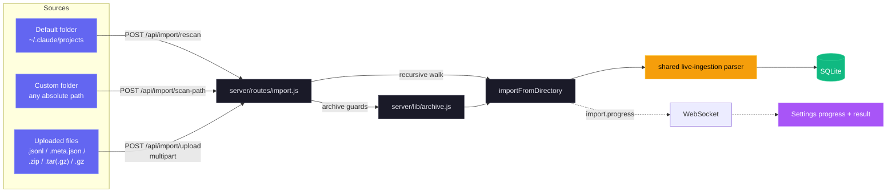

| Método | Ruta | Propósito |
| --- | --- | --- |
| `GET` | `/api/import/guide` | Rutas, comandos de archivos, extensiones e instrucciones según el proveedor mediante `?provider=claude\|codex`. |
| `POST` | `/api/import/rescan` | Vuelve a explorar la raíz predeterminada seleccionada a partir de `{ provider }`. |
| `POST` | `/api/import/scan-path` | Explora recursivamente una ruta absoluta `{ path, provider }`. |
| `POST` | `/api/import/upload` | Carga archivos o paquetes compatibles con `provider`. |

- **Entradas:** archivos `.jsonl`, `.meta.json`, `.zip`, `.tar`, `.tar.gz`/`.tgz` y `.gz` sueltos en estructuras anidadas. Claude admite ambos diseños canónicos de subagentes. Codex reconoce `rollout-*.jsonl` recursivos o JSONL con `session_meta` y títulos opcionales de `session_index.jsonl`.
- **Precisión:** la deduplicación por UUID y marca máxima de evento evita contar dos veces. Las líneas base de compactación conservan tokens anteriores. La actividad posterior avanza `ended_at` y actualiza los metadatos de mensajes.
- **Archivos grandes:** el análisis compartido en fragmentos de 4 MiB, línea por línea, maneja transcripciones más grandes que el límite aproximado de 512 MiB de las cadenas de V8. Los arrays ampliables tienen un máximo de `TRANSCRIPT_CACHE_MAX_ARRAY_LEN`, predeterminado en `1000`, y se recortan al doble del límite durante el análisis.
- **Seguridad:** la extracción rechaza rutas absolutas y con `..`. Los valores predeterminados limitan los datos extraídos a 4 GB, cada carga a 1 GB y las solicitudes a 2000 archivos. El staging por solicitud siempre se elimina.
- **Progreso:** las fases WebSocket limitadas de `import.progress` cubren `start`, `scan`, `extract`, `parse`, `complete` y `error`. La interfaz ofrece instrucciones de arrastrar y soltar y totales de elementos importados, enriquecidos, omitidos y con errores.
### WebSocket

Conéctese a `ws://localhost:4820/ws` para recibir mensajes push en tiempo real:

```json
{
  "type": "agent_updated",
  "data": { "id": "...", "status": "working", "current_tool": "Edit" },
  "timestamp": "2026-03-05T15:43:01.800Z"
}
```

**Tipos de mensajes:** `session_created`, `session_updated`, `agent_created`, `agent_updated`, `new_event`, `alert_triggered`, `alert_updated`, `remote_source.status` (datos `{ id, status: "idle"|"syncing"|"ok"|"error"|"deleted", error?, last_sync_at? }`)

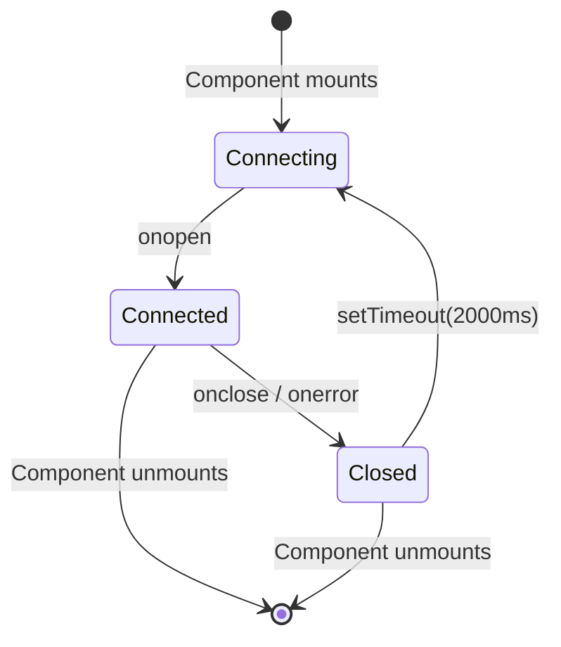

---

## Eventos de enganchamiento

El panel de control procesa estos tipos de ganchos de código Claude:

| Tipo de gancho | Activador                        | Acción del panel de instrumentos                                                                             |
| ------------------- | ------------------------------ | -------------------------------------------------------------------------------------------- |
| `SessionStart`      | Comienza la sesión de Claude Code | Crea la sesión y el agente principal. Marca `awaiting_input_since` (con `awaiting_reason=session_start`) para que una nueva sesión se encuentre en **Esperando**, excepto una SessionStart de fuente `compact` (compactación automática a mitad de turno), que deja la bandera sin tocar para que una sesión activa siga **Activa**. Reactiva las sesiones suspendidas. Abandona las sesiones huérfanas sin actividad durante `DASHBOARD_STALE_MINUTES` (por defecto 180) |
| `UserPromptSubmit` | El usuario pulsa enter en una solicitud | Borra la bandera de espera y promueve al agente principal a `working` (en funcionamiento) - la única señal de que las conversaciones con el asistente de texto han comenzado, ya que no emiten `PreToolUse` |
| `PreToolUse`        | El agente comienza a usar una herramienta | Borra la bandera de espera, establece al agente en `working`, establece `current_tool`. Si la herramienta es `Agent`, crea un registro de subagente |
| `PostToolUse`       | Ejecución de la herramienta completada       | Borra la bandera de espera (maneja las aprobaciones de solicitud de permiso donde la Notificación la estampó en medio de la herramienta). Borra `current_tool`. El agente permanece `trabajando` |
| `Stop`              | Claude termina de responder | Sin error: agente principal → `esperando` — Claude terminó su turno, la pelota está en el campo del usuario. `stop_reason=error`: marca el agente y la sesión `error`. Los subagentes de fondo siguen ejecutándose |
| `SubagentStop`      | Agente de fondo terminado      | Encuentra y completa el subagente por descripción, tipo o tarea. No borra deliberadamente la bandera de espera, ya que el fin de un subagente no nos dice nada sobre el humano. **Activa una escaneo JSONL de "fire-and-forget"** (`scanAndImportSubagents`) que emite eventos `PreToolUse` + `PostToolUse` por herramienta bajo el propio `agent_id` del subagente, por lo que la Línea de Tiempo muestra todas las herramientas que ejecutó el subagente, no solo el marcador de aparición |
| `Notificación` | Notificación del agente | Registra el evento. Los mensajes de permiso/petición de entrada establecen al agente en `esperando` y estampan `awaiting_input_since` (con `awaiting_reason=notification`, coincidiendo con el patrón: `permission`, `waiting for input`, `needs your approval`, ...). Las notificaciones de compactación se etiquetan como eventos de `Compactación`. Desactiva una notificación del navegador si está habilitada |
| `SessionEnd`        | El proceso CLI de Claude Code termina | Quita la bandera de espera. Si la sesión ya está en `error`, el estado de error se preserva; de lo contrario, marca a todos los agentes y la sesión como `completada` |
| `Compactación` | `/compact` detectado en JSONL | Crea un subagente de compactación (tipo `compactación`) y un evento de compactación. Detectado a través de las entradas `isCompactSummary` en el JSONL de la transcripción. También detectado por el escáner periódico para sesiones activas |
| `APIError` | Error API en la transcripción JSONL | Extraído de las entradas de `isApiErrorMessage` (cuota, límite de tasa, solicitud inválida) y las respuestas brutas de `type: "error"`. **Ahora marca inmediatamente la sesión y el agente como `error`**, anteriormente registrados como eventos sin cambiar el estado. Almacenado como evento con detalles de error |
| `TurnDuration` | Tiempo de giro en la transcripción JSONL | Extraído de los mensajes del subtipo `turn_duration` de `system` con `durationMs`. Almacenado como evento para el análisis del tiempo de nivel de giro |
| `ToolError` | Error de resultado de la herramienta en JSONL | Extraído de las entradas de `toolUseResult.is_error`. Registra los fallos a nivel de herramienta para el análisis de propagación de errores |
| `RemoteToolEvent` | Llamada a herramienta enviada por una máquina remota | Lo escribe `POST /api/hooks/ingest-batch` por cada elemento `tool_events[]` que envía una máquina itinerante o tras NAT. Se deduplica por `(session_id, event_type, uuid)` frente a las filas ya confirmadas y dentro del mismo lote, así que reenviar un lote es seguro |
| `RemoteTurn` | Duración de turno enviada por una máquina remota | Lo escribe `POST /api/hooks/ingest-batch` por cada elemento `turns[]`, con el `duration_ms` de ese turno. Misma deduplicación que `RemoteToolEvent` |
| `Interrumpido` | Turno cancelado por el usuario (Esc) | Sintetizado por el vigilante — `Esc` no dispara ningún gancho, por lo que se detecta una sesión `trabajando` atascada desde el marcador `[Solicitud interrumpida por el usuario]` de la transcripción o, cuando Esc precedió a cualquier salida, desde el tiempo de espera de `trabajo inactivo` (`DASHBOARD_WORKING_IDLE_SECONDS`). La sesión pasa a **Esperando** (mismo que un `Detener` normal) |

---

## Notificaciones del navegador

El panel de control admite notificaciones persistentes del navegador a través de Web Push (VAPID) para alertas en tiempo real incluso cuando la pestaña del panel de control no está enfocada o el navegador está en segundo plano.

### Cómo funciona

1. **Activar** las notificaciones en la página de Configuración a través del interruptor principal
2. **Conceder** permiso al navegador cuando se le solicite, esto registra un Servidor de Servicios y crea una suscripción push.
3. **Configurar** qué eventos desencadenan notificaciones:

| Evento                        | Por defecto | Descripción                                                     |
| ---------------------------- | ------- | --------------------------------------------------------------- |
| Comienza una nueva sesión | En | Se activa cuando se crea una nueva sesión de Claude Code |
| Claude terminó de responder | Desactivado | Lanza eventos de "Detener" cuando Claude termina una ronda de respuesta |
| Sesión cerrada | Desactivada | Se cierra en `SessionEnd` cuando el proceso CLI termina |
| Errores de sesión | En | Se cierra cuando una sesión termina con un error |
| Subagente generado | Desactivado | Se dispara cuando se crea un subagente de fondo |

Además, cualquier evento de gancho de `Notificación` de Claude Code desencadena una notificación del navegador independientemente de los interruptores por evento (siempre que el interruptor principal esté habilitado).

### Arquitectura de notificaciones

- **Pipeline VAPID:** Utiliza `web-push` en el servidor para la entrega segura de mensajes. Las claves VAPID se generan automáticamente y se almacenan en `data/vapid-keys.json`.
- **Trabajador de servicio:** Un trabajador dedicado (`client/public/sw.js`) maneja los eventos de `push` entrantes y muestra notificaciones con `silent: false` para garantizar la reproducción de audio en macOS.
- **Suscriptiones:** Los puntos finales específicos del navegador se almacenan en la tabla `push_subscriptions` en SQLite.
- **Persistencia:** Las notificaciones llegan incluso si el navegador está cerrado, ya que el Servidor de Servicios opera en segundo plano.
- **Notificación de prueba:** el botón en Ajustes le permite verificar el pipeline VAPID y la reproducción de audio.

### PWA y funcionamiento sin conexión

El panel, la página de inicio y Wiki son PWA instalables independientes con manifests y service workers propios.

| Superficie | Manifest | Service Worker | Estrategia de caché |
| --- | --- | --- | --- |
| Panel (`client/`) | `client/public/manifest.json` | `client/public/sw.js` | Los recursos inmutables `/assets/*` usan cache-first. La navegación, el worker, el manifest, los iconos y `/` usan network-first con fallback. `/api/*`, `/ws` y Vite HMR nunca se guardan en caché. Los handlers push siguen activos. Express envía encabezados inmutables de un año para los recursos y encabezados de revalidación para los archivos del shell. `controllerchange` recarga una sola vez al actualizar, nunca en la primera instalación. |
| Página de inicio (raíz) | `manifest.json` | `sw.js` | Precarga el shell, el favicon y la imagen OG. Las capturas se guardan en la primera visualización. La navegación usa network-first con fallback sin conexión. |
| Wiki (`wiki/`) | `wiki/manifest.json` | `wiki/sw.js` | Precarga HTML, CSS, JS, el manifest y el favicon. HTML mantiene network-first. CSS y JS usan cache-first, lo que permite trabajar sin conexión después de una visita. |

Todos los workers llaman a `skipWaiting()`, eliminan las cachés versionadas obsoletas al activarse y se actualizan de forma limpia cuando cambia la versión de la caché. Cada archivo HTML incluye metadatos de iOS para modo independiente. Los manifests y los iconos Apple touch usan `favicon.svg` con `sizes="any"`.

---
## Notificador de actualización

El panel de control observa su propia verificación de git y muestra una modalidad cada vez que la rama predeterminada canónica tiene commits por delante de HEAD. **Conocedor de ramas y bifurcaciones:** si tiene una remota `upstream` (la convención estándar para bifurcaciones), se prefiere sobre `origin`; el `master`, `main` o `HEAD` de la remota elegida es la referencia de comparación. El `manual_command` se adapta a su situación: `git pull --ff-only` solo cuando su rama realmente rastrea la referencia canónica, de lo contrario una `git fetch` (y una fusión de avance rápido en el caso de la bifurcación) para que el comando nunca mienta. Los usuarios obtienen el comando exacto para ejecutar en un terminal: el servidor **nunca** se carga o reinicia, lo que mantiene el mecanismo portátil a través de las sesiones de desarrollo, la supervisión de pm2/systemd/launchd/Docker y las implementaciones remotas.

<p align="center">
  <a href="images/update.png"></a>
</p>

### Cómo funciona

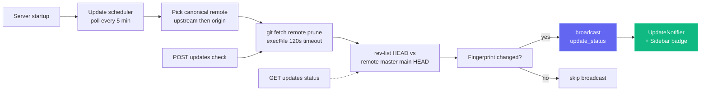

Un solo cheque es barato (`git fetch <remote> --prune` contra el remoto canónico — `upstream` si está configurado, de lo contrario `origin`), envuelto con `execFile` (sin shell) y un tiempo de espera de 120 segundos. Los fallos — red sin conexión, instalación no git, no hay remotos configurados, referencia upstream no resoluble — todos devuelven **carga útiles suaves** (por ejemplo, `fetch_error: "..."`) en lugar de lanzar, por lo que un remoto inestable nunca bloquea el panel de control.

### Superficies de interfaz de usuario

| Superficie | Comportamiento |
| --- | --- |
| **Modal** (`client/src/components/UpdateNotifier.tsx`) | Se abre cuando hay un nuevo `remote_sha` disponible. Muestra los commits de retraso, la referencia seguida, una nota opcional sobre la rama o el fork, el comando exacto y **Copiar comando**, **Comprobar ahora** y **Descartar**. Escape o un clic en el fondo lo descartan. El descarte se vincula al SHA en `localStorage`, por lo que un SHA nuevo vuelve a abrirlo. |
| **Botón de la barra lateral** (`client/src/components/Sidebar.tsx`) | Siempre está visible. El verde indica retraso y el ámbar un fallo de fetch. Al hacer clic se borra el descarte y se llama a `POST /api/updates/check`. |
| **Terminal del servidor** | Imprime un comando enmarcado cuando el estado pasa de actualizado a retrasado, también para usuarios sin interfaz. |

### Superficie de la API

| Punto final | Propósito |
| --- | --- |
| `GET /api/updates/status` | Comprobación de lectura única: ejecuta `git fetch` contra el remoto canónico, compara HEAD con su rama predeterminada, devuelve el payload. |
| `POST /api/updates/check` | La misma comprobación, pero también transmite `update_status` a través de WebSocket para que todos los clientes conectados se actualicen al mismo tiempo. |

Ambos extremos devuelven la misma forma de carga útil:

```json
{
  "git_repo": true,
  "update_available": true,
  "repo_root": "/Users/you/Claude-Code-Agent-Monitor",
  "remote_ref": "upstream/master",
  "canonical_remote": "upstream",
  "current_branch": "master",
  "tracking_upstream": "origin/master",
  "tracks_canonical": false,
  "situation": "fork_or_diverged_tracking",
  "local_sha": "abc1234...",
  "remote_sha": "def5678...",
  "commits_behind": 3,
  "manual_command": "cd \"/...\" && git fetch upstream && git merge --ff-only upstream/master && npm run setup",
  "situation_note": "You're on 'master' tracking 'origin/master'. This command fast-forwards your branch from upstream/master (the canonical default).",
  "message": "3 commit(s) on upstream/master not in your checkout."
}
```

`situación` es una de `tracking_canonical` (clon típico en la rama predeterminada, `git pull --ff-only` funciona), `fork_or_diverged_tracking` (el nombre de la rama local coincide con el canónico, pero rastrea una ubicación remota diferente, `git fetch <remote> && git merge --ff-only <ref>`), `feature_branch` (fuera de la rama predeterminada, solo se busca, la integración queda a cargo del usuario) o `detached_head`.

### Lo que está intencionalmente **No** aquí

No hay `POST /api/updates/apply` y no hay asistente de reinicio automático, por diseño. Actualizarse automáticamente un proceso desde dentro de sí mismo es poco fiable sin un supervisor externo: `npm run dev` (concurrentemente), `npm start`, `pm2`, `systemd`, `launchd` y Docker requieren diferentes lógica de reinicio, y los fallos de `git pull` / `npm install` en un servidor en peligro de muerte no tienen un camino de desinstalación limpio. La detección solo mantiene el comportamiento predecible en todos los supervisores, todos los sistemas operativos y todos los estados de la rama, mientras aún cierra la brecha de información de "¿cuándo necesito realizar una extracción?"; el usuario es el dueño de la actualización real en su propia shell.

### Configuración

| Env Var | Valor predeterminado | Notas |
| --- | --- | --- |
| `DASHBOARD_UPDATE_CHECK` | habilitado | Establecido en `0` / `false` / `off` para deshabilitar por completo el programador. |
| `DASHBOARD_UPDATE_CHECK_INTERVAL_MS` | `300000` (5 min) | Intervalo entre las comprobaciones automáticas. El piso es de 60 000 ms, los valores inferiores están atornillados. |

---

## Tabby — Compañero de gato flotante

**Tabby** es un lindo compañero de gato flotante atado en la esquina inferior derecha de cada página en el panel de control. Siempre presente, convierte el flujo de la sesión en vivo en una mascota reactiva de un vistazo con la que también puedes hablar.

<p align="center">
  <a href="images/tabby.png"></a>
</p>

### Mascota reactiva

Tabby es un gato SVG que rastrea el cursor con **ocho estados de ánimo** derivados del flujo de la sesión en vivo, cada uno con su propia animación:

| Estado de ánimo | Cuando | Animación |
| --- | --- | --- |
| `idle` | Nada notable sucediendo | Golpeo de cola descansando |
| `observando` | Las sesiones están activas | La oreja se erige, los ojos siguen el cursor |
| `feliz` | Una sesión o ejecución terminada de forma limpia | Movimiento de cabeza + brillo |
| `preocupado` | Algo no parece bien | Tremor sutil |
| `atascado` | Una sesión parece estar bloqueada | Alerta "!" |
| `pensando` | Un agente está en medio del trabajo | Movimiento lento de la cabeza |
| `dormiendo` | Tranquilo por un rato | `zzz` |
| `desconectado` | WebSocket está caído | Tranquilo, mantén la postura |

### Burbujas de diálogo

Tabby auto-superpone breves comentarios sobre eventos notables (sesión iniciada/terminada, errores, ejecución completada). Las burbujas están **controlando el flujo** y **coalesenciadas**, por lo que un parpadeo de eventos nunca llena la pantalla de spam, utilizan `aria-live` para lectores de pantalla y se pueden **silenciar** desde el panel.

### Panel

Abra el panel haciendo clic en el gato o presionando **⌘B / Ctrl+B** (Esc cierra). Muestra:

- Una **línea de estado en vivo**: `N en vivo · M con errores · estado de conexión`.
- **Acciones rápidas** - salta a Ejecutar Claude, Actividad, Sesiones o sesiones con errores; silenciar burbujas; eliminar alertas.
- Una casilla de **Preguntar** (ver abajo).

### Caja de preguntas → Ejecutar la transferencia de manos de Claude

La casilla **Pregunta** responde a preguntas de estado simples localmente a partir de datos almacenados en caché, por ejemplo "qué está ejecutando", "algunos errores" o "estado". Cualquier otra pregunta se pasa a la página existente de **Ejecutar Claude** (hace un enlace profundo a `/run?prompt=…`) para iniciar una sesión real de Código Claude. Tabby nunca llama a un LLM en sí mismo; simplemente reutiliza la página de Ejecutar Claude para cualquier cosa más allá de una búsqueda rápida de estado.

### Accesibilidad y degradación segura

Tabby es operable con el teclado, utiliza `aria-live` para sus burbujas y respeta `prefers-reduced-motion`. Si el WebSocket está inactivo, se degrada de forma segura a un estado tranquilo de `desconectado` en lugar de producir un error. Puedes activar o desactivar Tabby en **Configuración** (localizado en inglés, chino, vietnamita y coreano), y la implementación reside en `client/src/components/Tabby/`.

---

## Señales de sonido

El panel de control ofrece **retroalimentación de audio discreta** para la actividad de sesiones en vivo, de modo que puedes dejarlo en un segundo monitor y aun así oír cuándo una ejecución termina o falla. El sonido está **activado por defecto** y se puede desactivar por completo con un clic.

### Síntesis sin dependencias

No hay ningún archivo `.mp3` ni `.wav` en el repositorio ni ninguna biblioteca de audio en `package.json`. Cada señal se genera en el momento de reproducirse con la **Web Audio API**: una lista corta de osciladores (seno o triángulo), cada uno con su propia envolvente de ganancia exponencial, mezclados a través de un nodo de ganancia maestro y un filtro paso bajo para que el resultado se quede detrás de tu trabajo en lugar de atravesarlo. Todo el motor es un solo archivo, `client/src/lib/sound.ts`.

### Las señales

| Señal | Cuándo suena | Cómo suena |
| --- | --- | --- |
| `sessionStart` | Aparece una nueva sesión | Quinta justa ascendente (C5 → G5) |
| `sessionComplete` | Una sesión termina de responder (`Stop`) o se cierra (`SessionEnd`) | Arpegio mayor que resuelve (E5 → G5 → C6) |
| `sessionError` | Una sesión entra en estado `error` | Tercera menor descendente suave en onda triangular: perceptible, no alarmante |
| `subagentSpawn` | Se genera un subagente | Un único pulso corto |
| `notification` | Claude Code emite un evento `Notification` | Par desafinado que suena como una campanita |
| `connected` / `disconnected` | El WebSocket del panel vuelve o se cae | Dos notas de subida / bajada |
| `click` | Pulsas un botón, enlace, pestaña o interruptor | Tic apenas audible |

Las señales viven dentro de un conjunto de do mayor, así que las colas superpuestas nunca suenan disonantes, y cada envolvente decae exponencialmente en lugar de cortarse, lo que evita el chasquido de una parada brusca.

### Sin estorbarte

Tres salvaguardas evitan que el audio se convierta en ruido:

- **Enfriamiento por señal**: la misma señal no se repite dentro de ~350 ms (45 ms para el tic de interacción).
- **Presupuesto global de ráfaga**: como máximo 4 señales comienzan en cualquier ventana de 1,2 s, así que importar el historial o reconectar tras una caída nunca convierte una avalancha de mensajes WebSocket en una avalancha de pitidos.
- **Política de autoreproducción**: nada suena hasta tu primera interacción de puntero, tecla o toque con la página, según las reglas del navegador. Las señales previas se descartan en silencio, no se encolan.

Si el navegador no soporta Web Audio en absoluto, cada llamada es una operación nula segura: el panel simplemente permanece en silencio.

### Configuración

**Configuración → Sonido** tiene un interruptor maestro, un control de volumen y un interruptor individual para cada señal. Activar un interruptor reproduce esa señal de inmediato para que oigas exactamente lo que acabas de habilitar, y un botón **Escuchar sonido** reproduce el tono de finalización cuando quieras. Las preferencias persisten en `localStorage` bajo `agent-monitor-sound` y surten efecto al instante en toda la aplicación, sin recargar. El panel está localizado en inglés, chino, vietnamita, coreano y español.

Por defecto están activados el inicio de sesión, la finalización de sesión, el error de sesión, las notificaciones de Claude Code y el tic de interacción; la generación de subagentes y los cambios de conexión están desactivados (son los más ruidosos). La implementación vive en `client/src/lib/sound.ts` (motor + preferencias) y `client/src/hooks/useSoundCues.ts` (conexión al bus de eventos), montada una sola vez en `client/src/App.tsx`.

---

## Modal de estado de conexión

Haga clic en la píldora **En vivo** / **Desconectado** en el pie de página de la barra lateral para abrir un pequeño panel de detalles sobre el transporte WebSocket del panel de control. Muestra el extremo de destino `ws://` activo, cuánto tiempo ha estado activo el socket actual, los eventos totales recibidos, los tipos de eventos más comunes como un gráfico de barras horizontal, una línea de chispa de rendimiento de 60 segundos y los últimos 8 eventos como una lista de actividad reciente. Las estadísticas acumulativas (totales, desglose por tipo, lista reciente) persisten a través de las recargas a través de `localStorage` bajo `sidebar-connection-stats`; la línea de chispa en movimiento y el temporizador "conectado desde" son intencionalmente efímeros. Un botón **Restablecer** en el pie de página borra todo a demanda.

<p align="center">
  <a href="images/live.png"></a>
</p>

---

## Extensión de VS Code

El **Monitor de Agentes del Código Claude** está disponible como una extensión de VS Code de primera clase, lo que le permite monitorear sus agentes de IA sin salir de su editor.

<p align="center">
  <a href="vscode-extension/vscode.png"></a>
</p>

### 🚀 Características clave
- **Barra lateral en vivo**: Vista dedicada de la barra de actividad que muestra la salud real del agente en tiempo real (trabajando, esperando, completado, etc.).
- **Análisis de uso**: Realice un seguimiento del total de tokens, los costos en USD en vivo y el número de eventos directamente en la barra lateral.
- **Integración de la barra de estado**: Monitor de pulsos de visión rápida en la barra inferior que muestra las sesiones y agentes activos.
- **Navegación profunda**: Acceso con un solo clic a vistas específicas del panel de control (Kanban, Análisis, Configuración) o sesiones recientes.
- **Tabla integrada**: Abre el panel de control de monitoreo completo como una pestaña nativa de VS Code webview.

### 📦 Instalación y configuración
1. Abre el directorio [vscode-extension](./vscode-extension).
2. Instale la extensión del Marketplace o empaquetela usted mismo usando `vsce package`.
3. Asegúrese de que su servidor de panel local esté funcionando (`npm run dev`).
4. Haga clic en el icono **Radar** en la barra de actividad de VS Code para comenzar.

Para la configuración detallada del desarrollador, consulte los directorios [.vscode](./.vscode) y [vscode-extension](./vscode-extension).

> [!TIP]
> Extensión en el mercado de VS Code: [Claude Code Agent Monitor](https://marketplace.visualstudio.com/items?itemName=hoangsonw.claude-code-agent-monitor)

---

## Aplicación de escritorio (macOS y Windows)

La aplicación de escritorio opcional de Electron 35 empaqueta el mismo panel como `.dmg` de macOS, instalador NSIS de Windows o `.exe` portátil desde el espacio de trabajo `desktop/`.

<p align="center">
  <a href="images/macos.png"></a>
  <br>
  <em>🍎🪟 <strong>Aplicación de escritorio</strong> · shell nativo con icono de barra de menús o área de notificaciones (tray), Abrir al iniciar sesión y bloqueo de instancia única. El mismo panel en una ventana real del sistema operativo (se muestra macOS).</em>
</p>

<p align="center">
  <a href="images/windows_app.png"></a>
  <br>
  <em>🪟 El mismo panel como aplicación nativa de Windows · icono del área de notificaciones (tray), menú nativo y Abrir al iniciar sesión.</em>
</p>

Añade comportamiento nativo de ventana, tray, menú, inicio de sesión y cierre alrededor de la misma interfaz servida en `localhost:4820`.

### Cómo funciona

A diferencia de ejecutar el panel de control desde un terminal, la aplicación de escritorio no necesita `npm start`, ni un shell abierto, ni una segunda copia del servidor. El **proceso principal** de Electron hospeda el servidor Express **en el proceso**: `require()` `server/index.js` directamente en el mismo tiempo de ejecución de Node, con **sin proceso hijo ni IPC**, y señala una `BrowserWindow` de Chromium al cliente React compilado.

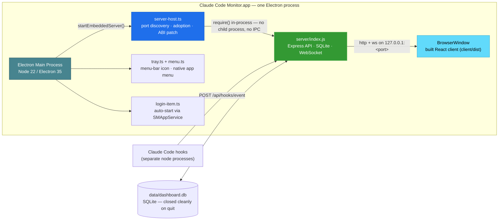

Al iniciar la aplicación:

1. Elige un puerto gratuito, prefiriendo **4820**, retrocediendo a **4821-4829**, y luego un puerto alto aleatorio si todos esos están ocupados.
2. Si un servidor de panel de control saludable ya responde a `/api/health` en `4820` (por ejemplo, has ejecutado `npm start` en un terminal), **adoptará ese servidor** en lugar de vincularlo de forma doble: sin colisión de puertos, sin competencia de SQLite. Un servidor adoptado sigue funcionando después de que cierres la aplicación.
3. De lo contrario, inicia el servidor incorporado y, en el **primer arranque del servidor propiedad**, instala automáticamente los ganchos del código Claude y inicia los servicios de fondo (programador de actualizaciones, `cc-watcher`, reconciliación de ejecución huérfana). Un usuario que solo tenga un DMG, por lo tanto, recibe eventos con **cero configuración manual**: sin realizar una compra, sin `npm run install-hooks`.
4. **(macOS)** Recupera tu **PATH de la cáscara de inicio de sesión** para que la función **Ejecutar Claude** pueda encontrar y crear la CLI `claude`: una aplicación lanzada desde Finder/Dock que de otra manera heredaría solo el PATH mínimo de launchd y perdería las CLIs en `~/.local/bin`, `/opt/homebrew/bin`, los contenedores del gestor de versiones, etc. (En Windows, el proceso ya hereda el PATH del usuario).
5. Abre la ventana del panel de control, a menos que la aplicación se haya iniciado al iniciar sesión (en macOS a través de los elementos de inicio de sesión; en Windows a través de la entrada etiquetada `HKCU\…\Run`), en cuyo caso solo se mantiene como bandeja.
6. Al salir, apaga el servidor incorporado con gracia y **cierra SQLite de forma limpia** (punto de control WAL).

### Características

- **Tray y ventana:** el clic izquierdo alterna la ventana. El clic derecho ofrece **Abrir panel**, **Abrir en el navegador**, **Reiniciar servidor**, **Mostrar registros**, **Abrir al iniciar sesión** y **Salir**. macOS usa un glifo de tray teñido. Windows y la ventana o barra de tareas usan el icono de color, incluso en ejecuciones de desarrollo sin empaquetar.
- **Menú nativo:** menús estándar de aplicación y atajos `⌘` / `Ctrl`. Solo macOS conserva **Archivo → Abrir panel** (`⌘1`) mientras está oculto. Windows y Linux vuelven a abrirlo de forma fiable desde el tray.
- **Inicio y ciclo de vida:** `SMAppService` registra los Login Items de macOS. Windows escribe la entrada por usuario `HKCU\Software\Microsoft\Windows\CurrentVersion\Run`. Cerrar oculta la ventana mientras el tray y el servidor continúan. Un segundo inicio enfoca la única instancia existente.
- **Datos persistentes:** SQLite y las claves VAPID permanecen fuera del paquete en `~/Library/Application Support/Claude Code Monitor/data/` o `%APPDATA%\Claude Code Monitor\data\`. La reinstalación, la actualización y la desinstalación NSIS predeterminada conservan el historial importado.
- **CLI y registros:** macOS restaura el `PATH` del login shell para que los inicios desde Finder o Dock puedan ejecutar `claude`. Windows usa el `PATH` heredado del usuario. **Mostrar registros** abre `~/Library/Logs/Claude Code Monitor/desktop.log` o `%APPDATA%\Claude Code Monitor\logs\desktop.log`.

### Obtenerla

**Opción A - descargar un instalador preconstruido (recomendado).** Desde **[Versiones → última](https://github.com/hoangsonww/Claude-Code-Agent-Monitor/releases/latest)** (público, sin inicio de sesión en GitHub). CI publica automáticamente una nueva versión `vX.Y.Z` cada vez que la versión en `package.json` se actualiza en `master`, por lo que este enlace siempre sirve para la construcción actual:

| Plataforma | Activo | Notas |
| --- | --- | --- |
| macOS (Apple Silicon) | `ClaudeCodeMonitor-<ver>-arm64.dmg` | arrastrar a `/Applications` |
| macOS (Intel) | `ClaudeCodeMonitor-<ver>-x64.dmg` | arrastrar a `/Applications` |
| Windows (instalador) | `ClaudeCodeMonitor-Setup-<ver>-x64.exe` | instalación por usuario, sin administrador |
| Windows (portátil) | `ClaudeCodeMonitor-<ver>-x64-portable.exe` | ejecutar sin instalar |

Las construcciones frescas por compromiso también existen como artefactos CI (se requiere inicio de sesión, retención de 14 días): `ClaudeCodeMonitor-dmg` del trabajo `🍎 macOS Desktop (DMG)` y `ClaudeCodeMonitor-win` del trabajo `🪟 Windows Desktop (EXE)`, útiles para probar `master` antes de la próxima etiqueta de lanzamiento.

**Opción B: construíselo tú mismo.** Desde la raíz del repositorio:

```bash
npm run setup                # install root + client deps, build client, install hooks
npm run build                # build the React client (client/dist)
npm run desktop:install      # install Electron + electron-builder into desktop/ (preflights native deps; prints setup help on failure)
npm run desktop:dmg:arm64    # macOS:   fast single-arch DMG → desktop/release/ClaudeCodeMonitor-<ver>-arm64.dmg
npm run desktop:win          # Windows: NSIS installer → desktop/release/ClaudeCodeMonitor-Setup-<ver>-x64.exe
```

> [!NOTE]
> **Los DMG se construyen en macOS; los `.exe` de Windows se construyen en Windows** — paquetes electron-builder para el sistema operativo de host. El paquete de construcción `npm run desktop:dmg` de macOS construye la aplicación **dos veces** (una vez por arquitectura) y emite **ambos** DMG por arquitectura (`arm64` + `x64`) — la construcción de lanzamiento; no los fusiona en un binario universal. Para su propio Mac, utilice el `desktop:dmg:arm64` / `desktop:dmg:x64` de arquitectura única. En Windows, `better-sqlite3` se obtiene como un binario Electron preconstruido por `npm run desktop:install`, por lo que no se necesita ninguna cadena de herramientas Visual Studio C++ en el caso común. Si la construcción falla (sin binario preconstruido o cadena de herramientas C++ faltante), `desktop:install` imprime la solución exacta por sistema operativo más una alternativa sin cadena de herramientas y falla ruidosamente en lugar de dejar una instalación rota.

### Instalarla

**macOS:**

1. Haga doble clic en el `.dmg` para montarlo.
2. Arrastra **Claude Code Monitor.app** a tu carpeta `/Applications`.
3. El DMG está **firmado ad hoc** por defecto, por lo que macOS Gatekeeper advierte en la primera vez que se inicia (*"Apple no pudo verificar..."*). Borra el atributo de cuarentena:

   ```bash
   xattr -cr "/Applications/Claude Code Monitor.app"
   ```

   O abre **Configuración del sistema → Privacidad y seguridad** y haz clic en **Abrir de todos modos**.

4. Inicie la aplicación. Aparece el icono de la bandeja y se abre la ventana del panel de control.

**Windows:**

Ejecuta `ClaudeCodeMonitor-Setup-<ver>-x64.exe` para una instalación por usuario sin privilegios de administrador en `%LOCALAPPDATA%\Programs\Claude Code Monitor`, con destino seleccionable, o usa `*-portable.exe` sin instalar. La compilación sin firmar predeterminada puede activar SmartScreen en el primer inicio. Elige **Más información → Ejecutar de todos modos**. Iníciala desde Inicio o el acceso directo del escritorio para abrir el panel y el icono del tray.

<p align="center">
  <a href="images/setup_win_wizard.png"></a>
  <br>
  <em>🪟 <strong>Opciones de instalación</strong> · elige una instalación por usuario o para todos los usuarios</em>
</p>

<p align="center">
  <a href="images/setup_win_wizard2.png"></a>
  <br>
  <em>🪟 <strong>Ubicación de instalación</strong> · confirma o cambia la carpeta de destino</em>
</p>

<p align="center">
  <a href="images/setup_win_wizard3.png"></a>
  <br>
  <em>🪟 <strong>Instalación de Windows completada</strong> · termina el instalador e inicia Claude Code Monitor</em>
</p>

### Comandos de construcción

Todos los comandos se ejecutan desde la **raíz del repositorio**:

| Comando                     | Lo que hace                                                                 |
| --------------------------- | ---------------------------------------------------------------------------- |
| `npm run desktop:install` | Instalar Electron + electron-builder en `desktop/`; reconstruir `better-sqlite3` para la ABI de Electron; realizar pruebas preliminares de la construcción nativa de `better-sqlite3` e imprimir ayuda de configuración factible (incluyendo una alternativa sin cadena de herramientas) en caso de fallo |
| `npm run desktop:build` | Compila las fuentes TypeScript del escritorio en `desktop/out/`                    |
| `npm run desktop:dev`       | Construye y lanza la aplicación Electron para iteraciones locales                         |
| `npm run desktop:test`      | Ejecutar la prueba de humo (iniciar Electron, sondear `/api/health`, apagar)            |
| `npm run desktop:dmg`       | **macOS:** construye **ambos** DMG (arm64 + x64) — correctos para la versión, **más lentos** (paquetes para cada arquitectura) |
| `npm run desktop:dmg:arm64` | **macOS:** construye un DMG solo de Apple-Silicon — **rápido** (~1 min), recomendado para tu propio Mac |
| `npm run desktop:dmg:x64`   | **macOS:** construye un DMG solo para Intel — **rápido** (~1 min)                         |
| `npm run desktop:dmg:universal` | **macOS:** construye un DMG **universal** fusionado (arm64 + x86_64) — opcional, **más lento**, no es lo que se envía con la versión |
| `npm run desktop:win`       | **Windows:** construye el instalador NSIS `.exe` (x64)                             |
| `npm run desktop:win:portable` | **Windows:** construye el `.exe` portátil sin instalar (x64)                     |

El DMG de macOS resultante es **~80 MB** (≈ 250 MB en el disco una vez instalado) y el instalador de Windows es comparable: el impuesto estándar del paquete Electron.

### Firma y notarización

macOS usa firma ad hoc de forma predeterminada y configura `CSC_IDENTITY_AUTO_DISCOVERY=false`, por lo que nunca se seleccionan certificados locales por accidente. La firma Developer ID usa `CSC_LINK` junto con `CSC_KEY_PASSWORD`. La notarización añade `APPLE_ID`, `APPLE_TEAM_ID` y `APPLE_APP_SPECIFIC_PASSWORD`. Windows no incluye firma de forma predeterminada y activa Authenticode mediante las mismas variables `CSC_LINK` y de contraseña. CI activa cualquiera de las dos rutas cuando existen credenciales, sin cambiar el código.

### Notas de implementación

- **ABI nativa:** `desktop/` conserva un `better-sqlite3` compilado para Electron y redirige `server/db.js` hacia él. La copia de la raíz sigue siendo compatible con Node del sistema y las pruebas del servidor. Después de compilaciones DMG para una arquitectura concreta, `prebuild` de escritorio repara automáticamente la ABI local y falla pronto con instrucciones de configuración si falta el binario.
- **Paridad del servidor:** la función exportada `startBackgroundServices()` proporciona al servidor integrado el mismo programador de actualizaciones, watcher de configuración y conciliación de procesos huérfanos que `node server/index.js`. La ruta independiente y los demás espacios de trabajo conservan su comportamiento.
- **CI y versiones:** los jobs filtrados por ruta de macOS y Windows ejecutan smoke tests y cargan dos DMG para arquitecturas individuales, además de EXE NSIS y portátil. Los incrementos de versión en `master` adjuntan todos los recursos a `vX.Y.Z`. Regenera `desktop/assets/icon.ico` con `npm run build:win-icon`.

Consulta [`DESKTOP.md`](./DESKTOP.md) para la instalación y el uso diario, y [`desktop/README.md`](./desktop/README.md) para procesos, ciclo de vida, puertos y compilaciones.

---

## Almacenamiento de datos

- **Motor:** SQLite 3 a través de `better-sqlite3` (opcional) o `node:sqlite` incorporado de Node.js
- **Ubicación:** `data/dashboard.db`
- **Modo de diario:** WAL (lecturas concurrentes durante las escrituras)
- **Restablecer:** Elimina `data/dashboard.db` para borrar todos los datos

### Diagrama de relaciones de entidades

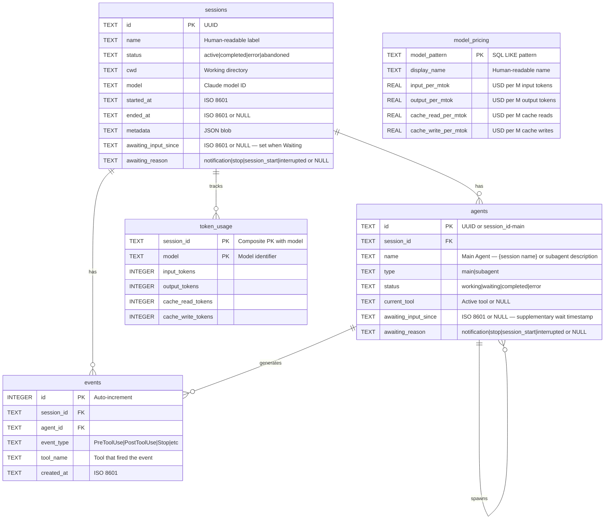

---

## Marketplace de plugins

CCAM incluye **14 plugins compartidos** desde un único árbol de fuentes. Claude Code lee `.claude-plugin/marketplace.json`. Codex lee `.agents/plugins/marketplace.json` junto con el `.codex-plugin/plugin.json` de cada plugin. El paquete contiene **66 habilidades empaquetadas, 18 subagentes de Claude, 34 comandos de Claude, 3 asistentes CLI, 3 configuraciones de hooks y 2 plugins con MCP**.

```bash
# Claude Code
claude plugin marketplace add hoangsonww/Claude-Code-Agent-Monitor
claude plugin install ccam-platform@claude-code-agent-monitor-plugins

# Codex
codex plugin marketplace add hoangsonww/Claude-Code-Agent-Monitor
codex plugin add ccam-platform@claude-code-agent-monitor-plugins

# Open Agent Skills / skills.sh-compatible CLI
npx skills add hoangsonww/Claude-Code-Agent-Monitor --list

# Install one skill for Claude Code and Codex in the current project
npx skills add hoangsonww/Claude-Code-Agent-Monitor \
  --skill mcp-server \
  --agent claude-code \
  --agent codex \
  --yes

# Verify, update, and remove the project-scoped skill
npx skills list --json
npx skills update --project --yes
npx skills remove mcp-server --yes

# Add --global to install at user scope, then manage that scope explicitly
npx skills add hoangsonww/Claude-Code-Agent-Monitor \
  --skill mcp-server \
  --agent claude-code \
  --agent codex \
  --global \
  --yes
npx skills list --global --json
npx skills update --global --yes
npx skills remove --global mcp-server --yes
```

La CLI `skills` descubre **77 habilidades totales del repositorio**, incluidas las 66 habilidades de plugins y las habilidades de mantenimiento del repositorio. Las instalaciones de proyecto usan `.agents/skills/` más enlaces específicos del agente. Las skills globales de Claude Code usan `~/.claude/skills/` de forma predeterminada, o `$CLAUDE_CONFIG_DIR/skills/` cuando está configurado. Las skills globales de Codex usan `~/.codex/skills/` de forma predeterminada, o `$CODEX_HOME/skills/` cuando está configurado. Las instalaciones para varios agentes pueden eliminar archivos duplicados mediante un almacén compartido y enlazar esos destinos. Cada skill de plugin tiene frontmatter canónico de `name` y `description`, además de metadatos `agents/openai.yaml`. No se necesita un PR upstream para `vercel-labs/skills`. El repositorio público de GitHub es el origen, y la visibilidad en skills.sh depende de la publicación y la telemetría real de instalaciones.

Nuevos paquetes específicos complementan los plugins existentes de analíticas, productividad, calidad, sesiones, flujos, configuración y panel:

- `ccam-runner`: inicio, seguimiento, detención, reanudación e historial supervisados de Claude Code o Codex
- `ccam-integrations`: reglas de alerta, webhooks, notificaciones push y recopilación remota por SSH
- `ccam-platform`: Explorador de configuración de Claude o Codex, importación por proveedor, restauración de copias, configuración de hooks, actualizaciones y operaciones MCP
- `ccam-reports`: informes de dirección, costos, fiabilidad y flujos preparados para las partes interesadas

Valida y regenera los metadatos de distribución con:

```bash
npm run extensions:sync
npm run extensions:validate
```

Catálogo completo, comandos de instalación, comportamiento de skills.sh, límite de publicación pública y comprobaciones de instalación limpia: [docs/PLUGINS.md](docs/PLUGINS.md).

---
## Línea de estado

Una utilidad independiente de línea de estado CLI para Claude Code que muestra el nombre del modelo, el usuario, el directorio de trabajo, la rama de git, la barra de uso de la ventana de contexto, el número de tokens por dirección y el costo de la sesión, todo ello codificado por colores con secuencias de escape ANSI.

```
nguyens6@host ~/agent-dashboard/client | Sonnet 4.6 | main | ████████░░ 79% | 3↑ 2↓ 156586c | $0.4231
```

| Segmento | Color                | Ejemplo                                                        |
| ----------- | -------------------- | -------------------------------------------------------------- |
| Modelo | Cian                 | `Soneto 4.6`                                                   |
| Usuario | Verde                | `nguyens6`                                                     |
| CWD         | Amarillo               | `~/agent-dashboard`                                            |
| Rama de Git | Magenta | `main`                                                         |
| Barra de contexto | Verde / Amarillo / Rojo | `████████░░ 79%`                                               |
| Tokens | Verde / Cian / Oscuro | `3↑ 2↓ 156586c` (verde `↑` entrando, cian `↓` saliendo, caché oscuro `c`) |
| Costo (USD) | Verde / Amarillo / Rojo | `0,4231 $` (total de la sesión - mostrado en la API y planes de suscripción)|

Límites de color de costo: verde por debajo de 5 $, amarillo de 5 a 20 $, rojo de 20 $ en adelante.

Consulte [`statusline/README.md`](statusline/README.md) para obtener instrucciones de instalación.

<p align="center">
  <a href="images/statusline.png"></a>
</p>

---

## Arquitectura del servidor

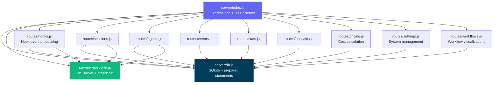

---

## Enrutamiento del cliente

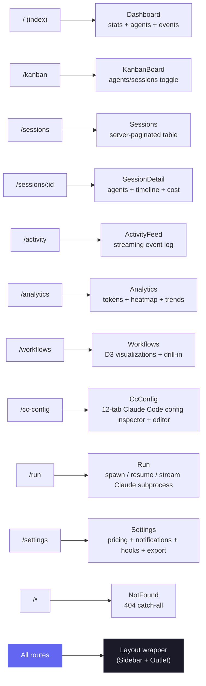

---

## Flujo del gestor de ganchos

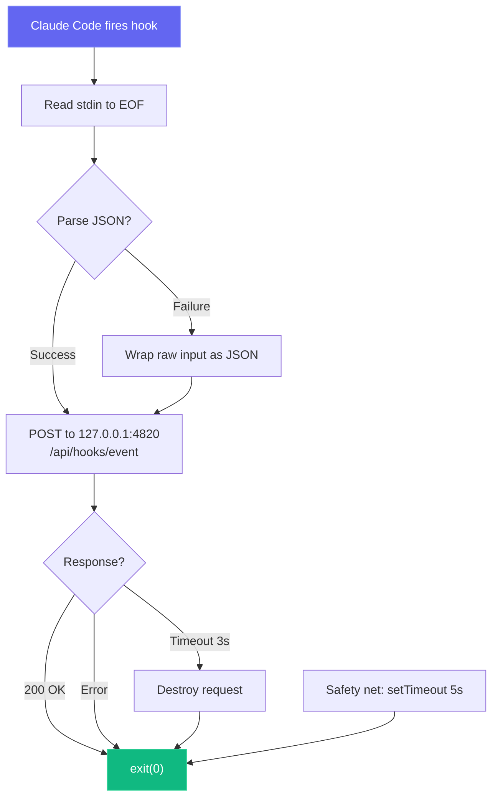

---

## Modos de despliegue

Apoyamos tanto los modos de despliegue de desarrollo como de producción con diferentes arquitecturas de procesos:

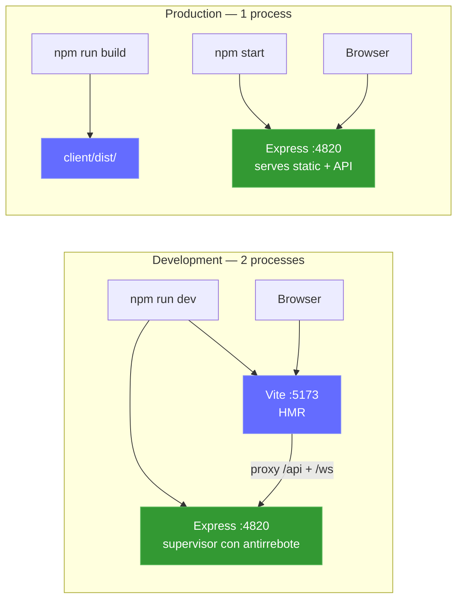

Sidecar MCP local opcional (soporta transportes stdio, HTTP+SSE y REPL):

```mermaid
graph LR
    subgraph "MCP Transport Options"
        M_STDIO["MCP Server (stdio)<br/>npm run mcp:start"]
        M_HTTP["MCP Server (HTTP)<br/>npm run mcp:start:http<br/>:8819"]
        M_REPL["MCP Server (REPL)<br/>npm run mcp:start:repl"]
    end

    H["MCP Host"] -->|"stdin/stdout"| M_STDIO
    RC["Remote Client"] -->|"POST /mcp · GET /sse"| M_HTTP
    OP["Operator"] -->|"interactive CLI"| M_REPL

    M_STDIO --> D["Dashboard Server<br/>:4820"]
    M_HTTP --> D
    M_REPL --> D

    style M_STDIO fill:#0f766e,stroke:#14b8a6,color:#fff
    style M_HTTP fill:#0f766e,stroke:#14b8a6,color:#fff
    style M_REPL fill:#0f766e,stroke:#14b8a6,color:#fff
```

Opcional **aplicación de escritorio (macOS y Windows)**: un solo proceso Electron que hospeda el servidor Express en el proceso (sin terminal, sin proceso hijo):

```mermaid
flowchart LR
    subgraph desktop["Desktop App (macOS & Windows) — 1 Electron process"]
        E_MAIN["Electron Main Process<br/>(Node 22 / Electron 35)"]
        E_HOST["server-host.ts<br/>require() server/index.js"]
        E_SRV["Embedded Express :4820<br/>API · SQLite · WebSocket"]
        E_WIN["BrowserWindow<br/>built React client"]
        E_TRAY["Menu-bar (tray) icon<br/>+ native app menu"]
        E_MAIN --> E_HOST
        E_HOST -->|"in-process require()"| E_SRV
        E_MAIN --> E_TRAY
        E_SRV -->|"http + ws on 127.0.0.1"| E_WIN
    end

    E_HOOKS["Claude Code hooks"] -->|"POST /api/hooks/event"| E_SRV

    style E_MAIN fill:#47848F,stroke:#2f5a62,color:#fff
    style E_SRV fill:#339933,stroke:#5cb85c,color:#fff
    style E_WIN fill:#61DAFB,stroke:#3aa9c9,color:#000
```

### Implementación en la nube

El stack de `deployments/` funciona con cualquier servicio Kubernetes compatible, incluidos EKS, GKE, AKS, OKE y clústeres autogestionados. CCAM usa SQLite, por lo que cada manifest compatible exige **un único proceso de escritura activo del panel por volumen persistente** con un despliegue Recreate. HPA, las réplicas active-active, blue-green y canary no se admiten mientras SQLite siga siendo el backend de persistencia.

```mermaid
flowchart LR
  CI["CI: test · validate · scan · attest · sign"] --> HELM["Helm / Kustomize / Terraform"]
  HELM --> APP["CCAM dashboard<br/>exactly 1 replica"]
  APP --> PVC[("Retained ReadWriteOnce PVC")]
  EDGE["Ingress or Gateway API<br/>TLS + WebSocket"] --> APP
  PROM["Prometheus Operator"] -->|"Bearer /api/metrics"| APP
  MCP["Authenticated MCP sidecar"] --> APP
```

- **Helm:** un único proceso de escritura impuesto por el esquema, compatibilidad con digest, PVC retenido, Ingress o Gateway API, montaje de tokens compatible con External Secret, NetworkPolicy y MCP y ServiceMonitor opcionales.
- **Kustomize:** base restricted-PSS con overlays de desarrollo, staging y producción, además de componentes opcionales para MCP, monitoring, Gateway API y snapshots CSI.
- **Terraform:** despliega el chart Helm validado en un clúster Kubernetes existente. Las redes de nube, la identidad del clúster, CSI, TLS y la sincronización de secretos siguen a cargo del proveedor.
- **Operaciones:** copia de seguridad online coherente de SQLite con SHA-256, restauración verificada escalando a cero, despliegue, rollback y teardown con copia previa y comprobaciones de estado autenticadas.
- **Cadena de suministro de CI:** las imágenes de la aplicación y MCP se escanean, se publican para amd64/arm64 con SBOM y procedencia SLSA y se firman sin clave mediante Cosign.

```bash
npm run deploy:validate
REGISTRY="ghcr.io/$(gh repo view --json owner -q .owner.login)"
IMAGE_TAG="$(git rev-parse --short HEAD)"

helm upgrade --install agent-monitor deployments/helm/agent-monitor \
  --namespace agent-monitor-production --create-namespace \
  --values deployments/helm/agent-monitor/values-production.yaml \
  --set image.registry= \
  --set image.repository=${REGISTRY}/claude-code-agent-monitor \
  --set image.tag=${IMAGE_TAG} \
  --atomic --wait --timeout 10m
```

> [!NOTE]
> La configuración completa de producción, secretos, stack Docker o Podman, Gateway API, Terraform, copia de seguridad, restauración y rollback se documenta en [DEPLOYMENT.md](DEPLOYMENT.md) y [deployments/README.md](deployments/README.md).

---
## Estructura del proyecto

```
agent-dashboard/
|-- CLAUDE.md                   # Claude Code project memory and working agreements
|-- AGENTS.md                   # Codex project instructions
|-- package.json                # Root scripts (dashboard + MCP helpers) + server dependencies
|-- .claude/
|   +-- rules/                  # Path-scoped Claude rules
|   +-- skills/                 # Claude reusable project skills
|   +-- agents/                 # Claude custom subagents
|-- .claude-plugin/
|   +-- marketplace.json        # Manifest del mercado Claude Code (14 plugins)
|-- .agents/plugins/
|   +-- marketplace.json        # Manifest del mercado Codex (14 plugins)
|-- plugins/
|   |-- ccam-analytics/         # Analytics: session reports, cost breakdown, usage trends, productivity score
|   |   |-- .claude-plugin/plugin.json
|   |   |-- skills/ (4)         # session-report, cost-breakdown, usage-trends, productivity-score
|   |   |-- agents/             # analytics-advisor (Sonnet model)
|   |   |-- hooks/hooks.json    # Stop + SubagentStop event logging
|   |   +-- bin/ccam-stats      # Terminal dashboard CLI
|   |-- ccam-productivity/      # Productivity: standups, reports, sprints, workflow optimizer
|   |-- ccam-devtools/          # DevTools: debug, diagnostics, export, health checks
|   |   +-- bin/                # ccam-doctor + ccam-export CLIs
|   |-- ccam-insights/          # Insights: patterns, anomalies, optimization, comparison
|   |-- ccam-cost-guard/        # Cost guardrails: budgets, spend forecast, cost alerts, model savings
|   |-- ccam-sessions/          # Session forensics: search, timeline, transcript replay, cwd rollup, cleanup
|   |-- ccam-workflows/         # Workflow orchestration: DAG map, delegation audit, concurrency, fleet runs
|   |-- ccam-quality/           # Reliability & SLOs: error scan, API-error report, hook-failure audit, SLO check
|   |-- ccam-config/            # Config & memory governance: config audit, memory review, skill/MCP/hook inventory
|   +-- ccam-dashboard/         # Dashboard connector: status, quick stats, MCP integration
|       +-- .mcp.json           # MCP server configuration
|-- server/
|   |-- index.js                 # Express app, HTTP server, static serving
|   |-- db.js                    # SQLite schema, migrations, prepared statements
|   |-- websocket.js             # WebSocket server with heartbeat
|   +-- routes/
|       |-- hooks.js             # Hook event processing (transactional)
|       |-- sessions.js          # Session CRUD
|       |-- agents.js            # Agent CRUD
|       |-- events.js            # Event listing
|       |-- stats.js             # Aggregate statistics
|       |-- analytics.js         # Token, tool, and trend analytics
|       |-- workflows.js         # Aggregate workflow data and per-session drill-in
|       |-- pricing.js           # Model pricing CRUD and cost calculation
|       +-- settings.js          # System info, data management, export, cleanup
|   +-- lib/
|       +-- transcript-cache.js  # Stat-based JSONL transcript cache with chunked sync byte-stream reader (4 MiB chunks, line-by-line UTF-8 decode) so files larger than V8's max string length (~512 MiB) parse without aborting Node with "FATAL ERROR: v8::ToLocalChecked Empty MaybeLocal". Extracts tokens, compactions, API errors, turn durations, thinking blocks, and usage extras (service_tier, speed, inference_geo)
|   +-- compat-sqlite.js         # node:sqlite compatibility wrapper (fallback for better-sqlite3)
|-- client/
|   |-- package.json             # Client dependencies
|   |-- index.html               # HTML entry point
|   |-- vite.config.ts           # Vite + proxy config
|   |-- tailwind.config.js       # Custom dark theme
|   |-- tsconfig.json            # Strict TypeScript
|   +-- src/
|       |-- main.tsx             # React entry
|       |-- App.tsx              # Router + WebSocket provider
|       |-- index.css            # Tailwind + custom utilities
|       |-- lib/
|       |   |-- types.ts         # Shared TypeScript interfaces
|       |   |-- api.ts           # Typed fetch client
|       |   |-- format.ts        # Date/time formatting utilities
|       |   +-- eventBus.ts      # Pub/sub for WebSocket distribution
|       |-- hooks/
|       |   |-- useWebSocket.ts      # Auto-reconnecting WebSocket hook
|       |   +-- useNotifications.ts  # Browser notification triggers from WebSocket events
|       |-- components/
|       |   |-- Layout.tsx       # Shell with sidebar + outlet
|       |   |-- Sidebar.tsx      # Navigation + connection indicator
|       |   |-- AgentCard.tsx    # Agent info card with status
|       |   |-- StatCard.tsx     # Metric card
|       |   |-- StatusBadge.tsx  # Color-coded status pills
|       |   |-- EmptyState.tsx   # Placeholder for empty lists
|       |   +-- workflows/       # D3.js workflow visualization components
|       |       |-- OrchestrationDAG.tsx            # Horizontal DAG of agent spawning patterns
|       |       |-- ToolExecutionFlow.tsx           # d3-sankey diagram of tool-to-tool transitions
|       |       |-- AgentCollaborationNetwork.tsx   # Force-directed agent pipeline graph
|       |       |-- SubagentEffectiveness.tsx       # Scorecard grid with SVG success rings
|       |       |-- WorkflowPatterns.tsx            # Auto-detected orchestration sequences
|       |       |-- ModelDelegationFlow.tsx         # Model routing through agent hierarchies
|       |       |-- ErrorPropagationMap.tsx         # Error clustering by hierarchy depth
|       |       |-- ConcurrencyTimeline.tsx         # Swim-lane parallel agent execution
|       |       |-- SessionComplexityScatter.tsx    # D3 bubble chart (duration vs agents vs tokens)
|       |       |-- CompactionImpact.tsx            # Token compression events and recovery
|       |       |-- WorkflowStats.tsx               # Aggregate workflow statistics
|       |       +-- SessionDrillIn.tsx              # Per-session agent tree, tool timeline, events
|       +-- pages/
|           |-- Dashboard.tsx      # Overview page
|           |-- KanbanBoard.tsx    # Agents/Sessions toggle, status columns
|           |-- Sessions.tsx       # Server-paginated sessions table
|           |-- SessionDetail.tsx  # Single session deep dive
|           |-- ActivityFeed.tsx   # Real-time event stream
|           |-- Analytics.tsx      # Token usage, heatmap, trends
|           |-- Workflows.tsx      # D3.js workflow visualizations and session drill-in
|           |-- Settings.tsx       # Model pricing, notifications, hooks, export, cleanup
|           +-- NotFound.tsx       # 404 catch-all page
|-- scripts/
|   |-- hook-handler.js          # Lightweight stdin-to-HTTP forwarder
|   |-- install-hooks.js         # Auto-configures ~/.claude/settings.json
|   |-- import-history.js        # Imports sessions from ~/.claude/ with enhanced JSONL extraction (API errors, turn durations, entrypoint, permission modes, thinking blocks, usage extras, tool errors, subagent JSONL files). Re-import is fully incremental: a per-event-type high-water mark (`MAX(created_at) GROUP BY event_type` per session) is computed up-front and only JSONL entries with `ts > cutoff[type]` are inserted, so long-running sessions whose transcripts grow across multiple days continue to receive Stop / PostToolUse / TurnDuration / ToolError events on every re-run. Also rolls `sessions.ended_at` forward when the JSONL advances past the stored value and refreshes message-count metadata on every pass
|   +-- seed.js                  # Sample data generator
|-- mcp/
|   |-- package.json             # MCP package scripts + dependencies
|   |-- README.md                # MCP setup, host config, tool catalog, safety model
|   |-- src/
|   |   |-- index.ts             # MCP runtime entrypoint (transport router)
|   |   |-- server.ts            # MCP server assembly
|   |   |-- clients/             # Dashboard API client with retry/backoff
|   |   |-- config/              # Environment/CLI config parsing
|   |   |-- core/                # Logger, tool registry, result helpers
|   |   |-- policy/              # Mutation/destructive guards
|   |   |-- tools/               # 16 módulos de dominio que registran 103 herramientas
|   |   |-- transports/          # HTTP+SSE server, REPL, tool collector
|   |   |-- ui/                  # ANSI banner, colors, formatter, tables
|   |   +-- types/               # Shared MCP type definitions
|   +-- build/                   # Built MCP runtime output
|-- desktop/
|   |-- package.json             # Electron + electron-builder dependencies and scripts
|   |-- electron-builder.yml     # DMG packaging config; signing/notarization hooks
|   |-- tsconfig.json            # Strict TypeScript (src/ -> out/)
|   |-- README.md                # Desktop app architecture reference (contributor docs)
|   |-- assets/                  # icon.svg + generated icon.icns + tray PNGs
|   |-- src/
|   |   |-- main.ts              # Electron main process entry — lifecycle, wiring
|   |   |-- server-host.ts       # In-process Express boot, port discovery, adoption, DB close
|   |   |-- window.ts            # BrowserWindow + persisted window geometry
|   |   |-- tray.ts              # Menu-bar (tray) icon + context menu
|   |   |-- menu.ts              # Native application menu (File ▸ Open Dashboard is macOS-only)
|   |   |-- login-item.ts        # macOS Login Items auto-start toggle (SMAppService)
|   |   |-- logger.ts            # File logger -> ~/Library/Logs/Claude Code Monitor/desktop.log
|   |   |-- constants.ts         # App name, ports, timeouts, window size
|   |   +-- preload.ts           # Intentionally empty (zero renderer privilege)
|   |-- scripts/
|   |   |-- install.js           # Preflights native deps for desktop:install; prints setup help + exits non-zero on failure
|   |   |-- preflight.js         # Shared better-sqlite3 binary check + actionable per-OS setup help (incl. no-toolchain alternative)
|   |   |-- prebuild.js          # Ensures root + client are built before tsc; fails fast with setup help if native binary missing
|   |   |-- build-icons.sh       # SVG -> PNG/ICNS via qlmanage/sips/iconutil
|   |   +-- notarize.js          # electron-builder afterSign hook (opt-in notarization)
|   +-- tests/
|       +-- smoke.test.mjs       # Spawn Electron + probe /api/health
|-- deployments/
|   |-- README.md                # Referencia de despliegue de producción
|   |-- nginx/                   # Borde Nginx rootless y políticas hook/MCP
|   |-- secrets/                 # Archivos de token/password ignorados por Git
|   |-- terraform/               # Helm hacia un Kubernetes existente
|   |-- kubernetes/              # Kustomize single-writer y overlays
|   |-- helm/agent-monitor/      # Chart con schema de seguridad
|   +-- scripts/                 # validar, desplegar, backup, restore, rollback, health, teardown
|-- .codex/
|   |-- config.toml              # Codex runtime configuration
|   |-- README.md                # Codex setup guide for agents and skills
|   |-- rules/                   # Codex execution policy rules
|   |-- agents/                  # Codex custom agent templates
|   +-- skills/                  # Codex project skills
|-- statusline/
|   |-- README.md                # Statusline installation & usage guide
|   |-- statusline.py            # Python script that renders the statusline
|   +-- statusline-command.sh    # Shell wrapper for Claude Code's statusLine config
+-- data/
    +-- dashboard.db             # SQLite database (gitignored)
```

---

## Solución de problemas

| Problema                           | Solución                                                                                                                                                                         |
| --------------------------------- | ---------------------------------------------------------------------------------------------------------------------------------------------------------------- |
| `better-sqlite3` no se puede instalar | Esto no es fatal: el servidor vuelve automáticamente a `node:sqlite` incorporado de Node.js (Node 22+). En versiones anteriores de Node, instale Python 3 y las herramientas de compilación de C++, y luego ejecute `npm rebuild better-sqlite3` |
| Los ganchos no están disparando | Ejecute `npm run install-hooks` y reinicie Claude Code. Verifique que los ganchos existan en `~/.claude/settings.json`                                                             |
| El panel de control no muestra ningún dato | Asegúrese de que el servidor esté funcionando (`npm run dev`) antes de iniciar una sesión de Claude Code. Verifique `http://localhost:4820/api/health`                                     |
| WebSocket desconectado | El cliente se reconecta automáticamente cada 2 segundos. Verifique que la puerta de enlace 4820 no esté bloqueada por un cortafuegos                                                                    |
| Datos anticuados después del reinicio | La base de datos persiste a través de los reinicios. Ejecute `npm run seed` para obtener datos de demostración frescos, o elimine `data/dashboard.db` para restablecer                                            |
| Las herramientas MCP no pueden conectarse | Confirmar que la API del panel de control está activa en `MCP_DASHBOARD_BASE_URL` y reconstruir/iniciar MCP (`npm run mcp:build`, `npm run mcp:start`)                                         |

---

## Contribuyendo

Las contribuciones son bienvenidas, consulte [`.github/CONTRIBUTING.md`](.github/CONTRIBUTING.md) para la guía completa.

Todos los colaboradores deben firmar el [Acuerdo de Licencia del Colaborador](https://github.com/hoangsonww/Claude-Code-Agent-Monitor/blob/master/CLA.md). Esto se aplica automáticamente en cada solicitud de extracción por la Acción de GitHub `🖋️ Asistente de CLA`: la primera vez que abres una PR, un bot te pide que firmes comentando `He leído el Documento de CLA y por la presente firmo el CLA`. El control de estado del **Asistente de CLA** de la PR permanece en rojo hasta que lo hagas, y firmar una vez cubre todas las contribuciones futuras.

---

## Licencia

MIT. Consulte [LICENCIA](LICENSE) para obtener detalles.
