# Tableau de bord des agents pour Claude Code, Cursor et Codex

### Plateforme de surveillance en temps réel de l'activité des agents Claude Code, Cursor et Codex 🚀

Un tableau de bord professionnel pour suivre et visualiser en temps réel les sessions d'agents Claude Code, Cursor et Codex, l'utilisation des outils, l'historique des conversations, les coûts et l'orchestration des sous-agents. Construit avec Node.js, Express, React et SQLite, il combine les hooks natifs et une découverte locale des transcriptions propre à chaque fournisseur.


> [!TIP]
> Voir aussi : [README.md](./README.md) (English), [README-CN.md](./README-CN.md) (中文版本), [README-VN.md](./README-VN.md) (Phiên bản tiếng Việt), [README-KO.md](./README-KO.md) (한국어 버전), [README-ES.md](./README-ES.md) (versión en español), [README-DE.md](./README-DE.md) (deutsche Version), [README-PT.md](./README-PT.md) (versão em português) et [README-IT.md](./README-IT.md) (versione italiana) pour une documentation localisée avec des conseils et bonnes pratiques propres à chaque région.

> [!NOTE]
> Besoin d'une aide orientée tâches ? Le [Wiki GitHub](https://github.com/hoangsonww/Claude-Code-Agent-Monitor/wiki) est le manuel pratique pour l'usage quotidien, l'exploitation en équipe, le dépannage, l'automatisation CLI/MCP et les recettes de déploiement. Le [Wiki statique localisé](https://hoangsonww.github.io/Claude-Code-Agent-Monitor/wiki/) reste la visite du produit et de l'architecture en anglais, vietnamien, chinois, coréen, espagnol, français, allemand, portugais et italien ; les contrats techniques exacts restent dans [`docs/`](./docs/README.md).

---

## Table des matières

- [Vue d'ensemble](#vue-densemble)
- [Internationalisation (i18n)](#internationalisation-i18n)
- [Fonctionnalités](#fonctionnalités)
- [Démarrage rapide](#démarrage-rapide)
- [Fonctionnement](#fonctionnement)
- [Configuration](#configuration)
- [Scripts npm](#scripts-npm)
- [Marketplace de plugins](#marketplace-de-plugins)
- [Extensions d'agent](#extensions-dagent)
- [Intégration MCP](#intégration-mcp)
- [Référence de l'API](#référence-de-lapi)
- [Événements de hook](#événements-de-hook)
- [Notifications du navigateur](#notifications-du-navigateur)
- [Notificateur de mise à jour](#notification-de-mise-à-jour)
- [Tabby — le chat compagnon flottant](#tabby--chat-compagnon-flottant)
- [Signaux sonores](#signaux-sonores)
- [Fenêtre de statut de connexion](#fenêtre-détat-de-la-connexion)
- [Extension VS Code](#extension-vs-code)
- [Application de bureau (macOS et Windows)](#application-de-bureau-macos-et-windows)
- [Stockage des données](#stockage-des-données)
- [Barre d'état](#ligne-de-statut)
- [Architecture du serveur](#architecture-du-serveur)
- [Routage du client](#routage-du-client)
- [Flux du gestionnaire de hooks](#flux-du-gestionnaire-de-hooks)
- [Modes de déploiement](#modes-de-déploiement)
- [Structure du projet](#structure-du-projet)
- [Dépannage](#dépannage)
- [Contribuer](#contribuer)
- [Licence](#licence)

---

## Vue d'ensemble

Suivez les sessions, surveillez les agents en temps réel, visualisez l'utilisation des outils, rejouez les conversations et observez l'orchestration des sous-agents dans une interface web professionnelle au thème sombre. Claude Code et Codex utilisent leurs hooks natifs ; Cursor est pris en charge d'office grâce à ses événements en direct compatibles et à la découverte native des transcriptions dans `~/.cursor`.

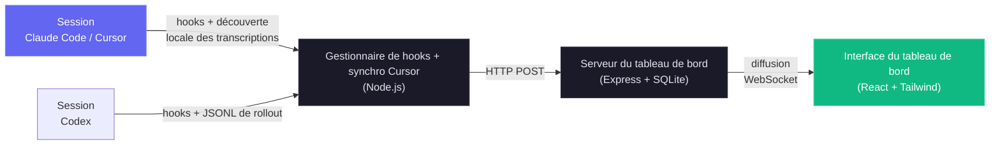

### Prise en charge de Cursor

Cursor ne demande aucun choix de configuration séparé : sélectionner **Claude Code** sur l'écran d'accueil active aussi la surveillance de Cursor. Un observateur du système de fichiers découvre `~/.cursor/chats/*/<session>/meta.json` dès que `agent` démarre, avant même que Cursor ne crée une transcription ; les modifications de `prompt_history.json` mettent à jour la carte de session, l'état en cours et la conversation dès qu'un prompt est soumis. Quand `~/.cursor/projects/*/agent-transcripts` arrive, le tableau de bord le fusionne dans la conversation en attente sans dupliquer le tour de l'utilisateur, enrichit les titres, projets, tours et sous-agents natifs, et conserve un instantané des JSONL principaux et des sous-agents pour que la conversation reste disponible après que Cursor a nettoyé son propre historique.

Les cartes Cursor reçoivent des titres natifs `Cursor · <title>` et des sous-titres de projet, de tours et de sous-agents. Les coûts utilisent une table **Tarifs Cursor** dédiée et modifiable dans les paramètres (couvrant Cursor Grok 4.6/4.5, Composer 2.5 et le catalogue publié des modèles tiers) au lieu d'emprunter les tarifs de Claude ou de Codex. Surchargez la racine source avec `DASHBOARD_CURSOR_HOME` ; ajustez le sondage de secours avec `DASHBOARD_CURSOR_SYNC_MS` (`0` ne désactive que l'analyse périodique ; l'observation en direct du système de fichiers reste active).

En plus du tableau de bord de surveillance en temps réel, le projet inclut une implémentation de serveur MCP local dans `mcp/` qui expose un catalogue d'outils pour inspecter et gérer le tableau de bord lui-même, ce qui facilite l'intégration de ses opérations directement dans vos workflows Claude Code et Codex. Il comprend aussi une couche d'extensions d'agent, qui fournit des plugins, skills et sous-agents Claude Code et Codex pour interagir avec le tableau de bord, l'analytique et l'intelligence des workflows.

### Internationalisation (i18n)

L'interface intègre le changement de langue pour l'anglais (`en`), le chinois (`zh`), le vietnamien (`vi`), le coréen (`ko`), l'espagnol (`es`), le français (`fr`), l'allemand (`de`), le portugais (`pt`) et l'italien (`it`). Un menu déroulant de langue personnalisé évite que le sélecteur n'encombre la barre latérale à mesure que des langues s'ajoutent. Les ressources linguistiques sont chargées par namespace et conservées dans le stockage du navigateur pour une préférence stable d'un rechargement à l'autre.

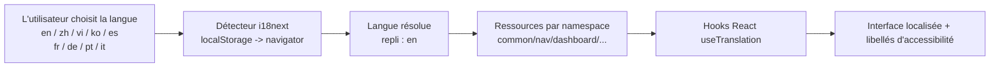

Pour l'architecture complète et les consignes d'exploitation, voir [docs/I18N.md](./docs/I18N.md).

### Interface utilisateur

Livré avec un thème sombre soigné, un design adaptatif et une navigation intuitive pour explorer l'activité de vos agents :

<p align="center">
  
  <br>
  <em>📡 <strong>Tableau de bord · Surveillance</strong> — statistiques de synthèse, cartes des agents actifs et flux d'activité récente</em>
</p>

<p align="center">
  
  <br>
  <em>📋 <strong>Avancement des tâches · Aperçu</strong> — les cartes d'agents du tableau de bord et les lignes de Sessions réutilisent le même petit anneau d'achèvement à côté du statut ; le survol ou le focus ouvre un aperçu, par responsable, du travail en cours et de l'état des tâches</em>
</p>

<p align="center">
  
  <br>
  <em>🩺 <strong>Tableau de bord · Santé</strong> — anneau du score de santé global, anneau du moteur de stockage, jauges de succès du cache, d'erreurs et de réussite, barres d'invocation des outils, efficacité des sous-agents, répartition des tokens par modèle et statistiques de compaction, le tout rafraîchi automatiquement toutes les 5 s</em>
</p>

<p align="center">
  
  <br>
  <em>📋 <strong>Tableau Kanban (agents)</strong> — agents regroupés par statut sur 4 colonnes : En cours / En attente / Terminé / Erreur. La colonne jaune En attente fait ressortir les sessions bloquées sur une saisie de l'utilisateur (demandes de permission, fin de tour ou attente sur un prompt vierge) ; survolez un badge En attente pour savoir <em>pourquoi</em> (Saisie requise / Tour terminé / Au prompt / Interrompu). Chaque carte affiche d'un coup d'œil le modèle, le coût et l'outil en cours.</em>
</p>

<p align="center">
  
  <br>
  <em>🗂️ <strong>Tableau Kanban (sessions)</strong> — sessions regroupées par statut sur 5 colonnes : Actives / En attente / Terminées / Erreur / Abandonnées, à basculer depuis la même page. Survolez un en-tête de colonne pour une infobulle expliquant la transition de cycle de vie.</em>
</p>

<p align="center">
  
  <br>
  <em>📂 <strong>Sessions</strong> — tableau paginé côté serveur, avec recherche et filtres, de chaque session enregistrée avec coût, modèle, nombre d'agents et durée ; le sélecteur de projets prend en charge la sélection multiple avec recherche et le tri utilise un menu personnalisé</em>
</p>

<p align="center">
  
  <br>
  <em>🤖 <strong>Détail de la session · Agents</strong> — tuiles de synthèse en temps réel (événements, appels d'outils, sous-agents, compactions, erreurs, durée), barres des outils les plus utilisés, répartition par type de sous-agent, flux de tokens et arbre hiérarchique des agents</em>
</p>

<p align="center">
  
  <br>
  <em>✅ <strong>Avancement des tâches · Détail de la session</strong> — le suivi complet par responsable réunit un anneau d'achèvement segmenté, la tâche active, une barre d'achèvement, la répartition par responsable et une liste de tâches paginée à 10 lignes par page</em>
</p>

<p align="center">
  
  <br>
  <em>💬 <strong>Détail de la session · Conversation</strong> — visionneuse de transcription en direct avec rendu Markdown, blocs de code colorés (numéros de ligne + copie), appels d'outils stylés par outil, pastilles de commandes slash avec leur sortie TUI capturée et marqueurs de renommage de session sur place</em>
</p>

<p align="center">
  
  <br>
  <em>🔬 <strong>Détail de la session · Chronologie</strong> — chronologie des événements avec filtres multidimensionnels, regroupement Pre/Post par `tool_use_id` et rendus de payload adaptés à chaque outil</em>
</p>

<p align="center">
  
  <br>
  <em>📰 <strong>Flux d'activité</strong> — journal d'événements en temps réel avec pause / reprise, regroupement, filtres multidimensionnels et un bouton « Session → » sur chaque ligne</em>
</p>

<p align="center">
  
  <br>
  <em>📊 <strong>Analytique</strong> — consommation de tokens par modèle, fréquence des outils, carte thermique d'activité et tendances des sessions avec indicateur en ligne / hors ligne ; les légendes longues se paginent tandis que les courtes restent inchangées</em>
</p>

<p align="center">
  
  <br>
  <em>🔀 <strong>Workflows</strong> — DAG d'orchestration des agents, diagrammes de Sankey de l'exécution des outils, réseaux de collaboration, légendes générées à partir des données et bornées, et 11 sections interactives d'intelligence des workflows</em>
</p>

<p align="center">
  
  <br>
  <em>🧬 <strong>Exécutions de workflows (page Workflows)</strong> — les « workflows dynamiques » lancés par l'outil <code>Workflow</code>, reconstitués à partir des journaux d'exécution sur disque : statut, nombre d'agents, tokens et appels d'outils, dépliables en un détail par agent (phase, état, tokens, outils, durée) avec des aperçus de résultats lisibles</em>
</p>

<p align="center">
  
  <br>
  <em>🧬 <strong>Exécutions de workflows · dépliées</strong> — une exécution ouverte : filtres de phase cliquables et colorés, tableau des métriques par agent et liste complète d'éléments de résultat cliquables qui dévoilent le prompt et le résultat complets de chaque agent</em>
</p>

<p align="center">
  
  <br>
  <em>🧬 <strong>Exécutions de workflows (détail de session)</strong> — les mêmes flottes rattachées à la session qui les a lancées, pour voir directement les sous-agents de workflow dynamique d'une session et le coût en tokens qui y est intégré</em>
</p>

<p align="center">
  
  <br>
  <em>🧰 <strong>Configuration des agents</strong> — basculez entre l'explorateur complet de Claude Code et un espace Codex en direct pour les valeurs par défaut, modèles, profils, MCP, projets, skills, règles, hooks, plugins et instructions. Les aperçus Codex masquent les secrets ; sa configuration, ses hooks, règles, skills et instructions gérés par l'utilisateur se modifient en toute sécurité, avec sauvegardes.</em>
</p>

<p align="center">
  
  <br>
  <em>🧰 <strong>Explorateur de configuration Codex</strong> — l'espace Codex réunit <code>config.toml</code>, les modèles du compte, les profils, serveurs MCP, projets, skills, hooks, règles, plugins et instructions. Modifiez les fichiers utilisateur pris en charge avec des sauvegardes horodatées ; <code>config.toml</code> est en modification seule.</em>
</p>

<p align="center">
  
  <br>
  <em>🧩 <strong>Explorateur de configuration Claude · Skills</strong> — l'onglet Skills liste chaque skill découverte (utilisateur, projet et plugin) avec sa description et sa source, permet la recherche sur l'ensemble et ouvre n'importe quel fichier de skill pour une modification sûre, sauvegardée avec horodatage</em>
</p>

<p align="center">
  
  <br>
  <em>▶️ <strong>Lancer un agent</strong> — choisissez Claude Code ou Codex à chaque ouverture du lanceur. Claude conserve les contrôles Conversation / Ponctuel ; Codex démarre un fil natif interactif de l'app-server avec ses propres contrôles d'approbation et de sandbox. Les modèles Codex proviennent du catalogue de la CLI connectée, tandis que Claude liste les modèles observés et ses alias pris en charge.</em>
</p>

<p align="center">
  
  <br>
  <em>💬 <strong>Lancer un agent · flux en direct</strong> — les événements stream-json de Claude et ceux de l'app-server Codex s'affichent tous deux comme une conversation, raisonnement, commandes, modifications de fichiers et activité des outils compris. Les exécutions du tableau de bord permettent de laisser un agent travailler en arrière-plan et de s'y rattacher plus tard.</em>
</p>

<p align="center">
  
  <br>
  <em>⚙️ <strong>Paramètres</strong> — règles de tarification des modèles, état d'installation des hooks, gestion des données, préférences de notification et informations système</em>
</p>

<p align="center">
  
  <br>
  <em>🔔 <strong>Paramètres · Alertes</strong> — moteur d'alertes à base de règles et webhooks sortants au même endroit : règles d'alerte (motif d'événement / inactivité / agent bloqué / seuil de tokens) avec délai de réarmement par règle, flux en direct des alertes déclenchées et 14 fournisseurs de webhooks intégrés (Slack, Discord, Teams, Google Chat, Mattermost, Rocket.Chat, Telegram, PagerDuty, Opsgenie, Splunk On-Call, Zapier, Make, n8n, Pipedream), plus un point de terminaison JSON générique avec signature HMAC facultative</em>
</p>

<p align="center">
  
  <br>
  <em>🛰️ <strong>Paramètres · Sources de données distantes</strong> — récupérez l'activité de Claude Code et de Codex d'autres machines via SSH : définissez au besoin des chemins distincts pour le home Claude distant et le home Codex distant, testez chaque fournisseur, synchronisez à la main ou par un poller en arrière-plan, et basculez la portée globale des données entre local, toutes les sources ou une machine précise, avec des badges de source par session</em>
</p>

<p align="center">
  
  <br>
  <em>⌘ <strong>Palette de commandes</strong> — <kbd>Cmd/Ctrl+K</kbd>, depuis n'importe où, ouvre l'unique lanceur du tableau de bord. Une seule requête couvre neuf groupes : commandes récentes, les neuf pages, recherche de sessions en direct côté serveur, actions propres à la page courante, chaque répertoire de projet connu, sous-vues de pages et filtres de listes, les 13 sections des Paramètres, les 12 onglets de Configuration des agents, et des actions pour les préférences, la portée des données et la langue. La correspondance repose sur les sous-séquences, avec surlignage des caractères trouvés : <code>mcp</code> trouve ainsi « MCP servers »</em>
</p>

La barre latérale donne un accès rapide aux neuf pages — Tableau de bord, Tableau Kanban, liste des Sessions, Flux d'activité, Analyses, Workflows, Configuration des agents, Lancer un agent et Paramètres. Chaque page est conçue pour vous offrir une vision approfondie de l'activité de vos agents Claude Code, avec des mises à jour en temps réel et des visualisations riches.

---

## Fonctionnalités

Le tableau de bord offre un ensemble complet de fonctionnalités pour surveiller et analyser vos sessions et agents Claude Code :

> **Cursor est intégré :** CCAM découvre l'historique natif de Cursor dans `~/.cursor/projects/*/agent-transcripts`, l'enrichit avec les métadonnées de `~/.cursor/chats`, le stocke sous le fournisseur distinct `cursor` et capture les conversations avant que Cursor ne nettoie ses fichiers. Cursor est inclus dès que la portée Claude Code du tableau de bord est sélectionnée. Les sources SSH distantes ne reflètent pour l'instant que les homes Claude Code et Codex ; montez ou exposez localement un home Cursor distant pour l'ingérer avec `DASHBOARD_CURSOR_HOME`.

| Fonctionnalité | Description |
|---|---|
| **Progression des tâches** | Suivi des tâches attribué par responsable, dérivé de l'état observable du fournisseur : événements Claude actuels `TaskCreate` / `TaskGet` / `TaskUpdate` / `TaskList` et de cycle de vie, ancien `TodoWrite`, et `update_plan` de Codex, direct ou enveloppé par unified-exec. Les sessions ayant un état de tâches affichent le même anneau compact et le même aperçu au survol/focus, rendu en portail, à côté du statut dans le tableau des Sessions et sur chaque carte d'agent du Tableau de bord ; le Détail de session affiche le panneau de progression complet avec segments de statut, travail en cours, répartition par responsable et lignes de tâches paginées par 10. La progression se limite au dernier travail de premier niveau : un nouveau tour humain Claude ou une nouvelle tâche Codex sans suivi émis efface l'état précédent, et l'état inachevé est abandonné quand ce tour/cette tâche se termine sans mise à jour finale. L'historique entièrement terminé reste visible. |
| **Tableau de bord** | Deux onglets conservés dans `localStorage` : **Surveillance** — statistiques générales (6 cartes), cartes des agents actifs avec hiérarchie repliable des sous-agents, et flux d'activité récente dont le nombre d'éléments s'adapte à la hauteur disponible via `ResizeObserver`. **Santé** — anneau du score composite de santé du système (pondéré : 0,4 × taux de succès + 0,25 × taux de succès du cache + 0,25 × (100 − taux d'erreur) + 0,1 × (100 − % du tas)), graphique en anneau du moteur de stockage avec la répartition des enregistrements, jauges de performance du cache / taux d'erreur / taux de succès, histogramme horizontal des invocations d'outils (top 8), barres d'efficacité des sous-agents, répartition des tokens par modèle et statistiques d'impact de la compaction. Toutes les métriques de santé se rafraîchissent toutes les 5 s depuis `/api/settings/info` et `/api/workflows`. Infobulles qui suivent le curseur, avec détection des bords de la fenêtre, sur chaque graphique |
| **Tableau Kanban** | Deux vues avec une bascule dans l'en-tête (conservée dans `localStorage`) : **Agents** — 4 colonnes (En cours / En attente / Terminé / Erreur) — et **Sessions** — 5 colonnes (Actives / En attente / Terminées / Erreur / Abandonnées). La colonne **En attente** correspond directement au statut persistant `waiting` des agents — positionné quand Claude Code attend à un prompt (session neuve, entre deux tours, ou bloqué sur une Notification d'autorisation) et qui passe à `working` dès que l'utilisateur reprend (UserPromptSubmit / PreToolUse). Chaque en-tête de colonne affiche une infobulle `?` expliquant les transitions du cycle de vie. Les cartes sont récupérées par statut persistant depuis le serveur (en pratique sans limite par statut), puis paginées côté client à 10 cartes par colonne avec un bouton « Afficher plus ». L'abonnement WS se limite à la vue active (trames `agent_*` ou `session_*`) pour que les mises à jour hors vue ne déclenchent pas de rechargement. Les badges En attente exposent l'`awaiting_reason` de la ligne dans une infobulle — **Saisie requise** (`notification`), **Tour terminé** (`stop`), **Au prompt** (`session_start`), **Interrompu** (`interrupted`) — uniquement en infobulle sur les cartes compactes pour laisser la place aux titres ; les surfaces plus larges (tableau des Sessions, en-tête du détail de session) affichent aussi la raison en ligne sous forme de puce imbriquée, les raisons urgentes (demandes d'autorisation, interruptions) dans un ambre plus vif |
| **Sessions** | Tableau recherchable, filtrable et **paginé côté serveur** de chaque session enregistrée. Chaque clic de page appelle `/api/sessions?status=&q=&limit=10&offset=…`, si bien que le calcul des coûts ne porte que sur la page visible — indépendamment du nombre de sessions en base. La première page intègre aussi la même ligne de démarrage Codex locale, en mémoire, affichée sur le Tableau de bord et le Kanban ; elle est visible immédiatement mais non navigable tant qu'un identifiant de session durable ne la remplace pas, et elle ne modifie ni les totaux durables ni la pagination. La zone de recherche (`q=`) fait une correspondance insensible à la casse sur `id` / `name` / `cwd` côté serveur avec un anti-rebond de 300 ms, et la réponse contient un compteur `total` pour le paginateur. Filtre de statut, recherche et pagination se combinent. Le **nom** lisible de chaque session est lu dans la transcription et synchronisé en temps réel — un titre explicite issu de `/rename`, `claude -n` ou du `Ctrl+R` du sélecteur (la ligne JSONL `custom-title`) l'emporte toujours ; sinon l'`ai-title` généré automatiquement prend le relais ; sinon le **premier prompt utilisateur** de la session (tronqué, en ignorant le bruit des résultats d'outils et des commandes slash) remplit le nom provisoire ainsi que le nom et la tâche provisoires de l'agent principal — les sessions qui n'obtiennent jamais de titre (y compris importées) indiquent donc quand même ce qu'elles font ; le tableau de bord affiche ce nom (ou, à défaut, l'identifiant court) sur les cartes, le Tableau de bord, le Flux d'activité et le sélecteur de reprise de Lancer un agent. |
| **Détail de session** | Panneau de synthèse en temps réel par session avec bannière de l'agent actif (outil + tâche en cours), six compteurs (événements avec leur débit par minute, appels d'outils, sous-agents, compactions, erreurs, durée qui défile), barres des outils les plus utilisés, répartition par type de sous-agent, bande empilée du flux de tokens et nuage de pastilles des types d'événements — le tout rafraîchi en direct à chaque événement de hook. En dessous : arbre hiérarchique des agents, chronologie complète des événements avec filtres multidimensionnels (statut, type d'événement, outil, agent, recherche textuelle, période), regroupement Pre/Post par `tool_use_id`, bloc de résumé lisible, rendus d'entrée/réponse adaptés à l'outil (terminal pour Bash, diff unifié pour Edit, code numéroté pour Read/Write, liste de correspondances pour Grep, carte clé/valeur pour les outils MCP), et un onglet Conversation qui affiche les transcriptions — y compris les messages tapés en plein tour (mis en file pendant que Claude travaillait encore), placés là où Claude les a réellement reçus, avec les notifications du harness attribuées à System — avec du Markdown (titres, listes, citations, tableaux, listes de tâches), des blocs de code avec coloration syntaxique (js/ts, python, json, bash, html, css, sql, yaml, diff), numéros de ligne et copie dans le presse-papiers, et des appels d'outils stylés par outil (Bash → terminal, Edit → ancien/nouveau côte à côte, Write → étiquette de fichier, Read → puce de chemin, Grep → carte de motif). Quand la session attend l'humain, une **bannière jaune d'attente de saisie** sous l'en-tête indique l'`awaiting_reason`, son explication et depuis combien de temps la session attend (point pulsant + temps relatif) ; le badge En attente de l'en-tête porte la même raison sous forme de puce imbriquée |
| **Flux d'activité** | Journal d'événements diffusé en temps réel avec pause/reprise, filtres multidimensionnels (même barre d'outils que le Détail de session, plus un filtre Session), pagination « Charger plus » pilotée par le serveur, rafraîchissement en direct avec anti-rebond qui respecte les filtres et conserve la taille de page chargée, bascule de regroupement, préfixe d'origine projet › session › sous-agent, un bouton « Session → » par ligne, et un badge de statut par ligne issu de l'unique table de correspondance partagée avec le Tableau de bord et le Détail de session (types d'événements Claude comme Codex) |
| **Analyses** | Utilisation des tokens, fréquence des outils, carte de chaleur d'activité (centrée, alignée sur les jours de la semaine à partir du dimanche, infobulles avec le nom du jour), tendances des sessions, indicateur de connexion en ligne/hors ligne. Pendant le chargement des données d'analyse, la zone des graphiques (et pas seulement les tuiles de statistiques) affiche des **squelettes pulsants** qui reproduisent la mise en page des graphiques, pour que la page n'affiche jamais de graphiques vides ou à zéro. Les longues légendes des pages Analyses et Workflows sont paginées ; celles qui tiennent sur une page restent inchangées |
| **Palette de commandes** | Lanceur global `Cmd/Ctrl+K` sur **l'ensemble** du tableau de bord. Une seule requête couvre neuf groupes : commandes exécutées récemment, les neuf routes de la barre latérale (comparées sur leurs libellés **traduits**, donc valables dans chaque langue), recherche de sessions en direct côté serveur via `/api/sessions?q=` (avec anti-rebond et respect de la portée, pour ne jamais garder côté client un index périmé de milliers de sessions), les actions propres à la page courante, chaque répertoire de projet connu, chaque sous-vue de page et filtre de liste, les 13 sections des Paramètres, les 12 onglets de Configuration des agents, et des actions pour les préférences, la portée des données, la langue, l'historique et les opérations de page. Le classement repose sur la correspondance par sous-séquence avec surlignage des caractères trouvés : `mcp` trouve « MCP servers » et `kbrd` trouve « Kanban Board » ; un `>` / `@` / `#` en tête restreint aux actions / pages / sessions. Entièrement pilotable au clavier — flèches, `Home`/`End`, `PageUp`/`PageDown`, `Tab` entre les groupes, `Enter`, `Escape` — et se dégrade sans bruit si la requête de sessions échoue. Faute de bouton permanent, la découverte passe par des indices qui se retirent d'eux-mêmes : l'écran d'accueil nomme le raccourci au premier lancement et une puce `⌘K` figure dans les champs de recherche des Sessions et de Configuration des agents, les deux disparaissant définitivement dès la première ouverture de la palette. Une commande affichée est une commande qui fonctionne : les actions de page sont lues dans le registre de gestionnaires actif, jamais listées là où elles ne feraient rien, et tout ce qui change un état sans vous déplacer se confirme par un toast. Les opérations destructives sont volontairement absentes : la palette y mène, sans jamais les exécuter |
| **Un seul raccourci** | `Cmd/Ctrl+K` est le seul raccourci que réserve le tableau de bord, et il l'est même quand un champ a le focus. Une version antérieure proposait toute une couche de raccourcis — séquences de navigation préfixées par `g`, touches de page, aide-mémoire `?`, surimpression d'indices au maintien d'un modificateur — retirée à dessein : une séquence est un mode caché avec minuterie, appuyer sur `g` donnait l'impression que rien ne se passait, et deux mécanismes de navigation dispersaient la mémoire musculaire sans rien apporter, puisque la palette atteint déjà chaque page par recherche floue. Tabby conserve son `Cmd/Ctrl+B` historique |
| **Mises à jour en direct** | Push WebSocket — pas de polling, mise à jour instantanée de l'interface |
| **Découverte automatique** | Les sessions et agents sont créés automatiquement à partir des signaux des fournisseurs. Claude Code crée immédiatement une carte **En attente** au `SessionStart`. Codex expose d'abord une carte **En attente** locale, en mémoire, dès que son processus TUI interactif démarre, y compris avant qu'il n'attribue un identifiant de session stable. Un hook, une ligne de fil en direct ou un rollout crée ensuite la session durable et remplace cette carte temporaire. Si l'utilisateur ouvre le sélecteur Resume de Codex et choisit un fil existant, CCAM détecte le rollout ou le verrou d'écriture déjà ouvert par ce PID Codex précis et bascule vers la session reprise durable avant le premier nouveau message. Ce relais n'adopte qu'un fil dont l'enregistrement durable est déjà terminé et ne s'exécute qu'une fois par processus : un tour que Codex pilote encore garde l'état de travail et la raison d'attente rapportés par son propre rollout. La carte antérieure à l'identité n'est jamais écrite dans SQLite, l'historique, les analyses, la tarification, les workflows, les alertes ni les notifications de fin, et elle disparaît quand le processus se termine. |
| **Import de l'historique** | L'import d'historique, conscient du fournisseur, récupère les transcriptions Claude Code de `~/.claude/` et les JSONL de rollout Codex de `~/.codex/sessions`. Chaque onglet a son propre chemin par défaut, ses instructions, son analyse de dossier et son flux de téléversement ; tous deux réutilisent leur logique d'ingestion en direct, préservent le décompte des tokens, coûts et outils, et sont idempotents. Les rollouts Codex externes sont copiés dans le stockage du tableau de bord pour que leur conversation reste disponible après la suppression de l'archive ou du dossier source. |
| **Hiérarchie des sous-agents** | Arbre parent-enfant repliable sur le Tableau de bord et le Détail de session. Les agents ayant des sous-agents affichent des chevrons de dépliage ; les agents feuilles affichent un point. Se déplie automatiquement quand des sous-agents sont actifs |
| **Agents en arrière-plan** | Suit correctement les sous-agents passés en arrière-plan, sans les marquer terminés trop tôt |
| **Attribution des outils des sous-agents** | Les appels d'outils internes aux sous-agents (Read, Bash, Edit, Grep, …) n'existent que dans les fichiers JSONL propres à chaque sous-agent — Claude Code n'émet aucun hook pour eux. À chaque `SubagentStop`, le tableau de bord lance sans attendre une passe `scanAndImportSubagents` qui analyse chaque `subagents/agent-*.jsonl`, associe les blocs `tool_use` à leur `tool_result` via `tool_use_id`, et émet des événements `PreToolUse` + `PostToolUse` sous l'`agent_id` du sous-agent. Idempotent (dédoublonnage `data LIKE '%"tool_use_id":"X"%'`), il fusionne avec une ligne de sous-agent créée en direct par un hook quand elle correspond par type + heure de début à 30 s près, si bien qu'aucune ligne parallèle `<sid>-jsonl-*` n'est créée. Le même chemin s'exécute lors de l'import au démarrage de `npm run setup` pour un rattrapage historique complet — les sessions antérieures au tableau de bord obtiennent des chronologies d'outils complètes par sous-agent. Le Flux d'activité et le Détail de session affichent la chaîne parente sous la forme `main › coder › explorer` pour les sous-agents imbriqués. Cette chaîne est reconstituée de façon fiable par `reconcileSubagentParents` : une ligne de sous-agent est d'abord insérée à plat sous l'agent principal (un événement de hook ou un fichier JSONL isolé ne porte pas l'identité du lanceur), puis le lanceur est retrouvé dans le résultat de l'outil Task de chaque transcription de sous-agent (`toolUseResult.agentId`, capturé comme `spawnedChildren`), de sorte qu'un sous-agent qui lance ses propres sous-agents s'imbrique sous son **vrai** lanceur au lieu d'être aplati d'un niveau sous l'agent principal. Idempotent et additif — il ne fait que repointer `parent_agent_id`, sans jamais insérer ni supprimer de lignes — il s'exécute pendant la même analyse `SubagentStop`, qui renvoie un compteur `reparented` pour que le tableau de bord recharge même quand seul le rattachement a changé la forme de l'arbre |
| **Suivi des coûts** | Estimation des coûts par modèle avec règles de tarification configurables et détail par session. Prend en charge des **tarifs de lancement limités dans le temps** (`intro_*` + `intro_until` sur une règle de tarification) : l'usage jusqu'à la date limite incluse est facturé au tarif de lancement, et l'usage postérieur au tarif standard, pour que les offres temporaires restent justes pour l'usage passé **et** futur — le point de terminaison des coûts valorise l'usage de chaque jour au tarif en vigueur ce jour-là. Claude Sonnet 5 reste à 2 $/10 $ par million de tokens d'entrée/sortie en tarif standard. **Les tarifs de lancement se modifient entièrement dans les Paramètres** — l'éditeur de tarification des modèles expose une date de fin de promotion et des prix de lancement par catégorie (entrée / sortie / lecture de cache / écriture de cache 5 min et 1 h), si bien qu'une future promotion de lancement ne demande aucune modification de code, juste une saisie. **Les cartes de sous-agents affichent le coût PROPRE de chaque sous-agent** (dérivé de l'usage de tokens de sa transcription et valorisé aux tarifs actuels), et non le total de la session — une carte d'agent principal représente toute la session et en affiche le total, tandis qu'une carte de sous-agent n'affiche que ce qu'il a dépensé, pour qu'elle ne donne plus l'impression trompeuse d'avoir coûté toute la session. Un décompte des tokens conscient de la compaction préserve les totaux au fil des compressions de contexte. Les lectures de transcriptions sont mises en cache avec des mises à jour incrémentales par décalage d'octets pour une extraction efficace des tokens |
| **Cache des transcriptions** | Extraction en temps réel depuis les transcriptions JSONL : tokens, compactions, erreurs d'API (entrées `isApiErrorMessage` stockées comme événements `APIError`), durées des tours (stockées comme événements `TurnDuration`), nombre de blocs de réflexion et compléments d'usage (service_tier, speed, inference_geo). Les durées des tours portent des identités de transcription stables ; les analyses complètes réparent les anciennes lignes dupliquées et les totaux de métadonnées gonflés, tandis que les analyses de fin plafonnées restent en ajout seul. Les tableaux extensibles de chaque entrée sont plafonnés par la fin à `TRANSCRIPT_CACHE_MAX_ARRAY_LEN` (par défaut `1000`, configurable) — pendant l'analyse comme à la finalisation — pour que même une session qui tourne des jours ne fasse pas grossir sans limite une entrée du cache. Chaque entrée ne stocke que `{mtimeMs, size, bytesRead, result}`, sans copie fantôme des mêmes données au niveau supérieur et dans `result`. Les métadonnées de session sont enrichies de ces champs en temps réel |
| **Notifications** | Chaîne Web Push (VAPID) complète pour une livraison fiable. Elles arrivent même quand l'onglet est en arrière-plan ou que le navigateur est fermé. Configurées explicitement pour le son sous macOS. Interrupteurs configurables par événement, avec gestion des abonnements |
| **Alertes** | Moteur d'alertes à base de règles — entièrement configuré dans **Paramètres → Alertes et notifications**, un centre de contrôle à onglets **Règles / Canaux / Activité** (pas de page séparée). Définissez des règles d'alerte avec quatre types de conditions — **motif d'événement** (correspondance sur le type d'événement / le nom d'outil / le texte du résumé, avec éventuellement N événements correspondants dans une fenêtre de temps, p. ex. « plus de 5 erreurs en 2 minutes »), **inactivité** (session active sans événement depuis N minutes), **agent bloqué** (agent resté en `working`/`waiting` sans activité depuis N minutes) et **seuil de tokens** (total de tokens de la session au-delà d'une limite). Les règles pilotées par événement sont évaluées côté serveur à chaque ingestion de hook (après la transaction d'ingestion — les alertes ne peuvent jamais ralentir ni faire échouer la livraison des hooks) ; les règles temporelles s'exécutent lors d'un balayage toutes les 60 s. Les alertes déclenchées sont persistées dans `alert_events` avec **dédoublonnage par délai de réarmement** par règle + par session (300 s par défaut), diffusées en messages WebSocket `alert_triggered` et affichées dans le flux en direct de l'onglet **Activité**, avec acquittement / acquittement global, un filtre « non acquittées seulement » et des liens « Voir la session » par alerte. Les règles s'activent/désactivent et suppriment leur historique en cascade. Les alertes déclenchées sont aussi diffusées vers des **cibles de webhook universelles** configurées dans l'onglet **Canaux** — **14 fournisseurs intégrés** plus un point de terminaison générique : **Slack**, **Discord**, **Microsoft Teams**, **Google Chat**, **Mattermost**, **Rocket.Chat** (charges utiles de chat natives) ; **Telegram** (Bot API), **PagerDuty** (Events API v2), **Opsgenie** (Alert API + authentification GenieKey), **Splunk On-Call** (REST VictorOps) ; et **Zapier**, **Make**, **n8n**, **Pipedream** ou tout point de terminaison **générique** (enveloppe JSON propre avec signature **HMAC-SHA256** facultative et en-têtes personnalisés). Chaque fournisseur est décrit par un registre côté serveur qui déclare son formateur de charge utile, la façon dont son URL est résolue (certains la dérivent des identifiants — p. ex. Telegram à partir du jeton du bot, Opsgenie à partir de la région —, d'autres ont une valeur par défaut) et les champs d'identifiants que l'interface affiche. Les cibles acceptent une restriction facultative par règle, une sonde synchrone « Envoyer un test » et un journal des livraisons. La livraison s'exécute détachée du chemin d'alerte, avec délai d'expiration et nouvelles tentatives à recul borné, et ne peut donc jamais ralentir ni bloquer la surveillance ; les URL cibles, secrets et champs d'identifiants sont stockés côté serveur et jamais renvoyés par l'API (masqués/caviardés dans chaque réponse) |
| **Notification de mise à jour** | Le serveur exécute périodiquement un `git fetch` non bloquant et compare le checkout local à `origin/master`/`origin/main`/`origin/HEAD`. Quand l'amont est en avance, l'interface affiche une fenêtre avec la commande exacte `git pull && npm run setup` et un bouton **Copier** en un clic ; la barre latérale reçoit un bouton permanent « Rechercher des mises à jour » avec badge en direct. Le tableau de bord ne tire ni ne redémarre jamais de lui-même — l'utilisateur lance la commande dans un terminal —, si bien que le mécanisme ne peut ni casser les sessions de dev, ni perturber la supervision pm2/systemd/Docker, ni laisser de processus orphelins |
| **Paramètres** | Informations système, état des hooks, gestion de la tarification des modèles, préférences de notification, export **et restauration** des données (le mode **Restaurer une sauvegarde** du panneau Import de l'historique accepte un export `.json` jusqu'à 25 Mio et le réimporte de façon idempotente sans écraser les lignes existantes, pour regrouper l'historique de plusieurs machines dans un même tableau de bord), nettoyage des sessions. La section Tarification des modèles sépare **Tarification des modèles Anthropic Claude** et **Tarification des modèles OpenAI GPT**, avec des en-têtes identiques, des boutons **Réinitialiser les valeurs par défaut** et **Ajouter un modèle** propres à chaque fournisseur, et des bulles d'aide qui expliquent la recherche de règle par première correspondance, la syntaxe de joker `%` à la SQL, la mise à jour manuelle des prix et les réserves sur les tarifs d'API. La bulle GPT explique aussi les unités en USD par million de tokens, la frontière Short/Long de 272K pour les tarifs Standard et Fast, et pourquoi les paliers non publiés restent sans prix plutôt qu'estimés. Le contrôle **Données du tableau de bord** recharge immédiatement sessions, agents, événements, tokens, workflows, analyses et coûts pour Claude Code, Codex ou les deux. Les champs distincts du home Claude Code et du home Codex sont entièrement pilotés par l'i18n et s'enregistrent à chaud ; enregistrer celui de Codex réarme la surveillance des rollouts en direct et analyse sa nouvelle arborescence. |
| **Lancer un agent + Configuration des agents** | `/run` commence par un choix Claude Code / Codex et garde la bascule de fournisseur à côté de son statut En direct. Les exécutions Claude conservent leurs modes sans interface et conversation stream-json ; les exécutions Codex utilisent le protocole local `app-server` de la CLI pour un vrai fil interactif, la politique native d'approbation/sandbox, la reprise, l'arrêt, la sortie en direct et le rattachement. Les choix de modèles Codex viennent directement de la CLI connectée, si bien que les nouveaux modèles ne demandent aucune mise à jour du tableau de bord ; Claude affiche ses alias durables et les modèles observés localement, car sa CLI n'a pas de commande pour lister les modèles. `/cc-config` associe l'explorateur Claude Code modifiable déjà établi à un espace Codex pour les valeurs de configuration par défaut, le cache des modèles, les profils, MCP, projets, skills, règles, hooks, plugins installés et fichiers d'instructions. Ses aperçus normaux masquent les secrets ; l'éditeur local explicite prend en charge `config.toml`, `hooks.json`, les règles utilisateur, skills et instructions avec enregistrements atomiques et sauvegardes horodatées obligatoires, tout en avertissant qu'il ne peut pas valider la syntaxe. Les commandes de profil Codex et les chemins d'artefacts gérés se copient en un clic, et les cartes de plugins s'appuient sur le registre des plugins installés de Codex plutôt que d'afficher des dossiers de cache. Les deux explorateurs se rafraîchissent via leur surveillance du système de fichiers propre à chaque fournisseur. |
| **Configuration des agents Codex** | La partie Codex de Configuration des agents lit le catalogue complet des modèles du compte local, sans la limite d'aperçu générique qui pouvait afficher à tort zéro modèle, et inclut toujours les surcharges de base et de profil. Créez directement dans l'application des surcouches Codex standard `<name>.config.toml` ; chaque carte copie en un clic sa commande exacte `codex --profile <name>` et ouvre un éditeur protégé. Les chemins d'aperçu sont canonicalisés avant les contrôles de confinement. L'éditeur refuse les composants de chemin en lien symbolique sous la racine de confiance, vérifie le confinement canonique du parent et refuse le contenu d'aperçu `[redacted]`. Profils, hooks, règles, skills et instructions partagent les actions à la Claude **Voir la source / Copier le chemin / Modifier / Supprimer**. Chaque suppression autorisée est confirmée et sauvegardée au préalable (une skill conserve tout son répertoire) ; `config.toml` est définitivement en modification seule. |
| **Serveur MCP (local)** | Serveur MCP local complet dans `mcp/` avec trois modes de transport (stdio, HTTP+SSE, REPL interactif) et 97 outils typés répartis en 16 modules de domaine. Il couvre l'observabilité, sessions/agents/événements par portée, transcriptions et images, tarification Claude/Cursor/GPT, workflows, alertes, webhooks, imports et restauration de sauvegarde, configuration Claude/Codex, Lancer un agent, sources distantes, hooks/homes/mises à jour, push et maintenance. Les modes protocole et REPL partagent un même catalogue validé, avec des cibles limitées à localhost et des garde-fous à paliers pour les mutations et actions destructives. Le HTTP direct en loopback peut porter un jeton bearer ; les alias d'hôte de conteneur avec jeton exigent HTTPS. Les redirections sont refusées, les téléversements plafonnés à 50 Mio par fichier et 100 Mio par appel, les réponses binaires à 10 Mio et la restauration de sauvegarde à 25 Mio |
| **Workflows** | Page de visualisation propulsée par D3.js avec 11 sections interactives : DAG d'orchestration des agents, diagramme de Sankey de l'exécution des outils, réseau de collaboration, efficacité des sous-agents (sparklines par jour de la semaine avec infobulles rendues en portail qui échappent à l'`overflow:hidden` de la carte et se limitent à la fenêtre pour ne jamais être coupées), motifs de workflow détectés, flux de délégation entre modèles, carte de propagation des erreurs (barres horizontales avec badges de taux, répartition par type d'agent, cartes d'erreurs API/session), chronologie de la concurrence, nuage de points de la complexité des sessions, analyse de l'impact de la compaction (refondue en un histogramme clair des « sessions par nombre de compactions » avec titres d'axes, tuiles de statistiques — total / sessions concernées / moyenne / pic —, une ligne d'aide explicative et des infobulles par barre) et exploration par session. Le sous-titre aligné à droite de chaque section tient sur une seule ligne (points de suspension + titre au survol) pour qu'une longue traduction ne fasse jamais passer l'en-tête à la ligne. **Des infobulles riches et localisées partout :** le titre de chaque graphique porte une icône `i` qui ouvre une bulle structurée « Ce que cela montre / Comment le lire / Pourquoi c'est important » ; le survol des nœuds, arêtes, barres et bulles affiche des infobulles en plusieurs sections avec des interprétations déterministes qui dépendent des valeurs (p. ex. pourcentages de part de la source / de la cible, paliers de santé du taux de succès, descriptions des familles Opus / Sonnet / Haiku, profils temporels comme en début / en milieu / en fin de session). Chacune des six cartes de statistiques principales a une bulle d'information en bas à droite qui explique comment la métrique est calculée et ce que signifie sa valeur actuelle en langage courant. Les infobulles sont modifiées dans le DOM via une seule ref par graphique avec des replis `mouseleave` au niveau du conteneur, pour ne jamais traîner derrière le curseur ni rester collées après un nouveau rendu. Cliquer sur une ligne de **Motifs de workflow détectés** déplie sur place un panneau de détail avec la séquence complète des étapes, une grille de statistiques, un récit déterministe (détection de boucles, palier de fréquence) et une suggestion pratique. Les onglets de filtre de statut (Actifs seulement / Terminés / Tous) filtrent les 11 sections. Filtrage croisé, export JSON et rafraîchissement automatique en temps réel par WebSocket avec anti-rebond de 3 secondes. Un panneau **Exécutions de workflows** met en avant les « workflows dynamiques » — les flottes de sous-agents lancées par l'outil `Workflow` (et le `/loop` à rythme autonome) — qui n'émettent aucun hook et sont donc reconstituées à partir des journaux d'exécution sur disque (`workflows/wf_<runId>.json`) : chaque exécution montre ses phases et un détail par agent des tokens / appels d'outils / durée, avec détection en direct de l'état `running` avant l'écriture du journal et une sous-section liée sur chaque page de Détail de session |
| **Suivi des compactions** | Détecte les événements `/compact` dans les transcriptions JSONL et crée des agents et événements de compaction. Rattrape les anciennes compactions au démarrage. Un scanner périodique (cadence dérivée de `DASHBOARD_STALE_MINUTES`) repère les compactions même quand aucun hook ne se déclenche. Il lit le chemin de transcription de chaque session active directement dans `sessions.transcript_path` (renseigné par le gestionnaire de hooks au premier événement qui le porte, plus un rattrapage unique depuis `events`) au lieu d'un `SELECT DISTINCT json_extract(events.data, '$.transcript_path')` sur toute la table des événements — le balayage est donc en O(sessions actives) et reste peu coûteux sur une base mature. Il partage le cache des transcriptions, sans lecture de fichier en double. Les lignes de compaction synthétiques reçoivent l'horodatage de la transcription à la fois dans `started_at` et `ended_at`, pour une durée d'exactement 0 (la compaction est instantanée) ; une migration de réparation au démarrage corrige aussi les lignes existantes où `ended_at < started_at` (issue #156) |
| **Sous-sessions / sessions reprises** | Réactive automatiquement les sessions quand de nouveaux événements arrivent, gère correctement `/resume` et les sessions orphelines. Un balayage périodique (tous les ¼ de `DASHBOARD_STALE_MINUTES`, borné entre 60 s et 5 min) marque les sessions abandonnées qui échappent à la détection par événement |
| **Détection des sessions préexistantes** | Les sessions déjà en cours au démarrage du serveur sont importées comme « actives » (d'après la modification récente du fichier JSONL). Les événements Stop réactivent aussi les sessions importées terminées/abandonnées, si bien que le premier hook d'une session en cours la fait toujours apparaître sur le tableau de bord |
| **Synchronisation continue des projets** | L'import automatique de `~/.claude/projects` au démarrage n'a lieu qu'une fois (protégé par un marqueur) : un dossier de projet créé **après** le premier lancement — dont les sessions ne passent jamais par les hooks (p. ex. hooks désactivés côté hôte) — resterait invisible jusqu'à une nouvelle analyse manuelle. Une synchronisation en arrière-plan (`startSessionSync`) comble ce manque via trois déclencheurs partageant un même cache de mtime + un balayage unique fusionné : un balayage **immédiat** au démarrage, un **`fs.watch`** avec anti-rebond qui se déclenche dès qu'un nouveau fichier de session ou dossier de projet apparaît (récursif sous macOS/Windows ; racine + enfants directs sous Linux pour éviter les écueils de la surveillance récursive en espace utilisateur), et un **polling périodique** (`DASHBOARD_SESSION_SYNC_MS`, 30 s par défaut). Chaque balayage ne réanalyse que les fichiers dont le mtime a avancé et diffuse `session_created`/`session_updated` (plus l'agent principal) pour que l'interface se rafraîchisse en direct ; une session inchangée déjà en base est ignorée sans réanalyse, si bien que le coût d'un redémarrage reste en O(fichiers nouveaux/modifiés) |
| **Sources de données distantes** | Collecte en direct de Claude Code et Codex sur des machines distantes / multiples via SSH. Une source réplique indépendamment `~/.claude/projects` et `~/.codex/sessions` (plus le léger `session_index.jsonl` de Codex pour les titres renommés natifs) via **scp**, ou `wsl.exe` + `tar` pour des CLI hébergées dans WSL sur un hôte SSH Windows. Chaque étape isolée passe par l'importeur normal de son fournisseur et marque les lignes avec `sessions.source` ; une source est saine dès qu'un des fournisseurs est disponible, si bien que les machines Claude seul, Codex seul ou mixtes fonctionnent toutes. Le poller `DASHBOARD_REMOTE_SYNC_MS` de 15 s et les récupérations immédiates à l'ajout/réactivation diffusent `remote_source.status`, `remote_data.updated` et des mises à jour par session conscients du fournisseur. Le cycle de vie distant est réconcilié à partir de chaque transcription répliquée. Si un fournisseur est indisponible, en erreur ou bloqué en synchronisation au-delà de `DASHBOARD_STALE_MINUTES`, seules ses anciennes sessions distantes retombent dans le balayage d'inactivité ordinaire ; un fournisseur voisin sain reste géré par la réplication. Configurez des chemins facultatifs et indépendants **Home Claude distant** et **Home Codex distant** dans **Paramètres → Sources de données distantes**, ou utilisez `ccam remote-sources` ; l'authentification SSH reste entièrement côté hôte (aucun mot de passe ni secret stocké). |
| **Ingestion par push distant** | Le troisième chemin d'ingestion des données de session, pour la machine que SSH ne peut pas atteindre : un portable nomade derrière un NAT ou une connexion domestique en CGNAT **pousse** ses propres données de session vers le tableau de bord au lieu que celui-ci ne les tire. `POST /api/hooks/ingest-batch` accepte un lot par push — compteurs de tokens (chaque entrée est le total courant complet de ce compteur, comme lors d'une réanalyse de transcription), événements d'outils et durées de tours — et c'est la seule route du serveur destinée à être joignable depuis Internet. Elle est donc **désactivée tant que `REMOTE_PUSH_TOKEN` n'est pas défini** (`503 REMOTE_PUSH_NOT_CONFIGURED` sinon), protégée par son propre jeton plutôt que par `DASHBOARD_HOOK_TOKEN` pour que le durcissement des routes de hooks en loopback n'ouvre jamais celle-ci par effet de bord, et elle refuse `?token=` pour que l'identifiant ne puisse pas finir dans un journal d'accès de proxy. Les éléments sont dédoublonnés par `(session_id, event_type, uuid)`, contre les lignes déjà validées comme au sein du même lot, si bien qu'un renvoi est sans danger ; un lot est plafonné à 1000 éléments (`413 BATCH_TOO_LARGE`) ; et un `session_id` déjà détenu par une session locale ou tirée par SSH est refusé élément par élément (`SESSION_LOCALLY_OWNED`) au lieu de pouvoir la détourner — une session poussée ne peut que créer une nouvelle session ou compléter une session qu'elle a elle-même créée. Les échecs partiels renvoient `200` avec des `errors[]` par élément, et la diffusion a lieu après la validation de la transaction. |
| **Design adaptatif** | Mises en page adaptées au mobile avec grilles empilées, tableaux défilants et barre latérale repliable |
| **Localisation de l'interface** | Changement de langue intégré par liste déroulante personnalisée, avec textes d'interface et libellés d'accessibilité traduits en anglais (`en`), chinois (`zh`), vietnamien (`vi`), coréen (`ko`), espagnol (`es`), français (`fr`), allemand (`de`), portugais (`pt`) et italien (`it`). La couverture s'étend de bout en bout jusqu'aux infobulles des Workflows : calculs des cartes de statistiques et interprétations par palier de valeur, bulles « Quoi / Comment lire / Pourquoi » de chaque graphique, infobulle de survol de chaque graphe (orchestration, flux d'outils, pipeline, délégation entre modèles, concurrence), récits et suggestions du panneau de détail des motifs de workflow, bulle d'information Paramètres → Tarification des modèles, panneau CLAUDE_HOME et tout le flux d'import de l'historique. |
| **Données d'exemple** | Script de données d'exemple intégré pour les démos et le développement |
| **Ligne de statut** | Ligne de statut CLI colorée affichant le modèle, l'utilisation du contexte, la branche git, les tokens par direction et le coût de la session (USD) |
| **Formatage des noms de modèles** | Noms de modèles lisibles dans toute l'interface : des identifiants bruts comme `claude-opus-4-7-20260101` ou `claude-opus-4-7[1m]` s'affichent « Claude Opus 4.7 » ou « Claude Opus 4.7 (1M) ». Gère les familles Claude, GPT et Gemini avec jonction automatique des versions par un point, suppression des suffixes de date/latest, retrait du préfixe du fournisseur et mise en forme de l'étiquette de fenêtre de contexte. La page Paramètres conserve les noms bruts pour la configuration des règles de tarification |
| **Marketplace de plugins Claude + Codex** | Une seule arborescence source de 14 plugins fournit les manifestes Claude canoniques, les manifestes Codex `.codex-plugin/plugin.json`, les deux catalogues de marketplace, 66 skills de plugins intégrées, 18 sous-agents Claude, 34 commandes Claude, 3 utilitaires CLI et les métadonnées de skills OpenAI. La CLI skills.sh découvre 77 skills au total dans le dépôt avec `npx skills add hoangsonww/Claude-Code-Agent-Monitor --list`. Installez avec `claude plugin marketplace add`, `codex plugin marketplace add` ou `npx skills add` |
| **Lancer Claude** | Lancez des sous-processus `claude` directement depuis le tableau de bord, avec une interface de streaming façon chat. Deux modes : **Conversation** (multi-tours — stdin reste ouvert, les tours suivants sont transmis sous forme d'enveloppes stream-json) et **Ponctuel** (sans interface, un prompt → une réponse). Le mode Conversation permet aussi de **reprendre n'importe quelle session existante** via `claude --resume <id>` — choisissez dans tout votre historique de sessions grâce à un sélecteur recherchable. La fenêtre unifiée exécutions actives / historique propose aussi deux boutons d'accès direct sans configuration : **Reprendre**, sur n'importe quelle ancienne conversation, lance aussitôt `claude --resume <id>` et pré-remplit le chat avec la transcription précédente pour arriver dans la vue en direct avec tout le contexte (inutile de retaper un prompt — le processus attend sur stdin jusqu'à votre relance) ; **Voir**, sur n'importe quelle ancienne exécution ponctuelle, charge la transcription capturée en lecture seule dans la visionneuse (aucun lancement — même panneau, sans contrôles Arrêter/relance). Le sélecteur d'exécutions actives dans l'en-tête permet de laisser une exécution en arrière-plan, d'en lancer une autre et de s'y rattacher plus tard. Le rattachement est durable : le client réconcilie le journal d'enveloppes en mémoire du lanceur (`?envelopes=1`) avec la transcription JSONL sur disque de la session et privilégie celui qui contient le plus de messages utilisateur/assistant, si bien qu'en quittant puis en revenant sur une exécution reprise, tout l'historique antérieur reste visible (le lanceur ne voit que les tours postérieurs au lancement ; le fichier de transcription contient les précédents et les actuels). Liste déroulante des modèles (Opus 4.7 / 1M / Sonnet 4.6 / Haiku 4.5 / personnalisé), sélecteur de mode d'autorisation avec avertissement explicite pour `bypassPermissions`, champ **d'effort de réflexion** (low / medium / high — relié à `--effort`), autocomplétion du cwd pré-remplie avec le **répertoire personnel** de l'utilisateur — un emplacement neutre qui n'hérite pas du contexte de projet `.claude` du dépôt du tableau de bord (agents, skills, règles, `CLAUDE.md`, `.mcp.json`) ; repli sur le cwd du tableau de bord si aucune suggestion de home n'est disponible, le home étant listé en premier dans les groupes de suggestions (home → tableau de bord → récents). Vrai streaming caractère par caractère via `--include-partial-messages`, plus une **couche de lissage façon machine à écrire** côté client qui distille chaque `text_delta` / `thinking_delta` via `requestAnimationFrame`, pour que même les réponses courtes (où claude regroupe toute la réponse en un ou deux morceaux) semblent se taper. Le code de fusion préserve le drapeau `_streaming` et le tableau `content` accumulé par deltas quand l'enveloppe `assistant` canonique de claude arrive en plein flux, pour que les blocs de réflexion ne soient pas perdus à la fin. La distribution WebSocket enveloppe chaque enveloppe dans `flushSync` pour que le regroupement automatique de React ne fusionne pas des rafales de deltas en un seul rendu. **Parité TUI (niveau 1)** : une **bannière des limites** repliable qui se réduit en une fine pastille (sans jamais disparaître) et explique ce que le mode stream-json peut et ne peut pas faire par rapport au TUI du terminal ; un **éditeur de prompt avec autocomplétion des commandes slash** au score hiérarchisé (nom exact → commence par → début de mot → contient → sous-séquence → description contenant) qui liste les commandes utilisateur / projet / plugin (exécutées côté client par expansion de modèle avant l'envoi) et affiche les commandes CLI intégrées comme `/clear`, `/model`, `/config` avec un badge « CLI uniquement — ne s'exécute pas ici » ; des **références de fichiers `@`** avec recherche floue et anti-rebond dans le cwd de l'exécution (en ignorant `node_modules`, `.git`, `dist`, `build`, etc.) ; un **compteur en direct de fenêtre de contexte / tokens** affichant les tokens d'entrée + sortie + lecture de cache et le coût courant, calculé à partir des enveloppes `stream_event` et `result.usage` pendant le streaming en direct, et à partir des blocs `usage` finalisés de l'assistant (entrée / sortie / lecture de cache / création de cache) quand il est initialisé depuis une transcription lors d'une reprise / consultation / d'un rattachement, pour que le compteur se remplisse immédiatement au lieu de rester à 0/200k. La barre de progression passe de l'indigo à l'ambre puis au rouge à 80 % / 95 % de la limite de contexte du modèle ; un **en-tête de statut** avec le modèle actif, l'effort, le mode d'autorisation, le cwd, l'identifiant de session, le nombre d'enveloppes et le temps écoulé. Les listes d'autocomplétion s'ouvrent vers le haut pour ne pas chevaucher le sélecteur de cwd en dessous. Indicateur En ligne / Hors ligne à côté du titre. Une protection same-origin sur la route empêche les lancements déclenchés à l'insu depuis le navigateur. La concurrence est en pratique illimitée par défaut (plafond de sécurité à 10000 pour éviter qu'un client bogué ne provoque une fork bomb ; le TUI du terminal n'a pas de plafond, nous non plus). Définissez `RUN_MAX_CONCURRENT` pour un vrai plafond. Les sessions lancées déclenchent les mêmes hooks que n'importe quel processus `claude`, et apparaissent donc automatiquement dans Sessions / Analyses / Kanban / Workflows — et Sessions / SessionDetail affichent un badge / une bannière verte **▶ Run** qui renvoie à la page Lancer pour toute session actuellement pilotée depuis celle-ci |
| **Explorateur de configuration Claude** | Un inspecteur à 12 onglets sur `/cc-config` pour tout ce que connaît Claude Code : skills, sous-agents, commandes slash, styles de sortie, plugins (avec le nombre de contributions par plugin + auteur/licence/page d'accueil tirés de `plugin.json`), marketplaces (avec le nombre de plugins lu dans chaque `marketplace.json`), serveurs MCP, hooks (avec la liste des scripts de `~/.claude/hooks/`), paramètres (un résumé **Configuration actuelle** d'un coup d'œil des options que contrôle `/config` — modèle, verbose, thème, style de sortie, effort, auto-compaction, notifications, … — résolues à travers les portées utilisateur/projet/projet local, les options non définies étant affichées avec leur valeur par défaut, plus la vue structurée clé-valeur par fichier + bascule JSON brut, avec masquage des clés secrètes), mémoire (les fichiers `CLAUDE.md` utilisateur + projet **ainsi que** la mémoire par projet à base de fichiers — chaque `*.md` sous `~/.claude/projects/<slug>/memory/`, c.-à-d. un index `MEMORY.md` plus un fichier par fait mémorisé, souvent plus de 100 ; regroupés par projet dans des sections repliables qui séparent les fichiers d'index des fichiers de faits, avec une zone de recherche et des liens cliquables de l'index `MEMORY.md` qui mènent au fichier de fait correspondant — défilement + surlignage), raccourcis clavier (regroupés par contexte avec des puces `<kbd>`) et ligne de statut (configuration + contenu du script). Les chemins lus et leurs racines autorisées sont canonicalisés avec `realpath`, pour que les liens symboliques ne puissent pas sortir des racines Claude de confiance. Pour les surfaces de fichiers texte à faible risque (skills / agents / commandes / styles de sortie / mémoire — y compris les fichiers d'auto-mémoire par projet), la page permet de **créer / modifier / supprimer avec sauvegardes horodatées obligatoires**, écrites de façon atomique hors des répertoires que Claude Code analyse, plus une fenêtre Sauvegardes avec des commandes de restauration `mv` générées automatiquement. Les plugins, MCP, hooks dans les paramètres et fichiers `settings.json` restent en lecture seule, avec des bannières explicatives + des commandes CLI copiables pour que l'utilisateur sache exactement quelle commande lancer lui-même. **Mises à jour en direct** : un `cc-watcher` côté serveur utilise `fs.watch` sur `~/.claude/` (récursif quand la plateforme le permet) plus `~/.claude.json`, avec un anti-rebond de 500 ms, pour diffuser un message WebSocket `cc_config_changed` à chaque changement de la configuration de Claude Code — que ce soit par des modifications du tableau de bord ou par des outils externes (CLI qui installe un plugin, édition manuelle de `settings.json`, ajout d'une nouvelle skill). La page s'y abonne et recharge automatiquement ; une pastille En ligne / Hors ligne à côté du titre indique l'état du WebSocket |
| **Tabby** | Un chat compagnon flottant épinglé dans le coin inférieur droit de chaque page. Construit entièrement sur l'`eventBus` WebSocket existant — **aucun nouveau backend, aucune clé d'API, aucune nouvelle dépendance**. Une mascotte SVG réactive aux yeux qui suivent le curseur et à **huit humeurs** dérivées du flux de sessions en direct (`idle`, `watching`, `happy`, `worried`, `stuck`, `thinking`, `sleeping`, `disconnected`), chacune avec sa propre animation (coup de queue, oreilles dressées, hochement de tête, tremblement, étincelles, zzz, alerte « ! »). Des **bulles de dialogue automatiques** publient de courtes répliques, limitées et regroupées, lors des événements notables (session démarrée/terminée, erreurs, exécution achevée) et peuvent être coupées. Cliquez sur le chat ou appuyez sur **⌘B / Ctrl+B** (Échap ferme) pour ouvrir un **panneau** avec une ligne de statut en direct (`N live · M errored · connection state`), des actions rapides (aller à Lancer Claude / Activité / Sessions / sessions en erreur, couper les bulles, effacer les alertes) et une zone **Demander** : les questions simples de statut (« qu'est-ce qui tourne », « des erreurs ? », « statut ») reçoivent une réponse locale à partir des données en cache, tandis que toute autre question est transmise à la page **Lancer Claude** (lien profond vers `/run?prompt=…`) pour lancer une vraie session Claude Code. Accessible (utilisable au clavier, bulles `aria-live`, respecte `prefers-reduced-motion`), se replie en toute sécurité sur un état calme `disconnected` si le socket est coupé, activable dans les **Paramètres** (localisé en en/zh/vi/ko/es/fr/de/pt/it). L'implémentation se trouve dans `client/src/components/Tabby/` |
| **Signaux sonores** | Retour audio discret sur l'activité en direct, **activé par défaut** et entièrement désactivable. Chaque signal est **synthétisé dans le navigateur avec la Web Audio API** — oscillateurs et enveloppes de gain, donc **aucun fichier audio à télécharger ni nouvelle dépendance**. Sept signaux couvrent le cycle de vie des sessions : une quinte ascendante au démarrage d'une session, un arpège majeur conclusif quand une session a fini de répondre, une douce tierce mineure descendante en cas d'erreur, un court pincement pour le lancement d'un sous-agent, une cloche désaccordée pour les notifications de Claude Code, une montée/descente de deux notes quand la connexion en direct revient ou tombe, et un tic à peine audible sur les boutons et liens. Les signaux sont **limités en fréquence** (délai par signal plus budget global de rafale), passent par un filtre passe-bas pour rester en retrait de votre travail, et restent muets jusqu'à votre première interaction avec la page (politique de lecture automatique des navigateurs). **Paramètres → Son** propose un interrupteur général, un curseur de volume et un interrupteur par signal avec écoute instantanée ; les préférences sont conservées dans `localStorage` sous `agent-monitor-sound` (localisé en en/zh/vi/ko/es/fr/de/pt/it). L'implémentation se trouve dans `client/src/lib/sound.ts` et `client/src/hooks/useSoundCues.ts` |
| **Progressive Web App (PWA)** | Trois PWA indépendantes — tableau de bord, page d'accueil et wiki —, chacune avec son propre manifeste Web App et son Service Worker. Installez n'importe laquelle sur votre écran d'accueil / dock pour une expérience autonome, sans barre de navigateur. Le SW du tableau de bord sert les bundles Vite à hash de contenu sous `/assets/` en cache d'abord (les URL sont immuables par build, les succès de cache sont donc toujours corrects) et traite tout le reste — navigations, le SW lui-même, `manifest.json`, icônes, racine `/` — en réseau d'abord avec repli sur le cache. Combiné à des en-têtes `Cache-Control` explicites sur le middleware statique Express de production (`immutable` pour `/assets/*`, `no-cache, must-revalidate` pour `index.html`, `sw.js`, `manifest.json`), un nouveau build remplace toujours le bundle du navigateur sans rechargement forcé ; un écouteur `controllerchange` côté client recharge exactement une fois quand un nouveau SW prend le contrôle d'une page déjà contrôlée. La chaîne de notifications push VAPID est préservée. Les SW de la page d'accueil et du wiki pré-cachent leur coquille respective et mettent en cache les images à la première visite, ce qui permet l'accès hors ligne après un seul chargement. Tous les manifestes utilisent des icônes SVG (`favicon.svg`) avec `sizes="any"` pour les navigateurs modernes, et incluent les balises meta `apple-mobile-web-app-capable` + `apple-touch-icon` pour le mode autonome sur iOS |
| **Application de bureau (macOS et Windows)** | Application de bureau native facultative construite avec Electron 35, dans l'espace de travail `desktop/` aux côtés de `client/`, `server/`, `mcp/` et `vscode-extension/`. Livrée en `.app` macOS (`.dmg`) **et** en `.exe` Windows (installeur NSIS + version portable sans installation). Elle embarque le serveur Express existant **dans le même processus** (elle fait un `require()` de `server/index.js` — ni processus enfant ni IPC) et affiche le client React compilé dans une `BrowserWindow`. Elle ajoute une barre de titre native, une icône dans la barre de menus / zone de notification (tray) dont le menu, en un clic, affiche un **instantané du statut en direct** (sessions, agents, événements du jour) lu dans SQLite au moment du clic, un menu d'application natif, le démarrage automatique à l'ouverture de session (éléments d'ouverture macOS via `SMAppService` ; `HKCU\…\Run` par utilisateur sous Windows), une **boîte de confirmation ⌘Q / Ctrl+Q** (un second appui passe outre), la fermeture de fenêtre qui masque sans arrêter le serveur, un verrou d'instance unique, et des actions de tray **Ouvrir dans le navigateur**, **Redémarrer le serveur** et **Afficher les journaux**. Elle privilégie le port 4820 (repli sur 4821–4829, puis un port élevé aléatoire), adopte un tableau de bord sain déjà actif sur 4820 au lieu de s'y lier en double, et **coexiste avec le tableau de bord web** — `npm run dev` et l'application de bureau peuvent tourner ensemble, les hooks alimentant les deux. Les notifications s'affichent comme des toasts natifs du système (Web Push ne fonctionne pas de façon fiable dans Electron). Au premier démarrage avec son propre serveur, elle installe automatiquement les hooks de Claude Code et démarre les services d'arrière-plan : un utilisateur qui se contente d'installer voit donc les événements arriver sans aucune configuration manuelle. Voir [`DESKTOP.md`](./DESKTOP.md) et [`desktop/README.md`](./desktop/README.md) |
| **Ressources auto-hébergées (sans CDN)** | Chaque police et chaque script sont servis localement : le tableau de bord et la documentation n'envoient **aucune requête à un CDN tiers** — ils s'affichent entièrement hors ligne et ne divulguent rien à des hôtes externes. L'application React embarque Inter + JetBrains Mono via [`@fontsource`](https://fontsource.org/) (sous-ensemble latin ; Vite produit des WOFF2 à hash de contenu dans `dist/assets/` au build, sans `<link>` vers Google Fonts). La page d'accueil et le wiki chargent une feuille `@font-face` auto-hébergée `fonts/fonts.css` depuis le répertoire `fonts/` à la racine du dépôt. Le Mermaid du wiki est embarqué localement sous `wiki/mermaid.min.js` (le véritable `mermaid@10.9.6` minifié) au lieu de jsDelivr, et la page d'erreur de l'extension VS Code se replie sur une pile de polices système. Il ne reste nulle part d'appel à `fonts.googleapis.com`, `fonts.gstatic.com` ou `cdn.jsdelivr.net` |
| **Écran d'accueil de session** | Un bref écran d'accueil au chargement de l'application (une fois par session de navigateur) : une **salutation selon l'heure** (Bonjour / Bon après-midi / Bonsoir / Vous travaillez tard), une accroche en gras, deux sous-textes et un logo animé en graphe de nœuds sur un fond sombre et atmosphérique (halo radial + constellation qui dérive + grain). Entièrement localisé (en/zh/vi/ko/es/fr/de/pt/it). La surimpression est **opaque dès le premier rendu** pour que l'application n'apparaisse jamais au travers, reste environ 2,5 s puis s'estompe ; un clic n'importe où la passe, et elle respecte `prefers-reduced-motion`. Animations en CSS pur, sans dépendance ajoutée |

> **Portée des fournisseurs et homes :** les Paramètres gardent le choix compatible Claude (Claude Code + Cursor) / Codex / Les deux cohérent partout. Les homes de Claude Code et de Codex restent modifiables sans redémarrer le tableau de bord ; Cursor est découvert automatiquement depuis `~/.cursor` ou `DASHBOARD_CURSOR_HOME`.
>
> **Limites de sécurité locales :** Lancer un agent accepte tout répertoire de travail absolu existant et le canonicalise avant usage, si bien que les lancements depuis le home et les projets récents restent pris en charge. Les fournisseurs de webhooks hébergés exigent HTTPS ; les cibles générique et n8n peuvent utiliser HTTP pour des récepteurs locaux/auto-hébergés, et la livraison ne suit jamais les redirections.

---

## Démarrage rapide

### Prérequis

- **Node.js** >= 22.22.0 (24 LTS recommandé)
- **npm** >= 9.0.0

### 1. Installer

```bash
git clone https://github.com/hoangsonww/Claude-Code-Agent-Monitor.git
cd Claude-Code-Agent-Monitor
npm run setup
```

### 2. Configurer les hooks de Claude Code

```bash
npm run install-hooks
```

L'installeur ouvre une sélection multiple interactive : utilisez les flèches, <kbd>Espace</kbd> et <kbd>Entrée</kbd> pour choisir **Claude Code**, **Codex (bêta)** ou les deux (Claude Code est présélectionné). Les entrées Claude Code se trouvent dans `~/.claude/settings.json` ; les entrées Codex dans `~/.codex/hooks.json`. Si un jeu de hooks du tableau de bord sélectionné existe déjà, il prévient avant de remplacer uniquement les entrées de ce tableau de bord — les hooks sans rapport sont préservés. Vous pouvez faire la même sélection plus tard dans **Paramètres → Configuration des hooks → Installer les hooks**.

À la première entrée dans le tableau de bord, choisissez la source de données : l'application ne vérifie l'état des hooks que pour cette sélection. Claude Code exige les hooks Claude, Codex les hooks Codex, et Les deux exige les deux jeux. Quand tous les jeux requis sont déjà installés, le tableau de bord s'ouvre immédiatement. Sinon, l'écran de configuration liste et installe uniquement les fournisseurs sélectionnés manquants, en préservant les hooks sans rapport et en laissant un échec de vérification se replier sans risque sur la configuration manuelle.

Les rollouts Codex de `~/.codex/sessions` sont eux aussi découverts en continu. Le tableau de bord lit leur JSONL en ajout seul de façon incrémentale, traite en priorité les rollouts les plus récents et isole un fichier historique défectueux pour le réessayer plus tard, si bien que sessions, tokens, coûts, lignes de conversation et mises à jour WebSocket restent à jour même si une notification de hook est manquée.

Les enregistrements de cycle de vie des rollouts Codex pilotent les mêmes états de carte en direct que Claude Code : `user_message` et `task_started` marquent l'agent principal **En cours** ; `task_complete` laisse la session active mais affiche **En attente** ; et `turn_aborted` affiche **En attente** avec une raison d'interruption. Un nouvel enregistrement de rollout répare de lui-même une session marquée terminée à tort. Sur les hôtes locaux pris en charge, l'activité est rapprochée du `rollout-*.jsonl` exact tenu ouvert par chaque processus Codex, si bien que les anciens rollouts qui partagent un répertoire de projet sont importés comme terminés au lieu d'apparaître comme des agents actifs fantômes. Le lanceur Node et son processus enfant Codex natif sont fusionnés en un seul processus logique : un TUI produit donc une seule carte.

Les titres `/rename` de Codex sont lus dans son index de sessions natif et mettent à jour les cartes de session et d'agent en temps réel. Sa relecture de conversation comprend les tours humains ainsi que les appels et sorties de l'outil personnalisé `exec`, avec une pagination par curseur qui charge les messages plus anciens en haut de la transcription.

Les cartes Claude Code et Codex affichent, sous le titre natif du fournisseur, un historique compact sur deux lignes de leurs derniers prompts humains distincts, pour qu'un nom court ou une relance laconique ne masque jamais la tâche en cours. Claude rafraîchit ce contexte depuis son cache de transcriptions local pendant les hooks en direct, les imports et les balayages de surveillance ; Codex le rafraîchit depuis les enregistrements de rollout et se replie sur les événements `user_message` persistés pour les imports plus anciens. La transcription affiche les pièces jointes PNG/JPEG/GIF/WebP persistées de Claude Code et de Codex quand elles sont disponibles, tandis que les copies en double des réponses/événements Codex sont fusionnées en un seul tour humain.

Les invocations d'outils `response_item` de Codex sont indexées une seule fois via un curseur de rollout dédié, si bien que le flux d'outils de Workflows, l'exploration par session, les totaux par modèle/tokens et les compteurs `context_compacted` reflètent les données Codex enregistrées sans rejouer les compteurs de cycle de vie ou de tokens. Dans une portée du tableau de bord limitée à Codex, le panneau des journaux de workflows dynamiques, propre à Claude Code, est masqué au lieu d'être présenté comme des données Codex vides.

### 3. Démarrer

```bash
# Development (hot reload on both server and client)
npm run dev

# Production (single process, built client)
npm run build && npm start
```

> [!TIP]
> **Alternative avec Makefile** — toutes les commandes sont aussi disponibles via `make` s'il est installé sur votre système. Lancez `make help` pour voir chaque cible, ou utilisez des raccourcis comme `make dev`, `make build`, `make test`, etc.

### 4. Ouvrir

| Mode | URL |
| ----------- | ----------------------- |
| Développement | `http://localhost:5173` |
| Production | `http://localhost:4820` |

### 5. Facultatif : lancer le serveur MCP local

```bash
npm run mcp:start              # stdio (default — for MCP host integration)
npm run mcp:start:http         # HTTP + SSE server on port 8819
npm run mcp:start:repl         # interactive CLI with tab completion
ccam mcp stdio                 # stable launcher used by bundled plugins
```

`npm run setup` installe et compile le paquet MCP avant de lier `ccam`. Pour le mode stdio, configurez votre hôte avec la commande `ccam` et les arguments `["mcp", "stdio"]`.

Pour le mode HTTP, pointez les clients MCP distants vers `http://127.0.0.1:8819/mcp` (Streamable HTTP) ou `http://127.0.0.1:8819/sse` (ancien SSE).

Voir [mcp/README.md](./mcp/README.md) pour la configuration complète de l'hôte, le détail des transports, les options de sécurité et le catalogue d'outils.

### Facultatif : données de démonstration

```bash
npm run seed
```

Crée 8 sessions d'exemple, 23 agents et 106 événements pour explorer l'interface immédiatement.

### Alternative : application de bureau (macOS et Windows)

Si vous préférez ne pas garder un terminal ouvert, installez l'**application de bureau native** facultative. Elle embarque le serveur dans son processus, ajoute une icône dans la barre de menus / zone de notification (tray) et prend en charge le démarrage automatique à l'ouverture de session (éléments d'ouverture macOS / démarrage Windows).

Le plus rapide est de **télécharger un installeur précompilé** depuis la [dernière Release GitHub](https://github.com/hoangsonww/Claude-Code-Agent-Monitor/releases/latest) (la CI publie automatiquement une `vX.Y.Z` chaque fois que `package.json` change de version sur `master`) :

- **macOS** — prenez `ClaudeCodeMonitor-<version>-arm64.dmg` (Apple Silicon) ou `-x64.dmg` (Intel) et faites glisser **Claude Code Monitor.app** dans `/Applications`.
- **Windows** — prenez `ClaudeCodeMonitor-Setup-<version>-x64.exe` (installeur) ou `ClaudeCodeMonitor-<version>-x64-portable.exe` (sans installation) et lancez-le.

Pour la compiler vous-même :

```bash
npm run desktop:install        # install Electron + electron-builder into desktop/ (preflights native deps; prints setup help on failure)
npm run desktop:dmg:arm64      # macOS: fast single-arch DMG (Apple Silicon)
npm run desktop:win            # Windows: NSIS installer .exe (run on Windows)
```

La documentation complète de l'application de bureau — téléchargement, installation, fonctions du tray/menu, commandes de build et signature — se trouve dans la section [Application de bureau (macOS et Windows)](#application-de-bureau-macos-et-windows) plus bas. Voir aussi [`DESKTOP.md`](./DESKTOP.md) (guide utilisateur) et [`desktop/README.md`](./desktop/README.md) (architecture).

### Alternative : Docker / Podman

L'image OCI et les fichiers Compose prennent en charge Docker et Podman. L'environnement d'exécution tourne sans root, abandonne toutes les capabilities, utilise Tini comme PID 1, inclut Git/OpenSSH/SQLite et passe en lecture seule sauf pour `/app/data`, `/app/config` et `/tmp`.

```bash
# Dashboard only
docker compose up -d --build
# or
podman compose up -d --build

# Complete stack: dashboard + authenticated MCP + Nginx + Prometheus + Grafana
umask 077
openssl rand -hex 32 > deployments/secrets/dashboard-token
openssl rand -hex 32 > deployments/secrets/hook-token
openssl rand -hex 32 > deployments/secrets/mcp-token
openssl rand -base64 32 > deployments/secrets/grafana-admin-password
npm run docker:full:up
```

Tous les ports de l'hôte sont liés au loopback par défaut : tableau de bord `4820`, MCP `8819`, Nginx `8080`, Prometheus `9090` et Grafana `3000`. Les homes Claude et Codex sont montés en lecture seule ; des volumes nommés conservent SQLite et la configuration propre au tableau de bord. Nginx sert de proxy à l'interface, à l'API REST authentifiée et au WebSocket, tandis que hooks, métriques et MCP restent bloqués en périphérie sauf activation explicite. La cible Docker facultative `agent-runtime` ajoute des CLI Claude Code et Codex à version figée pour des workflows Lancer un agent natifs au conteneur.

> [!IMPORTANT]
> Installez les hooks Claude Code/Codex sur l'hôte après le démarrage du conteneur. Pour des hooks distants dans le cloud, définissez `CCAM_DASHBOARD_URL=https://...` et un `CCAM_HOOK_TOKEN` distinct ; les URL de hook hors loopback exigent HTTPS. Voir [DEPLOYMENT.md](DEPLOYMENT.md).

---

## Fonctionnement

Le tableau de bord s'intègre à Claude Code via son système de hooks natif pour surveiller en temps réel l'activité des agents. Voici une vue d'ensemble de l'architecture et du flux de données :

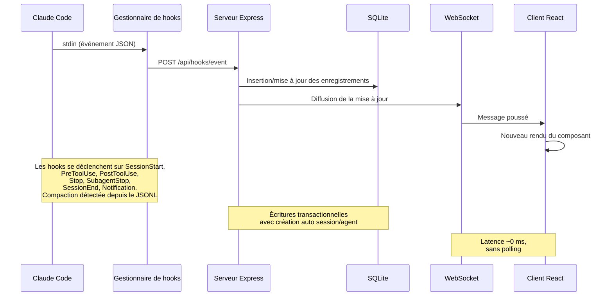

> [!IMPORTANT]
> Voir [ARCHITECTURE.md](./ARCHITECTURE.md) pour une plongée détaillée dans l'architecture du serveur, le schéma de la base de données, les routes d'API, la conception WebSocket, le routage client, le flux du gestionnaire de hooks, les modes de déploiement et les diagrammes détaillés du cycle de vie des sessions et des agents.

### Cycle de vie des hooks

1. **Claude Code** déclenche un hook au démarrage de la session, à l'utilisation d'un outil, en fin de tour, à la fin d'un sous-agent et à la sortie de la session
2. Le **gestionnaire de hooks** (`scripts/hook-handler.js`) lit l'événement JSON sur stdin, résout les tableaux de bord actifs via `~/.claude/.agent-dashboard.json` (ou `CLAUDE_DASHBOARD_PORT` s'il est défini) et envoie en POST la même charge utile à **une seule cible d'ingestion par répertoire de données SQLite distinct** (le port le plus bas l'emporte quand Docker et `npm run dev` partagent `~/.claude/agent-dashboard`, pour que les événements ne soient jamais ingérés deux fois). Des serveurs avec des bases **différentes** (p. ex. l'application de bureau, qui utilise son propre répertoire Application Support, à côté de `npm run dev`) reçoivent chacun les hooks. Il échoue silencieusement avec un délai de sécurité de 5 s pour ne jamais bloquer Claude Code, et les promesses par cible ne sont jamais rejetées, si bien qu'un seul écouteur mort ne peut pas priver les autres.
3. Le **serveur** traite l'événement dans une transaction SQLite :
   - Crée automatiquement les sessions et agents principaux au premier contact
   - Détecte les appels à l'outil `Agent` pour suivre la création des sous-agents
   - Au `SessionStart`, horodate `awaiting_input_since` de la session et de l'agent principal pour qu'une CLI neuve qui attend au prompt apparaisse immédiatement **En attente**
   - Au `UserPromptSubmit` (l'utilisateur appuie sur Entrée), efface l'indicateur d'attente et fait passer l'agent principal à `working` — seul signal fiable du début des tours de l'assistant purement textuels, puisqu'ils n'émettent pas de `PreToolUse`
   - Passe l'agent à « working » au `PreToolUse` (ce qui efface aussi l'indicateur d'attente) et l'y maintient pendant `PostToolUse`
   - Au `Stop` (Claude a fini de répondre), l'agent principal passe à « waiting » — Claude a terminé son tour, la balle est dans le camp de l'utilisateur. Les sous-agents en arrière-plan continuent de tourner. La session reste `active`. Un Stop avec `stop_reason=error` marque l'agent `error` et la session `error`
   - Sur une `Notification` d'autorisation (repérée par motif de message : `permission`, `waiting for input`, `needs your approval`, …), passe l'agent à `waiting` et horodate `awaiting_input_since`
   - `SubagentStop` n'efface volontairement PAS l'indicateur d'attente (la fin d'un sous-agent en arrière-plan ne nous apprend rien sur l'humain)
   - Marque chaque sous-agent terminé individuellement via `SubagentStop`. Une fois `res.json()` renvoyé, lance sans attendre une passe `scanAndImportSubagents` qui parcourt les fichiers `subagents/agent-*.jsonl` de la session, associe les blocs `tool_use` ↔ `tool_result` par `tool_use_id` et émet des événements `PreToolUse` + `PostToolUse` sous l'`agent_id` propre à chaque sous-agent — ce qui comble le manque par lequel les appels d'outils internes aux sous-agents resteraient sinon invisibles pour le tableau de bord
   - Au `SessionEnd` (le processus CLI se termine), retire l'indicateur d'attente. Si la session est en `error`, l'état d'erreur est conservé ; sinon, tous les agents + la session sont marqués `completed`
   - Au `SessionStart`, toute autre session active sans activité depuis `DASHBOARD_STALE_MINUTES` (180 par défaut = 3 h, modifiable par variable d'environnement) est automatiquement marquée « abandoned », ses agents étant terminés. Cela couvre `/resume` au sein d'une session, Ctrl+C et les autres cas où une session reste orpheline sans `SessionEnd` propre
   - Réactive les sessions terminées/en erreur/abandonnées quand de nouveaux événements de travail arrivent (session reprise). Les événements Stop et SubagentStop réactivent aussi les sessions terminées/abandonnées — ce qui couvre les sessions préexistantes importées avant le démarrage du serveur, dont le premier événement de hook peut être un Stop
   - **Reprise après erreur** : seuls `UserPromptSubmit` et `PreToolUse` peuvent faire repasser une session de `error` à `active` — signe que l'utilisateur a activement réessayé
   - Détecte la compaction de conversation (entrées `isCompactSummary` dans la transcription JSONL) et crée des agents + événements `Compaction`. Les bases de tokens sont préservées d'une compaction à l'autre, sans perte d'usage. Les lectures de transcription utilisent un cache partagé fondé sur `stat` avec lectures incrémentales par décalage d'octets — seuls les nouveaux octets ajoutés depuis la dernière lecture sont analysés, soit un gain d'environ 50x sur les longues sessions
   - Extrait les erreurs d'API (entrées `isApiErrorMessage` : limites de quota, limites de débit, invalid_request) et les réponses brutes `type: "error"` des transcriptions JSONL, stockées comme événements `APIError`. Les durées de tour (`system` de sous-type `turn_duration`) sont stockées comme événements `TurnDuration`. Les erreurs de résultat d'outil (`toolUseResult.is_error`) sont suivies comme événements `ToolError`
   - **Surveillance de détection des erreurs** — une minuterie d'arrière-plan s'exécute toutes les 15 secondes et analyse les sessions actives sans événement de hook récent (inactives depuis plus de 10 s). Elle relit leurs fichiers de transcription à la recherche d'erreurs d'API (échecs d'authentification, limites de débit, quota épuisé), dérive les chemins de transcription du `cwd` de la session pour les sessions importées sans `transcript_path` dans les données d'événement, et marque sessions/agents en `error` quand des erreurs d'API sont trouvées. Cela couvre les cas où la CLI Claude ne déclenche aucun hook après une erreur d'API (p. ex. un échec d'authentification 401, où la CLI affiche l'erreur et attend)
   - **Reprise après interruption utilisateur (Échap)** — annuler un tour avec `Esc` ne déclenche **aucun hook** (une limite documentée de Claude Code), si bien que sans intervention l'agent principal resterait bloqué en `working` pour toujours. La même surveillance de 15 s rattrape ces cas de deux façons : (1) quand l'annulation laisse un marqueur `[Request interrupted by user]` dans la transcription (Échap *après* une sortie), le cache des transcriptions le signale via `pendingInterrupt` — dérivé uniquement de l'ordre de la transcription (dernière interruption contre dernière activité réelle du tour, même horloge, donc valable même pour une annulation en moins d'une seconde) — et la session passe **En attente** en ~15 s ; (2) quand Échap est pressé *avant toute sortie*, Claude Code n'écrit aucun marqueur, et un repli par délai d'inactivité s'applique — si l'agent principal est en `working` **sans outil en cours** et que **ni un événement de hook ni la transcription n'ont progressé** depuis `DASHBOARD_WORKING_IDLE_SECONDS` (`120` par défaut), le tour est considéré comme mort et la session passe **En attente**. Les deux chemins journalisent un événement `Interrupted` et mettent la session dans le même état En attente qu'un `Stop` normal. Une sortie en streaming (transcription qui grandit encore) et les appels d'outils en cours (`current_tool` défini) sont exemptés ; un rare faux basculement se corrige au prochain vrai hook
   - **Récupération des sessions mortes par test d'activité** — quitter Claude Code (Ctrl+C, fermeture du terminal) déclenche un hook `SessionEnd`, mais si le tableau de bord ne tourne pas à ce moment-là, l'événement est perdu à jamais et la session resterait **En attente** jusqu'au balayage d'inactivité (3 h par défaut). La même surveillance de 15 s comble ce manque avec une **sonde d'activité des processus** : elle liste les processus CLI `claude` en cours (`ps` + `lsof` sous macOS, `/proc` sous Linux) et termine toute session `active` dont le `cwd` n'a aucun processus claude vivant — elle arrive dans le même état `completed` qu'avec un vrai `SessionEnd`, avec un événement `SessionEnd` synthétique dans la chronologie. Garde-fous : lors des passes de surveillance, la transcription de la session ne doit pas avoir été écrite depuis au moins `DASHBOARD_LIVENESS_IDLE_SECONDS` (`60` par défaut ; la dernière écriture de hook sert d'horloge de repli quand aucune transcription n'existe sur disque) — les **passes au démarrage ignorent entièrement cette condition**, si bien qu'une session quittée même une seconde avant le lancement est nettoyée immédiatement — et la sonde répond « pas de réponse » (sans rien modifier) sous Windows, dans les conteneurs (les processus de l'hôte y sont invisibles), quand `ps`/`lsof` échouent, ou quand elle est explicitement désactivée via `DASHBOARD_LIVENESS_PROBE=0`. Dans un déploiement **mixte**, la récupération ignore aussi automatiquement toute session dont le `cwd` n'est pas un chemin POSIX absolu — une session transmise depuis une autre machine via des hooks partagés rapporte le chemin de sa machine d'origine (p. ex. un `D:\Git\ai-deck` Windows) qu'une analyse locale `ps`/`lsof`/`/proc` ne peut jamais faire correspondre ; les sessions distantes sont ainsi protégées sans désactiver la sonde pour celles qui sont vraiment locales. Les **sessions des sources de données distantes** (`sessions.source` ≠ `local`) sont toujours ignorées aussi — leur `cwd` est légitimement un chemin POSIX absolu sur une autre machine, la sonde de processus locale n'en dit donc rien ; leur cycle de vie relève entièrement de la réconciliation de la synchronisation distante décrite plus haut. Une fausse terminaison se corrige d'elle-même : le prochain événement de hook réactive la session. En plus de la cadence de 15 s, la récupération s'exécute **immédiatement au démarrage** (en nettoyant les sessions mortes d'une exécution précédente déjà en base avant même leur affichage) et **à nouveau ~5 s plus tard** (pour les sessions que la synchronisation de démarrage vient d'importer), si bien qu'une session morte pendant l'arrêt du tableau de bord n'apparaît jamais En attente
   - Un balayage périodique côté serveur rattrape les sessions abandonnées et les nouvelles compactions qui ont échappé à la détection par événement (p. ex. `/compact` ne déclenche aucun hook, `/resume` quelques secondes après la création de la session). La cadence est dérivée de `DASHBOARD_STALE_MINUTES` (¼ du seuil, borné entre 60 s et 5 min). Le balayage lit `transcript_path` directement sur chaque ligne de session active (une petite recherche par index) au lieu de le chercher dans la table des événements ; la colonne est renseignée par le gestionnaire de hooks la première fois qu'il voit un chemin de transcription et rattrapée une fois depuis les événements existants par la migration de `db.js`, avec un index partiel `idx_sessions_active_tp` couvrant exactement les lignes lues par le balayage. Le balayage partage le cache des transcriptions avec le gestionnaire de hooks, ce qui évite les E/S en double. Le nettoyage des sessions abandonnées évince aussi l'entrée correspondante du cache des transcriptions pour borner la mémoire. Les sessions des **sources de données distantes** (`source` ≠ `local`) restent gérées par la réplication seulement tant que leur fournisseur Claude Code ou Codex correspondant est sain ; si ce fournisseur est indisponible, en erreur ou bloqué en `syncing`, les nettoyages périodique et au démarrage appliquent la règle d'inactivité normale pour qu'une vieille carte En attente ne puisse pas persister indéfiniment
   - La **synchronisation continue des projets** (`startSessionSync`) garde `~/.claude/projects` découvrable au-delà du rattrapage unique au démarrage, protégé par un marqueur : un projet ajouté plus tard dont les sessions ne passent jamais par les hooks resterait sinon invisible jusqu'à une nouvelle analyse manuelle. Un balayage immédiat au démarrage, un `fs.watch` avec anti-rebond (récursif sous macOS/Windows ; racine + enfants directs sous Linux) et un polling `DASHBOARD_SESSION_SYNC_MS` (30 s par défaut ; `0` désactive le polling, la surveillance reste) partagent un même cache de mtime et un balayage fusionné qui ne réanalyse que les fichiers dont le mtime a avancé — et ignore sans réanalyse une session déjà importée et inchangée, si bien que le coût d'un redémarrage reste en O(fichiers nouveaux/modifiés). Chaque session nouvellement découverte ou agrandie diffuse `session_created`/`session_updated` ainsi que son agent principal, les mêmes trames que celles émises par les hooks
4. Le **WebSocket** diffuse le changement à tous les clients connectés
5. L'**interface** reçoit la mise à jour et réaffiche en temps réel les composants concernés, sans polling.

### Machine à états des agents

Statuts persistés : `working | waiting | completed | error`. La
colonne `awaiting_input_since` est complémentaire — elle note le moment où l'agent
a commencé à attendre et sert à afficher la durée, mais `waiting` est désormais un
vrai statut persisté.

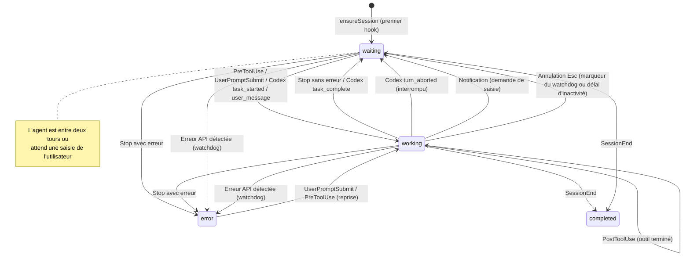

### Machine à états des sessions

Statuts persistés : `active | completed | error | abandoned`. L'état de session
**En attente** est une surcouche d'interface (status=`active` avec
`awaiting_input_since` défini).

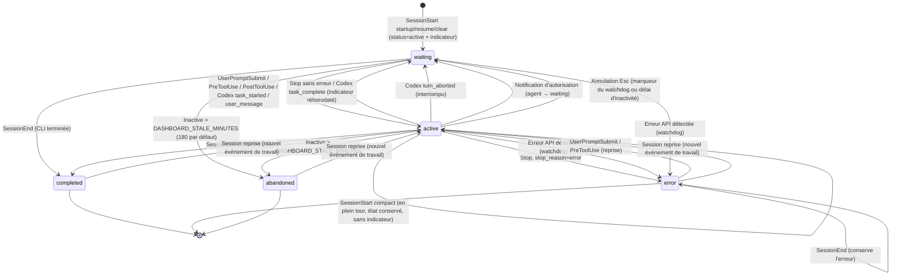

### Flux de calcul des coûts

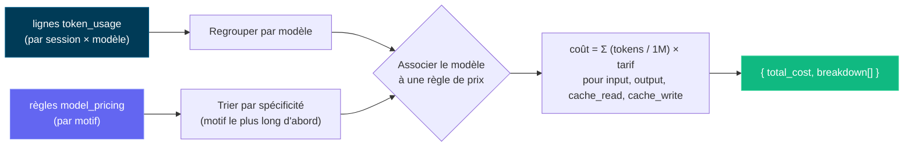

> [!IMPORTANT]
> Le flux de calcul des coûts repose sur l'utilisation des tokens et les règles de tarification des modèles. Gardez vos règles à jour pour refléter des coûts exacts. Mettez à jour la table de tarification des modèles depuis la page Paramètres pour conserver un suivi précis — le tableau de bord ne récupère pas automatiquement les mises à jour de prix depuis des sources externes. Une fois vos règles définies, le tableau de bord les applique rétroactivement à toutes les sessions pour des rapports de coûts cohérents.

---

## Configuration

| Variable d'environnement | Défaut | Description |
| ----------------------- | ------------- | --------------------------------------------- |
| `DASHBOARD_PORT` | `4820` | Port du serveur Express |
| `CLAUDE_DASHBOARD_PORT` | `4820` | Port utilisé par le gestionnaire de hooks pour joindre le serveur |
| `NODE_ENV` | `development` | Mettre à `production` pour servir le client compilé |
| `DASHBOARD_UPDATE_CHECK` | _(activé)_ | Mettre à `0` / `false` / `off` pour désactiver les vérifications périodiques de l'amont git |
| `DASHBOARD_UPDATE_CHECK_INTERVAL_MS` | `300000` (5 min) | Intervalle entre les vérifications automatiques ; minimum 60 000 ms. Les utilisateurs peuvent aussi cliquer sur **Vérifier maintenant** dans la fenêtre de mise à jour ou dans la barre latérale pour en lancer une à la demande. |
| `DASHBOARD_STALE_MINUTES` | `180` (3 h) | Minutes d'inactivité avant qu'une session encore `active` (y compris une session **En attente** d'une saisie — « En attente » est une surcouche d'interface sur une ligne `active`, pas un statut stocké) soit automatiquement marquée **abandoned** et disparaisse de la liste des actives. Appliqué par le watchdog de 15 s et le balayage de maintenance périodique (qui s'exécute tous les ¼ de cette valeur, borné entre 60 s et 5 min). Abaissez-la (p. ex. `60`) pour un délai d'inactivité plus court |
| `DASHBOARD_WORKING_IDLE_SECONDS` | `120` | Délai d'inactivité en travail pour récupérer un tour annulé avec `Esc` **avant toute sortie** (qui ne laisse aucun marqueur dans la transcription). Quand l'agent principal est en `working` sans outil en cours et que ni un événement de hook ni la transcription n'ont progressé pendant cette durée, le watchdog fait passer la session **En attente**. Abaissez-le pour une reprise plus réactive, au prix de rares faux basculements lors de longs tours de réflexion silencieuse (qui se corrigent d'eux-mêmes). Les sessions Cursor utilisent le même délai : un tour `working` dont les fichiers `~/.cursor` et les hooks restent inactifs aussi longtemps passe **En attente** |
| `DASHBOARD_LIVENESS_PROBE` | `1` (activé) | Mettre à `0` pour désactiver la **récupération des sessions mortes par test d'activité** du watchdog (la sonde basée sur `ps`/`lsof` qui termine les sessions locales Claude Code ou Codex `active` dont le processus CLI correspondant n'existe plus — pour rattraper un `SessionEnd` perdu pendant l'arrêt du tableau de bord). Les sessions transmises depuis **une autre machine** (hooks partagés) rapportent un `cwd` non POSIX et sont ignorées automatiquement par la récupération : un déploiement mixte local + transmis n'a donc plus besoin de la désactiver ; ne la désactivez que pour une configuration purement distante où les processus locaux ne prouvent rien. Désactivée automatiquement sous Windows et dans les conteneurs |
| `DASHBOARD_LIVENESS_IDLE_SECONDS` | `60` | Seuil d'inactivité pour la récupération par test d'activité **lors des passes du watchdog** : une session n'est terminée que si sa transcription n'a pas été écrite depuis au moins cette durée (la dernière écriture de hook sert d'horloge de repli quand aucune transcription n'existe sur disque), pour qu'une session en plein tour ou tout juste reprise ne disparaisse jamais sur un raté passager de la sonde. Les passes au démarrage ignorent ce seuil — au lancement, la sonde seule décide, si bien que les sessions quittées juste avant le lancement sont nettoyées immédiatement |
| `DASHBOARD_SESSION_SYNC_MS` | `30000` | Intervalle de polling (ms) de la synchronisation continue en arrière-plan de `~/.claude/projects`, qui fait apparaître les projets ajoutés après le démarrage dont les sessions ne passent jamais par les hooks. La surveillance `fs.watch` se déclenche de toute façon quasi instantanément ; ce polling est le filet de sécurité (les surveillances peuvent manquer des événements / ne pas se déclencher sur les systèmes de fichiers réseau). Mettre à `0` pour désactiver le polling tout en laissant la surveillance active |
| `DASHBOARD_CURSOR_HOME` | `~/.cursor` | Home Cursor natif facultatif. Le tableau de bord lit `projects/*/agent-transcripts`, joint les métadonnées de `chats`, rattrape les sessions existantes et stocke des instantanés durables des conversations dans le répertoire de données du tableau de bord. |
| `DASHBOARD_CURSOR_SYNC_MS` | `5000` | Intervalle de sécurité (ms) pour la découverte des chats/transcriptions Cursor par empreinte. La surveillance du système de fichiers importe toujours immédiatement le démarrage de la CLI et les changements de prompt ; `0` ne désactive que l'analyse périodique. |
| `DASHBOARD_CODEX_HOME` | `CODEX_HOME` ou `~/.codex` | Répertoire d'état Codex local facultatif. Les rollouts ne sont lus que dans son arborescence `sessions/` ; enregistrer un nouvel emplacement dans les Paramètres persiste cette surcharge propre au tableau de bord, réarme la surveillance en direct et analyse immédiatement la nouvelle arborescence. |
| `DASHBOARD_CODEX_SYNC_MS` | `4000` | Intervalle de polling de sécurité (ms) pour les rollouts Codex en ajout seul. Les hooks Codex déclenchent immédiatement la même ingestion incrémentale ; mettre à `0` pour ne désactiver que le polling tout en gardant la surveillance du système de fichiers quand elle est disponible. |
| `DASHBOARD_CODEX_MAX_ATTEMPTS` | `5` | Nombre de tentatives d'ingestion consécutives en échec que le balayage Codex consacre à un rollout **inchangé** avant de le laisser de côté. Le balayage remet volontairement en file un rollout qu'il n'a pas pu lire, pour qu'un échec passager (`SQLITE_BUSY`, un enregistrement à moitié écrit) se rétablisse au passage suivant ; sans limite, un échec *permanent* se répéterait pendant toute la vie du processus — environ 21 600 tentatives par fichier et par jour avec les 4 s par défaut de `DASHBOARD_CODEX_SYNC_MS`, chacune écrivant une ligne de journal sur l'unique thread Node. Le compte inclut la première tentative, est suivi par fichier et est intégralement rétabli dès que la taille ou le mtime du fichier change, si bien qu'un rollout simplement à moitié écrit se rétablit tout seul. La tentative qui épuise le budget écrit un unique message qui cite la limite. Augmentez-la si un volume lent ou instable a besoin de plus de quelques balayages pour se stabiliser |
| `DASHBOARD_CODEX_HOOK_IDLE_SECONDS` | `60` | Durée pendant laquelle une session Codex **uniquement par hooks** — dont l'exécution n'a écrit aucun rollout sur disque (`codex exec --ephemeral`) — peut laisser sans réponse un tour signalé comme terminé avant que le tableau de bord ne conclue que son hook `SessionEnd` a été perdu. Seule une session dont l'`awaiting_reason` vaut `stop` est concernée : Codex envoie `SessionEnd` quelques centaines de ms après `Stop`, un `Stop` resté sans réponse est donc une vraie preuve. Le silence n'est volontairement jamais le déclencheur — une exécution sans rollout n'émet aucun hook pendant toute la durée d'un appel d'outil, et une règle fondée sur l'inactivité terminerait donc un build CI en cours |
| `DASHBOARD_TASK_SUMMARY_TTL_MS` | `2000` | Fenêtre (ms) pendant laquelle un résultat périmé est servi pour le cache de progression des tâches par transcription, derrière les requêtes de liste `include_task_progress` **et** le `todo_snapshot` du détail de session. Les transcriptions qui grandissent sont analysées de façon incrémentale à partir de la dernière ligne JSONL complète (une croissance de plus de 32 Mio depuis la dernière lecture repart d'une analyse de fin neuve), tandis que ce plancher regroupe toujours les rafales de rechargements de listes (par exemple, les rafraîchissements du tableau de bord déclenchés par des événements WebSocket). Dans la fenêtre, un résultat tout juste analysé (légèrement périmé, pour affichage seulement) est renvoyé ; mettre à `0` pour analyser chaque ajout immédiatement |
| `DASHBOARD_REMOTE_SYNC_MS` | `15000` (15 s) | Intervalle de polling (ms) de la synchronisation en arrière-plan des **sources de données distantes**, qui récupère indépendamment via SSH `~/.claude/projects` et `~/.codex/sessions` (plus le léger index de titres `session_index.jsonl` de Codex) de chaque source activée, puis réimporte chacun via son importeur local. Les sources nouvelles/réactivées se synchronisent aussi immédiatement. Mettre à `0` pour désactiver le poller (les synchronisations manuelles / à la demande fonctionnent toujours) |
| `DASHBOARD_REMOTE_ACTIVE_WINDOW_MS` | `600000` (10 min) | Fenêtre de fraîcheur du statut en direct d'une session de **source de données distante**. À chaque synchronisation, une session distante Claude Code ou Codex dont la transcription répliquée a un **dernier événement JSONL** dans cette fenêtre est considérée comme toujours en cours (`active`) ; dès que la réplique cesse d'avancer plus longtemps, la session est réconciliée en `completed`. Les sessions distantes ne reçoivent aucun hook en direct : la réconciliation de réplique consciente du fournisseur remplace donc le test d'activité local ; les répliques de fournisseur en échec, indisponibles ou bloquées retombent dans le balayage d'inactivité normal. Augmentez-la pour des liaisons lentes ou des tours d'inactivité très longs |
| `DASHBOARD_REMOTE_SYNC_TIMEOUT_MS` | `600000` (10 min) | Délai d'expiration (ms) par source pour une synchronisation distante (récupération `scp` + import) avant son abandon |
| `DASHBOARD_REMOTE_TEST_TIMEOUT_MS` | `15000` (15 s) | Délai d'expiration (ms) de la sonde SSH **Tester** (`POST /api/remote-sources/:id/test`) qui vérifie qu'une source distante est joignable |
| `DASHBOARD_HOST` | `127.0.0.1` | Interface sur laquelle le serveur écoute. Loopback par défaut (non joignable depuis le réseau). Mettre à `0.0.0.0` pour l'exposer sur un réseau local (un avertissement est journalisé au démarrage) |
| `DASHBOARD_TOKEN` | _(non défini)_ | Quand il est défini, chaque requête `/api/*` et le WebSocket doivent présenter le jeton (`Authorization: Bearer <token>`, en-tête `x-dashboard-token` ou `?token=`). Désactivé par défaut — l'écoute en loopback constitue la frontière de confiance |
| `DASHBOARD_TOKEN_FILE` | _(non défini)_ | Jeton du tableau de bord lu depuis un fichier, pour les secrets Docker/Kubernetes ; un `DASHBOARD_TOKEN` direct l'emporte |
| `DASHBOARD_HOOK_TOKEN` / `DASHBOARD_HOOK_TOKEN_FILE` | _(non défini)_ | Jeton indépendant pour les routes de hooks locales (`/api/hooks/event`, `/api/hooks/codex`) quand elles sont exposées au-delà du loopback |
| `REMOTE_PUSH_TOKEN` / `REMOTE_PUSH_TOKEN_FILE` | _(non défini)_ | Jeton distinct protégeant `POST /api/hooks/ingest-batch` (route de push distant accessible depuis Internet, désactivée par défaut). Volontairement indépendant de `DASHBOARD_HOOK_TOKEN` ci-dessus — définir celui-ci ne doit pas aussi ouvrir cette route inscriptible depuis Internet |
| `DASHBOARD_ALLOWED_HOSTS` | _(loopback)_ | Valeurs `Host` supplémentaires, séparées par des virgules, autorisées sur HTTP et les upgrades WebSocket (protection contre le DNS rebinding). Ajoutez-y vos noms d'hôte du réseau local quand l'écoute dépasse le loopback |
| `DASHBOARD_ENV_PATH` | `.env` du dépôt | Chemin dotenv inscriptible utilisé quand les Paramètres persistent les surcharges des homes Claude/Codex ; défaut en conteneur `/app/config/.env` |
| `CCAM_DASHBOARD_URL` | _(découverte localhost)_ | Destination de hooks distante facultative. Les URL hors loopback doivent utiliser HTTPS et un jeton de hook |
| `CCAM_HOOK_TOKEN` / `CCAM_HOOK_TOKEN_FILE` | _(non défini)_ | Identifiant du client de hooks, envoyé dans `x-ccam-hook-token` |

> [!IMPORTANT]
> **Sécurisé par défaut.** Le serveur écoute sur `127.0.0.1` et n'est **pas** joignable depuis le réseau d'emblée ([GHSA-gr74-4xfh-6jw9](./.github/SECURITY.md)). Pour l'exposer sur un réseau local, définissez **à la fois** `DASHBOARD_HOST` (p. ex. `0.0.0.0`) **et** `DASHBOARD_TOKEN` (qui protège alors `/api/*` et le WebSocket), et listez vos noms d'hôte du réseau local dans `DASHBOARD_ALLOWED_HOSTS`. Voir [`.env.example`](./.env.example) et [`.github/SECURITY.md`](./.github/SECURITY.md) pour les détails.

Pour les clones git, le serveur fait périodiquement un `git fetch` de `origin` et compare votre checkout à `origin/master`, `origin/main` ou `origin/HEAD`. Quand vous êtes en retard, un message apparaît dans le terminal du serveur et une fenêtre s'affiche dans l'interface avec la commande exacte à lancer. Le tableau de bord ne tire ni ne redémarre jamais de lui-même — vous copiez la commande, la lancez dans un terminal, puis redémarrez le serveur de la même façon que vous l'aviez démarré.

---

## CLI `ccam`

Toutes les fonctionnalités du tableau de bord sont aussi accessibles depuis n'importe quel terminal via la CLI **`ccam`**, sans dépendance (`bin/ccam.js`). Elle est liée automatiquement par `npm run setup` (via `npm link`), après quoi `ccam <command>` fonctionne depuis n'importe quel répertoire. Elle découvre le tableau de bord en cours d'exécution via `~/.claude/.agent-dashboard.json` (le même registre de serveurs actifs que celui du gestionnaire de hooks), avec les surcharges d'environnement `CLAUDE_DASHBOARD_PORT` / `DASHBOARD_PORT`, et se replie sur `http://127.0.0.1:4820`.

```bash
# Server
ccam status                       # ● running / ○ not running indicator
ccam start [--port N]             # start the server in the background (detached)
ccam stop                         # stop the background server gracefully
ccam repl                         # interactive shell (also: shell, i)

# Monitoring
ccam health                       # is the dashboard up?
ccam stats                        # totals, today's events, status distributions
ccam kanban                       # sessions + agents grouped by status columns
ccam tail [--session <id>]        # live event feed in the terminal (Ctrl+C stops)

# Data
ccam sessions [--status s] [--q text] [--limit n]
ccam session <id>                 # detail: agent tree, cost, recent events
ccam agents   [--status s] [--session id]
ccam events   [--session id] [--limit n]

# Insights
ccam analytics                    # token totals, top tools, agent types
ccam workflows [--session id]     # workflow intelligence stats and patterns
ccam runs [--session id]          # dynamic Workflow-tool runs
ccam cost [--session <id>]        # total estimated cost with per-model breakdown
                                  # (--session scopes to one; shows tool surcharges;
                                  #  warns about models with usage but no pricing rule)

# Alerts & webhooks
ccam alerts [--unacked]           # fired-alert feed
ccam alerts ack <id> | ack-all    # acknowledge alerts
ccam rules                        # list alert rules
ccam webhooks                     # list webhook targets
ccam webhooks test <id>           # send a synthetic test alert

# Pricing
ccam pricing                      # list model pricing rules (incl. fast-mode & intro columns)
ccam pricing set <pattern> --input N --output N [--cache-read N --cache-write N]
                 [--cache-write-1h N] [--fast-input N --fast-output N]
                 [--intro-input N --intro-output N … --intro-until YYYY-MM-DD]
ccam pricing delete <pattern>
ccam pricing reset

# Import
ccam import rescan                # re-scan ~/.claude/projects
ccam import path <dir>            # import every .jsonl under a directory

# Administration
ccam doctor                       # connectivity, hooks, and database diagnosis
ccam info                         # raw system info JSON
ccam export [file.json]           # full JSON data export
ccam import-data <file.json>      # restore an export (idempotent, non-destructive)
ccam cleanup --hours N --days M   # abandon stale / purge old sessions
ccam reinstall-hooks              # reinstall Claude Code hooks
ccam update-check                 # is the checkout behind upstream? (prints the update command)
ccam clear-data --yes             # delete ALL data (requires --yes)
ccam open                         # open the dashboard in your browser
ccam version                      # print the CLI version (also --version / -v)
```

Les commandes qui s'appuient sur l'API exigent que le serveur tourne — sinon, **les commandes en lecture seule se replient sur la lecture directe de `data/dashboard.db`** (avec une bannière explicite `⚠ Offline mode`, et les sessions `active` stockées mais mortes corrigées à l'affichage par la même sonde d'activité des processus que celle du watchdog du serveur), tandis que les commandes qui ne peuvent pas fonctionner correctement sans le serveur (`tail` en direct, calculs d'analyses/de coûts, modifications) affichent l'indicateur `○ Dashboard server is NOT running` avec la raison précise et les commandes de démarrage ; `ccam start` lance un serveur de production en arrière-plan. Les commandes de lecture sont toujours sûres ; la seule commande destructive (`clear-data`) refuse de s'exécuter sans un `--yes` explicite. La sortie est une véritable interface en terminal — tableaux encadrés avec colonnes numériques alignées à droite, icônes de statut (`● active`, `○ waiting`, `✔ completed`, `✖ error`), histogrammes en ligne pour les statistiques/analyses/coûts et de vrais arbres d'agents `├─`/`└─` — avec des couleurs ANSI activées automatiquement sur un TTY, désactivées dans un pipe, et pilotables via `--no-color` / `NO_COLOR` / `FORCE_COLOR`. Pour une session de surveillance en direct, **`ccam repl`** (alias `shell` / `i`) ouvre un shell interactif où l'on tape les commandes sans le préfixe `ccam` — avec une bannière d'accueil CCAM, la complétion par tabulation, un historique aux flèches persistant, un prompt indiquant l'état du serveur en direct (`● host` en marche / `○ offline` arrêté), un menu `help` / `help <cmd>` groupé et une commande intégrée `watch [secs] <cmd>` qui rafraîchit automatiquement n'importe quelle commande (p. ex. `watch 5 kanban`) ; chaque ligne s'exécute dans un processus enfant isolé, si bien qu'un refus hors ligne ou un `tail` bloquant ne fait jamais tomber le shell. Si `ccam` n'est pas dans votre PATH (p. ex. `npm link` a demandé des droits élevés), lancez `npm link` une fois depuis la racine du dépôt. Référence complète — options, ordre de découverte, REPL, modèle de sécurité, scripts/codes de sortie, dépannage — dans [docs/CLI.md](./docs/CLI.md).

## Scripts npm

| Commande | Description |
| ----------------------- | ---------------------------------------------------------- |
| `npm run setup` | Installe les dépendances racine/client/extension/MCP, compile MCP et lie `ccam` |
| `npm run update:pull-setup` | `git pull --ff-only` puis `npm run setup` (mise à jour manuelle) |
| `npm run dev` | Démarre en parallèle le serveur (mode watch) + le client (HMR Vite) |
| `npm run dev:server` | Démarre Express avec une surveillance des sources à anti-rebond et redémarrage propre |
| `npm run dev:client` | Démarre uniquement le serveur de développement Vite |
| `npm run build` | Compile le client React dans `client/dist/` |
| `npm start` | Démarre le serveur de production (sert le client compilé) |
| `npm test` | Lance toute la suite (serveur `node --test` + client Vitest) |
| `npm run verify` | Lance tout le contrôle local en une commande : audit des en-têtes d'auteur, vérification Prettier, typecheck du client, tests backend, tests frontend |
| `npm run check:headers` | Vérifie que chaque fichier source concerné porte l'en-tête d'auteur |
| `npm run typecheck:client` | Typecheck du client (`tsc -b`) — la même vérification que le build de production avant Vite |
| `npm run test:server` | Lance les tests backend (`node --test server/__tests__/`) |
| `npm run test:client` | Lance les tests Vitest du frontend, dont les **instantanés de rendu de chaque écran** (`client/src/pages/__tests__/screens.snapshot.test.tsx`) ; régénérez les références après des changements d'interface volontaires avec `cd client && npx vitest run -u` |
| `npm run install-hooks` | Configure les hooks de Claude Code dans `~/.claude/settings.json` |
| `npm run seed` | Remplit la base avec des données d'exemple |
| `npm run import-history` | Importe les anciennes sessions depuis `~/.claude/` (s'exécute aussi au démarrage) |
| `npm run reconcile-tokens` | Rafraîchit les totaux de tokens des sessions importées (ne baisse jamais un total) |
| `npm run repair-tokens` | Recalcule les totaux de tokens **hors workflows** de chaque session **Claude** dont la transcription est sur disque (sous `~/.claude/projects/` ou via le `transcript_path` stocké de la session) et remet à zéro les bases de compaction ; les lignes de workflows et de Codex sont préservées. Réparation unique pour les bases touchées par la somme d'usage par enregistrement d'avant v2.0.9 ou par l'omission de l'usage des sous-agents à plat du même modèle. Arrêtez d'abord le tableau de bord |
| `DASHBOARD_TOKEN_REPAIR` | Activé par défaut (`1`). Réparation automatique unique des totaux de tokens historiques touchés par l'inflation par enregistrement ou par l'omission des sous-agents à plat du même modèle. Les correctifs en direct ne peuvent pas revisiter chaque session terminée, et `replaceTokenUsage` ne peut pas abaisser un ancien maximum. S'exécute une fois par base (protégé par un marqueur, différé hors du chemin de démarrage, ignoré quand un autre tableau de bord partage le répertoire de données) et sauvegarde d'abord les anciennes lignes dans `token_usage_pre_repair_v2`. Mettre à `0` pour l'ignorer et réparer à la main avec `npm run repair-tokens` |
| `npm run clear-data` | Supprime toutes les sessions, agents, événements et usages de tokens |
| `npm run mcp:install` | Installe les dépendances du paquet MCP local (`mcp/`) |
| `npm run mcp:build` | Compile le TypeScript du serveur MCP dans `mcp/build/` |
| `npm run mcp:start` | Démarre le serveur MCP (transport stdio — pour les hôtes MCP) |
| `npm run mcp:start:http` | Démarre le serveur MCP (transport HTTP + SSE sur le port 8819) |
| `npm run mcp:start:repl` | Démarre le serveur MCP (REPL interactif avec complétion par tabulation) |
| `npm run mcp:dev` | Lance le serveur MCP en mode dev (`tsx`, stdio) |
| `npm run mcp:dev:http` | Lance le serveur MCP en mode dev (`tsx`, HTTP + SSE) |
| `npm run mcp:dev:repl` | Lance le serveur MCP en mode dev (`tsx`, REPL interactif) |
| `npm run mcp:typecheck` | Vérifie les types des sources MCP sans produire de build |
| `npm run extensions:sync` | Régénère les noms de skills/métadonnées OpenAI, les manifestes Codex et les deux marketplaces |
| `npm run extensions:validate` | Valide les 14 plugins double format et les 66 skills intégrées |
| `npm run mcp:docker:build` | Construit l'image de conteneur MCP avec Docker (`agent-dashboard-mcp:local`) |
| `npm run mcp:podman:build` | Construit l'image de conteneur MCP avec Podman (`localhost/agent-dashboard-mcp:local`) |
| `npm run desktop:install` | Installe Electron + electron-builder dans l'espace de travail `desktop/` (recompile `better-sqlite3` pour l'ABI d'Electron) ; vérifie au préalable la compilation native de `better-sqlite3` et affiche une aide concrète (dont une alternative sans chaîne de compilation) en cas d'échec |
| `npm run desktop:dev` | Compile et lance l'application de bureau Electron pour itérer en local |
| `npm run desktop:build` | Compile les sources TypeScript du bureau dans `desktop/out/` |
| `npm run desktop:test` | Lance le test de fumée du bureau (démarre Electron, sonde `/api/health`) |
| `npm run desktop:dmg` | Construit **les deux** DMG macOS (arm64 + x64) — correct pour une release, **plus lent** (empaquette chaque architecture) |
| `npm run desktop:dmg:arm64` | Construit un DMG Apple Silicon seulement — **rapide**, recommandé pour votre propre Mac |
| `npm run desktop:dmg:x64` | Construit un DMG Intel seulement — **rapide** |
| `npm run desktop:dmg:universal` | Construit un unique DMG **universel** fusionné (arm64 + x86_64) — facultatif, **le plus lent**, et pas ce que publie la release |
| `npm run desktop:win` | Construit un **installeur NSIS** Windows `.exe` (x64) — à lancer sous Windows |
| `npm run desktop:win:portable` | Construit un `.exe` Windows **portable** (sans installation, x64) — à lancer sous Windows |
| `npm run monitoring:install` | Lance `npm install` dans `monitoring/` — télécharge Prometheus + Grafana via `postinstall` |
| `npm run monitoring:setup` | Alias de `monitoring:install` |
| `npm run monitoring:up` | Démarre Prometheus (:9090) + Grafana (:3000) en arrière-plan (sans Docker) |
| `npm run monitoring:down` | Arrête la pile de supervision gérée par npm |
| `npm run monitoring:start` | Pile de supervision au premier plan (Ctrl+C arrête les deux) |
| `npm run monitoring:docker:up` | Démarre Prometheus + Grafana via Docker Compose |
| `npm run monitoring:docker:down` | Démonte la pile de supervision Docker |
| `npm run monitoring:verify` | Contrôle de santé du tableau de bord, de Prometheus, de Grafana et de la cible de collecte |
| `npm run docker:up` | Démarre le tableau de bord dans Docker (`docker compose up -d --build`) |
| `npm run docker:down` | Arrête le conteneur du tableau de bord |
| `npm run docker:full:up` | Tableau de bord + MCP authentifié + Nginx sans root + Prometheus + Grafana |
| `npm run docker:full:down` | Démonte toute la pile Docker |
| `npm run deploy:validate` | Passe en revue Docker, Compose, Nginx, Helm, Kustomize, Terraform, les audits de dépendances et l'invariant d'écrivain unique. Les constats sont indicatifs (code de sortie 0) ; `CCAM_DEPLOY_VALIDATE_STRICT=1` en fait un contrôle bloquant |

---

## Extensions d'agent

Ce dépôt comprend une couche d'extensions complète pour Claude Code comme pour Codex :

- Claude Code : `CLAUDE.md`, `.claude/rules/`, `.claude/skills/`
- Sous-agents Claude : `.claude/agents/`
- Codex : `AGENTS.md`, `.codex/rules/`, `.codex/agents/`, `.codex/skills/`
- Plugins distribuables partagés : `plugins/`, avec à la fois `.claude-plugin/plugin.json` et `.codex-plugin/plugin.json`
- Marketplaces : `.claude-plugin/marketplace.json` pour Claude Code et `.agents/plugins/marketplace.json` pour Codex
- Open Agent Skills : toutes les skills de plugins portent un frontmatter canonique ainsi que `agents/openai.yaml` ; `npx skills add hoangsonww/Claude-Code-Agent-Monitor --list` découvre 77 skills dans le dépôt

### Architecture des extensions

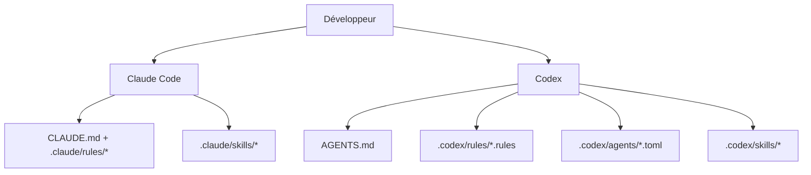

### Couche Claude Code

- Contexte persistant :
  - [`CLAUDE.md`](./CLAUDE.md)
- Règles limitées par chemin :
  - [`.claude/rules/backend-node.md`](./.claude/rules/backend-node.md)
  - [`.claude/rules/frontend-react.md`](./.claude/rules/frontend-react.md)
  - [`.claude/rules/mcp-typescript.md`](./.claude/rules/mcp-typescript.md)
  - [`.claude/rules/docs-markdown.md`](./.claude/rules/docs-markdown.md)
  - [`.claude/rules/file-headers.md`](./.claude/rules/file-headers.md)
  - [`.claude/rules/wiki-i18n.md`](./.claude/rules/wiki-i18n.md)
  - [`.claude/rules/i18n-parity.md`](./.claude/rules/i18n-parity.md)
- Skills :
  - `repo-onboarding`
  - `ship-feature`
  - `version-release`
  - `mcp-operations`
  - `debug-live-issue`
  - `update-project-docs`
  - `file-headers`
  - `push-to-forked-pr`
  - `i18n-parity`
- Sous-agents :
  - `backend-reviewer`
  - `frontend-reviewer`
  - `mcp-reviewer`

### Couche Codex

- Contexte persistant :
  - [`AGENTS.md`](./AGENTS.md)
- Politique d'exécution :
  - [`.codex/rules/default.rules`](./.codex/rules/default.rules)
- Modèles de sous-agents personnalisés :
  - [`.codex/agents/`](./.codex/agents)
- Skills :
  - [`.codex/skills/`](./.codex/skills)
- Mise en place :
  - [`.codex/README.md`](./.codex/README.md)

---

## Intégration MCP

Ce projet comprend un serveur MCP local dans `mcp/`, avec 97 outils répartis en 16 modules de domaine. Il expose chaque action prise en charge par l'application : lectures de données par portée, transcriptions/images, tarification Claude, Cursor et GPT, workflows, alertes/webhooks, imports et restauration de sauvegarde, configuration Claude/Codex, Lancer un agent, sources distantes, paramètres, push et maintenance protégée. Il prend en charge trois modes de transport.

### Modes de transport MCP

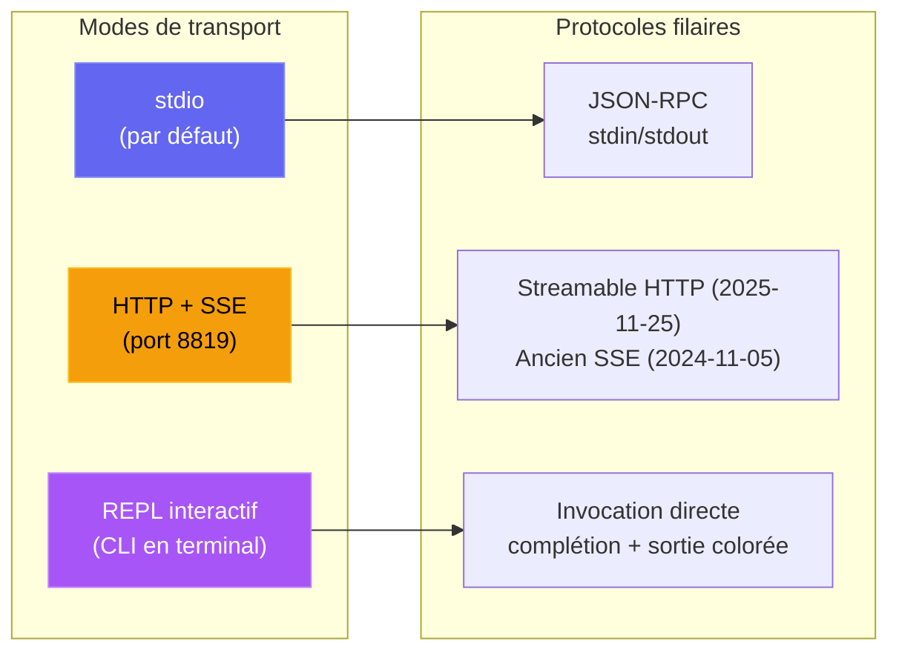

| Mode | Commande | Cas d'usage |
| --- | --- | --- |
| **stdio** | `npm run mcp:start` | Claude Code, Claude Desktop, hôtes MCP des IDE |
| **HTTP** | `npm run mcp:start:http` | Clients MCP distants, intégrations web, multi-session |
| **REPL** | `npm run mcp:start:repl` | Débogage d'exploitation, invocation manuelle d'outils, administration locale |

<p align="center">
  
</p>

### Architecture MCP

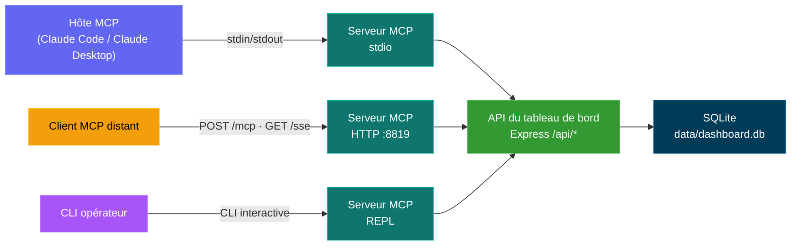

### Surface des outils MCP

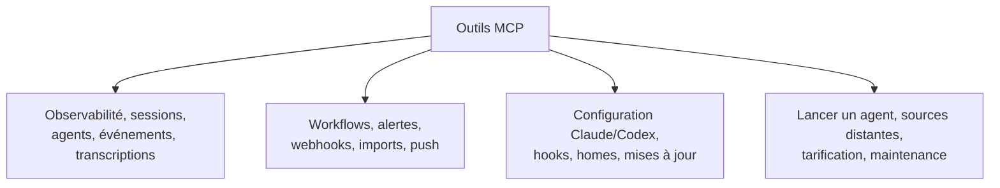

### Modèle de sécurité MCP

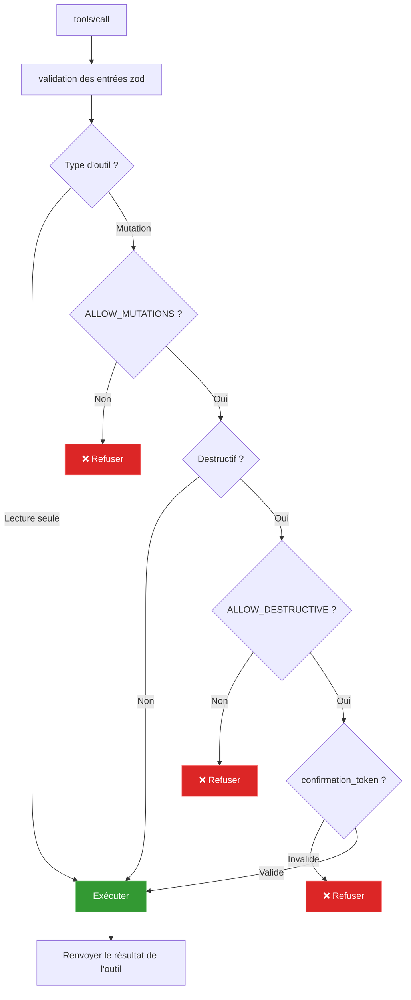

### Modes de fonctionnement MCP

- Mode lecture seule (par défaut) : `MCP_DASHBOARD_ALLOW_MUTATIONS=false`
- Mode administrateur : `MCP_DASHBOARD_ALLOW_MUTATIONS=true`
- Tableau de bord authentifié : définissez `MCP_DASHBOARD_API_TOKEN` / `_FILE` avec le jeton du tableau de bord
- Transport HTTP/SSE authentifié : définissez `MCP_HTTP_AUTH_TOKEN` / `_FILE` ; les clients envoient une authentification bearer ou `x-mcp-token`
- Garde-fous de transport : le HTTP direct en loopback peut porter le jeton ; les alias d'hôte de conteneur exigent HTTPS ; les redirections sont refusées
- Garde-fous de charge utile : 50 Mio par fichier d'historique téléversé, 100 Mio au total par appel, 10 Mio pour les réponses binaires et 25 Mio pour la restauration de sauvegarde
- Mode destructif : exige à la fois :
  - `MCP_DASHBOARD_ALLOW_MUTATIONS=true`
  - `MCP_DASHBOARD_ALLOW_DESTRUCTIVE=true`
  - l'entrée d'outil `confirmation_token: "CLEAR_ALL_DATA"`

Détails complets : [mcp/README.md](./mcp/README.md)

---

## Référence de l'API

Tous les points de terminaison renvoient du JSON. Les réponses d'erreur suivent la forme `{ error: { code, message } }`.

### OpenAPI / Swagger / ReDoc

Il existe trois façons d'explorer l'API HTTP, toutes pilotées par une seule spécification OpenAPI 3.0.3 (port serveur par défaut `4820`) :

| Méthode | Chemin | Description |
| ------ | ------------------------------- | ------------------------------------------------------------------------------------------------- |
| `GET` | `/api/openapi.json` | Spécification OpenAPI 3.0.3 brute en JSON |
| `GET` | `/api/docs` | **Swagger UI** interactif — exécution des requêtes pour les essayer |
| `GET` | `/api/redoc` | Référence **ReDoc** — un rendu propre en trois panneaux, optimisé pour la lecture, de la même spécification |
| `GET` | `/api/redoc/redoc.standalone.js` | Bundle ReDoc auto-hébergé (servi localement via la dépendance `redoc`, jamais par un CDN — fonctionne hors ligne) |

Le document OpenAPI est généré depuis `server/openapi.js` (`createOpenApiSpec()`) et fusionné avec des fragments complémentaires sous `server/openapi-extra/`. Swagger UI et ReDoc sont tous deux servis directement par le backend ; le bundle ReDoc est servi localement (`GET /api/redoc/redoc.standalone.js`), si bien que la référence fonctionne entièrement hors ligne / en réseau isolé, conformément à la politique du projet sans ressources externes.

La couverture est complète : chaque route du backend est documentée (82 entrées de chemins) sous ces étiquettes — Health, Sessions, Agents, Events, Stats, Metrics, Analytics, Hooks, Pricing, Workflows, Settings, Updates, Alerts, Webhooks, Push, CcConfig (explorateur de configuration Claude Code), Run (exécutions lancées depuis le tableau de bord) et Documentation — chacune avec ses paramètres, schémas de requête/réponse, descriptions au niveau des champs et exemples réalistes.

Un **`openapi.yaml`** versionné à la racine du dépôt reflète la spécification en direct. Il est généré depuis `server/openapi.js` (jamais modifié à la main) — régénérez-le après des changements d'API avec :

```bash
npm run openapi:yaml
```

### Métriques Prometheus et Grafana

`GET /api/metrics` expose les compteurs en direct du tableau de bord — sessions/agents par statut, totaux d'événements et de tokens, clients temps réel connectés, sources distantes configurées, durée de fonctionnement/mémoire du processus et version du build — au format d'exposition texte de Prometheus, pour que CCAM puisse être collecté par votre propre pile d'observabilité. Une pile Prometheus + Grafana clé en main avec **quatre tableaux de bord provisionnés automatiquement** (accueil par défaut : **CCAM — Overview**) se trouve dans [`monitoring/`](./monitoring/README.md).

**npm (sans Docker — macOS, Linux ou Windows) :**

```bash
npm start                          # dashboard on :4820
npm run monitoring:install         # one-time: npm postinstall pulls binaries
npm run monitoring:up              # Grafana on :3000, auto-provisioned; see monitoring/README.md for credentials
```

**Docker / Podman** (quand le tableau de bord tourne dans un conteneur ou si vous préférez Compose) :

```bash
# Dashboard only
npm run docker:up

# Dashboard + Prometheus + Grafana (one command)
npm run docker:full:up

# Or mix: native/docker dashboard + docker monitoring
DASHBOARD_ALLOWED_HOSTS=host.docker.internal npm start   # or docker:up with same env
npm run monitoring:docker:up
npm run monitoring:verify
```

<p align="center">
  
  <br>
  <em>📊 <strong>Grafana · CCAM — Overview</strong> — tableau de bord d'accueil par défaut (quatre tableaux provisionnés automatiquement) : instantané de la flotte, totaux de la base, graphiques de répartition et débits — le tout issu de collectes en direct de <code>/api/metrics</code></em>
</p>

<p align="center">
  
  <br>
  <em>🔥 <strong>Prometheus · console CCAM</strong> — page d'accueil prête à l'emploi sur <code>/consoles/index.html</code> qui interroge directement Prometheus pour la santé de la collecte, les totaux de sessions, les événements, les tokens, et propose des liens Graph pour approfondir</em>
</p>

<p align="center">
  
  <br>
  <em>📈 <strong>Prometheus · Graph</strong> — exécutez du PromQL sur les métriques CCAM collectées (p. ex. <code>sum(ccam_sessions)</code>, <code>ccam_events_total</code>, <code>rate(ccam_tokens_total[5m])</code>) avec des liens de départ depuis la console CCAM et <a href="./monitoring/README.md">monitoring/README.md</a></em>
</p>

Voir [docs/API.md → Metrics](./docs/API.md#metrics) pour la liste complète des métriques et les détails de collecte/authentification.

<p align="center">
  
</p>

<p align="center">
  
</p>

### Santé

| Méthode | Chemin | Description |
| ------ | ------------- | ------------------------------------- |
| `GET` | `/api/health` | Renvoie `{ status: "ok", timestamp }` |

### Sessions

| Méthode | Chemin | Paramètres de requête | Description |
| ------- | ------------------------------- | ---------------------------------------------------------------- | -------------------------------------------------------------------------------------------- |
| `GET` | `/api/sessions` | `status`, `q`, `limit`, `offset` | Liste les sessions avec le nombre d'agents et le coût par session. `q` fait une recherche insensible à la casse sur `id` / `name` / `cwd`. `limit` vaut 50 par défaut, 10000 au maximum. La réponse inclut `total` pour les paginateurs. |
| `GET` | `/api/sessions/:id` | -- | Détail d'une session avec agents et événements |
| `GET` | `/api/sessions/:id/stats` | -- | Comptes agrégés qui alimentent le panneau de synthèse du Détail de session : événements, événements par type, outils les plus utilisés, nombre d'erreurs, comptes par type/statut d'agent, répartition par type de sous-agent, totaux de tokens, intervalle de temps |
| `GET` | `/api/sessions/:id/transcripts` | -- | Liste les transcriptions JSONL disponibles pour la session (principale + sous-agents + compactions) |
| `GET` | `/api/sessions/:id/transcript` | `agent_id`, `limit`, `offset`, `after`, `before` | Diffuse les messages d'une transcription donnée avec une pagination par curseur. L'`usage` de l'assistant inclut `input_tokens`, `output_tokens`, `cache_read_input_tokens`, `cache_creation_input_tokens` pour que le compteur de la page Lancer se remplisse entièrement à la reprise / au rattachement |
| `POST` | `/api/sessions` | -- | Crée une session (idempotent sur `id`) |
| `PATCH` | `/api/sessions/:id` | -- | Met à jour le statut/les métadonnées de la session |

### Agents

| Méthode | Chemin | Paramètres de requête | Description |
| ------- | ----------------- | ----------------------------------------- | ----------------------------- |
| `GET` | `/api/agents` | `status`, `session_id`, `limit`, `offset` | Liste les agents avec filtres |
| `GET` | `/api/agents/:id` | -- | Détail d'un agent |
| `POST` | `/api/agents` | -- | Crée un agent |
| `PATCH` | `/api/agents/:id` | -- | Met à jour le statut/la tâche/l'outil de l'agent |

### Événements

| Méthode | Chemin | Paramètres de requête | Description |
| ------ | ------------- | ------------------------------- | -------------------------- |
| `GET` | `/api/events` | `session_id`, `limit`, `offset` | Liste les événements (plus récents d'abord) |

### Statistiques

| Méthode | Chemin | Description |
| ------ | ------------ | ------------------------------------------------------ |
| `GET` | `/api/stats` | Comptes agrégés, répartitions par statut, connexions WS |

### Analyses

| Méthode | Chemin | Description |
| ------ | ---------------- | ---------------------------------------------------------- |
| `GET` | `/api/analytics` | Agrégats de tokens/outils/sessions pour les graphiques et vues de tendances |

### Sources de données distantes

| Méthode | Chemin | Paramètres de requête | Description |
| -------- | ------------------------------- | ------------ | ------------------------------------------------------------------------------------------- |
| `GET` | `/api/remote-sources` | -- | Liste les sources distantes configurées avec leur statut, la dernière erreur et les comptes de la dernière synchronisation |
| `POST` | `/api/remote-sources` | -- | Crée une source. Corps : `{ label, host, ssh_port?, identity_file?, remote_home?, remote_codex_home?, enabled? }` |
| `PATCH` | `/api/remote-sources/:id` | -- | Met à jour une source (libellé, champs de connexion, activation) |
| `DELETE` | `/api/remote-sources/:id` | `purge` | Supprime une source ; `?purge=true` supprime aussi les sessions importées depuis cette source |
| `POST` | `/api/remote-sources/:id/test` | -- | Teste la connectivité SSH vers la source |
| `POST` | `/api/remote-sources/:id/sync` | -- | Récupère et réimporte immédiatement depuis la source |

`GET /api/sessions`, `/api/events`, `/api/agents`, `/api/stats` et `/api/analytics` acceptent aussi un paramètre de requête facultatif `sources` (identifiants de source séparés par des virgules ; à omettre pour toutes) afin de limiter les résultats par origine, et `GET /api/sessions/facets` renvoie un tableau `sources` pour le sélecteur de portée des données.

### Hooks

| Méthode | Chemin | Description |
| ------ | ------------------ | -------------------------------------------- |
| `POST` | `/api/hooks/event` | Reçoit et traite un événement de hook Claude Code |
| `POST` | `/api/hooks/ingest-batch` | Pousse un lot de données de session depuis une machine nomade/derrière un NAT (désactivé par défaut ; voir `REMOTE_PUSH_TOKEN` ci-dessous et `server/README.md` pour la forme complète de la charge utile) |

**Charge utile d'un événement de hook :**

```json
{
  "hook_type": "PreToolUse",
  "data": {
    "session_id": "abc-123",
    "tool_name": "Bash",
    "tool_input": { "command": "ls -la" }
  }
}
```

### Tarification

| Méthode | Chemin | Description |
| -------- | ------------------------ | ---------------------------------------- |
| `GET` | `/api/pricing` | Liste toutes les règles de tarification |
| `PUT` | `/api/pricing` | Crée ou met à jour une règle de tarification |
| `DELETE` | `/api/pricing/:pattern` | Supprime une règle de tarification |
| `GET` | `/api/pricing/cost` | Coût total de toutes les sessions |
| `GET` | `/api/pricing/cost/:id` | Détail des coûts d'une session donnée |

### Workflows

| Méthode | Chemin | Description |
| ------ | ----------------------------- | ------------------------------------------------------- |
| `GET` | `/api/workflows` | Données de workflows limitées par fournisseur/source (orchestration, outils enregistrés, motifs, compactions Codex). Les filtres facultatifs `?status=active\|completed`, `?sources=...` et `?providers=claude\|codex` s'appliquent aux 11 sections de données |
| `GET` | `/api/workflows/session/:id` | Exploration par session limitée par fournisseur/source (arbre des agents, chronologie des outils enregistrés, événements) |

### Alertes

| Méthode | Chemin | Description |
| -------- | ------------------------ | ---------------------------------------------------------------------- |
| `GET` | `/api/alerts` | Flux des alertes déclenchées, plus récentes d'abord (`?unacked=true`, `limit`, `offset`) |
| `POST` | `/api/alerts/:id/ack` | Acquitte une alerte |
| `POST` | `/api/alerts/ack-all` | Acquitte toutes les alertes non acquittées |
| `GET` | `/api/alerts/rules` | Liste les règles d'alerte |
| `POST` | `/api/alerts/rules` | Crée une règle (`event_pattern` \| `inactivity` \| `status_duration` \| `token_threshold`) |
| `PATCH` | `/api/alerts/rules/:id` | Met à jour le nom / la configuration / l'activation / le délai de réarmement (le type de règle est immuable) |
| `DELETE` | `/api/alerts/rules/:id` | Supprime une règle et l'historique de ses alertes déclenchées |

### Webhooks

| Méthode | Chemin | Description |
| -------- | --------------------------------- | ------------------------------------------------------------------------------------ |
| `GET` | `/api/webhooks/providers` | Fournisseurs pris en charge + leurs champs de configuration (pilote le formulaire de l'interface) |
| `GET` | `/api/webhooks` | Liste les cibles de webhook (URL masquées, secrets caviardés) |
| `POST` | `/api/webhooks` | Crée une cible (14 fournisseurs intégrés + `generic`) |
| `PATCH` | `/api/webhooks/:id` | Met à jour le nom / l'url / l'activation / le secret / les en-têtes / la portée par règle (le type est immuable) |
| `DELETE` | `/api/webhooks/:id` | Supprime une cible et son journal de livraison |
| `POST` | `/api/webhooks/:id/test` | Envoie une alerte de test synthétique et rapporte le résultat de la livraison |
| `GET` | `/api/webhooks/:id/deliveries` | Journal des livraisons récentes d'une cible (`limit`, `offset`) |

Les fournisseurs hébergés exigent HTTPS. `generic` et `n8n` peuvent utiliser HTTP pour des récepteurs locaux ou auto-hébergés. La livraison refuse les redirections, si bien que les identifiants, en-têtes personnalisés et signatures HMAC ne sont jamais transmis à une seconde URL.

### Paramètres

| Méthode | Chemin | Description |
| ------ | ------------------------------ | ------------------------------------------------ |
| `GET` | `/api/settings/info` | Informations système, statistiques de la base, état des hooks |
| `POST` | `/api/settings/clear-data` | Supprime toutes les sessions, agents, événements et usages de tokens |
| `POST` | `/api/settings/reimport` | Réimporte les anciennes sessions depuis `~/.claude/` |
| `POST` | `/api/settings/reinstall-hooks` | Réinstalle les hooks de Claude Code |
| `POST` | `/api/settings/reset-pricing` | Réinitialise aux valeurs par défaut les tables de tarification Claude, Codex ou les deux |
| `GET` | `/api/settings/export` | Exporte toutes les données (sessions, agents, events, token_usage, workflows, dashboard_runs, alert_rules, model_pricing, cursor_model_pricing, gpt_model_pricing) en un seul téléchargement JSON versionné |
| `POST` | `/api/settings/import` | Restaure un lot jusqu'à 25 Mio issu de `/export` (`file` multipart ou JSON `{ path }`). Idempotent + non destructif — les sessions existantes sont entièrement ignorées |
| `POST` | `/api/settings/cleanup` | Abandonne les sessions inactives, purge les anciennes données |

### Explorateur de configuration Claude (`/api/cc-config`)

Inspection en lecture seule de chaque surface de configuration de Claude Code, plus des modifications soigneusement encadrées pour les artefacts texte à faible risque. Les lectures de fichiers canonicalisent le chemin demandé et les racines autorisées, pour que les liens symboliques ne puissent pas sortir des répertoires Claude de confiance. Tous les chemins d'écriture créent des sauvegardes horodatées sous `<root>/cc-config-backups/<type>/` avant de modifier quoi que ce soit.

| Méthode | Chemin | Description |
| -------- | ----------------------------------- | ----------- |
| `GET` | `/api/cc-config/overview` | Racines (home Claude, .claude du projet, racine du projet, ~/.claude.json) + comptes pour chaque surface |
| `GET` | `/api/cc-config/skills` | Skills sous `<scope>/.claude/skills/<name>/SKILL.md` avec frontmatter analysé ; `?scope=user\|project\|all` |
| `GET` | `/api/cc-config/agents` | Sous-agents `<scope>/.claude/agents/*.md` |
| `GET` | `/api/cc-config/commands` | Commandes slash `<scope>/.claude/commands/*.md` |
| `GET` | `/api/cc-config/output-styles` | Styles de sortie `<scope>/.claude/output-styles/*.md` |
| `GET` | `/api/cc-config/plugins` | Plugins installés depuis `~/.claude/plugins/installed_plugins.json`, joints avec `enabledPlugins` des paramètres ; chaque entrée inclut `contributes` (nombre de skills/agents/commandes/hooks/styles de sortie dans le répertoire d'installation du plugin) plus les métadonnées de `plugin.json` |
| `GET` | `/api/cc-config/marketplaces` | Marketplaces enregistrées dans `known_marketplaces.json`, enrichies avec le `marketplace.json` propre à chacune (nombre de plugins, propriétaire, description) |
| `GET` | `/api/cc-config/mcp` | Serveurs MCP de `~/.claude.json` (niveau supérieur + par projet) et de `settings.json` |
| `GET` | `/api/cc-config/hooks` | Hooks agrégés à travers les fichiers `settings.json` utilisateur / projet / projet local |
| `GET` | `/api/cc-config/hook-scripts` | Fichiers de `~/.claude/hooks/` (les scripts utilitaires référencés par `hooks.<event>.command`) |
| `GET` | `/api/cc-config/keybindings` | `~/.claude/keybindings.json` analysé en paires touche/action regroupées par contexte |
| `PUT` | `/api/cc-config/keybindings` | Écrase `keybindings.json` à partir de `{ groups: [{ context, bindings: [{ key, action }] }] }`. Sauvegarde d'abord, préserve les métadonnées de premier niveau (`$schema`/`$docs`), refuse les contextes/touches en double. Modification sans risque (contrairement à `settings.json`, la CLI ne le réécrit jamais en cours de session) |
| `GET` | `/api/cc-config/statusline` | Configuration `settings.json.statusLine` + le contenu réel de `statusline.py` / `statusline-command.sh` s'il existe |
| `GET` | `/api/cc-config/settings` | JSON des paramètres utilisateur / projet / projet local, avec les clés ressemblant à des secrets (correspondant à `/token\|secret\|password\|api[_-]?key\|auth/i`) remplacées par `"<redacted>"` |
| `GET` | `/api/cc-config/memory` | Fichiers `CLAUDE.md` aux portées utilisateur + projet, plus la mémoire par projet à base de fichiers : éléments `scope:"auto-memory"` (chacun portant `project`, `name`, `isIndex` et le `frontmatter` analysé) pour chaque `*.md` sous `~/.claude/projects/<slug>/memory/`. Modification via `PUT`/`DELETE /api/cc-config/file` avec `{ scope: "auto-memory", type: "auto-memory", project, name }` (les sauvegardes arrivent dans `<memory-dir>/.cc-config-backups/auto-memory/`) |
| `GET` | `/api/cc-config/file?path=…` | Contenu d'un fichier (chemin confiné à CLAUDE_HOME / .claude du projet / CLAUDE.md du projet) |
| `GET` | `/api/cc-config/backups` | Liste de toutes les sauvegardes horodatées, filtrable avec `?scope=&type=` |
| `PUT` | `/api/cc-config/file` | Crée ou écrase un artefact texte. Corps : `{ scope, type, name?, content }`. Sauvegarde automatique si le fichier existe. Écriture atomique (fichier temporaire + renommage). Contenu plafonné à 256 Ko, regex stricte sur `name` |
| `DELETE` | `/api/cc-config/file` | Sauvegarde puis supprime un artefact texte. Les répertoires de skills sont sauvegardés en entier (ressources embarquées comprises) avant la suppression récursive |

### Lancer Claude (`/api/run`)

Surface HTTP pour lancer et superviser des sous-processus `claude` depuis le tableau de bord. Protection same-origin sur chaque route — les requêtes du navigateur doivent venir d'une origine localhost ; les requêtes sans en-tête Origin (CLI/curl) passent. Un `cwd` fourni doit être un répertoire absolu existant et est canonicalisé avec `realpath`. Il peut volontairement se trouver hors de ce dépôt, pour que Lancer un agent puisse démarrer depuis le home de l'utilisateur ou n'importe quel projet récent.

| Méthode | Chemin | Description |
| -------- | --------------------------------- | ----------- |
| `GET` | `/api/run` | Liste tous les descripteurs d'exécution en mémoire (en cours + récemment terminés) ; renvoie aussi `maxConcurrent` et `activeCount` |
| `GET` | `/api/run/binary` | Vérifie si `claude` est dans le `PATH` et où il se trouve — utilisé par l'interface pour afficher une erreur claire avant le lancement |
| `GET` | `/api/run/cwds` | Répertoires de travail suggérés : cwd du serveur du tableau de bord, `$HOME` et cwd récents tirés de la table des sessions |
| `GET` | `/api/run/files?cwd=…&q=…` | Recherche floue de fichiers dans `cwd` pour l'autocomplétion de fichiers `@` de la page Lancer. Ignore `node_modules`, `.git`, `dist`, `build`, `.next`, `.cache`, `coverage`, etc. Le cwd est obligatoire et doit exister ; les résultats sont plafonnés et classés selon la correspondance du nom de fichier |
| `POST` | `/api/run` | Lance une nouvelle exécution. Corps : `{ prompt, mode: "headless"\|"conversation", cwd?, model?, permissionMode?, resumeSessionId?, effort? }`. Le mode headless passe le prompt dans argv via `-p` et ferme stdin. Le mode conversation transmet le prompt sur stdin sous forme d'enveloppe stream-json et garde stdin ouvert pour les relances. `resumeSessionId` (conversation uniquement) ajoute `--resume <id>` ; dans ce cas `prompt` peut être vide — le lanceur n'écrit rien sur stdin au départ et `claude` attend sur la conversation reprise jusqu'à ce que l'utilisateur envoie une relance via `POST /api/run/:id/message`. `effort` (`low` / `medium` / `high`) correspond à `--effort`. Le lanceur passe toujours `--output-format stream-json --verbose --include-partial-messages` pour que l'interface puisse afficher les deltas caractère par caractère. La concurrence est en pratique illimitée (plafond par défaut de 10000 — modifiable avec `RUN_MAX_CONCURRENT`) |
| `GET` | `/api/run/:id` | État actuel du descripteur. `?envelopes=1` inclut le journal d'enveloppes en mémoire pour que l'interface puisse rejouer l'historique lors d'un rattachement |
| `POST` | `/api/run/:id/message` | Envoie un tour de relance à une conversation en cours (mode conversation uniquement). Corps : `{ text }` |
| `DELETE` | `/api/run/:id` | Arrête une exécution. SIGTERM, puis SIGKILL après 5 s |

La sortie est diffusée sur le WebSocket existant du tableau de bord sous trois types de messages : `run_stream` (enveloppe stream-json analysée, y compris les deltas `stream_event` de `--include-partial-messages`), `run_status` (changements de statut), `run_input_ack` (écriture sur stdin confirmée). La page de l'explorateur de configuration s'abonne à un quatrième message — `cc_config_changed` — diffusé par `server/lib/cc-watcher.js` (via `fs.watch` sur `~/.claude/`) et par `routes/cc-config.js` après chaque PUT/DELETE réussi, avec la charge utile `{ source: "dashboard"|"fs", action?, scope?, type?, name?, paths? }`. La liste des Sessions et la page SessionDetail interrogent `/api/run` (et écoutent `run_status`) pour marquer toute session actuellement pilotée par une exécution en cours d'un indicateur cliquable **▶ Run** qui renvoie à `/run`.

### Import de l'historique

Importez l'historique existant de **Claude Code** ou de **Codex** via les
onglets de fournisseur dans **Paramètres → Import de l'historique**. Claude Code
utilise son analyseur JSONL partagé pour `~/.claude/projects` ; Codex utilise
pour `~/.codex/sessions` le même ingesteur de rollouts en ajout seul que la
surveillance en temps réel, y compris les instantanés de tokens, les appels
d'outils response-item, l'état du cycle de vie et les titres natifs `/rename`
quand `session_index.jsonl` est inclus. Les réimports sont idempotents : Claude
conserve les bases de compaction et Codex garde ses curseurs d'octets, si bien
qu'aucun des deux fournisseurs ne compte deux fois l'usage ou le coût.
L'historique Codex issu d'un dossier ou téléversé depuis le navigateur est copié
dans le stockage du tableau de bord avant le nettoyage des fichiers temporaires,
pour que la vue de conversation reste disponible par la suite.

Un quatrième mode — **Restaurer une sauvegarde** — importe un export complet du
tableau de bord au format `.json` (produit par le bouton **Exporter les données**,
`ccam export` ou `GET /api/settings/export`) plutôt que des transcriptions
Claude brutes. C'est le pendant de l'export : il restaure chaque table (sessions,
agents, events, token_usage, workflows, dashboard_runs, alert_rules,
model_pricing, cursor_model_pricing, gpt_model_pricing) et il est idempotent +
non destructif — une session déjà présente est entièrement ignorée, si bien que
vous pouvez **regrouper plusieurs machines** dans un même tableau de bord sans
rien dupliquer ni écraser. Il repose sur `server/lib/data-transfer.js` et
`POST /api/settings/import` (également `ccam import-data <file>`).

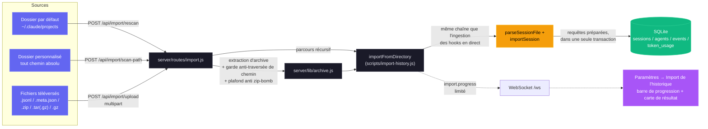

**Routes**

| Méthode | Chemin | Description |
| ------ | ----------------------- | ------------------------------------------------------------------------ |
| `GET` | `/api/import/guide` | Chemins du système, commande d'archive, extensions et instructions selon le fournisseur (`?provider=claude\|codex`) |
| `POST` | `/api/import/rescan` | Analyse à nouveau l'emplacement par défaut choisi : `~/.claude/projects` ou `~/.codex/sessions` (`{ provider }`) |
| `POST` | `/api/import/scan-path` | Analyse un répertoire absolu avec `{ path, provider }` ; parcours récursif |
| `POST` | `/api/import/upload` | Téléversement multipart de `.jsonl`, `.meta.json`, `.zip`, `.tar(.gz)`, `.gz` avec `provider` |

**Entrées prises en charge.** Transcriptions de session JSONL isolées (`.jsonl`),
leurs fichiers compagnons `.meta.json`, et archives (`.zip`, `.tar`,
`.tar.gz`/`.tgz`, `.gz` simple) contenant n'importe quelle arborescence imbriquée.
Les deux organisations canoniques de Claude Code sont reconnues automatiquement :
`<project>/<sessionId>/subagents/agent-*.jsonl` (par défaut) et
`<project>/subagents/<sessionId>/agent-*.jsonl` (alternative).
Pour Codex, l'importeur reconnaît récursivement les fichiers de session `rollout-*.jsonl`
(y compris les fichiers JSONL isolés contenant `session_meta`) et un fichier
facultatif `session_index.jsonl` pour les noms de session natifs.

**Garanties d'exactitude.** Les sessions sont dédoublonnées par UUID ; relancer
l'importeur est toujours sans risque. Les colonnes de compaction `baseline_input` /
`baseline_output` / `baseline_cache_read` / `baseline_cache_write`
conservent les comptes de tokens d'avant la compaction d'une transcription,
si bien que réingérer un JSONL postérieur à une compaction n'efface jamais le coût historique.
Le dédoublonnage au niveau des événements utilise un maximum par type d'événement
(`MAX(created_at) GROUP BY event_type` pour la session) : à chaque
réimport, seules les entrées JSONL avec `ts > cutoff[type]` sont insérées, si bien que
les sessions de longue durée dont les transcriptions grandissent sur plusieurs jours
continuent de recevoir des événements Stop / PostToolUse / TurnDuration / ToolError
sans dupliquer le travail antérieur. `sessions.ended_at` est avancé
jusqu'à la dernière activité du JSONL quand celle-ci dépasse la valeur
stockée, et les métadonnées de nombre de messages sont rafraîchies à chaque passe.

**Sécurité face aux transcriptions énormes.** Le cache de transcriptions partagé
(`server/lib/transcript-cache.js`) lit les fichiers JSONL par morceaux de 4 Mio
et ne décode qu'une ligne à la fois, si bien que des transcriptions plus grandes que
la longueur maximale d'une chaîne JS de V8 (~512 Mio sur Node 20 en 64 bits)
s'analysent sans faire planter le processus avec `FATAL ERROR: v8::ToLocalChecked Empty
MaybeLocal`. Le même chemin par morceaux est utilisé par l'ingestion des hooks, le
balayage périodique des compactions et l'importeur d'historique — aucun d'eux ne
matérialise le fichier entier en une seule chaîne JS. Les tableaux extensibles de chaque entrée
(`turnDurations`, `errors`, `compaction.entries`,
`usageExtras.*`) sont plafonnés par la fin à `TRANSCRIPT_CACHE_MAX_ARRAY_LEN`
(`1000` par défaut), avec un élagage appliqué pendant l'analyse à un seuil de `2 × cap`,
pour qu'une analyse complète neuve d'une session de plusieurs jours ne puisse pas
construire une structure transitoire sans limite avant la finalisation.

**Sécurité.** L'extraction d'archive vérifie chaque entrée contre la traversée
de chemin (les chemins absolus et les segments `..` sont refusés). Un
plafond d'extraction configurable (`CCAM_IMPORT_MAX_EXTRACT_BYTES`, 4 Go
par défaut) arrête les bombes zip/tar/gzip. La taille des téléversements est plafonnée par fichier
(`CCAM_IMPORT_MAX_BYTES`, 1 Go par défaut) et par requête
(`CCAM_IMPORT_MAX_FILES`, 2000 par défaut). Tous les répertoires de préparation sont
propres à chaque requête et récupérés dans `finally`, y compris quand multer refuse
tous les fichiers d'emblée.

**Progression.** L'activité d'import est diffusée sur le WebSocket existant
sous forme de messages `import.progress` (`phase` : `start` / `scan` / `extract` /
`parse` / `complete` / `error`), limités en fréquence pour ne pas inonder le
canal lors de gros imports.

**Interface.** Utilisez le panneau **Paramètres → Import de l'historique** pour une expérience
guidée par glisser-déposer, avec des instructions pas à pas, la progression en direct
et un résumé après import indiquant le nombre d'éléments importés / enrichis / ignorés /
en erreur.

<p align="center">
  
</p>

### WebSocket

Connectez-vous à `ws://localhost:4820/ws` pour recevoir des messages poussés en temps réel :

```json
{
  "type": "agent_updated",
  "data": { "id": "...", "status": "working", "current_tool": "Edit" },
  "timestamp": "2026-03-05T15:43:01.800Z"
}
```

**Types de messages :** `session_created`, `session_updated`, `agent_created`, `agent_updated`, `new_event`, `alert_triggered`, `alert_updated`, `remote_source.status` (données `{ id, status: "idle"|"syncing"|"ok"|"error"|"deleted", error?, last_sync_at? }`)

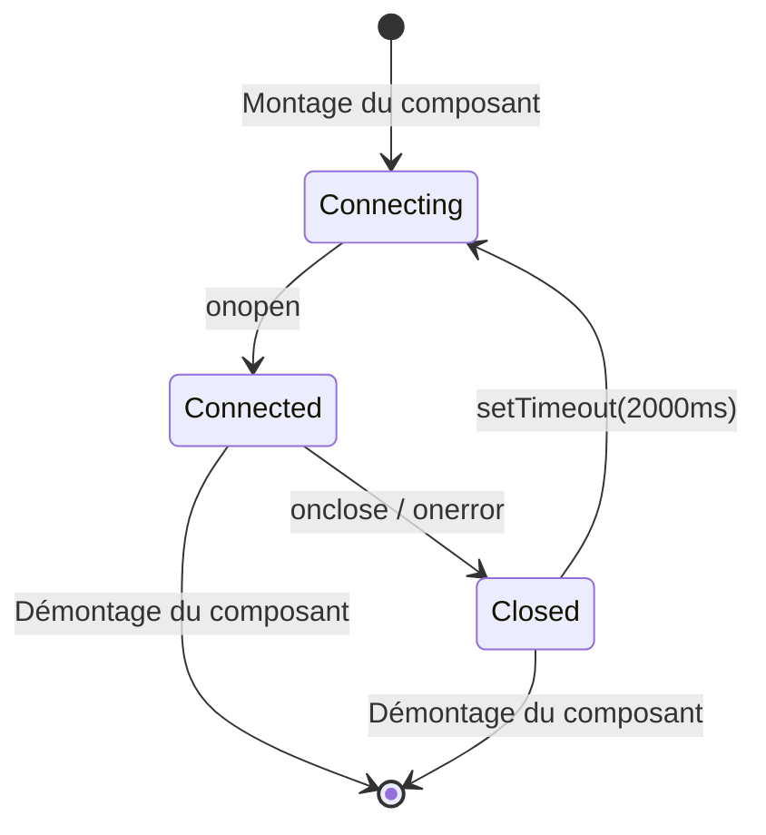

---

## Événements de hook

Le tableau de bord traite ces types de hooks de Claude Code :

| Type de hook | Déclencheur | Action du tableau de bord |
| ------------------- | ------------------------------ | -------------------------------------------------------------------------------------------- |
| `SessionStart` | Début d'une session Claude Code | Crée la session et l'agent principal. Horodate `awaiting_input_since` (avec `awaiting_reason=session_start`) pour qu'une session neuve arrive **En attente** — sauf un SessionStart de source `compact` (auto-compaction en plein tour), qui laisse l'indicateur intact pour qu'une session en cours reste **Active**. Réactive les sessions reprises. Abandonne les sessions orphelines sans activité depuis `DASHBOARD_STALE_MINUTES` (180 par défaut) |
| `UserPromptSubmit` | L'utilisateur valide un prompt | Efface l'indicateur d'attente et fait passer l'agent principal à `working` — seul signal du début des tours de l'assistant purement textuels, puisqu'ils n'émettent pas de `PreToolUse` |
| `PreToolUse` | Un agent commence à utiliser un outil | Efface l'indicateur d'attente, passe l'agent à `working`, définit `current_tool`. Si l'outil est `Agent`, crée un enregistrement de sous-agent |
| `PostToolUse` | Exécution d'outil terminée | Efface l'indicateur d'attente (gère les approbations de demandes d'autorisation où la Notification l'avait posé en plein outil). Efface `current_tool`. L'agent reste `working` |
| `Stop` | Claude a fini de répondre | Sans erreur : agent principal → `waiting` — Claude a terminé son tour, la balle est dans le camp de l'utilisateur. `stop_reason=error` : marque l'agent et la session `error`. Les sous-agents en arrière-plan continuent de tourner |
| `SubagentStop` | Un agent en arrière-plan a terminé | Associe et termine le sous-agent par description, type ou tâche. N'efface volontairement PAS l'indicateur d'attente — la fin d'un sous-agent ne nous apprend rien sur l'humain. **Déclenche sans attendre une analyse JSONL** (`scanAndImportSubagents`) qui émet des événements `PreToolUse` + `PostToolUse` par outil sous l'`agent_id` propre au sous-agent, pour que la Chronologie montre chaque outil exécuté par le sous-agent, et pas seulement le marqueur de lancement |
| `Notification` | Notification d'un agent | Journalise l'événement. Les messages de demande d'autorisation/de saisie passent l'agent à `waiting` et horodatent `awaiting_input_since` (avec `awaiting_reason=notification`, repérés par motif : `permission`, `waiting for input`, `needs your approval`, …). Les notifications de compaction sont marquées comme événements `Compaction`. Déclenche une notification du navigateur si elle est activée |
| `SessionEnd` | Le processus CLI de Claude Code se termine | Retire l'indicateur d'attente. Si la session est déjà en `error`, l'état d'erreur est conservé ; sinon, marque tous les agents et la session `completed` |
| `Compaction` | `/compact` détecté dans le JSONL | Crée un sous-agent de compaction (type `compaction`) et un événement Compaction. Détecté via les entrées `isCompactSummary` du JSONL de transcription. Également détecté par le scanner périodique pour les sessions actives |
| `APIError` | Erreur d'API dans la transcription JSONL | Extrait des entrées `isApiErrorMessage` (quota, limite de débit, invalid_request) et des réponses brutes `type: "error"`. **Marque désormais immédiatement la session et l'agent `error`** — auparavant enregistré comme événement sans changement de statut. Stocké comme événement avec le détail de l'erreur |
| `TurnDuration` | Durée d'un tour dans la transcription JSONL | Extrait des messages `system` de sous-type `turn_duration` portant `durationMs`. Stocké comme événement pour l'analyse des durées par tour |
| `ToolError` | Erreur de résultat d'outil dans le JSONL | Extrait des entrées `toolUseResult.is_error`. Suit les échecs au niveau des outils pour l'analyse de la propagation des erreurs |
| `RemoteToolEvent` | Appel d'outil poussé par une machine distante | Écrit par `POST /api/hooks/ingest-batch` pour chaque élément de `tool_events[]` poussé par une machine nomade/derrière un NAT. Dédoublonné par `(session_id, event_type, uuid)`, contre les lignes validées comme au sein du lot, si bien que renvoyer un lot est sans risque |
| `RemoteTurn` | Durée de tour poussée par une machine distante | Écrit par `POST /api/hooks/ingest-batch` pour chaque élément de `turns[]`, avec le `duration_ms` de ce tour. Même dédoublonnage `(session_id, event_type, uuid)` que `RemoteToolEvent` |
| `Interrupted` | Tour annulé par l'utilisateur (Échap) | Synthétisé par le watchdog — `Esc` ne déclenche aucun hook, une session bloquée en `working` est donc détectée grâce au marqueur `[Request interrupted by user]` de la transcription ou, quand Échap a précédé toute sortie, grâce au délai d'inactivité en travail (`DASHBOARD_WORKING_IDLE_SECONDS`). La session passe **En attente** (comme après un `Stop` normal) |

---

## Notifications du navigateur

Le tableau de bord prend en charge des notifications persistantes du navigateur via Web Push (VAPID), pour des alertes en temps réel même quand l'onglet du tableau de bord n'a pas le focus ou que le navigateur est en arrière-plan.

### Fonctionnement

1. **Activez** les notifications sur la page Paramètres via l'interrupteur général
2. **Accordez** l'autorisation du navigateur quand elle est demandée — cela enregistre un Service Worker et crée un abonnement push
3. **Configurez** les événements qui déclenchent des notifications :

| Événement | Défaut | Description |
| ---------------------------- | ------- | --------------------------------------------------------------- |
| Nouvelle session démarrée | Activé | Se déclenche à la création d'une nouvelle session Claude Code |
| Claude a fini de répondre | Désactivé | Se déclenche sur les événements `Stop` quand Claude termine un tour de réponse |
| Session fermée | Désactivé | Se déclenche sur `SessionEnd` quand le processus CLI se termine |
| Erreurs de session | Activé | Se déclenche quand une session se termine par une erreur |
| Sous-agent lancé | Désactivé | Se déclenche à la création d'un sous-agent en arrière-plan |

De plus, tout événement de hook `Notification` de Claude Code déclenche une notification du navigateur, quels que soient les interrupteurs par événement (tant que l'interrupteur général est activé).

### Architecture des notifications

- **Chaîne VAPID :** utilise `web-push` sur le serveur pour une livraison sécurisée des messages. Les clés VAPID sont générées automatiquement et stockées dans `data/vapid-keys.json`.
- **Service Worker :** un worker dédié (`client/public/sw.js`) gère les événements `push` entrants et affiche les notifications avec `silent: false` pour garantir le son sous macOS.
- **Abonnements :** les points de terminaison propres à chaque navigateur sont stockés dans la table `push_subscriptions` de SQLite.
- **Persistance :** les notifications arrivent même si le navigateur est fermé, car le Service Worker fonctionne en arrière-plan.
- **Notification de test :** un bouton dans les Paramètres permet de vérifier la chaîne VAPID et la lecture du son.

### PWA et prise en charge hors ligne

Le projet fournit trois Progressive Web Apps indépendantes — une pour le **tableau de bord**, une pour la **page d'accueil** et une pour le **wiki**. Chacune a son propre `manifest.json` et son Service Worker, si bien que le navigateur les traite comme des applications installables distinctes.

| Surface | Manifeste | Service Worker | Stratégie de cache |
| --- | --- | --- | --- |
| Tableau de bord (`client/`) | `client/public/manifest.json` | `client/public/sw.js` | Les bundles Vite à hash de contenu sous `/assets/*` sont servis en cache d'abord (les URL sont immuables par build). Tout le reste — navigations, le SW lui-même, `manifest.json`, icônes, racine `/` — est servi en réseau d'abord avec repli sur le cache, si bien qu'un nouveau build affiche toujours l'interface la plus récente sans rechargement forcé. Les requêtes d'API (`/api/*`), WebSocket (`/ws`) et HMR de Vite ne sont jamais mises en cache. Les gestionnaires de notifications push sont conservés à côté de la logique de cache. Le middleware statique d'Express (`server/index.js`) renforce ce comportement en envoyant `Cache-Control: public, max-age=31536000, immutable` pour `/assets/*` et `Cache-Control: no-cache, must-revalidate` pour `index.html`, `sw.js` et `manifest.json`. `client/src/main.tsx` écoute `controllerchange` : quand un nouveau SW s'active sur une page déjà contrôlée, il recharge exactement une fois (pas lors des premières installations). |
| Page d'accueil (racine) | `manifest.json` | `sw.js` | Pré-cache la coquille HTML, le favicon et l'image OG. Les captures PNG sont mises en cache à la première consultation (cache d'abord) pour éviter un pré-cache initial trop lourd. La navigation est en réseau d'abord avec repli hors ligne. |
| Wiki (`wiki/`) | `wiki/manifest.json` | `wiki/sw.js` | Pré-cache `index.html`, `style.css`, `script.js`, le manifeste et le favicon. Entièrement utilisable hors ligne après une visite. HTML en réseau d'abord, CSS/JS en cache d'abord. |

**Cycle de vie du cache :** les trois SW appellent `skipWaiting()` à l'installation et suppriment les caches périmés à l'activation (identifiés par des chaînes de version comme `dashboard-v2`, `landing-v1`, `wiki-v1`). Incrémenter la constante de version force un rafraîchissement propre.

**Prise en charge d'iOS :** les trois fichiers HTML incluent `<meta name="apple-mobile-web-app-capable" content="yes">` et `<meta name="apple-mobile-web-app-status-bar-style" content="black-translucent">` pour le mode autonome sur l'écran d'accueil dans Safari.

**Icônes :** les manifestes référencent `favicon.svg` avec `sizes="any"` et `type="image/svg+xml"` — pris en charge par Chrome 107+, Firefox 110+, Edge 107+. Les icônes Apple touch utilisent aussi le favicon SVG.

---

## Notification de mise à jour

Le tableau de bord surveille son propre checkout git et affiche une fenêtre dès que la branche par défaut canonique a des commits en avance sur HEAD. **Conscient des branches et des forks :** si vous avez un remote `upstream` (la convention habituelle pour les forks), il est préféré à `origin` ; les `master`/`main`/`HEAD` du remote choisi servent de référence de comparaison. La `manual_command` s'adapte à votre situation — `git pull --ff-only` seulement quand votre branche suit réellement la référence canonique, sinon un `git fetch` (et une fusion en avance rapide dans le cas d'un fork), pour que la commande ne mente jamais. Les utilisateurs obtiennent la commande exacte à lancer dans un terminal — le serveur ne tire **jamais** ni ne redémarre de lui-même, ce qui garde le mécanisme portable entre sessions de dev, supervision pm2/systemd/launchd/Docker et déploiements distants.

<p align="center">
  
</p>

### Fonctionnement

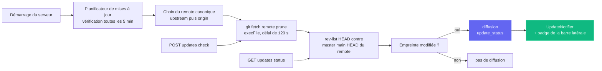

Une vérification est peu coûteuse (`git fetch <remote> --prune` sur le remote canonique — `upstream` s'il est configuré, sinon `origin`), enveloppée dans `execFile` (sans shell) avec un délai de 120 s. Les échecs — réseau hors ligne, installation hors git, aucun remote configuré, référence amont introuvable — renvoient tous des **charges utiles souples** (p. ex. `fetch_error: "..."`) au lieu de lever une exception, si bien qu'un remote capricieux ne bloque jamais le tableau de bord.

### Surfaces d'interface

| Surface | Comportement |
| --- | --- |
| **Fenêtre** (`client/src/components/UpdateNotifier.tsx`) | Apparaît quand `update_available === true` et que l'utilisateur n'a pas déjà écarté ce `remote_sha` précis. Affiche le nombre de commits de retard, la référence suivie, une `situation_note` facultative (sur une branche de fonctionnalité / un fork, la note explique pourquoi la commande diffère), la commande à copier-coller et trois boutons : **Copier la commande** (principal), **Vérifier maintenant**, **Ignorer**. Échap et un clic sur le fond ferment la fenêtre. Indexée par `remote_sha` dans `localStorage`, si bien qu'un commit amont plus récent rouvre automatiquement la fenêtre. |
| **Bouton de la barre latérale** (`client/src/components/Sidebar.tsx`) | Bouton « Rechercher des mises à jour » toujours visible dans le pied de page. Bordure émeraude + pastille verte en cas de retard, ambre quand la dernière vérification a rencontré une erreur de fetch. Un clic efface tout rejet antérieur puis déclenche `POST /api/updates/check`. |
| **Terminal du serveur** | Quand le planificateur passe de « à jour » à « en retard », il affiche sur stdout un bloc encadré avec la commande, pour que les utilisateurs sans interface la voient aussi. |

### Surface d'API

| Point de terminaison | Rôle |
| --- | --- |
| `GET /api/updates/status` | Vérification en lecture seule : lance `git fetch` sur le remote canonique, compare HEAD à sa branche par défaut et renvoie la charge utile. |
| `POST /api/updates/check` | Même vérification, mais diffuse aussi `update_status` sur le WebSocket pour que tous les clients connectés se mettent à jour d'un coup. |

Les deux points de terminaison renvoient la même forme de charge utile :

```json
{
  "git_repo": true,
  "update_available": true,
  "repo_root": "/Users/you/Claude-Code-Agent-Monitor",
  "remote_ref": "upstream/master",
  "canonical_remote": "upstream",
  "current_branch": "master",
  "tracking_upstream": "origin/master",
  "tracks_canonical": false,
  "situation": "fork_or_diverged_tracking",
  "local_sha": "abc1234...",
  "remote_sha": "def5678...",
  "commits_behind": 3,
  "manual_command": "cd \"/...\" && git fetch upstream && git merge --ff-only upstream/master && npm run setup",
  "situation_note": "You're on 'master' tracking 'origin/master'. This command fast-forwards your branch from upstream/master (the canonical default).",
  "message": "3 commit(s) on upstream/master not in your checkout."
}
```

`situation` vaut `tracking_canonical` (clone classique sur la branche par défaut — `git pull --ff-only` fonctionne), `fork_or_diverged_tracking` (le nom de la branche locale correspond à la branche canonique mais suit un autre remote — `git fetch <remote> && git merge --ff-only <ref>`), `feature_branch` (hors de la branche par défaut — fetch uniquement, l'intégration est laissée à l'utilisateur) ou `detached_head`.

### Ce qui n'est **volontairement pas** là

Il n'y a ni `POST /api/updates/apply` ni utilitaire de redémarrage automatique, et c'est voulu. Mettre à jour un processus depuis lui-même n'est pas fiable sans superviseur externe — `npm run dev` (concurrently), `npm start`, `pm2`, `systemd`, `launchd` et Docker demandent chacun une logique de redémarrage différente, et les échecs de `git pull` / `npm install` sur un serveur en train de s'arrêter n'ont aucun chemin de retour arrière propre. Se limiter à la détection garde un comportement prévisible avec tous les superviseurs, tous les systèmes et tous les états de branche, tout en comblant le manque d'information « quand dois-je tirer ? » ; l'utilisateur garde la main sur la mise à jour réelle, dans son propre shell.

### Configuration

| Variable d'environnement | Défaut | Remarques |
| --- | --- | --- |
| `DASHBOARD_UPDATE_CHECK` | activé | Mettre à `0` / `false` / `off` pour désactiver entièrement le planificateur. |
| `DASHBOARD_UPDATE_CHECK_INTERVAL_MS` | `300000` (5 min) | Intervalle entre les vérifications automatiques. Minimum 60 000 ms — les valeurs inférieures sont ramenées à ce seuil. |

---

## Tabby — chat compagnon flottant

**Tabby** est un adorable chat compagnon flottant, épinglé dans le coin inférieur droit de chaque page du tableau de bord. Toujours présent, il transforme le flux de sessions en direct en une mascotte réactive, lisible d'un coup d'œil, à qui l'on peut aussi parler.

<p align="center">
  
</p>

### Mascotte réactive

Tabby est un chat SVG qui suit le curseur, avec **huit humeurs** dérivées du flux de sessions en direct, chacune avec sa propre animation :

| Humeur | Quand | Animation |
| --- | --- | --- |
| `idle` | Rien de notable ne se passe | Coup de queue au repos |
| `watching` | Des sessions sont actives | Oreilles dressées, les yeux suivent le curseur |
| `happy` | Une session ou une exécution s'est bien terminée | Hochement de tête + étincelles |
| `worried` | Quelque chose semble anormal | Léger tremblement |
| `stuck` | Une session semble bloquée | Alerte « ! » |
| `thinking` | Un agent est en plein travail | Lent hochement de tête |
| `sleeping` | Calme depuis un moment | `zzz` |
| `disconnected` | Le WebSocket est coupé | Pose calme et immobile |

### Bulles de dialogue

Tabby affiche automatiquement de courtes répliques lors des événements notables (session démarrée/terminée, erreurs, exécution achevée). Les bulles sont **limitées et regroupées** pour qu'une rafale d'événements n'inonde jamais l'écran, elles utilisent `aria-live` pour les lecteurs d'écran et peuvent être **coupées** depuis le panneau.

### Panneau

Ouvrez le panneau en cliquant sur le chat ou en appuyant sur **⌘B / Ctrl+B** (Échap ferme). Il affiche :

- Une **ligne de statut** en direct — `N live · M errored · connection state`.
- Des **actions rapides** — aller à Lancer Claude, Activité, Sessions ou aux sessions en erreur ; couper les bulles ; effacer les alertes.
- Une zone **Demander** (voir ci-dessous).

### Zone Demander → relais vers Lancer Claude

La zone **Demander** répond localement aux questions simples de statut à partir des données en cache — par exemple « qu'est-ce qui tourne », « des erreurs ? » ou « statut ». Toute autre question est transmise à la page **Lancer Claude** existante (lien profond vers `/run?prompt=…`) pour lancer une vraie session Claude Code. Tabby n'appelle jamais lui-même un LLM ; il réutilise simplement la page Lancer Claude pour tout ce qui dépasse une rapide consultation de statut.

### Accessibilité et dégradation sûre

Tabby est utilisable au clavier, utilise `aria-live` pour ses bulles et respecte `prefers-reduced-motion`. Si le WebSocket est coupé, il se replie en toute sécurité sur un état calme `disconnected` au lieu de produire une erreur. Vous pouvez activer ou désactiver Tabby dans les **Paramètres** (localisé en anglais, chinois, vietnamien, coréen, espagnol, français, allemand, portugais et italien), et l'implémentation se trouve dans `client/src/components/Tabby/`.

---

## Signaux sonores

Le tableau de bord vous donne un **retour audio discret** sur l'activité des sessions en direct : vous pouvez le laisser sur un second écran et entendre quand une exécution se termine ou échoue. Le son est **activé par défaut** et se coupe entièrement en un clic.

### Synthèse sans dépendance

Il n'y a aucune ressource `.mp3` ou `.wav` dans le dépôt et aucune bibliothèque audio dans `package.json`. Chaque signal est généré à la lecture avec la **Web Audio API** : une courte liste d'oscillateurs (sinusoïde ou triangle), chacun avec sa propre enveloppe de gain exponentielle, mélangés via un nœud de gain principal et un filtre passe-bas pour que le résultat reste en retrait de votre travail au lieu de le couper. Tout le moteur tient dans un seul fichier, `client/src/lib/sound.ts`.

### Les signaux

| Signal | Quand il se déclenche | À quoi il ressemble |
| --- | --- | --- |
| `sessionStart` | Une nouvelle session apparaît | Quinte juste ascendante (Do5 → Sol5) |
| `sessionComplete` | Une session a fini de répondre (`Stop`) ou se ferme (`SessionEnd`) | Arpège majeur conclusif (Mi5 → Sol5 → Do6) |
| `sessionError` | Une session passe à l'état `error` | Douce tierce mineure descendante sur une onde triangulaire — perceptible sans être alarmante |
| `subagentSpawn` | Un sous-agent est lancé | Un unique pincement bref |
| `notification` | Claude Code émet un événement `Notification` | Paire désaccordée qui sonne comme une petite cloche |
| `connected` / `disconnected` | Le WebSocket du tableau de bord revient ou tombe | Montée / descente de deux notes |
| `click` | Vous appuyez sur un bouton, un lien, un onglet ou un interrupteur | Tic à peine audible |

Les signaux s'inscrivent dans une gamme de do majeur pour que des fins de sons qui se chevauchent ne soient jamais dissonantes, et chaque enveloppe décroît de façon exponentielle au lieu de s'interrompre net, ce qui évite le clic d'un arrêt brutal.

### Rester discret

Trois garde-fous empêchent le son de devenir du bruit :

- **Délai par signal** — un même signal ne se répète pas en moins de ~350 ms (45 ms pour le tic d'interaction).
- **Budget global de rafale** — au plus 4 signaux démarrent dans une fenêtre de 1,2 s, si bien qu'importer l'historique ou se reconnecter après une coupure ne transforme jamais un flot de messages WebSocket en flot de bips.
- **Politique de lecture automatique** — rien ne joue avant votre première interaction avec la page (pointeur, clavier ou toucher), conformément aux règles des navigateurs. Les signaux antérieurs sont ignorés en silence, pas mis en file.

Si le navigateur ne prend pas du tout en charge Web Audio, chaque appel est une opération nulle sans risque — le tableau de bord reste simplement silencieux.

### Paramètres

**Paramètres → Son** propose un interrupteur général, un curseur de volume et un interrupteur par signal. Activer un interrupteur joue immédiatement le signal correspondant pour entendre exactement ce que vous venez d'activer, et un bouton **Écouter le son** joue le carillon de fin à la demande. Les préférences sont conservées dans `localStorage` sous `agent-monitor-sound` et s'appliquent instantanément dans toute l'application — sans rechargement. Le panneau est localisé en anglais, chinois, vietnamien, coréen, espagnol, français, allemand, portugais et italien.

Par défaut, le démarrage de session, la fin de session, l'erreur de session, les notifications de Claude Code et le tic d'interaction sont activés ; le lancement de sous-agents et les changements de connexion sont désactivés (ce sont les plus bavards). L'implémentation se trouve dans `client/src/lib/sound.ts` (moteur + préférences) et `client/src/hooks/useSoundCues.ts` (branchement sur le bus d'événements), monté une seule fois dans `client/src/App.tsx`.

---

## Fenêtre d'état de la connexion

Cliquez sur la pastille **En ligne** / **Déconnecté** en bas de la barre latérale pour ouvrir un petit panneau de détails sur le transport WebSocket du tableau de bord. Il affiche le point de terminaison `ws://` actif, depuis combien de temps le socket actuel est ouvert, le nombre total d'événements reçus, les principaux types d'événements sous forme d'histogramme horizontal, une sparkline du débit sur 60 secondes et les 8 derniers événements dans une liste d'activité récente. Les statistiques cumulées (totaux, répartition par type, liste récente) sont conservées d'un rechargement à l'autre via `localStorage` sous `sidebar-connection-stats` ; la sparkline glissante et le minuteur « connecté depuis » sont volontairement éphémères. Un bouton **Réinitialiser** en pied de panneau efface tout à la demande.

<p align="center">
  
</p>

---

## Extension VS Code

**Claude Code Agent Monitor** est disponible sous forme d'extension VS Code à part entière, pour surveiller vos agents IA sans quitter votre éditeur.

<p align="center">
  
</p>

### 🚀 Fonctionnalités clés
- **Barre latérale en direct** : vue dédiée de la barre d'activité affichant en temps réel la santé des agents (En cours, En attente, Terminé, etc.).
- **Analyses d'utilisation** : suivez le total des tokens, les coûts en USD en direct et le nombre d'événements directement dans la barre latérale.
- **Intégration à la barre d'état** : moniteur d'activité d'un coup d'œil dans la barre du bas, avec les sessions et agents actifs.
- **Navigation directe** : accès en un clic à des vues précises du tableau de bord (Kanban, Analyses, Paramètres) ou aux sessions récentes.
- **Onglet intégré** : ouvre le tableau de bord de surveillance complet dans un onglet webview natif de VS Code.

### 📦 Installation et configuration
1. Ouvrez le répertoire [vscode-extension](./vscode-extension).
2. Installez l'extension depuis la Marketplace ou empaquetez-la vous-même avec `vsce package`.
3. Vérifiez que votre serveur de tableau de bord local tourne (`npm run dev`).
4. Cliquez sur l'**icône radar** de la barre d'activité de VS Code pour commencer.

Pour la configuration détaillée côté développeur, voir les répertoires [.vscode](./.vscode) et [vscode-extension](./vscode-extension).

> [!TIP]
> Extension sur la VS Code Marketplace : [Claude Code Agent Monitor](https://marketplace.visualstudio.com/items?itemName=hoangsonw.claude-code-agent-monitor)

---

## Application de bureau (macOS et Windows)

Le tableau de bord existe aussi sous forme d'**application de bureau native** facultative, à installer une fois pour toutes — une `.app` macOS (distribuée en `.dmg`) et un `.exe` Windows (un installeur NSIS plus une version portable sans installation). Elle se trouve dans l'espace de travail `desktop/`, à côté de `client/`, `server/`, `mcp/` et `vscode-extension/`, et est construite avec **Electron 35**.

<p align="center">
  
  <br>
  <em>🍎🪟 <strong>Application de bureau</strong> — coquille native avec icône dans la barre de menus / zone de notification (tray), ouverture à la connexion et verrou d'instance unique. Le même tableau de bord, dans une vraie fenêtre du système (ici macOS).</em>
</p>

<p align="center">
  
  <br>
  <em>🪟 Le même tableau de bord en application Windows native — icône dans la zone de notification (tray), menu de fenêtre natif et ouverture à la connexion.</em>
</p>

Tout ce que vous voyez dans le navigateur sur `localhost:4820` vit dans cette fenêtre, avec en plus le cycle de vie natif du système : une icône de tray, un menu d'application natif, l'intégration au démarrage automatique et un seul bouton Quitter qui arrête proprement le serveur.

### Fonctionnement

Contrairement au lancement du tableau de bord depuis un terminal, l'application de bureau ne demande ni `npm start`, ni shell ouvert, ni seconde copie du serveur. Le **processus principal** d'Electron héberge le serveur Express **dans le même processus** — il fait directement un `require()` de `server/index.js` dans le même runtime Node, **sans processus enfant ni IPC** — et pointe une `BrowserWindow` Chromium vers le client React compilé.

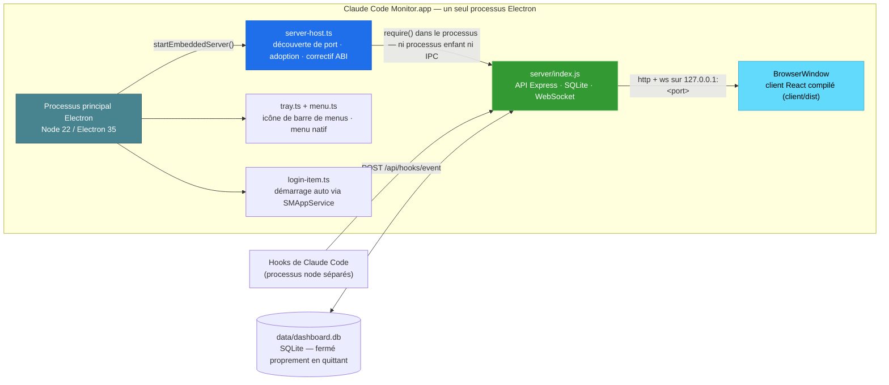

Au lancement, l'application :

1. Choisit un port libre — de préférence **4820**, sinon **4821–4829**, puis un port élevé aléatoire si tous sont pris.
2. Si un serveur de tableau de bord sain répond déjà à `/api/health` sur `4820` (p. ex. vous avez lancé `npm start` dans un terminal), elle **adopte ce serveur** au lieu de s'y lier en double — pas de conflit de port, pas de contention SQLite. Un serveur adopté continue de tourner après la fermeture de l'application.
3. Sinon, elle démarre le serveur embarqué et, au **premier démarrage avec son propre serveur**, installe automatiquement les hooks de Claude Code et démarre les services d'arrière-plan (planificateur de mises à jour, `cc-watcher`, réconciliation des exécutions orphelines). Un utilisateur qui n'installe que le DMG voit donc les événements arriver **sans aucune configuration manuelle** — ni checkout, ni `npm run install-hooks`.
4. **(macOS)** Récupère le **`PATH` du shell de connexion** pour que la fonction **Lancer Claude** puisse trouver et lancer la CLI `claude` — une application lancée depuis le Finder/le Dock n'hérite sinon que du `PATH` minimal de launchd et ne trouverait pas les CLI dans `~/.local/bin`, `/opt/homebrew/bin`, les répertoires des gestionnaires de versions, etc. (Sous Windows, le processus hérite déjà du `PATH` de l'utilisateur.)
5. Ouvre la fenêtre du tableau de bord — sauf si l'application a été lancée à l'ouverture de session (sous macOS via les éléments d'ouverture ; sous Windows via l'entrée balisée `HKCU\…\Run`), auquel cas elle reste dans le tray.
6. En quittant, arrête proprement le serveur embarqué et **ferme SQLite proprement** (checkpoint WAL).

### Fonctionnalités

- **Icône de tray** — surface d'état toujours présente (barre de menus macOS / zone de notification Windows). Un clic gauche affiche/masque la fenêtre du tableau de bord ; un clic droit ouvre un menu contextuel avec **Ouvrir le tableau de bord**, **Ouvrir dans le navigateur**, **Redémarrer le serveur**, **Afficher les journaux**, **Ouvrir à la connexion** (bascule) et **Quitter**. macOS utilise un glyphe modèle teinté ; Windows utilise l'`icon.ico` en couleur (un modèle noir disparaîtrait sur la barre des tâches sombre).
- **Icône de fenêtre et de barre des tâches** — la `BrowserWindow` est reliée au logo coloré de l'application (`icon.ico` sous Windows, `icon.png` ailleurs), si bien que la barre de titre / des tâches affiche la vraie icône de Claude Code Monitor — même une exécution non empaquetée `npm run desktop:dev` n'affiche plus l'icône générique d'Electron.
- **Menu d'application natif** — menu standard `About` / `File` / `Edit` / `View` / `Window` / `Help` avec les raccourcis `⌘` / `Ctrl`. L'élément **File → Open Dashboard** (`⌘1`) est **réservé à macOS** : macOS garde une barre de menus globale une fois la fenêtre masquée et peut donc la rouvrir — sous Windows/Linux, le menu est attaché à la fenêtre et ne peut pas se déclencher quand elle est masquée ; rouvrez-la plutôt via **Ouvrir le tableau de bord** du tray (qui ramène la fenêtre de façon fiable, même réduite ou derrière d'autres fenêtres).
- **Démarrage automatique à la connexion** — activez **Ouvrir à la connexion** depuis le tray ou le menu de l'application. Sous macOS, l'inscription passe par l'API moderne `SMAppService`, si bien que l'entrée apparaît dans **Réglages Système → Général → Ouverture** ; sous Windows, elle écrit une entrée par utilisateur `HKCU\Software\Microsoft\Windows\CurrentVersion\Run`, visible dans **Gestionnaire des tâches → Démarrage**.
- **Fermer la fenêtre la masque, le serveur continue** — fermer la fenêtre ne fait que la masquer ; le serveur et le tray restent actifs. Cliquez sur le tray pour faire revenir la fenêtre.
- **Verrou d'instance unique** — un second lancement met simplement la fenêtre existante au premier plan ; pas de second serveur, pas de conflit de port. (S'applique sur toutes les plateformes.)
- **Les données survivent aux réinstallations et mises à jour** — la base SQLite et les clés VAPID se trouvent dans le répertoire de données d'application par utilisateur, **hors du bundle / du répertoire d'installation** — `~/Library/Application Support/Claude Code Monitor/data/` sous macOS, `%APPDATA%\Claude Code Monitor\data\` sous Windows. Un bundle empaqueté est en lecture seule : y écrire la base casserait l'import de l'historique et la persistance des événements ; la garder dans les données d'application règle ce problème et laisse intact votre historique importé quand vous remplacez ou mettez à jour l'application. (Le désinstalleur NSIS de Windows conserve ces données par défaut.)
- **CLI `claude` dans le PATH** — sous macOS, l'application récupère au démarrage le `PATH` de votre shell de connexion, si bien que la fonction **Lancer Claude** fonctionne même si une application lancée depuis le Finder/le Dock n'hériterait sinon que du `PATH` minimal de launchd. (Sous Windows, le `PATH` utilisateur hérité l'inclut déjà.)
- **Journaux** — le processus principal écrit dans `~/Library/Logs/Claude Code Monitor/desktop.log` (macOS) ou `%APPDATA%\Claude Code Monitor\logs\desktop.log` (Windows) ; accédez-y via **Afficher les journaux** dans le menu du tray.

### L'obtenir

**Option A — télécharger un installeur précompilé (recommandé).** Depuis **[Releases → latest](https://github.com/hoangsonww/Claude-Code-Agent-Monitor/releases/latest)** (public, sans connexion GitHub). La CI publie automatiquement une nouvelle release `vX.Y.Z` chaque fois que la version de `package.json` change sur `master`, si bien que ce lien sert toujours le build actuel :

| Plateforme | Fichier | Remarques |
| --- | --- | --- |
| macOS (Apple Silicon) | `ClaudeCodeMonitor-<ver>-arm64.dmg` | à glisser dans `/Applications` |
| macOS (Intel) | `ClaudeCodeMonitor-<ver>-x64.dmg` | à glisser dans `/Applications` |
| Windows (installeur) | `ClaudeCodeMonitor-Setup-<ver>-x64.exe` | installation par utilisateur, sans droits d'administrateur |
| Windows (portable) | `ClaudeCodeMonitor-<ver>-x64-portable.exe` | s'exécute sans installation |

Des builds frais par commit existent aussi sous forme d'artefacts de CI (connexion requise, conservés 14 jours) : `ClaudeCodeMonitor-dmg` issu du job `🍎 macOS Desktop (DMG)` et `ClaudeCodeMonitor-win` issu du job `🪟 Windows Desktop (EXE)` — utiles pour tester `master` avant le prochain tag de release.

**Option B — la compiler vous-même.** Depuis la racine du dépôt :

```bash
npm run setup                # install root + client deps, build client, install hooks
npm run build                # build the React client (client/dist)
npm run desktop:install      # install Electron + electron-builder into desktop/ (preflights native deps; prints setup help on failure)
npm run desktop:dmg:arm64    # macOS:   fast single-arch DMG → desktop/release/ClaudeCodeMonitor-<ver>-arm64.dmg
npm run desktop:win          # Windows: NSIS installer → desktop/release/ClaudeCodeMonitor-Setup-<ver>-x64.exe
```

> [!NOTE]
> **Les DMG se compilent sous macOS ; les `.exe` Windows sous Windows** — electron-builder empaquette pour le système hôte. Le build macOS `npm run desktop:dmg` empaquette l'application **deux fois** (une par architecture) et produit **les deux** DMG par architecture (`arm64` + `x64`) — c'est le build de release ; il ne les fusionne pas en un binaire universel. Pour votre propre Mac, utilisez `desktop:dmg:arm64` / `desktop:dmg:x64`, mono-architecture. Sous Windows, `better-sqlite3` est récupéré sous forme de binaire Electron précompilé par `npm run desktop:install`, si bien qu'aucune chaîne de compilation C++ de Visual Studio n'est nécessaire dans le cas courant. Si le build échoue malgré tout (pas de binaire précompilé, ou chaîne de compilation C++ absente), `desktop:install` affiche la correction exacte pour chaque système ainsi qu'une alternative sans chaîne de compilation, et échoue bruyamment au lieu de laisser une installation cassée.

### L'installer

**macOS :**

1. Double-cliquez sur le `.dmg` pour le monter.
2. Faites glisser **Claude Code Monitor.app** dans votre dossier `/Applications`.
3. Le DMG est **signé ad hoc** par défaut, si bien que Gatekeeper avertit au premier lancement (*« Apple n'a pas pu vérifier… »*). Retirez l'attribut de quarantaine :

   ```bash
   xattr -cr "/Applications/Claude Code Monitor.app"
   ```

   Ou ouvrez **Réglages Système → Confidentialité et sécurité** et cliquez sur **Ouvrir quand même**.

4. Lancez l'application. L'icône de tray apparaît et la fenêtre du tableau de bord s'ouvre.

**Windows :**

1. Lancez `ClaudeCodeMonitor-Setup-<ver>-x64.exe`. Il s'installe **pour l'utilisateur** sous `%LOCALAPPDATA%\Programs\Claude Code Monitor` (sans élévation administrateur) et vous laisse choisir le répertoire d'installation ; vous pouvez aussi lancer le `*-portable.exe` pour démarrer sans installer.
2. L'installeur n'est **pas signé** par défaut, si bien que **SmartScreen** peut afficher *« Windows a protégé votre ordinateur »* au premier lancement — cliquez sur **Informations complémentaires → Exécuter quand même**.
3. Lancez-la depuis le menu Démarrer / le raccourci du bureau. L'icône de la zone de notification (tray) apparaît et la fenêtre du tableau de bord s'ouvre.

<p align="center">
  
  <br>
  <em>Installeur Windows · Étape 1 — <strong>Choose Installation Options</strong> (par utilisateur « Only for me » ou tous les utilisateurs).</em>
</p>

<p align="center">
  
  <br>
  <em>Installeur Windows · Étape 2 — <strong>Choose Install Location</strong> (par défaut <code>%LOCALAPPDATA%\Programs</code>, par utilisateur).</em>
</p>

<p align="center">
  
  <br>
  <em>Installeur Windows · Étape 3 — <strong>Completing Setup</strong> (terminer et lancer l'application).</em>
</p>

### Commandes de build

Toutes les commandes se lancent depuis la **racine du dépôt** :

| Commande | Ce qu'elle fait |
| --------------------------- | ---------------------------------------------------------------------------- |
| `npm run desktop:install` | Installe Electron + electron-builder dans `desktop/` ; recompile `better-sqlite3` pour l'ABI d'Electron ; vérifie au préalable la compilation native de `better-sqlite3` et affiche une aide concrète (dont une alternative sans chaîne de compilation) en cas d'échec |
| `npm run desktop:build` | Compile les sources TypeScript du bureau dans `desktop/out/` |
| `npm run desktop:dev` | Compile et lance l'application Electron pour itérer en local |
| `npm run desktop:test` | Lance le test de fumée (démarre Electron, sonde `/api/health`, s'arrête) |
| `npm run desktop:dmg` | **macOS :** construit **les deux** DMG (arm64 + x64) — correct pour une release, **plus lent** (empaquette chaque architecture) |
| `npm run desktop:dmg:arm64` | **macOS :** construit un DMG Apple Silicon seulement — **rapide** (~1 min), recommandé pour votre propre Mac |
| `npm run desktop:dmg:x64` | **macOS :** construit un DMG Intel seulement — **rapide** (~1 min) |
| `npm run desktop:dmg:universal` | **macOS :** construit un unique DMG **universel** fusionné (arm64 + x86_64) — facultatif, **le plus lent**, et pas ce que publie la release |
| `npm run desktop:win` | **Windows :** construit l'installeur NSIS `.exe` (x64) |
| `npm run desktop:win:portable` | **Windows :** construit le `.exe` portable sans installation (x64) |

Le DMG macOS obtenu pèse **~80 Mo** (≈ 250 Mo sur disque une fois installé) et l'installeur Windows est comparable — le coût habituel d'un bundle Electron.

### Signature et notarisation

Le DMG macOS est **signé ad hoc** par défaut, pour que chacun puisse compiler une `.app` fonctionnelle sans compte Apple Developer payant — le script `package` définit `CSC_IDENTITY_AUTO_DISCOVERY=false` pour qu'un certificat de signature déjà présent dans le trousseau du contributeur ne soit jamais choisi automatiquement. La vraie **signature Developer ID** s'active sur demande via `CSC_LINK` (un `.p12` encodé en base64) et `CSC_KEY_PASSWORD` ; la **notarisation Apple** s'active sur demande via `APPLE_ID`, `APPLE_TEAM_ID` et `APPLE_APP_SPECIFIC_PASSWORD`. Le build **Windows** n'est **pas signé** par défaut (SmartScreen peut afficher un avertissement au premier lancement — *Informations complémentaires → Exécuter quand même*) ; la signature Authenticode ne s'active que lorsqu'un certificat explicite est fourni via `CSC_LINK` + `CSC_KEY_PASSWORD`. La CI prend tout cela en compte automatiquement dès que ces valeurs sont fournies — aucune modification de code nécessaire.

### Notes d'implémentation

- **`better-sqlite3`** est le seul module natif de l'arbre de dépendances, et un module natif doit être compilé pour l'ABI Node exacte sur laquelle il tourne. L'espace de travail `desktop/` embarque sa **propre copie** de `better-sqlite3`, recompilée pour l'ABI d'Electron, et utilise une redirection de `require` locale au processus pour y faire pointer `server/db.js` ; la copie à la racine du dépôt reste compilée pour le Node du système (si bien que `npm run test:server` continue de fonctionner).
- **Compiler un DMG recompile `better-sqlite3` pour l'architecture cible**, ce qui peut laisser la copie du bureau compilée pour l'autre architecture de processeur et casser `npm run desktop:dev` / `npm run desktop:test` avec `ERR_DLOPEN_FAILED`. L'étape `prebuild` du bureau **répare désormais automatiquement** le module natif pour la machine locale au build suivant, si bien que les flux de dev et de test de fumée continuent de fonctionner après un build de DMG propre à une architecture. L'étape `prebuild` **échoue aussi immédiatement avec une aide à la configuration** quand le binaire natif de `better-sqlite3` est totalement absent, transformant un plantage à l'exécution en une erreur de build copiable-collable.
- La **seule modification hors de `desktop/`** est un refactoring de `server/index.js` qui préserve le comportement : son amorçage post-écoute (planificateur de mises à jour, `cc-watcher`, réconciliation des exécutions orphelines) a été extrait dans une fonction exportée `startBackgroundServices()`, pour que le serveur embarqué exécute exactement ce qu'exécute `node server/index.js`. Le chemin autonome `node server/index.js` est fonctionnellement inchangé ; `client/`, `scripts/`, `mcp/` et `vscode-extension/` ne sont pas touchés.
- Deux jobs de CI du bureau, filtrés par chemin, compilent, testent et empaquettent l'application : **`🍎 macOS Desktop (DMG)`** sur `macos-latest` (publie l'artefact `ClaudeCodeMonitor-dmg` — deux DMG mono-architecture) et **`🪟 Windows Desktop (EXE)`** sur `windows-latest` (publie l'artefact `ClaudeCodeMonitor-win` — installeur NSIS + version portable). Lors d'un push qui change la version sur `master`, le job `release` joint **à la fois** les DMG macOS et les `.exe` Windows à la GitHub Release `vX.Y.Z` publiée. L'icône Windows (`desktop/assets/icon.ico`) est versionnée dans le dépôt (régénérez-la depuis `icon.png` avec `npm run build:win-icon`, PowerShell + .NET, sans outil supplémentaire).

Pour le guide utilisateur complet (téléchargement, installation, Gatekeeper / SmartScreen, menu du tray, démarrage automatique), voir [`DESKTOP.md`](./DESKTOP.md) ; pour la référence contributeur / architecture (modèle de processus, cycle de démarrage, découverte de port, chaîne de build — avec des diagrammes Mermaid), voir [`desktop/README.md`](./desktop/README.md).

---

## Stockage des données

- **Moteur :** SQLite 3 via `better-sqlite3` (facultatif) ou le module intégré de Node.js `node:sqlite`
- **Emplacement :** `data/dashboard.db`
- **Mode de journal :** WAL (lectures concurrentes pendant les écritures)
- **Réinitialisation :** supprimez `data/dashboard.db` pour effacer toutes les données

### Diagramme entité-relation

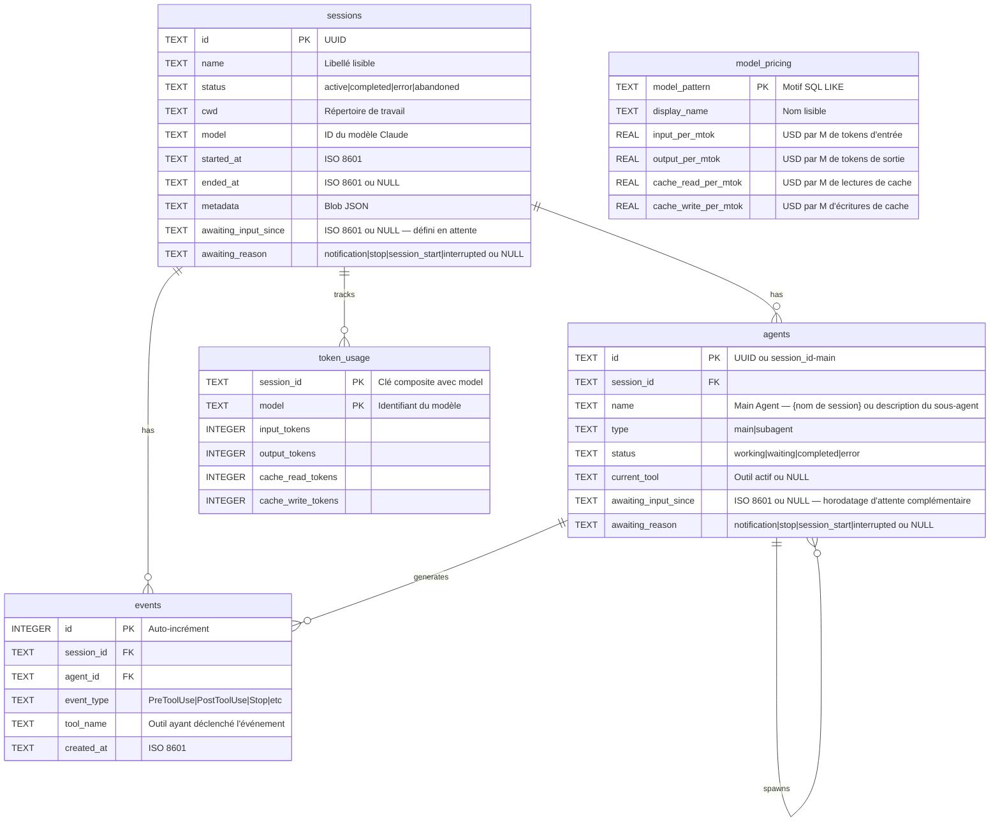

---

## Marketplace de plugins

CCAM fournit **14 plugins** à partir d'une seule arborescence source partagée. Claude Code lit `.claude-plugin/marketplace.json` ; Codex lit `.agents/plugins/marketplace.json` ainsi que le `.codex-plugin/plugin.json` de chaque plugin. L'ensemble contient **66 skills de plugins, 18 sous-agents Claude, 34 commandes Claude, 3 utilitaires CLI, 3 configurations de hooks et 2 plugins avec MCP**.

```bash
# Claude Code
claude plugin marketplace add hoangsonww/Claude-Code-Agent-Monitor
claude plugin install ccam-platform@claude-code-agent-monitor-plugins

# Codex
codex plugin marketplace add hoangsonww/Claude-Code-Agent-Monitor
codex plugin add ccam-platform@claude-code-agent-monitor-plugins

# Open Agent Skills / skills.sh-compatible CLI
npx skills add hoangsonww/Claude-Code-Agent-Monitor --list

# Install one skill for Claude Code and Codex in the current project
npx skills add hoangsonww/Claude-Code-Agent-Monitor \
  --skill mcp-server \
  --agent claude-code \
  --agent codex \
  --yes

# Verify, update, and remove the project-scoped skill
npx skills list --json
npx skills update --project --yes
npx skills remove mcp-server --yes

# Add --global to install at user scope, then manage that scope explicitly
npx skills add hoangsonww/Claude-Code-Agent-Monitor \
  --skill mcp-server \
  --agent claude-code \
  --agent codex \
  --global \
  --yes
npx skills list --global --json
npx skills update --global --yes
npx skills remove --global mcp-server --yes
```

La CLI `skills` découvre **77 skills au total dans le dépôt**, dont les 66 skills de plugins et les skills de maintenance du dépôt. Les installations au niveau projet utilisent `.agents/skills/` plus des liens propres à chaque agent. Les skills globales de Claude Code vont par défaut dans `~/.claude/skills/`, ou `$CLAUDE_CONFIG_DIR/skills/` s'il est défini. Les skills globales de Codex vont par défaut dans `~/.codex/skills/`, ou `$CODEX_HOME/skills/` s'il est défini. Les installations multi-agents peuvent dédoublonner les fichiers via un stockage partagé et lier ces destinations. Chaque skill de plugin a un frontmatter canonique `name`/`description` et des métadonnées `agents/openai.yaml`. Aucune PR en amont vers `vercel-labs/skills` n'est nécessaire pour l'installation. Le dépôt GitHub public est la source, et la visibilité sur skills.sh dépend de la publication et de la télémétrie réelle des installations.

De nouveaux packs ciblés complètent les plugins existants d'analyses, de productivité, de qualité, de sessions, de workflows, de configuration et de tableau de bord :

- `ccam-runner` : lancement surveillé de Claude Code/Codex, relance, arrêt, reprise et historique des exécutions
- `ccam-integrations` : règles d'alerte, webhooks, notifications push et collecte distante via SSH
- `ccam-platform` : explorateur de configuration Claude/Codex, import conscient du fournisseur, restauration de sauvegarde, installation des hooks, mises à jour et opérations MCP
- `ccam-reports` : rapports de direction, de coûts, de fiabilité et de workflows prêts à partager

Validez et régénérez les métadonnées de distribution avec :

```bash
npm run extensions:sync
npm run extensions:validate
```

Catalogue complet, commandes d'installation, comportement de skills.sh, limites de la soumission publique et vérifications d'installation propre : [docs/PLUGINS.md](docs/PLUGINS.md).

---

## Ligne de statut

Un utilitaire autonome de ligne de statut CLI pour Claude Code, qui affiche le nom du modèle, l'utilisateur, le répertoire de travail, la branche git, une barre d'utilisation de la fenêtre de contexte, le nombre de tokens par direction et le coût de la session — le tout coloré avec des séquences d'échappement ANSI.

```
nguyens6@host ~/agent-dashboard/client | Sonnet 4.6 | main | ████████░░ 79% | 3↑ 2↓ 156586c | $0.4231
```

| Segment | Couleur | Exemple |
| ----------- | -------------------- | -------------------------------------------------------------- |
| Modèle | Cyan | `Sonnet 4.6` |
| Utilisateur | Vert | `nguyens6` |
| CWD | Jaune | `~/agent-dashboard` |
| Branche git | Magenta | `main` |
| Barre de contexte | Vert / Jaune / Rouge | `████████░░ 79%` |
| Tokens | Vert / Cyan / Atténué | `3↑ 2↓ 156586c` (`↑` vert en entrée, `↓` cyan en sortie, `c` atténué pour le cache) |
| Coût (USD) | Vert / Jaune / Rouge | `$0.4231` (total de la session — affiché avec les formules API et abonnement) |

Seuils de couleur du coût : vert sous 5 $, jaune de 5 à 20 $, rouge au-delà de 20 $.

Voir [`statusline/README.md`](statusline/README.md) pour les instructions d'installation.

<p align="center">
  
</p>

---

## Architecture du serveur

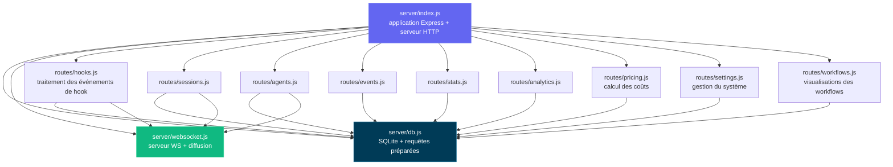

---

## Routage du client

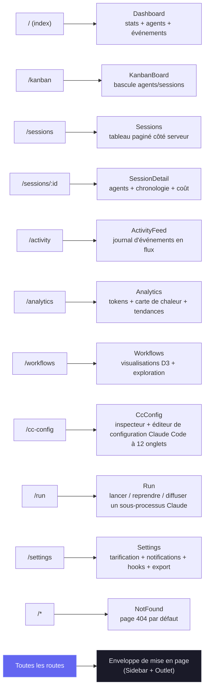

---

## Flux du gestionnaire de hooks

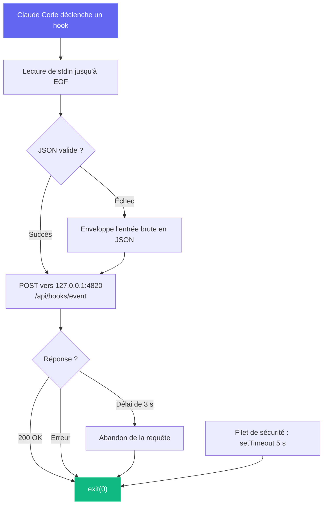

---

## Modes de déploiement

Nous prenons en charge des modes de déploiement de développement et de production, avec des architectures de processus différentes :

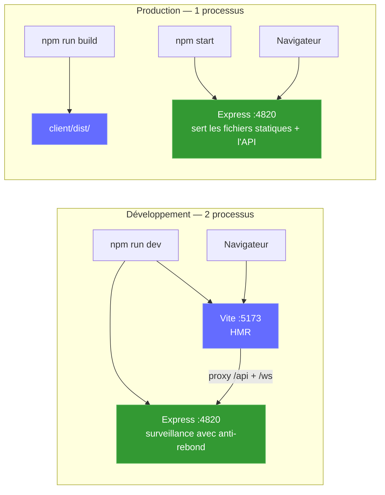

Sidecar MCP local facultatif (prend en charge les transports stdio, HTTP+SSE et REPL) :

```mermaid
graph LR
    subgraph "Options de transport MCP"
        M_STDIO["Serveur MCP (stdio)<br/>npm run mcp:start"]
        M_HTTP["Serveur MCP (HTTP)<br/>npm run mcp:start:http<br/>:8819"]
        M_REPL["Serveur MCP (REPL)<br/>npm run mcp:start:repl"]
    end

    H["Hôte MCP"] -->|"stdin/stdout"| M_STDIO
    RC["Client distant"] -->|"POST /mcp · GET /sse"| M_HTTP
    OP["Opérateur"] -->|"CLI interactive"| M_REPL

    M_STDIO --> D["Serveur du tableau de bord<br/>:4820"]
    M_HTTP --> D
    M_REPL --> D

    style M_STDIO fill:#0f766e,stroke:#14b8a6,color:#fff
    style M_HTTP fill:#0f766e,stroke:#14b8a6,color:#fff
    style M_REPL fill:#0f766e,stroke:#14b8a6,color:#fff
```

**Application de bureau (macOS et Windows)** facultative — un seul processus Electron qui héberge le serveur Express dans son processus (ni terminal, ni processus enfant) :

```mermaid
flowchart LR
    subgraph desktop["Application de bureau (macOS et Windows) — 1 processus Electron"]
        E_MAIN["Processus principal Electron<br/>(Node 22 / Electron 35)"]
        E_HOST["server-host.ts<br/>require() server/index.js"]
        E_SRV["Express embarqué :4820<br/>API · SQLite · WebSocket"]
        E_WIN["BrowserWindow<br/>client React compilé"]
        E_TRAY["Icône de barre de menus (tray)<br/>+ menu d'application natif"]
        E_MAIN --> E_HOST
        E_HOST -->|"require() dans le processus"| E_SRV
        E_MAIN --> E_TRAY
        E_SRV -->|"http + ws sur 127.0.0.1"| E_WIN
    end

    E_HOOKS["Hooks de Claude Code"] -->|"POST /api/hooks/event"| E_SRV

    style E_MAIN fill:#47848F,stroke:#2f5a62,color:#fff
    style E_SRV fill:#339933,stroke:#5cb85c,color:#fff
    style E_WIN fill:#61DAFB,stroke:#3aa9c9,color:#000
```

### Déploiement dans le cloud

La pile `deployments/` cible tout service Kubernetes conforme, y compris EKS, GKE, AKS, OKE et les clusters autogérés. CCAM utilise SQLite : chaque manifeste pris en charge impose donc **un seul écrivain actif du tableau de bord par volume persistant**, avec un déploiement de type Recreate. HPA, les réplicas actif-actif, le blue-green et le canary ne sont volontairement pas pris en charge tant que SQLite reste le moteur de persistance.

```mermaid
flowchart LR
  CI["CI : tests · validation · analyse · attestation · signature"] --> HELM["Helm / Kustomize / Terraform"]
  HELM --> APP["Tableau de bord CCAM<br/>exactement 1 réplica"]
  APP --> PVC[("PVC ReadWriteOnce conservé")]
  EDGE["Ingress ou Gateway API<br/>TLS + WebSocket"] --> APP
  PROM["Prometheus Operator"] -->|"Bearer /api/metrics"| APP
  MCP["Sidecar MCP authentifié"] --> APP
```

- **Helm :** écrivain unique imposé par le schéma, prise en charge des digests, PVC conservé, Ingress ou Gateway API, montage du jeton compatible External Secrets, NetworkPolicy, MCP et ServiceMonitor facultatifs.
- **Kustomize :** base conforme au PSS restreint, plus des surcouches dev/staging/production et des composants facultatifs MCP, supervision, Gateway API et instantanés CSI.
- **Terraform :** déploie le chart Helm validé sur un cluster Kubernetes existant. Le réseau cloud, l'identité du cluster, CSI, TLS et la synchronisation des secrets restent à la charge du fournisseur.
- **Exploitation :** sauvegarde en ligne cohérente de SQLite avec SHA-256, restauration vérifiée avec mise à l'échelle à zéro, déploiement/retour arrière/démontage précédés d'une sauvegarde, et contrôles de santé authentifiés.
- **Chaîne d'approvisionnement CI :** les images de l'application et du MCP sont analysées, publiées pour amd64/arm64 avec SBOM et provenance SLSA, et signées sans clé avec Cosign.

```bash
npm run deploy:validate
REGISTRY="ghcr.io/$(gh repo view --json owner -q .owner.login)"
IMAGE_TAG="$(git rev-parse --short HEAD)"

helm upgrade --install agent-monitor deployments/helm/agent-monitor \
  --namespace agent-monitor-production --create-namespace \
  --values deployments/helm/agent-monitor/values-production.yaml \
  --set image.registry= \
  --set image.repository=${REGISTRY}/claude-code-agent-monitor \
  --set image.tag=${IMAGE_TAG} \
  --atomic --wait --timeout 10m
```

> [!NOTE]
> La mise en place complète en production, les secrets, la pile Docker/Podman, Gateway API, Terraform, la sauvegarde, la restauration et le retour arrière sont documentés dans [DEPLOYMENT.md](DEPLOYMENT.md) et [deployments/README.md](deployments/README.md).

---

## Structure du projet

```
agent-dashboard/
|-- CLAUDE.md                   # Claude Code project memory and working agreements
|-- AGENTS.md                   # Codex project instructions
|-- package.json                # Root scripts (dashboard + MCP helpers) + server dependencies
|-- .claude/
|   +-- rules/                  # Path-scoped Claude rules
|   +-- skills/                 # Claude reusable project skills
|   +-- agents/                 # Claude custom subagents
|-- .claude-plugin/
|   +-- marketplace.json        # Claude Code marketplace manifest (14 plugins)
|-- .agents/plugins/
|   +-- marketplace.json        # Codex marketplace manifest (same 14 plugins)
|-- plugins/
|   |-- ccam-analytics/         # Analytics: session reports, cost breakdown, usage trends, productivity score
|   |   |-- .claude-plugin/plugin.json
|   |   |-- skills/ (4)         # session-report, cost-breakdown, usage-trends, productivity-score
|   |   |-- agents/             # analytics-advisor (Sonnet model)
|   |   |-- hooks/hooks.json    # Stop + SubagentStop event logging
|   |   +-- bin/ccam-stats      # Terminal dashboard CLI
|   |-- ccam-productivity/      # Productivity: standups, reports, sprints, workflow optimizer
|   |-- ccam-devtools/          # DevTools: debug, diagnostics, export, health checks
|   |   +-- bin/                # ccam-doctor + ccam-export CLIs
|   |-- ccam-insights/          # Insights: patterns, anomalies, optimization, comparison
|   |-- ccam-cost-guard/        # Cost guardrails: budgets, spend forecast, cost alerts, model savings
|   |-- ccam-sessions/          # Session forensics: search, timeline, transcript replay, cwd rollup, cleanup
|   |-- ccam-workflows/         # Workflow orchestration: DAG map, delegation audit, concurrency, fleet runs
|   |-- ccam-quality/           # Reliability & SLOs: error scan, API-error report, hook-failure audit, SLO check
|   |-- ccam-config/            # Config & memory governance: config audit, memory review, skill/MCP/hook inventory
|   +-- ccam-dashboard/         # Dashboard connector: status, quick stats, MCP integration
|       +-- .mcp.json           # MCP server configuration
|-- server/
|   |-- index.js                 # Express app, HTTP server, static serving
|   |-- db.js                    # SQLite schema, migrations, prepared statements
|   |-- websocket.js             # WebSocket server with heartbeat
|   +-- routes/
|       |-- hooks.js             # Hook event processing (transactional)
|       |-- sessions.js          # Session CRUD
|       |-- agents.js            # Agent CRUD
|       |-- events.js            # Event listing
|       |-- stats.js             # Aggregate statistics
|       |-- analytics.js         # Token, tool, and trend analytics
|       |-- workflows.js         # Aggregate workflow data and per-session drill-in
|       |-- pricing.js           # Model pricing CRUD and cost calculation
|       +-- settings.js          # System info, data management, export, cleanup
|   +-- lib/
|       +-- transcript-cache.js  # Stat-based JSONL transcript cache with chunked sync byte-stream reader (4 MiB chunks, line-by-line UTF-8 decode) so files larger than V8's max string length (~512 MiB) parse without aborting Node with "FATAL ERROR: v8::ToLocalChecked Empty MaybeLocal". Extracts tokens, compactions, API errors, turn durations, thinking blocks, and usage extras (service_tier, speed, inference_geo)
|   +-- compat-sqlite.js         # node:sqlite compatibility wrapper (fallback for better-sqlite3)
|-- client/
|   |-- package.json             # Client dependencies
|   |-- index.html               # HTML entry point
|   |-- vite.config.ts           # Vite + proxy config
|   |-- tailwind.config.js       # Custom dark theme
|   |-- tsconfig.json            # Strict TypeScript
|   +-- src/
|       |-- main.tsx             # React entry
|       |-- App.tsx              # Router + WebSocket provider
|       |-- index.css            # Tailwind + custom utilities
|       |-- lib/
|       |   |-- types.ts         # Shared TypeScript interfaces
|       |   |-- api.ts           # Typed fetch client
|       |   |-- format.ts        # Date/time formatting utilities
|       |   +-- eventBus.ts      # Pub/sub for WebSocket distribution
|       |-- hooks/
|       |   |-- useWebSocket.ts      # Auto-reconnecting WebSocket hook
|       |   +-- useNotifications.ts  # Browser notification triggers from WebSocket events
|       |-- components/
|       |   |-- Layout.tsx       # Shell with sidebar + outlet
|       |   |-- Sidebar.tsx      # Navigation + connection indicator
|       |   |-- AgentCard.tsx    # Agent info card with status
|       |   |-- StatCard.tsx     # Metric card
|       |   |-- StatusBadge.tsx  # Color-coded status pills
|       |   |-- EmptyState.tsx   # Placeholder for empty lists
|       |   +-- workflows/       # D3.js workflow visualization components
|       |       |-- OrchestrationDAG.tsx            # Horizontal DAG of agent spawning patterns
|       |       |-- ToolExecutionFlow.tsx           # d3-sankey diagram of tool-to-tool transitions
|       |       |-- AgentCollaborationNetwork.tsx   # Force-directed agent pipeline graph
|       |       |-- SubagentEffectiveness.tsx       # Scorecard grid with SVG success rings
|       |       |-- WorkflowPatterns.tsx            # Auto-detected orchestration sequences
|       |       |-- ModelDelegationFlow.tsx         # Model routing through agent hierarchies
|       |       |-- ErrorPropagationMap.tsx         # Error clustering by hierarchy depth
|       |       |-- ConcurrencyTimeline.tsx         # Swim-lane parallel agent execution
|       |       |-- SessionComplexityScatter.tsx    # D3 bubble chart (duration vs agents vs tokens)
|       |       |-- CompactionImpact.tsx            # Token compression events and recovery
|       |       |-- WorkflowStats.tsx               # Aggregate workflow statistics
|       |       +-- SessionDrillIn.tsx              # Per-session agent tree, tool timeline, events
|       +-- pages/
|           |-- Dashboard.tsx      # Overview page
|           |-- KanbanBoard.tsx    # Agents/Sessions toggle, status columns
|           |-- Sessions.tsx       # Server-paginated sessions table
|           |-- SessionDetail.tsx  # Single session deep dive
|           |-- ActivityFeed.tsx   # Real-time event stream
|           |-- Analytics.tsx      # Token usage, heatmap, trends
|           |-- Workflows.tsx      # D3.js workflow visualizations and session drill-in
|           |-- Settings.tsx       # Model pricing, notifications, hooks, export, cleanup
|           +-- NotFound.tsx       # 404 catch-all page
|-- scripts/
|   |-- hook-handler.js          # Lightweight stdin-to-HTTP forwarder
|   |-- install-hooks.js         # Auto-configures ~/.claude/settings.json
|   |-- import-history.js        # Imports sessions from ~/.claude/ with enhanced JSONL extraction (API errors, turn durations, entrypoint, permission modes, thinking blocks, usage extras, tool errors, subagent JSONL files). Re-import is fully incremental: a per-event-type high-water mark (`MAX(created_at) GROUP BY event_type` per session) is computed up-front and only JSONL entries with `ts > cutoff[type]` are inserted, so long-running sessions whose transcripts grow across multiple days continue to receive Stop / PostToolUse / TurnDuration / ToolError events on every re-run. Also rolls `sessions.ended_at` forward when the JSONL advances past the stored value and refreshes message-count metadata on every pass
|   +-- seed.js                  # Sample data generator
|-- mcp/
|   |-- package.json             # MCP package scripts + dependencies
|   |-- README.md                # MCP setup, host config, tool catalog, safety model
|   |-- src/
|   |   |-- index.ts             # MCP runtime entrypoint (transport router)
|   |   |-- server.ts            # MCP server assembly
|   |   |-- clients/             # Dashboard API client with retry/backoff
|   |   |-- config/              # Environment/CLI config parsing
|   |   |-- core/                # Logger, tool registry, result helpers
|   |   |-- policy/              # Mutation/destructive guards
|   |   |-- tools/               # 16 domain modules registering 97 tools
|   |   |-- transports/          # HTTP+SSE server, REPL, tool collector
|   |   |-- ui/                  # ANSI banner, colors, formatter, tables
|   |   +-- types/               # Shared MCP type definitions
|   +-- build/                   # Built MCP runtime output
|-- desktop/
|   |-- package.json             # Electron + electron-builder dependencies and scripts
|   |-- electron-builder.yml     # DMG packaging config; signing/notarization hooks
|   |-- tsconfig.json            # Strict TypeScript (src/ -> out/)
|   |-- README.md                # Desktop app architecture reference (contributor docs)
|   |-- assets/                  # icon.svg + generated icon.icns + tray PNGs
|   |-- src/
|   |   |-- main.ts              # Electron main process entry — lifecycle, wiring
|   |   |-- server-host.ts       # In-process Express boot, port discovery, adoption, DB close
|   |   |-- window.ts            # BrowserWindow + persisted window geometry
|   |   |-- tray.ts              # Menu-bar (tray) icon + context menu
|   |   |-- menu.ts              # Native application menu (File ▸ Open Dashboard is macOS-only)
|   |   |-- login-item.ts        # macOS Login Items auto-start toggle (SMAppService)
|   |   |-- logger.ts            # File logger -> ~/Library/Logs/Claude Code Monitor/desktop.log
|   |   |-- constants.ts         # App name, ports, timeouts, window size
|   |   +-- preload.ts           # Intentionally empty (zero renderer privilege)
|   |-- scripts/
|   |   |-- install.js           # Preflights native deps for desktop:install; prints setup help + exits non-zero on failure
|   |   |-- preflight.js         # Shared better-sqlite3 binary check + actionable per-OS setup help (incl. no-toolchain alternative)
|   |   |-- prebuild.js          # Ensures root + client are built before tsc; fails fast with setup help if native binary missing
|   |   |-- build-icons.sh       # SVG -> PNG/ICNS via qlmanage/sips/iconutil
|   |   +-- notarize.js          # electron-builder afterSign hook (opt-in notarization)
|   +-- tests/
|       +-- smoke.test.mjs       # Spawn Electron + probe /api/health
|-- deployments/
|   |-- README.md                # Production deployment reference
|   |-- nginx/                   # Rootless Nginx edge and opt-in hook/MCP policies
|   |-- secrets/                 # Ignored Compose token/password files
|   |-- terraform/               # Helm deployment to an existing Kubernetes cluster
|   |-- kubernetes/              # One-writer Kustomize base + environment overlays
|   |   |-- base/                # Restricted PSS, Recreate Deployment, PVC, Service, Ingress
|   |   |-- overlays/            # Dev, staging, production namespaces and resources
|   |   +-- components/          # MCP, ServiceMonitor, Gateway API, VolumeSnapshot
|   |-- helm/agent-monitor/      # Schema-enforced Helm chart and environment values
|   +-- scripts/                 # Validate, deploy, backup, restore, rollback, health, teardown
|-- .codex/
|   |-- config.toml              # Codex runtime configuration
|   |-- README.md                # Codex setup guide for agents and skills
|   |-- rules/                   # Codex execution policy rules
|   |-- agents/                  # Codex custom agent templates
|   +-- skills/                  # Codex project skills
|-- statusline/
|   |-- README.md                # Statusline installation & usage guide
|   |-- statusline.py            # Python script that renders the statusline
|   +-- statusline-command.sh    # Shell wrapper for Claude Code's statusLine config
+-- data/
    +-- dashboard.db             # SQLite database (gitignored)
```

---

## Dépannage

| Problème | Solution |
| --------------------------------- | ---------------------------------------------------------------------------------------------------------------------------------------------------------------- |
| L'installation de `better-sqlite3` échoue | Ce n'est pas bloquant — le serveur se replie automatiquement sur le module intégré de Node.js `node:sqlite` (Node 22+). Sur les versions plus anciennes de Node, installez Python 3 et les outils de compilation C++, puis lancez `npm rebuild better-sqlite3` |
| Les hooks ne se déclenchent pas | Lancez `npm run install-hooks` et redémarrez Claude Code. Vérifiez que les hooks figurent dans `~/.claude/settings.json` |
| Le tableau de bord n'affiche aucune donnée | Vérifiez que le serveur tourne (`npm run dev`) avant de démarrer une session Claude Code. Contrôlez `http://localhost:4820/api/health` |
| WebSocket déconnecté | Le client se reconnecte automatiquement toutes les 2 secondes. Vérifiez que le port 4820 n'est pas bloqué par un pare-feu |
| Données périmées après un redémarrage | La base persiste d'un redémarrage à l'autre. Lancez `npm run seed` pour des données de démonstration neuves, ou supprimez `data/dashboard.db` pour tout réinitialiser |
| Les outils MCP ne se connectent pas | Vérifiez que l'API du tableau de bord répond sur `MCP_DASHBOARD_BASE_URL`, puis recompilez/démarrez MCP (`npm run mcp:build`, `npm run mcp:start`) |

---

## Contribuer

Les contributions sont les bienvenues — voir [`.github/CONTRIBUTING.md`](.github/CONTRIBUTING.md) pour le guide complet.

Tous les contributeurs doivent signer le [Contributor License Agreement](https://github.com/hoangsonww/Claude-Code-Agent-Monitor/blob/master/CLA.md). Cette règle est appliquée automatiquement sur chaque pull request par la GitHub Action `🖋️ CLA Assistant` : la première fois que vous ouvrez une PR, un bot vous demande de signer en commentant `I have read the CLA Document and I hereby sign the CLA`. Le contrôle de statut **CLA Assistant** de la PR reste rouge tant que vous ne l'avez pas fait, et une seule signature couvre toutes vos contributions futures.

---

## Licence

MIT. Voir [LICENSE](LICENSE) pour les détails.
