# Dashboard degli agenti per Claude Code & Codex

### Piattaforma di monitoraggio in tempo reale per l'attività degli agenti Claude Code & Codex 🚀

Una dashboard professionale per tracciare e visualizzare in tempo reale le sessioni degli agenti Claude Code e Codex, l'uso degli strumenti e l'orchestrazione dei subagenti. Costruita con Node.js, Express, React e SQLite, si integra direttamente con Claude Code e Codex tramite i loro sistemi di hook nativi per un tracciamento e un'analisi delle sessioni senza interruzioni.


> [!TIP]
> Consulta anche [README.md](./README.md) (English), [README-CN.md](./README-CN.md) (中文), [README-VN.md](./README-VN.md) (Tiếng Việt), [README-KO.md](./README-KO.md) (한국어) e [README-ES.md](./README-ES.md) (español). Questo è il README in italiano.

> [!NOTE]
> Ti serve un aiuto orientato ai task? La [Wiki di GitHub](https://github.com/hoangsonww/Claude-Code-Agent-Monitor/wiki) è il manuale pratico per l'uso quotidiano, le operazioni di team, la risoluzione dei problemi, l'automazione via CLI/MCP e le ricette di deployment. La [Wiki statica localizzata](https://hoangsonww.github.io/Claude-Code-Agent-Monitor/wiki/) resta il tour del prodotto e dell'architettura in inglese, vietnamita, cinese, coreano e spagnolo; i contratti tecnici esatti rimangono in [`docs/`](./docs/README.md).

---

## Indice dei contenuti

- [Panoramica](#panoramica)
- [Internazionalizzazione (i18n)](#internazionalizzazione-i18n)
- [Funzionalità](#funzionalità)
- [Avvio rapido](#avvio-rapido)
- [Come funziona](#come-funziona)
- [Configurazione](#configurazione)
- [Script npm](#script-npm)
- [Marketplace dei plugin](#marketplace-dei-plugin)
- [Estensioni degli agenti](#estensioni-degli-agenti)
- [Integrazione MCP](#integrazione-mcp)
- [Riferimento API](#riferimento-api)
- [Eventi hook](#eventi-hook)
- [Notifiche del browser](#notifiche-del-browser)
- [Notificatore di aggiornamenti](#notificatore-di-aggiornamenti)
- [Tabby — Il gatto compagno fluttuante](#tabby--il-gatto-compagno-fluttuante)
- [Segnali sonori](#segnali-sonori)
- [Modale dello stato di connessione](#modale-dello-stato-di-connessione)
- [Estensione VS Code](#estensione-vs-code)
- [App desktop (macOS e Windows)](#app-desktop-macos-e-windows)
- [Archiviazione dei dati](#archiviazione-dei-dati)
- [Statusline](#statusline)
- [Architettura del server](#architettura-del-server)
- [Routing del client](#routing-del-client)
- [Flusso del gestore degli hook](#flusso-del-gestore-degli-hook)
- [Modalità di deployment](#modalità-di-deployment)
- [Struttura del progetto](#struttura-del-progetto)
- [Risoluzione dei problemi](#risoluzione-dei-problemi)
- [Contribuire](#contribuire)
- [Licenza](#licenza)

---

## Panoramica

Traccia le sessioni, monitora gli agenti in tempo reale, visualizza l'uso degli strumenti e osserva l'orchestrazione dei subagenti attraverso un'interfaccia web professionale a tema scuro. Si integra direttamente con Claude Code e Codex tramite i loro sistemi di hook nativi.

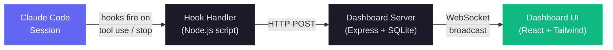
```mermaid
graph LR
    A["Claude Code<br/>Session"] -->|hooks fire on<br/>tool use / stop| B["Hook Handler<br/>(Node.js script)"]
    B -->|HTTP POST| C["Dashboard Server<br/>(Express + SQLite)"]
    C -->|WebSocket<br/>broadcast| D["Dashboard UI<br/>(React + Tailwind)"]
    style A fill:#6366f1,stroke:#818cf8,color:#fff
    style B fill:#1a1a28,stroke:#2a2a3d,color:#e4e4ed
    style C fill:#1a1a28,stroke:#2a2a3d,color:#e4e4ed
    style D fill:#10b981,stroke:#34d399,color:#fff
```

Oltre alla dashboard di monitoraggio in tempo reale, include anche un'implementazione locale di server MCP in `mcp/` che espone un catalogo di strumenti per l'introspezione e la gestione della dashboard stessa, rendendo facile integrare le operazioni della dashboard direttamente nei tuoi workflow di Claude Code e Codex. C'è anche un livello di estensioni per gli agenti, che fornisce plugin, skill e subagenti di Claude Code e Codex per l'interazione con la dashboard, l'analisi e l'intelligenza dei workflow.

### Internazionalizzazione (i18n)

La UI include di serie il cambio di lingua integrato per inglese (`en`), cinese (`zh`), vietnamita (`vi`), coreano (`ko`), spagnolo (`es`) e italiano (`it`). Un menu a tendina personalizzato per la lingua evita che il selettore affolli la sidebar man mano che vengono aggiunte nuove lingue. Le risorse linguistiche sono caricate per namespace e persistite nello storage del browser per mantenere stabile la preferenza dell'utente tra i refresh.

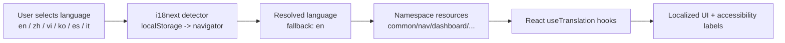
```mermaid
flowchart LR
    A["User selects language<br/>en / zh / vi / ko / es / it"] --> B["i18next detector<br/>localStorage -> navigator"]
    B --> C["Resolved language<br/>fallback: en"]
    C --> D["Namespace resources<br/>common/nav/dashboard/..."]
    D --> E["React useTranslation hooks"]
    E --> F["Localized UI + accessibility labels"]
```

Per l'architettura completa e le indicazioni operative, consulta [docs/I18N.md](./docs/I18N.md).

### Interfaccia utente

Include un elegante tema scuro, un design responsive e una navigazione intuitiva per esplorare l'attività dei tuoi agenti:

<p align="center">
  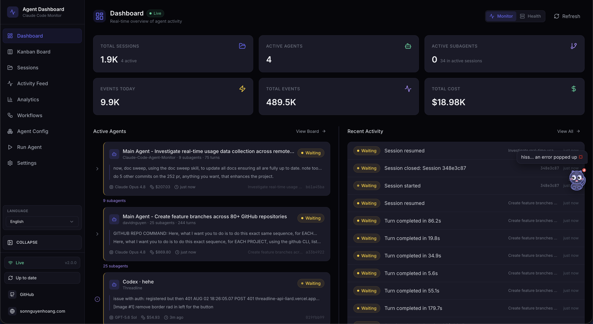
  <br>
  <em>📡 <strong>Dashboard · Monitor</strong> — statistiche di riepilogo, card degli agenti attivi e feed delle attività recenti</em>
</p>

<p align="center">
  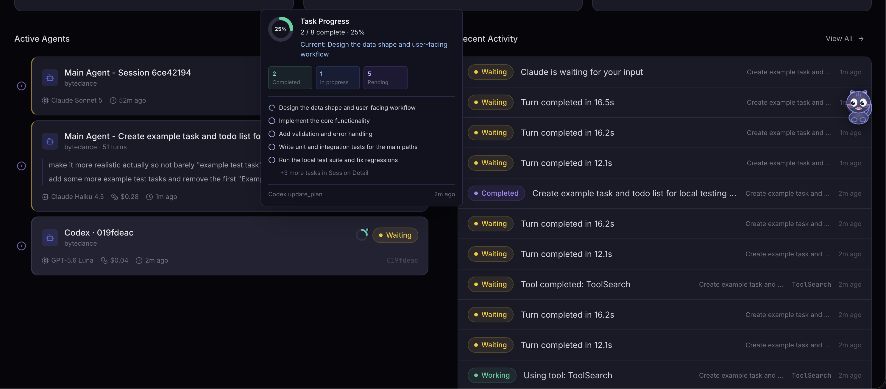
  <br>
  <em>📋 <strong>Avanzamento task · Panoramica</strong> — le card degli agenti della dashboard e le righe delle sessioni riusano lo stesso donut compatto di completamento accanto allo stato; al passaggio del mouse o al focus si apre un'anteprima consapevole dell'owner del lavoro corrente e dello stato dei task</em>
</p>

<p align="center">
  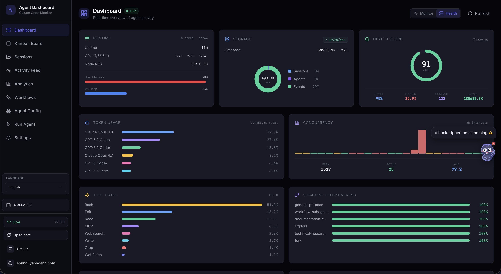
  <br>
  <em>🩺 <strong>Dashboard · Health</strong> — anello del punteggio di salute composito, grafico a donut dello storage engine, indicatori di cache hit / errori / successi, barre delle invocazioni degli strumenti, efficacia dei subagenti, distribuzione dei token per modello e statistiche di compattazione — tutto con auto-refresh ogni 5 s</em>
</p>

<p align="center">
  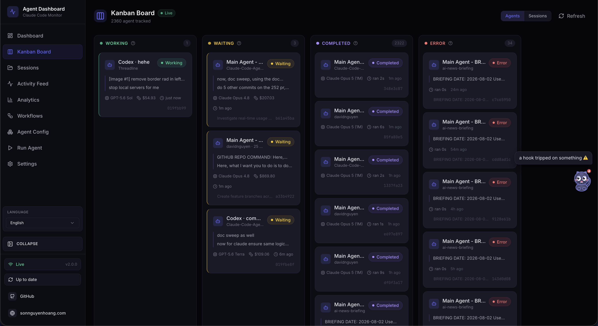
  <br>
  <em>📋 <strong>Kanban Board (agenti)</strong> — agenti raggruppati per stato in 4 colonne: Working / Waiting / Completed / Error. La colonna gialla Waiting mette in evidenza le sessioni bloccate in attesa di input dell'utente (richieste di permesso, fine turno o ferme a un prompt nuovo) — passa il mouse su un badge Waiting per vedere <em>perché</em> (Needs input / Turn done / At prompt / Interrupted). Ogni card mostra a colpo d'occhio modello, costo e strumento corrente.</em>
</p>

<p align="center">
  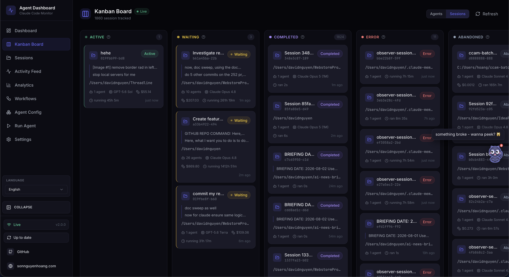
  <br>
  <em>🗂️ <strong>Kanban Board (sessioni)</strong> — sessioni raggruppate per stato in 5 colonne: Active / Waiting / Completed / Error / Abandoned, commutabili dalla stessa pagina. Passa il mouse sull'intestazione di una colonna per un tooltip che spiega la transizione del ciclo di vita.</em>
</p>

<p align="center">
  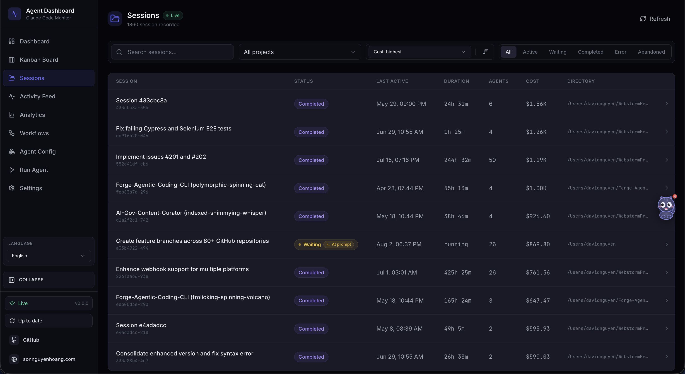
  <br>
  <em>📂 <strong>Sessioni</strong> — tabella ricercabile, filtrabile e paginata lato server di ogni sessione registrata con costo, modello, numero di agenti e durata; il selettore dei progetti supporta la multi-selezione con ricerca e l'ordinamento usa un menu personalizzato</em>
</p>

<p align="center">
  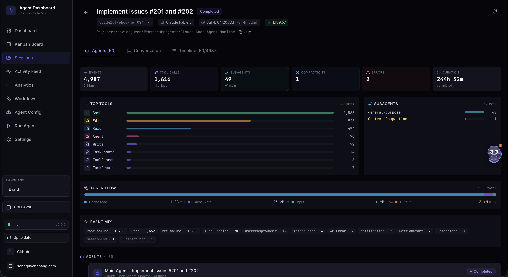
  <br>
  <em>🤖 <strong>Dettaglio sessione · Agenti</strong> — riquadri di panoramica in tempo reale (eventi, chiamate agli strumenti, subagenti, compattazioni, errori, durata), barre degli strumenti più usati, ripartizione dei tipi di subagente, flusso dei token e albero della gerarchia degli agenti</em>
</p>

<p align="center">
  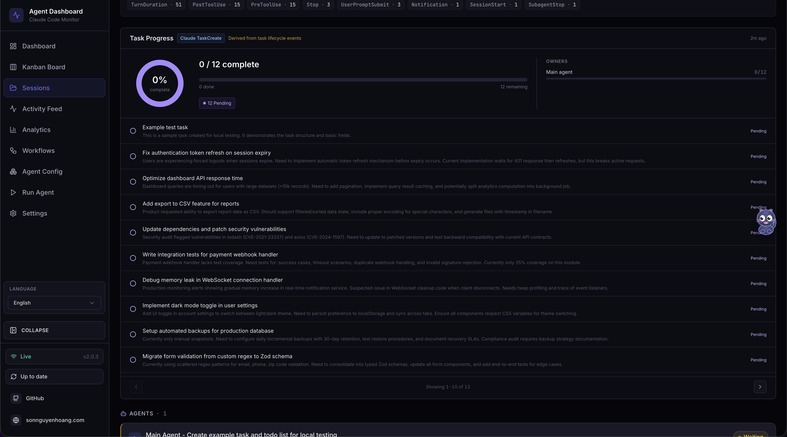
  <br>
  <em>✅ <strong>Avanzamento task · Dettaglio sessione</strong> — il tracker completo consapevole dell'owner combina un donut di completamento segmentato, il task attivo, la barra di completamento, la ripartizione per owner e una lista di task paginata a 10 righe per pagina</em>
</p>

<p align="center">
  
  <br>
  <em>💬 <strong>Dettaglio sessione · Conversazione</strong> — visualizzatore live della trascrizione con rendering markdown, blocchi di codice con evidenziazione della sintassi (numeri di riga + copia), chiamate agli strumenti stilizzate per strumento, pill degli slash-command con l'output TUI catturato e marcatori inline di rinomina della sessione</em>
</p>

<p align="center">
  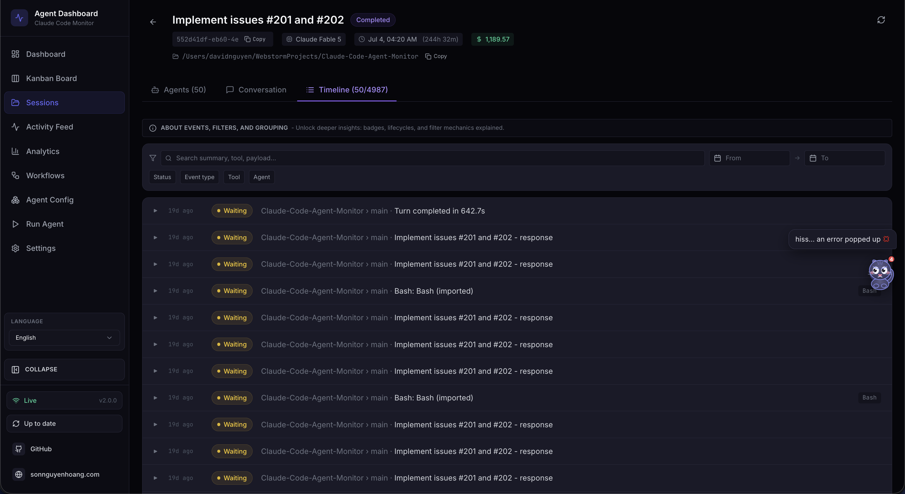
  <br>
  <em>🔬 <strong>Dettaglio sessione · Timeline</strong> — timeline cronologica degli eventi con filtri multi-dimensione, raggruppamento Pre/Post per `tool_use_id` e renderer dei payload consapevoli dello strumento</em>
</p>

<p align="center">
  
  <br>
  <em>📰 <strong>Feed delle attività</strong> — log degli eventi in tempo reale con pausa / ripresa, raggruppamento, filtri multi-dimensione e un pulsante di salto "Session →" per ogni riga</em>
</p>

<p align="center">
  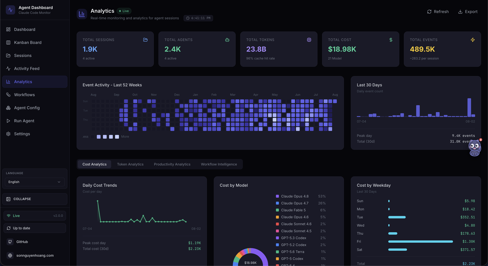
  <br>
  <em>📊 <strong>Analytics</strong> — uso dei token per modello, frequenza degli strumenti, heatmap delle attività e trend delle sessioni con indicatore live / offline; le legende lunghe dei grafici sono paginate mentre quelle corte restano invariate</em>
</p>

<p align="center">
  
  <br>
  <em>🔀 <strong>Workflow</strong> — DAG di orchestrazione degli agenti, diagrammi Sankey dell'esecuzione degli strumenti, reti di collaborazione, legende data-driven delimitate e 11 sezioni interattive di intelligenza dei workflow</em>
</p>

<p align="center">
  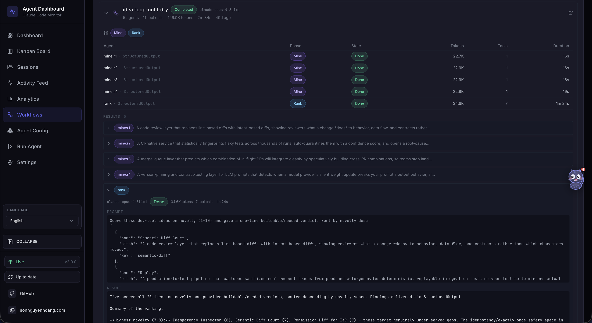
  <br>
  <em>🧬 <strong>Esecuzioni di workflow (pagina Workflow)</strong> — i "workflow dinamici" generati dallo strumento <code>Workflow</code>, ricostruiti dai run journal su disco: stato, numero di agenti, token e chiamate agli strumenti, espandibili in una ripartizione per agente (fase, stato, token, strumenti, durata) con anteprime dei risultati in forma leggibile</em>
</p>

<p align="center">
  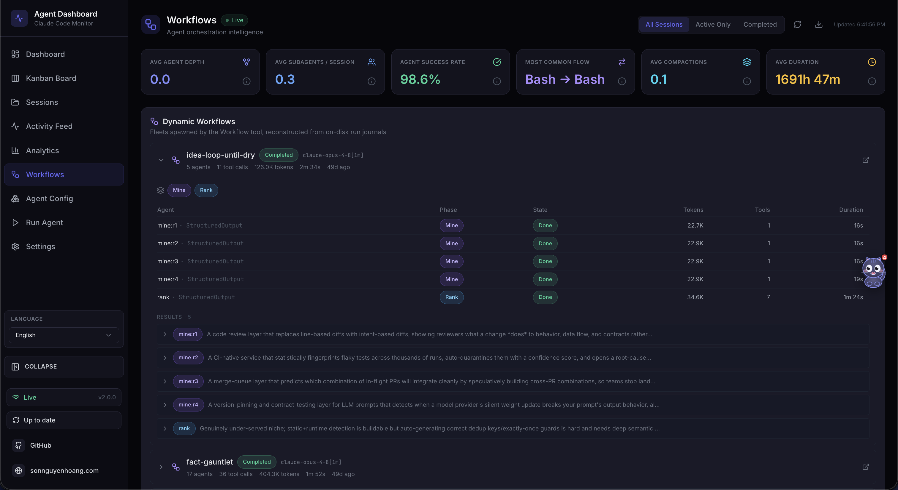
  <br>
  <em>🧬 <strong>Esecuzioni di workflow · espanse</strong> — un'esecuzione aperta: filtri per fase cliccabili con codifica a colori, la tabella delle metriche per agente e una lista completa di risultati cliccabili che si espandono nel prompt e nel risultato completi di ciascun agente</em>
</p>

<p align="center">
  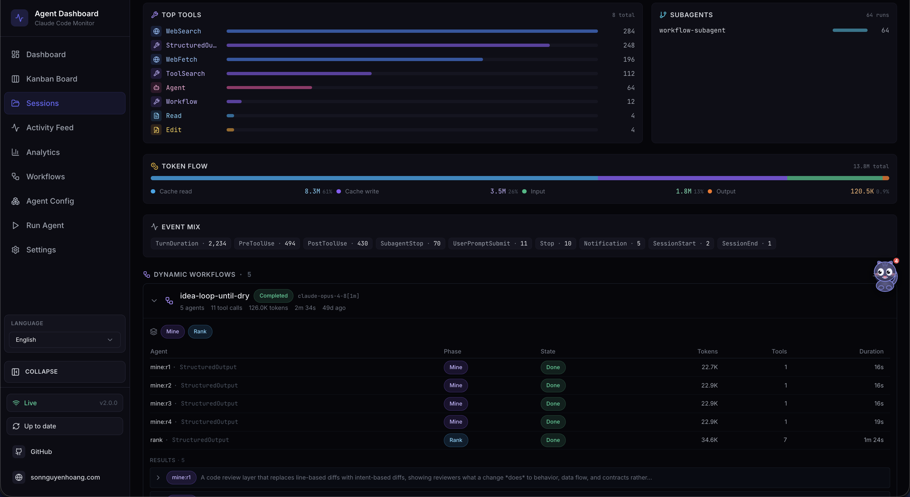
  <br>
  <em>🧬 <strong>Esecuzioni di workflow (dettaglio sessione)</strong> — le stesse flotte collegate alla sessione che le ha lanciate, così i sub-agenti dei workflow dinamici di una sessione e il loro costo in token incorporato sono visibili inline</em>
</p>

<p align="center">
  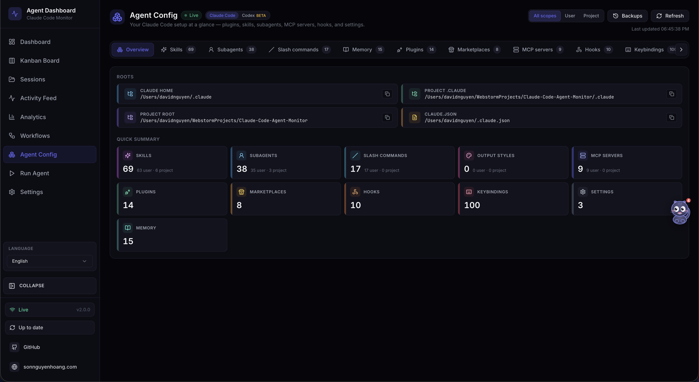
  <br>
  <em>🧰 <strong>Agent Config</strong> — passa dall'esploratore completo di Claude Code a un workspace Codex live per default, modelli, profili, MCP, progetti, skill, regole, hook, plugin e istruzioni. Le anteprime di Codex oscurano i segreti; la sua configurazione gestita dall'utente, gli hook, le regole, le skill e le istruzioni possono essere modificati in sicurezza con backup.</em>
</p>

<p align="center">
  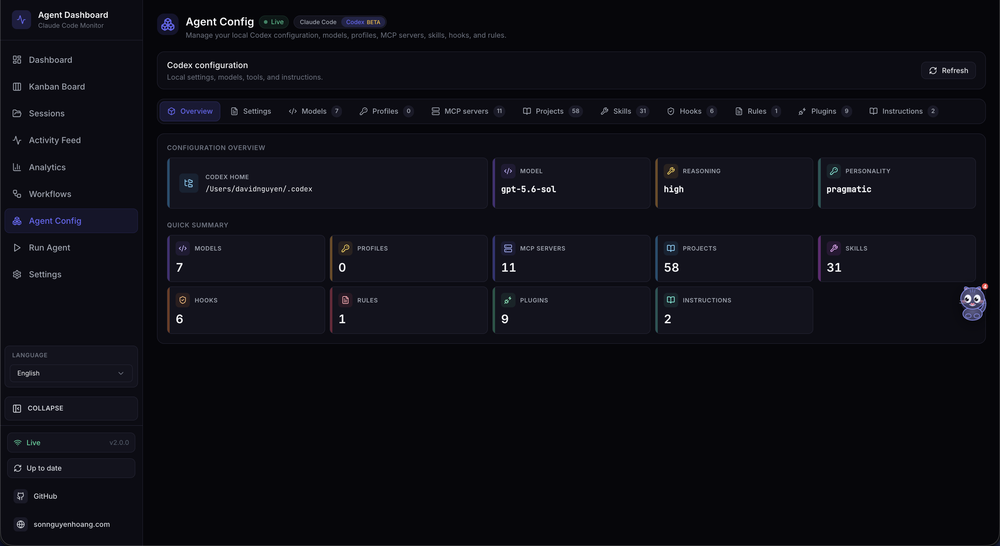
  <br>
  <em>🧰 <strong>Codex Config Explorer</strong> — il workspace Codex riunisce <code>config.toml</code>, modelli dell'account, profili, server MCP, progetti, skill, hook, regole, plugin e istruzioni. Modifica i file gestiti dall'utente supportati con backup con timestamp; <code>config.toml</code> è di sola modifica.</em>
</p>

<p align="center">
  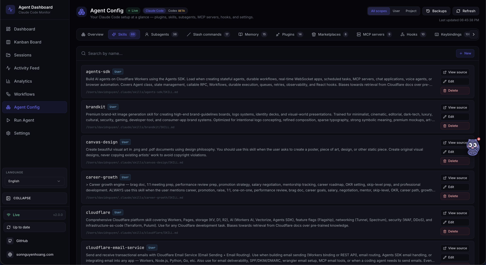
  <br>
  <em>🧩 <strong>Claude Config Explorer · Skills</strong> — la scheda Skills elenca ogni skill scoperta (utente, progetto e plugin) con descrizione e origine, è ricercabile sull'intero insieme e apre qualsiasi file di skill per una modifica sicura con backup con timestamp</em>
</p>

<p align="center">
  
  <br>
  <em>▶️ <strong>Run Agent</strong> — scegli Claude Code o Codex ogni volta che apri il launcher. Claude mantiene i controlli Conversazione / One-shot; Codex avvia un thread nativo interattivo di app-server con i propri controlli di approvazione e sandbox. I modelli di Codex provengono dal catalogo della CLI autenticata, mentre Claude elenca i modelli osservati più i suoi alias supportati.</em>
</p>

<p align="center">
  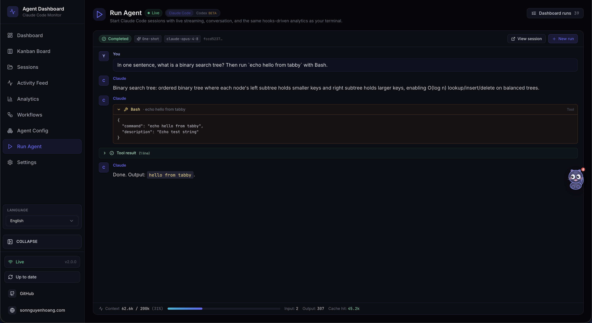
  <br>
  <em>💬 <strong>Run Agent · stream live</strong> — sia gli eventi stream-json di Claude sia quelli app-server di Codex vengono renderizzati come una chat, incluse le attività di ragionamento, comandi, modifiche ai file e strumenti. Dashboard Runs ti permette di lasciare un agente al lavoro in background e ricollegarti in seguito.</em>
</p>

<p align="center">
  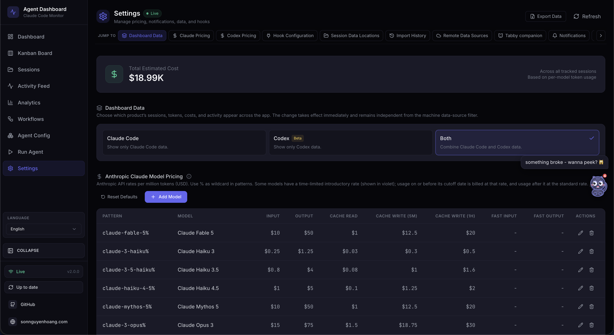
  <br>
  <em>⚙️ <strong>Impostazioni</strong> — regole di pricing dei modelli, stato di installazione degli hook, gestione dei dati, preferenze di notifica e informazioni di sistema</em>
</p>

<p align="center">
  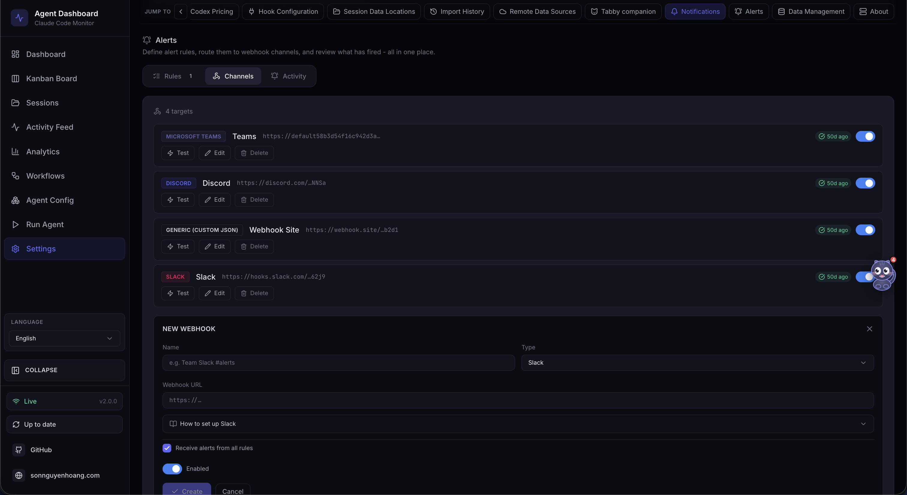
  <br>
  <em>🔔 <strong>Impostazioni · Alert</strong> — motore di alerting basato su regole e webhook in uscita in un unico posto: regole di alert (pattern di eventi / inattività / agente bloccato / soglia di token) con cooldown per regola, un feed live degli alert scattati e 14 provider di webhook di prima classe (Slack, Discord, Teams, Google Chat, Mattermost, Rocket.Chat, Telegram, PagerDuty, Opsgenie, Splunk On-Call, Zapier, Make, n8n, Pipedream) più un endpoint JSON generico con firma HMAC opzionale</em>
</p>

<p align="center">
  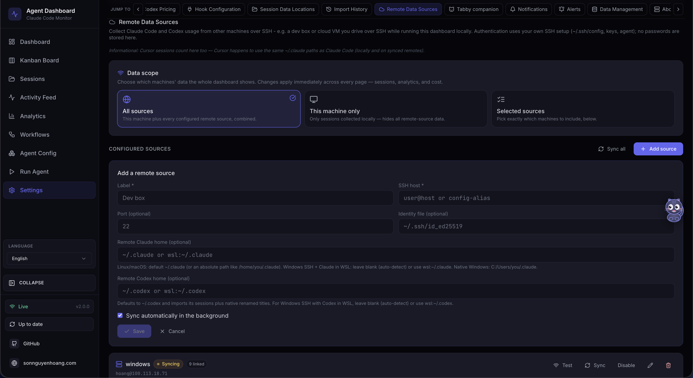
  <br>
  <em>🛰️ <strong>Impostazioni · Sorgenti dati remote</strong> — recupera l'attività di Claude Code e Codex da altre macchine via SSH: imposta opzionalmente percorsi indipendenti per la home remota di Claude e quella di Codex, testa ciascun provider, sincronizza manualmente o con un poller in background e commuta lo scope globale dei dati tra locale, tutte le sorgenti o una macchina specifica, con badge della sorgente per sessione</em>
</p>

La sidebar offre accesso rapido a Dashboard, Kanban Board, elenco Sessioni, Feed delle attività, Analytics, Workflow e Impostazioni. Ogni pagina è progettata per darti insight approfonditi sull'attività dei tuoi agenti Claude Code con aggiornamenti in tempo reale e visualizzazioni ricche.

---

## Funzionalità


La dashboard offre un insieme completo di funzionalità per monitorare e analizzare le tue sessioni e i tuoi agenti Claude Code:

> **Anche le sessioni Cursor (a titolo informativo):** CCAM ingerisce qualsiasi trascrizione di agente finisca sotto `~/.claude` — su questa macchina e sui remoti sincronizzati. L'uso di **Cursor** viene conteggiato allo stesso modo: Cursor si trova a salvare le sue sessioni di agente in quei percorsi accanto a Claude Code. CCAM non distingue quale app abbia scritto un file.

| Funzionalità | Descrizione |
|------------------------------------|------------------------------------------------------------------------------------------------------------------------------------------------------------------------------------------------------------------------------------------------------------------------------|
| **Avanzamento dei task** | Tracciamento dei task attribuito all'owner e derivato dallo stato osservabile del provider: gli attuali `TaskCreate` / `TaskGet` / `TaskUpdate` / `TaskList` di Claude e gli eventi di ciclo di vita, il legacy `TodoWrite`, e l'`update_plan` di Codex diretto o incapsulato in unified-exec. Le sessioni con stato dei task mostrano lo stesso donut compatto e l'anteprima hover/focus renderizzata in un portal accanto allo stato nella tabella Sessioni e in ogni card degli agenti della Dashboard; il Dettaglio sessione mostra il pannello di avanzamento completo con segmenti di stato, lavoro attivo, ripartizione per owner e righe dei task paginate 10 alla volta. L'avanzamento è limitato al lavoro top-level più recente: un turno umano di Claude o un task di Codex più recente senza tracker emesso azzera lo stato precedente, e lo stato incompiuto viene scartato quando quel turno/task termina senza un aggiornamento finale. Lo storico completamente completato resta visibile. |
| **Dashboard** | Due schede persistite in `localStorage`: **Monitor** — statistiche di riepilogo (6 stat card), card degli agenti attivi con gerarchia dei subagenti richiudibile e feed delle attività recenti con conteggi dinamici degli elementi che riempiono l'altezza disponibile del viewport via `ResizeObserver`. **Health** — anello del punteggio composito di salute del sistema (pesato: 0,4 × tasso di successo + 0,25 × tasso di cache hit + 0,25 × (100 − tasso di errore) + 0,1 × (100 − heap %)), grafico a donut dello storage engine con distribuzione dei record, indicatori di prestazioni della cache / tasso di errore / tasso di successo, grafico a barre orizzontali delle invocazioni degli strumenti (top 8), barre di efficacia dei subagenti, distribuzione dei token per modello e statistiche sull'impatto delle compattazioni. Tutte le metriche di salute si auto-aggiornano ogni 5 s da `/api/settings/info` e `/api/workflows`. Tooltip che seguono il cursore con rilevamento dei bordi del viewport su ogni grafico |
| **Kanban Board** | Due viste con un commutatore nell'intestazione (persistito in `localStorage`): **Agenti** — 4 colonne (Working / Waiting / Completed / Error) — e **Sessioni** — 5 colonne (Active / Waiting / Completed / Error / Abandoned). La colonna **Waiting** mappa direttamente lo stato `waiting` persistito sugli agenti — impostato quando Claude Code è fermo a un prompt (sessione nuova, tra un turno e l'altro, o bloccato su una Notification di permesso) e transita a `working` nel momento in cui l'utente riprende (UserPromptSubmit / PreToolUse). Ogni intestazione di colonna mostra un tooltip `?` che spiega le transizioni del ciclo di vita. Le card vengono recuperate per stato persistito dal server (di fatto senza limite per stato), poi paginate lato client a 10 card per colonna con un pulsante "Show more". La sottoscrizione WS è limitata alla vista attiva (frame `agent_*` vs `session_*`), così gli aggiornamenti fuori vista non innescano refetch. I badge Waiting espongono l'`awaiting_reason` della riga come tooltip al passaggio del mouse — **Needs input** (`notification`), **Turn done** (`stop`), **At prompt** (`session_start`), **Interrupted** (`interrupted`) — mantenuto solo come tooltip sulle card compatte così i titoli conservano il loro spazio; le superfici più ampie (tabella Sessioni, intestazione del dettaglio sessione) mostrano in aggiunta il motivo inline come chip annidata, con i motivi urgenti (richieste di permesso, interruzioni) in un ambra più acceso |
| **Sessioni** | Tabella ricercabile, filtrabile e **paginata lato server** di ogni sessione registrata. Ogni click di pagina chiama `/api/sessions?status=&q=&limit=10&offset=…`, così il calcolo dei costi viene eseguito solo sulla pagina visibile — indipendentemente da quante sessioni esistano nel database. La prima pagina include anche la stessa riga di avvio Codex locale e in memoria mostrata su Dashboard e Kanban; è visibile immediatamente ma non navigabile finché un ID di sessione durevole non la sostituisce, e non modifica i totali durevoli né la paginazione. La casella di ricerca (`q=`) esegue una corrispondenza case-insensitive su `id` / `name` / `cwd` lato server con un debounce di 300 ms, e la risposta include un conteggio `total` per la UI del paginatore. Filtro di stato, ricerca e paginazione si compongono. Il **nome** leggibile di ogni sessione è letto dalla trascrizione e mantenuto sincronizzato in tempo reale — un titolo esplicito da `/rename`, `claude -n` o `Ctrl+R` del picker (la riga JSONL `custom-title`) vince sempre, altrimenti subentra l'`ai-title` auto-generato, altrimenti il **primo prompt utente** della sessione (troncato, saltando il rumore di tool-result / slash-command) riempie il nome segnaposto e il nome/task segnaposto dell'agente principale — così le sessioni che non ricevono mai un titolo (incluse quelle importate) dicono comunque cosa stanno facendo; la dashboard mostra quel nome (con fallback sull'ID breve) su card, Dashboard, Feed delle attività e picker di ripresa di Run. |
| **Dettaglio sessione** | Pannello di panoramica in tempo reale per sessione con banner dell'agente attivo (strumento + task correnti), sei contatori a riquadro (eventi con tasso eventi/min, chiamate agli strumenti, subagenti, compattazioni, errori, durata che avanza), barre degli strumenti più usati, ripartizione dei tipi di subagente, striscia impilata del flusso di token e nuvola di pill dei tipi di evento — tutti aggiornati live sugli eventi hook. Sotto: albero della gerarchia degli agenti, timeline completa degli eventi con filtri multi-dimensione (stato, tipo di evento, strumento, agente, ricerca testuale, intervallo di date), raggruppamento Pre/Post per `tool_use_id`, blocco di riepilogo leggibile, renderer di input/risposta consapevoli dello strumento (terminale per Bash, diff unificato per Edit, codice con numeri di riga per Read/Write, lista dei match per Grep, card chiave/valore per gli strumenti MCP), e una scheda Conversazione che renderizza le trascrizioni — inclusi i messaggi digitati a metà turno (accodati mentre Claude stava ancora lavorando), posizionati dove Claude li ha effettivamente ricevuti, con le notifiche del harness attribuite a System — con markdown (titoli, liste, citazioni, tabelle, task list), blocchi di codice con evidenziazione della sintassi (js/ts, python, json, bash, html, css, sql, yaml, diff) con numeri di riga e copia negli appunti, e chiamate agli strumenti stilizzate per strumento (Bash → terminale, Edit → vecchio/nuovo affiancati, Write → etichetta del file, Read → chip del percorso, Grep → card del pattern). Quando la sessione è bloccata in attesa dell'umano, un **banner giallo di attesa input** sotto l'intestazione riporta l'`awaiting_reason`, la sua spiegazione e da quanto tempo la sessione è in attesa (punto pulsante + tempo relativo); il badge Waiting dell'intestazione porta lo stesso motivo come chip annidata |
| **Feed delle attività** | Log degli eventi in streaming in tempo reale con pausa/ripresa, filtri multi-dimensione (stessa toolbar del Dettaglio sessione più un filtro Sessione), paginazione "Load more" guidata dal server, refresh live con debounce e consapevole dei filtri che preserva la dimensione di pagina caricata, toggle di raggruppamento, prefisso di origine che mostra progetto › sessione › subagente, un pulsante "Session →" per riga, e un badge di stato per riga dalla singola mappatura condivisa con Dashboard e Dettaglio sessione (tipi di evento sia Claude sia Codex) |
| **Analytics** | Uso dei token, frequenza degli strumenti, heatmap delle attività (centrata, allineata al giorno della settimana a partire da domenica, tooltip con il nome del giorno), trend delle sessioni, indicatore di connessione live/offline. Mentre il payload di analytics si carica, la regione dei grafici (non solo i riquadri statistici) mostra **segnaposto skeleton pulsanti** che rispecchiano il layout dei grafici, così la pagina non mostra mai un flash di grafici vuoti o a zero. Le legende lunghe su Analytics e Workflow sono paginate; le legende che stanno in una pagina restano invariate |
| **Aggiornamenti live** | Push via WebSocket -- niente polling, aggiornamenti istantanei della UI |
| **Auto-discovery** | Sessioni e agenti vengono creati automaticamente dai segnali del provider. Claude Code crea una card **Waiting** immediata al `SessionStart`. Codex espone dapprima una card **Waiting** locale e in memoria non appena il suo processo TUI interattivo parte, anche prima che Codex assegni un ID di sessione stabile. Un hook, una riga di live-thread o un rollout creano poi la sessione durevole e sostituiscono quella card temporanea. Se l'utente apre il picker Resume di Codex e seleziona un thread esistente, CCAM rileva il rollout o il writer lock già aperto da quello stesso PID di Codex e passa alla sessione ripresa durevole prima del primo nuovo messaggio. La card pre-identità non viene mai scritta in SQLite, nello storico, in analytics, nel pricing, nei workflow, negli alert o nelle notifiche di completamento, e sparisce quando il processo termina. |
| **Import dello storico** | L'Import History consapevole del provider importa le trascrizioni di Claude Code da `~/.claude/` e i rollout JSONL di Codex da `~/.codex/sessions`. Ogni scheda ha il proprio percorso di default, istruzioni, scansione delle cartelle e flusso di upload; entrambe riusano la propria logica di ingestione live, preservano la contabilità di token/costi/strumenti e sono idempotenti. I rollout Codex esterni vengono snapshotati nello storage della dashboard così la loro conversazione resta disponibile anche dopo la rimozione dell'archivio o della cartella di origine. |
| **Gerarchia dei subagenti** | Albero richiudibile padre-figlio degli agenti su Dashboard e Dettaglio sessione. Gli agenti con subagenti mostrano chevron di espansione/chiusura; gli agenti foglia mostrano un indicatore a punto. Si auto-espande quando i subagenti sono attivi |
| **Agenti in background** | Traccia correttamente i subagenti mandati in background senza completamenti prematuri |
| **Attribuzione degli strumenti ai subagenti** | Le chiamate agli strumenti interne ai subagenti (Read, Bash, Edit, Grep, …) vivono solo nei file JSONL per subagente — Claude Code non emette hook per esse. A ogni `SubagentStop` la dashboard lancia un passaggio fire-and-forget `scanAndImportSubagents` che analizza ogni `subagents/agent-*.jsonl`, accoppia i blocchi `tool_use` con il loro `tool_result` corrispondente tramite `tool_use_id`, ed emette eventi `PreToolUse` + `PostToolUse` sotto l'`agent_id` proprio del subagente. Idempotente (dedup `data LIKE '%"tool_use_id":"X"%'`) e si fonde con una riga di subagente creata dagli hook live quando ne combacia una per tipo + orario di inizio entro 30 s, così non vengono create righe `<sid>-jsonl-*` parallele. Lo stesso percorso viene eseguito all'import di avvio di `npm run setup` per il backfill storico completo — le sessioni precedenti alla dashboard ottengono timeline complete degli strumenti per subagente. Il Feed delle attività e il Dettaglio sessione renderizzano la catena dei genitori come `main › coder › explorer` per i subagenti annidati. Quella catena è ricostruita in modo autoritativo da `reconcileSubagentParents`: una riga di subagente viene prima inserita piatta sotto l'agente principale (un singolo evento hook o file JSONL non porta l'identità di chi l'ha generato), poi lo spawner viene recuperato dal risultato del tool Task nella trascrizione di ciascun subagente (`toolUseResult.agentId`, catturato come `spawnedChildren`), così un subagente che genera i propri subagenti si annida sotto il suo **vero** spawner invece di appiattirsi a un livello sotto main. Idempotente e additivo — ripunta soltanto `parent_agent_id`, non inserisce né elimina mai righe — e viene eseguito nella stessa scansione di `SubagentStop`, che restituisce un conteggio `reparented` così la dashboard rifà il fetch anche quando il solo re-parenting ha cambiato la forma dell'albero |
| **Tracciamento dei costi** | Stima dei costi per modello con regole di pricing configurabili e ripartizioni per sessione. Supporta **tariffe promozionali a tempo** (`intro_*` + `intro_until` su una regola di pricing): l'uso entro la data di cutoff è prezzato alla tariffa promozionale e l'uso successivo alla tariffa standard, così una promo come lo sconto di lancio di Claude Sonnet 5 (fino al 2026-08-31) resta corretta per l'uso storico **e** futuro — l'endpoint dei costi prezza l'uso di ogni giorno alla tariffa in vigore in quella data. **Le tariffe promozionali sono completamente modificabili nelle Impostazioni** — l'editor Model Pricing espone una data di cutoff promo più i prezzi promozionali per categoria (input / output / cache-read / cache-write 5m e 1h), così la promo di lancio di un modello futuro non richiede modifiche al codice, solo una modifica. **Le card dei subagenti mostrano il costo PROPRIO di ciascun subagente** (derivato dall'uso di token della trascrizione di quel subagente e prezzato alle tariffe correnti), non il totale di sessione — una card dell'agente principale rappresenta l'intera sessione e mostra il totale di sessione, mentre una card di subagente mostra solo quanto quel subagente ha speso, così una card di subagente non dà più l'impressione fuorviante di essere costata quanto l'intera sessione. La contabilità dei token consapevole delle compattazioni preserva i totali attraverso le compressioni di contesto. Le letture delle trascrizioni sono cached con aggiornamenti incrementali per offset di byte per un'estrazione efficiente dei token |
| **Cache delle trascrizioni** | Estrazione in tempo reale dalle trascrizioni JSONL: token, compattazioni, errori API (voci `isApiErrorMessage` salvate come eventi `APIError`), durate dei turni (salvate come eventi `TurnDuration`), conteggi dei blocchi di thinking ed extra di usage (service_tier, speed, inference_geo). Le durate dei turni portano identità di trascrizione stabili; i parse completi riparano righe duplicate legacy e totali di metadata gonfiati, mentre i parse limitati alla coda restano append-only. Gli array crescenti per voce sono limitati in coda a `TRANSCRIPT_CACHE_MAX_ARRAY_LEN` (default `1000`, configurabile) — sia durante il parse sia alla finalizzazione — così nemmeno una sessione che gira per giorni può far crescere senza limite una singola voce di cache. Ogni voce salva solo `{mtimeMs, size, bytesRead, result}`, quindi non esiste una copia ombra degli stessi dati sia al livello superiore sia dentro `result`. I metadata di sessione sono arricchiti con questi campi in tempo reale |
| **Notifiche** | Pipeline Web Push (VAPID) completa per una consegna affidabile. Arrivano anche quando la scheda è in background o il browser è chiuso. Configurata esplicitamente per il supporto audio su macOS. Toggle configurabili per evento con gestione delle sottoscrizioni |
| **Alert** | Motore di alerting basato su regole — configurato interamente in **Impostazioni → Alerts & Notifications**, un centro di controllo a schede **Rules / Channels / Activity** (nessuna pagina separata). Definisci regole di alert con quattro tipi di condizione — **pattern di eventi** (match su tipo di evento / nome dello strumento / testo del riepilogo, richiedendo opzionalmente N eventi corrispondenti in una finestra temporale, es. "più di 5 errori in 2 minuti"), **inattività** (sessione attiva senza eventi per N minuti), **agente bloccato** (agente fermo in `working`/`waiting` senza attività per N minuti) e **soglia di token** (token totali di sessione oltre un limite). Le regole guidate dagli eventi vengono valutate lato server a ogni ingest di hook (dopo la transazione di ingest — l'alerting non può mai rallentare o far fallire la consegna degli hook); le regole a base temporale girano su uno sweep di 60 s. Gli alert scattati sono persistiti in `alert_events` con **dedup a cooldown** per regola + per sessione (default 300 s), trasmessi come messaggi WebSocket `alert_triggered` e mostrati nel feed live della scheda **Activity** con acknowledge / acknowledge-all, un filtro per soli non riconosciuti e link "View session" per alert. Le regole supportano l'attivazione/disattivazione e cancellano a cascata il loro storico alla rimozione. Gli alert scattati si propagano anche verso i **target webhook universali** configurati nella scheda **Channels** — **14 provider di prima classe** più un endpoint generico: **Slack**, **Discord**, **Microsoft Teams**, **Google Chat**, **Mattermost**, **Rocket.Chat** (payload di chat nativi); **Telegram** (Bot API), **PagerDuty** (Events API v2), **Opsgenie** (Alert API + auth GenieKey), **Splunk On-Call** (VictorOps REST); e **Zapier**, **Make**, **n8n**, **Pipedream**, o qualsiasi endpoint **generico** (envelope JSON pulito con firma **HMAC-SHA256** opzionale e header personalizzati). Ogni provider è descritto da un registro lato server che dichiara il suo formatter di payload, come viene risolto il suo URL (alcuni lo derivano dalle credenziali — es. Telegram dal token del bot, Opsgenie dalla regione — altri lo impostano di default) e quali campi credenziale la UI renderizza. I target supportano lo scoping opzionale per regola, un probe sincrono "Send test" e un log delle consegne registrato. La consegna gira staccata dal percorso dell'alert con timeout di richiesta e retry/backoff limitati, quindi non può mai rallentare o bloccare il monitoraggio; URL dei target, segreti e campi credenziale sono conservati lato server e mai restituiti dall'API (mascherati/oscurati in ogni risposta) |
| **Notificatore di aggiornamenti** | Il server esegue periodicamente un `git fetch` non bloccante e confronta il checkout locale con `origin/master`/`origin/main`/`origin/HEAD`. Quando l'upstream è avanti, la UI mostra una modale con il comando esatto `git pull && npm run setup` e un pulsante **Copy** a un click; la sidebar riceve un pulsante persistente "Check for updates" con badge live. La dashboard non fa mai pull né si riavvia da sola — l'utente esegue il comando in un terminale — così il meccanismo non può rompere le sessioni di sviluppo, la supervisione pm2/systemd/Docker, né lasciare processi orfani |
| **Impostazioni** | Informazioni di sistema, stato degli hook, gestione del pricing dei modelli, preferenze di notifica, export **e ripristino** dei dati (la modalità **Restore backup** del pannello Import History accetta un export `.json` fino a 25 MiB e lo re-importa idempotentemente senza sovrascrivere le righe esistenti, così puoi consolidare lo storico di più macchine in una sola dashboard), pulizia delle sessioni. La sezione Model Pricing separa **Anthropic Claude Model Pricing** da **OpenAI GPT Model Pricing** con layout di intestazione allineati, controlli **Reset Defaults** e **Add Model** con scope per provider, e popover informativi che spiegano il lookup delle regole first-match, la sintassi wildcard `%` in stile SQL, gli aggiornamenti manuali dei prezzi e le avvertenze sulle tariffe API. Il popover GPT spiega anche le unità in USD per milione di token, il confine Short/Long a 272K, le tariffe della modalità Fast e perché i tier non pubblicati restano senza prezzo invece di essere stimati. Il controllo **Dashboard Data** ri-scarica immediatamente sessioni, agenti, eventi, token, workflow, analytics e costi per Claude Code, Codex o entrambi. Gli input separati per la home di Claude Code e di Codex sono completamente guidati dall'i18n e si salvano a runtime; un salvataggio Codex riattiva l'osservazione live dei rollout e scansiona il suo nuovo albero. |
| **Run Agent + Agent Config** | `/run` inizia con una scelta Claude Code / Codex e mantiene il toggle del provider accanto al suo stato Live. Le esecuzioni Claude conservano le modalità headless e conversazione stream-json; le esecuzioni Codex usano il protocollo locale `app-server` della CLI per un vero thread interattivo, policy native di approvazione/sandbox, ripresa, stop, output live e ri-collegamento. Le scelte dei modelli Codex arrivano direttamente dalla CLI autenticata, quindi i rilasci di modelli non richiedono aggiornamenti della dashboard; Claude mostra i suoi alias durevoli più i modelli osservati localmente perché la sua CLI non ha un comando di elenco modelli. `/cc-config` affianca all'esploratore modificabile consolidato di Claude Code un workspace Codex per default di configurazione, cache dei modelli, profili, MCP, progetti, skill, regole, hook, plugin installati e file di istruzioni. Le sue anteprime normali oscurano i segreti; l'editor locale esplicito supporta `config.toml`, `hooks.json`, regole utente, skill e istruzioni con salvataggi atomici e backup con timestamp obbligatori, avvisando che non può validare la sintassi. I comandi dei profili Codex e i percorsi degli artefatti gestiti si copiano in un click, e le card dei plugin usano il registro dei plugin installati di Codex invece di mostrare le cartelle di cache. Entrambi gli esploratori si aggiornano tramite il watcher del filesystem specifico del provider. |
| **Codex Agent Config** | La metà Codex di Agent Config legge l'intero catalogo locale dei modelli dell'account senza il limite generico di anteprima che poteva mostrare falsamente zero modelli, e include sempre gli override base/profilo. Crea overlay standard Codex `<name>.config.toml` direttamente nell'app; ogni card copia il suo esatto comando `codex --profile <name>` in un click e apre un editor protetto. I percorsi di anteprima sono canonicalizzati prima dei controlli di contenimento. L'editor rifiuta componenti di percorso symlinkati sotto la root fidata, verifica il contenimento canonico del genitore e rifiuta contenuti di anteprima `[redacted]`. Profili, hook, regole, skill e istruzioni condividono le azioni in stile Claude **View source / Copy path / Edit / Delete**. Ogni eliminazione consentita viene prima confermata e sottoposta a backup (una skill conserva la sua intera directory); `config.toml` è permanentemente di sola modifica. |
| **Server MCP (locale)** | Server MCP locale completo in `mcp/` con tre modalità di trasporto (stdio, HTTP+SSE, REPL interattivo) e 97 strumenti tipizzati in 16 moduli di dominio. Copre osservabilità, sessioni/agenti/eventi con scope, trascrizioni e immagini, pricing Claude/GPT, workflow, alert, webhook, import e ripristino dei backup, configurazione Claude/Codex, Run Agent, sorgenti remote, hook/home/aggiornamenti, push e manutenzione. Le modalità protocollo e REPL condividono un unico catalogo validato, con target solo localhost e gate a livelli per mutazioni/azioni distruttive. L'HTTP diretto in loopback può portare un bearer token; gli alias tokenizzati container-host richiedono HTTPS. I redirect sono rifiutati, gli upload sono limitati a 50 MiB per file e 100 MiB per chiamata, le risposte binarie a 10 MiB e il ripristino dei backup a 25 MiB |
| **Workflow** | Pagina di visualizzazione basata su D3.js con 11 sezioni interattive: DAG di orchestrazione degli agenti, diagramma Sankey dell'esecuzione degli strumenti, rete di collaborazione, efficacia dei subagenti (sparkline per giorno della settimana con tooltip renderizzati in un portal che sfuggono all'`overflow:hidden` della card e si agganciano al viewport così da non venire mai tagliati), pattern di workflow rilevati, flusso di delega dei modelli, mappa di propagazione degli errori (barre orizzontali con badge dei tassi, ripartizione per tipo di agente, card degli errori API/sessione), timeline di concorrenza, scatter della complessità delle sessioni, analisi dell'impatto delle compattazioni (riprogettata come un chiaro istogramma "sessioni per numero di compattazioni" con titoli degli assi, riquadri statistici — totale / sessioni coinvolte / media / picco — una riga di aiuto esplicativa e tooltip al passaggio del mouse per barra) e drill-in per sessione. Il sottotitolo allineato a destra di ogni sezione si blocca su una singola riga (ellissi + titolo al passaggio del mouse) così una traduzione lunga non manda mai a capo l'intestazione. **Tooltip ricchi e consapevoli dell'i18n ovunque:** il titolo di sezione di ogni grafico porta un'icona `i` che apre un popover strutturato "Cosa mostra / Come leggerlo / Perché conta"; passare il mouse su nodi, archi, barre e bolle fa emergere tooltip multi-sezione con interpretazioni deterministiche dipendenti dai valori (es. percentuali di quota sulla sorgente / sul target, fasce di salute del tasso di successo, descrizioni delle famiglie per Opus / Sonnet / Haiku, pattern temporali come front-loaded / mid-session / back-loaded). Ognuna delle sei stat card di testata ha un popover informativo in basso a destra che spiega come viene calcolata la metrica e cosa significa il suo valore corrente in linguaggio semplice. I tooltip sono mutati nel DOM tramite un singolo ref per grafico con fallback `mouseleave` a livello di container, così non restano mai indietro rispetto al cursore né rimangono appiccicati dopo un re-render. Cliccando una riga in **Detected Workflow Patterns** si espande un pannello di dettaglio in-place con la sequenza completa dei passi, la griglia delle statistiche, una narrazione deterministica (rilevamento dei loop, fascia di frequenza) e un suggerimento pratico. Le schede di filtro per stato (Active Only / Completed / All) filtrano tutte le 11 sezioni. Cross-filtering, export JSON e auto-refresh in tempo reale via WebSocket con debounce di 3 secondi. Un pannello **Workflow Runs** fa emergere i "workflow dinamici" — le flotte di sub-agenti generate dallo strumento `Workflow` (e dal `/loop` auto-cadenzato) — che non emettono hook e vengono invece ricostruite dai run journal su disco (`workflows/wf_<runId>.json`): ogni esecuzione mostra le sue fasi e una ripartizione per agente di token / chiamate agli strumenti / durata, con rilevamento live dello stato `running` prima che il journal sia scritto e una sottosezione collegata in ogni pagina di Dettaglio sessione |
| **Tracciamento delle compattazioni** | Rileva gli eventi `/compact` dalle trascrizioni JSONL, crea agenti ed eventi di compattazione. Al primo avvio esegue il backfill delle compattazioni legacy. Uno scanner periodico (cadenza derivata da `DASHBOARD_STALE_MINUTES`) intercetta le compattazioni anche quando nessun hook scatta. Legge il percorso della trascrizione di ogni sessione attiva direttamente da `sessions.transcript_path` (popolato dal gestore degli hook al primo evento che lo trasporta, più un backfill una tantum da `events`) invece di fare una `SELECT DISTINCT json_extract(events.data, '$.transcript_path')` sull'intera tabella degli eventi — così lo sweep è O(sessioni attive) e resta economico su un database maturo. Condivide la cache delle trascrizioni così non avvengono letture duplicate dei file. Le righe di compattazione sintetiche sono marcate con il timestamp della trascrizione sia su `started_at` sia su `ended_at` così la durata è esattamente 0 (la compattazione è istantanea); una migrazione di riparazione all'avvio sana anche eventuali righe preesistenti dove `ended_at < started_at` (issue #156) |
| **Sottosessioni / Sessioni riprese** | Riattiva automaticamente le sessioni all'arrivo di nuovi eventi, gestisce correttamente `/resume` e le sessioni orfane. Uno sweep periodico (ogni ¼ di `DASHBOARD_STALE_MINUTES`, limitato tra 60 s e 5 min) marca le sessioni abbandonate che sfuggono al rilevamento basato sugli eventi |
| **Rilevamento delle sessioni preesistenti** | Le sessioni già in esecuzione all'avvio del server vengono importate come "attive" (in base alla modifica recente del file JSONL). Anche gli eventi Stop riattivano le sessioni importate completate/abbandonate, così il primo hook di una sessione in corso la fa sempre comparire sulla dashboard |
| **Sincronizzazione continua dei progetti** | L'auto-import all'avvio di `~/.claude/projects` è una tantum (protetto da marker), quindi una cartella di progetto creata **dopo** il primo avvio — le cui sessioni non passano mai per gli hook (es. hook disabilitati solo sull'host) — resterebbe invisibile fino a una nuova scansione manuale. Una sincronizzazione in background (`startSessionSync`) chiude quel gap con tre trigger che condividono una cache di mtime + un singolo sweep coalizzato: uno sweep **immediato** all'avvio, un **`fs.watch`** con debounce che scatta nell'istante in cui appare un nuovo file di sessione o cartella di progetto (ricorsivo su macOS/Windows; root + figli immediati su Linux per evitare il rischio del watcher ricorsivo in userland), e un **poll periodico** (`DASHBOARD_SESSION_SYNC_MS`, default 30 s). Ogni sweep ri-analizza solo i file il cui mtime è avanzato e trasmette `session_created`/`session_updated` (più l'agente principale) così la UI si aggiorna live; una sessione invariata già nel DB viene saltata senza ri-analisi, così il costo di riavvio resta O(file nuovi/modificati) |
| **Sorgenti dati remote** | Raccolta live remota / multi-macchina di Claude Code e Codex via SSH. Una sorgente rispecchia in modo indipendente `~/.claude/projects` e `~/.codex/sessions` (più il leggero `session_index.jsonl` di Codex per i titoli rinominati nativi) tramite **scp**, oppure `wsl.exe` + `tar` per le CLI ospitate in WSL su un host SSH Windows. Ogni stage isolato passa per il normale importer del suo provider e tagga le righe con `sessions.source`; una sorgente è in salute quando almeno uno dei provider è disponibile, così le macchine solo-Claude, solo-Codex e miste funzionano tutte. Il poller `DASHBOARD_REMOTE_SYNC_MS` da 15 s e i pull immediati su aggiunta/riabilitazione trasmettono `remote_source.status`, `remote_data.updated` consapevoli del provider e aggiornamenti per sessione. Il ciclo di vita remoto viene riconciliato da ogni trascrizione rispecchiata. Se un provider è indisponibile, va in errore o resta bloccato in sincronizzazione oltre `DASHBOARD_STALE_MINUTES`, solo le vecchie sessioni remote di quel provider ricadono nel normale sweep di stallo; un provider gemello in salute resta di proprietà del mirror. Configura percorsi indipendenti opzionali per la **home remota di Claude** e la **home remota di Codex** in **Impostazioni → Remote Data Sources** oppure usa `ccam remote-sources`; l'autenticazione SSH resta interamente sull'host (nessuna password o segreto memorizzato). |
| **Design responsive** | Layout adatti al mobile con griglie impilabili, tabelle scorrevoli e sidebar richiudibile |
| **Localizzazione della UI** | Cambio di lingua integrato con menu a tendina personalizzato, testi della UI tradotti ed etichette di accessibilità per inglese (`en`), cinese (`zh`), vietnamita (`vi`), coreano (`ko`), spagnolo (`es`) e italiano (`it`). La copertura si estende end-to-end fino ai tooltip dei Workflow: calcoli delle stat card e interpretazioni delle fasce di valori, popover per grafico "Cosa / Come leggerlo / Perché", il tooltip al passaggio del mouse di ogni grafo (orchestrazione, flusso degli strumenti, pipeline, delega dei modelli, concorrenza), le narrazioni e i suggerimenti del pannello di dettaglio dei Workflow Patterns, il popover informativo di Impostazioni → Model Pricing, il pannello CLAUDE_HOME e l'intero flusso di Import History. |
| **Dati di esempio** | Script di seed integrato per demo e sviluppo |
| **Statusline** | Statusline CLI con codifica a colori che mostra modello, uso del contesto, branch git, token per direzione e costo della sessione (USD) |
| **Formattazione dei nomi dei modelli** | Nomi dei modelli leggibili in tutta la UI: identificatori grezzi come `claude-opus-4-7-20260101` o `claude-opus-4-7[1m]` vengono mostrati come "Claude Opus 4.7" o "Claude Opus 4.7 (1M)". Gestisce le famiglie Claude, GPT e Gemini con unione automatica delle versioni con il punto, rimozione dei suffissi di data/latest, rimozione del prefisso del provider e formattazione del tag della finestra di contesto. La pagina Impostazioni conserva i nomi grezzi per la configurazione delle regole di pricing |
| **Marketplace dei plugin Claude + Codex** | Un unico albero sorgente di 14 plugin fornisce i manifest canonici Claude, i manifest Codex `.codex-plugin/plugin.json`, entrambi i cataloghi del marketplace, 66 skill di plugin incluse, 18 subagenti Claude, 34 comandi Claude, 3 helper CLI e i metadata delle skill OpenAI. La CLI skills.sh scopre 76 skill totali del repository con `npx skills add hoangsonww/Claude-Code-Agent-Monitor --list`. Installa con `claude plugin marketplace add`, `codex plugin marketplace add` o `npx skills add` |
| **Run Claude** | Avvia sottoprocessi `claude` direttamente dalla dashboard con una UI di streaming in stile chat. Due modalità: **Conversazione** (multi-turno — lo stdin resta aperto, i turni successivi vengono inviati come envelope stream-json) e **One-shot** (headless, singolo prompt → singola risposta). La modalità Conversazione supporta anche la **ripresa di qualsiasi sessione esistente** via `claude --resume <id>` — scegli dall'intero storico delle sessioni con un picker ricercabile. La modale unificata di esecuzioni attive / storico offre anche due pulsanti di salto a zero configurazione: **Resume** su qualsiasi riga di conversazione passata avvia immediatamente `claude --resume <id>` e semina la chat con la trascrizione precedente così atterri nella vista live con il contesto completo (non serve riscrivere un prompt — lo spawn resta in attesa sullo stdin finché non invii un seguito); **View** su qualsiasi riga one-shot passata carica la trascrizione catturata inline nel visualizzatore di esecuzione in sola lettura (nessuno spawn — stesso pannello, senza controlli Stop/seguito). Il commutatore di esecuzioni attive nell'intestazione ti permette di lasciare un'esecuzione in background, avviarne un'altra e ricollegarti dopo. Il ri-collegamento è durevole: il client riconcilia il log di envelope in memoria dello spawner (`?envelopes=1`) con la trascrizione JSONL su disco della sessione e preferisce quella con più messaggi utente/assistente, così allontanarsi da un'esecuzione ripresa e tornare mantiene visibile l'intero storico precedente (lo spawner vede solo i turni post-spawn; il file di trascrizione ha precedente + corrente). Menu a tendina dei modelli (Opus 4.7 / 1M / Sonnet 4.6 / Haiku 4.5 / personalizzato), selettore della modalità di permessi con avviso esplicito per `bypassPermissions`, campo **thinking-effort** (low / medium / high — collegato a `--effort`), autocompletamento della cwd precompilato con la **home directory** dell'utente — una posizione di spawn neutra che non eredita il contesto di progetto `.claude` del repo della dashboard (agenti, skill, regole, `CLAUDE.md`, `.mcp.json`); ripiega sulla cwd della dashboard se non è disponibile un suggerimento home, con la home elencata per prima nei gruppi di suggerimenti (home → dashboard → recenti). Vero streaming carattere per carattere via `--include-partial-messages`, più un **livello di smussatura typewriter** lato client che fa gocciolare ogni `text_delta` / `thinking_delta` attraverso `requestAnimationFrame` così anche le risposte brevi (dove claude impacchetta l'intera risposta in uno o due chunk) sembrano digitate. Il codice di merge mantiene intatti il flag `_streaming` e l'array `content` accumulato dai delta quando l'envelope canonico `assistant` di claude arriva a metà stream, così i blocchi di thinking non vengono persi al completamento. Il dispatch WebSocket incapsula ogni envelope in `flushSync` così l'auto-batching di React non collassa le raffiche di delta in un singolo render. **Parità con la TUI (Tier 1)**: un **banner delle limitazioni** richiudibile che si minimizza in una pill sottile (non sparisce mai) e spiega cosa la modalità stream-json può e non può fare rispetto alla TUI del terminale; un **editor di prompt con autocompletamento degli slash-command** con punteggio a livelli (nome esatto → inizia-con → confine di parola → contiene → sottosequenza → descrizione-contiene) che elenca i comandi utente / progetto / plugin (eseguiti lato client via espansione del template prima dell'invio) e mostra i comandi CLI integrati come `/clear`, `/model`, `/config` con un badge "CLI only — won't run from here"; **riferimenti a file con `@`** con ricerca fuzzy con debounce nella cwd dell'esecuzione (saltando `node_modules`, `.git`, `dist`, `build`, ecc.); un **misuratore live di finestra di contesto / token** che mostra token di input + output + cache-read e costo progressivo, calcolato dagli envelope `stream_event` e `result.usage` durante lo streaming live e dai blocchi `usage` finalizzati dell'assistente (input / output / cache-read / cache-creation) quando seminato da una trascrizione su resume / view / ri-collegamento, così il misuratore si popola immediatamente invece di restare a 0/200k. La barra di avanzamento passa da indaco → ambra → rosso all'80% / 95% del limite di contesto del modello; un **header di stato** con modello attivo, effort, modalità di permessi, cwd, ID di sessione, conteggio degli envelope e tempo trascorso. I menu di autocompletamento si aprono verso l'alto così non collidono con il picker della cwd sottostante. Indicatore Live / Offline accanto al titolo. Una guardia same-origin sulla route impedisce spawn drive-by dal browser. La concorrenza è di fatto senza limite per default (tetto di sanità di 10000 per prevenire fork-bomb da un client difettoso; la TUI del terminale non ha limiti e nemmeno noi). Imposta `RUN_MAX_CONCURRENT` se vuoi un tetto reale. Le sessioni avviate attivano gli stessi hook di qualsiasi processo `claude`, quindi compaiono automaticamente in Sessioni / Analytics / Kanban / Workflow — e Sessioni / Dettaglio sessione mostrano un badge / banner verde **▶ Run** che rimanda alla pagina Run per qualsiasi sessione attualmente guidata da lì |
| **Claude Config Explorer** | Un ispettore a 12 schede su `/cc-config` per tutto ciò che Claude Code conosce: skill, subagenti, slash command, output style, plugin (con conteggio dei contributi per plugin + autore/licenza/homepage da `plugin.json`), marketplace (con conteggi dei plugin letti da ciascun `marketplace.json`), server MCP, hook (con l'elenco degli script di `~/.claude/hooks/`), impostazioni (un riepilogo a colpo d'occhio **Current configuration** delle opzioni controllate da `/config` — modello, verbose, tema, output style, effort, auto-compact, notifiche, … — risolte attraverso gli scope utente/progetto/progetto-locale con le opzioni non impostate mostrate come default, più la vista strutturata chiave-valore per file + toggle del JSON grezzo, oscuramento delle chiavi segrete), memoria (i file `CLAUDE.md` utente + progetto **più** lo store di memoria file-based per progetto — ogni `*.md` sotto `~/.claude/projects/<slug>/memory/`, cioè un indice `MEMORY.md` più un file per ogni fatto memorizzato, spesso 100+; raggruppati per progetto in sezioni richiudibili che separano i file indice dai file per fatto, con una casella di ricerca e link cliccabili dell'indice `MEMORY.md` che saltano — scroll + evidenziazione — al file del fatto corrispondente), keybinding (raggruppati per contesto con chip `<kbd>`) e statusline (config + contenuto dello script). I percorsi di lettura e le loro root consentite sono canonicalizzati con `realpath`, così i symlink non possono evadere dalle root fidate di Claude. Per le superfici di file di testo a basso rischio (skill / agenti / comandi / output style / memoria — inclusi i file di auto-memoria per progetto) la pagina supporta **creazione / modifica / eliminazione con backup con timestamp obbligatori** scritti atomicamente fuori dalle directory che Claude Code scansiona, più una modale Backups con comandi `mv` di ripristino auto-costruiti. Plugin, MCP, hook nelle impostazioni e file `settings.json` restano in sola lettura con banner esplicativi + comandi CLI copiabili così l'utente conosce il comando esatto da eseguire da sé. **Aggiornamenti live**: un `cc-watcher` in esecuzione sul server usa `fs.watch` su `~/.claude/` (ricorsivo dove la piattaforma lo supporta) più `~/.claude.json`, con debounce a 500 ms, per trasmettere un messaggio WebSocket `cc_config_changed` ogni volta che la configurazione di Claude Code cambia — sia tramite mutazioni della dashboard sia tramite strumenti esterni (la CLI che installa un plugin, la modifica manuale di `settings.json`, il rilascio di una nuova skill). La pagina si sottoscrive e rifà il fetch automaticamente; una pill Live / Offline accanto al titolo mostra lo stato del WebSocket |
| **Tabby** | Un gatto compagno fluttuante ancorato all'angolo in basso a destra di ogni pagina. Costruito interamente sull'`eventBus` WebSocket esistente — **nessun nuovo backend, nessuna API key, nessuna nuova dipendenza**. Una mascotte SVG reattiva con occhi che seguono il cursore e **otto stati d'animo** derivati dallo stream live delle sessioni (`idle`, `watching`, `happy`, `worried`, `stuck`, `thinking`, `sleeping`, `disconnected`), ognuno con la propria animazione (colpo di coda, orecchie dritte, testa che ondeggia, scossa, scintillio, zzz, "!" di allerta). I **fumetti automatici** pubblicano battute brevi, limitate e coalizzate sugli eventi rilevanti (sessione avviata/terminata, errori, esecuzione completata) e possono essere silenziati. Clicca il gatto o premi **⌘B / Ctrl+B** (Esc chiude) per aprire un **pannello** con una riga di stato live (`N live · M errored · stato della connessione`), azioni rapide (salta a Run Claude / Attività / Sessioni / sessioni in errore, silenzia i fumetti, cancella gli alert) e una casella **Ask**: le semplici domande di stato ("what's running", "any errors", "status") ricevono risposta localmente dai dati in cache, mentre qualsiasi altra domanda passa alla pagina **Run Claude** (deep-link a `/run?prompt=…`) per avviare una vera sessione Claude Code. Accessibile (utilizzabile da tastiera, fumetti `aria-live`, rispetta `prefers-reduced-motion`), degrada in sicurezza a uno stato calmo `disconnected` se il socket è giù, disattivabile nelle **Impostazioni** (localizzato in en/zh/vi/ko/es/it). L'implementazione vive in `client/src/components/Tabby/` |
| **Segnali sonori** | Feedback audio discreto per l'attività live, **attivo per default** e con opt-out completo. Ogni segnale è **sintetizzato nel browser con la Web Audio API** — oscillatori più inviluppi di gain, quindi **nessun file audio da scaricare e nessuna nuova dipendenza**. Sette segnali coprono il ciclo di vita della sessione: una quinta ascendente all'avvio di una sessione, un arpeggio maggiore risolutivo quando una finisce di rispondere, una terza minore discendente morbida sugli errori, un pizzicato corto per gli spawn di subagenti, una campana scordata per le notifiche di Claude Code, un doppio tono su/giù quando la connessione live torna o cade, e un tick appena udibile alla pressione di pulsanti e link. I segnali sono **rate-limited** (cooldown per segnale più un budget globale di burst), passano attraverso un filtro passa-basso così restano dietro al tuo lavoro, e rimangono silenziosi fino alla prima interazione con la pagina (policy di autoplay del browser). **Impostazioni → Sound** offre un interruttore generale, uno slider del volume e un interruttore per segnale con anteprime istantanee; le preferenze persistono in `localStorage` sotto `agent-monitor-sound` (localizzato in en/zh/vi/ko/es/it). L'implementazione vive in `client/src/lib/sound.ts` e `client/src/hooks/useSoundCues.ts` |
| **Progressive Web App (PWA)** | Tre PWA indipendenti — dashboard, landing page e wiki — ognuna con il proprio Web App Manifest e Service Worker. Installa una qualsiasi di esse nella home screen / dock per un'esperienza standalone senza chrome. Il SW della dashboard serve i bundle con hash nel contenuto di Vite sotto `/assets/` in modalità cache-first (gli URL sono immutabili per build, quindi i cache hit sono sempre corretti) e tratta tutto il resto — navigazioni, il SW stesso, `manifest.json`, icone, la root `/` — come network-first con fallback sulla cache. Combinato con header `Cache-Control` espliciti sul middleware statico Express di produzione (`immutable` per `/assets/*`, `no-cache, must-revalidate` per `index.html`, `sw.js`, `manifest.json`), una rebuild sostituisce sempre il bundle nel browser senza hard refresh; un listener `controllerchange` nel client ricarica esattamente una volta quando un nuovo SW prende il controllo di una pagina già controllata. La pipeline di notifiche push VAPID è preservata. I SW della landing page e della wiki precachano le rispettive shell e cachano pigramente le immagini alla prima visita, abilitando l'accesso offline dopo un singolo caricamento. Tutti i manifest usano icone SVG (`favicon.svg`) con `sizes="any"` per i browser moderni, e includono i meta tag `apple-mobile-web-app-capable` + `apple-touch-icon` per la modalità standalone su iOS |
| **App desktop (macOS e Windows)** | App desktop nativa opzionale costruita con Electron 35, che vive nel workspace `desktop/` accanto a `client/`, `server/`, `mcp/` e `vscode-extension/`. Distribuita come `.app` macOS (`.dmg`) **e** come `.exe` Windows (installer NSIS + portable senza installazione). Incorpora il server Express esistente **in-process** (fa `require()` di `server/index.js` — nessun processo figlio, nessun IPC) e renderizza il client React compilato in una `BrowserWindow`. Aggiunge una barra del titolo nativa, un'icona nella barra dei menu / area di notifica (tray) il cui menu a click singolo mostra uno **snapshot di stato live** (sessioni, agenti, eventi di oggi) letto da SQLite al momento del click, un menu applicazione nativo, l'avvio automatico al login (Login Items macOS via `SMAppService`; `HKCU\…\Run` per utente su Windows), una **finestra di conferma ⌘Q / Ctrl+Q** (la seconda pressione bypassa), chiusura-finestra-nasconde-ma-il-server-continua, un lock a istanza singola e azioni del tray per **Open in Browser**, **Restart Server** e **Show Logs**. Preferisce la porta 4820 (ripiega su 4821–4829 e poi su una porta alta casuale), adotta una dashboard in salute già in esecuzione sulla 4820 invece di fare doppio binding, e **coesiste con la dashboard web** — sia `npm run dev` sia l'app desktop possono girare insieme con gli hook che si propagano a entrambi. Le notifiche partono come toast nativi del sistema operativo (il Web Push non funziona in modo affidabile dentro Electron). Al primo avvio con server di proprietà installa automaticamente gli hook di Claude Code e avvia i servizi in background, così un utente che ha solo installato ottiene il flusso di eventi con zero configurazione manuale. Vedi [`DESKTOP.md`](./DESKTOP.md) e [`desktop/README.md`](./desktop/README.md) |
| **Asset self-hosted (niente CDN)** | Ogni font e script è servito localmente, quindi la dashboard e la documentazione fanno **zero richieste a CDN di terze parti** — renderizzano completamente offline e non fanno trapelare nulla verso host esterni. L'app React include Inter + JetBrains Mono via [`@fontsource`](https://fontsource.org/) (subset latino; Vite emette WOFF2 con hash nel contenuto in `dist/assets/` in fase di build, nessun `<link>` a Google Fonts). La landing page e la wiki caricano un foglio `@font-face` self-hosted `fonts/fonts.css` dalla directory `fonts/` alla root del repo. Il Mermaid della wiki è vendorizzato localmente come `wiki/mermaid.min.js` (il vero `mermaid@10.9.6` minificato) invece di jsDelivr, e la pagina di errore dell'estensione VS Code ripiega su uno stack di font di sistema. Non resta alcuna chiamata a `fonts.googleapis.com`, `fonts.gstatic.com` o `cdn.jsdelivr.net` da nessuna parte |
| **Splash screen di sessione** | Un breve splash di branding al caricamento dell'app (una volta per sessione del browser): un **saluto consapevole dell'ora** (Good morning / afternoon / evening / Working late), una tagline in evidenza, due sottotesti e un marchio animato a grafo di nodi su uno sfondo scuro atmosferico (bagliore radiale + costellazione alla deriva + grana). Completamente localizzato (en/zh/vi/ko/es/it). L'overlay è **opaco dal primo paint** così l'app non traspare mai, dura ~2,5 s e poi sfuma; clicca ovunque per saltarlo, e rispetta `prefers-reduced-motion`. Animazioni solo CSS, nessuna dipendenza aggiunta |

> **Scope dei provider e home:** le Impostazioni mantengono la scelta Claude Code / Codex / Entrambi globalmente coerente, e ti permettono di cambiare la home dei dati di sessione di ciascuno senza riavviare la dashboard.
>
> **Confini di sicurezza locali:** Run Agent accetta qualsiasi directory di lavoro assoluta esistente e la canonicalizza prima dell'uso, così gli avvii dalla home e dai progetti recenti restano supportati. I provider di webhook hosted richiedono HTTPS; i target generici e n8n possono usare HTTP per ricevitori locali/self-hosted, e la consegna non segue mai i redirect.

---

## Avvio rapido

### Prerequisiti

- **Node.js** >= 22.22.0 (consigliata la 24 LTS)
- **npm** >= 9.0.0

### 1. Installazione

```bash
git clone https://github.com/hoangsonww/Claude-Code-Agent-Monitor.git
cd Claude-Code-Agent-Monitor
npm run setup
```

### 2. Configura gli hook di Claude Code

```bash
npm run install-hooks
```

L'installer apre una multi-selezione interattiva: usa i tasti freccia, <kbd>Spazio</kbd> e <kbd>Invio</kbd> per scegliere **Claude Code**, **Codex (beta)** o entrambi (Claude Code è preselezionato). Le voci di Claude Code vivono in `~/.claude/settings.json`; quelle di Codex in `~/.codex/hooks.json`. Se un set di hook della dashboard selezionato esiste già, avvisa prima di sostituire solo le voci di questa dashboard — gli hook non correlati sono preservati. Puoi fare la stessa selezione più tardi in **Impostazioni → Hook Configuration → Install hooks**.

Al primo ingresso nella dashboard, scegli la sorgente dati e l'app verifica la prontezza degli hook solo per quella selezione. Claude Code richiede gli hook di Claude, Codex richiede quelli di Codex, ed Entrambi richiede entrambi i set. Quando ogni set di hook richiesto è già installato, la dashboard si apre immediatamente. Altrimenti il gate di configurazione elenca e installa solo i provider selezionati mancanti, preservando gli hook non correlati e lasciando che un controllo di stato fallito ripieghi in sicurezza sulla configurazione manuale.

Anche i rollout Codex in `~/.codex/sessions` vengono scoperti continuamente. La dashboard legge il loro JSONL append-only in modo incrementale, dà priorità ai rollout più recenti e isola un file storico corrotto per un nuovo tentativo, così sessioni, token, costi, righe di conversazione e aggiornamenti WebSocket restano aggiornati anche se una notifica di hook viene persa.

I record del ciclo di vita dei rollout Codex guidano gli stessi stati live delle card di Claude Code: `user_message` e `task_started` marcano l'agente principale **Working**; `task_complete` lascia la sessione attiva ma mostra **Waiting**; e `turn_aborted` mostra **Waiting** con un motivo di interruzione. Un nuovo record di rollout auto-ripara una sessione erroneamente completata. Sugli host locali supportati, la liveness è abbinata all'esatto `rollout-*.jsonl` tenuto aperto da ciascun processo Codex, così i vecchi rollout che condividono una directory di progetto vengono importati come completati invece di apparire come agenti attivi fantasma. Il launcher Node e il suo figlio Codex nativo vengono collassati in un unico processo logico, così una TUI produce una sola card.

I titoli `/rename` di Codex sono letti dal suo indice di sessione nativo e aggiornano le card di sessioni e agenti in tempo reale. Il suo replay della conversazione include i turni umani più le chiamate e gli output degli strumenti personalizzati `exec`, con paginazione a cursore che carica i messaggi più vecchi in cima alla trascrizione.

Le card di Claude Code e Codex mostrano uno storico compatto a due righe dei loro ultimi prompt umani distinti sotto il titolo nativo del provider, così un nome breve amichevole o un seguito laconico non nascondono mai il task attivo. Claude aggiorna questo contesto dalla sua cache locale delle trascrizioni durante hook live, import e sweep del watchdog; Codex lo aggiorna dai record di rollout e ripiega sugli eventi `user_message` persistiti per gli import più vecchi. La trascrizione renderizza gli allegati PNG/JPEG/GIF/WebP persistiti per Claude Code e Codex quando disponibili, mentre le copie duplicate di risposte/eventi Codex vengono collassate in un unico turno umano.

Le invocazioni di strumenti `response_item` di Codex vengono indicizzate una sola volta tramite un cursore di rollout dedicato, così il flusso degli strumenti nei Workflow, il drill-in di sessione, i totali di modelli/token e i conteggi `context_compacted` riflettono i dati Codex registrati senza rigiocare i contatori di ciclo di vita o di token. In uno scope di dashboard solo-Codex, il pannello dei journal dei Dynamic Workflows solo-Claude Code viene nascosto invece di essere presentato come dati Codex vuoti.

### 3. Avvio

```bash
# Development (hot reload on both server and client)
npm run dev

# Production (single process, built client)
npm run build && npm start
```

> [!TIP]
> **Alternativa con Makefile** — tutti i comandi sono disponibili anche via `make` se lo hai installato sul sistema. Esegui `make help` per vedere ogni target, o usa scorciatoie come `make dev`, `make build`, `make test`, ecc.

### 4. Apertura

| Modalità    | URL                     |
| ----------- | ----------------------- |
| Development | `http://localhost:5173` |
| Production  | `http://localhost:4820` |

### 5. Opzionale: esegui il server MCP locale

```bash
npm run mcp:start              # stdio (default — per l'integrazione con host MCP)
npm run mcp:start:http         # server HTTP + SSE sulla porta 8819
npm run mcp:start:repl         # CLI interattiva con tab completion
ccam mcp stdio                 # launcher stabile usato dai plugin inclusi
```

`npm run setup` installa e compila il pacchetto MCP prima di linkare `ccam`. Per la modalità stdio, configura il tuo host con comando `ccam` e argomenti `["mcp", "stdio"]`.

Per la modalità HTTP, punta i client MCP remoti a `http://127.0.0.1:8819/mcp` (Streamable HTTP) o `http://127.0.0.1:8819/sse` (SSE legacy).

Vedi [mcp/README.md](./mcp/README.md) per la configurazione completa dell'host, i dettagli dei trasporti, i flag di sicurezza e il catalogo degli strumenti.

### Opzionale: dati demo di seed

```bash
npm run seed
```

Crea 8 sessioni di esempio, 23 agenti e 106 eventi così puoi esplorare la UI immediatamente.

### Alternativa: app desktop (macOS e Windows)

Se preferisci non tenere un terminale aperto, installa l'**app desktop nativa** opzionale. Incorpora il server in-process, aggiunge un'icona nella barra dei menu / area di notifica (tray) e supporta l'avvio automatico al login (Login Items su macOS / avvio automatico su Windows).

La via più rapida è **scaricare un installer precompilato** dall'[ultima Release GitHub](https://github.com/hoangsonww/Claude-Code-Agent-Monitor/releases/latest) (la CI pubblica automaticamente una `vX.Y.Z` ogni volta che `package.json` viene incrementato su `master`):

- **macOS** — prendi `ClaudeCodeMonitor-<version>-arm64.dmg` (Apple Silicon) o `-x64.dmg` (Intel) e trascina **Claude Code Monitor.app** in `/Applications`.
- **Windows** — prendi `ClaudeCodeMonitor-Setup-<version>-x64.exe` (installer) o `ClaudeCodeMonitor-<version>-x64-portable.exe` (senza installazione) ed eseguilo.

Per compilarla da te invece:

```bash
npm run desktop:install        # installa Electron + electron-builder in desktop/ (verifica le dipendenze native; stampa aiuto di setup in caso di fallimento)
npm run desktop:dmg:arm64      # macOS: DMG veloce single-arch (Apple Silicon)
npm run desktop:win            # Windows: installer NSIS .exe (da eseguire su Windows)
```

La copertura completa dell'app desktop — download, installazione, funzionalità tray/menu, comandi di build e firma — è nella sezione [App desktop (macOS e Windows)](#app-desktop-macos-e-windows) più sotto. Vedi anche [`DESKTOP.md`](./DESKTOP.md) (guida utente) e [`desktop/README.md`](./desktop/README.md) (architettura).

### Alternativa: Docker / Podman

L'immagine OCI e i file Compose supportano Docker e Podman. Il runtime è non-root, rimuove tutte le capability, usa Tini come PID 1, include Git/OpenSSH/SQLite e diventa read-only tranne che per `/app/data`, `/app/config` e `/tmp`.

```bash
# Dashboard only
docker compose up -d --build
# or
podman compose up -d --build

# Complete stack: dashboard + authenticated MCP + Nginx + Prometheus + Grafana
umask 077
openssl rand -hex 32 > deployments/secrets/dashboard-token
openssl rand -hex 32 > deployments/secrets/hook-token
openssl rand -hex 32 > deployments/secrets/mcp-token
openssl rand -base64 32 > deployments/secrets/grafana-admin-password
npm run docker:full:up
```

Tutte le porte host si bindano al loopback per default: dashboard `4820`, MCP `8819`, Nginx `8080`, Prometheus `9090` e Grafana `3000`. Le home di Claude e Codex sono montate in sola lettura; volumi con nome persistono SQLite e la configurazione di proprietà della dashboard. Nginx fa da proxy per UI, REST API autenticata e WebSocket, mentre hook, metriche e MCP restano bloccati al perimetro se non esplicitamente abilitati. Il target Docker opzionale `agent-runtime` aggiunge CLI Claude Code e Codex a versione bloccata per workflow Run Agent container-native.

> [!IMPORTANT]
> Installa gli hook di Claude Code/Codex sull'host dopo l'avvio del container. Per hook cloud remoti, imposta `CCAM_DASHBOARD_URL=https://...` e un `CCAM_HOOK_TOKEN` separato; gli URL di hook non-loopback richiedono HTTPS. Vedi [DEPLOYMENT.md](DEPLOYMENT.md).

---

## Come funziona

La dashboard si integra con Claude Code tramite il suo sistema di hook nativo per fornire un monitoraggio in tempo reale dell'attività degli agenti. Ecco una panoramica dell'architettura e del flusso dei dati:

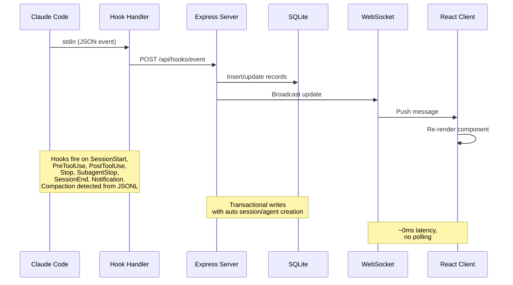
```mermaid
sequenceDiagram
    participant CC as Claude Code
    participant HH as Hook Handler
    participant API as Express Server
    participant DB as SQLite
    participant WS as WebSocket
    participant UI as React Client

    CC->>HH: stdin (JSON event)
    HH->>API: POST /api/hooks/event
    API->>DB: Insert/update records
    API->>WS: Broadcast update
    WS->>UI: Push message
    UI->>UI: Re-render component

    Note over CC,HH: Hooks fire on SessionStart,<br/>PreToolUse, PostToolUse,<br/>Stop, SubagentStop,<br/>SessionEnd, Notification.<br/>Compaction detected from JSONL
    Note over API,DB: Transactional writes<br/>with auto session/agent creation
    Note over WS,UI: ~0ms latency,<br/>no polling
```

> [!IMPORTANT]
> Vedi [ARCHITECTURE.md](./ARCHITECTURE.md) per un approfondimento sull'architettura del server, lo schema del database, le route API, il design del WebSocket, il routing del client, il flusso del gestore degli hook, le modalità di deployment e i diagrammi dettagliati del ciclo di vita di sessioni e agenti.

### Ciclo di vita degli hook

1. **Claude Code** fa scattare un hook all'avvio della sessione, all'uso di uno strumento, alla fine del turno, al completamento di un subagente e all'uscita dalla sessione
2. Il **gestore degli hook** (`scripts/hook-handler.js`) legge l'evento JSON dallo stdin, risolve le dashboard live via `~/.claude/.agent-dashboard.json` (o `CLAUDE_DASHBOARD_PORT` se impostata) e fa il POST dello stesso payload verso **un target di ingest per ogni directory dati SQLite unica** (vince la porta più bassa quando Docker e `npm run dev` condividono `~/.claude/agent-dashboard`, così gli eventi non vengono mai ingeriti due volte). I server con database **diversi** (es. l'app desktop che usa la propria directory Application Support accanto a `npm run dev`) ricevono comunque ciascuno gli hook. Fallisce silenziosamente con un timeout di sicurezza di 5 s così non blocca mai Claude Code, e le promise per target non vanno mai in reject così un singolo listener morto non può affamare gli altri.
3. Il **server** elabora l'evento dentro una transazione SQLite:
   - Auto-crea sessioni e agenti principali al primo contatto
   - Rileva le chiamate allo strumento `Agent` per tracciare la creazione dei subagenti
   - Al `SessionStart`, marca `awaiting_input_since` della sessione e dell'agente principale così una CLI appena aperta ferma al prompt atterra subito in **Waiting**
   - Al `UserPromptSubmit` (l'utente preme invio), cancella il flag di attesa e promuove l'agente principale a `working` — l'unico segnale affidabile che un turno dell'assistente di solo testo è iniziato, dato che non emette `PreToolUse`
   - Imposta l'agente a "working" al `PreToolUse` (cancellando anche il flag di attesa), lo mantiene working attraverso il `PostToolUse`
   - Allo `Stop` (Claude finisce di rispondere), l'agente principale va in "waiting" — Claude ha finito il suo turno, la palla è all'utente. I subagenti in background continuano a girare. La sessione resta `active`. Uno Stop con `stop_reason=error` marca l'agente `error` e la sessione `error`
   - A una `Notification` di permesso (riconosciuta dal pattern del messaggio: `permission`, `waiting for input`, `needs your approval`, …), imposta l'agente a `waiting` e marca `awaiting_input_since`
   - `SubagentStop` deliberatamente NON cancella il flag di attesa (un subagente in background che finisce non ci dice nulla sull'umano)
   - Marca i subagenti come completati individualmente via `SubagentStop`. Dopo il ritorno di `res.json()`, lancia un passaggio fire-and-forget `scanAndImportSubagents` che percorre i file `subagents/agent-*.jsonl` della sessione, accoppia i blocchi `tool_use` ↔ `tool_result` per `tool_use_id` ed emette eventi `PreToolUse` + `PostToolUse` sotto l'`agent_id` proprio di ciascun subagente — chiudendo il gap per cui le chiamate agli strumenti interne ai subagenti sarebbero altrimenti invisibili alla dashboard
   - Al `SessionEnd` (il processo CLI esce), rimuove il flag di attesa. Se la sessione è in `error`, lo stato di errore viene preservato; altrimenti marca tutti gli agenti + la sessione come `completed`
   - Al `SessionStart`, qualsiasi altra sessione attiva senza attività per `DASHBOARD_STALE_MINUTES` (default 180 = 3 h, sovrascrivibile via env) viene automaticamente marcata "abandoned" con i suoi agenti completati. Questo gestisce `/resume` dentro una sessione, Ctrl+C e altri scenari in cui una sessione resta orfana senza un `SessionEnd` pulito
   - Riattiva le sessioni completed/error/abandoned quando arrivano nuovi eventi di lavoro (sessione ripresa). Anche gli eventi Stop e SubagentStop riattivano le sessioni completed/abandoned — questo gestisce le sessioni preesistenti importate prima dell'avvio del server, dove il primo evento hook può essere uno Stop
   - **Recupero dagli errori**: solo `UserPromptSubmit` e `PreToolUse` possono recuperare una sessione da `error` a `active` — a indicare che l'utente ha riprovato attivamente
   - Rileva la compattazione delle conversazioni (voci `isCompactSummary` nella trascrizione JSONL) e crea agenti + eventi `Compaction`. Le baseline dei token sono preservate attraverso le compattazioni così nessun uso va perso. Le letture delle trascrizioni usano una cache condivisa basata su stat con letture incrementali per offset di byte — vengono analizzati solo i nuovi byte aggiunti dall'ultima lettura, con uno speedup di ~50x per le sessioni lunghe
   - Estrae gli errori API (voci `isApiErrorMessage`: limiti di quota, rate limit, invalid_request) e le risposte grezze `type: "error"` dalle trascrizioni JSONL, salvati come eventi `APIError`. Le durate dei turni (`system` con sottotipo `turn_duration`) sono salvate come eventi `TurnDuration`. Gli errori dei risultati degli strumenti (`toolUseResult.is_error`) sono tracciati come eventi `ToolError`
   - **Watchdog di rilevamento errori** — un timer in background gira ogni 15 secondi, scansionando le sessioni attive senza eventi hook recenti (>10 s di stallo). Rilegge i loro file di trascrizione cercando errori API (fallimenti di autenticazione, rate limit, esaurimento della quota), deriva i percorsi delle trascrizioni dalla `cwd` della sessione per le sessioni importate senza `transcript_path` nei dati degli eventi, e marca sessioni/agenti come `error` quando trova errori API. Questo intercetta i casi in cui la CLI di Claude non fa scattare un hook dopo un errore API (es. errori di autenticazione 401 dove la CLI mostra l'errore e aspetta)
   - **Recupero dall'interruzione utente (Esc)** — annullare un turno con `Esc` non fa scattare **alcun hook** (una limitazione documentata di Claude Code), quindi senza intervento l'agente principale resterebbe bloccato in `working` per sempre. Lo stesso watchdog da 15 s recupera in due modi: (1) quando l'annullamento lascia un marcatore `[Request interrupted by user]` nella trascrizione (Esc *dopo* un po' di output), la cache delle trascrizioni lo segnala via `pendingInterrupt` — derivato puramente dall'ordinamento della trascrizione (ultima interruzione vs ultima attività reale del turno, stesso orologio, quindi funziona anche per un annullamento sotto il secondo) — e la sessione passa a **Waiting** entro ~15 s; (2) quando Esc viene premuto *prima di qualsiasi output*, Claude Code non scrive alcun marcatore, quindi si applica un fallback a timeout di inattività — se l'agente principale è stato `working` **senza strumenti in volo** e **né un evento hook né la trascrizione sono avanzati** per `DASHBOARD_WORKING_IDLE_SECONDS` (default `120`), il turno viene considerato morto e la sessione passa a **Waiting**. Entrambi i percorsi registrano un evento `Interrupted` e portano la sessione nello stesso stato Waiting che produce uno `Stop` normale. L'output in streaming (trascrizione ancora in crescita) e le chiamate agli strumenti in volo (`current_tool` impostato) sono esenti; un raro flip errato si auto-ripara al successivo hook reale
   - **Reap di liveness delle sessioni morte** — uscire da Claude Code (Ctrl+C, chiusura del terminale) fa scattare un hook `SessionEnd`, ma se la dashboard non è in esecuzione in quel momento l'evento è perso per sempre e la sessione resterebbe in **Waiting** fino allo sweep di stallo (3 h per default). Lo stesso watchdog da 15 s chiude il gap con un **probe di liveness dei processi**: elenca i processi CLI `claude` in esecuzione (`ps` + `lsof` su macOS, `/proc` su Linux) e completa qualsiasi sessione `active` la cui `cwd` non ha un processo claude vivo — portandola nello stesso stato `completed` che produce un vero `SessionEnd`, con un evento `SessionEnd` sintetico sulla timeline. Guardie: nei tick del watchdog la trascrizione della sessione non deve essere stata scritta per almeno `DASHBOARD_LIVENESS_IDLE_SECONDS` (default `60`; l'ultima scrittura di hook è l'orologio di fallback quando nessuna trascrizione esiste su disco) — i **passaggi di boot saltano interamente questo gate**, così una sessione chiusa anche un secondo prima del lancio viene ripulita immediatamente — e il probe risponde "nessuna risposta" (senza cambiare nulla) su Windows, dentro i container (i processi host lì sono invisibili), quando `ps`/`lsof` falliscono, o quando esplicitamente disabilitato via `DASHBOARD_LIVENESS_PROBE=0`. In un deployment **misto** il reap salta automaticamente anche qualsiasi sessione la cui `cwd` non è POSIX-assoluta — una sessione inoltrata da un'altra macchina via hook domestici riporta il percorso proprio dell'origine (es. un `D:\Git\ai-deck` Windows) che una scansione locale `ps`/`lsof`/`/proc` non può mai matchare, così le sessioni remote sono protette senza disabilitare il probe per quelle genuinamente locali. Anche le **sessioni da Sorgenti dati remote** (`sessions.source` ≠ `local`) vengono sempre saltate — la loro `cwd` è legittimamente POSIX-assoluta su un'altra macchina, quindi il probe dei processi locale non dice nulla su di loro; il loro ciclo di vita è interamente di proprietà della riconciliazione remote-sync descritta sopra. Un completamento errato si auto-ripara: il successivo evento hook riattiva la sessione. Oltre alla cadenza del watchdog da 15 s, il reap gira **immediatamente all'avvio** (ripulendo le sessioni morte già nel DB da un'esecuzione precedente prima ancora che vengano renderizzate) e **di nuovo ~5 s dopo** (coprendo le sessioni appena importate dalla sincronizzazione di avvio), così una sessione morta mentre la dashboard era giù non appare mai come Waiting
   - Uno sweep periodico del server intercetta le sessioni abbandonate e le nuove compattazioni sfuggite al rilevamento basato sugli eventi (es. `/compact` non fa scattare hook, `/resume` a pochi secondi dalla creazione della sessione). La cadenza è derivata da `DASHBOARD_STALE_MINUTES` (¼ della soglia, limitata tra 60 s e 5 min). Lo sweep legge `transcript_path` direttamente dalla riga di ogni sessione attiva (un piccolo lookup su indice) invece di scansionare la tabella degli eventi; la colonna è popolata dal gestore degli hook la prima volta che vede un percorso di trascrizione ed è backfillata una tantum dagli eventi esistenti dalla migrazione di `db.js`, con un indice parziale `idx_sessions_active_tp` che copre esattamente le righe lette dallo sweep. Lo sweep condivide la cache delle trascrizioni con il gestore degli hook, evitando I/O duplicato. La pulizia delle sessioni abbandonate evice anche la voce della cache delle trascrizioni per limitare la memoria. Le sessioni da **Sorgenti dati remote** (`source` ≠ `local`) restano di proprietà del mirror solo finché il loro provider Claude Code o Codex corrispondente è in salute; se quel provider è indisponibile, in errore o incagliato in `syncing`, la pulizia periodica e di avvio usano la normale regola di stallo così una vecchia card Waiting non può persistere per sempre
   - La **sincronizzazione continua dei progetti** (`startSessionSync`) mantiene `~/.claude/projects` scopribile oltre il backfill di avvio una tantum protetto da marker: un progetto aggiunto in seguito le cui sessioni non passano mai per gli hook resterebbe altrimenti invisibile fino a una scansione manuale. Uno sweep immediato all'avvio, un `fs.watch` con debounce (ricorsivo su macOS/Windows; root + figli immediati su Linux) e un poll `DASHBOARD_SESSION_SYNC_MS` (default 30 s; `0` disabilita il poll, il watcher resta) condividono una sola cache di mtime e uno sweep coalizzato che ri-analizza solo i file il cui mtime è avanzato — e salta una sessione già importata e invariata senza ri-analizzarla, così il costo di riavvio resta O(file nuovi/modificati). Ogni sessione appena scoperta o cresciuta trasmette `session_created`/`session_updated` più il suo agente principale, gli stessi frame emessi dagli hook
4. Il **WebSocket** trasmette il cambiamento a tutti i client connessi
5. La **UI** riceve l'aggiornamento e ri-renderizza i componenti interessati in tempo reale senza polling.

### Macchina a stati degli agenti

Stati persistiti: `working | waiting | completed | error`. La colonna
`awaiting_input_since` è supplementare — traccia quando l'agente
ha iniziato ad attendere ed è usata per mostrare la durata, ma `waiting` è ormai
un vero stato persistito.

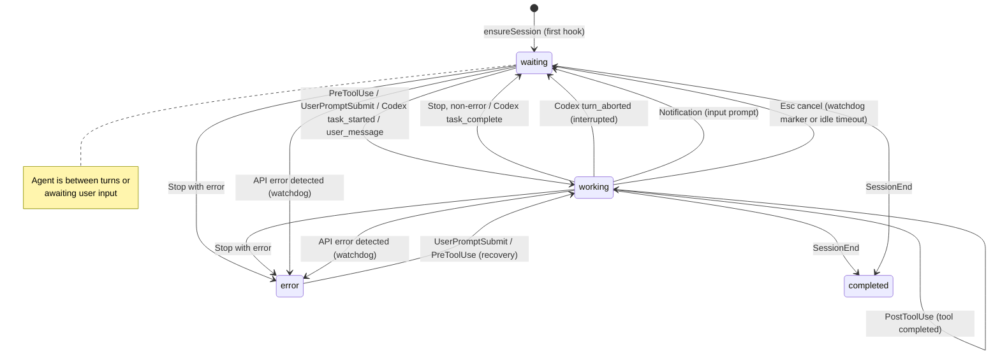
```mermaid
stateDiagram-v2
    [*] --> waiting: ensureSession (first hook)
    waiting --> working: PreToolUse / UserPromptSubmit / Codex task_started / user_message
    working --> working: PostToolUse (tool completed)
    working --> waiting: Stop, non-error / Codex task_complete
    working --> waiting: Codex turn_aborted (interrupted)
    working --> waiting: Notification (input prompt)
    working --> waiting: Esc cancel (watchdog marker or idle timeout)
    waiting --> error: Stop with error
    working --> error: Stop with error
    waiting --> error: API error detected (watchdog)
    working --> error: API error detected (watchdog)
    error --> working: UserPromptSubmit / PreToolUse (recovery)
    working --> completed: SessionEnd
    waiting --> completed: SessionEnd

    note right of waiting
        Agent is between turns or
        awaiting user input
    end note
```

### Macchina a stati delle sessioni

Stati persistiti: `active | completed | error | abandoned`. Lo stato di sessione
**Waiting** è un overlay della UI (status=`active` con
`awaiting_input_since` impostato).

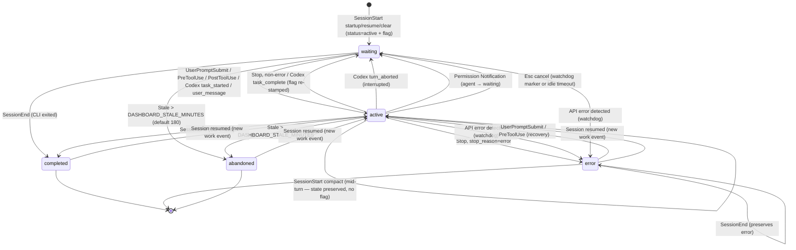
```mermaid
stateDiagram-v2
    [*] --> waiting: SessionStart startup/resume/clear (status=active + flag)
    active --> active: SessionStart compact (mid-turn — state preserved, no flag)
    waiting --> active: UserPromptSubmit / PreToolUse / PostToolUse / Codex task_started / user_message
    active --> waiting: Stop, non-error / Codex task_complete (flag re-stamped)
    active --> waiting: Codex turn_aborted (interrupted)
    active --> waiting: Permission Notification (agent → waiting)
    active --> waiting: Esc cancel (watchdog marker or idle timeout)
    active --> error: Stop, stop_reason=error
    active --> error: API error detected (watchdog)
    waiting --> error: API error detected (watchdog)
    error --> active: UserPromptSubmit / PreToolUse (recovery)
    waiting --> completed: SessionEnd (CLI exited)
    active --> completed: SessionEnd (CLI exited)
    error --> error: SessionEnd (preserves error)
    waiting --> abandoned: Stale > DASHBOARD_STALE_MINUTES (default 180)
    active --> abandoned: Stale > DASHBOARD_STALE_MINUTES
    completed --> active: Session resumed (new work event)
    error --> active: Session resumed (new work event)
    abandoned --> active: Session resumed (new work event)
    completed --> [*]
    error --> [*]
    abandoned --> [*]
```

### Flusso di calcolo dei costi

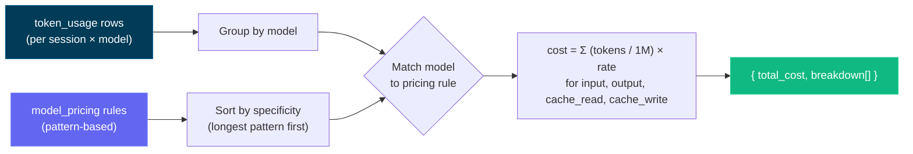
```mermaid
flowchart LR
    TU["token_usage rows<br/>(per session × model)"] --> GROUP["Group by model"]
    PR["model_pricing rules<br/>(pattern-based)"] --> SORT["Sort by specificity<br/>(longest pattern first)"]
    GROUP --> MATCH{"Match model<br/>to pricing rule"}
    SORT --> MATCH
    MATCH --> CALC["cost = Σ (tokens / 1M) × rate<br/>for input, output, cache_read, cache_write"]
    CALC --> RESULT["{ total_cost, breakdown[] }"]
    style TU fill:#003B57,stroke:#005f8a,color:#fff
    style PR fill:#6366f1,stroke:#818cf8,color:#fff
    style RESULT fill:#10b981,stroke:#34d399,color:#fff
```

> [!IMPORTANT]
> Il flusso di calcolo dei costi si basa sull'uso dei token e sulle regole di pricing dei modelli. Assicurati che le tue regole di pricing siano aggiornate per riflettere costi accurati. Aggiorna la tabella di pricing dei modelli dalla pagina Impostazioni per mantenere un tracciamento dei costi accurato — la dashboard non recupera automaticamente aggiornamenti di prezzo da sorgenti esterne. Una volta impostate le regole di pricing, la dashboard le applica retroattivamente a tutte le sessioni per una rendicontazione dei costi coerente.

---

## Configurazione

| Variabile d'ambiente    | Default       | Descrizione                                   |
| ----------------------- | ------------- | --------------------------------------------- |
| `DASHBOARD_PORT`        | `4820`        | Porta per il server Express                   |
| `CLAUDE_DASHBOARD_PORT` | `4820`        | Porta usata dal gestore degli hook per raggiungere il server |
| `NODE_ENV`              | `development` | Imposta `production` per servire il client compilato |
| `DASHBOARD_UPDATE_CHECK` | _(abilitato)_ | Imposta `0` / `false` / `off` per disabilitare i controlli periodici dell'upstream git |
| `DASHBOARD_UPDATE_CHECK_INTERVAL_MS` | `300000` (5 min) | Intervallo tra i controlli automatici; minimo 60 000 ms. Gli utenti possono anche cliccare **Check now** nella modale di aggiornamento o nella sidebar per eseguirne uno su richiesta. |
| `DASHBOARD_STALE_MINUTES` | `180` (3 h) | Minuti di inattività prima che una sessione ancora `active` (inclusa una ferma in **Waiting** in attesa di input utente — "Waiting" è un overlay della UI su una riga `active`, non uno stato salvato) venga auto-marcata **abandoned** ed esca dalla lista attiva. Applicato dal watchdog da 15 s e dallo sweep di manutenzione periodico (che gira ogni ¼ di questo valore, limitato tra 60 s e 5 min). Abbassalo (es. `60`) per un timeout di inattività più breve |
| `DASHBOARD_WORKING_IDLE_SECONDS` | `120` | Timeout di inattività in working per recuperare un turno annullato con `Esc` **prima di qualsiasi output** (che non lascia marcatori nella trascrizione). Quando l'agente principale è stato `working` senza strumenti in volo e né un evento hook né la trascrizione sono avanzati per questo tempo, il watchdog sposta la sessione in **Waiting**. Abbassalo per un recupero più scattante al costo di occasionali flip errati su lunghi turni di riflessione silenziosa (che si auto-riparano) |
| `DASHBOARD_LIVENESS_PROBE` | `1` (attivo) | Imposta `0` per disabilitare il **reap di liveness delle sessioni morte** del watchdog (il probe basato su `ps`/`lsof` che completa le sessioni locali `active` di Claude Code o Codex il cui processo CLI corrispondente non esiste più — recuperando un `SessionEnd` perso mentre la dashboard era giù). Le sessioni inoltrate da **un'altra macchina** (hook domestici) riportano una `cwd` non-POSIX e vengono auto-saltate dal reap, quindi un deployment misto locale + inoltrato non richiede più di spegnerlo; disabilitalo solo per un setup puramente remoto dove i processi locali non provano nulla. Auto-disabilitato su Windows e dentro i container |
| `DASHBOARD_LIVENESS_IDLE_SECONDS` | `60` | Gate di inattività per il reap di liveness **nei tick del watchdog**: una sessione viene completata solo quando la sua trascrizione non viene scritta da almeno questo tempo (l'ultima scrittura di hook è l'orologio di fallback quando nessuna trascrizione esiste su disco), così una sessione a metà turno o appena ripresa non sparisce mai per un miss transitorio del probe. I passaggi di avvio ignorano questo gate — al boot decide solo il probe, così le sessioni chiuse pochi istanti prima del lancio vengono ripulite immediatamente |
| `DASHBOARD_SESSION_SYNC_MS` | `30000` | Intervallo di poll (ms) per la sincronizzazione continua in background di `~/.claude/projects` che fa emergere i progetti aggiunti dopo l'avvio le cui sessioni non passano mai per gli hook. Il watcher `fs.watch` scatta quasi istantaneamente in ogni caso; questo poll è la rete di sicurezza (i watcher possono perdere eventi / non scattare sui filesystem di rete). Imposta `0` per disabilitare il poll lasciando il watcher in esecuzione |
| `DASHBOARD_CODEX_HOME` | `CODEX_HOME` o `~/.codex` | Directory di stato Codex locale opzionale. I rollout sono letti solo dal suo albero `sessions/`; salvare una nuova posizione nelle Impostazioni persiste questo override solo-dashboard, riattiva l'osservazione live e scansiona immediatamente il nuovo albero. |
| `DASHBOARD_CODEX_SYNC_MS` | `4000` | Intervallo di poll di sicurezza (ms) per i rollout Codex append-only. Gli hook Codex innescano immediatamente lo stesso ingest incrementale; imposta `0` per disabilitare solo il poll mantenendo il watcher del filesystem quando disponibile. |
| `DASHBOARD_CODEX_HOOK_IDLE_SECONDS` | `60` | Quanto a lungo una sessione Codex **solo-hook** — una la cui esecuzione non ha scritto alcun rollout su disco (`codex exec --ephemeral`) — può lasciare senza risposta un turno dichiarato finito prima che la dashboard concluda che il suo hook `SessionEnd` è andato perso. Solo una sessione il cui `awaiting_reason` è `stop` è eleggibile: Codex invia `SessionEnd` entro poche centinaia di ms dallo `Stop`, quindi uno `Stop` senza risposta è una prova reale. Il silenzio non è deliberatamente mai il trigger — un'esecuzione senza rollout non emette alcun hook per l'intera durata di una chiamata a uno strumento, quindi una regola a tempo di inattività completerebbe una build CI viva a metà esecuzione |
| `DASHBOARD_TASK_SUMMARY_TTL_MS` | `2000` | Finestra serve-stale (ms) per la cache di avanzamento dei task per trascrizione dietro le richieste di lista `include_task_progress` **e** il `todo_snapshot` del dettaglio sessione. Una trascrizione in scrittura attiva raramente colpisce la chiave di cache size+mtime, quindi senza questo floor una raffica di ricaricamenti di lista (es. la dashboard che si aggiorna sugli eventi WebSocket guidati dagli hook) ri-analizza una trascrizione live multi-MB una volta per richiesta. Entro la finestra viene invece restituito un risultato appena analizzato (leggermente stantio, solo per visualizzazione); imposta `0` per ripristinare la ri-analisi immediata a ogni cambiamento |
| `DASHBOARD_REMOTE_SYNC_MS` | `15000` (15 s) | Intervallo di poll (ms) per la sincronizzazione in background delle **Sorgenti dati remote** che scarica in modo indipendente `~/.claude/projects` e `~/.codex/sessions` di ogni remoto abilitato (più il leggero indice dei titoli `session_index.jsonl` di Codex) via SSH, poi re-importa ciascuno tramite il suo importer locale. Le sorgenti nuove/abilitate si sincronizzano anche immediatamente. Imposta `0` per disabilitare il poller (le sincronizzazioni manuali / su richiesta funzionano comunque) |
| `DASHBOARD_REMOTE_ACTIVE_WINDOW_MS` | `600000` (10 min) | Finestra di freschezza per lo stato live di una sessione da **Sorgente dati remota**. A ogni sincronizzazione, una sessione remota Claude Code o Codex la cui trascrizione rispecchiata corrispondente ha un **ultimo evento JSONL** entro questa finestra è considerata ancora in esecuzione (`active`); quando il mirror smette di avanzare più a lungo di così, la sessione viene riconciliata a `completed`. Le sessioni remote non ricevono hook live, quindi la riconciliazione del mirror consapevole del provider sostituisce la liveness locale; i mirror di provider falliti, indisponibili o incagliati ricadono nel normale sweep di stallo. Alzala per link lenti o turni inattivi molto lunghi |
| `DASHBOARD_REMOTE_SYNC_TIMEOUT_MS` | `600000` (10 min) | Timeout per sorgente (ms) per una singola sincronizzazione remota (pull `scp` + import) prima che venga abortita |
| `DASHBOARD_REMOTE_TEST_TIMEOUT_MS` | `15000` (15 s) | Timeout (ms) per il probe SSH **Test** (`POST /api/remote-sources/:id/test`) che verifica che una sorgente remota sia raggiungibile |
| `DASHBOARD_HOST`        | `127.0.0.1`   | Interfaccia a cui il server si binda. Loopback per default (non raggiungibile dalla rete). Imposta `0.0.0.0` per esporlo su una LAN (registra un avviso all'avvio) |
| `DASHBOARD_TOKEN`       | _(non impostato)_ | Quando impostato, ogni richiesta `/api/*` e il WebSocket devono presentare il token (`Authorization: Bearer <token>`, header `x-dashboard-token`, o `?token=`). Disattivo per default — il bind in loopback è il confine di fiducia |
| `DASHBOARD_TOKEN_FILE` | _(non impostato)_ | Token della dashboard su file per i secret di Docker/Kubernetes; un `DASHBOARD_TOKEN` diretto vince |
| `DASHBOARD_HOOK_TOKEN` / `DASHBOARD_HOOK_TOKEN_FILE` | _(non impostato)_ | Token indipendente per `/api/hooks/*`; richiesto per l'ingestione autenticata di hook remoti |
| `DASHBOARD_ALLOWED_HOSTS` | _(loopback)_ | Valori `Host` extra separati da virgola consentiti sugli upgrade HTTP + WebSocket (guardia contro il DNS-rebinding). Aggiungi qui i tuoi hostname LAN quando bindi oltre il loopback |
| `DASHBOARD_ENV_PATH` | `.env` del repo | Percorso dotenv scrivibile usato quando le Impostazioni persistono gli override delle home di Claude/Codex; default nel container `/app/config/.env` |
| `CCAM_DASHBOARD_URL` | _(discovery su localhost)_ | Destinazione remota opzionale per gli hook. Gli URL non-loopback devono usare HTTPS e un token di hook |
| `CCAM_HOOK_TOKEN` / `CCAM_HOOK_TOKEN_FILE` | _(non impostato)_ | Credenziale del client di hook inviata come `x-ccam-hook-token` |

> [!IMPORTANT]
> **Sicuro per default.** Il server si binda a `127.0.0.1` e **non** è raggiungibile dalla rete out of the box ([GHSA-gr74-4xfh-6jw9](./.github/SECURITY.md)). Per esporlo su una LAN, imposta **sia** `DASHBOARD_HOST` (es. `0.0.0.0`) **sia** `DASHBOARD_TOKEN` (che allora protegge `/api/*` e il WebSocket), ed elenca i tuoi hostname LAN in `DASHBOARD_ALLOWED_HOSTS`. Vedi [`.env.example`](./.env.example) e [`.github/SECURITY.md`](./.github/SECURITY.md) per i dettagli.

Per i clone git, il server esegue periodicamente `git fetch` su `origin` e confronta il tuo checkout con `origin/master`, `origin/main` o `origin/HEAD`. Quando sei indietro, un messaggio appare nel terminale del server e una modale appare nella UI con il comando esatto da eseguire. La dashboard non fa mai pull né si riavvia da sola — copi il comando, lo esegui in un terminale, poi riavvii il server nello stesso modo in cui lo avevi avviato.

---

## CLI `ccam`

L'intera superficie di funzionalità della dashboard è disponibile anche da qualsiasi terminale tramite la CLI **`ccam`** senza dipendenze (`bin/ccam.js`). Viene linkata automaticamente da `npm run setup` (via `npm link`), dopo di che `ccam <command>` funziona da qualsiasi directory. Scopre la dashboard in esecuzione tramite `~/.claude/.agent-dashboard.json` (lo stesso registro dei server live usato dal gestore degli hook), con gli override d'ambiente `CLAUDE_DASHBOARD_PORT` / `DASHBOARD_PORT`, ripiegando su `http://127.0.0.1:4820`.

```bash
# Server
ccam status                       # indicatore ● running / ○ not running
ccam start [--port N]             # avvia il server in background (staccato)
ccam stop                         # ferma con grazia il server in background
ccam repl                         # shell interattiva (anche: shell, i)

# Monitoraggio
ccam health                       # la dashboard è su?
ccam stats                        # totali, eventi di oggi, distribuzioni di stato
ccam kanban                       # sessioni + agenti raggruppati per colonne di stato
ccam tail [--session <id>]        # feed live degli eventi nel terminale (Ctrl+C ferma)

# Dati
ccam sessions [--status s] [--q text] [--limit n]
ccam session <id>                 # dettaglio: albero degli agenti, costo, eventi recenti
ccam agents   [--status s] [--session id]
ccam events   [--session id] [--limit n]

# Insight
ccam analytics                    # totali dei token, strumenti principali, tipi di agente
ccam workflows [--session id]     # statistiche e pattern di intelligenza dei workflow
ccam runs [--session id]          # esecuzioni dinamiche dello strumento Workflow
ccam cost [--session <id>]        # costo stimato totale con ripartizione per modello
                                  # (--session limita a una; mostra i sovrapprezzi degli strumenti;
                                  #  avvisa sui modelli con uso ma senza regola di pricing)

# Alert e webhook
ccam alerts [--unacked]           # feed degli alert scattati
ccam alerts ack <id> | ack-all    # riconosci gli alert
ccam rules                        # elenca le regole di alert
ccam webhooks                     # elenca i target webhook
ccam webhooks test <id>           # invia un alert di test sintetico

# Pricing
ccam pricing                      # elenca le regole di pricing dei modelli (incl. colonne fast-mode e intro)
ccam pricing set <pattern> --input N --output N [--cache-read N --cache-write N]
                 [--cache-write-1h N] [--fast-input N --fast-output N]
                 [--intro-input N --intro-output N … --intro-until YYYY-MM-DD]
ccam pricing delete <pattern>
ccam pricing reset

# Import
ccam import rescan                # ri-scansiona ~/.claude/projects
ccam import path <dir>            # importa ogni .jsonl sotto una directory

# Amministrazione
ccam doctor                       # diagnosi di connettività, hook e database
ccam info                         # JSON grezzo delle informazioni di sistema
ccam export [file.json]           # export completo dei dati in JSON
ccam import-data <file.json>      # ripristina un export (idempotente, non distruttivo)
ccam cleanup --hours N --days M   # abbandona sessioni stantie / elimina quelle vecchie
ccam reinstall-hooks              # reinstalla gli hook di Claude Code
ccam update-check                 # il checkout è indietro rispetto all'upstream? (stampa il comando di aggiornamento)
ccam clear-data --yes             # elimina TUTTI i dati (richiede --yes)
ccam open                         # apre la dashboard nel browser
ccam version                      # stampa la versione della CLI (anche --version / -v)
```

I comandi basati sull'API richiedono il server in esecuzione — quando non lo è, **i comandi di sola lettura ripiegano sulla lettura diretta di `data/dashboard.db`** (con un banner esplicito `⚠ Offline mode`, e le sessioni `active` salvate-ma-morte corrette in visualizzazione dallo stesso probe di liveness dei processi usato dal watchdog del server), mentre i comandi che non possono girare correttamente senza il server (`tail` live, calcoli di analytics/costi, mutazioni) stampano l'indicatore `○ Dashboard server is NOT running` con la ragione specifica e i comandi di avvio; `ccam start` tira su un server di produzione in background. I comandi di lettura sono sempre sicuri; l'unico comando distruttivo (`clear-data`) rifiuta di girare senza un `--yes` esplicito. L'output è una vera UI da terminale — tabelle con bordi disegnati e colonne numeriche allineate a destra, icone di stato (`● active`, `○ waiting`, `✔ completed`, `✖ error`), grafici a barre inline per stats/analytics/cost e veri alberi degli agenti `├─`/`└─` — con colori ANSI auto-abilitati su un TTY, spenti quando l'output è in pipe, e controllabili via `--no-color` / `NO_COLOR` / `FORCE_COLOR`. Per una sessione di monitoraggio live, **`ccam repl`** (alias `shell` / `i`) apre una shell interattiva dove digiti i comandi senza il prefisso `ccam` — con un banner di benvenuto CCAM, tab-completion, storico a frecce persistito, un prompt con stato live del server (`● host` su / `○ offline` giù), un menu raggruppato `help` / `help <cmd>` e un built-in `watch [secs] <cmd>` che auto-aggiorna qualsiasi comando (es. `watch 5 kanban`); ogni riga gira come processo figlio isolato, così un rifiuto offline o un `tail` bloccante non buttano mai giù la shell. Se `ccam` non è nel tuo PATH (es. `npm link` richiedeva permessi elevati), esegui `npm link` una volta dalla root del repo. Riferimento completo — flag, ordine di discovery, il REPL, modello di sicurezza, scripting/exit code, risoluzione dei problemi — in [docs/CLI.md](./docs/CLI.md).

## Script npm

| Comando                 | Descrizione                                                |
| ----------------------- | ---------------------------------------------------------- |
| `npm run setup`         | Installa le dipendenze di root/client/estensione/MCP, compila MCP e linka `ccam` |
| `npm run update:pull-setup` | `git pull --ff-only` poi `npm run setup` (upgrade manuale) |
| `npm run dev`           | Avvia server (watch mode) + client (Vite HMR) in parallelo |
| `npm run dev:server`    | Avvia solo il server Express con `--watch`               |
| `npm run dev:client`    | Avvia solo il dev server di Vite                           |
| `npm run build`         | Compila il client React in `client/dist/`                   |
| `npm start`             | Avvia il server di produzione (serve il client compilato)              |
| `npm test`              | Esegue l'intera suite (server `node --test` + client Vitest)  |
| `npm run verify`        | Esegue l'intero gate locale in un comando: audit degli header di authorship, check Prettier, typecheck del client, test backend, test frontend |
| `npm run check:headers` | Verifica che ogni file sorgente applicabile porti l'header di authorship |
| `npm run typecheck:client` | Typecheck del client (`tsc -b`) — lo stesso check che la build di produzione esegue prima di Vite |
| `npm run test:server`   | Esegue i test backend (`node --test server/__tests__/`)        |
| `npm run test:client`   | Esegue i test frontend Vitest, inclusi gli **snapshot di render per ogni schermata** (`client/src/pages/__tests__/screens.snapshot.test.tsx`); rigenera le baseline dopo modifiche intenzionali alla UI con `cd client && npx vitest run -u` |
| `npm run install-hooks` | Configura gli hook di Claude Code in `~/.claude/settings.json`   |
| `npm run seed`          | Popola il database con dati di esempio                         |
| `npm run import-history`| Importa le sessioni legacy da `~/.claude/` (gira anche all'avvio) |
| `npm run reconcile-tokens`| Aggiorna i totali dei token per le sessioni importate (non abbassa mai un totale) |
| `npm run repair-tokens` | Ri-deriva i totali dei token **non-workflow** per ogni sessione **Claude** con una trascrizione su disco (trovata sotto `~/.claude/projects/` o via il `transcript_path` salvato della sessione) e azzera le baseline delle compattazioni; le righe workflow e Codex sono preservate. Riparazione una tantum per database gonfiati dalla somma di usage per record precedente alla v2.0.9. Ferma prima la dashboard |
| `DASHBOARD_TOKEN_REPAIR` | `1` (abilitato) | Riparazione automatica una tantum dei totali dei token gonfiati prima che l'usage fosse riconciliato per `message.id`. `replaceTokenUsage` è un high-water mark, quindi la sola correzione del parser non può mai abbassare un totale storico — senza questo passaggio ogni sessione pre-upgrade mantiene il suo costo gonfiato per sempre. Gira una volta per database (protetto da marker, differito fuori dal percorso di boot, saltato mentre un'altra dashboard condivide la directory dati) e prima fa uno snapshot delle vecchie righe in `token_usage_pre_repair`. Imposta `0` per saltarla e riparare manualmente con `npm run repair-tokens` |
| `npm run clear-data`    | Elimina tutte le sessioni, gli agenti, gli eventi e l'uso dei token            |
| `npm run mcp:install`   | Installa le dipendenze per il pacchetto MCP locale (`mcp/`)       |
| `npm run mcp:build`     | Compila il TypeScript del server MCP in `mcp/build/`             |
| `npm run mcp:start`     | Avvia il server MCP (trasporto stdio — per host MCP)        |
| `npm run mcp:start:http`| Avvia il server MCP (trasporto HTTP + SSE sulla porta 8819)      |
| `npm run mcp:start:repl`| Avvia il server MCP (REPL interattivo con tab completion)   |
| `npm run mcp:dev`       | Esegue il server MCP in modalità dev (`tsx`, stdio)                 |
| `npm run mcp:dev:http`  | Esegue il server MCP in modalità dev (`tsx`, HTTP + SSE)            |
| `npm run mcp:dev:repl`  | Esegue il server MCP in modalità dev (`tsx`, REPL interattivo)      |
| `npm run mcp:typecheck` | Type-check dei sorgenti MCP senza emettere output di build        |
| `npm run extensions:sync` | Rigenera nomi delle skill/metadata OpenAI, manifest Codex ed entrambi i marketplace |
| `npm run extensions:validate` | Valida tutti i 14 plugin dual-format e le 66 skill incluse |
| `npm run mcp:docker:build` | Compila l'immagine container MCP con Docker (`agent-dashboard-mcp:local`) |
| `npm run mcp:podman:build` | Compila l'immagine container MCP con Podman (`localhost/agent-dashboard-mcp:local`) |
| `npm run desktop:install` | Installa Electron + electron-builder nel workspace `desktop/` (ricompila `better-sqlite3` per l'ABI di Electron); verifica preventivamente la build nativa di `better-sqlite3` e stampa aiuto pratico di setup (incl. un'alternativa senza toolchain) in caso di fallimento |
| `npm run desktop:dev`   | Compila e lancia l'app desktop Electron per l'iterazione locale  |
| `npm run desktop:build` | Compila i sorgenti TypeScript desktop in `desktop/out/`      |
| `npm run desktop:test`  | Esegue lo smoke test desktop (avvia Electron, sonda `/api/health`) |
| `npm run desktop:dmg`   | Compila **entrambi** i DMG macOS (arm64 + x64) — corretto per le release, **più lento** (impacchetta ogni arch) |
| `npm run desktop:dmg:arm64` | Compila un DMG solo Apple Silicon — **veloce**, consigliato per il tuo Mac |
| `npm run desktop:dmg:x64` | Compila un DMG solo Intel — **veloce**                           |
| `npm run desktop:dmg:universal` | Compila un unico DMG **universale** fuso (arm64 + x86_64) — opzionale, **il più lento**, non quello distribuito nelle release |
| `npm run desktop:win`   | Compila un **installer NSIS** Windows `.exe` (x64) — da eseguire su Windows |
| `npm run desktop:win:portable` | Compila un `.exe` Windows **portable** (senza installazione) (x64) — da eseguire su Windows |
| `npm run monitoring:install` | Esegue `npm install` in `monitoring/` — scarica Prometheus + Grafana via `postinstall` |
| `npm run monitoring:setup` | Alias di `monitoring:install` |
| `npm run monitoring:up` | Avvia Prometheus (:9090) + Grafana (:3000) in background (senza Docker) |
| `npm run monitoring:down` | Ferma lo stack di monitoring gestito da npm |
| `npm run monitoring:start` | Stack di monitoring in foreground (Ctrl+C ferma entrambi) |
| `npm run monitoring:docker:up` | Avvia Prometheus + Grafana via Docker Compose |
| `npm run monitoring:docker:down` | Smonta lo stack di monitoring Docker |
| `npm run monitoring:verify` | Health-check di dashboard, Prometheus, Grafana e scrape target |
| `npm run docker:up` | Avvia la dashboard in Docker (`docker compose up -d --build`) |
| `npm run docker:down` | Ferma il container della dashboard |
| `npm run docker:full:up` | Dashboard + MCP autenticato + Nginx rootless + Prometheus + Grafana |
| `npm run docker:full:down` | Smonta l'intero stack Docker |
| `npm run deploy:validate` | Valida Docker, Compose, Nginx, Helm, Kustomize, Terraform, gli audit delle dipendenze e l'invariante one-writer |

---

## Estensioni degli agenti

Questo repository include un livello di estensioni completo sia per Claude Code sia per Codex:

- Claude Code: `CLAUDE.md`, `.claude/rules/`, `.claude/skills/`
- Subagenti Claude: `.claude/agents/`
- Codex: `AGENTS.md`, `.codex/rules/`, `.codex/agents/`, `.codex/skills/`
- Plugin distribuibili condivisi: `plugins/`, con sia `.claude-plugin/plugin.json` sia `.codex-plugin/plugin.json`
- Marketplace: `.claude-plugin/marketplace.json` per Claude Code e `.agents/plugins/marketplace.json` per Codex
- Open Agent Skills: tutte le skill dei plugin portano frontmatter canonico più `agents/openai.yaml`; `npx skills add hoangsonww/Claude-Code-Agent-Monitor --list` scopre 76 skill del repository

### Architettura delle estensioni

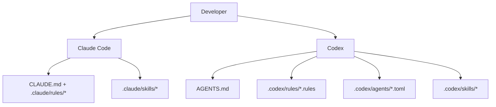
```mermaid
graph TD
    USER["Developer"]
    CLAUDE["Claude Code"]
    CODEX["Codex"]
    MEMORY["CLAUDE.md + .claude/rules/*"]
    C_SKILLS[".claude/skills/*"]
    AGENTS_MD["AGENTS.md"]
    X_RULES[".codex/rules/*.rules"]
    X_AGENTS[".codex/agents/*.toml"]
    X_SKILLS[".codex/skills/*"]

    USER --> CLAUDE
    USER --> CODEX
    CLAUDE --> MEMORY
    CLAUDE --> C_SKILLS
    CODEX --> AGENTS_MD
    CODEX --> X_RULES
    CODEX --> X_AGENTS
    CODEX --> X_SKILLS
```

### Livello Claude Code

- Contesto persistente:
  - [`CLAUDE.md`](./CLAUDE.md)
- Regole con scope sui path:
  - [`.claude/rules/backend-node.md`](./.claude/rules/backend-node.md)
  - [`.claude/rules/frontend-react.md`](./.claude/rules/frontend-react.md)
  - [`.claude/rules/mcp-typescript.md`](./.claude/rules/mcp-typescript.md)
  - [`.claude/rules/docs-markdown.md`](./.claude/rules/docs-markdown.md)
- Skill:
  - `repo-onboarding`
  - `ship-feature`
  - `version-release`
  - `mcp-operations`
  - `debug-live-issue`
- Subagenti:
  - `backend-reviewer`
  - `frontend-reviewer`
  - `mcp-reviewer`

### Livello Codex

- Contesto persistente:
  - [`AGENTS.md`](./AGENTS.md)
- Policy di esecuzione:
  - [`.codex/rules/default.rules`](./.codex/rules/default.rules)
- Template di subagenti personalizzati:
  - [`.codex/agents/`](./.codex/agents)
- Skill:
  - [`.codex/skills/`](./.codex/skills)
- Setup:
  - [`.codex/README.md`](./.codex/README.md)

---

## Integrazione MCP

Questo progetto include un server MCP locale in `mcp/` con 97 strumenti in 16 moduli di dominio. Espone ogni azione dell'app supportata, incluse letture di dati con scope, trascrizioni/immagini, pricing Claude e GPT, workflow, alert/webhook, import e ripristino dei backup, configurazione Claude/Codex, Run Agent, sorgenti remote, impostazioni, push e manutenzione protetta. Supporta tre modalità di trasporto.

### Modalità di trasporto MCP

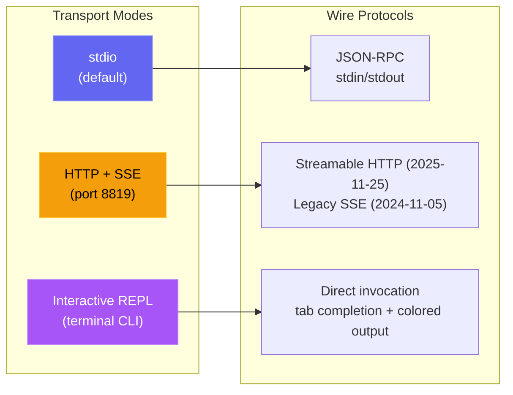
```mermaid
flowchart LR
    subgraph Transports["Transport Modes"]
        STDIO["stdio\n(default)"]
        HTTP["HTTP + SSE\n(port 8819)"]
        REPL["Interactive REPL\n(terminal CLI)"]
    end

    subgraph Protocols["Wire Protocols"]
        P1["JSON-RPC\nstdin/stdout"]
        P2["Streamable HTTP (2025-11-25)\nLegacy SSE (2024-11-05)"]
        P3["Direct invocation\ntab completion + colored output"]
    end

    STDIO --> P1
    HTTP --> P2
    REPL --> P3

    style STDIO fill:#6366f1,stroke:#818cf8,color:#fff
    style HTTP fill:#f59e0b,stroke:#fbbf24,color:#000
    style REPL fill:#a855f7,stroke:#c084fc,color:#fff
```

| Modalità | Comando | Caso d'uso |
| --- | --- | --- |
| **stdio** | `npm run mcp:start` | Claude Code, Claude Desktop, host MCP degli IDE |
| **HTTP** | `npm run mcp:start:http` | Client MCP remoti, integrazioni web, multi-sessione |
| **REPL** | `npm run mcp:start:repl` | Debug operativo, invocazione manuale degli strumenti, amministrazione locale |

<p align="center">
  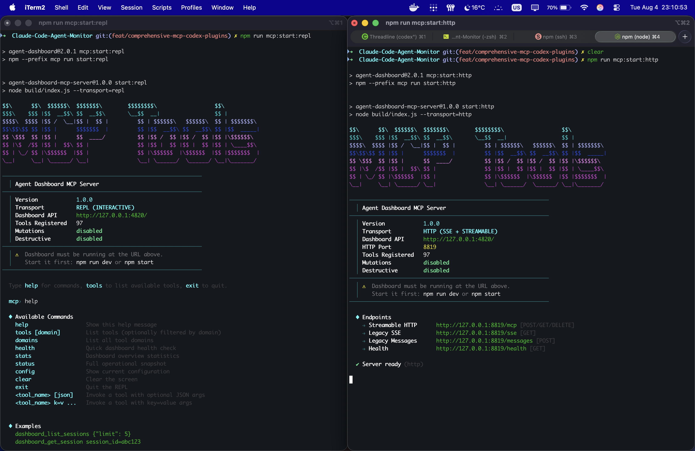
</p>

### Architettura MCP

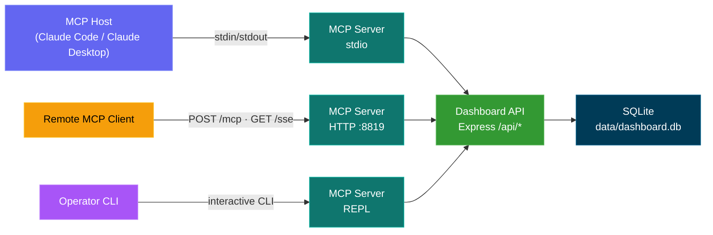
```mermaid
graph LR
    HOST["MCP Host<br/>(Claude Code / Claude Desktop)"]
    HTTP_CLIENT["Remote MCP Client"]
    OPERATOR["Operator CLI"]

    MCP_STDIO["MCP Server<br/>stdio"]
    MCP_HTTP["MCP Server<br/>HTTP :8819"]
    MCP_REPL["MCP Server<br/>REPL"]

    API["Dashboard API<br/>Express /api/*"]
    DB["SQLite<br/>data/dashboard.db"]

    HOST -->|"stdin/stdout"| MCP_STDIO
    HTTP_CLIENT -->|"POST /mcp · GET /sse"| MCP_HTTP
    OPERATOR -->|"interactive CLI"| MCP_REPL

    MCP_STDIO --> API
    MCP_HTTP --> API
    MCP_REPL --> API
    API --> DB

    style HOST fill:#6366f1,stroke:#818cf8,color:#fff
    style HTTP_CLIENT fill:#f59e0b,stroke:#fbbf24,color:#000
    style OPERATOR fill:#a855f7,stroke:#c084fc,color:#fff
    style MCP_STDIO fill:#0f766e,stroke:#14b8a6,color:#fff
    style MCP_HTTP fill:#0f766e,stroke:#14b8a6,color:#fff
    style MCP_REPL fill:#0f766e,stroke:#14b8a6,color:#fff
    style API fill:#339933,stroke:#5cb85c,color:#fff
    style DB fill:#003B57,stroke:#005f8a,color:#fff
```

### Superficie degli strumenti MCP

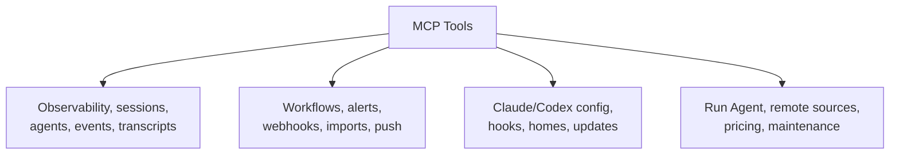
```mermaid
graph TD
    ROOT["MCP Tools"]
    OBS["Observability, sessions,<br/>agents, events, transcripts"]
    OPS["Workflows, alerts,<br/>webhooks, imports, push"]
    CFG["Claude/Codex config,<br/>hooks, homes, updates"]
    RUN["Run Agent, remote sources,<br/>pricing, maintenance"]

    ROOT --> OBS
    ROOT --> OPS
    ROOT --> CFG
    ROOT --> RUN
```

### Modello di sicurezza MCP

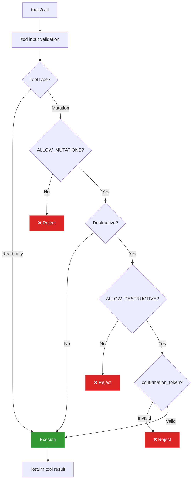
```mermaid
flowchart TD
    CALL["tools/call"] --> VALIDATE["zod input validation"]
    VALIDATE --> TYPE{"Tool type?"}
    TYPE -->|Read-only| EXEC["Execute"]
    TYPE -->|Mutation| M_FLAG{"ALLOW_MUTATIONS?"}
    M_FLAG -->|No| DENY1["❌ Reject"]
    M_FLAG -->|Yes| DEST{"Destructive?"}
    DEST -->|No| EXEC
    DEST -->|Yes| D_FLAG{"ALLOW_DESTRUCTIVE?"}
    D_FLAG -->|No| DENY2["❌ Reject"]
    D_FLAG -->|Yes| TOKEN{"confirmation_token?"}
    TOKEN -->|Invalid| DENY3["❌ Reject"]
    TOKEN -->|Valid| EXEC
    EXEC --> RESULT["Return tool result"]

    style EXEC fill:#339933,stroke:#5cb85c,color:#fff
    style DENY1 fill:#dc2626,stroke:#f87171,color:#fff
    style DENY2 fill:#dc2626,stroke:#f87171,color:#fff
    style DENY3 fill:#dc2626,stroke:#f87171,color:#fff
```

### Modalità operative MCP

- Modalità sola lettura (default): `MCP_DASHBOARD_ALLOW_MUTATIONS=false`
- Modalità admin: `MCP_DASHBOARD_ALLOW_MUTATIONS=true`
- Dashboard autenticata: imposta `MCP_DASHBOARD_API_TOKEN` / `_FILE` al token della dashboard
- Trasporto HTTP/SSE autenticato: imposta `MCP_HTTP_AUTH_TOKEN` / `_FILE`; i client inviano bearer auth o `x-mcp-token`
- Guardrail di trasporto: l'HTTP diretto in loopback può portare il token; gli alias container-host richiedono HTTPS; i redirect sono rifiutati
- Guardrail sui payload: 50 MiB per file di storico caricato, 100 MiB totali per chiamata, 10 MiB per le risposte binarie e 25 MiB per il ripristino dei backup
- Modalità distruttiva: richiede entrambi:
  - `MCP_DASHBOARD_ALLOW_MUTATIONS=true`
  - `MCP_DASHBOARD_ALLOW_DESTRUCTIVE=true`
  - input dello strumento `confirmation_token: "CLEAR_ALL_DATA"`

Dettagli completi: [mcp/README.md](./mcp/README.md)

---

## Riferimento API

Tutti gli endpoint restituiscono JSON. Le risposte di errore seguono la forma `{ error: { code, message } }`.

### OpenAPI / Swagger / ReDoc

Ci sono tre modi per esplorare l'API HTTP, tutti guidati da un'unica spec OpenAPI 3.0.3 (porta di default del server `4820`):

| Metodo | Percorso                        | Descrizione                                                                                       |
| ------ | ------------------------------- | ------------------------------------------------------------------------------------------------- |
| `GET`  | `/api/openapi.json`             | Spec JSON OpenAPI 3.0.3 grezza                                                                        |
| `GET`  | `/api/docs`                     | **Swagger UI** interattiva — esecuzione delle richieste try-it-out                                         |
| `GET`  | `/api/redoc`                    | Riferimento **ReDoc** — un rendering a tre pannelli pulito e ottimizzato per la lettura della stessa spec              |
| `GET`  | `/api/redoc/redoc.standalone.js`| Bundle ReDoc self-hosted (servito localmente via la dipendenza `redoc`, mai da CDN — funziona offline) |

Il documento OpenAPI è generato da `server/openapi.js` (`createOpenApiSpec()`), fuso con frammenti supplementari sotto `server/openapi-extra/`. Swagger UI e ReDoc sono entrambi serviti direttamente dal backend; il bundle ReDoc è servito localmente (`GET /api/redoc/redoc.standalone.js`) così il riferimento funziona completamente offline / air-gapped, coerentemente con la policy del progetto di zero asset esterni.

La copertura è completa: ogni route del backend è documentata (82 voci di percorso) attraverso questi tag — Health, Sessions, Agents, Events, Stats, Metrics, Analytics, Hooks, Pricing, Workflows, Settings, Updates, Alerts, Webhooks, Push, CcConfig (esploratore di configurazione di Claude Code), Run (esecuzioni avviate dalla dashboard) e Documentation — ciascuna con parametri, schemi di richiesta/risposta, descrizioni a livello di campo ed esempi realistici.

Un **`openapi.yaml`** committato alla root del repo rispecchia la spec live. È generato da `server/openapi.js` (mai modificato a mano) — rigeneralo dopo modifiche all'API con:

```bash
npm run openapi:yaml
```

### Metriche Prometheus e Grafana

`GET /api/metrics` espone i contatori live della dashboard — sessioni/agenti per stato, totali di eventi e token, client realtime connessi, sorgenti remote configurate, uptime/memoria del processo e versione di build — nel formato text-exposition di Prometheus, così CCAM può essere raccolto nel tuo stack di osservabilità. Uno stack Prometheus + Grafana chiavi in mano con **quattro dashboard auto-provisioned** (home di default: **CCAM — Overview**) vive in [`monitoring/`](./monitoring/README.md).

**npm (senza Docker — macOS, Linux o Windows):**

```bash
npm start                          # dashboard on :4820
npm run monitoring:install         # one-time: npm postinstall pulls binaries
npm run monitoring:up              # Grafana on :3000, auto-provisioned; see monitoring/README.md for credentials
```

**Docker / Podman** (quando la dashboard gira in un container o preferisci Compose):

```bash
# Dashboard only
npm run docker:up

# Dashboard + Prometheus + Grafana (one command)
npm run docker:full:up

# Or mix: native/docker dashboard + docker monitoring
DASHBOARD_ALLOWED_HOSTS=host.docker.internal npm start   # or docker:up with same env
npm run monitoring:docker:up
npm run monitoring:verify
```

<p align="center">
  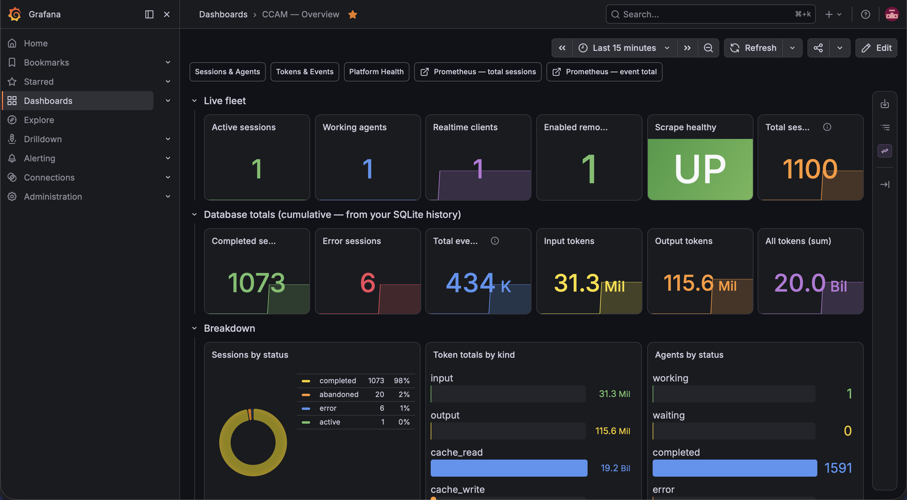
  <br>
  <em>📊 <strong>Grafana · CCAM — Overview</strong> — dashboard home di default (quattro board auto-provisioned): snapshot della flotta, totali del database, grafici di ripartizione e tassi — tutto da scrape live di <code>/api/metrics</code></em>
</p>

<p align="center">
  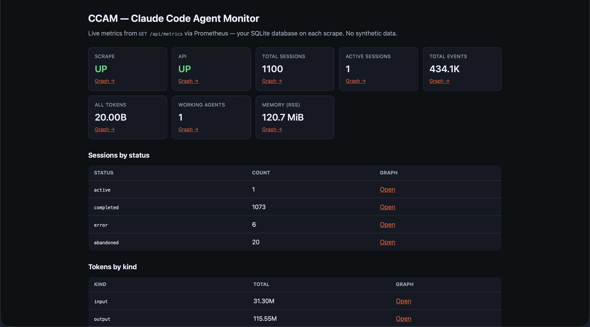
  <br>
  <em>🔥 <strong>Prometheus · console CCAM</strong> — landing page precostruita su <code>/consoles/index.html</code> che interroga Prometheus direttamente per salute degli scrape, totali delle sessioni, eventi, token e link Graph di drill-down</em>
</p>

<p align="center">
  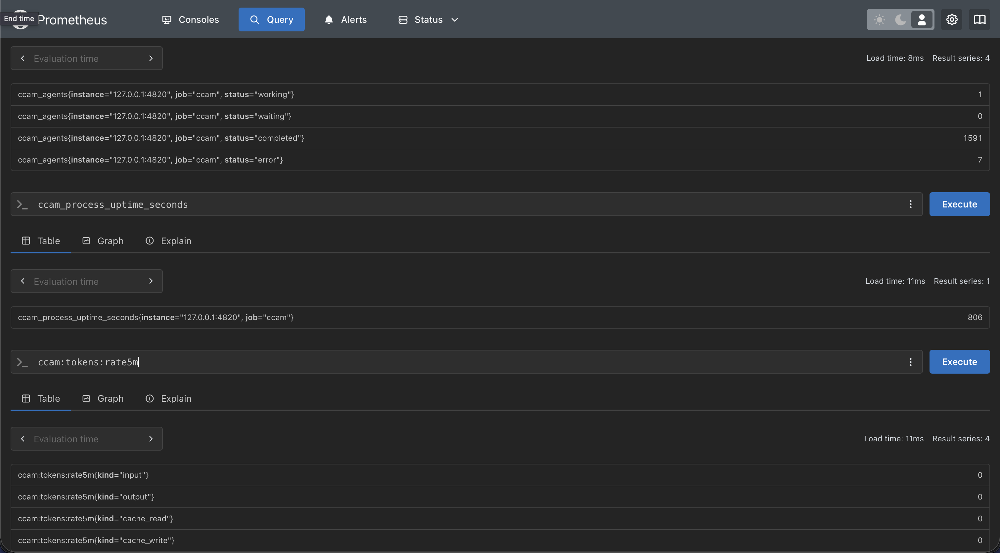
  <br>
  <em>📈 <strong>Prometheus · Graph</strong> — esegui PromQL sulle metriche CCAM raccolte (es. <code>sum(ccam_sessions)</code>, <code>ccam_events_total</code>, <code>rate(ccam_tokens_total[5m])</code>) con link di partenza dalla console CCAM e da <a href="./monitoring/README.md">monitoring/README.md</a></em>
</p>

Vedi [docs/API.md → Metrics](./docs/API.md#metrics) per l'elenco completo delle metriche e i dettagli di scrape/autenticazione.

<p align="center">
  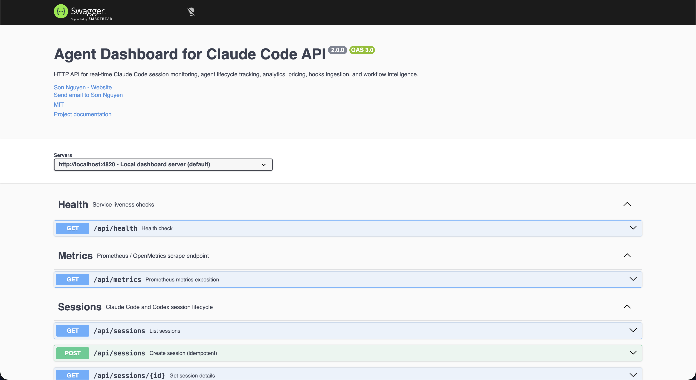
</p>

<p align="center">
  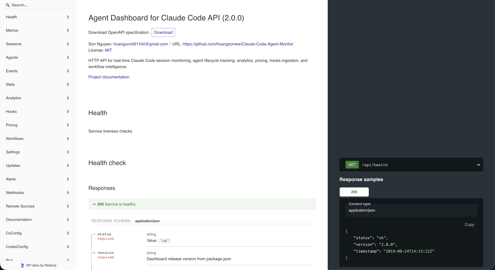
</p>

### Health

| Metodo | Percorso      | Descrizione                           |
| ------ | ------------- | ------------------------------------- |
| `GET`  | `/api/health` | Restituisce `{ status: "ok", timestamp }` |

### Sessioni

| Metodo  | Percorso                        | Parametri query                                                  | Descrizione                                                                                  |
| ------- | ------------------------------- | ---------------------------------------------------------------- | -------------------------------------------------------------------------------------------- |
| `GET`   | `/api/sessions`                 | `status`, `q`, `limit`, `offset`                                 | Elenca le sessioni con conteggi degli agenti e costo per sessione. `q` fa una ricerca case-insensitive su `id` / `name` / `cwd`. `limit` è 50 per default, max 10000. La risposta include `total` per i paginatori. |
| `GET`   | `/api/sessions/:id`             | --                                                               | Dettaglio della sessione con agenti ed eventi                                                        |
| `GET`   | `/api/sessions/:id/stats`       | --                                                               | Conteggi aggregati che alimentano il pannello di panoramica del Dettaglio sessione: eventi, eventi per tipo, uso degli strumenti principali, conteggio degli errori, conteggi per tipo/stato degli agenti, ripartizione dei tipi di subagente, totali dei token, intervallo temporale |
| `GET`   | `/api/sessions/:id/transcripts` | --                                                               | Elenca le trascrizioni JSONL disponibili per la sessione (principale + subagenti + compattazioni)            |
| `GET`   | `/api/sessions/:id/transcript`  | `agent_id`, `limit`, `offset`, `after`, `before`                 | Trasmette i messaggi da una trascrizione specifica con paginazione a cursore. Lo `usage` dell'assistente include `input_tokens`, `output_tokens`, `cache_read_input_tokens`, `cache_creation_input_tokens` così il misuratore della pagina Run può idratarsi completamente su resume / ri-collegamento |
| `POST`  | `/api/sessions`                 | --                                                               | Crea una sessione (idempotente su `id`)                                                          |
| `PATCH` | `/api/sessions/:id`             | --                                                               | Aggiorna stato/metadata della sessione                                                               |

### Agenti

| Metodo  | Percorso          | Parametri query                           | Descrizione                   |
| ------- | ----------------- | ----------------------------------------- | ----------------------------- |
| `GET`   | `/api/agents`     | `status`, `session_id`, `limit`, `offset` | Elenca gli agenti con filtri      |
| `GET`   | `/api/agents/:id` | --                                        | Dettaglio di un singolo agente           |
| `POST`  | `/api/agents`     | --                                        | Crea un agente                  |
| `PATCH` | `/api/agents/:id` | --                                        | Aggiorna stato/task/strumento dell'agente |

### Eventi

| Metodo | Percorso      | Parametri query                 | Descrizione                |
| ------ | ------------- | ------------------------------- | -------------------------- |
| `GET`  | `/api/events` | `session_id`, `limit`, `offset` | Elenca gli eventi (più recenti prima) |

### Statistiche

| Metodo | Percorso     | Descrizione                                            |
| ------ | ------------ | ------------------------------------------------------ |
| `GET`  | `/api/stats` | Conteggi aggregati, distribuzioni di stato, connessioni WS |

### Analytics

| Metodo | Percorso         | Descrizione                                                |
| ------ | ---------------- | ---------------------------------------------------------- |
| `GET`  | `/api/analytics` | Aggregati di token/strumenti/sessioni per grafici e viste di trend   |

### Sorgenti dati remote

| Metodo   | Percorso                        | Parametri query | Descrizione                                                                                 |
| -------- | ------------------------------- | ------------ | ------------------------------------------------------------------------------------------- |
| `GET`    | `/api/remote-sources`           | --           | Elenca le sorgenti remote configurate con stato, ultimo errore e conteggi dell'ultima sincronizzazione               |
| `POST`   | `/api/remote-sources`           | --           | Crea una sorgente. Body: `{ label, host, ssh_port?, identity_file?, remote_home?, remote_codex_home?, enabled? }` |
| `PATCH`  | `/api/remote-sources/:id`       | --           | Aggiorna una sorgente (label, campi di connessione, enabled)                                         |
| `DELETE` | `/api/remote-sources/:id`       | `purge`      | Elimina una sorgente; `?purge=true` elimina anche le sessioni importate da quella sorgente                 |
| `POST`   | `/api/remote-sources/:id/test`  | --           | Sonda la connettività SSH verso la sorgente                                                        |
| `POST`   | `/api/remote-sources/:id/sync`  | --           | Scarica e re-importa dalla sorgente adesso                                                      |

`GET /api/sessions`, `/api/events`, `/api/agents`, `/api/stats` e `/api/analytics` accettano anche un parametro query opzionale `sources` (id di sorgente separati da virgola; ometti per tutte) per limitare i risultati all'origine, e `GET /api/sessions/facets` restituisce un array `sources` per il selettore dello scope dei dati.

### Hook

| Metodo | Percorso           | Descrizione                                  |
| ------ | ------------------ | -------------------------------------------- |
| `POST` | `/api/hooks/event` | Riceve ed elabora un evento hook di Claude Code |

**Payload di un evento hook:**

```json
{
  "hook_type": "PreToolUse",
  "data": {
    "session_id": "abc-123",
    "tool_name": "Bash",
    "tool_input": { "command": "ls -la" }
  }
}
```

### Pricing

| Metodo   | Percorso                 | Descrizione                              |
| -------- | ------------------------ | ---------------------------------------- |
| `GET`    | `/api/pricing`           | Elenca tutte le regole di pricing                   |
| `PUT`    | `/api/pricing`           | Crea o aggiorna una regola di pricing          |
| `DELETE` | `/api/pricing/:pattern`  | Elimina una regola di pricing                    |
| `GET`    | `/api/pricing/cost`      | Costo totale su tutte le sessioni           |
| `GET`    | `/api/pricing/cost/:id`  | Ripartizione dei costi per una sessione specifica    |

### Workflow

| Metodo | Percorso                      | Descrizione                                             |
| ------ | ----------------------------- | ------------------------------------------------------- |
| `GET`  | `/api/workflows`              | Dati dei workflow con scope su provider/sorgente (orchestrazione, strumenti registrati, pattern, compattazioni Codex). I filtri opzionali `?status=active\|completed`, `?sources=...` e `?providers=claude\|codex` si applicano a tutte le 11 sezioni di dati |
| `GET`  | `/api/workflows/session/:id`  | Drill-in per sessione con scope su provider/sorgente (albero degli agenti, timeline degli strumenti registrati, eventi) |

### Alert

| Metodo   | Percorso                 | Descrizione                                                            |
| -------- | ------------------------ | ---------------------------------------------------------------------- |
| `GET`    | `/api/alerts`            | Feed degli alert scattati, più recenti prima (`?unacked=true`, `limit`, `offset`)    |
| `POST`   | `/api/alerts/:id/ack`    | Riconosce un alert                                                  |
| `POST`   | `/api/alerts/ack-all`    | Riconosce ogni alert non riconosciuto                                        |
| `GET`    | `/api/alerts/rules`      | Elenca le regole di alert                                                       |
| `POST`   | `/api/alerts/rules`      | Crea una regola (`event_pattern` \| `inactivity` \| `status_duration` \| `token_threshold`) |
| `PATCH`  | `/api/alerts/rules/:id`  | Aggiorna nome / config / enabled / cooldown (il tipo di regola è immutabile)     |
| `DELETE` | `/api/alerts/rules/:id`  | Elimina una regola e il suo storico di alert scattati                              |

### Webhook

| Metodo   | Percorso                          | Descrizione                                                                          |
| -------- | --------------------------------- | ------------------------------------------------------------------------------------ |
| `GET`    | `/api/webhooks/providers`         | Provider supportati + i loro campi di configurazione (guida il form della UI)                       |
| `GET`    | `/api/webhooks`                   | Elenca i target webhook (URL mascherati, segreti oscurati)                                 |
| `POST`   | `/api/webhooks`                   | Crea un target (14 provider di prima classe + `generic`)                               |
| `PATCH`  | `/api/webhooks/:id`               | Aggiorna nome / url / enabled / secret / header / scope delle regole (il tipo è immutabile)      |
| `DELETE` | `/api/webhooks/:id`               | Elimina un target e il suo log delle consegne                                                 |
| `POST`   | `/api/webhooks/:id/test`          | Invia un alert di test sintetico e riporta il risultato della consegna                           |
| `GET`    | `/api/webhooks/:id/deliveries`    | Log delle consegne recenti per un target (`limit`, `offset`)                                  |

I provider hosted richiedono HTTPS. `generic` e `n8n` possono usare HTTP per ricevitori locali o self-hosted. La consegna rifiuta i redirect, così credenziali, header personalizzati e firme HMAC non vengono mai inoltrati a un secondo URL.

### Impostazioni

| Metodo | Percorso                       | Descrizione                                      |
| ------ | ------------------------------ | ------------------------------------------------ |
| `GET`  | `/api/settings/info`           | Informazioni di sistema, statistiche del DB, stato degli hook               |
| `POST` | `/api/settings/clear-data`     | Elimina tutte le sessioni, gli agenti, gli eventi e l'uso dei token |
| `POST` | `/api/settings/reimport`       | Re-importa le sessioni legacy da `~/.claude/`      |
| `POST` | `/api/settings/reinstall-hooks`| Reinstalla gli hook di Claude Code                      |
| `POST` | `/api/settings/reset-pricing`  | Ripristina ai default le tabelle di pricing Claude, Codex o entrambe |
| `GET`  | `/api/settings/export`         | Esporta tutti i dati (sessions, agents, events, token_usage, workflows, dashboard_runs, alert_rules, model_pricing, gpt_model_pricing) come un unico download JSON versionato |
| `POST` | `/api/settings/import`         | Ripristina un bundle fino a 25 MiB da `/export` (`file` multipart o JSON `{ path }`). Idempotente + non distruttivo — le sessioni esistenti sono saltate in blocco |
| `POST` | `/api/settings/cleanup`        | Abbandona le sessioni stantie, elimina i dati vecchi           |

### Claude Config Explorer (`/api/cc-config`)

Ispezione in sola lettura di ogni superficie di configurazione di Claude Code, più mutazioni attentamente protette per gli artefatti di file di testo a basso rischio. Le letture di file canonicalizzano il percorso richiesto e le root consentite, così i symlink non possono evadere dalle directory fidate di Claude. Tutti i percorsi di scrittura creano backup con timestamp sotto `<root>/cc-config-backups/<type>/` prima di mutare.

| Metodo   | Percorso                            | Descrizione |
| -------- | ----------------------------------- | ----------- |
| `GET`    | `/api/cc-config/overview`           | Root (home di claude, .claude del progetto, root del progetto, ~/.claude.json) + conteggi per ogni superficie |
| `GET`    | `/api/cc-config/skills`             | Skill sotto `<scope>/.claude/skills/<name>/SKILL.md` con frontmatter analizzato; `?scope=user\|project\|all` |
| `GET`    | `/api/cc-config/agents`             | Subagenti `<scope>/.claude/agents/*.md` |
| `GET`    | `/api/cc-config/commands`           | Slash command `<scope>/.claude/commands/*.md` |
| `GET`    | `/api/cc-config/output-styles`      | Output style `<scope>/.claude/output-styles/*.md` |
| `GET`    | `/api/cc-config/plugins`            | Plugin installati da `~/.claude/plugins/installed_plugins.json`, uniti a `enabledPlugins` dalle impostazioni; ogni voce include `contributes` (conteggio di skill/agenti/comandi/hook/output-style dentro la directory di installazione del plugin) più i metadata di `plugin.json` |
| `GET`    | `/api/cc-config/marketplaces`       | Marketplace registrati da `known_marketplaces.json`, arricchiti con il `marketplace.json` proprio di ciascun marketplace (conteggio dei plugin, owner, descrizione) |
| `GET`    | `/api/cc-config/mcp`                | Server MCP da `~/.claude.json` (top-level + per progetto) e `settings.json` |
| `GET`    | `/api/cc-config/hooks`              | Hook aggregati attraverso i file `settings.json` utente / progetto / progetto-locale |
| `GET`    | `/api/cc-config/hook-scripts`       | File in `~/.claude/hooks/` (gli script helper referenziati da `hooks.<event>.command`) |
| `GET`    | `/api/cc-config/keybindings`        | `~/.claude/keybindings.json` analizzato in coppie chiave/azione raggruppate per contesto |
| `PUT`    | `/api/cc-config/keybindings`        | Sovrascrive `keybindings.json` da `{ groups: [{ context, bindings: [{ key, action }] }] }`. Fa prima il backup, preserva i metadata top-level (`$schema`/`$docs`), rifiuta contesti/chiavi duplicati. Sicuro da modificare (a differenza di `settings.json`, la CLI non lo riscrive mai a metà sessione) |
| `GET`    | `/api/cc-config/statusline`         | Config `settings.json.statusLine` + il contenuto effettivo di `statusline.py` / `statusline-command.sh` se presente |
| `GET`    | `/api/cc-config/settings`           | JSON delle impostazioni utente / progetto / progetto-locale, con le chiavi dall'aria segreta (che matchano `/token\|secret\|password\|api[_-]?key\|auth/i`) sostituite da `"<redacted>"` |
| `GET`    | `/api/cc-config/memory`             | File `CLAUDE.md` a scope utente + progetto, più la memoria file-based per progetto: voci `scope:"auto-memory"` (ciascuna con `project`, `name`, `isIndex` e `frontmatter` analizzato) per ogni `*.md` sotto `~/.claude/projects/<slug>/memory/`. Muta via `PUT`/`DELETE /api/cc-config/file` con `{ scope: "auto-memory", type: "auto-memory", project, name }` (i backup finiscono in `<memory-dir>/.cc-config-backups/auto-memory/`) |
| `GET`    | `/api/cc-config/file?path=…`        | Corpo di un singolo file (percorso confinato a CLAUDE_HOME / .claude del progetto / CLAUDE.md del progetto) |
| `GET`    | `/api/cc-config/backups`            | Elenco di tutti i backup con timestamp, opzionalmente filtrato con `?scope=&type=` |
| `PUT`    | `/api/cc-config/file`               | Crea o sovrascrive un artefatto di file di testo. Body: `{ scope, type, name?, content }`. Auto-backup se il file esiste. Temp atomico + rename. Limite di 256 KB sul contenuto, regex stretta su `name` |
| `DELETE` | `/api/cc-config/file`               | Backup-poi-elimina un artefatto di file di testo. Le directory delle skill sono backuppate per intero (preservando gli asset inclusi) prima della rimozione ricorsiva |

### Run Claude (`/api/run`)

Superficie HTTP per avviare e supervisionare sottoprocessi `claude` dalla dashboard. Guardia same-origin su ogni route — le richieste dal browser devono provenire da un'origin localhost; le richieste senza Origin (CLI/curl) passano. Una `cwd` fornita deve essere una directory assoluta esistente ed è canonicalizzata con `realpath`. Intenzionalmente può essere fuori da questo repository così Run Agent può partire dalla home dell'utente o da qualsiasi progetto recente.

| Metodo   | Percorso                          | Descrizione |
| -------- | --------------------------------- | ----------- |
| `GET`    | `/api/run`                        | Elenca tutti gli handle di esecuzione in memoria (live + terminati di recente); restituisce anche `maxConcurrent` e `activeCount` |
| `GET`    | `/api/run/binary`                 | Sonda se `claude` è nel `PATH` e dove vive — usato dalla UI per mostrare un errore chiaro prima dello spawn |
| `GET`    | `/api/run/cwds`                   | Directory di lavoro suggerite: cwd del server della dashboard, `$HOME` e cwd recenti dalla tabella delle sessioni |
| `GET`    | `/api/run/files?cwd=…&q=…`        | Ricerca fuzzy di file dentro `cwd` per l'autocompletamento dei riferimenti `@`-file della pagina Run. Salta `node_modules`, `.git`, `dist`, `build`, `.next`, `.cache`, `coverage`, ecc. La cwd è obbligatoria e deve esistere; i risultati sono limitati e ordinati per match sul basename |
| `POST`   | `/api/run`                        | Avvia una nuova esecuzione. Body: `{ prompt, mode: "headless"\|"conversation", cwd?, model?, permissionMode?, resumeSessionId?, effort? }`. Headless mette il prompt in argv via `-p` e chiude lo stdin. Conversation invia il prompt sullo stdin come envelope stream-json e mantiene lo stdin aperto per i seguiti. `resumeSessionId` (solo conversation) aggiunge `--resume <id>`; quando impostato, `prompt` può essere vuoto — lo spawner salta la scrittura iniziale sullo stdin e `claude` resta in attesa sulla conversazione ripresa finché l'utente non invia un seguito via `POST /api/run/:id/message`. `effort` (`low` / `medium` / `high`) mappa su `--effort`. Lo spawner passa sempre `--output-format stream-json --verbose --include-partial-messages` così la UI può renderizzare i delta carattere per carattere. La concorrenza è di fatto senza limite (tetto di default 10000 — sovrascrivi con `RUN_MAX_CONCURRENT`) |
| `GET`    | `/api/run/:id`                    | Stato corrente dell'handle. `?envelopes=1` include il log degli envelope in memoria così la UI può rigiocare lo storico al ri-collegamento |
| `POST`   | `/api/run/:id/message`            | Invia un turno di seguito a una conversazione in esecuzione (solo modalità conversation). Body: `{ text }` |
| `DELETE` | `/api/run/:id`                    | Ferma un'esecuzione. SIGTERM, con escalation a SIGKILL dopo 5 s |

L'output fluisce sul WebSocket esistente della dashboard come tre tipi di messaggio: `run_stream` (envelope stream-json analizzato, inclusi i delta `stream_event` da `--include-partial-messages`), `run_status` (transizioni di stato), `run_input_ack` (scrittura sullo stdin confermata). La pagina Config Explorer si sottoscrive a un quarto messaggio — `cc_config_changed` — trasmesso da `server/lib/cc-watcher.js` (via `fs.watch` su `~/.claude/`) e da `routes/cc-config.js` dopo ogni PUT/DELETE riuscito, con payload `{ source: "dashboard"|"fs", action?, scope?, type?, name?, paths? }`. La lista Sessioni e la pagina SessionDetail interrogano `/api/run` (e ascoltano `run_status`) per contrassegnare qualsiasi sessione attualmente guidata da un'esecuzione in volo con un indicatore cliccabile **▶ Run** che rimanda a `/run`.

### Import History

Importa lo storico esistente di **Claude Code** o **Codex** tramite le schede
per provider in **Impostazioni → Import History**. Claude Code usa il suo parser
JSONL condiviso per `~/.claude/projects`; Codex usa lo stesso ingestor di rollout
append-only del monitoraggio in tempo reale per `~/.codex/sessions`, inclusi
gli snapshot dei token, le chiamate agli strumenti dei response-item, lo stato del
ciclo di vita e i titoli nativi `/rename` quando `session_index.jsonl` è incluso.
I re-import sono idempotenti: Claude preserva le baseline delle compattazioni e
Codex mantiene i cursori di byte, così nessuno dei due provider conta due volte
uso o costi. Lo storico Codex da cartella o caricato dal browser viene copiato
nello storage di proprietà della dashboard prima che i file temporanei vengano
ripuliti, mantenendo la vista della conversazione disponibile in seguito.

Una quarta modalità — **Restore backup** — importa un export completo della
dashboard in `.json` (prodotto dal pulsante **Export data**, da `ccam export` o da
`GET /api/settings/export`) invece di trascrizioni Claude grezze. È la
controparte round-trip di Export: ripristina ogni tabella (sessions,
agents, events, token_usage, workflows, dashboard_runs, alert_rules,
model_pricing, gpt_model_pricing) ed è idempotente + non distruttiva — una sessione già
presente viene saltata in blocco, così puoi **consolidare in sicurezza più
macchine** in un'unica dashboard senza duplicare o sovrascrivere
nulla. Supportata da `server/lib/data-transfer.js` e
`POST /api/settings/import` (anche `ccam import-data <file>`).

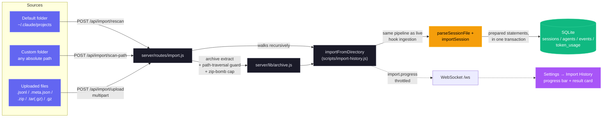
```mermaid
flowchart LR
    subgraph Sources
      A1["Default folder<br/>~/.claude/projects"]
      A2["Custom folder<br/>any absolute path"]
      A3["Uploaded files<br/>.jsonl / .meta.json /<br/>.zip / .tar(.gz) / .gz"]
    end

    A1 -->|POST /api/import/rescan| R["server/routes/import.js"]
    A2 -->|POST /api/import/scan-path| R
    A3 -->|POST /api/import/upload<br/>multipart| R

    R -->|archive extract<br/>+ path-traversal guard<br/>+ zip-bomb cap| X["server/lib/archive.js"]
    R -->|walks recursively| I["importFromDirectory<br/>(scripts/import-history.js)"]
    X --> I
    I -->|same pipeline as live<br/>hook ingestion| P["parseSessionFile +<br/>importSession"]
    P -->|prepared statements,<br/>in one transaction| D[("SQLite<br/>sessions / agents / events /<br/>token_usage")]
    I -.->|import.progress<br/>throttled| W["WebSocket /ws"]
    W -.-> U["Settings → Import History<br/>progress bar + result card"]

    style A1 fill:#6366f1,stroke:#818cf8,color:#fff
    style A2 fill:#6366f1,stroke:#818cf8,color:#fff
    style A3 fill:#6366f1,stroke:#818cf8,color:#fff
    style R fill:#1a1a28,stroke:#2a2a3d,color:#e4e4ed
    style X fill:#1a1a28,stroke:#2a2a3d,color:#e4e4ed
    style I fill:#1a1a28,stroke:#2a2a3d,color:#e4e4ed
    style P fill:#f59e0b,stroke:#fbbf24,color:#000
    style D fill:#10b981,stroke:#34d399,color:#fff
    style U fill:#a855f7,stroke:#c084fc,color:#fff
```

**Route**

| Metodo | Percorso                | Descrizione                                                              |
| ------ | ----------------------- | ------------------------------------------------------------------------ |
| `GET`  | `/api/import/guide`     | Percorsi del sistema operativo consapevoli del provider, comando di archiviazione, estensioni e istruzioni (`?provider=claude\|codex`) |
| `POST` | `/api/import/rescan`    | Ri-scansiona il default selezionato: `~/.claude/projects` o `~/.codex/sessions` (`{ provider }`) |
| `POST` | `/api/import/scan-path` | Scansiona una directory assoluta con `{ path, provider }`; percorre ricorsivamente |
| `POST` | `/api/import/upload`    | Upload multipart di `.jsonl`, `.meta.json`, `.zip`, `.tar(.gz)`, `.gz` con `provider` |

**Input supportati.** Trascrizioni di sessione JSONL sciolte (`.jsonl`), i loro
sidecar `.meta.json` di accompagnamento e archivi (`.zip`, `.tar`,
`.tar.gz`/`.tgz`, `.gz` semplice) contenenti qualsiasi layout di directory annidato.
Entrambi i layout canonici di Claude Code sono riconosciuti automaticamente:
`<project>/<sessionId>/subagents/agent-*.jsonl` (default) e
`<project>/subagents/<sessionId>/agent-*.jsonl` (alternativo).
Per Codex, l'importer riconosce ricorsivamente i file di sessione `rollout-*.jsonl`
(inclusi i file JSONL sciolti con `session_meta`) e un `session_index.jsonl`
opzionale per i nomi di sessione nativi.

**Garanzie di accuratezza.** Le sessioni sono deduplicate per UUID; rieseguire
l'importer è sempre sicuro. Le colonne di compattazione `baseline_input` /
`baseline_output` / `baseline_cache_read` / `baseline_cache_write`
preservano i conteggi dei token precedenti alla compattazione di una trascrizione,
così re-ingerire un JSONL post-compattazione non cancella mai il costo storico.
Il dedup a livello di evento usa un high-water mark per tipo di evento
(`MAX(created_at) GROUP BY event_type` per la sessione): a ogni
re-import vengono inserite solo le voci JSONL con `ts > cutoff[type]`, così
le sessioni di lunga durata le cui trascrizioni crescono per più giorni
continuano a ricevere eventi Stop / PostToolUse / TurnDuration / ToolError
senza duplicare il lavoro precedente. `sessions.ended_at` viene fatto avanzare
all'ultima attività del JSONL quando supera il valore salvato,
e i metadata del conteggio dei messaggi sono aggiornati a ogni passaggio.

**Sicurezza per trascrizioni enormi.** La cache delle trascrizioni condivisa
(`server/lib/transcript-cache.js`) legge i file JSONL in chunk da 4 MiB
e decodifica una sola riga alla volta, così le trascrizioni più grandi della
lunghezza massima di stringa JS di V8 (~512 MiB su Node 20 a 64 bit) vengono analizzate senza
abortire il processo con `FATAL ERROR: v8::ToLocalChecked Empty
MaybeLocal`. Lo stesso percorso a chunk è usato dall'ingestione degli hook, dallo
sweep periodico delle compattazioni e dall'importer dello storico — nessuno di loro
materializza il file completo come una singola stringa JS. Gli array crescenti
per voce (`turnDurations`, `errors`, `compaction.entries`,
`usageExtras.*`) sono limitati in coda a `TRANSCRIPT_CACHE_MAX_ARRAY_LEN`
(default `1000`), con il trimming applicato durante il parse a una soglia di `2 × cap`
così un parse completo a freddo di una sessione multi-giorno non può
costruire un transiente illimitato prima della finalizzazione.

**Sicurezza.** L'estrazione degli archivi valida ogni voce contro il path
traversal (percorsi assoluti e segmenti `..` sono rifiutati). Un
limite di estrazione configurabile (`CCAM_IMPORT_MAX_EXTRACT_BYTES`, default
4 GB) ferma le bombe zip/tar/gzip. La dimensione degli upload è limitata per file
(`CCAM_IMPORT_MAX_BYTES`, default 1 GB) e per richiesta
(`CCAM_IMPORT_MAX_FILES`, default 2000). Tutte le directory di staging sono
per richiesta e recuperate in `finally`, anche quando multer rifiuta
tutti i file in partenza.

**Avanzamento.** L'attività di import è trasmessa sul WebSocket esistente
come messaggi `import.progress` (`phase`: `start` / `scan` / `extract` /
`parse` / `complete` / `error`), con throttling per evitare di inondare il
canale sugli import grandi.

**UI.** Usa il pannello **Impostazioni → Import History** per un'esperienza guidata
drag-and-drop con istruzioni passo passo, avanzamento live
e un riepilogo post-import che mostra i conteggi di importati / arricchiti / saltati /
in errore.

<p align="center">
  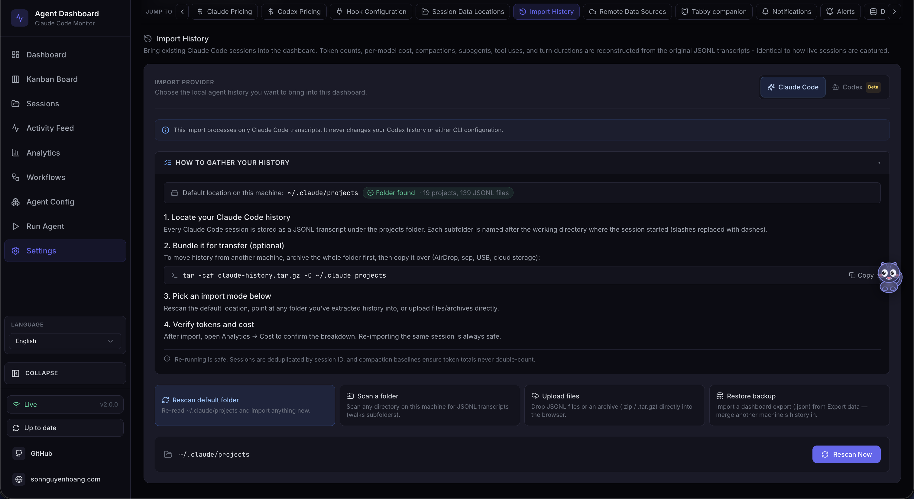
</p>

### WebSocket

Connettiti a `ws://localhost:4820/ws` per ricevere messaggi push in tempo reale:

```json
{
  "type": "agent_updated",
  "data": { "id": "...", "status": "working", "current_tool": "Edit" },
  "timestamp": "2026-03-05T15:43:01.800Z"
}
```

**Tipi di messaggio:** `session_created`, `session_updated`, `agent_created`, `agent_updated`, `new_event`, `alert_triggered`, `alert_updated`, `remote_source.status` (data `{ id, status: "idle"|"syncing"|"ok"|"error"|"deleted", error?, last_sync_at? }`)

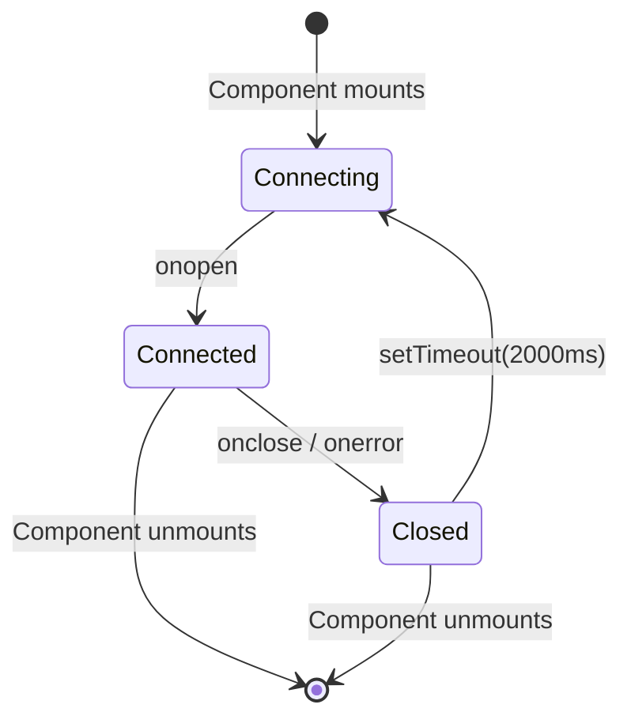
```mermaid
stateDiagram-v2
    [*] --> Connecting: Component mounts
    Connecting --> Connected: onopen
    Connected --> Closed: onclose / onerror
    Closed --> Connecting: setTimeout(2000ms)
    Connected --> [*]: Component unmounts
    Closed --> [*]: Component unmounts
```

---

## Eventi hook

La dashboard elabora questi tipi di hook di Claude Code:

| Tipo di hook        | Trigger                        | Azione della dashboard                                                                             |
| ------------------- | ------------------------------ | -------------------------------------------------------------------------------------------- |
| `SessionStart`      | Inizia una sessione Claude Code     | Crea la sessione e l'agente principale. Marca `awaiting_input_since` (con `awaiting_reason=session_start`) così una sessione nuova atterra in **Waiting** — tranne un SessionStart con sorgente `compact` (auto-compattazione a metà turno), che lascia il flag intatto così una sessione al lavoro resta **Active**. Riattiva le sessioni riprese. Abbandona le sessioni orfane senza attività per `DASHBOARD_STALE_MINUTES` (default 180) |
| `UserPromptSubmit`  | L'utente preme invio su un prompt    | Cancella il flag di attesa e promuove l'agente principale a `working` — l'unico segnale che i turni dell'assistente di solo testo sono iniziati, dato che non emettono `PreToolUse` |
| `PreToolUse`        | L'agente inizia a usare uno strumento      | Cancella il flag di attesa, imposta l'agente a `working`, imposta `current_tool`. Se lo strumento è `Agent`, crea un record di subagente |
| `PostToolUse`       | Esecuzione dello strumento completata       | Cancella il flag di attesa (gestisce le approvazioni delle richieste di permesso dove la Notification lo aveva marcato a metà strumento). Cancella `current_tool`. L'agente resta `working` |
| `Stop`              | Claude finisce di rispondere     | Senza errore: agente principale → `waiting` — Claude ha finito il suo turno, la palla è all'utente. `stop_reason=error`: marca l'agente e la sessione `error`. I subagenti in background continuano a girare |
| `SubagentStop`      | Un agente in background è terminato      | Trova e completa il subagente per descrizione, tipo o task. Deliberatamente NON cancella il flag di attesa — un subagente che finisce non ci dice nulla sull'umano. **Innesca una scansione JSONL fire-and-forget** (`scanAndImportSubagents`) che emette eventi `PreToolUse` + `PostToolUse` per strumento sotto l'`agent_id` proprio del subagente così la Timeline mostra ogni strumento eseguito dal subagente, non solo il marcatore di spawn |
| `Notification`      | Notifica dell'agente             | Registra l'evento. I messaggi di permesso/richiesta di input impostano l'agente a `waiting` e marcano `awaiting_input_since` (con `awaiting_reason=notification`, riconosciuti dal pattern: `permission`, `waiting for input`, `needs your approval`, …). Le notifiche di compattazione sono taggate come eventi `Compaction`. Innesca una notifica del browser se abilitata |
| `SessionEnd`        | Il processo CLI di Claude Code esce  | Rimuove il flag di attesa. Se la sessione è già in `error`, lo stato di errore viene preservato; altrimenti marca tutti gli agenti e la sessione come `completed` |
| `Compaction`   | `/compact` rilevato nel JSONL   | Crea un subagente di compattazione (tipo `compaction`) e un evento Compaction. Rilevato tramite le voci `isCompactSummary` nella trascrizione JSONL. Rilevato anche dallo scanner periodico per le sessioni attive |
| `APIError`     | Errore API nella trascrizione JSONL  | Estratto dalle voci `isApiErrorMessage` (quota, rate limit, invalid_request) e dalle risposte grezze `type: "error"`. **Ora marca immediatamente la sessione e l'agente come `error`** — in precedenza registrato come evento senza cambiare lo stato. Salvato come evento con i dettagli dell'errore |
| `TurnDuration` | Tempi dei turni nella trascrizione JSONL| Estratto dai messaggi `system` con sottotipo `turn_duration` e `durationMs`. Salvato come evento per l'analisi dei tempi a livello di turno |
| `ToolError`    | Errore nel risultato di uno strumento nel JSONL     | Estratto dalle voci `toolUseResult.is_error`. Traccia i fallimenti a livello di strumento per l'analisi della propagazione degli errori |
| `Interrupted`  | Turno annullato dall'utente (Esc) | Sintetizzato dal watchdog — `Esc` non fa scattare alcun hook, quindi una sessione bloccata in `working` viene rilevata dal marcatore `[Request interrupted by user]` della trascrizione o, quando Esc ha preceduto qualsiasi output, dal timeout di inattività in working (`DASHBOARD_WORKING_IDLE_SECONDS`). La sessione passa a **Waiting** (come per uno `Stop` normale) |

---

## Notifiche del browser

La dashboard supporta notifiche del browser persistenti via Web Push (VAPID) per avvisi in tempo reale anche quando la scheda della dashboard non è a fuoco o il browser è in background.

### Come funziona

1. **Abilita** le notifiche nella pagina Impostazioni tramite l'interruttore generale
2. **Concedi** il permesso del browser quando richiesto — questo registra un Service Worker e crea una sottoscrizione push
3. **Configura** quali eventi innescano le notifiche:

| Evento                       | Default | Descrizione                                                     |
| ---------------------------- | ------- | --------------------------------------------------------------- |
| Nuova sessione avviata           | On      | Scatta quando viene creata una nuova sessione Claude Code                 |
| Claude ha finito di rispondere   | Off     | Scatta sugli eventi `Stop` quando Claude finisce un turno di risposta     |
| Sessione chiusa               | Off     | Scatta al `SessionEnd` quando il processo CLI esce                |
| Errori di sessione               | On      | Scatta quando una sessione termina con un errore                         |
| Subagente generato             | Off     | Scatta quando viene creato un subagente in background                     |

Inoltre, qualsiasi evento hook `Notification` da Claude Code innesca una notifica del browser indipendentemente dagli interruttori per evento (finché l'interruttore generale è abilitato).

### Architettura delle notifiche

- **Pipeline VAPID:** usa `web-push` sul server per una consegna sicura dei messaggi. Le chiavi VAPID sono auto-generate e salvate in `data/vapid-keys.json`.
- **Service Worker:** un worker dedicato (`client/public/sw.js`) gestisce gli eventi `push` in arrivo e mostra le notifiche con `silent: false` per garantire la riproduzione audio su macOS.
- **Sottoscrizioni:** gli endpoint specifici del browser sono salvati nella tabella `push_subscriptions` di SQLite.
- **Persistenza:** le notifiche arrivano anche se il browser è chiuso, dato che il Service Worker opera in background.
- **Notifica di test:** un pulsante nelle Impostazioni ti permette di verificare la pipeline VAPID e la riproduzione audio.

### PWA e supporto offline

Il progetto include tre Progressive Web App indipendenti — una ciascuna per **dashboard**, **landing page** e **wiki**. Ognuna ha il proprio `manifest.json` e Service Worker così il browser le tratta come applicazioni installabili separate.

| Superficie | Manifest | Service Worker | Strategia di caching |
| --- | --- | --- | --- |
| Dashboard (`client/`) | `client/public/manifest.json` | `client/public/sw.js` | I bundle con hash nel contenuto di Vite sotto `/assets/*` sono serviti cache-first (gli URL sono immutabili per build). Tutto il resto — navigazioni, il SW stesso, `manifest.json`, icone, la root `/` — è network-first con fallback sulla cache, così una rebuild mostra sempre la UI più fresca senza hard refresh. Le richieste API (`/api/*`), WebSocket (`/ws`) e Vite HMR non sono mai cachate. I gestori delle notifiche push sono preservati accanto alla logica di caching. Il middleware statico Express (`server/index.js`) rinforza questo inviando `Cache-Control: public, max-age=31536000, immutable` per `/assets/*` e `Cache-Control: no-cache, must-revalidate` per `index.html`, `sw.js` e `manifest.json`. `client/src/main.tsx` ascolta `controllerchange`: quando un nuovo SW si attiva su una pagina già controllata ricarica esattamente una volta (le prime installazioni no). |
| Landing page (root) | `manifest.json` | `sw.js` | Precache della shell HTML, del favicon e dell'immagine OG. I PNG degli screenshot sono cachati pigramente alla prima vista (cache-first) per evitare un precache iniziale pesante. La navigazione è network-first con fallback offline. |
| Wiki (`wiki/`) | `wiki/manifest.json` | `wiki/sw.js` | Precache di `index.html`, `style.css`, `script.js`, manifest e favicon. Completamente utilizzabile offline dopo una visita. HTML network-first, CSS/JS cache-first. |

**Ciclo di vita della cache:** tutti e tre i SW chiamano `skipWaiting()` all'installazione ed eliminano le cache stantie all'attivazione (con chiavi di versione come `dashboard-v2`, `landing-v1`, `wiki-v1`). Incrementare la costante di versione forza un refresh pulito.

**Supporto iOS:** tutti e tre i file HTML includono `<meta name="apple-mobile-web-app-capable" content="yes">` e `<meta name="apple-mobile-web-app-status-bar-style" content="black-translucent">` per la modalità standalone da home screen su Safari.

**Icone:** i manifest referenziano `favicon.svg` con `sizes="any"` e `type="image/svg+xml"` — supportato in Chrome 107+, Firefox 110+, Edge 107+. Anche le Apple touch icon usano il favicon SVG.

---

## Notificatore di aggiornamenti

La dashboard osserva il proprio checkout git e mostra una modale ogni volta che il branch di default canonico ha commit avanti rispetto a HEAD. **Consapevole di branch e fork:** se hai un remote `upstream` (la convenzione standard per i fork), è preferito a `origin`; il `master`/`main`/`HEAD` del remote scelto è il ref di confronto. Il `manual_command` si adatta alla tua situazione — `git pull --ff-only` solo quando il tuo branch traccia effettivamente il ref canonico, altrimenti un `git fetch` (e un merge fast-forward nel caso del fork) così il comando non mente mai. Gli utenti ricevono il comando esatto da eseguire in un terminale — il server non fa **mai** pull né si riavvia da solo, il che mantiene il meccanismo portabile attraverso sessioni di sviluppo, supervisione pm2/systemd/launchd/Docker e deployment remoti.

<p align="center">
  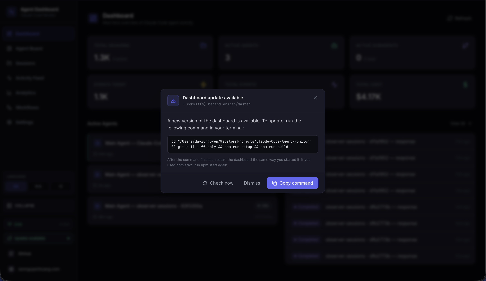
</p>

### Come funziona

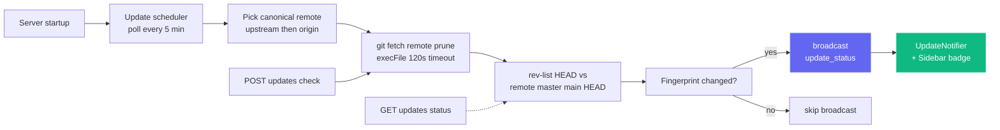
```mermaid
flowchart LR
    S["Server startup"] --> SCHED["Update scheduler<br/>poll every 5 min"]
    SCHED --> PICK["Pick canonical remote<br/>upstream then origin"]
    PICK --> FETCH["git fetch remote prune<br/>execFile 120s timeout"]
    FETCH --> CMP["rev-list HEAD vs<br/>remote master main HEAD"]
    CMP --> FP["Fingerprint changed?"]
    FP -->|yes| WS["broadcast<br/>update_status"]
    FP -->|no| IDLE["skip broadcast"]
    WS --> CLIENT["UpdateNotifier<br/>+ Sidebar badge"]

    CHECK["POST updates check"] --> FETCH
    STATUS["GET updates status"] -.-> CMP

    style WS fill:#6366f1,stroke:#818cf8,color:#fff
    style CLIENT fill:#10b981,stroke:#34d399,color:#fff
```

Un singolo controllo è economico (`git fetch <remote> --prune` contro il remote canonico — `upstream` se configurato, altrimenti `origin`), incapsulato con `execFile` (nessuna shell) e un timeout di 120 s. I fallimenti — rete offline, installazione non-git, nessun remote configurato, ref upstream non risolvibile — restituiscono tutti **payload soft** (es. `fetch_error: "..."`) invece di lanciare eccezioni, così un remote instabile non blocca mai la dashboard.

### Superfici UI

| Superficie | Comportamento |
| --- | --- |
| **Modale** (`client/src/components/UpdateNotifier.tsx`) | Appare quando `update_available === true` e l'utente non ha già scartato questo specifico `remote_sha`. Mostra i commit di ritardo, il ref tracciato, una `situation_note` opzionale (quando si è su un feature branch / fork la nota spiega perché il comando differisce), il comando copiabile e tre pulsanti: **Copy command** (primario), **Check now**, **Dismiss**. ESC e i click sul backdrop la chiudono. Con chiave `remote_sha` in `localStorage`, così un commit upstream più recente riapre la modale automaticamente. |
| **Pulsante nella sidebar** (`client/src/components/Sidebar.tsx`) | Pulsante "Check for updates" sempre visibile nel footer. Bordo smeraldo + puntino badge verde quando si è indietro, ambra quando l'ultimo controllo ha incontrato un errore di fetch. Cliccarlo cancella qualsiasi scarto precedente, poi lancia `POST /api/updates/check`. |
| **Terminale del server** | Quando lo scheduler transisce da "aggiornato" a "indietro", stampa un blocco incorniciato su stdout con il comando così anche gli utenti headless lo vedono. |

### Superficie API

| Endpoint | Scopo |
| --- | --- |
| `GET /api/updates/status` | Controllo di sola lettura: esegue `git fetch` contro il remote canonico, confronta HEAD con il suo branch di default, restituisce il payload. |
| `POST /api/updates/check` | Stesso controllo, ma trasmette anche `update_status` sul WebSocket così tutti i client connessi si aggiornano insieme. |

Entrambi gli endpoint restituiscono la stessa forma di payload:

```json
{
  "git_repo": true,
  "update_available": true,
  "repo_root": "/Users/you/Claude-Code-Agent-Monitor",
  "remote_ref": "upstream/master",
  "canonical_remote": "upstream",
  "current_branch": "master",
  "tracking_upstream": "origin/master",
  "tracks_canonical": false,
  "situation": "fork_or_diverged_tracking",
  "local_sha": "abc1234...",
  "remote_sha": "def5678...",
  "commits_behind": 3,
  "manual_command": "cd \"/...\" && git fetch upstream && git merge --ff-only upstream/master && npm run setup",
  "situation_note": "You're on 'master' tracking 'origin/master'. This command fast-forwards your branch from upstream/master (the canonical default).",
  "message": "3 commit(s) on upstream/master not in your checkout."
}
```

`situation` è uno tra `tracking_canonical` (clone tipico sul branch di default — `git pull --ff-only` funziona), `fork_or_diverged_tracking` (il nome del branch locale corrisponde al canonico, ma traccia un remote diverso — `git fetch <remote> && git merge --ff-only <ref>`), `feature_branch` (fuori dal branch di default — solo fetch, l'integrazione è lasciata all'utente) o `detached_head`.

### Cosa **non** c'è, intenzionalmente

Non esiste un `POST /api/updates/apply` né un helper di auto-riavvio, per scelta. Auto-aggiornare un processo dal suo interno è inaffidabile senza un supervisore esterno — `npm run dev` (concurrently), `npm start`, `pm2`, `systemd`, `launchd` e Docker richiedono ciascuno una logica di riavvio diversa, e i fallimenti di `git pull` / `npm install` su un server morente non hanno un percorso di rollback pulito. Il solo rilevamento mantiene il comportamento prevedibile con ogni supervisore, ogni OS e ogni stato del branch, chiudendo comunque il gap informativo del "quando devo fare pull?"; l'aggiornamento vero e proprio è dell'utente, nella sua shell.

### Configurazione

| Variabile d'ambiente | Default | Note |
| --- | --- | --- |
| `DASHBOARD_UPDATE_CHECK` | abilitato | Imposta `0` / `false` / `off` per disabilitare interamente lo scheduler. |
| `DASHBOARD_UPDATE_CHECK_INTERVAL_MS` | `300000` (5 min) | Intervallo tra i controlli automatici. Il minimo è 60 000 ms — i valori inferiori vengono limitati. |

---

## Tabby — Il gatto compagno fluttuante

**Tabby** è un simpatico gatto compagno fluttuante ancorato all'angolo in basso a destra di ogni pagina della dashboard. Sempre presente, trasforma lo stream live delle sessioni in una mascotte reattiva leggibile a colpo d'occhio con cui puoi anche parlare.

<p align="center">
  
</p>

### Mascotte reattiva

Tabby è un gatto SVG che segue il cursore con **otto stati d'animo** derivati dallo stream live delle sessioni, ognuno con la propria animazione:

| Stato d'animo | Quando | Animazione |
| --- | --- | --- |
| `idle` | Non succede nulla di rilevante | Colpo di coda a riposo |
| `watching` | Ci sono sessioni attive | Orecchie dritte, gli occhi seguono il cursore |
| `happy` | Una sessione o esecuzione è finita pulita | Testa che ondeggia + scintillio |
| `worried` | Qualcosa sembra storto | Scossa sottile |
| `stuck` | Una sessione sembra bloccata | "!" di allerta |
| `thinking` | Un agente è a metà lavoro | Lenta oscillazione della testa |
| `sleeping` | Silenzio da un po' | `zzz` |
| `disconnected` | Il WebSocket è giù | Posa calma e immobile |

### Fumetti

Tabby fa emergere automaticamente brevi battute sugli eventi rilevanti (sessione avviata/terminata, errori, esecuzione completata). I fumetti sono **limitati e coalizzati** così una raffica di eventi non riempie mai lo schermo, usano `aria-live` per gli screen reader e possono essere **silenziati** dal pannello.

### Pannello

Apri il pannello cliccando il gatto o premendo **⌘B / Ctrl+B** (Esc chiude). Mostra:

- Una **riga di stato** live — `N live · M errored · stato della connessione`.
- **Azioni rapide** — salta a Run Claude, Attività, Sessioni o alle sessioni in errore; silenzia i fumetti; cancella gli alert.
- Una casella **Ask** (vedi sotto).

### Casella Ask → passaggio a Run Claude

La casella **Ask** risponde alle semplici domande di stato localmente dai dati in cache — per esempio "what's running", "any errors" o "status". Qualsiasi altra domanda viene passata alla pagina **Run Claude** esistente (con deep-link a `/run?prompt=…`) per avviare una vera sessione Claude Code. Tabby non chiama mai un LLM da solo; riusa semplicemente la pagina Run Claude per qualsiasi cosa oltre un rapido controllo di stato.

### Accessibilità e degradazione sicura

Tabby è utilizzabile da tastiera, usa `aria-live` per i suoi fumetti e rispetta `prefers-reduced-motion`. Se il WebSocket è giù degrada in sicurezza a uno stato calmo `disconnected` invece di andare in errore. Puoi attivare o disattivare Tabby nelle **Impostazioni** (localizzato in inglese, cinese, vietnamita, coreano, spagnolo e italiano), e l'implementazione vive in `client/src/components/Tabby/`.

---

## Segnali sonori

La dashboard ti dà un **feedback audio discreto** per l'attività live delle sessioni, così puoi lasciarla su un secondo monitor e sentire comunque quando un'esecuzione finisce o fallisce. Il suono è **attivo per default** e può essere spento del tutto in un click.

### Sintesi a zero dipendenze

Non ci sono asset `.mp3` o `.wav` da nessuna parte nel repo e nessuna libreria audio in `package.json`. Ogni segnale è generato al momento della riproduzione con la **Web Audio API**: una breve lista di oscillatori (sinusoide o triangolo), ognuno con il proprio inviluppo di gain esponenziale, mixati attraverso un nodo di gain master e un filtro passa-basso così il risultato resta dietro al tuo lavoro invece di tagliarlo. L'intero motore è un solo file, `client/src/lib/sound.ts`.

### I segnali

| Segnale | Quando scatta | Come suona |
| --- | --- | --- |
| `sessionStart` | Appare una nuova sessione | Quinta giusta ascendente (C5 → G5) |
| `sessionComplete` | Una sessione finisce di rispondere (`Stop`) o si chiude (`SessionEnd`) | Arpeggio maggiore risolutivo (E5 → G5 → C6) |
| `sessionError` | Una sessione entra nello stato `error` | Morbida terza minore discendente su un'onda triangolare — udibile, non allarmante |
| `subagentSpawn` | Viene generato un subagente | Singolo pizzicato corto |
| `notification` | Claude Code emette un evento `Notification` | Coppia scordata che risuona come una piccola campana |
| `connected` / `disconnected` | Il WebSocket della dashboard torna o cade | Due note in salita / discesa |
| `click` | Premi un pulsante, link, scheda o interruttore | Tick appena udibile |

I segnali vivono dentro un set in Do maggiore così le code sovrapposte non suonano mai dissonanti, e ogni inviluppo decade esponenzialmente invece di troncarsi, evitando il click di uno stop brusco.

### Restare fuori dai piedi

Tre guardie impediscono all'audio di diventare rumore:

- **Cooldown per segnale** — lo stesso segnale non si ripete entro ~350 ms (45 ms per il tick di interazione).
- **Budget globale di burst** — al massimo 4 segnali partono in una finestra di 1,2 s, così importare lo storico o riconnettersi dopo una caduta non trasforma mai un fiume di messaggi WebSocket in un fiume di bip.
- **Policy di autoplay** — nulla suona fino alla tua prima interazione con la pagina via puntatore, tasto o tocco, come da regole del browser. I segnali precedenti vengono scartati in silenzio, non accodati.

Se il browser non ha alcun supporto Web Audio, ogni chiamata è un no-op sicuro — la dashboard resta semplicemente silenziosa.

### Impostazioni

**Impostazioni → Sound** ha un interruttore generale, uno slider del volume e un interruttore individuale per ogni segnale. Attivare un interruttore riproduce quel segnale immediatamente così senti esattamente cosa hai appena abilitato, e un pulsante **Preview Sound** riproduce il carillon di completamento su richiesta. Le preferenze persistono in `localStorage` sotto `agent-monitor-sound` e hanno effetto istantaneo in tutta l'app — nessun reload. Il pannello è localizzato in inglese, cinese, vietnamita, coreano, spagnolo e italiano.

Per default sono attivi avvio sessione, completamento sessione, errore di sessione, le notifiche di Claude Code e il tick di interazione; gli spawn di subagenti e i cambi di connessione sono spenti (sono i più chiacchieroni). L'implementazione vive in `client/src/lib/sound.ts` (motore + preferenze) e `client/src/hooks/useSoundCues.ts` (collegamento all'event bus), montata una volta in `client/src/App.tsx`.

---

## Modale dello stato di connessione

Clicca la pill **Live** / **Disconnected** nel footer della sidebar per aprire un piccolo pannello di dettagli sul trasporto WebSocket della dashboard. Mostra l'endpoint `ws://` attivo, da quanto tempo il socket corrente è su, il totale degli eventi ricevuti, i tipi di evento principali come grafico a barre orizzontali, una sparkline del throughput a 60 secondi e gli ultimi 8 eventi come lista di attività recente. Le statistiche cumulative (totali, ripartizione per tipo, lista recente) persistono tra i reload via `localStorage` sotto `sidebar-connection-stats`; la sparkline scorrevole e il timer "connected since" sono intenzionalmente effimeri. Un pulsante **Reset** nel footer cancella tutto su richiesta.

<p align="center">
  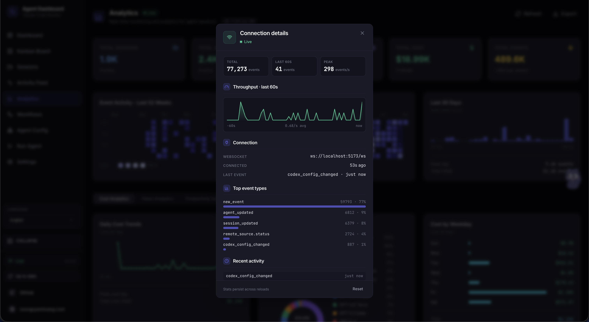
</p>

---

## Estensione VS Code

Il **Claude Code Agent Monitor** è disponibile come estensione VS Code di prima classe, che ti permette di monitorare i tuoi agenti AI senza lasciare l'editor.

<p align="center">
  
</p>

### 🚀 Funzionalità chiave
- **Sidebar live**: vista dedicata nella Activity Bar che mostra in tempo reale la salute degli agenti (Working, Waiting, Completed, ecc.).
- **Analytics di utilizzo**: traccia i token totali, i costi live in USD e i conteggi degli eventi direttamente nella sidebar.
- **Integrazione con la status bar**: monitor a colpo d'occhio nella barra inferiore con sessioni e agenti attivi.
- **Navigazione profonda**: accesso in un click a viste specifiche della dashboard (Kanban, Analytics, Impostazioni) o alle sessioni recenti.
- **Scheda integrata**: apre l'intera dashboard di monitoraggio come scheda webview nativa di VS Code.

### 📦 Installazione e configurazione
1. Apri la directory [vscode-extension](./vscode-extension).
2. Installa l'estensione dal Marketplace o impacchettala da te con `vsce package`.
3. Assicurati che il server locale della dashboard sia in esecuzione (`npm run dev`).
4. Clicca l'**icona radar** nella Activity Bar di VS Code per iniziare.

Per la configurazione dettagliata per sviluppatori, vedi le directory [.vscode](./.vscode) e [vscode-extension](./vscode-extension).

> [!TIP]
> Estensione sul Marketplace di VS Code: [Claude Code Agent Monitor](https://marketplace.visualstudio.com/items?itemName=hoangsonw.claude-code-agent-monitor)

---

## App desktop (macOS e Windows)

La dashboard è distribuita anche come **applicazione desktop nativa** opzionale che installi una volta e dimentichi — una `.app` macOS (distribuita come `.dmg`) e un `.exe` Windows (un installer NSIS più una build portable senza installazione). Vive nel workspace `desktop/`, fratello di `client/`, `server/`, `mcp/` e `vscode-extension/`, ed è costruita con **Electron 35**.

<p align="center">
  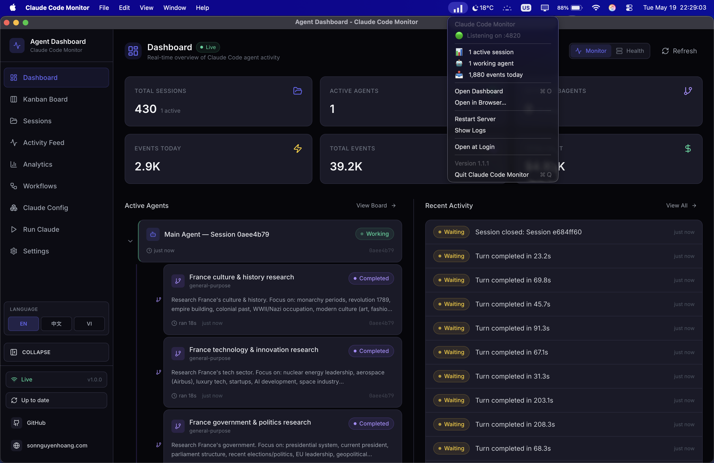
  <br>
  <em>🍎🪟 <strong>App desktop</strong> — shell nativa con icona nella barra dei menu / area di notifica (tray), Open-at-Login e lock a istanza singola. La stessa dashboard, in una vera finestra del sistema operativo (nella foto macOS).</em>
</p>

<p align="center">
  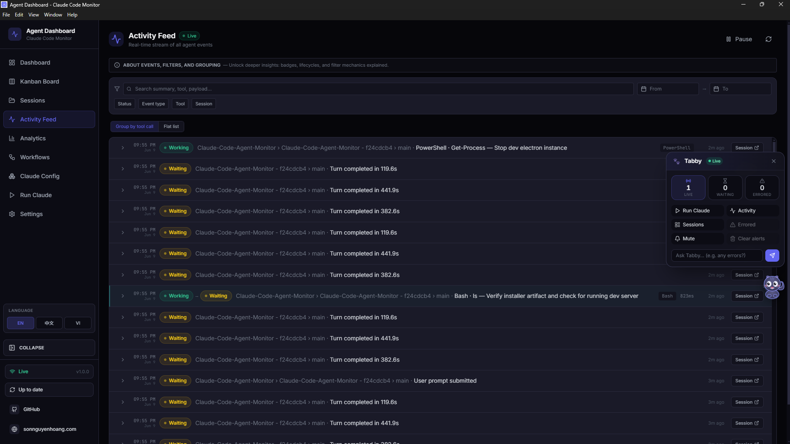
  <br>
  <em>🪟 La stessa dashboard come app nativa Windows — icona nell'area di notifica (tray), menu nativo della finestra e Open-at-Login.</em>
</p>

Tutto quello che vedi nel browser su `localhost:4820` vive dentro questa finestra, con il ciclo di vita nativo del sistema operativo sopra: un'icona tray, un menu applicazione nativo, l'integrazione con l'avvio automatico e un singolo pulsante di uscita che spegne il server in modo pulito.

### Come funziona

A differenza dell'esecuzione della dashboard da un terminale, l'app desktop non richiede `npm start`, nessuna shell aperta e nessuna seconda copia del server. Il **processo main** di Electron ospita il server Express **in-process** — fa `require()` di `server/index.js` direttamente nello stesso runtime Node, **senza processo figlio e senza IPC** — e punta una `BrowserWindow` Chromium al client React compilato.

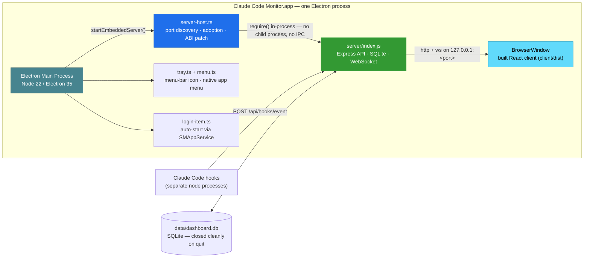
```mermaid
flowchart LR
    subgraph electron["Claude Code Monitor.app — one Electron process"]
        main["Electron Main Process<br/>Node 22 / Electron 35"]
        host["server-host.ts<br/>port discovery · adoption · ABI patch"]
        express["server/index.js<br/>Express API · SQLite · WebSocket"]
        win["BrowserWindow<br/>built React client (client/dist)"]
        tray["tray.ts + menu.ts<br/>menu-bar icon · native app menu"]
        login["login-item.ts<br/>auto-start via SMAppService"]
        main -->|"startEmbeddedServer()"| host
        host -->|"require() in-process — no child process, no IPC"| express
        main --> tray
        main --> login
        express -->|"http + ws on 127.0.0.1:&lt;port&gt;"| win
    end

    hooks["Claude Code hooks<br/>(separate node processes)"] -->|"POST /api/hooks/event"| express
    sqlite[("data/dashboard.db<br/>SQLite — closed cleanly on quit")] <--> express

    style main fill:#47848F,stroke:#2f5a62,color:#fff
    style express fill:#339933,stroke:#5cb85c,color:#fff
    style win fill:#61DAFB,stroke:#3aa9c9,color:#000
    style host fill:#1f6feb,stroke:#1158c7,color:#fff
```

Al lancio l'app:

1. Sceglie una porta libera — preferendo la **4820**, ripiegando su **4821–4829**, poi su una porta alta casuale se sono tutte occupate.
2. Se una dashboard in salute risponde già a `/api/health` sulla `4820` (es. hai eseguito `npm start` in un terminale), **adotta quel server** invece di fare doppio binding — nessuna collisione di porta, nessuna contesa su SQLite. Un server adottato continua a girare dopo che chiudi l'app.
3. Altrimenti avvia il server incorporato, e al **primo boot con server di proprietà** installa automaticamente gli hook di Claude Code e avvia i servizi in background (scheduler degli aggiornamenti, `cc-watcher`, riconciliazione delle esecuzioni orfane). Un utente solo-DMG ottiene quindi il flusso di eventi con **zero configurazione manuale** — nessun checkout, nessun `npm run install-hooks`.
4. **(macOS)** Recupera il **`PATH` della tua shell di login** così la funzionalità **Run Claude** può trovare e avviare la CLI `claude` — un'app lanciata da Finder/Dock altrimenti eredita solo il `PATH` minimale di launchd e mancherebbe le CLI in `~/.local/bin`, `/opt/homebrew/bin`, i bin dei version manager, ecc. (Su Windows il processo eredita già il `PATH` dell'utente.)
5. Apre la finestra della dashboard — a meno che l'app non sia stata lanciata al login (su macOS via Login Items; su Windows via la voce taggata `HKCU\…\Run`), nel qual caso resta solo nel tray.
6. All'uscita, spegne con grazia il server incorporato e **chiude SQLite in modo pulito** (checkpoint WAL).

### Funzionalità

- **Icona tray** — superficie di stato sempre attiva (barra dei menu macOS / area di notifica Windows). Il click sinistro commuta la finestra della dashboard; il click destro apre un menu contestuale con **Open Dashboard**, **Open in Browser**, **Restart Server**, **Show Logs**, **Open at Login** (toggle) e **Quit**. macOS usa un glifo template tinteggiato; Windows usa l'`icon.ico` colorato (un template nero sparirebbe sulla taskbar scura).
- **Icona di finestra e taskbar** — la `BrowserWindow` è collegata al logo colorato dell'app (`icon.ico` su Windows, `icon.png` altrove), così barra del titolo / taskbar mostrano la vera icona di Claude Code Monitor — persino un'esecuzione non impacchettata `npm run desktop:dev` non mostra più l'icona generica di Electron.
- **Menu applicazione nativo** — menu standard `About` / `File` / `Edit` / `View` / `Window` / `Help` con scorciatoie `⌘` / `Ctrl`. La voce **File → Open Dashboard** (`⌘1`) è **solo macOS**: macOS mantiene una barra dei menu globale dopo che la finestra si nasconde, quindi può riaprirla — su Windows/Linux il menu è attaccato alla finestra e non può scattare mentre è nascosta, quindi riaprila dal **Open Dashboard** del tray (che rialza in modo affidabile la finestra anche quando è minimizzata o dietro altre finestre).
- **Avvio automatico al login** — commuta **Open at Login** dal tray o dal menu dell'app. Su macOS si registra tramite la moderna API `SMAppService`, così la voce appare sotto **Impostazioni di Sistema → Generali → Elementi login**; su Windows scrive una voce per utente `HKCU\Software\Microsoft\Windows\CurrentVersion\Run`, visibile in **Gestione attività → Avvio**.
- **La chiusura della finestra nasconde, il server continua a girare** — chiudere la finestra la nasconde soltanto; server e tray restano su. Clicca il tray per far tornare la finestra.
- **Lock a istanza singola** — un doppio lancio si limita a portare a fuoco la finestra esistente; nessun secondo server, nessuna collisione di porta. (Vale su ogni piattaforma.)
- **I dati sopravvivono a reinstallazioni e aggiornamenti** — il database SQLite e le chiavi VAPID vivono nella directory app-data per utente **fuori dal bundle dell'app / directory di installazione** — `~/Library/Application Support/Claude Code Monitor/data/` su macOS, `%APPDATA%\Claude Code Monitor\data\` su Windows. Un bundle impacchettato è read-only, quindi scrivere il database al suo interno romperebbe l'Import History e la persistenza degli eventi; tenerlo in app-data lo risolve e significa che il tuo storico importato resta intatto quando sostituisci o aggiorni l'app. (L'uninstaller NSIS di Windows conserva questi dati per default.)
- **La CLI `claude` nel PATH** — su macOS l'app recupera all'avvio il `PATH` della tua shell di login, così la funzionalità **Run Claude** funziona anche se un'app lanciata da Finder/Dock erediterebbe altrimenti solo il `PATH` minimale di launchd. (Su Windows il `PATH` utente ereditato lo include già.)
- **Log** — il processo main scrive in `~/Library/Logs/Claude Code Monitor/desktop.log` (macOS) o `%APPDATA%\Claude Code Monitor\logs\desktop.log` (Windows); raggiungilo da **Show Logs** nel menu del tray.

### Come ottenerla

**Opzione A — scarica un installer precompilato (consigliato).** Da **[Releases → latest](https://github.com/hoangsonww/Claude-Code-Agent-Monitor/releases/latest)** (pubblico, nessun accesso GitHub richiesto). La CI pubblica automaticamente una nuova release `vX.Y.Z` ogni volta che la versione in `package.json` viene incrementata su `master`, quindi questo link serve sempre la build corrente:

| Piattaforma | Asset | Note |
| --- | --- | --- |
| macOS (Apple Silicon) | `ClaudeCodeMonitor-<ver>-arm64.dmg` | trascina in `/Applications` |
| macOS (Intel) | `ClaudeCodeMonitor-<ver>-x64.dmg` | trascina in `/Applications` |
| Windows (installer) | `ClaudeCodeMonitor-Setup-<ver>-x64.exe` | installazione per utente, niente admin |
| Windows (portable) | `ClaudeCodeMonitor-<ver>-x64-portable.exe` | esegui senza installare |

Build fresche per commit vivono anche come artifact CI (accesso richiesto, retention di 14 giorni): `ClaudeCodeMonitor-dmg` dal job `🍎 macOS Desktop (DMG)` e `ClaudeCodeMonitor-win` dal job `🪟 Windows Desktop (EXE)` — utili per testare `master` prima del prossimo tag di release.

**Opzione B — compilala da te.** Dalla root del repo:

```bash
npm run setup                # install root + client deps, build client, install hooks
npm run build                # build the React client (client/dist)
npm run desktop:install      # install Electron + electron-builder into desktop/ (preflights native deps; prints setup help on failure)
npm run desktop:dmg:arm64    # macOS:   fast single-arch DMG → desktop/release/ClaudeCodeMonitor-<ver>-arm64.dmg
npm run desktop:win          # Windows: NSIS installer → desktop/release/ClaudeCodeMonitor-Setup-<ver>-x64.exe
```

> [!NOTE]
> **I DMG si compilano su macOS; gli `.exe` Windows su Windows** — electron-builder impacchetta per il sistema operativo host. La build macOS `npm run desktop:dmg` impacchetta l'app **due volte** (una per architettura) ed emette **entrambi** i DMG per arch (`arm64` + `x64`) — la build di release; non li fonde in un unico binario universale. Per il tuo Mac usa i single-arch `desktop:dmg:arm64` / `desktop:dmg:x64`. Su Windows, `better-sqlite3` viene scaricato come binario Electron precompilato da `npm run desktop:install`, quindi nel caso comune non serve la toolchain C++ di Visual Studio. Se la build fallisce comunque (nessun binario precompilato, o toolchain C++ mancante), `desktop:install` stampa la correzione esatta per sistema operativo più un'alternativa senza toolchain e fallisce rumorosamente invece di lasciare un'installazione rotta.

### Installazione

**macOS:**

1. Fai doppio click sul `.dmg` per montarlo.
2. Trascina **Claude Code Monitor.app** nella cartella `/Applications`.
3. Il DMG è **firmato ad-hoc** per default, quindi Gatekeeper di macOS avvisa al primo lancio (*"Apple could not verify…"*). Rimuovi l'attributo di quarantena:

   ```bash
   xattr -cr "/Applications/Claude Code Monitor.app"
   ```

   Oppure apri **Impostazioni di Sistema → Privacy e Sicurezza** e clicca **Apri comunque**.

4. Lancia l'app. L'icona tray appare e la finestra della dashboard si apre.

**Windows:**

1. Esegui `ClaudeCodeMonitor-Setup-<ver>-x64.exe`. Si installa **per utente** sotto `%LOCALAPPDATA%\Programs\Claude Code Monitor` (nessuna elevazione ad amministratore) e ti lascia scegliere la directory di installazione; oppure esegui il `*-portable.exe` per lanciare senza installare.
2. L'installer è **non firmato** per default, quindi **SmartScreen** di Windows può mostrare *"Windows protected your PC"* al primo lancio — clicca **More info → Run anyway**.
3. Lancia dal menu Start / collegamento sul desktop. L'icona nell'area di notifica (tray) appare e la finestra della dashboard si apre.

<p align="center">
  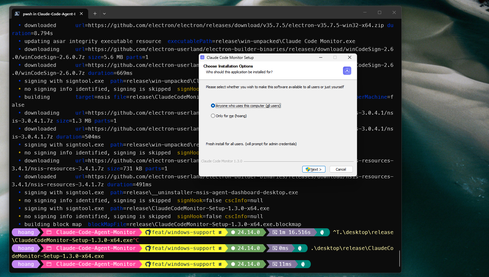
  <br>
  <em>Installer Windows · Passo 1 — <strong>Choose Installation Options</strong> ("Only for me" per utente vs. tutti gli utenti).</em>
</p>

<p align="center">
  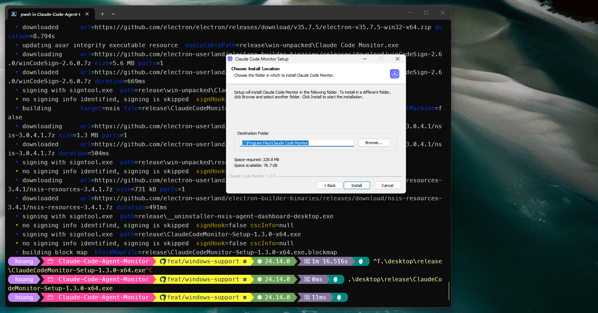
  <br>
  <em>Installer Windows · Passo 2 — <strong>Choose Install Location</strong> (default per utente <code>%LOCALAPPDATA%\Programs</code>).</em>
</p>

<p align="center">
  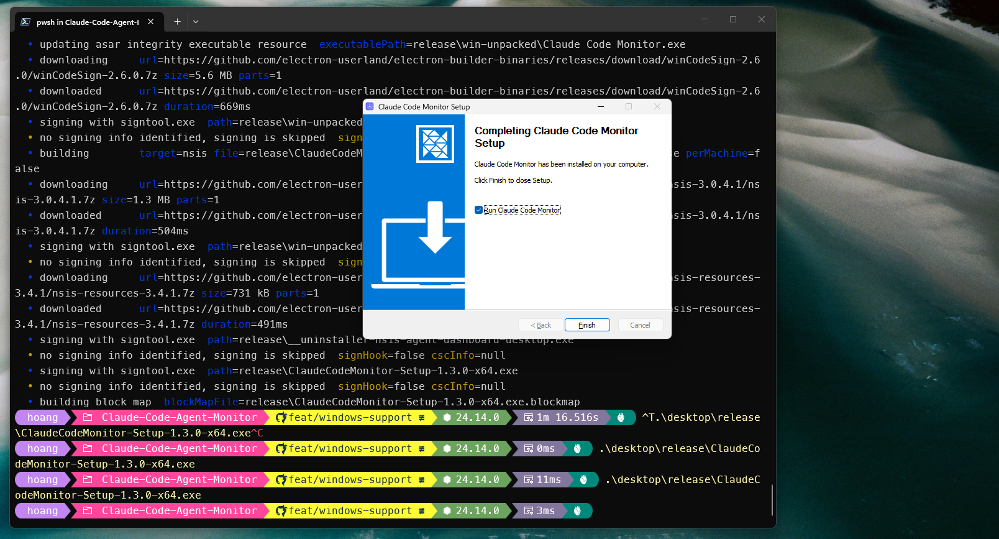
  <br>
  <em>Installer Windows · Passo 3 — <strong>Completing Setup</strong> (termina e lancia l'app).</em>
</p>

### Comandi di build

Tutti i comandi si eseguono dalla **root del repo**:

| Comando                     | Cosa fa                                                                 |
| --------------------------- | ---------------------------------------------------------------------------- |
| `npm run desktop:install`   | Installa Electron + electron-builder in `desktop/`; ricompila `better-sqlite3` per l'ABI di Electron; verifica preventivamente la build nativa di `better-sqlite3` e stampa aiuto pratico di setup (incl. un'alternativa senza toolchain) in caso di fallimento |
| `npm run desktop:build`     | Compila i sorgenti TypeScript desktop in `desktop/out/`                    |
| `npm run desktop:dev`       | Compila e lancia l'app Electron per l'iterazione locale                         |
| `npm run desktop:test`      | Esegue lo smoke test (avvia Electron, sonda `/api/health`, spegne)            |
| `npm run desktop:dmg`       | **macOS:** compila **entrambi** i DMG (arm64 + x64) — corretto per le release, **più lento** (impacchetta ogni arch) |
| `npm run desktop:dmg:arm64` | **macOS:** compila un DMG solo Apple Silicon — **veloce** (~1 min), consigliato per il tuo Mac |
| `npm run desktop:dmg:x64`   | **macOS:** compila un DMG solo Intel — **veloce** (~1 min)                         |
| `npm run desktop:dmg:universal` | **macOS:** compila un unico DMG **universale** fuso (arm64 + x86_64) — opzionale, **il più lento**, non quello distribuito nelle release |
| `npm run desktop:win`       | **Windows:** compila l'installer NSIS `.exe` (x64)                             |
| `npm run desktop:win:portable` | **Windows:** compila il portable senza installazione `.exe` (x64)                     |

Il DMG macOS risultante è di **~80 MB** (≈ 250 MB su disco una volta installato) e l'installer Windows è paragonabile — la classica tassa del bundle Electron.

### Firma e notarizzazione

Il DMG macOS è **firmato ad-hoc** per default così chiunque può compilare una `.app` funzionante senza un account Apple Developer a pagamento — lo script `package` imposta `CSC_IDENTITY_AUTO_DISCOVERY=false` così un certificato di code-signing già nel portachiavi del contributor non viene mai auto-selezionato. La vera **firma Developer ID** è opt-in via `CSC_LINK` (un `.p12` codificato base64) e `CSC_KEY_PASSWORD`; la **notarizzazione Apple** è opt-in via `APPLE_ID`, `APPLE_TEAM_ID` e `APPLE_APP_SPECIFIC_PASSWORD`. La build **Windows** è **non firmata** per default (SmartScreen può avvisare al primo lancio — *More info → Run anyway*); la firma Authenticode si attiva solo quando un certificato esplicito è fornito via `CSC_LINK` + `CSC_KEY_PASSWORD`. La CI li raccoglie tutti automaticamente quando forniti — nessuna modifica al codice richiesta.

### Note di implementazione

- **`better-sqlite3`** è l'unico modulo nativo nell'albero delle dipendenze, e un modulo nativo va compilato contro l'esatta ABI Node su cui gira. Il workspace `desktop/` include la **propria copia** di `better-sqlite3` ricompilata per l'ABI di Electron e usa un redirect di `require` locale al processo per puntare `server/db.js` verso di essa; la copia alla root del repo resta compilata per il Node di sistema (così `npm run test:server` continua a funzionare).
- **Compilare un DMG ricompila `better-sqlite3` per l'architettura target**, il che può lasciare la copia desktop compilata per l'altra arch della CPU e rompere `npm run desktop:dev` / `npm run desktop:test` con `ERR_DLOPEN_FAILED`. Lo step `prebuild` desktop ora **auto-ripara** il modulo nativo per la macchina locale alla build successiva, così i flussi di dev e smoke-test continuano a funzionare dopo una build DMG specifica per arch. Lo step `prebuild` inoltre **fallisce subito con aiuto di setup** quando il binario nativo di `better-sqlite3` manca del tutto, trasformando un crash a runtime in un errore di build copiabile.
- L'**unica modifica fuori da `desktop/`** è un refactor senza cambi di comportamento di `server/index.js`: il suo bootstrap post-listen (scheduler degli aggiornamenti, `cc-watcher`, riconciliazione delle esecuzioni orfane) è stato estratto in una `startBackgroundServices()` esportata così il server incorporato esegue esattamente ciò che esegue `node server/index.js`. Il percorso standalone `node server/index.js` è funzionalmente invariato; `client/`, `scripts/`, `mcp/` e `vscode-extension/` sono intoccati.
- Due job CI desktop filtrati per percorso compilano, testano e impacchettano l'app: **`🍎 macOS Desktop (DMG)`** su `macos-latest` (carica l'artifact `ClaudeCodeMonitor-dmg` — due DMG single-arch) e **`🪟 Windows Desktop (EXE)`** su `windows-latest` (carica l'artifact `ClaudeCodeMonitor-win` — installer NSIS + portable). A un push con incremento di versione su `master`, il job `release` allega **sia** i DMG macOS **sia** gli `.exe` Windows alla Release GitHub `vX.Y.Z` pubblicata. L'icona Windows (`desktop/assets/icon.ico`) è committata nel repo (rigenerala da `icon.png` con `npm run build:win-icon`, PowerShell + .NET, nessun tooling extra).

Per la guida utente completa (download, installazione, Gatekeeper / SmartScreen, menu del tray, avvio automatico) vedi [`DESKTOP.md`](./DESKTOP.md); per il riferimento contributor / architettura (modello di processo, ciclo di vita del boot, discovery della porta, pipeline di build — con diagrammi Mermaid) vedi [`desktop/README.md`](./desktop/README.md).

---

## Archiviazione dei dati

- **Engine:** SQLite 3 via `better-sqlite3` (opzionale) o il `node:sqlite` integrato di Node.js
- **Posizione:** `data/dashboard.db`
- **Journal mode:** WAL (letture concorrenti durante le scritture)
- **Reset:** elimina `data/dashboard.db` per cancellare tutti i dati

### Diagramma entità-relazione

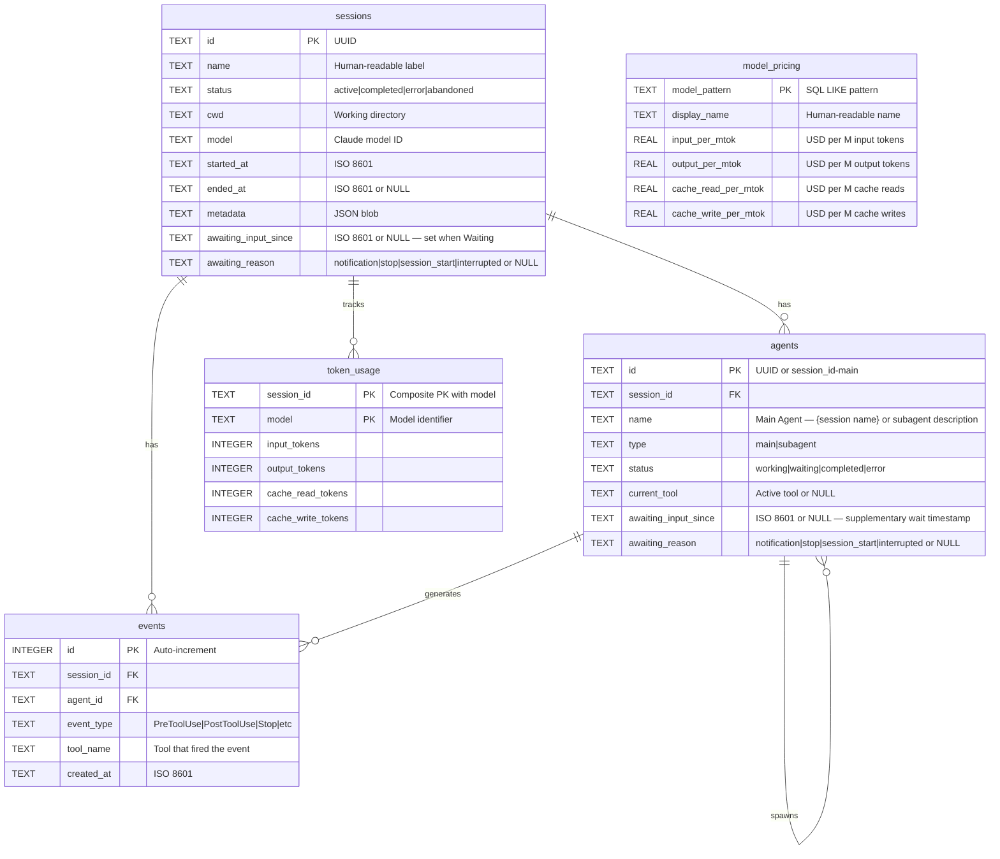
```mermaid
erDiagram
    sessions ||--o{ agents : has
    sessions ||--o{ events : has
    sessions ||--o{ token_usage : tracks
    agents ||--o{ events : generates
    agents ||--o{ agents : spawns

    sessions {
        TEXT id PK "UUID"
        TEXT name "Human-readable label"
        TEXT status "active|completed|error|abandoned"
        TEXT cwd "Working directory"
        TEXT model "Claude model ID"
        TEXT started_at "ISO 8601"
        TEXT ended_at "ISO 8601 or NULL"
        TEXT metadata "JSON blob"
        TEXT awaiting_input_since "ISO 8601 or NULL — set when Waiting"
        TEXT awaiting_reason "notification|stop|session_start|interrupted or NULL"
    }

    agents {
        TEXT id PK "UUID or session_id-main"
        TEXT session_id FK
        TEXT name "Main Agent — {session name} or subagent description"
        TEXT type "main|subagent"
        TEXT status "working|waiting|completed|error"
        TEXT current_tool "Active tool or NULL"
        TEXT awaiting_input_since "ISO 8601 or NULL — supplementary wait timestamp"
        TEXT awaiting_reason "notification|stop|session_start|interrupted or NULL"
    }

    events {
        INTEGER id PK "Auto-increment"
        TEXT session_id FK
        TEXT agent_id FK
        TEXT event_type "PreToolUse|PostToolUse|Stop|etc"
        TEXT tool_name "Tool that fired the event"
        TEXT created_at "ISO 8601"
    }

    token_usage {
        TEXT session_id PK "Composite PK with model"
        TEXT model PK "Model identifier"
        INTEGER input_tokens
        INTEGER output_tokens
        INTEGER cache_read_tokens
        INTEGER cache_write_tokens
    }

    model_pricing {
        TEXT model_pattern PK "SQL LIKE pattern"
        TEXT display_name "Human-readable name"
        REAL input_per_mtok "USD per M input tokens"
        REAL output_per_mtok "USD per M output tokens"
        REAL cache_read_per_mtok "USD per M cache reads"
        REAL cache_write_per_mtok "USD per M cache writes"
    }
```

---

## Marketplace dei plugin

CCAM distribuisce **14 plugin** da un unico albero sorgente condiviso. Claude Code legge `.claude-plugin/marketplace.json`; Codex legge `.agents/plugins/marketplace.json` più il `.codex-plugin/plugin.json` di ciascun plugin. Il bundle contiene **66 skill di plugin, 18 subagenti Claude, 34 comandi Claude, 3 helper CLI, 3 configurazioni di hook e 2 plugin abilitati MCP**.

```bash
# Claude Code
claude plugin marketplace add hoangsonww/Claude-Code-Agent-Monitor
claude plugin install ccam-platform@claude-code-agent-monitor-plugins

# Codex
codex plugin marketplace add hoangsonww/Claude-Code-Agent-Monitor
codex plugin add ccam-platform@claude-code-agent-monitor-plugins

# Open Agent Skills / skills.sh-compatible CLI
npx skills add hoangsonww/Claude-Code-Agent-Monitor --list

# Install one skill for Claude Code and Codex in the current project
npx skills add hoangsonww/Claude-Code-Agent-Monitor \
  --skill mcp-server \
  --agent claude-code \
  --agent codex \
  --yes

# Verify, update, and remove the project-scoped skill
npx skills list --json
npx skills update --project --yes
npx skills remove mcp-server --yes

# Add --global to install at user scope, then manage that scope explicitly
npx skills add hoangsonww/Claude-Code-Agent-Monitor \
  --skill mcp-server \
  --agent claude-code \
  --agent codex \
  --global \
  --yes
npx skills list --global --json
npx skills update --global --yes
npx skills remove --global mcp-server --yes
```

La CLI `skills` scopre **76 skill totali del repository**, incluse le 66 skill dei plugin e le skill di manutenzione del repository. Le installazioni di progetto usano `.agents/skills/` più link specifici per agente. Le skill globali di Claude Code vanno per default in `~/.claude/skills/`, o in `$CLAUDE_CONFIG_DIR/skills/` quando impostata. Le skill globali di Codex vanno per default in `~/.codex/skills/`, o in `$CODEX_HOME/skills/` quando impostata. Le installazioni multi-agente possono deduplicare i file tramite uno store condiviso e linkare quelle destinazioni. Ogni skill di plugin ha frontmatter canonico `name`/`description` e metadata `agents/openai.yaml`. Nessuna PR upstream verso `vercel-labs/skills` è necessaria per l'installazione. Il repository GitHub pubblico è la sorgente, e la visibilità su skills.sh segue la pubblicazione e la telemetria di installazioni reali.

Nuovi pacchetti mirati completano i plugin esistenti di analytics, produttività, qualità, sessioni, workflow, configurazione e dashboard:

- `ccam-runner`: lancio monitorato di Claude Code/Codex, seguiti, stop, ripresa e storico delle esecuzioni
- `ccam-integrations`: regole di alert, webhook, notifiche push e raccolta remota via SSH
- `ccam-platform`: Config Explorer di Claude/Codex, import consapevole del provider, ripristino dei backup, configurazione degli hook, aggiornamenti e operazioni MCP
- `ccam-reports`: report executive, di costo, affidabilità e workflow pronti per gli stakeholder

Valida e rigenera i metadata di distribuzione con:

```bash
npm run extensions:sync
npm run extensions:validate
```

Catalogo completo, comandi di installazione, comportamento su skills.sh, confine di pubblicazione e controlli di installazione pulita: [docs/PLUGINS.md](docs/PLUGINS.md).

---

## Statusline

Una utility CLI standalone di statusline per Claude Code che mostra nome del modello, utente, directory di lavoro, branch git, barra di uso della finestra di contesto, conteggi dei token per direzione e costo della sessione -- tutto con codifica a colori tramite sequenze di escape ANSI.

```
nguyens6@host ~/agent-dashboard/client | Sonnet 4.6 | main | ████████░░ 79% | 3↑ 2↓ 156586c | $0.4231
```

| Segmento    | Colore               | Esempio                                                        |
| ----------- | -------------------- | -------------------------------------------------------------- |
| Modello     | Ciano                | `Sonnet 4.6`                                                   |
| Utente      | Verde                | `nguyens6`                                                     |
| CWD         | Giallo               | `~/agent-dashboard`                                            |
| Branch git  | Magenta              | `main`                                                         |
| Barra di contesto | Verde / Giallo / Rosso | `████████░░ 79%`                                               |
| Token       | Verde / Ciano / Attenuato   | `3↑ 2↓ 156586c` (`↑` verde in ingresso, `↓` ciano in uscita, `c` attenuato per la cache)    |
| Costo (USD) | Verde / Giallo / Rosso | `$0.4231` (totale di sessione — mostrato su piani API e in abbonamento)|

Soglie di colore del costo: verde sotto i 5 $, giallo 5–20 $, rosso oltre i 20 $.

Vedi [`statusline/README.md`](statusline/README.md) per le istruzioni di installazione.

<p align="center">
  
</p>

---

## Architettura del server

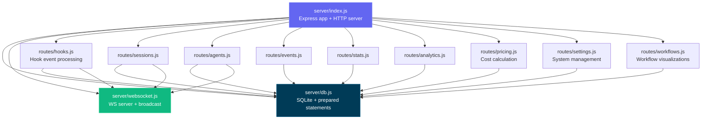
```mermaid
graph TD
    INDEX["server/index.js<br/>Express app + HTTP server"]
    DB["server/db.js<br/>SQLite + prepared statements"]
    WS["server/websocket.js<br/>WS server + broadcast"]
    HOOKS["routes/hooks.js<br/>Hook event processing"]
    SESSIONS["routes/sessions.js"]
    AGENTS["routes/agents.js"]
    EVENTS["routes/events.js"]
    STATS["routes/stats.js"]
    ANALYTICS["routes/analytics.js"]
    PRICING["routes/pricing.js<br/>Cost calculation"]
    SETTINGS["routes/settings.js<br/>System management"]
    WORKFLOWS["routes/workflows.js<br/>Workflow visualizations"]

    INDEX --> DB & WS
    INDEX --> HOOKS & SESSIONS & AGENTS & EVENTS & STATS & ANALYTICS & PRICING & SETTINGS & WORKFLOWS
    HOOKS --> DB & WS
    SESSIONS --> DB & WS
    AGENTS --> DB & WS
    EVENTS --> DB
    STATS --> DB
    ANALYTICS --> DB
    PRICING --> DB
    SETTINGS --> DB
    WORKFLOWS --> DB

    style INDEX fill:#6366f1,stroke:#818cf8,color:#fff
    style DB fill:#003B57,stroke:#005f8a,color:#fff
    style WS fill:#10b981,stroke:#34d399,color:#fff
```

---

## Routing del client

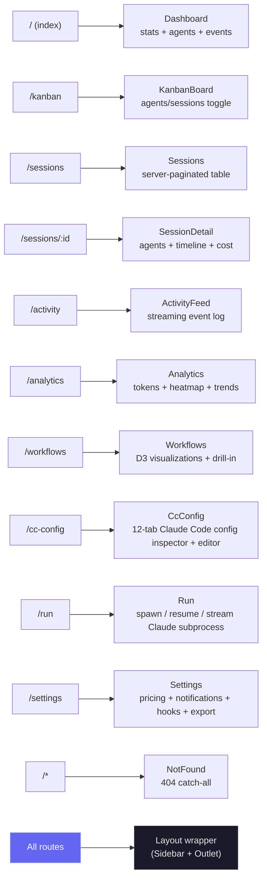
```mermaid
graph LR
    ROOT["/ (index)"] --> DASH["Dashboard<br/>stats + agents + events"]
    K["/kanban"] --> KANBAN["KanbanBoard<br/>agents/sessions toggle"]
    S["/sessions"] --> SESS["Sessions<br/>server-paginated table"]
    D["/sessions/:id"] --> DETAIL["SessionDetail<br/>agents + timeline + cost"]
    A["/activity"] --> ACT["ActivityFeed<br/>streaming event log"]
    AN["/analytics"] --> ANALYTICS["Analytics<br/>tokens + heatmap + trends"]
    WF["/workflows"] --> WORKFLOWS["Workflows<br/>D3 visualizations + drill-in"]
    CC["/cc-config"] --> CCCONFIG["CcConfig<br/>12-tab Claude Code config inspector + editor"]
    RUN["/run"] --> RUNPAGE["Run<br/>spawn / resume / stream Claude subprocess"]
    ST["/settings"] --> SETTINGS["Settings<br/>pricing + notifications + hooks + export"]
    NF["/*"] --> NOTFOUND["NotFound<br/>404 catch-all"]

    ALL["All routes"] --> LAYOUT["Layout wrapper<br/>(Sidebar + Outlet)"]

    style ALL fill:#6366f1,stroke:#818cf8,color:#fff
    style LAYOUT fill:#1a1a28,stroke:#2a2a3d,color:#e4e4ed
```

---

## Flusso del gestore degli hook

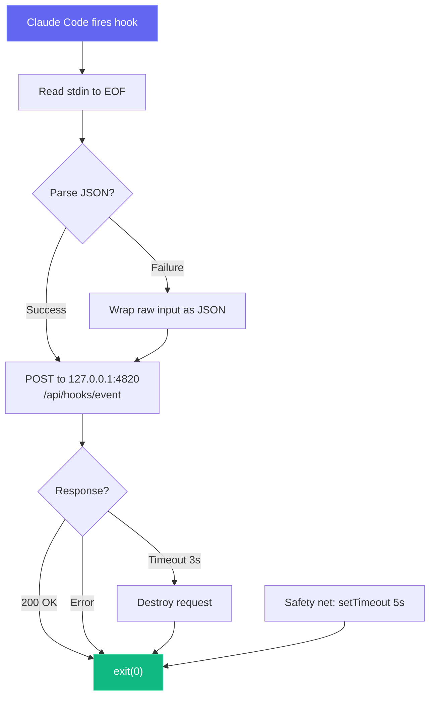
```mermaid
flowchart TD
    START["Claude Code fires hook"] --> STDIN["Read stdin to EOF"]
    STDIN --> PARSE{"Parse JSON?"}
    PARSE -->|Success| POST["POST to 127.0.0.1:4820<br/>/api/hooks/event"]
    PARSE -->|Failure| WRAP["Wrap raw input as JSON"]
    WRAP --> POST
    POST --> RESP{"Response?"}
    RESP -->|200 OK| EXIT0["exit(0)"]
    RESP -->|Error| EXIT0
    RESP -->|Timeout 3s| DESTROY["Destroy request"] --> EXIT0
    SAFETY["Safety net: setTimeout 5s"] --> EXIT0

    style EXIT0 fill:#10b981,stroke:#34d399,color:#fff
    style START fill:#6366f1,stroke:#818cf8,color:#fff
```

---

## Modalità di deployment

Supportiamo sia la modalità di deployment di sviluppo sia quella di produzione, con architetture di processo diverse:

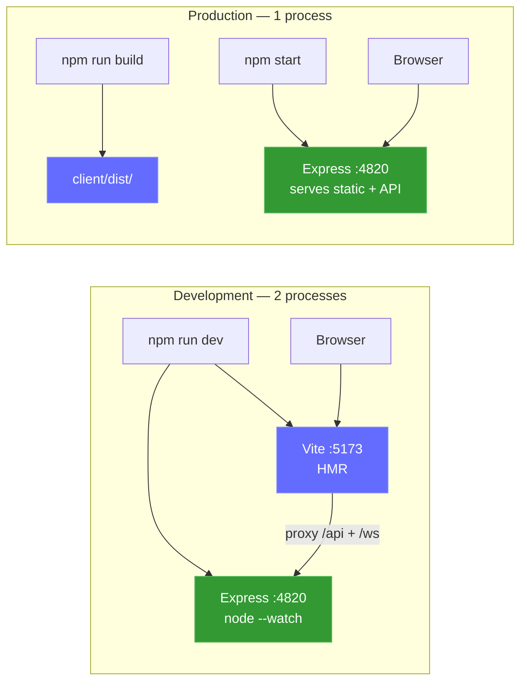
```mermaid
graph LR
    subgraph dev["Development — 2 processes"]
        D_CMD["npm run dev"] --> D_SRV["Express :4820<br/>node --watch"]
        D_CMD --> D_VITE["Vite :5173<br/>HMR"]
        D_BROWSER["Browser"] --> D_VITE
        D_VITE -->|"proxy /api + /ws"| D_SRV
    end

    subgraph prod["Production — 1 process"]
        P_BUILD["npm run build"] --> P_DIST["client/dist/"]
        P_START["npm start"] --> P_SRV["Express :4820<br/>serves static + API"]
        P_BROWSER["Browser"] --> P_SRV
    end

    style D_VITE fill:#646CFF,stroke:#818cf8,color:#fff
    style D_SRV fill:#339933,stroke:#5cb85c,color:#fff
    style P_SRV fill:#339933,stroke:#5cb85c,color:#fff
    style P_DIST fill:#646CFF,stroke:#818cf8,color:#fff
```

Sidecar MCP locale opzionale (supporta i trasporti stdio, HTTP+SSE e REPL):

```mermaid
graph LR
    subgraph "MCP Transport Options"
        M_STDIO["MCP Server (stdio)<br/>npm run mcp:start"]
        M_HTTP["MCP Server (HTTP)<br/>npm run mcp:start:http<br/>:8819"]
        M_REPL["MCP Server (REPL)<br/>npm run mcp:start:repl"]
    end

    H["MCP Host"] -->|"stdin/stdout"| M_STDIO
    RC["Remote Client"] -->|"POST /mcp · GET /sse"| M_HTTP
    OP["Operator"] -->|"interactive CLI"| M_REPL

    M_STDIO --> D["Dashboard Server<br/>:4820"]
    M_HTTP --> D
    M_REPL --> D

    style M_STDIO fill:#0f766e,stroke:#14b8a6,color:#fff
    style M_HTTP fill:#0f766e,stroke:#14b8a6,color:#fff
    style M_REPL fill:#0f766e,stroke:#14b8a6,color:#fff
```

**App desktop (macOS e Windows)** opzionale — un singolo processo Electron che ospita il server Express in-process (nessun terminale, nessun processo figlio):

```mermaid
flowchart LR
    subgraph desktop["Desktop App (macOS & Windows) — 1 Electron process"]
        E_MAIN["Electron Main Process<br/>(Node 22 / Electron 35)"]
        E_HOST["server-host.ts<br/>require() server/index.js"]
        E_SRV["Embedded Express :4820<br/>API · SQLite · WebSocket"]
        E_WIN["BrowserWindow<br/>built React client"]
        E_TRAY["Menu-bar (tray) icon<br/>+ native app menu"]
        E_MAIN --> E_HOST
        E_HOST -->|"in-process require()"| E_SRV
        E_MAIN --> E_TRAY
        E_SRV -->|"http + ws on 127.0.0.1"| E_WIN
    end

    E_HOOKS["Claude Code hooks"] -->|"POST /api/hooks/event"| E_SRV

    style E_MAIN fill:#47848F,stroke:#2f5a62,color:#fff
    style E_SRV fill:#339933,stroke:#5cb85c,color:#fff
    style E_WIN fill:#61DAFB,stroke:#3aa9c9,color:#000
```

### Deployment in cloud

Lo stack `deployments/` punta a qualsiasi servizio Kubernetes conforme, inclusi EKS, GKE, AKS, OKE e i cluster self-managed. CCAM usa SQLite, quindi ogni manifest supportato impone **un solo writer attivo della dashboard per volume persistente** con un rollout Recreate. HPA, repliche active-active, blue-green e canary sono intenzionalmente non supportati finché SQLite resta il backend di persistenza.

```mermaid
flowchart LR
  CI["CI: test · validate · scan · attest · sign"] --> HELM["Helm / Kustomize / Terraform"]
  HELM --> APP["CCAM dashboard<br/>exactly 1 replica"]
  APP --> PVC[("Retained ReadWriteOnce PVC")]
  EDGE["Ingress or Gateway API<br/>TLS + WebSocket"] --> APP
  PROM["Prometheus Operator"] -->|"Bearer /api/metrics"| APP
  MCP["Authenticated MCP sidecar"] --> APP
```

- **Helm:** un solo writer imposto dallo schema, supporto ai digest, PVC conservato, Ingress o Gateway API, mount del token compatibile con External-Secret, NetworkPolicy, MCP e ServiceMonitor opzionali.
- **Kustomize:** base con PSS restricted più overlay dev/staging/production e componenti opzionali per MCP, monitoring, Gateway API e snapshot CSI.
- **Terraform:** distribuisce il chart Helm validato su un cluster Kubernetes esistente. Networking cloud, identità del cluster, CSI, TLS e sincronizzazione dei segreti restano di competenza del provider.
- **Operazioni:** backup online SQLite coerente con SHA-256, ripristino verificato con scale-to-zero, deploy/rollback/teardown backup-first e health check autenticati.
- **Supply chain CI:** le immagini app e MCP sono scansionate, pubblicate per amd64/arm64 con SBOM e provenance SLSA, e firmate keyless con Cosign.

```bash
npm run deploy:validate
REGISTRY="ghcr.io/$(gh repo view --json owner -q .owner.login)"
IMAGE_TAG="$(git rev-parse --short HEAD)"

helm upgrade --install agent-monitor deployments/helm/agent-monitor \
  --namespace agent-monitor-production --create-namespace \
  --values deployments/helm/agent-monitor/values-production.yaml \
  --set image.registry= \
  --set image.repository=${REGISTRY}/claude-code-agent-monitor \
  --set image.tag=${IMAGE_TAG} \
  --atomic --wait --timeout 10m
```

> [!NOTE]
> La configurazione di produzione completa, i segreti, lo stack Docker/Podman, la Gateway API, Terraform, backup, ripristino e rollback sono documentati in [DEPLOYMENT.md](DEPLOYMENT.md) e [deployments/README.md](deployments/README.md).

---

## Struttura del progetto

```
agent-dashboard/
|-- CLAUDE.md                   # Memoria di progetto e accordi di lavoro per Claude Code
|-- AGENTS.md                   # Istruzioni di progetto per Codex
|-- package.json                # Script di root (dashboard + helper MCP) + dipendenze del server
|-- .claude/
|   +-- rules/                  # Regole Claude con scope sui path
|   +-- skills/                 # Skill di progetto riusabili per Claude
|   +-- agents/                 # Subagenti personalizzati Claude
|-- .claude-plugin/
|   +-- marketplace.json        # Manifest del marketplace Claude Code (14 plugin)
|-- .agents/plugins/
|   +-- marketplace.json        # Manifest del marketplace Codex (gli stessi 14 plugin)
|-- plugins/
|   |-- ccam-analytics/         # Analytics: report di sessione, ripartizione dei costi, trend di utilizzo, punteggio di produttività
|   |   |-- .claude-plugin/plugin.json
|   |   |-- skills/ (4)         # session-report, cost-breakdown, usage-trends, productivity-score
|   |   |-- agents/             # analytics-advisor (modello Sonnet)
|   |   |-- hooks/hooks.json    # Logging degli eventi Stop + SubagentStop
|   |   +-- bin/ccam-stats      # CLI di dashboard da terminale
|   |-- ccam-productivity/      # Produttività: standup, report, sprint, ottimizzatore di workflow
|   |-- ccam-devtools/          # DevTools: debug, diagnostica, export, health check
|   |   +-- bin/                # CLI ccam-doctor + ccam-export
|   |-- ccam-insights/          # Insight: pattern, anomalie, ottimizzazione, confronto
|   |-- ccam-cost-guard/        # Guardrail sui costi: budget, previsione di spesa, alert sui costi, risparmi sui modelli
|   |-- ccam-sessions/          # Forensica delle sessioni: ricerca, timeline, replay delle trascrizioni, rollup per cwd, pulizia
|   |-- ccam-workflows/         # Orchestrazione dei workflow: mappa DAG, audit delle deleghe, concorrenza, esecuzioni di flotte
|   |-- ccam-quality/           # Affidabilità e SLO: scansione degli errori, report degli errori API, audit dei fallimenti degli hook, controllo SLO
|   |-- ccam-config/            # Governance di config e memoria: audit della config, revisione della memoria, inventario di skill/MCP/hook
|   +-- ccam-dashboard/         # Connettore della dashboard: stato, statistiche rapide, integrazione MCP
|       +-- .mcp.json           # Configurazione del server MCP
|-- server/
|   |-- index.js                 # App Express, server HTTP, serving statico
|   |-- db.js                    # Schema SQLite, migrazioni, prepared statement
|   |-- websocket.js             # Server WebSocket con heartbeat
|   +-- routes/
|       |-- hooks.js             # Elaborazione degli eventi hook (transazionale)
|       |-- sessions.js          # CRUD delle sessioni
|       |-- agents.js            # CRUD degli agenti
|       |-- events.js            # Elenco degli eventi
|       |-- stats.js             # Statistiche aggregate
|       |-- analytics.js         # Analytics di token, strumenti e trend
|       |-- workflows.js         # Dati aggregati dei workflow e drill-in per sessione
|       |-- pricing.js           # CRUD del pricing dei modelli e calcolo dei costi
|       +-- settings.js          # Informazioni di sistema, gestione dei dati, export, pulizia
|   +-- lib/
|       +-- transcript-cache.js  # Cache delle trascrizioni JSONL basata su stat con lettore sincrono a chunk di byte-stream (chunk da 4 MiB, decodifica UTF-8 riga per riga) così i file più grandi della lunghezza massima di stringa di V8 (~512 MiB) vengono analizzati senza abortire Node con "FATAL ERROR: v8::ToLocalChecked Empty MaybeLocal". Estrae token, compattazioni, errori API, durate dei turni, blocchi di thinking ed extra di usage (service_tier, speed, inference_geo)
|   +-- compat-sqlite.js         # Wrapper di compatibilità node:sqlite (fallback per better-sqlite3)
|-- client/
|   |-- package.json             # Dipendenze del client
|   |-- index.html               # Entry point HTML
|   |-- vite.config.ts           # Config Vite + proxy
|   |-- tailwind.config.js       # Tema scuro personalizzato
|   |-- tsconfig.json            # TypeScript strict
|   +-- src/
|       |-- main.tsx             # Entry React
|       |-- App.tsx              # Router + provider WebSocket
|       |-- index.css            # Tailwind + utility personalizzate
|       |-- lib/
|       |   |-- types.ts         # Interfacce TypeScript condivise
|       |   |-- api.ts           # Client fetch tipizzato
|       |   |-- format.ts        # Utility di formattazione di date/orari
|       |   +-- eventBus.ts      # Pub/sub per la distribuzione del WebSocket
|       |-- hooks/
|       |   |-- useWebSocket.ts      # Hook WebSocket con auto-riconnessione
|       |   +-- useNotifications.ts  # Trigger di notifiche del browser dagli eventi WebSocket
|       |-- components/
|       |   |-- Layout.tsx       # Shell con sidebar + outlet
|       |   |-- Sidebar.tsx      # Navigazione + indicatore di connessione
|       |   |-- AgentCard.tsx    # Card informativa dell'agente con stato
|       |   |-- StatCard.tsx     # Card di metrica
|       |   |-- StatusBadge.tsx  # Pill di stato con codifica a colori
|       |   |-- EmptyState.tsx   # Placeholder per le liste vuote
|       |   +-- workflows/       # Componenti di visualizzazione dei workflow in D3.js
|       |       |-- OrchestrationDAG.tsx            # DAG orizzontale dei pattern di spawn degli agenti
|       |       |-- ToolExecutionFlow.tsx           # Diagramma d3-sankey delle transizioni strumento-strumento
|       |       |-- AgentCollaborationNetwork.tsx   # Grafo force-directed della pipeline degli agenti
|       |       |-- SubagentEffectiveness.tsx       # Griglia scorecard con anelli di successo SVG
|       |       |-- WorkflowPatterns.tsx            # Sequenze di orchestrazione auto-rilevate
|       |       |-- ModelDelegationFlow.tsx         # Instradamento dei modelli attraverso le gerarchie degli agenti
|       |       |-- ErrorPropagationMap.tsx         # Clustering degli errori per profondità di gerarchia
|       |       |-- ConcurrencyTimeline.tsx         # Esecuzione parallela degli agenti a corsie
|       |       |-- SessionComplexityScatter.tsx    # Grafico a bolle D3 (durata vs agenti vs token)
|       |       |-- CompactionImpact.tsx            # Eventi di compressione dei token e recupero
|       |       |-- WorkflowStats.tsx               # Statistiche aggregate dei workflow
|       |       +-- SessionDrillIn.tsx              # Albero degli agenti, timeline degli strumenti ed eventi per sessione
|       +-- pages/
|           |-- Dashboard.tsx      # Pagina di panoramica
|           |-- KanbanBoard.tsx    # Toggle Agenti/Sessioni, colonne per stato
|           |-- Sessions.tsx       # Tabella delle sessioni paginata lato server
|           |-- SessionDetail.tsx  # Approfondimento di una singola sessione
|           |-- ActivityFeed.tsx   # Stream degli eventi in tempo reale
|           |-- Analytics.tsx      # Uso dei token, heatmap, trend
|           |-- Workflows.tsx      # Visualizzazioni dei workflow in D3.js e drill-in di sessione
|           |-- Settings.tsx       # Pricing dei modelli, notifiche, hook, export, pulizia
|           +-- NotFound.tsx       # Pagina 404 catch-all
|-- scripts/
|   |-- hook-handler.js          # Leggero forwarder da stdin a HTTP
|   |-- install-hooks.js         # Auto-configura ~/.claude/settings.json
|   |-- import-history.js        # Importa le sessioni da ~/.claude/ con estrazione JSONL avanzata (errori API, durate dei turni, entrypoint, modalità di permessi, blocchi di thinking, extra di usage, errori degli strumenti, file JSONL dei subagenti). Il re-import è completamente incrementale: un high-water mark per tipo di evento (`MAX(created_at) GROUP BY event_type` per sessione) è calcolato in anticipo e solo le voci JSONL con `ts > cutoff[type]` vengono inserite, così le sessioni di lunga durata le cui trascrizioni crescono per più giorni continuano a ricevere eventi Stop / PostToolUse / TurnDuration / ToolError a ogni riesecuzione. Fa anche avanzare `sessions.ended_at` quando il JSONL supera il valore salvato e aggiorna i metadata del conteggio dei messaggi a ogni passaggio
|   +-- seed.js                  # Generatore di dati di esempio
|-- mcp/
|   |-- package.json             # Script + dipendenze del pacchetto MCP
|   |-- README.md                # Setup MCP, config degli host, catalogo degli strumenti, modello di sicurezza
|   |-- src/
|   |   |-- index.ts             # Entrypoint del runtime MCP (router dei trasporti)
|   |   |-- server.ts            # Assemblaggio del server MCP
|   |   |-- clients/             # Client dell'API della dashboard con retry/backoff
|   |   |-- config/              # Parsing della config da ambiente/CLI
|   |   |-- core/                # Logger, registro degli strumenti, helper dei risultati
|   |   |-- policy/              # Guardie per mutazioni/azioni distruttive
|   |   |-- tools/               # 16 moduli di dominio che registrano 97 strumenti
|   |   |-- transports/          # Server HTTP+SSE, REPL, collettore degli strumenti
|   |   |-- ui/                  # Banner ANSI, colori, formatter, tabelle
|   |   +-- types/               # Definizioni di tipo MCP condivise
|   +-- build/                   # Output compilato del runtime MCP
|-- desktop/
|   |-- package.json             # Dipendenze e script di Electron + electron-builder
|   |-- electron-builder.yml     # Config di packaging DMG; hook di firma/notarizzazione
|   |-- tsconfig.json            # TypeScript strict (src/ -> out/)
|   |-- README.md                # Riferimento di architettura dell'app desktop (documentazione contributor)
|   |-- assets/                  # icon.svg + icon.icns generato + PNG del tray
|   |-- src/
|   |   |-- main.ts              # Entry del processo main di Electron — ciclo di vita, cablaggio
|   |   |-- server-host.ts       # Boot Express in-process, discovery della porta, adozione, chiusura del DB
|   |   |-- window.ts            # BrowserWindow + geometria della finestra persistita
|   |   |-- tray.ts              # Icona nella barra dei menu (tray) + menu contestuale
|   |   |-- menu.ts              # Menu applicazione nativo (File ▸ Open Dashboard è solo macOS)
|   |   |-- login-item.ts        # Toggle di avvio automatico dei Login Items macOS (SMAppService)
|   |   |-- logger.ts            # Logger su file -> ~/Library/Logs/Claude Code Monitor/desktop.log
|   |   |-- constants.ts         # Nome dell'app, porte, timeout, dimensione della finestra
|   |   +-- preload.ts           # Intenzionalmente vuoto (zero privilegi al renderer)
|   |-- scripts/
|   |   |-- install.js           # Verifica preventiva delle dipendenze native per desktop:install; stampa aiuto di setup + esce non-zero in caso di fallimento
|   |   |-- preflight.js         # Controllo condiviso del binario better-sqlite3 + aiuto di setup pratico per OS (incl. alternativa senza toolchain)
|   |   |-- prebuild.js          # Garantisce che root + client siano compilati prima di tsc; fallisce subito con aiuto di setup se il binario nativo manca
|   |   |-- build-icons.sh       # SVG -> PNG/ICNS via qlmanage/sips/iconutil
|   |   +-- notarize.js          # Hook afterSign di electron-builder (notarizzazione opt-in)
|   +-- tests/
|       +-- smoke.test.mjs       # Avvia Electron + sonda /api/health
|-- deployments/
|   |-- README.md                # Riferimento per il deployment in produzione
|   |-- nginx/                   # Edge Nginx rootless e policy opt-in per hook/MCP
|   |-- secrets/                 # File di token/password Compose ignorati da git
|   |-- terraform/               # Deployment Helm su un cluster Kubernetes esistente
|   |-- kubernetes/              # Base Kustomize one-writer + overlay per ambiente
|   |   |-- base/                # PSS restricted, Deployment Recreate, PVC, Service, Ingress
|   |   |-- overlays/            # Namespace e risorse dev, staging, production
|   |   +-- components/          # MCP, ServiceMonitor, Gateway API, VolumeSnapshot
|   |-- helm/agent-monitor/      # Chart Helm con schema imposto e values per ambiente
|   +-- scripts/                 # Validazione, deploy, backup, ripristino, rollback, health, teardown
|-- .codex/
|   |-- config.toml              # Configurazione del runtime Codex
|   |-- README.md                # Guida di setup Codex per agenti e skill
|   |-- rules/                   # Regole di policy di esecuzione Codex
|   |-- agents/                  # Template di agenti personalizzati Codex
|   +-- skills/                  # Skill di progetto Codex
|-- statusline/
|   |-- README.md                # Guida di installazione e uso della statusline
|   |-- statusline.py            # Script Python che renderizza la statusline
|   +-- statusline-command.sh    # Wrapper shell per la config statusLine di Claude Code
+-- data/
    +-- dashboard.db             # Database SQLite (gitignored)
```

---

## Risoluzione dei problemi

| Problema                          | Soluzione                                                                                                                                                         |
| --------------------------------- | ---------------------------------------------------------------------------------------------------------------------------------------------------------------- |
| `better-sqlite3` non si installa | Non è fatale — il server ripiega automaticamente sul `node:sqlite` integrato di Node.js (Node 22+). Su versioni di Node più vecchie, installa Python 3 e gli strumenti di build C++, poi esegui `npm rebuild better-sqlite3` |
| Gli hook non scattano                  | Esegui `npm run install-hooks` e riavvia Claude Code. Verifica che gli hook esistano in `~/.claude/settings.json`                                                             |
| La dashboard non mostra dati           | Assicurati che il server sia in esecuzione (`npm run dev`) prima di avviare una sessione Claude Code. Controlla `http://localhost:4820/api/health`                                     |
| WebSocket disconnesso            | Il client si riconnette automaticamente ogni 2 secondi. Controlla che la porta 4820 non sia bloccata da un firewall                                                                    |
| Dati stantii dopo un riavvio          | Il database persiste tra i riavvii. Esegui `npm run seed` per dati demo freschi, o elimina `data/dashboard.db` per resettare                                            |
| Gli strumenti MCP non si connettono         | Conferma che l'API della dashboard sia su all'indirizzo `MCP_DASHBOARD_BASE_URL` e ricompila/avvia MCP (`npm run mcp:build`, `npm run mcp:start`)                                         |

---

## Contribuire

I contributi sono benvenuti — vedi [`.github/CONTRIBUTING.md`](.github/CONTRIBUTING.md) per la guida completa.

Tutti i contributor devono firmare il [Contributor License Agreement](https://github.com/hoangsonww/Claude-Code-Agent-Monitor/blob/master/CLA.md). È applicato automaticamente su ogni pull request dalla GitHub Action `🖋️ CLA Assistant`: la prima volta che apri una PR, un bot ti chiede di firmare commentando `I have read the CLA Document and I hereby sign the CLA`. Il check di stato **CLA Assistant** della PR resta rosso finché non lo fai, e firmare una volta copre tutti i contributi futuri.

---

## Licenza

MIT. Vedi [LICENSE](LICENSE) per i dettagli.
