# Dashboard degli agenti per Claude Code, Cursor e Codex

### Piattaforma di monitoraggio in tempo reale dell'attività degli agenti di Claude Code, Cursor e Codex 🚀

Una dashboard professionale per tracciare e visualizzare in tempo reale le sessioni degli agenti di Claude Code, Cursor e Codex, l'uso degli strumenti, la cronologia delle conversazioni, i costi e l'orchestrazione dei subagenti. Realizzata con Node.js, Express, React e SQLite, combina gli hook nativi con un rilevamento locale delle trascrizioni specifico per ciascun provider.


> [!TIP]
> Vedi anche: [README.md](./README.md) (English), [README-CN.md](./README-CN.md) (中文版本), [README-VN.md](./README-VN.md) (Phiên bản tiếng Việt), [README-KO.md](./README-KO.md) (한국어 버전), [README-ES.md](./README-ES.md) (versión en español), [README-FR.md](./README-FR.md) (version française), [README-DE.md](./README-DE.md) (deutsche Version) e [README-PT.md](./README-PT.md) (versão em português) per la documentazione localizzata con consigli e buone pratiche specifici per ogni regione.

> [!NOTE]
> Ti serve un aiuto orientato alle attività? Il [Wiki di GitHub](https://github.com/hoangsonww/Claude-Code-Agent-Monitor/wiki) è il manuale pratico per l'uso quotidiano, le operazioni di team, la risoluzione dei problemi, l'automazione CLI/MCP e le ricette di deploy. Il [Wiki statico localizzato](https://hoangsonww.github.io/Claude-Code-Agent-Monitor/wiki/) resta la presentazione del prodotto e dell'architettura in inglese, vietnamita, cinese, coreano, spagnolo, francese, tedesco, portoghese e italiano; i contratti tecnici esatti restano in [`docs/`](./docs/README.md).

---

## Indice

- [Panoramica](#panoramica)
- [Internazionalizzazione (i18n)](#internazionalizzazione-i18n)
- [Funzionalità](#funzionalità)
- [Avvio rapido](#avvio-rapido)
- [Come funziona](#come-funziona)
- [Configurazione](#configurazione)
- [Script npm](#script-npm)
- [Marketplace dei plugin](#marketplace-dei-plugin)
- [Estensioni degli agenti](#estensioni-degli-agenti)
- [Integrazione MCP](#integrazione-mcp)
- [Riferimento API](#riferimento-api)
- [Eventi hook](#eventi-hook)
- [Notifiche del browser](#notifiche-del-browser)
- [Notifica degli aggiornamenti](#notifica-degli-aggiornamenti)
- [Tabby — il gatto compagno fluttuante](#tabby--il-gatto-compagno-fluttuante)
- [Segnali acustici](#segnali-acustici)
- [Finestra dello stato della connessione](#finestra-dello-stato-della-connessione)
- [Estensione per VS Code](#estensione-per-vs-code)
- [App desktop (macOS e Windows)](#app-desktop-macos-e-windows)
- [Archiviazione dei dati](#archiviazione-dei-dati)
- [Riga di stato](#riga-di-stato)
- [Architettura del server](#architettura-del-server)
- [Routing del client](#routing-del-client)
- [Flusso del gestore degli hook](#flusso-del-gestore-degli-hook)
- [Modalità di deploy](#modalità-di-deploy)
- [Struttura del progetto](#struttura-del-progetto)
- [Risoluzione dei problemi](#risoluzione-dei-problemi)
- [Contribuire](#contribuire)
- [Licenza](#licenza)

---

## Panoramica

Traccia le sessioni, monitora gli agenti in tempo reale, visualizza l'uso degli strumenti, riproduci le conversazioni e osserva l'orchestrazione dei subagenti in un'interfaccia web professionale a tema scuro. Claude Code e Codex usano i loro hook nativi; Cursor è incluso di serie tramite i suoi eventi in diretta compatibili e il rilevamento nativo delle trascrizioni in `~/.cursor`.

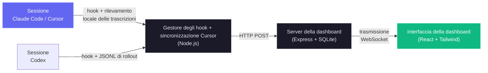

### Supporto per Cursor

Cursor non richiede alcuna configurazione separata: selezionare **Claude Code** nella schermata iniziale attiva anche il monitoraggio di Cursor. Un watcher del file system rileva `~/.cursor/chats/*/<session>/meta.json` appena `agent` si avvia, prima ancora che Cursor crei una trascrizione; le modifiche a `prompt_history.json` aggiornano la scheda della sessione, lo stato di lavoro e la conversazione non appena viene inviato un prompt. Quando arriva `~/.cursor/projects/*/agent-transcripts`, la dashboard lo unisce alla conversazione in sospeso senza duplicare il turno dell'utente, arricchisce titoli, progetti, turni e subagenti nativi e salva uno snapshot dei JSONL principali e dei subagenti, così la conversazione resta disponibile anche dopo che Cursor ha ripulito la propria cronologia.

Le schede di Cursor ricevono intestazioni native `Cursor · <title>` e sottotitoli con progetto, turni e subagenti. I costi usano una tabella **Prezzi Cursor** dedicata e modificabile nelle impostazioni (che copre Cursor Grok 4.6/4.5, Composer 2.5 e il catalogo pubblicato dei modelli di terze parti) invece di prendere in prestito le tariffe di Claude o Codex. Sovrascrivi la radice di origine con `DASHBOARD_CURSOR_HOME`; regola il polling di riserva con `DASHBOARD_CURSOR_SYNC_MS` (`0` disattiva solo la scansione periodica; l'osservazione in diretta del file system resta attiva).

Oltre alla dashboard di monitoraggio in tempo reale, il progetto include un'implementazione di server MCP locale in `mcp/` che espone un catalogo di strumenti per ispezionare e gestire la dashboard stessa, così è facile integrarne le operazioni direttamente nei tuoi flussi di Claude Code e Codex. C'è anche un livello di estensioni degli agenti, che fornisce plugin, skill e subagenti per Claude Code e Codex per interagire con la dashboard, le analisi e l'intelligence dei flussi.

### Internazionalizzazione (i18n)

L'interfaccia include il cambio di lingua integrato per inglese (`en`), cinese (`zh`), vietnamita (`vi`), coreano (`ko`), spagnolo (`es`), francese (`fr`), tedesco (`de`), portoghese (`pt`) e italiano (`it`). Un menu a discesa della lingua personalizzato evita che il selettore affolli la barra laterale man mano che si aggiungono lingue. Le risorse linguistiche vengono caricate per namespace e salvate nello storage del browser, per una preferenza stabile tra un ricaricamento e l'altro.

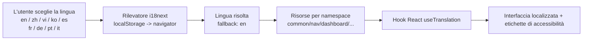

Per l'architettura completa e le indicazioni operative, vedi [docs/I18N.md](./docs/I18N.md).

### Interfaccia utente

Include un elegante tema scuro, un design responsive e una navigazione intuitiva per esplorare l'attività dei tuoi agenti:

<p align="center">
  
  <br>
  <em>📡 <strong>Dashboard · Monitoraggio</strong> — statistiche di sintesi, schede degli agenti attivi e feed dell'attività recente</em>
</p>

<p align="center">
  
  <br>
  <em>📋 <strong>Avanzamento attività · Panoramica</strong> — le schede degli agenti della dashboard e le righe di Sessioni riusano lo stesso piccolo anello di completamento accanto allo stato; hover o focus aprono un'anteprima, per responsabile, del lavoro in corso e dello stato delle attività</em>
</p>

<p align="center">
  
  <br>
  <em>🩺 <strong>Dashboard · Stato</strong> — anello del punteggio di salute complessivo, grafico ad anello del motore di archiviazione, indicatori di hit della cache, errori e successo, barre delle invocazioni degli strumenti, efficacia dei subagenti, distribuzione dei token per modello e statistiche di compattazione, il tutto aggiornato automaticamente ogni 5 s</em>
</p>

<p align="center">
  
  <br>
  <em>📋 <strong>Bacheca Kanban (agenti)</strong> — agenti raggruppati per stato in 4 colonne: Al lavoro / In attesa / Completato / Errore. La colonna gialla In attesa evidenzia le sessioni bloccate in attesa dell'utente (richieste di permesso, fine del turno o ferme su un prompt nuovo); passa il mouse su un badge In attesa per vedere <em>perché</em> (Input richiesto / Turno finito / Al prompt / Interrotto). Ogni scheda mostra a colpo d'occhio modello, costo e strumento in uso.</em>
</p>

<p align="center">
  
  <br>
  <em>🗂️ <strong>Bacheca Kanban (sessioni)</strong> — sessioni raggruppate per stato in 5 colonne: Attive / In attesa / Completate / Errore / Abbandonate, commutabili dalla stessa pagina. Passa il mouse su un'intestazione di colonna per un tooltip che spiega la transizione del ciclo di vita.</em>
</p>

<p align="center">
  
  <br>
  <em>📂 <strong>Sessioni</strong> — tabella con ricerca, filtri e paginazione lato server di ogni sessione registrata, con costo, modello, numero di agenti e durata; il selettore dei progetti supporta la selezione multipla con ricerca e l'ordinamento usa un menu personalizzato</em>
</p>

<p align="center">
  
  <br>
  <em>🤖 <strong>Dettaglio della sessione · Agenti</strong> — riquadri di sintesi in tempo reale (eventi, chiamate agli strumenti, subagenti, compattazioni, errori, durata), barre degli strumenti più usati, ripartizione per tipo di subagente, flusso dei token e albero gerarchico degli agenti</em>
</p>

<p align="center">
  
  <br>
  <em>✅ <strong>Avanzamento attività · Dettaglio della sessione</strong> — il tracker completo per responsabile unisce un anello di completamento segmentato, l'attività in corso, una barra di completamento, la ripartizione per responsabile e un elenco di attività paginato a 10 righe per pagina</em>
</p>

<p align="center">
  
  <br>
  <em>💬 <strong>Dettaglio della sessione · Conversazione</strong> — visualizzatore della trascrizione in diretta con rendering Markdown, blocchi di codice con evidenziazione della sintassi (numeri di riga + copia), chiamate agli strumenti con stile per strumento, pillole dei comandi slash con l'output TUI acquisito e marcatori di rinomina della sessione</em>
</p>

<p align="center">
  
  <br>
  <em>🔬 <strong>Dettaglio della sessione · Cronologia</strong> — cronologia degli eventi con filtri multidimensionali, raggruppamento Pre/Post per `tool_use_id` e visualizzazioni del payload adattate a ciascuno strumento</em>
</p>

<p align="center">
  
  <br>
  <em>📰 <strong>Feed attività</strong> — registro degli eventi in tempo reale con pausa / ripresa, raggruppamento, filtri multidimensionali e un pulsante "Session →" su ogni riga</em>
</p>

<p align="center">
  
  <br>
  <em>📊 <strong>Analisi</strong> — consumo di token per modello, frequenza degli strumenti, heatmap dell'attività e tendenze delle sessioni con indicatore in diretta / offline; le legende lunghe dei grafici vengono paginate mentre quelle brevi restano invariate</em>
</p>

<p align="center">
  
  <br>
  <em>🔀 <strong>Flussi</strong> — DAG di orchestrazione degli agenti, diagrammi di Sankey dell'esecuzione degli strumenti, reti di collaborazione, legende limitate generate dai dati e 11 sezioni interattive di intelligence dei flussi</em>
</p>

<p align="center">
  
  <br>
  <em>🧬 <strong>Esecuzioni dei flussi (pagina Flussi)</strong> — i "flussi dinamici" avviati dallo strumento <code>Workflow</code>, ricostruiti dai diari di esecuzione su disco: stato, numero di agenti, token e chiamate agli strumenti, espandibili in un dettaglio per agente (fase, stato, token, strumenti, durata) con anteprime leggibili dei risultati</em>
</p>

<p align="center">
  
  <br>
  <em>🧬 <strong>Esecuzioni dei flussi · espansa</strong> — un'esecuzione aperta: filtri di fase cliccabili e codificati per colore, la tabella delle metriche per agente e l'elenco completo degli elementi di risultato cliccabili, che si espandono mostrando il prompt e il risultato completi di ogni agente</em>
</p>

<p align="center">
  
  <br>
  <em>🧬 <strong>Esecuzioni dei flussi (dettaglio della sessione)</strong> — le stesse flotte collegate alla sessione che le ha avviate, così i subagenti dei flussi dinamici di una sessione e il costo in token incorporato sono visibili direttamente</em>
</p>

<p align="center">
  
  <br>
  <em>🧰 <strong>Configurazione agenti</strong> — passa dall'explorer completo di Claude Code a uno spazio di lavoro Codex in diretta per valori predefiniti, modelli, profili, MCP, progetti, skill, regole, hook, plugin e istruzioni. Le anteprime di Codex oscurano i segreti; configurazione, hook, regole, skill e istruzioni gestiti dall'utente si modificano in sicurezza, con backup.</em>
</p>

<p align="center">
  
  <br>
  <em>🧰 <strong>Explorer della configurazione di Codex</strong> — lo spazio di lavoro Codex riunisce <code>config.toml</code>, modelli dell'account, profili, server MCP, progetti, skill, hook, regole, plugin e istruzioni. Modifica i file gestiti dall'utente supportati con backup con data e ora; <code>config.toml</code> è in sola modifica.</em>
</p>

<p align="center">
  
  <br>
  <em>🧩 <strong>Explorer della configurazione di Claude · Skill</strong> — la scheda Skill elenca ogni skill rilevata (utente, progetto e plugin) con descrizione e origine, consente la ricerca sull'intero insieme e apre qualsiasi file di skill per una modifica sicura, con backup datato</em>
</p>

<p align="center">
  
  <br>
  <em>▶️ <strong>Avvia agente</strong> — scegli Claude Code o Codex ogni volta che apri il launcher. Claude mantiene i controlli Conversazione / Singola esecuzione; Codex avvia un thread nativo e interattivo dell'app-server con i propri controlli di approvazione e sandbox. I modelli di Codex provengono dal catalogo della CLI connessa, mentre Claude elenca i modelli osservati e i suoi alias supportati.</em>
</p>

<p align="center">
  
  <br>
  <em>💬 <strong>Avvia agente · streaming dal vivo</strong> — gli eventi stream-json di Claude e quelli dell'app-server di Codex vengono entrambi mostrati come una chat, inclusi ragionamento, comandi, modifiche ai file e attività degli strumenti. Le esecuzioni della dashboard ti permettono di lasciare un agente al lavoro in background e ricollegarti in seguito.</em>
</p>

<p align="center">
  
  <br>
  <em>⚙️ <strong>Impostazioni</strong> — regole di prezzo dei modelli, stato di installazione degli hook, gestione dei dati, preferenze di notifica e informazioni di sistema</em>
</p>

<p align="center">
  
  <br>
  <em>🔔 <strong>Impostazioni · Avvisi</strong> — motore di avvisi basato su regole e webhook in uscita in un unico posto: regole di avviso (pattern di eventi / inattività / agente bloccato / soglia di token) con tempo di attesa per regola, feed in diretta degli avvisi scattati e 14 provider di webhook integrati (Slack, Discord, Teams, Google Chat, Mattermost, Rocket.Chat, Telegram, PagerDuty, Opsgenie, Splunk On-Call, Zapier, Make, n8n, Pipedream), più un endpoint JSON generico con firma HMAC facoltativa</em>
</p>

<p align="center">
  
  <br>
  <em>🛰️ <strong>Impostazioni · Origini dati remote</strong> — raccogli via SSH l'attività di Claude Code e Codex da altre macchine: imposta facoltativamente percorsi indipendenti per la home remota di Claude e quella di Codex, testa ogni provider, sincronizza manualmente o con un poller in background e cambia l'ambito globale dei dati tra locale, tutte le origini o una macchina specifica, con badge di origine per sessione</em>
</p>

<p align="center">
  
  <br>
  <em>⌘ <strong>Tavolozza dei comandi</strong> — <kbd>Cmd/Ctrl+K</kbd>, da qualsiasi punto, apre l'unico launcher della dashboard. Una sola ricerca copre nove gruppi: comandi recenti, le nove pagine, ricerca delle sessioni in diretta lato server, le azioni proprie della pagina corrente, ogni directory di progetto nota, sottoviste delle pagine e filtri degli elenchi, tutte le 13 sezioni delle Impostazioni, tutte le 12 schede della Configurazione agenti e azioni per preferenze, ambito dei dati e lingua. La corrispondenza è per sottosequenza, con i caratteri trovati evidenziati, quindi <code>mcp</code> trova "MCP servers"</em>
</p>

La barra laterale dà accesso rapido a tutte e nove le pagine — Dashboard, Bacheca Kanban, elenco delle Sessioni, Feed attività, Analisi, Flussi, Configurazione agenti, Avvia agente e Impostazioni. Ogni pagina è pensata per offrirti una visione approfondita dell'attività dei tuoi agenti di Claude Code, con aggiornamenti in tempo reale e visualizzazioni ricche.

---

## Funzionalità

La dashboard offre un insieme completo di funzionalità per monitorare e analizzare le tue sessioni e i tuoi agenti di Claude Code:

> **Cursor è integrato:** CCAM rileva la cronologia nativa di Cursor in `~/.cursor/projects/*/agent-transcripts`, la arricchisce con i metadati di `~/.cursor/chats`, la memorizza come provider distinto `cursor` e salva uno snapshot delle conversazioni prima che Cursor ripulisca i propri file. Cursor è incluso ogni volta che è selezionato l'ambito Claude Code della dashboard. Le origini SSH remote per ora rispecchiano solo le home di Claude Code e Codex; monta o esponi localmente una home remota di Cursor per acquisirla con `DASHBOARD_CURSOR_HOME`.

| Funzionalità | Descrizione |
|---|---|
| **Avanzamento attività** | Tracciamento delle attività attribuito per responsabile, derivato dallo stato osservabile del provider: eventi attuali di Claude `TaskCreate` / `TaskGet` / `TaskUpdate` / `TaskList` e di ciclo di vita, il vecchio `TodoWrite` e l'`update_plan` di Codex, diretto o incapsulato da unified-exec. Le sessioni con uno stato delle attività mostrano lo stesso piccolo anello e la stessa anteprima in hover/focus resa in un portal accanto allo stato nella tabella delle Sessioni e su ogni scheda agente della Dashboard; il Dettaglio della sessione mostra il pannello di avanzamento completo con segmenti di stato, lavoro in corso, ripartizione per responsabile e righe di attività paginate a 10 per volta. L'avanzamento si limita all'ultimo lavoro di primo livello: un nuovo turno umano di Claude o una nuova attività di Codex senza tracker emesso azzera lo stato precedente, e lo stato incompleto viene scartato quando quel turno/attività termina senza un aggiornamento finale. La cronologia interamente completata resta visibile. |
| **Dashboard** | Due schede salvate in `localStorage`: **Monitoraggio** — statistiche di sintesi (6 schede), schede degli agenti attivi con gerarchia dei subagenti comprimibile e feed dell'attività recente il cui numero di elementi riempie l'altezza disponibile tramite `ResizeObserver`. **Stato** — anello del punteggio composito di salute del sistema (ponderato: 0,4 × tasso di successo + 0,25 × tasso di hit della cache + 0,25 × (100 − tasso di errore) + 0,1 × (100 − % di heap)), grafico ad anello del motore di archiviazione con la distribuzione dei record, indicatori di prestazioni della cache / tasso di errore / tasso di successo, grafico a barre orizzontali delle invocazioni degli strumenti (top 8), barre di efficacia dei subagenti, distribuzione dei token per modello e statistiche sull'impatto della compattazione. Tutte le metriche di salute si aggiornano ogni 5 s da `/api/settings/info` e `/api/workflows`. Tooltip che seguono il cursore, con rilevamento dei bordi della finestra, su ogni grafico |
| **Bacheca Kanban** | Due viste con un selettore nell'intestazione (salvato in `localStorage`): **Agenti** — 4 colonne (Al lavoro / In attesa / Completato / Errore) — e **Sessioni** — 5 colonne (Attive / In attesa / Completate / Errore / Abbandonate). La colonna **In attesa** corrisponde direttamente allo stato persistito `waiting` degli agenti — impostato quando Claude Code è fermo a un prompt (sessione nuova, tra un turno e l'altro o bloccato da una Notification di permesso) e che passa a `working` appena l'utente riprende (UserPromptSubmit / PreToolUse). Ogni intestazione di colonna mostra un tooltip `?` che spiega le transizioni del ciclo di vita. Le schede vengono recuperate dal server per stato persistito (in pratica senza limiti per stato), poi paginate lato client a 10 schede per colonna con un pulsante "Mostra altro". La sottoscrizione WS si limita alla vista attiva (frame `agent_*` o `session_*`), così gli aggiornamenti fuori vista non provocano nuovi caricamenti. I badge In attesa mostrano l'`awaiting_reason` della riga in un tooltip al passaggio del mouse — **Input richiesto** (`notification`), **Turno finito** (`stop`), **Al prompt** (`session_start`), **Interrotto** (`interrupted`) — solo come tooltip sulle schede compatte, per lasciare spazio ai titoli; le superfici più ampie (tabella delle Sessioni, intestazione del dettaglio della sessione) mostrano anche il motivo in linea come chip annidato, con i motivi urgenti (richieste di permesso, interruzioni) in un ambra più acceso |
| **Sessioni** | Tabella con ricerca, filtri e **paginazione lato server** di ogni sessione registrata. Ogni clic di pagina chiama `/api/sessions?status=&q=&limit=10&offset=…`, così il calcolo dei costi riguarda solo la pagina visibile — indipendentemente da quante sessioni ci siano nel database. La prima pagina include anche la stessa riga locale, in memoria, di avvio di Codex mostrata in Dashboard e Kanban; è visibile subito ma non navigabile finché un ID di sessione durevole non la sostituisce, e non modifica né i totali durevoli né la paginazione. La casella di ricerca (`q=`) esegue sul server una corrispondenza senza distinzione tra maiuscole e minuscole su `id` / `name` / `cwd` con debounce di 300 ms, e la risposta contiene un conteggio `total` per il paginatore. Filtro di stato, ricerca e paginazione si combinano. Il **nome** leggibile di ogni sessione viene letto dalla trascrizione e mantenuto sincronizzato in tempo reale — un titolo esplicito da `/rename`, `claude -n` o dal `Ctrl+R` del selettore (la riga JSONL `custom-title`) ha sempre la precedenza; altrimenti subentra l'`ai-title` generato automaticamente; altrimenti il **primo prompt dell'utente** della sessione (troncato, ignorando il rumore dei risultati degli strumenti e dei comandi slash) riempie il nome provvisorio e il nome/attività provvisori dell'agente principale — così anche le sessioni che non ricevono mai un titolo (comprese quelle importate) dicono cosa stanno facendo; la dashboard mostra quel nome (o, in mancanza, l'ID breve) sulle schede, nella Dashboard, nel Feed attività e nel selettore di ripresa di Avvia agente. |
| **Dettaglio della sessione** | Pannello di sintesi in tempo reale per sessione con banner dell'agente attivo (strumento + attività in corso), sei contatori (eventi con frequenza al minuto, chiamate agli strumenti, subagenti, compattazioni, errori, durata che scorre), barre degli strumenti più usati, ripartizione per tipo di subagente, striscia impilata del flusso di token e nuvola di pillole dei tipi di evento — il tutto aggiornato in diretta a ogni evento hook. Sotto: albero gerarchico degli agenti, cronologia completa degli eventi con filtri multidimensionali (stato, tipo di evento, strumento, agente, ricerca testuale, intervallo di date), raggruppamento Pre/Post per `tool_use_id`, blocco di riepilogo leggibile, visualizzazioni di input/risposta adattate allo strumento (terminale per Bash, diff unificato per Edit, codice numerato per Read/Write, elenco di corrispondenze per Grep, scheda chiave/valore per gli strumenti MCP) e una scheda Conversazione che mostra le trascrizioni — inclusi i messaggi digitati a metà turno (messi in coda mentre Claude stava ancora lavorando), collocati dove Claude li ha effettivamente ricevuti, con le notifiche dell'harness attribuite a System — con Markdown (titoli, elenchi, citazioni, tabelle, elenchi di attività), blocchi di codice con evidenziazione della sintassi (js/ts, python, json, bash, html, css, sql, yaml, diff) con numeri di riga e copia negli appunti, e chiamate agli strumenti con stile per strumento (Bash → terminale, Edit → vecchio/nuovo affiancati, Write → etichetta del file, Read → chip del percorso, Grep → scheda del pattern). Quando la sessione è bloccata in attesa della persona, un **banner giallo di attesa input** sotto l'intestazione indica l'`awaiting_reason`, la sua spiegazione e da quanto tempo la sessione è in attesa (punto pulsante + tempo relativo); il badge In attesa dell'intestazione riporta lo stesso motivo come chip annidato |
| **Feed attività** | Registro degli eventi in streaming in tempo reale con pausa/ripresa, filtri multidimensionali (la stessa barra degli strumenti del Dettaglio della sessione, più un filtro Sessione), paginazione "Carica altro" gestita dal server, aggiornamento in diretta con debounce che rispetta i filtri e mantiene la dimensione di pagina caricata, selettore di raggruppamento, prefisso di origine progetto › sessione › subagente, un pulsante "Session →" per riga e un badge di stato per riga preso dall'unica mappatura condivisa con la Dashboard e il Dettaglio della sessione (per i tipi di evento sia di Claude sia di Codex) |
| **Analisi** | Consumo di token, frequenza degli strumenti, heatmap dell'attività (centrata, allineata ai giorni della settimana a partire dalla domenica, tooltip con il nome del giorno), tendenze delle sessioni, indicatore di connessione in diretta/offline. Mentre i dati di analisi si caricano, l'area dei grafici (non solo i riquadri delle statistiche) mostra **scheletri pulsanti** che riproducono il layout dei grafici, così la pagina non mostra mai grafici vuoti o a zero. Le legende lunghe in Analisi e Flussi vengono paginate; quelle che stanno in una pagina restano invariate |
| **Tavolozza dei comandi** | Launcher globale `Cmd/Ctrl+K` su **tutta** la dashboard. Una sola ricerca copre nove gruppi: comandi eseguiti di recente, le nove route della barra laterale (confrontate sulle etichette **tradotte**, quindi funziona in ogni lingua), ricerca delle sessioni in diretta lato server tramite `/api/sessions?q=` (con debounce e rispetto dell'ambito, così non mantiene mai lato client un indice obsoleto di migliaia di sessioni), le azioni proprie della pagina corrente, ogni directory di progetto nota, ogni sottovista delle pagine e filtro degli elenchi, tutte le 13 sezioni delle Impostazioni, tutte le 12 schede della Configurazione agenti e azioni per preferenze, ambito dei dati, lingua, cronologia e operazioni di pagina. L'ordinamento si basa sulla corrispondenza per sottosequenza con i caratteri trovati evidenziati, quindi `mcp` trova "MCP servers" e `kbrd` trova "Kanban Board"; un `>` / `@` / `#` iniziale restringe ad azioni / pagine / sessioni. Interamente utilizzabile da tastiera — frecce, `Home`/`End`, `PageUp`/`PageDown`, `Tab` tra i gruppi, `Enter`, `Escape` — e si degrada in silenzio se la ricerca delle sessioni fallisce. Non avendo un pulsante permanente, la scoperta passa da suggerimenti che si ritirano da soli: la schermata iniziale mostra la scorciatoia al primo avvio e un chip `⌘K` compare nei campi di ricerca di Sessioni e Configurazione agenti, ed entrambi spariscono per sempre dopo la prima apertura della tavolozza. Un comando visualizzato è un comando che funziona: le azioni di pagina vengono lette dal registro degli handler attivo, quindi non compaiono mai dove non farebbero nulla, e tutto ciò che cambia uno stato senza spostarti si conferma con un toast. Le operazioni distruttive sono volutamente assenti: la tavolozza ti porta lì, ma non le esegue mai |
| **Una sola scorciatoia** | `Cmd/Ctrl+K` è l'unica combinazione di tasti riservata dalla dashboard, ed è attiva anche quando un campo ha il focus. Una versione precedente includeva un intero livello di scorciatoie — sequenze di navigazione con prefisso `g`, tasti di pagina, un promemoria `?`, una sovrimpressione di suggerimenti tenendo premuto un modificatore — ed è stato rimosso di proposito: una sequenza è una modalità nascosta con un timer, premere `g` sembrava non fare nulla e due meccanismi di navigazione dividevano la memoria muscolare senza alcun vantaggio, visto che la tavolozza raggiunge già ogni pagina con la ricerca approssimata. Tabby mantiene il suo storico `Cmd/Ctrl+B` |
| **Aggiornamenti in diretta** | Push via WebSocket — nessun polling, aggiornamento istantaneo dell'interfaccia |
| **Rilevamento automatico** | Sessioni e agenti vengono creati automaticamente dai segnali dei provider. Claude Code crea subito una scheda **In attesa** al `SessionStart`. Codex espone prima una scheda **In attesa** locale, in memoria, appena si avvia il suo processo TUI interattivo, anche prima di assegnare un ID di sessione stabile. Un hook, una riga di thread in diretta o un rollout crea poi la sessione durevole e sostituisce quella scheda temporanea. Se l'utente apre il selettore Resume di Codex e sceglie un thread esistente, CCAM rileva il rollout o il lock di scrittura già aperto da quel preciso PID di Codex e passa alla sessione ripresa durevole prima del primo nuovo messaggio. Questo passaggio adotta solo un thread il cui record durevole è già terminato e avviene una volta per processo, così un turno che Codex sta ancora guidando mantiene lo stato di lavoro e il motivo di attesa riportati dal suo rollout. La scheda precedente all'identità non viene mai scritta in SQLite, nella cronologia, nelle analisi, nei prezzi, nei flussi, negli avvisi o nelle notifiche di completamento, e scompare quando il processo termina. |
| **Importazione della cronologia** | L'importazione della cronologia, consapevole del provider, acquisisce le trascrizioni di Claude Code da `~/.claude/` e i JSONL di rollout di Codex da `~/.codex/sessions`. Ogni scheda ha il proprio percorso predefinito, istruzioni, scansione delle cartelle e flusso di caricamento; entrambe riusano la loro logica di acquisizione in diretta, preservano il conteggio di token, costi e strumenti e sono idempotenti. I rollout di Codex esterni vengono copiati nello storage della dashboard, così la conversazione resta disponibile anche dopo la rimozione dell'archivio o della cartella di origine. |
| **Gerarchia dei subagenti** | Albero padre-figlio comprimibile degli agenti in Dashboard e nel Dettaglio della sessione. Gli agenti con subagenti mostrano frecce di espansione/compressione; gli agenti foglia mostrano un punto. Si espande automaticamente quando i subagenti sono attivi |
| **Agenti in background** | Traccia correttamente i subagenti mandati in background, senza segnarli come completati in anticipo |
| **Attribuzione degli strumenti dei subagenti** | Le chiamate agli strumenti interne ai subagenti (Read, Bash, Edit, Grep, …) esistono solo nei file JSONL di ciascun subagente — Claude Code non emette hook per esse. A ogni `SubagentStop` la dashboard avvia, senza attendere, un passaggio `scanAndImportSubagents` che analizza ogni `subagents/agent-*.jsonl`, abbina i blocchi `tool_use` al rispettivo `tool_result` tramite `tool_use_id` ed emette eventi `PreToolUse` + `PostToolUse` sotto l'`agent_id` del subagente stesso. È idempotente (deduplicazione `data LIKE '%"tool_use_id":"X"%'`) e si unisce a una riga di subagente creata in diretta da un hook quando corrisponde per tipo + ora di inizio entro 30 s, così non vengono create righe parallele `<sid>-jsonl-*`. Lo stesso percorso viene eseguito nell'importazione all'avvio di `npm run setup` per un recupero storico completo — le sessioni precedenti alla dashboard ottengono cronologie complete degli strumenti per subagente. Feed attività e Dettaglio della sessione mostrano la catena dei genitori come `main › coder › explorer` per i subagenti annidati. Questa catena viene ricostruita in modo affidabile da `reconcileSubagentParents`: la riga di un subagente viene prima inserita piatta sotto l'agente principale (un singolo evento hook o file JSONL non porta l'identità di chi l'ha generato), poi il generatore viene recuperato dal risultato dello strumento Task di ogni trascrizione di subagente (`toolUseResult.agentId`, acquisito come `spawnedChildren`), così un subagente che genera propri subagenti si annida sotto il suo **vero** generatore invece di essere appiattito a un livello sotto main. Idempotente e additivo — reindirizza solo `parent_agent_id`, senza mai inserire o eliminare righe — viene eseguito nella stessa scansione di `SubagentStop`, che restituisce un conteggio `reparented` così la dashboard ricarica anche quando è stato solo il ricollegamento a cambiare la forma dell'albero |
| **Tracciamento dei costi** | Stima dei costi per modello con regole di prezzo configurabili e dettaglio per sessione. Supporta **tariffe di lancio a tempo limitato** (`intro_*` + `intro_until` su una regola di prezzo): l'uso fino alla data limite inclusa è calcolato alla tariffa di lancio e quello successivo alla tariffa standard, così le offerte temporanee restano corrette per l'uso passato **e** futuro — l'endpoint dei costi valorizza l'uso di ogni giorno alla tariffa in vigore in quella data. Claude Sonnet 5 resta a $2/$10 per milione di token di input/output come tariffa standard. **Le tariffe di lancio sono interamente modificabili nelle Impostazioni** — l'editor dei prezzi dei modelli espone una data di fine promozione e prezzi di lancio per categoria (input / output / lettura cache / scrittura cache 5 min e 1 h), così una futura promozione di lancio non richiede modifiche al codice, solo una modifica ai valori. **Le schede dei subagenti mostrano il costo PROPRIO di ciascun subagente** (derivato dal consumo di token della sua trascrizione e valorizzato alle tariffe attuali), non il totale della sessione — una scheda dell'agente principale rappresenta l'intera sessione e ne mostra il totale, mentre una scheda di subagente mostra solo quanto ha speso quel subagente, così non sembra più, in modo fuorviante, che sia costata l'intera sessione. Il conteggio dei token consapevole della compattazione preserva i totali attraverso le compressioni del contesto. Le letture delle trascrizioni sono memorizzate in cache con aggiornamenti incrementali per offset di byte, per un'estrazione efficiente dei token |
| **Cache delle trascrizioni** | Estrazione in tempo reale dalle trascrizioni JSONL: token, compattazioni, errori API (voci `isApiErrorMessage` salvate come eventi `APIError`), durate dei turni (salvate come eventi `TurnDuration`), numero di blocchi di ragionamento ed extra di utilizzo (service_tier, speed, inference_geo). Le durate dei turni hanno identità di trascrizione stabili; le analisi complete riparano vecchie righe duplicate e totali di metadati gonfiati, mentre le analisi di coda limitate restano in sola aggiunta. Gli array crescenti di ogni voce sono limitati in coda a `TRANSCRIPT_CACHE_MAX_ARRAY_LEN` (predefinito `1000`, configurabile) — sia durante l'analisi sia alla finalizzazione — così neanche una sessione che dura giorni può far crescere senza limiti una voce della cache. Ogni voce memorizza solo `{mtimeMs, size, bytesRead, result}`, quindi non c'è una copia ombra degli stessi dati al livello superiore e dentro `result`. I metadati della sessione vengono arricchiti con questi campi in tempo reale |
| **Notifiche** | Pipeline Web Push (VAPID) completa per una consegna affidabile. Arrivano anche con la scheda in background o il browser chiuso. Configurate esplicitamente per l'audio su macOS. Interruttori configurabili per evento, con gestione delle sottoscrizioni |
| **Avvisi** | Motore di avvisi basato su regole — configurato interamente in **Impostazioni → Avvisi e notifiche**, un centro di controllo a schede **Regole / Canali / Attività** (nessuna pagina separata). Definisci regole di avviso con quattro tipi di condizione — **pattern di eventi** (corrispondenza su tipo di evento / nome dello strumento / testo del riepilogo, richiedendo facoltativamente N eventi corrispondenti in una finestra temporale, ad es. "più di 5 errori in 2 minuti"), **inattività** (sessione attiva senza eventi da N minuti), **agente bloccato** (agente fermo in `working`/`waiting` senza attività da N minuti) e **soglia di token** (token totali della sessione oltre un limite). Le regole guidate dagli eventi vengono valutate lato server a ogni acquisizione di hook (dopo la transazione di acquisizione — gli avvisi non possono mai rallentare né far fallire la consegna degli hook); le regole temporali vengono eseguite in una scansione ogni 60 s. Gli avvisi scattati vengono salvati in `alert_events` con **deduplicazione per tempo di attesa** per regola + per sessione (predefinito 300 s), trasmessi come messaggi WebSocket `alert_triggered` e mostrati nel feed in diretta della scheda **Attività**, con conferma / conferma tutti, un filtro "solo non confermati" e link "Vedi sessione" per avviso. Le regole si attivano/disattivano ed eliminano la propria cronologia a cascata. Gli avvisi scattati vengono inoltre inviati a **destinazioni webhook universali** configurate nella scheda **Canali** — **14 provider integrati** più un endpoint generico: **Slack**, **Discord**, **Microsoft Teams**, **Google Chat**, **Mattermost**, **Rocket.Chat** (payload di chat nativi); **Telegram** (Bot API), **PagerDuty** (Events API v2), **Opsgenie** (Alert API + autenticazione GenieKey), **Splunk On-Call** (REST di VictorOps); e **Zapier**, **Make**, **n8n**, **Pipedream** o qualsiasi endpoint **generico** (busta JSON pulita con firma **HMAC-SHA256** facoltativa e intestazioni personalizzate). Ogni provider è descritto da un registro lato server che dichiara il suo formattatore di payload, come viene risolto il suo URL (alcuni lo derivano dalle credenziali — ad es. Telegram dal token del bot, Opsgenie dalla regione —, altri usano un valore predefinito) e quali campi di credenziali mostra l'interfaccia. Le destinazioni supportano una limitazione facoltativa per regola, una sonda sincrona "Invia test" e un registro delle consegne. La consegna avviene separata dal percorso degli avvisi, con timeout di richiesta e tentativi ripetuti con backoff limitato, quindi non può mai rallentare né bloccare il monitoraggio; URL di destinazione, segreti e campi di credenziali sono salvati lato server e mai restituiti dall'API (mascherati/oscurati in ogni risposta) |
| **Notifica degli aggiornamenti** | Il server esegue periodicamente un `git fetch` non bloccante e confronta il checkout locale con `origin/master`/`origin/main`/`origin/HEAD`. Quando l'upstream è più avanti, l'interfaccia mostra una finestra con il comando esatto `git pull && npm run setup` e un pulsante **Copia** con un clic; la barra laterale riceve un pulsante permanente "Controlla aggiornamenti" con badge in diretta. La dashboard non esegue mai pull né si riavvia da sola — l'utente lancia il comando in un terminale —, quindi il meccanismo non può rompere le sessioni di sviluppo, interferire con la supervisione di pm2/systemd/Docker né lasciare processi orfani |
| **Impostazioni** | Informazioni di sistema, stato degli hook, gestione dei prezzi dei modelli, preferenze di notifica, esportazione **e ripristino** dei dati (la modalità **Ripristina backup** del pannello Importazione della cronologia accetta un `.json` esportato fino a 25 MiB e lo reimporta in modo idempotente senza sovrascrivere le righe esistenti, così puoi riunire la cronologia di più macchine in un'unica dashboard), pulizia delle sessioni. La sezione Prezzi dei modelli separa **Prezzi dei modelli Anthropic Claude** da **Prezzi dei modelli OpenAI GPT**, con intestazioni uguali, pulsanti **Ripristina predefiniti** e **Aggiungi modello** per provider e popover informativi che spiegano la ricerca della regola per prima corrispondenza, la sintassi del carattere jolly `%` in stile SQL, gli aggiornamenti manuali dei prezzi e le avvertenze sulle tariffe API. Il popover GPT spiega anche le unità in USD per milione di token, la soglia Short/Long di 272K per le tariffe Standard e Fast e perché i livelli non pubblicati restano senza prezzo invece di essere stimati. Il controllo **Dati della dashboard** ricarica subito sessioni, agenti, eventi, token, flussi, analisi e costi per Claude Code, Codex o entrambi. I campi separati della home di Claude Code e di Codex sono interamente gestiti dall'i18n e si salvano a runtime; salvare quello di Codex riattiva l'osservazione dei rollout in diretta e ne scansiona il nuovo albero. |
| **Avvia agente + Configurazione agenti** | `/run` inizia con la scelta tra Claude Code e Codex e mantiene il selettore del provider accanto allo stato In diretta. Le esecuzioni di Claude mantengono le modalità headless e conversazione stream-json; quelle di Codex usano il protocollo locale `app-server` della CLI per un vero thread interattivo, la politica nativa di approvazione/sandbox, ripresa, arresto, output in diretta e ricollegamento. Le scelte dei modelli di Codex arrivano direttamente dalla CLI connessa, quindi i nuovi modelli non richiedono aggiornamenti della dashboard; Claude mostra i suoi alias durevoli più i modelli osservati localmente, perché la sua CLI non ha un comando per elencare i modelli. `/cc-config` affianca l'explorer modificabile di Claude Code già consolidato a uno spazio di lavoro Codex per valori di configurazione predefiniti, cache dei modelli, profili, MCP, progetti, skill, regole, hook, plugin installati e file di istruzioni. Le sue anteprime normali oscurano i segreti; l'editor locale esplicito supporta `config.toml`, `hooks.json`, regole utente, skill e istruzioni con salvataggi atomici e backup obbligatori con data e ora, avvisando che non può convalidare la sintassi. I comandi dei profili di Codex e i percorsi degli artefatti gestiti si copiano con un clic, e le schede dei plugin usano il registro dei plugin installati di Codex invece di mostrare le cartelle di cache. Entrambi gli explorer si aggiornano tramite il proprio watcher del file system specifico per provider. |
| **Configurazione agenti Codex** | La parte Codex della Configurazione agenti legge l'intero catalogo dei modelli dell'account locale, senza il limite generico di anteprima che poteva mostrare erroneamente zero modelli, e include sempre le sovrascritture di base e di profilo. Crea direttamente nell'app overlay Codex standard `<name>.config.toml`; ogni scheda copia con un clic il suo comando esatto `codex --profile <name>` e apre un editor protetto. I percorsi di anteprima vengono canonicalizzati prima dei controlli di contenimento. L'editor rifiuta componenti di percorso con link simbolici sotto la radice attendibile, verifica il contenimento canonico della cartella padre e rifiuta contenuti di anteprima `[redacted]`. Profili, hook, regole, skill e istruzioni condividono le azioni in stile Claude **Vedi sorgente / Copia percorso / Modifica / Elimina**. Ogni eliminazione consentita viene confermata e preceduta da un backup (una skill conserva l'intera directory); `config.toml` è permanentemente in sola modifica. |
| **Server MCP (locale)** | Server MCP locale completo in `mcp/` con tre modalità di trasporto (stdio, HTTP+SSE, REPL interattiva) e 97 strumenti tipizzati in 16 moduli di dominio. Copre osservabilità, sessioni/agenti/eventi per ambito, trascrizioni e immagini, prezzi di Claude/Cursor/GPT, flussi, avvisi, webhook, importazioni e ripristino dei backup, configurazione di Claude/Codex, Avvia agente, origini remote, hook/home/aggiornamenti, push e manutenzione. Le modalità protocollo e REPL condividono un unico catalogo convalidato, con destinazioni limitate a localhost e protezioni a livelli per modifiche e azioni distruttive. L'HTTP diretto in loopback può portare un token bearer; gli alias host di container con token richiedono HTTPS. I reindirizzamenti vengono rifiutati, i caricamenti sono limitati a 50 MiB per file e 100 MiB per chiamata, le risposte binarie a 10 MiB e il ripristino dei backup a 25 MiB |
| **Flussi** | Pagina di visualizzazione basata su D3.js con 11 sezioni interattive: DAG di orchestrazione degli agenti, diagramma di Sankey dell'esecuzione degli strumenti, rete di collaborazione, efficacia dei subagenti (sparkline per giorno della settimana con tooltip resi in un portal che sfuggono all'`overflow:hidden` della scheda e restano entro la finestra, così non vengono mai tagliati), pattern di flusso rilevati, flusso di delega tra modelli, mappa di propagazione degli errori (barre orizzontali con badge di tasso, ripartizione per tipo di agente, schede degli errori API/sessione), cronologia della concorrenza, dispersione della complessità delle sessioni, analisi dell'impatto della compattazione (ridisegnata come un chiaro istogramma delle "sessioni per numero di compattazioni" con titoli degli assi, riquadri statistici — totale / sessioni coinvolte / media / picco —, una riga di aiuto esplicativa e tooltip per barra) e approfondimento per sessione. Il sottotitolo allineato a destra di ogni sezione sta su una sola riga (puntini di sospensione + titolo al passaggio del mouse), così una traduzione lunga non manda mai a capo l'intestazione. **Tooltip ricchi e localizzati ovunque:** il titolo di ogni grafico ha un'icona `i` che apre un popover strutturato "Cosa mostra / Come leggerlo / Perché conta"; passando il mouse su nodi, archi, barre e bolle compaiono tooltip in più sezioni con interpretazioni deterministiche che dipendono dai valori (ad es. percentuali di quota sull'origine / sulla destinazione, fasce di salute del tasso di successo, descrizioni delle famiglie Opus / Sonnet / Haiku, schemi temporali come a inizio / metà / fine sessione). Ciascuna delle sei schede statistiche principali ha un popover informativo in basso a destra che spiega come viene calcolata la metrica e cosa significa il suo valore attuale in parole semplici. I tooltip vengono modificati nel DOM tramite una sola ref per grafico, con fallback `mouseleave` a livello di contenitore, così non restano mai indietro rispetto al cursore né rimangono bloccati dopo un nuovo rendering. Cliccando una riga in **Pattern di flusso rilevati** si espande sul posto un pannello di dettaglio con la sequenza completa dei passaggi, una griglia di statistiche, una descrizione deterministica (rilevamento dei cicli, fascia di frequenza) e un suggerimento pratico. Le schede di filtro per stato (Solo attive / Completate / Tutte) filtrano tutte le 11 sezioni. Filtro incrociato, esportazione JSON e aggiornamento automatico in tempo reale via WebSocket con debounce di 3 secondi. Un pannello **Esecuzioni dei flussi** mette in evidenza i "flussi dinamici" — le flotte di subagenti avviate dallo strumento `Workflow` (e dal `/loop` a ritmo autonomo) — che non emettono hook e vengono quindi ricostruiti dai diari di esecuzione su disco (`workflows/wf_<runId>.json`): ogni esecuzione mostra le sue fasi e un dettaglio per agente di token / chiamate agli strumenti / durata, con rilevamento in diretta dello stato `running` prima che il diario venga scritto e una sottosezione collegata in ogni pagina di Dettaglio della sessione |
| **Tracciamento delle compattazioni** | Rileva gli eventi `/compact` nelle trascrizioni JSONL e crea agenti ed eventi di compattazione. Recupera le compattazioni precedenti all'avvio. Uno scanner periodico (cadenza derivata da `DASHBOARD_STALE_MINUTES`) intercetta le compattazioni anche quando nessun hook scatta. Legge il percorso della trascrizione di ogni sessione attiva direttamente da `sessions.transcript_path` (compilato dal gestore degli hook al primo evento che lo contiene, più un recupero una tantum da `events`) invece di eseguire un `SELECT DISTINCT json_extract(events.data, '$.transcript_path')` sull'intera tabella degli eventi — così la scansione è O(sessioni attive) e resta economica anche su un database maturo. Condivide la cache delle trascrizioni, senza letture duplicate dei file. Le righe di compattazione sintetiche ricevono la marca temporale della trascrizione sia in `started_at` sia in `ended_at`, così la durata è esattamente 0 (la compattazione è istantanea); una migrazione di riparazione all'avvio sistema anche le righe esistenti in cui `ended_at < started_at` (issue #156) |
| **Sottosessioni / sessioni riprese** | Riattiva automaticamente le sessioni quando arrivano nuovi eventi e gestisce correttamente `/resume` e le sessioni orfane. Una scansione periodica (ogni ¼ di `DASHBOARD_STALE_MINUTES`, limitata tra 60 s e 5 min) segna le sessioni abbandonate che sfuggono al rilevamento basato sugli eventi |
| **Rilevamento delle sessioni preesistenti** | Le sessioni già in esecuzione all'avvio del server vengono importate come "attive" (in base alla modifica recente del file JSONL). Anche gli eventi Stop riattivano le sessioni importate completate/abbandonate, così il primo hook di una sessione in corso la fa sempre comparire nella dashboard |
| **Sincronizzazione continua dei progetti** | L'importazione automatica di `~/.claude/projects` all'avvio avviene una sola volta (controllata da un marcatore), quindi una cartella di progetto creata **dopo** il primo avvio — le cui sessioni non passano mai dagli hook (ad es. con gli hook disattivati sull'host) — resterebbe invisibile fino a una nuova scansione manuale. Una sincronizzazione in background (`startSessionSync`) colma questa lacuna con tre trigger che condividono una cache degli mtime + un'unica scansione accorpata: una scansione **immediata** all'avvio, un **`fs.watch`** con debounce che scatta nell'istante in cui compare un nuovo file di sessione o cartella di progetto (ricorsivo su macOS/Windows; radice + figli diretti su Linux per evitare i rischi del watcher ricorsivo in userland) e un **polling periodico** (`DASHBOARD_SESSION_SYNC_MS`, predefinito 30 s). Ogni scansione rianalizza solo i file il cui mtime è avanzato e trasmette `session_created`/`session_updated` (più l'agente principale) così l'interfaccia si aggiorna in diretta; una sessione invariata già nel DB viene saltata senza rianalisi, quindi il costo di un riavvio resta O(file nuovi/modificati) |
| **Origini dati remote** | Raccolta in diretta di Claude Code e Codex su macchine remote / multiple via SSH. Un'origine replica in modo indipendente `~/.claude/projects` e `~/.codex/sessions` (più il leggero `session_index.jsonl` di Codex per i titoli rinominati nativi) tramite **scp**, oppure `wsl.exe` + `tar` per CLI ospitate in WSL su un host SSH Windows. Ogni fase isolata passa dall'importatore normale del proprio provider e contrassegna le righe con `sessions.source`; un'origine è sana quando almeno uno dei provider è disponibile, quindi funzionano macchine solo Claude, solo Codex e miste. Il poller `DASHBOARD_REMOTE_SYNC_MS` da 15 s e i recuperi immediati all'aggiunta/riattivazione trasmettono `remote_source.status`, `remote_data.updated` e aggiornamenti per sessione consapevoli del provider. Il ciclo di vita remoto viene riconciliato da ogni trascrizione replicata. Se un provider non è disponibile, è in errore o resta bloccato in sincronizzazione oltre `DASHBOARD_STALE_MINUTES`, solo le sue vecchie sessioni remote ricadono nella normale scansione di inattività; un provider vicino sano resta gestito dalla replica. Configura percorsi facoltativi e indipendenti per **Home Claude remota** e **Home Codex remota** in **Impostazioni → Origini dati remote** oppure usa `ccam remote-sources`; l'autenticazione SSH resta interamente sull'host (nessuna password o segreto memorizzato). |
| **Acquisizione tramite push remoto** | Il terzo percorso di acquisizione dei dati di sessione, per la macchina che SSH non può raggiungere: un portatile in movimento dietro NAT o una connessione domestica con CGNAT **invia** i propri dati di sessione alla dashboard invece di farseli prelevare. `POST /api/hooks/ingest-batch` accetta un batch per invio — contatori di token (ogni voce è il totale corrente completo di quel contatore, come in una rianalisi della trascrizione), eventi degli strumenti e durate dei turni — ed è l'unica route del server pensata per essere raggiungibile da Internet. Per questo è **disattivata finché non viene impostato `REMOTE_PUSH_TOKEN`** (altrimenti `503 REMOTE_PUSH_NOT_CONFIGURED`), protetta da un proprio token anziché da `DASHBOARD_HOOK_TOKEN`, così il rafforzamento delle route hook in loopback non la apre mai come effetto collaterale, e rifiuta `?token=` perché la credenziale non finisca in un log di accesso di un proxy. Gli elementi vengono deduplicati per `(session_id, event_type, uuid)`, sia rispetto alle righe già salvate sia all'interno dello stesso batch, quindi un nuovo invio è sicuro; un batch è limitato a 1000 elementi (`413 BATCH_TOO_LARGE`); e un `session_id` che appartiene già a una sessione locale o prelevata via SSH viene rifiutato elemento per elemento (`SESSION_LOCALLY_OWNED`) invece di poterla dirottare — una sessione inviata può solo creare una nuova sessione o aggiungere dati a una che ha creato lei stessa. I fallimenti parziali restituiscono `200` con `errors[]` per elemento, e la trasmissione avviene dopo il commit della transazione. |
| **Design responsive** | Layout adatti ai dispositivi mobili con griglie impilabili, tabelle scorrevoli e barra laterale comprimibile |
| **Localizzazione dell'interfaccia** | Cambio di lingua integrato tramite menu a discesa personalizzato, con testi dell'interfaccia ed etichette di accessibilità tradotti in inglese (`en`), cinese (`zh`), vietnamita (`vi`), coreano (`ko`), spagnolo (`es`), francese (`fr`), tedesco (`de`), portoghese (`pt`) e italiano (`it`). La copertura arriva fino in fondo ai tooltip dei Flussi: calcoli delle schede statistiche e interpretazioni per fascia di valore, popover "Cosa / Come leggerlo / Perché" di ogni grafico, il tooltip in hover di ogni grafo (orchestrazione, flusso degli strumenti, pipeline, delega tra modelli, concorrenza), le descrizioni e i suggerimenti del pannello di dettaglio dei pattern di flusso, il popover informativo Impostazioni → Prezzi dei modelli, il pannello CLAUDE_HOME e l'intero flusso di Importazione della cronologia. |
| **Dati di esempio** | Script integrato di dati di esempio per demo e sviluppo |
| **Riga di stato** | Riga di stato della CLI con codici colore che mostra modello, uso del contesto, branch git, token per direzione e costo della sessione (USD) |
| **Formattazione dei nomi dei modelli** | Nomi dei modelli leggibili in tutta l'interfaccia: identificatori grezzi come `claude-opus-4-7-20260101` o `claude-opus-4-7[1m]` vengono mostrati come "Claude Opus 4.7" o "Claude Opus 4.7 (1M)". Gestisce le famiglie Claude, GPT e Gemini con unione automatica delle versioni tramite punto, rimozione dei suffissi di data/latest, rimozione del prefisso del provider e formattazione dell'etichetta della finestra di contesto. La pagina Impostazioni mantiene i nomi grezzi per configurare le regole di prezzo |
| **Marketplace di plugin Claude + Codex** | Un unico albero sorgente di 14 plugin fornisce i manifest canonici di Claude, i manifest Codex `.codex-plugin/plugin.json`, entrambi i cataloghi del marketplace, 66 skill di plugin incluse, 18 subagenti Claude, 34 comandi Claude, 3 utility CLI e i metadati delle skill OpenAI. La CLI skills.sh rileva in totale 77 skill del repository con `npx skills add hoangsonww/Claude-Code-Agent-Monitor --list`. Installa con `claude plugin marketplace add`, `codex plugin marketplace add` o `npx skills add` |
| **Avvia Claude** | Avvia sottoprocessi `claude` direttamente dalla dashboard con un'interfaccia di streaming in stile chat. Due modalità: **Conversazione** (più turni — stdin resta aperto e i turni successivi vengono inviati come buste stream-json) e **Singola esecuzione** (headless, un prompt → una risposta). La modalità Conversazione permette anche di **riprendere qualsiasi sessione esistente** tramite `claude --resume <id>` — scegli dall'intera cronologia delle sessioni con un selettore con ricerca. La finestra unificata esecuzioni attive / cronologia offre anche due pulsanti di accesso diretto senza configurazione: **Riprendi**, su qualsiasi conversazione passata, avvia subito `claude --resume <id>` e precompila la chat con la trascrizione precedente, così arrivi nella vista in diretta con tutto il contesto (non serve riscrivere un prompt — il processo resta in attesa su stdin finché non invii un seguito); **Visualizza**, su qualsiasi esecuzione singola passata, carica la trascrizione acquisita nel visualizzatore in sola lettura (nessun avvio — stesso pannello, senza controlli Stop/seguito). Il selettore delle esecuzioni attive nell'intestazione ti permette di lasciare un'esecuzione in background, avviarne un'altra e ricollegarti in seguito. Il ricollegamento è durevole: il client riconcilia il registro delle buste in memoria del launcher (`?envelopes=1`) con la trascrizione JSONL della sessione su disco e preferisce quella con più messaggi utente/assistente, così allontanarsi da un'esecuzione ripresa e tornarci mantiene visibile tutta la cronologia precedente (il launcher vede solo i turni successivi all'avvio; il file di trascrizione contiene quelli precedenti + quelli attuali). Menu dei modelli (Opus 4.7 / 1M / Sonnet 4.6 / Haiku 4.5 / personalizzato), selettore della modalità di permesso con avviso esplicito per `bypassPermissions`, campo **impegno di ragionamento** (low / medium / high — collegato a `--effort`), completamento automatico del cwd precompilato con la **directory home** dell'utente — una posizione di avvio neutra che non eredita il contesto di progetto `.claude` del repository della dashboard (agenti, skill, regole, `CLAUDE.md`, `.mcp.json`); ripiega sul cwd della dashboard se non è disponibile alcun suggerimento di home, con la home elencata per prima nei gruppi di suggerimenti (home → dashboard → recenti). Vero streaming carattere per carattere tramite `--include-partial-messages`, più un **livello di levigatura a macchina da scrivere** lato client che rilascia ogni `text_delta` / `thinking_delta` tramite `requestAnimationFrame`, così anche le risposte brevi (in cui claude raggruppa l'intera risposta in uno o due blocchi) sembrano digitate. Il codice di unione preserva il flag `_streaming` e l'array `content` accumulato dai delta quando la busta `assistant` canonica di claude arriva a metà flusso, così i blocchi di ragionamento non vanno persi al completamento. Il dispatch WebSocket avvolge ogni busta in `flushSync` perché il batching automatico di React non accorpi raffiche di delta in un solo rendering. **Parità con la TUI (livello 1)**: un **banner delle limitazioni** comprimibile che si riduce a una sottile pillola (senza mai sparire) e spiega cosa la modalità stream-json può e non può fare rispetto alla TUI del terminale; un **editor di prompt con completamento automatico dei comandi slash** con punteggio a livelli (nome esatto → inizia con → inizio di parola → contiene → sottosequenza → descrizione contiene) che elenca i comandi utente / progetto / plugin (eseguiti lato client tramite espansione del modello prima dell'invio) e mostra i comandi CLI integrati come `/clear`, `/model`, `/config` con un badge "Solo CLI — non si esegue da qui"; **riferimenti a file con `@`** con ricerca approssimata e debounce nel cwd dell'esecuzione (ignorando `node_modules`, `.git`, `dist`, `build` ecc.); un **indicatore in diretta della finestra di contesto / dei token** che mostra i token di input + output + lettura cache e il costo corrente, calcolato dalle buste `stream_event` e `result.usage` durante lo streaming in diretta e dai blocchi `usage` finalizzati dell'assistente (input / output / lettura cache / creazione cache) quando viene inizializzato da una trascrizione in ripresa / visualizzazione / ricollegamento, così l'indicatore si riempie subito invece di restare a 0/200k. La barra di avanzamento passa dall'indaco all'ambra e al rosso all'80% / 95% del limite di contesto del modello; un'**intestazione di stato** con modello attivo, impegno, modalità di permesso, cwd, ID della sessione, numero di buste e tempo trascorso. I menu di completamento automatico si aprono verso l'alto per non sovrapporsi al selettore del cwd sottostante. Indicatore In diretta / Offline accanto al titolo. Una protezione same-origin sulla route impedisce avvii involontari dal browser. La concorrenza è in pratica illimitata per impostazione predefinita (tetto di sicurezza di 10000 per evitare fork bomb causate da un client difettoso; la TUI del terminale non ha limiti, e nemmeno noi). Imposta `RUN_MAX_CONCURRENT` se vuoi un limite reale. Le sessioni avviate attivano gli stessi hook di qualsiasi processo `claude`, quindi compaiono automaticamente in Sessioni / Analisi / Kanban / Flussi — e Sessioni / SessionDetail mostrano un badge / banner verde **▶ Run** che riporta alla pagina Avvia per ogni sessione attualmente pilotata da lì |
| **Explorer della configurazione di Claude** | Un ispettore a 12 schede in `/cc-config` per tutto ciò che Claude Code conosce: skill, subagenti, comandi slash, stili di output, plugin (con il numero di contributi per plugin + autore/licenza/homepage da `plugin.json`), marketplace (con il numero di plugin letto da ogni `marketplace.json`), server MCP, hook (con l'elenco degli script in `~/.claude/hooks/`), impostazioni (un riepilogo immediato **Configurazione attuale** delle opzioni controllate da `/config` — modello, verbose, tema, stile di output, impegno, compattazione automatica, notifiche, … — risolte tra gli ambiti utente/progetto/progetto locale, con le opzioni non impostate mostrate con il valore predefinito, più la vista strutturata chiave-valore per file + selettore per il JSON grezzo, con oscuramento delle chiavi segrete), memoria (i file `CLAUDE.md` di utente + progetto **e anche** la memoria per progetto basata su file — ogni `*.md` in `~/.claude/projects/<slug>/memory/`, cioè un indice `MEMORY.md` più un file per ogni fatto memorizzato, spesso più di 100; raggruppati per progetto in sezioni comprimibili che separano i file di indice dai file dei fatti, con una casella di ricerca e link cliccabili dell'indice `MEMORY.md` che portano al file del fatto corrispondente — scorrimento + evidenziazione), scorciatoie da tastiera (raggruppate per contesto con chip `<kbd>`) e riga di stato (configurazione + contenuto dello script). I percorsi letti e le loro radici consentite vengono canonicalizzati con `realpath`, così i link simbolici non possono uscire dalle radici attendibili di Claude. Per le superfici di file di testo a basso rischio (skill / agenti / comandi / stili di output / memoria — compresi i file di memoria automatica per progetto) la pagina permette di **creare / modificare / eliminare con backup obbligatori con data e ora**, scritti in modo atomico fuori dalle directory che Claude Code scansiona, più una finestra Backup con comandi di ripristino `mv` generati automaticamente. Plugin, MCP, hook nelle impostazioni e file `settings.json` restano in sola lettura, con banner esplicativi + comandi CLI copiabili, così l'utente sa esattamente quale comando eseguire da solo. **Aggiornamenti in diretta**: un `cc-watcher` lato server usa `fs.watch` su `~/.claude/` (ricorsivo dove la piattaforma lo supporta) più `~/.claude.json`, con debounce di 500 ms, per trasmettere un messaggio WebSocket `cc_config_changed` ogni volta che la configurazione di Claude Code cambia — tramite modifiche dalla dashboard o strumenti esterni (la CLI che installa un plugin, la modifica manuale di `settings.json`, l'aggiunta di una nuova skill). La pagina si iscrive e ricarica automaticamente; una pillola In diretta / Offline accanto al titolo mostra lo stato del WebSocket |
| **Tabby** | Un gatto compagno fluttuante fissato nell'angolo in basso a destra di ogni pagina. Costruito interamente sull'`eventBus` WebSocket esistente — **nessun nuovo backend, nessuna chiave API, nessuna nuova dipendenza**. Una mascotte SVG reattiva con occhi che seguono il cursore e **otto stati d'animo** derivati dal flusso delle sessioni in diretta (`idle`, `watching`, `happy`, `worried`, `stuck`, `thinking`, `sleeping`, `disconnected`), ciascuno con la propria animazione (colpo di coda, orecchie dritte, cenno del capo, tremore, scintille, zzz, avviso "!"). **Fumetti automatici** pubblicano brevi battute, limitate e accorpate, sugli eventi rilevanti (sessione avviata/terminata, errori, esecuzione completata) e possono essere silenziati. Clicca sul gatto o premi **⌘B / Ctrl+B** (Esc chiude) per aprire un **pannello** con una riga di stato in diretta (`N live · M errored · connection state`), azioni rapide (vai ad Avvia Claude / Attività / Sessioni / sessioni con errori, silenzia i fumetti, cancella gli avvisi) e una casella **Chiedi**: le domande semplici sullo stato ("cosa è in esecuzione", "ci sono errori", "stato") ricevono una risposta locale dai dati in cache, mentre qualsiasi altra domanda viene passata alla pagina **Avvia Claude** (link diretto a `/run?prompt=…`) per avviare una vera sessione di Claude Code. Accessibile (utilizzabile da tastiera, fumetti `aria-live`, rispetta `prefers-reduced-motion`), ripiega in sicurezza su uno stato tranquillo `disconnected` se il socket è giù, attivabile nelle **Impostazioni** (localizzato in en/zh/vi/ko/es/fr/de/pt/it). L'implementazione si trova in `client/src/components/Tabby/` |
| **Segnali acustici** | Riscontro sonoro discreto sull'attività in diretta, **attivo per impostazione predefinita** e completamente disattivabile. Ogni segnale è **sintetizzato nel browser con la Web Audio API** — oscillatori più inviluppi di guadagno, quindi **nessun file audio da scaricare e nessuna nuova dipendenza**. Sette segnali coprono il ciclo di vita delle sessioni: una quinta ascendente all'avvio di una sessione, un arpeggio maggiore risolutivo quando una ha finito di rispondere, una morbida terza minore discendente sugli errori, un breve pizzico per l'avvio di un subagente, una campana stonata per le notifiche di Claude Code, una salita/discesa di due note quando la connessione in diretta torna o cade, e un tic appena udibile su pulsanti e link. I segnali sono **limitati in frequenza** (tempo di attesa per segnale più un budget globale di raffica), passano da un filtro passa-basso per restare in secondo piano rispetto al tuo lavoro e restano muti fino alla tua prima interazione con la pagina (politica di riproduzione automatica dei browser). **Impostazioni → Suono** offre un interruttore generale, un cursore del volume e un interruttore per ogni segnale con anteprima istantanea; le preferenze vengono salvate in `localStorage` sotto `agent-monitor-sound` (localizzato in en/zh/vi/ko/es/fr/de/pt/it). L'implementazione si trova in `client/src/lib/sound.ts` e `client/src/hooks/useSoundCues.ts` |
| **Progressive Web App (PWA)** | Tre PWA indipendenti — dashboard, landing page e wiki —, ognuna con il proprio Web App Manifest e Service Worker. Installane una qualsiasi nella schermata home / nel dock per un'esperienza autonoma, senza la cornice del browser. Il SW della dashboard serve i bundle di Vite con hash del contenuto sotto `/assets/` con strategia cache-first (gli URL sono immutabili per build, quindi gli hit di cache sono sempre corretti) e tratta tutto il resto — navigazioni, il SW stesso, `manifest.json`, icone, la radice `/` — con strategia network-first e ripiego sulla cache. Insieme a intestazioni `Cache-Control` esplicite nel middleware statico di Express in produzione (`immutable` per `/assets/*`, `no-cache, must-revalidate` per `index.html`, `sw.js`, `manifest.json`), una nuova build sostituisce sempre il bundle nel browser senza ricaricamento forzato; un listener `controllerchange` nel client ricarica esattamente una volta quando un nuovo SW prende il controllo di una pagina già controllata. La pipeline delle notifiche push VAPID è preservata. I SW della landing page e del wiki mettono in cache in anticipo la rispettiva struttura e le immagini alla prima visita, consentendo l'accesso offline dopo un solo caricamento. Tutti i manifest usano icone SVG (`favicon.svg`) con `sizes="any"` per i browser moderni e includono i meta tag `apple-mobile-web-app-capable` + `apple-touch-icon` per la modalità standalone su iOS |
| **App desktop (macOS e Windows)** | App desktop nativa facoltativa realizzata con Electron 35, nello spazio di lavoro `desktop/` accanto a `client/`, `server/`, `mcp/` e `vscode-extension/`. Distribuita come `.app` per macOS (`.dmg`) **e** come `.exe` per Windows (installer NSIS + versione portatile senza installazione). Incorpora il server Express esistente **nello stesso processo** (fa `require()` di `server/index.js` — nessun processo figlio, nessun IPC) e mostra il client React compilato in una `BrowserWindow`. Aggiunge una barra del titolo nativa, un'icona nella barra dei menu / area di notifica (tray) il cui menu, con un clic, mostra un'**istantanea dello stato in diretta** (sessioni, agenti, eventi di oggi) letta da SQLite al momento del clic, un menu applicativo nativo, avvio automatico all'accesso (elementi di login di macOS tramite `SMAppService`; `HKCU\…\Run` per utente su Windows), una **finestra di conferma per ⌘Q / Ctrl+Q** (una seconda pressione la salta), la chiusura della finestra che la nasconde mentre il server continua a girare, un blocco di istanza singola e le azioni del tray **Apri nel browser**, **Riavvia il server** e **Mostra i log**. Preferisce la porta 4820 (ripiega su 4821–4829, poi su una porta alta casuale), adotta una dashboard sana già attiva sulla 4820 invece di effettuare un doppio bind e **convive con la dashboard web** — `npm run dev` e l'app desktop possono funzionare insieme, con gli hook che alimentano entrambe. Le notifiche compaiono come toast nativi del sistema (Web Push non funziona in modo affidabile dentro Electron). Al primo avvio con server proprio installa automaticamente gli hook di Claude Code e avvia i servizi in background, così chi si limita a installarla vede arrivare gli eventi senza alcuna configurazione manuale. Vedi [`DESKTOP.md`](./DESKTOP.md) e [`desktop/README.md`](./desktop/README.md) |
| **Risorse self-hosted (niente CDN)** | Ogni font e script viene servito localmente, quindi la dashboard e la documentazione fanno **zero richieste a CDN di terze parti** — funzionano completamente offline e non rivelano nulla a host esterni. L'app React include Inter + JetBrains Mono tramite [`@fontsource`](https://fontsource.org/) (sottoinsieme latino; Vite genera in fase di build WOFF2 con hash del contenuto in `dist/assets/`, nessun `<link>` a Google Fonts). La landing page e il wiki caricano un foglio `@font-face` self-hosted `fonts/fonts.css` dalla directory `fonts/` nella radice del repository. Il Mermaid del wiki è incluso localmente come `wiki/mermaid.min.js` (l'autentico `mermaid@10.9.6` minificato) invece di jsDelivr, e la pagina di errore dell'estensione per VS Code ripiega su uno stack di font di sistema. Non resta alcuna chiamata a `fonts.googleapis.com`, `fonts.gstatic.com` o `cdn.jsdelivr.net` |
| **Schermata iniziale della sessione** | Una breve schermata con il marchio al caricamento dell'app (una volta per sessione del browser): un **saluto in base all'ora** (Buongiorno / Buon pomeriggio / Buonasera / Si lavora fino a tardi), uno slogan in grassetto, due sottotesti e un logo animato a grafo di nodi su uno sfondo scuro e suggestivo (bagliore radiale + costellazione che si sposta + grana). Interamente localizzata (en/zh/vi/ko/es/fr/de/pt/it). La sovrapposizione è **opaca fin dal primo rendering**, così l'app non traspare mai, resta visibile circa 2,5 s e poi svanisce; un clic in qualsiasi punto la salta, e rispetta `prefers-reduced-motion`. Animazioni solo CSS, nessuna dipendenza aggiunta |

> **Ambito dei provider e home:** le Impostazioni mantengono coerente ovunque la scelta compatibile con Claude (Claude Code + Cursor) / Codex / Entrambi. Le home di Claude Code e Codex restano modificabili senza riavviare la dashboard; Cursor viene rilevato automaticamente da `~/.cursor` o `DASHBOARD_CURSOR_HOME`.
>
> **Limiti di sicurezza locali:** Avvia agente accetta qualsiasi directory di lavoro assoluta esistente e la canonicalizza prima dell'uso, così gli avvii dalla home e dai progetti recenti restano supportati. I provider di webhook ospitati richiedono HTTPS; le destinazioni generiche e n8n possono usare HTTP per ricevitori locali/self-hosted, e la consegna non segue mai i reindirizzamenti.

---

## Avvio rapido

### Prerequisiti

- **Node.js** >= 22.22.0 (consigliata la 24 LTS)
- **npm** >= 9.0.0

### 1. Installare

```bash
git clone https://github.com/hoangsonww/Claude-Code-Agent-Monitor.git
cd Claude-Code-Agent-Monitor
npm run setup
```

### 2. Configurare gli hook di Claude Code

```bash
npm run install-hooks
```

L'installer apre una selezione multipla interattiva: usa le frecce, <kbd>Spazio</kbd> e <kbd>Invio</kbd> per scegliere **Claude Code**, **Codex (beta)** o entrambi (Claude Code è preselezionato). Le voci di Claude Code si trovano in `~/.claude/settings.json`; quelle di Codex in `~/.codex/hooks.json`. Se un set di hook della dashboard selezionato esiste già, avvisa prima di sostituire solo le voci di questa dashboard — gli hook non correlati vengono preservati. Puoi fare la stessa scelta in seguito in **Impostazioni → Configurazione degli hook → Installa hook**.

Al primo accesso alla dashboard scegli l'origine dei dati; l'app verifica la presenza degli hook solo per quella selezione. Claude Code richiede gli hook di Claude, Codex quelli di Codex, ed Entrambi richiede entrambi i set. Quando tutti i set richiesti sono già installati, la dashboard si apre subito. Altrimenti la schermata di configurazione elenca e installa solo i provider selezionati mancanti, preservando gli hook non correlati e lasciando che un controllo di stato fallito ripieghi in sicurezza sulla configurazione manuale.

Anche i rollout di Codex in `~/.codex/sessions` vengono rilevati di continuo. La dashboard legge in modo incrementale il loro JSONL in sola aggiunta, dà priorità ai rollout più recenti e isola un file storico difettoso per riprovare in seguito, così sessioni, token, costi, righe di conversazione e aggiornamenti WebSocket restano aggiornati anche se una notifica di hook va persa.

I record del ciclo di vita dei rollout di Codex guidano gli stessi stati delle schede in diretta di Claude Code: `user_message` e `task_started` segnano l'agente principale come **Al lavoro**; `task_complete` lascia la sessione attiva ma mostra **In attesa**; e `turn_aborted` mostra **In attesa** con un motivo di interruzione. Un nuovo record di rollout ripara da solo una sessione segnata per errore come completata. Sugli host locali supportati, l'attività viene associata al preciso `rollout-*.jsonl` tenuto aperto da ciascun processo di Codex, così i vecchi rollout che condividono una directory di progetto vengono importati come completati invece di apparire come agenti attivi fantasma. Il launcher Node e il suo processo figlio nativo di Codex vengono uniti in un unico processo logico, quindi una TUI produce una sola scheda.

I titoli `/rename` di Codex vengono letti dal suo indice nativo delle sessioni e aggiornano in tempo reale le schede di sessione e di agente. La riproduzione della conversazione include i turni umani oltre alle chiamate e agli output dello strumento personalizzato `exec`, con paginazione a cursore che carica i messaggi più vecchi in cima alla trascrizione.

Le schede di Claude Code e Codex mostrano, sotto il titolo nativo del provider, una cronologia compatta su due righe degli ultimi prompt umani distinti, così un nome breve o un seguito laconico non nascondono mai l'attività in corso. Claude aggiorna questo contesto dalla propria cache locale delle trascrizioni durante gli hook in diretta, le importazioni e le scansioni di controllo; Codex lo aggiorna dai record di rollout e ripiega sugli eventi `user_message` salvati per le importazioni più vecchie. La trascrizione mostra gli allegati PNG/JPEG/GIF/WebP salvati di Claude Code e Codex quando disponibili, mentre le copie duplicate di risposte/eventi di Codex vengono unite in un unico turno umano.

Le invocazioni degli strumenti `response_item` di Codex vengono indicizzate una sola volta tramite un cursore di rollout dedicato, così il flusso degli strumenti di Flussi, l'approfondimento per sessione, i totali per modello/token e i conteggi di `context_compacted` riflettono i dati registrati di Codex senza riprodurre i contatori del ciclo di vita o dei token. In un ambito della dashboard solo Codex, il pannello dei diari dei flussi dinamici, esclusivo di Claude Code, viene nascosto invece di essere presentato come dati Codex vuoti.

### 3. Avviare

```bash
# Development (hot reload on both server and client)
npm run dev

# Production (single process, built client)
npm run build && npm start
```

> [!TIP]
> **Alternativa con Makefile** — tutti i comandi sono disponibili anche tramite `make`, se è installato sul tuo sistema. Esegui `make help` per vedere ogni target, oppure usa scorciatoie come `make dev`, `make build`, `make test` ecc.

### 4. Aprire

| Modalità | URL |
| ----------- | ----------------------- |
| Sviluppo | `http://localhost:5173` |
| Produzione | `http://localhost:4820` |

### 5. Facoltativo: eseguire il server MCP locale

```bash
npm run mcp:start              # stdio (default — for MCP host integration)
npm run mcp:start:http         # HTTP + SSE server on port 8819
npm run mcp:start:repl         # interactive CLI with tab completion
ccam mcp stdio                 # stable launcher used by bundled plugins
```

`npm run setup` installa e compila il pacchetto MCP prima di collegare `ccam`. Per la modalità stdio, configura il tuo host con il comando `ccam` e gli argomenti `["mcp", "stdio"]`.

Per la modalità HTTP, punta i client MCP remoti a `http://127.0.0.1:8819/mcp` (Streamable HTTP) o `http://127.0.0.1:8819/sse` (SSE legacy).

Vedi [mcp/README.md](./mcp/README.md) per la configurazione completa dell'host, i dettagli sul trasporto, le opzioni di sicurezza e il catalogo degli strumenti.

### Facoltativo: dati dimostrativi

```bash
npm run seed
```

Crea 8 sessioni di esempio, 23 agenti e 106 eventi così puoi esplorare subito l'interfaccia.

### Alternativa: app desktop (macOS e Windows)

Se preferisci non tenere aperto un terminale, installa l'**app desktop nativa** facoltativa. Incorpora il server nello stesso processo, aggiunge un'icona nella barra dei menu / area di notifica (tray) e supporta l'avvio automatico all'accesso (elementi di login di macOS / avvio di Windows).

La via più rapida è **scaricare un installer già pronto** dall'[ultima Release su GitHub](https://github.com/hoangsonww/Claude-Code-Agent-Monitor/releases/latest) (la CI pubblica automaticamente una `vX.Y.Z` ogni volta che la versione in `package.json` viene incrementata su `master`):

- **macOS** — scarica `ClaudeCodeMonitor-<version>-arm64.dmg` (Apple Silicon) o `-x64.dmg` (Intel) e trascina **Claude Code Monitor.app** in `/Applications`.
- **Windows** — scarica `ClaudeCodeMonitor-Setup-<version>-x64.exe` (installer) o `ClaudeCodeMonitor-<version>-x64-portable.exe` (senza installazione) ed eseguilo.

Per compilarla da solo:

```bash
npm run desktop:install        # install Electron + electron-builder into desktop/ (preflights native deps; prints setup help on failure)
npm run desktop:dmg:arm64      # macOS: fast single-arch DMG (Apple Silicon)
npm run desktop:win            # Windows: NSIS installer .exe (run on Windows)
```

La documentazione completa dell'app desktop — download, installazione, funzioni del tray/menu, comandi di build e firma — è nella sezione [App desktop (macOS e Windows)](#app-desktop-macos-e-windows) più avanti. Vedi anche [`DESKTOP.md`](./DESKTOP.md) (guida utente) e [`desktop/README.md`](./desktop/README.md) (architettura).

### Alternativa: Docker / Podman

L'immagine OCI e i file Compose supportano Docker e Podman. Il runtime gira senza root, rinuncia a tutte le capability, usa Tini come PID 1, include Git/OpenSSH/SQLite ed è in sola lettura tranne che per `/app/data`, `/app/config` e `/tmp`.

```bash
# Dashboard only
docker compose up -d --build
# or
podman compose up -d --build

# Complete stack: dashboard + authenticated MCP + Nginx + Prometheus + Grafana
umask 077
openssl rand -hex 32 > deployments/secrets/dashboard-token
openssl rand -hex 32 > deployments/secrets/hook-token
openssl rand -hex 32 > deployments/secrets/mcp-token
openssl rand -base64 32 > deployments/secrets/grafana-admin-password
npm run docker:full:up
```

Tutte le porte dell'host sono associate al loopback per impostazione predefinita: dashboard `4820`, MCP `8819`, Nginx `8080`, Prometheus `9090` e Grafana `3000`. Le home di Claude e Codex sono montate in sola lettura; volumi con nome mantengono SQLite e la configurazione propria della dashboard. Nginx fa da proxy per l'interfaccia, l'API REST autenticata e il WebSocket, mentre hook, metriche e MCP restano bloccati al bordo a meno che non vengano abilitati esplicitamente. Il target Docker facoltativo `agent-runtime` aggiunge CLI di Claude Code e Codex con versioni fissate per flussi di Avvia agente nativi del container.

> [!IMPORTANT]
> Installa gli hook di Claude Code/Codex sull'host dopo l'avvio del container. Per hook remoti nel cloud, imposta `CCAM_DASHBOARD_URL=https://...` e un `CCAM_HOOK_TOKEN` separato; gli URL degli hook fuori dal loopback richiedono HTTPS. Vedi [DEPLOYMENT.md](DEPLOYMENT.md).

---

## Come funziona

La dashboard si integra con Claude Code tramite il suo sistema di hook nativo per monitorare in tempo reale l'attività degli agenti. Ecco una panoramica dell'architettura e del flusso dei dati:

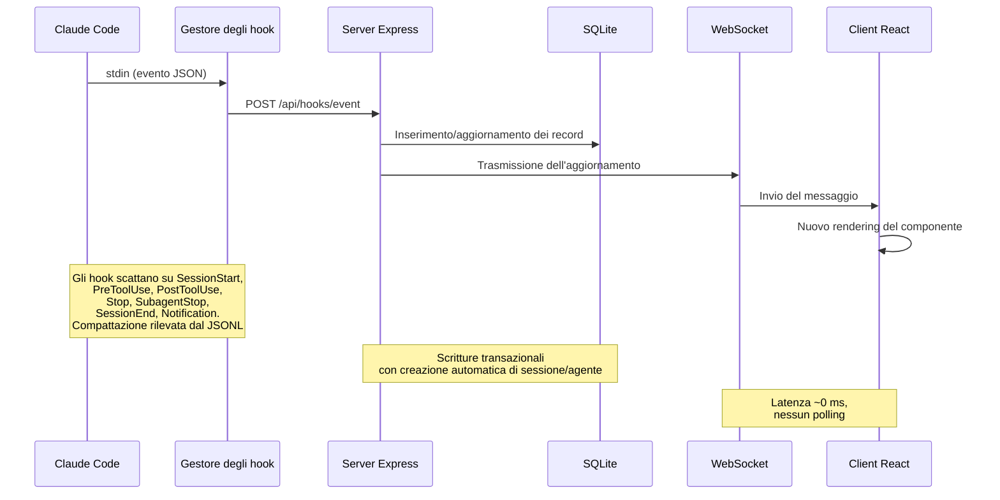

> [!IMPORTANT]
> Vedi [ARCHITECTURE.md](./ARCHITECTURE.md) per un approfondimento sull'architettura del server, lo schema del database, le route dell'API, il design del WebSocket, il routing del client, il flusso del gestore degli hook, le modalità di deploy e i diagrammi dettagliati del ciclo di vita di sessioni e agenti.

### Ciclo di vita degli hook

1. **Claude Code** attiva un hook all'avvio della sessione, all'uso di uno strumento, a fine turno, al completamento di un subagente e all'uscita dalla sessione
2. Il **gestore degli hook** (`scripts/hook-handler.js`) legge l'evento JSON da stdin, individua le dashboard attive tramite `~/.claude/.agent-dashboard.json` (o `CLAUDE_DASHBOARD_PORT` se impostato) e invia in POST lo stesso payload a **una sola destinazione di acquisizione per ogni directory di dati SQLite distinta** (vince la porta più bassa quando Docker e `npm run dev` condividono `~/.claude/agent-dashboard`, così gli eventi non vengono mai acquisiti due volte). I server con database **diversi** (ad es. l'app desktop che usa la propria directory Application Support accanto a `npm run dev`) ricevono comunque ciascuno gli hook. Fallisce in silenzio con un timeout di sicurezza di 5 s così da non bloccare mai Claude Code, e le promise per destinazione non vengono mai rifiutate, quindi un singolo listener morto non può lasciare a secco gli altri.
3. Il **server** elabora l'evento all'interno di una transazione SQLite:
   - Crea automaticamente sessioni e agenti principali al primo contatto
   - Rileva le chiamate allo strumento `Agent` per tracciare la creazione dei subagenti
   - Al `SessionStart`, imposta `awaiting_input_since` della sessione e dell'agente principale, così una CLI nuova ferma al prompt finisce subito in **In attesa**
   - Al `UserPromptSubmit` (l'utente preme Invio), azzera il flag di attesa e porta l'agente principale a `working` — l'unico segnale affidabile dell'inizio dei turni dell'assistente di solo testo, dato che non emettono `PreToolUse`
   - Imposta l'agente su "working" al `PreToolUse` (azzerando anche il flag di attesa) e lo mantiene al lavoro durante `PostToolUse`
   - Allo `Stop` (Claude ha finito di rispondere), l'agente principale passa a "waiting" — Claude ha terminato il suo turno, la palla passa all'utente. I subagenti in background continuano a funzionare. La sessione resta `active`. Uno Stop con `stop_reason=error` imposta l'agente su `error` e la sessione su `error`
   - Su una `Notification` di permesso (riconosciuta tramite pattern del messaggio: `permission`, `waiting for input`, `needs your approval`, …), imposta l'agente su `waiting` e registra `awaiting_input_since`
   - `SubagentStop` volutamente NON azzera il flag di attesa (la fine di un subagente in background non dice nulla sulla persona)
   - Segna i subagenti come completati singolarmente tramite `SubagentStop`. Dopo il ritorno di `res.json()`, avvia senza attendere un passaggio `scanAndImportSubagents` che scorre i file `subagents/agent-*.jsonl` della sessione, abbina i blocchi `tool_use` ↔ `tool_result` per `tool_use_id` ed emette eventi `PreToolUse` + `PostToolUse` sotto l'`agent_id` di ciascun subagente — colmando la lacuna per cui le chiamate agli strumenti interne ai subagenti resterebbero altrimenti invisibili alla dashboard
   - Al `SessionEnd` (il processo della CLI termina), rimuove il flag di attesa. Se la sessione è in `error`, lo stato di errore viene mantenuto; altrimenti tutti gli agenti + la sessione vengono segnati come `completed`
   - Al `SessionStart`, qualsiasi altra sessione attiva senza attività da `DASHBOARD_STALE_MINUTES` (predefinito 180 = 3 h, modificabile tramite variabile d'ambiente) viene segnata automaticamente come "abandoned" con i suoi agenti completati. Questo copre `/resume` all'interno di una sessione, Ctrl+C e altri scenari in cui una sessione resta orfana senza un `SessionEnd` pulito
   - Riattiva le sessioni completate/in errore/abbandonate quando arrivano nuovi eventi di lavoro (sessione ripresa). Anche gli eventi Stop e SubagentStop riattivano le sessioni completate/abbandonate — ciò copre le sessioni preesistenti importate prima dell'avvio del server, il cui primo evento hook può essere uno Stop
   - **Ripristino dagli errori**: solo `UserPromptSubmit` e `PreToolUse` possono riportare una sessione da `error` ad `active` — segno che l'utente ha riprovato attivamente
   - Rileva la compattazione della conversazione (voci `isCompactSummary` nella trascrizione JSONL) e crea agenti + eventi `Compaction`. Le basi dei token vengono preservate tra una compattazione e l'altra, senza perdite di utilizzo. Le letture delle trascrizioni usano una cache condivisa basata su `stat` con letture incrementali per offset di byte — vengono analizzati solo i nuovi byte aggiunti dall'ultima lettura, con un'accelerazione di circa 50x sulle sessioni lunghe
   - Estrae gli errori API (voci `isApiErrorMessage`: limiti di quota, limiti di frequenza, invalid_request) e le risposte grezze `type: "error"` dalle trascrizioni JSONL, salvati come eventi `APIError`. Le durate dei turni (`system` con sottotipo `turn_duration`) vengono salvate come eventi `TurnDuration`. Gli errori nei risultati degli strumenti (`toolUseResult.is_error`) vengono tracciati come eventi `ToolError`
   - **Watchdog di rilevamento degli errori** — un timer in background viene eseguito ogni 15 secondi e controlla le sessioni attive senza eventi hook recenti (ferme da più di 10 s). Rilegge i loro file di trascrizione cercando errori API (autenticazione fallita, limiti di frequenza, quota esaurita), ricava i percorsi delle trascrizioni dal `cwd` della sessione per le sessioni importate senza `transcript_path` nei dati degli eventi e imposta sessioni/agenti su `error` quando trova errori API. Questo intercetta i casi in cui la CLI di Claude non attiva un hook dopo un errore API (ad es. errori di autenticazione 401, in cui la CLI mostra l'errore e resta in attesa)
   - **Ripristino dopo un'interruzione dell'utente (Esc)** — annullare un turno con `Esc` non attiva **alcun hook** (una limitazione documentata di Claude Code), quindi senza intervento l'agente principale resterebbe bloccato in `working` per sempre. Lo stesso watchdog da 15 s recupera questi casi in due modi: (1) quando l'annullamento lascia un marcatore `[Request interrupted by user]` nella trascrizione (Esc *dopo* un output), la cache delle trascrizioni lo segnala tramite `pendingInterrupt` — ricavato solo dall'ordine nella trascrizione (ultima interruzione rispetto all'ultima attività reale del turno, stesso orologio, quindi funziona anche per un annullamento in meno di un secondo) — e la sessione passa a **In attesa** entro ~15 s; (2) quando Esc viene premuto *prima di qualsiasi output*, Claude Code non scrive alcun marcatore, quindi si applica un ripiego per inattività — se l'agente principale è in `working` **senza strumenti in corso** e **né un evento hook né la trascrizione sono avanzati** per `DASHBOARD_WORKING_IDLE_SECONDS` (predefinito `120`), il turno viene considerato morto e la sessione passa a **In attesa**. Entrambi i percorsi registrano un evento `Interrupted` e portano la sessione nello stesso stato In attesa prodotto da un normale `Stop`. L'output in streaming (trascrizione che cresce ancora) e le chiamate agli strumenti in corso (`current_tool` impostato) sono esclusi; un raro falso passaggio si corregge da solo al successivo hook reale
   - **Pulizia delle sessioni morte tramite verifica di attività** — uscire da Claude Code (Ctrl+C, chiusura del terminale) attiva un hook `SessionEnd`, ma se la dashboard non è in esecuzione in quel momento l'evento va perso per sempre e la sessione resterebbe **In attesa** fino alla scansione di inattività (3 h per impostazione predefinita). Lo stesso watchdog da 15 s colma la lacuna con una **sonda di attività dei processi**: elenca i processi della CLI `claude` in esecuzione (`ps` + `lsof` su macOS, `/proc` su Linux) e completa qualsiasi sessione `active` il cui `cwd` non abbia un processo claude vivo — portandola nello stesso stato `completed` prodotto da un vero `SessionEnd`, con un evento `SessionEnd` sintetico nella cronologia. Protezioni: nei passaggi del watchdog, la trascrizione della sessione non deve essere stata scritta da almeno `DASHBOARD_LIVENESS_IDLE_SECONDS` (predefinito `60`; l'ultima scrittura di un hook fa da orologio di ripiego quando su disco non esiste alcuna trascrizione) — i **passaggi all'avvio ignorano del tutto questa condizione**, così una sessione chiusa anche un secondo prima dell'avvio viene pulita subito — e la sonda risponde "nessuna risposta" (senza cambiare nulla) su Windows, dentro i container (lì i processi dell'host sono invisibili), quando `ps`/`lsof` falliscono o quando è disattivata esplicitamente tramite `DASHBOARD_LIVENESS_PROBE=0`. In un deploy **misto**, la pulizia salta automaticamente anche qualsiasi sessione il cui `cwd` non sia un percorso POSIX assoluto — una sessione inoltrata da un'altra macchina tramite hook condivisi riporta il percorso della macchina d'origine (ad es. un `D:\Git\ai-deck` di Windows) che una scansione locale di `ps`/`lsof`/`/proc` non può mai far corrispondere, così le sessioni remote sono protette senza disattivare la sonda per quelle realmente locali. Anche le **sessioni delle origini dati remote** (`sessions.source` ≠ `local`) vengono sempre saltate — il loro `cwd` è legittimamente un percorso POSIX assoluto su un'altra macchina, quindi la sonda dei processi locale non dice nulla su di esse; il loro ciclo di vita è interamente gestito dalla riconciliazione della sincronizzazione remota descritta sopra. Un falso completamento si corregge da solo: il successivo evento hook riattiva la sessione. Oltre alla cadenza di 15 s del watchdog, la pulizia viene eseguita **subito all'avvio** (eliminando le sessioni morte di un'esecuzione precedente già presenti nel DB prima ancora che vengano mostrate) e **di nuovo ~5 s dopo** (per le sessioni appena importate dalla sincronizzazione di avvio), così una sessione terminata mentre la dashboard era ferma non appare mai In attesa
   - Una scansione periodica del server intercetta le sessioni abbandonate e le nuove compattazioni sfuggite al rilevamento basato sugli eventi (ad es. `/compact` non attiva alcun hook, `/resume` pochi secondi dopo la creazione della sessione). La cadenza è derivata da `DASHBOARD_STALE_MINUTES` (¼ della soglia, limitata tra 60 s e 5 min). La scansione legge `transcript_path` direttamente da ogni riga di sessione attiva (una piccola ricerca per indice) invece di cercarlo nella tabella degli eventi; la colonna viene compilata dal gestore degli hook la prima volta che vede un percorso di trascrizione e recuperata una sola volta dagli eventi esistenti dalla migrazione di `db.js`, con un indice parziale `idx_sessions_active_tp` che copre esattamente le righe lette dalla scansione. La scansione condivide la cache delle trascrizioni con il gestore degli hook, evitando I/O duplicati. La pulizia delle sessioni abbandonate rimuove anche la voce corrispondente dalla cache delle trascrizioni per limitare la memoria. Le sessioni delle **origini dati remote** (`source` ≠ `local`) restano gestite dalla replica solo finché il relativo provider Claude Code o Codex è sano; se quel provider non è disponibile, è in errore o resta bloccato in `syncing`, la pulizia periodica e quella all'avvio applicano la normale regola di inattività, così una vecchia scheda In attesa non può restare per sempre
   - La **sincronizzazione continua dei progetti** (`startSessionSync`) mantiene `~/.claude/projects` rilevabile oltre il recupero una tantum all'avvio controllato da un marcatore: un progetto aggiunto in seguito le cui sessioni non passano mai dagli hook resterebbe altrimenti invisibile fino a una nuova scansione manuale. Una scansione immediata all'avvio, un `fs.watch` con debounce (ricorsivo su macOS/Windows; radice + figli diretti su Linux) e un polling `DASHBOARD_SESSION_SYNC_MS` (predefinito 30 s; `0` disattiva il polling, il watcher resta) condividono una cache degli mtime e una scansione accorpata che rianalizza solo i file il cui mtime è avanzato — e salta senza rianalisi una sessione già importata e invariata, così il costo di un riavvio resta O(file nuovi/modificati). Ogni sessione appena scoperta o cresciuta trasmette `session_created`/`session_updated` insieme al suo agente principale, gli stessi frame emessi dagli hook
4. Il **WebSocket** trasmette la modifica a tutti i client connessi
5. L'**interfaccia** riceve l'aggiornamento e ridisegna in tempo reale i componenti interessati, senza polling.

### Macchina a stati degli agenti

Stati persistiti: `working | waiting | completed | error`. La
colonna `awaiting_input_since` è complementare — registra quando l'agente
ha iniziato ad attendere e serve a mostrare la durata, ma `waiting` è ora un
vero stato persistito.

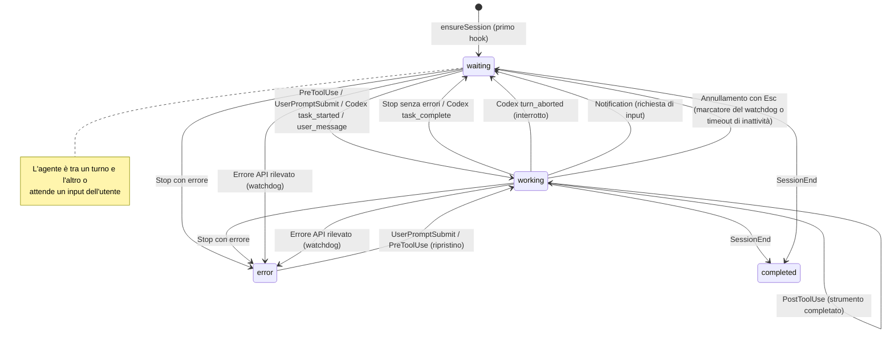

### Macchina a stati delle sessioni

Stati persistiti: `active | completed | error | abandoned`. Lo stato di sessione
**In attesa** è una sovrapposizione dell'interfaccia (status=`active` con
`awaiting_input_since` impostato).

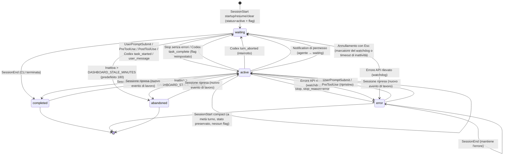

### Flusso del calcolo dei costi

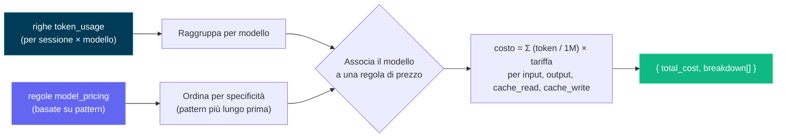

> [!IMPORTANT]
> Il flusso del calcolo dei costi si basa sul consumo di token e sulle regole di prezzo dei modelli. Mantieni aggiornate le regole di prezzo per ottenere costi accurati. Aggiorna la tabella dei prezzi dei modelli dalla pagina Impostazioni per un tracciamento preciso dei costi — la dashboard non recupera automaticamente gli aggiornamenti dei prezzi da fonti esterne. Una volta impostate le regole di prezzo, la dashboard le applica retroattivamente a tutte le sessioni per report sui costi coerenti.

---

## Configurazione

| Variabile d'ambiente | Predefinito | Descrizione |
| ----------------------- | ------------- | --------------------------------------------- |
| `DASHBOARD_PORT` | `4820` | Porta del server Express |
| `CLAUDE_DASHBOARD_PORT` | `4820` | Porta usata dal gestore degli hook per raggiungere il server |
| `NODE_ENV` | `development` | Impostare a `production` per servire il client compilato |
| `DASHBOARD_UPDATE_CHECK` | _(attivo)_ | Impostare a `0` / `false` / `off` per disattivare i controlli periodici dell'upstream git |
| `DASHBOARD_UPDATE_CHECK_INTERVAL_MS` | `300000` (5 min) | Intervallo tra i controlli automatici; minimo 60 000 ms. Gli utenti possono anche cliccare **Controlla ora** nella finestra di aggiornamento o nella barra laterale per eseguirne uno su richiesta. |
| `DASHBOARD_STALE_MINUTES` | `180` (3 h) | Minuti di inattività prima che una sessione ancora `active` (compresa una ferma **In attesa** di un input dell'utente — "In attesa" è una sovrapposizione dell'interfaccia su una riga `active`, non uno stato salvato) venga segnata automaticamente come **abandoned** e sparisca dall'elenco delle attive. Applicato dal watchdog da 15 s e dalla scansione periodica di manutenzione (eseguita ogni ¼ di questo valore, limitata tra 60 s e 5 min). Abbassalo (ad es. `60`) per un timeout di inattività più breve |
| `DASHBOARD_WORKING_IDLE_SECONDS` | `120` | Timeout di inattività in lavorazione per recuperare un turno annullato con `Esc` **prima di qualsiasi output** (che non lascia marcatori nella trascrizione). Quando l'agente principale è in `working` senza strumenti in corso e né un evento hook né la trascrizione sono avanzati per questo tempo, il watchdog porta la sessione a **In attesa**. Abbassalo per un ripristino più rapido, al prezzo di rari falsi passaggi durante lunghi turni di ragionamento silenzioso (che si correggono da soli). Le sessioni di Cursor usano lo stesso timeout: un turno `working` i cui file in `~/.cursor` e i cui hook restano inattivi così a lungo passa a **In attesa** |
| `DASHBOARD_LIVENESS_PROBE` | `1` (attivo) | Impostare a `0` per disattivare la **pulizia delle sessioni morte tramite verifica di attività** del watchdog (la sonda basata su `ps`/`lsof` che completa le sessioni locali `active` di Claude Code o Codex il cui processo CLI corrispondente non esiste più — per recuperare un `SessionEnd` perso mentre la dashboard era ferma). Le sessioni inoltrate da **un'altra macchina** (hook condivisi) riportano un `cwd` non POSIX e vengono saltate automaticamente dalla pulizia, quindi un deploy misto locale + inoltrato non ha più bisogno di disattivarla; disattivala solo in una configurazione interamente remota, in cui i processi locali non dimostrano nulla. Disattivata automaticamente su Windows e nei container |
| `DASHBOARD_LIVENESS_IDLE_SECONDS` | `60` | Soglia di inattività per la pulizia tramite verifica di attività **nei passaggi del watchdog**: una sessione viene completata solo se la sua trascrizione non è stata scritta da almeno questo tempo (l'ultima scrittura di un hook fa da orologio di ripiego quando su disco non esiste alcuna trascrizione), così una sessione a metà turno o appena ripresa non sparisce mai per un fallimento momentaneo della sonda. I passaggi all'avvio ignorano questa soglia — all'avvio decide solo la sonda, quindi le sessioni chiuse poco prima dell'avvio vengono pulite subito |
| `DASHBOARD_SESSION_SYNC_MS` | `30000` | Intervallo di polling (ms) della sincronizzazione continua in background di `~/.claude/projects`, che fa emergere i progetti aggiunti dopo l'avvio le cui sessioni non passano mai dagli hook. Il watcher `fs.watch` scatta comunque quasi all'istante; questo polling è la rete di sicurezza (i watcher possono perdere eventi / non scattare su file system di rete). Impostare a `0` per disattivare il polling lasciando attivo il watcher |
| `DASHBOARD_CURSOR_HOME` | `~/.cursor` | Home nativa facoltativa di Cursor. La dashboard legge `projects/*/agent-transcripts`, unisce i metadati di `chats`, recupera le sessioni esistenti e salva snapshot durevoli delle conversazioni nella directory dei dati della dashboard. |
| `DASHBOARD_CURSOR_SYNC_MS` | `5000` | Intervallo di sicurezza (ms) per il rilevamento delle chat/trascrizioni di Cursor tramite impronta. L'osservazione del file system importa comunque subito l'avvio della CLI e le modifiche ai prompt; `0` disattiva solo la scansione periodica. |
| `DASHBOARD_CODEX_HOME` | `CODEX_HOME` o `~/.codex` | Directory di stato locale facoltativa di Codex. I rollout vengono letti solo dal suo albero `sessions/`; salvare una nuova posizione nelle Impostazioni rende persistente questa sovrascrittura propria della dashboard, riattiva l'osservazione in diretta e scansiona subito il nuovo albero. |
| `DASHBOARD_CODEX_SYNC_MS` | `4000` | Intervallo di polling di sicurezza (ms) per i rollout di Codex in sola aggiunta. Gli hook di Codex attivano subito la stessa acquisizione incrementale; impostare a `0` per disattivare solo il polling mantenendo il watcher del file system quando disponibile. |
| `DASHBOARD_CODEX_MAX_ATTEMPTS` | `5` | Numero di tentativi di acquisizione consecutivi falliti che la scansione di Codex dedica a un rollout **invariato** prima di lasciarlo stare. La scansione rimette volutamente in coda un rollout che non è riuscita a leggere, così un errore temporaneo (`SQLITE_BUSY`, un record scritto a metà) si risolve al passaggio successivo; senza un limite, un errore *permanente* si ripeterebbe per tutta la vita del processo — circa 21.600 tentativi per file al giorno con i 4 s predefiniti di `DASHBOARD_CODEX_SYNC_MS`, ciascuno dei quali scrive una riga di log sull'unico thread di Node. Il conteggio include il primo tentativo, è tracciato per file e viene ripristinato per intero ogni volta che la dimensione o l'mtime del file cambiano, così un rollout solo scritto a metà si recupera da solo. Il tentativo che esaurisce il budget registra un unico messaggio che cita il limite. Aumentalo se un volume lento o instabile ha bisogno di più di qualche scansione per stabilizzarsi |
| `DASHBOARD_CODEX_HOOK_IDLE_SECONDS` | `60` | Quanto a lungo una sessione di Codex **solo tramite hook** — la cui esecuzione non ha scritto alcun rollout su disco (`codex exec --ephemeral`) — può lasciare senza risposta un turno segnalato come terminato prima che la dashboard concluda che il suo hook `SessionEnd` è andato perso. È idonea solo una sessione il cui `awaiting_reason` sia `stop`: Codex invia `SessionEnd` poche centinaia di ms dopo `Stop`, quindi uno `Stop` senza risposta è una prova reale. Il silenzio volutamente non è mai l'innesco — un'esecuzione senza rollout non emette alcun hook per tutta la durata di una chiamata a uno strumento, quindi una regola basata sull'inattività completerebbe una build CI in corso |
| `DASHBOARD_TASK_SUMMARY_TTL_MS` | `2000` | Finestra (ms) in cui vengono serviti risultati non aggiornati dalla cache dell'avanzamento delle attività per trascrizione, dietro le richieste di elenco `include_task_progress` **e** il `todo_snapshot` del dettaglio della sessione. Le trascrizioni cresciute vengono analizzate in modo incrementale dall'ultima riga JSONL completa (una crescita di oltre 32 MiB dall'ultima lettura riparte con una nuova scansione della coda), mentre questa soglia continua ad accorpare raffiche di ricaricamenti degli elenchi (ad esempio gli aggiornamenti della dashboard provocati da eventi WebSocket). Entro la finestra viene restituito un risultato appena analizzato (leggermente datato, solo per la visualizzazione); impostare a `0` per analizzare subito ogni aggiunta |
| `DASHBOARD_REMOTE_SYNC_MS` | `15000` (15 s) | Intervallo di polling (ms) della sincronizzazione in background delle **origini dati remote**, che preleva in modo indipendente via SSH `~/.claude/projects` e `~/.codex/sessions` (più il leggero indice dei titoli `session_index.jsonl` di Codex) da ogni origine attiva, poi reimporta ciascuno tramite il relativo importatore locale. Anche le origini nuove/riattivate si sincronizzano subito. Impostare a `0` per disattivare il poller (le sincronizzazioni manuali / su richiesta continuano a funzionare) |
| `DASHBOARD_REMOTE_ACTIVE_WINDOW_MS` | `600000` (10 min) | Finestra di attualità per lo stato in diretta di una sessione di **origine dati remota**. A ogni sincronizzazione, una sessione remota di Claude Code o Codex la cui trascrizione replicata abbia un **ultimo evento JSONL** entro questa finestra viene considerata ancora in esecuzione (`active`); quando la replica smette di avanzare per più tempo, la sessione viene riconciliata come `completed`. Le sessioni remote non ricevono hook in diretta, quindi la riconciliazione della replica consapevole del provider sostituisce la verifica di attività locale; le repliche dei provider fallite, non disponibili o bloccate ripiegano sulla normale scansione di inattività. Aumentala per collegamenti lenti o turni di inattività molto lunghi |
| `DASHBOARD_REMOTE_SYNC_TIMEOUT_MS` | `600000` (10 min) | Timeout (ms) per origine per una singola sincronizzazione remota (prelievo `scp` + importazione) prima che venga interrotta |
| `DASHBOARD_REMOTE_TEST_TIMEOUT_MS` | `15000` (15 s) | Timeout (ms) per la sonda SSH **Test** (`POST /api/remote-sources/:id/test`) che verifica che un'origine remota sia raggiungibile |
| `DASHBOARD_HOST` | `127.0.0.1` | Interfaccia su cui il server si mette in ascolto. Loopback per impostazione predefinita (non raggiungibile dalla rete). Impostare a `0.0.0.0` per esporla su una LAN (registra un avviso all'avvio) |
| `DASHBOARD_TOKEN` | _(non impostato)_ | Se impostato, ogni richiesta `/api/*` e il WebSocket devono presentare il token (`Authorization: Bearer <token>`, intestazione `x-dashboard-token` o `?token=`). Disattivato per impostazione predefinita — l'ascolto in loopback è il confine di fiducia |
| `DASHBOARD_TOKEN_FILE` | _(non impostato)_ | Token della dashboard letto da file, per i segreti di Docker/Kubernetes; un `DASHBOARD_TOKEN` diretto ha la precedenza |
| `DASHBOARD_HOOK_TOKEN` / `DASHBOARD_HOOK_TOKEN_FILE` | _(non impostato)_ | Token indipendente per le route degli hook locali (`/api/hooks/event`, `/api/hooks/codex`) quando esposte oltre il loopback |
| `REMOTE_PUSH_TOKEN` / `REMOTE_PUSH_TOKEN_FILE` | _(non impostato)_ | Token separato che protegge `POST /api/hooks/ingest-batch` (route di push remoto raggiungibile da Internet, disattivata per impostazione predefinita). Volutamente indipendente dal `DASHBOARD_HOOK_TOKEN` sopra — impostare quello non deve aprire anche questa route scrivibile da Internet |
| `DASHBOARD_ALLOWED_HOSTS` | _(loopback)_ | Valori `Host` aggiuntivi, separati da virgole, consentiti su HTTP e sugli upgrade WebSocket (protezione dal DNS rebinding). Aggiungi qui i nomi host della tua LAN quando l'ascolto va oltre il loopback |
| `DASHBOARD_ENV_PATH` | `.env` del repository | Percorso dotenv scrivibile usato quando le Impostazioni rendono persistenti le sovrascritture delle home di Claude/Codex; predefinito nel container `/app/config/.env` |
| `CCAM_DASHBOARD_URL` | _(rilevamento localhost)_ | Destinazione remota facoltativa degli hook. Gli URL fuori dal loopback devono usare HTTPS e un token di hook |
| `CCAM_HOOK_TOKEN` / `CCAM_HOOK_TOKEN_FILE` | _(non impostato)_ | Credenziale del client degli hook, inviata come `x-ccam-hook-token` |

> [!IMPORTANT]
> **Sicuro per impostazione predefinita.** Il server è in ascolto su `127.0.0.1` e **non** è raggiungibile dalla rete così com'è ([GHSA-gr74-4xfh-6jw9](./.github/SECURITY.md)). Per esporlo su una LAN, imposta **sia** `DASHBOARD_HOST` (ad es. `0.0.0.0`) **sia** `DASHBOARD_TOKEN` (che protegge allora `/api/*` e il WebSocket) ed elenca i nomi host della tua LAN in `DASHBOARD_ALLOWED_HOSTS`. Vedi [`.env.example`](./.env.example) e [`.github/SECURITY.md`](./.github/SECURITY.md) per i dettagli.

Per i cloni git, il server esegue periodicamente un `git fetch` di `origin` e confronta il tuo checkout con `origin/master`, `origin/main` o `origin/HEAD`. Quando sei indietro, compare un messaggio nel terminale del server e una finestra nell'interfaccia con il comando esatto da eseguire. La dashboard non esegue mai pull né si riavvia da sola — copi il comando, lo esegui in un terminale, poi riavvii il server nello stesso modo in cui l'avevi avviato.

---

## CLI `ccam`

Tutte le funzionalità della dashboard sono disponibili anche da qualsiasi terminale tramite la CLI **`ccam`**, senza dipendenze (`bin/ccam.js`). Viene collegata automaticamente da `npm run setup` (tramite `npm link`), dopodiché `ccam <command>` funziona da qualsiasi directory. Individua la dashboard in esecuzione tramite `~/.claude/.agent-dashboard.json` (lo stesso registro dei server attivi usato dal gestore degli hook), con le sovrascritture d'ambiente `CLAUDE_DASHBOARD_PORT` / `DASHBOARD_PORT`, e ripiega su `http://127.0.0.1:4820`.

```bash
# Server
ccam status                       # ● running / ○ not running indicator
ccam start [--port N]             # start the server in the background (detached)
ccam stop                         # stop the background server gracefully
ccam repl                         # interactive shell (also: shell, i)

# Monitoring
ccam health                       # is the dashboard up?
ccam stats                        # totals, today's events, status distributions
ccam kanban                       # sessions + agents grouped by status columns
ccam tail [--session <id>]        # live event feed in the terminal (Ctrl+C stops)

# Data
ccam sessions [--status s] [--q text] [--limit n]
ccam session <id>                 # detail: agent tree, cost, recent events
ccam agents   [--status s] [--session id]
ccam events   [--session id] [--limit n]

# Insights
ccam analytics                    # token totals, top tools, agent types
ccam workflows [--session id]     # workflow intelligence stats and patterns
ccam runs [--session id]          # dynamic Workflow-tool runs
ccam cost [--session <id>]        # total estimated cost with per-model breakdown
                                  # (--session scopes to one; shows tool surcharges;
                                  #  warns about models with usage but no pricing rule)

# Alerts & webhooks
ccam alerts [--unacked]           # fired-alert feed
ccam alerts ack <id> | ack-all    # acknowledge alerts
ccam rules                        # list alert rules
ccam webhooks                     # list webhook targets
ccam webhooks test <id>           # send a synthetic test alert

# Pricing
ccam pricing                      # list model pricing rules (incl. fast-mode & intro columns)
ccam pricing set <pattern> --input N --output N [--cache-read N --cache-write N]
                 [--cache-write-1h N] [--fast-input N --fast-output N]
                 [--intro-input N --intro-output N … --intro-until YYYY-MM-DD]
ccam pricing delete <pattern>
ccam pricing reset

# Import
ccam import rescan                # re-scan ~/.claude/projects
ccam import path <dir>            # import every .jsonl under a directory

# Administration
ccam doctor                       # connectivity, hooks, and database diagnosis
ccam info                         # raw system info JSON
ccam export [file.json]           # full JSON data export
ccam import-data <file.json>      # restore an export (idempotent, non-destructive)
ccam cleanup --hours N --days M   # abandon stale / purge old sessions
ccam reinstall-hooks              # reinstall Claude Code hooks
ccam update-check                 # is the checkout behind upstream? (prints the update command)
ccam clear-data --yes             # delete ALL data (requires --yes)
ccam open                         # open the dashboard in your browser
ccam version                      # print the CLI version (also --version / -v)
```

I comandi basati sull'API richiedono che il server sia in esecuzione — quando non lo è, **i comandi in sola lettura ripiegano sulla lettura diretta di `data/dashboard.db`** (con un banner esplicito `⚠ Offline mode`, e le sessioni `active` salvate ma morte corrette in visualizzazione dalla stessa sonda di attività dei processi usata dal watchdog del server), mentre i comandi che non possono funzionare correttamente senza il server (`tail` in diretta, calcoli di analisi/costi, modifiche) stampano l'indicatore `○ Dashboard server is NOT running` con il motivo specifico e i comandi di avvio; `ccam start` avvia un server di produzione in background. I comandi di lettura sono sempre sicuri; l'unico comando distruttivo (`clear-data`) si rifiuta di eseguire senza un `--yes` esplicito. L'output è una vera interfaccia da terminale — tabelle con bordi e colonne numeriche allineate a destra, icone di stato (`● active`, `○ waiting`, `✔ completed`, `✖ error`), grafici a barre in linea per statistiche/analisi/costi e veri alberi di agenti con `├─`/`└─` — con colori ANSI attivati automaticamente su un TTY, disattivati in una pipe e controllabili tramite `--no-color` / `NO_COLOR` / `FORCE_COLOR`. Per una sessione di monitoraggio in diretta, **`ccam repl`** (alias `shell` / `i`) apre una shell interattiva in cui digiti i comandi senza il prefisso `ccam` — con un banner di benvenuto CCAM, completamento con Tab, cronologia persistente con le frecce, un prompt con lo stato del server in diretta (`● host` attivo / `○ offline` fermo), un menu `help` / `help <cmd>` raggruppato e un comando integrato `watch [secs] <cmd>` che aggiorna automaticamente qualsiasi comando (ad es. `watch 5 kanban`); ogni riga viene eseguita in un processo figlio isolato, così un rifiuto per assenza del server o un `tail` bloccante non fanno mai cadere la shell. Se `ccam` non è nel tuo PATH (ad es. `npm link` ha richiesto permessi elevati), esegui una volta `npm link` dalla radice del repository. Riferimento completo — opzioni, ordine di rilevamento, REPL, modello di sicurezza, scripting/codici di uscita, risoluzione dei problemi — in [docs/CLI.md](./docs/CLI.md).

## Script npm

| Comando | Descrizione |
| ----------------------- | ---------------------------------------------------------- |
| `npm run setup` | Installa le dipendenze di radice/client/estensione/MCP, compila MCP e collega `ccam` |
| `npm run update:pull-setup` | `git pull --ff-only` e poi `npm run setup` (aggiornamento manuale) |
| `npm run dev` | Avvia insieme il server (modalità watch) + il client (HMR di Vite) |
| `npm run dev:server` | Avvia Express con un watcher dei sorgenti con debounce e riavvio pulito |
| `npm run dev:client` | Avvia solo il server di sviluppo di Vite |
| `npm run build` | Compila il client React in `client/dist/` |
| `npm start` | Avvia il server di produzione (serve il client compilato) |
| `npm test` | Esegue l'intera suite (server `node --test` + client Vitest) |
| `npm run verify` | Esegue l'intero controllo locale con un solo comando: verifica delle intestazioni d'autore, controllo Prettier, typecheck del client, test backend, test frontend |
| `npm run check:headers` | Verifica che ogni file sorgente interessato contenga l'intestazione d'autore |
| `npm run typecheck:client` | Typecheck del client (`tsc -b`) — lo stesso controllo che la build di produzione esegue prima di Vite |
| `npm run test:server` | Esegue i test backend (`node --test server/__tests__/`) |
| `npm run test:client` | Esegue i test Vitest del frontend, compresi gli **snapshot di rendering di ogni schermata** (`client/src/pages/__tests__/screens.snapshot.test.tsx`); rigenera i riferimenti dopo modifiche volute all'interfaccia con `cd client && npx vitest run -u` |
| `npm run install-hooks` | Configura gli hook di Claude Code in `~/.claude/settings.json` |
| `npm run seed` | Popola il database con dati di esempio |
| `npm run import-history` | Importa le sessioni precedenti da `~/.claude/` (viene eseguito anche all'avvio) |
| `npm run reconcile-tokens` | Aggiorna i totali dei token delle sessioni importate (non abbassa mai un totale) |
| `npm run repair-tokens` | Ricalcola i totali dei token **esclusi i flussi** di ogni sessione **Claude** con trascrizione su disco (in `~/.claude/projects/` o tramite il `transcript_path` salvato della sessione) e azzera le basi di compattazione; le righe dei flussi e di Codex vengono preservate. Riparazione una tantum per i database colpiti dalla somma per record precedente alla v2.0.9 o dall'omissione dell'uso dei subagenti piatti dello stesso modello. Ferma prima la dashboard |
| `DASHBOARD_TOKEN_REPAIR` | Attivo per impostazione predefinita (`1`). Riparazione automatica una tantum dei totali storici dei token colpiti dal gonfiamento per record o dall'omissione dei subagenti piatti dello stesso modello. Le correzioni in diretta non possono rivedere ogni sessione completata, e `replaceTokenUsage` non può abbassare un vecchio valore massimo. Viene eseguita una volta per database (controllata da un marcatore, rinviata fuori dal percorso di avvio, saltata mentre un'altra dashboard condivide la directory dei dati) e salva prima le vecchie righe in `token_usage_pre_repair_v2`. Impostare a `0` per saltarla e riparare manualmente con `npm run repair-tokens` |
| `npm run clear-data` | Elimina tutte le sessioni, gli agenti, gli eventi e i consumi di token |
| `npm run mcp:install` | Installa le dipendenze del pacchetto MCP locale (`mcp/`) |
| `npm run mcp:build` | Compila il TypeScript del server MCP in `mcp/build/` |
| `npm run mcp:start` | Avvia il server MCP (trasporto stdio — per gli host MCP) |
| `npm run mcp:start:http` | Avvia il server MCP (trasporto HTTP + SSE sulla porta 8819) |
| `npm run mcp:start:repl` | Avvia il server MCP (REPL interattiva con completamento con Tab) |
| `npm run mcp:dev` | Esegue il server MCP in modalità dev (`tsx`, stdio) |
| `npm run mcp:dev:http` | Esegue il server MCP in modalità dev (`tsx`, HTTP + SSE) |
| `npm run mcp:dev:repl` | Esegue il server MCP in modalità dev (`tsx`, REPL interattiva) |
| `npm run mcp:typecheck` | Controlla i tipi dei sorgenti MCP senza produrre build |
| `npm run extensions:sync` | Rigenera i nomi delle skill/i metadati OpenAI, i manifest di Codex ed entrambi i marketplace |
| `npm run extensions:validate` | Convalida tutti i 14 plugin a doppio formato e le 66 skill incluse |
| `npm run mcp:docker:build` | Costruisce l'immagine del container MCP con Docker (`agent-dashboard-mcp:local`) |
| `npm run mcp:podman:build` | Costruisce l'immagine del container MCP con Podman (`localhost/agent-dashboard-mcp:local`) |
| `npm run desktop:install` | Installa Electron + electron-builder nello spazio di lavoro `desktop/` (ricompila `better-sqlite3` per l'ABI di Electron); verifica in anticipo la build nativa di `better-sqlite3` e, in caso di errore, mostra un aiuto pratico per la configurazione (inclusa un'alternativa senza toolchain) |
| `npm run desktop:dev` | Compila e avvia l'app desktop Electron per lo sviluppo locale |
| `npm run desktop:build` | Compila i sorgenti TypeScript del desktop in `desktop/out/` |
| `npm run desktop:test` | Esegue lo smoke test del desktop (avvia Electron, interroga `/api/health`) |
| `npm run desktop:dmg` | Costruisce **entrambi** i DMG per macOS (arm64 + x64) — corretto per una release, **più lento** (impacchetta ogni architettura) |
| `npm run desktop:dmg:arm64` | Costruisce un DMG solo per Apple Silicon — **veloce**, consigliato per il tuo Mac |
| `npm run desktop:dmg:x64` | Costruisce un DMG solo per Intel — **veloce** |
| `npm run desktop:dmg:universal` | Costruisce un unico DMG **universale** unificato (arm64 + x86_64) — facoltativo, **il più lento**, non è ciò che distribuisce la release |
| `npm run desktop:win` | Costruisce un **installer NSIS** per Windows `.exe` (x64) — da eseguire su Windows |
| `npm run desktop:win:portable` | Costruisce un `.exe` **portatile** per Windows (senza installazione, x64) — da eseguire su Windows |
| `npm run monitoring:install` | Esegue `npm install` in `monitoring/` — scarica Prometheus + Grafana tramite `postinstall` |
| `npm run monitoring:setup` | Alias di `monitoring:install` |
| `npm run monitoring:up` | Avvia Prometheus (:9090) + Grafana (:3000) in background (senza Docker) |
| `npm run monitoring:down` | Ferma lo stack di monitoraggio gestito da npm |
| `npm run monitoring:start` | Stack di monitoraggio in primo piano (Ctrl+C li ferma entrambi) |
| `npm run monitoring:docker:up` | Avvia Prometheus + Grafana tramite Docker Compose |
| `npm run monitoring:docker:down` | Smonta lo stack di monitoraggio Docker |
| `npm run monitoring:verify` | Controllo di salute di dashboard, Prometheus, Grafana e target di raccolta |
| `npm run docker:up` | Avvia la dashboard in Docker (`docker compose up -d --build`) |
| `npm run docker:down` | Ferma il container della dashboard |
| `npm run docker:full:up` | Dashboard + MCP autenticato + Nginx senza root + Prometheus + Grafana |
| `npm run docker:full:down` | Smonta l'intero stack Docker |
| `npm run deploy:validate` | Esamina Docker, Compose, Nginx, Helm, Kustomize, Terraform, gli audit delle dipendenze e l'invariante di scrittore unico. I risultati sono solo indicativi (codice di uscita 0); `CCAM_DEPLOY_VALIDATE_STRICT=1` li trasforma in un blocco obbligatorio |

---

## Estensioni degli agenti

Questo repository include un livello di estensioni completo sia per Claude Code sia per Codex:

- Claude Code: `CLAUDE.md`, `.claude/rules/`, `.claude/skills/`
- Subagenti Claude: `.claude/agents/`
- Codex: `AGENTS.md`, `.codex/rules/`, `.codex/agents/`, `.codex/skills/`
- Plugin distribuibili condivisi: `plugins/`, con sia `.claude-plugin/plugin.json` sia `.codex-plugin/plugin.json`
- Marketplace: `.claude-plugin/marketplace.json` per Claude Code e `.agents/plugins/marketplace.json` per Codex
- Open Agent Skills: tutte le skill dei plugin hanno un frontmatter canonico più `agents/openai.yaml`; `npx skills add hoangsonww/Claude-Code-Agent-Monitor --list` rileva 77 skill del repository

### Architettura delle estensioni

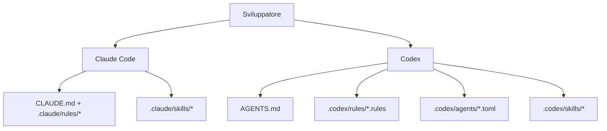

### Livello Claude Code

- Contesto persistente:
  - [`CLAUDE.md`](./CLAUDE.md)
- Regole limitate per percorso:
  - [`.claude/rules/backend-node.md`](./.claude/rules/backend-node.md)
  - [`.claude/rules/frontend-react.md`](./.claude/rules/frontend-react.md)
  - [`.claude/rules/mcp-typescript.md`](./.claude/rules/mcp-typescript.md)
  - [`.claude/rules/docs-markdown.md`](./.claude/rules/docs-markdown.md)
  - [`.claude/rules/file-headers.md`](./.claude/rules/file-headers.md)
  - [`.claude/rules/wiki-i18n.md`](./.claude/rules/wiki-i18n.md)
  - [`.claude/rules/i18n-parity.md`](./.claude/rules/i18n-parity.md)
- Skill:
  - `repo-onboarding`
  - `ship-feature`
  - `version-release`
  - `mcp-operations`
  - `debug-live-issue`
  - `update-project-docs`
  - `file-headers`
  - `push-to-forked-pr`
  - `i18n-parity`
- Subagenti:
  - `backend-reviewer`
  - `frontend-reviewer`
  - `mcp-reviewer`

### Livello Codex

- Contesto persistente:
  - [`AGENTS.md`](./AGENTS.md)
- Politica di esecuzione:
  - [`.codex/rules/default.rules`](./.codex/rules/default.rules)
- Modelli di subagenti personalizzati:
  - [`.codex/agents/`](./.codex/agents)
- Skill:
  - [`.codex/skills/`](./.codex/skills)
- Configurazione:
  - [`.codex/README.md`](./.codex/README.md)

---

## Integrazione MCP

Questo progetto include un server MCP locale in `mcp/` con 97 strumenti in 16 moduli di dominio. Espone ogni azione supportata dall'app, comprese le letture di dati per ambito, trascrizioni/immagini, prezzi di Claude, Cursor e GPT, flussi, avvisi/webhook, importazioni e ripristino dei backup, configurazione di Claude/Codex, Avvia agente, origini remote, impostazioni, push e manutenzione protetta. Supporta tre modalità di trasporto.

### Modalità di trasporto MCP

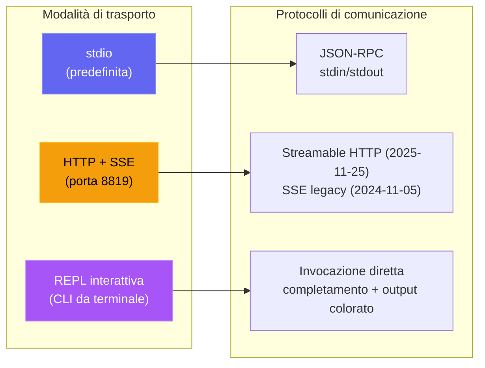

| Modalità | Comando | Caso d'uso |
| --- | --- | --- |
| **stdio** | `npm run mcp:start` | Claude Code, Claude Desktop, host MCP degli IDE |
| **HTTP** | `npm run mcp:start:http` | Client MCP remoti, integrazioni web, più sessioni |
| **REPL** | `npm run mcp:start:repl` | Debug operativo, invocazione manuale degli strumenti, amministrazione locale |

<p align="center">
  
</p>

### Architettura MCP

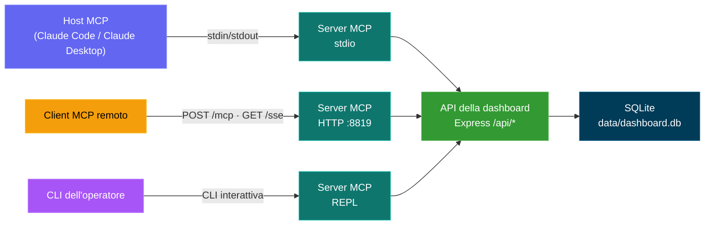

### Superficie degli strumenti MCP

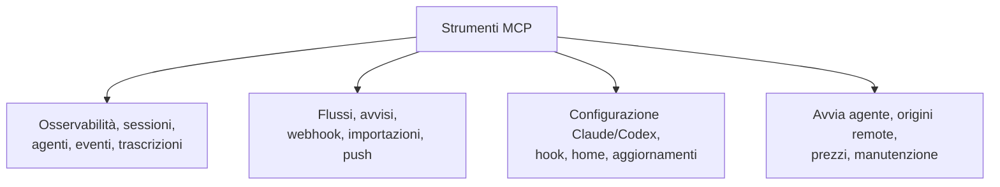

### Modello di sicurezza MCP

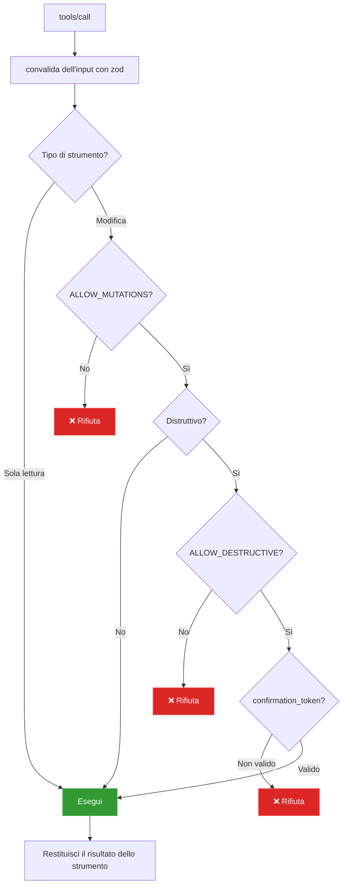

### Modalità operative MCP

- Modalità sola lettura (predefinita): `MCP_DASHBOARD_ALLOW_MUTATIONS=false`
- Modalità amministratore: `MCP_DASHBOARD_ALLOW_MUTATIONS=true`
- Dashboard autenticata: imposta `MCP_DASHBOARD_API_TOKEN` / `_FILE` con il token della dashboard
- Trasporto HTTP/SSE autenticato: imposta `MCP_HTTP_AUTH_TOKEN` / `_FILE`; i client inviano l'autenticazione bearer o `x-mcp-token`
- Protezioni del trasporto: l'HTTP diretto in loopback può portare il token; gli alias host dei container richiedono HTTPS; i reindirizzamenti vengono rifiutati
- Protezioni del payload: 50 MiB per file di cronologia caricato, 100 MiB in totale per chiamata, 10 MiB per le risposte binarie e 25 MiB per il ripristino dei backup
- Modalità distruttiva: richiede tutti e tre:
  - `MCP_DASHBOARD_ALLOW_MUTATIONS=true`
  - `MCP_DASHBOARD_ALLOW_DESTRUCTIVE=true`
  - l'input dello strumento `confirmation_token: "CLEAR_ALL_DATA"`

Dettagli completi: [mcp/README.md](./mcp/README.md)

---

## Riferimento API

Tutti gli endpoint restituiscono JSON. Le risposte di errore hanno la forma `{ error: { code, message } }`.

### OpenAPI / Swagger / ReDoc

Ci sono tre modi per esplorare l'API HTTP, tutti basati su un'unica specifica OpenAPI 3.0.3 (porta predefinita del server `4820`):

| Metodo | Percorso | Descrizione |
| ------ | ------------------------------- | ------------------------------------------------------------------------------------------------- |
| `GET` | `/api/openapi.json` | Specifica OpenAPI 3.0.3 grezza in JSON |
| `GET` | `/api/docs` | **Swagger UI** interattiva — esecuzione delle richieste per provarle |
| `GET` | `/api/redoc` | Riferimento **ReDoc** — una resa pulita su tre pannelli, ottimizzata per la lettura, della stessa specifica |
| `GET` | `/api/redoc/redoc.standalone.js` | Bundle ReDoc self-hosted (servito localmente tramite la dipendenza `redoc`, mai da un CDN — funziona offline) |

Il documento OpenAPI viene generato da `server/openapi.js` (`createOpenApiSpec()`) e unito a frammenti supplementari in `server/openapi-extra/`. Swagger UI e ReDoc sono entrambi serviti direttamente dal backend; il bundle ReDoc viene servito localmente (`GET /api/redoc/redoc.standalone.js`), così il riferimento funziona interamente offline / in reti isolate, in linea con la politica del progetto di non usare risorse esterne.

La copertura è completa: ogni route del backend è documentata (82 voci di percorso) sotto questi tag — Health, Sessions, Agents, Events, Stats, Metrics, Analytics, Hooks, Pricing, Workflows, Settings, Updates, Alerts, Webhooks, Push, CcConfig (explorer della configurazione di Claude Code), Run (esecuzioni avviate dalla dashboard) e Documentation —, ciascuna con parametri, schemi di richiesta/risposta, descrizioni a livello di campo ed esempi realistici.

Un **`openapi.yaml`** versionato nella radice del repository rispecchia la specifica in diretta. Viene generato da `server/openapi.js` (mai modificato a mano) — rigeneralo dopo modifiche all'API con:

```bash
npm run openapi:yaml
```

### Metriche Prometheus e Grafana

`GET /api/metrics` espone i contatori in diretta della dashboard — sessioni/agenti per stato, totali di eventi e token, client in tempo reale connessi, origini remote configurate, uptime/memoria del processo e versione della build — nel formato di esposizione testuale di Prometheus, così CCAM può essere raccolto dal tuo stack di osservabilità. Uno stack Prometheus + Grafana chiavi in mano con **quattro dashboard predisposte automaticamente** (home predefinita: **CCAM — Overview**) si trova in [`monitoring/`](./monitoring/README.md).

**npm (senza Docker — macOS, Linux o Windows):**

```bash
npm start                          # dashboard on :4820
npm run monitoring:install         # one-time: npm postinstall pulls binaries
npm run monitoring:up              # Grafana on :3000, auto-provisioned; see monitoring/README.md for credentials
```

**Docker / Podman** (quando la dashboard gira in un container o se preferisci Compose):

```bash
# Dashboard only
npm run docker:up

# Dashboard + Prometheus + Grafana (one command)
npm run docker:full:up

# Or mix: native/docker dashboard + docker monitoring
DASHBOARD_ALLOWED_HOSTS=host.docker.internal npm start   # or docker:up with same env
npm run monitoring:docker:up
npm run monitoring:verify
```

<p align="center">
  
  <br>
  <em>📊 <strong>Grafana · CCAM — Overview</strong> — dashboard home predefinita (quattro dashboard predisposte automaticamente): istantanea della flotta, totali del database, grafici di ripartizione e tassi — tutto da raccolte in diretta di <code>/api/metrics</code></em>
</p>

<p align="center">
  
  <br>
  <em>🔥 <strong>Prometheus · console CCAM</strong> — pagina iniziale già pronta in <code>/consoles/index.html</code> che interroga direttamente Prometheus per lo stato della raccolta, i totali delle sessioni, gli eventi, i token e i link Graph per approfondire</em>
</p>

<p align="center">
  
  <br>
  <em>📈 <strong>Prometheus · Graph</strong> — esegui PromQL sulle metriche CCAM raccolte (ad es. <code>sum(ccam_sessions)</code>, <code>ccam_events_total</code>, <code>rate(ccam_tokens_total[5m])</code>) con link di partenza dalla console CCAM e da <a href="./monitoring/README.md">monitoring/README.md</a></em>
</p>

Vedi [docs/API.md → Metrics](./docs/API.md#metrics) per l'elenco completo delle metriche e i dettagli su raccolta/autenticazione.

<p align="center">
  
</p>

<p align="center">
  
</p>

### Stato

| Metodo | Percorso | Descrizione |
| ------ | ------------- | ------------------------------------- |
| `GET` | `/api/health` | Restituisce `{ status: "ok", timestamp }` |

### Sessioni

| Metodo | Percorso | Parametri di query | Descrizione |
| ------- | ------------------------------- | ---------------------------------------------------------------- | -------------------------------------------------------------------------------------------- |
| `GET` | `/api/sessions` | `status`, `q`, `limit`, `offset` | Elenca le sessioni con il numero di agenti e il costo per sessione. `q` esegue una ricerca senza distinzione tra maiuscole e minuscole su `id` / `name` / `cwd`. `limit` è 50 per impostazione predefinita, massimo 10000. La risposta include `total` per i paginatori. |
| `GET` | `/api/sessions/:id` | -- | Dettaglio della sessione con agenti ed eventi |
| `GET` | `/api/sessions/:id/stats` | -- | Conteggi aggregati che alimentano il pannello di sintesi del Dettaglio della sessione: eventi, eventi per tipo, strumenti più usati, numero di errori, conteggi per tipo/stato degli agenti, ripartizione per tipo di subagente, totali dei token, intervallo di tempo |
| `GET` | `/api/sessions/:id/transcripts` | -- | Elenca le trascrizioni JSONL disponibili per la sessione (principale + subagenti + compattazioni) |
| `GET` | `/api/sessions/:id/transcript` | `agent_id`, `limit`, `offset`, `after`, `before` | Trasmette i messaggi di una trascrizione specifica con paginazione a cursore. L'`usage` dell'assistente include `input_tokens`, `output_tokens`, `cache_read_input_tokens`, `cache_creation_input_tokens`, così l'indicatore della pagina Avvia si riempie completamente alla ripresa / al ricollegamento |
| `POST` | `/api/sessions` | -- | Crea una sessione (idempotente su `id`) |
| `PATCH` | `/api/sessions/:id` | -- | Aggiorna lo stato/i metadati della sessione |

### Agenti

| Metodo | Percorso | Parametri di query | Descrizione |
| ------- | ----------------- | ----------------------------------------- | ----------------------------- |
| `GET` | `/api/agents` | `status`, `session_id`, `limit`, `offset` | Elenca gli agenti con filtri |
| `GET` | `/api/agents/:id` | -- | Dettaglio di un agente |
| `POST` | `/api/agents` | -- | Crea un agente |
| `PATCH` | `/api/agents/:id` | -- | Aggiorna stato/attività/strumento dell'agente |

### Eventi

| Metodo | Percorso | Parametri di query | Descrizione |
| ------ | ------------- | ------------------------------- | -------------------------- |
| `GET` | `/api/events` | `session_id`, `limit`, `offset` | Elenca gli eventi (più recenti prima) |

### Statistiche

| Metodo | Percorso | Descrizione |
| ------ | ------------ | ------------------------------------------------------ |
| `GET` | `/api/stats` | Conteggi aggregati, distribuzioni per stato, connessioni WS |

### Analisi

| Metodo | Percorso | Descrizione |
| ------ | ---------------- | ---------------------------------------------------------- |
| `GET` | `/api/analytics` | Aggregati di token/strumenti/sessioni per grafici e viste delle tendenze |

### Origini dati remote

| Metodo | Percorso | Parametri di query | Descrizione |
| -------- | ------------------------------- | ------------ | ------------------------------------------------------------------------------------------- |
| `GET` | `/api/remote-sources` | -- | Elenca le origini remote configurate con stato, ultimo errore e conteggi dell'ultima sincronizzazione |
| `POST` | `/api/remote-sources` | -- | Crea un'origine. Corpo: `{ label, host, ssh_port?, identity_file?, remote_home?, remote_codex_home?, enabled? }` |
| `PATCH` | `/api/remote-sources/:id` | -- | Aggiorna un'origine (etichetta, campi di connessione, attivazione) |
| `DELETE` | `/api/remote-sources/:id` | `purge` | Elimina un'origine; `?purge=true` elimina anche le sessioni importate da quell'origine |
| `POST` | `/api/remote-sources/:id/test` | -- | Verifica la connettività SSH verso l'origine |
| `POST` | `/api/remote-sources/:id/sync` | -- | Preleva e reimporta subito dall'origine |

`GET /api/sessions`, `/api/events`, `/api/agents`, `/api/stats` e `/api/analytics` accettano anche un parametro di query facoltativo `sources` (ID delle origini separati da virgole; ometterlo per tutte) per limitare i risultati in base all'origine, e `GET /api/sessions/facets` restituisce un array `sources` per il selettore dell'ambito dei dati.

### Hook

| Metodo | Percorso | Descrizione |
| ------ | ------------------ | -------------------------------------------- |
| `POST` | `/api/hooks/event` | Riceve ed elabora un evento hook di Claude Code |
| `POST` | `/api/hooks/ingest-batch` | Invia un batch di dati di sessione da una macchina in movimento/dietro NAT (disattivato per impostazione predefinita; vedi `REMOTE_PUSH_TOKEN` più avanti e `server/README.md` per la struttura completa del payload) |

**Payload di un evento hook:**

```json
{
  "hook_type": "PreToolUse",
  "data": {
    "session_id": "abc-123",
    "tool_name": "Bash",
    "tool_input": { "command": "ls -la" }
  }
}
```

### Prezzi

| Metodo | Percorso | Descrizione |
| -------- | ------------------------ | ---------------------------------------- |
| `GET` | `/api/pricing` | Elenca tutte le regole di prezzo |
| `PUT` | `/api/pricing` | Crea o aggiorna una regola di prezzo |
| `DELETE` | `/api/pricing/:pattern` | Elimina una regola di prezzo |
| `GET` | `/api/pricing/cost` | Costo totale di tutte le sessioni |
| `GET` | `/api/pricing/cost/:id` | Dettaglio dei costi di una sessione specifica |

### Flussi

| Metodo | Percorso | Descrizione |
| ------ | ----------------------------- | ------------------------------------------------------- |
| `GET` | `/api/workflows` | Dati dei flussi limitati per provider/origine (orchestrazione, strumenti registrati, pattern, compattazioni di Codex). I filtri facoltativi `?status=active\|completed`, `?sources=...` e `?providers=claude\|codex` si applicano a tutte le 11 sezioni di dati |
| `GET` | `/api/workflows/session/:id` | Approfondimento per sessione limitato per provider/origine (albero degli agenti, cronologia degli strumenti registrati, eventi) |

### Avvisi

| Metodo | Percorso | Descrizione |
| -------- | ------------------------ | ---------------------------------------------------------------------- |
| `GET` | `/api/alerts` | Feed degli avvisi scattati, più recenti prima (`?unacked=true`, `limit`, `offset`) |
| `POST` | `/api/alerts/:id/ack` | Conferma un avviso |
| `POST` | `/api/alerts/ack-all` | Conferma tutti gli avvisi non confermati |
| `GET` | `/api/alerts/rules` | Elenca le regole di avviso |
| `POST` | `/api/alerts/rules` | Crea una regola (`event_pattern` \| `inactivity` \| `status_duration` \| `token_threshold`) |
| `PATCH` | `/api/alerts/rules/:id` | Aggiorna nome / configurazione / attivazione / tempo di attesa (il tipo di regola è immutabile) |
| `DELETE` | `/api/alerts/rules/:id` | Elimina una regola e la cronologia dei suoi avvisi scattati |

### Webhook

| Metodo | Percorso | Descrizione |
| -------- | --------------------------------- | ------------------------------------------------------------------------------------ |
| `GET` | `/api/webhooks/providers` | Provider supportati + i loro campi di configurazione (guida il modulo dell'interfaccia) |
| `GET` | `/api/webhooks` | Elenca le destinazioni webhook (URL mascherati, segreti oscurati) |
| `POST` | `/api/webhooks` | Crea una destinazione (14 provider integrati + `generic`) |
| `PATCH` | `/api/webhooks/:id` | Aggiorna nome / url / attivazione / segreto / intestazioni / ambito per regola (il tipo è immutabile) |
| `DELETE` | `/api/webhooks/:id` | Elimina una destinazione e il suo registro delle consegne |
| `POST` | `/api/webhooks/:id/test` | Invia un avviso di prova sintetico e riporta l'esito della consegna |
| `GET` | `/api/webhooks/:id/deliveries` | Registro delle consegne recenti di una destinazione (`limit`, `offset`) |

I provider ospitati richiedono HTTPS. `generic` e `n8n` possono usare HTTP per ricevitori locali o self-hosted. La consegna rifiuta i reindirizzamenti, quindi credenziali, intestazioni personalizzate e firme HMAC non vengono mai inoltrate a un secondo URL.

### Impostazioni

| Metodo | Percorso | Descrizione |
| ------ | ------------------------------ | ------------------------------------------------ |
| `GET` | `/api/settings/info` | Informazioni di sistema, statistiche del DB, stato degli hook |
| `POST` | `/api/settings/clear-data` | Elimina tutte le sessioni, gli agenti, gli eventi e i consumi di token |
| `POST` | `/api/settings/reimport` | Reimporta le sessioni precedenti da `~/.claude/` |
| `POST` | `/api/settings/reinstall-hooks` | Reinstalla gli hook di Claude Code |
| `POST` | `/api/settings/reset-pricing` | Ripristina ai valori predefiniti le tabelle dei prezzi di Claude, Codex o entrambi |
| `GET` | `/api/settings/export` | Esporta tutti i dati (sessions, agents, events, token_usage, workflows, dashboard_runs, alert_rules, model_pricing, cursor_model_pricing, gpt_model_pricing) come un unico download JSON versionato |
| `POST` | `/api/settings/import` | Ripristina un pacchetto fino a 25 MiB da `/export` (`file` multipart o JSON `{ path }`). Idempotente + non distruttivo — le sessioni esistenti vengono saltate per intero |
| `POST` | `/api/settings/cleanup` | Abbandona le sessioni inattive, elimina i dati vecchi |

### Explorer della configurazione di Claude (`/api/cc-config`)

Ispezione in sola lettura di ogni superficie di configurazione di Claude Code, più modifiche attentamente controllate per gli artefatti di testo a basso rischio. Le letture dei file canonicalizzano il percorso richiesto e le radici consentite, così i link simbolici non possono uscire dalle directory attendibili di Claude. Tutti i percorsi di scrittura creano backup con data e ora in `<root>/cc-config-backups/<type>/` prima di modificare qualsiasi cosa.

| Metodo | Percorso | Descrizione |
| -------- | ----------------------------------- | ----------- |
| `GET` | `/api/cc-config/overview` | Radici (home di Claude, .claude del progetto, radice del progetto, ~/.claude.json) + conteggi per ogni superficie |
| `GET` | `/api/cc-config/skills` | Skill in `<scope>/.claude/skills/<name>/SKILL.md` con frontmatter analizzato; `?scope=user\|project\|all` |
| `GET` | `/api/cc-config/agents` | Subagenti `<scope>/.claude/agents/*.md` |
| `GET` | `/api/cc-config/commands` | Comandi slash `<scope>/.claude/commands/*.md` |
| `GET` | `/api/cc-config/output-styles` | Stili di output `<scope>/.claude/output-styles/*.md` |
| `GET` | `/api/cc-config/plugins` | Plugin installati da `~/.claude/plugins/installed_plugins.json`, uniti a `enabledPlugins` delle impostazioni; ogni voce include `contributes` (numero di skill/agenti/comandi/hook/stili di output nella directory di installazione del plugin) più i metadati di `plugin.json` |
| `GET` | `/api/cc-config/marketplaces` | Marketplace registrati da `known_marketplaces.json`, arricchiti con il `marketplace.json` di ciascuno (numero di plugin, proprietario, descrizione) |
| `GET` | `/api/cc-config/mcp` | Server MCP da `~/.claude.json` (livello superiore + per progetto) e da `settings.json` |
| `GET` | `/api/cc-config/hooks` | Hook aggregati dai file `settings.json` di utente / progetto / progetto locale |
| `GET` | `/api/cc-config/hook-scripts` | File in `~/.claude/hooks/` (gli script di supporto richiamati da `hooks.<event>.command`) |
| `GET` | `/api/cc-config/keybindings` | `~/.claude/keybindings.json` analizzato in coppie tasto/azione raggruppate per contesto |
| `PUT` | `/api/cc-config/keybindings` | Sovrascrive `keybindings.json` a partire da `{ groups: [{ context, bindings: [{ key, action }] }] }`. Esegue prima un backup, preserva i metadati di livello superiore (`$schema`/`$docs`) e rifiuta contesti/tasti duplicati. Sicuro da modificare (a differenza di `settings.json`, la CLI non lo riscrive mai a metà sessione) |
| `GET` | `/api/cc-config/statusline` | Configurazione `settings.json.statusLine` + il contenuto effettivo di `statusline.py` / `statusline-command.sh`, se presente |
| `GET` | `/api/cc-config/settings` | JSON delle impostazioni di utente / progetto / progetto locale, con le chiavi simili a segreti (che corrispondono a `/token\|secret\|password\|api[_-]?key\|auth/i`) sostituite da `"<redacted>"` |
| `GET` | `/api/cc-config/memory` | File `CLAUDE.md` negli ambiti utente + progetto, più la memoria per progetto basata su file: elementi `scope:"auto-memory"` (ciascuno con `project`, `name`, `isIndex` e il `frontmatter` analizzato) per ogni `*.md` in `~/.claude/projects/<slug>/memory/`. Modifica tramite `PUT`/`DELETE /api/cc-config/file` con `{ scope: "auto-memory", type: "auto-memory", project, name }` (i backup finiscono in `<memory-dir>/.cc-config-backups/auto-memory/`) |
| `GET` | `/api/cc-config/file?path=…` | Contenuto di un singolo file (percorso limitato a CLAUDE_HOME / .claude del progetto / CLAUDE.md del progetto) |
| `GET` | `/api/cc-config/backups` | Elenco di tutti i backup con data e ora, filtrabile facoltativamente con `?scope=&type=` |
| `PUT` | `/api/cc-config/file` | Crea o sovrascrive un artefatto di testo. Corpo: `{ scope, type, name?, content }`. Backup automatico se il file esiste. Scrittura atomica (file temporaneo + rinomina). Contenuto limitato a 256 KB, regex rigorosa su `name` |
| `DELETE` | `/api/cc-config/file` | Esegue il backup e poi elimina un artefatto di testo. Le directory delle skill vengono salvate per intero (comprese le risorse incluse) prima della rimozione ricorsiva |

### Avvia Claude (`/api/run`)

Superficie HTTP per avviare e supervisionare sottoprocessi `claude` dalla dashboard. Protezione same-origin su ogni route — le richieste del browser devono provenire da un'origine localhost; le richieste senza Origin (CLI/curl) passano. Un `cwd` fornito deve essere una directory assoluta esistente e viene canonicalizzato con `realpath`. Può volutamente trovarsi fuori da questo repository, così Avvia agente può partire dalla home dell'utente o da qualsiasi progetto recente.

| Metodo | Percorso | Descrizione |
| -------- | --------------------------------- | ----------- |
| `GET` | `/api/run` | Elenca tutti gli handle di esecuzione in memoria (in corso + terminati di recente); restituisce anche `maxConcurrent` e `activeCount` |
| `GET` | `/api/run/binary` | Verifica se `claude` è nel `PATH` e dove si trova — usato dall'interfaccia per mostrare un errore chiaro prima dell'avvio |
| `GET` | `/api/run/cwds` | Directory di lavoro suggerite: cwd del server della dashboard, `$HOME` e cwd recenti dalla tabella delle sessioni |
| `GET` | `/api/run/files?cwd=…&q=…` | Ricerca approssimata di file in `cwd` per il completamento automatico dei file con `@` della pagina Avvia. Salta `node_modules`, `.git`, `dist`, `build`, `.next`, `.cache`, `coverage` ecc. Il cwd è obbligatorio e deve esistere; i risultati sono limitati e ordinati per corrispondenza con il nome del file |
| `POST` | `/api/run` | Avvia una nuova esecuzione. Corpo: `{ prompt, mode: "headless"\|"conversation", cwd?, model?, permissionMode?, resumeSessionId?, effort? }`. La modalità headless passa il prompt in argv tramite `-p` e chiude stdin. La modalità conversation invia il prompt su stdin come busta stream-json e tiene stdin aperto per i seguiti. `resumeSessionId` (solo conversation) aggiunge `--resume <id>`; se impostato, `prompt` può essere vuoto — il launcher salta la scrittura iniziale su stdin e `claude` resta in attesa sulla conversazione ripresa finché l'utente non invia un seguito tramite `POST /api/run/:id/message`. `effort` (`low` / `medium` / `high`) corrisponde a `--effort`. Il launcher passa sempre `--output-format stream-json --verbose --include-partial-messages` così l'interfaccia può mostrare i delta carattere per carattere. La concorrenza è in pratica illimitata (tetto predefinito di 10000 — sovrascrivibile con `RUN_MAX_CONCURRENT`) |
| `GET` | `/api/run/:id` | Stato attuale dell'handle. `?envelopes=1` include il registro delle buste in memoria così l'interfaccia può riprodurre la cronologia al ricollegamento |
| `POST` | `/api/run/:id/message` | Invia un turno di seguito a una conversazione in corso (solo modalità conversation). Corpo: `{ text }` |
| `DELETE` | `/api/run/:id` | Ferma un'esecuzione. SIGTERM, che passa a SIGKILL dopo 5 s |

L'output viene trasmesso sul WebSocket esistente della dashboard con tre tipi di messaggio: `run_stream` (busta stream-json analizzata, compresi i delta `stream_event` di `--include-partial-messages`), `run_status` (transizioni di stato), `run_input_ack` (scrittura su stdin confermata). La pagina dell'explorer della configurazione si iscrive a un quarto messaggio — `cc_config_changed` — trasmesso da `server/lib/cc-watcher.js` (tramite `fs.watch` su `~/.claude/`) e da `routes/cc-config.js` dopo ogni PUT/DELETE riuscito, con il payload `{ source: "dashboard"|"fs", action?, scope?, type?, name?, paths? }`. L'elenco delle Sessioni e la pagina SessionDetail interrogano `/api/run` (e ascoltano `run_status`) per contrassegnare ogni sessione attualmente pilotata da un'esecuzione in corso con un indicatore cliccabile **▶ Run** che riporta a `/run`.

### Importazione della cronologia

Importa la cronologia esistente di **Claude Code** o **Codex** tramite le schede
dei provider in **Impostazioni → Importazione della cronologia**. Claude Code usa
il suo parser JSONL condiviso per `~/.claude/projects`; Codex usa per
`~/.codex/sessions` lo stesso acquisitore di rollout in sola aggiunta del
monitoraggio in tempo reale, compresi snapshot dei token, chiamate agli
strumenti response-item, stato del ciclo di vita e titoli nativi `/rename`
quando è incluso `session_index.jsonl`. Le reimportazioni sono idempotenti:
Claude conserva le basi di compattazione e Codex mantiene i cursori di byte,
quindi nessuno dei due provider conta due volte utilizzo o costi. La cronologia
di Codex proveniente da una cartella o caricata dal browser viene copiata nello
storage della dashboard prima della pulizia dei file temporanei, così la vista
della conversazione resta disponibile in seguito.

Una quarta modalità — **Ripristina backup** — importa un'esportazione completa
della dashboard in `.json` (prodotta dal pulsante **Esporta dati**, da
`ccam export` o da `GET /api/settings/export`) invece di trascrizioni grezze di
Claude. È la controparte dell'esportazione: ripristina ogni tabella (sessions,
agents, events, token_usage, workflows, dashboard_runs, alert_rules,
model_pricing, cursor_model_pricing, gpt_model_pricing) ed è idempotente + non
distruttiva — una sessione già presente viene saltata per intero, così puoi
**riunire più macchine** in un'unica dashboard in sicurezza, senza duplicare né
sovrascrivere nulla. Si basa su `server/lib/data-transfer.js` e
`POST /api/settings/import` (anche `ccam import-data <file>`).

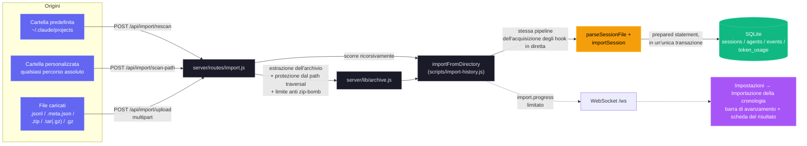

**Route**

| Metodo | Percorso | Descrizione |
| ------ | ----------------------- | ------------------------------------------------------------------------ |
| `GET` | `/api/import/guide` | Percorsi di sistema, comando di archiviazione, estensioni e istruzioni in base al provider (`?provider=claude\|codex`) |
| `POST` | `/api/import/rescan` | Riscansiona la posizione predefinita scelta: `~/.claude/projects` o `~/.codex/sessions` (`{ provider }`) |
| `POST` | `/api/import/scan-path` | Scansiona una directory assoluta con `{ path, provider }`; scorre ricorsivamente |
| `POST` | `/api/import/upload` | Caricamento multipart di `.jsonl`, `.meta.json`, `.zip`, `.tar(.gz)`, `.gz` con `provider` |

**Input supportati.** Trascrizioni di sessione JSONL singole (`.jsonl`), i relativi
file di accompagnamento `.meta.json` e archivi (`.zip`, `.tar`,
`.tar.gz`/`.tgz`, `.gz` semplice) con qualsiasi struttura di directory annidata.
Entrambe le strutture canoniche di Claude Code vengono riconosciute automaticamente:
`<project>/<sessionId>/subagents/agent-*.jsonl` (predefinita) e
`<project>/subagents/<sessionId>/agent-*.jsonl` (alternativa).
Per Codex, l'importatore riconosce ricorsivamente i file di sessione `rollout-*.jsonl`
(compresi i file JSONL singoli con `session_meta`) e un
`session_index.jsonl` facoltativo per i nomi nativi delle sessioni.

**Garanzie di accuratezza.** Le sessioni vengono deduplicate per UUID; rieseguire
l'importatore è sempre sicuro. Le colonne di compattazione `baseline_input` /
`baseline_output` / `baseline_cache_read` / `baseline_cache_write`
conservano i conteggi dei token di prima della compattazione di una trascrizione,
così riacquisire un JSONL successivo a una compattazione non cancella mai i costi storici.
La deduplicazione a livello di evento usa un valore massimo per tipo di evento
(`MAX(created_at) GROUP BY event_type` per la sessione): a ogni
reimportazione vengono inserite solo le voci JSONL con `ts > cutoff[type]`, così
le sessioni di lunga durata le cui trascrizioni crescono nell'arco di più giorni
continuano a ricevere eventi Stop / PostToolUse / TurnDuration / ToolError
senza duplicare il lavoro precedente. `sessions.ended_at` viene portato avanti
fino all'ultima attività del JSONL quando questa supera il valore
salvato, e i metadati sul numero di messaggi vengono aggiornati a ogni passaggio.

**Sicurezza con trascrizioni enormi.** La cache condivisa delle trascrizioni
(`server/lib/transcript-cache.js`) legge i file JSONL a blocchi di 4 MiB
e decodifica una sola riga alla volta, così le trascrizioni più grandi della
lunghezza massima di una stringa JS di V8 (~512 MiB su Node 20 a 64 bit) vengono analizzate
senza interrompere il processo con `FATAL ERROR: v8::ToLocalChecked Empty
MaybeLocal`. Lo stesso percorso a blocchi è usato dall'acquisizione degli hook, dalla
scansione periodica delle compattazioni e dall'importatore della cronologia — nessuno di essi
carica l'intero file come un'unica stringa JS. Gli array crescenti di ogni voce
(`turnDurations`, `errors`, `compaction.entries`,
`usageExtras.*`) sono limitati in coda a `TRANSCRIPT_CACHE_MAX_ARRAY_LEN`
(predefinito `1000`), con il taglio applicato già durante l'analisi a una soglia di `2 × cap`,
così una nuova analisi completa di una sessione di più giorni non può
costruire una struttura temporanea illimitata prima della finalizzazione.

**Sicurezza.** L'estrazione degli archivi verifica ogni voce contro il path
traversal (i percorsi assoluti e i segmenti `..` vengono rifiutati). Un
limite di estrazione configurabile (`CCAM_IMPORT_MAX_EXTRACT_BYTES`, predefinito
4 GB) blocca le bombe zip/tar/gzip. La dimensione dei caricamenti è limitata per file
(`CCAM_IMPORT_MAX_BYTES`, predefinito 1 GB) e per richiesta
(`CCAM_IMPORT_MAX_FILES`, predefinito 2000). Tutte le directory temporanee sono
per richiesta e vengono liberate in `finally`, anche quando multer rifiuta
tutti i file fin dall'inizio.

**Avanzamento.** L'attività di importazione viene trasmessa sul WebSocket esistente
come messaggi `import.progress` (`phase`: `start` / `scan` / `extract` /
`parse` / `complete` / `error`), limitati per non inondare il
canale durante le importazioni di grandi dimensioni.

**Interfaccia.** Usa il pannello **Impostazioni → Importazione della cronologia** per un'esperienza
guidata con trascinamento, istruzioni passo passo, avanzamento in diretta
e un riepilogo dopo l'importazione con i conteggi di elementi importati / arricchiti / saltati /
in errore.

<p align="center">
  
</p>

### WebSocket

Collegati a `ws://localhost:4820/ws` per ricevere messaggi push in tempo reale:

```json
{
  "type": "agent_updated",
  "data": { "id": "...", "status": "working", "current_tool": "Edit" },
  "timestamp": "2026-03-05T15:43:01.800Z"
}
```

**Tipi di messaggio:** `session_created`, `session_updated`, `agent_created`, `agent_updated`, `new_event`, `alert_triggered`, `alert_updated`, `remote_source.status` (dati `{ id, status: "idle"|"syncing"|"ok"|"error"|"deleted", error?, last_sync_at? }`)

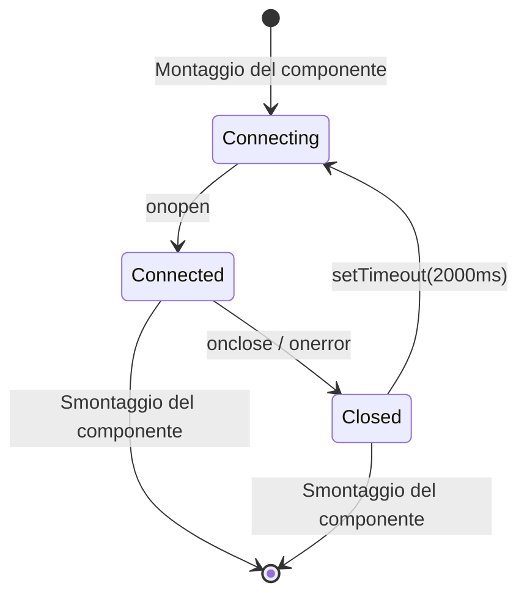

---

## Eventi hook

La dashboard elabora questi tipi di hook di Claude Code:

| Tipo di hook | Attivazione | Azione della dashboard |
| ------------------- | ------------------------------ | -------------------------------------------------------------------------------------------- |
| `SessionStart` | Inizia una sessione di Claude Code | Crea la sessione e l'agente principale. Imposta `awaiting_input_since` (con `awaiting_reason=session_start`) così una sessione nuova finisce in **In attesa** — tranne un SessionStart con origine `compact` (compattazione automatica a metà turno), che lascia intatto il flag così una sessione al lavoro resta **Attiva**. Riattiva le sessioni riprese. Abbandona le sessioni orfane senza attività da `DASHBOARD_STALE_MINUTES` (predefinito 180) |
| `UserPromptSubmit` | L'utente invia un prompt | Azzera il flag di attesa e porta l'agente principale a `working` — l'unico segnale dell'inizio dei turni dell'assistente di solo testo, dato che non emettono `PreToolUse` |
| `PreToolUse` | Un agente inizia a usare uno strumento | Azzera il flag di attesa, imposta l'agente su `working` e `current_tool`. Se lo strumento è `Agent`, crea un record di subagente |
| `PostToolUse` | Esecuzione dello strumento completata | Azzera il flag di attesa (gestisce le approvazioni delle richieste di permesso in cui la Notification lo aveva impostato a metà strumento). Azzera `current_tool`. L'agente resta `working` |
| `Stop` | Claude ha finito di rispondere | Senza errori: agente principale → `waiting` — Claude ha terminato il suo turno, la palla passa all'utente. `stop_reason=error`: imposta l'agente e la sessione su `error`. I subagenti in background continuano a funzionare |
| `SubagentStop` | Un agente in background ha terminato | Associa e completa il subagente per descrizione, tipo o attività. Volutamente NON azzera il flag di attesa — la fine di un subagente non dice nulla sulla persona. **Avvia senza attendere una scansione JSONL** (`scanAndImportSubagents`) che emette eventi `PreToolUse` + `PostToolUse` per ogni strumento sotto l'`agent_id` del subagente, così la Cronologia mostra ogni strumento eseguito dal subagente, non solo il marcatore di avvio |
| `Notification` | Notifica di un agente | Registra l'evento. I messaggi di richiesta di permesso/input impostano l'agente su `waiting` e registrano `awaiting_input_since` (con `awaiting_reason=notification`, riconosciuti tramite pattern: `permission`, `waiting for input`, `needs your approval`, …). Le notifiche di compattazione vengono contrassegnate come eventi `Compaction`. Attiva una notifica del browser se abilitata |
| `SessionEnd` | Il processo della CLI di Claude Code termina | Rimuove il flag di attesa. Se la sessione è già in `error`, lo stato di errore viene mantenuto; altrimenti tutti gli agenti e la sessione vengono segnati come `completed` |
| `Compaction` | `/compact` rilevato nel JSONL | Crea un subagente di compattazione (tipo `compaction`) e un evento Compaction. Rilevato tramite le voci `isCompactSummary` nel JSONL della trascrizione. Rilevato anche dallo scanner periodico per le sessioni attive |
| `APIError` | Errore API nella trascrizione JSONL | Estratto dalle voci `isApiErrorMessage` (quota, limite di frequenza, invalid_request) e dalle risposte grezze `type: "error"`. **Ora imposta subito la sessione e l'agente su `error`** — in precedenza veniva registrato come evento senza cambiare stato. Salvato come evento con i dettagli dell'errore |
| `TurnDuration` | Durata del turno nella trascrizione JSONL | Estratto dai messaggi `system` con sottotipo `turn_duration` e `durationMs`. Salvato come evento per l'analisi delle durate dei turni |
| `ToolError` | Errore nel risultato di uno strumento nel JSONL | Estratto dalle voci `toolUseResult.is_error`. Traccia i fallimenti a livello di strumento per l'analisi della propagazione degli errori |
| `RemoteToolEvent` | Chiamata a uno strumento inviata da una macchina remota | Scritto da `POST /api/hooks/ingest-batch` per ogni elemento di `tool_events[]` inviato da una macchina in movimento/dietro NAT. Deduplicato per `(session_id, event_type, uuid)` rispetto alle righe salvate e all'interno del batch, quindi reinviare un batch è sicuro |
| `RemoteTurn` | Durata del turno inviata da una macchina remota | Scritto da `POST /api/hooks/ingest-batch` per ogni elemento di `turns[]`, con il `duration_ms` di quel turno. Stessa deduplicazione per `(session_id, event_type, uuid)` di `RemoteToolEvent` |
| `Interrupted` | Turno annullato dall'utente (Esc) | Generato dal watchdog — `Esc` non attiva alcun hook, quindi una sessione bloccata in `working` viene rilevata dal marcatore `[Request interrupted by user]` della trascrizione oppure, se Esc è stato premuto prima di qualsiasi output, dal timeout di inattività in lavorazione (`DASHBOARD_WORKING_IDLE_SECONDS`). La sessione passa a **In attesa** (come dopo un normale `Stop`) |

---

## Notifiche del browser

La dashboard supporta notifiche persistenti del browser tramite Web Push (VAPID) per avvisi in tempo reale anche quando la scheda della dashboard non ha il focus o il browser è in background.

### Come funziona

1. **Attiva** le notifiche nella pagina Impostazioni tramite l'interruttore generale
2. **Concedi** il permesso del browser quando richiesto — questo registra un Service Worker e crea una sottoscrizione push
3. **Configura** quali eventi attivano le notifiche:

| Evento | Predefinito | Descrizione |
| ---------------------------- | ------- | --------------------------------------------------------------- |
| Nuova sessione avviata | Attivo | Scatta quando viene creata una nuova sessione di Claude Code |
| Claude ha finito di rispondere | Disattivo | Scatta sugli eventi `Stop` quando Claude termina un turno di risposta |
| Sessione chiusa | Disattivo | Scatta su `SessionEnd` quando il processo della CLI termina |
| Errori di sessione | Attivo | Scatta quando una sessione termina con un errore |
| Subagente avviato | Disattivo | Scatta quando viene creato un subagente in background |

Inoltre, qualsiasi evento hook `Notification` di Claude Code attiva una notifica del browser indipendentemente dagli interruttori per evento (purché l'interruttore generale sia attivo).

### Architettura delle notifiche

- **Pipeline VAPID:** usa `web-push` sul server per una consegna sicura dei messaggi. Le chiavi VAPID vengono generate automaticamente e salvate in `data/vapid-keys.json`.
- **Service Worker:** un worker dedicato (`client/public/sw.js`) gestisce gli eventi `push` in arrivo e mostra le notifiche con `silent: false` per garantire la riproduzione audio su macOS.
- **Sottoscrizioni:** gli endpoint specifici di ogni browser vengono salvati nella tabella `push_subscriptions` di SQLite.
- **Persistenza:** le notifiche arrivano anche con il browser chiuso, perché il Service Worker opera in background.
- **Notifica di prova:** un pulsante nelle Impostazioni permette di verificare la pipeline VAPID e la riproduzione audio.

### PWA e supporto offline

Il progetto include tre Progressive Web App indipendenti — una per la **dashboard**, una per la **landing page** e una per il **wiki**. Ognuna ha il proprio `manifest.json` e il proprio Service Worker, così il browser le tratta come applicazioni installabili separate.

| Superficie | Manifest | Service Worker | Strategia di cache |
| --- | --- | --- | --- |
| Dashboard (`client/`) | `client/public/manifest.json` | `client/public/sw.js` | I bundle di Vite con hash del contenuto in `/assets/*` sono serviti con strategia cache-first (gli URL sono immutabili per build). Tutto il resto — navigazioni, il SW stesso, `manifest.json`, icone, la radice `/` — usa network-first con ripiego sulla cache, così una nuova build mostra sempre l'interfaccia più aggiornata senza ricaricamento forzato. Le richieste API (`/api/*`), WebSocket (`/ws`) e HMR di Vite non vengono mai messe in cache. I gestori delle notifiche push sono mantenuti accanto alla logica di cache. Il middleware statico di Express (`server/index.js`) lo rafforza inviando `Cache-Control: public, max-age=31536000, immutable` per `/assets/*` e `Cache-Control: no-cache, must-revalidate` per `index.html`, `sw.js` e `manifest.json`. `client/src/main.tsx` ascolta `controllerchange`: quando un nuovo SW si attiva su una pagina già controllata, la ricarica esattamente una volta (non alle prime installazioni). |
| Landing page (radice) | `manifest.json` | `sw.js` | Mette in cache in anticipo la struttura HTML, la favicon e l'immagine OG. Gli screenshot PNG vengono messi in cache alla prima visualizzazione (cache-first) per evitare una cache iniziale pesante. La navigazione è network-first con ripiego offline. |
| Wiki (`wiki/`) | `wiki/manifest.json` | `wiki/sw.js` | Mette in cache in anticipo `index.html`, `style.css`, `script.js`, il manifest e la favicon. Interamente utilizzabile offline dopo una visita. HTML network-first, CSS/JS cache-first. |

**Ciclo di vita della cache:** tutti e tre i SW chiamano `skipWaiting()` all'installazione ed eliminano le cache obsolete all'attivazione (identificate da stringhe di versione come `dashboard-v2`, `landing-v1`, `wiki-v1`). Incrementare la costante di versione forza un aggiornamento pulito.

**Supporto iOS:** tutti e tre i file HTML includono `<meta name="apple-mobile-web-app-capable" content="yes">` e `<meta name="apple-mobile-web-app-status-bar-style" content="black-translucent">` per la modalità standalone nella schermata home di Safari.

**Icone:** i manifest fanno riferimento a `favicon.svg` con `sizes="any"` e `type="image/svg+xml"` — supportato da Chrome 107+, Firefox 110+, Edge 107+. Anche le icone Apple touch usano la favicon SVG.

---

## Notifica degli aggiornamenti

La dashboard osserva il proprio checkout git e mostra una finestra ogni volta che il branch predefinito canonico ha commit più avanti di HEAD. **Consapevole di branch e fork:** se hai un remote `upstream` (la convenzione standard per i fork), viene preferito a `origin`; `master`/`main`/`HEAD` del remote scelto fa da riferimento per il confronto. Il `manual_command` si adatta alla tua situazione — `git pull --ff-only` solo quando il tuo branch segue davvero il riferimento canonico, altrimenti un `git fetch` (e un merge fast-forward nel caso di un fork), così il comando non mente mai. Gli utenti ottengono il comando esatto da eseguire in un terminale — il server non esegue **mai** pull né si riavvia da solo, e questo mantiene il meccanismo portabile tra sessioni di sviluppo, supervisione con pm2/systemd/launchd/Docker e deploy remoti.

<p align="center">
  
</p>

### Come funziona

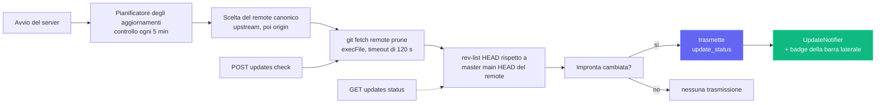

Un singolo controllo è economico (`git fetch <remote> --prune` sul remote canonico — `upstream` se configurato, altrimenti `origin`), racchiuso in `execFile` (senza shell) con un timeout di 120 s. Gli errori — rete offline, installazione senza git, nessun remote configurato, riferimento upstream non risolvibile — restituiscono tutti **payload morbidi** (ad es. `fetch_error: "..."`) invece di sollevare un'eccezione, così un remote instabile non blocca mai la dashboard.

### Superfici dell'interfaccia

| Superficie | Comportamento |
| --- | --- |
| **Finestra** (`client/src/components/UpdateNotifier.tsx`) | Compare quando `update_available === true` e l'utente non ha già ignorato quello specifico `remote_sha`. Mostra quanti commit mancano, il riferimento seguito, una `situation_note` facoltativa (su un branch di funzionalità / un fork la nota spiega perché il comando è diverso), il comando da copiare e incollare e tre pulsanti: **Copia comando** (principale), **Controlla ora**, **Ignora**. Esc e i clic sullo sfondo la chiudono. Indicizzata per `remote_sha` in `localStorage`, così un commit upstream più recente riapre automaticamente la finestra. |
| **Pulsante della barra laterale** (`client/src/components/Sidebar.tsx`) | Pulsante "Controlla aggiornamenti" sempre visibile nel piè di pagina. Bordo smeraldo + punto verde quando sei indietro, ambra quando l'ultimo controllo ha incontrato un errore di fetch. Un clic cancella qualsiasi rifiuto precedente e poi attiva `POST /api/updates/check`. |
| **Terminale del server** | Quando il pianificatore passa da "aggiornato" a "indietro", stampa su stdout un blocco incorniciato con il comando, così lo vedono anche gli utenti senza interfaccia. |

### Superficie dell'API

| Endpoint | Scopo |
| --- | --- |
| `GET /api/updates/status` | Controllo in sola lettura: esegue `git fetch` sul remote canonico, confronta HEAD con il suo branch predefinito e restituisce il payload. |
| `POST /api/updates/check` | Stesso controllo, ma trasmette anche `update_status` via WebSocket così tutti i client connessi si aggiornano in una volta. |

Entrambi gli endpoint restituiscono la stessa struttura di payload:

```json
{
  "git_repo": true,
  "update_available": true,
  "repo_root": "/Users/you/Claude-Code-Agent-Monitor",
  "remote_ref": "upstream/master",
  "canonical_remote": "upstream",
  "current_branch": "master",
  "tracking_upstream": "origin/master",
  "tracks_canonical": false,
  "situation": "fork_or_diverged_tracking",
  "local_sha": "abc1234...",
  "remote_sha": "def5678...",
  "commits_behind": 3,
  "manual_command": "cd \"/...\" && git fetch upstream && git merge --ff-only upstream/master && npm run setup",
  "situation_note": "You're on 'master' tracking 'origin/master'. This command fast-forwards your branch from upstream/master (the canonical default).",
  "message": "3 commit(s) on upstream/master not in your checkout."
}
```

`situation` è uno fra `tracking_canonical` (clone tipico sul branch predefinito — `git pull --ff-only` funziona), `fork_or_diverged_tracking` (il nome del branch locale coincide con quello canonico, ma segue un altro remote — `git fetch <remote> && git merge --ff-only <ref>`), `feature_branch` (fuori dal branch predefinito — solo fetch, l'integrazione è lasciata all'utente) o `detached_head`.

### Cosa **volutamente non** c'è

Non esiste un `POST /api/updates/apply` né un helper di riavvio automatico, per scelta progettuale. Aggiornare un processo dall'interno non è affidabile senza un supervisore esterno — `npm run dev` (concurrently), `npm start`, `pm2`, `systemd`, `launchd` e Docker richiedono ciascuno una logica di riavvio diversa, e i fallimenti di `git pull` / `npm install` su un server che si sta chiudendo non hanno un percorso di rollback pulito. Limitarsi al rilevamento mantiene il comportamento prevedibile con qualsiasi supervisore, sistema operativo e stato del branch, colmando comunque la lacuna informativa "quando devo fare pull?"; l'aggiornamento vero e proprio resta all'utente, nella sua shell.

### Configurazione

| Variabile d'ambiente | Predefinito | Note |
| --- | --- | --- |
| `DASHBOARD_UPDATE_CHECK` | attivo | Impostare a `0` / `false` / `off` per disattivare completamente il pianificatore. |
| `DASHBOARD_UPDATE_CHECK_INTERVAL_MS` | `300000` (5 min) | Intervallo tra i controlli automatici. Il minimo è 60 000 ms — i valori inferiori vengono riportati a questa soglia. |

---

## Tabby — il gatto compagno fluttuante

**Tabby** è un simpatico gatto compagno fluttuante fissato nell'angolo in basso a destra di ogni pagina della dashboard. Sempre presente, trasforma il flusso delle sessioni in diretta in una mascotte reattiva, leggibile a colpo d'occhio, con cui puoi anche parlare.

<p align="center">
  
</p>

### Mascotte reattiva

Tabby è un gatto SVG che segue il cursore, con **otto stati d'animo** derivati dal flusso delle sessioni in diretta, ciascuno con la propria animazione:

| Stato d'animo | Quando | Animazione |
| --- | --- | --- |
| `idle` | Non succede nulla di rilevante | Colpo di coda a riposo |
| `watching` | Ci sono sessioni attive | Orecchie dritte, occhi che seguono il cursore |
| `happy` | Una sessione o un'esecuzione è terminata senza problemi | Cenno del capo + scintille |
| `worried` | Qualcosa non sembra a posto | Leggero tremore |
| `stuck` | Una sessione sembra bloccata | Avviso "!" |
| `thinking` | Un agente è al lavoro | Lento cenno del capo |
| `sleeping` | Tutto tranquillo da un po' | `zzz` |
| `disconnected` | Il WebSocket è giù | Posa calma e immobile |

### Fumetti

Tabby mostra automaticamente brevi battute sugli eventi rilevanti (sessione avviata/terminata, errori, esecuzione completata). I fumetti sono **limitati e accorpati** così una raffica di eventi non intasa mai lo schermo, usano `aria-live` per gli screen reader e si possono **silenziare** dal pannello.

### Pannello

Apri il pannello cliccando sul gatto o premendo **⌘B / Ctrl+B** (Esc chiude). Mostra:

- Una **riga di stato** in diretta — `N live · M errored · connection state`.
- **Azioni rapide** — vai ad Avvia Claude, Attività, Sessioni o alle sessioni con errori; silenzia i fumetti; cancella gli avvisi.
- Una casella **Chiedi** (vedi sotto).

### Casella Chiedi → passaggio ad Avvia Claude

La casella **Chiedi** risponde localmente alle domande semplici sullo stato usando i dati in cache — per esempio "cosa è in esecuzione", "ci sono errori" o "stato". Qualsiasi altra domanda viene passata alla pagina **Avvia Claude** esistente (con link diretto a `/run?prompt=…`) per avviare una vera sessione di Claude Code. Tabby non chiama mai un LLM da solo; riusa semplicemente la pagina Avvia Claude per tutto ciò che va oltre una rapida consultazione dello stato.

### Accessibilità e degradazione sicura

Tabby è utilizzabile da tastiera, usa `aria-live` per i fumetti e rispetta `prefers-reduced-motion`. Se il WebSocket è giù, ripiega in sicurezza su uno stato tranquillo `disconnected` invece di generare errori. Puoi attivare o disattivare Tabby nelle **Impostazioni** (localizzato in inglese, cinese, vietnamita, coreano, spagnolo, francese, tedesco, portoghese e italiano), e l'implementazione si trova in `client/src/components/Tabby/`.

---

## Segnali acustici

La dashboard ti offre un **riscontro sonoro discreto** sull'attività delle sessioni in diretta, così puoi lasciarla su un secondo monitor e sentire comunque quando un'esecuzione termina o fallisce. Il suono è **attivo per impostazione predefinita** e si disattiva completamente con un clic.

### Sintesi senza dipendenze

Nel repository non c'è alcun file `.mp3` o `.wav` e nessuna libreria audio in `package.json`. Ogni segnale viene generato al momento con la **Web Audio API**: un breve elenco di oscillatori (sinusoidali o triangolari), ciascuno con il proprio inviluppo di guadagno esponenziale, mixati attraverso un nodo di guadagno principale e un filtro passa-basso così il risultato resta in secondo piano rispetto al tuo lavoro invece di interromperlo. L'intero motore è un solo file, `client/src/lib/sound.ts`.

### I segnali

| Segnale | Quando scatta | Come suona |
| --- | --- | --- |
| `sessionStart` | Compare una nuova sessione | Quinta giusta ascendente (Do5 → Sol5) |
| `sessionComplete` | Una sessione finisce di rispondere (`Stop`) o si chiude (`SessionEnd`) | Arpeggio maggiore risolutivo (Mi5 → Sol5 → Do6) |
| `sessionError` | Una sessione entra nello stato `error` | Morbida terza minore discendente su un'onda triangolare — percepibile, non allarmante |
| `subagentSpawn` | Viene avviato un subagente | Un singolo pizzico breve |
| `notification` | Claude Code emette un evento `Notification` | Coppia stonata che suona come una piccola campana |
| `connected` / `disconnected` | Il WebSocket della dashboard torna o cade | Salita / discesa di due note |
| `click` | Premi un pulsante, un link, una scheda o un interruttore | Tic appena udibile |

I segnali stanno all'interno di una scala di do maggiore, così le code che si sovrappongono non suonano mai dissonanti, e ogni inviluppo decade in modo esponenziale invece di interrompersi di colpo, evitando il clic di un arresto brusco.

### Senza disturbare

Tre protezioni evitano che il suono diventi rumore:

- **Tempo di attesa per segnale** — lo stesso segnale non si ripete entro ~350 ms (45 ms per il tic di interazione).
- **Budget globale di raffica** — al massimo 4 segnali partono in una finestra di 1,2 s, così importare la cronologia o riconnettersi dopo una caduta non trasforma mai una marea di messaggi WebSocket in una marea di bip.
- **Politica di riproduzione automatica** — nulla suona prima della tua prima interazione con la pagina (puntatore, tasto o tocco), secondo le regole dei browser. I segnali precedenti vengono scartati in silenzio, non messi in coda.

Se il browser non supporta affatto Web Audio, ogni chiamata è un'operazione nulla sicura — la dashboard resta semplicemente in silenzio.

### Impostazioni

**Impostazioni → Suono** offre un interruttore generale, un cursore del volume e un interruttore per ogni segnale. Attivando un interruttore il segnale suona subito, così senti esattamente cosa hai appena abilitato, e un pulsante **Ascolta il suono** riproduce su richiesta il suono di completamento. Le preferenze vengono salvate in `localStorage` sotto `agent-monitor-sound` e hanno effetto immediato in tutta l'app — senza ricaricare. Il pannello è localizzato in inglese, cinese, vietnamita, coreano, spagnolo, francese, tedesco, portoghese e italiano.

Per impostazione predefinita sono attivi avvio della sessione, completamento della sessione, errore della sessione, notifiche di Claude Code e il tic di interazione; l'avvio dei subagenti e i cambi di connessione sono disattivati (sono i più loquaci). L'implementazione si trova in `client/src/lib/sound.ts` (motore + preferenze) e `client/src/hooks/useSoundCues.ts` (collegamento al bus degli eventi), montato una sola volta in `client/src/App.tsx`.

---

## Finestra dello stato della connessione

Clicca sulla pillola **In diretta** / **Disconnesso** nel piè di pagina della barra laterale per aprire un piccolo pannello di dettagli sul trasporto WebSocket della dashboard. Mostra l'endpoint `ws://` attivo, da quanto tempo è aperto il socket corrente, il totale degli eventi ricevuti, i principali tipi di evento come grafico a barre orizzontali, una sparkline della portata sugli ultimi 60 secondi e gli ultimi 8 eventi in un elenco dell'attività recente. Le statistiche cumulative (totali, ripartizione per tipo, elenco recente) restano tra un ricaricamento e l'altro tramite `localStorage` sotto `sidebar-connection-stats`; la sparkline mobile e il timer "connesso da" sono volutamente effimeri. Un pulsante **Reimposta** nel piè di pagina cancella tutto su richiesta.

<p align="center">
  
</p>

---

## Estensione per VS Code

**Claude Code Agent Monitor** è disponibile come estensione per VS Code a tutti gli effetti, così puoi monitorare i tuoi agenti di IA senza lasciare l'editor.

<p align="center">
  
</p>

### 🚀 Funzionalità principali
- **Barra laterale in diretta**: vista dedicata nella barra delle attività che mostra in tempo reale lo stato degli agenti (Al lavoro, In attesa, Completato, ecc.).
- **Analisi dell'utilizzo**: tieni traccia del totale dei token, dei costi in USD in diretta e del numero di eventi direttamente nella barra laterale.
- **Integrazione nella barra di stato**: monitor dell'attività a colpo d'occhio nella barra inferiore, con sessioni e agenti attivi.
- **Navigazione diretta**: accesso con un clic a viste specifiche della dashboard (Kanban, Analisi, Impostazioni) o alle sessioni recenti.
- **Scheda integrata**: apre l'intera dashboard di monitoraggio come scheda webview nativa di VS Code.

### 📦 Installazione e configurazione
1. Apri la directory [vscode-extension](./vscode-extension).
2. Installa l'estensione dal Marketplace o impacchettala tu stesso con `vsce package`.
3. Assicurati che il server locale della dashboard sia in esecuzione (`npm run dev`).
4. Clicca sull'**icona del radar** nella barra delle attività di VS Code per iniziare.

Per la configurazione dettagliata per gli sviluppatori, vedi le directory [.vscode](./.vscode) e [vscode-extension](./vscode-extension).

> [!TIP]
> Estensione sul VS Code Marketplace: [Claude Code Agent Monitor](https://marketplace.visualstudio.com/items?itemName=hoangsonw.claude-code-agent-monitor)

---

## App desktop (macOS e Windows)

La dashboard è disponibile anche come **applicazione desktop nativa** facoltativa, da installare una volta e dimenticare — una `.app` per macOS (distribuita come `.dmg`) e un `.exe` per Windows (un installer NSIS più una versione portatile senza installazione). Si trova nello spazio di lavoro `desktop/`, accanto a `client/`, `server/`, `mcp/` e `vscode-extension/`, ed è realizzata con **Electron 35**.

<p align="center">
  
  <br>
  <em>🍎🪟 <strong>App desktop</strong> — shell nativa con icona nella barra dei menu / area di notifica (tray), apertura all'accesso e blocco di istanza singola. La stessa dashboard, in una vera finestra del sistema (qui macOS).</em>
</p>

<p align="center">
  
  <br>
  <em>🪟 La stessa dashboard come app nativa di Windows — icona nell'area di notifica (tray), menu della finestra nativo e apertura all'accesso.</em>
</p>

Tutto ciò che vedi nel browser su `localhost:4820` vive in questa finestra, con in più il ciclo di vita nativo del sistema: un'icona nel tray, un menu applicativo nativo, l'integrazione con l'avvio automatico e un unico pulsante di uscita che arresta il server in modo pulito.

### Come funziona

A differenza dell'avvio della dashboard da un terminale, l'app desktop non richiede `npm start`, né una shell aperta, né una seconda copia del server. Il **processo principale** di Electron ospita il server Express **nello stesso processo** — fa `require()` di `server/index.js` direttamente nello stesso runtime Node, **senza processi figli né IPC** — e punta una `BrowserWindow` di Chromium al client React compilato.

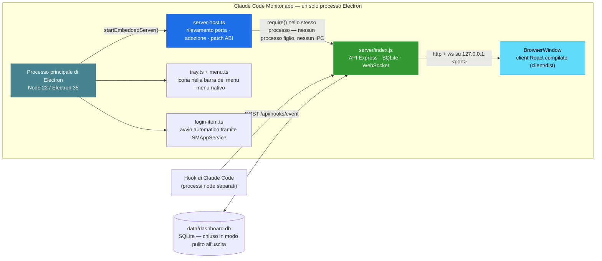

All'avvio l'app:

1. Sceglie una porta libera — preferibilmente la **4820**, altrimenti **4821–4829**, poi una porta alta casuale se sono tutte occupate.
2. Se un server della dashboard sano risponde già a `/api/health` sulla `4820` (ad es. hai eseguito `npm start` in un terminale), **adotta quel server** invece di effettuare un doppio bind — nessun conflitto di porta, nessuna contesa su SQLite. Un server adottato continua a funzionare dopo la chiusura dell'app.
3. Altrimenti avvia il server incorporato e, al **primo avvio con server proprio**, installa automaticamente gli hook di Claude Code e avvia i servizi in background (pianificatore degli aggiornamenti, `cc-watcher`, riconciliazione delle esecuzioni orfane). Chi installa solo il DMG vede quindi arrivare gli eventi **senza alcuna configurazione manuale** — niente checkout, niente `npm run install-hooks`.
4. **(macOS)** Recupera il **`PATH` della shell di login** così la funzione **Avvia Claude** può trovare e avviare la CLI `claude` — un'app aperta da Finder/Dock eredita altrimenti solo il `PATH` minimo di launchd e non troverebbe le CLI in `~/.local/bin`, `/opt/homebrew/bin`, nelle directory dei gestori di versione, ecc. (Su Windows il processo eredita già il `PATH` dell'utente.)
5. Apre la finestra della dashboard — a meno che l'app non sia stata avviata all'accesso (su macOS tramite gli elementi di login; su Windows tramite la voce contrassegnata `HKCU\…\Run`), nel qual caso resta solo nel tray.
6. All'uscita arresta in modo ordinato il server incorporato e **chiude SQLite in modo pulito** (checkpoint del WAL).

### Funzionalità

- **Icona nel tray** — superficie di stato sempre presente (barra dei menu di macOS / area di notifica di Windows). Il clic sinistro mostra/nasconde la finestra della dashboard; il clic destro apre un menu contestuale con **Apri dashboard**, **Apri nel browser**, **Riavvia il server**, **Mostra i log**, **Apri all'accesso** (interruttore) ed **Esci**. macOS usa un glifo modello colorato; Windows usa l'`icon.ico` a colori (un modello nero sparirebbe sulla barra delle applicazioni scura).
- **Icona della finestra e della barra delle applicazioni** — la `BrowserWindow` usa il logo a colori dell'app (`icon.ico` su Windows, `icon.png` altrove), così la barra del titolo / delle applicazioni mostra la vera icona di Claude Code Monitor — anche un'esecuzione non impacchettata con `npm run desktop:dev` non mostra più l'icona generica di Electron.
- **Menu applicativo nativo** — menu standard `About` / `File` / `Edit` / `View` / `Window` / `Help` con scorciatoie `⌘` / `Ctrl`. La voce **File → Open Dashboard** (`⌘1`) è **solo per macOS**: macOS mantiene una barra dei menu globale anche quando la finestra è nascosta e quindi può riaprirla — su Windows/Linux il menu è legato alla finestra e non può attivarsi mentre è nascosta, quindi riaprila invece da **Apri dashboard** nel tray (che porta in primo piano la finestra in modo affidabile, anche se ridotta a icona o dietro altre finestre).
- **Avvio automatico all'accesso** — attiva **Apri all'accesso** dal tray o dal menu dell'app. Su macOS la registrazione passa per la moderna API `SMAppService`, così la voce compare in **Impostazioni di Sistema → Generali → Elementi login**; su Windows viene scritta una voce per utente in `HKCU\Software\Microsoft\Windows\CurrentVersion\Run`, visibile in **Gestione attività → Avvio**.
- **Chiudere la finestra la nasconde, il server continua** — chiudere la finestra la nasconde soltanto; il server e il tray restano attivi. Clicca sul tray per far tornare la finestra.
- **Blocco di istanza singola** — un secondo avvio porta semplicemente in primo piano la finestra esistente; nessun secondo server, nessun conflitto di porta. (Vale su tutte le piattaforme.)
- **I dati sopravvivono a reinstallazioni e aggiornamenti** — il database SQLite e le chiavi VAPID si trovano nella directory dei dati dell'app per utente, **fuori dal bundle / dalla directory di installazione** — `~/Library/Application Support/Claude Code Monitor/data/` su macOS, `%APPDATA%\Claude Code Monitor\data\` su Windows. Un bundle impacchettato è in sola lettura, quindi scriverci dentro il database romperebbe l'Importazione della cronologia e la persistenza degli eventi; tenerlo nei dati dell'app risolve il problema e lascia intatta la cronologia importata quando sostituisci o aggiorni l'app. (Il disinstallatore NSIS di Windows mantiene questi dati per impostazione predefinita.)
- **CLI `claude` nel PATH** — su macOS l'app recupera all'avvio il `PATH` della tua shell di login, così la funzione **Avvia Claude** funziona anche se un'app aperta da Finder/Dock erediterebbe altrimenti solo il `PATH` minimo di launchd. (Su Windows il `PATH` utente ereditato lo include già.)
- **Log** — il processo principale scrive in `~/Library/Logs/Claude Code Monitor/desktop.log` (macOS) o `%APPDATA%\Claude Code Monitor\logs\desktop.log` (Windows); raggiungibili da **Mostra i log** nel menu del tray.

### Scaricarla

**Opzione A — scaricare un installer già pronto (consigliato).** Da **[Releases → latest](https://github.com/hoangsonww/Claude-Code-Agent-Monitor/releases/latest)** (pubblico, senza accesso a GitHub). La CI pubblica automaticamente una nuova release `vX.Y.Z` ogni volta che la versione in `package.json` viene incrementata su `master`, quindi questo link fornisce sempre la build attuale:

| Piattaforma | File | Note |
| --- | --- | --- |
| macOS (Apple Silicon) | `ClaudeCodeMonitor-<ver>-arm64.dmg` | trascina in `/Applications` |
| macOS (Intel) | `ClaudeCodeMonitor-<ver>-x64.dmg` | trascina in `/Applications` |
| Windows (installer) | `ClaudeCodeMonitor-Setup-<ver>-x64.exe` | installazione per utente, senza amministratore |
| Windows (portatile) | `ClaudeCodeMonitor-<ver>-x64-portable.exe` | si esegue senza installazione |

Build aggiornate per ogni commit sono disponibili anche come artefatti della CI (accesso richiesto, conservazione di 14 giorni): `ClaudeCodeMonitor-dmg` dal job `🍎 macOS Desktop (DMG)` e `ClaudeCodeMonitor-win` dal job `🪟 Windows Desktop (EXE)` — utili per provare `master` prima del prossimo tag di release.

**Opzione B — compilarla da solo.** Dalla radice del repository:

```bash
npm run setup                # install root + client deps, build client, install hooks
npm run build                # build the React client (client/dist)
npm run desktop:install      # install Electron + electron-builder into desktop/ (preflights native deps; prints setup help on failure)
npm run desktop:dmg:arm64    # macOS:   fast single-arch DMG → desktop/release/ClaudeCodeMonitor-<ver>-arm64.dmg
npm run desktop:win          # Windows: NSIS installer → desktop/release/ClaudeCodeMonitor-Setup-<ver>-x64.exe
```

> [!NOTE]
> **I DMG si compilano su macOS; gli `.exe` di Windows su Windows** — electron-builder impacchetta per il sistema operativo host. La build macOS `npm run desktop:dmg` impacchetta l'app **due volte** (una per architettura) e produce **entrambi** i DMG per architettura (`arm64` + `x64`) — è la build di release; non li unisce in un binario universale. Per il tuo Mac usa i target a singola architettura `desktop:dmg:arm64` / `desktop:dmg:x64`. Su Windows, `better-sqlite3` viene scaricato come binario Electron precompilato da `npm run desktop:install`, quindi nel caso comune non serve la toolchain C++ di Visual Studio. Se la build fallisce comunque (nessun binario precompilato o toolchain C++ mancante), `desktop:install` stampa la correzione esatta per ciascun sistema più un'alternativa senza toolchain e fallisce in modo esplicito invece di lasciare un'installazione rotta.

### Installarla

**macOS:**

1. Fai doppio clic sul `.dmg` per montarlo.
2. Trascina **Claude Code Monitor.app** nella cartella `/Applications`.
3. Il DMG è **firmato ad hoc** per impostazione predefinita, quindi Gatekeeper avvisa al primo avvio (*"Apple non ha potuto verificare…"*). Rimuovi l'attributo di quarantena:

   ```bash
   xattr -cr "/Applications/Claude Code Monitor.app"
   ```

   Oppure apri **Impostazioni di Sistema → Privacy e sicurezza** e clicca **Apri comunque**.

4. Avvia l'app. Compare l'icona nel tray e si apre la finestra della dashboard.

**Windows:**

1. Esegui `ClaudeCodeMonitor-Setup-<ver>-x64.exe`. Si installa **per utente** in `%LOCALAPPDATA%\Programs\Claude Code Monitor` (senza elevazione ad amministratore) e ti permette di scegliere la directory di installazione; in alternativa esegui il `*-portable.exe` per avviarla senza installare.
2. L'installer **non è firmato** per impostazione predefinita, quindi **SmartScreen** di Windows può mostrare *"PC protetto da Windows"* al primo avvio — clicca **Ulteriori informazioni → Esegui comunque**.
3. Avviala dal menu Start / dal collegamento sul desktop. Compare l'icona nell'area di notifica (tray) e si apre la finestra della dashboard.

<p align="center">
  
  <br>
  <em>Installer di Windows · Passaggio 1 — <strong>Choose Installation Options</strong> (per utente "Only for me" o tutti gli utenti).</em>
</p>

<p align="center">
  
  <br>
  <em>Installer di Windows · Passaggio 2 — <strong>Choose Install Location</strong> (predefinita per utente <code>%LOCALAPPDATA%\Programs</code>).</em>
</p>

<p align="center">
  
  <br>
  <em>Installer di Windows · Passaggio 3 — <strong>Completing Setup</strong> (termina e avvia l'app).</em>
</p>

### Comandi di build

Tutti i comandi si eseguono dalla **radice del repository**:

| Comando | Cosa fa |
| --------------------------- | ---------------------------------------------------------------------------- |
| `npm run desktop:install` | Installa Electron + electron-builder in `desktop/`; ricompila `better-sqlite3` per l'ABI di Electron; verifica in anticipo la build nativa di `better-sqlite3` e, in caso di errore, mostra un aiuto pratico per la configurazione (inclusa un'alternativa senza toolchain) |
| `npm run desktop:build` | Compila i sorgenti TypeScript del desktop in `desktop/out/` |
| `npm run desktop:dev` | Compila e avvia l'app Electron per lo sviluppo locale |
| `npm run desktop:test` | Esegue lo smoke test (avvia Electron, interroga `/api/health`, chiude) |
| `npm run desktop:dmg` | **macOS:** costruisce **entrambi** i DMG (arm64 + x64) — corretto per una release, **più lento** (impacchetta ogni architettura) |
| `npm run desktop:dmg:arm64` | **macOS:** costruisce un DMG solo per Apple Silicon — **veloce** (~1 min), consigliato per il tuo Mac |
| `npm run desktop:dmg:x64` | **macOS:** costruisce un DMG solo per Intel — **veloce** (~1 min) |
| `npm run desktop:dmg:universal` | **macOS:** costruisce un unico DMG **universale** unificato (arm64 + x86_64) — facoltativo, **il più lento**, non è ciò che distribuisce la release |
| `npm run desktop:win` | **Windows:** costruisce l'installer NSIS `.exe` (x64) |
| `npm run desktop:win:portable` | **Windows:** costruisce il `.exe` portatile senza installazione (x64) |

Il DMG per macOS risultante pesa **~80 MB** (≈ 250 MB su disco una volta installato) e l'installer di Windows è simile — il costo abituale di un bundle Electron.

### Firma e notarizzazione

Il DMG per macOS è **firmato ad hoc** per impostazione predefinita, così chiunque può compilare una `.app` funzionante senza un account Apple Developer a pagamento — lo script `package` imposta `CSC_IDENTITY_AUTO_DISCOVERY=false` così un certificato di firma già presente nel portachiavi di chi contribuisce non viene mai scelto automaticamente. La vera **firma Developer ID** si attiva su richiesta tramite `CSC_LINK` (un `.p12` codificato in base64) e `CSC_KEY_PASSWORD`; la **notarizzazione Apple** si attiva su richiesta tramite `APPLE_ID`, `APPLE_TEAM_ID` e `APPLE_APP_SPECIFIC_PASSWORD`. La build **Windows** **non è firmata** per impostazione predefinita (SmartScreen può avvisare al primo avvio — *Ulteriori informazioni → Esegui comunque*); la firma Authenticode si attiva solo quando viene fornito esplicitamente un certificato tramite `CSC_LINK` + `CSC_KEY_PASSWORD`. La CI usa automaticamente tutti questi valori quando vengono forniti — nessuna modifica al codice necessaria.

### Note di implementazione

- **`better-sqlite3`** è l'unico modulo nativo nell'albero delle dipendenze, e un modulo nativo deve essere compilato per l'esatta ABI di Node su cui gira. Lo spazio di lavoro `desktop/` include una **propria copia** di `better-sqlite3` ricompilata per l'ABI di Electron e usa un reindirizzamento di `require` locale al processo per farvi puntare `server/db.js`; la copia nella radice del repository resta compilata per il Node di sistema (così `npm run test:server` continua a funzionare).
- **Compilare un DMG ricompila `better-sqlite3` per l'architettura di destinazione**, il che può lasciare la copia del desktop compilata per l'altra architettura di CPU e rompere `npm run desktop:dev` / `npm run desktop:test` con `ERR_DLOPEN_FAILED`. Il passaggio `prebuild` del desktop ora **ripara automaticamente** il modulo nativo per la macchina locale alla build successiva, così i flussi di sviluppo e di smoke test continuano a funzionare dopo una build del DMG specifica per un'architettura. Il passaggio `prebuild` inoltre **fallisce subito con un aiuto per la configurazione** quando il binario nativo di `better-sqlite3` manca del tutto, trasformando un crash a runtime in un errore di build copiabile.
- L'**unica modifica fuori da `desktop/`** è un refactoring di `server/index.js` che preserva il comportamento: il suo bootstrap successivo all'ascolto (pianificatore degli aggiornamenti, `cc-watcher`, riconciliazione delle esecuzioni orfane) è stato estratto in una funzione esportata `startBackgroundServices()`, così il server incorporato esegue esattamente ciò che esegue `node server/index.js`. Il percorso autonomo `node server/index.js` è funzionalmente invariato; `client/`, `scripts/`, `mcp/` e `vscode-extension/` non sono stati toccati.
- Due job di CI del desktop, filtrati per percorso, compilano, testano e impacchettano l'app: **`🍎 macOS Desktop (DMG)`** su `macos-latest` (carica l'artefatto `ClaudeCodeMonitor-dmg` — due DMG a singola architettura) e **`🪟 Windows Desktop (EXE)`** su `windows-latest` (carica l'artefatto `ClaudeCodeMonitor-win` — installer NSIS + versione portatile). A ogni push su `master` che incrementa la versione, il job `release` allega **sia** i DMG per macOS **sia** gli `.exe` per Windows alla GitHub Release `vX.Y.Z` pubblicata. L'icona di Windows (`desktop/assets/icon.ico`) è versionata nel repository (rigenerala da `icon.png` con `npm run build:win-icon`, PowerShell + .NET, senza strumenti aggiuntivi).

Per la guida utente completa (download, installazione, Gatekeeper / SmartScreen, menu del tray, avvio automatico) vedi [`DESKTOP.md`](./DESKTOP.md); per il riferimento per chi contribuisce / architettura (modello dei processi, ciclo di avvio, rilevamento della porta, pipeline di build — con diagrammi Mermaid) vedi [`desktop/README.md`](./desktop/README.md).

---

## Archiviazione dei dati

- **Motore:** SQLite 3 tramite `better-sqlite3` (facoltativo) o il modulo integrato di Node.js `node:sqlite`
- **Posizione:** `data/dashboard.db`
- **Modalità di journal:** WAL (letture concorrenti durante le scritture)
- **Azzeramento:** elimina `data/dashboard.db` per cancellare tutti i dati

### Diagramma entità-relazione

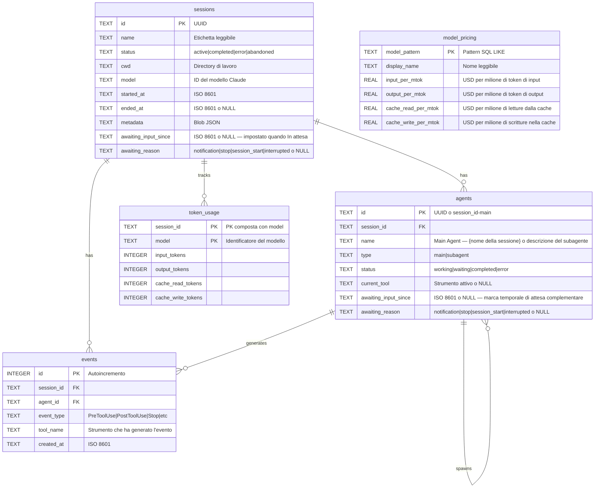

---

## Marketplace dei plugin

CCAM fornisce **14 plugin** da un unico albero sorgente condiviso. Claude Code legge `.claude-plugin/marketplace.json`; Codex legge `.agents/plugins/marketplace.json` più il `.codex-plugin/plugin.json` di ciascun plugin. Il pacchetto contiene **66 skill di plugin, 18 subagenti Claude, 34 comandi Claude, 3 utility CLI, 3 configurazioni di hook e 2 plugin con MCP**.

```bash
# Claude Code
claude plugin marketplace add hoangsonww/Claude-Code-Agent-Monitor
claude plugin install ccam-platform@claude-code-agent-monitor-plugins

# Codex
codex plugin marketplace add hoangsonww/Claude-Code-Agent-Monitor
codex plugin add ccam-platform@claude-code-agent-monitor-plugins

# Open Agent Skills / skills.sh-compatible CLI
npx skills add hoangsonww/Claude-Code-Agent-Monitor --list

# Install one skill for Claude Code and Codex in the current project
npx skills add hoangsonww/Claude-Code-Agent-Monitor \
  --skill mcp-server \
  --agent claude-code \
  --agent codex \
  --yes

# Verify, update, and remove the project-scoped skill
npx skills list --json
npx skills update --project --yes
npx skills remove mcp-server --yes

# Add --global to install at user scope, then manage that scope explicitly
npx skills add hoangsonww/Claude-Code-Agent-Monitor \
  --skill mcp-server \
  --agent claude-code \
  --agent codex \
  --global \
  --yes
npx skills list --global --json
npx skills update --global --yes
npx skills remove --global mcp-server --yes
```

La CLI `skills` rileva in totale **77 skill del repository**, comprese le 66 skill dei plugin e le skill di manutenzione del repository. Le installazioni di progetto usano `.agents/skills/` più link specifici per ogni agente. Le skill globali di Claude Code vanno per impostazione predefinita in `~/.claude/skills/`, oppure in `$CLAUDE_CONFIG_DIR/skills/` se impostato. Le skill globali di Codex vanno per impostazione predefinita in `~/.codex/skills/`, oppure in `$CODEX_HOME/skills/` se impostato. Le installazioni per più agenti possono deduplicare i file tramite uno storage condiviso e collegare quelle destinazioni. Ogni skill di plugin ha un frontmatter canonico `name`/`description` e metadati `agents/openai.yaml`. Per l'installazione non serve alcuna PR upstream verso `vercel-labs/skills`. Il repository pubblico su GitHub è l'origine, e la visibilità su skills.sh dipende dalla pubblicazione e dalla telemetria reale delle installazioni.

Nuovi pacchetti mirati completano i plugin esistenti di analisi, produttività, qualità, sessioni, flussi, configurazione e dashboard:

- `ccam-runner`: avvio monitorato, seguito, arresto e ripresa di Claude Code/Codex, e cronologia delle esecuzioni
- `ccam-integrations`: regole di avviso, webhook, notifiche push e raccolta remota via SSH
- `ccam-platform`: explorer della configurazione di Claude/Codex, importazione consapevole del provider, ripristino dei backup, configurazione degli hook, aggiornamenti e operazioni MCP
- `ccam-reports`: report pronti da presentare per direzione, costi, affidabilità e flussi

Convalida e rigenera i metadati di distribuzione con:

```bash
npm run extensions:sync
npm run extensions:validate
```

Catalogo completo, comandi di installazione, comportamento di skills.sh, limiti della pubblicazione e verifiche di installazione pulita: [docs/PLUGINS.md](docs/PLUGINS.md).

---

## Riga di stato

Un'utility autonoma di riga di stato della CLI per Claude Code che mostra nome del modello, utente, directory di lavoro, branch git, una barra di utilizzo della finestra di contesto, i conteggi dei token per direzione e il costo della sessione — il tutto con codici colore tramite sequenze di escape ANSI.

```
nguyens6@host ~/agent-dashboard/client | Sonnet 4.6 | main | ████████░░ 79% | 3↑ 2↓ 156586c | $0.4231
```

| Segmento | Colore | Esempio |
| ----------- | -------------------- | -------------------------------------------------------------- |
| Modello | Ciano | `Sonnet 4.6` |
| Utente | Verde | `nguyens6` |
| CWD | Giallo | `~/agent-dashboard` |
| Branch git | Magenta | `main` |
| Barra del contesto | Verde / Giallo / Rosso | `████████░░ 79%` |
| Token | Verde / Ciano / Attenuato | `3↑ 2↓ 156586c` (`↑` verde in input, `↓` ciano in output, `c` attenuato per la cache) |
| Costo (USD) | Verde / Giallo / Rosso | `$0.4231` (totale della sessione — mostrato con i piani API e in abbonamento) |

Soglie di colore del costo: verde sotto i 5 $, giallo da 5 a 20 $, rosso oltre i 20 $.

Vedi [`statusline/README.md`](statusline/README.md) per le istruzioni di installazione.

<p align="center">
  
</p>

---

## Architettura del server

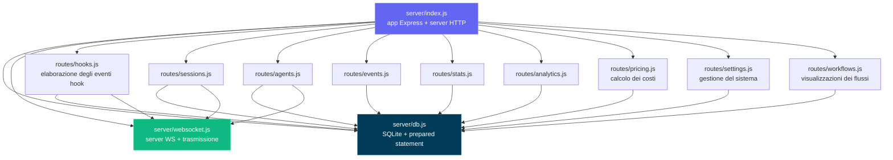

---

## Routing del client

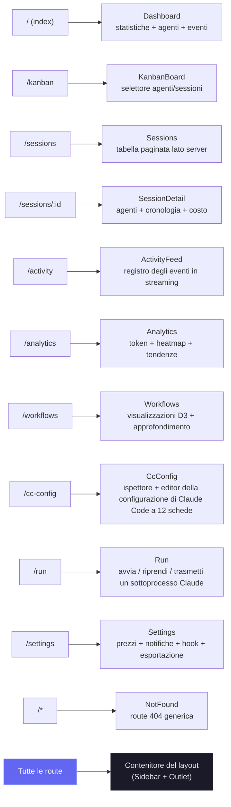

---

## Flusso del gestore degli hook

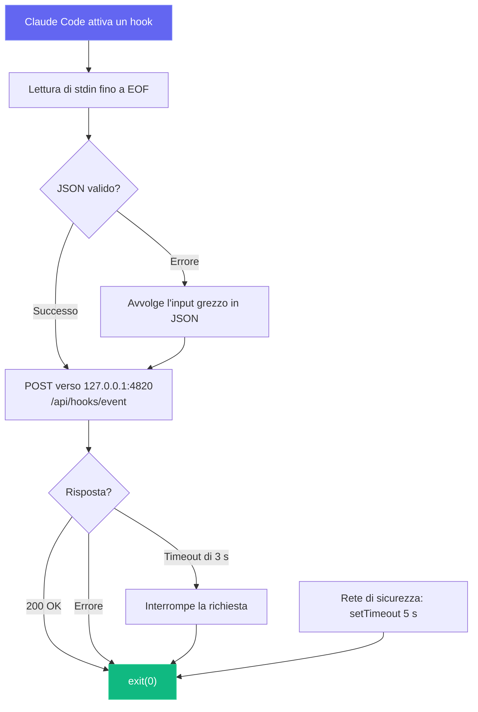

---

## Modalità di deploy

Supportiamo modalità di deploy per sviluppo e produzione, con architetture dei processi diverse:

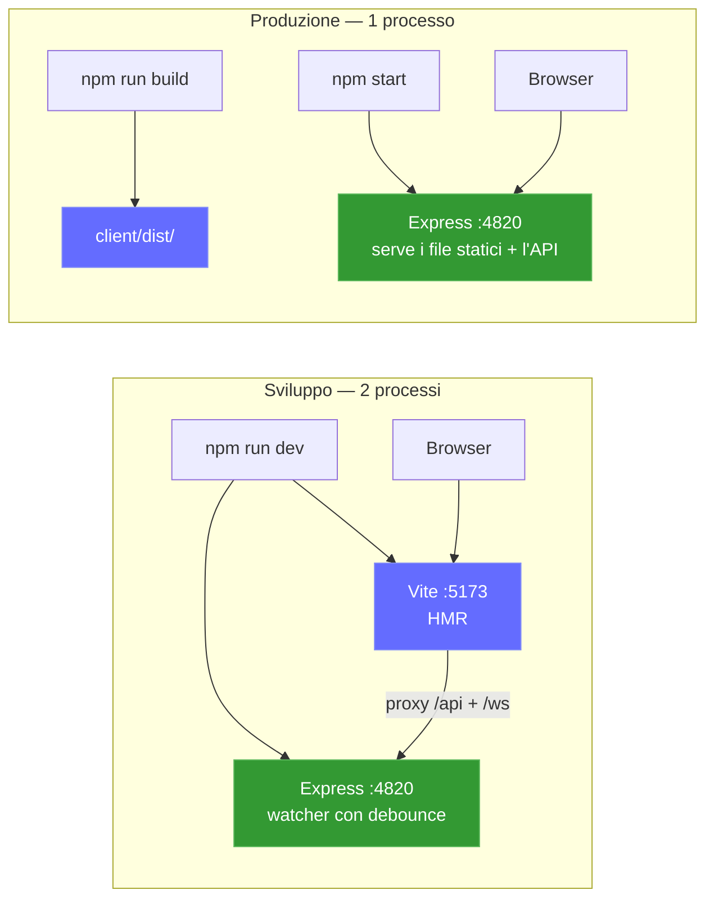

Sidecar MCP locale facoltativo (supporta i trasporti stdio, HTTP+SSE e REPL):

```mermaid
graph LR
    subgraph "Opzioni di trasporto MCP"
        M_STDIO["Server MCP (stdio)<br/>npm run mcp:start"]
        M_HTTP["Server MCP (HTTP)<br/>npm run mcp:start:http<br/>:8819"]
        M_REPL["Server MCP (REPL)<br/>npm run mcp:start:repl"]
    end

    H["Host MCP"] -->|"stdin/stdout"| M_STDIO
    RC["Client remoto"] -->|"POST /mcp · GET /sse"| M_HTTP
    OP["Operatore"] -->|"CLI interattiva"| M_REPL

    M_STDIO --> D["Server della dashboard<br/>:4820"]
    M_HTTP --> D
    M_REPL --> D

    style M_STDIO fill:#0f766e,stroke:#14b8a6,color:#fff
    style M_HTTP fill:#0f766e,stroke:#14b8a6,color:#fff
    style M_REPL fill:#0f766e,stroke:#14b8a6,color:#fff
```

**App desktop (macOS e Windows)** facoltativa — un unico processo Electron che ospita il server Express nello stesso processo (nessun terminale, nessun processo figlio):

```mermaid
flowchart LR
    subgraph desktop["App desktop (macOS e Windows) — 1 processo Electron"]
        E_MAIN["Processo principale di Electron<br/>(Node 22 / Electron 35)"]
        E_HOST["server-host.ts<br/>require() server/index.js"]
        E_SRV["Express incorporato :4820<br/>API · SQLite · WebSocket"]
        E_WIN["BrowserWindow<br/>client React compilato"]
        E_TRAY["Icona nella barra dei menu (tray)<br/>+ menu applicativo nativo"]
        E_MAIN --> E_HOST
        E_HOST -->|"require() nello stesso processo"| E_SRV
        E_MAIN --> E_TRAY
        E_SRV -->|"http + ws su 127.0.0.1"| E_WIN
    end

    E_HOOKS["Hook di Claude Code"] -->|"POST /api/hooks/event"| E_SRV

    style E_MAIN fill:#47848F,stroke:#2f5a62,color:#fff
    style E_SRV fill:#339933,stroke:#5cb85c,color:#fff
    style E_WIN fill:#61DAFB,stroke:#3aa9c9,color:#000
```

### Deploy nel cloud

Lo stack `deployments/` è pensato per qualsiasi servizio Kubernetes conforme, compresi EKS, GKE, AKS, OKE e i cluster autogestiti. CCAM usa SQLite, quindi ogni manifest supportato impone **un solo scrittore attivo della dashboard per volume persistente**, con un rollout di tipo Recreate. HPA, repliche attivo-attivo, blue-green e canary volutamente non sono supportati finché SQLite resta il backend di persistenza.

```mermaid
flowchart LR
  CI["CI: test · convalida · scansione · attestazione · firma"] --> HELM["Helm / Kustomize / Terraform"]
  HELM --> APP["Dashboard CCAM<br/>esattamente 1 replica"]
  APP --> PVC[("PVC ReadWriteOnce mantenuto")]
  EDGE["Ingress o Gateway API<br/>TLS + WebSocket"] --> APP
  PROM["Prometheus Operator"] -->|"Bearer /api/metrics"| APP
  MCP["Sidecar MCP autenticato"] --> APP
```

- **Helm:** scrittore unico imposto dallo schema, supporto dei digest, PVC mantenuto, Ingress o Gateway API, montaggio del token compatibile con External Secrets, NetworkPolicy, MCP e ServiceMonitor facoltativi.
- **Kustomize:** base con PSS ristretto più overlay dev/staging/produzione e componenti facoltativi per MCP, monitoraggio, Gateway API e snapshot CSI.
- **Terraform:** distribuisce il chart Helm convalidato su un cluster Kubernetes esistente. Rete cloud, identità del cluster, CSI, TLS e sincronizzazione dei segreti restano a carico del provider.
- **Operatività:** backup online coerente di SQLite con SHA-256, ripristino verificato con scalatura a zero, deploy/rollback/smantellamento preceduti sempre da un backup e controlli di salute autenticati.
- **Supply chain della CI:** le immagini dell'app e del MCP vengono scansionate, pubblicate per amd64/arm64 con SBOM e provenienza SLSA e firmate senza chiave con Cosign.

```bash
npm run deploy:validate
REGISTRY="ghcr.io/$(gh repo view --json owner -q .owner.login)"
IMAGE_TAG="$(git rev-parse --short HEAD)"

helm upgrade --install agent-monitor deployments/helm/agent-monitor \
  --namespace agent-monitor-production --create-namespace \
  --values deployments/helm/agent-monitor/values-production.yaml \
  --set image.registry= \
  --set image.repository=${REGISTRY}/claude-code-agent-monitor \
  --set image.tag=${IMAGE_TAG} \
  --atomic --wait --timeout 10m
```

> [!NOTE]
> La configurazione completa di produzione, i segreti, lo stack Docker/Podman, Gateway API, Terraform, backup, ripristino e rollback sono documentati in [DEPLOYMENT.md](DEPLOYMENT.md) e [deployments/README.md](deployments/README.md).

---

## Struttura del progetto

```
agent-dashboard/
|-- CLAUDE.md                   # Claude Code project memory and working agreements
|-- AGENTS.md                   # Codex project instructions
|-- package.json                # Root scripts (dashboard + MCP helpers) + server dependencies
|-- .claude/
|   +-- rules/                  # Path-scoped Claude rules
|   +-- skills/                 # Claude reusable project skills
|   +-- agents/                 # Claude custom subagents
|-- .claude-plugin/
|   +-- marketplace.json        # Claude Code marketplace manifest (14 plugins)
|-- .agents/plugins/
|   +-- marketplace.json        # Codex marketplace manifest (same 14 plugins)
|-- plugins/
|   |-- ccam-analytics/         # Analytics: session reports, cost breakdown, usage trends, productivity score
|   |   |-- .claude-plugin/plugin.json
|   |   |-- skills/ (4)         # session-report, cost-breakdown, usage-trends, productivity-score
|   |   |-- agents/             # analytics-advisor (Sonnet model)
|   |   |-- hooks/hooks.json    # Stop + SubagentStop event logging
|   |   +-- bin/ccam-stats      # Terminal dashboard CLI
|   |-- ccam-productivity/      # Productivity: standups, reports, sprints, workflow optimizer
|   |-- ccam-devtools/          # DevTools: debug, diagnostics, export, health checks
|   |   +-- bin/                # ccam-doctor + ccam-export CLIs
|   |-- ccam-insights/          # Insights: patterns, anomalies, optimization, comparison
|   |-- ccam-cost-guard/        # Cost guardrails: budgets, spend forecast, cost alerts, model savings
|   |-- ccam-sessions/          # Session forensics: search, timeline, transcript replay, cwd rollup, cleanup
|   |-- ccam-workflows/         # Workflow orchestration: DAG map, delegation audit, concurrency, fleet runs
|   |-- ccam-quality/           # Reliability & SLOs: error scan, API-error report, hook-failure audit, SLO check
|   |-- ccam-config/            # Config & memory governance: config audit, memory review, skill/MCP/hook inventory
|   +-- ccam-dashboard/         # Dashboard connector: status, quick stats, MCP integration
|       +-- .mcp.json           # MCP server configuration
|-- server/
|   |-- index.js                 # Express app, HTTP server, static serving
|   |-- db.js                    # SQLite schema, migrations, prepared statements
|   |-- websocket.js             # WebSocket server with heartbeat
|   +-- routes/
|       |-- hooks.js             # Hook event processing (transactional)
|       |-- sessions.js          # Session CRUD
|       |-- agents.js            # Agent CRUD
|       |-- events.js            # Event listing
|       |-- stats.js             # Aggregate statistics
|       |-- analytics.js         # Token, tool, and trend analytics
|       |-- workflows.js         # Aggregate workflow data and per-session drill-in
|       |-- pricing.js           # Model pricing CRUD and cost calculation
|       +-- settings.js          # System info, data management, export, cleanup
|   +-- lib/
|       +-- transcript-cache.js  # Stat-based JSONL transcript cache with chunked sync byte-stream reader (4 MiB chunks, line-by-line UTF-8 decode) so files larger than V8's max string length (~512 MiB) parse without aborting Node with "FATAL ERROR: v8::ToLocalChecked Empty MaybeLocal". Extracts tokens, compactions, API errors, turn durations, thinking blocks, and usage extras (service_tier, speed, inference_geo)
|   +-- compat-sqlite.js         # node:sqlite compatibility wrapper (fallback for better-sqlite3)
|-- client/
|   |-- package.json             # Client dependencies
|   |-- index.html               # HTML entry point
|   |-- vite.config.ts           # Vite + proxy config
|   |-- tailwind.config.js       # Custom dark theme
|   |-- tsconfig.json            # Strict TypeScript
|   +-- src/
|       |-- main.tsx             # React entry
|       |-- App.tsx              # Router + WebSocket provider
|       |-- index.css            # Tailwind + custom utilities
|       |-- lib/
|       |   |-- types.ts         # Shared TypeScript interfaces
|       |   |-- api.ts           # Typed fetch client
|       |   |-- format.ts        # Date/time formatting utilities
|       |   +-- eventBus.ts      # Pub/sub for WebSocket distribution
|       |-- hooks/
|       |   |-- useWebSocket.ts      # Auto-reconnecting WebSocket hook
|       |   +-- useNotifications.ts  # Browser notification triggers from WebSocket events
|       |-- components/
|       |   |-- Layout.tsx       # Shell with sidebar + outlet
|       |   |-- Sidebar.tsx      # Navigation + connection indicator
|       |   |-- AgentCard.tsx    # Agent info card with status
|       |   |-- StatCard.tsx     # Metric card
|       |   |-- StatusBadge.tsx  # Color-coded status pills
|       |   |-- EmptyState.tsx   # Placeholder for empty lists
|       |   +-- workflows/       # D3.js workflow visualization components
|       |       |-- OrchestrationDAG.tsx            # Horizontal DAG of agent spawning patterns
|       |       |-- ToolExecutionFlow.tsx           # d3-sankey diagram of tool-to-tool transitions
|       |       |-- AgentCollaborationNetwork.tsx   # Force-directed agent pipeline graph
|       |       |-- SubagentEffectiveness.tsx       # Scorecard grid with SVG success rings
|       |       |-- WorkflowPatterns.tsx            # Auto-detected orchestration sequences
|       |       |-- ModelDelegationFlow.tsx         # Model routing through agent hierarchies
|       |       |-- ErrorPropagationMap.tsx         # Error clustering by hierarchy depth
|       |       |-- ConcurrencyTimeline.tsx         # Swim-lane parallel agent execution
|       |       |-- SessionComplexityScatter.tsx    # D3 bubble chart (duration vs agents vs tokens)
|       |       |-- CompactionImpact.tsx            # Token compression events and recovery
|       |       |-- WorkflowStats.tsx               # Aggregate workflow statistics
|       |       +-- SessionDrillIn.tsx              # Per-session agent tree, tool timeline, events
|       +-- pages/
|           |-- Dashboard.tsx      # Overview page
|           |-- KanbanBoard.tsx    # Agents/Sessions toggle, status columns
|           |-- Sessions.tsx       # Server-paginated sessions table
|           |-- SessionDetail.tsx  # Single session deep dive
|           |-- ActivityFeed.tsx   # Real-time event stream
|           |-- Analytics.tsx      # Token usage, heatmap, trends
|           |-- Workflows.tsx      # D3.js workflow visualizations and session drill-in
|           |-- Settings.tsx       # Model pricing, notifications, hooks, export, cleanup
|           +-- NotFound.tsx       # 404 catch-all page
|-- scripts/
|   |-- hook-handler.js          # Lightweight stdin-to-HTTP forwarder
|   |-- install-hooks.js         # Auto-configures ~/.claude/settings.json
|   |-- import-history.js        # Imports sessions from ~/.claude/ with enhanced JSONL extraction (API errors, turn durations, entrypoint, permission modes, thinking blocks, usage extras, tool errors, subagent JSONL files). Re-import is fully incremental: a per-event-type high-water mark (`MAX(created_at) GROUP BY event_type` per session) is computed up-front and only JSONL entries with `ts > cutoff[type]` are inserted, so long-running sessions whose transcripts grow across multiple days continue to receive Stop / PostToolUse / TurnDuration / ToolError events on every re-run. Also rolls `sessions.ended_at` forward when the JSONL advances past the stored value and refreshes message-count metadata on every pass
|   +-- seed.js                  # Sample data generator
|-- mcp/
|   |-- package.json             # MCP package scripts + dependencies
|   |-- README.md                # MCP setup, host config, tool catalog, safety model
|   |-- src/
|   |   |-- index.ts             # MCP runtime entrypoint (transport router)
|   |   |-- server.ts            # MCP server assembly
|   |   |-- clients/             # Dashboard API client with retry/backoff
|   |   |-- config/              # Environment/CLI config parsing
|   |   |-- core/                # Logger, tool registry, result helpers
|   |   |-- policy/              # Mutation/destructive guards
|   |   |-- tools/               # 16 domain modules registering 97 tools
|   |   |-- transports/          # HTTP+SSE server, REPL, tool collector
|   |   |-- ui/                  # ANSI banner, colors, formatter, tables
|   |   +-- types/               # Shared MCP type definitions
|   +-- build/                   # Built MCP runtime output
|-- desktop/
|   |-- package.json             # Electron + electron-builder dependencies and scripts
|   |-- electron-builder.yml     # DMG packaging config; signing/notarization hooks
|   |-- tsconfig.json            # Strict TypeScript (src/ -> out/)
|   |-- README.md                # Desktop app architecture reference (contributor docs)
|   |-- assets/                  # icon.svg + generated icon.icns + tray PNGs
|   |-- src/
|   |   |-- main.ts              # Electron main process entry — lifecycle, wiring
|   |   |-- server-host.ts       # In-process Express boot, port discovery, adoption, DB close
|   |   |-- window.ts            # BrowserWindow + persisted window geometry
|   |   |-- tray.ts              # Menu-bar (tray) icon + context menu
|   |   |-- menu.ts              # Native application menu (File ▸ Open Dashboard is macOS-only)
|   |   |-- login-item.ts        # macOS Login Items auto-start toggle (SMAppService)
|   |   |-- logger.ts            # File logger -> ~/Library/Logs/Claude Code Monitor/desktop.log
|   |   |-- constants.ts         # App name, ports, timeouts, window size
|   |   +-- preload.ts           # Intentionally empty (zero renderer privilege)
|   |-- scripts/
|   |   |-- install.js           # Preflights native deps for desktop:install; prints setup help + exits non-zero on failure
|   |   |-- preflight.js         # Shared better-sqlite3 binary check + actionable per-OS setup help (incl. no-toolchain alternative)
|   |   |-- prebuild.js          # Ensures root + client are built before tsc; fails fast with setup help if native binary missing
|   |   |-- build-icons.sh       # SVG -> PNG/ICNS via qlmanage/sips/iconutil
|   |   +-- notarize.js          # electron-builder afterSign hook (opt-in notarization)
|   +-- tests/
|       +-- smoke.test.mjs       # Spawn Electron + probe /api/health
|-- deployments/
|   |-- README.md                # Production deployment reference
|   |-- nginx/                   # Rootless Nginx edge and opt-in hook/MCP policies
|   |-- secrets/                 # Ignored Compose token/password files
|   |-- terraform/               # Helm deployment to an existing Kubernetes cluster
|   |-- kubernetes/              # One-writer Kustomize base + environment overlays
|   |   |-- base/                # Restricted PSS, Recreate Deployment, PVC, Service, Ingress
|   |   |-- overlays/            # Dev, staging, production namespaces and resources
|   |   +-- components/          # MCP, ServiceMonitor, Gateway API, VolumeSnapshot
|   |-- helm/agent-monitor/      # Schema-enforced Helm chart and environment values
|   +-- scripts/                 # Validate, deploy, backup, restore, rollback, health, teardown
|-- .codex/
|   |-- config.toml              # Codex runtime configuration
|   |-- README.md                # Codex setup guide for agents and skills
|   |-- rules/                   # Codex execution policy rules
|   |-- agents/                  # Codex custom agent templates
|   +-- skills/                  # Codex project skills
|-- statusline/
|   |-- README.md                # Statusline installation & usage guide
|   |-- statusline.py            # Python script that renders the statusline
|   +-- statusline-command.sh    # Shell wrapper for Claude Code's statusLine config
+-- data/
    +-- dashboard.db             # SQLite database (gitignored)
```

---

## Risoluzione dei problemi

| Problema | Soluzione |
| --------------------------------- | ---------------------------------------------------------------------------------------------------------------------------------------------------------------- |
| L'installazione di `better-sqlite3` fallisce | Non è bloccante — il server ripiega automaticamente sul modulo integrato di Node.js `node:sqlite` (Node 22+). Con versioni di Node più vecchie, installa Python 3 e gli strumenti di compilazione C++, poi esegui `npm rebuild better-sqlite3` |
| Gli hook non scattano | Esegui `npm run install-hooks` e riavvia Claude Code. Verifica che gli hook siano presenti in `~/.claude/settings.json` |
| La dashboard non mostra dati | Assicurati che il server sia in esecuzione (`npm run dev`) prima di avviare una sessione di Claude Code. Controlla `http://localhost:4820/api/health` |
| WebSocket disconnesso | Il client si riconnette automaticamente ogni 2 secondi. Verifica che la porta 4820 non sia bloccata da un firewall |
| Dati non aggiornati dopo il riavvio | Il database persiste tra un riavvio e l'altro. Esegui `npm run seed` per nuovi dati dimostrativi, oppure elimina `data/dashboard.db` per azzerare tutto |
| Gli strumenti MCP non si connettono | Verifica che l'API della dashboard risponda su `MCP_DASHBOARD_BASE_URL` e ricompila/avvia MCP (`npm run mcp:build`, `npm run mcp:start`) |

---

## Contribuire

I contributi sono benvenuti — vedi [`.github/CONTRIBUTING.md`](.github/CONTRIBUTING.md) per la guida completa.

Tutti i contributori devono firmare il [Contributor License Agreement](https://github.com/hoangsonww/Claude-Code-Agent-Monitor/blob/master/CLA.md). Viene applicato automaticamente su ogni pull request dalla GitHub Action `🖋️ CLA Assistant`: la prima volta che apri una PR, un bot ti chiede di firmare commentando `I have read the CLA Document and I hereby sign the CLA`. Il controllo di stato **CLA Assistant** della PR resta rosso finché non lo fai, e una sola firma vale per tutti i contributi futuri.

---

## Licenza

MIT. Vedi [LICENSE](LICENSE) per i dettagli.
