# Claude Code용 에이전트 대시보드

### Claude Code 에이전트 활동을 위한 실시간 모니터링 플랫폼 🚀

Claude Code 에이전트 세션, 도구 사용, 서브에이전트 오케스트레이션을 실시간으로 추적하고 시각화하는 전문 대시보드입니다. Node.js, Express, React, SQLite로 구축되었으며, Claude Code의 네이티브 Hook 시스템과 직접 통합되어 매끄러운 세션 추적과 분석을 제공합니다.


> [!TIP]
> 참고: 영어 원문은 [README.md](./README.md), 중국어 버전은 [README-CN.md](./README-CN.md) (中文版本), 베트남어 버전은 [README-VN.md](./README-VN.md) (Phiên bản tiếng Việt)를 확인하세요. 이 문서는 한국어 버전입니다.

---

## 목차

- [개요](#개요)
- [국제화 (i18n)](#국제화-i18n)
- [기능](#기능)
- [빠른 시작](#빠른-시작)
- [동작 방식](#동작-방식)
- [설정](#설정)
- [npm 스크립트](#npm-스크립트)
- [플러그인 마켓플레이스](#플러그인-마켓플레이스)
- [에이전트 확장](#에이전트-확장)
- [MCP 통합](#mcp-통합)
- [API 참조](#api-참조)
- [Hook 이벤트](#hook-이벤트)
- [브라우저 알림](#브라우저-알림)
- [업데이트 알리미](#업데이트-알리미)
- [Tabby — 떠다니는 고양이 동반자](#tabby--떠다니는-고양이-동반자)
- [연결 상태 모달](#연결-상태-모달)
- [VS Code 확장](#vs-code-확장)
- [데스크톱 앱 (macOS & Windows)](#데스크톱-앱-macos--windows)
- [데이터 저장소](#데이터-저장소)
- [Statusline](#statusline)
- [서버 아키텍처](#서버-아키텍처)
- [클라이언트 라우팅](#클라이언트-라우팅)
- [Hook 핸들러 흐름](#hook-핸들러-흐름)
- [배포 모드](#배포-모드)
- [프로젝트 구조](#프로젝트-구조)
- [문제 해결](#문제-해결)
- [기여하기](#기여하기)
- [라이선스](#라이선스)

---

## 개요

전문적인 다크 테마 웹 인터페이스를 통해 세션을 추적하고, 에이전트를 실시간으로 모니터링하며, 도구 사용을 시각화하고, 서브에이전트 오케스트레이션을 관찰하세요. Claude Code의 네이티브 Hook 시스템을 통해 직접 통합됩니다.

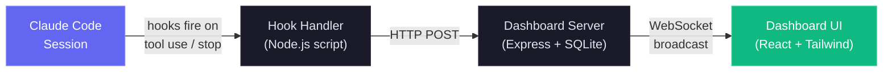
```mermaid
graph LR
    A["Claude Code<br/>Session"] -->|hooks fire on<br/>tool use / stop| B["Hook Handler<br/>(Node.js script)"]
    B -->|HTTP POST| C["Dashboard Server<br/>(Express + SQLite)"]
    C -->|WebSocket<br/>broadcast| D["Dashboard UI<br/>(React + Tailwind)"]
    style A fill:#6366f1,stroke:#818cf8,color:#fff
    style B fill:#1a1a28,stroke:#2a2a3d,color:#e4e4ed
    style C fill:#1a1a28,stroke:#2a2a3d,color:#e4e4ed
    style D fill:#10b981,stroke:#34d399,color:#fff
```

실시간 모니터링 대시보드 외에도, `mcp/`에 대시보드 자체를 조사하고 관리하기 위한 도구 카탈로그를 노출하는 로컬 MCP 서버 구현이 포함되어 있어 대시보드 작업을 Claude Code 워크플로에 직접 통합하기 쉽습니다. 또한 대시보드 상호작용, 분석, 워크플로 인텔리전스를 위한 Claude Code 플러그인, 스킬, 서브에이전트를 제공하는 에이전트 확장 레이어도 있습니다.

<a href="https://www.star-history.com/?repos=hoangsonww%2FClaude-Code-Agent-Monitor&type=date&legend=top-left">
 <picture>
   <source media="(prefers-color-scheme: dark)" srcset="https://api.star-history.com/chart?repos=hoangsonww/Claude-Code-Agent-Monitor&type=date&theme=dark&legend=top-left" />
   <source media="(prefers-color-scheme: light)" srcset="https://api.star-history.com/chart?repos=hoangsonww/Claude-Code-Agent-Monitor&type=date&legend=top-left" />
   
 </picture>
</a>

### 국제화 (i18n)

UI에는 영어(`en`), 중국어(`zh`), 베트남어(`vi`), 한국어(`ko`)를 위한 내장 로케일 전환 기능이 탑재되어 있습니다. 언어 리소스는 네임스페이스별로 로드되며, 새로고침 후에도 사용자 선호가 안정적으로 유지되도록 브라우저 스토리지를 통해 저장됩니다.

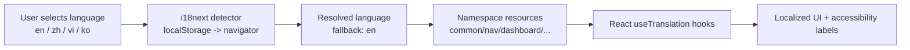
```mermaid
flowchart LR
    A["User selects language<br/>en / zh / vi / ko"] --> B["i18next detector<br/>localStorage -> navigator"]
    B --> C["Resolved language<br/>fallback: en"]
    C --> D["Namespace resources<br/>common/nav/dashboard/..."]
    D --> E["React useTranslation hooks"]
    E --> F["Localized UI + accessibility labels"]
```

전체 아키텍처와 운영 가이드는 [docs/I18N.md](./docs/I18N.md)를 참조하세요.

### 사용자 인터페이스

세련된 다크 테마, 반응형 디자인, 직관적인 내비게이션과 함께 제공되어 에이전트 활동을 탐색할 수 있습니다:

<p align="center">
  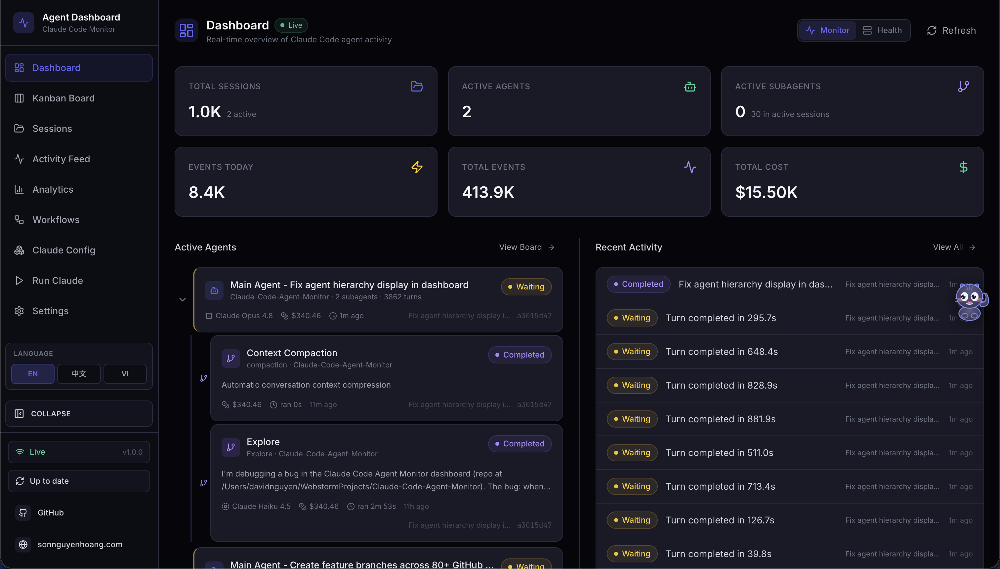
  <br>
  <em>📡 <strong>대시보드 · 모니터</strong> — 개요 통계, 활성 에이전트 카드, 최근 활동 피드</em>
</p>

<p align="center">
  
  <br>
  <em>🩺 <strong>대시보드 · 상태</strong> — 종합 상태 점수 링, 스토리지 엔진 도넛 차트, 캐시 적중 / 오류 / 성공 게이지, 도구 호출 막대, 서브에이전트 효과성, 모델 토큰 분포, 컴팩션 통계 — 모두 5초마다 자동 새로고침됩니다</em>
</p>

<p align="center">
  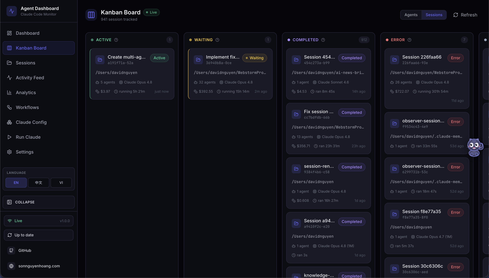
  <br>
  <em>📋 <strong>Kanban 보드(에이전트)</strong> — 4개 컬럼(Working / Waiting / Completed / Error)에 상태별로 그룹화된 에이전트. 노란색 Waiting 컬럼은 사용자 입력을 기다리며 차단된 세션(권한 프롬프트, 턴 종료, 또는 새 프롬프트에서 대기 중)을 표시합니다 — Waiting 배지에 마우스를 올리면 그 <em>이유</em>(입력 필요 / 턴 완료 / 프롬프트 대기 / 중단됨)를 확인할 수 있습니다. 각 카드는 모델, 비용, 현재 도구를 한눈에 보여줍니다.</em>
</p>

<p align="center">
  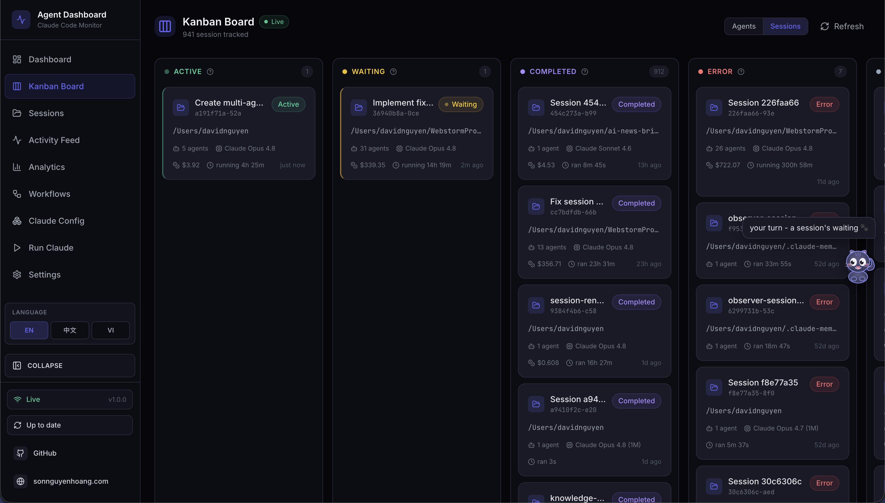
  <br>
  <em>🗂️ <strong>Kanban 보드(세션)</strong> — 5개 컬럼(Active / Waiting / Completed / Error / Abandoned)에 상태별로 그룹화된 세션으로, 같은 페이지에서 전환할 수 있습니다. 컬럼 헤더에 마우스를 올리면 라이프사이클 전환을 설명하는 툴팁이 표시됩니다.</em>
</p>

<p align="center">
  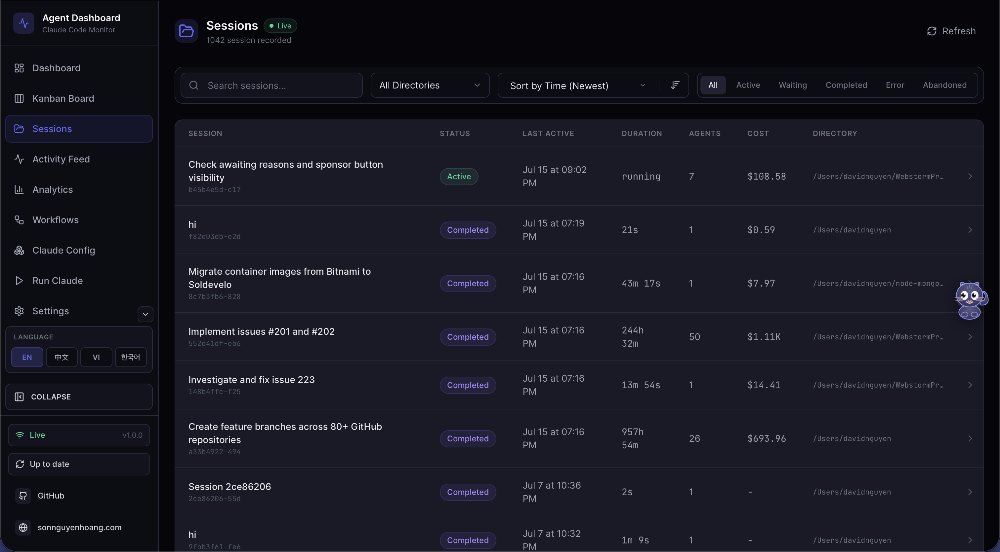
  <br>
  <em>📂 <strong>세션</strong> — 비용, 모델, 에이전트 수, 소요 시간과 함께 기록된 모든 세션을 담은 검색·필터링 가능한 서버 페이지네이션 테이블</em>
</p>

<p align="center">
  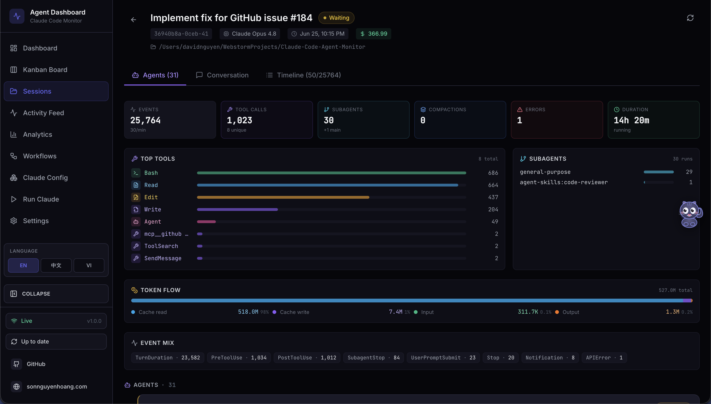
  <br>
  <em>🤖 <strong>세션 상세 · 에이전트</strong> — 실시간 개요 타일(이벤트, 도구 호출, 서브에이전트, 컴팩션, 오류, 소요 시간), 상위 도구 사용 막대, 서브에이전트 유형 분석, 토큰 흐름, 에이전트 계층 트리</em>
</p>

<p align="center">
  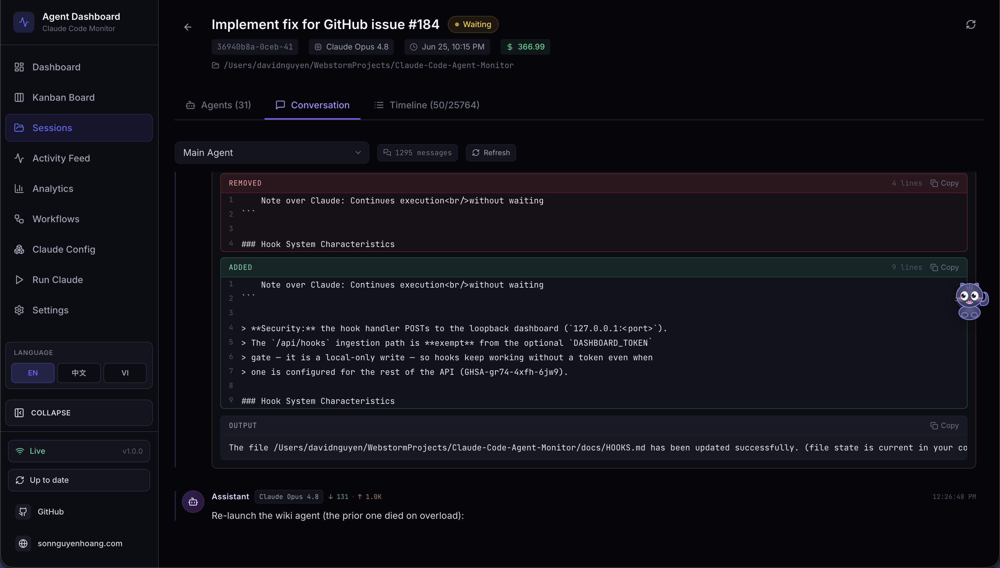
  <br>
  <em>💬 <strong>세션 상세 · 대화</strong> — 마크다운 렌더링, 구문 강조 코드 블록(줄 번호 + 복사), 도구별 스타일이 적용된 도구 호출, 캡처된 TUI 출력이 포함된 슬래시 명령 필, 인라인 세션 이름 변경 마커를 갖춘 라이브 트랜스크립트 뷰어</em>
</p>

<p align="center">
  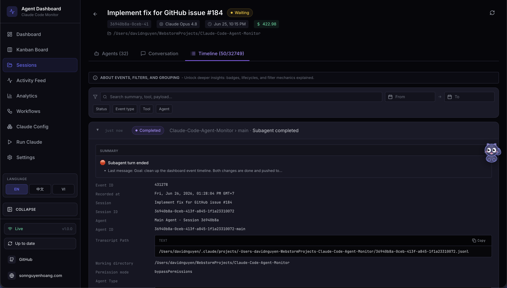
  <br>
  <em>🔬 <strong>세션 상세 · 타임라인</strong> — 다차원 필터, `tool_use_id` 기준 Pre/Post 그룹화, 도구 인식 페이로드 렌더러를 갖춘 시간순 이벤트 타임라인</em>
</p>

<p align="center">
  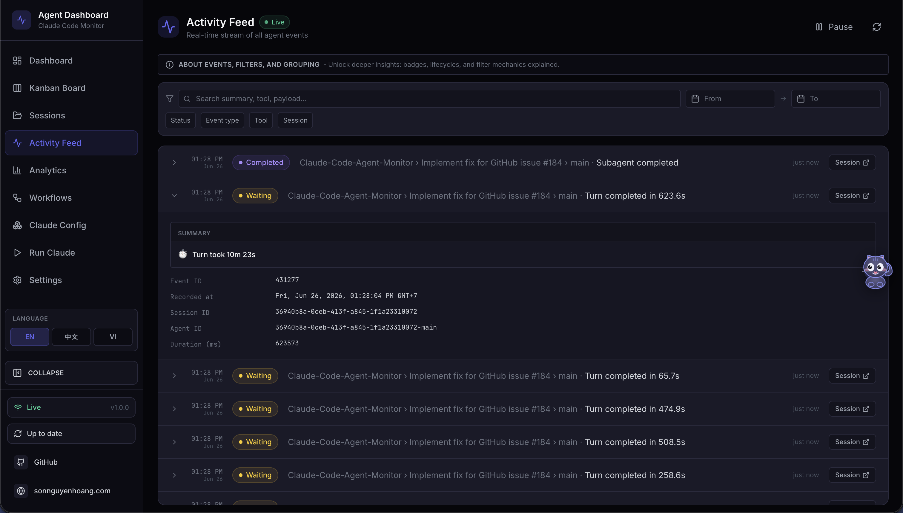
  <br>
  <em>📰 <strong>활동 피드</strong> — 일시정지 / 재개, 그룹화, 다차원 필터, 행별 "세션 →" 이동 버튼을 갖춘 실시간 이벤트 로그</em>
</p>

<p align="center">
  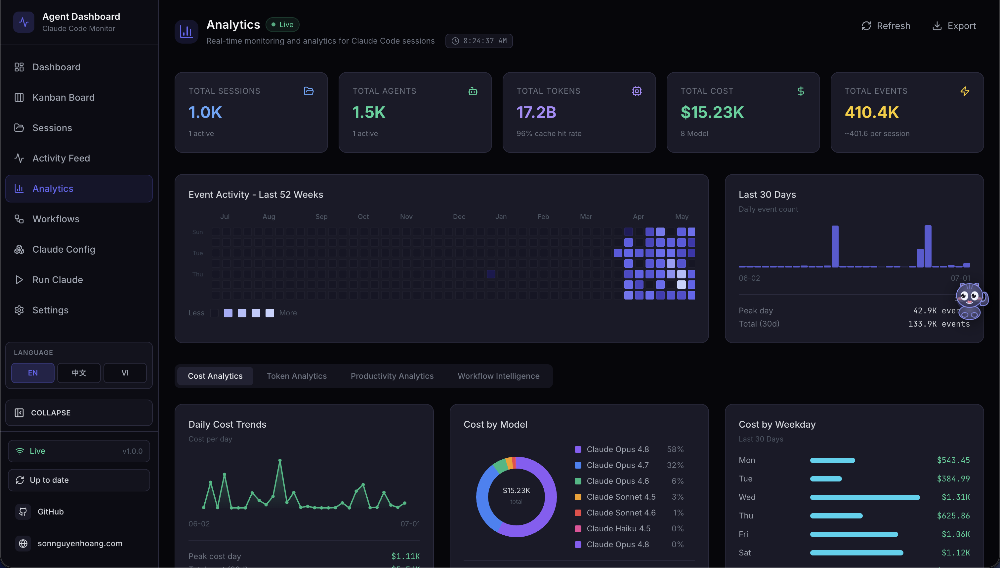
  <br>
  <em>📊 <strong>분석</strong> — 모델별 토큰 사용량, 도구 빈도, 활동 히트맵, 라이브 / 오프라인 표시기가 있는 세션 추세</em>
</p>

<p align="center">
  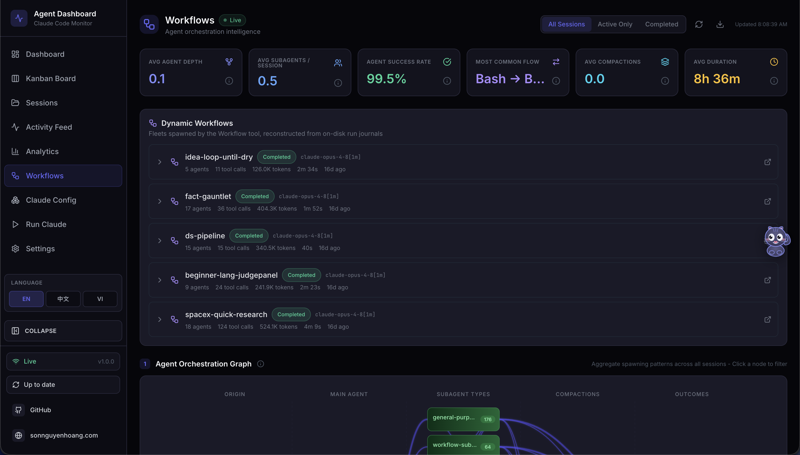
  <br>
  <em>🔀 <strong>워크플로</strong> — 에이전트 오케스트레이션 DAG, 도구 실행 Sankey 다이어그램, 협업 네트워크, 워크플로 인텔리전스의 11개 인터랙티브 섹션</em>
</p>

<p align="center">
  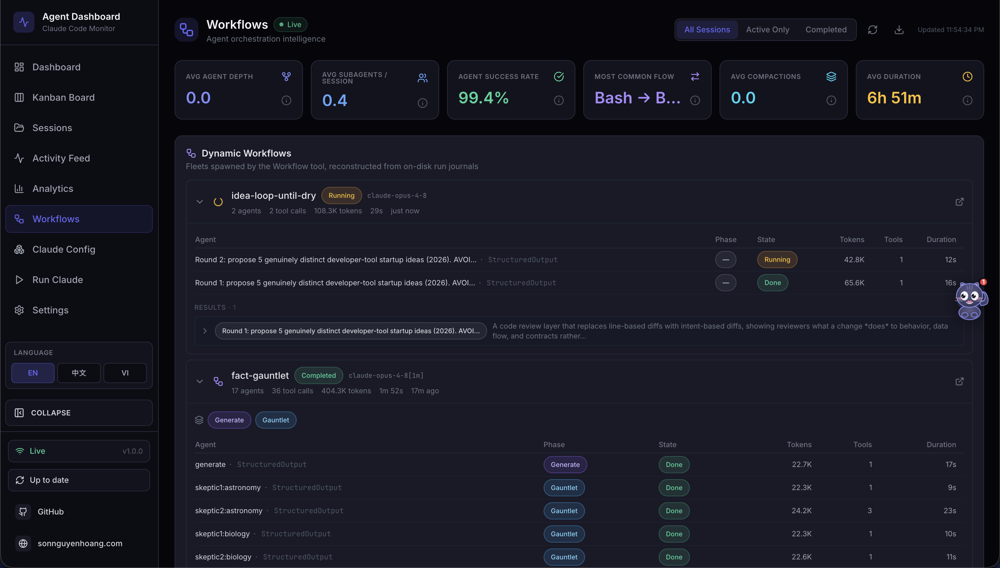
  <br>
  <em>🧬 <strong>워크플로 실행(워크플로 페이지)</strong> — <code>Workflow</code> 도구가 생성한 "동적 워크플로"를 디스크의 실행 저널에서 재구성: 상태, 에이전트 수, 토큰, 도구 호출을 표시하며, 사람이 읽기 쉬운 결과 미리보기와 함께 에이전트별 분석(단계, 상태, 토큰, 도구, 소요 시간)으로 펼칠 수 있습니다</em>
</p>

<p align="center">
  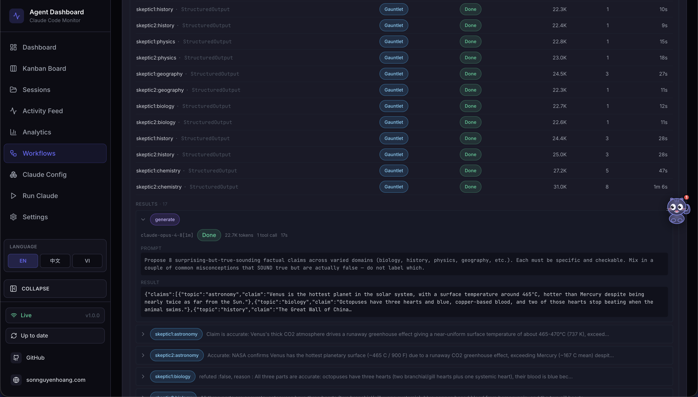
  <br>
  <em>🧬 <strong>워크플로 실행 · 펼침</strong> — 펼쳐진 실행: 클릭 가능한 색상 코드 단계 필터, 에이전트별 지표 테이블, 그리고 각 에이전트의 전체 프롬프트와 결과로 펼쳐지는 클릭 가능한 결과 항목의 전체 목록</em>
</p>

<p align="center">
  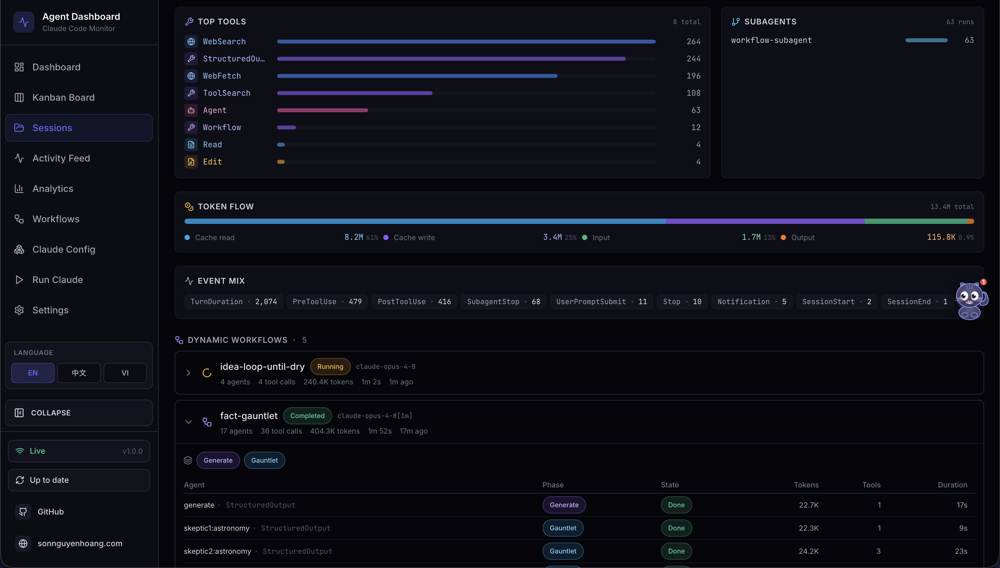
  <br>
  <em>🧬 <strong>워크플로 실행(세션 상세)</strong> — 동일한 플릿이 이를 시작한 세션에 연결되어, 세션의 동적 워크플로 서브에이전트와 합산된 토큰 비용을 인라인으로 확인할 수 있습니다</em>
</p>

<p align="center">
  
  <br>
  <em>🧰 <strong>Claude 설정 탐색기</strong> — Claude Code가 알고 있는 모든 것을 위한 12탭 인스펙터: 스킬, 서브에이전트, 슬래시 명령, 출력 스타일, 플러그인(플러그인별 기여 항목 포함), 마켓플레이스, MCP 서버, Hook, 설정(비밀 키 마스킹 포함), 메모리(사용자 + 프로젝트 `CLAUDE.md` 파일과 프로젝트별 파일 기반 메모리 저장소 — `~/.claude/projects/<slug>/memory/` 아래의 모든 `*.md` 파일을 프로젝트별로 그룹화하고 검색 가능), 키바인딩, Statusline. 저위험 텍스트 파일 표면 — 프로젝트별 자동 메모리 파일 포함 — 에서 필수 타임스탬프 백업과 함께 생성 / 편집 / 삭제 가능</em>
</p>

<p align="center">
  
  <br>
  <em>▶️ <strong>Run Claude</strong> — 대시보드 안에서 바로 <code>claude</code> 서브프로세스를 생성합니다. 모드(대화 / 원샷), 소스(새 세션 vs 전체 기록에서 재개), 작업 디렉터리(최근 cwd 자동완성), 모델, 권한 모드, thinking effort를 선택하세요. 동일 출처 가드가 브라우저 드라이브바이 생성을 방지합니다</em>
</p>

<p align="center">
  
  <br>
  <em>💬 <strong>Run Claude · 라이브 스트림</strong> — <code>--include-partial-messages</code>를 통한 실제 문자 단위 렌더링의 채팅 스타일 스트리밍 출력. 도구 사용, 도구 결과, thinking 블록 모두 접을 수 있습니다. 헤더의 활성 실행 전환기로 실행을 백그라운드에 두고 나중에 다시 연결할 수 있습니다. 세션 ID가 확인되는 즉시 "세션 보기 →"가 일반 세션 UI로 딥링크합니다</em>
</p>

<p align="center">
  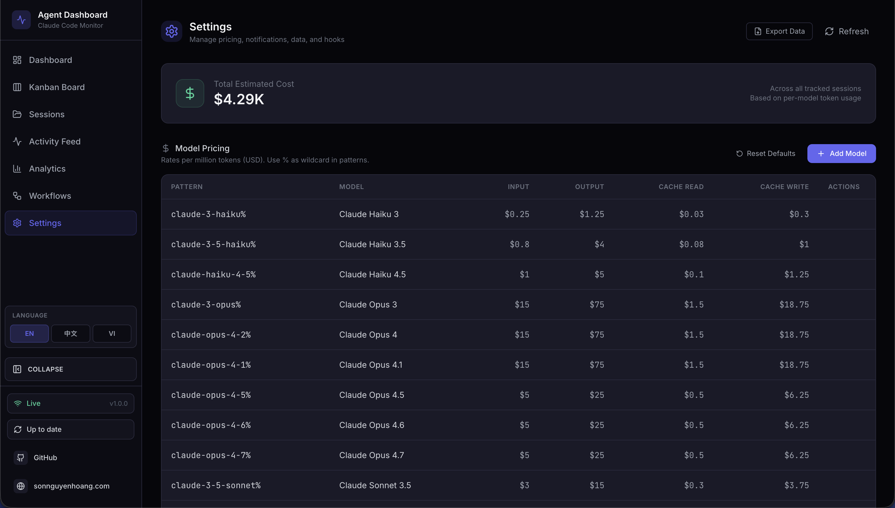
  <br>
  <em>⚙️ <strong>설정</strong> — 모델 가격 책정 규칙, Hook 설치 상태, 데이터 관리, 알림 기본 설정, 시스템 정보</em>
</p>

<p align="center">
  
  <br>
  <em>🔔 <strong>설정 · 알림</strong> — 규칙 기반 알림 엔진과 아웃바운드 웹훅을 한곳에서: 규칙별 쿨다운이 있는 알림 규칙(이벤트 패턴 / 비활성 / 멈춘 에이전트 / 토큰 임계값), 실시간 발동 알림 피드, 14개의 퍼스트클래스 웹훅 제공자(Slack, Discord, Teams, Google Chat, Mattermost, Rocket.Chat, Telegram, PagerDuty, Opsgenie, Splunk On-Call, Zapier, Make, n8n, Pipedream)와 선택적 HMAC 서명을 지원하는 범용 JSON 엔드포인트</em>
</p>

사이드바에서 대시보드, Kanban 보드, 세션 목록, 활동 피드, 분석, 워크플로, 설정에 빠르게 접근할 수 있습니다. 각 페이지는 실시간 업데이트와 풍부한 시각화로 Claude Code 에이전트 활동에 대한 깊이 있는 인사이트를 제공하도록 설계되었습니다.

---

## 기능

대시보드는 Claude Code 세션과 에이전트를 모니터링하고 분석하기 위한 포괄적인 기능 세트를 제공합니다:

| 기능                               | 설명                                                                                                                                                                                                                                                                          |
|------------------------------------|------------------------------------------------------------------------------------------------------------------------------------------------------------------------------------------------------------------------------------------------------------------------------|
| **대시보드**                      | `localStorage`에 저장되는 두 개의 탭: **모니터** — 개요 통계(6개 통계 카드), 접을 수 있는 서브에이전트 계층이 있는 활성 에이전트 카드, `ResizeObserver`를 통해 사용 가능한 뷰포트 높이를 채우는 동적 항목 수의 최근 활동 피드. **상태** — 종합 시스템 상태 점수 링(가중치: 0.4 × 성공률 + 0.25 × 캐시 적중률 + 0.25 × (100 − 오류율) + 0.1 × (100 − 힙 %)), 레코드 분포를 보여주는 스토리지 엔진 도넛 차트, 캐시 성능 / 오류율 / 성공률 게이지, 도구 호출 가로 막대 차트(상위 8개), 서브에이전트 효과성 막대, 모델 토큰 분포, 컴팩션 영향 통계. 모든 상태 지표는 `/api/settings/info`와 `/api/workflows`에서 5초마다 자동 새로고침됩니다. 모든 차트에 뷰포트 가장자리 감지 기능이 있는 커서 추적 툴팁 제공 |
| **Kanban 보드**                   | 헤더 토글(`localStorage`에 저장)로 전환하는 두 가지 보기: **에이전트** — 4개 컬럼(Working / Waiting / Completed / Error) — 그리고 **세션** — 5개 컬럼(Active / Waiting / Completed / Error / Abandoned). **Waiting** 컬럼은 에이전트에 저장된 `waiting` 상태에 직접 매핑됩니다 — Claude Code가 프롬프트에서 대기 중일 때(새 세션, 턴 사이, 또는 권한 Notification으로 차단된 상태) 설정되며, 사용자가 재개하는 순간(UserPromptSubmit / PreToolUse) `working`으로 전환됩니다. 각 컬럼 헤더에는 라이프사이클 전환을 설명하는 `?` 툴팁이 표시됩니다. 카드는 저장된 상태별로 서버에서 가져오고(상태당 사실상 무제한), 이후 클라이언트 측에서 컬럼당 10개 카드로 페이지네이션되며 "더 보기" 버튼이 제공됩니다. WS 구독은 활성 보기에 범위가 지정되므로(`agent_*` vs `session_*` 프레임) 보이지 않는 보기의 업데이트가 다시 가져오기를 유발하지 않습니다. Waiting 배지는 행의 `awaiting_reason`을 호버 툴팁으로 표시합니다 — **입력 필요** (`notification`), **턴 완료** (`stop`), **프롬프트 대기** (`session_start`), **중단됨** (`interrupted`) — 컴팩트한 카드에서는 제목 공간을 유지하기 위해 툴팁으로만 표시되며, 더 넓은 화면(세션 테이블, 세션 상세 헤더)에서는 추가로 이유를 중첩된 칩 형태로 인라인 표시하고, 긴급한 이유(권한 프롬프트, 중단)는 더 진한 앰버 색으로 렌더링됩니다 |
| **세션**                          | 기록된 모든 세션의 검색·필터링 가능한 **서버 페이지네이션** 테이블. 각 페이지 클릭은 `/api/sessions?status=&q=&limit=10&offset=…`를 호출하므로, 비용 계산은 데이터베이스에 세션이 얼마나 많이 존재하든 상관없이 보이는 페이지에 대해서만 실행됩니다. 검색 상자(`q=`)는 300 ms 디바운스와 함께 서버에서 `id` / `name` / `cwd`에 대해 대소문자를 구분하지 않는 매칭을 수행하며, 응답에는 페이지네이터 UI를 위한 `total` 카운트가 포함됩니다. 상태 필터, 검색, 페이지네이션은 함께 조합됩니다. 각 세션의 사람이 읽을 수 있는 **이름**은 트랜스크립트에서 읽어 실시간으로 동기화됩니다 — `/rename`, `claude -n`, 또는 피커의 `Ctrl+R`(JSONL `custom-title` 줄)로 지정한 명시적 제목이 항상 우선하고, 그렇지 않으면 자동 생성된 `ai-title`이 채워지며, 그것도 없으면 세션의 **첫 사용자 프롬프트**(잘라내되 tool-result / 슬래시 명령 노이즈는 건너뜀)가 플레이스홀더 이름과 메인 에이전트의 플레이스홀더 이름/작업을 채웁니다 — 그래서 제목이 지정되지 않은 세션(가져온 세션 포함)도 무엇을 하고 있는지 표시됩니다. 대시보드는 카드, 대시보드, 활동 피드, Run 재개 피커에서 그 이름을(짧은 ID로 폴백하며) 표시합니다. |
| **세션 상세**                     | 세션별 실시간 개요 패널: 활성 에이전트 배너(현재 도구 + 작업), 6개 타일 카운터(분당 이벤트 속도가 함께 표시되는 이벤트, 도구 호출, 서브에이전트, 컴팩션, 오류, 실시간 갱신되는 소요 시간), 상위 도구 사용 막대, 서브에이전트 유형 분석, 누적 토큰 흐름 스트립, 이벤트 유형 필 클라우드 — 모두 Hook 이벤트마다 실시간으로 새로고침됩니다. 그 아래: 에이전트 계층 트리, 다차원 필터(상태, 이벤트 유형, 도구, 에이전트, 텍스트 검색, 날짜 범위)가 있는 전체 이벤트 타임라인, `tool_use_id` 기준 Pre/Post 그룹화, 사람이 읽기 쉬운 요약 블록, 도구 인식 입력/응답 렌더러(Bash는 터미널, Edit는 통합 diff, Read/Write는 줄 번호 코드, Grep은 매치 목록, MCP 도구는 키/값 카드), 그리고 마크다운(제목, 목록, 인용구, 테이블, 작업 목록), 줄 번호와 클립보드 복사가 있는 구문 강조 코드 블록(js/ts, python, json, bash, html, css, sql, yaml, diff), 도구별 스타일이 적용된 도구 호출(Bash → 터미널, Edit → 좌우 old/new 비교, Write → 파일 레이블, Read → 경로 칩, Grep → 패턴 카드)로 트랜스크립트를 렌더링하는 대화 탭. 대화에는 턴 도중 입력된 메시지(Claude가 아직 작업 중일 때 큐에 들어간 메시지)도 Claude가 실제로 수신한 위치에 표시되며, 하네스 알림은 System으로 표시됩니다. 세션이 사용자 입력을 기다리며 차단되어 있을 때는 헤더 아래의 노란색 **입력 대기 배너**가 `awaiting_reason`과 그 설명, 그리고 세션이 얼마나 오래 기다리고 있는지(맥동하는 점 + 상대 시간)를 표시하며, 헤더의 Waiting 배지는 동일한 이유를 중첩된 칩 형태로 표시합니다 |
| **활동 피드**                     | 일시정지/재개, 다차원 필터(세션 상세와 동일한 툴바에 세션 필터 추가), 서버 주도 "더 불러오기" 페이지네이션, 로드된 페이지 크기를 유지하는 디바운스된 필터 인식 실시간 새로고침, 그룹화 토글, 프로젝트 › 세션 › 서브에이전트를 보여주는 출처 접두사, 행별 "세션 →" 버튼을 갖춘 실시간 스트리밍 이벤트 로그                                         |
| **분석**                          | 토큰 사용량, 도구 빈도, 활동 히트맵(중앙 정렬, 일요일부터 시작하는 요일 정렬, 요일 이름 툴팁), 세션 추세, 라이브/오프라인 연결 표시기. 분석 페이로드가 로드되는 동안 (통계 타일뿐 아니라) 차트 영역에 차트 레이아웃을 그대로 반영한 **맥동하는 스켈레톤 플레이스홀더**가 표시되므로 페이지가 빈/제로 차트를 잠깐이라도 표시하는 일이 없습니다 |
| **실시간 업데이트**               | WebSocket 푸시 -- 폴링 없음, 즉각적인 UI 업데이트                                                                                                                                                                                                                             |
| **자동 검색**                     | 세션과 에이전트가 Hook 이벤트로부터 자동으로 생성됩니다                                                                                                                                                                                                                               |
| **기록 가져오기**                 | 시작 시 `~/.claude/`에서 세션을 가져옵니다. 향상된 JSONL 추출: API 오류(quota/rate/invalid_request), 턴 소요 시간, 진입점(cli/sdk-ts), 권한 모드, thinking 블록 수, usage 추가 정보(service_tier, speed, inference_geo), 도구 결과 오류, 서브에이전트 JSONL 파일(`subagents/agent-*.jsonl` 및 `.meta.json`). 다시 가져올 때 기존 세션을 백필합니다. 최근 JSONL 파일(10분 미만)은 "활성"으로 가져옵니다 |
| **서브에이전트 계층**             | 대시보드와 세션 상세의 접을 수 있는 부모-자식 에이전트 트리. 서브에이전트가 있는 에이전트는 펼침/접기 셰브론을 표시하고, 리프 에이전트는 점 표시기를 표시합니다. 서브에이전트가 활성일 때 자동으로 펼쳐집니다                                                                           |
| **백그라운드 에이전트**           | 백그라운드로 전환된 서브에이전트를 조기 완료 처리 없이 올바르게 추적합니다                                                                                                                                                                                                         |
| **서브에이전트 도구 귀속**        | 서브에이전트 내부 도구 호출(Read, Bash, Edit, Grep, …)은 서브에이전트별 JSONL 파일에만 존재합니다 — Claude Code는 이에 대해 Hook을 발생시키지 않습니다. 모든 `SubagentStop`마다 대시보드는 fire-and-forget 방식의 `scanAndImportSubagents` 패스를 실행하여 각 `subagents/agent-*.jsonl`을 파싱하고, `tool_use` 블록을 `tool_use_id`로 대응하는 `tool_result`와 짝지은 뒤, 서브에이전트 자신의 `agent_id` 아래에 `PreToolUse` + `PostToolUse` 이벤트를 발생시킵니다. 멱등성이 보장되며(`data LIKE '%"tool_use_id":"X"%'` 중복 제거) 유형 + 시작 시간이 30초 이내로 일치하는 라이브 Hook 생성 서브에이전트 행이 있으면 그 행에 병합되므로, 병렬 `<sid>-jsonl-*` 행이 생성되지 않습니다. 동일한 경로가 전체 과거 백필을 위해 `npm run setup` 시작 가져오기에서도 실행됩니다 — 대시보드보다 앞서 존재하던 세션도 서브에이전트별 전체 도구 타임라인을 갖게 됩니다. 활동 피드와 세션 상세는 중첩된 서브에이전트에 대해 부모 체인을 `main › coder › explorer`로 렌더링합니다. 이 체인은 `reconcileSubagentParents`가 권위 있게 재구성합니다: 서브에이전트 행은 먼저 메인 에이전트 아래에 평평하게 삽입되고(단일 Hook 이벤트나 JSONL 파일에는 생성자 신원이 없음), 이후 각 서브에이전트 트랜스크립트의 Task 도구 결과(`toolUseResult.agentId`, `spawnedChildren`으로 캡처)에서 생성자가 복원되므로, 자신의 서브에이전트를 생성하는 서브에이전트는 메인 아래 한 단계로 붕괴하지 않고 **실제** 생성자 아래에 중첩됩니다. 멱등적이며 추가만 수행합니다 — `parent_agent_id`만 다시 지정할 뿐 행을 삽입하거나 삭제하지 않습니다 — 그리고 동일한 `SubagentStop` 스캔에서 실행되며, 이 스캔은 `reparented` 카운트를 반환하므로 재부모화만으로 트리 형태가 바뀐 경우에도 대시보드가 다시 가져옵니다 |
| **비용 추적**                     | 구성 가능한 가격 책정 규칙과 세션별 분석이 있는 모델별 비용 추정. **기간 한정 프로모션 요금**(가격 책정 규칙의 `intro_*` + `intro_until`)을 지원합니다: 마감일 이전(당일 포함)의 사용량은 프로모션 요금으로, 이후 사용량은 표준 요금으로 책정되므로, Claude Sonnet 5의 출시 할인(2026-08-31까지) 같은 프로모션이 과거 **및** 미래 사용량 모두에 대해 정확하게 유지됩니다 — 비용 엔드포인트는 각 날짜의 사용량을 그 날짜에 유효한 요금으로 책정합니다. **프로모션 요금은 설정에서 완전히 편집할 수 있습니다** — 모델 가격 책정 편집기가 프로모션 마감일과 카테고리별 프로모션 가격(input / output / cache-read / cache-write 5m & 1h)을 노출하므로, 향후 모델 출시 프로모션에는 코드 변경 없이 편집만으로 대응할 수 있습니다. **서브에이전트 카드는 각 서브에이전트 자신의 비용을 표시합니다**(해당 서브에이전트의 트랜스크립트 토큰 사용량에서 도출되어 현재 요금으로 책정) — 세션 합계가 아닙니다. 메인 에이전트 카드는 전체 세션을 대표하여 세션 합계를 표시하고, 서브에이전트 카드는 해당 서브에이전트가 지출한 금액만 표시하므로, 서브에이전트 카드가 마치 전체 세션 비용이 든 것처럼 오해를 일으키는 일이 더 이상 없습니다. 컴팩션 인식 토큰 계산은 컨텍스트 압축 전반에 걸쳐 총계를 보존합니다. 트랜스크립트 읽기는 효율적인 토큰 추출을 위해 증분 바이트 오프셋 업데이트로 캐시됩니다        |
| **트랜스크립트 캐시**             | JSONL 트랜스크립트로부터의 실시간 추출: 토큰, 컴팩션, API 오류(`isApiErrorMessage` 항목은 `APIError` 이벤트로 저장), 턴 소요 시간(`TurnDuration` 이벤트로 저장), thinking 블록 수, usage 추가 정보(service_tier, speed, inference_geo). 항목별 증가형 배열은 `TRANSCRIPT_CACHE_MAX_ARRAY_LEN`(기본값 `1000`, 구성 가능)으로 꼬리가 제한됩니다 — 파싱 중과 마무리 시 모두 — 그래서 며칠 동안 실행되는 세션이라도 단일 캐시 항목을 무한정 키울 수 없습니다. 각 항목은 `{mtimeMs, size, bytesRead, result}`만 저장하므로, 동일한 데이터가 최상위와 `result` 내부 양쪽에 그림자 복사본으로 존재하지 않습니다. 세션 메타데이터는 이 필드들로 실시간으로 보강됩니다 |
| **푸시 알림**                     | 안정적인 전달을 위한 완전한 Web Push(VAPID) 파이프라인. 탭이 백그라운드에 있거나 브라우저가 닫혀 있어도 도착합니다. macOS 오디오 지원을 위해 명시적으로 구성되어 있습니다. 구독 관리와 함께 이벤트별 토글을 구성할 수 있습니다 |
| **알림**                          | 규칙 기반 알림 엔진 — 전적으로 **설정 → 알림 및 푸시 알림**에서 구성되는, 탭 형태의 **규칙 / 채널 / 활동** 컨트롤 센터입니다(별도 페이지 없음). 네 가지 조건 유형으로 알림 규칙을 정의합니다 — **이벤트 패턴**(이벤트 유형 / 도구 이름 / 요약 텍스트를 매칭하며, 선택적으로 시간 창 안에 N개의 매칭 이벤트를 요구, 예: "2분 안에 오류 5개 초과"), **비활성**(N분 동안 이벤트가 없는 활성 세션), **멈춘 에이전트**(N분 동안 활동 없이 `working`/`waiting`에 머무는 에이전트), **토큰 임계값**(세션 총 토큰이 한도를 초과). 이벤트 기반 규칙은 모든 Hook 수집 시 서버 측에서 평가되고(수집 트랜잭션 이후 — 알림이 Hook 전달을 느리게 하거나 실패시킬 수 없음), 시간 기반 규칙은 60초 주기의 스윕으로 실행됩니다. 발동된 알림은 규칙별 + 세션별 **쿨다운 중복 제거**(기본 300초)와 함께 `alert_events`에 저장되고, `alert_triggered` WebSocket 메시지로 브로드캐스트되며, **활동** 탭의 실시간 피드에 확인 / 모두 확인, 미확인 전용 필터, 알림별 "세션 보기" 링크와 함께 표시됩니다. 규칙은 활성화/비활성화 토글을 지원하며 삭제 시 그 이력도 연쇄 삭제됩니다. 발동된 알림은 **채널** 탭에서 구성한 **범용 웹훅 대상**으로도 전파됩니다 — **14개의 퍼스트클래스 제공자**와 범용 엔드포인트: **Slack**, **Discord**, **Microsoft Teams**, **Google Chat**, **Mattermost**, **Rocket.Chat**(네이티브 채팅 페이로드); **Telegram**(Bot API), **PagerDuty**(Events API v2), **Opsgenie**(Alert API + GenieKey 인증), **Splunk On-Call**(VictorOps REST); 그리고 **Zapier**, **Make**, **n8n**, **Pipedream**, 또는 임의의 **범용** 엔드포인트(선택적 **HMAC-SHA256** 서명과 사용자 지정 헤더가 있는 깔끔한 JSON 봉투). 각 제공자는 페이로드 포매터, URL 결정 방식(일부는 자격 증명에서 도출 — 예: Telegram은 봇 토큰에서, Opsgenie는 리전에서 — 나머지는 기본값 사용), UI가 렌더링할 자격 증명 필드를 선언하는 서버 측 레지스트리로 기술됩니다. 대상은 선택적 규칙별 범위 지정, 동기식 "테스트 전송" 프로브, 기록되는 전달 로그를 지원합니다. 전달은 요청 타임아웃과 제한된 재시도/백오프와 함께 알림 경로와 분리되어 실행되므로 모니터링을 느리게 하거나 차단할 수 없습니다. 대상 URL, 비밀 값, 자격 증명 필드는 서버 측에 저장되며 API가 절대 반환하지 않습니다(모든 응답에서 마스킹/삭제 처리) |
| **업데이트 알리미**               | 서버가 주기적으로 논블로킹 `git fetch`를 실행하여 로컬 체크아웃을 `origin/master`/`origin/main`/`origin/HEAD`와 비교합니다. 업스트림이 앞서 있으면 UI에 정확한 `git pull && npm run setup` 명령과 원클릭 **복사** 버튼이 있는 모달이 표시되고, 사이드바에는 실시간 배지가 있는 영구적인 "업데이트 확인" 버튼이 생깁니다. 대시보드는 스스로 풀하거나 재시작하지 않습니다 — 사용자가 터미널에서 명령을 실행합니다 — 따라서 이 메커니즘은 개발 세션이나 pm2/systemd/Docker 감독을 깨뜨리거나 고아 프로세스를 남길 수 없습니다 |
| **설정**                          | 시스템 정보, Hook 상태, 모델 가격 책정 관리, 알림 기본 설정, 데이터 내보내기, 세션 정리. 모델 가격 책정 섹션에는 규칙 조회 방식(첫 번째로 일치하는 패턴이 우선), 구체적인 예시가 있는 SQL 스타일 `%` 와일드카드 구문(`claude-opus-4-7%`, `claude-%-haiku`, 정확한 id), 그리고 Anthropic이 새 요금을 발표하면 가격을 수동으로 업데이트해야 한다는 점 — 이미 저장된 세션은 수집 시점에 적용된 가격을 유지 — 을 설명하는 정보 팝오버(제목 옆 `i` 아이콘)가 있습니다. 각 규칙의 편집기에는 접을 수 있는 **프로모션 요금** 블록(`YYYY-MM-DD` 프로모션 마감일 + 카테고리별 프로모션 가격)도 있습니다. 날짜를 비워 두면 프로모션이 없다는 의미이며, 빈 날짜는 저장된 프로모션 요금을 지웁니다. CLAUDE_HOME 상자와 가져오기 기록 패널은 en/vi/zh 전반에 걸쳐 완전히 i18n 기반입니다 |
| **MCP 서버(로컬)**                | 세 가지 전송 모드(stdio, HTTP+SSE, 인터랙티브 REPL), 6개 도메인에 걸친 25개의 타입 지정 도구, 엄격한 입력 스키마, 재시도/백오프, localhost 전용 API 강제, 계층화된 변경/파괴적 작업 안전 게이트를 갖춘 `mcp/`의 엔터프라이즈급 로컬 MCP 서버. HTTP 모드는 구성 가능한 포트에서 Streamable HTTP(2025-11-25)와 레거시 SSE(2024-11-05)를 제공합니다. REPL 모드는 색상 출력과 함께 탭 완성 인터랙티브 도구 호출을 제공합니다 |
| **워크플로**                      | 11개의 인터랙티브 섹션이 있는 D3.js 기반 시각화 페이지: 에이전트 오케스트레이션 DAG, 도구 실행 Sankey 다이어그램, 협업 네트워크, 서브에이전트 효과성(카드의 `overflow:hidden`을 벗어나 뷰포트에 맞춰 고정되어 절대 잘리지 않는 포털 렌더링 툴팁이 있는 요일별 스파크라인), 감지된 워크플로 패턴, 모델 위임 흐름, 오류 전파 맵(비율 배지가 있는 가로 막대, 에이전트 유형 분석, API/세션 오류 카드), 동시성 타임라인, 세션 복잡도 산점도, 컴팩션 영향 분석(축 제목, 통계 타일 — 총계 / 영향받은 세션 / 평균 / 최대 —, 설명 도움말 줄, 막대별 호버 툴팁이 있는 명확한 "컴팩션 횟수별 세션" 히스토그램으로 재설계), 세션별 드릴인. 각 섹션의 오른쪽 정렬 부제목은 한 줄로 고정되므로(말줄임표 + 호버 제목) 긴 번역이 헤더를 줄바꿈시키지 않습니다. **전체에 걸친 풍부한 i18n 인식 툴팁:** 모든 차트의 섹션 제목에는 구조화된 "무엇을 보여주는가 / 어떻게 읽는가 / 왜 중요한가" 팝오버를 여는 `i` 아이콘이 있습니다. 노드, 엣지, 막대, 버블에 호버하면 결정론적이고 값에 따라 달라지는 해석(예: 소스 점유율 / 대상 점유율 백분율, 성공률 상태 버킷, Opus / Sonnet / Haiku 제품군 설명, front-loaded / mid-session / back-loaded 같은 타이밍 패턴)이 있는 다중 섹션 툴팁이 표시됩니다. 6개의 헤드라인 통계 카드마다 오른쪽 아래에 지표 계산 방식과 현재 값의 의미를 쉬운 말로 설명하는 정보 팝오버가 있습니다. 툴팁은 차트당 단일 ref를 통해 DOM 변경되며 컨테이너 수준 `mouseleave` 폴백이 있어, 커서를 뒤늦게 따라가거나 재렌더링 후 남아 있는 일이 없습니다. **감지된 워크플로 패턴**의 행을 클릭하면 전체 단계 시퀀스, 통계 그리드, 결정론적 서사(루프 감지, 빈도 버킷), 실용적인 제안이 있는 인플레이스 상세 패널이 펼쳐집니다. 상태 필터 탭(활성만 / 완료 / 전체)이 11개 섹션 전체를 필터링합니다. 교차 필터링, JSON 내보내기, 3초 디바운스의 실시간 WebSocket 자동 새로고침. **워크플로 실행** 패널은 "동적 워크플로"를 표시합니다 — `Workflow` 도구(및 자체 페이스 `/loop`)가 생성한 서브에이전트 플릿으로, Hook을 발생시키지 않고 대신 디스크의 실행 저널(`workflows/wf_<runId>.json`)에서 재구성됩니다: 각 실행은 단계와 에이전트별 토큰 / 도구 호출 / 소요 시간 분석을 보여주며, 저널이 기록되기 전의 실시간 `running` 감지와 각 세션 상세 페이지의 연결된 하위 섹션이 있습니다 |
| **컴팩션 추적**                   | JSONL 트랜스크립트에서 `/compact` 이벤트를 감지하여 컴팩션 에이전트와 이벤트를 생성합니다. 시작 시 레거시 컴팩션을 백필합니다. 주기적 스캐너(`DASHBOARD_STALE_MINUTES`에서 도출되는 주기)가 Hook이 전혀 발생하지 않을 때도 컴팩션을 포착합니다. 전체 events 테이블에 대해 `SELECT DISTINCT json_extract(events.data, '$.transcript_path')`를 실행하는 대신 각 활성 세션의 트랜스크립트 경로를 `sessions.transcript_path`(경로를 담은 첫 이벤트에서 Hook 핸들러가 채우고, `events`에서 일회성 백필)에서 직접 읽으므로 — 스윕은 O(활성 세션)이며 성숙한 데이터베이스에서도 저렴하게 유지됩니다. 트랜스크립트 캐시를 공유하므로 중복 파일 읽기가 발생하지 않습니다. 합성 컴팩션 행은 `started_at`과 `ended_at` 모두에 트랜스크립트 타임스탬프가 찍혀 소요 시간이 정확히 0이 되고(컴팩션은 즉각적임), 시작 시 복구 마이그레이션이 `ended_at < started_at`인 기존 행도 치유합니다(issue #156) |
| **서브세션/재개된 세션**          | 새 이벤트가 도착하면 세션을 자동으로 재활성화하고, `/resume`과 고아 세션을 올바르게 처리합니다. 주기적 스윕(`DASHBOARD_STALE_MINUTES`의 ¼마다, 60초 – 5분으로 제한)이 이벤트 기반 감지를 벗어난 버려진 세션을 표시합니다                                                                     |
| **기존 세션 감지**                | 서버 시작 시 이미 실행 중인 세션은 (최근 JSONL 파일 수정 기준으로) "활성"으로 가져옵니다. Stop 이벤트도 가져온 완료/버려진 세션을 재활성화하므로, 진행 중인 세션의 첫 Hook이 항상 해당 세션을 대시보드에 표시합니다     |
| **지속적인 프로젝트 동기화**      | `~/.claude/projects`의 시작 시 자동 가져오기는 일회성(마커로 게이트)이므로, 최초 실행 **이후** 생성된 프로젝트 폴더 — 세션이 Hook을 통해 전혀 흐르지 않는 경우(예: 호스트 전용 Hook 비활성화) — 는 수동 재스캔 전까지 보이지 않게 됩니다. 백그라운드 동기화(`startSessionSync`)가 하나의 mtime 캐시 + 하나로 합쳐진 스윕을 공유하는 세 가지 트리거로 그 간극을 메웁니다: 시작 시의 **즉시** 스윕, 새 세션 파일/프로젝트 폴더가 나타나는 즉시 발동하는 디바운스된 **`fs.watch`**(macOS/Windows에서는 재귀적; Linux에서는 사용자 공간 재귀 감시자 위험을 피하기 위해 루트 + 직계 자식만), 그리고 **주기적 폴링**(`DASHBOARD_SESSION_SYNC_MS`, 기본 30초). 각 스윕은 mtime이 증가한 파일만 다시 파싱하고 `session_created`/`session_updated`(그리고 메인 에이전트)를 브로드캐스트하여 UI가 실시간으로 새로고침됩니다; 이미 DB에 있는 변경되지 않은 세션은 재파싱 없이 건너뛰므로 재시작 비용은 O(새/변경된 파일)로 유지됩니다 |
| **반응형 디자인**                 | 쌓이는 그리드, 스크롤 가능한 테이블, 접을 수 있는 사이드바가 있는 모바일 친화적 레이아웃                                                                                                                                                                                      |
| **UI 현지화**                     | 영어(`en`), 중국어(`zh`), 베트남어(`vi`), 한국어(`ko`)에 대해 번역된 UI 문구와 접근성 레이블을 갖춘 내장 언어 전환. 커버리지는 이제 워크플로 툴팁까지 엔드투엔드로 확장됩니다: 통계 카드 계산과 값 버킷 해석, 차트별 "무엇을 / 어떻게 읽는가 / 왜" 팝오버, 모든 그래프의 호버 툴팁(오케스트레이션, 도구 흐름, 파이프라인, 모델 위임, 동시성), 워크플로 패턴 상세 패널의 서사와 제안, 설정 → 모델 가격 책정 정보 팝오버, CLAUDE_HOME 패널, 전체 가져오기 기록 흐름                                                                                                                                                                       |
| **시드 데이터**                   | 데모와 개발을 위한 내장 시드 스크립트                                                                                                                                                                                                                               |
| **Statusline**                    | 모델, 컨텍스트 사용량, git 브랜치, 방향별 토큰, 세션 비용(USD)을 표시하는 색상 코드 CLI Statusline                                                                                                                                                                            |
| **모델 이름 형식화**              | UI 전반의 사람 친화적인 모델 이름: `claude-opus-4-7-20260101`이나 `claude-opus-4-7[1m]` 같은 원시 식별자는 "Claude Opus 4.7" 또는 "Claude Opus 4.7 (1M)"로 표시됩니다. 자동 버전 점 결합, 날짜/latest 접미사 제거, 제공자 접두사 제거, 컨텍스트 창 태그 형식화를 통해 Claude, GPT, Gemini 제품군을 처리합니다. 설정 페이지는 가격 책정 규칙 구성을 위해 원시 이름을 유지합니다 |
| **플러그인 마켓플레이스**         | 10개의 플러그인(ccam-analytics, ccam-productivity, ccam-devtools, ccam-insights, ccam-dashboard, ccam-cost-guard, ccam-sessions, ccam-workflows, ccam-quality, ccam-config)이 있는 공식 Claude Code 플러그인 마켓플레이스. 53개 스킬, 14개 에이전트, 30개 슬래시 명령, 3개 CLI 도구, 3개 Hook 구성. 모두 실제 데이터 모델에 근거합니다 — 토큰 기준선, 가격 책정 엔진, 워크플로 인텔리전스(11개 데이터셋), 세션 메타데이터. `claude plugin marketplace add`로 설치 |
| **Run Claude**                    | 채팅 스타일 스트리밍 UI로 대시보드에서 직접 `claude` 서브프로세스를 생성합니다. 두 가지 모드: **대화**(멀티턴 — stdin이 열린 상태로 유지되고 후속 턴은 stream-json 봉투로 파이프됨)와 **원샷**(헤드리스, 단일 프롬프트 → 단일 응답). 대화 모드는 `claude --resume <id>`를 통한 **기존 세션 재개**도 지원합니다 — 검색 가능한 피커로 전체 세션 기록에서 선택하세요. 통합된 활성 실행 / 기록 모달은 설정이 필요 없는 두 개의 이동 버튼도 제공합니다: 과거 대화 행의 **재개**는 즉시 `claude --resume <id>`를 생성하고 이전 트랜스크립트로 채팅을 시딩하여 전체 컨텍스트가 있는 라이브 뷰에 도달합니다(프롬프트를 다시 입력할 필요 없음 — 생성된 프로세스는 후속 메시지를 보낼 때까지 stdin에서 대기합니다); 과거 원샷 행의 **보기**는 캡처된 트랜스크립트를 읽기 전용으로 실행 뷰어에 인라인 로드합니다(생성 없음 — 동일한 패널, 중지/후속 컨트롤 없음). 헤더의 활성 실행 전환기로 실행을 백그라운드에 두고 다른 실행을 시작한 뒤 나중에 다시 연결할 수 있습니다. 재연결은 내구성이 있습니다: 클라이언트가 스포너의 메모리 내 봉투 로그(`?envelopes=1`)와 세션의 디스크 JSONL 트랜스크립트를 대조하여 사용자/어시스턴트 메시지가 더 많은 쪽을 선택하므로, 재개된 실행에서 벗어났다가 돌아와도 이전 전체 기록이 계속 보입니다(스포너는 생성 이후의 턴만 보고, 트랜스크립트 파일에는 이전 + 현재가 있습니다). 모델 드롭다운(Opus 4.7 / 1M / Sonnet 4.6 / Haiku 4.5 / 사용자 지정), 명시적 `bypassPermissions` 경고가 있는 권한 모드 피커, **thinking-effort** 필드(low / medium / high — `--effort`에 연결), 사용자의 **홈 디렉터리**로 미리 채워진 cwd 자동완성 — 대시보드 저장소 자체의 `.claude` 프로젝트 컨텍스트(에이전트, 스킬, 규칙, `CLAUDE.md`, `.mcp.json`)를 상속하지 않는 중립적 생성 위치입니다; 홈 제안이 없으면 대시보드 cwd로 폴백하며, 제안 그룹에서 홈이 먼저 나열됩니다(홈 → 대시보드 → 최근). `--include-partial-messages`를 통한 실제 문자 단위 스트리밍에 더해, 각 `text_delta` / `thinking_delta`를 `requestAnimationFrame`으로 흘려보내는 클라이언트 측 **타자기 스무딩 레이어**가 있어 짧은 응답(claude가 전체 답변을 한두 청크로 묶는 경우)도 타이핑되듯 나타납니다. 병합 코드는 claude의 정식 `assistant` 봉투가 스트림 도중 도착해도 `_streaming` 플래그와 델타 누적 `content` 배열을 온전히 유지하므로 완료 시 thinking 블록이 사라지지 않습니다. WebSocket 디스패치는 각 봉투를 `flushSync`로 감싸 React 18의 자동 배칭이 델타 폭주를 단일 렌더로 뭉개지 않게 합니다. **TUI 동등성(Tier 1)**: stream-json 모드가 터미널 TUI 대비 무엇을 할 수 있고 없는지 설명하는, 슬림한 필로 최소화되는(절대 사라지지 않음) 접을 수 있는 **제한 사항 배너**; 사용자 / 프로젝트 / 플러그인 명령을 나열하고(전송 전 템플릿 확장을 통해 클라이언트 측에서 실행) `/clear`, `/model`, `/config` 같은 내장 CLI 명령을 "CLI 전용 — 여기서는 실행되지 않음" 배지와 함께 표시하는, 계층적 점수(정확한 이름 → 시작 일치 → 단어 경계 → 포함 → 부분 시퀀스 → 설명 포함)의 **슬래시 명령 자동완성이 있는 프롬프트 편집기**; 실행의 cwd 전체에 걸친 디바운스된 퍼지 검색(`node_modules`, `.git`, `dist`, `build` 등은 건너뜀)이 있는 **`@` 파일 참조**; 라이브 스트리밍 중에는 `stream_event`와 `result.usage` 봉투에서, 재개 / 보기 / 재연결로 트랜스크립트에서 시딩될 때는 확정된 어시스턴트 `usage` 블록(input / output / cache-read / cache-creation)에서 계산되는, 입력 + 출력 + 캐시 읽기 토큰과 누적 비용을 보여주는 **라이브 컨텍스트 창 / 토큰 미터** — 그래서 미터는 0/200k에 머물지 않고 즉시 채워집니다. 진행 막대는 모델 컨텍스트 한도의 80% / 95%에서 인디고 → 앰버 → 레드로 바뀝니다; 활성 모델, effort, 권한 모드, cwd, 세션 ID, 봉투 수, 경과 시간이 있는 **상태 헤더**. 자동완성 드롭다운은 위쪽으로 열려 아래의 cwd 피커와 충돌하지 않습니다. 제목 옆의 라이브 / 오프라인 표시기. 라우트의 동일 출처 가드가 브라우저 드라이브바이 생성을 방지합니다. 동시성은 기본적으로 사실상 무제한입니다(버그 있는 클라이언트의 포크밤 실수를 막기 위한 10000의 안전 상한; 터미널 TUI에는 상한이 없고 우리도 마찬가지). 실제 상한을 원하면 `RUN_MAX_CONCURRENT`를 설정하세요. 생성된 세션은 다른 `claude` 프로세스와 동일한 Hook을 발생시키므로 세션 / 분석 / Kanban / 워크플로에 자동으로 나타나며 — 세션 / 세션 상세는 현재 Run 페이지에서 구동 중인 세션에 대해 Run 페이지로 다시 연결되는 녹색 **▶ Run** 배지 / 배너를 표시합니다 |
| **Claude 설정 탐색기**            | Claude Code가 알고 있는 모든 것을 위한 `/cc-config`의 12탭 인스펙터: 스킬, 서브에이전트, 슬래시 명령, 출력 스타일, 플러그인(`plugin.json`의 플러그인별 기여 항목 수 + 작성자/라이선스/홈페이지 포함), 마켓플레이스(각 `marketplace.json`에서 읽은 플러그인 수 포함), MCP 서버, Hook(`~/.claude/hooks/` 스크립트 목록 포함), 설정(`/config`가 제어하는 옵션 — 모델, verbose, 테마, 출력 스타일, effort, 자동 컴팩트, 알림 등 — 을 사용자/프로젝트/프로젝트 로컬 범위에 걸쳐 해석하고 설정되지 않은 옵션은 기본값으로 표시하는 한눈에 보는 **현재 구성** 요약, 그리고 파일별 구조화된 키-값 보기 + 원시 JSON 토글, 비밀 키 마스킹), 메모리(사용자 + 프로젝트 `CLAUDE.md` 파일 **그리고** 프로젝트별 파일 기반 메모리 저장소 — `~/.claude/projects/<slug>/memory/` 아래의 모든 `*.md`, 즉 `MEMORY.md` 인덱스와 기억된 사실당 하나의 파일로 종종 100개 이상; 인덱스 파일과 사실별 파일을 분리하는 접을 수 있는 섹션에 프로젝트별로 그룹화되고 검색 상자 제공), 키바인딩(`<kbd>` 칩과 함께 컨텍스트별 그룹화), Statusline(구성 + 스크립트 내용). 저위험 텍스트 파일 표면(스킬 / 에이전트 / 명령 / 출력 스타일 / 메모리 — 프로젝트별 자동 메모리 파일 포함)에 대해 이 페이지는 Claude Code가 스캔하는 디렉터리 외부에 원자적으로 기록되는 **필수 타임스탬프 백업과 함께 생성 / 편집 / 삭제**를 지원하며, 자동 생성된 `mv` 복원 명령이 있는 백업 모달도 제공합니다. 플러그인, MCP, 설정 내 Hook, `settings.json` 파일은 설명 배너 + 복사 가능한 CLI 명령과 함께 읽기 전용으로 유지되어 사용자가 직접 실행할 정확한 명령을 알 수 있습니다. **실시간 업데이트**: 서버에서 실행되는 `cc-watcher`가 `~/.claude/`(플랫폼이 지원하는 경우 재귀적)와 `~/.claude.json`에 대해 500 ms 디바운스로 `fs.watch`를 사용하여, 대시보드 변경이든 외부 도구(플러그인을 설치하는 CLI, `settings.json` 수동 편집, 새 스킬 추가)든 Claude Code 구성이 변경될 때마다 `cc_config_changed` WebSocket 메시지를 브로드캐스트합니다. 페이지는 이를 구독하고 자동으로 다시 가져옵니다; 제목 옆의 라이브 / 오프라인 필이 WebSocket 상태를 표시합니다 |
| **Tabby**                         | 모든 페이지의 오른쪽 아래 모서리에 고정된 떠다니는 고양이 친구. 기존 WebSocket `eventBus` 위에 전적으로 구축 — **새 백엔드 없음, API 키 없음, 새 의존성 없음**. 커서를 추적하는 눈과 라이브 세션 스트림에서 도출되는 **8가지 기분**(`idle`, `watching`, `happy`, `worried`, `stuck`, `thinking`, `sleeping`, `disconnected`)을 가진 반응형 SVG 마스코트로, 각 기분마다 고유한 애니메이션(꼬리 흔들기, 귀 쫑긋, 고개 까딱, 떨림, 반짝임, zzz, 경고 "!")이 있습니다. **자동 표시 말풍선**은 주목할 만한 이벤트(세션 시작/종료, 오류, 실행 완료)에 대해 짧고, 스로틀되고, 합쳐진 한마디를 게시하며 음소거할 수 있습니다. 고양이를 클릭하거나 **⌘B / Ctrl+B**를 누르면(Esc로 닫기) 라이브 상태 줄(`N live · M errored · 연결 상태`), 빠른 작업(Run Claude / 활동 / 세션 / 오류 세션으로 이동, 말풍선 음소거, 알림 지우기), **Ask** 상자가 있는 **패널**이 열립니다: 간단한 상태 질문("what's running", "any errors", "status")은 캐시된 데이터에서 로컬로 답변되고, 그 외의 질문은 **Run Claude** 페이지로 넘겨(`/run?prompt=…`로 딥링크) 실제 Claude Code 세션을 생성합니다. 접근성을 갖추었고(키보드 조작 가능, `aria-live` 말풍선, `prefers-reduced-motion` 준수), 소켓이 끊기면 차분한 `disconnected` 상태로 안전하게 저하되며, **설정**에서 토글할 수 있습니다(en/zh/vi/ko로 현지화). 구현은 `client/src/components/Tabby/`에 있습니다 |
| **프로그레시브 웹 앱(PWA)**       | 세 개의 독립적인 PWA — 대시보드, 랜딩 페이지, 위키 — 각각 자체 Web App Manifest와 Service Worker를 갖습니다. 어느 것이든 홈 화면 / 독에 설치하면 크롬 없는 독립 실행형 경험을 얻습니다. 대시보드 SW는 `/assets/` 아래 Vite의 콘텐츠 해시 번들을 캐시 우선으로 제공하고(URL은 빌드마다 불변이므로 캐시 적중은 항상 정확), 그 외 모든 것 — 내비게이션, SW 자체, `manifest.json`, 아이콘, 루트 `/` — 은 캐시 폴백이 있는 네트워크 우선으로 처리합니다. 프로덕션 Express 정적 미들웨어의 명시적 `Cache-Control` 헤더(`/assets/*`는 `immutable`, `index.html`, `sw.js`, `manifest.json`은 `no-cache, must-revalidate`)와 결합하여 재빌드는 하드 새로고침 없이 항상 브라우저 내 번들을 교체합니다; 클라이언트의 `controllerchange` 리스너는 이미 제어 중인 페이지를 새 SW가 인수할 때 정확히 한 번만 다시 로드합니다. VAPID 푸시 알림 파이프라인은 보존됩니다. 랜딩 페이지와 위키 SW는 각자의 셸을 프리캐시하고 첫 방문 시 이미지를 지연 캐시하여, 한 번만 로드하면 오프라인 접근이 가능합니다. 모든 매니페스트는 최신 브라우저를 위해 `sizes="any"`의 SVG 아이콘(`favicon.svg`)을 사용하고, iOS 독립 실행형 모드를 위한 `apple-mobile-web-app-capable` + `apple-touch-icon` 메타 태그를 포함합니다 |
| **데스크톱 앱(macOS & Windows)**  | `client/`, `server/`, `mcp/`, `vscode-extension/`과 나란히 `desktop/` 워크스페이스에 있는, Electron 35로 빌드된 선택적 네이티브 데스크톱 앱. macOS `.app`(`.dmg`) **및** Windows `.exe`(NSIS 설치 관리자 + 무설치 포터블)로 제공됩니다. 기존 Express 서버를 **인프로세스로** 임베드하고(`server/index.js`를 `require()` — 자식 프로세스 없음, IPC 없음) 빌드된 React 클라이언트를 `BrowserWindow`에 렌더링합니다. 네이티브 타이틀 바, 클릭 시점에 SQLite에서 가져온 **라이브 상태 스냅샷**(세션, 에이전트, 오늘의 이벤트)을 단일 클릭 드롭다운으로 보여주는 메뉴 바 / 알림 영역(트레이) 아이콘, 네이티브 애플리케이션 메뉴, 로그인 시 자동 시작(macOS는 `SMAppService`를 통한 로그인 항목; Windows는 사용자별 `HKCU\…\Run`), **⌘Q / Ctrl+Q 확인 대화 상자**(두 번째 누름은 우회), 창을 닫아도 서버는 계속 실행되는 동작, 단일 인스턴스 잠금, 그리고 **브라우저에서 열기**, **서버 재시작**, **로그 표시** 트레이 작업이 추가됩니다. 포트 4820을 선호하고(4821–4829, 그다음 임의의 높은 포트로 폴백), 4820에서 이미 실행 중인 정상 대시보드가 있으면 이중 바인딩하는 대신 이를 채택하며, **웹 대시보드와 공존합니다** — `npm run dev`와 데스크톱 앱을 함께 실행할 수 있고 Hook이 양쪽 모두로 전파됩니다. 알림은 네이티브 OS 토스트로 발생합니다(Electron 내부에서 Web Push는 안정적으로 작동하지 않음). 처음으로 자체 서버를 부팅할 때 Claude Code Hook을 자동 설치하고 백그라운드 서비스를 시작하므로, 설치만 한 사용자도 수동 설정 없이 이벤트가 흐릅니다. [`DESKTOP.md`](./DESKTOP.md)와 [`desktop/README.md`](./desktop/README.md)를 참조하세요 |
| **자체 호스팅 자산(CDN 없음)**    | 모든 폰트와 스크립트가 로컬에서 제공되므로 대시보드와 문서는 **제3자 CDN 요청을 전혀 하지 않습니다** — 완전히 오프라인으로 렌더링되며 외부 호스트에 아무것도 유출하지 않습니다. React 앱은 [`@fontsource`](https://fontsource.org/)를 통해 Inter + JetBrains Mono를 번들합니다(latin 서브셋; Vite가 빌드 시 콘텐츠 해시 WOFF2를 `dist/assets/`에 출력하며 Google Fonts로의 `<link>` 없음). 랜딩 페이지와 위키는 저장소 루트 `fonts/` 디렉터리에서 자체 호스팅 `fonts/fonts.css` `@font-face` 시트를 로드합니다. 위키의 Mermaid는 jsDelivr 대신 `wiki/mermaid.min.js`(정품 축소판 `mermaid@10.9.6`)로 로컬 벤더링되고, VS Code 확장의 오류 페이지는 시스템 폰트 스택으로 폴백합니다. `fonts.googleapis.com`, `fonts.gstatic.com`, `cdn.jsdelivr.net` 호출은 어디에도 남아 있지 않습니다 |
| **세션 스플래시 화면**            | 앱 로드 시(브라우저 세션당 한 번) 표시되는 짧은 브랜딩 스플래시: **시간 인식 인사말**(Good morning / afternoon / evening / Working late), 굵은 태그라인, 두 개의 부제 텍스트, 어두운 분위기의 배경(방사형 광채 + 떠다니는 별자리 + 그레인) 위의 애니메이션 노드 그래프 브랜드 마크. 완전히 현지화되어 있습니다(en/zh/vi/ko). 오버레이는 첫 페인트부터 **불투명**하여 앱이 절대 비쳐 보이지 않으며, 약 2.5초 유지 후 페이드아웃됩니다; 아무 곳이나 클릭하면 건너뛸 수 있고 `prefers-reduced-motion`을 준수합니다. CSS 전용 애니메이션, 추가 의존성 없음 |

---

## 빠른 시작

### 사전 요구 사항

- **Node.js** >= 20.0.0 (22+ 권장)
- **npm** >= 9.0.0

### 1. 설치

```bash
git clone https://github.com/hoangsonww/Claude-Code-Agent-Monitor.git
cd Claude-Code-Agent-Monitor
npm run setup
```

### 2. Claude Code Hook 구성

```bash
npm run install-hooks
```

이 명령은 이벤트를 대시보드로 전달하는 Hook 항목을 `~/.claude/settings.json`에 추가합니다. 기존 Hook은 보존됩니다.

### 3. 시작

```bash
# 개발 (서버와 클라이언트 모두 핫 리로드)
npm run dev

# 프로덕션 (단일 프로세스, 빌드된 클라이언트)
npm run build && npm start
```

> [!TIP]
> **Makefile 대안** — 시스템에 `make`가 설치되어 있다면 모든 명령을 `make`로도 사용할 수 있습니다. `make help`를 실행하여 모든 타깃을 확인하거나 `make dev`, `make build`, `make test` 등의 단축 명령을 사용하세요.

### 4. 열기

| 모드        | URL                     |
| ----------- | ----------------------- |
| 개발        | `http://localhost:5173` |
| 프로덕션    | `http://localhost:4820` |

### 5. 선택 사항: 로컬 MCP 서버 빌드 및 실행

```bash
npm run mcp:install
npm run mcp:build
npm run mcp:start              # stdio (기본값 — MCP 호스트 통합용)
npm run mcp:start:http         # 포트 8819의 HTTP + SSE 서버
npm run mcp:start:repl         # 탭 완성이 있는 인터랙티브 CLI
```

stdio 모드의 경우 MCP 호스트(Claude Code / Claude Desktop / 기타 MCP 클라이언트)를 구성하세요:

- command: `node`
- args: `["<ABSOLUTE_PATH>/mcp/build/index.js"]`

HTTP 모드의 경우 원격 MCP 클라이언트를 `http://127.0.0.1:8819/mcp`(Streamable HTTP) 또는 `http://127.0.0.1:8819/sse`(레거시 SSE)로 연결하세요.

전체 호스트 구성, 전송 상세, 안전 플래그, 도구 카탈로그는 [mcp/README.md](./mcp/README.md)를 참조하세요.

### 선택 사항: 데모 데이터 시드

```bash
npm run seed
```

8개의 샘플 세션, 23개의 에이전트, 106개의 이벤트를 생성하여 UI를 즉시 탐색할 수 있습니다.

### 대안: 데스크톱 앱 (macOS & Windows)

터미널을 계속 열어 두고 싶지 않다면 선택적 **네이티브 데스크톱 앱**을 설치하세요. 서버를 인프로세스로 임베드하고, 메뉴 바 / 알림 영역(트레이) 아이콘을 추가하며, 로그인 시 자동 시작(macOS 로그인 항목 / Windows 시작 프로그램)을 지원합니다.

가장 빠른 방법은 [최신 GitHub Release](https://github.com/hoangsonww/Claude-Code-Agent-Monitor/releases/latest)에서 **미리 빌드된 설치 파일을 다운로드**하는 것입니다(`master`에서 `package.json` 버전이 올라갈 때마다 CI가 `vX.Y.Z`를 자동 게시합니다):

- **macOS** — `ClaudeCodeMonitor-<version>-arm64.dmg`(Apple Silicon) 또는 `-x64.dmg`(Intel)를 받아 **Claude Code Monitor.app**을 `/Applications`로 드래그하세요.
- **Windows** — `ClaudeCodeMonitor-Setup-<version>-x64.exe`(설치 관리자) 또는 `ClaudeCodeMonitor-<version>-x64-portable.exe`(무설치)를 받아 실행하세요.

대신 직접 빌드하려면:

```bash
npm run desktop:install        # Electron + electron-builder를 desktop/에 설치 (네이티브 의존성 사전 점검; 실패 시 설정 도움말 출력)
npm run desktop:dmg:arm64      # macOS: 빠른 단일 아키텍처 DMG (Apple Silicon)
npm run desktop:win            # Windows: NSIS 설치 관리자 .exe (Windows에서 실행)
```

데스크톱 앱의 전체 내용 — 다운로드, 설치, 트레이/메뉴 기능, 빌드 명령, 서명 — 은 아래의 [데스크톱 앱 (macOS & Windows)](#데스크톱-앱-macos--windows) 섹션에 있습니다. [`DESKTOP.md`](./DESKTOP.md)(사용자 가이드)와 [`desktop/README.md`](./desktop/README.md)(아키텍처)도 참조하세요.

### 대안: Docker / Podman

`Dockerfile`과 `docker-compose.yml`이 포함되어 있습니다. Docker와 Podman 모두 지원됩니다.

**Docker Compose 사용:**

```bash
docker compose up -d --build
```

**Podman Compose 사용:**

```bash
CLAUDE_HOME="$HOME/.claude" podman compose up -d --build
```

**일반 Docker 또는 Podman 사용(Compose 없이):**

```bash
# Docker
docker build -t agent-monitor .
docker run -d --name agent-monitor \
  -p 127.0.0.1:4820:4820 \
  -v "$HOME/.claude:/root/.claude:ro" \
  -v agent-monitor-data:/app/data \
  agent-monitor

# Podman
podman build -t agent-monitor .
podman run -d --name agent-monitor \
  -p 127.0.0.1:4820:4820 \
  -v "$HOME/.claude:/root/.claude:ro" \
  -v agent-monitor-data:/app/data \
  agent-monitor
```

이후 대시보드는 `http://localhost:4820`에서 사용할 수 있습니다. 이미지는 **컨테이너 내부**에서 `0.0.0.0`에 바인딩하며(`DASHBOARD_HOST`) SQLite를 `/app/data` 볼륨에 기록합니다(`DASHBOARD_DATA_DIR`). 두 설정 모두 `Dockerfile`에 내장되어 있어 Compose와 일반 `docker run`이 그대로 동작합니다. 신뢰 경계는 **호스트** 포트 게시입니다. 예시는 `127.0.0.1`에만 게시하므로 대시보드는 기본적으로 LAN에서 접근할 수 없습니다. LAN에 노출하려면 `0.0.0.0`에 게시하고(`127.0.0.1:` 접두사를 제거, 예: `-p 4820:4820`) **및** `DASHBOARD_TOKEN`을 설정하세요([설정](#설정)과 [`.github/SECURITY.md`](./.github/SECURITY.md) 참조).

**볼륨 마운트:**

| 마운트 | 용도 |
|---|---|
| `~/.claude:/root/.claude:ro` | 가져오기를 위한 레거시 세션 기록 읽기 |
| `agent-monitor-data:/app/data` | 재시작 간 SQLite 데이터베이스 유지 |

> [!IMPORTANT]
> **참고:** Claude Code Hook은 여전히 호스트에서 실행 중인 hook-handler 프로세스를 가리켜야 합니다. 컨테이너 자체는 Hook을 받지 않습니다 — `http://localhost:4820`으로 POST하는 Hook을 구성하려면 **호스트에서** `npm run install-hooks`를 실행하세요. 컨테이너 내부에서 설치 프로그램을 실행하는 것은 **거부됩니다**(issue #193). 바인드 마운트된 호스트 `~/.claude`에 컨테이너 내부 핸들러 경로가 기록되지 않게 하기 위함입니다; 실제로 같은 컨테이너 안에서 Claude Code를 실행하는 경우에만 `CCAM_ALLOW_CONTAINER_HOOKS=1`로 재정의하세요.

---

## 동작 방식

대시보드는 Claude Code의 네이티브 Hook 시스템을 통해 통합되어 에이전트 활동의 실시간 모니터링을 제공합니다. 다음은 아키텍처와 데이터 흐름에 대한 개요입니다:

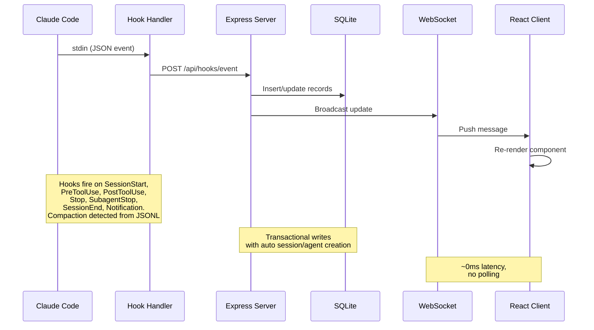
```mermaid
sequenceDiagram
    participant CC as Claude Code
    participant HH as Hook Handler
    participant API as Express Server
    participant DB as SQLite
    participant WS as WebSocket
    participant UI as React Client

    CC->>HH: stdin (JSON event)
    HH->>API: POST /api/hooks/event
    API->>DB: Insert/update records
    API->>WS: Broadcast update
    WS->>UI: Push message
    UI->>UI: Re-render component

    Note over CC,HH: Hooks fire on SessionStart,<br/>PreToolUse, PostToolUse,<br/>Stop, SubagentStop,<br/>SessionEnd, Notification.<br/>Compaction detected from JSONL
    Note over API,DB: Transactional writes<br/>with auto session/agent creation
    Note over WS,UI: ~0ms latency,<br/>no polling
```

> [!IMPORTANT]
> 서버 아키텍처, 데이터베이스 스키마, API 라우트, WebSocket 설계, 클라이언트 라우팅, Hook 핸들러 흐름, 배포 모드, 그리고 세션과 에이전트의 상세 라이프사이클 다이어그램에 대한 심층 설명은 [ARCHITECTURE.md](./ARCHITECTURE.md)를 참조하십시오.

### Hook 라이프사이클

1. **Claude Code**는 세션 시작, 도구 사용, 턴 종료, 서브에이전트 완료, 세션 종료 시 Hook을 발생시킵니다
2. **Hook 핸들러**(`scripts/hook-handler.js`)는 stdin에서 JSON 이벤트를 읽고, `~/.claude/.agent-dashboard.json`(또는 설정된 경우 `CLAUDE_DASHBOARD_PORT`)을 통해 실행 중인 모든 대시보드를 확인한 뒤, 동일한 페이로드를 각 대시보드에 병렬로 POST합니다. 5초의 안전망 타임아웃과 함께 조용히 실패하므로 Claude Code를 절대 차단하지 않으며, 대상별 프로미스는 절대 reject되지 않으므로 하나의 죽은 리스너가 다른 리스너들을 굶기는 일이 없습니다. 여러 대시보드가 함께 실행 중일 때(예: `npm run dev` + macOS 데스크톱 앱) 모두가 모든 이벤트를 수신합니다.
3. **서버**는 SQLite 트랜잭션 내에서 이벤트를 처리합니다:
   - 첫 접촉 시 세션과 메인 에이전트를 자동 생성합니다
   - `Agent` 도구 호출을 감지하여 서브에이전트 생성을 추적합니다
   - `SessionStart` 시 세션과 메인 에이전트의 `awaiting_input_since`를 기록하여, 프롬프트에 앉아 있는 새 CLI가 즉시 **Waiting** 상태에 놓이도록 합니다
   - `UserPromptSubmit`(사용자가 엔터를 누름) 시 대기 플래그를 지우고 메인 에이전트를 `working`으로 승격시킵니다 — 텍스트 전용 어시스턴트 턴은 `PreToolUse`를 발생시키지 않으므로, 이것이 해당 턴이 시작되었음을 알 수 있는 유일하게 신뢰할 수 있는 신호입니다
   - `PreToolUse` 시 에이전트를 "working"으로 설정하고(대기 플래그도 지움), `PostToolUse`를 거치는 동안 working 상태를 유지합니다
   - `Stop`(Claude가 응답을 마침) 시 메인 에이전트는 "waiting"으로 전환됩니다 — Claude가 자신의 턴을 마쳤고, 이제 공은 사용자에게 있습니다. 백그라운드 서브에이전트는 계속 실행됩니다. 세션은 `active`로 유지됩니다. `stop_reason=error`가 있는 Stop은 에이전트를 `error`로, 세션을 `error`로 표시합니다
   - 권한 `Notification`(메시지 패턴 `permission`, `waiting for input`, `needs your approval` 등으로 매칭) 시 에이전트를 `waiting`으로 설정하고 `awaiting_input_since`를 기록합니다
   - `SubagentStop`은 의도적으로 대기 플래그를 지우지 않습니다(백그라운드로 실행되던 서브에이전트가 끝났다는 사실은 사람에 대해 아무것도 알려주지 않습니다)
   - `SubagentStop`을 통해 서브에이전트를 개별적으로 완료 처리합니다. `res.json()`이 반환된 후, fire-and-forget 방식의 `scanAndImportSubagents` 패스를 실행하여 세션의 `subagents/agent-*.jsonl` 파일을 순회하고, `tool_use` ↔ `tool_result` 블록을 `tool_use_id`로 짝지어 각 서브에이전트 고유의 `agent_id` 아래에 `PreToolUse` + `PostToolUse` 이벤트를 발생시킵니다 — 이렇게 하지 않으면 서브에이전트 내부의 도구 호출이 대시보드에 보이지 않게 되는 공백을 메웁니다
   - `SessionEnd`(CLI 프로세스 종료) 시 대기 플래그를 내립니다. 세션이 `error` 상태이면 오류 상태가 보존되고, 그렇지 않으면 모든 에이전트와 세션을 `completed`로 표시합니다
   - `SessionStart` 시, `DASHBOARD_STALE_MINUTES`(기본값 180 = 3시간, env로 재정의 가능) 동안 활동이 없었던 다른 모든 활성 세션은 자동으로 "abandoned"로 표시되고 해당 에이전트는 완료 처리됩니다. 이는 세션 내부의 `/resume`, Ctrl+C, 그리고 깨끗한 `SessionEnd` 없이 세션이 고아가 되는 기타 시나리오를 처리합니다
   - 새 작업 이벤트가 도착하면 completed/error/abandoned 세션을 재활성화합니다(세션 재개). Stop 및 SubagentStop 이벤트도 completed/abandoned 세션을 재활성화합니다 — 이는 서버 시작 전에 가져온 기존 세션에서 첫 Hook 이벤트가 Stop일 수 있는 경우를 처리합니다
   - **오류 복구**: `UserPromptSubmit`과 `PreToolUse`만이 세션을 `error`에서 `active`로 복구할 수 있습니다 — 사용자가 능동적으로 재시도했음을 나타냅니다
   - 대화 압축(JSONL 트랜스크립트의 `isCompactSummary` 항목)을 감지하고 `Compaction` 에이전트와 이벤트를 생성합니다. 토큰 기준선은 압축 전후로 보존되므로 사용량이 손실되지 않습니다. 트랜스크립트 읽기는 증분 바이트 오프셋 읽기를 사용하는 공유 stat 기반 캐시를 사용합니다 — 마지막 읽기 이후 추가된 새 바이트만 파싱하므로 긴 세션에서 약 50배의 속도 향상을 제공합니다
   - JSONL 트랜스크립트에서 API 오류(`isApiErrorMessage` 항목: 할당량 제한, 속도 제한, invalid_request)와 원시 `type: "error"` 응답을 추출하여 `APIError` 이벤트로 저장합니다. 턴 지속 시간(`system` 하위 유형 `turn_duration`)은 `TurnDuration` 이벤트로 저장됩니다. 도구 결과 오류(`toolUseResult.is_error`)는 `ToolError` 이벤트로 추적됩니다
   - **오류 감지 워치독** — 백그라운드 타이머가 15초마다 실행되어 최근 Hook 이벤트가 없는(10초 이상 오래된) 활성 세션을 스캔합니다. 해당 세션의 트랜스크립트 파일을 다시 읽어 API 오류(인증 실패, 속도 제한, 할당량 소진)를 찾고, 이벤트 데이터에 `transcript_path`가 없는 가져온 세션에 대해서는 세션 `cwd`로부터 트랜스크립트 경로를 유도하며, API 오류가 발견되면 세션/에이전트를 `error`로 표시합니다. 이는 API 오류 후 Claude CLI가 Hook을 발생시키지 않는 경우(예: CLI가 오류를 표시하고 대기하는 401 인증 실패)를 포착합니다
   - **사용자 중단(Esc) 복구** — `Esc`로 턴을 취소하면 **Hook이 전혀 발생하지 않으므로**(문서화된 Claude Code의 제한 사항), 개입이 없다면 메인 에이전트는 영원히 `working` 상태에 갇혀 있게 됩니다. 동일한 15초 워치독이 두 가지 방식으로 이를 복구합니다: (1) 취소가 트랜스크립트에 `[Request interrupted by user]` 마커를 남기는 경우(일부 출력 *이후의* Esc), 트랜스크립트 캐시가 `pendingInterrupt`를 통해 이를 플래그하고 — 순수하게 트랜스크립트 순서(최신 중단 vs 최신 실제 턴 활동, 동일한 시계이므로 1초 미만의 취소에도 동작)로부터 유도됩니다 — 세션은 약 15초 이내에 **Waiting**으로 이동합니다; (2) *어떤 출력도 나오기 전에* Esc를 누르면 Claude Code는 마커를 전혀 기록하지 않으므로 유휴 타임아웃 폴백이 적용됩니다 — 메인 에이전트가 **진행 중인 도구 없이** `working` 상태이고 **Hook 이벤트도 트랜스크립트도** `DASHBOARD_WORKING_IDLE_SECONDS`(기본값 `120`) 동안 진전이 없었다면, 해당 턴은 죽은 것으로 간주되고 세션은 **Waiting**으로 이동합니다. 두 경로 모두 `Interrupted` 이벤트를 기록하고, 일반적인 `Stop`이 만들어내는 것과 동일한 Waiting 상태에 세션을 안착시킵니다. 스트리밍 출력(트랜스크립트가 계속 증가 중)과 진행 중인 도구 호출(`current_tool` 설정됨)은 예외이며, 드물게 발생하는 잘못된 전환은 다음 실제 Hook에서 자가 복구됩니다
   - **죽은 세션 활성 상태 회수** — Claude Code를 종료하면(Ctrl+C, 터미널 닫기) `SessionEnd` Hook이 발생하지만, 그 순간 대시보드가 실행 중이 아니면 이벤트는 영원히 유실되고 세션은 오래됨 정리(기본 3시간)까지 **Waiting** 상태로 남아 있게 됩니다. 동일한 15초 워치독이 **프로세스 활성 상태 프로브**로 이 공백을 메웁니다: 실행 중인 `claude` CLI 프로세스를 나열하고(macOS에서는 `ps` + `lsof`, Linux에서는 `/proc`), `cwd`에 살아 있는 claude 프로세스가 없는 모든 `active` 세션을 완료 처리합니다 — 실제 `SessionEnd`가 만들어내는 것과 동일한 `completed` 상태에 안착시키고, 타임라인에 합성 `SessionEnd` 이벤트를 남깁니다. 보호 장치: 워치독 틱에서는 세션의 트랜스크립트가 최소 `DASHBOARD_LIVENESS_IDLE_SECONDS`(기본값 `60`; 디스크에 트랜스크립트가 없을 때는 마지막 Hook 기록이 폴백 시계) 동안 기록되지 않았어야 하며 — **부팅 패스는 이 게이트를 완전히 건너뛰므로**, 실행 1초 전에 종료된 세션도 즉시 정리됩니다 — 프로브는 Windows에서, 컨테이너 내부에서(호스트 프로세스가 그곳에서는 보이지 않음), `ps`/`lsof`가 실패할 때, 또는 `DASHBOARD_LIVENESS_PROBE=0`으로 명시적으로 비활성화된 경우 "응답 없음"을 보고합니다(아무것도 변경하지 않음). **혼합** 배포에서는 회수가 `cwd`가 POSIX 절대 경로가 아닌 모든 세션도 자동으로 건너뜁니다 — household Hook을 통해 다른 머신에서 전달된 세션은 원본 머신 자체의 경로(예: Windows의 `D:\Git\ai-deck`)를 보고하며, 이는 로컬 `ps`/`lsof`/`/proc` 스캔이 결코 일치시킬 수 없으므로, 진짜 로컬 세션에 대해 프로브를 비활성화하지 않고도 원격 세션이 보호됩니다. 잘못된 완료 처리는 자가 복구됩니다: 다음 Hook 이벤트가 세션을 재활성화합니다. 15초 워치독 주기 외에도, 회수는 **시작 시 즉시** 실행되고(이전 실행에서 DB에 이미 남아 있던 죽은 세션을 렌더링되기 전에 정리) **약 5초 후 다시** 실행되므로(시작 동기화가 방금 가져온 세션까지 커버), 대시보드가 꺼져 있는 동안 죽은 세션이 Waiting으로 표시되는 일이 결코 없습니다
   - 주기적인 서버 스윕이 이벤트 기반 감지를 빠져나간 abandoned 세션과 새 압축을 포착합니다(예: `/compact`는 Hook을 발생시키지 않고, `/resume`이 세션 생성 후 몇 초 이내에 발생하는 경우). 주기는 `DASHBOARD_STALE_MINUTES`로부터 유도됩니다(임계값의 ¼, 60초 – 5분으로 제한). 스윕은 `transcript_path`를 찾기 위해 이벤트 테이블을 스캔하는 대신 각 활성 세션 행에서 직접 읽습니다(작은 인덱스 조회). 이 컬럼은 Hook 핸들러가 트랜스크립트 경로를 처음 볼 때 채워지고 `db.js` 마이그레이션이 기존 이벤트로부터 일회성 백필하며, 부분 인덱스 `idx_sessions_active_tp`가 스윕이 읽는 행을 정확히 커버합니다. 스윕은 Hook 핸들러와 트랜스크립트 캐시를 공유하여 중복 I/O를 피합니다. abandoned 세션 정리는 메모리를 제한하기 위해 트랜스크립트 캐시 항목도 제거합니다
   - **지속적 프로젝트 동기화**(`startSessionSync`)는 일회성의 마커로 게이트된 시작 백필을 넘어 `~/.claude/projects`를 계속 발견 가능하게 유지합니다: 나중에 추가되고 세션이 Hook을 통해 흐르지 않는 프로젝트는 그렇지 않으면 수동 재스캔 전까지 보이지 않은 채로 남게 됩니다. 즉각적인 시작 스윕, 디바운스된 `fs.watch`(macOS/Windows에서는 재귀적, Linux에서는 루트 + 직계 자식), 그리고 `DASHBOARD_SESSION_SYNC_MS` 폴링(기본값 30초; `0`은 폴링을 비활성화하고 워처는 유지)이 하나의 mtime 캐시와 병합된 스윕을 공유하여 mtime이 진행된 파일만 다시 파싱하며 — 이미 가져와졌고 변경되지 않은 세션은 다시 파싱하지 않고 건너뛰므로, 재시작 비용은 O(새/변경된 파일)로 유지됩니다. 새로 발견되거나 커진 각 세션은 Hook이 발생시키는 것과 동일한 프레임인 `session_created`/`session_updated`와 해당 메인 에이전트를 브로드캐스트합니다
4. **WebSocket**은 변경 사항을 연결된 모든 클라이언트에 브로드캐스트합니다
5. **UI**는 업데이트를 수신하고 영향을 받는 컴포넌트를 폴링 없이 실시간으로 다시 렌더링합니다.

### 에이전트 상태 머신

영속화되는 상태: `working | waiting | completed | error`.
`awaiting_input_since` 컬럼은 보조적인 것입니다 — 에이전트가 언제
대기를 시작했는지 추적하며 지속 시간 표시에 사용되지만, `waiting`은
이제 실제로 영속화되는 상태입니다.

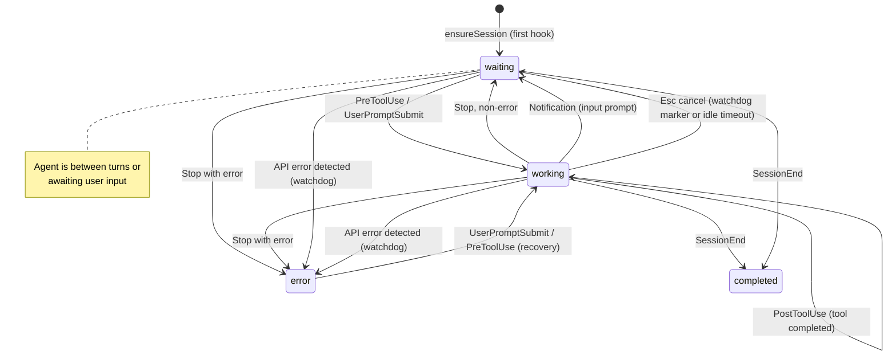
```mermaid
stateDiagram-v2
    [*] --> waiting: ensureSession (first hook)
    waiting --> working: PreToolUse / UserPromptSubmit
    working --> working: PostToolUse (tool completed)
    working --> waiting: Stop, non-error
    working --> waiting: Notification (input prompt)
    working --> waiting: Esc cancel (watchdog marker or idle timeout)
    waiting --> error: Stop with error
    working --> error: Stop with error
    waiting --> error: API error detected (watchdog)
    working --> error: API error detected (watchdog)
    error --> working: UserPromptSubmit / PreToolUse (recovery)
    working --> completed: SessionEnd
    waiting --> completed: SessionEnd

    note right of waiting
        Agent is between turns or
        awaiting user input
    end note
```

### 세션 상태 머신

영속화되는 상태: `active | completed | error | abandoned`.
**Waiting** 세션 상태는 UI 오버레이입니다(status=`active`에
`awaiting_input_since`가 설정된 상태).

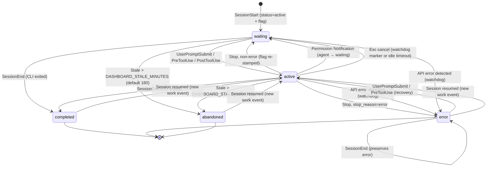
```mermaid
stateDiagram-v2
    [*] --> waiting: SessionStart (status=active + flag)
    waiting --> active: UserPromptSubmit / PreToolUse / PostToolUse
    active --> waiting: Stop, non-error (flag re-stamped)
    active --> waiting: Permission Notification (agent → waiting)
    active --> waiting: Esc cancel (watchdog marker or idle timeout)
    active --> error: Stop, stop_reason=error
    active --> error: API error detected (watchdog)
    waiting --> error: API error detected (watchdog)
    error --> active: UserPromptSubmit / PreToolUse (recovery)
    waiting --> completed: SessionEnd (CLI exited)
    active --> completed: SessionEnd (CLI exited)
    error --> error: SessionEnd (preserves error)
    waiting --> abandoned: Stale > DASHBOARD_STALE_MINUTES (default 180)
    active --> abandoned: Stale > DASHBOARD_STALE_MINUTES
    completed --> active: Session resumed (new work event)
    error --> active: Session resumed (new work event)
    abandoned --> active: Session resumed (new work event)
    completed --> [*]
    error --> [*]
    abandoned --> [*]
```

### 비용 계산 흐름

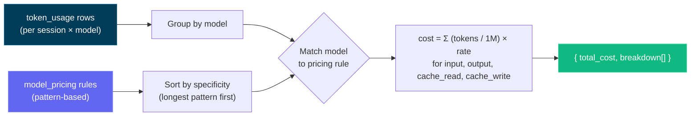
```mermaid
flowchart LR
    TU["token_usage rows<br/>(per session × model)"] --> GROUP["Group by model"]
    PR["model_pricing rules<br/>(pattern-based)"] --> SORT["Sort by specificity<br/>(longest pattern first)"]
    GROUP --> MATCH{"Match model<br/>to pricing rule"}
    SORT --> MATCH
    MATCH --> CALC["cost = Σ (tokens / 1M) × rate<br/>for input, output, cache_read, cache_write"]
    CALC --> RESULT["{ total_cost, breakdown[] }"]
    style TU fill:#003B57,stroke:#005f8a,color:#fff
    style PR fill:#6366f1,stroke:#818cf8,color:#fff
    style RESULT fill:#10b981,stroke:#34d399,color:#fff
```

> [!IMPORTANT]
> 비용 계산 흐름은 토큰 사용량과 모델 가격 책정 규칙을 기반으로 합니다. 정확한 비용을 반영하도록 가격 책정 규칙을 최신 상태로 유지하십시오. 정확한 비용 추적을 유지하려면 설정 페이지를 통해 모델 가격 책정 테이블을 업데이트하십시오 — 대시보드는 외부 소스에서 가격 업데이트를 자동으로 가져오지 않습니다. 가격 책정 규칙을 설정하면, 대시보드는 일관된 비용 보고를 위해 모든 세션에 이를 소급 적용합니다.

---

## 설정

| 환경 변수    | 기본값       | 설명                                   |
| ----------------------- | ------------- | --------------------------------------------- |
| `DASHBOARD_PORT`        | `4820`        | Express 서버의 포트                   |
| `CLAUDE_DASHBOARD_PORT` | `4820`        | Hook 핸들러가 서버에 접근할 때 사용하는 포트 |
| `NODE_ENV`              | `development` | 빌드된 클라이언트를 서빙하려면 `production`으로 설정 |
| `DASHBOARD_UPDATE_CHECK` | _(활성화됨)_ | 주기적인 git 업스트림 확인을 비활성화하려면 `0` / `false` / `off`로 설정 |
| `DASHBOARD_UPDATE_CHECK_INTERVAL_MS` | `300000` (5분) | 자동 확인 사이의 간격; 하한 60 000 ms. 사용자는 업데이트 모달이나 사이드바에서 **지금 확인**을 클릭하여 온디맨드로 한 번 실행할 수도 있습니다. |
| `DASHBOARD_STALE_MINUTES` | `180` (3시간) | 여전히 `active`인 세션(사용자 입력을 기다리며 **Waiting**에 앉아 있는 세션 포함 — "Waiting"은 저장된 상태가 아니라 `active` 행 위의 UI 오버레이)이 자동으로 **abandoned**로 표시되어 활성 목록에서 빠지기까지의 비활동 시간(분). 15초 워치독과 주기적 유지 관리 스윕(이 값의 ¼마다 실행되며 60초 – 5분으로 제한)에 의해 적용됩니다. 더 짧은 유휴 타임아웃을 원하면 낮추십시오(예: `60`) |
| `DASHBOARD_WORKING_IDLE_SECONDS` | `120` | **어떤 출력도 나오기 전에** `Esc`로 취소된 턴(트랜스크립트 마커를 남기지 않음)을 복구하기 위한 유휴 working 타임아웃. 메인 에이전트가 진행 중인 도구 없이 `working` 상태이고 Hook 이벤트도 트랜스크립트도 이 시간 동안 진전이 없으면, 워치독이 세션을 **Waiting**으로 이동시킵니다. 더 빠른 복구를 원하면 낮추십시오. 다만 긴 무음 사고 턴에서 간혹 잘못된 전환이 발생할 수 있습니다(자가 복구됨) |
| `DASHBOARD_LIVENESS_PROBE` | `1` (켜짐) | 워치독의 **죽은 세션 활성 상태 회수**(`claude` 프로세스가 더 이상 존재하지 않는 `active` 세션을 완료 처리하는 `ps`/`lsof` 기반 프로브 — 대시보드가 꺼져 있는 동안 유실된 `SessionEnd`를 복구)를 비활성화하려면 `0`으로 설정. **다른 머신**(household Hook)에서 전달된 세션은 비-POSIX `cwd`를 보고하여 회수가 자동으로 건너뛰므로, 혼합 로컬 + 전달 배포에서는 더 이상 이것을 끌 필요가 없습니다; 로컬 프로세스가 아무것도 증명하지 못하는 순수 원격 설정에서만 비활성화하십시오. Windows 및 컨테이너 내부에서는 자동으로 비활성화됩니다 |
| `DASHBOARD_LIVENESS_IDLE_SECONDS` | `60` | **워치독 틱** 활성 상태 회수를 위한 유휴 게이트: 세션의 트랜스크립트가 최소 이 시간 동안 기록되지 않았을 때에만 완료 처리되므로(디스크에 트랜스크립트가 없을 때는 마지막 Hook 기록이 폴백 시계), 턴 진행 중이거나 방금 재개된 세션이 일시적인 프로브 실패로 깜빡이며 사라지는 일이 없습니다. 시작 패스는 이 게이트를 무시합니다 — 부팅 시에는 프로브 단독으로 결정하므로, 실행 직전에 종료된 세션은 즉시 정리됩니다 |
| `DASHBOARD_SESSION_SYNC_MS` | `30000` | 시작 후 추가되어 세션이 Hook을 통해 흐르지 않는 프로젝트를 표면화하는 지속적 `~/.claude/projects` 백그라운드 동기화의 폴링 간격(ms). `fs.watch` 워처는 이와 무관하게 거의 즉시 발동합니다; 이 폴링은 안전망입니다(워처는 이벤트를 놓치거나 네트워크 파일시스템에서 발동하지 않을 수 있음). 워처는 계속 실행하면서 폴링만 비활성화하려면 `0`으로 설정하십시오 |
| `DASHBOARD_HOST`        | `127.0.0.1`   | 서버가 바인딩하는 인터페이스. 기본값은 루프백(네트워크에서 접근 불가). LAN에 노출하려면 `0.0.0.0`으로 설정(시작 시 경고를 로깅) |
| `DASHBOARD_TOKEN`       | _(설정 안 됨)_     | 설정하면 모든 `/api/*` 요청과 WebSocket이 토큰을 제시해야 합니다(`Authorization: Bearer <token>`, `x-dashboard-token` 헤더, 또는 `?token=`). 기본적으로 꺼져 있습니다 — 루프백 바인딩이 신뢰 경계입니다 |
| `DASHBOARD_ALLOWED_HOSTS` | _(루프백)_ | HTTP + WebSocket 업그레이드에서 허용되는 추가 `Host` 값의 쉼표 구분 목록(DNS 리바인딩 방지). 루프백을 넘어 바인딩할 때 LAN 호스트명을 여기에 추가하십시오 |

> [!IMPORTANT]
> **기본적으로 안전합니다.** 서버는 `127.0.0.1`에 바인딩되며 기본 상태에서는 네트워크에서 접근할 수 **없습니다**([GHSA-gr74-4xfh-6jw9](./.github/SECURITY.md)). LAN에 노출하려면 `DASHBOARD_HOST`(예: `0.0.0.0`)와 `DASHBOARD_TOKEN`(이후 `/api/*`와 WebSocket을 보호) **둘 다** 설정하고, `DASHBOARD_ALLOWED_HOSTS`에 LAN 호스트명을 나열하십시오. 자세한 내용은 [`.env.example`](./.env.example)과 [`.github/SECURITY.md`](./.github/SECURITY.md)를 참조하십시오.

git 클론의 경우, 서버는 주기적으로 `origin`을 `git fetch`하고 체크아웃을 `origin/master`, `origin/main`, 또는 `origin/HEAD`와 비교합니다. 뒤처져 있으면 서버 터미널에 메시지가 나타나고 UI에는 실행할 정확한 명령어가 담긴 모달이 나타납니다. 대시보드는 절대 스스로 pull하거나 재시작하지 않습니다 — 명령어를 복사해 터미널에서 실행한 뒤, 서버를 시작했던 것과 동일한 방식으로 재시작하면 됩니다.

---

## `ccam` CLI

대시보드의 전체 기능 표면은 의존성 없는 **`ccam`** CLI(`bin/ccam.js`)를 통해 어느 터미널에서든 사용할 수 있습니다. `npm run setup`이 (`npm link`를 통해) 자동으로 링크하며, 이후 `ccam <command>`는 어느 디렉터리에서든 동작합니다. 실행 중인 대시보드는 `~/.claude/.agent-dashboard.json`(Hook 핸들러가 사용하는 것과 동일한 라이브 서버 레지스트리)을 통해 발견하며, `CLAUDE_DASHBOARD_PORT` / `DASHBOARD_PORT` env 재정의를 지원하고, `http://127.0.0.1:4820`으로 폴백합니다.

```bash
# 서버
ccam status                       # ● 실행 중 / ○ 실행 중 아님 표시기
ccam start [--port N]             # 서버를 백그라운드에서 시작(분리 실행)
ccam repl                         # 대화형 셸(shell, i도 가능)

# 모니터링
ccam health                       # 대시보드가 켜져 있는가?
ccam stats                        # 총계, 오늘의 이벤트, 상태 분포
ccam kanban                       # 상태 컬럼별로 그룹화된 세션 + 에이전트
ccam tail [--session <id>]        # 터미널의 실시간 이벤트 피드(Ctrl+C로 중지)

# 데이터
ccam sessions [--status s] [--q text] [--limit n]
ccam session <id>                 # 상세: 에이전트 트리, 비용, 최근 이벤트
ccam agents   [--status s] [--session id]
ccam events   [--session id] [--limit n]

# 인사이트
ccam analytics                    # 토큰 총계, 상위 도구, 에이전트 유형
ccam workflows [--session id]     # 워크플로 인텔리전스 통계 및 패턴
ccam runs [--session id]          # 동적 Workflow 도구 실행
ccam cost                         # 모델별 내역이 포함된 총 예상 비용
                                  # (사용량은 있지만 가격 책정 규칙이 없는 모델에 대해 경고)

# 알림 및 웹훅
ccam alerts [--unacked]           # 발생한 알림 피드
ccam alerts ack <id> | ack-all    # 알림 확인 처리
ccam rules                        # 알림 규칙 나열
ccam webhooks                     # 웹훅 대상 나열
ccam webhooks test <id>           # 합성 테스트 알림 전송

# 가격 책정
ccam pricing                      # 모델 가격 책정 규칙 나열(fast-mode 및 intro 컬럼 포함)
ccam pricing set <pattern> --input N --output N [--cache-read N --cache-write N]
                 [--cache-write-1h N] [--fast-input N --fast-output N]
                 [--intro-input N --intro-output N … --intro-until YYYY-MM-DD]
ccam pricing delete <pattern>
ccam pricing reset

# 가져오기
ccam import rescan                # ~/.claude/projects 재스캔
ccam import path <dir>            # 디렉터리 아래의 모든 .jsonl 가져오기

# 관리
ccam doctor                       # 연결, Hook, 데이터베이스 진단
ccam info                         # 원시 시스템 정보 JSON
ccam export [file.json]           # 전체 JSON 데이터 내보내기
ccam cleanup --hours N --days M   # 오래된 세션 abandon 처리 / 이전 세션 삭제
ccam reinstall-hooks              # Claude Code Hook 재설치
ccam update-check                 # 체크아웃이 업스트림보다 뒤처져 있는가?(업데이트 명령어 출력)
ccam clear-data --yes             # 모든 데이터 삭제(--yes 필요)
ccam open                         # 브라우저에서 대시보드 열기
ccam version                      # CLI 버전 출력(--version / -v도 가능)
```

API 기반 명령어는 서버가 실행 중이어야 합니다 — 서버가 실행 중이 아닐 때, **읽기 전용 명령어는 `data/dashboard.db`를 직접 읽는 방식으로 폴백하며**(명시적인 `⚠ Offline mode` 배너와 함께, 그리고 저장되어 있지만 죽은 `active` 세션은 서버 워치독이 사용하는 것과 동일한 프로세스 활성 상태 프로브로 표시 측에서 보정됩니다), 서버 없이는 올바르게 실행될 수 없는 명령어(라이브 `tail`, analytics/cost 계산, 변경 작업)는 구체적인 이유와 시작 명령어와 함께 `○ Dashboard server is NOT running` 표시기를 출력합니다; `ccam start`는 프로덕션 서버를 백그라운드에서 띄웁니다. 읽기 명령어는 항상 안전하며, 유일한 파괴적 명령어(`clear-data`)는 명시적인 `--yes` 없이는 실행을 거부합니다. 출력은 완전한 터미널 UI입니다 — 오른쪽 정렬된 숫자 컬럼을 가진 박스 드로잉 테이블, 상태 아이콘(`● active`, `○ waiting`, `✔ completed`, `✖ error`), stats/analytics/cost용 인라인 막대 차트, 그리고 실제 `├─`/`└─` 에이전트 트리 — ANSI 색상은 TTY에서 자동 활성화되고 파이프될 때는 꺼지며 `--no-color` / `NO_COLOR` / `FORCE_COLOR`로 제어할 수 있습니다. 지속적인 모니터링을 위해 **`ccam repl`**(별칭 `shell` / `i`)은 `ccam` 접두사 없이 명령어를 입력하는 대화형 셸을 엽니다 — CCAM 환영 배너, Tab 자동 완성, 저장되는 방향키 히스토리, 실시간 서버 상태 프롬프트(`● host` 실행 중 / `○ offline` 중지), 그룹화된 `help` / `help <cmd>` 메뉴, 그리고 아무 명령이나 자동 새로고침하는 `watch [초] <명령>` 내장 기능(예: `watch 5 kanban`)을 제공합니다. 각 줄은 격리된 자식 프로세스로 실행되므로 오프라인 거부나 블로킹되는 `tail`이 셸을 종료시키는 일은 없습니다. `ccam`이 PATH에 없다면(예: `npm link`에 상승된 권한이 필요했던 경우) 저장소 루트에서 `npm link`를 한 번 실행하십시오. 전체 참조 — 플래그, 발견 순서, REPL, 안전 모델, 스크립팅/종료 코드, 문제 해결 — 는 [docs/CLI.md](./docs/CLI.md)에서 확인할 수 있습니다.

## npm 스크립트

| 명령어                 | 설명                                                |
| ----------------------- | ---------------------------------------------------------- |
| `npm run setup`         | 서버 및 클라이언트 의존성을 설치합니다                     |
| `npm run update:pull-setup` | `git pull --ff-only` 실행 후 `npm run setup` 실행 (수동 업그레이드) |
| `npm run dev`           | 서버(watch 모드) + 클라이언트(Vite HMR)를 동시에 시작합니다 |
| `npm run dev:server`    | `--watch`로 Express 서버만 시작합니다               |
| `npm run dev:client`    | Vite 개발 서버만 시작합니다                            |
| `npm run build`         | React 클라이언트를 `client/dist/`로 빌드합니다                   |
| `npm start`             | 프로덕션 서버를 시작합니다 (빌드된 클라이언트 제공)              |
| `npm test`              | 전체 테스트 스위트를 실행합니다 (서버 `node --test` + 클라이언트 Vitest)  |
| `npm run test:server`   | 백엔드 테스트를 실행합니다 (`node --test server/__tests__/`)        |
| `npm run test:client`   | 프론트엔드 Vitest 테스트를 실행합니다. **모든 화면에 대한 렌더 스냅샷**(`client/src/pages/__tests__/screens.snapshot.test.tsx`)이 포함되며, 의도된 UI 변경 후에는 `cd client && npx vitest run -u`로 기준선을 재생성합니다 |
| `npm run install-hooks` | `~/.claude/settings.json`에 Claude Code Hook을 구성합니다   |
| `npm run seed`          | 샘플 데이터로 데이터베이스를 채웁니다                           |
| `npm run import-history`| `~/.claude/`에서 레거시 세션을 가져옵니다 (시작 시에도 실행됨) |
| `npm run clear-data`    | 모든 세션, 에이전트, 이벤트, 토큰 사용량을 삭제합니다            |
| `npm run mcp:install`   | 로컬 MCP 패키지(`mcp/`)의 의존성을 설치합니다       |
| `npm run mcp:build`     | MCP 서버 TypeScript를 `mcp/build/`로 빌드합니다             |
| `npm run mcp:start`     | MCP 서버를 시작합니다 (stdio 전송 — MCP 호스트용)        |
| `npm run mcp:start:http`| MCP 서버를 시작합니다 (포트 8819에서 HTTP + SSE 전송)      |
| `npm run mcp:start:repl`| MCP 서버를 시작합니다 (탭 완성을 지원하는 대화형 REPL)   |
| `npm run mcp:dev`       | MCP 서버를 개발 모드로 실행합니다 (`tsx`, stdio)                 |
| `npm run mcp:dev:http`  | MCP 서버를 개발 모드로 실행합니다 (`tsx`, HTTP + SSE)            |
| `npm run mcp:dev:repl`  | MCP 서버를 개발 모드로 실행합니다 (`tsx`, 대화형 REPL)      |
| `npm run mcp:typecheck` | 빌드 산출물을 생성하지 않고 MCP 소스의 타입을 검사합니다        |
| `npm run mcp:docker:build` | Docker로 MCP 컨테이너 이미지를 빌드합니다 (`agent-dashboard-mcp:local`) |
| `npm run mcp:podman:build` | Podman으로 MCP 컨테이너 이미지를 빌드합니다 (`localhost/agent-dashboard-mcp:local`) |
| `npm run desktop:install` | `desktop/` 워크스페이스에 Electron + electron-builder를 설치합니다 (Electron의 ABI에 맞게 `better-sqlite3`를 재빌드); 네이티브 `better-sqlite3` 빌드를 사전 점검하고 실패 시 실행 가능한 설정 도움말(툴체인 없이 사용하는 대안 포함)을 출력합니다 |
| `npm run desktop:dev`   | 로컬 반복 작업을 위해 Electron 데스크톱 앱을 빌드하고 실행합니다  |
| `npm run desktop:build` | 데스크톱 TypeScript 소스를 `desktop/out/`으로 컴파일합니다      |
| `npm run desktop:test`  | 데스크톱 스모크 테스트를 실행합니다 (Electron 실행 후 `/api/health` 확인) |
| `npm run desktop:dmg`   | **유니버설**(x64 + arm64) macOS DMG를 빌드합니다 — 릴리스에 적합하지만 **느림** |
| `npm run desktop:dmg:arm64` | Apple Silicon 전용 DMG를 빌드합니다 — **빠름**, 본인 Mac에서 사용 시 권장 |
| `npm run desktop:dmg:x64` | Intel 전용 DMG를 빌드합니다 — **빠름**                           |
| `npm run desktop:win`   | Windows **NSIS 설치 프로그램** `.exe`(x64)를 빌드합니다 — Windows에서 실행 |
| `npm run desktop:win:portable` | Windows **포터블**(무설치) `.exe`(x64)를 빌드합니다 — Windows에서 실행 |

---

## 에이전트 확장

이 저장소는 Claude Code와 Codex 모두를 위한 포괄적인 확장 레이어를 포함합니다:

- Claude Code: `CLAUDE.md`, `.claude/rules/`, `.claude/skills/`
- Claude 서브에이전트: `.claude/agents/`
- Codex: `AGENTS.md`, `.codex/rules/`, `.codex/agents/`, `.codex/skills/`

### 확장 아키텍처

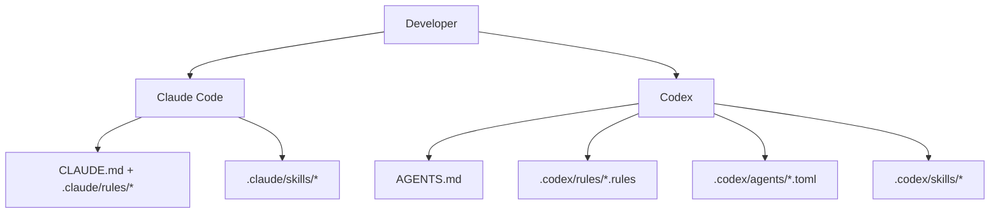
```mermaid
graph TD
    USER["Developer"]
    CLAUDE["Claude Code"]
    CODEX["Codex"]
    MEMORY["CLAUDE.md + .claude/rules/*"]
    C_SKILLS[".claude/skills/*"]
    AGENTS_MD["AGENTS.md"]
    X_RULES[".codex/rules/*.rules"]
    X_AGENTS[".codex/agents/*.toml"]
    X_SKILLS[".codex/skills/*"]

    USER --> CLAUDE
    USER --> CODEX
    CLAUDE --> MEMORY
    CLAUDE --> C_SKILLS
    CODEX --> AGENTS_MD
    CODEX --> X_RULES
    CODEX --> X_AGENTS
    CODEX --> X_SKILLS
```

### Claude Code 레이어

- 영구 컨텍스트:
  - [`CLAUDE.md`](./CLAUDE.md)
- 경로 범위 규칙:
  - [`.claude/rules/backend-node.md`](./.claude/rules/backend-node.md)
  - [`.claude/rules/frontend-react.md`](./.claude/rules/frontend-react.md)
  - [`.claude/rules/mcp-typescript.md`](./.claude/rules/mcp-typescript.md)
  - [`.claude/rules/docs-markdown.md`](./.claude/rules/docs-markdown.md)
- 스킬:
  - `repo-onboarding`
  - `ship-feature`
  - `mcp-operations`
  - `debug-live-issue`
- 서브에이전트:
  - `backend-reviewer`
  - `frontend-reviewer`
  - `mcp-reviewer`

### Codex 레이어

- 영구 컨텍스트:
  - [`AGENTS.md`](./AGENTS.md)
- 실행 정책:
  - [`.codex/rules/default.rules`](./.codex/rules/default.rules)
- 사용자 정의 서브에이전트 템플릿:
  - [`.codex/agents/`](./.codex/agents)
- 스킬:
  - [`.codex/skills/`](./.codex/skills)
- 설정:
  - [`.codex/README.md`](./.codex/README.md)

---

## MCP 통합

이 프로젝트는 대시보드 작업을 AI 에이전트용 도구로 노출하는 로컬 프로덕션급 MCP 서버를 `mcp/`에 포함하고 있습니다. 서로 다른 통합 시나리오에 맞도록 세 가지 전송 모드를 지원합니다.

### MCP 전송 모드

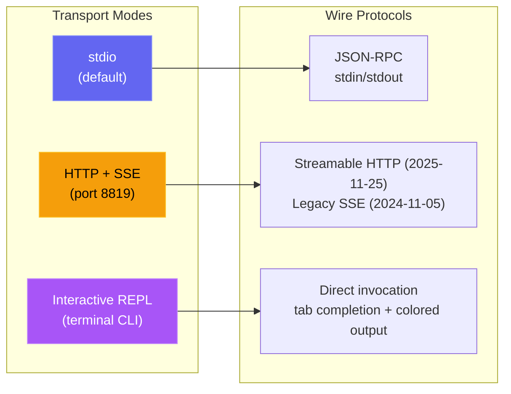
```mermaid
flowchart LR
    subgraph Transports["Transport Modes"]
        STDIO["stdio\n(default)"]
        HTTP["HTTP + SSE\n(port 8819)"]
        REPL["Interactive REPL\n(terminal CLI)"]
    end

    subgraph Protocols["Wire Protocols"]
        P1["JSON-RPC\nstdin/stdout"]
        P2["Streamable HTTP (2025-11-25)\nLegacy SSE (2024-11-05)"]
        P3["Direct invocation\ntab completion + colored output"]
    end

    STDIO --> P1
    HTTP --> P2
    REPL --> P3

    style STDIO fill:#6366f1,stroke:#818cf8,color:#fff
    style HTTP fill:#f59e0b,stroke:#fbbf24,color:#000
    style REPL fill:#a855f7,stroke:#c084fc,color:#fff
```

| 모드 | 명령어 | 사용 사례 |
| --- | --- | --- |
| **stdio** | `npm run mcp:start` | Claude Code, Claude Desktop, IDE MCP 호스트 |
| **HTTP** | `npm run mcp:start:http` | 원격 MCP 클라이언트, 웹 통합, 다중 세션 |
| **REPL** | `npm run mcp:start:repl` | 운영 디버깅, 수동 도구 호출, 로컬 관리 |

<p align="center">
  
</p>

### MCP 아키텍처

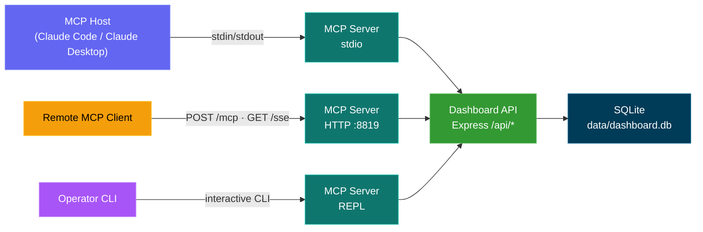
```mermaid
graph LR
    HOST["MCP Host<br/>(Claude Code / Claude Desktop)"]
    HTTP_CLIENT["Remote MCP Client"]
    OPERATOR["Operator CLI"]

    MCP_STDIO["MCP Server<br/>stdio"]
    MCP_HTTP["MCP Server<br/>HTTP :8819"]
    MCP_REPL["MCP Server<br/>REPL"]

    API["Dashboard API<br/>Express /api/*"]
    DB["SQLite<br/>data/dashboard.db"]

    HOST -->|"stdin/stdout"| MCP_STDIO
    HTTP_CLIENT -->|"POST /mcp · GET /sse"| MCP_HTTP
    OPERATOR -->|"interactive CLI"| MCP_REPL

    MCP_STDIO --> API
    MCP_HTTP --> API
    MCP_REPL --> API
    API --> DB

    style HOST fill:#6366f1,stroke:#818cf8,color:#fff
    style HTTP_CLIENT fill:#f59e0b,stroke:#fbbf24,color:#000
    style OPERATOR fill:#a855f7,stroke:#c084fc,color:#fff
    style MCP_STDIO fill:#0f766e,stroke:#14b8a6,color:#fff
    style MCP_HTTP fill:#0f766e,stroke:#14b8a6,color:#fff
    style MCP_REPL fill:#0f766e,stroke:#14b8a6,color:#fff
    style API fill:#339933,stroke:#5cb85c,color:#fff
    style DB fill:#003B57,stroke:#005f8a,color:#fff
```

### MCP 도구 표면

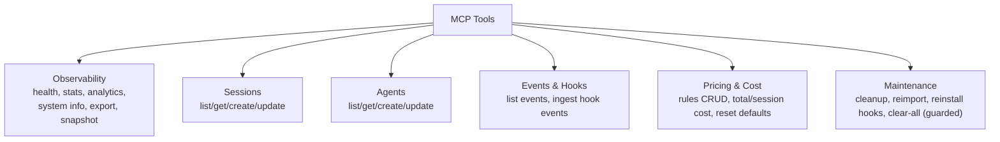
```mermaid
graph TD
    ROOT["MCP Tools"]
    OBS["Observability<br/>health, stats, analytics,<br/>system info, export, snapshot"]
    SES["Sessions<br/>list/get/create/update"]
    AGT["Agents<br/>list/get/create/update"]
    EVT["Events & Hooks<br/>list events, ingest hook events"]
    PRC["Pricing & Cost<br/>rules CRUD, total/session cost, reset defaults"]
    MNT["Maintenance<br/>cleanup, reimport, reinstall hooks, clear-all (guarded)"]

    ROOT --> OBS
    ROOT --> SES
    ROOT --> AGT
    ROOT --> EVT
    ROOT --> PRC
    ROOT --> MNT
```

### MCP 안전 모델

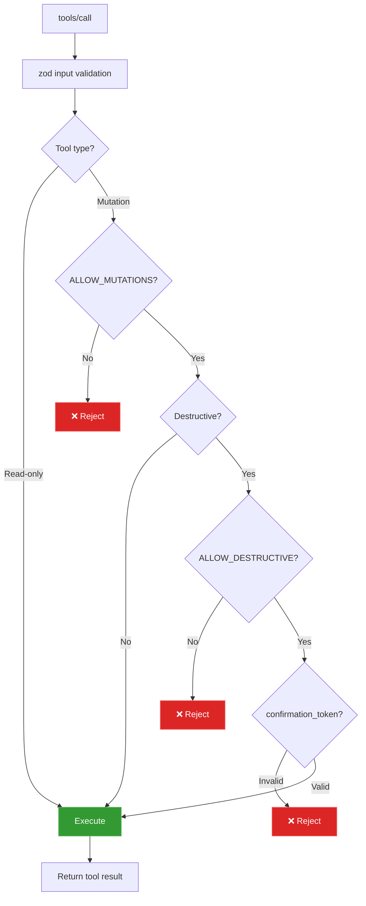
```mermaid
flowchart TD
    CALL["tools/call"] --> VALIDATE["zod input validation"]
    VALIDATE --> TYPE{"Tool type?"}
    TYPE -->|Read-only| EXEC["Execute"]
    TYPE -->|Mutation| M_FLAG{"ALLOW_MUTATIONS?"}
    M_FLAG -->|No| DENY1["❌ Reject"]
    M_FLAG -->|Yes| DEST{"Destructive?"}
    DEST -->|No| EXEC
    DEST -->|Yes| D_FLAG{"ALLOW_DESTRUCTIVE?"}
    D_FLAG -->|No| DENY2["❌ Reject"]
    D_FLAG -->|Yes| TOKEN{"confirmation_token?"}
    TOKEN -->|Invalid| DENY3["❌ Reject"]
    TOKEN -->|Valid| EXEC
    EXEC --> RESULT["Return tool result"]

    style EXEC fill:#339933,stroke:#5cb85c,color:#fff
    style DENY1 fill:#dc2626,stroke:#f87171,color:#fff
    style DENY2 fill:#dc2626,stroke:#f87171,color:#fff
    style DENY3 fill:#dc2626,stroke:#f87171,color:#fff
```

### MCP 운영 모드

- 읽기 전용 모드 (기본값): `MCP_DASHBOARD_ALLOW_MUTATIONS=false`
- 관리자 모드: `MCP_DASHBOARD_ALLOW_MUTATIONS=true`
- 파괴적 모드: 다음이 모두 필요합니다:
  - `MCP_DASHBOARD_ALLOW_MUTATIONS=true`
  - `MCP_DASHBOARD_ALLOW_DESTRUCTIVE=true`
  - 도구 입력 `confirmation_token: "CLEAR_ALL_DATA"`

전체 세부 사항: [mcp/README.md](./mcp/README.md)

---

## API 참조

모든 엔드포인트는 JSON을 반환합니다. 오류 응답은 `{ error: { code, message } }` 형태를 따릅니다.

### OpenAPI / Swagger / ReDoc

HTTP API를 탐색하는 방법은 세 가지가 있으며, 모두 하나의 OpenAPI 3.0.3 사양으로 구동됩니다(기본 서버 포트 `4820`):

| 메서드 | 경로                            | 설명                                                                                              |
| ------ | ------------------------------- | ------------------------------------------------------------------------------------------------- |
| `GET`  | `/api/openapi.json`             | 원시 OpenAPI 3.0.3 JSON 사양                                                                       |
| `GET`  | `/api/docs`                     | 대화형 **Swagger UI** — try-it-out 방식의 요청 실행                                               |
| `GET`  | `/api/redoc`                    | **ReDoc** 참조 문서 — 동일한 사양을 깔끔하고 읽기에 최적화된 3패널 형태로 렌더링                  |
| `GET`  | `/api/redoc/redoc.standalone.js`| 자체 호스팅 ReDoc 번들(`redoc` 의존성을 통해 로컬로 제공되며 CDN을 사용하지 않음 — 오프라인에서도 동작) |

OpenAPI 문서는 `server/openapi.js`(`createOpenApiSpec()`)에서 생성되며, `server/openapi-extra/` 아래의 보조 프래그먼트와 병합됩니다. Swagger UI와 ReDoc은 모두 백엔드가 직접 제공합니다. ReDoc 번들은 로컬로 제공되므로(`GET /api/redoc/redoc.standalone.js`) 이 참조 문서는 완전한 오프라인 / 에어갭 환경에서도 동작하며, 이는 프로젝트의 외부 자산 미사용 정책과 일치합니다.

커버리지는 포괄적입니다. 모든 백엔드 라우트가 문서화되어 있으며(75개의 경로 항목), 다음 태그들 — Health, Sessions, Agents, Events, Stats, Analytics, Hooks, Pricing, Workflows, Settings, Updates, Alerts, Webhooks, Push, CcConfig(Claude Code 설정 탐색기), Run(대시보드에서 생성된 실행), Documentation — 에 걸쳐 각각 매개변수, 요청/응답 스키마, 필드 수준 설명, 현실적인 예제를 포함합니다.

저장소 루트에 커밋되어 있는 **`openapi.yaml`**은 라이브 사양을 그대로 반영합니다. 이 파일은 `server/openapi.js`에서 생성되며(직접 손으로 편집하지 않음) — API 변경 후 다음 명령으로 다시 생성합니다:

```bash
npm run openapi:yaml
```

<p align="center">
  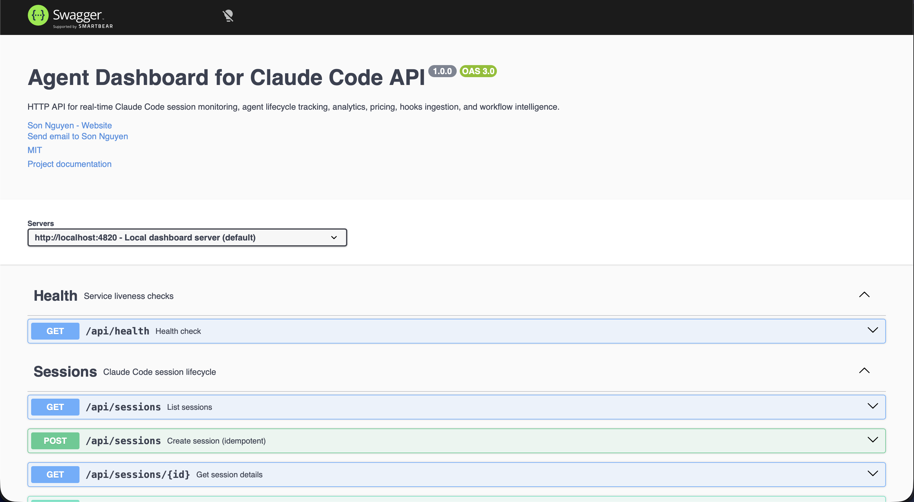
</p>

<p align="center">
  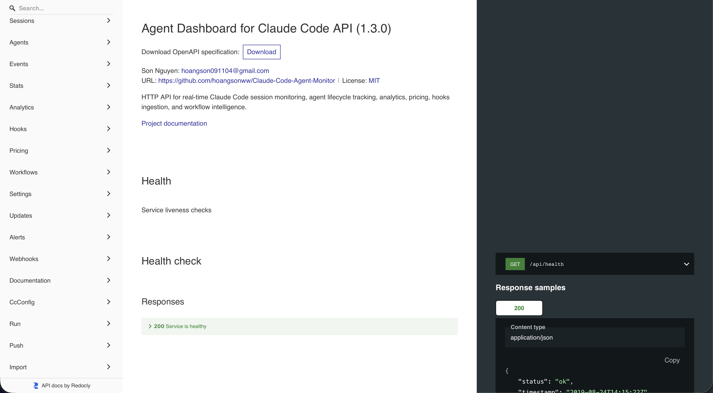
</p>

### 상태 확인

| 메서드 | 경로          | 설명                                  |
| ------ | ------------- | ------------------------------------- |
| `GET`  | `/api/health` | `{ status: "ok", timestamp }`를 반환합니다 |

### 세션

| 메서드  | 경로                            | 쿼리 매개변수                                                     | 설명                                                                                          |
| ------- | ------------------------------- | ---------------------------------------------------------------- | -------------------------------------------------------------------------------------------- |
| `GET`   | `/api/sessions`                 | `status`, `q`, `limit`, `offset`                                 | 에이전트 수와 세션별 비용을 포함한 세션 목록을 조회합니다. `q`는 `id` / `name` / `cwd` 전반에 걸쳐 대소문자를 구분하지 않는 검색을 수행합니다. `limit`의 기본값은 50, 최대값은 10000입니다. 응답에는 페이지네이터를 위한 `total`이 포함됩니다. |
| `GET`   | `/api/sessions/:id`             | --                                                               | 에이전트와 이벤트를 포함한 세션 상세 정보                                                     |
| `GET`   | `/api/sessions/:id/stats`       | --                                                               | 세션 상세 개요 패널을 구동하는 집계 수치: 이벤트, 유형별 이벤트, 상위 도구 사용량, 오류 수, 에이전트 유형/상태 수, 서브에이전트 유형 분포, 토큰 합계, 시간 범위 |
| `GET`   | `/api/sessions/:id/transcripts` | --                                                               | 해당 세션에서 사용 가능한 JSONL 트랜스크립트 목록을 조회합니다(메인 + 서브에이전트 + 컴팩션) |
| `GET`   | `/api/sessions/:id/transcript`  | `agent_id`, `limit`, `offset`, `after`, `before`                 | 커서 기반 페이지네이션으로 특정 트랜스크립트의 메시지를 스트리밍합니다. 어시스턴트 `usage`에는 `input_tokens`, `output_tokens`, `cache_read_input_tokens`, `cache_creation_input_tokens`가 포함되어 재개 / 재연결 시 Run 페이지의 미터가 완전히 복원(hydrate)될 수 있습니다 |
| `POST`  | `/api/sessions`                 | --                                                               | 세션 생성(`id` 기준 멱등)                                                                     |
| `PATCH` | `/api/sessions/:id`             | --                                                               | 세션 상태/메타데이터 업데이트                                                                 |

### 에이전트

| 메서드  | 경로              | 쿼리 매개변수                             | 설명                          |
| ------- | ----------------- | ----------------------------------------- | ----------------------------- |
| `GET`   | `/api/agents`     | `status`, `session_id`, `limit`, `offset` | 필터를 적용한 에이전트 목록 조회 |
| `GET`   | `/api/agents/:id` | --                                        | 단일 에이전트 상세 정보       |
| `POST`  | `/api/agents`     | --                                        | 에이전트 생성                 |
| `PATCH` | `/api/agents/:id` | --                                        | 에이전트 상태/작업/도구 업데이트 |

### 이벤트

| 메서드 | 경로          | 쿼리 매개변수                   | 설명                       |
| ------ | ------------- | ------------------------------- | -------------------------- |
| `GET`  | `/api/events` | `session_id`, `limit`, `offset` | 이벤트 목록 조회(최신순)   |

### 통계

| 메서드 | 경로         | 설명                                                   |
| ------ | ------------ | ------------------------------------------------------ |
| `GET`  | `/api/stats` | 집계 수치, 상태 분포, WS 연결 수                       |

### 분석

| 메서드 | 경로             | 설명                                                       |
| ------ | ---------------- | ---------------------------------------------------------- |
| `GET`  | `/api/analytics` | 차트와 트렌드 뷰를 위한 토큰/도구/세션 집계               |

### Hook

| 메서드 | 경로               | 설명                                         |
| ------ | ------------------ | -------------------------------------------- |
| `POST` | `/api/hooks/event` | Claude Code Hook 이벤트를 수신하고 처리합니다 |

**Hook 이벤트 페이로드:**

```json
{
  "hook_type": "PreToolUse",
  "data": {
    "session_id": "abc-123",
    "tool_name": "Bash",
    "tool_input": { "command": "ls -la" }
  }
}
```

### 가격 책정

| 메서드   | 경로                     | 설명                                     |
| -------- | ------------------------ | ---------------------------------------- |
| `GET`    | `/api/pricing`           | 모든 가격 책정 규칙 목록 조회            |
| `PUT`    | `/api/pricing`           | 가격 책정 규칙 생성 또는 업데이트        |
| `DELETE` | `/api/pricing/:pattern`  | 가격 책정 규칙 삭제                      |
| `GET`    | `/api/pricing/cost`      | 전체 세션에 걸친 총 비용                 |
| `GET`    | `/api/pricing/cost/:id`  | 특정 세션의 비용 상세 분석               |

### 워크플로

| 메서드 | 경로                          | 설명                                                    |
| ------ | ----------------------------- | ------------------------------------------------------- |
| `GET`  | `/api/workflows`              | 워크플로 데이터 집계(오케스트레이션, 도구, 패턴). 선택적 `?status=active\|completed` 쿼리 매개변수는 11개 데이터 섹션 전체를 세션 상태로 필터링합니다 |
| `GET`  | `/api/workflows/session/:id`  | 세션별 상세 드릴인(에이전트 트리, 도구 타임라인, 이벤트) |

### 알림

| 메서드   | 경로                     | 설명                                                                   |
| -------- | ------------------------ | ---------------------------------------------------------------------- |
| `GET`    | `/api/alerts`            | 발생한 알림 피드, 최신순(`?unacked=true`, `limit`, `offset`)           |
| `POST`   | `/api/alerts/:id/ack`    | 알림 하나를 확인 처리                                                  |
| `POST`   | `/api/alerts/ack-all`    | 확인되지 않은 모든 알림을 확인 처리                                    |
| `GET`    | `/api/alerts/rules`      | 알림 규칙 목록 조회                                                    |
| `POST`   | `/api/alerts/rules`      | 규칙 생성(`event_pattern` \| `inactivity` \| `status_duration` \| `token_threshold`) |
| `PATCH`  | `/api/alerts/rules/:id`  | 이름 / 설정 / 활성화 / 쿨다운 업데이트(규칙 유형은 변경 불가)          |
| `DELETE` | `/api/alerts/rules/:id`  | 규칙과 해당 발생 알림 기록 삭제                                        |

### Webhook

| 메서드   | 경로                              | 설명                                                                                 |
| -------- | --------------------------------- | ------------------------------------------------------------------------------------ |
| `GET`    | `/api/webhooks/providers`         | 지원되는 공급자 + 각 공급자의 설정 필드(UI 폼을 구동)                                |
| `GET`    | `/api/webhooks`                   | Webhook 대상 목록 조회(URL은 마스킹, 시크릿은 삭제 처리)                             |
| `POST`   | `/api/webhooks`                   | 대상 생성(14개의 일급 공급자 + `generic`)                                            |
| `PATCH`  | `/api/webhooks/:id`               | 이름 / url / 활성화 / 시크릿 / 헤더 / 규칙 범위 업데이트(유형은 변경 불가)           |
| `DELETE` | `/api/webhooks/:id`               | 대상과 해당 전달 로그 삭제                                                           |
| `POST`   | `/api/webhooks/:id/test`          | 합성 테스트 알림을 전송하고 전달 결과를 보고                                         |
| `GET`    | `/api/webhooks/:id/deliveries`    | 대상의 최근 전달 로그(`limit`, `offset`)                                              |

### 설정

| 메서드 | 경로                           | 설명                                             |
| ------ | ------------------------------ | ------------------------------------------------ |
| `GET`  | `/api/settings/info`           | 시스템 정보, DB 통계, Hook 상태                  |
| `POST` | `/api/settings/clear-data`     | 모든 세션, 에이전트, 이벤트, 토큰 사용량 삭제    |
| `POST` | `/api/settings/reimport`       | `~/.claude/`에서 레거시 세션 다시 가져오기       |
| `POST` | `/api/settings/reinstall-hooks`| Claude Code Hook 재설치                          |
| `POST` | `/api/settings/reset-pricing`  | 가격 책정을 기본값으로 재설정                    |
| `GET`  | `/api/settings/export`         | 모든 데이터를 JSON 다운로드로 내보내기           |
| `POST` | `/api/settings/cleanup`        | 오래된 세션을 중단 처리하고 오래된 데이터 정리   |

### Claude 설정 탐색기 (`/api/cc-config`)

Claude Code의 모든 설정 표면을 읽기 전용으로 검사할 수 있으며, 위험도가 낮은 텍스트 파일 아티팩트에 대해서는 신중하게 제한된 변경 기능을 제공합니다. 모든 쓰기 경로는 변경 전에 `<root>/cc-config-backups/<type>/` 아래에 타임스탬프가 붙은 백업을 생성합니다.

| 메서드   | 경로                                | 설명 |
| -------- | ----------------------------------- | ----------- |
| `GET`    | `/api/cc-config/overview`           | 루트(claude 홈, 프로젝트 .claude, 프로젝트 루트, ~/.claude.json) + 모든 표면에 대한 개수 |
| `GET`    | `/api/cc-config/skills`             | 파싱된 프런트매터를 포함한 `<scope>/.claude/skills/<name>/SKILL.md` 아래의 스킬; `?scope=user\|project\|all` |
| `GET`    | `/api/cc-config/agents`             | 서브에이전트 `<scope>/.claude/agents/*.md` |
| `GET`    | `/api/cc-config/commands`           | 슬래시 명령어 `<scope>/.claude/commands/*.md` |
| `GET`    | `/api/cc-config/output-styles`      | 출력 스타일 `<scope>/.claude/output-styles/*.md` |
| `GET`    | `/api/cc-config/plugins`            | `~/.claude/plugins/installed_plugins.json`의 설치된 플러그인을 설정의 `enabledPlugins`와 조인한 결과; 각 항목에는 `contributes`(플러그인 설치 디렉터리 내부의 스킬/에이전트/명령어/Hook/출력 스타일 개수)와 `plugin.json` 메타데이터가 포함됩니다 |
| `GET`    | `/api/cc-config/marketplaces`       | `known_marketplaces.json`에 등록된 마켓플레이스로, 각 마켓플레이스 자체의 `marketplace.json`(플러그인 수, 소유자, 설명)으로 보강됩니다 |
| `GET`    | `/api/cc-config/mcp`                | `~/.claude.json`(최상위 + 프로젝트별) 및 `settings.json`의 MCP 서버 |
| `GET`    | `/api/cc-config/hooks`              | 사용자 / 프로젝트 / 프로젝트 로컬 `settings.json` 파일 전반에 걸쳐 집계된 Hook |
| `GET`    | `/api/cc-config/hook-scripts`       | `~/.claude/hooks/`의 파일(`hooks.<event>.command`가 참조하는 헬퍼 스크립트) |
| `GET`    | `/api/cc-config/keybindings`        | `~/.claude/keybindings.json`을 컨텍스트별로 그룹화된 키/액션 쌍으로 파싱한 결과 |
| `GET`    | `/api/cc-config/statusline`         | `settings.json.statusLine` 설정 + 존재하는 경우 실제 `statusline.py` / `statusline-command.sh` 내용 |
| `GET`    | `/api/cc-config/settings`           | 사용자 / 프로젝트 / 프로젝트 로컬 설정 JSON. 시크릿으로 보이는 키(`/token\|secret\|password\|api[_-]?key\|auth/i`에 일치)는 `"<redacted>"`로 대체됩니다 |
| `GET`    | `/api/cc-config/memory`             | 사용자 + 프로젝트 범위의 `CLAUDE.md` 파일과 프로젝트별 파일 기반 메모리: `~/.claude/projects/<slug>/memory/` 아래의 모든 `*.md`에 대한 `scope:"auto-memory"` 항목(각각 `project`, `name`, `isIndex` 및 파싱된 `frontmatter`를 포함). `{ scope: "auto-memory", type: "auto-memory", project, name }`와 함께 `PUT`/`DELETE /api/cc-config/file`로 변경합니다(백업은 `<memory-dir>/.cc-config-backups/auto-memory/`에 저장됨) |
| `GET`    | `/api/cc-config/file?path=…`        | 단일 파일의 본문(경로는 CLAUDE_HOME / 프로젝트 .claude / 프로젝트 CLAUDE.md로 제한됨) |
| `GET`    | `/api/cc-config/backups`            | 타임스탬프가 붙은 모든 백업 목록, 선택적으로 `?scope=&type=`로 필터링 가능 |
| `PUT`    | `/api/cc-config/file`               | 텍스트 파일 아티팩트를 생성하거나 덮어씁니다. Body: `{ scope, type, name?, content }`. 파일이 존재하면 자동으로 백업합니다. 원자적 임시 파일 + 이름 변경 방식. 256 KB 내용 상한, 엄격한 `name` 정규식 적용 |
| `DELETE` | `/api/cc-config/file`               | 텍스트 파일 아티팩트를 백업 후 삭제합니다. 스킬 디렉터리는 재귀적 제거 전에 통째로 백업됩니다(번들된 자산 보존) |

### Claude 실행 (`/api/run`)

대시보드에서 `claude` 서브프로세스를 생성하고 감독하기 위한 HTTP 표면입니다. 모든 라우트에 동일 출처(same-origin) 가드가 적용됩니다 — 브라우저 요청은 localhost 출처에서 와야 하며, Origin이 없는(CLI/curl) 요청은 통과합니다.

| 메서드   | 경로                              | 설명 |
| -------- | --------------------------------- | ----------- |
| `GET`    | `/api/run`                        | 메모리에 있는 모든 실행 핸들 목록 조회(실행 중 + 최근 완료); `maxConcurrent`와 `activeCount`도 함께 반환합니다 |
| `GET`    | `/api/run/binary`                 | `claude`가 `PATH`에 있는지와 그 위치를 탐지합니다 — UI가 실행 생성 전에 명확한 오류를 표시하는 데 사용됩니다 |
| `GET`    | `/api/run/cwds`                   | 추천 작업 디렉터리: 대시보드 서버 cwd, `$HOME`, 그리고 sessions 테이블의 최근 cwd |
| `GET`    | `/api/run/files?cwd=…&q=…`        | Run 페이지의 `@` 파일 자동완성을 위한 `cwd` 내부 퍼지 파일 검색. `node_modules`, `.git`, `dist`, `build`, `.next`, `.cache`, `coverage` 등은 건너뜁니다. cwd는 필수이며 존재해야 합니다. 결과는 개수가 제한되고 basename 일치도로 순위가 매겨집니다 |
| `POST`   | `/api/run`                        | 새 실행을 생성합니다. Body: `{ prompt, mode: "headless"\|"conversation", cwd?, model?, permissionMode?, resumeSessionId?, effort? }`. Headless 모드는 `-p`를 통해 프롬프트를 argv에 넣고 stdin을 닫습니다. Conversation 모드는 프롬프트를 stream-json 엔벨로프로 stdin을 통해 전달하고 후속 입력을 위해 stdin을 열어 둡니다. `resumeSessionId`(conversation 전용)는 `--resume <id>`를 추가합니다. 이 값이 설정되면 `prompt`는 비어 있을 수 있으며 — 스포너는 최초 stdin 쓰기를 건너뛰고, 사용자가 `POST /api/run/:id/message`로 후속 메시지를 보낼 때까지 `claude`는 재개된 대화에서 대기합니다. `effort`(`low` / `medium` / `high`)는 `--effort`에 매핑됩니다. 스포너는 항상 `--output-format stream-json --verbose --include-partial-messages`를 전달하므로 UI가 문자 단위 델타를 렌더링할 수 있습니다. 동시 실행 수는 사실상 제한이 없습니다(기본 상한 10000 — `RUN_MAX_CONCURRENT`로 재정의) |
| `GET`    | `/api/run/:id`                    | 현재 핸들 상태. `?envelopes=1`은 메모리에 있는 엔벨로프 로그를 포함하므로 UI가 재연결 시 히스토리를 재생할 수 있습니다 |
| `POST`   | `/api/run/:id/message`            | 실행 중인 대화에 후속 턴을 보냅니다(conversation 모드 전용). Body: `{ text }` |
| `DELETE` | `/api/run/:id`                    | 실행을 중지합니다. SIGTERM 후 5초가 지나면 SIGKILL로 격상됩니다 |

출력은 기존 대시보드 WebSocket을 통해 세 가지 메시지 유형으로 스트리밍됩니다: `run_stream`(파싱된 stream-json 엔벨로프로, `--include-partial-messages`의 `stream_event` 델타 포함), `run_status`(상태 전환), `run_input_ack`(stdin 쓰기 확인). Config Explorer 페이지는 네 번째 메시지인 `cc_config_changed`를 구독합니다 — 이 메시지는 `server/lib/cc-watcher.js`(`~/.claude/`에 대한 `fs.watch`를 통해)와 `routes/cc-config.js`가 모든 성공적인 PUT/DELETE 후에 `{ source: "dashboard"|"fs", action?, scope?, type?, name?, paths? }` 페이로드와 함께 브로드캐스트합니다. 세션 목록과 SessionDetail 페이지는 `/api/run`을 폴링하고 (`run_status`를 수신하여) 현재 진행 중인 Run이 구동하고 있는 세션에, `/run`으로 다시 연결되는 클릭 가능한 **▶ Run** 표시 배지를 붙입니다.

### 히스토리 가져오기

기존 Claude Code 세션을 세 가지 서로 다른 소스에서 대시보드로
가져올 수 있으며, 모두 서버가 실시간 수집에 사용하는 것과 동일한
파서를 거치므로 가져온 토큰, 모델별 비용, 컴팩션, 서브에이전트,
도구 사용, 턴 소요 시간이 실시간 캡처와 비트 단위로 일치합니다.
재가져오기는 멱등합니다. 세션은 ID로 키가 지정되고 컴팩션 기준선이
컴팩션 이전의 토큰 합계를 보존하므로, 가져오기를 두 번 실행해도
사용량이나 비용이 이중으로 계산되지 않습니다.

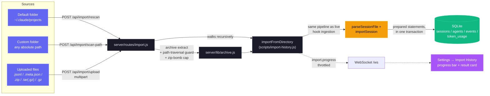
```mermaid
flowchart LR
    subgraph Sources
      A1["Default folder<br/>~/.claude/projects"]
      A2["Custom folder<br/>any absolute path"]
      A3["Uploaded files<br/>.jsonl / .meta.json /<br/>.zip / .tar(.gz) / .gz"]
    end

    A1 -->|POST /api/import/rescan| R["server/routes/import.js"]
    A2 -->|POST /api/import/scan-path| R
    A3 -->|POST /api/import/upload<br/>multipart| R

    R -->|archive extract<br/>+ path-traversal guard<br/>+ zip-bomb cap| X["server/lib/archive.js"]
    R -->|walks recursively| I["importFromDirectory<br/>(scripts/import-history.js)"]
    X --> I
    I -->|same pipeline as live<br/>hook ingestion| P["parseSessionFile +<br/>importSession"]
    P -->|prepared statements,<br/>in one transaction| D[("SQLite<br/>sessions / agents / events /<br/>token_usage")]
    I -.->|import.progress<br/>throttled| W["WebSocket /ws"]
    W -.-> U["Settings → Import History<br/>progress bar + result card"]

    style A1 fill:#6366f1,stroke:#818cf8,color:#fff
    style A2 fill:#6366f1,stroke:#818cf8,color:#fff
    style A3 fill:#6366f1,stroke:#818cf8,color:#fff
    style R fill:#1a1a28,stroke:#2a2a3d,color:#e4e4ed
    style X fill:#1a1a28,stroke:#2a2a3d,color:#e4e4ed
    style I fill:#1a1a28,stroke:#2a2a3d,color:#e4e4ed
    style P fill:#f59e0b,stroke:#fbbf24,color:#000
    style D fill:#10b981,stroke:#34d399,color:#fff
    style U fill:#a855f7,stroke:#c084fc,color:#fff
```

**라우트**

| 메서드 | 경로                    | 설명                                                                     |
| ------ | ----------------------- | ------------------------------------------------------------------------ |
| `GET`  | `/api/import/guide`     | OS에 맞춘 경로, 아카이브 명령, 지원 확장자, 단계별 안내                  |
| `POST` | `/api/import/rescan`    | 기본 `~/.claude/projects` 디렉터리 재스캔                                |
| `POST` | `/api/import/scan-path` | 절대 경로 디렉터리 스캔(본문 `{ path }`); 재귀적으로 순회                |
| `POST` | `/api/import/upload`    | `.jsonl`, `.meta.json`, `.zip`, `.tar(.gz)`, `.gz`의 멀티파트 업로드     |

**지원되는 입력.** 개별 JSONL(`.jsonl`) 세션 트랜스크립트, 이에
동반되는 `.meta.json` 사이드카 파일, 그리고 어떤 중첩 디렉터리
구조든 담을 수 있는 아카이브(`.zip`, `.tar`, `.tar.gz`/`.tgz`, 일반
`.gz`)를 지원합니다. 두 가지 표준 Claude Code 레이아웃이 모두 자동으로 인식됩니다:
`<project>/<sessionId>/subagents/agent-*.jsonl`(기본) 및
`<project>/subagents/<sessionId>/agent-*.jsonl`(대안).

**정확성 보장.** 세션은 UUID로 중복 제거되며, 가져오기를 다시
실행해도 항상 안전합니다. 컴팩션 `baseline_input` /
`baseline_output` / `baseline_cache_read` / `baseline_cache_write`
컬럼은 트랜스크립트가 컴팩션되기 이전의 토큰 수를 보존하므로,
컴팩션 이후의 JSONL을 다시 수집해도 과거 비용이 지워지지 않습니다.
이벤트 수준의 중복 제거는 이벤트 유형별 최고 수위 지점(해당 세션의
`MAX(created_at) GROUP BY event_type`)을 사용합니다. 매번 다시
가져올 때 `ts > cutoff[type]`인 JSONL 항목만 삽입되므로, 여러 날에
걸쳐 트랜스크립트가 계속 커지는 장기 실행 세션도 이전 작업을
중복하지 않고 Stop / PostToolUse / TurnDuration / ToolError
이벤트를 계속 수신합니다. `sessions.ended_at`은 JSONL의 마지막 활동
시각이 저장된 값을 넘어서면 앞으로 갱신되며, 메시지 수 메타데이터는
매 실행마다 새로 고쳐집니다.

**대용량 트랜스크립트 안전성.** 공유 트랜스크립트 캐시
(`server/lib/transcript-cache.js`)는 JSONL 파일을 4 MiB 청크로 읽고
한 번에 한 줄만 디코딩하므로, V8의 최대 JS 문자열 길이(64비트
Node 20에서 약 512 MiB)보다 큰 트랜스크립트도 `FATAL ERROR:
v8::ToLocalChecked Empty MaybeLocal`로 프로세스가 중단되는 일 없이
파싱됩니다. 동일한 청크 방식 경로가 Hook 수집, 주기적 컴팩션 스윕,
히스토리 가져오기에 사용됩니다 — 이들 중 어느 것도 전체 파일을
단일 JS 문자열로 메모리에 올리지 않습니다. 항목별 가변 배열
(`turnDurations`, `errors`, `compaction.entries`, `usageExtras.*`)은
`TRANSCRIPT_CACHE_MAX_ARRAY_LEN`(기본 `1000`)에서 꼬리 부분이
잘리며, 파싱 중에는 `2 × cap` 수위에서 트리밍이 적용되어 여러 날에
걸친 세션의 전체 파일 재파싱이 마무리 전에 무제한의 임시 데이터를
쌓을 수 없습니다.

**안전성.** 아카이브 추출은 모든 항목에 대해 경로 순회(path
traversal)를 검증합니다(절대 경로와 `..` 세그먼트는 거부됨). 설정
가능한 추출 상한(`CCAM_IMPORT_MAX_EXTRACT_BYTES`, 기본 4 GB)이
zip/tar/gzip 폭탄을 차단합니다. 업로드 크기는 파일당
(`CCAM_IMPORT_MAX_BYTES`, 기본 1 GB) 및 요청당
(`CCAM_IMPORT_MAX_FILES`, 기본 2000)으로 제한됩니다. 모든 스테이징
디렉터리는 요청별로 생성되고 `finally`에서 회수되며, multer가 모든
파일을 사전에 거부하는 경우에도 마찬가지입니다.

**진행 상황.** 가져오기 활동은 기존 WebSocket을 통해
`import.progress` 메시지(`phase`: `start` / `scan` / `extract` /
`parse` / `complete` / `error`)로 브로드캐스트되며, 대규모 가져오기
시 채널이 넘치지 않도록 스로틀링됩니다.

**UI.** **설정 → 히스토리 가져오기** 패널을 사용하면 단계별 안내,
실시간 진행 상황, 그리고 가져옴 / 보강됨 / 건너뜀 / 오류 수를
보여주는 가져오기 후 요약과 함께 안내형 드래그 앤 드롭 경험을
이용할 수 있습니다.

<p align="center">
  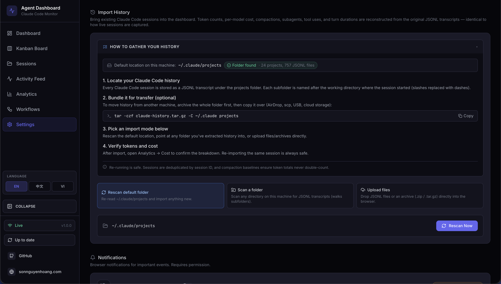
</p>

### WebSocket

`ws://localhost:4820/ws`에 연결하면 실시간 푸시 메시지를 받을 수 있습니다:

```json
{
  "type": "agent_updated",
  "data": { "id": "...", "status": "working", "current_tool": "Edit" },
  "timestamp": "2026-03-05T15:43:01.800Z"
}
```

**메시지 유형:** `session_created`, `session_updated`, `agent_created`, `agent_updated`, `new_event`, `alert_triggered`, `alert_updated`

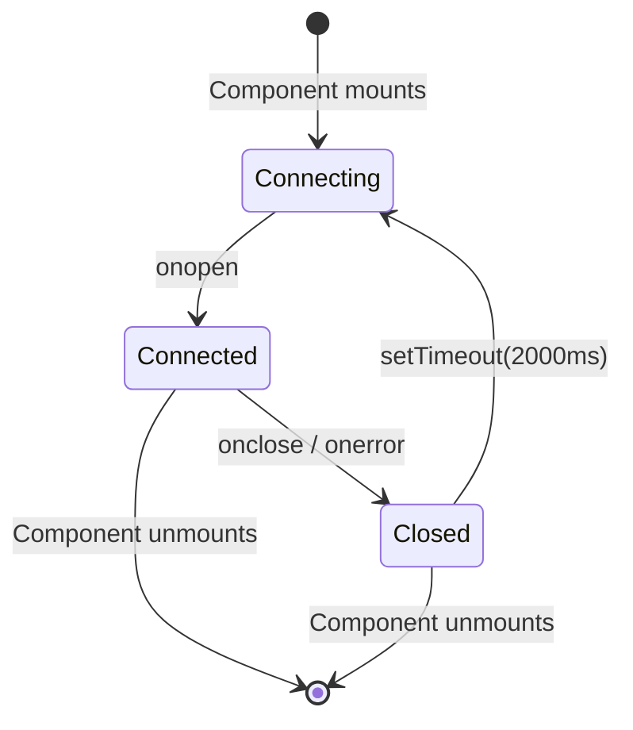
```mermaid
stateDiagram-v2
    [*] --> Connecting: Component mounts
    Connecting --> Connected: onopen
    Connected --> Closed: onclose / onerror
    Closed --> Connecting: setTimeout(2000ms)
    Connected --> [*]: Component unmounts
    Closed --> [*]: Component unmounts
```

---

## Hook 이벤트

대시보드는 다음 Claude Code Hook 유형을 처리합니다:

| Hook 유형           | 트리거                         | 대시보드 동작                                                                                 |
| ------------------- | ------------------------------ | -------------------------------------------------------------------------------------------- |
| `SessionStart`      | Claude Code 세션 시작          | 세션과 메인 에이전트를 생성합니다. `awaiting_input_since`를(`awaiting_reason=session_start`와 함께) 기록하여 새 세션이 **Waiting** 상태로 시작되게 합니다. 재개된 세션을 다시 활성화합니다. `DASHBOARD_STALE_MINUTES`(기본 180) 동안 활동이 없는 고아 세션은 중단 처리합니다 |
| `UserPromptSubmit`  | 사용자가 프롬프트에서 Enter를 누름 | 대기 플래그를 지우고 메인 에이전트를 `working`으로 승격합니다 — 텍스트 전용 어시스턴트 턴은 `PreToolUse`를 발생시키지 않으므로, 이것이 해당 턴이 시작되었음을 알리는 유일한 신호입니다 |
| `PreToolUse`        | 에이전트가 도구 사용을 시작함  | 대기 플래그를 지우고, 에이전트를 `working`으로 설정하며, `current_tool`을 설정합니다. 도구가 `Agent`인 경우 서브에이전트 레코드를 생성합니다 |
| `PostToolUse`       | 도구 실행 완료                 | 대기 플래그를 지웁니다(도구 실행 도중 Notification이 플래그를 기록한 권한 프롬프트 승인 상황을 처리). `current_tool`을 지웁니다. 에이전트는 `working` 상태를 유지합니다 |
| `Stop`              | Claude가 응답을 마침           | 오류가 아닌 경우: 메인 에이전트 → `waiting` — Claude가 자기 턴을 마쳤고, 이제 공은 사용자에게 넘어갔습니다. `stop_reason=error`인 경우: 에이전트와 세션을 `error`로 표시합니다. 백그라운드 서브에이전트는 계속 실행됩니다 |
| `SubagentStop`      | 백그라운드 에이전트 완료       | 설명, 유형 또는 작업으로 서브에이전트를 매칭하여 완료 처리합니다. 대기 플래그는 의도적으로 지우지 않습니다 — 서브에이전트가 끝났다는 사실은 사용자에 대해 아무것도 알려주지 않기 때문입니다. **실행 후 잊는(fire-and-forget) JSONL 스캔을 트리거합니다**(`scanAndImportSubagents`). 이 스캔은 서브에이전트 자신의 `agent_id` 아래에 도구별 `PreToolUse` + `PostToolUse` 이벤트를 발생시켜, 타임라인이 생성 마커만이 아니라 서브에이전트가 실행한 모든 도구를 표시하게 합니다 |
| `Notification`      | 에이전트 알림                  | 이벤트를 기록합니다. 권한/입력 프롬프트 메시지는 에이전트를 `waiting`으로 설정하고 `awaiting_input_since`를 기록합니다(`awaiting_reason=notification`과 함께, 패턴으로 매칭: `permission`, `waiting for input`, `needs your approval`, …). 컴팩션 알림은 `Compaction` 이벤트로 태그됩니다. 활성화된 경우 브라우저 알림을 트리거합니다 |
| `SessionEnd`        | Claude Code CLI 프로세스 종료  | 대기 플래그를 제거합니다. 세션이 이미 `error` 상태이면 오류 상태가 보존되고, 그렇지 않으면 모든 에이전트와 세션을 `completed`로 표시합니다 |
| `Compaction`   | JSONL에서 `/compact` 감지됨    | 컴팩션 서브에이전트(유형 `compaction`)와 Compaction 이벤트를 생성합니다. 트랜스크립트 JSONL의 `isCompactSummary` 항목을 통해 감지됩니다. 활성 세션에 대해서는 주기적 스캐너로도 감지됩니다 |
| `APIError`     | JSONL 트랜스크립트의 API 오류  | `isApiErrorMessage` 항목(할당량, 속도 제한, invalid_request)과 원시 `type: "error"` 응답에서 추출됩니다. **이제 세션과 에이전트를 즉시 `error`로 표시합니다** — 이전에는 상태 변경 없이 이벤트로만 기록되었습니다. 오류 세부 정보와 함께 이벤트로 저장됩니다 |
| `TurnDuration` | JSONL 트랜스크립트의 턴 타이밍 | `durationMs`를 포함한 `system` 하위 유형 `turn_duration` 메시지에서 추출됩니다. 턴 수준 타이밍 분석을 위해 이벤트로 저장됩니다 |
| `ToolError`    | JSONL의 도구 결과 오류         | `toolUseResult.is_error` 항목에서 추출됩니다. 오류 전파 분석을 위해 도구 수준의 실패를 추적합니다 |
| `Interrupted`  | 사용자가 턴을 취소함(Esc)      | 워치독이 합성합니다 — `Esc`는 어떤 Hook도 발생시키지 않으므로, `working` 상태로 멈춘 세션은 트랜스크립트의 `[Request interrupted by user]` 마커로 감지되거나, 출력이 나오기 전에 Esc가 눌린 경우에는 유휴 working 타임아웃(`DASHBOARD_WORKING_IDLE_SECONDS`)으로 감지됩니다. 세션은 **Waiting**으로 이동합니다(일반 `Stop`과 동일) |

---

## 브라우저 알림

대시보드는 Web Push(VAPID)를 통한 지속적인 브라우저 알림을 지원하여, 대시보드 탭이 포커스되어 있지 않거나 브라우저가 백그라운드에 있어도 실시간 경고를 받을 수 있습니다.

### 작동 방식

1. 설정 페이지에서 마스터 토글로 알림을 **활성화**합니다
2. 프롬프트가 표시되면 브라우저 권한을 **허용**합니다 — 이 과정에서 Service Worker가 등록되고 푸시 구독이 생성됩니다
3. 어떤 이벤트가 알림을 트리거할지 **구성**합니다:

| 이벤트                       | 기본값  | 설명                                                            |
| ---------------------------- | ------- | --------------------------------------------------------------- |
| 새 세션 시작                 | 켜짐    | 새 Claude Code 세션이 생성될 때 발생합니다                      |
| Claude 응답 완료             | 꺼짐    | Claude가 응답 턴을 마칠 때 `Stop` 이벤트에서 발생합니다         |
| 세션 종료                    | 꺼짐    | CLI 프로세스가 종료될 때 `SessionEnd`에서 발생합니다            |
| 세션 오류                    | 켜짐    | 세션이 오류로 종료될 때 발생합니다                              |
| 서브에이전트 생성            | 꺼짐    | 백그라운드 서브에이전트가 생성될 때 발생합니다                  |

추가로, Claude Code의 모든 `Notification` Hook 이벤트는 이벤트별 토글과 관계없이(마스터 토글이 활성화되어 있는 한) 브라우저 알림을 트리거합니다.

### 알림 아키텍처

- **VAPID 파이프라인:** 안전한 메시지 전달을 위해 서버에서 `web-push`를 사용합니다. VAPID 키는 자동 생성되어 `data/vapid-keys.json`에 저장됩니다.
- **Service Worker:** 전용 워커(`client/public/sw.js`)가 수신되는 `push` 이벤트를 처리하고, macOS에서 오디오 재생을 보장하기 위해 `silent: false`로 알림을 표시합니다.
- **구독:** 브라우저별 엔드포인트는 SQLite의 `push_subscriptions` 테이블에 저장됩니다.
- **지속성:** Service Worker가 백그라운드에서 동작하므로 브라우저가 닫혀 있어도 알림이 도착합니다.
- **테스트 알림:** 설정의 버튼으로 VAPID 파이프라인과 오디오 재생을 확인할 수 있습니다.

### PWA 및 오프라인 지원

이 프로젝트는 **대시보드**, **랜딩 페이지**, **위키**용으로 각각 하나씩, 세 개의 독립적인 Progressive Web App을 제공합니다. 각각 자체 `manifest.json`과 Service Worker를 가지므로 브라우저는 이들을 별도의 설치 가능한 애플리케이션으로 취급합니다.

| 표면 | Manifest | Service Worker | 캐싱 전략 |
| --- | --- | --- | --- |
| 대시보드 (`client/`) | `client/public/manifest.json` | `client/public/sw.js` | `/assets/*` 아래의 Vite 콘텐츠 해시 번들은 캐시 우선(cache-first)으로 제공됩니다(URL은 빌드마다 불변). 그 외 모든 것 — 내비게이션, SW 자체, `manifest.json`, 아이콘, 루트 `/` — 은 캐시 폴백을 갖춘 네트워크 우선(network-first)이므로, 재빌드하면 강력 새로고침 없이 항상 최신 UI가 표시됩니다. API(`/api/*`), WebSocket(`/ws`), Vite HMR 요청은 절대 캐시되지 않습니다. 푸시 알림 핸들러는 캐싱 로직과 함께 유지됩니다. Express 정적 미들웨어(`server/index.js`)는 `/assets/*`에 대해 `Cache-Control: public, max-age=31536000, immutable`을, `index.html`, `sw.js`, `manifest.json`에 대해 `Cache-Control: no-cache, must-revalidate`를 전송하여 이를 강화합니다. `client/src/main.tsx`는 `controllerchange`를 수신합니다: 이미 제어 중인 페이지에서 새 SW가 활성화되면 정확히 한 번만 다시 로드합니다(최초 설치 시에는 다시 로드하지 않음). |
| 랜딩 페이지 (루트) | `manifest.json` | `sw.js` | HTML 셸, 파비콘, OG 이미지를 사전 캐시합니다. 스크린샷 PNG는 무거운 초기 사전 캐시를 피하기 위해 첫 조회 시 지연 캐시(캐시 우선)됩니다. 내비게이션은 오프라인 폴백을 갖춘 네트워크 우선입니다. |
| 위키 (`wiki/`) | `wiki/manifest.json` | `wiki/sw.js` | `index.html`, `style.css`, `script.js`, manifest, 파비콘을 사전 캐시합니다. 한 번 방문한 후에는 완전한 오프라인 사용이 가능합니다. HTML은 네트워크 우선, CSS/JS는 캐시 우선입니다. |

**캐시 라이프사이클:** 세 SW 모두 설치 시 `skipWaiting()`을 호출하고 활성화 시 오래된 캐시를 삭제합니다(`dashboard-v2`, `landing-v1`, `wiki-v1`과 같은 버전 문자열로 키가 지정됨). 버전 상수를 올리면 강제로 깨끗하게 새로고침됩니다.

**iOS 지원:** 세 HTML 파일 모두 Safari의 독립 실행형 홈 화면 모드를 위해 `<meta name="apple-mobile-web-app-capable" content="yes">`와 `<meta name="apple-mobile-web-app-status-bar-style" content="black-translucent">`를 포함합니다.

**아이콘:** Manifest는 `sizes="any"`와 `type="image/svg+xml"`로 `favicon.svg`를 참조합니다 — Chrome 107+, Firefox 110+, Edge 107+에서 지원됩니다. Apple 터치 아이콘도 SVG 파비콘을 사용합니다.

---

## 업데이트 알리미

대시보드는 자체 git 체크아웃을 감시하고, 정식(canonical) 기본 브랜치에 HEAD보다 앞선 커밋이 있을 때마다 모달을 표시합니다. **브랜치 및 포크 인식:** `upstream` 원격(포크의 표준 관례)이 있으면 `origin`보다 우선하며, 선택된 원격의 `master`/`main`/`HEAD`가 비교 기준 ref가 됩니다. `manual_command`는 상황에 맞게 조정됩니다 — 브랜치가 실제로 정식 ref를 추적할 때만 `git pull --ff-only`이고, 그 외에는 `git fetch`(포크의 경우 fast-forward 병합 포함)이므로 명령이 결코 거짓을 말하지 않습니다. 사용자는 터미널에서 실행할 정확한 명령을 받습니다 — 서버는 **절대** 스스로 pull하거나 재시작하지 않으므로, 이 메커니즘은 개발 세션, pm2/systemd/launchd/Docker 감독, 원격 배포 전반에서 이식성을 유지합니다.

<p align="center">
  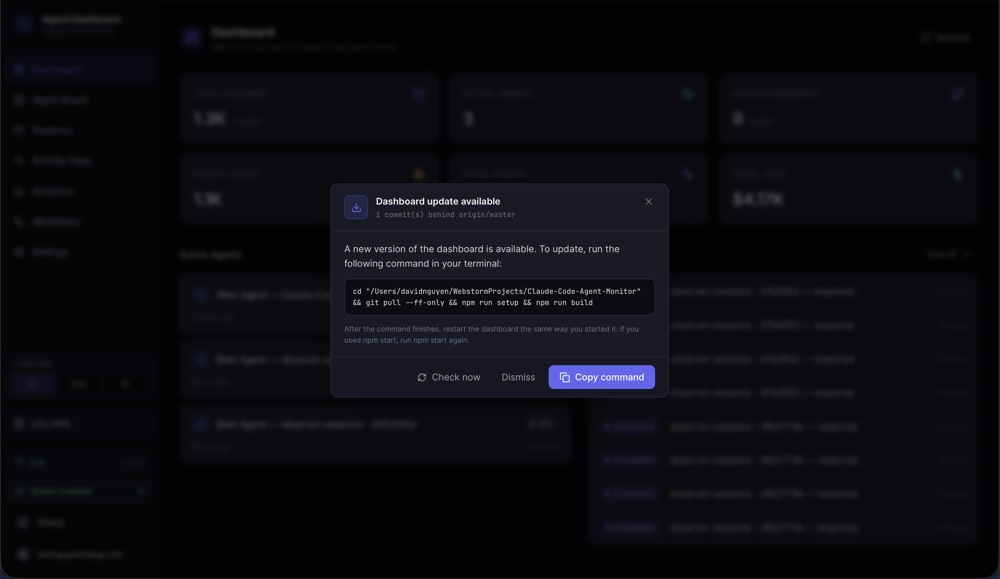
</p>

### 작동 방식

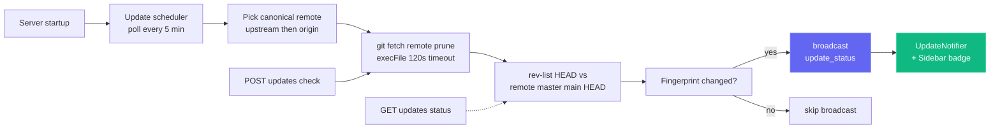
```mermaid
flowchart LR
    S["Server startup"] --> SCHED["Update scheduler<br/>poll every 5 min"]
    SCHED --> PICK["Pick canonical remote<br/>upstream then origin"]
    PICK --> FETCH["git fetch remote prune<br/>execFile 120s timeout"]
    FETCH --> CMP["rev-list HEAD vs<br/>remote master main HEAD"]
    CMP --> FP["Fingerprint changed?"]
    FP -->|yes| WS["broadcast<br/>update_status"]
    FP -->|no| IDLE["skip broadcast"]
    WS --> CLIENT["UpdateNotifier<br/>+ Sidebar badge"]

    CHECK["POST updates check"] --> FETCH
    STATUS["GET updates status"] -.-> CMP

    style WS fill:#6366f1,stroke:#818cf8,color:#fff
    style CLIENT fill:#10b981,stroke:#34d399,color:#fff
```

단일 검사는 비용이 저렴하고(정식 원격 — 구성된 경우 `upstream`, 그렇지 않으면 `origin` — 에 대한 `git fetch <remote> --prune`), `execFile`(셸 없음)과 120초 타임아웃으로 감싸져 있습니다. 실패 — 오프라인 네트워크, git이 아닌 설치, 원격 미구성, 해석할 수 없는 upstream ref — 는 모두 예외를 던지는 대신 **소프트 페이로드**(예: `fetch_error: "..."`)를 반환하므로, 불안정한 원격이 대시보드를 차단하는 일은 없습니다.

### UI 표면

| 표면 | 동작 |
| --- | --- |
| **모달** (`client/src/components/UpdateNotifier.tsx`) | `update_available === true`이고 사용자가 해당 `remote_sha`를 아직 닫지 않았을 때 나타납니다. 뒤처진 커밋 수, 추적 중인 ref, 선택적 `situation_note`(기능 브랜치/포크에 있을 때 명령이 왜 다른지 설명), 복사해 붙여넣을 수 있는 명령, 그리고 세 개의 버튼 — **명령 복사**(기본), **지금 확인**, **닫기** — 을 표시합니다. ESC와 배경 클릭으로 닫힙니다. `localStorage`에 `remote_sha`로 키가 지정되므로, 더 새로운 upstream 커밋이 생기면 모달이 자동으로 다시 열립니다. |
| **사이드바 버튼** (`client/src/components/Sidebar.tsx`) | 푸터에 항상 표시되는 "업데이트 확인" 버튼입니다. 뒤처져 있으면 에메랄드 테두리 + 녹색 배지 점이, 마지막 검사에서 fetch 오류가 발생했으면 호박색이 표시됩니다. 클릭하면 이전의 닫기 상태를 지운 뒤 `POST /api/updates/check`를 실행합니다. |
| **서버 터미널** | 스케줄러가 "최신 상태"에서 "뒤처짐"으로 전환되면, 헤드리스로 실행 중인 사용자도 볼 수 있도록 명령이 포함된 프레임 블록을 stdout에 출력합니다. |

### API 표면

| 엔드포인트 | 목적 |
| --- | --- |
| `GET /api/updates/status` | 읽기 전용 검사: 정식 원격에 대해 `git fetch`를 실행하고, HEAD를 해당 기본 브랜치와 비교한 뒤 페이로드를 반환합니다. |
| `POST /api/updates/check` | 동일한 검사이지만, 연결된 모든 클라이언트가 한 번에 업데이트되도록 WebSocket으로 `update_status`도 브로드캐스트합니다. |

두 엔드포인트 모두 동일한 페이로드 형태를 반환합니다:

```json
{
  "git_repo": true,
  "update_available": true,
  "repo_root": "/Users/you/Claude-Code-Agent-Monitor",
  "remote_ref": "upstream/master",
  "canonical_remote": "upstream",
  "current_branch": "master",
  "tracking_upstream": "origin/master",
  "tracks_canonical": false,
  "situation": "fork_or_diverged_tracking",
  "local_sha": "abc1234...",
  "remote_sha": "def5678...",
  "commits_behind": 3,
  "manual_command": "cd \"/...\" && git fetch upstream && git merge --ff-only upstream/master && npm run setup",
  "situation_note": "You're on 'master' tracking 'origin/master'. This command fast-forwards your branch from upstream/master (the canonical default).",
  "message": "3 commit(s) on upstream/master not in your checkout."
}
```

`situation`은 `tracking_canonical`(기본 브랜치의 일반적인 클론 — `git pull --ff-only`가 동작), `fork_or_diverged_tracking`(로컬 브랜치 이름은 정식 브랜치와 일치하지만 다른 원격을 추적 — `git fetch <remote> && git merge --ff-only <ref>`), `feature_branch`(기본 브랜치를 벗어남 — fetch만 수행하고 통합은 사용자에게 맡김), `detached_head` 중 하나입니다.

### 의도적으로 포함하지 **않은** 것

설계상 `POST /api/updates/apply`도 자체 재시작 헬퍼도 없습니다. 프로세스가 내부에서 스스로를 업데이트하는 것은 외부 감독자 없이는 신뢰할 수 없습니다 — `npm run dev`(concurrently), `npm start`, `pm2`, `systemd`, `launchd`, Docker는 각각 다른 재시작 로직이 필요하고, 종료되어 가는 서버에서 `git pull` / `npm install`이 실패하면 깨끗한 롤백 경로가 없습니다. 감지 전용 방식은 모든 감독자, 모든 OS, 모든 브랜치 상태에서 동작을 예측 가능하게 유지하면서도 "언제 pull해야 하지?"라는 정보 격차를 해소합니다. 실제 업데이트는 사용자가 자신의 셸에서 직접 수행합니다.

### 구성

| 환경 변수 | 기본값 | 비고 |
| --- | --- | --- |
| `DASHBOARD_UPDATE_CHECK` | 활성화됨 | `0` / `false` / `off`로 설정하면 스케줄러를 완전히 비활성화합니다. |
| `DASHBOARD_UPDATE_CHECK_INTERVAL_MS` | `300000`(5분) | 자동 검사 사이의 간격입니다. 하한은 60 000 ms이며, 그보다 낮은 값은 하한으로 고정됩니다. |

---

## Tabby — 떠다니는 고양이 동반자

**Tabby**는 대시보드의 모든 페이지 오른쪽 하단 모서리에 고정된 귀여운 떠다니는 고양이 동반자입니다. 항상 함께하면서 라이브 세션 스트림을 한눈에 파악할 수 있는 반응형 마스코트로 바꿔 주며, 대화도 나눌 수 있습니다.

<p align="center">
  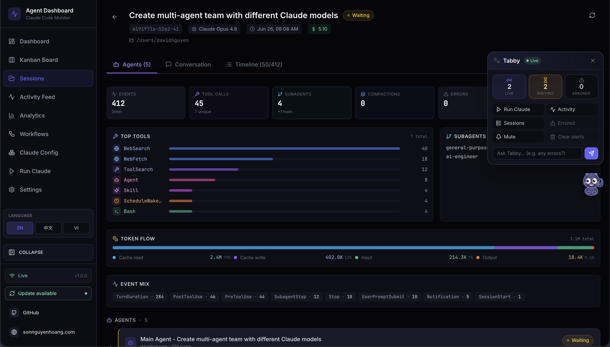
</p>

### 반응형 마스코트

Tabby는 커서를 추적하는 SVG 고양이로, 라이브 세션 스트림에서 파생된 **여덟 가지 기분**을 가지며 각각 고유한 애니메이션이 있습니다:

| 기분 | 시점 | 애니메이션 |
| --- | --- | --- |
| `idle` | 특별한 일이 없을 때 | 쉬면서 꼬리 흔들기 |
| `watching` | 세션이 활성 상태일 때 | 귀 쫑긋, 눈이 커서를 따라감 |
| `happy` | 세션이나 실행이 깔끔하게 끝났을 때 | 고개 끄덕임 + 반짝임 |
| `worried` | 뭔가 이상해 보일 때 | 미세한 떨림 |
| `stuck` | 세션이 막힌 것으로 보일 때 | 경고 "!" |
| `thinking` | 에이전트가 작업 중일 때 | 느린 고개 끄덕임 |
| `sleeping` | 한동안 조용할 때 | `zzz` |
| `disconnected` | WebSocket이 끊겼을 때 | 차분하고 정지된 자세 |

### 말풍선

Tabby는 주목할 만한 이벤트(세션 시작/완료, 오류, 실행 완료)에 대해 짧은 한마디를 자동으로 표시합니다. 말풍선은 **스로틀링 및 병합**되어 이벤트가 한꺼번에 몰려도 화면을 도배하지 않으며, 스크린 리더를 위해 `aria-live`를 사용하고, 패널에서 **음소거**할 수 있습니다.

### 패널

고양이를 클릭하거나 **⌘B / Ctrl+B**를 눌러 패널을 엽니다(Esc로 닫기). 패널에는 다음이 표시됩니다:

- 라이브 **상태 표시줄** — `N live · M errored · connection state`.
- **빠른 작업** — Run Claude, 활동, 세션 또는 오류가 발생한 세션으로 이동, 말풍선 음소거, 경고 지우기.
- **Ask** 박스(아래 참조).

### Ask 박스 → Run Claude 핸드오프

**Ask** 박스는 캐시된 데이터를 바탕으로 간단한 상태 질문 — 예를 들어 "what's running", "any errors", "status" — 에 로컬에서 답합니다. 그 외의 질문은 기존 **Run Claude** 페이지로 전달되어(`/run?prompt=…`로 딥링크) 실제 Claude Code 세션을 생성합니다. Tabby는 자체적으로 LLM을 호출하지 않으며, 빠른 상태 조회를 넘어서는 모든 것에 대해 Run Claude 페이지를 재사용할 뿐입니다.

### 접근성 및 안전한 성능 저하

Tabby는 키보드로 조작할 수 있고, 말풍선에 `aria-live`를 사용하며, `prefers-reduced-motion`을 존중합니다. WebSocket이 끊기면 오류를 내는 대신 차분한 `disconnected` 상태로 안전하게 전환됩니다. **설정**에서 Tabby를 켜거나 끌 수 있으며(영어, 중국어, 베트남어, 한국어로 현지화됨), 구현은 `client/src/components/Tabby/`에 있습니다.

---

## 연결 상태 모달

사이드바 푸터의 **Live** / **Disconnected** 알약(pill)을 클릭하면 대시보드의 WebSocket 전송에 관한 작은 세부 정보 패널이 열립니다. 활성 `ws://` 엔드포인트, 현재 소켓이 연결된 지 얼마나 되었는지, 수신된 총 이벤트 수, 가로 막대 차트로 표시되는 상위 이벤트 유형, 60초 처리량 스파크라인, 최근 활동 목록으로 표시되는 마지막 8개 이벤트를 보여줍니다. 누적 통계(총계, 유형별 분류, 최근 목록)는 `localStorage`의 `sidebar-connection-stats` 아래에 저장되어 다시 로드해도 유지되며, 롤링 스파크라인과 "connected since" 타이머는 의도적으로 일시적입니다. 푸터의 **초기화** 버튼으로 언제든 모든 것을 지울 수 있습니다.

<p align="center">
  
</p>

---

## VS Code 확장

**Claude Code Agent Monitor**는 일급 VS Code 확장으로도 제공되어, 에디터를 떠나지 않고 AI 에이전트를 모니터링할 수 있습니다.

<p align="center">
  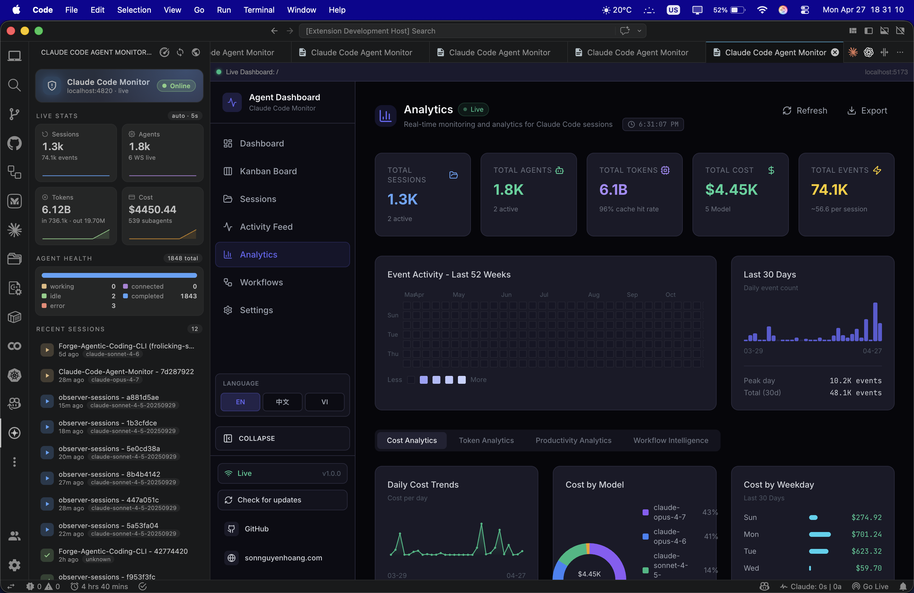
</p>

### 🚀 주요 기능
- **라이브 사이드바**: 실시간 에이전트 상태(작업 중, 대기 중, 완료됨 등)를 보여주는 전용 활동 표시줄(Activity Bar) 뷰.
- **사용량 분석**: 총 토큰, 실시간 USD 비용, 이벤트 수를 사이드바에서 바로 추적합니다.
- **상태 표시줄 통합**: 활성 세션과 에이전트를 보여주는 하단 바의 한눈에 보는 펄스 모니터.
- **딥 내비게이션**: 특정 대시보드 뷰(칸반, 분석, 설정) 또는 최근 세션에 원클릭으로 접근합니다.
- **통합 탭**: 전체 모니터링 대시보드를 네이티브 VS Code 웹뷰 탭으로 엽니다.

### 📦 설치 및 설정
1. [vscode-extension](./vscode-extension) 디렉터리를 엽니다.
2. Marketplace 확장을 설치하거나 `vsce package`로 직접 패키징합니다.
3. 로컬 대시보드 서버가 실행 중인지 확인합니다(`npm run dev`).
4. VS Code 활동 표시줄에서 **레이더 아이콘**을 클릭하여 시작합니다.

자세한 개발자 구성은 [.vscode](./.vscode) 및 [vscode-extension](./vscode-extension) 디렉터리를 참조하십시오.

> [!TIP]
> VS Code Marketplace의 확장: [Claude Code Agent Monitor](https://marketplace.visualstudio.com/items?itemName=hoangsonw.claude-code-agent-monitor)

---

## 데스크톱 앱 (macOS & Windows)

대시보드는 한 번 설치하면 잊어버려도 되는 선택적 **네이티브 데스크톱 애플리케이션**으로도 제공됩니다 — macOS `.app`(`.dmg`로 배포)과 Windows `.exe`(NSIS 설치 프로그램 및 설치가 필요 없는 포터블 빌드)입니다. `client/`, `server/`, `mcp/`, `vscode-extension/`과 나란히 있는 `desktop/` 워크스페이스에 위치하며, **Electron 35**로 빌드됩니다.

<p align="center">
  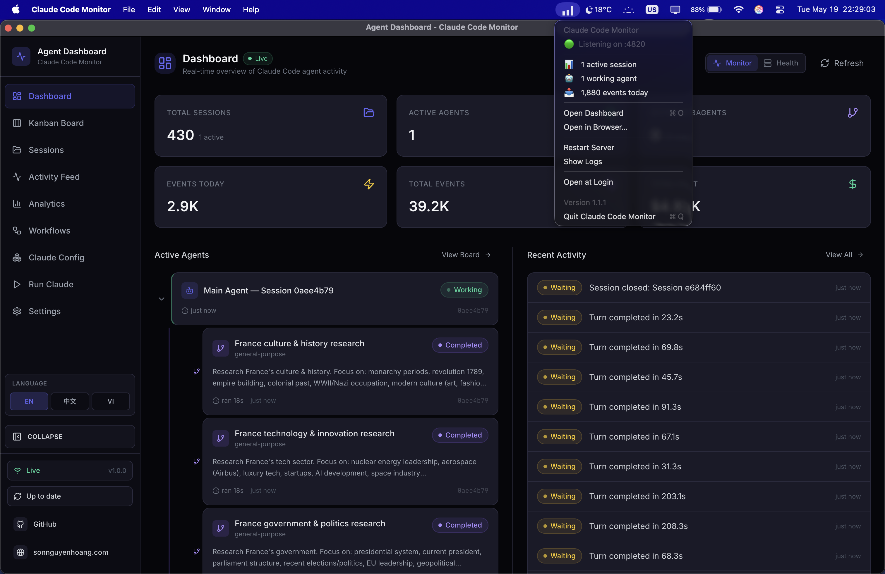
  <br>
  <em>🍎🪟 <strong>데스크톱 앱</strong> — 메뉴 바 / 알림 영역(트레이) 아이콘, 로그인 시 열기, 단일 인스턴스 잠금을 갖춘 네이티브 셸입니다. 동일한 대시보드를 실제 OS 창에서 보여줍니다(macOS 화면).</em>
</p>

<p align="center">
  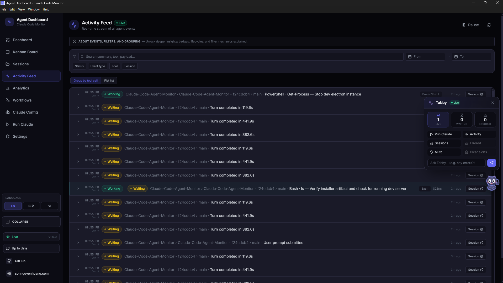
  <br>
  <em>🪟 네이티브 Windows 앱으로 실행되는 동일한 대시보드 — 알림 영역(트레이) 아이콘, 네이티브 창 메뉴, 로그인 시 열기.</em>
</p>

`localhost:4820`에서 브라우저로 보는 모든 것이 이 창 안에 담겨 있으며, 그 위에 네이티브 OS 생명주기가 더해집니다: 트레이 아이콘, 네이티브 애플리케이션 메뉴, 자동 시작 통합, 그리고 서버를 깔끔하게 종료하는 단일 종료 버튼입니다.

### 동작 방식

터미널에서 대시보드를 실행하는 것과 달리, 데스크톱 앱은 `npm start`도, 열려 있는 셸도, 서버의 두 번째 복사본도 필요 없습니다. Electron **메인 프로세스**가 Express 서버를 **인프로세스**로 호스팅하며 — 동일한 Node 런타임에서 `server/index.js`를 직접 `require()`하고, **자식 프로세스도 IPC도 없습니다** — Chromium `BrowserWindow`를 빌드된 React 클라이언트로 향하게 합니다.

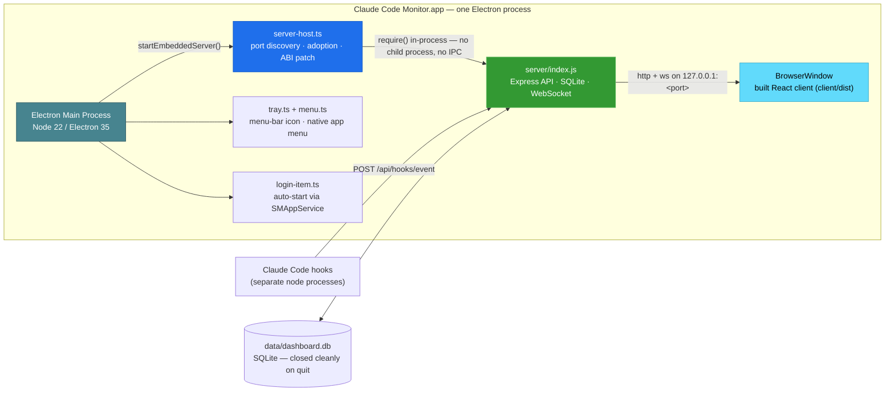
```mermaid
flowchart LR
    subgraph electron["Claude Code Monitor.app — one Electron process"]
        main["Electron Main Process<br/>Node 22 / Electron 35"]
        host["server-host.ts<br/>port discovery · adoption · ABI patch"]
        express["server/index.js<br/>Express API · SQLite · WebSocket"]
        win["BrowserWindow<br/>built React client (client/dist)"]
        tray["tray.ts + menu.ts<br/>menu-bar icon · native app menu"]
        login["login-item.ts<br/>auto-start via SMAppService"]
        main -->|"startEmbeddedServer()"| host
        host -->|"require() in-process — no child process, no IPC"| express
        main --> tray
        main --> login
        express -->|"http + ws on 127.0.0.1:&lt;port&gt;"| win
    end

    hooks["Claude Code hooks<br/>(separate node processes)"] -->|"POST /api/hooks/event"| express
    sqlite[("data/dashboard.db<br/>SQLite — closed cleanly on quit")] <--> express

    style main fill:#47848F,stroke:#2f5a62,color:#fff
    style express fill:#339933,stroke:#5cb85c,color:#fff
    style win fill:#61DAFB,stroke:#3aa9c9,color:#000
    style host fill:#1f6feb,stroke:#1158c7,color:#fff
```

실행 시 앱은 다음을 수행합니다:

1. 사용 가능한 포트를 선택합니다 — **4820**을 우선으로 하고, **4821–4829**로 폴백하며, 모두 사용 중이면 임의의 높은 포트를 사용합니다.
2. 정상 동작 중인 대시보드 서버가 이미 `4820`에서 `/api/health`에 응답하면(예: 터미널에서 `npm start`를 실행한 경우), 이중 바인딩 대신 **해당 서버를 채택합니다** — 포트 충돌도, SQLite 경합도 없습니다. 채택된 서버는 앱을 종료한 후에도 계속 실행됩니다.
3. 그렇지 않으면 내장 서버를 부팅하고, **최초의 소유 서버 부팅** 시 Claude Code Hook을 자동 설치하고 백그라운드 서비스(업데이트 스케줄러, `cc-watcher`, 고아 실행 조정)를 시작합니다. 따라서 DMG만 사용하는 사용자도 **수동 설정 없이** 이벤트가 흐르기 시작합니다 — 체크아웃도, `npm run install-hooks`도 필요 없습니다.
4. **(macOS)** **Run Claude** 기능이 `claude` CLI를 찾아 실행할 수 있도록 **로그인 셸 `PATH`**를 복구합니다 — Finder/Dock에서 실행된 앱은 그렇지 않으면 launchd의 최소한의 `PATH`만 상속받아 `~/.local/bin`, `/opt/homebrew/bin`, 버전 관리자 bin 등에 있는 CLI를 찾지 못합니다. (Windows에서는 프로세스가 이미 사용자 `PATH`를 상속받습니다.)
5. 대시보드 창을 엽니다 — 단, 앱이 로그인 시 실행된 경우(macOS에서는 로그인 항목을 통해, Windows에서는 태그된 `HKCU\…\Run` 항목을 통해)에는 트레이 전용으로 유지됩니다.
6. 종료 시 내장 서버를 정상적으로 종료하고 **SQLite를 깔끔하게 닫습니다**(WAL 체크포인트).

### 기능

- **트레이 아이콘** — 항상 켜져 있는 상태 표시 영역입니다(macOS 메뉴 바 / Windows 알림 영역). 왼쪽 클릭은 대시보드 창을 토글하고, 오른쪽 클릭은 **Open Dashboard**, **Open in Browser**, **Restart Server**, **Show Logs**, **Open at Login**(토글), **Quit**이 있는 컨텍스트 메뉴를 엽니다. macOS는 틴트가 적용된 템플릿 글리프를 사용하고, Windows는 컬러 `icon.ico`를 사용합니다(검은색 템플릿은 어두운 작업 표시줄에서 보이지 않게 됩니다).
- **창 및 작업 표시줄 아이콘** — `BrowserWindow`가 컬러 앱 로고(Windows에서는 `icon.ico`, 그 외에는 `icon.png`)에 연결되어 있어 제목 표시줄 / 작업 표시줄에 실제 Claude Code Monitor 아이콘이 표시됩니다 — 패키징되지 않은 `npm run desktop:dev` 실행에서도 더 이상 일반 Electron 아이콘이 표시되지 않습니다.
- **네이티브 애플리케이션 메뉴** — `⌘` / `Ctrl` 단축키가 있는 표준 `About` / `File` / `Edit` / `View` / `Window` / `Help` 메뉴입니다. **File → Open Dashboard** 항목(`⌘1`)은 **macOS 전용**입니다: macOS는 창이 숨겨진 후에도 전역 메뉴 바를 유지하므로 창을 다시 열 수 있습니다 — Windows/Linux에서는 메뉴가 창에 붙어 있어 창이 숨겨진 동안에는 동작할 수 없으므로, 대신 트레이의 **Open Dashboard**로 다시 여십시오(최소화되어 있거나 다른 창 뒤에 있어도 창을 안정적으로 앞으로 가져옵니다).
- **로그인 시 자동 시작** — 트레이 또는 앱 메뉴에서 **Open at Login**을 토글합니다. macOS에서는 최신 `SMAppService` API를 통해 등록되므로 항목이 **시스템 설정 → 일반 → 로그인 항목**에 나타나고, Windows에서는 사용자별 `HKCU\Software\Microsoft\Windows\CurrentVersion\Run` 항목을 기록하며 **작업 관리자 → 시작 프로그램**에서 확인할 수 있습니다.
- **창 닫기는 숨김일 뿐, 서버는 계속 실행됩니다** — 창을 닫으면 숨겨질 뿐이며, 서버와 트레이는 계속 유지됩니다. 트레이를 클릭하면 창이 다시 나타납니다.
- **단일 인스턴스 잠금** — 앱을 중복 실행하면 기존 창에 포커스만 이동합니다. 두 번째 서버도, 포트 충돌도 없습니다. (모든 플랫폼에 적용됩니다.)
- **데이터는 재설치와 업데이트에도 유지됩니다** — SQLite 데이터베이스와 VAPID 키는 **앱 번들 / 설치 디렉터리 외부**의 사용자별 앱 데이터 디렉터리에 저장됩니다 — macOS에서는 `~/Library/Application Support/Claude Code Monitor/data/`, Windows에서는 `%APPDATA%\Claude Code Monitor\data\`입니다. 패키징된 번들은 읽기 전용이므로 그 안에 데이터베이스를 기록하면 History Import와 이벤트 영속성이 깨집니다. 앱 데이터에 보관하면 이 문제가 해결되며, 앱을 교체하거나 업그레이드해도 가져온 히스토리가 그대로 유지됩니다. (Windows NSIS 제거 프로그램은 기본적으로 이 데이터를 보존합니다.)
- **PATH의 `claude` CLI** — macOS에서는 앱이 시작 시 로그인 셸 `PATH`를 복구하므로, Finder/Dock에서 실행된 앱이 원래는 launchd의 최소한의 `PATH`만 상속받더라도 **Run Claude** 기능이 동작합니다. (Windows에서는 상속받은 사용자 `PATH`에 이미 포함되어 있습니다.)
- **로그** — 메인 프로세스는 `~/Library/Logs/Claude Code Monitor/desktop.log`(macOS) 또는 `%APPDATA%\Claude Code Monitor\logs\desktop.log`(Windows)에 기록합니다. 트레이 메뉴의 **Show Logs**에서 접근할 수 있습니다.

### 받는 방법

**옵션 A — 사전 빌드된 설치 프로그램 다운로드(권장).** **[Releases → latest](https://github.com/hoangsonww/Claude-Code-Agent-Monitor/releases/latest)**에서 받을 수 있습니다(공개, GitHub 로그인 불필요). `master`에서 `package.json`의 버전이 올라갈 때마다 CI가 새 `vX.Y.Z` 릴리스를 자동 게시하므로, 이 링크는 항상 현재 빌드를 제공합니다:

| 플랫폼 | 에셋 | 비고 |
| --- | --- | --- |
| macOS (Apple Silicon) | `ClaudeCodeMonitor-<ver>-arm64.dmg` | `/Applications`로 드래그 |
| macOS (Intel) | `ClaudeCodeMonitor-<ver>-x64.dmg` | `/Applications`로 드래그 |
| Windows (설치 프로그램) | `ClaudeCodeMonitor-Setup-<ver>-x64.exe` | 사용자별 설치, 관리자 권한 불필요 |
| Windows (포터블) | `ClaudeCodeMonitor-<ver>-x64-portable.exe` | 설치 없이 실행 |

커밋별 최신 빌드도 CI 아티팩트로 제공됩니다(로그인 필요, 14일 보존): `🍎 macOS Desktop (DMG)` 잡의 `ClaudeCodeMonitor-dmg`와 `🪟 Windows Desktop (EXE)` 잡의 `ClaudeCodeMonitor-win`입니다 — 다음 릴리스 태그 전에 `master`를 테스트할 때 유용합니다.

**옵션 B — 직접 빌드하기.** 리포지토리 루트에서:

```bash
npm run setup                # 루트 + 클라이언트 의존성 설치, 클라이언트 빌드, Hook 설치
npm run build                # React 클라이언트 빌드 (client/dist)
npm run desktop:install      # Electron + electron-builder를 desktop/에 설치 (네이티브 의존성 사전 점검; 실패 시 설정 도움말 출력)
npm run desktop:dmg:arm64    # macOS:   빠른 단일 아키텍처 DMG → desktop/release/ClaudeCodeMonitor-<ver>-arm64.dmg
npm run desktop:win          # Windows: NSIS 설치 프로그램 → desktop/release/ClaudeCodeMonitor-Setup-<ver>-x64.exe
```

> [!NOTE]
> **DMG는 macOS에서, Windows `.exe`는 Windows에서 빌드됩니다** — electron-builder는 호스트 OS용으로 패키징합니다. macOS 유니버설 `npm run desktop:dmg` 빌드는 의도적으로 **느립니다**(앱을 두 번 빌드하고 `@electron/universal`로 병합합니다). 본인의 Mac에서는 단일 아키텍처 `desktop:dmg:arm64` / `desktop:dmg:x64`를 사용하십시오. Windows에서는 `npm run desktop:install`이 `better-sqlite3`을 사전 빌드된 Electron 바이너리로 가져오므로, 일반적인 경우 Visual Studio C++ 툴체인이 필요 없습니다. 그래도 빌드가 실패하면(사전 빌드 바이너리가 없거나 C++ 툴체인이 없는 경우) `desktop:install`은 OS별 정확한 해결 방법과 툴체인이 필요 없는 대안을 출력하고, 손상된 설치를 남기는 대신 명확하게 실패합니다.

### 설치 방법

**macOS:**

1. `.dmg`를 더블클릭하여 마운트합니다.
2. **Claude Code Monitor.app**을 `/Applications` 폴더로 드래그합니다.
3. DMG는 기본적으로 **ad-hoc 서명**되어 있어 macOS Gatekeeper가 첫 실행 시 경고를 표시합니다(*"Apple could not verify…"*). 격리(quarantine) 속성을 제거하십시오:

   ```bash
   xattr -cr "/Applications/Claude Code Monitor.app"
   ```

   또는 **시스템 설정 → 개인정보 보호 및 보안**을 열고 **그래도 열기**를 클릭하십시오.

4. 앱을 실행합니다. 트레이 아이콘이 나타나고 대시보드 창이 열립니다.

**Windows:**

1. `ClaudeCodeMonitor-Setup-<ver>-x64.exe`를 실행합니다. `%LOCALAPPDATA%\Programs\Claude Code Monitor` 아래에 **사용자별**로 설치되며(관리자 권한 상승 불필요) 설치 디렉터리를 선택할 수 있습니다. 또는 `*-portable.exe`를 실행하면 설치 없이 바로 시작할 수 있습니다.
2. 설치 프로그램은 기본적으로 **서명되지 않았으므로** Windows **SmartScreen**이 첫 실행 시 *"Windows protected your PC"*를 표시할 수 있습니다 — **추가 정보 → 실행**을 클릭하십시오.
3. 시작 메뉴 / 바탕화면 바로가기에서 실행합니다. 알림 영역(트레이) 아이콘이 나타나고 대시보드 창이 열립니다.

<p align="center">
  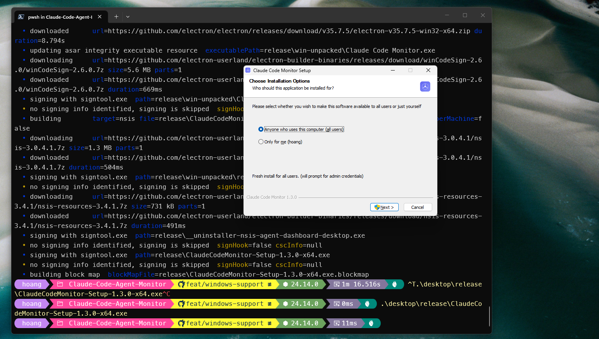
  <br>
  <em>Windows 설치 프로그램 · 1단계 — <strong>Choose Installation Options</strong>(사용자별 "Only for me" 대 모든 사용자).</em>
</p>

<p align="center">
  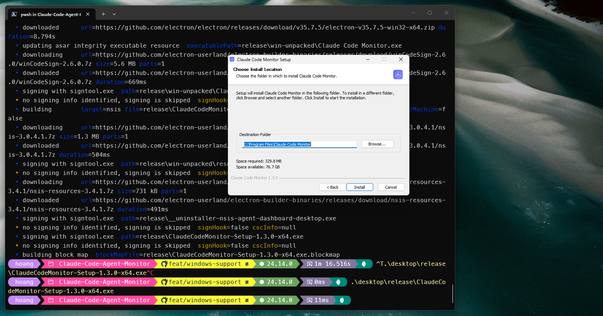
  <br>
  <em>Windows 설치 프로그램 · 2단계 — <strong>Choose Install Location</strong>(기본값은 사용자별 <code>%LOCALAPPDATA%\Programs</code>).</em>
</p>

<p align="center">
  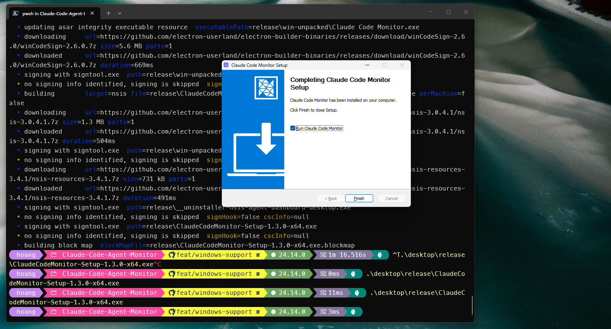
  <br>
  <em>Windows 설치 프로그램 · 3단계 — <strong>Completing Setup</strong>(마침 후 앱 실행).</em>
</p>

### 빌드 명령어

모든 명령어는 **리포지토리 루트**에서 실행합니다:

| 명령어                      | 설명                                                                          |
| --------------------------- | ---------------------------------------------------------------------------- |
| `npm run desktop:install`   | Electron + electron-builder를 `desktop/`에 설치합니다. Electron의 ABI에 맞게 `better-sqlite3`을 다시 빌드하고, 네이티브 `better-sqlite3` 빌드를 사전 점검하며 실패 시 실행 가능한 설정 도움말(툴체인이 필요 없는 대안 포함)을 출력합니다 |
| `npm run desktop:build`     | 데스크톱 TypeScript 소스를 `desktop/out/`으로 컴파일합니다                    |
| `npm run desktop:dev`       | 로컬 반복 작업을 위해 Electron 앱을 빌드하고 실행합니다                       |
| `npm run desktop:test`      | 스모크 테스트를 실행합니다(Electron 실행, `/api/health` 확인, 종료)            |
| `npm run desktop:dmg`       | **macOS:** **유니버설**(x64 + arm64) DMG를 빌드합니다 — 릴리스에 적합하지만 **느림** |
| `npm run desktop:dmg:arm64` | **macOS:** Apple Silicon 전용 DMG를 빌드합니다 — **빠름**(~1분), 본인 Mac에 권장 |
| `npm run desktop:dmg:x64`   | **macOS:** Intel 전용 DMG를 빌드합니다 — **빠름**(~1분)                        |
| `npm run desktop:win`       | **Windows:** NSIS 설치 프로그램 `.exe`를 빌드합니다 (x64)                      |
| `npm run desktop:win:portable` | **Windows:** 설치가 필요 없는 포터블 `.exe`를 빌드합니다 (x64)              |

결과물인 macOS DMG는 **약 80 MB**(설치 후 디스크에서 약 250 MB)이며 Windows 설치 프로그램도 비슷한 크기입니다 — 표준적인 Electron 번들 오버헤드입니다.

### 서명 및 공증

macOS DMG는 기본적으로 **ad-hoc 서명**되므로 유료 Apple Developer 계정 없이도 누구나 동작하는 `.app`을 빌드할 수 있습니다 — `package` 스크립트가 `CSC_IDENTITY_AUTO_DISCOVERY=false`를 설정하므로 기여자의 키체인에 이미 있는 코드 서명 인증서가 자동으로 선택되는 일은 없습니다. 실제 **Developer ID 서명**은 `CSC_LINK`(base64로 인코딩된 `.p12`)와 `CSC_KEY_PASSWORD`를 통한 옵트인이며, **Apple 공증**은 `APPLE_ID`, `APPLE_TEAM_ID`, `APPLE_APP_SPECIFIC_PASSWORD`를 통한 옵트인입니다. **Windows** 빌드는 기본적으로 **서명되지 않으며**(SmartScreen이 첫 실행 시 안내를 표시할 수 있습니다 — *추가 정보 → 실행*), Authenticode 서명은 `CSC_LINK` + `CSC_KEY_PASSWORD`로 명시적 인증서를 제공한 경우에만 활성화됩니다. 이 값들이 제공되면 CI가 모두 자동으로 인식합니다 — 코드 변경이 필요 없습니다.

### 구현 노트

- **`better-sqlite3`**은 의존성 트리에서 유일한 네이티브 모듈이며, 네이티브 모듈은 실행되는 정확한 Node ABI에 맞춰 컴파일되어야 합니다. `desktop/` 워크스페이스는 Electron의 ABI에 맞게 다시 빌드된 `better-sqlite3`의 **자체 복사본**을 포함하고, 프로세스 로컬 `require` 리디렉션을 사용해 `server/db.js`가 이를 가리키도록 합니다. 리포지토리 루트의 복사본은 시스템 Node용으로 빌드된 상태를 유지합니다(따라서 `npm run test:server`는 계속 동작합니다).
- **DMG를 빌드하면 대상 아키텍처에 맞게 `better-sqlite3`이 다시 빌드되는데**, 이로 인해 데스크톱 복사본이 다른 CPU 아키텍처용으로 빌드된 채 남아 `npm run desktop:dev` / `npm run desktop:test`가 `ERR_DLOPEN_FAILED`로 깨질 수 있습니다. 이제 데스크톱 `prebuild` 단계가 다음 빌드 시 로컬 머신에 맞게 네이티브 모듈을 **자동 복구**하므로, 특정 아키텍처용 DMG 빌드 후에도 개발 및 스모크 테스트 흐름이 계속 동작합니다. 또한 `prebuild` 단계는 `better-sqlite3` 네이티브 바이너리가 아예 없을 때 **설정 도움말과 함께 빠르게 실패**하여, 런타임 크래시를 복사해 붙여넣을 수 있는 빌드 타임 오류로 바꿉니다.
- **`desktop/` 외부의 유일한 변경**은 `server/index.js`의 동작 보존 리팩터링입니다: listen 이후의 부트스트랩(업데이트 스케줄러, `cc-watcher`, 고아 실행 조정)을 내보내기된(exported) `startBackgroundServices()`로 추출하여, 내장 서버가 `node server/index.js`가 실행하는 것과 정확히 동일하게 실행되도록 했습니다. 독립 실행형 `node server/index.js` 경로는 기능적으로 변경되지 않았으며, `client/`, `scripts/`, `mcp/`, `vscode-extension/`은 건드리지 않았습니다.
- 경로 필터링된 두 개의 데스크톱 CI 잡이 앱을 빌드하고, 스모크 테스트하고, 패키징합니다: `macos-latest`의 **`🍎 macOS Desktop (DMG)`**(`ClaudeCodeMonitor-dmg` 아티팩트 업로드 — 단일 아키텍처 DMG 2개)과 `windows-latest`의 **`🪟 Windows Desktop (EXE)`**(`ClaudeCodeMonitor-win` 아티팩트 업로드 — NSIS 설치 프로그램 + 포터블)입니다. `master`로 버전을 올리는 푸시가 있으면 `release` 잡이 macOS DMG와 Windows `.exe` **모두**를 게시된 `vX.Y.Z` GitHub Release에 첨부합니다. Windows 아이콘(`desktop/assets/icon.ico`)은 리포지토리에 커밋되어 있습니다(`npm run build:win-icon`으로 `icon.png`에서 재생성, PowerShell + .NET, 추가 도구 불필요).

전체 사용자 가이드(다운로드, 설치, Gatekeeper / SmartScreen, 트레이 메뉴, 자동 시작)는 [`DESKTOP.md`](./DESKTOP.md)를, 기여자 / 아키텍처 레퍼런스(프로세스 모델, 부팅 생명주기, 포트 탐색, 빌드 파이프라인 — Mermaid 다이어그램 포함)는 [`desktop/README.md`](./desktop/README.md)를 참조하십시오.

---

## 데이터 저장소

- **엔진:** `better-sqlite3`(선택 사항) 또는 Node.js 내장 `node:sqlite`를 통한 SQLite 3
- **위치:** `data/dashboard.db`
- **저널 모드:** WAL(쓰기 중 동시 읽기)
- **초기화:** 모든 데이터를 지우려면 `data/dashboard.db`를 삭제합니다

### 엔티티 관계 다이어그램

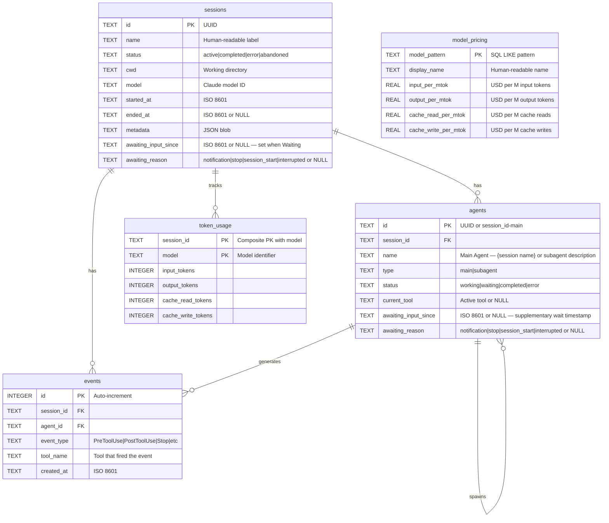
```mermaid
erDiagram
    sessions ||--o{ agents : has
    sessions ||--o{ events : has
    sessions ||--o{ token_usage : tracks
    agents ||--o{ events : generates
    agents ||--o{ agents : spawns

    sessions {
        TEXT id PK "UUID"
        TEXT name "Human-readable label"
        TEXT status "active|completed|error|abandoned"
        TEXT cwd "Working directory"
        TEXT model "Claude model ID"
        TEXT started_at "ISO 8601"
        TEXT ended_at "ISO 8601 or NULL"
        TEXT metadata "JSON blob"
        TEXT awaiting_input_since "ISO 8601 or NULL — set when Waiting"
        TEXT awaiting_reason "notification|stop|session_start|interrupted or NULL"
    }

    agents {
        TEXT id PK "UUID or session_id-main"
        TEXT session_id FK
        TEXT name "Main Agent — {session name} or subagent description"
        TEXT type "main|subagent"
        TEXT status "working|waiting|completed|error"
        TEXT current_tool "Active tool or NULL"
        TEXT awaiting_input_since "ISO 8601 or NULL — supplementary wait timestamp"
        TEXT awaiting_reason "notification|stop|session_start|interrupted or NULL"
    }

    events {
        INTEGER id PK "Auto-increment"
        TEXT session_id FK
        TEXT agent_id FK
        TEXT event_type "PreToolUse|PostToolUse|Stop|etc"
        TEXT tool_name "Tool that fired the event"
        TEXT created_at "ISO 8601"
    }

    token_usage {
        TEXT session_id PK "Composite PK with model"
        TEXT model PK "Model identifier"
        INTEGER input_tokens
        INTEGER output_tokens
        INTEGER cache_read_tokens
        INTEGER cache_write_tokens
    }

    model_pricing {
        TEXT model_pattern PK "SQL LIKE pattern"
        TEXT display_name "Human-readable name"
        REAL input_per_mtok "USD per M input tokens"
        REAL output_per_mtok "USD per M output tokens"
        REAL cache_read_per_mtok "USD per M cache reads"
        REAL cache_write_per_mtok "USD per M cache writes"
    }
```

---

## 플러그인 마켓플레이스

공식 Agent Monitor 플러그인으로 Claude Code를 확장하십시오 — 분석, 생산성 도구, 개발자 유틸리티, AI 기반 인사이트, 대시보드 연결, 비용 가드레일, 세션 포렌식, 워크플로 오케스트레이션, 신뢰성/SLO, 구성 거버넌스를 제공합니다. 플러그인 10개, 스킬 53개, 에이전트 14개, 슬래시 명령어 30개, CLI 도구 3개, Hook 구성 3개, MCP 서버 1개.

### 마켓플레이스 추가

```bash
claude plugin marketplace add hoangsonww/Claude-Code-Agent-Monitor
```

### 사용 가능한 플러그인

| 플러그인 | 설치 명령어 | 스킬 |
|--------|----------------|--------|
| **ccam-analytics** | `claude plugin install ccam-analytics@hoangsonww-claude-code-agent-monitor` | `session-report`, `cost-breakdown`, `usage-trends`, `productivity-score` |
| **ccam-cost-guard** | `claude plugin install ccam-cost-guard@hoangsonww-claude-code-agent-monitor` | `budget-set`, `spend-forecast`, `cost-alert`, `model-savings`, `daily-budget-check` |
| **ccam-productivity** | `claude plugin install ccam-productivity@hoangsonww-claude-code-agent-monitor` | `daily-standup`, `weekly-report`, `sprint-summary`, `workflow-optimizer` |
| **ccam-devtools** | `claude plugin install ccam-devtools@hoangsonww-claude-code-agent-monitor` | `session-debug`, `hook-diagnostics`, `data-export`, `health-check` |
| **ccam-insights** | `claude plugin install ccam-insights@hoangsonww-claude-code-agent-monitor` | `pattern-detect`, `anomaly-alert`, `optimization-suggest`, `session-compare` |
| **ccam-sessions** | `claude plugin install ccam-sessions@hoangsonww-claude-code-agent-monitor` | `session-search`, `session-timeline`, `transcript-replay`, `cwd-rollup`, `session-cleanup` |
| **ccam-workflows** | `claude plugin install ccam-workflows@hoangsonww-claude-code-agent-monitor` | `dag-map`, `delegation-audit`, `concurrency-report`, `error-propagation`, `fleet-runs` |
| **ccam-quality** | `claude plugin install ccam-quality@hoangsonww-claude-code-agent-monitor` | `error-scan`, `api-error-report`, `hook-failure-audit`, `slo-check`, `regression-alert` |
| **ccam-config** | `claude plugin install ccam-config@hoangsonww-claude-code-agent-monitor` | `config-audit`, `memory-review`, `skill-inventory`, `mcp-audit`, `hook-inventory` |
| **ccam-dashboard** | `claude plugin install ccam-dashboard@hoangsonww-claude-code-agent-monitor` | `dashboard-status`, `quick-stats` + MCP 서버 |

### 포함된 CLI 도구

- `ccam-stats` — 터미널 대시보드(세션, 비용, 컴팩션 기준선이 반영된 토큰)
- `ccam-doctor` — 시스템 진단(API, 데이터베이스, Hook, 데이터 최신성)
- `ccam-export` — 세션, 이벤트, 분석, 비용에 대한 데이터 내보내기(JSON, CSV)

### 사용 예시

```bash
# Claude Code에서 플러그인 설치 후:
/ccam-analytics:session-report latest
/ccam-analytics:cost-breakdown this week
/ccam-productivity:daily-standup today
/ccam-insights:pattern-detect tools
/ccam-dashboard:quick-stats
```

> 서버 테스트(`server/__tests__/plugins-marketplace.test.js`)가 마켓플레이스 ↔ `plugins/` 디렉터리 간의 전단사(bijection)와 모든 플러그인의 `plugin.json`, 에이전트, 스킬, 명령어를 검증합니다.

📖 전체 문서: [docs/plugins.md](docs/PLUGINS.md)

---

## Statusline

모델 이름, 사용자, 작업 디렉터리, git 브랜치, 컨텍스트 윈도우 사용량 바, 방향별 토큰 수, 세션 비용을 표시하는 Claude Code용 독립 실행형 CLI statusline 유틸리티입니다 -- 모두 ANSI 이스케이프 시퀀스로 색상이 지정됩니다.

```
nguyens6@host ~/agent-dashboard/client | Sonnet 4.6 | main | ████████░░ 79% | 3↑ 2↓ 156586c | $0.4231
```

| 세그먼트    | 색상                 | 예시                                                            |
| ----------- | -------------------- | -------------------------------------------------------------- |
| 모델        | 시안                 | `Sonnet 4.6`                                                   |
| 사용자      | 초록                 | `nguyens6`                                                     |
| CWD         | 노랑                 | `~/agent-dashboard`                                            |
| Git 브랜치  | 마젠타               | `main`                                                         |
| 컨텍스트 바 | 초록 / 노랑 / 빨강   | `████████░░ 79%`                                               |
| 토큰        | 초록 / 시안 / 흐림   | `3↑ 2↓ 156586c` (초록 `↑` 입력, 시안 `↓` 출력, 흐림 `c` 캐시)   |
| 비용 (USD)  | 초록 / 노랑 / 빨강   | `$0.4231` (세션 합계 — API 및 구독 플랜에서 표시)               |

비용 색상 임계값: $5 미만은 초록, $5–$20는 노랑, $20 이상은 빨강입니다.

설치 방법은 [`statusline/README.md`](statusline/README.md)를 참조하십시오.

<p align="center">
  
</p>

---

## 서버 아키텍처

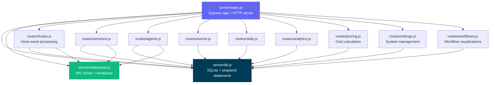
```mermaid
graph TD
    INDEX["server/index.js<br/>Express app + HTTP server"]
    DB["server/db.js<br/>SQLite + prepared statements"]
    WS["server/websocket.js<br/>WS server + broadcast"]
    HOOKS["routes/hooks.js<br/>Hook event processing"]
    SESSIONS["routes/sessions.js"]
    AGENTS["routes/agents.js"]
    EVENTS["routes/events.js"]
    STATS["routes/stats.js"]
    ANALYTICS["routes/analytics.js"]
    PRICING["routes/pricing.js<br/>Cost calculation"]
    SETTINGS["routes/settings.js<br/>System management"]
    WORKFLOWS["routes/workflows.js<br/>Workflow visualizations"]

    INDEX --> DB & WS
    INDEX --> HOOKS & SESSIONS & AGENTS & EVENTS & STATS & ANALYTICS & PRICING & SETTINGS & WORKFLOWS
    HOOKS --> DB & WS
    SESSIONS --> DB & WS
    AGENTS --> DB & WS
    EVENTS --> DB
    STATS --> DB
    ANALYTICS --> DB
    PRICING --> DB
    SETTINGS --> DB
    WORKFLOWS --> DB

    style INDEX fill:#6366f1,stroke:#818cf8,color:#fff
    style DB fill:#003B57,stroke:#005f8a,color:#fff
    style WS fill:#10b981,stroke:#34d399,color:#fff
```

---

## 클라이언트 라우팅

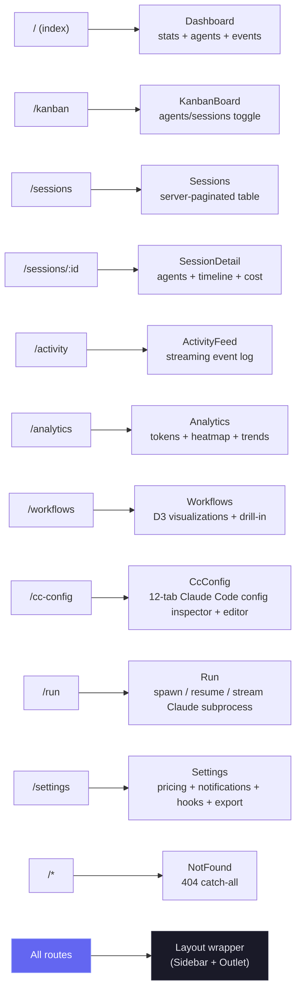
```mermaid
graph LR
    ROOT["/ (index)"] --> DASH["Dashboard<br/>stats + agents + events"]
    K["/kanban"] --> KANBAN["KanbanBoard<br/>agents/sessions toggle"]
    S["/sessions"] --> SESS["Sessions<br/>server-paginated table"]
    D["/sessions/:id"] --> DETAIL["SessionDetail<br/>agents + timeline + cost"]
    A["/activity"] --> ACT["ActivityFeed<br/>streaming event log"]
    AN["/analytics"] --> ANALYTICS["Analytics<br/>tokens + heatmap + trends"]
    WF["/workflows"] --> WORKFLOWS["Workflows<br/>D3 visualizations + drill-in"]
    CC["/cc-config"] --> CCCONFIG["CcConfig<br/>12-tab Claude Code config inspector + editor"]
    RUN["/run"] --> RUNPAGE["Run<br/>spawn / resume / stream Claude subprocess"]
    ST["/settings"] --> SETTINGS["Settings<br/>pricing + notifications + hooks + export"]
    NF["/*"] --> NOTFOUND["NotFound<br/>404 catch-all"]

    ALL["All routes"] --> LAYOUT["Layout wrapper<br/>(Sidebar + Outlet)"]

    style ALL fill:#6366f1,stroke:#818cf8,color:#fff
    style LAYOUT fill:#1a1a28,stroke:#2a2a3d,color:#e4e4ed
```

---

## Hook 핸들러 흐름

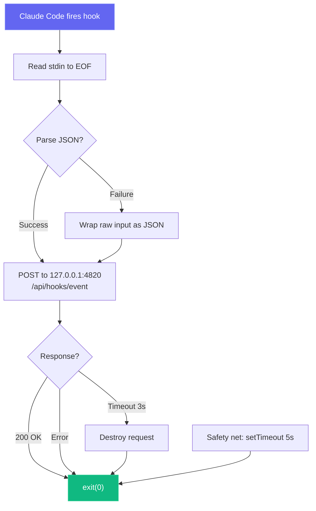
```mermaid
flowchart TD
    START["Claude Code fires hook"] --> STDIN["Read stdin to EOF"]
    STDIN --> PARSE{"Parse JSON?"}
    PARSE -->|Success| POST["POST to 127.0.0.1:4820<br/>/api/hooks/event"]
    PARSE -->|Failure| WRAP["Wrap raw input as JSON"]
    WRAP --> POST
    POST --> RESP{"Response?"}
    RESP -->|200 OK| EXIT0["exit(0)"]
    RESP -->|Error| EXIT0
    RESP -->|Timeout 3s| DESTROY["Destroy request"] --> EXIT0
    SAFETY["Safety net: setTimeout 5s"] --> EXIT0

    style EXIT0 fill:#10b981,stroke:#34d399,color:#fff
    style START fill:#6366f1,stroke:#818cf8,color:#fff
```

---

## 배포 모드

서로 다른 프로세스 아키텍처를 사용하는 개발 및 프로덕션 배포 모드를 모두 지원합니다:

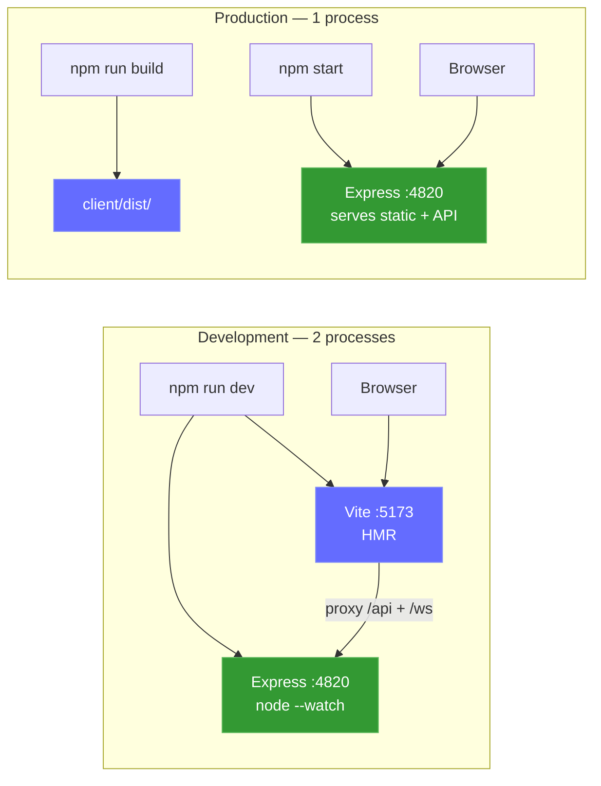
```mermaid
graph LR
    subgraph dev["Development — 2 processes"]
        D_CMD["npm run dev"] --> D_SRV["Express :4820<br/>node --watch"]
        D_CMD --> D_VITE["Vite :5173<br/>HMR"]
        D_BROWSER["Browser"] --> D_VITE
        D_VITE -->|"proxy /api + /ws"| D_SRV
    end

    subgraph prod["Production — 1 process"]
        P_BUILD["npm run build"] --> P_DIST["client/dist/"]
        P_START["npm start"] --> P_SRV["Express :4820<br/>serves static + API"]
        P_BROWSER["Browser"] --> P_SRV
    end

    style D_VITE fill:#646CFF,stroke:#818cf8,color:#fff
    style D_SRV fill:#339933,stroke:#5cb85c,color:#fff
    style P_SRV fill:#339933,stroke:#5cb85c,color:#fff
    style P_DIST fill:#646CFF,stroke:#818cf8,color:#fff
```

선택 사항인 로컬 MCP 사이드카(stdio, HTTP+SSE, REPL 전송 방식 지원):

```mermaid
graph LR
    subgraph "MCP Transport Options"
        M_STDIO["MCP Server (stdio)<br/>npm run mcp:start"]
        M_HTTP["MCP Server (HTTP)<br/>npm run mcp:start:http<br/>:8819"]
        M_REPL["MCP Server (REPL)<br/>npm run mcp:start:repl"]
    end

    H["MCP Host"] -->|"stdin/stdout"| M_STDIO
    RC["Remote Client"] -->|"POST /mcp · GET /sse"| M_HTTP
    OP["Operator"] -->|"interactive CLI"| M_REPL

    M_STDIO --> D["Dashboard Server<br/>:4820"]
    M_HTTP --> D
    M_REPL --> D

    style M_STDIO fill:#0f766e,stroke:#14b8a6,color:#fff
    style M_HTTP fill:#0f766e,stroke:#14b8a6,color:#fff
    style M_REPL fill:#0f766e,stroke:#14b8a6,color:#fff
```

선택 사항인 **데스크톱 앱(macOS & Windows)** — Express 서버를 인프로세스로 호스팅하는 단일 Electron 프로세스입니다(터미널 없음, 자식 프로세스 없음):

```mermaid
flowchart LR
    subgraph desktop["Desktop App (macOS & Windows) — 1 Electron process"]
        E_MAIN["Electron Main Process<br/>(Node 22 / Electron 35)"]
        E_HOST["server-host.ts<br/>require() server/index.js"]
        E_SRV["Embedded Express :4820<br/>API · SQLite · WebSocket"]
        E_WIN["BrowserWindow<br/>built React client"]
        E_TRAY["Menu-bar (tray) icon<br/>+ native app menu"]
        E_MAIN --> E_HOST
        E_HOST -->|"in-process require()"| E_SRV
        E_MAIN --> E_TRAY
        E_SRV -->|"http + ws on 127.0.0.1"| E_WIN
    end

    E_HOOKS["Claude Code hooks"] -->|"POST /api/hooks/event"| E_SRV

    style E_MAIN fill:#47848F,stroke:#2f5a62,color:#fff
    style E_SRV fill:#339933,stroke:#5cb85c,color:#fff
    style E_WIN fill:#61DAFB,stroke:#3aa9c9,color:#000
```

### 클라우드 배포

`deployments/` 디렉터리는 대시보드를 프로덕션에 배포하기 위한 클라우드 중립적인 엔터프라이즈급 인프라를 제공합니다. AWS, GCP, Azure, OCI 전반에서 Helm, Kustomize, Terraform을 지원하며 블루-그린, 카나리, 롤링 릴리스 전략을 제공합니다.

```mermaid
graph TB
  subgraph "Deployment Methods"
    HELM["⎈ Helm Chart<br/>Parameterized installs"]
    KUST["📦 Kustomize<br/>Overlay-based patching"]
    TF["🏗️ Terraform<br/>Full cloud provisioning"]
  end

  subgraph "Cloud Providers"
    AWS["☁️ AWS<br/>ECS Fargate + ALB"]
    GCP["☁️ GCP<br/>Cloud Run + GCLB"]
    AZ["☁️ Azure<br/>ACI + App Gateway"]
    OCI["☁️ OCI<br/>OKE + LBaaS"]
  end

  subgraph "Release Strategies"
    ROLL["Rolling Update"]
    BG["Blue-Green"]
    CAN["Canary + Analysis"]
  end

  subgraph "Observability"
    PROM["📊 Prometheus + Grafana"]
    CX["📡 Coralogix<br/>Logs · Metrics · Traces · SLOs"]
  end

  HELM & KUST --> ROLL & BG & CAN
  TF --> AWS & GCP & AZ & OCI
  ROLL & BG & CAN --> PROM & CX

  style HELM fill:#0f1689,color:#fff
  style KUST fill:#326ce5,color:#fff
  style TF fill:#7b42bc,color:#fff
  style AWS fill:#ff9900,color:#fff
  style GCP fill:#4285f4,color:#fff
  style AZ fill:#0078d4,color:#fff
  style OCI fill:#f80000,color:#fff
  style PROM fill:#e6522c,color:#fff
  style CX fill:#1a1a2e,color:#fff
```

```bash
# Helm (Kubernetes에 권장)
helm install agent-monitor deployments/helm/agent-monitor \
  -f deployments/helm/agent-monitor/values-production.yaml \
  -n agent-monitor --create-namespace

# Kustomize
kubectl apply -k deployments/kubernetes/overlays/production

# Terraform (전체 인프라 + 앱)
cd deployments/terraform/providers/aws
terraform init && terraform apply -var-file=../../environments/production/terraform.tfvars

# 스크립트 오케스트레이터
./deployments/scripts/deploy.sh --env production --method helm --strategy blue-green
```

배포 스택에는 CI/CD 파이프라인(GitHub Actions + GitLab CI), 포괄적인 모니터링(Prometheus, Grafana, 13개 알림 규칙을 갖춘 Alertmanager, 로그·메트릭·트레이스·SLO 추적을 위한 OpenTelemetry Collector 기반의 Coralogix 풀스택 관측성), 운영 스크립트(배포, 롤백, 블루-그린 전환, 백업/복원, 해체), 그리고 완전한 보안 태세(Restricted Pod Security Standard, TLS 1.3, 네트워크 정책, Trivy 스캔)가 포함됩니다.

> [!NOTE]
> 📘 **전체 배포 가이드:** 단계별 지침, 아키텍처 다이어그램, 운영 워크플로는 [DEPLOYMENT.md](DEPLOYMENT.md)를 참조하십시오.

---

## 프로젝트 구조

```
agent-dashboard/
|-- CLAUDE.md                   # Claude Code 프로젝트 메모리 및 작업 규약
|-- AGENTS.md                   # Codex 프로젝트 지침
|-- package.json                # 루트 스크립트(대시보드 + MCP 헬퍼) + 서버 의존성
|-- .claude/
|   +-- rules/                  # 경로 범위가 지정된 Claude 규칙
|   +-- skills/                 # Claude 재사용 가능 프로젝트 스킬
|   +-- agents/                 # Claude 커스텀 서브에이전트
|-- .claude-plugin/
|   +-- marketplace.json        # 플러그인 마켓플레이스 매니페스트(플러그인 10개)
|-- plugins/
|   |-- ccam-analytics/         # 분석: 세션 리포트, 비용 분석, 사용 추세, 생산성 점수
|   |   |-- .claude-plugin/plugin.json
|   |   |-- skills/ (4)         # session-report, cost-breakdown, usage-trends, productivity-score
|   |   |-- agents/             # analytics-advisor (Sonnet 모델)
|   |   |-- hooks/hooks.json    # Stop + SubagentStop 이벤트 로깅
|   |   +-- bin/ccam-stats      # 터미널 대시보드 CLI
|   |-- ccam-productivity/      # 생산성: 스탠드업, 리포트, 스프린트, 워크플로 최적화 도구
|   |-- ccam-devtools/          # DevTools: 디버그, 진단, 내보내기, 상태 점검
|   |   +-- bin/                # ccam-doctor + ccam-export CLI
|   |-- ccam-insights/          # 인사이트: 패턴, 이상 징후, 최적화, 비교
|   |-- ccam-cost-guard/        # 비용 가드레일: 예산, 지출 예측, 비용 알림, 모델 절감
|   |-- ccam-sessions/          # 세션 포렌식: 검색, 타임라인, 트랜스크립트 재생, cwd 롤업, 정리
|   |-- ccam-workflows/         # 워크플로 오케스트레이션: DAG 맵, 위임 감사, 동시성, 플릿 실행
|   |-- ccam-quality/           # 신뢰성 및 SLO: 오류 스캔, API 오류 리포트, Hook 실패 감사, SLO 점검
|   |-- ccam-config/            # 설정 및 메모리 거버넌스: 설정 감사, 메모리 리뷰, 스킬/MCP/Hook 인벤토리
|   +-- ccam-dashboard/         # 대시보드 커넥터: 상태, 빠른 통계, MCP 통합
|       +-- .mcp.json           # MCP 서버 설정
|-- server/
|   |-- index.js                 # Express 앱, HTTP 서버, 정적 파일 제공
|   |-- db.js                    # SQLite 스키마, 마이그레이션, prepared statement
|   |-- websocket.js             # 하트비트를 갖춘 WebSocket 서버
|   +-- routes/
|       |-- hooks.js             # Hook 이벤트 처리(트랜잭션 기반)
|       |-- sessions.js          # 세션 CRUD
|       |-- agents.js            # 에이전트 CRUD
|       |-- events.js            # 이벤트 목록 조회
|       |-- stats.js             # 집계 통계
|       |-- analytics.js         # 토큰, 도구, 추세 분석
|       |-- workflows.js         # 워크플로 데이터 집계 및 세션별 드릴인
|       |-- pricing.js           # 모델 가격 CRUD 및 비용 계산
|       +-- settings.js          # 시스템 정보, 데이터 관리, 내보내기, 정리
|   +-- lib/
|       +-- transcript-cache.js  # stat 기반 JSONL 트랜스크립트 캐시. 청크 단위 동기 바이트 스트림 리더(4 MiB 청크, 줄 단위 UTF-8 디코드)를 사용하여 V8의 최대 문자열 길이(~512 MiB)보다 큰 파일도 "FATAL ERROR: v8::ToLocalChecked Empty MaybeLocal"로 Node가 중단되는 일 없이 파싱됩니다. 토큰, 컴팩션, API 오류, 턴 소요 시간, thinking 블록, usage 추가 정보(service_tier, speed, inference_geo)를 추출합니다
|   +-- compat-sqlite.js         # node:sqlite 호환성 래퍼(better-sqlite3의 폴백)
|-- client/
|   |-- package.json             # 클라이언트 의존성
|   |-- index.html               # HTML 진입점
|   |-- vite.config.ts           # Vite + 프록시 설정
|   |-- tailwind.config.js       # 커스텀 다크 테마
|   |-- tsconfig.json            # 엄격한 TypeScript
|   +-- src/
|       |-- main.tsx             # React 진입점
|       |-- App.tsx              # 라우터 + WebSocket 프로바이더
|       |-- index.css            # Tailwind + 커스텀 유틸리티
|       |-- lib/
|       |   |-- types.ts         # 공유 TypeScript 인터페이스
|       |   |-- api.ts           # 타입이 지정된 fetch 클라이언트
|       |   |-- format.ts        # 날짜/시간 포매팅 유틸리티
|       |   +-- eventBus.ts      # WebSocket 분배를 위한 pub/sub
|       |-- hooks/
|       |   |-- useWebSocket.ts      # 자동 재연결 WebSocket Hook
|       |   +-- useNotifications.ts  # WebSocket 이벤트 기반 브라우저 알림 트리거
|       |-- components/
|       |   |-- Layout.tsx       # 사이드바 + 아웃렛을 갖춘 셸
|       |   |-- Sidebar.tsx      # 내비게이션 + 연결 상태 표시기
|       |   |-- AgentCard.tsx    # 상태가 표시되는 에이전트 정보 카드
|       |   |-- StatCard.tsx     # 지표 카드
|       |   |-- StatusBadge.tsx  # 색상으로 구분된 상태 배지
|       |   |-- EmptyState.tsx   # 빈 목록용 플레이스홀더
|       |   +-- workflows/       # D3.js 워크플로 시각화 컴포넌트
|       |       |-- OrchestrationDAG.tsx            # 에이전트 생성 패턴의 수평 DAG
|       |       |-- ToolExecutionFlow.tsx           # 도구 간 전환의 d3-sankey 다이어그램
|       |       |-- AgentCollaborationNetwork.tsx   # 포스 다이렉티드 에이전트 파이프라인 그래프
|       |       |-- SubagentEffectiveness.tsx       # SVG 성공률 링을 갖춘 스코어카드 그리드
|       |       |-- WorkflowPatterns.tsx            # 자동 감지된 오케스트레이션 시퀀스
|       |       |-- ModelDelegationFlow.tsx         # 에이전트 계층을 통한 모델 라우팅
|       |       |-- ErrorPropagationMap.tsx         # 계층 깊이별 오류 클러스터링
|       |       |-- ConcurrencyTimeline.tsx         # 스윔레인 병렬 에이전트 실행
|       |       |-- SessionComplexityScatter.tsx    # D3 버블 차트(소요 시간 vs 에이전트 vs 토큰)
|       |       |-- CompactionImpact.tsx            # 토큰 압축 이벤트 및 복구
|       |       |-- WorkflowStats.tsx               # 워크플로 집계 통계
|       |       +-- SessionDrillIn.tsx              # 세션별 에이전트 트리, 도구 타임라인, 이벤트
|       +-- pages/
|           |-- Dashboard.tsx      # 개요 페이지
|           |-- KanbanBoard.tsx    # 에이전트/세션 전환, 상태 컬럼
|           |-- Sessions.tsx       # 서버 페이지네이션 세션 테이블
|           |-- SessionDetail.tsx  # 단일 세션 심층 분석
|           |-- ActivityFeed.tsx   # 실시간 이벤트 스트림
|           |-- Analytics.tsx      # 토큰 사용량, 히트맵, 추세
|           |-- Workflows.tsx      # D3.js 워크플로 시각화 및 세션 드릴인
|           |-- Settings.tsx       # 모델 가격, 알림, Hook, 내보내기, 정리
|           +-- NotFound.tsx       # 404 캐치올 페이지
|-- scripts/
|   |-- hook-handler.js          # 경량 stdin-HTTP 포워더
|   |-- install-hooks.js         # ~/.claude/settings.json 자동 구성
|   |-- import-history.js        # 향상된 JSONL 추출(API 오류, 턴 소요 시간, entrypoint, 권한 모드, thinking 블록, usage 추가 정보, 도구 오류, 서브에이전트 JSONL 파일)과 함께 ~/.claude/에서 세션을 가져옵니다. 재가져오기는 완전한 증분 방식입니다: 이벤트 타입별 최고 수위점(세션별 `MAX(created_at) GROUP BY event_type`)을 사전에 계산하고 `ts > cutoff[type]`인 JSONL 항목만 삽입하므로, 트랜스크립트가 여러 날에 걸쳐 늘어나는 장기 실행 세션도 재실행할 때마다 Stop / PostToolUse / TurnDuration / ToolError 이벤트를 계속 받습니다. 또한 JSONL이 저장된 값을 지나 진행되면 `sessions.ended_at`을 앞으로 이동시키고 매 실행마다 메시지 수 메타데이터를 갱신합니다
|   +-- seed.js                  # 샘플 데이터 생성기
|-- mcp/
|   |-- package.json             # MCP 패키지 스크립트 + 의존성
|   |-- README.md                # MCP 설정, 호스트 구성, 도구 카탈로그, 안전 모델
|   |-- src/
|   |   |-- index.ts             # MCP 런타임 진입점(전송 라우터)
|   |   |-- server.ts            # MCP 서버 조립
|   |   |-- clients/             # 재시도/백오프를 갖춘 대시보드 API 클라이언트
|   |   |-- config/              # 환경 변수/CLI 설정 파싱
|   |   |-- core/                # 로거, 도구 레지스트리, 결과 헬퍼
|   |   |-- policy/              # 변경/파괴적 작업 가드
|   |   |-- tools/               # 도메인별 도구 모듈(6개 도메인)
|   |   |-- transports/          # HTTP+SSE 서버, REPL, 도구 컬렉터
|   |   |-- ui/                  # ANSI 배너, 색상, 포매터, 테이블
|   |   +-- types/               # 공유 MCP 타입 정의
|   +-- build/                   # 빌드된 MCP 런타임 출력
|-- desktop/
|   |-- package.json             # Electron + electron-builder 의존성 및 스크립트
|   |-- electron-builder.yml     # DMG 패키징 설정; 서명/공증 Hook
|   |-- tsconfig.json            # 엄격한 TypeScript (src/ -> out/)
|   |-- README.md                # 데스크톱 앱 아키텍처 레퍼런스(기여자 문서)
|   |-- assets/                  # icon.svg + 생성된 icon.icns + 트레이 PNG
|   |-- src/
|   |   |-- main.ts              # Electron 메인 프로세스 진입점 — 라이프사이클, 연결 구성
|   |   |-- server-host.ts       # 인프로세스 Express 부팅, 포트 탐색, 기존 서버 인수, DB 종료
|   |   |-- window.ts            # BrowserWindow + 유지되는 창 위치/크기
|   |   |-- tray.ts              # 메뉴 막대(트레이) 아이콘 + 컨텍스트 메뉴
|   |   |-- menu.ts              # 네이티브 애플리케이션 메뉴(File ▸ Open Dashboard는 macOS 전용)
|   |   |-- login-item.ts        # macOS 로그인 항목 자동 시작 전환(SMAppService)
|   |   |-- logger.ts            # 파일 로거 -> ~/Library/Logs/Claude Code Monitor/desktop.log
|   |   |-- constants.ts         # 앱 이름, 포트, 타임아웃, 창 크기
|   |   +-- preload.ts           # 의도적으로 비어 있음(렌더러 권한 제로)
|   |-- scripts/
|   |   |-- install.js           # desktop:install을 위한 네이티브 의존성 사전 점검; 실패 시 설정 도움말을 출력하고 0이 아닌 코드로 종료
|   |   |-- preflight.js         # 공유 better-sqlite3 바이너리 점검 + OS별 실행 가능한 설정 도움말(툴체인 없는 대안 포함)
|   |   |-- prebuild.js          # tsc 전에 루트 + 클라이언트가 빌드되었는지 보장; 네이티브 바이너리가 없으면 설정 도움말과 함께 즉시 실패
|   |   |-- build-icons.sh       # qlmanage/sips/iconutil을 통한 SVG -> PNG/ICNS 변환
|   |   +-- notarize.js          # electron-builder afterSign Hook(옵트인 공증)
|   +-- tests/
|       +-- smoke.test.mjs       # Electron 실행 + /api/health 프로브
|-- deployments/
|   |-- README.md                # 배포 인프라 레퍼런스
|   |-- terraform/               # 클라우드 프로비저닝(AWS, GCP, Azure, OCI)
|   |   |-- modules/             # 재사용 가능 모듈(networking, compute, db, lb, monitoring)
|   |   |-- providers/           # 클라우드별 구현
|   |   +-- environments/        # 환경별 tfvars(dev, staging, production)
|   |-- kubernetes/              # Kustomize 매니페스트
|   |   |-- base/                # 11개 기본 리소스(deployment, service, ingress, hpa 등)
|   |   |-- overlays/            # 환경 오버레이(dev, staging, production)
|   |   |-- components/          # 선택 사항 애드온(mcp-sidecar, monitoring)
|   |   +-- strategies/          # 블루-그린 및 카나리 배포 전략
|   |-- helm/agent-monitor/      # 12개 템플릿과 4개 값 세트를 갖춘 Helm 차트
|   |-- scripts/                 # 운영 스크립트(deploy, rollback, backup, teardown)
|   |-- monitoring/              # Prometheus, Grafana, Alertmanager, Coralogix (OTel Collector)
|   +-- ci/                      # CI/CD 파이프라인(GitHub Actions, GitLab CI)
|-- .codex/
|   |-- config.toml              # Codex 런타임 설정
|   |-- README.md                # 에이전트와 스킬을 위한 Codex 설정 가이드
|   |-- rules/                   # Codex 실행 정책 규칙
|   |-- agents/                  # Codex 커스텀 에이전트 템플릿
|   +-- skills/                  # Codex 프로젝트 스킬
|-- statusline/
|   |-- README.md                # Statusline 설치 및 사용 가이드
|   |-- statusline.py            # statusline을 렌더링하는 Python 스크립트
|   +-- statusline-command.sh    # Claude Code의 statusLine 설정용 셸 래퍼
+-- data/
    +-- dashboard.db             # SQLite 데이터베이스(gitignore 처리됨)
```

---

## 문제 해결

| 문제                              | 해결 방법                                                                                                                                                        |
| --------------------------------- | ---------------------------------------------------------------------------------------------------------------------------------------------------------------- |
| `better-sqlite3` 설치 실패        | 치명적이지 않습니다 — 서버가 Node.js 내장 `node:sqlite`로 자동 폴백합니다(Node 22+). 이전 Node 버전에서는 Python 3와 C++ 빌드 도구를 설치한 후 `npm rebuild better-sqlite3`를 실행하십시오 |
| Hook이 실행되지 않음              | `npm run install-hooks`를 실행하고 Claude Code를 재시작하십시오. `~/.claude/settings.json`에 Hook이 존재하는지 확인하십시오                                       |
| 대시보드에 데이터가 표시되지 않음 | Claude Code 세션을 시작하기 전에 서버가 실행 중인지(`npm run dev`) 확인하십시오. `http://localhost:4820/api/health`를 확인하십시오                                |
| WebSocket 연결 끊김               | 클라이언트는 2초마다 자동으로 재연결합니다. 포트 4820이 방화벽에 의해 차단되지 않았는지 확인하십시오                                                              |
| 재시작 후 오래된 데이터           | 데이터베이스는 재시작 후에도 유지됩니다. 새 데모 데이터를 원하면 `npm run seed`를 실행하고, 초기화하려면 `data/dashboard.db`를 삭제하십시오                       |
| MCP 도구 연결 실패                | `MCP_DASHBOARD_BASE_URL`에서 대시보드 API가 실행 중인지 확인하고 MCP를 다시 빌드/시작하십시오(`npm run mcp:build`, `npm run mcp:start`)                           |

---

## 기여하기

기여를 환영합니다 — 전체 가이드는 [`.github/CONTRIBUTING.md`](.github/CONTRIBUTING.md)를 참조하십시오.

모든 기여자는 [Contributor License Agreement](https://github.com/hoangsonww/Claude-Code-Agent-Monitor/blob/master/CLA.md)에 서명해야 합니다. 이는 `🖋️ CLA Assistant` GitHub Action에 의해 모든 풀 리퀘스트에서 자동으로 적용됩니다: 처음 PR을 열면 봇이 `I have read the CLA Document and I hereby sign the CLA`라고 댓글을 달아 서명하도록 요청합니다. 서명할 때까지 PR의 **CLA Assistant** 상태 검사는 빨간색으로 유지되며, 한 번 서명하면 이후의 모든 기여에 적용됩니다.

---

## 라이선스

MIT. 자세한 내용은 [LICENSE](LICENSE)를 참조하십시오.
