# Claude Code, Cursor & Codex용 에이전트 대시보드

### Claude Code, Cursor & Codex 에이전트 활동을 위한 실시간 모니터링 플랫폼 🚀

Claude Code, Cursor, Codex 에이전트 세션, 도구 사용, 대화 기록, 비용 및 서브에이전트 오케스트레이션을 실시간으로 추적하는 전문 대시보드입니다. 네이티브 Hook과 공급자별 로컬 transcript 검색을 결합합니다.


> [!TIP]
> 참고: 영어 원문은 [README.md](./README.md), 중국어 버전은 [README-CN.md](./README-CN.md) (中文版本), 베트남어 버전은 [README-VN.md](./README-VN.md) (Phiên bản tiếng Việt), 스페인어 버전은 [README-ES.md](./README-ES.md) (Español)를 확인하세요. 이 문서는 한국어 버전입니다.

> [!NOTE]
> 작업 중심의 도움이 필요하신가요? [GitHub Wiki](https://github.com/hoangsonww/Claude-Code-Agent-Monitor/wiki)는 일상적인 사용, 팀 운영, 문제 해결, CLI/MCP 자동화 및 배포 절차를 위한 실용 핸드북입니다. [현지화된 정적 Wiki](https://hoangsonww.github.io/Claude-Code-Agent-Monitor/wiki/)는 영어, 베트남어, 중국어, 한국어 및 스페인어 제품·아키텍처 둘러보기를 계속 제공하며, 정확한 기술 계약은 [`docs/`](./docs/README.md)에 유지됩니다.

---

## 목차

- [개요](#개요)
- [국제화 (i18n)](#국제화-i18n)
- [기능](#기능)
- [빠른 시작](#빠른-시작)
- [동작 방식](#동작-방식)
- [설정](#설정)
- [npm 스크립트](#npm-스크립트)
- [플러그인 마켓플레이스](#플러그인-마켓플레이스)
- [에이전트 확장](#에이전트-확장)
- [MCP 통합](#mcp-통합)
- [API 참조](#api-참조)
- [Hook 이벤트](#hook-이벤트)
- [브라우저 알림](#브라우저-알림)
- [업데이트 알리미](#업데이트-알리미)
- [Tabby — 떠다니는 고양이 동반자](#tabby--떠다니는-고양이-동반자)
- [사운드 큐](#사운드-큐)
- [연결 상태 모달](#연결-상태-모달)
- [VS Code 확장](#vs-code-확장)
- [데스크톱 앱 (macOS & Windows)](#데스크톱-앱-macos--windows)
- [데이터 저장소](#데이터-저장소)
- [Statusline](#statusline)
- [서버 아키텍처](#서버-아키텍처)
- [클라이언트 라우팅](#클라이언트-라우팅)
- [Hook 핸들러 흐름](#hook-핸들러-흐름)
- [배포 모드](#배포-모드)
- [프로젝트 구조](#프로젝트-구조)
- [문제 해결](#문제-해결)
- [기여하기](#기여하기)
- [라이선스](#라이선스)

---

## 개요

전문적인 다크 테마 웹 인터페이스에서 세션을 추적하고, 에이전트를 실시간으로 모니터링하며, 도구 사용을 시각화하고, 대화를 재생하고, 서브에이전트 오케스트레이션을 관찰하세요. Claude Code와 Codex는 네이티브 Hook을 사용하며, Cursor는 호환되는 실시간 이벤트와 네이티브 `~/.cursor` Transcript 탐색을 통해 기본 제공됩니다.

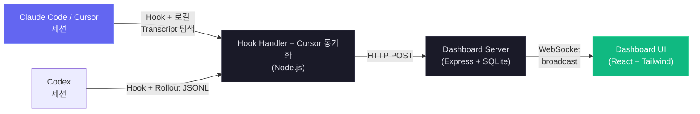

실시간 모니터링 대시보드 외에도, `mcp/`에 대시보드 자체를 조사하고 관리하기 위한 도구 카탈로그를 노출하는 로컬 MCP 서버 구현이 포함되어 있어 대시보드 작업을 Claude Code & Codex 워크플로에 직접 통합하기 쉽습니다. 또한 대시보드 상호작용, 분석, 워크플로 인텔리전스를 위한 Claude Code & Codex 플러그인, 스킬, 서브에이전트를 제공하는 에이전트 확장 레이어도 있습니다.

### 국제화 (i18n)

UI에는 영어(`en`), 중국어(`zh`), 베트남어(`vi`), 한국어(`ko`), 스페인어(`es`)를 위한 내장 로케일 전환 기능이 탑재되어 있습니다. 언어 선택기는 향후 언어가 추가되어도 사이드바가 혼잡해지지 않도록 맞춤 드롭다운으로 제공됩니다. 언어 리소스는 네임스페이스별로 로드되며, 새로고침 후에도 사용자 선호가 안정적으로 유지되도록 브라우저 스토리지를 통해 저장됩니다.

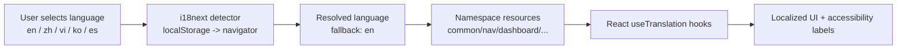

전체 아키텍처와 운영 가이드는 [docs/I18N.md](./docs/I18N.md)를 참조하세요.

### 사용자 인터페이스

반응형 다크 인터페이스는 저장소 페이지를 스크린샷으로 가득 채우지 않으면서 전체 작업 흐름을 보여줍니다. 미리보기를 클릭하면 원본 해상도로 볼 수 있습니다.

<p align="center">
  <a href="images/dashboard.png"></a>
  <br>
  <em>📡 <strong>Dashboard</strong> · 전체 합계, 활성 Agent, 최근 활동, 실시간 상태 신호</em>
</p>

<p align="center">
  <a href="images/board.png"></a>
  <br>
  <em>📋 <strong>Kanban Board</strong> · 명확한 대기 사유와 함께 작업 중, 대기 중, 완료, 실패 Agent 표시</em>
</p>

<p align="center">
  <a href="images/session-conversation.png"></a>
  <br>
  <em>💬 <strong>Conversation</strong> · 렌더링된 트랜스크립트, 코드, 도구 호출, 명령 출력, 세션 마커</em>
</p>

<p align="center">
  <a href="images/analytics.png"></a>
  <br>
  <em>📊 <strong>Analytics</strong> · 모델 토큰, 도구 빈도, 활동 히트맵, 세션 추세</em>
</p>

<p align="center">
  <a href="images/workflows.png"></a>
  <br>
  <em>🔀 <strong>Workflows</strong> · 오케스트레이션 그래프, 도구 흐름, 협업, 위임, 동적 실행</em>
</p>

<p align="center">
  <a href="images/config.png"></a>
  <br>
  <em>🧰 <strong>Agent Config</strong> · 지원되는 Claude Code 및 Codex 구성을 검사하고 안전하게 편집</em>
</p>

<p align="center">
  <a href="images/run.png"></a>
  <br>
  <em>▶️ <strong>Run Agent</strong> · Claude Code 또는 Codex 세션을 시작하고 스트리밍, 재개, 재연결</em>
</p>

<p align="center">
  <a href="images/settings.png"></a>
  <br>
  <em>⚙️ <strong>Settings</strong> · 가격, Hook, 알림, 데이터, 원격 소스, 알림 규칙, 시스템 상태</em>
</p>

사이드바는 Dashboard, Kanban Board, Sessions, Activity Feed, Analytics, Workflows, Agent Config, Run Agent, Settings로 이동합니다. 아래 섹션에서 이 대표 보기 8개의 전체 동작을 설명합니다.

---

## 기능

대시보드는 로컬 Agent의 전체 라이프사이클을 다룹니다. 세부 운영 계약은 연결된 섹션과 `docs/` 참조 문서에 유지됩니다.

| 기능 | 요약 |
| --- | --- |
| **작업 진행률** | Claude 작업 도구, 레거시 `TodoWrite`, Codex `update_plan`에서 소유자를 인식하는 진행률을 생성합니다. 카드와 행에는 간단한 미리보기가 표시되고, Session Detail에는 상태 구간, 활성 작업, 소유자, 10개 행 단위 페이지가 추가됩니다. 새 최상위 작업은 이전의 미완료 상태를 지우고, 완료 기록은 유지합니다. |
| **Dashboard** | 저장되는 **Monitor**와 **Health** 탭이 전체 합계, 활성 계층, 최근 활동, 가중 성공률/캐시/오류/힙 상태, 스토리지, 도구, 모델, Subagent 효과, 컴팩션 지표를 결합합니다. Health는 `/api/settings/info`와 `/api/workflows`에서 5초마다 새로 고칩니다. |
| **Kanban Board** | Agent 열은 Working, Waiting, Completed, Error를, 세션 열은 Active와 Abandoned를 추가로 다룹니다. 카드는 10개씩 표시하고 활성 WebSocket 보기만 구독하며, 전체 제목을 보존하고 권한 입력, 턴 완료, 프롬프트 대기, 중단 같은 대기 사유를 설명합니다. |
| **Sessions** | 보이는 페이지만 비용을 계산하는 검색, 필터, 서버 페이지네이션 히스토리와 메모리 내 임시 Codex 시작 행을 제공합니다. 검색은 300 ms 디바운스로 `id`, `name`, `cwd`를 대상으로 합니다. 이름은 명시적 제목, AI 제목, 첫 의미 있는 사용자 프롬프트 순으로 결정됩니다. |
| **Session Detail** | 실시간 통계, 활성 작업, 도구 사용량, Subagent, 토큰, 계층, 필터링된 이벤트 타임라인, `tool_use_id` 그룹화, 도구별 렌더러를 제공합니다. Conversation 보기는 대기 중인 턴, 시스템 알림, Markdown, 구문 강조 코드, 스타일이 적용된 도구를 렌더링하고, 대기 배너에는 사유와 경과 시간을 표시합니다. |
| **Activity Feed** | 공유 필터, 서버 페이지네이션, 그룹화, 프로젝트/세션/Subagent 출처, 세션 링크, 일관된 Claude/Codex 상태 배지를 갖춘 일시 정지 가능한 실시간 이벤트를 제공합니다. |
| **Analytics** | 모델 토큰, 도구 빈도, 일요일 기준 활동 히트맵, 세션 추세, 연결 상태, 레이아웃에 맞는 로딩 스켈레톤, 긴 범례의 페이지네이션을 다룹니다. |
| **Command Palette** | `Cmd/Ctrl+K`로 최근 명령, 모든 경로, 실시간 서버 세션, 페이지 작업, 프로젝트 디렉터리, 하위 보기, 필터, Settings, Agent Config, 기본 설정, 범위, 언어를 검색합니다. 부분 수열 순위, `>`/`@`/`#` 범위, 전체 키보드 제어, 번역된 레이블, 조용한 검색 실패, 파괴적 작업에 대한 탐색 전용 처리를 지원합니다. |
| **One Shortcut** | `Cmd/Ctrl+K`는 입력 필드 안을 포함한 대시보드 전체의 유일한 전역 조합입니다. 여러 키 탐색을 제거해 숨은 모드를 피하고, Tabby는 `Cmd/Ctrl+B`를 유지합니다. |
| **Live Updates** | WebSocket push로 polling 없이 인터페이스를 업데이트합니다. |
| **Auto-Discovery** | provider 신호로 세션과 Agent를 자동 생성합니다. Claude는 `SessionStart`에 나타나고, Codex는 영구 ID가 생기기 전 로컬 임시 Waiting 카드를 표시하며, 재개된 완료 스레드를 안전하게 인수합니다. ID 생성 전 카드는 영구 합계, 분석, 알림 규칙, 알림에 기록하지 않습니다. |
| **History Import** | `~/.claude/`의 Claude 트랜스크립트와 `~/.codex/sessions`의 Codex rollout은 provider별 스캔과 업로드 흐름, 공유 실시간 수집 계산, 멱등 쓰기를 사용합니다. 외부 Codex rollout은 스냅샷으로 보존되어 원본이 사라져도 대화가 남습니다. |
| **Subagent Hierarchy** | Dashboard와 Session Detail의 접을 수 있는 부모-자식 트리는 자식이 활성인 동안 자동으로 펼쳐집니다. |
| **Background Agents** | 백그라운드 Subagent를 조기 완료 처리하지 않고 계속 추적합니다. |
| **Subagent Tool Attribution** | `SubagentStop`과 시작 스캔이 Subagent별 JSONL 도구를 가져오고, `tool_use_id`로 결과를 연결하며, 중복을 제거하고, 30초 이내의 일치하는 실시간 행을 병합하고, 생성된 자식 ID에서 실제 중첩 부모를 재구성합니다. 재부모화는 추가 방식이며 행이 삽입되지 않아도 UI 새로 고침을 유발합니다. |
| **Cost Tracking** | 모델별, 세션별 설정 가능한 가격은 날짜가 있는 초기 요율, 편집 가능한 프로모션 범주, 각 Subagent의 자체 비용, 컴팩션에 안전한 합계를 지원합니다. 트랜스크립트는 캐시된 증분 바이트 오프셋으로 읽습니다. |
| **Transcript Cache** | 증분 JSONL 파싱은 토큰, 컴팩션, API 오류, 턴 소요 시간, thinking, usage 메타데이터를 추출합니다. 전체 파싱은 레거시 중복을 복구하고 tail 파싱은 append-only로 유지합니다. 배열은 `TRANSCRIPT_CACHE_MAX_ARRAY_LEN`, 기본값 `1000`으로 제한되며 항목은 파일 메타데이터와 파싱 결과만 저장합니다. |
| **Transcript Snapshot Retention** | 영구 Claude, Codex, Cursor 스냅샷은 가장 완전한 대화를 보존합니다. 소스가 없는 Claude와 Cursor 복사본은 왕복 검증 후 gzip 처리되고, purge는 스냅샷을 제거하며, 선택적 연령과 크기 제한은 Settings 드라이런 미리보기 후 유일한 오래된 복사본을 정리할 수 있습니다. |
| **Notifications** | VAPID Web Push는 백그라운드 또는 브라우저가 닫힌 상태에서도 설정된 이벤트를 전달하며, macOS 오디오 지원과 구독 제어를 제공합니다. |
| **Alerts** | Settings에서 이벤트 패턴, 비활성, 멈춘 Agent, 토큰 알림을 위한 Rules, Channels, Activity를 제공합니다. 이벤트 규칙은 수집 후 실행되고 시간 규칙은 60초마다 검사됩니다. 저장된 알림은 규칙/세션별 쿨다운, 기본 300초, WebSocket 전달, 확인, 14개 provider 또는 비밀값 마스킹, 타임아웃, 제한된 재시도가 있는 범용 서명 JSON으로의 범위 지정 Webhook fan-out을 사용합니다. |
| **Update Notifier** | 차단하지 않는 예약 `git fetch`가 checkout을 canonical remote와 비교한 뒤 modal, sidebar, terminal에 정확한 업데이트 명령을 표시합니다. CCAM은 스스로 pull하거나 재시작하지 않습니다. |
| **Settings** | 시스템과 Hook 상태, provider별 가격, 알림, 정리, provider home, 즉시 데이터 새로 고침, 최대 25 MiB의 export JSON 멱등 복원을 제공합니다. 가격은 provider 범위 기본값, wildcard 규칙, 공개 요율 안내, 272K GPT 경계, 별도의 Cursor native 및 third-party catalog를 지원합니다. |
| **Run Agent + Agent Config** | `/run`은 provider별 모델, 승인, sandboxing, 재개, 정지, stream, 재연결을 갖춘 Claude Code 또는 native Codex app-server thread를 시작합니다. `/cc-config`는 편집 가능한 Claude와 Codex 탐색기를 함께 제공하며, 지원되는 사용자 파일에는 보호된 원자적 저장과 타임스탬프 백업, 비밀값이 제거된 미리보기, 정확한 profile 명령, provider별 watcher를 적용합니다. |
| **Codex Agent Config** | 기본/profile override와 함께 전체 계정 모델 catalog를 표시하고, 표준 `<name>.config.toml` overlay를 만들며, canonical containment와 symlink 검사로 편집을 보호합니다. Profile, Hook, 규칙, 스킬, 지침은 source/path/edit/delete 작업과 backup-first deletion을 지원하고, `config.toml`은 edit-only입니다. |
| **MCP Server (Local)** | stdio, HTTP+SSE, REPL의 세 transport가 16개 module에서 103개의 typed tool을 노출합니다. 하나의 검증된 catalog가 localhost 또는 HTTPS target, bearer-token 규칙, redirect 거부, mutation gate, 파일당 50 MiB, 호출당 100 MiB upload, 10 MiB binary response, 25 MiB restore를 강제합니다. |
| **Workflows** | 11개의 D3 섹션이 orchestration, tool flow, collaboration, effectiveness, patterns, delegation, errors, concurrency, complexity, compaction, session drill-in을 다룹니다. 현지화된 설명 tooltip, cross-filtering, JSON export, 3초 debounce 실시간 새로 고침, journal에서 재구성된 dynamic run이 Agent별 phase, token, tool, duration, prompt, result 정보를 보존합니다. |
| **Compaction Tracking** | 트랜스크립트 스캔은 duration이 0인 compaction Agent와 event를 만들고, 레거시 음수 duration을 복구하며, 이전 세션을 backfill하고, 캐시된 `sessions.transcript_path` 값으로 활성 세션만 주기적으로 검사합니다. |
| **Subsessions/Resumed Sessions** | 새 이벤트는 재개되었거나 orphaned 상태인 세션을 다시 활성화합니다. `DASHBOARD_STALE_MINUTES`의 1/4 주기로, 60초에서 5분 사이로 제한된 sweep가 abandoned 세션을 찾습니다. |
| **Pre-Existing Session Detection** | 시작 가져오기는 최근 수정된 트랜스크립트를 active로 표시하고, 이후 Stop 이벤트는 가져온 completed 또는 abandoned 세션을 업데이트하기 전에 다시 활성화합니다. |
| **Continuous Project Sync** | 즉시 시작 sweep, debounce filesystem watcher, 기본 30초인 `DASHBOARD_SESSION_SYNC_MS` poll이 mtime cache와 coalesced scan을 공유합니다. 새로 생겼거나 진행된 파일만 다시 파싱하며, Linux에 안전한 watcher 범위와 실시간 session broadcast를 사용합니다. |
| **Remote Data Sources** | SSH source는 `scp` 또는 WSL `tar`를 통해 Claude와 Codex home을 독립적으로 mirror하고, `sessions.source`를 tag하며, lifecycle을 조정하고, 두 provider 중 하나라도 작동하면 healthy 상태를 유지합니다. Polling 기본값은 15초이며 stale fallback은 실패한 provider에만 적용됩니다. 인증 정보는 host SSH에 남습니다. |
| **Remote Push Ingestion** | `POST /api/hooks/ingest-batch`는 NAT 뒤의 machine을 지원합니다. `REMOTE_PUSH_TOKEN`이 설정될 때까지 비활성 상태를 유지하고, query-string token과 locally owned session을 거부하며, batch를 1000개로 제한하고, `(session_id, event_type, uuid)`를 중복 제거하며, 항목별 partial error를 반환하고, commit 후에만 broadcast합니다. |
| **Responsive Design** | 모바일 레이아웃은 grid를 쌓고, 넓은 table을 scroll하며, navigation을 접습니다. |
| **UI Localization** | 영어, 중국어, 베트남어, 한국어, 스페인어는 UI copy, accessibility label, workflow 설명과 tooltip, model-pricing 안내, provider home, Import History를 다룹니다. |
| **Seed Data** | 내장 script가 실제적인 demo 및 development data를 제공합니다. |
| **Statusline** | 컬러 CLI strip이 model, context, Git branch, 방향별 token, USD session cost를 표시합니다. |
| **Model Name Formatting** | Claude, GPT, Gemini identifier에서 provider/date/latest suffix를 제거하고, numeric version을 연결하고, context tag를 형식화해 읽기 쉬운 이름을 만듭니다. Settings에는 raw pricing pattern이 유지됩니다. |
| **Claude + Codex Plugin Marketplace** | 하나의 14-plugin tree가 두 manifest 형식과 catalog, 66 plugin skill, 18 Claude Subagent, 34 Claude command, 3 CLI helper, OpenAI metadata를 제공합니다. `npx skills add hoangsonww/Claude-Code-Agent-Monitor --list`는 77 repository skill을 찾습니다. |
| **Run Claude** | Conversation과 one-shot mode는 resume/view history, 동시 background run, transcript-aware reattach, model/effort/permission/cwd 제어, partial-message smoothing, thinking 보존, slash command, `@` file, context와 cost meter, live status를 지원합니다. Same-origin 보호는 drive-by spawning을 차단하고, concurrency는 기본 10000 safety ceiling이며 `RUN_MAX_CONCURRENT`로 낮출 수 있습니다. |
| **Claude Config Explorer** | 12개 탭이 skills, agents, commands, styles, plugins, marketplaces, MCP, hooks, settings, memory, keybindings, statusline을 검사합니다. Canonical path는 symlink escape를 차단하고, 지원되는 text surface는 tree 밖 timestamp backup과 atomic create/edit/delete를 사용하며, 민감한 구성은 정확한 CLI 안내와 함께 read-only로 유지됩니다. 500 ms `cc-watcher`가 외부 변경을 broadcast합니다. |
| **Tabby** | 의존성 없는 WebSocket mascot이 활동에서 파생된 8가지 mood, 제한된 speech, quick action, local status answer, 더 넓은 prompt를 위한 Run Claude handoff를 제공합니다. Keyboard accessible, reduced-motion aware, disconnected 상태에서도 안전하며 설정 가능하고 현지화됩니다. |
| **Sound Cues** | 의존성 없는 7개의 Web Audio cue가 session, error, Subagent, notification, connection, click을 다룹니다. Cooldown, global burst budget, low-pass filtering, autoplay safety, 저장된 volume, cue별 settings로 방해를 줄입니다. |
| **Progressive Web App (PWA)** | Dashboard, landing page, Wiki는 각각 독립된 manifest와 service worker를 사용합니다. 불변 Vite asset은 cache-first, navigation과 변경 가능한 shell file은 network-first입니다. Push는 유지되고, landing page와 Wiki는 shell을 precache하고 screenshot을 lazy-cache하며, SVG와 Apple metadata가 설치를 지원합니다. |
| **Desktop App (macOS & Windows)** | Electron 35가 동일한 in-process Express server와 React client를 macOS DMG, Windows installer/portable EXE로 package합니다. Native menu, tray status/action, login launch, quit confirmation, native notification, single-instance lock, 안전한 port fallback/adoption, 깔끔한 SQLite shutdown, 첫 실행 Hook/background setup을 추가합니다. |
| **Self-hosted assets (no CDN)** | Font, script, Wiki Mermaid, extension fallback은 로컬입니다. App, landing page, Wiki는 Google Fonts, jsDelivr 또는 다른 third-party asset request 없이 offline으로 작동합니다. |
| **Session splash screen** | 현지화된 browser session당 1회의 greeting과 node-graph animation이 first paint부터 불투명하게 나타나 약 2.5초 동안 유지됩니다. Click-to-skip을 지원하고 reduced motion을 준수합니다. |

> **Provider 범위와 home:** Settings는 Claude 호환(Claude Code + Cursor) / Codex / Both 선택을 앱 전체에서 일관되게 유지합니다. Claude Code와 Codex home은 대시보드를 재시작하지 않고 편집할 수 있으며, Cursor는 `~/.cursor` 또는 `DASHBOARD_CURSOR_HOME`에서 자동으로 검색됩니다.
>
> **로컬 안전 경계:** Run Agent는 존재하는 모든 절대 작업 디렉터리를 허용하고 사용 전에 경로를 canonicalize하므로 home과 최근 프로젝트 실행을 계속 지원합니다. Hosted webhook provider는 HTTPS가 필요합니다. Generic과 n8n target은 로컬 또는 self-hosted receiver에 HTTP를 사용할 수 있으며, 전달은 redirect를 따르지 않습니다.

---

## 빠른 시작

### 사전 요구 사항

- **Node.js** >= 22.22.0 (Node 24 LTS 권장)
- **npm** >= 9.0.0

### 1. 설치

```bash
git clone https://github.com/hoangsonww/Claude-Code-Agent-Monitor.git
cd Claude-Code-Agent-Monitor
npm run setup
```

### 2. Claude Code Hook 구성

```bash
npm run install-hooks
```

화살표 키, Space, Enter로 **Claude Code**, **Codex (beta)** 또는 둘 다를 선택하세요. Claude Hook은 `~/.claude/settings.json`에, Codex Hook은 `~/.codex/hooks.json`에 저장됩니다. 다시 설치하면 CCAM 항목만 교체하고 관련 없는 Hook은 보존합니다. 같은 작업을 **Settings → Hook Configuration**에서도 실행할 수 있습니다.

처음 실행할 때 CCAM은 현재 데이터 범위에서 선택한 provider만 확인하고 누락된 Hook 설치를 제안합니다. 준비 상태 확인에 실패하면 대시보드를 차단하지 않고 수동 설정으로 전환합니다.

설정 후에도 provider 검색은 계속됩니다.

- **Claude Code and Cursor:** Claude Hook이 실시간 이벤트를 전달합니다. Cursor는 Hook이 필요 없습니다. Claude Code를 선택하면 `~/.cursor/chats`와 `~/.cursor/projects/*/agent-transcripts`도 감시하고, Cursor 정리 전에 대화를 스냅샷으로 저장하며, `DASHBOARD_CURSOR_HOME`을 따릅니다.
- **Codex:** Hook과 증분 `~/.codex/sessions` rollout 감시가 라이프사이클, 프롬프트, 제목, 도구, 토큰, 비용, 컴팩션, 대화, WebSocket 상태를 최신으로 유지합니다. 잘못된 파일은 독립적으로 다시 시도하고, 정확한 rollout/process 매칭으로 유령 활성 카드를 방지하며, native `/rename` 제목과 cursor 페이지네이션 대화 히스토리를 실시간으로 유지합니다.
- **Both:** 카드는 서로 다른 최근 사용자 프롬프트 2개를 유지하고, 저장된 이미지 첨부 파일을 렌더링하며, 반복된 Codex 응답을 중복 제거합니다. Codex-only 범위에서는 Claude-only Dynamic Workflow journal을 숨깁니다.

### 3. 시작

```bash
# 개발 (서버와 클라이언트 모두 핫 리로드)
npm run dev

# 프로덕션 (단일 프로세스, 빌드된 클라이언트)
npm run build && npm start
```

> [!TIP]
> **Makefile 대안** — 시스템에 `make`가 설치되어 있다면 모든 명령을 `make`로도 사용할 수 있습니다. `make help`를 실행하여 모든 타깃을 확인하거나 `make dev`, `make build`, `make test` 등의 단축 명령을 사용하세요.

### 4. 열기

| 모드        | URL                     |
| ----------- | ----------------------- |
| 개발        | `http://localhost:5173` |
| 프로덕션    | `http://localhost:4820` |

### 5. 선택 사항: 로컬 MCP 서버 빌드 및 실행

```bash
npm run mcp:start              # stdio (기본값 — MCP 호스트 통합용)
npm run mcp:start:http         # 포트 8819의 HTTP + SSE 서버
npm run mcp:start:repl         # 탭 완성이 있는 인터랙티브 CLI
ccam mcp stdio                 # 번들 플러그인이 사용하는 안정적인 런처
```

stdio 모드의 경우 MCP 호스트(Claude Code / Claude Desktop / 기타 MCP 클라이언트)를 구성하세요:

- command: `ccam`
- args: `["mcp", "stdio"]`

HTTP 모드의 경우 원격 MCP 클라이언트를 `http://127.0.0.1:8819/mcp`(Streamable HTTP) 또는 `http://127.0.0.1:8819/sse`(레거시 SSE)로 연결하세요.

전체 호스트 구성, 전송 상세, 안전 플래그, 도구 카탈로그는 [mcp/README.md](./mcp/README.md)를 참조하세요.

### 선택 사항: 데모 데이터 시드

```bash
npm run seed
```

8개의 샘플 세션, 23개의 에이전트, 106개의 이벤트를 생성하여 UI를 즉시 탐색할 수 있습니다.

### 대안: 데스크톱 앱 (macOS & Windows)

터미널을 계속 열어 두고 싶지 않다면 선택적 **네이티브 데스크톱 앱**을 설치하세요. 서버를 인프로세스로 임베드하고, 메뉴 바 / 알림 영역(트레이) 아이콘을 추가하며, 로그인 시 자동 시작(macOS 로그인 항목 / Windows 시작 프로그램)을 지원합니다.

가장 빠른 방법은 [최신 GitHub Release](https://github.com/hoangsonww/Claude-Code-Agent-Monitor/releases/latest)에서 **미리 빌드된 설치 파일을 다운로드**하는 것입니다(`master`에서 `package.json` 버전이 올라갈 때마다 CI가 `vX.Y.Z`를 자동 게시합니다):

- **macOS** — `ClaudeCodeMonitor-<version>-arm64.dmg`(Apple Silicon) 또는 `-x64.dmg`(Intel)를 받아 **Claude Code Monitor.app**을 `/Applications`로 드래그하세요.
- **Windows** — `ClaudeCodeMonitor-Setup-<version>-x64.exe`(설치 관리자) 또는 `ClaudeCodeMonitor-<version>-x64-portable.exe`(무설치)를 받아 실행하세요.

대신 직접 빌드하려면:

```bash
npm run desktop:install        # Electron + electron-builder를 desktop/에 설치 (네이티브 의존성 사전 점검; 실패 시 설정 도움말 출력)
npm run desktop:dmg:arm64      # macOS: 빠른 단일 아키텍처 DMG (Apple Silicon)
npm run desktop:win            # Windows: NSIS 설치 관리자 .exe (Windows에서 실행)
```

데스크톱 앱의 전체 내용 — 다운로드, 설치, 트레이/메뉴 기능, 빌드 명령, 서명 — 은 아래의 [데스크톱 앱 (macOS & Windows)](#데스크톱-앱-macos--windows) 섹션에 있습니다. [`DESKTOP.md`](./DESKTOP.md)(사용자 가이드)와 [`desktop/README.md`](./desktop/README.md)(아키텍처)도 참조하세요.

### 대안: Docker / Podman

OCI image는 non-root로 실행되고 모든 capability를 drop하며 Tini를 PID 1로 사용하고 Git, OpenSSH, SQLite를 포함합니다. Docker Compose와 Podman Compose는 같은 파일을 사용합니다.

```bash
# Dashboard만
docker compose up -d --build
# 또는
podman compose up -d --build

# 전체 인증 스택
umask 077
openssl rand -hex 32 > deployments/secrets/dashboard-token
openssl rand -hex 32 > deployments/secrets/hook-token
openssl rand -hex 32 > deployments/secrets/mcp-token
openssl rand -base64 32 > deployments/secrets/grafana-admin-password
npm run docker:full:up
```

Host port는 기본적으로 loopback에만 bind됩니다: Dashboard `4820`, MCP `8819`, Nginx `8080`, Prometheus `9090`, Grafana `3000`. Claude/Codex home은 read-only mount이고 named volume이 SQLite와 dashboard-owned config를 보존합니다. Nginx는 UI, 인증된 REST, WebSocket을 proxy하지만 Hook, metrics, MCP는 기본적으로 edge에서 차단합니다.

> [!IMPORTANT]
> Hook은 host에서 설치하십시오. Remote Hook은 `CCAM_DASHBOARD_URL=https://...`와 `CCAM_HOOK_TOKEN`을 사용하며 non-loopback URL은 HTTPS가 필수입니다. [DEPLOYMENT.md](DEPLOYMENT.md)를 참조하십시오.

---

## 동작 방식

대시보드는 Claude Code의 네이티브 Hook 시스템을 통해 통합되어 에이전트 활동의 실시간 모니터링을 제공합니다. 다음은 아키텍처와 데이터 흐름에 대한 개요입니다:

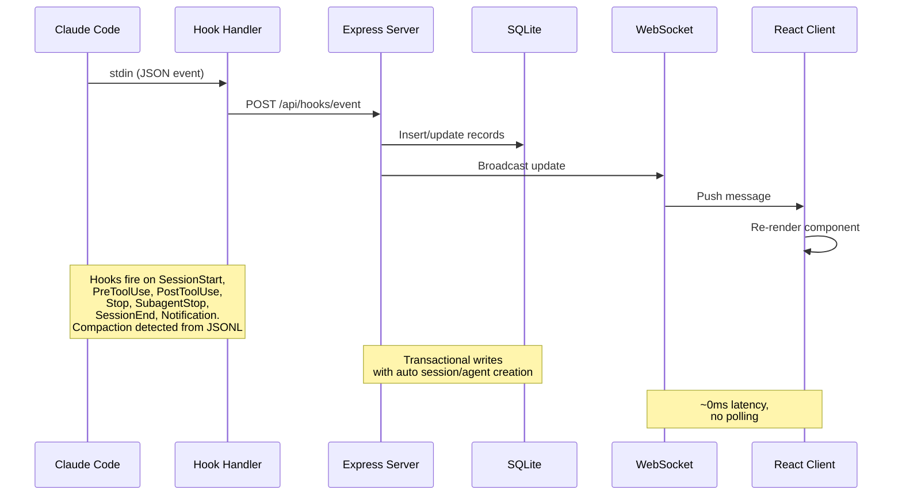

> [!IMPORTANT]
> 서버 아키텍처, 데이터베이스 스키마, API 라우트, WebSocket 설계, 클라이언트 라우팅, Hook 핸들러 흐름, 배포 모드, 그리고 세션과 에이전트의 상세 라이프사이클 다이어그램에 대한 심층 설명은 [ARCHITECTURE.md](./ARCHITECTURE.md)를 참조하십시오.

### Hook 라이프사이클

1. **Claude Code**가 세션, 프롬프트, 도구, 알림, Subagent, 턴, 종료 Hook을 발생시킵니다.
2. **`scripts/hook-handler.js`**가 stdin에서 각 이벤트를 읽고 `~/.claude/.agent-dashboard.json` 또는 `CLAUDE_DASHBOARD_PORT`를 통해 실행 중인 대시보드를 찾습니다. 고유한 SQLite 데이터 디렉터리마다 한 번 전송하고, 중복 listener에서는 가장 낮은 port를 선택하면서 별도 database를 사용하는 대시보드에는 계속 전달합니다. 각 target은 격리되며 handler는 5초 이내에 종료되어 안전하게 실패합니다.
3. **서버**가 이벤트와 관련 상태를 하나의 SQLite transaction으로 commit합니다.
   - 첫 접촉에서 세션과 main Agent를 만듭니다. `SessionStart`는 **Waiting**으로 시작하고, `UserPromptSubmit` 또는 `PreToolUse`가 **Working**으로 전환하며, `PostToolUse`는 working 상태를 유지합니다.
   - `Stop`은 background Agent를 계속 실행하면서 main Agent를 **Waiting**으로 되돌립니다. `stop_reason=error`는 Agent와 세션을 **Error**로 표시합니다. 권한 알림도 입력을 기다리며, 새 프롬프트나 도구 시작만 오류를 복구합니다.
   - `SubagentStop`은 사용자의 대기 상태를 바꾸지 않고 해당 자식을 완료합니다. 분리된 스캔이 JSONL 도구를 가져와 `tool_use_id`로 use/result를 연결하고, 중복을 제거하며, 실제 중첩 부모를 재구성합니다.
   - `SessionEnd`는 대기를 해제하고 보존해야 할 오류가 없으면 세션을 완료합니다. 새 작업은 가져왔거나 재개된 세션을 포함해 completed, errored, abandoned 세션을 다시 활성화합니다.
   - `SessionStart`와 주기적 유지 관리가 `DASHBOARD_STALE_MINUTES`, 기본값 180 이후 비활성 세션을 abandoned로 표시합니다. Sweep은 해당 값의 1/4 주기로 실행되며 60초에서 5분 사이로 제한됩니다.
   - 공유 증분 트랜스크립트 파싱은 변경되지 않은 바이트를 다시 읽지 않고 컴팩션, API와 도구 오류, 턴 소요 시간, 토큰, 메타데이터를 기록합니다. 활성 세션 sweep은 indexed `sessions.transcript_path` 값을 사용하고 abandoned cache 항목을 제거합니다.
   - 15초 watchdog은 Hook이 10초 동안 없는 경우 트랜스크립트 API 오류를 찾습니다. 트랜스크립트 마커에서 Esc 중단도 복구하고, 마커가 없으면 도구가 실행 중이지 않고 Hook과 트랜스크립트가 모두 진행하지 않을 때만 `DASHBOARD_WORKING_IDLE_SECONDS`, 기본값 120 이후 복구합니다.
   - 같은 watchdog은 `DASHBOARD_LIVENESS_IDLE_SECONDS`, 기본값 60 이후 process-liveness probe로 종료된 local session을 완료합니다. 시작 probe는 즉시 실행되고 약 5초 후 이 idle gate 없이 다시 실행됩니다. Probe는 Windows, container, non-POSIX forwarded path, remote-source session, tool failure, `DASHBOARD_LIVENESS_PROBE=0`에서 건너뛰며, 이후 실제 Hook이 잘못된 완료를 자동 복구합니다.
   - 지속적 프로젝트 동기화는 즉시 sweep, debounce `fs.watch`, 기본값 30초인 `DASHBOARD_SESSION_SYNC_MS` polling을 결합합니다. 하나의 mtime cache가 새 트랜스크립트나 커진 트랜스크립트만 다시 파싱하고 Hook과 같은 세션 frame을 broadcast합니다.
4. **WebSocket**이 commit된 변경을 게시합니다.
5. **UI**가 polling 없이 영향을 받는 보기를 새로 고칩니다.

### 에이전트 상태 머신

영속화되는 상태: `working | waiting | completed | error`.
`awaiting_input_since` 컬럼은 보조적인 것입니다 — 에이전트가 언제
대기를 시작했는지 추적하며 지속 시간 표시에 사용되지만, `waiting`은
이제 실제로 영속화되는 상태입니다.

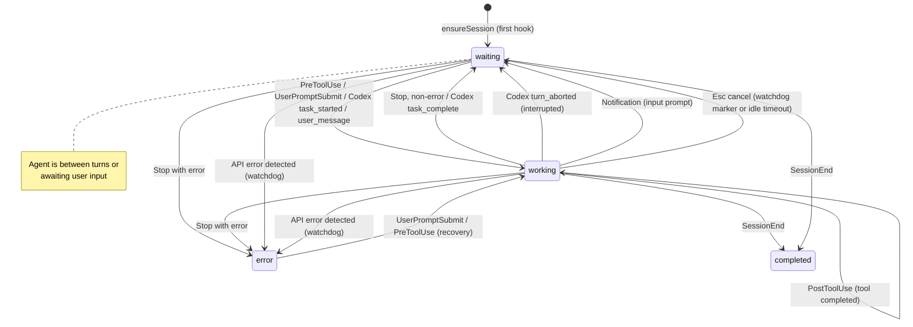

### 세션 상태 머신

영속화되는 상태: `active | completed | error | abandoned`.
**Waiting** 세션 상태는 UI 오버레이입니다(status=`active`에
`awaiting_input_since`가 설정된 상태).

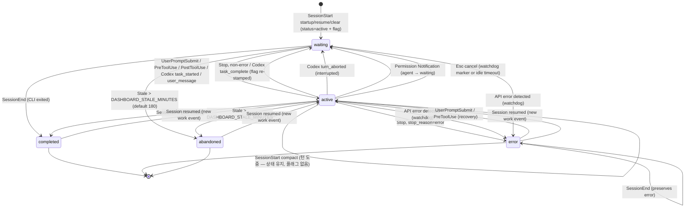

### 비용 계산 흐름

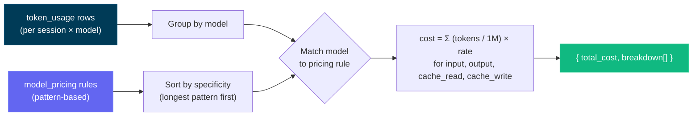

> [!IMPORTANT]
> 비용 계산 흐름은 토큰 사용량과 모델 가격 책정 규칙을 기반으로 합니다. 정확한 비용을 반영하도록 가격 책정 규칙을 최신 상태로 유지하십시오. 정확한 비용 추적을 유지하려면 설정 페이지를 통해 모델 가격 책정 테이블을 업데이트하십시오 — 대시보드는 외부 소스에서 가격 업데이트를 자동으로 가져오지 않습니다. 가격 책정 규칙을 설정하면, 대시보드는 일관된 비용 보고를 위해 모든 세션에 이를 소급 적용합니다.

---

## 설정

| 환경 변수 | 기본값 | 목적 |
| --- | --- | --- |
| `DASHBOARD_PORT` | `4820` | Express server port. |
| `CLAUDE_DASHBOARD_PORT` | `4820` | Hook handler가 사용하는 port. |
| `NODE_ENV` | `development` | 빌드된 client를 제공하려면 `production`을 사용합니다. |
| `DASHBOARD_UPDATE_CHECK` | 활성화 | 예약 upstream 확인을 끄려면 `0`, `false`, `off`로 설정합니다. |
| `DASHBOARD_UPDATE_CHECK_INTERVAL_MS` | `300000` | 업데이트 간격이며 최솟값은 60,000 ms입니다. 수동 **Check now**는 계속 사용할 수 있습니다. |
| `DASHBOARD_STALE_MINUTES` | `180` | active 또는 Waiting 세션이 abandoned가 되기 전 비활성 시간입니다. Watchdog이 적용하고 유지 관리는 이 값의 1/4 주기로 실행되며 60초에서 5분 사이로 제한됩니다. |
| `DASHBOARD_WORKING_IDLE_SECONDS` | `120` | 도구, Hook, 트랜스크립트 활동이 진행하지 않을 때 마커 없는 Esc 취소를 복구합니다. 값을 낮추면 더 빨리 반응하지만 긴 무음 턴을 잠시 잘못 분류할 수 있으며, 새 활동이 자동 복구합니다. Cursor도 같은 규칙을 사용합니다. |
| `DASHBOARD_LIVENESS_PROBE` | `1` | 종료된 local Claude/Codex 세션의 process 기반 완료를 끄려면 `0`으로 설정합니다. Windows, container, 전달된 non-POSIX path, remote source는 자동으로 건너뜁니다. |
| `DASHBOARD_LIVENESS_IDLE_SECONDS` | `60` | Watchdog liveness 확인을 위한 트랜스크립트 또는 마지막 Hook idle gate입니다. 시작 probe는 이 gate를 무시하므로 이미 종료된 세션을 즉시 정리합니다. |
| `DASHBOARD_SESSION_SYNC_MS` | `30000` | 새로 생기거나 변경된 `~/.claude/projects` 파일을 위한 안전 poll입니다. `fs.watch`는 계속 즉시 작동하며 `0`은 polling만 끕니다. |
| `DASHBOARD_CURSOR_HOME` | `~/.cursor` | Chat, transcript, backfill, durable snapshot을 위한 Cursor 상태 root입니다. |
| `DASHBOARD_CURSOR_SYNC_MS` | `5000` | Fingerprint 기반 Cursor 안전 poll입니다. `0`으로 polling을 꺼도 watcher는 계속 작동합니다. |
| `DASHBOARD_CODEX_HOME` | `CODEX_HOME` 또는 `~/.codex` | Codex 상태 root입니다. Settings에 override를 저장하면 watching을 다시 설정하고 즉시 스캔합니다. |
| `DASHBOARD_CODEX_SYNC_MS` | `4000` | Codex rollout 안전 poll입니다. `0`으로 설정해도 Hook과 watcher는 계속 작동합니다. |
| `DASHBOARD_CODEX_MAX_ATTEMPTS` | `5` | 변경되지 않고 읽을 수 없는 rollout 하나에 대한 시도 횟수이며 첫 시도를 포함합니다. Size나 mtime이 바뀌면 budget이 초기화되고, 모두 소진하면 한 번만 기록합니다. |
| `DASHBOARD_CODEX_HOOK_IDLE_SECONDS` | `60` | 보고된 완료 `stop`이 `SessionEnd`를 받지 못했을 때 `codex exec --ephemeral` 같은 Hook-only Codex 세션을 완료합니다. 침묵만으로는 적용하지 않습니다. |
| `DASHBOARD_TASK_SUMMARY_TTL_MS` | `2000` | Task summary와 `todo_snapshot`의 serve-stale window입니다. Append는 증분 파싱되고 32 MiB 이상 증가하면 새 tail에서 다시 시작합니다. `0`은 append마다 파싱합니다. |
| `DASHBOARD_SNAPSHOT_COMPRESS` | `1` | 원본이 사라지고 24시간 동안 idle 상태인 Claude/Cursor snapshot의 검증된 gzip 변환을 중지하려면 `0`, `false`, `off`로 설정합니다. 읽을 수 없는 source tree와 Codex snapshot은 건너뜁니다. |
| `DASHBOARD_SNAPSHOT_MAX_AGE_DAYS` | 미설정 | 이 기간보다 오래된 종료 세션에 대한 선택적 6시간 retention pass입니다. 정리된 세션은 tombstone 처리되고 재개된 세션은 보호됩니다. Snapshot이 유일한 복사본일 수 있으므로 `ccam snapshots prune --days N`으로 미리 확인하세요. |
| `DASHBOARD_SNAPSHOT_MAX_BYTES` | 미설정 | Byte 또는 `5GB` 같은 단위로 설정하는 선택적 전체 snapshot 제한입니다. 가장 오래된 종료 세션부터 정리하며, active 또는 최근 24시간 세션은 보호됩니다. |
| `DASHBOARD_REMOTE_SYNC_MS` | `15000` | Claude project, Codex rollout, Codex title index를 위한 SSH remote-source poll입니다. 새 source와 다시 활성화된 source는 즉시 동기화하며, `0`은 수동 동기화를 남겨 둡니다. |
| `DASHBOARD_REMOTE_ACTIVE_WINDOW_MS` | `600000` | mirror된 remote transcript의 최신 이벤트가 이 시간 안에 있으면 active로 처리하고 이후 completed로 조정합니다. 실패한 provider는 일반 stale 처리로 전환합니다. |
| `DASHBOARD_REMOTE_SYNC_TIMEOUT_MS` | `600000` | SSH pull과 import를 합친 source별 timeout입니다. |
| `DASHBOARD_REMOTE_TEST_TIMEOUT_MS` | `15000` | Remote-source SSH test timeout입니다. |
| `DASHBOARD_HOST` | `127.0.0.1` | Bind interface입니다. `0.0.0.0`은 service를 노출하고 warning을 기록합니다. |
| `DASHBOARD_TOKEN` | 미설정 | Bearer header, `x-dashboard-token` 또는 `?token=`을 통해 `/api/*`와 WebSocket을 보호합니다. Loopback이 기본 trust boundary입니다. |
| `DASHBOARD_TOKEN_FILE` | 미설정 | Docker/Kubernetes secret용 file-backed dashboard token입니다. `DASHBOARD_TOKEN`이 우선합니다. |
| `DASHBOARD_HOOK_TOKEN` / `DASHBOARD_HOOK_TOKEN_FILE` | 미설정 | Loopback 경계를 넘어 `/api/hooks/event`와 `/api/hooks/codex`를 독립적으로 보호합니다. |
| `REMOTE_PUSH_TOKEN` / `REMOTE_PUSH_TOKEN_FILE` | 미설정 | Public `POST /api/hooks/ingest-batch`의 별도 gate입니다. Route는 기본적으로 비활성이고 local Hook token을 상속하지 않습니다. |
| `DASHBOARD_ALLOWED_HOSTS` | loopback | DNS-rebinding guard가 허용하는 추가 HTTP 및 WebSocket `Host` 값을 쉼표로 구분합니다. |
| `DASHBOARD_ENV_PATH` | 저장소 `.env` | Provider-home override를 저장하는 writable dotenv file입니다. Container 기본값은 `/app/config/.env`입니다. |
| `CCAM_DASHBOARD_URL` | localhost 검색 | Remote Hook 목적지입니다. Non-loopback URL에는 HTTPS와 Hook token이 필요합니다. |
| `CCAM_HOOK_TOKEN` / `CCAM_HOOK_TOKEN_FILE` | 미설정 | `x-ccam-hook-token`으로 전송되는 Hook-client credential입니다. |

> [!IMPORTANT]
> 서버는 기본적으로 loopback에만 연결됩니다. LAN 접근에는 `DASHBOARD_HOST`, `DASHBOARD_TOKEN`, 일치하는 `DASHBOARD_ALLOWED_HOSTS` 값이 필요합니다. [`.env.example`](./.env.example)과 [보안 정책](./.github/SECURITY.md)을 참조하세요.

Git clone은 주기적으로 canonical remote를 fetch하고 기본 branch를 현재 checkout과 비교합니다. 뒤처지면 terminal과 UI가 정확한 수동 업데이트 명령을 표시합니다. CCAM은 스스로 pull하거나 재시작하지 않습니다.

---

## `ccam` CLI

**`ccam`** CLI(`bin/ccam.js` → `cli/`)는 상속 옵션, 검증, 제안, 자동 생성 도움말, shell completion을 갖춘 Commander.js 명령 트리로 어떤 terminal에서든 대시보드를 제어합니다. `npm run setup`이 자동으로 링크합니다. Server 탐색은 `--server` / `CCAM_URL`, 설정된 port, live-server registry, `http://127.0.0.1:4820` 순으로 확인합니다.

```bash
# 서버
ccam status | health                  # ● 실행 중 / ○ 실행 안 됨; 버전 + 타임스탬프
ccam start [--port N] | stop | restart  # 백그라운드 프로덕션 서버
ccam logs [-n N] [-f]                 # data/ccam-server.log 보기
ccam open [page] [--session id]       # 대시보드, 페이지 또는 세션 열기
ccam repl                             # 대화형 셸 (별칭: shell, i)

# 모니터링
ccam overview [--watch]               # 한 화면 실시간 스냅샷 (별칭: top)
ccam stats | kanban                   # 합계 + 상태 분포 / 상태 레인
ccam tail [--session id] [--type T] [--tool N]   # 실시간 이벤트 피드
ccam stream [--type new_event,…]      # 원시 실시간 WebSocket 피드
ccam watch -n 5 <command …>           # 임의 명령을 주기적으로 재실행

# 데이터
ccam sessions [--status s] [--q text] [--cwd dir] [--sort price] [--limit n]
ccam sessions get|stats|cost|agents|events|transcripts <id>
ccam sessions transcript <id>         # 대화를 읽기 쉬운 채팅 로그로
ccam sessions rename <id> <name…> | update <id> | create | facets
ccam agents [list|get|update|create]  # 에이전트; ccam session <id> = sessions get
ccam events [--type T] [--tool N] [--q text] [--from iso] | events facets

# 인사이트
ccam analytics                        # 토큰, 비용, 상위 도구, 일별 스파크라인
ccam workflows [session <id>]         # 워크플로 인텔리전스 + 패턴
ccam runs [list|get <run-id>]         # Workflow 도구 실행
ccam run list|history|start|follow|send|stop …   # 대시보드에서 실행한 에이전트
ccam cost [--session id] [--daily]    # 모델별 비용, 부가 요금, 가격 미지정 모델

# 알림 & 웹훅
ccam alerts [--unacked] | ack <id> | ack-all
ccam alert-rules list|types|create|update|enable|disable|delete
ccam webhooks list|get|providers|deliveries|create|update|enable|disable|delete|test

# 가격
ccam pricing [list] | set <pattern> --input N --output N [--fast-* …] [--intro-* …] | delete | reset
ccam pricing gpt|cursor [list|set|delete]   # OpenAI/Codex 및 Cursor 요금표

# 가져오기 & 원격 소스
ccam import guide|rescan|path <dir>|upload <files…>|reimport
ccam import-data <file.json>          # 내보내기 복원 (멱등)
ccam remote-sources list|get|add|update|enable|disable|test|sync|rm

# 관리
ccam doctor | info | export [file|-] | cleanup --hours N --days M
ccam snapshots [status|compress] | snapshots prune --days N   # 트랜스크립트 스냅샷; prune은 --apply --confirm PRUNE_SNAPSHOTS 없이는 드라이런
ccam hooks [status|install] | reinstall-hooks | config claude|codex …
ccam updates [status|check] | update-check | metrics [--grep re]
ccam home [set claude|codex <path>] | push key|send|subscribe|unsubscribe
ccam api [METHOD] /api/path [--data JSON]   # 모든 엔드포인트; 쓰기는 --yes 필요
ccam mcp [stdio|http|repl] | clear-data --yes

# CLI
ccam help [command…] | commands [--json] | completion bash|zsh|fish | version
```

명령 그룹은 기본적으로 목록을 표시하고(`ccam alerts`는 `ccam alerts list`와 같음), 모든 명령은 `--help`를 지원하며, `ccam commands`는 트리를 출력하고 `ccam commands --json`은 기계가 읽을 수 있는 schema를 출력합니다.

- **출력:** TTY에는 table, status icon, chart, sparkline, Agent tree, transcript view, colored help를 표시합니다. Pipe에는 plain text를 출력합니다. `--json` 또는 `CCAM_OUTPUT=json`은 안정적인 JSON을 반환하고, `tail`, `stream`, `run follow`는 NDJSON을 사용합니다. 오류는 stderr에 `{"error":{"code":"…","message":"…"}}`로 출력되며 종료 코드는 `0` 또는 `1`입니다.
- **쓰기:** 대화형 `y/N` 또는 `--yes`를 사용합니다. 비대화형 쓰기에는 `--yes`가 필요하고, `clear-data`는 항상 문자 그대로의 flag가 필요합니다.
- **Offline mode:** 읽기 전용 명령은 `data/dashboard.db`로 전환하고 `⚠ Offline mode` 배너를 표시하며 liveness view를 통해 종료된 active 세션을 보정합니다. Server-only 명령은 대시보드를 사용할 수 없는 이유를 설명합니다.
- **REPL과 completion:** `ccam repl`은 트리 기반 completion, 영구 history, live prompt, `help`, `json`, `watch` 내장 명령을 추가하고 각 줄을 격리된 child process에서 실행합니다. `source <(ccam completion zsh)`로 zsh completion을 켤니다.

`ccam`이 `PATH`에 없다면 저장소 root에서 `npm link`를 한 번 실행하세요. 전체 계약은 [docs/CLI.md](./docs/CLI.md)에서 확인할 수 있습니다.

## npm 스크립트

| 명령어                 | 설명                                                |
| ----------------------- | ---------------------------------------------------------- |
| `npm run setup`         | 루트, 클라이언트, 확장, MCP 의존성을 설치하고 MCP를 빌드한 뒤 `ccam`을 링크합니다 |
| `npm run update:pull-setup` | `git pull --ff-only` 실행 후 `npm run setup` 실행 (수동 업그레이드) |
| `npm run dev`           | 서버(watch 모드) + 클라이언트(Vite HMR)를 동시에 시작합니다 |
| `npm run dev:server`    | 디바운스 및 안전 재시작 소스 감시기로 Express 서버를 시작합니다 |
| `npm run dev:client`    | Vite 개발 서버만 시작합니다                            |
| `npm run build`         | React 클라이언트를 `client/dist/`로 빌드합니다                   |
| `npm start`             | 프로덕션 서버를 시작합니다 (빌드된 클라이언트 제공)              |
| `npm test`              | 전체 테스트 스위트를 실행합니다 (서버 `node --test` + 클라이언트 Vitest)  |
| `npm run test:server`   | 백엔드 테스트를 실행합니다 (`node --test server/__tests__/`)        |
| `npm run test:client`   | 프론트엔드 Vitest 테스트를 실행합니다. **모든 화면에 대한 렌더 스냅샷**(`client/src/pages/__tests__/screens.snapshot.test.tsx`)이 포함되며, 의도된 UI 변경 후에는 `cd client && npx vitest run -u`로 기준선을 재생성합니다 |
| `npm run install-hooks` | `~/.claude/settings.json`에 Claude Code Hook을 구성합니다   |
| `npm run seed`          | 샘플 데이터로 데이터베이스를 채웁니다                           |
| `npm run import-history`| `~/.claude/`에서 레거시 세션을 가져옵니다 (시작 시에도 실행됨) |
| `npm run reconcile-tokens`| 가져온 세션의 토큰 합계를 새로 계산합니다 (기존 합계를 낮추지는 않습니다) |
| `npm run repair-tokens` | 트랜스크립트가 디스크에 남아 있는 모든 **Claude** 세션(`~/.claude/projects/` 또는 세션에 저장된 `transcript_path` 로 탐색)의 **workflow 가 아닌** 토큰 합계를 다시 도출하고 컨텍스트 압축 baseline 을 0으로 만듭니다. workflow 및 Codex 행은 그대로 유지됩니다. v2.0.9 이전의 레코드 단위 usage 합산 또는 누락된 동일 모델의 평면 서브에이전트 usage 영향을 받은 데이터베이스를 위한 일회성 복구입니다. 먼저 대시보드를 중지하세요 |
| `DASHBOARD_TOKEN_REPAIR` | 기본적으로 활성화됩니다(`1`). 레코드 단위 부풀림 또는 누락된 동일 모델의 평면 서브에이전트로 영향을 받은 과거 Token 합계를 일회성으로 자동 복구합니다. 실시간 수정은 완료된 모든 세션을 다시 처리할 수 없고 `replaceTokenUsage` 는 기존 high-water mark 를 낮출 수 없습니다. 데이터베이스당 한 번만 실행되며(마커 기반, 부팅 경로에서 지연, 다른 대시보드가 같은 데이터 디렉터리를 공유하면 건너뜀), 먼저 기존 행을 `token_usage_pre_repair_v2` 로 스냅숏합니다. `0` 으로 설정하면 건너뛰고 `npm run repair-tokens` 로 직접 복구합니다 |
| `npm run clear-data`    | 모든 세션, 에이전트, 이벤트, 토큰 사용량을 삭제합니다            |
| `npm run mcp:install`   | 로컬 MCP 패키지(`mcp/`)의 의존성을 설치합니다       |
| `npm run mcp:build`     | MCP 서버 TypeScript를 `mcp/build/`로 빌드합니다             |
| `npm run mcp:start`     | MCP 서버를 시작합니다 (stdio 전송 — MCP 호스트용)        |
| `npm run mcp:start:http`| MCP 서버를 시작합니다 (포트 8819에서 HTTP + SSE 전송)      |
| `npm run mcp:start:repl`| MCP 서버를 시작합니다 (탭 완성을 지원하는 대화형 REPL)   |
| `npm run mcp:dev`       | MCP 서버를 개발 모드로 실행합니다 (`tsx`, stdio)                 |
| `npm run mcp:dev:http`  | MCP 서버를 개발 모드로 실행합니다 (`tsx`, HTTP + SSE)            |
| `npm run mcp:dev:repl`  | MCP 서버를 개발 모드로 실행합니다 (`tsx`, 대화형 REPL)      |
| `npm run mcp:typecheck` | 빌드 산출물을 생성하지 않고 MCP 소스의 타입을 검사합니다        |
| `npm run mcp:docker:build` | Docker로 MCP 컨테이너 이미지를 빌드합니다 (`agent-dashboard-mcp:local`) |
| `npm run mcp:podman:build` | Podman으로 MCP 컨테이너 이미지를 빌드합니다 (`localhost/agent-dashboard-mcp:local`) |
| `npm run desktop:install` | `desktop/` 워크스페이스에 Electron + electron-builder를 설치합니다 (Electron의 ABI에 맞게 `better-sqlite3`를 재빌드); 네이티브 `better-sqlite3` 빌드를 사전 점검하고 실패 시 실행 가능한 설정 도움말(툴체인 없이 사용하는 대안 포함)을 출력합니다 |
| `npm run desktop:dev`   | 로컬 반복 작업을 위해 Electron 데스크톱 앱을 빌드하고 실행합니다  |
| `npm run desktop:build` | 데스크톱 TypeScript 소스를 `desktop/out/`으로 컴파일합니다      |
| `npm run desktop:test`  | 데스크톱 스모크 테스트를 실행합니다 (Electron 실행 후 `/api/health` 확인) |
| `npm run desktop:dmg`   | **아키텍처별 DMG 둘 다**(arm64 + x64) macOS DMG를 빌드합니다 — 릴리스에 적합하지만 아키텍처마다 한 번씩(두 번) 패키징하므로 **느림** |
| `npm run desktop:dmg:arm64` | Apple Silicon 전용 DMG를 빌드합니다 — **빠름**, 본인 Mac에서 사용 시 권장 |
| `npm run desktop:dmg:x64` | Intel 전용 DMG를 빌드합니다 — **빠름**                           |
| `npm run desktop:dmg:universal` | **하나의** 병합된 유니버설 DMG(arm64 + x86_64, 단일 파일) 빌드 — 선택 사항, **가장 느림**, 릴리스에 포함되는 것은 아님. |
| `npm run desktop:win`   | Windows **NSIS 설치 프로그램** `.exe`(x64)를 빌드합니다 — Windows에서 실행 |
| `npm run desktop:win:portable` | Windows **포터블**(무설치) `.exe`(x64)를 빌드합니다 — Windows에서 실행 |
| `npm run monitoring:install` | `monitoring/`에서 `npm install` 실행 — `postinstall`로 Prometheus + Grafana 다운로드 |
| `npm run monitoring:setup` | `monitoring:install` 별칭 |
| `npm run monitoring:up` | Prometheus(:9090) + Grafana(:3000)를 백그라운드로 시작합니다(Docker 불필요) |
| `npm run monitoring:down` | npm으로 관리되는 모니터링 스택을 중지합니다 |
| `npm run monitoring:start` | 포그라운드로 시작합니다(Ctrl+C로 둘 다 중지) |
| `npm run monitoring:docker:up` | Docker Compose로 Prometheus + Grafana를 시작합니다 |
| `npm run monitoring:docker:down` | Docker 모니터링 스택을 종료합니다 |
| `npm run docker:up` | Dashboard container 시작 |
| `npm run docker:down` | Dashboard container 중지 |
| `npm run docker:full:up` | Dashboard + 인증 MCP + Nginx + Prometheus + Grafana |
| `npm run docker:full:down` | 전체 container stack 중지 |
| `npm run deploy:validate` | Docker, Compose, Nginx, Helm, Kustomize, Terraform, single-writer invariant 검토. 결과는 참고용이며(종료 코드 0), `CCAM_DEPLOY_VALIDATE_STRICT=1`을 설정하면 강제 게이트가 됩니다 |

---

## 에이전트 확장

이 저장소는 Claude Code와 Codex 모두를 위한 포괄적인 확장 레이어를 포함합니다:

- Claude Code: `CLAUDE.md`, `.claude/rules/`, `.claude/skills/`
- Claude 서브에이전트: `.claude/agents/`
- Codex: `AGENTS.md`, `.codex/rules/`, `.codex/agents/`, `.codex/skills/`

### 확장 아키텍처

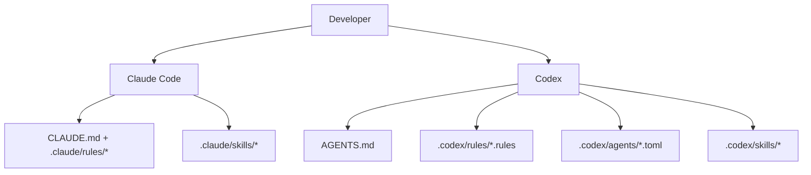

### Claude Code 레이어

- 영구 컨텍스트:
  - [`CLAUDE.md`](./CLAUDE.md)
- 경로 범위 규칙:
  - [`.claude/rules/backend-node.md`](./.claude/rules/backend-node.md)
  - [`.claude/rules/frontend-react.md`](./.claude/rules/frontend-react.md)
  - [`.claude/rules/mcp-typescript.md`](./.claude/rules/mcp-typescript.md)
  - [`.claude/rules/docs-markdown.md`](./.claude/rules/docs-markdown.md)
  - [`.claude/rules/file-headers.md`](./.claude/rules/file-headers.md)
  - [`.claude/rules/wiki-i18n.md`](./.claude/rules/wiki-i18n.md)
  - [`.claude/rules/i18n-parity.md`](./.claude/rules/i18n-parity.md)
- 스킬:
  - `repo-onboarding`
  - `ship-feature`
  - `version-release`
  - `mcp-operations`
  - `debug-live-issue`
  - `update-project-docs`
  - `file-headers`
  - `push-to-forked-pr`
  - `i18n-parity`
- 서브에이전트:
  - `backend-reviewer`
  - `frontend-reviewer`
  - `mcp-reviewer`

### Codex 레이어

- 영구 컨텍스트:
  - [`AGENTS.md`](./AGENTS.md)
- 실행 정책:
  - [`.codex/rules/default.rules`](./.codex/rules/default.rules)
- 사용자 정의 서브에이전트 템플릿:
  - [`.codex/agents/`](./.codex/agents)
- 스킬:
  - [`.codex/skills/`](./.codex/skills)
- 설정:
  - [`.codex/README.md`](./.codex/README.md)

---

## MCP 통합

이 프로젝트는 대시보드 작업을 AI 에이전트용 도구로 노출하는 로컬 프로덕션급 MCP 서버를 `mcp/`에 포함하고 있습니다. 서로 다른 통합 시나리오에 맞도록 세 가지 전송 모드를 지원합니다.

### MCP 전송 모드

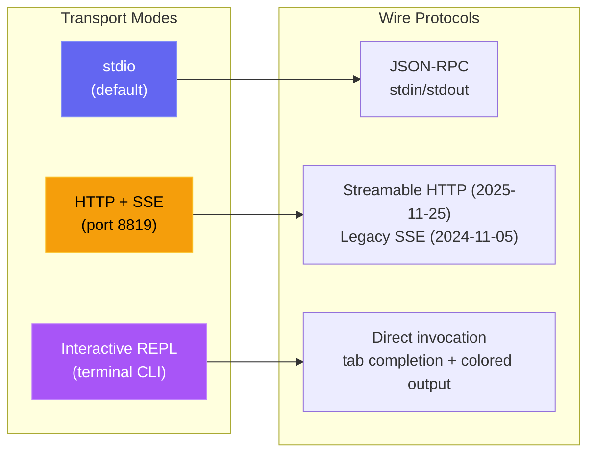

| 모드 | 명령어 | 사용 사례 |
| --- | --- | --- |
| **stdio** | `npm run mcp:start` | Claude Code, Claude Desktop, IDE MCP 호스트 |
| **HTTP** | `npm run mcp:start:http` | 원격 MCP 클라이언트, 웹 통합, 다중 세션 |
| **REPL** | `npm run mcp:start:repl` | 운영 디버깅, 수동 도구 호출, 로컬 관리 |

<p align="center">
  <a href="images/mcp.png"></a>
</p>

### MCP 아키텍처

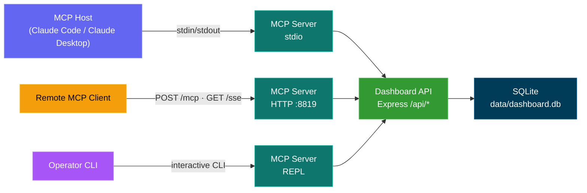

### MCP 도구 표면

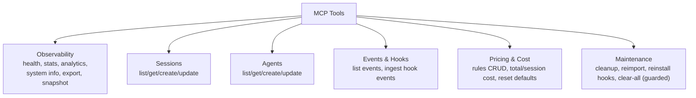

### MCP 안전 모델

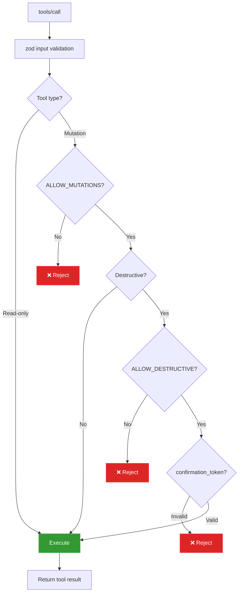

### MCP 운영 모드

- 읽기 전용 모드 (기본값): `MCP_DASHBOARD_ALLOW_MUTATIONS=false`
- 관리자 모드: `MCP_DASHBOARD_ALLOW_MUTATIONS=true`
- 인증: `MCP_DASHBOARD_API_TOKEN` / `_FILE`은 dashboard token과 같아야 하며 `MCP_HTTP_AUTH_TOKEN` / `_FILE`은 HTTP/SSE client를 보호합니다
- 전송 보호: 직접 루프백 HTTP는 토큰을 사용할 수 있고, 컨테이너 호스트 별칭은 HTTPS가 필요하며, 모든 리디렉션은 거부됩니다
- 페이로드 보호: 기록 업로드 파일당 50 MiB, 호출당 총 100 MiB, 바이너리 응답 10 MiB, 백업 복원 25 MiB
- 파괴적 모드: 다음이 모두 필요합니다:
  - `MCP_DASHBOARD_ALLOW_MUTATIONS=true`
  - `MCP_DASHBOARD_ALLOW_DESTRUCTIVE=true`
  - 도구 입력 `confirmation_token: "CLEAR_ALL_DATA"`

전체 세부 사항: [mcp/README.md](./mcp/README.md)

---

## API 참조

모든 엔드포인트는 JSON을 반환합니다. 오류 응답은 `{ error: { code, message } }` 형태를 따릅니다.

### OpenAPI / Swagger / ReDoc

HTTP API를 탐색하는 방법은 세 가지가 있으며, 모두 하나의 OpenAPI 3.0.3 사양으로 구동됩니다(기본 서버 포트 `4820`):

| 메서드 | 경로                            | 설명                                                                                              |
| ------ | ------------------------------- | ------------------------------------------------------------------------------------------------- |
| `GET`  | `/api/openapi.json`             | 원시 OpenAPI 3.0.3 JSON 사양                                                                       |
| `GET`  | `/api/docs`                     | 대화형 **Swagger UI** — try-it-out 방식의 요청 실행                                               |
| `GET`  | `/api/redoc`                    | **ReDoc** 참조 문서 — 동일한 사양을 깔끔하고 읽기에 최적화된 3패널 형태로 렌더링                  |
| `GET`  | `/api/redoc/redoc.standalone.js`| 자체 호스팅 ReDoc 번들(`redoc` 의존성을 통해 로컬로 제공되며 CDN을 사용하지 않음 — 오프라인에서도 동작) |

OpenAPI 문서는 `server/openapi.js`(`createOpenApiSpec()`)에서 생성되며, `server/openapi-extra/` 아래의 보조 프래그먼트와 병합됩니다. Swagger UI와 ReDoc은 모두 백엔드가 직접 제공합니다. ReDoc 번들은 로컬로 제공되므로(`GET /api/redoc/redoc.standalone.js`) 이 참조 문서는 완전한 오프라인 / 에어갭 환경에서도 동작하며, 이는 프로젝트의 외부 자산 미사용 정책과 일치합니다.

커버리지는 포괄적입니다. 모든 백엔드 라우트가 문서화되어 있으며(82개의 경로 항목), 다음 태그들 — Health, Sessions, Agents, Events, Stats, Metrics, Analytics, Hooks, Pricing, Workflows, Settings, Updates, Alerts, Webhooks, Push, CcConfig(Claude Code 설정 탐색기), Run(대시보드에서 생성된 실행), Documentation — 에 걸쳐 각각 매개변수, 요청/응답 스키마, 필드 수준 설명, 현실적인 예제를 포함합니다.

저장소 루트에 커밋되어 있는 **`openapi.yaml`**은 라이브 사양을 그대로 반영합니다. 이 파일은 `server/openapi.js`에서 생성되며(직접 손으로 편집하지 않음) — API 변경 후 다음 명령으로 다시 생성합니다:

```bash
npm run openapi:yaml
```


<p align="center">
  <a href="images/swagger.png"></a>
</p>

<p align="center">
  <a href="images/redoc.png"></a>
</p>

### 상태 확인

| 메서드 | 경로          | 설명                                  |
| ------ | ------------- | ------------------------------------- |
| `GET`  | `/api/health` | `{ status: "ok", timestamp }`를 반환합니다 |

### 세션

| 메서드  | 경로                            | 쿼리 매개변수                                                     | 설명                                                                                          |
| ------- | ------------------------------- | ---------------------------------------------------------------- | -------------------------------------------------------------------------------------------- |
| `GET`   | `/api/sessions`                 | `status`, `q`, `limit`, `offset`                                 | 에이전트 수와 세션별 비용을 포함한 세션 목록을 조회합니다. `q`는 `id` / `name` / `cwd` 전반에 걸쳐 대소문자를 구분하지 않는 검색을 수행합니다. `limit`의 기본값은 50, 최대값은 10000입니다. 응답에는 페이지네이터를 위한 `total`이 포함됩니다. |
| `GET`   | `/api/sessions/:id`             | --                                                               | 에이전트와 이벤트를 포함한 세션 상세 정보                                                     |
| `GET`   | `/api/sessions/:id/stats`       | --                                                               | 세션 상세 개요 패널을 구동하는 집계 수치: 이벤트, 유형별 이벤트, 상위 도구 사용량, 오류 수, 에이전트 유형/상태 수, 서브에이전트 유형 분포, 토큰 합계, 시간 범위 |
| `GET`   | `/api/sessions/:id/transcripts` | --                                                               | 해당 세션에서 사용 가능한 JSONL 트랜스크립트 목록을 조회합니다(메인 + 서브에이전트 + 컴팩션) |
| `GET`   | `/api/sessions/:id/transcript`  | `agent_id`, `limit`, `offset`, `after`, `before`                 | 커서 기반 페이지네이션으로 특정 트랜스크립트의 메시지를 스트리밍합니다. 어시스턴트 `usage`에는 `input_tokens`, `output_tokens`, `cache_read_input_tokens`, `cache_creation_input_tokens`가 포함되어 재개 / 재연결 시 Run 페이지의 미터가 완전히 복원(hydrate)될 수 있습니다 |
| `POST`  | `/api/sessions`                 | --                                                               | 세션 생성(`id` 기준 멱등)                                                                     |
| `PATCH` | `/api/sessions/:id`             | --                                                               | 세션 상태/메타데이터 업데이트                                                                 |

### 에이전트

| 메서드  | 경로              | 쿼리 매개변수                             | 설명                          |
| ------- | ----------------- | ----------------------------------------- | ----------------------------- |
| `GET`   | `/api/agents`     | `status`, `session_id`, `limit`, `offset` | 필터를 적용한 에이전트 목록 조회 |
| `GET`   | `/api/agents/:id` | --                                        | 단일 에이전트 상세 정보       |
| `POST`  | `/api/agents`     | --                                        | 에이전트 생성                 |
| `PATCH` | `/api/agents/:id` | --                                        | 에이전트 상태/작업/도구 업데이트 |

### 이벤트

| 메서드 | 경로          | 쿼리 매개변수                   | 설명                       |
| ------ | ------------- | ------------------------------- | -------------------------- |
| `GET`  | `/api/events` | `session_id`, `limit`, `offset` | 이벤트 목록 조회(최신순)   |

### 통계

| 메서드 | 경로         | 설명                                                   |
| ------ | ------------ | ------------------------------------------------------ |
| `GET`  | `/api/stats` | 집계 수치, 상태 분포, WS 연결 수                       |

### 분석

| 메서드 | 경로             | 설명                                                       |
| ------ | ---------------- | ---------------------------------------------------------- |
| `GET`  | `/api/analytics` | 차트와 트렌드 뷰를 위한 토큰/도구/세션 집계               |

### 원격 데이터 소스

| 메서드 | 경로 | 쿼리 매개변수 | 설명 |
| --- | --- | --- | --- |
| `GET` | `/api/remote-sources` | -- | 상태, 마지막 오류, 마지막 동기화 개수를 포함한 구성된 원격 소스 목록을 조회합니다. |
| `POST` | `/api/remote-sources` | -- | 소스를 생성합니다. Body: `{ label, host, ssh_port?, identity_file?, remote_home?, remote_codex_home?, enabled? }` |
| `PATCH` | `/api/remote-sources/:id` | -- | 소스의 label, 연결 필드, enabled를 업데이트합니다. |
| `DELETE` | `/api/remote-sources/:id` | `purge` | 소스를 삭제합니다. `?purge=true`는 해당 소스에서 가져온 세션도 삭제합니다. |
| `POST` | `/api/remote-sources/:id/test` | -- | 소스에 대한 SSH 연결을 확인합니다. |
| `POST` | `/api/remote-sources/:id/sync` | -- | 즉시 소스에서 pull하고 다시 가져옵니다. |

`GET /api/sessions`, `/api/events`, `/api/agents`, `/api/stats`, `/api/analytics`는 출처별 결과를 제한하는 선택적 `sources` 쿼리 매개변수도 받습니다. 소스 ID를 쉼표로 구분하고, 전체를 조회하려면 생략하세요. `GET /api/sessions/facets`는 데이터 범위 선택기용 `sources` 배열을 반환합니다.

### Hook

| 메서드 | 경로               | 설명                                         |
| ------ | ------------------ | -------------------------------------------- |
| `POST` | `/api/hooks/event` | Claude Code Hook 이벤트를 수신하고 처리합니다 |
| `POST` | `/api/hooks/ingest-batch` | 로밍 중이거나 NAT 뒤에 있는 머신에서 세션 데이터 배치를 푸시합니다(기본 비활성. 아래의 `REMOTE_PUSH_TOKEN`과 전체 페이로드 구조는 `server/README.md` 참고) |

**Hook 이벤트 페이로드:**

```json
{
  "hook_type": "PreToolUse",
  "data": {
    "session_id": "abc-123",
    "tool_name": "Bash",
    "tool_input": { "command": "ls -la" }
  }
}
```

### 가격 책정

| 메서드   | 경로                     | 설명                                     |
| -------- | ------------------------ | ---------------------------------------- |
| `GET`    | `/api/pricing`           | 모든 가격 책정 규칙 목록 조회            |
| `PUT`    | `/api/pricing`           | 가격 책정 규칙 생성 또는 업데이트        |
| `DELETE` | `/api/pricing/:pattern`  | 가격 책정 규칙 삭제                      |
| `GET`    | `/api/pricing/cost`      | 전체 세션에 걸친 총 비용                 |
| `GET`    | `/api/pricing/cost/:id`  | 특정 세션의 비용 상세 분석               |

### 워크플로

| 메서드 | 경로                          | 설명                                                    |
| ------ | ----------------------------- | ------------------------------------------------------- |
| `GET`  | `/api/workflows`              | provider/source 범위의 워크플로 데이터(오케스트레이션, 기록된 도구, 패턴, Codex 컴팩션)입니다. `?status=active\|completed`, `?sources=...`, `?providers=claude\|codex` 필터가 11개 데이터 섹션 전체에 적용됩니다 |
| `GET`  | `/api/workflows/session/:id`  | provider/source 범위의 세션별 drill-in(에이전트 트리, 기록된 도구 타임라인, 이벤트) |

### 알림

| 메서드   | 경로                     | 설명                                                                   |
| -------- | ------------------------ | ---------------------------------------------------------------------- |
| `GET`    | `/api/alerts`            | 발생한 알림 피드, 최신순(`?unacked=true`, `limit`, `offset`)           |
| `POST`   | `/api/alerts/:id/ack`    | 알림 하나를 확인 처리                                                  |
| `POST`   | `/api/alerts/ack-all`    | 확인되지 않은 모든 알림을 확인 처리                                    |
| `GET`    | `/api/alerts/rules`      | 알림 규칙 목록 조회                                                    |
| `POST`   | `/api/alerts/rules`      | 규칙 생성(`event_pattern` \| `inactivity` \| `status_duration` \| `token_threshold`) |
| `PATCH`  | `/api/alerts/rules/:id`  | 이름 / 설정 / 활성화 / 쿨다운 업데이트(규칙 유형은 변경 불가)          |
| `DELETE` | `/api/alerts/rules/:id`  | 규칙과 해당 발생 알림 기록 삭제                                        |

### Webhook

| 메서드   | 경로                              | 설명                                                                                 |
| -------- | --------------------------------- | ------------------------------------------------------------------------------------ |
| `GET`    | `/api/webhooks/providers`         | 지원되는 공급자 + 각 공급자의 설정 필드(UI 폼을 구동)                                |
| `GET`    | `/api/webhooks`                   | Webhook 대상 목록 조회(URL은 마스킹, 시크릿은 삭제 처리)                             |
| `POST`   | `/api/webhooks`                   | 대상 생성(14개의 일급 공급자 + `generic`)                                            |
| `PATCH`  | `/api/webhooks/:id`               | 이름 / url / 활성화 / 시크릿 / 헤더 / 규칙 범위 업데이트(유형은 변경 불가)           |
| `DELETE` | `/api/webhooks/:id`               | 대상과 해당 전달 로그 삭제                                                           |
| `POST`   | `/api/webhooks/:id/test`          | 합성 테스트 알림을 전송하고 전달 결과를 보고                                         |
| `GET`    | `/api/webhooks/:id/deliveries`    | 대상의 최근 전달 로그(`limit`, `offset`)                                              |

### 설정

| 메서드 | 경로                           | 설명                                             |
| ------ | ------------------------------ | ------------------------------------------------ |
| `GET`  | `/api/settings/info`           | 시스템 정보, DB 통계, Hook 상태                  |
| `POST` | `/api/settings/clear-data`     | 모든 세션, 에이전트, 이벤트, 토큰 사용량 삭제    |
| `POST` | `/api/settings/reimport`       | `~/.claude/`에서 레거시 세션 다시 가져오기       |
| `POST` | `/api/settings/reinstall-hooks`| Claude Code Hook 재설치                          |
| `POST` | `/api/settings/reset-pricing`  | Claude, Codex 또는 두 가격표를 기본값으로 재설정 |
| `GET`  | `/api/settings/export`         | 모든 데이터를 JSON 다운로드로 내보내기           |
| `POST` | `/api/settings/import`         | `/export`에서 최대 25 MiB의 백업 하나 복원 (multipart `file` 또는 JSON `{ path }`). 멱등 + 비파괴적 — 이미 있는 세션은 통째로 건너뜀 |
| `POST` | `/api/settings/cleanup`        | 오래된 세션을 중단 처리하고 오래된 데이터 정리(정리된 세션의 스냅샷 포함) |
| `GET`  | `/api/settings/snapshots`      | 제공자별 트랜스크립트 스냅샷 용량 + 보존 정책 |
| `POST` | `/api/settings/snapshots/compress` | 원본 트랜스크립트가 사라진 스냅샷을 무손실 압축 |
| `POST` | `/api/settings/snapshots/prune` | 스냅샷 정리 계획(기본 드라이런) 또는 실행; 실행하려면 `confirm: "PRUNE_SNAPSHOTS"` 필요 |

### Claude 설정 탐색기 (`/api/cc-config`)

Claude Code의 모든 설정 표면을 읽기 전용으로 검사할 수 있으며, 위험도가 낮은 텍스트 파일 아티팩트에 대해서는 신중하게 제한된 변경 기능을 제공합니다. 모든 쓰기 경로는 변경 전에 `<root>/cc-config-backups/<type>/` 아래에 타임스탬프가 붙은 백업을 생성합니다.

| 메서드   | 경로                                | 설명 |
| -------- | ----------------------------------- | ----------- |
| `GET`    | `/api/cc-config/overview`           | 루트(claude 홈, 프로젝트 .claude, 프로젝트 루트, ~/.claude.json) + 모든 표면에 대한 개수 |
| `GET`    | `/api/cc-config/skills`             | 파싱된 프런트매터를 포함한 `<scope>/.claude/skills/<name>/SKILL.md` 아래의 스킬; `?scope=user\|project\|all` |
| `GET`    | `/api/cc-config/agents`             | 서브에이전트 `<scope>/.claude/agents/*.md` |
| `GET`    | `/api/cc-config/commands`           | 슬래시 명령어 `<scope>/.claude/commands/*.md` |
| `GET`    | `/api/cc-config/output-styles`      | 출력 스타일 `<scope>/.claude/output-styles/*.md` |
| `GET`    | `/api/cc-config/plugins`            | `~/.claude/plugins/installed_plugins.json`의 설치된 플러그인을 설정의 `enabledPlugins`와 조인한 결과; 각 항목에는 `contributes`(플러그인 설치 디렉터리 내부의 스킬/에이전트/명령어/Hook/출력 스타일 개수)와 `plugin.json` 메타데이터가 포함됩니다 |
| `GET`    | `/api/cc-config/marketplaces`       | `known_marketplaces.json`에 등록된 마켓플레이스로, 각 마켓플레이스 자체의 `marketplace.json`(플러그인 수, 소유자, 설명)으로 보강됩니다 |
| `GET`    | `/api/cc-config/mcp`                | `~/.claude.json`(최상위 + 프로젝트별) 및 `settings.json`의 MCP 서버 |
| `GET`    | `/api/cc-config/hooks`              | 사용자 / 프로젝트 / 프로젝트 로컬 `settings.json` 파일 전반에 걸쳐 집계된 Hook |
| `GET`    | `/api/cc-config/hook-scripts`       | `~/.claude/hooks/`의 파일(`hooks.<event>.command`가 참조하는 헬퍼 스크립트) |
| `GET`    | `/api/cc-config/keybindings`        | `~/.claude/keybindings.json`을 컨텍스트별로 그룹화된 키/액션 쌍으로 파싱한 결과 |
| `PUT`    | `/api/cc-config/keybindings`        | `{ groups: [{ context, bindings: [{ key, action }] }] }`로 `keybindings.json` 덮어쓰기. 먼저 백업하고, 최상위 메타데이터(`$schema`/`$docs`)를 보존하며, 중복 컨텍스트/키를 거부. (`settings.json`과 달리 CLI가 세션 중에 다시 쓰지 않으므로 안전) |
| `GET`    | `/api/cc-config/statusline`         | `settings.json.statusLine` 설정 + 존재하는 경우 실제 `statusline.py` / `statusline-command.sh` 내용 |
| `GET`    | `/api/cc-config/settings`           | 사용자 / 프로젝트 / 프로젝트 로컬 설정 JSON. 시크릿으로 보이는 키(`/token\|secret\|password\|api[_-]?key\|auth/i`에 일치)는 `"<redacted>"`로 대체됩니다 |
| `GET`    | `/api/cc-config/memory`             | 사용자 + 프로젝트 범위의 `CLAUDE.md` 파일과 프로젝트별 파일 기반 메모리: `~/.claude/projects/<slug>/memory/` 아래의 모든 `*.md`에 대한 `scope:"auto-memory"` 항목(각각 `project`, `name`, `isIndex` 및 파싱된 `frontmatter`를 포함). `{ scope: "auto-memory", type: "auto-memory", project, name }`와 함께 `PUT`/`DELETE /api/cc-config/file`로 변경합니다(백업은 `<memory-dir>/.cc-config-backups/auto-memory/`에 저장됨) |
| `GET`    | `/api/cc-config/file?path=…`        | 단일 파일의 본문(경로는 CLAUDE_HOME / 프로젝트 .claude / 프로젝트 CLAUDE.md로 제한됨) |
| `GET`    | `/api/cc-config/backups`            | 타임스탬프가 붙은 모든 백업 목록, 선택적으로 `?scope=&type=`로 필터링 가능 |
| `PUT`    | `/api/cc-config/file`               | 텍스트 파일 아티팩트를 생성하거나 덮어씁니다. Body: `{ scope, type, name?, content }`. 파일이 존재하면 자동으로 백업합니다. 원자적 임시 파일 + 이름 변경 방식. 256 KB 내용 상한, 엄격한 `name` 정규식 적용 |
| `DELETE` | `/api/cc-config/file`               | 텍스트 파일 아티팩트를 백업 후 삭제합니다. 스킬 디렉터리는 재귀적 제거 전에 통째로 백업됩니다(번들된 자산 보존) |

### Prometheus 메트릭 & Grafana

`GET /api/metrics`는 세션과 Agent 상태, 이벤트, 토큰, 실시간 client, 원격 소스, process uptime과 memory, build version을 위한 Prometheus text metric을 노출합니다. [`monitoring/`](./monitoring/README.md)에는 Prometheus와 자동으로 구성되는 Grafana dashboard 4개가 있으며, **CCAM · Overview**가 기본값입니다.

```bash
# Native dashboard and monitoring
npm start
npm run monitoring:install       # one-time binary setup
npm run monitoring:up            # Grafana on :3000

# Containers
npm run docker:up                 # dashboard only
npm run docker:full:up            # dashboard + Prometheus + Grafana

# Mixed native/container setup
DASHBOARD_ALLOWED_HOSTS=host.docker.internal npm start
npm run monitoring:docker:up
npm run monitoring:verify
```

<p align="center">
  <a href="images/grafana.png"></a>
  <br>
  <em>📊 <strong>Grafana · CCAM Overview</strong> · 실시간 <code>/api/metrics</code> scrape에서 가져온 fleet 상태, database 합계, 분포, rate</em>
</p>

<p align="center">
  <a href="images/prometheus-console.png"></a>
  <br>
  <em>🔥 <strong>Prometheus · CCAM console</strong> · scrape 상태, 세션, 이벤트, 토큰, Graph drill-down 링크</em>
</p>

메트릭 이름, 인증, scrape 구성은 [docs/API.md → Metrics](./docs/API.md#metrics)에서 확인하세요.

### Claude 실행 (`/api/run`)

대시보드에서 `claude` 서브프로세스를 생성하고 감독하기 위한 HTTP 표면입니다. 모든 라우트에 동일 출처(same-origin) 가드가 적용됩니다 — 브라우저 요청은 localhost 출처에서 와야 하며, Origin이 없는(CLI/curl) 요청은 통과합니다.

| 메서드   | 경로                              | 설명 |
| -------- | --------------------------------- | ----------- |
| `GET`    | `/api/run`                        | 메모리에 있는 모든 실행 핸들 목록 조회(실행 중 + 최근 완료); `maxConcurrent`와 `activeCount`도 함께 반환합니다 |
| `GET`    | `/api/run/binary`                 | `claude`가 `PATH`에 있는지와 그 위치를 탐지합니다 — UI가 실행 생성 전에 명확한 오류를 표시하는 데 사용됩니다 |
| `GET`    | `/api/run/cwds`                   | 추천 작업 디렉터리: 대시보드 서버 cwd, `$HOME`, 그리고 sessions 테이블의 최근 cwd |
| `GET`    | `/api/run/files?cwd=…&q=…`        | Run 페이지의 `@` 파일 자동완성을 위한 `cwd` 내부 퍼지 파일 검색. `node_modules`, `.git`, `dist`, `build`, `.next`, `.cache`, `coverage` 등은 건너뜁니다. cwd는 필수이며 존재해야 합니다. 결과는 개수가 제한되고 basename 일치도로 순위가 매겨집니다 |
| `POST`   | `/api/run`                        | 새 실행을 생성합니다. Body: `{ prompt, mode: "headless"\|"conversation", cwd?, model?, permissionMode?, resumeSessionId?, effort? }`. Headless 모드는 `-p`를 통해 프롬프트를 argv에 넣고 stdin을 닫습니다. Conversation 모드는 프롬프트를 stream-json 엔벨로프로 stdin을 통해 전달하고 후속 입력을 위해 stdin을 열어 둡니다. `resumeSessionId`(conversation 전용)는 `--resume <id>`를 추가합니다. 이 값이 설정되면 `prompt`는 비어 있을 수 있으며 — 스포너는 최초 stdin 쓰기를 건너뛰고, 사용자가 `POST /api/run/:id/message`로 후속 메시지를 보낼 때까지 `claude`는 재개된 대화에서 대기합니다. `effort`(`low` / `medium` / `high`)는 `--effort`에 매핑됩니다. 스포너는 항상 `--output-format stream-json --verbose --include-partial-messages`를 전달하므로 UI가 문자 단위 델타를 렌더링할 수 있습니다. 동시 실행 수는 사실상 제한이 없습니다(기본 상한 10000 — `RUN_MAX_CONCURRENT`로 재정의) |
| `GET`    | `/api/run/:id`                    | 현재 핸들 상태. `?envelopes=1`은 메모리에 있는 엔벨로프 로그를 포함하므로 UI가 재연결 시 히스토리를 재생할 수 있습니다 |
| `POST`   | `/api/run/:id/message`            | 실행 중인 대화에 후속 턴을 보냅니다(conversation 모드 전용). Body: `{ text }` |
| `DELETE` | `/api/run/:id`                    | 실행을 중지합니다. SIGTERM 후 5초가 지나면 SIGKILL로 격상됩니다 |

출력은 기존 대시보드 WebSocket을 통해 세 가지 메시지 유형으로 스트리밍됩니다: `run_stream`(파싱된 stream-json 엔벨로프로, `--include-partial-messages`의 `stream_event` 델타 포함), `run_status`(상태 전환), `run_input_ack`(stdin 쓰기 확인). Config Explorer 페이지는 네 번째 메시지인 `cc_config_changed`를 구독합니다 — 이 메시지는 `server/lib/cc-watcher.js`(`~/.claude/`에 대한 `fs.watch`를 통해)와 `routes/cc-config.js`가 모든 성공적인 PUT/DELETE 후에 `{ source: "dashboard"|"fs", action?, scope?, type?, name?, paths? }` 페이로드와 함께 브로드캐스트합니다. 세션 목록과 SessionDetail 페이지는 `/api/run`을 폴링하고 (`run_status`를 수신하여) 현재 진행 중인 Run이 구동하고 있는 세션에, `/run`으로 다시 연결되는 클릭 가능한 **▶ Run** 표시 배지를 붙입니다.


### 히스토리 가져오기

**Settings → Import History**는 provider별 folder scan 또는 upload를 통해 `~/.claude/projects`의 Claude Code 트랜스크립트와 `~/.codex/sessions`의 Codex rollout을 가져옵니다. 둘 다 실시간 수집을 재사용하고 token, cost, tool, compaction baseline, lifecycle, native Codex title을 보존하며 멱등성을 유지합니다. Upload된 Codex history는 dashboard storage에 복사되므로 source가 정리되어도 conversation이 남습니다.

**Restore backup**은 UI, `ccam export` 또는 `GET /api/settings/export`에서 내보낸 dashboard `.json`을 받습니다. `POST /api/settings/import`와 `ccam import-data <file>`은 기존 session을 덮어쓰지 않고 모든 table을 복원하므로 여러 machine의 데이터를 안전하게 통합할 수 있습니다.

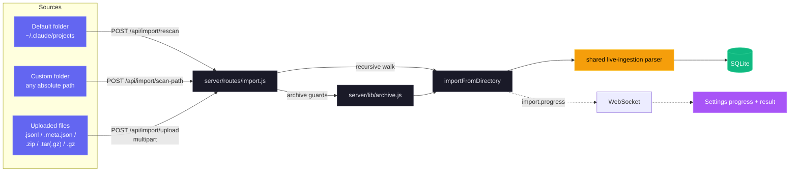

| 메서드 | 경로 | 목적 |
| --- | --- | --- |
| `GET` | `/api/import/guide` | `?provider=claude\|codex`에 따라 provider별 path, archive command, extension, instruction을 반환합니다. |
| `POST` | `/api/import/rescan` | `{ provider }`에서 선택한 기본 root를 다시 스캔합니다. |
| `POST` | `/api/import/scan-path` | 절대 `{ path, provider }`를 재귀적으로 스캔합니다. |
| `POST` | `/api/import/upload` | 지원되는 file 또는 archive를 `provider`와 함께 upload합니다. |

- **입력:** 중첩된 layout의 loose `.jsonl`, `.meta.json`, `.zip`, `.tar`, `.tar.gz`/`.tgz`, `.gz` file입니다. Claude는 두 canonical Subagent layout을 모두 지원하고, Codex는 재귀적인 `rollout-*.jsonl` 또는 `session_meta`가 있는 JSONL과 선택적 `session_index.jsonl` title을 인식합니다.
- **정확성:** UUID와 event high-water 중복 제거가 이중 계산을 방지합니다. Compaction baseline은 이전 token을 보존하고, 이후 활동은 `ended_at`을 진행시키며 message metadata를 새로 고칩니다.
- **대용량 file:** 공유 4 MiB chunk 기반 line-at-a-time parsing이 V8의 약 512 MiB string limit보다 큰 transcript를 처리합니다. Growable array는 `TRANSCRIPT_CACHE_MAX_ARRAY_LEN`, 기본값 `1000`으로 제한되고 parsing 중에는 제한의 2배에서 잘립니다.
- **안전성:** 추출은 absolute path와 `..` path를 거부합니다. 기본값은 추출 data 4 GB, upload 하나 1 GB, request당 2000 files로 제한하며, request별 staging은 항상 회수됩니다.
- **진행 상황:** 제한된 `import.progress` WebSocket phase가 `start`, `scan`, `extract`, `parse`, `complete`, `error`를 다룹니다. UI는 drag-and-drop 안내와 imported, enriched, skipped, error 합계를 제공합니다.

### WebSocket

`ws://localhost:4820/ws`에 연결하면 실시간 푸시 메시지를 받을 수 있습니다:

```json
{
  "type": "agent_updated",
  "data": { "id": "...", "status": "working", "current_tool": "Edit" },
  "timestamp": "2026-03-05T15:43:01.800Z"
}
```

**메시지 유형:** `session_created`, `session_updated`, `agent_created`, `agent_updated`, `new_event`, `alert_triggered`, `alert_updated`, `remote_source.status`

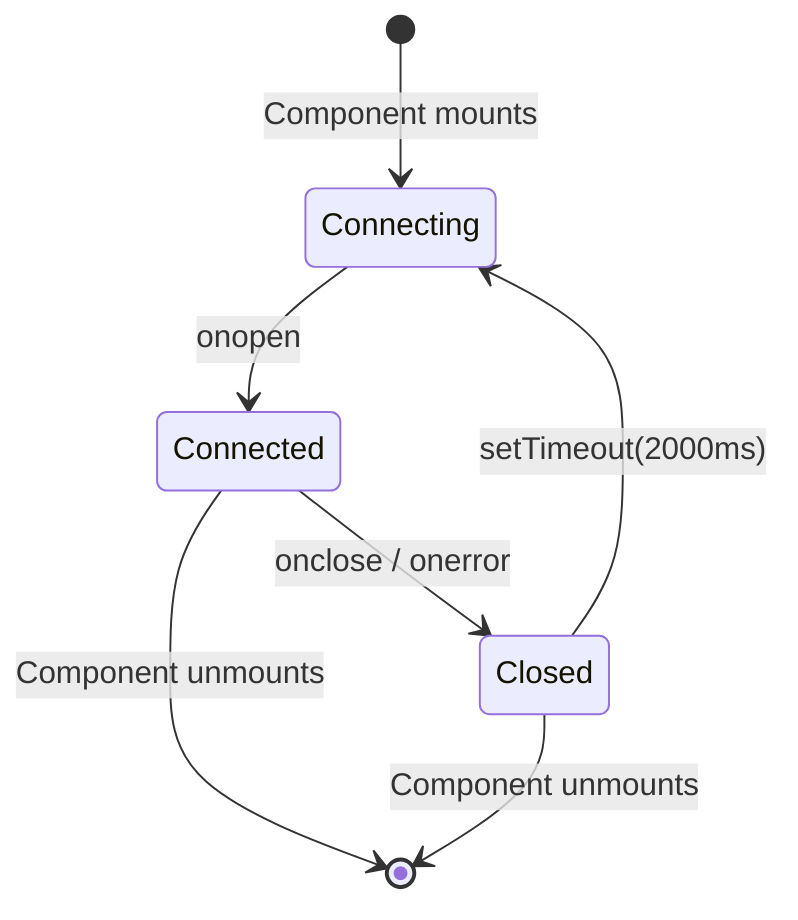

---

## Hook 이벤트

대시보드는 다음 Claude Code Hook 유형을 처리합니다:

| Hook 유형           | 트리거                         | 대시보드 동작                                                                                 |
| ------------------- | ------------------------------ | -------------------------------------------------------------------------------------------- |
| `SessionStart`      | Claude Code 세션 시작          | 세션과 메인 에이전트를 생성합니다. `awaiting_input_since`를(`awaiting_reason=session_start`와 함께) 기록하여 새 세션이 **Waiting** 상태로 시작되게 합니다. 단, `compact` 소스 SessionStart(턴 도중 자동 압축)는 플래그를 그대로 두어 작업 중인 세션이 **Active** 상태를 유지합니다. 재개된 세션을 다시 활성화합니다. `DASHBOARD_STALE_MINUTES`(기본 180) 동안 활동이 없는 고아 세션은 중단 처리합니다 |
| `UserPromptSubmit`  | 사용자가 프롬프트에서 Enter를 누름 | 대기 플래그를 지우고 메인 에이전트를 `working`으로 승격합니다 — 텍스트 전용 어시스턴트 턴은 `PreToolUse`를 발생시키지 않으므로, 이것이 해당 턴이 시작되었음을 알리는 유일한 신호입니다 |
| `PreToolUse`        | 에이전트가 도구 사용을 시작함  | 대기 플래그를 지우고, 에이전트를 `working`으로 설정하며, `current_tool`을 설정합니다. 도구가 `Agent`인 경우 서브에이전트 레코드를 생성합니다 |
| `PostToolUse`       | 도구 실행 완료                 | 대기 플래그를 지웁니다(도구 실행 도중 Notification이 플래그를 기록한 권한 프롬프트 승인 상황을 처리). `current_tool`을 지웁니다. 에이전트는 `working` 상태를 유지합니다 |
| `Stop`              | Claude가 응답을 마침           | 오류가 아닌 경우: 메인 에이전트 → `waiting` — Claude가 자기 턴을 마쳤고, 이제 공은 사용자에게 넘어갔습니다. `stop_reason=error`인 경우: 에이전트와 세션을 `error`로 표시합니다. 백그라운드 서브에이전트는 계속 실행됩니다 |
| `SubagentStop`      | 백그라운드 에이전트 완료       | 설명, 유형 또는 작업으로 서브에이전트를 매칭하여 완료 처리합니다. 대기 플래그는 의도적으로 지우지 않습니다 — 서브에이전트가 끝났다는 사실은 사용자에 대해 아무것도 알려주지 않기 때문입니다. **실행 후 잊는(fire-and-forget) JSONL 스캔을 트리거합니다**(`scanAndImportSubagents`). 이 스캔은 서브에이전트 자신의 `agent_id` 아래에 도구별 `PreToolUse` + `PostToolUse` 이벤트를 발생시켜, 타임라인이 생성 마커만이 아니라 서브에이전트가 실행한 모든 도구를 표시하게 합니다 |
| `Notification`      | 에이전트 알림                  | 이벤트를 기록합니다. 권한/입력 프롬프트 메시지는 에이전트를 `waiting`으로 설정하고 `awaiting_input_since`를 기록합니다(`awaiting_reason=notification`과 함께, 패턴으로 매칭: `permission`, `waiting for input`, `needs your approval`, …). 컴팩션 알림은 `Compaction` 이벤트로 태그됩니다. 활성화된 경우 브라우저 알림을 트리거합니다 |
| `SessionEnd`        | Claude Code CLI 프로세스 종료  | 대기 플래그를 제거합니다. 세션이 이미 `error` 상태이면 오류 상태가 보존되고, 그렇지 않으면 모든 에이전트와 세션을 `completed`로 표시합니다 |
| `Compaction`   | JSONL에서 `/compact` 감지됨    | 컴팩션 서브에이전트(유형 `compaction`)와 Compaction 이벤트를 생성합니다. 트랜스크립트 JSONL의 `isCompactSummary` 항목을 통해 감지됩니다. 활성 세션에 대해서는 주기적 스캐너로도 감지됩니다 |
| `APIError`     | JSONL 트랜스크립트의 API 오류  | `isApiErrorMessage` 항목(할당량, 속도 제한, invalid_request)과 원시 `type: "error"` 응답에서 추출됩니다. **이제 세션과 에이전트를 즉시 `error`로 표시합니다** — 이전에는 상태 변경 없이 이벤트로만 기록되었습니다. 오류 세부 정보와 함께 이벤트로 저장됩니다 |
| `TurnDuration` | JSONL 트랜스크립트의 턴 타이밍 | `durationMs`를 포함한 `system` 하위 유형 `turn_duration` 메시지에서 추출됩니다. 턴 수준 타이밍 분석을 위해 이벤트로 저장됩니다 |
| `ToolError`    | JSONL의 도구 결과 오류         | `toolUseResult.is_error` 항목에서 추출됩니다. 오류 전파 분석을 위해 도구 수준의 실패를 추적합니다 |
| `RemoteToolEvent` | 원격 머신이 푸시한 도구 호출 | 로밍 중이거나 NAT 뒤의 머신이 푸시한 각 `tool_events[]` 항목마다 `POST /api/hooks/ingest-batch`가 기록합니다. 커밋된 행과 같은 배치 내부 모두에 대해 `(session_id, event_type, uuid)`로 중복을 제거하므로 배치를 다시 보내도 안전합니다 |
| `RemoteTurn` | 원격 머신이 푸시한 턴 소요 시간 | 각 `turns[]` 항목마다 `POST /api/hooks/ingest-batch`가 해당 턴의 `duration_ms`와 함께 기록합니다. 중복 제거 방식은 `RemoteToolEvent`와 동일합니다 |
| `Interrupted`  | 사용자가 턴을 취소함(Esc)      | 워치독이 합성합니다 — `Esc`는 어떤 Hook도 발생시키지 않으므로, `working` 상태로 멈춘 세션은 트랜스크립트의 `[Request interrupted by user]` 마커로 감지되거나, 출력이 나오기 전에 Esc가 눌린 경우에는 유휴 working 타임아웃(`DASHBOARD_WORKING_IDLE_SECONDS`)으로 감지됩니다. 세션은 **Waiting**으로 이동합니다(일반 `Stop`과 동일) |

---

## 브라우저 알림

대시보드는 Web Push(VAPID)를 통한 지속적인 브라우저 알림을 지원하여, 대시보드 탭이 포커스되어 있지 않거나 브라우저가 백그라운드에 있어도 실시간 경고를 받을 수 있습니다.

### 작동 방식

1. 설정 페이지에서 마스터 토글로 알림을 **활성화**합니다
2. 프롬프트가 표시되면 브라우저 권한을 **허용**합니다 — 이 과정에서 Service Worker가 등록되고 푸시 구독이 생성됩니다
3. 어떤 이벤트가 알림을 트리거할지 **구성**합니다:

| 이벤트                       | 기본값  | 설명                                                            |
| ---------------------------- | ------- | --------------------------------------------------------------- |
| 새 세션 시작                 | 켜짐    | 새 Claude Code 세션이 생성될 때 발생합니다                      |
| Claude 응답 완료             | 꺼짐    | Claude가 응답 턴을 마칠 때 `Stop` 이벤트에서 발생합니다         |
| 세션 종료                    | 꺼짐    | CLI 프로세스가 종료될 때 `SessionEnd`에서 발생합니다            |
| 세션 오류                    | 켜짐    | 세션이 오류로 종료될 때 발생합니다                              |
| 서브에이전트 생성            | 꺼짐    | 백그라운드 서브에이전트가 생성될 때 발생합니다                  |

추가로, Claude Code의 모든 `Notification` Hook 이벤트는 이벤트별 토글과 관계없이(마스터 토글이 활성화되어 있는 한) 브라우저 알림을 트리거합니다.

### 알림 아키텍처

- **VAPID 파이프라인:** 안전한 메시지 전달을 위해 서버에서 `web-push`를 사용합니다. VAPID 키는 자동 생성되어 `data/vapid-keys.json`에 저장됩니다.
- **Service Worker:** 전용 워커(`client/public/sw.js`)가 수신되는 `push` 이벤트를 처리하고, macOS에서 오디오 재생을 보장하기 위해 `silent: false`로 알림을 표시합니다.
- **구독:** 브라우저별 엔드포인트는 SQLite의 `push_subscriptions` 테이블에 저장됩니다.
- **지속성:** Service Worker가 백그라운드에서 동작하므로 브라우저가 닫혀 있어도 알림이 도착합니다.
- **테스트 알림:** 설정의 버튼으로 VAPID 파이프라인과 오디오 재생을 확인할 수 있습니다.

### PWA 및 오프라인 지원

Dashboard, landing page, Wiki는 각각 독립된 manifest와 service worker를 사용하는 별도의 설치 가능한 PWA입니다.

| 표면 | Manifest | Service Worker | 캐싱 전략 |
| --- | --- | --- | --- |
| Dashboard (`client/`) | `client/public/manifest.json` | `client/public/sw.js` | 변경되지 않는 `/assets/*`는 cache-first입니다. Navigation, worker, manifest, icon, `/`는 fallback이 있는 network-first입니다. `/api/*`, `/ws`, Vite HMR은 캐시하지 않고 push handler는 계속 작동합니다. Express는 asset에 1년 immutable header를, shell file에 revalidation header를 보냅니다. `controllerchange`는 upgrade 때 한 번만 reload하고 최초 설치 때는 reload하지 않습니다. |
| Landing page (root) | `manifest.json` | `sw.js` | Shell, favicon, OG image를 precache합니다. Screenshot은 처음 볼 때 cache하고, navigation은 offline fallback이 있는 network-first입니다. |
| Wiki (`wiki/`) | `wiki/manifest.json` | `wiki/sw.js` | HTML, CSS, JS, manifest, favicon을 precache합니다. HTML은 network-first, CSS와 JS는 cache-first를 유지해 한 번 방문한 뒤 offline으로 사용할 수 있습니다. |

모든 worker는 `skipWaiting()`을 호출하고, 활성화할 때 version이 있는 stale cache를 제거하며, cache version이 바뀌면 깨끗하게 새로 고칩니다. 각 HTML file에는 iOS standalone metadata가 있고, manifest와 Apple touch icon은 `sizes="any"`가 있는 `favicon.svg`를 사용합니다.

---

## 업데이트 알리미

대시보드는 자체 git 체크아웃을 감시하고, 정식(canonical) 기본 브랜치에 HEAD보다 앞선 커밋이 있을 때마다 모달을 표시합니다. **브랜치 및 포크 인식:** `upstream` 원격(포크의 표준 관례)이 있으면 `origin`보다 우선하며, 선택된 원격의 `master`/`main`/`HEAD`가 비교 기준 ref가 됩니다. `manual_command`는 상황에 맞게 조정됩니다 — 브랜치가 실제로 정식 ref를 추적할 때만 `git pull --ff-only`이고, 그 외에는 `git fetch`(포크의 경우 fast-forward 병합 포함)이므로 명령이 결코 거짓을 말하지 않습니다. 사용자는 터미널에서 실행할 정확한 명령을 받습니다 — 서버는 **절대** 스스로 pull하거나 재시작하지 않으므로, 이 메커니즘은 개발 세션, pm2/systemd/launchd/Docker 감독, 원격 배포 전반에서 이식성을 유지합니다.

<p align="center">
  <a href="images/update.png"></a>
</p>

### 작동 방식

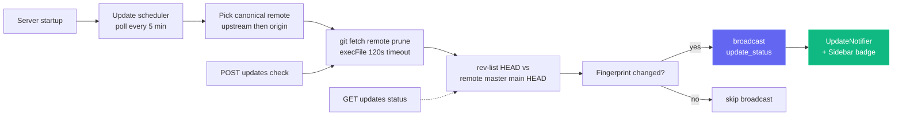

단일 검사는 비용이 저렴하고(정식 원격 — 구성된 경우 `upstream`, 그렇지 않으면 `origin` — 에 대한 `git fetch <remote> --prune`), `execFile`(셸 없음)과 120초 타임아웃으로 감싸져 있습니다. 실패 — 오프라인 네트워크, git이 아닌 설치, 원격 미구성, 해석할 수 없는 upstream ref — 는 모두 예외를 던지는 대신 **소프트 페이로드**(예: `fetch_error: "..."`)를 반환하므로, 불안정한 원격이 대시보드를 차단하는 일은 없습니다.

### UI 표면

| 표면 | 동작 |
| --- | --- |
| **Modal** (`client/src/components/UpdateNotifier.tsx`) | 새로 사용할 수 있는 `remote_sha`가 있으면 열립니다. 뒤처진 commit 수, 추적 중인 ref, 선택적 branch/fork note, 정확한 명령, **Copy command**, **Check now**, **Dismiss**를 표시합니다. Escape 또는 backdrop으로 닫을 수 있습니다. 닫기 상태는 `localStorage`에 저장되므로 더 새로운 SHA가 생기면 다시 열립니다. |
| **Sidebar button** (`client/src/components/Sidebar.tsx`) | 항상 표시됩니다. 녹색은 뒤처진 상태를, amber는 fetch 실패를 뜻합니다. 클릭하면 닫기 상태를 지우고 `POST /api/updates/check`를 호출합니다. |
| **Server terminal** | 상태가 최신에서 뒤처짐으로 바뀌면 headless 사용자를 포함해 framed command를 출력합니다. |

### API 표면

| 엔드포인트 | 목적 |
| --- | --- |
| `GET /api/updates/status` | 읽기 전용 검사: 정식 원격에 대해 `git fetch`를 실행하고, HEAD를 해당 기본 브랜치와 비교한 뒤 페이로드를 반환합니다. |
| `POST /api/updates/check` | 동일한 검사이지만, 연결된 모든 클라이언트가 한 번에 업데이트되도록 WebSocket으로 `update_status`도 브로드캐스트합니다. |

두 엔드포인트 모두 동일한 페이로드 형태를 반환합니다:

```json
{
  "git_repo": true,
  "update_available": true,
  "repo_root": "/Users/you/Claude-Code-Agent-Monitor",
  "remote_ref": "upstream/master",
  "canonical_remote": "upstream",
  "current_branch": "master",
  "tracking_upstream": "origin/master",
  "tracks_canonical": false,
  "situation": "fork_or_diverged_tracking",
  "local_sha": "abc1234...",
  "remote_sha": "def5678...",
  "commits_behind": 3,
  "manual_command": "cd \"/...\" && git fetch upstream && git merge --ff-only upstream/master && npm run setup",
  "situation_note": "You're on 'master' tracking 'origin/master'. This command fast-forwards your branch from upstream/master (the canonical default).",
  "message": "3 commit(s) on upstream/master not in your checkout."
}
```

`situation`은 `tracking_canonical`(기본 브랜치의 일반적인 클론 — `git pull --ff-only`가 동작), `fork_or_diverged_tracking`(로컬 브랜치 이름은 정식 브랜치와 일치하지만 다른 원격을 추적 — `git fetch <remote> && git merge --ff-only <ref>`), `feature_branch`(기본 브랜치를 벗어남 — fetch만 수행하고 통합은 사용자에게 맡김), `detached_head` 중 하나입니다.

### 의도적으로 포함하지 **않은** 것

설계상 `POST /api/updates/apply`도 자체 재시작 헬퍼도 없습니다. 프로세스가 내부에서 스스로를 업데이트하는 것은 외부 감독자 없이는 신뢰할 수 없습니다 — `npm run dev`(concurrently), `npm start`, `pm2`, `systemd`, `launchd`, Docker는 각각 다른 재시작 로직이 필요하고, 종료되어 가는 서버에서 `git pull` / `npm install`이 실패하면 깨끗한 롤백 경로가 없습니다. 감지 전용 방식은 모든 감독자, 모든 OS, 모든 브랜치 상태에서 동작을 예측 가능하게 유지하면서도 "언제 pull해야 하지?"라는 정보 격차를 해소합니다. 실제 업데이트는 사용자가 자신의 셸에서 직접 수행합니다.

### 구성

| 환경 변수 | 기본값 | 비고 |
| --- | --- | --- |
| `DASHBOARD_UPDATE_CHECK` | 활성화됨 | `0` / `false` / `off`로 설정하면 스케줄러를 완전히 비활성화합니다. |
| `DASHBOARD_UPDATE_CHECK_INTERVAL_MS` | `300000`(5분) | 자동 검사 사이의 간격입니다. 하한은 60 000 ms이며, 그보다 낮은 값은 하한으로 고정됩니다. |

---

## Tabby — 떠다니는 고양이 동반자

**Tabby**는 대시보드의 모든 페이지 오른쪽 하단 모서리에 고정된 귀여운 떠다니는 고양이 동반자입니다. 항상 함께하면서 라이브 세션 스트림을 한눈에 파악할 수 있는 반응형 마스코트로 바꿔 주며, 대화도 나눌 수 있습니다.

<p align="center">
  <a href="images/tabby.png"></a>
</p>

### 반응형 마스코트

Tabby는 커서를 추적하는 SVG 고양이로, 라이브 세션 스트림에서 파생된 **여덟 가지 기분**을 가지며 각각 고유한 애니메이션이 있습니다:

| 기분 | 시점 | 애니메이션 |
| --- | --- | --- |
| `idle` | 특별한 일이 없을 때 | 쉬면서 꼬리 흔들기 |
| `watching` | 세션이 활성 상태일 때 | 귀 쫑긋, 눈이 커서를 따라감 |
| `happy` | 세션이나 실행이 깔끔하게 끝났을 때 | 고개 끄덕임 + 반짝임 |
| `worried` | 뭔가 이상해 보일 때 | 미세한 떨림 |
| `stuck` | 세션이 막힌 것으로 보일 때 | 경고 "!" |
| `thinking` | 에이전트가 작업 중일 때 | 느린 고개 끄덕임 |
| `sleeping` | 한동안 조용할 때 | `zzz` |
| `disconnected` | WebSocket이 끊겼을 때 | 차분하고 정지된 자세 |

### 말풍선

Tabby는 주목할 만한 이벤트(세션 시작/완료, 오류, 실행 완료)에 대해 짧은 한마디를 자동으로 표시합니다. 말풍선은 **스로틀링 및 병합**되어 이벤트가 한꺼번에 몰려도 화면을 도배하지 않으며, 스크린 리더를 위해 `aria-live`를 사용하고, 패널에서 **음소거**할 수 있습니다.

### 패널

고양이를 클릭하거나 **⌘B / Ctrl+B**를 눌러 패널을 엽니다(Esc로 닫기). 패널에는 다음이 표시됩니다:

- 라이브 **상태 표시줄** — `N live · M errored · connection state`.
- **빠른 작업** — Run Claude, 활동, 세션 또는 오류가 발생한 세션으로 이동, 말풍선 음소거, 경고 지우기.
- **Ask** 박스(아래 참조).

### Ask 박스 → Run Claude 핸드오프

**Ask** 박스는 캐시된 데이터를 바탕으로 간단한 상태 질문 — 예를 들어 "what's running", "any errors", "status" — 에 로컬에서 답합니다. 그 외의 질문은 기존 **Run Claude** 페이지로 전달되어(`/run?prompt=…`로 딥링크) 실제 Claude Code 세션을 생성합니다. Tabby는 자체적으로 LLM을 호출하지 않으며, 빠른 상태 조회를 넘어서는 모든 것에 대해 Run Claude 페이지를 재사용할 뿐입니다.

### 접근성 및 안전한 성능 저하

Tabby는 키보드로 조작할 수 있고, 말풍선에 `aria-live`를 사용하며, `prefers-reduced-motion`을 존중합니다. WebSocket이 끊기면 오류를 내는 대신 차분한 `disconnected` 상태로 안전하게 전환됩니다. **설정**에서 Tabby를 켜거나 끌 수 있으며(영어, 중국어, 베트남어, 한국어, 스페인어로 현지화됨), 구현은 `client/src/components/Tabby/`에 있습니다.

---

## 사운드 큐

대시보드는 라이브 세션 활동에 대해 **은은한 오디오 피드백**을 제공하므로, 보조 모니터에 띄워 두어도 실행이 끝났는지 실패했는지 소리로 알 수 있습니다. 사운드는 **기본으로 켜져 있으며** 클릭 한 번으로 완전히 끌 수 있습니다.

### 의존성 없는 합성

저장소 어디에도 `.mp3`나 `.wav` 자산이 없고 `package.json`에도 오디오 라이브러리가 없습니다. 모든 큐는 재생 시점에 **Web Audio API**로 생성됩니다: 짧은 오실레이터 목록(사인 또는 삼각파)에 각각 지수 게인 엔벨로프를 걸고, 마스터 게인 노드와 로우패스 필터를 거쳐 믹싱하여 결과가 작업을 뚫고 나오는 대신 그 뒤에 자리 잡도록 합니다. 엔진 전체가 `client/src/lib/sound.ts` 한 파일입니다.

### 큐 목록

| 큐 | 언제 울리는가 | 어떤 소리인가 |
| --- | --- | --- |
| `sessionStart` | 새 세션이 나타날 때 | 상행 완전5도 (C5 → G5) |
| `sessionComplete` | 세션이 응답을 마치거나(`Stop`) 종료될 때(`SessionEnd`) | 장3화음 해결 (E5 → G5 → C6) |
| `sessionError` | 세션이 `error` 상태에 들어갈 때 | 삼각파의 부드러운 하행 단3도 — 알아차릴 수 있지만 자극적이지 않음 |
| `subagentSpawn` | 서브에이전트가 생성될 때 | 짧은 플럭 한 번 |
| `notification` | Claude Code가 `Notification` 이벤트를 낼 때 | 작은 종처럼 울리는 디튠된 한 쌍 |
| `connected` / `disconnected` | 대시보드 WebSocket이 복구되거나 끊길 때 | 두 음 상승 / 하강 |
| `click` | 버튼, 링크, 탭, 스위치를 누를 때 | 거의 들리지 않는 틱 |

큐는 다장조 음 집합 안에 머물러 겹치는 잔향이 불협화음이 되지 않으며, 모든 엔벨로프는 딱 끊기지 않고 지수적으로 감쇠하여 하드 스톱 특유의 팝 소리를 피합니다.

### 방해하지 않기

세 가지 장치가 오디오를 소음으로 만들지 않습니다:

- **큐별 쿨다운** — 같은 큐는 약 350 ms 이내에 반복되지 않습니다(상호작용 틱은 45 ms).
- **전역 버스트 예산** — 1.2초 창 안에서 최대 4개의 큐만 시작되므로, 히스토리를 가져오거나 끊긴 뒤 재연결할 때 쏟아지는 WebSocket 메시지가 쏟아지는 알림음이 되지 않습니다.
- **자동재생 정책** — 브라우저 규칙에 따라, 페이지와의 첫 포인터·키·터치 상호작용 전에는 아무것도 재생되지 않습니다. 그 이전의 큐는 대기열에 쌓이지 않고 조용히 버려집니다.

브라우저가 Web Audio를 전혀 지원하지 않으면 모든 호출이 안전한 no-op이 됩니다 — 대시보드는 그저 조용할 뿐입니다.

### 설정

**설정 → 사운드**에는 마스터 토글, 볼륨 슬라이더, 그리고 각 큐의 개별 스위치가 있습니다. 스위치를 켜면 해당 큐가 즉시 재생되어 방금 무엇을 켰는지 정확히 들을 수 있고, **소리 미리 듣기** 버튼은 완료 차임을 원할 때 재생합니다. 설정은 `localStorage`의 `agent-monitor-sound` 키에 저장되며 앱 전체에 즉시 적용됩니다 — 새로고침이 필요 없습니다. 이 패널은 영어, 중국어, 베트남어, 한국어, 스페인어로 현지화되어 있습니다.

기본적으로 세션 시작, 세션 완료, 세션 오류, Claude Code 알림, 상호작용 틱이 켜져 있고, 서브에이전트 생성과 연결 변화는 꺼져 있습니다(가장 잦기 때문입니다). 구현은 `client/src/lib/sound.ts`(엔진 + 설정)와 `client/src/hooks/useSoundCues.ts`(이벤트 버스 연결)에 있으며, `client/src/App.tsx`에서 한 번 마운트됩니다.

---

## 연결 상태 모달

사이드바 푸터의 **Live** / **Disconnected** 알약(pill)을 클릭하면 대시보드의 WebSocket 전송에 관한 작은 세부 정보 패널이 열립니다. 활성 `ws://` 엔드포인트, 현재 소켓이 연결된 지 얼마나 되었는지, 수신된 총 이벤트 수, 가로 막대 차트로 표시되는 상위 이벤트 유형, 60초 처리량 스파크라인, 최근 활동 목록으로 표시되는 마지막 8개 이벤트를 보여줍니다. 누적 통계(총계, 유형별 분류, 최근 목록)는 `localStorage`의 `sidebar-connection-stats` 아래에 저장되어 다시 로드해도 유지되며, 롤링 스파크라인과 "connected since" 타이머는 의도적으로 일시적입니다. 푸터의 **초기화** 버튼으로 언제든 모든 것을 지울 수 있습니다.

<p align="center">
  <a href="images/live.png"></a>
</p>

---

## VS Code 확장

**Claude Code Agent Monitor**는 일급 VS Code 확장으로도 제공되어, 에디터를 떠나지 않고 AI 에이전트를 모니터링할 수 있습니다.

<p align="center">
  <a href="vscode-extension/vscode.png"></a>
</p>

### 🚀 주요 기능
- **라이브 사이드바**: 실시간 에이전트 상태(작업 중, 대기 중, 완료됨 등)를 보여주는 전용 활동 표시줄(Activity Bar) 뷰.
- **사용량 분석**: 총 토큰, 실시간 USD 비용, 이벤트 수를 사이드바에서 바로 추적합니다.
- **상태 표시줄 통합**: 활성 세션과 에이전트를 보여주는 하단 바의 한눈에 보는 펄스 모니터.
- **딥 내비게이션**: 특정 대시보드 뷰(칸반, 분석, 설정) 또는 최근 세션에 원클릭으로 접근합니다.
- **통합 탭**: 전체 모니터링 대시보드를 네이티브 VS Code 웹뷰 탭으로 엽니다.

### 📦 설치 및 설정
1. [vscode-extension](./vscode-extension) 디렉터리를 엽니다.
2. Marketplace 확장을 설치하거나 `vsce package`로 직접 패키징합니다.
3. 로컬 대시보드 서버가 실행 중인지 확인합니다(`npm run dev`).
4. VS Code 활동 표시줄에서 **레이더 아이콘**을 클릭하여 시작합니다.

자세한 개발자 구성은 [.vscode](./.vscode) 및 [vscode-extension](./vscode-extension) 디렉터리를 참조하십시오.

> [!TIP]
> VS Code Marketplace의 확장: [Claude Code Agent Monitor](https://marketplace.visualstudio.com/items?itemName=hoangsonw.claude-code-agent-monitor)

---

## 데스크톱 앱 (macOS & Windows)

선택 사항인 Electron 35 desktop app은 `desktop/` workspace에서 동일한 dashboard를 macOS `.dmg`, Windows NSIS installer 또는 portable `.exe`로 package합니다.

<p align="center">
  <a href="images/macos.png"></a>
  <br>
  <em>🍎🪟 <strong>데스크톱 앱</strong> — 메뉴 바 / 알림 영역(트레이) 아이콘, 로그인 시 열기, 단일 인스턴스 잠금을 갖춘 네이티브 셸입니다. 동일한 대시보드를 실제 OS 창에서 보여줍니다(macOS 화면).</em>
</p>

<p align="center">
  <a href="images/windows_app.png"></a>
  <br>
  <em>🪟 네이티브 Windows 앱으로 실행되는 동일한 대시보드 — 알림 영역(트레이) 아이콘, 네이티브 창 메뉴, 로그인 시 열기.</em>
</p>

`localhost:4820`에서 제공되는 동일한 UI에 native window, tray, menu, login, shutdown 동작을 추가합니다.

### 동작 방식

터미널에서 대시보드를 실행하는 것과 달리, 데스크톱 앱은 `npm start`도, 열려 있는 셸도, 서버의 두 번째 복사본도 필요 없습니다. Electron **메인 프로세스**가 Express 서버를 **인프로세스**로 호스팅하며 — 동일한 Node 런타임에서 `server/index.js`를 직접 `require()`하고, **자식 프로세스도 IPC도 없습니다** — Chromium `BrowserWindow`를 빌드된 React 클라이언트로 향하게 합니다.

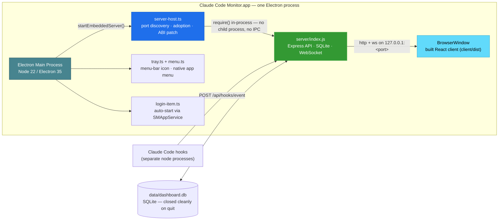

실행 시 앱은 다음을 수행합니다:

1. 사용 가능한 포트를 선택합니다 — **4820**을 우선으로 하고, **4821–4829**로 폴백하며, 모두 사용 중이면 임의의 높은 포트를 사용합니다.
2. 정상 동작 중인 대시보드 서버가 이미 `4820`에서 `/api/health`에 응답하면(예: 터미널에서 `npm start`를 실행한 경우), 이중 바인딩 대신 **해당 서버를 채택합니다** — 포트 충돌도, SQLite 경합도 없습니다. 채택된 서버는 앱을 종료한 후에도 계속 실행됩니다.
3. 그렇지 않으면 내장 서버를 부팅하고, **최초의 소유 서버 부팅** 시 Claude Code Hook을 자동 설치하고 백그라운드 서비스(업데이트 스케줄러, `cc-watcher`, 고아 실행 조정)를 시작합니다. 따라서 DMG만 사용하는 사용자도 **수동 설정 없이** 이벤트가 흐르기 시작합니다 — 체크아웃도, `npm run install-hooks`도 필요 없습니다.
4. **(macOS)** **Run Claude** 기능이 `claude` CLI를 찾아 실행할 수 있도록 **로그인 셸 `PATH`**를 복구합니다 — Finder/Dock에서 실행된 앱은 그렇지 않으면 launchd의 최소한의 `PATH`만 상속받아 `~/.local/bin`, `/opt/homebrew/bin`, 버전 관리자 bin 등에 있는 CLI를 찾지 못합니다. (Windows에서는 프로세스가 이미 사용자 `PATH`를 상속받습니다.)
5. 대시보드 창을 엽니다 — 단, 앱이 로그인 시 실행된 경우(macOS에서는 로그인 항목을 통해, Windows에서는 태그된 `HKCU\…\Run` 항목을 통해)에는 트레이 전용으로 유지됩니다.
6. 종료 시 내장 서버를 정상적으로 종료하고 **SQLite를 깔끔하게 닫습니다**(WAL 체크포인트).

### 기능

- **Tray와 window:** 왼쪽 클릭은 window를 전환하고, 오른쪽 클릭은 **Open Dashboard**, **Open in Browser**, **Restart Server**, **Show Logs**, **Open at Login**, **Quit**을 제공합니다. macOS는 tinted template tray glyph를 사용하고, Windows와 window/taskbar는 package되지 않은 development run을 포함해 컬러 app icon을 사용합니다.
- **Native menu:** 표준 application menu와 `⌘` / `Ctrl` shortcut을 제공합니다. macOS만 window가 숨겨진 동안 **File → Open Dashboard**(`⌘1`)를 유지하고, Windows/Linux는 tray를 통해 안정적으로 다시 엽니다.
- **Login과 lifecycle:** `SMAppService`가 macOS Login Items를 등록하고, Windows는 사용자별 `HKCU\Software\Microsoft\Windows\CurrentVersion\Run` 항목을 작성합니다. Window를 닫아도 tray와 server는 계속 실행되고, 두 번째 실행은 기존 단일 instance에 focus를 둡니다.
- **영구 data:** SQLite와 VAPID key는 bundle 외부의 `~/Library/Application Support/Claude Code Monitor/data/` 또는 `%APPDATA%\Claude Code Monitor\data\`에 유지됩니다. 재설치, update, 기본 NSIS uninstall은 가져온 history를 보존합니다.
- **CLI와 log:** macOS는 login-shell `PATH`를 복원해 Finder/Dock 실행에서도 `claude`를 실행할 수 있고, Windows는 상속된 사용자 `PATH`를 사용합니다. **Show Logs**는 `~/Library/Logs/Claude Code Monitor/desktop.log` 또는 `%APPDATA%\Claude Code Monitor\logs\desktop.log`를 엽니다.

### 받는 방법

**옵션 A — 사전 빌드된 설치 프로그램 다운로드(권장).** **[Releases → latest](https://github.com/hoangsonww/Claude-Code-Agent-Monitor/releases/latest)**에서 받을 수 있습니다(공개, GitHub 로그인 불필요). `master`에서 `package.json`의 버전이 올라갈 때마다 CI가 새 `vX.Y.Z` 릴리스를 자동 게시하므로, 이 링크는 항상 현재 빌드를 제공합니다:

| 플랫폼 | 에셋 | 비고 |
| --- | --- | --- |
| macOS (Apple Silicon) | `ClaudeCodeMonitor-<ver>-arm64.dmg` | `/Applications`로 드래그 |
| macOS (Intel) | `ClaudeCodeMonitor-<ver>-x64.dmg` | `/Applications`로 드래그 |
| Windows (설치 프로그램) | `ClaudeCodeMonitor-Setup-<ver>-x64.exe` | 사용자별 설치, 관리자 권한 불필요 |
| Windows (포터블) | `ClaudeCodeMonitor-<ver>-x64-portable.exe` | 설치 없이 실행 |

커밋별 최신 빌드도 CI 아티팩트로 제공됩니다(로그인 필요, 14일 보존): `🍎 macOS Desktop (DMG)` 잡의 `ClaudeCodeMonitor-dmg`와 `🪟 Windows Desktop (EXE)` 잡의 `ClaudeCodeMonitor-win`입니다 — 다음 릴리스 태그 전에 `master`를 테스트할 때 유용합니다.

**옵션 B — 직접 빌드하기.** 리포지토리 루트에서:

```bash
npm run setup                # 루트 + 클라이언트 의존성 설치, 클라이언트 빌드, Hook 설치
npm run build                # React 클라이언트 빌드 (client/dist)
npm run desktop:install      # Electron + electron-builder를 desktop/에 설치 (네이티브 의존성 사전 점검; 실패 시 설정 도움말 출력)
npm run desktop:dmg:arm64    # macOS:   빠른 단일 아키텍처 DMG → desktop/release/ClaudeCodeMonitor-<ver>-arm64.dmg
npm run desktop:win          # Windows: NSIS 설치 프로그램 → desktop/release/ClaudeCodeMonitor-Setup-<ver>-x64.exe
```

> [!NOTE]
> **DMG는 macOS에서, Windows `.exe`는 Windows에서 빌드됩니다** — electron-builder는 호스트 OS용으로 패키징합니다. macOS `npm run desktop:dmg` 빌드는 의도적으로 **느립니다** — 아키텍처마다 한 번씩(arm64와 x64로 각각) 앱을 빌드하고 임시 서명하여 아키텍처별 DMG 두 개(`ClaudeCodeMonitor-<ver>-arm64.dmg`와 `ClaudeCodeMonitor-<ver>-x64.dmg`)를 만들기 때문입니다. 유니버설 바이너리를 만들거나 `@electron/universal`로 병합하지 않으며, 릴리스에는 이 두 아키텍처별 DMG가 함께 제공됩니다. 본인의 Mac에서는 단일 아키텍처 `desktop:dmg:arm64` / `desktop:dmg:x64`를 사용하십시오. Windows에서는 `npm run desktop:install`이 `better-sqlite3`을 사전 빌드된 Electron 바이너리로 가져오므로, 일반적인 경우 Visual Studio C++ 툴체인이 필요 없습니다. 그래도 빌드가 실패하면(사전 빌드 바이너리가 없거나 C++ 툴체인이 없는 경우) `desktop:install`은 OS별 정확한 해결 방법과 툴체인이 필요 없는 대안을 출력하고, 손상된 설치를 남기는 대신 명확하게 실패합니다.

### 설치 방법

**macOS:**

1. `.dmg`를 더블클릭하여 마운트합니다.
2. **Claude Code Monitor.app**을 `/Applications` 폴더로 드래그합니다.
3. DMG는 기본적으로 **ad-hoc 서명**되어 있어 macOS Gatekeeper가 첫 실행 시 경고를 표시합니다(*"Apple could not verify…"*). 격리(quarantine) 속성을 제거하십시오:

   ```bash
   xattr -cr "/Applications/Claude Code Monitor.app"
   ```

   또는 **시스템 설정 → 개인정보 보호 및 보안**을 열고 **그래도 열기**를 클릭하십시오.

4. 앱을 실행합니다. 트레이 아이콘이 나타나고 대시보드 창이 열립니다.

**Windows:**

관리자 권한 없이 사용자별 `%LOCALAPPDATA%\Programs\Claude Code Monitor`에 설치하고 destination을 선택하려면 `ClaudeCodeMonitor-Setup-<ver>-x64.exe`를 실행하세요. 설치 없이 사용하려면 `*-portable.exe`를 실행하세요. 기본 unsigned build는 첫 실행 때 SmartScreen을 표시할 수 있습니다. **More info → Run anyway**를 선택하세요. Start 또는 desktop shortcut에서 실행하면 dashboard와 tray icon이 열립니다.

<p align="center">
  <a href="images/setup_win_wizard3.png"></a>
  <br>
  <em>🪟 <strong>Windows setup complete</strong> · installer를 마치고 Claude Code Monitor 실행</em>
</p>

### 빌드 명령어

모든 명령어는 **리포지토리 루트**에서 실행합니다:

| 명령어                      | 설명                                                                          |
| --------------------------- | ---------------------------------------------------------------------------- |
| `npm run desktop:install`   | Electron + electron-builder를 `desktop/`에 설치합니다. Electron의 ABI에 맞게 `better-sqlite3`을 다시 빌드하고, 네이티브 `better-sqlite3` 빌드를 사전 점검하며 실패 시 실행 가능한 설정 도움말(툴체인이 필요 없는 대안 포함)을 출력합니다 |
| `npm run desktop:build`     | 데스크톱 TypeScript 소스를 `desktop/out/`으로 컴파일합니다                    |
| `npm run desktop:dev`       | 로컬 반복 작업을 위해 Electron 앱을 빌드하고 실행합니다                       |
| `npm run desktop:test`      | 스모크 테스트를 실행합니다(Electron 실행, `/api/health` 확인, 종료)            |
| `npm run desktop:dmg`       | **macOS:** **아키텍처별 DMG 둘 다**(arm64 + x64)를 빌드합니다 — 릴리스에 적합하지만 아키텍처마다 한 번씩(두 번) 패키징하므로 **느림** |
| `npm run desktop:dmg:arm64` | **macOS:** Apple Silicon 전용 DMG를 빌드합니다 — **빠름**(~1분), 본인 Mac에 권장 |
| `npm run desktop:dmg:x64`   | **macOS:** Intel 전용 DMG를 빌드합니다 — **빠름**(~1분)                        |
| `npm run desktop:dmg:universal` | **macOS:** **하나의** 병합된 유니버설 DMG(arm64 + x86_64, 단일 파일) 빌드 — 선택 사항, **가장 느림**, 릴리스에 포함되는 것은 아님. |
| `npm run desktop:win`       | **Windows:** NSIS 설치 프로그램 `.exe`를 빌드합니다 (x64)                      |
| `npm run desktop:win:portable` | **Windows:** 설치가 필요 없는 포터블 `.exe`를 빌드합니다 (x64)              |

결과물인 macOS DMG는 **약 80 MB**(설치 후 디스크에서 약 250 MB)이며 Windows 설치 프로그램도 비슷한 크기입니다 — 표준적인 Electron 번들 오버헤드입니다.

### 서명 및 공증

macOS는 기본적으로 ad-hoc signing을 사용하고 `CSC_IDENTITY_AUTO_DISCOVERY=false`를 설정하므로 local certificate가 실수로 선택되지 않습니다. Developer ID signing은 `CSC_LINK`와 `CSC_KEY_PASSWORD`를 사용하고, notarization에는 `APPLE_ID`, `APPLE_TEAM_ID`, `APPLE_APP_SPECIFIC_PASSWORD`를 추가합니다. Windows는 기본적으로 unsigned이며 같은 `CSC_LINK`와 password 변수를 통해 Authenticode를 활성화합니다. Credential이 있으면 CI가 code 변경 없이 각 경로를 활성화합니다.

### 구현 노트

- **Native ABI:** `desktop/`은 Electron용으로 빌드된 `better-sqlite3`을 유지하고 `server/db.js`를 해당 copy로 redirect합니다. Root copy는 system Node 및 server test와 호환됩니다. Architecture별 DMG build 후 desktop `prebuild`가 local ABI를 자동 복구하고 binary가 없으면 setup 안내와 함께 일찍 실패합니다.
- **Server parity:** export된 `startBackgroundServices()`가 embedded server에 `node server/index.js`와 같은 update scheduler, config watcher, orphan reconciliation을 제공합니다. Standalone path와 다른 workspace의 동작은 바뀌지 않습니다.
- **CI와 release:** path-filtered macOS 및 Windows job이 smoke test를 실행하고 single-architecture DMG 2개와 NSIS, portable EXE를 upload합니다. `master`의 version bump는 모든 asset을 `vX.Y.Z`에 첨부합니다. `npm run build:win-icon`으로 `desktop/assets/icon.ico`를 다시 생성할 수 있습니다.

설치와 일상 사용은 [`DESKTOP.md`](./DESKTOP.md), process, lifecycle, port, build는 [`desktop/README.md`](./desktop/README.md)를 참조하세요.

---

## 데이터 저장소

- **엔진:** `better-sqlite3`(선택 사항) 또는 Node.js 내장 `node:sqlite`를 통한 SQLite 3
- **위치:** `data/dashboard.db`
- **저널 모드:** WAL(쓰기 중 동시 읽기)
- **초기화:** 모든 데이터를 지우려면 `data/dashboard.db`를 삭제합니다

### 엔티티 관계 다이어그램

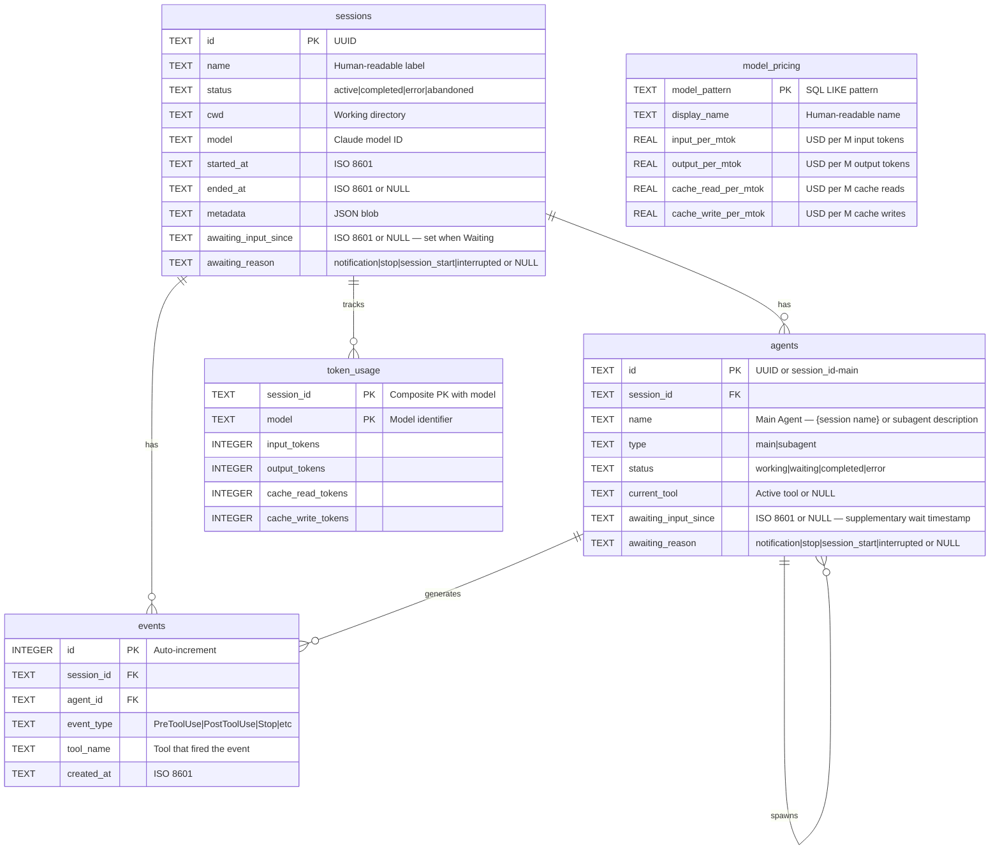

---

## 플러그인 마켓플레이스

CCAM은 하나의 공유 source tree에서 **14개 플러그인**을 제공합니다. Claude Code는 `.claude-plugin/marketplace.json`을 읽고, Codex는 `.agents/plugins/marketplace.json`과 각 plugin의 `.codex-plugin/plugin.json`을 읽습니다. Bundle에는 **66개 번들 스킬, 18개 Claude Subagent, 34개 Claude command, 3개 CLI helper, 3개 Hook configuration, 2개 MCP-enabled plugin**이 포함됩니다.

```bash
# Claude Code
claude plugin marketplace add hoangsonww/Claude-Code-Agent-Monitor
claude plugin install ccam-platform@claude-code-agent-monitor-plugins

# Codex
codex plugin marketplace add hoangsonww/Claude-Code-Agent-Monitor
codex plugin add ccam-platform@claude-code-agent-monitor-plugins

# Open Agent Skills / skills.sh-compatible CLI
npx skills add hoangsonww/Claude-Code-Agent-Monitor --list

# Install one skill for Claude Code and Codex in the current project
npx skills add hoangsonww/Claude-Code-Agent-Monitor \
  --skill mcp-server \
  --agent claude-code \
  --agent codex \
  --yes

# Verify, update, and remove the project-scoped skill
npx skills list --json
npx skills update --project --yes
npx skills remove mcp-server --yes

# Add --global to install at user scope, then manage that scope explicitly
npx skills add hoangsonww/Claude-Code-Agent-Monitor \
  --skill mcp-server \
  --agent claude-code \
  --agent codex \
  --global \
  --yes
npx skills list --global --json
npx skills update --global --yes
npx skills remove --global mcp-server --yes
```

`skills` CLI는 66개 plugin skill과 repository-maintenance skill을 포함해 총 **77개 스킬**을 찾습니다. Project 설치는 `.agents/skills/`와 Agent별 link를 사용합니다. Global Claude Code skill의 기본 위치는 `~/.claude/skills/`이며, `$CLAUDE_CONFIG_DIR/skills/`이 설정되면 해당 위치를 사용합니다. Global Codex skill의 기본 위치는 `~/.codex/skills/`이며, `$CODEX_HOME/skills/`이 설정되면 해당 위치를 사용합니다. Multi-agent 설치는 공유 store를 통해 file을 중복 제거하고 destination을 link할 수 있습니다. 모든 plugin skill에는 canonical `name`/`description` frontmatter와 `agents/openai.yaml` metadata가 있습니다. 설치를 위해 `vercel-labs/skills`에 upstream PR을 만들 필요는 없습니다. Public GitHub repository가 source이며, skills.sh 노출 여부는 publication과 실제 install telemetry를 따릅니다.

새로운 focused pack은 기존 analytics, productivity, quality, sessions, workflows, config, dashboard plugin을 보완합니다.

- `ccam-runner`: monitoring되는 Claude Code/Codex 시작, 후속 입력, 정지, 재개, run history
- `ccam-integrations`: alert rule, webhook, push notification, SSH remote collection
- `ccam-platform`: Claude/Codex Config Explorer, provider-aware import, backup restore, Hook setup, update, MCP operation
- `ccam-reports`: stakeholder용 executive, cost, reliability, workflow report

다음 명령으로 distribution metadata를 검증하고 다시 생성합니다.

```bash
npm run extensions:sync
npm run extensions:validate
```

전체 catalog, 설치 명령, skills.sh 동작, public-submission boundary, clean-install check는 [docs/PLUGINS.md](docs/PLUGINS.md)에서 확인할 수 있습니다.

---

## Statusline

모델 이름, 사용자, 작업 디렉터리, git 브랜치, 컨텍스트 윈도우 사용량 바, 방향별 토큰 수, 세션 비용을 표시하는 Claude Code용 독립 실행형 CLI statusline 유틸리티입니다 -- 모두 ANSI 이스케이프 시퀀스로 색상이 지정됩니다.

```
nguyens6@host ~/agent-dashboard/client | Sonnet 4.6 | main | ████████░░ 79% | 3↑ 2↓ 156586c | $0.4231
```

| 세그먼트    | 색상                 | 예시                                                            |
| ----------- | -------------------- | -------------------------------------------------------------- |
| 모델        | 시안                 | `Sonnet 4.6`                                                   |
| 사용자      | 초록                 | `nguyens6`                                                     |
| CWD         | 노랑                 | `~/agent-dashboard`                                            |
| Git 브랜치  | 마젠타               | `main`                                                         |
| 컨텍스트 바 | 초록 / 노랑 / 빨강   | `████████░░ 79%`                                               |
| 토큰        | 초록 / 시안 / 흐림   | `3↑ 2↓ 156586c` (초록 `↑` 입력, 시안 `↓` 출력, 흐림 `c` 캐시)   |
| 비용 (USD)  | 초록 / 노랑 / 빨강   | `$0.4231` (세션 합계 — API 및 구독 플랜에서 표시)               |

비용 색상 임계값: $5 미만은 초록, $5–$20는 노랑, $20 이상은 빨강입니다.

설치 방법은 [`statusline/README.md`](statusline/README.md)를 참조하십시오.

<p align="center">
  <a href="images/statusline.png"></a>
</p>

---

## 서버 아키텍처

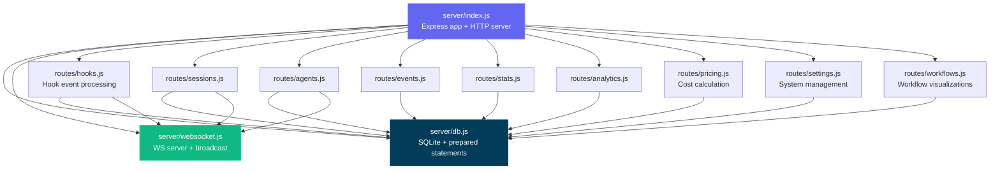

---

## 클라이언트 라우팅

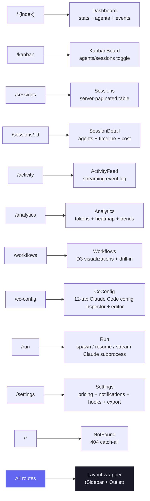

---

## Hook 핸들러 흐름

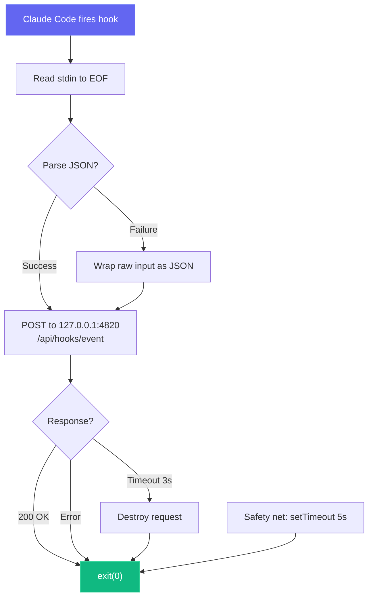

---

## 배포 모드

서로 다른 프로세스 아키텍처를 사용하는 개발 및 프로덕션 배포 모드를 모두 지원합니다:

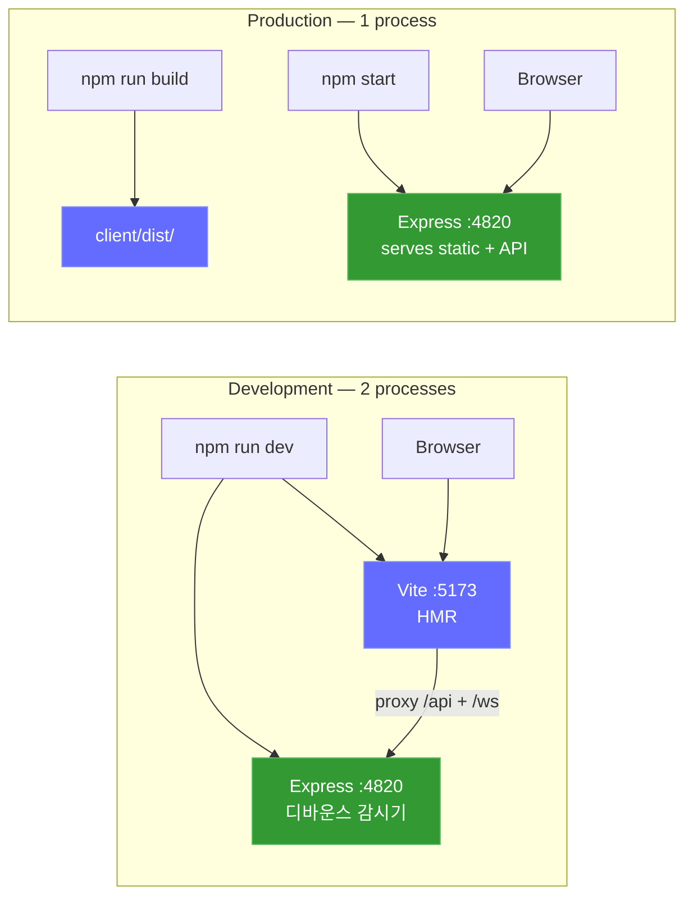

선택 사항인 로컬 MCP 사이드카(stdio, HTTP+SSE, REPL 전송 방식 지원):

```mermaid
graph LR
    subgraph "MCP Transport Options"
        M_STDIO["MCP Server (stdio)<br/>npm run mcp:start"]
        M_HTTP["MCP Server (HTTP)<br/>npm run mcp:start:http<br/>:8819"]
        M_REPL["MCP Server (REPL)<br/>npm run mcp:start:repl"]
    end

    H["MCP Host"] -->|"stdin/stdout"| M_STDIO
    RC["Remote Client"] -->|"POST /mcp · GET /sse"| M_HTTP
    OP["Operator"] -->|"interactive CLI"| M_REPL

    M_STDIO --> D["Dashboard Server<br/>:4820"]
    M_HTTP --> D
    M_REPL --> D

    style M_STDIO fill:#0f766e,stroke:#14b8a6,color:#fff
    style M_HTTP fill:#0f766e,stroke:#14b8a6,color:#fff
    style M_REPL fill:#0f766e,stroke:#14b8a6,color:#fff
```

선택 사항인 **데스크톱 앱(macOS & Windows)** — Express 서버를 인프로세스로 호스팅하는 단일 Electron 프로세스입니다(터미널 없음, 자식 프로세스 없음):

```mermaid
flowchart LR
    subgraph desktop["Desktop App (macOS & Windows) — 1 Electron process"]
        E_MAIN["Electron Main Process<br/>(Node 22 / Electron 35)"]
        E_HOST["server-host.ts<br/>require() server/index.js"]
        E_SRV["Embedded Express :4820<br/>API · SQLite · WebSocket"]
        E_WIN["BrowserWindow<br/>built React client"]
        E_TRAY["Menu-bar (tray) icon<br/>+ native app menu"]
        E_MAIN --> E_HOST
        E_HOST -->|"in-process require()"| E_SRV
        E_MAIN --> E_TRAY
        E_SRV -->|"http + ws on 127.0.0.1"| E_WIN
    end

    E_HOOKS["Claude Code hooks"] -->|"POST /api/hooks/event"| E_SRV

    style E_MAIN fill:#47848F,stroke:#2f5a62,color:#fff
    style E_SRV fill:#339933,stroke:#5cb85c,color:#fff
    style E_WIN fill:#61DAFB,stroke:#3aa9c9,color:#000
```

### 클라우드 배포

`deployments/`는 EKS, GKE, AKS, OKE 및 자체 관리형 클러스터를 포함한 모든 호환 Kubernetes 환경을 대상으로 합니다. CCAM은 SQLite를 사용하므로 모든 지원 manifest는 Recreate 전략과 함께 **persistent volume마다 정확히 하나의 활성 dashboard writer**를 강제합니다. SQLite가 persistence backend인 동안 HPA, active-active, 다중 replica, blue-green, canary는 지원하지 않습니다.

- **Helm:** schema가 다중 replica/HPA를 거부하고 image digest, retained PVC, Ingress 또는 Gateway API, 외부 Secret, NetworkPolicy, 선택적 MCP 및 ServiceMonitor를 지원합니다.
- **Kustomize:** Restricted PSS base, dev/staging/production overlay, MCP·monitoring·Gateway API·CSI snapshot component를 제공합니다.
- **Terraform:** 검증된 Helm chart를 기존 Kubernetes cluster에 배포합니다. Cloud networking, identity, CSI, TLS, secret sync는 플랫폼 계층이 소유합니다.
- **Operations:** SQLite online backup, integrity check, SHA-256, scale-to-zero restore, deploy/rollback/teardown 전 백업, 인증된 health check를 제공합니다.
- **CI supply chain:** app 및 MCP image를 scan하고 amd64/arm64로 게시하며 SBOM, SLSA provenance, Cosign keyless signature를 첨부합니다.

```bash
npm run deploy:validate
REGISTRY="ghcr.io/$(gh repo view --json owner -q .owner.login)"
IMAGE_TAG="$(git rev-parse --short HEAD)"

helm upgrade --install agent-monitor deployments/helm/agent-monitor \
  --namespace agent-monitor-production --create-namespace \
  --values deployments/helm/agent-monitor/values-production.yaml \
  --set image.registry= \
  --set image.repository=${REGISTRY}/claude-code-agent-monitor \
  --set image.tag=${IMAGE_TAG} \
  --atomic --wait --timeout 10m
```

> [!NOTE]
> Secret, Docker/Podman, Gateway API, Terraform, backup, restore, rollback은 [DEPLOYMENT.md](DEPLOYMENT.md)와 [deployments/README.md](deployments/README.md)를 참조하십시오.

---

## 프로젝트 구조

```
agent-dashboard/
|-- CLAUDE.md                   # Claude Code 프로젝트 메모리 및 작업 규약
|-- AGENTS.md                   # Codex 프로젝트 지침
|-- package.json                # 루트 스크립트(대시보드 + MCP 헬퍼) + 서버 의존성
|-- .claude/
|   +-- rules/                  # 경로 범위가 지정된 Claude 규칙
|   +-- skills/                 # Claude 재사용 가능 프로젝트 스킬
|   +-- agents/                 # Claude 커스텀 서브에이전트
|-- .claude-plugin/
|   +-- marketplace.json        # Claude Code 마켓플레이스 매니페스트(플러그인 14개)
|-- .agents/plugins/
|   +-- marketplace.json        # Codex 마켓플레이스 매니페스트(플러그인 14개)
|-- plugins/
|   |-- ccam-analytics/         # 분석: 세션 리포트, 비용 분석, 사용 추세, 생산성 점수
|   |   |-- .claude-plugin/plugin.json
|   |   |-- skills/ (4)         # session-report, cost-breakdown, usage-trends, productivity-score
|   |   |-- agents/             # analytics-advisor (Sonnet 모델)
|   |   |-- hooks/hooks.json    # Stop + SubagentStop 이벤트 로깅
|   |   +-- bin/ccam-stats      # 터미널 대시보드 CLI
|   |-- ccam-productivity/      # 생산성: 스탠드업, 리포트, 스프린트, 워크플로 최적화 도구
|   |-- ccam-devtools/          # DevTools: 디버그, 진단, 내보내기, 상태 점검
|   |   +-- bin/                # ccam-doctor + ccam-export CLI
|   |-- ccam-insights/          # 인사이트: 패턴, 이상 징후, 최적화, 비교
|   |-- ccam-cost-guard/        # 비용 가드레일: 예산, 지출 예측, 비용 알림, 모델 절감
|   |-- ccam-sessions/          # 세션 포렌식: 검색, 타임라인, 트랜스크립트 재생, cwd 롤업, 정리
|   |-- ccam-workflows/         # 워크플로 오케스트레이션: DAG 맵, 위임 감사, 동시성, 플릿 실행
|   |-- ccam-quality/           # 신뢰성 및 SLO: 오류 스캔, API 오류 리포트, Hook 실패 감사, SLO 점검
|   |-- ccam-config/            # 설정 및 메모리 거버넌스: 설정 감사, 메모리 리뷰, 스킬/MCP/Hook 인벤토리
|   +-- ccam-dashboard/         # 대시보드 커넥터: 상태, 빠른 통계, MCP 통합
|       +-- .mcp.json           # MCP 서버 설정
|-- server/
|   |-- index.js                 # Express 앱, HTTP 서버, 정적 파일 제공
|   |-- db.js                    # SQLite 스키마, 마이그레이션, prepared statement
|   |-- websocket.js             # 하트비트를 갖춘 WebSocket 서버
|   +-- routes/
|       |-- hooks.js             # Hook 이벤트 처리(트랜잭션 기반)
|       |-- sessions.js          # 세션 CRUD
|       |-- agents.js            # 에이전트 CRUD
|       |-- events.js            # 이벤트 목록 조회
|       |-- stats.js             # 집계 통계
|       |-- analytics.js         # 토큰, 도구, 추세 분석
|       |-- workflows.js         # 워크플로 데이터 집계 및 세션별 드릴인
|       |-- pricing.js           # 모델 가격 CRUD 및 비용 계산
|       +-- settings.js          # 시스템 정보, 데이터 관리, 내보내기, 정리
|   +-- lib/
|       +-- transcript-cache.js  # stat 기반 JSONL 트랜스크립트 캐시. 청크 단위 동기 바이트 스트림 리더(4 MiB 청크, 줄 단위 UTF-8 디코드)를 사용하여 V8의 최대 문자열 길이(~512 MiB)보다 큰 파일도 "FATAL ERROR: v8::ToLocalChecked Empty MaybeLocal"로 Node가 중단되는 일 없이 파싱됩니다. 토큰, 컴팩션, API 오류, 턴 소요 시간, thinking 블록, usage 추가 정보(service_tier, speed, inference_geo)를 추출합니다
|   +-- compat-sqlite.js         # node:sqlite 호환성 래퍼(better-sqlite3의 폴백)
|-- client/
|   |-- package.json             # 클라이언트 의존성
|   |-- index.html               # HTML 진입점
|   |-- vite.config.ts           # Vite + 프록시 설정
|   |-- tailwind.config.js       # 커스텀 다크 테마
|   |-- tsconfig.json            # 엄격한 TypeScript
|   +-- src/
|       |-- main.tsx             # React 진입점
|       |-- App.tsx              # 라우터 + WebSocket 프로바이더
|       |-- index.css            # Tailwind + 커스텀 유틸리티
|       |-- lib/
|       |   |-- types.ts         # 공유 TypeScript 인터페이스
|       |   |-- api.ts           # 타입이 지정된 fetch 클라이언트
|       |   |-- format.ts        # 날짜/시간 포매팅 유틸리티
|       |   +-- eventBus.ts      # WebSocket 분배를 위한 pub/sub
|       |-- hooks/
|       |   |-- useWebSocket.ts      # 자동 재연결 WebSocket Hook
|       |   +-- useNotifications.ts  # WebSocket 이벤트 기반 브라우저 알림 트리거
|       |-- components/
|       |   |-- Layout.tsx       # 사이드바 + 아웃렛을 갖춘 셸
|       |   |-- Sidebar.tsx      # 내비게이션 + 연결 상태 표시기
|       |   |-- AgentCard.tsx    # 상태가 표시되는 에이전트 정보 카드
|       |   |-- StatCard.tsx     # 지표 카드
|       |   |-- StatusBadge.tsx  # 색상으로 구분된 상태 배지
|       |   |-- EmptyState.tsx   # 빈 목록용 플레이스홀더
|       |   +-- workflows/       # D3.js 워크플로 시각화 컴포넌트
|       |       |-- OrchestrationDAG.tsx            # 에이전트 생성 패턴의 수평 DAG
|       |       |-- ToolExecutionFlow.tsx           # 도구 간 전환의 d3-sankey 다이어그램
|       |       |-- AgentCollaborationNetwork.tsx   # 포스 다이렉티드 에이전트 파이프라인 그래프
|       |       |-- SubagentEffectiveness.tsx       # SVG 성공률 링을 갖춘 스코어카드 그리드
|       |       |-- WorkflowPatterns.tsx            # 자동 감지된 오케스트레이션 시퀀스
|       |       |-- ModelDelegationFlow.tsx         # 에이전트 계층을 통한 모델 라우팅
|       |       |-- ErrorPropagationMap.tsx         # 계층 깊이별 오류 클러스터링
|       |       |-- ConcurrencyTimeline.tsx         # 스윔레인 병렬 에이전트 실행
|       |       |-- SessionComplexityScatter.tsx    # D3 버블 차트(소요 시간 vs 에이전트 vs 토큰)
|       |       |-- CompactionImpact.tsx            # 토큰 압축 이벤트 및 복구
|       |       |-- WorkflowStats.tsx               # 워크플로 집계 통계
|       |       +-- SessionDrillIn.tsx              # 세션별 에이전트 트리, 도구 타임라인, 이벤트
|       +-- pages/
|           |-- Dashboard.tsx      # 개요 페이지
|           |-- KanbanBoard.tsx    # 에이전트/세션 전환, 상태 컬럼
|           |-- Sessions.tsx       # 서버 페이지네이션 세션 테이블
|           |-- SessionDetail.tsx  # 단일 세션 심층 분석
|           |-- ActivityFeed.tsx   # 실시간 이벤트 스트림
|           |-- Analytics.tsx      # 토큰 사용량, 히트맵, 추세
|           |-- Workflows.tsx      # D3.js 워크플로 시각화 및 세션 드릴인
|           |-- Settings.tsx       # 모델 가격, 알림, Hook, 내보내기, 정리
|           +-- NotFound.tsx       # 404 캐치올 페이지
|-- scripts/
|   |-- hook-handler.js          # 경량 stdin-HTTP 포워더
|   |-- install-hooks.js         # ~/.claude/settings.json 자동 구성
|   |-- import-history.js        # 향상된 JSONL 추출(API 오류, 턴 소요 시간, entrypoint, 권한 모드, thinking 블록, usage 추가 정보, 도구 오류, 서브에이전트 JSONL 파일)과 함께 ~/.claude/에서 세션을 가져옵니다. 재가져오기는 완전한 증분 방식입니다: 이벤트 타입별 최고 수위점(세션별 `MAX(created_at) GROUP BY event_type`)을 사전에 계산하고 `ts > cutoff[type]`인 JSONL 항목만 삽입하므로, 트랜스크립트가 여러 날에 걸쳐 늘어나는 장기 실행 세션도 재실행할 때마다 Stop / PostToolUse / TurnDuration / ToolError 이벤트를 계속 받습니다. 또한 JSONL이 저장된 값을 지나 진행되면 `sessions.ended_at`을 앞으로 이동시키고 매 실행마다 메시지 수 메타데이터를 갱신합니다
|   +-- seed.js                  # 샘플 데이터 생성기
|-- mcp/
|   |-- package.json             # MCP 패키지 스크립트 + 의존성
|   |-- README.md                # MCP 설정, 호스트 구성, 도구 카탈로그, 안전 모델
|   |-- src/
|   |   |-- index.ts             # MCP 런타임 진입점(전송 라우터)
|   |   |-- server.ts            # MCP 서버 조립
|   |   |-- clients/             # 재시도/백오프를 갖춘 대시보드 API 클라이언트
|   |   |-- config/              # 환경 변수/CLI 설정 파싱
|   |   |-- core/                # 로거, 도구 레지스트리, 결과 헬퍼
|   |   |-- policy/              # 변경/파괴적 작업 가드
|   |   |-- tools/               # 103개 도구를 등록하는 16개 도메인 모듈
|   |   |-- transports/          # HTTP+SSE 서버, REPL, 도구 컬렉터
|   |   |-- ui/                  # ANSI 배너, 색상, 포매터, 테이블
|   |   +-- types/               # 공유 MCP 타입 정의
|   +-- build/                   # 빌드된 MCP 런타임 출력
|-- desktop/
|   |-- package.json             # Electron + electron-builder 의존성 및 스크립트
|   |-- electron-builder.yml     # DMG 패키징 설정; 서명/공증 Hook
|   |-- tsconfig.json            # 엄격한 TypeScript (src/ -> out/)
|   |-- README.md                # 데스크톱 앱 아키텍처 레퍼런스(기여자 문서)
|   |-- assets/                  # icon.svg + 생성된 icon.icns + 트레이 PNG
|   |-- src/
|   |   |-- main.ts              # Electron 메인 프로세스 진입점 — 라이프사이클, 연결 구성
|   |   |-- server-host.ts       # 인프로세스 Express 부팅, 포트 탐색, 기존 서버 인수, DB 종료
|   |   |-- window.ts            # BrowserWindow + 유지되는 창 위치/크기
|   |   |-- tray.ts              # 메뉴 막대(트레이) 아이콘 + 컨텍스트 메뉴
|   |   |-- menu.ts              # 네이티브 애플리케이션 메뉴(File ▸ Open Dashboard는 macOS 전용)
|   |   |-- login-item.ts        # macOS 로그인 항목 자동 시작 전환(SMAppService)
|   |   |-- logger.ts            # 파일 로거 -> ~/Library/Logs/Claude Code Monitor/desktop.log
|   |   |-- constants.ts         # 앱 이름, 포트, 타임아웃, 창 크기
|   |   +-- preload.ts           # 의도적으로 비어 있음(렌더러 권한 제로)
|   |-- scripts/
|   |   |-- install.js           # desktop:install을 위한 네이티브 의존성 사전 점검; 실패 시 설정 도움말을 출력하고 0이 아닌 코드로 종료
|   |   |-- preflight.js         # 공유 better-sqlite3 바이너리 점검 + OS별 실행 가능한 설정 도움말(툴체인 없는 대안 포함)
|   |   |-- prebuild.js          # tsc 전에 루트 + 클라이언트가 빌드되었는지 보장; 네이티브 바이너리가 없으면 설정 도움말과 함께 즉시 실패
|   |   |-- build-icons.sh       # qlmanage/sips/iconutil을 통한 SVG -> PNG/ICNS 변환
|   |   +-- notarize.js          # electron-builder afterSign Hook(옵트인 공증)
|   +-- tests/
|       +-- smoke.test.mjs       # Electron 실행 + /api/health 프로브
|-- deployments/
|   |-- README.md                # 프로덕션 배포 레퍼런스
|   |-- nginx/                   # Rootless Nginx edge 및 opt-in Hook/MCP 정책
|   |-- secrets/                 # Git에서 제외되는 Compose token/password 파일
|   |-- terraform/               # 기존 Kubernetes cluster에 Helm 배포
|   |-- kubernetes/              # Single-writer Kustomize base 및 환경 overlay
|   |   |-- base/                # Restricted PSS, Recreate Deployment, PVC, Service, Ingress
|   |   |-- overlays/            # dev, staging, production namespace와 리소스
|   |   +-- components/          # MCP, ServiceMonitor, Gateway API, VolumeSnapshot
|   |-- helm/agent-monitor/      # Schema로 안전성을 강제하는 Helm chart와 환경 values
|   +-- scripts/                 # validate, deploy, backup, restore, rollback, health, teardown
|-- .codex/
|   |-- config.toml              # Codex 런타임 설정
|   |-- README.md                # 에이전트와 스킬을 위한 Codex 설정 가이드
|   |-- rules/                   # Codex 실행 정책 규칙
|   |-- agents/                  # Codex 커스텀 에이전트 템플릿
|   +-- skills/                  # Codex 프로젝트 스킬
|-- statusline/
|   |-- README.md                # Statusline 설치 및 사용 가이드
|   |-- statusline.py            # statusline을 렌더링하는 Python 스크립트
|   +-- statusline-command.sh    # Claude Code의 statusLine 설정용 셸 래퍼
+-- data/
    +-- dashboard.db             # SQLite 데이터베이스(gitignore 처리됨)
```

---

## 문제 해결

| 문제                              | 해결 방법                                                                                                                                                        |
| --------------------------------- | ---------------------------------------------------------------------------------------------------------------------------------------------------------------- |
| `better-sqlite3` 설치 실패        | 치명적이지 않습니다 — 서버가 Node.js 내장 `node:sqlite`로 자동 폴백합니다(Node 22+). 이전 Node 버전에서는 Python 3와 C++ 빌드 도구를 설치한 후 `npm rebuild better-sqlite3`를 실행하십시오 |
| Hook이 실행되지 않음              | `npm run install-hooks`를 실행하고 Claude Code를 재시작하십시오. `~/.claude/settings.json`에 Hook이 존재하는지 확인하십시오                                       |
| 대시보드에 데이터가 표시되지 않음 | Claude Code 세션을 시작하기 전에 서버가 실행 중인지(`npm run dev`) 확인하십시오. `http://localhost:4820/api/health`를 확인하십시오                                |
| WebSocket 연결 끊김               | 클라이언트는 2초마다 자동으로 재연결합니다. 포트 4820이 방화벽에 의해 차단되지 않았는지 확인하십시오                                                              |
| 재시작 후 오래된 데이터           | 데이터베이스는 재시작 후에도 유지됩니다. 새 데모 데이터를 원하면 `npm run seed`를 실행하고, 초기화하려면 `data/dashboard.db`를 삭제하십시오                       |
| MCP 도구 연결 실패                | `MCP_DASHBOARD_BASE_URL`에서 대시보드 API가 실행 중인지 확인하고 MCP를 다시 빌드/시작하십시오(`npm run mcp:build`, `npm run mcp:start`)                           |

---

## 기여하기

기여를 환영합니다 — 전체 가이드는 [`.github/CONTRIBUTING.md`](.github/CONTRIBUTING.md)를 참조하십시오.

모든 기여자는 [Contributor License Agreement](https://github.com/hoangsonww/Claude-Code-Agent-Monitor/blob/master/CLA.md)에 서명해야 합니다. 이는 `🖋️ CLA Assistant` GitHub Action에 의해 모든 풀 리퀘스트에서 자동으로 적용됩니다: 처음 PR을 열면 봇이 `I have read the CLA Document and I hereby sign the CLA`라고 댓글을 달아 서명하도록 요청합니다. 서명할 때까지 PR의 **CLA Assistant** 상태 검사는 빨간색으로 유지되며, 한 번 서명하면 이후의 모든 기여에 적용됩니다.

---

## 라이선스

MIT. 자세한 내용은 [LICENSE](LICENSE)를 참조하십시오.
