# Painel de agentes para Claude Code, Cursor e Codex

### Plataforma de monitoramento em tempo real da atividade dos agentes do Claude Code, Cursor e Codex 🚀

Um painel profissional para acompanhar e visualizar em tempo real as sessões de agentes do Claude Code, Cursor e Codex, o uso de ferramentas, o histórico de conversas, os custos e a orquestração de subagentes. Construído com Node.js, Express, React e SQLite, ele combina hooks nativos com a descoberta local de transcrições específica de cada provedor.


> [!TIP]
> Veja também: [README.md](./README.md) (English), [README-CN.md](./README-CN.md) (中文版本), [README-VN.md](./README-VN.md) (Phiên bản tiếng Việt), [README-KO.md](./README-KO.md) (한국어 버전), [README-ES.md](./README-ES.md) (versión en español), [README-FR.md](./README-FR.md) (version française), [README-DE.md](./README-DE.md) (deutsche Version) e [README-IT.md](./README-IT.md) (versione italiana) para documentação localizada com dicas e boas práticas específicas de cada região.

> [!NOTE]
> Precisa de ajuda orientada a tarefas? O [Wiki do GitHub](https://github.com/hoangsonww/Claude-Code-Agent-Monitor/wiki) é o manual prático para o uso diário, a operação em equipe, a solução de problemas, a automação via CLI/MCP e as receitas de implantação. O [Wiki estático localizado](https://hoangsonww.github.io/Claude-Code-Agent-Monitor/wiki/) continua sendo o tour do produto e da arquitetura em inglês, vietnamita, chinês, coreano, espanhol, francês, alemão, português e italiano; os contratos técnicos exatos ficam em [`docs/`](./docs/README.md).

---

## Índice

- [Visão geral](#visão-geral)
- [Internacionalização (i18n)](#internacionalização-i18n)
- [Recursos](#recursos)
- [Início rápido](#início-rápido)
- [Como funciona](#como-funciona)
- [Configuração](#configuração)
- [Scripts npm](#scripts-npm)
- [Marketplace de plugins](#marketplace-de-plugins)
- [Extensões de agente](#extensões-de-agente)
- [Integração MCP](#integração-mcp)
- [Referência da API](#referência-da-api)
- [Eventos de hook](#eventos-de-hook)
- [Notificações do navegador](#notificações-do-navegador)
- [Notificador de atualizações](#notificador-de-atualizações)
- [Tabby — o gato companheiro flutuante](#tabby--o-gato-companheiro-flutuante)
- [Sinais sonoros](#sinais-sonoros)
- [Janela de status da conexão](#janela-de-status-da-conexão)
- [Extensão do VS Code](#extensão-do-vs-code)
- [App de desktop (macOS e Windows)](#app-de-desktop-macos-e-windows)
- [Armazenamento de dados](#armazenamento-de-dados)
- [Linha de status](#linha-de-status)
- [Arquitetura do servidor](#arquitetura-do-servidor)
- [Roteamento do cliente](#roteamento-do-cliente)
- [Fluxo do manipulador de hooks](#fluxo-do-manipulador-de-hooks)
- [Modos de implantação](#modos-de-implantação)
- [Estrutura do projeto](#estrutura-do-projeto)
- [Solução de problemas](#solução-de-problemas)
- [Como contribuir](#como-contribuir)
- [Licença](#licença)

---

## Visão geral

Acompanhe sessões, monitore agentes em tempo real, visualize o uso de ferramentas, reproduza conversas e observe a orquestração de subagentes em uma interface web profissional com tema escuro. O Claude Code e o Codex usam seus hooks nativos; o Cursor vem incluído por meio de seus eventos ao vivo compatíveis e da descoberta nativa de transcrições em `~/.cursor`.

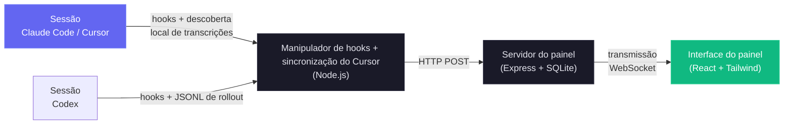
```mermaid
graph LR
    A["Sessão<br/>Claude Code / Cursor"] -->|hooks + descoberta<br/>local de transcrições| B["Manipulador de hooks + sincronização do Cursor<br/>(Node.js)"]
    X["Sessão<br/>Codex"] -->|hooks + JSONL de rollout| B
    B -->|HTTP POST| C["Servidor do painel<br/>(Express + SQLite)"]
    C -->|transmissão<br/>WebSocket| D["Interface do painel<br/>(React + Tailwind)"]
    style A fill:#6366f1,stroke:#818cf8,color:#fff
    style B fill:#1a1a28,stroke:#2a2a3d,color:#e4e4ed
    style C fill:#1a1a28,stroke:#2a2a3d,color:#e4e4ed
    style D fill:#10b981,stroke:#34d399,color:#fff
```

### Suporte ao Cursor

O Cursor não exige nenhuma configuração separada: selecionar **Claude Code** na tela inicial também ativa o monitoramento do Cursor. Um observador do sistema de arquivos descobre `~/.cursor/chats/*/<session>/meta.json` assim que `agent` inicia, antes mesmo de o Cursor criar uma transcrição; as alterações em `prompt_history.json` atualizam o cartão da sessão, o estado de trabalho e a conversa assim que um prompt é enviado. Quando `~/.cursor/projects/*/agent-transcripts` chega, o painel o mescla na conversa pendente sem duplicar o turno do usuário, enriquece títulos, projetos, turnos e subagentes nativos e guarda instantâneos dos JSONL principais e dos subagentes, para que a conversa continue disponível depois que o Cursor limpar o próprio histórico.

Os cartões do Cursor recebem títulos nativos `Cursor · <title>` e subtítulos de projeto, turnos e subagentes. Os custos usam uma tabela **Preços do Cursor** própria e editável nas configurações (cobrindo Cursor Grok 4.6/4.5, Composer 2.5 e o catálogo publicado de modelos de terceiros), em vez de usar os preços do Claude ou do Codex. Substitua a raiz de origem com `DASHBOARD_CURSOR_HOME`; ajuste a verificação periódica de reserva com `DASHBOARD_CURSOR_SYNC_MS` (`0` desativa apenas a varredura periódica; a observação ao vivo do sistema de arquivos continua ativa).

Além do painel de monitoramento em tempo real, o projeto inclui uma implementação de servidor MCP local em `mcp/` que expõe um catálogo de ferramentas para inspecionar e gerenciar o próprio painel, facilitando integrar suas operações diretamente aos seus fluxos no Claude Code e no Codex. Há também uma camada de extensões de agente, que oferece plugins, skills e subagentes do Claude Code e do Codex para interação com o painel, análises e inteligência de fluxos.

### Internacionalização (i18n)

A interface traz troca de idioma integrada para inglês (`en`), chinês (`zh`), vietnamita (`vi`), coreano (`ko`), espanhol (`es`), francês (`fr`), alemão (`de`), português (`pt`) e italiano (`it`). Um menu suspenso de idioma personalizado evita que o seletor sobrecarregue a barra lateral à medida que novos idiomas são adicionados. Os recursos de idioma são carregados por namespace e mantidos no armazenamento do navegador, para uma preferência estável entre recarregamentos.

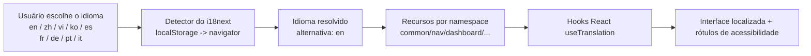
```mermaid
flowchart LR
    A["Usuário escolhe o idioma<br/>en / zh / vi / ko / es<br/>fr / de / pt / it"] --> B["Detector do i18next<br/>localStorage -> navigator"]
    B --> C["Idioma resolvido<br/>alternativa: en"]
    C --> D["Recursos por namespace<br/>common/nav/dashboard/..."]
    D --> E["Hooks React useTranslation"]
    E --> F["Interface localizada + rótulos de acessibilidade"]
```

Para a arquitetura completa e as orientações operacionais, veja [docs/I18N.md](./docs/I18N.md).

### Interface do usuário

Vem com um tema escuro elegante, design responsivo e navegação intuitiva para explorar a atividade dos seus agentes:

<p align="center">
  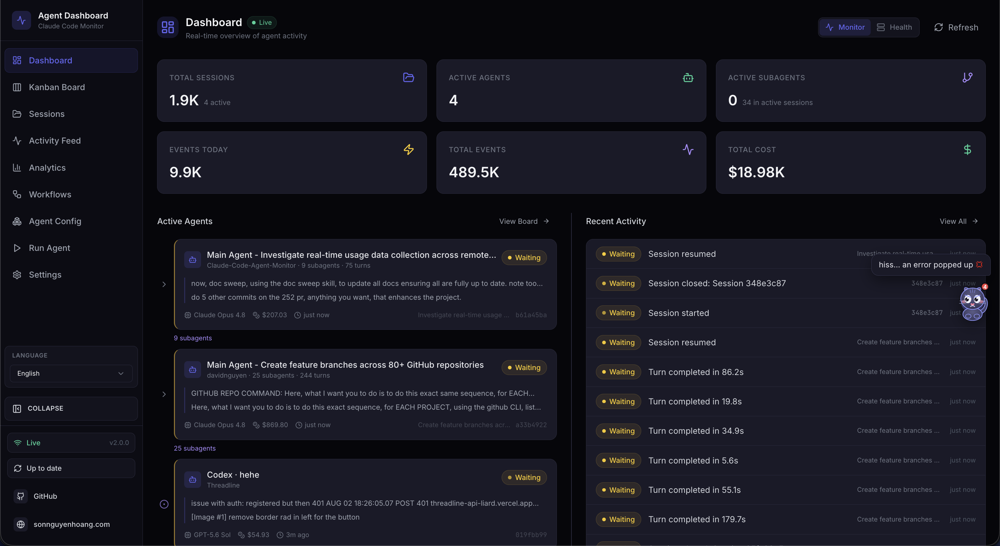
  <br>
  <em>📡 <strong>Painel · Monitoramento</strong> — estatísticas gerais, cartões dos agentes ativos e feed de atividade recente</em>
</p>

<p align="center">
  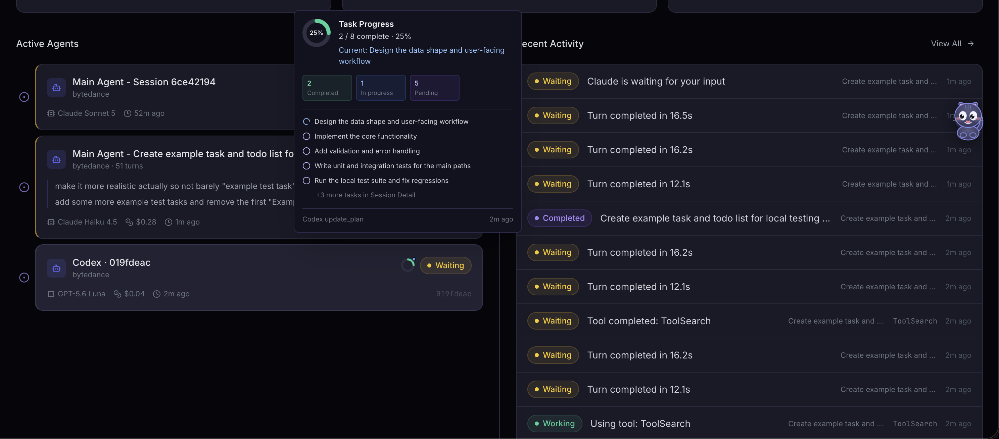
  <br>
  <em>📋 <strong>Progresso das tarefas · Visão geral</strong> — os cartões de agentes do painel e as linhas de Sessões reutilizam o mesmo anel compacto de conclusão ao lado do status; passar o mouse ou focar abre uma prévia, por responsável, do trabalho atual e do estado das tarefas</em>
</p>

<p align="center">
  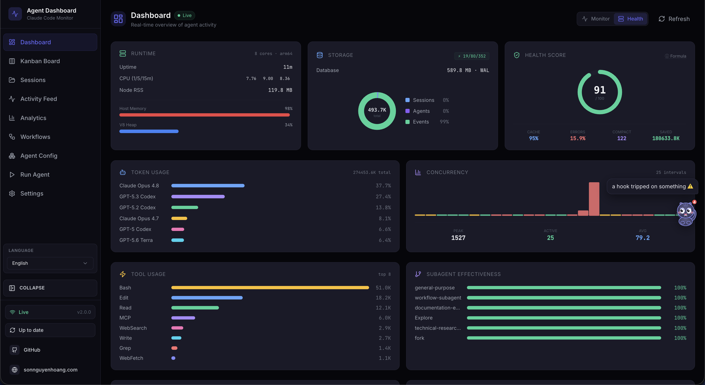
  <br>
  <em>🩺 <strong>Painel · Saúde</strong> — anel da pontuação geral de saúde, gráfico de rosca do mecanismo de armazenamento, medidores de acerto de cache, erros e sucesso, barras de chamadas de ferramentas, eficácia dos subagentes, distribuição de tokens por modelo e estatísticas de compactação, tudo atualizado automaticamente a cada 5 s</em>
</p>

<p align="center">
  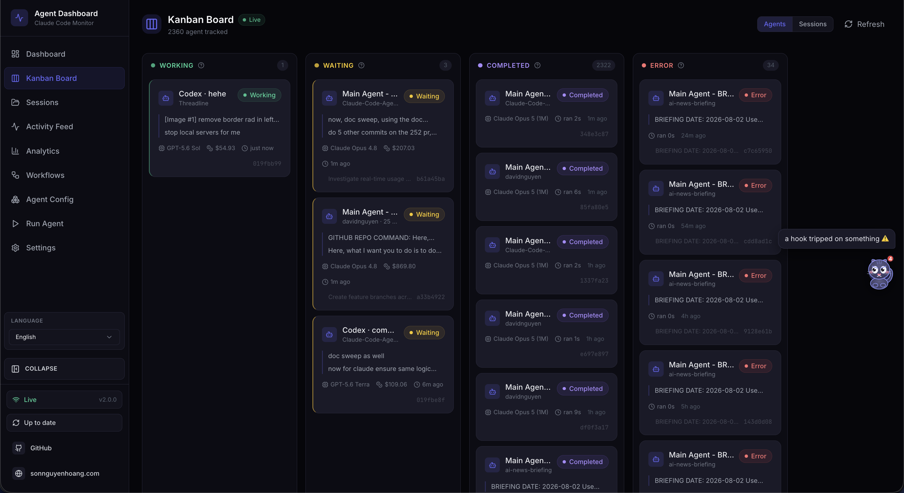
  <br>
  <em>📋 <strong>Quadro Kanban (agentes)</strong> — agentes agrupados por status em 4 colunas: Trabalhando / Em espera / Concluído / Erro. A coluna amarela Em espera destaca as sessões bloqueadas aguardando o usuário (pedidos de permissão, fim de turno ou parada em um prompt novo); passe o mouse sobre um badge Em espera para ver <em>por quê</em> (Requer entrada / Turno concluído / No prompt / Interrompido). Cada cartão mostra num relance o modelo, o custo e a ferramenta atual.</em>
</p>

<p align="center">
  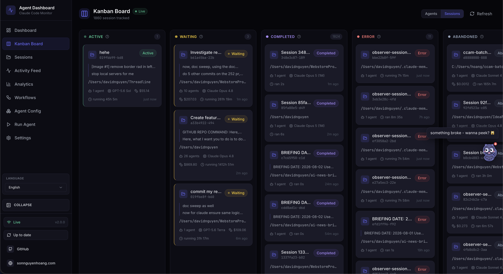
  <br>
  <em>🗂️ <strong>Quadro Kanban (sessões)</strong> — sessões agrupadas por status em 5 colunas: Ativas / Em espera / Concluídas / Erro / Abandonadas, alternáveis na mesma página. Passe o mouse sobre qualquer cabeçalho de coluna para ver uma dica que explica a transição do ciclo de vida.</em>
</p>

<p align="center">
  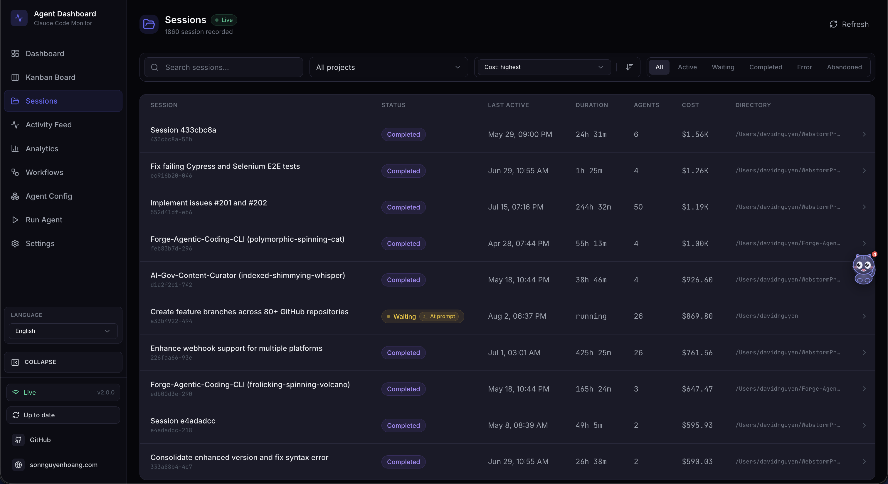
  <br>
  <em>📂 <strong>Sessões</strong> — tabela pesquisável, filtrável e paginada no servidor com todas as sessões registradas, com custo, modelo, número de agentes e duração; o seletor de projetos permite seleção múltipla com busca e a ordenação usa um menu personalizado</em>
</p>

<p align="center">
  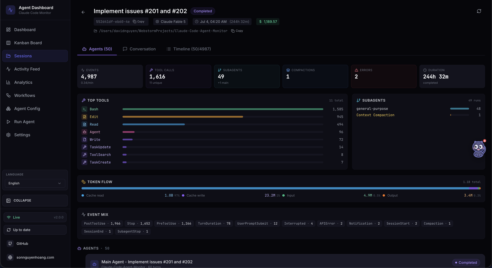
  <br>
  <em>🤖 <strong>Detalhe da sessão · Agentes</strong> — blocos gerais em tempo real (eventos, chamadas de ferramentas, subagentes, compactações, erros, duração), barras das ferramentas mais usadas, divisão por tipo de subagente, fluxo de tokens e a árvore hierárquica dos agentes</em>
</p>

<p align="center">
  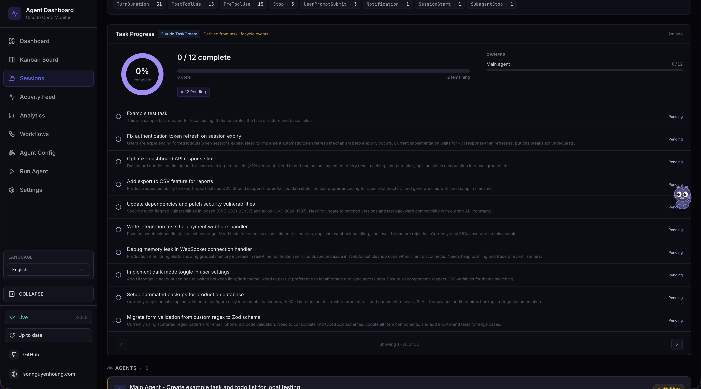
  <br>
  <em>✅ <strong>Progresso das tarefas · Detalhe da sessão</strong> — o rastreador completo por responsável reúne um anel de conclusão segmentado, a tarefa ativa, uma barra de conclusão, a divisão por responsável e uma lista de tarefas paginada com 10 linhas por página</em>
</p>

<p align="center">
  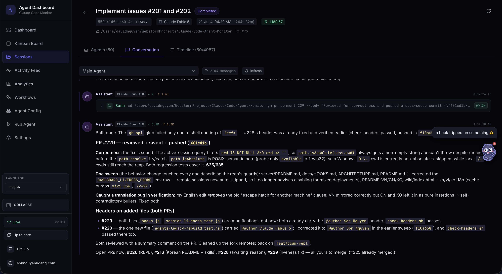
  <br>
  <em>💬 <strong>Detalhe da sessão · Conversa</strong> — visualizador de transcrição ao vivo com renderização de Markdown, blocos de código com realce de sintaxe (números de linha + copiar), chamadas de ferramentas estilizadas por ferramenta, pílulas de comandos de barra com a saída da TUI capturada e marcadores de renomeação da sessão</em>
</p>

<p align="center">
  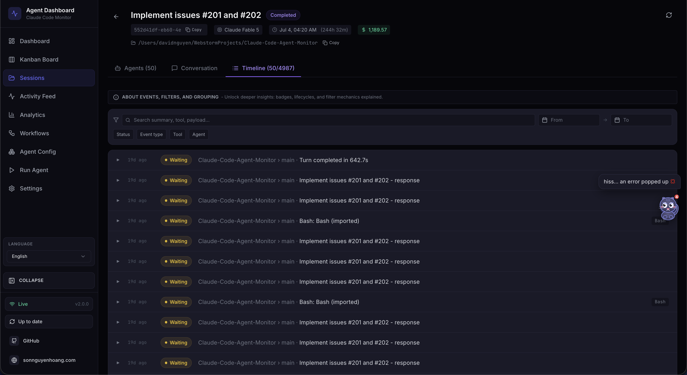
  <br>
  <em>🔬 <strong>Detalhe da sessão · Linha do tempo</strong> — linha do tempo cronológica de eventos com filtros multidimensionais, agrupamento Pre/Post por `tool_use_id` e renderizações de payload adaptadas a cada ferramenta</em>
</p>

<p align="center">
  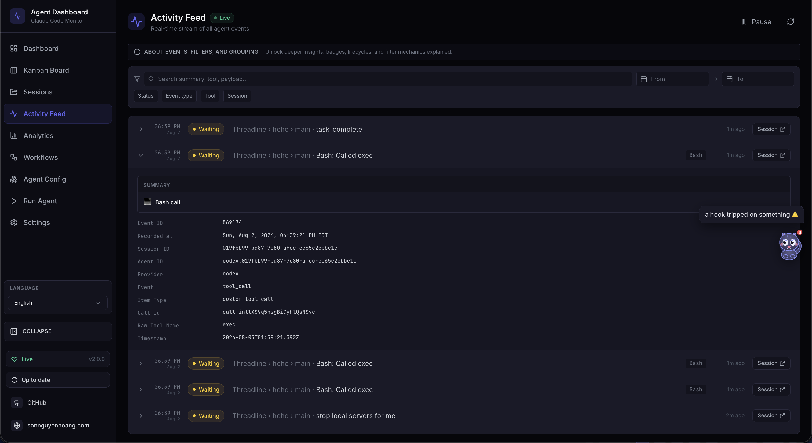
  <br>
  <em>📰 <strong>Feed de atividade</strong> — log de eventos em tempo real com pausa / retomada, agrupamento, filtros multidimensionais e um botão "Session →" em cada linha</em>
</p>

<p align="center">
  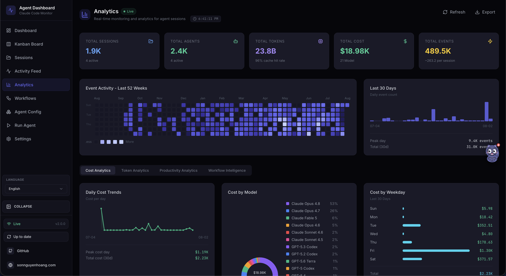
  <br>
  <em>📊 <strong>Análises</strong> — uso de tokens por modelo, frequência de ferramentas, mapa de calor de atividade e tendências das sessões com indicador ao vivo / offline; legendas longas dos gráficos são paginadas enquanto as curtas continuam iguais</em>
</p>

<p align="center">
  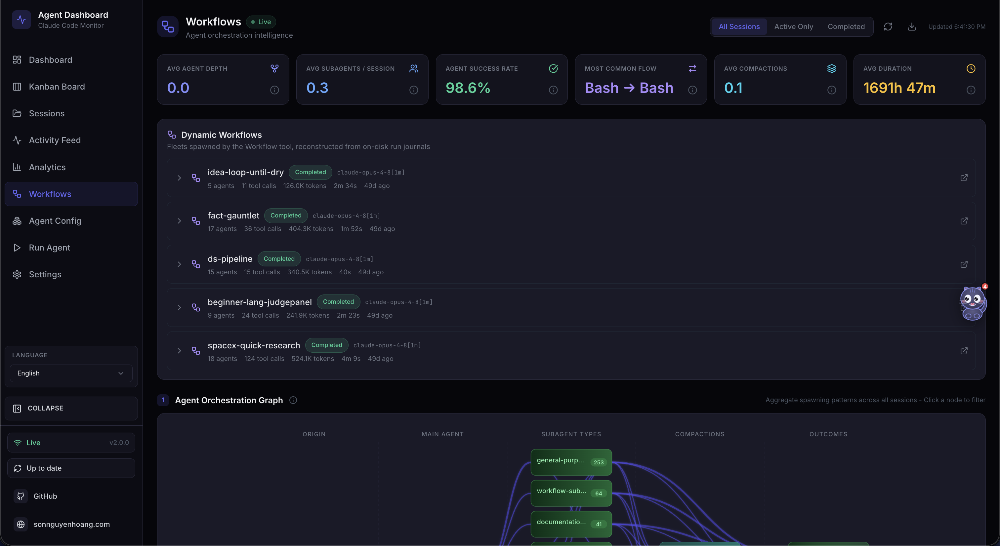
  <br>
  <em>🔀 <strong>Fluxos</strong> — DAGs de orquestração de agentes, diagramas de Sankey da execução de ferramentas, redes de colaboração, legendas limitadas geradas a partir dos dados e 11 seções interativas de inteligência de fluxos</em>
</p>

<p align="center">
  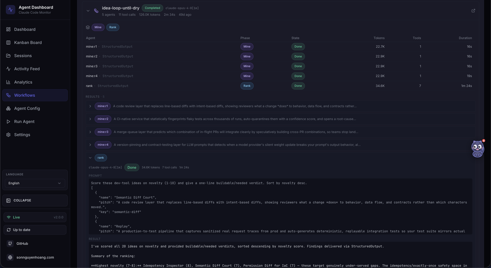
  <br>
  <em>🧬 <strong>Execuções de fluxos (página Fluxos)</strong> — os "fluxos dinâmicos" iniciados pela ferramenta <code>Workflow</code>, reconstruídos a partir dos diários de execução em disco: status, número de agentes, tokens e chamadas de ferramentas, expansíveis em um detalhamento por agente (fase, estado, tokens, ferramentas, duração) com prévias legíveis dos resultados</em>
</p>

<p align="center">
  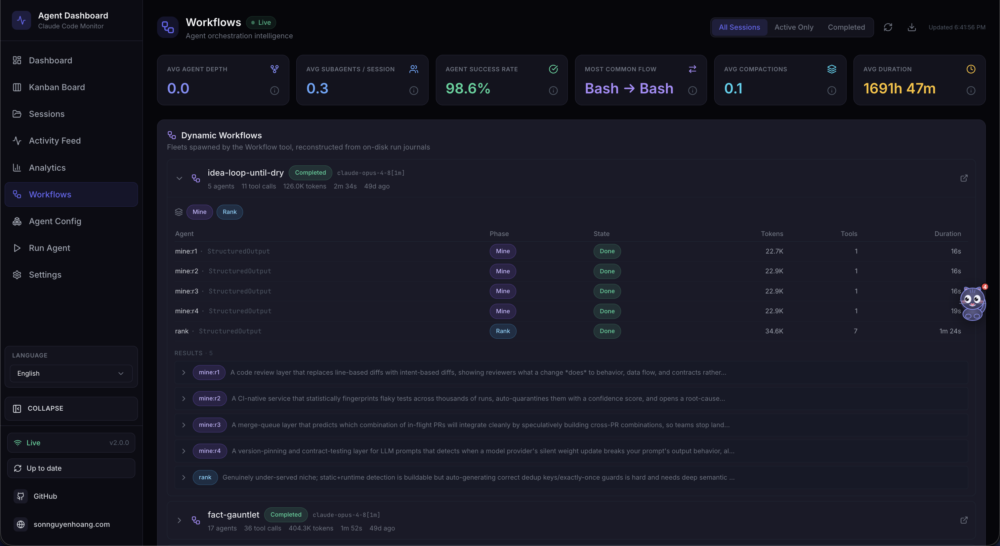
  <br>
  <em>🧬 <strong>Execuções de fluxos · expandida</strong> — uma execução aberta: filtros de fase clicáveis e codificados por cor, a tabela de métricas por agente e a lista completa de itens de resultado clicáveis, que se expandem para mostrar o prompt e o resultado completos de cada agente</em>
</p>

<p align="center">
  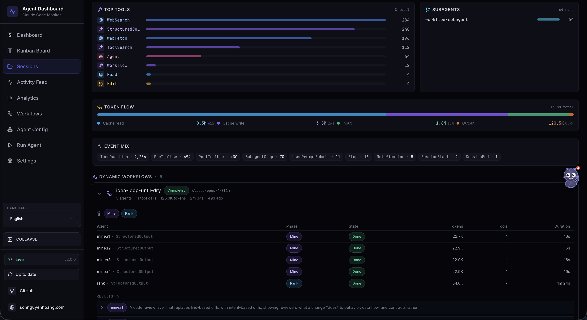
  <br>
  <em>🧬 <strong>Execuções de fluxos (detalhe da sessão)</strong> — as mesmas frotas vinculadas à sessão que as iniciou, para que os subagentes de fluxos dinâmicos de uma sessão e o custo em tokens incorporado a ela fiquem visíveis ali mesmo</em>
</p>

<p align="center">
  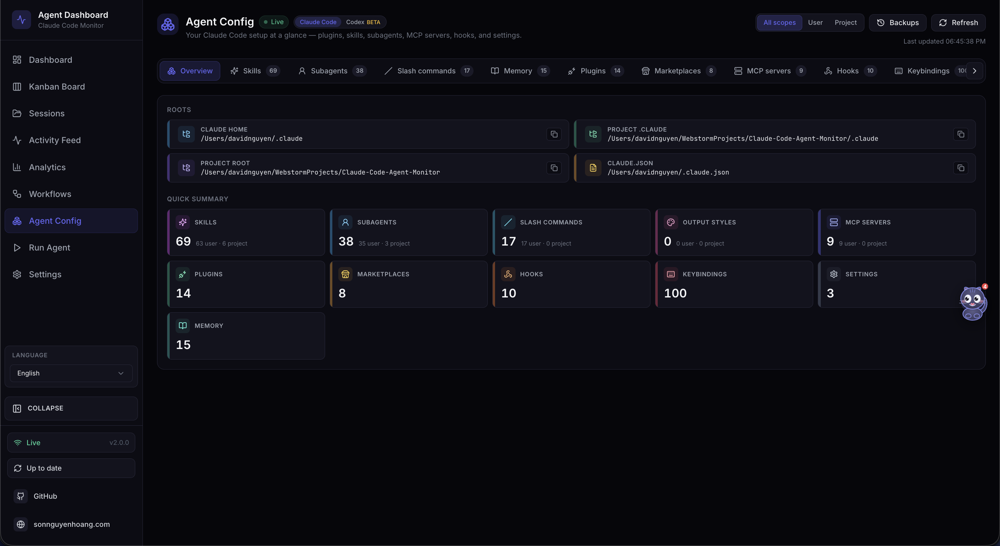
  <br>
  <em>🧰 <strong>Configuração de agentes</strong> — alterne entre o explorador completo do Claude Code e um espaço de trabalho Codex ao vivo para padrões, modelos, perfis, MCP, projetos, skills, regras, hooks, plugins e instruções. As prévias do Codex ocultam segredos; sua configuração, hooks, regras, skills e instruções mantidos pelo usuário podem ser editados com segurança, com backups.</em>
</p>

<p align="center">
  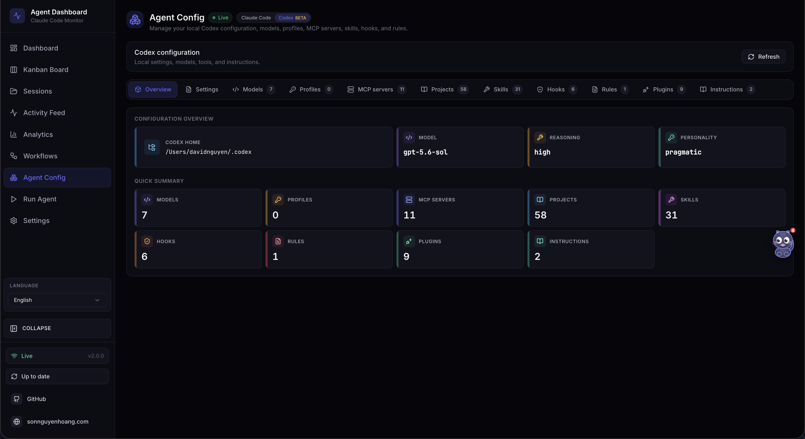
  <br>
  <em>🧰 <strong>Explorador de configuração do Codex</strong> — o espaço de trabalho Codex reúne <code>config.toml</code>, modelos da conta, perfis, servidores MCP, projetos, skills, hooks, regras, plugins e instruções. Edite os arquivos gerenciados pelo usuário suportados com backups com carimbo de data/hora; <code>config.toml</code> é somente para edição.</em>
</p>

<p align="center">
  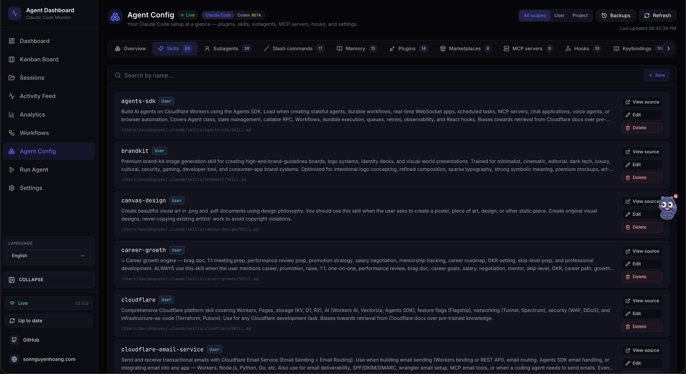
  <br>
  <em>🧩 <strong>Explorador de configuração do Claude · Skills</strong> — a aba Skills lista cada skill descoberta (de usuário, de projeto e de plugin) com sua descrição e origem, permite buscar em todo o conjunto e abre qualquer arquivo de skill para uma edição segura, com backup e carimbo de data/hora</em>
</p>

<p align="center">
  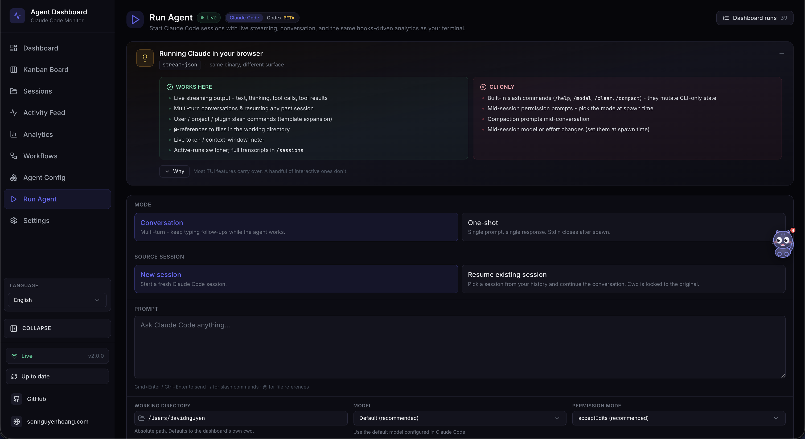
  <br>
  <em>▶️ <strong>Executar agente</strong> — escolha Claude Code ou Codex sempre que abrir o lançador. O Claude mantém os controles Conversa / Execução única; o Codex inicia uma thread nativa e interativa do app-server com seus próprios controles de aprovação e sandbox. Os modelos do Codex vêm do catálogo da CLI conectada, enquanto o Claude lista os modelos observados e seus aliases suportados.</em>
</p>

<p align="center">
  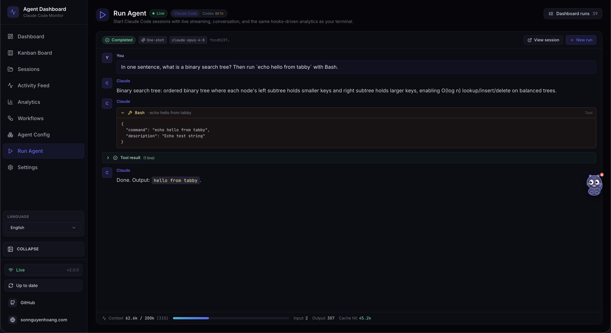
  <br>
  <em>💬 <strong>Executar agente · transmissão ao vivo</strong> — os eventos stream-json do Claude e os do app-server do Codex aparecem como um chat, incluindo raciocínio, comandos, alterações de arquivos e atividade de ferramentas. As execuções do painel permitem deixar um agente trabalhando em segundo plano e reconectar-se depois.</em>
</p>

<p align="center">
  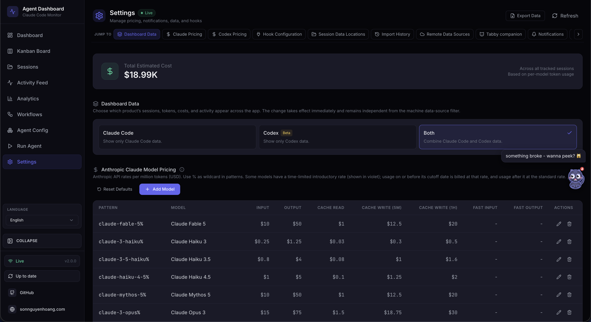
  <br>
  <em>⚙️ <strong>Configurações</strong> — regras de preços dos modelos, status de instalação dos hooks, gerenciamento de dados, preferências de notificação e informações do sistema</em>
</p>

<p align="center">
  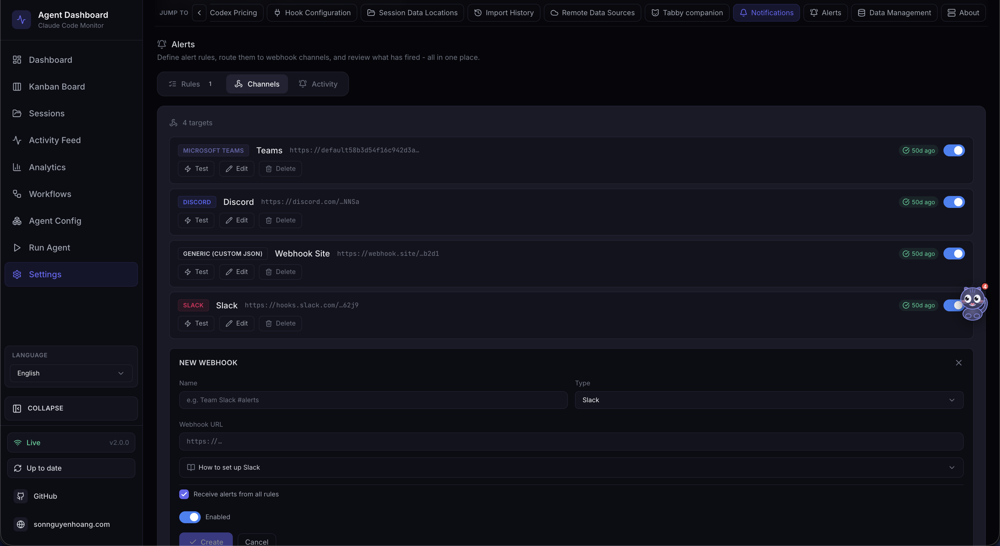
  <br>
  <em>🔔 <strong>Configurações · Alertas</strong> — mecanismo de alertas baseado em regras e webhooks de saída no mesmo lugar: regras de alerta (padrão de evento / inatividade / agente travado / limite de tokens) com tempo de espera por regra, feed ao vivo dos alertas disparados e 14 provedores de webhook nativos (Slack, Discord, Teams, Google Chat, Mattermost, Rocket.Chat, Telegram, PagerDuty, Opsgenie, Splunk On-Call, Zapier, Make, n8n, Pipedream), além de um endpoint JSON genérico com assinatura HMAC opcional</em>
</p>

<p align="center">
  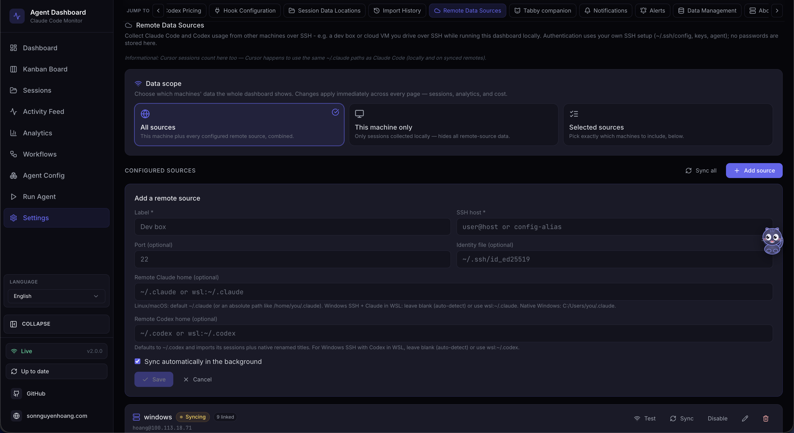
  <br>
  <em>🛰️ <strong>Configurações · Fontes de dados remotas</strong> — traga a atividade do Claude Code e do Codex de outras máquinas via SSH: defina, se quiser, caminhos independentes para o home remoto do Claude e o home remoto do Codex, teste cada provedor, sincronize manualmente ou com um poller em segundo plano e alterne o escopo global de dados entre local, todas as fontes ou uma máquina específica, com badges de origem por sessão</em>
</p>

<p align="center">
  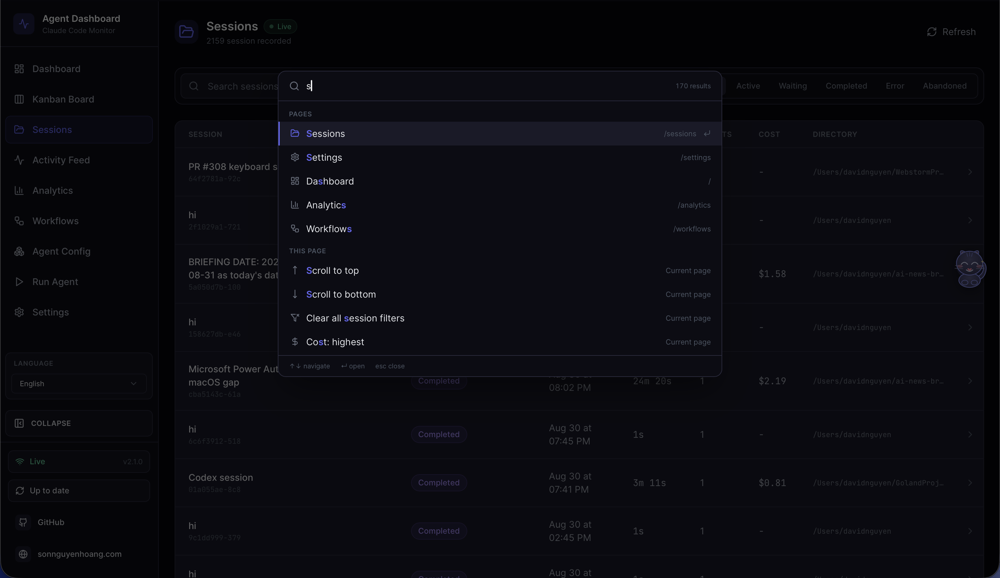
  <br>
  <em>⌘ <strong>Paleta de comandos</strong> — <kbd>Cmd/Ctrl+K</kbd>, de qualquer lugar, abre o único lançador do painel. Uma consulta abrange nove grupos: comandos recentes, as nove páginas, busca de sessões ao vivo no servidor, as ações próprias da página atual, cada diretório de projeto conhecido, subvisões das páginas e filtros de listas, as 13 seções das Configurações, as 12 abas da Configuração de agentes e ações para preferências, escopo de dados e idioma. A correspondência é por subsequência, com os caracteres encontrados destacados, então <code>mcp</code> encontra "MCP servers"</em>
</p>

A barra lateral dá acesso rápido às nove páginas — Painel, Quadro Kanban, lista de Sessões, Feed de atividade, Análises, Fluxos, Configuração de agentes, Executar agente e Configurações. Cada página foi pensada para oferecer uma visão aprofundada da atividade dos seus agentes do Claude Code, com atualizações em tempo real e visualizações ricas.

---

## Recursos

O painel oferece um conjunto completo de recursos para monitorar e analisar suas sessões e agentes do Claude Code:

> **O Cursor vem integrado:** o CCAM descobre o histórico nativo do Cursor em `~/.cursor/projects/*/agent-transcripts`, enriquece-o com os metadados de `~/.cursor/chats`, armazena-o como o provedor distinto `cursor` e guarda instantâneos das conversas antes que o Cursor limpe seus arquivos. O Cursor é incluído sempre que o escopo Claude Code do painel está selecionado. As fontes SSH remotas espelham, por enquanto, apenas os homes do Claude Code e do Codex; monte ou exponha localmente um home remoto do Cursor para ingeri-lo com `DASHBOARD_CURSOR_HOME`.

| Recurso | Descrição |
|---|---|
| **Progresso das tarefas** | Acompanhamento de tarefas atribuído por responsável, derivado do estado observável do provedor: eventos atuais do Claude `TaskCreate` / `TaskGet` / `TaskUpdate` / `TaskList` e de ciclo de vida, o antigo `TodoWrite` e o `update_plan` do Codex, direto ou encapsulado por unified-exec. Sessões com estado de tarefas mostram o mesmo anel compacto e a mesma prévia de hover/foco renderizada em portal ao lado do status na tabela de Sessões e em cada cartão de agente do Painel; o Detalhe da sessão mostra o painel de progresso completo com segmentos de status, trabalho em andamento, divisão por responsável e linhas de tarefas paginadas de 10 em 10. O progresso se limita ao trabalho de nível superior mais recente: um novo turno humano do Claude ou uma nova tarefa do Codex sem rastreador emitido limpa o estado anterior, e o estado inacabado é descartado quando esse turno/tarefa termina sem atualização final. O histórico totalmente concluído continua visível. |
| **Painel** | Duas abas mantidas em `localStorage`: **Monitoramento** — estatísticas gerais (6 cartões), cartões dos agentes ativos com hierarquia de subagentes recolhível e feed de atividade recente cuja quantidade de itens preenche a altura disponível via `ResizeObserver`. **Saúde** — anel da pontuação composta de saúde do sistema (ponderada: 0,4 × taxa de sucesso + 0,25 × taxa de acerto do cache + 0,25 × (100 − taxa de erros) + 0,1 × (100 − % do heap)), gráfico de rosca do mecanismo de armazenamento com a distribuição dos registros, medidores de desempenho do cache / taxa de erros / taxa de sucesso, gráfico de barras horizontais das invocações de ferramentas (top 8), barras de eficácia dos subagentes, distribuição de tokens por modelo e estatísticas de impacto da compactação. Todas as métricas de saúde são atualizadas a cada 5 s a partir de `/api/settings/info` e `/api/workflows`. Dicas que acompanham o cursor, com detecção das bordas da janela, em todos os gráficos |
| **Quadro Kanban** | Duas visões com alternância no cabeçalho (mantida em `localStorage`): **Agentes** — 4 colunas (Trabalhando / Em espera / Concluído / Erro) — e **Sessões** — 5 colunas (Ativas / Em espera / Concluídas / Erro / Abandonadas). A coluna **Em espera** corresponde diretamente ao status persistido `waiting` dos agentes — definido quando o Claude Code está parado em um prompt (sessão nova, entre turnos ou bloqueado por uma Notification de permissão) e que passa para `working` assim que o usuário retoma (UserPromptSubmit / PreToolUse). Cada cabeçalho de coluna mostra uma dica `?` que explica as transições do ciclo de vida. Os cartões são buscados por status persistido no servidor (na prática, sem limite por status) e depois paginados no cliente com 10 cartões por coluna e um botão "Mostrar mais". A assinatura WS se limita à visão ativa (quadros `agent_*` ou `session_*`), para que atualizações fora da visão não disparem novas buscas. Os badges Em espera expõem o `awaiting_reason` da linha em uma dica ao passar o mouse — **Requer entrada** (`notification`), **Turno concluído** (`stop`), **No prompt** (`session_start`), **Interrompido** (`interrupted`) — apenas como dica nos cartões compactos, para que os títulos mantenham seu espaço; superfícies mais largas (tabela de Sessões, cabeçalho do detalhe da sessão) também mostram o motivo em linha como um chip aninhado, com os motivos urgentes (pedidos de permissão, interrupções) em um âmbar mais intenso |
| **Sessões** | Tabela pesquisável, filtrável e **paginada no servidor** de todas as sessões registradas. Cada clique de página chama `/api/sessions?status=&q=&limit=10&offset=…`, então o cálculo de custos roda apenas sobre a página visível — independentemente de quantas sessões existam no banco. A primeira página também inclui a mesma linha local, em memória, de inicialização do Codex mostrada no Painel e no Kanban; ela aparece imediatamente, mas não é navegável até que um ID de sessão durável a substitua, e não altera os totais duráveis nem a paginação. A caixa de busca (`q=`) faz correspondência sem distinção de maiúsculas em `id` / `name` / `cwd` no servidor, com debounce de 300 ms, e a resposta traz uma contagem `total` para o paginador. Filtro de status, busca e paginação se combinam. O **nome** legível de cada sessão é lido da transcrição e sincronizado em tempo real — um título explícito vindo de `/rename`, `claude -n` ou do `Ctrl+R` do seletor (a linha JSONL `custom-title`) sempre prevalece; caso contrário entra o `ai-title` gerado automaticamente; caso contrário, o **primeiro prompt do usuário** da sessão (truncado, ignorando o ruído de resultados de ferramentas e comandos de barra) preenche o nome provisório e o nome/tarefa provisórios do agente principal — assim, sessões que nunca recebem título (inclusive importadas) ainda dizem o que estão fazendo; o painel exibe esse nome (ou, na falta dele, o ID curto) nos cartões, no Painel, no Feed de atividade e no seletor de retomada de Executar agente. |
| **Detalhe da sessão** | Painel de visão geral em tempo real por sessão, com faixa do agente ativo (ferramenta + tarefa atuais), seis contadores (eventos com taxa por minuto, chamadas de ferramentas, subagentes, compactações, erros, duração em andamento), barras das ferramentas mais usadas, divisão por tipo de subagente, faixa empilhada do fluxo de tokens e nuvem de pílulas dos tipos de evento — tudo atualizado ao vivo a cada evento de hook. Abaixo: árvore hierárquica dos agentes, linha do tempo completa dos eventos com filtros multidimensionais (status, tipo de evento, ferramenta, agente, busca textual, intervalo de datas), agrupamento Pre/Post por `tool_use_id`, bloco de resumo legível, renderizações de entrada/resposta adaptadas à ferramenta (terminal para Bash, diff unificado para Edit, código numerado para Read/Write, lista de correspondências para Grep, cartão chave/valor para ferramentas MCP) e uma aba Conversa que renderiza as transcrições — incluindo mensagens digitadas no meio de um turno (enfileiradas enquanto o Claude ainda trabalhava), posicionadas onde o Claude de fato as recebeu, com as notificações do harness atribuídas a System — com Markdown (títulos, listas, citações, tabelas, listas de tarefas), blocos de código com realce de sintaxe (js/ts, python, json, bash, html, css, sql, yaml, diff) com números de linha e cópia para a área de transferência, e chamadas de ferramentas estilizadas por ferramenta (Bash → terminal, Edit → antigo/novo lado a lado, Write → rótulo de arquivo, Read → chip de caminho, Grep → cartão de padrão). Quando a sessão está bloqueada esperando a pessoa, uma **faixa amarela de espera por entrada** sob o cabeçalho indica o `awaiting_reason`, sua explicação e há quanto tempo a sessão espera (ponto pulsante + tempo relativo); o badge Em espera do cabeçalho traz o mesmo motivo como chip aninhado |
| **Feed de atividade** | Log de eventos transmitido em tempo real com pausa/retomada, filtros multidimensionais (a mesma barra de ferramentas do Detalhe da sessão, mais um filtro de Sessão), paginação "Carregar mais" conduzida pelo servidor, atualização ao vivo com debounce que respeita os filtros e preserva o tamanho de página carregado, alternância de agrupamento, prefixo de origem projeto › sessão › subagente, um botão "Session →" por linha e um badge de status por linha vindo do único mapeamento compartilhado com o Painel e o Detalhe da sessão (para tipos de evento do Claude e do Codex) |
| **Análises** | Uso de tokens, frequência de ferramentas, mapa de calor de atividade (centralizado, alinhado aos dias da semana a partir de domingo, dicas com o nome do dia), tendências das sessões, indicador de conexão ao vivo/offline. Enquanto os dados de análise carregam, a área dos gráficos (e não apenas os blocos de estatísticas) mostra **esqueletos pulsantes** que reproduzem o layout dos gráficos, para que a página nunca exiba gráficos vazios ou zerados. Legendas longas em Análises e Fluxos são paginadas; as que cabem em uma página continuam iguais |
| **Paleta de comandos** | Lançador global `Cmd/Ctrl+K` sobre **todo** o painel. Uma consulta abrange nove grupos: comandos executados recentemente, as nove rotas da barra lateral (comparadas pelos rótulos **traduzidos**, então funciona em todos os idiomas), busca de sessões ao vivo no servidor via `/api/sessions?q=` (com debounce e respeito ao escopo, para nunca manter no cliente um índice desatualizado de milhares de sessões), as ações próprias da página atual, cada diretório de projeto conhecido, cada subvisão de página e filtro de lista, as 13 seções das Configurações, as 12 abas da Configuração de agentes e ações para preferências, escopo de dados, idioma, histórico e operações de página. A classificação usa correspondência por subsequência com os caracteres encontrados destacados, então `mcp` encontra "MCP servers" e `kbrd` encontra "Kanban Board"; um `>` / `@` / `#` no início restringe a ações / páginas / sessões. Totalmente operável pelo teclado — setas, `Home`/`End`, `PageUp`/`PageDown`, `Tab` entre grupos, `Enter`, `Escape` — e se degrada silenciosamente se a consulta de sessões falhar. Como não há botão permanente, a descoberta é feita por dicas que se retiram sozinhas: a tela inicial mostra o atalho na primeira execução e um chip `⌘K` aparece nos campos de busca de Sessões e da Configuração de agentes, e ambos somem de vez assim que você abre a paleta uma vez. Um comando exibido é um comando que funciona: as ações de página são lidas do registro de manipuladores ativo, então nunca aparecem onde não fariam nada, e tudo o que muda um estado sem mover você se confirma com um toast. Operações destrutivas estão ausentes de propósito: a paleta navega até elas, mas nunca as executa |
| **Um único atalho** | `Cmd/Ctrl+K` é o único atalho que o painel reserva, e ele vale mesmo quando um campo está com o foco. Uma versão anterior trazia uma camada completa de atalhos — sequências de navegação iniciadas por `g`, teclas de página, uma folha de consulta `?`, uma sobreposição de dicas ao segurar um modificador — e ela foi removida de propósito: uma sequência é um modo oculto com temporizador, apertar `g` parecia não fazer nada, e dois mecanismos de navegação dividiam a memória muscular sem ganho algum, já que a paleta alcança todas as páginas por busca aproximada. O Tabby mantém seu tradicional `Cmd/Ctrl+B` |
| **Atualizações ao vivo** | Push via WebSocket — sem polling, atualização instantânea da interface |
| **Descoberta automática** | Sessões e agentes são criados automaticamente a partir dos sinais dos provedores. O Claude Code cria imediatamente um cartão **Em espera** no `SessionStart`. O Codex primeiro expõe um cartão **Em espera** local, em memória, assim que seu processo TUI interativo inicia, inclusive antes de atribuir um ID de sessão estável. Um hook, uma linha de thread ao vivo ou um rollout cria então a sessão durável e substitui esse cartão temporário. Se o usuário abrir o seletor Resume do Codex e escolher uma thread existente, o CCAM detecta o rollout ou o bloqueio de escrita já aberto por aquele PID exato do Codex e passa para a sessão retomada durável antes da primeira mensagem nova. Essa passagem só adota uma thread cujo registro durável já está concluído e roda uma vez por processo, então um turno que o Codex ainda está conduzindo mantém o estado de trabalho e o motivo de espera informados pelo próprio rollout. O cartão anterior à identidade nunca é gravado no SQLite, no histórico, nas análises, nos preços, nos fluxos, nos alertas nem nas notificações de conclusão, e desaparece quando o processo termina. |
| **Importação de histórico** | A importação de histórico, ciente do provedor, traz as transcrições do Claude Code de `~/.claude/` e os JSONL de rollout do Codex de `~/.codex/sessions`. Cada aba tem seu próprio caminho padrão, instruções, varredura de pasta e fluxo de upload; ambas reutilizam sua lógica de ingestão ao vivo, preservam a contabilização de tokens, custos e ferramentas e são idempotentes. Rollouts externos do Codex são copiados para o armazenamento do painel, para que a conversa continue disponível depois que o arquivo compactado ou a pasta de origem forem removidos. |
| **Hierarquia de subagentes** | Árvore pai-filho recolhível de agentes no Painel e no Detalhe da sessão. Agentes com subagentes mostram setas de expandir/recolher; agentes folha mostram um ponto. Expande automaticamente quando há subagentes ativos |
| **Agentes em segundo plano** | Acompanha corretamente os subagentes enviados para segundo plano, sem marcá-los como concluídos antes da hora |
| **Atribuição de ferramentas dos subagentes** | As chamadas de ferramentas internas dos subagentes (Read, Bash, Edit, Grep, …) existem apenas nos arquivos JSONL de cada subagente — o Claude Code não emite hooks para elas. A cada `SubagentStop`, o painel dispara, sem aguardar, uma passada `scanAndImportSubagents` que analisa cada `subagents/agent-*.jsonl`, pareia os blocos `tool_use` com o `tool_result` correspondente por `tool_use_id` e emite eventos `PreToolUse` + `PostToolUse` sob o próprio `agent_id` do subagente. É idempotente (deduplicação `data LIKE '%"tool_use_id":"X"%'`) e se mescla a uma linha de subagente criada ao vivo por hook quando ela corresponde por tipo + horário de início em até 30 s, de modo que nenhuma linha paralela `<sid>-jsonl-*` é criada. O mesmo caminho roda na importação inicial de `npm run setup` para um preenchimento histórico completo — sessões anteriores ao painel ganham linhas do tempo completas de ferramentas por subagente. O Feed de atividade e o Detalhe da sessão mostram a cadeia de pais como `main › coder › explorer` para subagentes aninhados. Essa cadeia é reconstruída de forma confiável por `reconcileSubagentParents`: a linha de um subagente é inserida primeiro de forma plana sob o agente principal (um único evento de hook ou arquivo JSONL não traz a identidade de quem o criou), depois o criador é recuperado do resultado da ferramenta Task de cada transcrição de subagente (`toolUseResult.agentId`, capturado como `spawnedChildren`), para que um subagente que cria seus próprios subagentes fique aninhado sob seu criador **real**, em vez de achatado em um nível sob o main. Idempotente e aditivo — só reaponta `parent_agent_id`, nunca insere nem exclui linhas — e roda na mesma varredura de `SubagentStop`, que retorna uma contagem `reparented` para que o painel recarregue mesmo quando só a nova vinculação mudou a forma da árvore |
| **Acompanhamento de custos** | Estimativa de custos por modelo com regras de preços configuráveis e detalhamento por sessão. Suporta **preços de lançamento por tempo limitado** (`intro_*` + `intro_until` em uma regra de preço): o uso até a data limite, inclusive, é cobrado pelo preço de lançamento, e o uso posterior pelo preço padrão, para que ofertas temporárias continuem corretas para o uso passado **e** futuro — o endpoint de custos precifica o uso de cada dia pelo preço vigente naquela data. O Claude Sonnet 5 continua a US$ 2/US$ 10 por milhão de tokens de entrada/saída como preço padrão. **Os preços de lançamento são totalmente editáveis nas Configurações** — o editor de preços de modelos expõe uma data de fim da promoção e preços de lançamento por categoria (entrada / saída / leitura de cache / escrita de cache 5 min e 1 h), então uma futura promoção de lançamento não exige mudança de código, só uma edição. **Os cartões de subagentes mostram o custo PRÓPRIO de cada subagente** (derivado do uso de tokens da sua transcrição e precificado pelos preços atuais), e não o total da sessão — um cartão de agente principal representa a sessão inteira e mostra o total, enquanto um cartão de subagente mostra apenas o que aquele subagente gastou, para não parecer, de forma enganosa, que custou a sessão inteira. A contabilização de tokens ciente da compactação preserva os totais ao longo das compressões de contexto. As leituras de transcrições são armazenadas em cache com atualizações incrementais por deslocamento de bytes, para uma extração eficiente de tokens |
| **Cache de transcrições** | Extração em tempo real das transcrições JSONL: tokens, compactações, erros de API (entradas `isApiErrorMessage` armazenadas como eventos `APIError`), durações de turnos (armazenadas como eventos `TurnDuration`), contagem de blocos de raciocínio e extras de uso (service_tier, speed, inference_geo). As durações de turnos carregam identidades de transcrição estáveis; as análises completas reparam linhas duplicadas antigas e totais de metadados inflados, enquanto as análises de cauda limitadas continuam apenas acrescentando. Os arrays crescentes de cada entrada são limitados pelo final a `TRANSCRIPT_CACHE_MAX_ARRAY_LEN` (padrão `1000`, configurável) — tanto durante a análise quanto na finalização —, para que nem uma sessão que roda por dias faça uma entrada do cache crescer sem limite. Cada entrada armazena apenas `{mtimeMs, size, bytesRead, result}`, sem cópia paralela dos mesmos dados no nível superior e dentro de `result`. Os metadados da sessão são enriquecidos com esses campos em tempo real |
| **Notificações** | Pipeline Web Push (VAPID) completo para entrega confiável. Chegam mesmo com a aba em segundo plano ou o navegador fechado. Configuradas explicitamente para som no macOS. Chaves configuráveis por evento, com gerenciamento de assinaturas |
| **Alertas** | Mecanismo de alertas baseado em regras — configurado inteiramente em **Configurações → Alertas e notificações**, uma central de controle com as abas **Regras / Canais / Atividade** (sem página separada). Defina regras de alerta com quatro tipos de condição — **padrão de evento** (corresponde a tipo de evento / nome de ferramenta / texto do resumo, opcionalmente exigindo N eventos correspondentes dentro de uma janela de tempo, p. ex. "mais de 5 erros em 2 minutos"), **inatividade** (sessão ativa sem eventos há N minutos), **agente travado** (agente parado em `working`/`waiting` sem atividade há N minutos) e **limite de tokens** (total de tokens da sessão acima de um limite). As regras orientadas a eventos são avaliadas no servidor a cada ingestão de hook (depois da transação de ingestão — os alertas nunca podem atrasar nem fazer falhar a entrega dos hooks); as regras baseadas em tempo rodam em uma varredura a cada 60 s. Os alertas disparados são persistidos em `alert_events` com **deduplicação por tempo de espera** por regra + por sessão (padrão de 300 s), transmitidos como mensagens WebSocket `alert_triggered` e exibidos no feed ao vivo da aba **Atividade**, com reconhecer / reconhecer todos, um filtro de apenas não reconhecidos e links "Ver sessão" por alerta. As regras podem ser ativadas/desativadas e excluem seu histórico em cascata. Os alertas disparados também são enviados a **destinos de webhook universais** configurados na aba **Canais** — **14 provedores nativos** mais um endpoint genérico: **Slack**, **Discord**, **Microsoft Teams**, **Google Chat**, **Mattermost**, **Rocket.Chat** (payloads de chat nativos); **Telegram** (Bot API), **PagerDuty** (Events API v2), **Opsgenie** (Alert API + autenticação GenieKey), **Splunk On-Call** (REST do VictorOps); e **Zapier**, **Make**, **n8n**, **Pipedream** ou qualquer endpoint **genérico** (envelope JSON limpo com assinatura **HMAC-SHA256** opcional e cabeçalhos personalizados). Cada provedor é descrito por um registro no servidor que declara seu formatador de payload, como sua URL é resolvida (alguns a derivam das credenciais — p. ex. o Telegram a partir do token do bot, o Opsgenie a partir da região —, outros usam um padrão) e quais campos de credenciais a interface exibe. Os destinos aceitam restrição opcional por regra, uma sonda síncrona "Enviar teste" e um log de entregas. A entrega roda desacoplada do caminho de alerta, com timeout de requisição e novas tentativas com backoff limitado, então nunca pode atrasar nem bloquear o monitoramento; URLs de destino, segredos e campos de credenciais são armazenados no servidor e nunca devolvidos pela API (mascarados/ocultados em todas as respostas) |
| **Notificador de atualizações** | O servidor executa periodicamente um `git fetch` não bloqueante e compara o checkout local com `origin/master`/`origin/main`/`origin/HEAD`. Quando o upstream está à frente, a interface mostra uma janela com o comando exato `git pull && npm run setup` e um botão **Copiar** de um clique; a barra lateral ganha um botão permanente "Verificar atualizações" com badge ao vivo. O painel nunca faz pull nem se reinicia sozinho — o usuário executa o comando em um terminal —, então o mecanismo não pode quebrar sessões de desenvolvimento, atrapalhar a supervisão por pm2/systemd/Docker nem deixar processos órfãos |
| **Configurações** | Informações do sistema, status dos hooks, gerenciamento de preços dos modelos, preferências de notificação, exportação **e restauração** de dados (o modo **Restaurar backup** do painel Importação de histórico aceita um `.json` exportado de até 25 MiB e o reimporta de forma idempotente sem sobrescrever linhas existentes, para você consolidar o histórico de várias máquinas em um só painel), limpeza de sessões. A seção Preços dos modelos separa **Preços dos modelos Anthropic Claude** de **Preços dos modelos OpenAI GPT**, com cabeçalhos iguais, botões **Restaurar padrões** e **Adicionar modelo** por provedor e balões de informação que explicam a busca de regra pela primeira correspondência, a sintaxe de curinga `%` no estilo SQL, a atualização manual de preços e as ressalvas sobre preços de API. O balão do GPT explica também as unidades em USD por milhão de tokens, o limite Short/Long de 272K para os preços Standard e Fast, e por que níveis não publicados ficam sem preço em vez de estimados. O controle **Dados do painel** recarrega imediatamente sessões, agentes, eventos, tokens, fluxos, análises e custos para Claude Code, Codex ou ambos. Os campos separados do home do Claude Code e do Codex são totalmente conduzidos por i18n e salvos em tempo de execução; salvar o do Codex reativa a observação de rollouts ao vivo e varre sua nova árvore. |
| **Executar agente + Configuração de agentes** | `/run` começa com a escolha entre Claude Code e Codex e mantém a alternância de provedor ao lado do status Ao vivo. As execuções do Claude mantêm seus modos headless e de conversa stream-json; as do Codex usam o protocolo local `app-server` da CLI para uma thread realmente interativa, a política nativa de aprovação/sandbox, retomada, parada, saída ao vivo e reconexão. As opções de modelos do Codex vêm diretamente da CLI conectada, então lançamentos de modelos não exigem atualização do painel; o Claude mostra seus aliases duráveis e os modelos observados localmente, pois sua CLI não tem comando para listar modelos. `/cc-config` reúne o explorador editável do Claude Code já estabelecido e um espaço de trabalho Codex para padrões de configuração, cache de modelos, perfis, MCP, projetos, skills, regras, hooks, plugins instalados e arquivos de instruções. Suas prévias normais ocultam segredos; o editor local explícito suporta `config.toml`, `hooks.json`, regras de usuário, skills e instruções com gravações atômicas e backups obrigatórios com carimbo de data/hora, avisando que não consegue validar a sintaxe. Os comandos de perfil do Codex e os caminhos de artefatos gerenciados são copiados com um clique, e os cartões de plugins usam o registro de plugins instalados do Codex em vez de mostrar pastas de cache. Os dois exploradores se atualizam pelo observador de sistema de arquivos específico de cada provedor. |
| **Configuração de agentes do Codex** | A parte Codex da Configuração de agentes lê o catálogo completo de modelos da conta local, sem o limite genérico de prévia que podia mostrar falsamente zero modelos, e sempre inclui as substituições de base e de perfil. Crie sobreposições padrão do Codex `<name>.config.toml` diretamente no app; cada cartão copia com um clique seu comando exato `codex --profile <name>` e abre um editor protegido. Os caminhos de prévia são canonicalizados antes das verificações de contenção. O editor rejeita componentes de caminho com links simbólicos abaixo da raiz confiável, verifica a contenção canônica do diretório pai e recusa conteúdo de prévia `[redacted]`. Perfis, hooks, regras, skills e instruções compartilham as ações no estilo do Claude **Ver origem / Copiar caminho / Editar / Excluir**. Toda exclusão permitida é confirmada e tem backup feito antes (uma skill mantém seu diretório inteiro); `config.toml` é permanentemente somente para edição. |
| **Servidor MCP (local)** | Servidor MCP local completo em `mcp/`, com três modos de transporte (stdio, HTTP+SSE, REPL interativo) e 97 ferramentas tipadas em 16 módulos de domínio. Ele cobre observabilidade, sessões/agentes/eventos por escopo, transcrições e imagens, preços de Claude/Cursor/GPT, fluxos, alertas, webhooks, importações e restauração de backup, configuração de Claude/Codex, Executar agente, fontes remotas, hooks/homes/atualizações, push e manutenção. Os modos de protocolo e REPL compartilham um único catálogo validado, com destinos restritos a localhost e travas escalonadas para alterações e ações destrutivas. HTTP direto em loopback pode levar um token bearer; aliases de host de contêiner com token exigem HTTPS. Redirecionamentos são rejeitados, uploads são limitados a 50 MiB por arquivo e 100 MiB por chamada, respostas binárias a 10 MiB e a restauração de backup a 25 MiB |
| **Fluxos** | Página de visualização baseada em D3.js com 11 seções interativas: DAG de orquestração de agentes, diagrama de Sankey da execução de ferramentas, rede de colaboração, eficácia dos subagentes (sparklines por dia da semana com dicas renderizadas em portal que escapam do `overflow:hidden` do cartão e se limitam à janela para nunca serem cortadas), padrões de fluxo detectados, fluxo de delegação entre modelos, mapa de propagação de erros (barras horizontais com badges de taxa, divisão por tipo de agente, cartões de erros de API/sessão), linha do tempo de concorrência, dispersão da complexidade das sessões, análise do impacto da compactação (redesenhada como um histograma claro de "sessões por número de compactações" com títulos de eixos, blocos de estatísticas — total / sessões afetadas / média / pico —, uma linha de ajuda explicativa e dicas por barra) e detalhamento por sessão. O subtítulo alinhado à direita de cada seção fica em uma única linha (reticências + título ao passar o mouse), para que uma tradução longa nunca quebre o cabeçalho. **Dicas ricas e com i18n em toda parte:** o título de cada gráfico traz um ícone `i` que abre um balão estruturado "O que mostra / Como ler / Por que importa"; passar o mouse sobre nós, arestas, barras e bolhas exibe dicas em várias seções com interpretações determinísticas que dependem dos valores (p. ex. percentuais de participação na origem / no destino, faixas de saúde da taxa de sucesso, descrições das famílias Opus / Sonnet / Haiku, padrões temporais como no início / no meio / no fim da sessão). Cada um dos seis cartões de estatísticas principais tem um balão de informação no canto inferior direito que explica como a métrica é calculada e o que seu valor atual significa em linguagem simples. As dicas são alteradas no DOM por meio de uma única ref por gráfico, com fallbacks de `mouseleave` no nível do contêiner, para nunca ficarem atrás do cursor nem presas após uma nova renderização. Clicar em uma linha de **Padrões de fluxo detectados** expande no lugar um painel de detalhes com a sequência completa de etapas, uma grade de estatísticas, uma narrativa determinística (detecção de loops, faixa de frequência) e uma sugestão prática. As abas de filtro de status (Somente ativas / Concluídas / Todas) filtram as 11 seções. Filtragem cruzada, exportação JSON e atualização automática em tempo real via WebSocket com debounce de 3 segundos. Um painel **Execuções de fluxos** destaca os "fluxos dinâmicos" — as frotas de subagentes iniciadas pela ferramenta `Workflow` (e pelo `/loop` de ritmo próprio) —, que não emitem hooks e por isso são reconstruídas a partir dos diários de execução em disco (`workflows/wf_<runId>.json`): cada execução mostra suas fases e um detalhamento por agente de tokens / chamadas de ferramentas / duração, com detecção ao vivo do estado `running` antes de o diário ser gravado e uma subseção vinculada em cada página de Detalhe da sessão |
| **Acompanhamento de compactações** | Detecta eventos `/compact` nas transcrições JSONL e cria agentes e eventos de compactação. Preenche compactações antigas na inicialização. Um scanner periódico (cadência derivada de `DASHBOARD_STALE_MINUTES`) captura compactações mesmo quando nenhum hook dispara. Ele lê o caminho da transcrição de cada sessão ativa diretamente de `sessions.transcript_path` (preenchido pelo manipulador de hooks no primeiro evento que o traz, mais um preenchimento único a partir de `events`), em vez de fazer um `SELECT DISTINCT json_extract(events.data, '$.transcript_path')` sobre toda a tabela de eventos — assim a varredura é O(sessões ativas) e continua barata em um banco maduro. Compartilha o cache de transcrições, sem leituras duplicadas de arquivos. As linhas sintéticas de compactação recebem o carimbo de data/hora da transcrição tanto em `started_at` quanto em `ended_at`, para uma duração de exatamente 0 (a compactação é instantânea); uma migração de reparo na inicialização também corrige linhas existentes em que `ended_at < started_at` (issue #156) |
| **Subsessões / sessões retomadas** | Reativa sessões automaticamente quando chegam novos eventos e trata corretamente `/resume` e sessões órfãs. Uma varredura periódica (a cada ¼ de `DASHBOARD_STALE_MINUTES`, limitada entre 60 s e 5 min) marca as sessões abandonadas que escapam da detecção por eventos |
| **Detecção de sessões preexistentes** | Sessões que já estão rodando quando o servidor inicia são importadas como "ativas" (com base na modificação recente do arquivo JSONL). Eventos Stop também reativam sessões importadas concluídas/abandonadas, então o primeiro hook de uma sessão em andamento sempre a faz aparecer no painel |
| **Sincronização contínua de projetos** | A importação automática de `~/.claude/projects` na inicialização acontece uma única vez (controlada por marcador), então uma pasta de projeto criada **depois** da primeira execução — cujas sessões nunca passam pelos hooks (p. ex. hooks desativados no host) — ficaria invisível até uma nova varredura manual. Uma sincronização em segundo plano (`startSessionSync`) fecha essa lacuna com três gatilhos que compartilham um cache de mtime + uma única varredura unificada: uma varredura **imediata** na inicialização, um **`fs.watch`** com debounce que dispara no instante em que surge um novo arquivo de sessão ou pasta de projeto (recursivo no macOS/Windows; raiz + filhos diretos no Linux, para evitar os riscos do observador recursivo em espaço de usuário) e um **polling periódico** (`DASHBOARD_SESSION_SYNC_MS`, padrão de 30 s). Cada varredura reanalisa apenas os arquivos cujo mtime avançou e transmite `session_created`/`session_updated` (mais o agente principal) para que a interface se atualize ao vivo; uma sessão inalterada que já está no banco é ignorada sem nova análise, então o custo de uma reinicialização continua O(arquivos novos/alterados) |
| **Fontes de dados remotas** | Coleta ao vivo de Claude Code e Codex em máquinas remotas / múltiplas via SSH. Uma fonte espelha de forma independente `~/.claude/projects` e `~/.codex/sessions` (mais o leve `session_index.jsonl` do Codex para os títulos renomeados nativos) por **scp**, ou `wsl.exe` + `tar` para CLIs hospedadas no WSL em um host SSH Windows. Cada etapa isolada passa pelo importador normal do seu provedor e marca as linhas com `sessions.source`; uma fonte está saudável quando qualquer um dos provedores está disponível, então máquinas só com Claude, só com Codex ou mistas funcionam. O poller `DASHBOARD_REMOTE_SYNC_MS` de 15 s e as coletas imediatas ao adicionar/reativar transmitem `remote_source.status`, `remote_data.updated` e atualizações por sessão cientes do provedor. O ciclo de vida remoto é reconciliado a partir de cada transcrição espelhada. Se um provedor estiver indisponível, com erro ou travado sincronizando além de `DASHBOARD_STALE_MINUTES`, apenas as sessões remotas antigas desse provedor voltam à varredura de inatividade comum; um provedor vizinho saudável continua sob o controle do espelhamento. Configure caminhos opcionais e independentes para **Home remoto do Claude** e **Home remoto do Codex** em **Configurações → Fontes de dados remotas** ou use `ccam remote-sources`; a autenticação SSH fica inteiramente no host (nenhuma senha ou segredo é armazenado). |
| **Ingestão por push remoto** | O terceiro caminho de ingestão de dados de sessão, para a máquina que o SSH não alcança: um notebook itinerante atrás de NAT ou uma conexão doméstica com CGNAT **envia** seus próprios dados de sessão ao painel, em vez de o painel buscá-los. `POST /api/hooks/ingest-batch` aceita um lote por envio — contadores de tokens (cada entrada é o total atual completo desse contador, como em uma nova análise de transcrição), eventos de ferramentas e durações de turnos — e é a única rota do servidor feita para ser acessível pela internet pública. Por isso fica **desativada até que `REMOTE_PUSH_TOKEN` seja definido** (caso contrário, `503 REMOTE_PUSH_NOT_CONFIGURED`), protegida por um token próprio em vez de `DASHBOARD_HOOK_TOKEN`, para que endurecer as rotas de hooks em loopback nunca a abra como efeito colateral, e recusa `?token=` para que a credencial não acabe em um log de acesso de proxy. Os itens são deduplicados por `(session_id, event_type, uuid)`, tanto em relação às linhas já gravadas quanto dentro do mesmo lote, então reenviar é seguro; um lote é limitado a 1000 itens (`413 BATCH_TOO_LARGE`); e um `session_id` que já pertence a uma sessão local ou buscada via SSH é recusado item a item (`SESSION_LOCALLY_OWNED`), em vez de poder sequestrá-la — uma sessão enviada só pode criar uma nova sessão ou acrescentar a uma que ela mesma criou. Falhas parciais retornam `200` com `errors[]` por item, e a transmissão acontece depois que a transação é confirmada. |
| **Design responsivo** | Layouts adaptados a dispositivos móveis, com grades empilháveis, tabelas roláveis e barra lateral recolhível |
| **Localização da interface** | Troca de idioma integrada por menu suspenso personalizado, com textos da interface e rótulos de acessibilidade traduzidos para inglês (`en`), chinês (`zh`), vietnamita (`vi`), coreano (`ko`), espanhol (`es`), francês (`fr`), alemão (`de`), português (`pt`) e italiano (`it`). A cobertura vai de ponta a ponta até as dicas de Fluxos: cálculos dos cartões de estatísticas e interpretações por faixa de valor, balões "O quê / Como ler / Por quê" de cada gráfico, a dica de hover de cada grafo (orquestração, fluxo de ferramentas, pipeline, delegação entre modelos, concorrência), as narrativas e sugestões do painel de detalhes dos padrões de fluxo, o balão de informação de Configurações → Preços dos modelos, o painel CLAUDE_HOME e todo o fluxo de Importação de histórico. |
| **Dados de exemplo** | Script de dados de exemplo integrado para demonstrações e desenvolvimento |
| **Linha de status** | Linha de status da CLI com cores, mostrando modelo, uso do contexto, branch git, tokens por direção e custo da sessão (USD) |
| **Formatação dos nomes de modelos** | Nomes de modelos legíveis em toda a interface: identificadores brutos como `claude-opus-4-7-20260101` ou `claude-opus-4-7[1m]` aparecem como "Claude Opus 4.7" ou "Claude Opus 4.7 (1M)". Trata as famílias Claude, GPT e Gemini com junção automática das versões por ponto, remoção de sufixos de data/latest, remoção do prefixo do provedor e formatação da etiqueta de janela de contexto. A página de Configurações mantém os nomes brutos para configurar as regras de preços |
| **Marketplace de plugins Claude + Codex** | Uma única árvore de código com 14 plugins entrega manifestos canônicos do Claude, manifestos do Codex `.codex-plugin/plugin.json`, os dois catálogos de marketplace, 66 skills de plugins incluídas, 18 subagentes do Claude, 34 comandos do Claude, 3 utilitários de CLI e metadados de skills da OpenAI. A CLI skills.sh descobre 77 skills no total do repositório com `npx skills add hoangsonww/Claude-Code-Agent-Monitor --list`. Instale com `claude plugin marketplace add`, `codex plugin marketplace add` ou `npx skills add` |
| **Executar Claude** | Inicie subprocessos `claude` diretamente do painel com uma interface de streaming em estilo chat. Dois modos: **Conversa** (vários turnos — o stdin fica aberto e os turnos seguintes são enviados como envelopes stream-json) e **Execução única** (headless, um prompt → uma resposta). O modo Conversa também permite **retomar qualquer sessão existente** via `claude --resume <id>` — escolha em todo o seu histórico de sessões com um seletor pesquisável. A janela unificada de execuções ativas / histórico também oferece dois botões de acesso direto sem configuração: **Retomar**, em qualquer conversa anterior, inicia `claude --resume <id>` na hora e preenche o chat com a transcrição anterior, para você cair na visão ao vivo com todo o contexto (não precisa redigitar um prompt — o processo aguarda no stdin até você enviar a continuação); **Ver**, em qualquer execução única anterior, carrega a transcrição capturada no visualizador em modo somente leitura (sem novo processo — mesmo painel, sem controles de Parar/continuação). O seletor de execuções ativas no cabeçalho permite deixar uma execução em segundo plano, iniciar outra e reconectar depois. A reconexão é durável: o cliente reconcilia o log de envelopes em memória do lançador (`?envelopes=1`) com a transcrição JSONL da sessão em disco e prefere a que tiver mais mensagens de usuário/assistente, então sair de uma execução retomada e voltar mantém todo o histórico anterior visível (o lançador só vê os turnos posteriores ao início; o arquivo de transcrição tem os anteriores + os atuais). Menu de modelos (Opus 4.7 / 1M / Sonnet 4.6 / Haiku 4.5 / personalizado), seletor de modo de permissão com aviso explícito para `bypassPermissions`, campo de **esforço de raciocínio** (low / medium / high — ligado a `--effort`), autocompletar do cwd pré-preenchido com o **diretório home** do usuário — um local de início neutro que não herda o contexto de projeto `.claude` do próprio repositório do painel (agentes, skills, regras, `CLAUDE.md`, `.mcp.json`); recorre ao cwd do painel se nenhuma sugestão de home estiver disponível, com o home listado primeiro nos grupos de sugestões (home → painel → recentes). Streaming real caractere por caractere via `--include-partial-messages`, mais uma **camada de suavização estilo máquina de escrever** no cliente que libera cada `text_delta` / `thinking_delta` via `requestAnimationFrame`, para que até respostas curtas (em que o claude junta toda a resposta em um ou dois pedaços) pareçam ser digitadas. O código de mesclagem preserva a flag `_streaming` e o array `content` acumulado por deltas quando o envelope `assistant` canônico do claude chega no meio do fluxo, para que os blocos de raciocínio não se percam na conclusão. O despacho WebSocket envolve cada envelope em `flushSync` para que o agrupamento automático do React não junte rajadas de deltas em uma única renderização. **Paridade com a TUI (nível 1)**: uma **faixa de limitações** recolhível que se reduz a uma pílula fina (sem nunca sumir) e explica o que o modo stream-json pode e não pode fazer em comparação com a TUI do terminal; um **editor de prompt com autocompletar de comandos de barra** com pontuação em níveis (nome exato → começa com → início de palavra → contém → subsequência → descrição contém) que lista comandos de usuário / projeto / plugin (executados no cliente por expansão de modelo antes do envio) e mostra comandos nativos da CLI como `/clear`, `/model`, `/config` com um badge "Só na CLI — não roda daqui"; **referências de arquivos com `@`** com busca aproximada e debounce no cwd da execução (ignorando `node_modules`, `.git`, `dist`, `build` etc.); um **medidor ao vivo de janela de contexto / tokens** que mostra tokens de entrada + saída + leitura de cache e o custo acumulado, calculado a partir dos envelopes `stream_event` e `result.usage` durante o streaming ao vivo e a partir dos blocos `usage` finalizados do assistente (entrada / saída / leitura de cache / criação de cache) quando preenchido a partir de uma transcrição ao retomar / ver / reconectar, para que o medidor seja preenchido imediatamente em vez de ficar em 0/200k. A barra de progresso vai de índigo para âmbar e vermelho em 80% / 95% do limite de contexto do modelo; um **cabeçalho de status** com o modelo ativo, esforço, modo de permissão, cwd, ID da sessão, número de envelopes e tempo decorrido. Os menus de autocompletar abrem para cima para não colidir com o seletor de cwd abaixo. Indicador Ao vivo / Offline ao lado do título. Uma proteção same-origin na rota impede inícios disparados sem querer pelo navegador. A concorrência é, na prática, ilimitada por padrão (teto de segurança de 10000 para evitar fork bombs causadas por um cliente com bug; a TUI do terminal não tem limite, e nós também não). Defina `RUN_MAX_CONCURRENT` se quiser um teto real. As sessões iniciadas disparam os mesmos hooks que qualquer processo `claude`, então aparecem automaticamente em Sessões / Análises / Kanban / Fluxos — e Sessões / SessionDetail mostram um badge / faixa verde **▶ Run** que leva de volta à página Executar para qualquer sessão que esteja sendo conduzida de lá |
| **Explorador de configuração do Claude** | Um inspetor com 12 abas em `/cc-config` para tudo o que o Claude Code conhece: skills, subagentes, comandos de barra, estilos de saída, plugins (com o número de contribuições por plugin + autor/licença/página inicial vindos de `plugin.json`), marketplaces (com o número de plugins lido de cada `marketplace.json`), servidores MCP, hooks (com a lista de scripts de `~/.claude/hooks/`), configurações (um resumo rápido **Configuração atual** das opções que o `/config` controla — modelo, verbose, tema, estilo de saída, esforço, compactação automática, notificações, … — resolvidas entre os escopos de usuário/projeto/projeto local, com opções não definidas mostradas com o valor padrão, mais a visão estruturada chave-valor por arquivo + alternância para JSON bruto, com ocultação de chaves secretas), memória (os arquivos `CLAUDE.md` de usuário + projeto **e também** a memória por projeto baseada em arquivos — cada `*.md` em `~/.claude/projects/<slug>/memory/`, isto é, um índice `MEMORY.md` mais um arquivo por fato lembrado, muitas vezes mais de 100; agrupados por projeto em seções recolhíveis que separam os arquivos de índice dos arquivos de fatos, com uma caixa de busca e links clicáveis do índice `MEMORY.md` que levam ao arquivo de fato correspondente — rolagem + destaque), atalhos de teclado (agrupados por contexto com chips `<kbd>`) e linha de status (configuração + conteúdo do script). Os caminhos lidos e suas raízes permitidas são canonicalizados com `realpath`, para que links simbólicos não possam escapar das raízes confiáveis do Claude. Para superfícies de arquivos de texto de baixo risco (skills / agentes / comandos / estilos de saída / memória — incluindo os arquivos de memória automática por projeto), a página permite **criar / editar / excluir com backups obrigatórios com carimbo de data/hora**, gravados de forma atômica fora dos diretórios que o Claude Code varre, além de uma janela de Backups com comandos de restauração `mv` gerados automaticamente. Plugins, MCP, hooks nas configurações e arquivos `settings.json` continuam somente leitura, com faixas explicativas + comandos de CLI copiáveis, para que o usuário saiba exatamente qual comando executar por conta própria. **Atualizações ao vivo**: um `cc-watcher` no servidor usa `fs.watch` em `~/.claude/` (recursivo quando a plataforma permite) mais `~/.claude.json`, com debounce de 500 ms, para transmitir uma mensagem WebSocket `cc_config_changed` sempre que a configuração do Claude Code muda — seja por alterações no painel ou por ferramentas externas (a CLI instalando um plugin, edição manual de `settings.json`, uma nova skill adicionada). A página se inscreve e recarrega automaticamente; uma pílula Ao vivo / Offline ao lado do título mostra o status do WebSocket |
| **Tabby** | Um gato companheiro flutuante fixado no canto inferior direito de todas as páginas. Construído inteiramente sobre o `eventBus` WebSocket existente — **nenhum backend novo, nenhuma chave de API, nenhuma dependência nova**. Um mascote SVG reativo, com olhos que seguem o cursor e **oito humores** derivados do fluxo de sessões ao vivo (`idle`, `watching`, `happy`, `worried`, `stuck`, `thinking`, `sleeping`, `disconnected`), cada um com sua própria animação (balanço do rabo, orelhas em pé, aceno de cabeça, tremida, brilhos, zzz, alerta "!"). **Balões de fala automáticos** publicam frases curtas, limitadas e agrupadas em eventos relevantes (sessão iniciada/concluída, erros, execução finalizada) e podem ser silenciados. Clique no gato ou pressione **⌘B / Ctrl+B** (Esc fecha) para abrir um **painel** com uma linha de status ao vivo (`N live · M errored · connection state`), ações rápidas (ir para Executar Claude / Atividade / Sessões / sessões com erro, silenciar balões, limpar alertas) e uma caixa **Perguntar**: perguntas simples de status ("o que está rodando", "algum erro", "status") são respondidas localmente a partir dos dados em cache, enquanto qualquer outra pergunta é encaminhada à página **Executar Claude** (link direto para `/run?prompt=…`) para iniciar uma sessão real do Claude Code. Acessível (operável pelo teclado, balões `aria-live`, respeita `prefers-reduced-motion`), recua com segurança para um estado calmo `disconnected` se o socket cair, pode ser ativado ou desativado nas **Configurações** (localizado em en/zh/vi/ko/es/fr/de/pt/it). A implementação fica em `client/src/components/Tabby/` |
| **Sinais sonoros** | Retorno sonoro sutil da atividade ao vivo, **ativado por padrão** e totalmente desativável. Cada sinal é **sintetizado no navegador com a Web Audio API** — osciladores mais envelopes de ganho, então **não há arquivos de áudio para baixar nem dependências novas**. Sete sinais cobrem o ciclo de vida das sessões: uma quinta ascendente quando uma sessão começa, um arpejo maior conclusivo quando uma termina de responder, uma terça menor suave e descendente em erros, um dedilhado curto para o início de um subagente, um sino desafinado para as notificações do Claude Code, uma subida/descida de duas notas quando a conexão ao vivo volta ou cai, e um tique quase inaudível ao pressionar botões e links. Os sinais têm **limite de frequência** (tempo de espera por sinal mais um orçamento global de rajadas), passam por um filtro passa-baixa para ficar em segundo plano em relação ao seu trabalho e permanecem em silêncio até a sua primeira interação com a página (política de reprodução automática dos navegadores). **Configurações → Som** oferece uma chave geral, um controle de volume e uma chave por sinal com prévia instantânea; as preferências ficam em `localStorage` sob `agent-monitor-sound` (localizado em en/zh/vi/ko/es/fr/de/pt/it). A implementação fica em `client/src/lib/sound.ts` e `client/src/hooks/useSoundCues.ts` |
| **Progressive Web App (PWA)** | Três PWAs independentes — painel, página inicial e wiki —, cada um com seu próprio Web App Manifest e Service Worker. Instale qualquer um deles na tela inicial / dock para uma experiência independente, sem a moldura do navegador. O SW do painel serve os bundles do Vite com hash de conteúdo em `/assets/` com cache primeiro (as URLs são imutáveis por build, então os acertos de cache estão sempre corretos) e trata todo o resto — navegações, o próprio SW, `manifest.json`, ícones, a raiz `/` — com rede primeiro e fallback para o cache. Junto com cabeçalhos `Cache-Control` explícitos no middleware estático do Express em produção (`immutable` para `/assets/*`, `no-cache, must-revalidate` para `index.html`, `sw.js`, `manifest.json`), um novo build sempre substitui o bundle no navegador sem recarregamento forçado; um listener `controllerchange` no cliente recarrega exatamente uma vez quando um novo SW assume uma página já controlada. O pipeline de notificações push VAPID é preservado. Os SWs da página inicial e do wiki pré-armazenam em cache suas respectivas estruturas e guardam as imagens na primeira visita, permitindo acesso offline após um único carregamento. Todos os manifestos usam ícones SVG (`favicon.svg`) com `sizes="any"` para navegadores modernos e incluem as meta tags `apple-mobile-web-app-capable` + `apple-touch-icon` para o modo independente no iOS |
| **App de desktop (macOS e Windows)** | App de desktop nativo opcional construído com Electron 35, no workspace `desktop/` ao lado de `client/`, `server/`, `mcp/` e `vscode-extension/`. Distribuído como `.app` para macOS (`.dmg`) **e** `.exe` para Windows (instalador NSIS + versão portátil sem instalação). Ele incorpora o servidor Express existente **no mesmo processo** (faz `require()` de `server/index.js` — sem processo filho, sem IPC) e renderiza o cliente React compilado em uma `BrowserWindow`. Acrescenta uma barra de título nativa, um ícone na barra de menus / área de notificação (tray) cujo menu, com um clique, mostra um **retrato do status ao vivo** (sessões, agentes, eventos de hoje) lido do SQLite no momento do clique, um menu de aplicativo nativo, início automático no login (itens de login do macOS via `SMAppService`; `HKCU\…\Run` por usuário no Windows), uma **caixa de confirmação de ⌘Q / Ctrl+Q** (um segundo toque ignora), fechar a janela apenas a oculta enquanto o servidor continua rodando, um bloqueio de instância única e ações de tray **Abrir no navegador**, **Reiniciar servidor** e **Mostrar logs**. Prefere a porta 4820 (recorre a 4821–4829 e depois a uma porta alta aleatória), adota um painel saudável já em execução na 4820 em vez de fazer um bind duplicado e **coexiste com o painel web** — `npm run dev` e o app de desktop podem rodar juntos, com os hooks alimentando ambos. As notificações aparecem como toasts nativos do sistema (o Web Push não funciona de forma confiável dentro do Electron). Na primeira inicialização com servidor próprio, ele instala automaticamente os hooks do Claude Code e inicia os serviços em segundo plano, então quem só instala já vê os eventos chegando sem nenhuma configuração manual. Veja [`DESKTOP.md`](./DESKTOP.md) e [`desktop/README.md`](./desktop/README.md) |
| **Recursos auto-hospedados (sem CDN)** | Todas as fontes e scripts são servidos localmente, então o painel e a documentação fazem **zero requisições a CDNs de terceiros** — funcionam totalmente offline e não vazam nada para hosts externos. O app React empacota Inter + JetBrains Mono via [`@fontsource`](https://fontsource.org/) (subconjunto latino; o Vite gera WOFF2 com hash de conteúdo em `dist/assets/` no build, sem `<link>` para o Google Fonts). A página inicial e o wiki carregam uma folha `@font-face` auto-hospedada `fonts/fonts.css` a partir do diretório `fonts/` na raiz do repositório. O Mermaid do wiki está incluído localmente como `wiki/mermaid.min.js` (o legítimo `mermaid@10.9.6` minificado) em vez do jsDelivr, e a página de erro da extensão do VS Code recorre a uma pilha de fontes do sistema. Não sobra nenhuma chamada a `fonts.googleapis.com`, `fonts.gstatic.com` ou `cdn.jsdelivr.net` |
| **Tela de abertura da sessão** | Uma breve tela de abertura com a marca ao carregar o app (uma vez por sessão do navegador): uma **saudação de acordo com o horário** (Bom dia / Boa tarde / Boa noite / Trabalhando até tarde), um slogan em negrito, dois subtextos e uma marca animada em grafo de nós sobre um fundo escuro e atmosférico (brilho radial + constelação à deriva + granulação). Totalmente localizada (en/zh/vi/ko/es/fr/de/pt/it). A sobreposição é **opaca desde a primeira pintura**, para que o app nunca apareça por trás, fica cerca de 2,5 s e depois se desfaz; clicar em qualquer lugar a pula, e ela respeita `prefers-reduced-motion`. Animações só em CSS, sem dependências adicionais |

> **Escopo de provedores e homes:** as Configurações mantêm a escolha compatível com Claude (Claude Code + Cursor) / Codex / Ambos consistente em todo o painel. Os homes do Claude Code e do Codex continuam editáveis sem reiniciar o painel; o Cursor é descoberto automaticamente a partir de `~/.cursor` ou `DASHBOARD_CURSOR_HOME`.
>
> **Limites de segurança locais:** Executar agente aceita qualquer diretório de trabalho absoluto existente e o canonicaliza antes do uso, então inícios a partir do home e de projetos recentes continuam suportados. Provedores de webhook hospedados exigem HTTPS; destinos genéricos e n8n podem usar HTTP para receptores locais/auto-hospedados, e a entrega nunca segue redirecionamentos.

---

## Início rápido

### Pré-requisitos

- **Node.js** >= 22.22.0 (24 LTS recomendado)
- **npm** >= 9.0.0

### 1. Instalar

```bash
git clone https://github.com/hoangsonww/Claude-Code-Agent-Monitor.git
cd Claude-Code-Agent-Monitor
npm run setup
```

### 2. Configurar os hooks do Claude Code

```bash
npm run install-hooks
```

O instalador abre uma seleção múltipla interativa: use as setas, <kbd>Espaço</kbd> e <kbd>Enter</kbd> para escolher **Claude Code**, **Codex (beta)** ou ambos (o Claude Code vem pré-selecionado). As entradas do Claude Code ficam em `~/.claude/settings.json`; as do Codex em `~/.codex/hooks.json`. Se um conjunto de hooks do painel selecionado já existir, ele avisa antes de substituir apenas as entradas deste painel — hooks não relacionados são preservados. Você pode fazer a mesma seleção depois em **Configurações → Configuração de hooks → Instalar hooks**.

Na primeira entrada no painel, escolha a fonte de dados; o app verifica a prontidão dos hooks apenas para essa seleção. Claude Code exige os hooks do Claude, Codex exige os hooks do Codex e Ambos exige os dois conjuntos. Quando todos os conjuntos necessários já estão instalados, o painel abre imediatamente. Caso contrário, a etapa de configuração lista e instala apenas os provedores selecionados que faltam, preservando hooks não relacionados e deixando uma verificação de status que falhe recorrer com segurança à configuração manual.

Os rollouts do Codex em `~/.codex/sessions` também são descobertos continuamente. O painel lê o JSONL deles, que só recebe acréscimos, de forma incremental, prioriza os rollouts mais recentes e isola um arquivo histórico com problema para nova tentativa, para que sessões, tokens, custos, linhas de conversa e atualizações via WebSocket continuem em dia mesmo se uma notificação de hook for perdida.

Os registros de ciclo de vida dos rollouts do Codex conduzem os mesmos estados de cartão ao vivo que o Claude Code: `user_message` e `task_started` marcam o agente principal como **Trabalhando**; `task_complete` deixa a sessão ativa, mas mostra **Em espera**; e `turn_aborted` mostra **Em espera** com um motivo de interrupção. Um novo registro de rollout corrige sozinho uma sessão concluída por engano. Em hosts locais suportados, a atividade é associada ao `rollout-*.jsonl` exato mantido aberto por cada processo do Codex, então rollouts antigos que compartilham um diretório de projeto são importados como concluídos em vez de aparecerem como agentes ativos fantasmas. O lançador Node e seu processo filho nativo do Codex são unidos em um único processo lógico, então uma TUI gera um único cartão.

Os títulos de `/rename` do Codex são lidos do índice de sessões nativo dele e atualizam os cartões de sessão e de agente em tempo real. A reprodução da conversa inclui os turnos humanos e as chamadas e saídas da ferramenta personalizada `exec`, com paginação por cursor que carrega mensagens mais antigas no topo da transcrição.

Os cartões do Claude Code e do Codex mostram, abaixo do título nativo do provedor, um histórico compacto em duas linhas dos últimos prompts humanos distintos, para que um nome curto ou uma continuação lacônica nunca esconda a tarefa ativa. O Claude atualiza esse contexto a partir do seu cache local de transcrições durante hooks ao vivo, importações e varreduras de supervisão; o Codex o atualiza a partir dos registros de rollout e recorre aos eventos `user_message` persistidos em importações mais antigas. A transcrição exibe anexos PNG/JPEG/GIF/WebP persistidos do Claude Code e do Codex quando disponíveis, enquanto cópias duplicadas de respostas/eventos do Codex são unidas em um único turno humano.

As invocações de ferramentas `response_item` do Codex são indexadas uma única vez por meio de um cursor de rollout dedicado, para que o fluxo de ferramentas de Fluxos, o detalhamento por sessão, os totais de modelo/tokens e as contagens de `context_compacted` reflitam os dados registrados do Codex sem repetir contadores de ciclo de vida ou de tokens. Em um escopo do painel apenas com Codex, o painel de diários de fluxos dinâmicos, exclusivo do Claude Code, fica oculto em vez de ser apresentado como dados vazios do Codex.

### 3. Iniciar

```bash
# Development (hot reload on both server and client)
npm run dev

# Production (single process, built client)
npm run build && npm start
```

> [!TIP]
> **Alternativa com Makefile** — todos os comandos também estão disponíveis via `make`, se ele estiver instalado no seu sistema. Execute `make help` para ver todos os alvos ou use atalhos como `make dev`, `make build`, `make test` etc.

### 4. Abrir

| Modo | URL |
| ----------- | ----------------------- |
| Desenvolvimento | `http://localhost:5173` |
| Produção | `http://localhost:4820` |

### 5. Opcional: executar o servidor MCP local

```bash
npm run mcp:start              # stdio (default — for MCP host integration)
npm run mcp:start:http         # HTTP + SSE server on port 8819
npm run mcp:start:repl         # interactive CLI with tab completion
ccam mcp stdio                 # stable launcher used by bundled plugins
```

`npm run setup` instala e compila o pacote MCP antes de vincular o `ccam`. Para o modo stdio, configure seu host com o comando `ccam` e os argumentos `["mcp", "stdio"]`.

Para o modo HTTP, aponte os clientes MCP remotos para `http://127.0.0.1:8819/mcp` (Streamable HTTP) ou `http://127.0.0.1:8819/sse` (SSE legado).

Veja [mcp/README.md](./mcp/README.md) para a configuração completa do host, detalhes de transporte, flags de segurança e o catálogo de ferramentas.

### Opcional: dados de demonstração

```bash
npm run seed
```

Cria 8 sessões de exemplo, 23 agentes e 106 eventos para você explorar a interface imediatamente.

### Alternativa: app de desktop (macOS e Windows)

Se preferir não manter um terminal aberto, instale o **app de desktop nativo** opcional. Ele incorpora o servidor no mesmo processo, adiciona um ícone na barra de menus / área de notificação (tray) e suporta início automático no login (itens de login do macOS / inicialização do Windows).

O caminho mais rápido é **baixar um instalador pronto** da [última Release no GitHub](https://github.com/hoangsonww/Claude-Code-Agent-Monitor/releases/latest) (a CI publica automaticamente uma `vX.Y.Z` sempre que a versão em `package.json` é incrementada no `master`):

- **macOS** — baixe `ClaudeCodeMonitor-<version>-arm64.dmg` (Apple Silicon) ou `-x64.dmg` (Intel) e arraste **Claude Code Monitor.app** para `/Applications`.
- **Windows** — baixe `ClaudeCodeMonitor-Setup-<version>-x64.exe` (instalador) ou `ClaudeCodeMonitor-<version>-x64-portable.exe` (sem instalação) e execute-o.

Para compilar você mesmo:

```bash
npm run desktop:install        # install Electron + electron-builder into desktop/ (preflights native deps; prints setup help on failure)
npm run desktop:dmg:arm64      # macOS: fast single-arch DMG (Apple Silicon)
npm run desktop:win            # Windows: NSIS installer .exe (run on Windows)
```

A documentação completa do app de desktop — download, instalação, recursos do tray/menu, comandos de build e assinatura — está na seção [App de desktop (macOS e Windows)](#app-de-desktop-macos-e-windows) mais abaixo. Veja também [`DESKTOP.md`](./DESKTOP.md) (guia do usuário) e [`desktop/README.md`](./desktop/README.md) (arquitetura).

### Alternativa: Docker / Podman

A imagem OCI e os arquivos Compose suportam Docker e Podman. O runtime roda sem root, descarta todas as capabilities, usa o Tini como PID 1, inclui Git/OpenSSH/SQLite e fica somente leitura, exceto por `/app/data`, `/app/config` e `/tmp`.

```bash
# Dashboard only
docker compose up -d --build
# or
podman compose up -d --build

# Complete stack: dashboard + authenticated MCP + Nginx + Prometheus + Grafana
umask 077
openssl rand -hex 32 > deployments/secrets/dashboard-token
openssl rand -hex 32 > deployments/secrets/hook-token
openssl rand -hex 32 > deployments/secrets/mcp-token
openssl rand -base64 32 > deployments/secrets/grafana-admin-password
npm run docker:full:up
```

Todas as portas do host fazem bind no loopback por padrão: painel `4820`, MCP `8819`, Nginx `8080`, Prometheus `9090` e Grafana `3000`. Os homes do Claude e do Codex são montados somente leitura; volumes nomeados persistem o SQLite e a configuração própria do painel. O Nginx faz proxy da interface, da API REST autenticada e do WebSocket, enquanto hooks, métricas e MCP ficam bloqueados na borda, a menos que sejam habilitados explicitamente. O alvo Docker opcional `agent-runtime` adiciona CLIs do Claude Code e do Codex com versões fixadas para fluxos de Executar agente nativos do contêiner.

> [!IMPORTANT]
> Instale os hooks do Claude Code/Codex no host depois que o contêiner iniciar. Para hooks remotos na nuvem, defina `CCAM_DASHBOARD_URL=https://...` e um `CCAM_HOOK_TOKEN` separado; URLs de hook fora do loopback exigem HTTPS. Veja [DEPLOYMENT.md](DEPLOYMENT.md).

---

## Como funciona

O painel se integra ao Claude Code por meio do sistema de hooks nativo dele para monitorar a atividade dos agentes em tempo real. Esta é uma visão geral da arquitetura e do fluxo de dados:

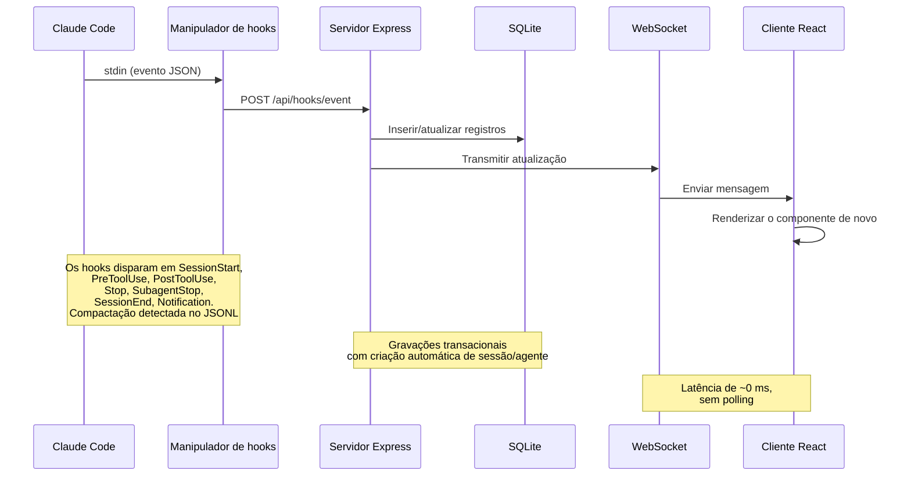
```mermaid
sequenceDiagram
    participant CC as Claude Code
    participant HH as Manipulador de hooks
    participant API as Servidor Express
    participant DB as SQLite
    participant WS as WebSocket
    participant UI as Cliente React

    CC->>HH: stdin (evento JSON)
    HH->>API: POST /api/hooks/event
    API->>DB: Inserir/atualizar registros
    API->>WS: Transmitir atualização
    WS->>UI: Enviar mensagem
    UI->>UI: Renderizar o componente de novo

    Note over CC,HH: Os hooks disparam em SessionStart,<br/>PreToolUse, PostToolUse,<br/>Stop, SubagentStop,<br/>SessionEnd, Notification.<br/>Compactação detectada no JSONL
    Note over API,DB: Gravações transacionais<br/>com criação automática de sessão/agente
    Note over WS,UI: Latência de ~0 ms,<br/>sem polling
```

> [!IMPORTANT]
> Veja [ARCHITECTURE.md](./ARCHITECTURE.md) para um mergulho profundo na arquitetura do servidor, no esquema do banco, nas rotas da API, no design do WebSocket, no roteamento do cliente, no fluxo do manipulador de hooks, nos modos de implantação e nos diagramas detalhados do ciclo de vida de sessões e agentes.

### Ciclo de vida dos hooks

1. O **Claude Code** dispara um hook no início da sessão, no uso de ferramentas, no fim do turno, na conclusão de subagentes e na saída da sessão
2. O **manipulador de hooks** (`scripts/hook-handler.js`) lê o evento JSON do stdin, resolve os painéis ativos via `~/.claude/.agent-dashboard.json` (ou `CLAUDE_DASHBOARD_PORT`, se definido) e envia por POST o mesmo payload para **um único destino de ingestão por diretório de dados SQLite distinto** (a porta mais baixa vence quando o Docker e o `npm run dev` compartilham `~/.claude/agent-dashboard`, para que os eventos nunca sejam ingeridos duas vezes). Servidores com bancos **diferentes** (p. ex. o app de desktop usando seu próprio diretório Application Support ao lado do `npm run dev`) continuam recebendo os hooks cada um. Falha silenciosamente com um timeout de segurança de 5 s para nunca bloquear o Claude Code, e as promises por destino nunca são rejeitadas, então um único listener morto não consegue deixar os outros sem dados.
3. O **servidor** processa o evento dentro de uma transação SQLite:
   - Cria automaticamente sessões e agentes principais no primeiro contato
   - Detecta chamadas à ferramenta `Agent` para acompanhar a criação de subagentes
   - No `SessionStart`, registra `awaiting_input_since` na sessão e no agente principal, para que uma CLI nova parada no prompt caia em **Em espera** imediatamente
   - No `UserPromptSubmit` (o usuário aperta Enter), limpa a flag de espera e promove o agente principal para `working` — o único sinal confiável de que turnos do assistente só de texto começaram, já que eles não emitem `PreToolUse`
   - Coloca o agente em "working" no `PreToolUse` (o que também limpa a flag de espera) e o mantém trabalhando durante o `PostToolUse`
   - No `Stop` (o Claude terminou de responder), o agente principal vai para "waiting" — o Claude terminou seu turno, a bola está com o usuário. Subagentes em segundo plano continuam rodando. A sessão continua `active`. Um Stop com `stop_reason=error` marca o agente como `error` e a sessão como `error`
   - Em uma `Notification` de permissão (identificada por padrão de mensagem: `permission`, `waiting for input`, `needs your approval`, …), coloca o agente em `waiting` e registra `awaiting_input_since`
   - O `SubagentStop` propositalmente NÃO limpa a flag de espera (um subagente em segundo plano terminando não diz nada sobre a pessoa)
   - Marca os subagentes como concluídos individualmente via `SubagentStop`. Depois que `res.json()` retorna, dispara sem aguardar uma passada `scanAndImportSubagents` que percorre os arquivos `subagents/agent-*.jsonl` da sessão, pareia os blocos `tool_use` ↔ `tool_result` por `tool_use_id` e emite eventos `PreToolUse` + `PostToolUse` sob o `agent_id` de cada subagente — fechando a lacuna pela qual as chamadas de ferramentas internas dos subagentes ficariam invisíveis para o painel
   - No `SessionEnd` (o processo da CLI termina), remove a flag de espera. Se a sessão estiver em `error`, o estado de erro é preservado; caso contrário, todos os agentes + a sessão são marcados como `completed`
   - No `SessionStart`, qualquer outra sessão ativa sem atividade há `DASHBOARD_STALE_MINUTES` (padrão 180 = 3 h, ajustável por variável de ambiente) é marcada automaticamente como "abandoned", com seus agentes concluídos. Isso cobre `/resume` dentro de uma sessão, Ctrl+C e outros cenários em que uma sessão fica órfã sem um `SessionEnd` limpo
   - Reativa sessões concluídas/com erro/abandonadas quando chegam novos eventos de trabalho (sessão retomada). Eventos Stop e SubagentStop também reativam sessões concluídas/abandonadas — isso cobre sessões preexistentes importadas antes de o servidor iniciar, cujo primeiro evento de hook pode ser um Stop
   - **Recuperação de erros**: só `UserPromptSubmit` e `PreToolUse` podem levar uma sessão de `error` de volta a `active` — sinal de que o usuário tentou de novo ativamente
   - Detecta a compactação da conversa (entradas `isCompactSummary` na transcrição JSONL) e cria agentes + eventos `Compaction`. As bases de tokens são preservadas entre compactações, sem perda de uso. As leituras de transcrições usam um cache compartilhado baseado em `stat` com leituras incrementais por deslocamento de bytes — só os bytes novos acrescentados desde a última leitura são analisados, o que dá um ganho de ~50x em sessões longas
   - Extrai erros de API (entradas `isApiErrorMessage`: limites de cota, limites de taxa, invalid_request) e respostas brutas `type: "error"` das transcrições JSONL, armazenados como eventos `APIError`. As durações de turnos (`system` com subtipo `turn_duration`) são armazenadas como eventos `TurnDuration`. Erros em resultados de ferramentas (`toolUseResult.is_error`) são acompanhados como eventos `ToolError`
   - **Vigia de detecção de erros** — um temporizador em segundo plano roda a cada 15 segundos, verificando sessões ativas sem eventos de hook recentes (paradas há mais de 10 s). Ele relê seus arquivos de transcrição em busca de erros de API (falhas de autenticação, limites de taxa, cota esgotada), deriva os caminhos das transcrições a partir do `cwd` da sessão para sessões importadas sem `transcript_path` nos dados do evento e marca sessões/agentes como `error` quando encontra erros de API. Isso cobre os casos em que a CLI do Claude não dispara um hook após um erro de API (p. ex. falhas de autenticação 401, em que a CLI mostra o erro e fica esperando)
   - **Recuperação de interrupção pelo usuário (Esc)** — cancelar um turno com `Esc` não dispara **nenhum hook** (uma limitação documentada do Claude Code), então, sem intervenção, o agente principal ficaria preso em `working` para sempre. O mesmo vigia de 15 s recupera esses casos de duas formas: (1) quando o cancelamento deixa um marcador `[Request interrupted by user]` na transcrição (Esc *depois* de alguma saída), o cache de transcrições o sinaliza via `pendingInterrupt` — derivado apenas da ordem na transcrição (última interrupção versus última atividade real do turno, mesmo relógio, então funciona até para um cancelamento em menos de um segundo) — e a sessão passa para **Em espera** em ~15 s; (2) quando o Esc é pressionado *antes de qualquer saída*, o Claude Code não grava marcador algum, então vale um fallback por tempo ocioso — se o agente principal está em `working` **sem ferramenta em andamento** e **nem um evento de hook nem a transcrição avançaram** por `DASHBOARD_WORKING_IDLE_SECONDS` (padrão `120`), o turno é considerado morto e a sessão passa para **Em espera**. Os dois caminhos registram um evento `Interrupted` e levam a sessão ao mesmo estado Em espera que um `Stop` normal produz. Saídas em streaming (transcrição ainda crescendo) e chamadas de ferramentas em andamento (`current_tool` definido) ficam isentas; uma rara troca falsa se corrige sozinha no próximo hook real
   - **Limpeza de sessões mortas por verificação de atividade** — sair do Claude Code (Ctrl+C, fechar o terminal) dispara um hook `SessionEnd`, mas se o painel não estiver rodando nesse momento o evento se perde para sempre e a sessão ficaria **Em espera** até a varredura de inatividade (3 h por padrão). O mesmo vigia de 15 s fecha essa lacuna com uma **sonda de atividade de processos**: ela lista os processos da CLI `claude` em execução (`ps` + `lsof` no macOS, `/proc` no Linux) e conclui qualquer sessão `active` cujo `cwd` não tenha um processo claude vivo — levando-a ao mesmo estado `completed` que um `SessionEnd` real produz, com um evento `SessionEnd` sintético na linha do tempo. Salvaguardas: nas passadas do vigia, a transcrição da sessão não pode ter sido gravada há pelo menos `DASHBOARD_LIVENESS_IDLE_SECONDS` (padrão `60`; a última gravação de hook serve de relógio alternativo quando não há transcrição em disco) — as **passadas de inicialização ignoram totalmente essa condição**, então uma sessão encerrada mesmo um segundo antes do início é limpa imediatamente — e a sonda responde "sem resposta" (sem alterar nada) no Windows, dentro de contêineres (os processos do host ficam invisíveis ali), quando `ps`/`lsof` falham ou quando desativada explicitamente via `DASHBOARD_LIVENESS_PROBE=0`. Em uma implantação **mista**, a limpeza também ignora automaticamente qualquer sessão cujo `cwd` não seja um caminho POSIX absoluto — uma sessão encaminhada de outra máquina por hooks compartilhados informa o caminho da máquina de origem (p. ex. um `D:\Git\ai-deck` do Windows), que uma varredura local de `ps`/`lsof`/`/proc` jamais consegue casar, então as sessões remotas ficam protegidas sem desativar a sonda para as que são realmente locais. **Sessões de fontes de dados remotas** (`sessions.source` ≠ `local`) também são sempre ignoradas — o `cwd` delas é legitimamente um caminho POSIX absoluto em outra máquina, então a sonda de processos local não diz nada sobre elas; o ciclo de vida delas fica inteiramente a cargo da reconciliação da sincronização remota descrita acima. Uma conclusão falsa se corrige sozinha: o próximo evento de hook reativa a sessão. Além da cadência de 15 s do vigia, a limpeza roda **imediatamente na inicialização** (limpando sessões mortas de uma execução anterior que já estão no banco antes mesmo de aparecerem) e **de novo ~5 s depois** (cobrindo as sessões que a sincronização de inicialização acabou de importar), então uma sessão que morreu enquanto o painel estava parado nunca aparece como Em espera
   - Uma varredura periódica do servidor captura sessões abandonadas e novas compactações que escaparam da detecção por eventos (p. ex. `/compact` não dispara hook, `/resume` segundos após a criação da sessão). A cadência é derivada de `DASHBOARD_STALE_MINUTES` (¼ do limite, entre 60 s e 5 min). A varredura lê `transcript_path` diretamente de cada linha de sessão ativa (uma pequena busca por índice) em vez de procurá-lo na tabela de eventos; a coluna é preenchida pelo manipulador de hooks na primeira vez que ele vê um caminho de transcrição e preenchida uma única vez a partir dos eventos existentes pela migração de `db.js`, com um índice parcial `idx_sessions_active_tp` cobrindo exatamente as linhas que a varredura lê. A varredura compartilha o cache de transcrições com o manipulador de hooks, evitando E/S duplicada. A limpeza de sessões abandonadas também remove a entrada correspondente do cache de transcrições para limitar a memória. Sessões de **fontes de dados remotas** (`source` ≠ `local`) só continuam sob controle do espelhamento enquanto o provedor Claude Code ou Codex correspondente estiver saudável; se esse provedor estiver indisponível, com erro ou preso em `syncing`, as limpezas periódica e de inicialização aplicam a regra de inatividade normal, para que um cartão Em espera antigo não persista para sempre
   - A **sincronização contínua de projetos** (`startSessionSync`) mantém `~/.claude/projects` descobrível além do preenchimento único na inicialização controlado por marcador: um projeto adicionado depois, cujas sessões nunca passam pelos hooks, ficaria invisível até uma nova varredura manual. Uma varredura imediata na inicialização, um `fs.watch` com debounce (recursivo no macOS/Windows; raiz + filhos diretos no Linux) e um polling `DASHBOARD_SESSION_SYNC_MS` (padrão de 30 s; `0` desativa o polling, o observador continua) compartilham um cache de mtime e uma varredura unificada que só reanalisa arquivos cujo mtime avançou — e ignora sem nova análise uma sessão já importada e inalterada, então o custo de uma reinicialização continua O(arquivos novos/alterados). Cada sessão recém-descoberta ou que cresceu transmite `session_created`/`session_updated` mais seu agente principal, os mesmos quadros que os hooks emitem
4. O **WebSocket** transmite a mudança para todos os clientes conectados
5. A **interface** recebe a atualização e renderiza de novo, em tempo real, os componentes afetados, sem polling.

### Máquina de estados dos agentes

Status persistidos: `working | waiting | completed | error`. A
coluna `awaiting_input_since` é complementar — ela registra quando o agente
começou a esperar e serve para exibir a duração, mas `waiting` agora é um
status persistido de verdade.

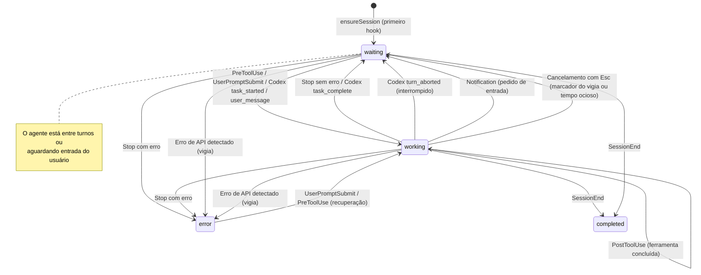
```mermaid
stateDiagram-v2
    [*] --> waiting: ensureSession (primeiro hook)
    waiting --> working: PreToolUse / UserPromptSubmit / Codex task_started / user_message
    working --> working: PostToolUse (ferramenta concluída)
    working --> waiting: Stop sem erro / Codex task_complete
    working --> waiting: Codex turn_aborted (interrompido)
    working --> waiting: Notification (pedido de entrada)
    working --> waiting: Cancelamento com Esc (marcador do vigia ou tempo ocioso)
    waiting --> error: Stop com erro
    working --> error: Stop com erro
    waiting --> error: Erro de API detectado (vigia)
    working --> error: Erro de API detectado (vigia)
    error --> working: UserPromptSubmit / PreToolUse (recuperação)
    working --> completed: SessionEnd
    waiting --> completed: SessionEnd

    note right of waiting
        O agente está entre turnos ou
        aguardando entrada do usuário
    end note
```

### Máquina de estados das sessões

Status persistidos: `active | completed | error | abandoned`. O estado de sessão
**Em espera** é uma sobreposição da interface (status=`active` com
`awaiting_input_since` definido).

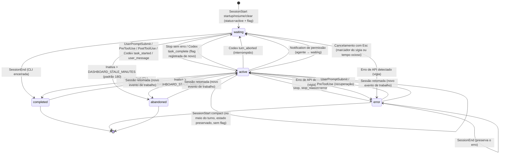
```mermaid
stateDiagram-v2
    [*] --> waiting: SessionStart startup/resume/clear (status=active + flag)
    active --> active: SessionStart compact (no meio do turno, estado preservado, sem flag)
    waiting --> active: UserPromptSubmit / PreToolUse / PostToolUse / Codex task_started / user_message
    active --> waiting: Stop sem erro / Codex task_complete (flag registrada de novo)
    active --> waiting: Codex turn_aborted (interrompido)
    active --> waiting: Notification de permissão (agente → waiting)
    active --> waiting: Cancelamento com Esc (marcador do vigia ou tempo ocioso)
    active --> error: Stop, stop_reason=error
    active --> error: Erro de API detectado (vigia)
    waiting --> error: Erro de API detectado (vigia)
    error --> active: UserPromptSubmit / PreToolUse (recuperação)
    waiting --> completed: SessionEnd (CLI encerrada)
    active --> completed: SessionEnd (CLI encerrada)
    error --> error: SessionEnd (preserva o erro)
    waiting --> abandoned: Inativa > DASHBOARD_STALE_MINUTES (padrão 180)
    active --> abandoned: Inativa > DASHBOARD_STALE_MINUTES
    completed --> active: Sessão retomada (novo evento de trabalho)
    error --> active: Sessão retomada (novo evento de trabalho)
    abandoned --> active: Sessão retomada (novo evento de trabalho)
    completed --> [*]
    error --> [*]
    abandoned --> [*]
```

### Fluxo de cálculo de custos

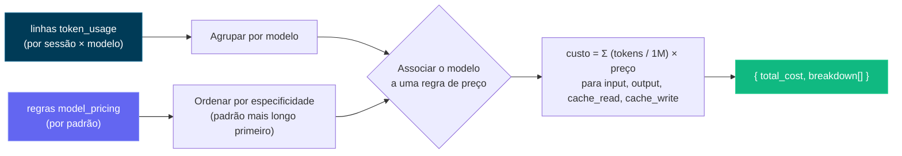
```mermaid
flowchart LR
    TU["linhas token_usage<br/>(por sessão × modelo)"] --> GROUP["Agrupar por modelo"]
    PR["regras model_pricing<br/>(por padrão)"] --> SORT["Ordenar por especificidade<br/>(padrão mais longo primeiro)"]
    GROUP --> MATCH{"Associar o modelo<br/>a uma regra de preço"}
    SORT --> MATCH
    MATCH --> CALC["custo = Σ (tokens / 1M) × preço<br/>para input, output, cache_read, cache_write"]
    CALC --> RESULT["{ total_cost, breakdown[] }"]
    style TU fill:#003B57,stroke:#005f8a,color:#fff
    style PR fill:#6366f1,stroke:#818cf8,color:#fff
    style RESULT fill:#10b981,stroke:#34d399,color:#fff
```

> [!IMPORTANT]
> O fluxo de cálculo de custos se baseia no uso de tokens e nas regras de preços dos modelos. Mantenha suas regras de preços atualizadas para refletir custos precisos. Atualize a tabela de preços dos modelos pela página de Configurações para manter o acompanhamento de custos preciso — o painel não busca automaticamente atualizações de preços em fontes externas. Depois que você define as regras de preços, o painel as aplica retroativamente a todas as sessões, para relatórios de custos consistentes.

---

## Configuração

| Variável de ambiente | Padrão | Descrição |
| ----------------------- | ------------- | --------------------------------------------- |
| `DASHBOARD_PORT` | `4820` | Porta do servidor Express |
| `CLAUDE_DASHBOARD_PORT` | `4820` | Porta usada pelo manipulador de hooks para chegar ao servidor |
| `NODE_ENV` | `development` | Defina como `production` para servir o cliente compilado |
| `DASHBOARD_UPDATE_CHECK` | _(ativado)_ | Defina como `0` / `false` / `off` para desativar as verificações periódicas do upstream git |
| `DASHBOARD_UPDATE_CHECK_INTERVAL_MS` | `300000` (5 min) | Intervalo entre verificações automáticas; mínimo de 60 000 ms. Os usuários também podem clicar em **Verificar agora** na janela de atualização ou na barra lateral para rodar uma sob demanda. |
| `DASHBOARD_STALE_MINUTES` | `180` (3 h) | Minutos de inatividade antes que uma sessão ainda `active` (inclusive uma parada **Em espera** por entrada do usuário — "Em espera" é uma sobreposição da interface sobre uma linha `active`, não um status armazenado) seja marcada automaticamente como **abandoned** e saia da lista de ativas. Aplicado pelo vigia de 15 s e pela varredura de manutenção periódica (que roda a cada ¼ desse valor, entre 60 s e 5 min). Reduza-o (p. ex. `60`) para um tempo ocioso menor |
| `DASHBOARD_WORKING_IDLE_SECONDS` | `120` | Tempo ocioso em trabalho para recuperar um turno cancelado com `Esc` **antes de qualquer saída** (que não deixa marcador na transcrição). Quando o agente principal está em `working` sem ferramenta em andamento e nem um evento de hook nem a transcrição avançaram por esse tempo, o vigia passa a sessão para **Em espera**. Reduza-o para uma recuperação mais ágil, ao custo de trocas falsas ocasionais em turnos longos de raciocínio silencioso (que se corrigem sozinhas). As sessões do Cursor usam o mesmo tempo: um turno `working` cujos arquivos em `~/.cursor` e hooks ficam ociosos por esse tempo passa para **Em espera** |
| `DASHBOARD_LIVENESS_PROBE` | `1` (ligado) | Defina como `0` para desativar a **limpeza de sessões mortas por verificação de atividade** do vigia (a sonda baseada em `ps`/`lsof` que conclui sessões locais `active` do Claude Code ou do Codex cujo processo de CLI correspondente não existe mais — recuperando um `SessionEnd` perdido enquanto o painel estava parado). Sessões encaminhadas de **outra máquina** (hooks compartilhados) informam um `cwd` não POSIX e são ignoradas automaticamente pela limpeza, então uma implantação mista local + encaminhada não precisa mais desligá-la; desative-a só em uma configuração puramente remota, em que processos locais não provam nada. Desativada automaticamente no Windows e dentro de contêineres |
| `DASHBOARD_LIVENESS_IDLE_SECONDS` | `60` | Limite de ociosidade para a limpeza por verificação de atividade **nas passadas do vigia**: uma sessão só é concluída quando sua transcrição não é gravada há pelo menos esse tempo (a última gravação de hook serve de relógio alternativo quando não há transcrição em disco), para que uma sessão no meio de um turno ou recém-retomada nunca suma por uma falha passageira da sonda. As passadas de inicialização ignoram esse limite — na inicialização, só a sonda decide, então sessões encerradas pouco antes do início são limpas imediatamente |
| `DASHBOARD_SESSION_SYNC_MS` | `30000` | Intervalo de polling (ms) da sincronização contínua em segundo plano de `~/.claude/projects`, que faz aparecer projetos adicionados depois da inicialização cujas sessões nunca passam pelos hooks. O observador `fs.watch` dispara quase instantaneamente de qualquer forma; este polling é a rede de segurança (observadores podem perder eventos / não disparar em sistemas de arquivos de rede). Defina como `0` para desativar o polling e manter o observador rodando |
| `DASHBOARD_CURSOR_HOME` | `~/.cursor` | Home nativo opcional do Cursor. O painel lê `projects/*/agent-transcripts`, une os metadados de `chats`, preenche as sessões existentes e armazena instantâneos duráveis das conversas no diretório de dados do painel. |
| `DASHBOARD_CURSOR_SYNC_MS` | `5000` | Intervalo de segurança (ms) para a descoberta de chats/transcrições do Cursor por impressão digital. A observação do sistema de arquivos continua importando imediatamente o início da CLI e as mudanças de prompt; `0` desativa só a varredura periódica. |
| `DASHBOARD_CODEX_HOME` | `CODEX_HOME` ou `~/.codex` | Diretório de estado local opcional do Codex. Os rollouts são lidos apenas da árvore `sessions/`; salvar um novo local nas Configurações persiste essa substituição exclusiva do painel, reativa a observação ao vivo e varre a nova árvore imediatamente. |
| `DASHBOARD_CODEX_SYNC_MS` | `4000` | Intervalo de polling de segurança (ms) para os rollouts do Codex, que só recebem acréscimos. Os hooks do Codex disparam a mesma ingestão incremental imediatamente; defina como `0` para desativar só o polling, mantendo o observador do sistema de arquivos quando disponível. |
| `DASHBOARD_CODEX_MAX_ATTEMPTS` | `5` | Número de tentativas de ingestão consecutivas com falha que a varredura do Codex gasta com um rollout **inalterado** antes de deixá-lo de lado. A varredura recoloca de propósito na fila um rollout que não conseguiu ler, para que uma falha passageira (`SQLITE_BUSY`, um registro gravado pela metade) se recupere na passada seguinte; sem limite, uma falha *permanente* se repetiria por toda a vida do processo — cerca de 21.600 tentativas por arquivo por dia com o padrão de 4 s de `DASHBOARD_CODEX_SYNC_MS`, cada uma gravando uma linha de log na única thread do Node. A contagem inclui a primeira tentativa, é acompanhada por arquivo e restaurada por completo sempre que o tamanho ou o mtime do arquivo mudam, então um rollout que estava só gravado pela metade se recupera sozinho. A tentativa que esgota o orçamento registra uma única mensagem citando o limite. Aumente-o se um volume lento ou instável precisar de mais do que algumas varreduras para se estabilizar |
| `DASHBOARD_CODEX_HOOK_IDLE_SECONDS` | `60` | Por quanto tempo uma sessão do Codex **só com hooks** — cuja execução não gravou nenhum rollout em disco (`codex exec --ephemeral`) — pode deixar sem resposta um turno informado como concluído antes que o painel conclua que seu hook `SessionEnd` se perdeu. Só se qualifica uma sessão cujo `awaiting_reason` seja `stop`: o Codex envia `SessionEnd` poucas centenas de ms depois do `Stop`, então um `Stop` sem resposta é uma evidência real. O silêncio de propósito nunca é o gatilho — uma execução sem rollout não emite hook algum durante toda uma chamada de ferramenta, então uma regra de tempo ocioso concluiria um build de CI no meio da execução |
| `DASHBOARD_TASK_SUMMARY_TTL_MS` | `2000` | Janela (ms) em que resultados desatualizados são servidos pelo cache de progresso de tarefas por transcrição, por trás das requisições de lista `include_task_progress` **e** do `todo_snapshot` do detalhe da sessão. Transcrições que cresceram são analisadas de forma incremental a partir da última linha JSONL completa (um crescimento de mais de 32 MiB desde a última leitura recomeça com uma nova varredura de cauda), enquanto esse piso continua agrupando rajadas de recargas de listas (por exemplo, atualizações do painel disparadas por eventos WebSocket). Dentro da janela, um resultado recém-analisado (um pouco desatualizado, só para exibição) é devolvido; defina como `0` para analisar cada acréscimo imediatamente |
| `DASHBOARD_REMOTE_SYNC_MS` | `15000` (15 s) | Intervalo de polling (ms) da sincronização em segundo plano das **fontes de dados remotas**, que busca de forma independente via SSH `~/.claude/projects` e `~/.codex/sessions` (mais o leve índice de títulos `session_index.jsonl` do Codex) de cada fonte ativada e depois reimporta cada um pelo importador local. Fontes novas/reativadas também sincronizam imediatamente. Defina como `0` para desativar o poller (sincronizações manuais / sob demanda continuam funcionando) |
| `DASHBOARD_REMOTE_ACTIVE_WINDOW_MS` | `600000` (10 min) | Janela de atualidade do status ao vivo de uma sessão de **fonte de dados remota**. A cada sincronização, uma sessão remota do Claude Code ou do Codex cuja transcrição espelhada tenha um **último evento JSONL** dentro dessa janela é tratada como ainda em execução (`active`); quando o espelho para de avançar por mais tempo que isso, a sessão é reconciliada para `completed`. Sessões remotas não recebem hooks ao vivo, então a reconciliação do espelho ciente do provedor substitui a verificação de atividade local; espelhos de provedor com falha, indisponíveis ou travados voltam à varredura de inatividade normal. Aumente-a para conexões lentas ou turnos ociosos muito longos |
| `DASHBOARD_REMOTE_SYNC_TIMEOUT_MS` | `600000` (10 min) | Timeout (ms) por fonte para uma sincronização remota (busca via `scp` + importação) antes de ser abortada |
| `DASHBOARD_REMOTE_TEST_TIMEOUT_MS` | `15000` (15 s) | Timeout (ms) da sonda SSH **Testar** (`POST /api/remote-sources/:id/test`), que verifica se uma fonte remota está acessível |
| `DASHBOARD_HOST` | `127.0.0.1` | Interface em que o servidor faz bind. Loopback por padrão (inacessível pela rede). Defina como `0.0.0.0` para expor na rede local (registra um aviso na inicialização) |
| `DASHBOARD_TOKEN` | _(não definido)_ | Quando definido, toda requisição `/api/*` e o WebSocket precisam apresentar o token (`Authorization: Bearer <token>`, cabeçalho `x-dashboard-token` ou `?token=`). Desligado por padrão — o bind em loopback é a fronteira de confiança |
| `DASHBOARD_TOKEN_FILE` | _(não definido)_ | Token do painel lido de arquivo, para segredos do Docker/Kubernetes; um `DASHBOARD_TOKEN` direto tem prioridade |
| `DASHBOARD_HOOK_TOKEN` / `DASHBOARD_HOOK_TOKEN_FILE` | _(não definido)_ | Token independente para as rotas de hooks locais (`/api/hooks/event`, `/api/hooks/codex`) quando expostas além do loopback |
| `REMOTE_PUSH_TOKEN` / `REMOTE_PUSH_TOKEN_FILE` | _(não definido)_ | Token separado que protege `POST /api/hooks/ingest-batch` (rota de push remoto acessível pela internet, desativada por padrão). Propositalmente independente do `DASHBOARD_HOOK_TOKEN` acima — defini-lo não deve abrir também esta rota gravável pela internet |
| `DASHBOARD_ALLOWED_HOSTS` | _(loopback)_ | Valores extras de `Host`, separados por vírgula, permitidos em HTTP e nos upgrades de WebSocket (proteção contra DNS rebinding). Adicione aqui os nomes de host da sua rede local ao fazer bind além do loopback |
| `DASHBOARD_ENV_PATH` | `.env` do repositório | Caminho dotenv gravável usado quando as Configurações persistem as substituições dos homes do Claude/Codex; padrão no contêiner `/app/config/.env` |
| `CCAM_DASHBOARD_URL` | _(descoberta em localhost)_ | Destino remoto opcional dos hooks. URLs fora do loopback precisam usar HTTPS e um token de hook |
| `CCAM_HOOK_TOKEN` / `CCAM_HOOK_TOKEN_FILE` | _(não definido)_ | Credencial do cliente de hooks, enviada como `x-ccam-hook-token` |

> [!IMPORTANT]
> **Seguro por padrão.** O servidor faz bind em `127.0.0.1` e **não** é acessível pela rede logo de saída ([GHSA-gr74-4xfh-6jw9](./.github/SECURITY.md)). Para expô-lo em uma rede local, defina **tanto** `DASHBOARD_HOST` (p. ex. `0.0.0.0`) **quanto** `DASHBOARD_TOKEN` (que então protege `/api/*` e o WebSocket) e liste os nomes de host da sua rede local em `DASHBOARD_ALLOWED_HOSTS`. Veja [`.env.example`](./.env.example) e [`.github/SECURITY.md`](./.github/SECURITY.md) para os detalhes.

Em clones git, o servidor faz periodicamente um `git fetch` de `origin` e compara seu checkout com `origin/master`, `origin/main` ou `origin/HEAD`. Quando você está atrás, aparece uma mensagem no terminal do servidor e uma janela na interface com o comando exato a executar. O painel nunca faz pull nem se reinicia sozinho — você copia o comando, executa-o em um terminal e depois reinicia o servidor do mesmo jeito que o iniciou.

---

## CLI `ccam`

Todos os recursos do painel também estão disponíveis em qualquer terminal pela CLI **`ccam`**, sem dependências (`bin/ccam.js`). Ela é vinculada automaticamente por `npm run setup` (via `npm link`), e depois disso `ccam <command>` funciona em qualquer diretório. Ela descobre o painel em execução via `~/.claude/.agent-dashboard.json` (o mesmo registro de servidores ativos que o manipulador de hooks usa), com as substituições de ambiente `CLAUDE_DASHBOARD_PORT` / `DASHBOARD_PORT`, e recorre a `http://127.0.0.1:4820`.

```bash
# Server
ccam status                       # ● running / ○ not running indicator
ccam start [--port N]             # start the server in the background (detached)
ccam stop                         # stop the background server gracefully
ccam repl                         # interactive shell (also: shell, i)

# Monitoring
ccam health                       # is the dashboard up?
ccam stats                        # totals, today's events, status distributions
ccam kanban                       # sessions + agents grouped by status columns
ccam tail [--session <id>]        # live event feed in the terminal (Ctrl+C stops)

# Data
ccam sessions [--status s] [--q text] [--limit n]
ccam session <id>                 # detail: agent tree, cost, recent events
ccam agents   [--status s] [--session id]
ccam events   [--session id] [--limit n]

# Insights
ccam analytics                    # token totals, top tools, agent types
ccam workflows [--session id]     # workflow intelligence stats and patterns
ccam runs [--session id]          # dynamic Workflow-tool runs
ccam cost [--session <id>]        # total estimated cost with per-model breakdown
                                  # (--session scopes to one; shows tool surcharges;
                                  #  warns about models with usage but no pricing rule)

# Alerts & webhooks
ccam alerts [--unacked]           # fired-alert feed
ccam alerts ack <id> | ack-all    # acknowledge alerts
ccam rules                        # list alert rules
ccam webhooks                     # list webhook targets
ccam webhooks test <id>           # send a synthetic test alert

# Pricing
ccam pricing                      # list model pricing rules (incl. fast-mode & intro columns)
ccam pricing set <pattern> --input N --output N [--cache-read N --cache-write N]
                 [--cache-write-1h N] [--fast-input N --fast-output N]
                 [--intro-input N --intro-output N … --intro-until YYYY-MM-DD]
ccam pricing delete <pattern>
ccam pricing reset

# Import
ccam import rescan                # re-scan ~/.claude/projects
ccam import path <dir>            # import every .jsonl under a directory

# Administration
ccam doctor                       # connectivity, hooks, and database diagnosis
ccam info                         # raw system info JSON
ccam export [file.json]           # full JSON data export
ccam import-data <file.json>      # restore an export (idempotent, non-destructive)
ccam cleanup --hours N --days M   # abandon stale / purge old sessions
ccam reinstall-hooks              # reinstall Claude Code hooks
ccam update-check                 # is the checkout behind upstream? (prints the update command)
ccam clear-data --yes             # delete ALL data (requires --yes)
ccam open                         # open the dashboard in your browser
ccam version                      # print the CLI version (also --version / -v)
```

Comandos que dependem da API precisam do servidor em execução — quando ele não está, **os comandos somente leitura recorrem à leitura direta de `data/dashboard.db`** (com uma faixa explícita `⚠ Offline mode`, e sessões `active` armazenadas mas mortas corrigidas na exibição pela mesma sonda de atividade de processos que o vigia do servidor usa), enquanto os comandos que não conseguem rodar corretamente sem o servidor (`tail` ao vivo, cálculos de análises/custos, alterações) mostram o indicador `○ Dashboard server is NOT running` com o motivo específico e os comandos para iniciar; `ccam start` sobe um servidor de produção em segundo plano. Comandos de leitura são sempre seguros; o único comando destrutivo (`clear-data`) se recusa a rodar sem um `--yes` explícito. A saída é uma interface de terminal completa — tabelas com bordas e colunas numéricas alinhadas à direita, ícones de status (`● active`, `○ waiting`, `✔ completed`, `✖ error`), gráficos de barras em linha para estatísticas/análises/custos e árvores de agentes de verdade com `├─`/`└─` — com cores ANSI ativadas automaticamente em um TTY, desligadas em um pipe e controláveis via `--no-color` / `NO_COLOR` / `FORCE_COLOR`. Para uma sessão de monitoramento ao vivo, **`ccam repl`** (aliases `shell` / `i`) abre um shell interativo em que você digita os comandos sem o prefixo `ccam` — com faixa de boas-vindas do CCAM, autocompletar com tab, histórico persistente pelas setas, um prompt com o status do servidor ao vivo (`● host` no ar / `○ offline` parado), um menu `help` / `help <cmd>` agrupado e um comando embutido `watch [secs] <cmd>` que atualiza automaticamente qualquer comando (p. ex. `watch 5 kanban`); cada linha roda em um processo filho isolado, então uma recusa por estar offline ou um `tail` bloqueante nunca derruba o shell. Se `ccam` não estiver no seu PATH (p. ex. o `npm link` precisou de permissões elevadas), rode `npm link` uma vez na raiz do repositório. Referência completa — flags, ordem de descoberta, REPL, modelo de segurança, scripts/códigos de saída, solução de problemas — em [docs/CLI.md](./docs/CLI.md).

## Scripts npm

| Comando | Descrição |
| ----------------------- | ---------------------------------------------------------- |
| `npm run setup` | Instala as dependências da raiz/cliente/extensão/MCP, compila o MCP e vincula o `ccam` |
| `npm run update:pull-setup` | `git pull --ff-only` e depois `npm run setup` (atualização manual) |
| `npm run dev` | Inicia o servidor (modo watch) + o cliente (HMR do Vite) ao mesmo tempo |
| `npm run dev:server` | Inicia o Express com um observador de código com debounce e reinício limpo |
| `npm run dev:client` | Inicia só o servidor de desenvolvimento do Vite |
| `npm run build` | Compila o cliente React em `client/dist/` |
| `npm start` | Inicia o servidor de produção (serve o cliente compilado) |
| `npm test` | Executa a suíte completa (servidor `node --test` + cliente Vitest) |
| `npm run verify` | Executa toda a verificação local em um só comando: auditoria dos cabeçalhos de autoria, checagem do Prettier, typecheck do cliente, testes de backend, testes de frontend |
| `npm run check:headers` | Verifica se cada arquivo-fonte aplicável tem o cabeçalho de autoria |
| `npm run typecheck:client` | Typecheck do cliente (`tsc -b`) — a mesma verificação que o build de produção roda antes do Vite |
| `npm run test:server` | Executa os testes de backend (`node --test server/__tests__/`) |
| `npm run test:client` | Executa os testes Vitest do frontend, incluindo **snapshots de renderização de cada tela** (`client/src/pages/__tests__/screens.snapshot.test.tsx`); regenere as referências depois de mudanças intencionais na interface com `cd client && npx vitest run -u` |
| `npm run install-hooks` | Configura os hooks do Claude Code em `~/.claude/settings.json` |
| `npm run seed` | Preenche o banco com dados de exemplo |
| `npm run import-history` | Importa sessões antigas de `~/.claude/` (também roda na inicialização) |
| `npm run reconcile-tokens` | Atualiza os totais de tokens das sessões importadas (nunca reduz um total) |
| `npm run repair-tokens` | Recalcula os totais de tokens **fora de fluxos** de cada sessão do **Claude** com transcrição em disco (em `~/.claude/projects/` ou pelo `transcript_path` armazenado da sessão) e zera as bases de compactação; as linhas de fluxos e do Codex são preservadas. Reparo único para bancos afetados pela soma de uso por registro anterior à v2.0.9 ou pela omissão do uso de subagentes planos do mesmo modelo. Pare o painel antes |
| `DASHBOARD_TOKEN_REPAIR` | Ativado por padrão (`1`). Reparo automático único dos totais históricos de tokens afetados pela inflação por registro ou pela omissão de subagentes planos do mesmo modelo. Correções ao vivo não conseguem revisitar cada sessão concluída, e `replaceTokenUsage` não consegue reduzir um valor máximo antigo. Roda uma vez por banco (controlado por marcador, adiado para fora do caminho de inicialização, ignorado enquanto outro painel compartilha o diretório de dados) e salva antes as linhas antigas em `token_usage_pre_repair_v2`. Defina como `0` para ignorá-lo e reparar manualmente com `npm run repair-tokens` |
| `npm run clear-data` | Exclui todas as sessões, agentes, eventos e usos de tokens |
| `npm run mcp:install` | Instala as dependências do pacote MCP local (`mcp/`) |
| `npm run mcp:build` | Compila o TypeScript do servidor MCP em `mcp/build/` |
| `npm run mcp:start` | Inicia o servidor MCP (transporte stdio — para hosts MCP) |
| `npm run mcp:start:http` | Inicia o servidor MCP (transporte HTTP + SSE na porta 8819) |
| `npm run mcp:start:repl` | Inicia o servidor MCP (REPL interativo com autocompletar por tab) |
| `npm run mcp:dev` | Executa o servidor MCP em modo dev (`tsx`, stdio) |
| `npm run mcp:dev:http` | Executa o servidor MCP em modo dev (`tsx`, HTTP + SSE) |
| `npm run mcp:dev:repl` | Executa o servidor MCP em modo dev (`tsx`, REPL interativo) |
| `npm run mcp:typecheck` | Verifica os tipos do código MCP sem gerar build |
| `npm run extensions:sync` | Regenera nomes de skills/metadados da OpenAI, manifestos do Codex e os dois marketplaces |
| `npm run extensions:validate` | Valida os 14 plugins em formato duplo e as 66 skills incluídas |
| `npm run mcp:docker:build` | Constrói a imagem de contêiner do MCP com Docker (`agent-dashboard-mcp:local`) |
| `npm run mcp:podman:build` | Constrói a imagem de contêiner do MCP com Podman (`localhost/agent-dashboard-mcp:local`) |
| `npm run desktop:install` | Instala Electron + electron-builder no workspace `desktop/` (recompila o `better-sqlite3` para a ABI do Electron); verifica antes o build nativo do `better-sqlite3` e mostra ajuda prática de configuração (incluindo uma alternativa sem toolchain) em caso de falha |
| `npm run desktop:dev` | Compila e abre o app de desktop Electron para iterar localmente |
| `npm run desktop:build` | Compila o código TypeScript do desktop em `desktop/out/` |
| `npm run desktop:test` | Executa o teste de fumaça do desktop (inicia o Electron, sonda `/api/health`) |
| `npm run desktop:dmg` | Constrói **os dois** DMGs de macOS (arm64 + x64) — o certo para uma release, **mais lento** (empacota cada arquitetura) |
| `npm run desktop:dmg:arm64` | Constrói um DMG só para Apple Silicon — **rápido**, recomendado para o seu próprio Mac |
| `npm run desktop:dmg:x64` | Constrói um DMG só para Intel — **rápido** |
| `npm run desktop:dmg:universal` | Constrói um único DMG **universal** combinado (arm64 + x86_64) — opcional, **o mais lento**, e não é o que a release distribui |
| `npm run desktop:win` | Constrói um **instalador NSIS** do Windows `.exe` (x64) — execute no Windows |
| `npm run desktop:win:portable` | Constrói um `.exe` **portátil** do Windows (sem instalação, x64) — execute no Windows |
| `npm run monitoring:install` | Executa `npm install` em `monitoring/` — baixa Prometheus + Grafana via `postinstall` |
| `npm run monitoring:setup` | Alias de `monitoring:install` |
| `npm run monitoring:up` | Inicia Prometheus (:9090) + Grafana (:3000) em segundo plano (sem Docker) |
| `npm run monitoring:down` | Para a pilha de monitoramento gerenciada pelo npm |
| `npm run monitoring:start` | Pilha de monitoramento em primeiro plano (Ctrl+C para as duas) |
| `npm run monitoring:docker:up` | Inicia Prometheus + Grafana via Docker Compose |
| `npm run monitoring:docker:down` | Desmonta a pilha de monitoramento do Docker |
| `npm run monitoring:verify` | Verificação de saúde do painel, do Prometheus, do Grafana e do alvo de coleta |
| `npm run docker:up` | Inicia o painel no Docker (`docker compose up -d --build`) |
| `npm run docker:down` | Para o contêiner do painel |
| `npm run docker:full:up` | Painel + MCP autenticado + Nginx sem root + Prometheus + Grafana |
| `npm run docker:full:down` | Desmonta toda a pilha do Docker |
| `npm run deploy:validate` | Revisa Docker, Compose, Nginx, Helm, Kustomize, Terraform, auditorias de dependências e a invariante de escritor único. Os achados são apenas indicativos (código de saída 0); `CCAM_DEPLOY_VALIDATE_STRICT=1` os transforma em uma trava obrigatória |

---

## Extensões de agente

Este repositório inclui uma camada de extensões completa tanto para o Claude Code quanto para o Codex:

- Claude Code: `CLAUDE.md`, `.claude/rules/`, `.claude/skills/`
- Subagentes do Claude: `.claude/agents/`
- Codex: `AGENTS.md`, `.codex/rules/`, `.codex/agents/`, `.codex/skills/`
- Plugins distribuíveis compartilhados: `plugins/`, com `.claude-plugin/plugin.json` e `.codex-plugin/plugin.json`
- Marketplaces: `.claude-plugin/marketplace.json` para o Claude Code e `.agents/plugins/marketplace.json` para o Codex
- Open Agent Skills: todas as skills de plugins trazem frontmatter canônico mais `agents/openai.yaml`; `npx skills add hoangsonww/Claude-Code-Agent-Monitor --list` descobre 77 skills do repositório

### Arquitetura das extensões

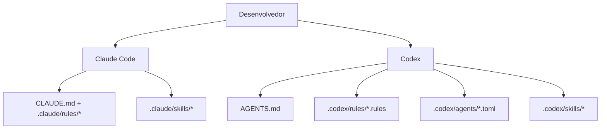
```mermaid
graph TD
    USER["Desenvolvedor"]
    CLAUDE["Claude Code"]
    CODEX["Codex"]
    MEMORY["CLAUDE.md + .claude/rules/*"]
    C_SKILLS[".claude/skills/*"]
    AGENTS_MD["AGENTS.md"]
    X_RULES[".codex/rules/*.rules"]
    X_AGENTS[".codex/agents/*.toml"]
    X_SKILLS[".codex/skills/*"]

    USER --> CLAUDE
    USER --> CODEX
    CLAUDE --> MEMORY
    CLAUDE --> C_SKILLS
    CODEX --> AGENTS_MD
    CODEX --> X_RULES
    CODEX --> X_AGENTS
    CODEX --> X_SKILLS
```

### Camada do Claude Code

- Contexto persistente:
  - [`CLAUDE.md`](./CLAUDE.md)
- Regras por caminho:
  - [`.claude/rules/backend-node.md`](./.claude/rules/backend-node.md)
  - [`.claude/rules/frontend-react.md`](./.claude/rules/frontend-react.md)
  - [`.claude/rules/mcp-typescript.md`](./.claude/rules/mcp-typescript.md)
  - [`.claude/rules/docs-markdown.md`](./.claude/rules/docs-markdown.md)
  - [`.claude/rules/file-headers.md`](./.claude/rules/file-headers.md)
  - [`.claude/rules/wiki-i18n.md`](./.claude/rules/wiki-i18n.md)
  - [`.claude/rules/i18n-parity.md`](./.claude/rules/i18n-parity.md)
- Skills:
  - `repo-onboarding`
  - `ship-feature`
  - `version-release`
  - `mcp-operations`
  - `debug-live-issue`
  - `update-project-docs`
  - `file-headers`
  - `push-to-forked-pr`
  - `i18n-parity`
- Subagentes:
  - `backend-reviewer`
  - `frontend-reviewer`
  - `mcp-reviewer`

### Camada do Codex

- Contexto persistente:
  - [`AGENTS.md`](./AGENTS.md)
- Política de execução:
  - [`.codex/rules/default.rules`](./.codex/rules/default.rules)
- Modelos de subagentes personalizados:
  - [`.codex/agents/`](./.codex/agents)
- Skills:
  - [`.codex/skills/`](./.codex/skills)
- Configuração:
  - [`.codex/README.md`](./.codex/README.md)

---

## Integração MCP

Este projeto inclui um servidor MCP local em `mcp/` com 97 ferramentas em 16 módulos de domínio. Ele expõe todas as ações suportadas pelo app, incluindo leituras de dados por escopo, transcrições/imagens, preços de Claude, Cursor e GPT, fluxos, alertas/webhooks, importações e restauração de backup, configuração de Claude/Codex, Executar agente, fontes remotas, configurações, push e manutenção protegida. Ele suporta três modos de transporte.

### Modos de transporte do MCP

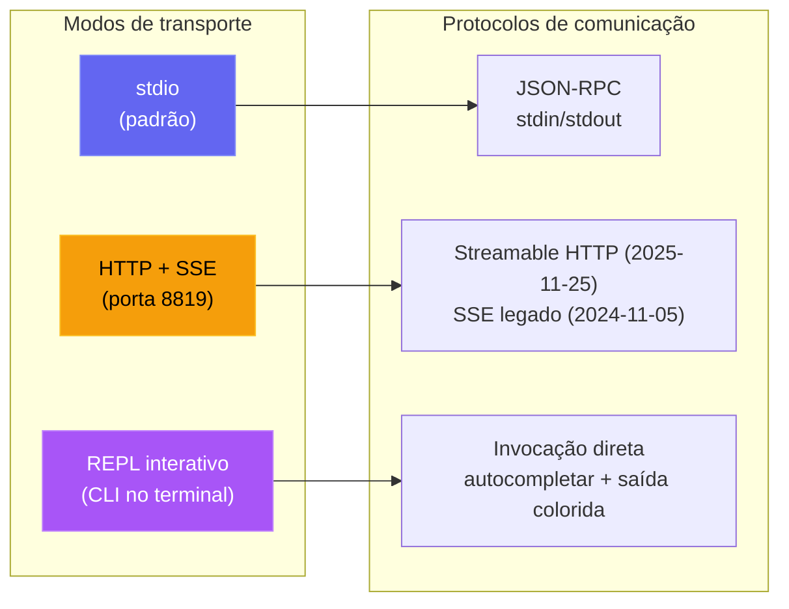
```mermaid
flowchart LR
    subgraph Transports["Modos de transporte"]
        STDIO["stdio\n(padrão)"]
        HTTP["HTTP + SSE\n(porta 8819)"]
        REPL["REPL interativo\n(CLI no terminal)"]
    end

    subgraph Protocols["Protocolos de comunicação"]
        P1["JSON-RPC\nstdin/stdout"]
        P2["Streamable HTTP (2025-11-25)\nSSE legado (2024-11-05)"]
        P3["Invocação direta\nautocompletar + saída colorida"]
    end

    STDIO --> P1
    HTTP --> P2
    REPL --> P3

    style STDIO fill:#6366f1,stroke:#818cf8,color:#fff
    style HTTP fill:#f59e0b,stroke:#fbbf24,color:#000
    style REPL fill:#a855f7,stroke:#c084fc,color:#fff
```

| Modo | Comando | Caso de uso |
| --- | --- | --- |
| **stdio** | `npm run mcp:start` | Claude Code, Claude Desktop, hosts MCP de IDEs |
| **HTTP** | `npm run mcp:start:http` | Clientes MCP remotos, integrações web, várias sessões |
| **REPL** | `npm run mcp:start:repl` | Depuração operacional, invocação manual de ferramentas, administração local |

<p align="center">
  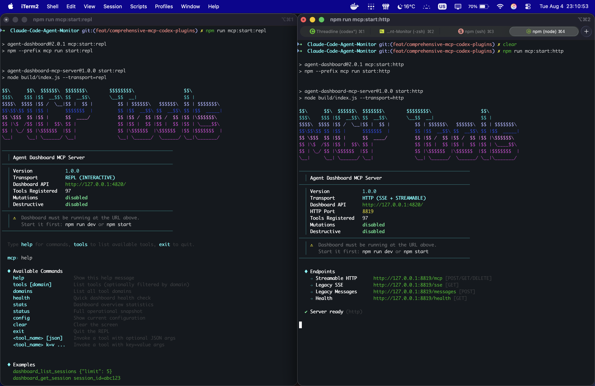
</p>

### Arquitetura do MCP

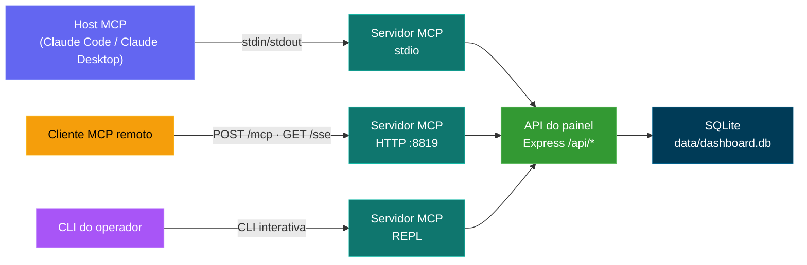
```mermaid
graph LR
    HOST["Host MCP<br/>(Claude Code / Claude Desktop)"]
    HTTP_CLIENT["Cliente MCP remoto"]
    OPERATOR["CLI do operador"]

    MCP_STDIO["Servidor MCP<br/>stdio"]
    MCP_HTTP["Servidor MCP<br/>HTTP :8819"]
    MCP_REPL["Servidor MCP<br/>REPL"]

    API["API do painel<br/>Express /api/*"]
    DB["SQLite<br/>data/dashboard.db"]

    HOST -->|"stdin/stdout"| MCP_STDIO
    HTTP_CLIENT -->|"POST /mcp · GET /sse"| MCP_HTTP
    OPERATOR -->|"CLI interativa"| MCP_REPL

    MCP_STDIO --> API
    MCP_HTTP --> API
    MCP_REPL --> API
    API --> DB

    style HOST fill:#6366f1,stroke:#818cf8,color:#fff
    style HTTP_CLIENT fill:#f59e0b,stroke:#fbbf24,color:#000
    style OPERATOR fill:#a855f7,stroke:#c084fc,color:#fff
    style MCP_STDIO fill:#0f766e,stroke:#14b8a6,color:#fff
    style MCP_HTTP fill:#0f766e,stroke:#14b8a6,color:#fff
    style MCP_REPL fill:#0f766e,stroke:#14b8a6,color:#fff
    style API fill:#339933,stroke:#5cb85c,color:#fff
    style DB fill:#003B57,stroke:#005f8a,color:#fff
```

### Superfície de ferramentas do MCP

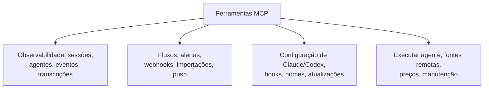
```mermaid
graph TD
    ROOT["Ferramentas MCP"]
    OBS["Observabilidade, sessões,<br/>agentes, eventos, transcrições"]
    OPS["Fluxos, alertas,<br/>webhooks, importações, push"]
    CFG["Configuração de Claude/Codex,<br/>hooks, homes, atualizações"]
    RUN["Executar agente, fontes remotas,<br/>preços, manutenção"]

    ROOT --> OBS
    ROOT --> OPS
    ROOT --> CFG
    ROOT --> RUN
```

### Modelo de segurança do MCP

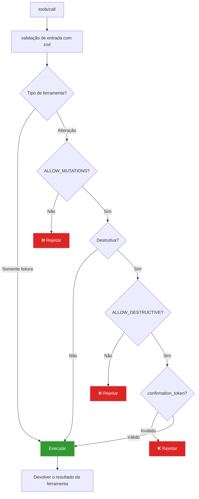
```mermaid
flowchart TD
    CALL["tools/call"] --> VALIDATE["validação de entrada com zod"]
    VALIDATE --> TYPE{"Tipo de ferramenta?"}
    TYPE -->|Somente leitura| EXEC["Executar"]
    TYPE -->|Alteração| M_FLAG{"ALLOW_MUTATIONS?"}
    M_FLAG -->|Não| DENY1["❌ Rejeitar"]
    M_FLAG -->|Sim| DEST{"Destrutiva?"}
    DEST -->|Não| EXEC
    DEST -->|Sim| D_FLAG{"ALLOW_DESTRUCTIVE?"}
    D_FLAG -->|Não| DENY2["❌ Rejeitar"]
    D_FLAG -->|Sim| TOKEN{"confirmation_token?"}
    TOKEN -->|Inválido| DENY3["❌ Rejeitar"]
    TOKEN -->|Válido| EXEC
    EXEC --> RESULT["Devolver o resultado da ferramenta"]

    style EXEC fill:#339933,stroke:#5cb85c,color:#fff
    style DENY1 fill:#dc2626,stroke:#f87171,color:#fff
    style DENY2 fill:#dc2626,stroke:#f87171,color:#fff
    style DENY3 fill:#dc2626,stroke:#f87171,color:#fff
```

### Modos de operação do MCP

- Modo somente leitura (padrão): `MCP_DASHBOARD_ALLOW_MUTATIONS=false`
- Modo administrador: `MCP_DASHBOARD_ALLOW_MUTATIONS=true`
- Painel autenticado: defina `MCP_DASHBOARD_API_TOKEN` / `_FILE` com o token do painel
- Transporte HTTP/SSE autenticado: defina `MCP_HTTP_AUTH_TOKEN` / `_FILE`; os clientes enviam autenticação bearer ou `x-mcp-token`
- Proteções de transporte: HTTP direto em loopback pode levar o token; aliases de host de contêiner exigem HTTPS; redirecionamentos são rejeitados
- Proteções de payload: 50 MiB por arquivo de histórico enviado, 100 MiB no total por chamada, 10 MiB para respostas binárias e 25 MiB para restauração de backup
- Modo destrutivo: exige todos estes:
  - `MCP_DASHBOARD_ALLOW_MUTATIONS=true`
  - `MCP_DASHBOARD_ALLOW_DESTRUCTIVE=true`
  - a entrada de ferramenta `confirmation_token: "CLEAR_ALL_DATA"`

Detalhes completos: [mcp/README.md](./mcp/README.md)

---

## Referência da API

Todos os endpoints retornam JSON. As respostas de erro seguem o formato `{ error: { code, message } }`.

### OpenAPI / Swagger / ReDoc

Há três formas de explorar a API HTTP, todas baseadas em uma única especificação OpenAPI 3.0.3 (porta padrão do servidor `4820`):

| Método | Caminho | Descrição |
| ------ | ------------------------------- | ------------------------------------------------------------------------------------------------- |
| `GET` | `/api/openapi.json` | Especificação OpenAPI 3.0.3 bruta em JSON |
| `GET` | `/api/docs` | **Swagger UI** interativo — execute requisições para testá-las |
| `GET` | `/api/redoc` | Referência **ReDoc** — uma renderização limpa em três painéis, otimizada para leitura, da mesma especificação |
| `GET` | `/api/redoc/redoc.standalone.js` | Bundle do ReDoc auto-hospedado (servido localmente pela dependência `redoc`, nunca por CDN — funciona offline) |

O documento OpenAPI é gerado a partir de `server/openapi.js` (`createOpenApiSpec()`) e mesclado com fragmentos complementares em `server/openapi-extra/`. O Swagger UI e o ReDoc são servidos diretamente pelo backend; o bundle do ReDoc é servido localmente (`GET /api/redoc/redoc.standalone.js`), então a referência funciona totalmente offline / em rede isolada, de acordo com a política do projeto de não usar recursos externos.

A cobertura é completa: toda rota do backend está documentada (82 entradas de caminhos) sob estas tags — Health, Sessions, Agents, Events, Stats, Metrics, Analytics, Hooks, Pricing, Workflows, Settings, Updates, Alerts, Webhooks, Push, CcConfig (explorador de configuração do Claude Code), Run (execuções iniciadas pelo painel) e Documentation —, cada uma com parâmetros, esquemas de requisição/resposta, descrições por campo e exemplos realistas.

Um **`openapi.yaml`** versionado na raiz do repositório espelha a especificação ao vivo. Ele é gerado a partir de `server/openapi.js` (nunca editado à mão) — regenere-o depois de mudanças na API com:

```bash
npm run openapi:yaml
```

### Métricas do Prometheus e Grafana

`GET /api/metrics` expõe os contadores ao vivo do painel — sessões/agentes por status, totais de eventos e de tokens, clientes em tempo real conectados, fontes remotas configuradas, tempo de atividade/memória do processo e versão do build — no formato de exposição em texto do Prometheus, para que o CCAM possa ser coletado pela sua própria pilha de observabilidade. Uma pilha Prometheus + Grafana pronta para uso, com **quatro dashboards provisionados automaticamente** (página inicial padrão: **CCAM — Overview**), fica em [`monitoring/`](./monitoring/README.md).

**npm (sem Docker — macOS, Linux ou Windows):**

```bash
npm start                          # dashboard on :4820
npm run monitoring:install         # one-time: npm postinstall pulls binaries
npm run monitoring:up              # Grafana on :3000, auto-provisioned; see monitoring/README.md for credentials
```

**Docker / Podman** (quando o painel roda em um contêiner ou se você preferir o Compose):

```bash
# Dashboard only
npm run docker:up

# Dashboard + Prometheus + Grafana (one command)
npm run docker:full:up

# Or mix: native/docker dashboard + docker monitoring
DASHBOARD_ALLOWED_HOSTS=host.docker.internal npm start   # or docker:up with same env
npm run monitoring:docker:up
npm run monitoring:verify
```

<p align="center">
  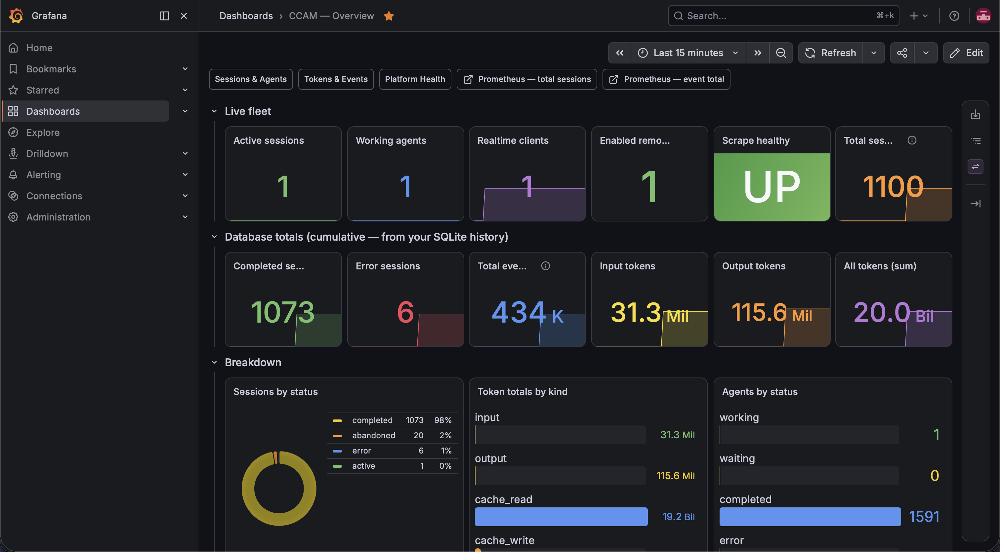
  <br>
  <em>📊 <strong>Grafana · CCAM — Overview</strong> — dashboard inicial padrão (quatro dashboards provisionados automaticamente): retrato da frota, totais do banco, gráficos de distribuição e taxas — tudo a partir de coletas ao vivo de <code>/api/metrics</code></em>
</p>

<p align="center">
  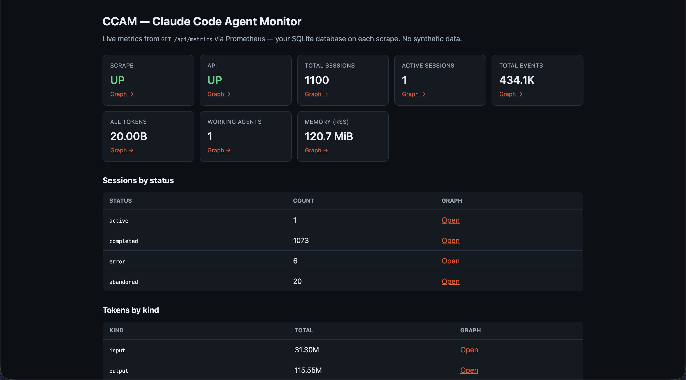
  <br>
  <em>🔥 <strong>Prometheus · console CCAM</strong> — página inicial pronta em <code>/consoles/index.html</code> que consulta o Prometheus diretamente para a saúde da coleta, totais de sessões, eventos, tokens e links do Graph para aprofundar</em>
</p>

<p align="center">
  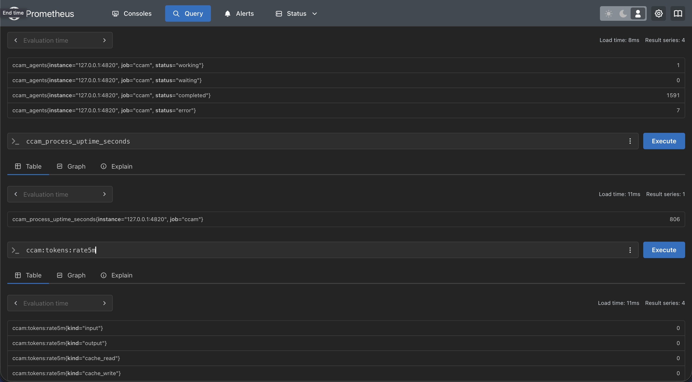
  <br>
  <em>📈 <strong>Prometheus · Graph</strong> — execute PromQL sobre as métricas coletadas do CCAM (p. ex. <code>sum(ccam_sessions)</code>, <code>ccam_events_total</code>, <code>rate(ccam_tokens_total[5m])</code>) com links iniciais a partir do console CCAM e de <a href="./monitoring/README.md">monitoring/README.md</a></em>
</p>

Veja [docs/API.md → Metrics](./docs/API.md#metrics) para a lista completa de métricas e os detalhes de coleta/autenticação.

<p align="center">
  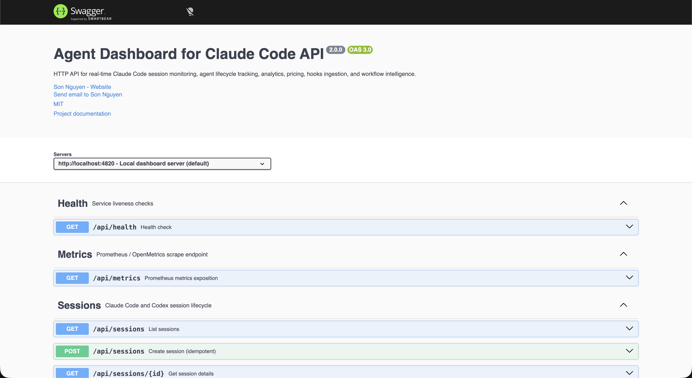
</p>

<p align="center">
  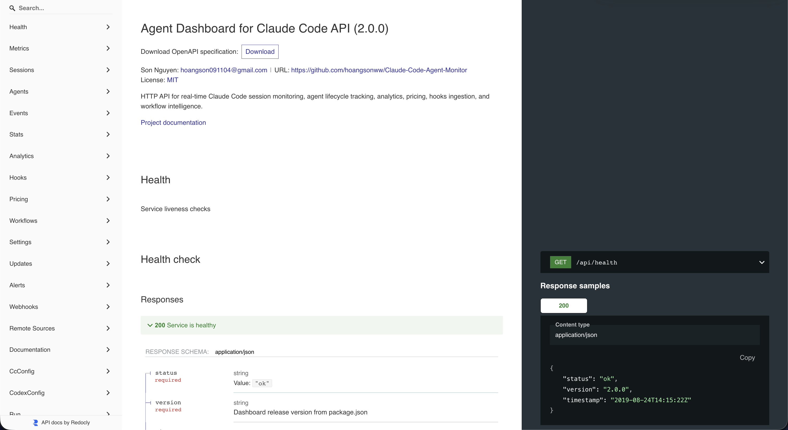
</p>

### Saúde

| Método | Caminho | Descrição |
| ------ | ------------- | ------------------------------------- |
| `GET` | `/api/health` | Retorna `{ status: "ok", timestamp }` |

### Sessões

| Método | Caminho | Parâmetros de consulta | Descrição |
| ------- | ------------------------------- | ---------------------------------------------------------------- | -------------------------------------------------------------------------------------------- |
| `GET` | `/api/sessions` | `status`, `q`, `limit`, `offset` | Lista as sessões com contagem de agentes e custo por sessão. `q` faz uma busca sem distinção de maiúsculas em `id` / `name` / `cwd`. `limit` tem padrão 50, máximo 10000. A resposta inclui `total` para paginadores. |
| `GET` | `/api/sessions/:id` | -- | Detalhe da sessão com agentes e eventos |
| `GET` | `/api/sessions/:id/stats` | -- | Contagens agregadas que alimentam o painel de visão geral do Detalhe da sessão: eventos, eventos por tipo, ferramentas mais usadas, número de erros, contagens por tipo/status de agente, divisão por tipo de subagente, totais de tokens, intervalo de tempo |
| `GET` | `/api/sessions/:id/transcripts` | -- | Lista as transcrições JSONL disponíveis da sessão (principal + subagentes + compactações) |
| `GET` | `/api/sessions/:id/transcript` | `agent_id`, `limit`, `offset`, `after`, `before` | Transmite as mensagens de uma transcrição específica com paginação por cursor. O `usage` do assistente inclui `input_tokens`, `output_tokens`, `cache_read_input_tokens`, `cache_creation_input_tokens`, para que o medidor da página Executar seja preenchido por completo ao retomar / reconectar |
| `POST` | `/api/sessions` | -- | Cria uma sessão (idempotente em `id`) |
| `PATCH` | `/api/sessions/:id` | -- | Atualiza o status/os metadados da sessão |

### Agentes

| Método | Caminho | Parâmetros de consulta | Descrição |
| ------- | ----------------- | ----------------------------------------- | ----------------------------- |
| `GET` | `/api/agents` | `status`, `session_id`, `limit`, `offset` | Lista os agentes com filtros |
| `GET` | `/api/agents/:id` | -- | Detalhe de um agente |
| `POST` | `/api/agents` | -- | Cria um agente |
| `PATCH` | `/api/agents/:id` | -- | Atualiza o status/a tarefa/a ferramenta do agente |

### Eventos

| Método | Caminho | Parâmetros de consulta | Descrição |
| ------ | ------------- | ------------------------------- | -------------------------- |
| `GET` | `/api/events` | `session_id`, `limit`, `offset` | Lista os eventos (mais recentes primeiro) |

### Estatísticas

| Método | Caminho | Descrição |
| ------ | ------------ | ------------------------------------------------------ |
| `GET` | `/api/stats` | Contagens agregadas, distribuições por status, conexões WS |

### Análises

| Método | Caminho | Descrição |
| ------ | ---------------- | ---------------------------------------------------------- |
| `GET` | `/api/analytics` | Agregados de tokens/ferramentas/sessões para gráficos e visões de tendência |

### Fontes de dados remotas

| Método | Caminho | Parâmetros de consulta | Descrição |
| -------- | ------------------------------- | ------------ | ------------------------------------------------------------------------------------------- |
| `GET` | `/api/remote-sources` | -- | Lista as fontes remotas configuradas com status, último erro e contagens da última sincronização |
| `POST` | `/api/remote-sources` | -- | Cria uma fonte. Corpo: `{ label, host, ssh_port?, identity_file?, remote_home?, remote_codex_home?, enabled? }` |
| `PATCH` | `/api/remote-sources/:id` | -- | Atualiza uma fonte (rótulo, campos de conexão, ativação) |
| `DELETE` | `/api/remote-sources/:id` | `purge` | Exclui uma fonte; `?purge=true` também exclui as sessões importadas dessa fonte |
| `POST` | `/api/remote-sources/:id/test` | -- | Testa a conectividade SSH com a fonte |
| `POST` | `/api/remote-sources/:id/sync` | -- | Busca e reimporta da fonte agora |

`GET /api/sessions`, `/api/events`, `/api/agents`, `/api/stats` e `/api/analytics` também aceitam um parâmetro de consulta opcional `sources` (IDs de fonte separados por vírgula; omita para todas) para limitar os resultados pela origem, e `GET /api/sessions/facets` retorna um array `sources` para o seletor de escopo de dados.

### Hooks

| Método | Caminho | Descrição |
| ------ | ------------------ | -------------------------------------------- |
| `POST` | `/api/hooks/event` | Recebe e processa um evento de hook do Claude Code |
| `POST` | `/api/hooks/ingest-batch` | Envia um lote de dados de sessão de uma máquina itinerante/atrás de NAT (desativado por padrão; veja `REMOTE_PUSH_TOKEN` abaixo e `server/README.md` para o formato completo do payload) |

**Payload de um evento de hook:**

```json
{
  "hook_type": "PreToolUse",
  "data": {
    "session_id": "abc-123",
    "tool_name": "Bash",
    "tool_input": { "command": "ls -la" }
  }
}
```

### Preços

| Método | Caminho | Descrição |
| -------- | ------------------------ | ---------------------------------------- |
| `GET` | `/api/pricing` | Lista todas as regras de preços |
| `PUT` | `/api/pricing` | Cria ou atualiza uma regra de preço |
| `DELETE` | `/api/pricing/:pattern` | Exclui uma regra de preço |
| `GET` | `/api/pricing/cost` | Custo total de todas as sessões |
| `GET` | `/api/pricing/cost/:id` | Detalhamento de custos de uma sessão específica |

### Fluxos

| Método | Caminho | Descrição |
| ------ | ----------------------------- | ------------------------------------------------------- |
| `GET` | `/api/workflows` | Dados de fluxos limitados por provedor/fonte (orquestração, ferramentas registradas, padrões, compactações do Codex). Os filtros opcionais `?status=active\|completed`, `?sources=...` e `?providers=claude\|codex` se aplicam às 11 seções de dados |
| `GET` | `/api/workflows/session/:id` | Detalhamento por sessão limitado por provedor/fonte (árvore de agentes, linha do tempo das ferramentas registradas, eventos) |

### Alertas

| Método | Caminho | Descrição |
| -------- | ------------------------ | ---------------------------------------------------------------------- |
| `GET` | `/api/alerts` | Feed de alertas disparados, mais recentes primeiro (`?unacked=true`, `limit`, `offset`) |
| `POST` | `/api/alerts/:id/ack` | Reconhece um alerta |
| `POST` | `/api/alerts/ack-all` | Reconhece todos os alertas não reconhecidos |
| `GET` | `/api/alerts/rules` | Lista as regras de alerta |
| `POST` | `/api/alerts/rules` | Cria uma regra (`event_pattern` \| `inactivity` \| `status_duration` \| `token_threshold`) |
| `PATCH` | `/api/alerts/rules/:id` | Atualiza nome / configuração / ativação / tempo de espera (o tipo de regra é imutável) |
| `DELETE` | `/api/alerts/rules/:id` | Exclui uma regra e o histórico dos alertas disparados por ela |

### Webhooks

| Método | Caminho | Descrição |
| -------- | --------------------------------- | ------------------------------------------------------------------------------------ |
| `GET` | `/api/webhooks/providers` | Provedores suportados + seus campos de configuração (conduz o formulário da interface) |
| `GET` | `/api/webhooks` | Lista os destinos de webhook (URLs mascaradas, segredos ocultados) |
| `POST` | `/api/webhooks` | Cria um destino (14 provedores nativos + `generic`) |
| `PATCH` | `/api/webhooks/:id` | Atualiza nome / url / ativação / segredo / cabeçalhos / escopo por regra (o tipo é imutável) |
| `DELETE` | `/api/webhooks/:id` | Exclui um destino e seu log de entregas |
| `POST` | `/api/webhooks/:id/test` | Envia um alerta de teste sintético e informa o resultado da entrega |
| `GET` | `/api/webhooks/:id/deliveries` | Log das entregas recentes de um destino (`limit`, `offset`) |

Provedores hospedados exigem HTTPS. `generic` e `n8n` podem usar HTTP para receptores locais ou auto-hospedados. A entrega rejeita redirecionamentos, então credenciais, cabeçalhos personalizados e assinaturas HMAC nunca são repassados a uma segunda URL.

### Configurações

| Método | Caminho | Descrição |
| ------ | ------------------------------ | ------------------------------------------------ |
| `GET` | `/api/settings/info` | Informações do sistema, estatísticas do banco, status dos hooks |
| `POST` | `/api/settings/clear-data` | Exclui todas as sessões, agentes, eventos e usos de tokens |
| `POST` | `/api/settings/reimport` | Reimporta sessões antigas de `~/.claude/` |
| `POST` | `/api/settings/reinstall-hooks` | Reinstala os hooks do Claude Code |
| `POST` | `/api/settings/reset-pricing` | Restaura os padrões das tabelas de preços do Claude, do Codex ou de ambos |
| `GET` | `/api/settings/export` | Exporta todos os dados (sessions, agents, events, token_usage, workflows, dashboard_runs, alert_rules, model_pricing, cursor_model_pricing, gpt_model_pricing) como um único download JSON versionado |
| `POST` | `/api/settings/import` | Restaura um pacote de até 25 MiB vindo de `/export` (`file` multipart ou JSON `{ path }`). Idempotente + não destrutivo — sessões existentes são ignoradas por inteiro |
| `POST` | `/api/settings/cleanup` | Abandona sessões inativas, apaga dados antigos |

### Explorador de configuração do Claude (`/api/cc-config`)

Inspeção somente leitura de cada superfície de configuração do Claude Code, mais alterações cuidadosamente controladas para artefatos de texto de baixo risco. As leituras de arquivos canonicalizam o caminho solicitado e as raízes permitidas, para que links simbólicos não possam escapar dos diretórios confiáveis do Claude. Todos os caminhos de gravação criam backups com carimbo de data/hora em `<root>/cc-config-backups/<type>/` antes de alterar qualquer coisa.

| Método | Caminho | Descrição |
| -------- | ----------------------------------- | ----------- |
| `GET` | `/api/cc-config/overview` | Raízes (home do Claude, .claude do projeto, raiz do projeto, ~/.claude.json) + contagens de cada superfície |
| `GET` | `/api/cc-config/skills` | Skills em `<scope>/.claude/skills/<name>/SKILL.md` com frontmatter analisado; `?scope=user\|project\|all` |
| `GET` | `/api/cc-config/agents` | Subagentes `<scope>/.claude/agents/*.md` |
| `GET` | `/api/cc-config/commands` | Comandos de barra `<scope>/.claude/commands/*.md` |
| `GET` | `/api/cc-config/output-styles` | Estilos de saída `<scope>/.claude/output-styles/*.md` |
| `GET` | `/api/cc-config/plugins` | Plugins instalados de `~/.claude/plugins/installed_plugins.json`, unidos com `enabledPlugins` das configurações; cada entrada inclui `contributes` (contagem de skills/agentes/comandos/hooks/estilos de saída no diretório de instalação do plugin) mais os metadados de `plugin.json` |
| `GET` | `/api/cc-config/marketplaces` | Marketplaces registrados em `known_marketplaces.json`, enriquecidos com o `marketplace.json` de cada um (número de plugins, dono, descrição) |
| `GET` | `/api/cc-config/mcp` | Servidores MCP de `~/.claude.json` (nível superior + por projeto) e de `settings.json` |
| `GET` | `/api/cc-config/hooks` | Hooks agregados dos arquivos `settings.json` de usuário / projeto / projeto local |
| `GET` | `/api/cc-config/hook-scripts` | Arquivos em `~/.claude/hooks/` (os scripts auxiliares referenciados por `hooks.<event>.command`) |
| `GET` | `/api/cc-config/keybindings` | `~/.claude/keybindings.json` analisado em pares tecla/ação agrupados por contexto |
| `PUT` | `/api/cc-config/keybindings` | Sobrescreve `keybindings.json` a partir de `{ groups: [{ context, bindings: [{ key, action }] }] }`. Faz backup antes, preserva os metadados de nível superior (`$schema`/`$docs`) e rejeita contextos/teclas duplicados. Seguro de editar (ao contrário de `settings.json`, a CLI nunca o reescreve no meio de uma sessão) |
| `GET` | `/api/cc-config/statusline` | Configuração `settings.json.statusLine` + o conteúdo real de `statusline.py` / `statusline-command.sh`, se existir |
| `GET` | `/api/cc-config/settings` | JSON de configurações de usuário / projeto / projeto local, com as chaves que parecem segredos (que casam com `/token\|secret\|password\|api[_-]?key\|auth/i`) substituídas por `"<redacted>"` |
| `GET` | `/api/cc-config/memory` | Arquivos `CLAUDE.md` nos escopos de usuário + projeto, mais a memória por projeto baseada em arquivos: itens `scope:"auto-memory"` (cada um com `project`, `name`, `isIndex` e o `frontmatter` analisado) para cada `*.md` em `~/.claude/projects/<slug>/memory/`. Altere via `PUT`/`DELETE /api/cc-config/file` com `{ scope: "auto-memory", type: "auto-memory", project, name }` (os backups vão para `<memory-dir>/.cc-config-backups/auto-memory/`) |
| `GET` | `/api/cc-config/file?path=…` | Conteúdo de um único arquivo (caminho restrito a CLAUDE_HOME / .claude do projeto / CLAUDE.md do projeto) |
| `GET` | `/api/cc-config/backups` | Lista de todos os backups com carimbo de data/hora, com filtro opcional `?scope=&type=` |
| `PUT` | `/api/cc-config/file` | Cria ou sobrescreve um artefato de texto. Corpo: `{ scope, type, name?, content }`. Faz backup automático se o arquivo existir. Gravação atômica (arquivo temporário + renomeação). Conteúdo limitado a 256 KB, regex estrita para `name` |
| `DELETE` | `/api/cc-config/file` | Faz backup e depois exclui um artefato de texto. Diretórios de skills têm backup completo (preservando os recursos incluídos) antes da remoção recursiva |

### Executar Claude (`/api/run`)

Superfície HTTP para iniciar e supervisionar subprocessos `claude` a partir do painel. Proteção same-origin em todas as rotas — as requisições do navegador precisam vir de uma origem localhost; requisições sem Origin (CLI/curl) passam. Um `cwd` informado precisa ser um diretório absoluto existente e é canonicalizado com `realpath`. Ele pode, de propósito, ficar fora deste repositório, para que Executar agente possa iniciar a partir do home do usuário ou de qualquer projeto recente.

| Método | Caminho | Descrição |
| -------- | --------------------------------- | ----------- |
| `GET` | `/api/run` | Lista todos os handles de execução em memória (em andamento + concluídos recentemente); também retorna `maxConcurrent` e `activeCount` |
| `GET` | `/api/run/binary` | Verifica se o `claude` está no `PATH` e onde fica — usado pela interface para mostrar um erro claro antes de iniciar |
| `GET` | `/api/run/cwds` | Diretórios de trabalho sugeridos: cwd do servidor do painel, `$HOME` e cwds recentes da tabela de sessões |
| `GET` | `/api/run/files?cwd=…&q=…` | Busca aproximada de arquivos dentro de `cwd` para o autocompletar de arquivos com `@` da página Executar. Ignora `node_modules`, `.git`, `dist`, `build`, `.next`, `.cache`, `coverage` etc. O cwd é obrigatório e precisa existir; os resultados são limitados e ordenados pela correspondência com o nome do arquivo |
| `POST` | `/api/run` | Inicia uma nova execução. Corpo: `{ prompt, mode: "headless"\|"conversation", cwd?, model?, permissionMode?, resumeSessionId?, effort? }`. O modo headless coloca o prompt no argv via `-p` e fecha o stdin. O modo conversation envia o prompt pelo stdin como um envelope stream-json e mantém o stdin aberto para continuações. `resumeSessionId` (só conversation) acrescenta `--resume <id>`; quando definido, `prompt` pode ficar vazio — o lançador pula a gravação inicial no stdin e o `claude` aguarda na conversa retomada até o usuário enviar uma continuação via `POST /api/run/:id/message`. `effort` (`low` / `medium` / `high`) corresponde a `--effort`. O lançador sempre passa `--output-format stream-json --verbose --include-partial-messages` para que a interface possa renderizar os deltas caractere por caractere. A concorrência é, na prática, ilimitada (teto padrão de 10000 — substitua com `RUN_MAX_CONCURRENT`) |
| `GET` | `/api/run/:id` | Estado atual do handle. `?envelopes=1` inclui o log de envelopes em memória para que a interface possa reproduzir o histórico ao reconectar |
| `POST` | `/api/run/:id/message` | Envia um turno de continuação para uma conversa em andamento (só no modo conversation). Corpo: `{ text }` |
| `DELETE` | `/api/run/:id` | Para uma execução. SIGTERM, passando para SIGKILL após 5 s |

A saída é transmitida pelo WebSocket existente do painel em três tipos de mensagem: `run_stream` (envelope stream-json analisado, incluindo os deltas `stream_event` de `--include-partial-messages`), `run_status` (transições de status), `run_input_ack` (gravação no stdin confirmada). A página do explorador de configuração assina uma quarta mensagem — `cc_config_changed` — transmitida por `server/lib/cc-watcher.js` (via `fs.watch` em `~/.claude/`) e por `routes/cc-config.js` após cada PUT/DELETE bem-sucedido, com o payload `{ source: "dashboard"|"fs", action?, scope?, type?, name?, paths? }`. A lista de Sessões e a página SessionDetail consultam `/api/run` (e escutam `run_status`) para marcar qualquer sessão que esteja sendo conduzida por uma execução em andamento com um indicador clicável **▶ Run** que leva de volta a `/run`.

### Importação de histórico

Importe o histórico existente do **Claude Code** ou do **Codex** pelas abas de
provedor em **Configurações → Importação de histórico**. O Claude Code usa seu
analisador JSONL compartilhado para `~/.claude/projects`; o Codex usa para
`~/.codex/sessions` o mesmo ingestor de rollouts só com acréscimos do
monitoramento em tempo real, incluindo instantâneos de tokens, chamadas de
ferramentas response-item, estado do ciclo de vida e títulos nativos de
`/rename` quando `session_index.jsonl` está incluído. Reimportações são
idempotentes: o Claude preserva as bases de compactação e o Codex mantém os
cursores de bytes, então nenhum dos provedores conta uso ou custo em dobro. O
histórico do Codex vindo de uma pasta ou enviado pelo navegador é copiado para o
armazenamento do painel antes da limpeza dos arquivos temporários, mantendo a
visão da conversa disponível depois.

Um quarto modo — **Restaurar backup** — importa uma exportação completa do
painel em `.json` (gerada pelo botão **Exportar dados**, por `ccam export` ou por
`GET /api/settings/export`) em vez de transcrições brutas do Claude. É a
contrapartida da exportação: restaura todas as tabelas (sessions,
agents, events, token_usage, workflows, dashboard_runs, alert_rules,
model_pricing, cursor_model_pricing, gpt_model_pricing) e é idempotente + não
destrutivo — uma sessão que já existe é ignorada por inteiro, então você pode
**consolidar várias máquinas** em um só painel com segurança, sem duplicar nem
sobrescrever nada. É implementado por `server/lib/data-transfer.js` e
`POST /api/settings/import` (também `ccam import-data <file>`).

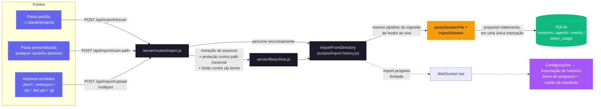
```mermaid
flowchart LR
    subgraph Sources["Fontes"]
      A1["Pasta padrão<br/>~/.claude/projects"]
      A2["Pasta personalizada<br/>qualquer caminho absoluto"]
      A3["Arquivos enviados<br/>.jsonl / .meta.json /<br/>.zip / .tar(.gz) / .gz"]
    end

    A1 -->|POST /api/import/rescan| R["server/routes/import.js"]
    A2 -->|POST /api/import/scan-path| R
    A3 -->|POST /api/import/upload<br/>multipart| R

    R -->|extração de arquivos<br/>+ proteção contra path traversal<br/>+ limite contra zip bomb| X["server/lib/archive.js"]
    R -->|percorre recursivamente| I["importFromDirectory<br/>(scripts/import-history.js)"]
    X --> I
    I -->|mesmo pipeline da ingestão<br/>de hooks ao vivo| P["parseSessionFile +<br/>importSession"]
    P -->|prepared statements,<br/>em uma única transação| D[("SQLite<br/>sessions / agents / events /<br/>token_usage")]
    I -.->|import.progress<br/>limitado| W["WebSocket /ws"]
    W -.-> U["Configurações → Importação de histórico<br/>barra de progresso + cartão de resultado"]

    style A1 fill:#6366f1,stroke:#818cf8,color:#fff
    style A2 fill:#6366f1,stroke:#818cf8,color:#fff
    style A3 fill:#6366f1,stroke:#818cf8,color:#fff
    style R fill:#1a1a28,stroke:#2a2a3d,color:#e4e4ed
    style X fill:#1a1a28,stroke:#2a2a3d,color:#e4e4ed
    style I fill:#1a1a28,stroke:#2a2a3d,color:#e4e4ed
    style P fill:#f59e0b,stroke:#fbbf24,color:#000
    style D fill:#10b981,stroke:#34d399,color:#fff
    style U fill:#a855f7,stroke:#c084fc,color:#fff
```

**Rotas**

| Método | Caminho | Descrição |
| ------ | ----------------------- | ------------------------------------------------------------------------ |
| `GET` | `/api/import/guide` | Caminhos do sistema, comando de arquivamento, extensões e instruções conforme o provedor (`?provider=claude\|codex`) |
| `POST` | `/api/import/rescan` | Varre de novo o local padrão escolhido: `~/.claude/projects` ou `~/.codex/sessions` (`{ provider }`) |
| `POST` | `/api/import/scan-path` | Varre um diretório absoluto com `{ path, provider }`; percorre recursivamente |
| `POST` | `/api/import/upload` | Envio multipart de `.jsonl`, `.meta.json`, `.zip`, `.tar(.gz)`, `.gz` com `provider` |

**Entradas suportadas.** Transcrições de sessão JSONL avulsas (`.jsonl`), seus
arquivos complementares `.meta.json` e arquivos compactados (`.zip`, `.tar`,
`.tar.gz`/`.tgz`, `.gz` simples) contendo qualquer estrutura de diretórios aninhada.
As duas organizações canônicas do Claude Code são reconhecidas automaticamente:
`<project>/<sessionId>/subagents/agent-*.jsonl` (padrão) e
`<project>/subagents/<sessionId>/agent-*.jsonl` (alternativa).
Para o Codex, o importador reconhece recursivamente os arquivos de sessão `rollout-*.jsonl`
(incluindo arquivos JSONL avulsos com `session_meta`) e um
`session_index.jsonl` opcional para os nomes de sessão nativos.

**Garantias de precisão.** As sessões são deduplicadas por UUID; executar o
importador de novo é sempre seguro. As colunas de compactação `baseline_input` /
`baseline_output` / `baseline_cache_read` / `baseline_cache_write`
preservam as contagens de tokens de antes da compactação de uma transcrição,
então reingerir um JSONL posterior a uma compactação nunca apaga custos históricos.
A deduplicação no nível dos eventos usa um valor máximo por tipo de evento
(`MAX(created_at) GROUP BY event_type` para a sessão): a cada
reimportação, só as entradas JSONL com `ts > cutoff[type]` são inseridas, então
sessões longas cujas transcrições crescem ao longo de vários dias
continuam recebendo eventos Stop / PostToolUse / TurnDuration / ToolError
sem duplicar o trabalho anterior. `sessions.ended_at` é avançado
até a última atividade do JSONL quando ela ultrapassa o valor
armazenado, e os metadados de contagem de mensagens são atualizados a cada passada.

**Segurança com transcrições enormes.** O cache de transcrições compartilhado
(`server/lib/transcript-cache.js`) lê os arquivos JSONL em blocos de 4 MiB
e decodifica uma linha por vez, então transcrições maiores que o
tamanho máximo de string JS do V8 (~512 MiB no Node 20 de 64 bits) são analisadas
sem derrubar o processo com `FATAL ERROR: v8::ToLocalChecked Empty
MaybeLocal`. O mesmo caminho em blocos é usado pela ingestão de hooks, pela
varredura periódica de compactações e pelo importador de histórico — nenhum deles
materializa o arquivo inteiro como uma única string JS. Os arrays crescentes de cada entrada
(`turnDurations`, `errors`, `compaction.entries`,
`usageExtras.*`) são limitados pelo final a `TRANSCRIPT_CACHE_MAX_ARRAY_LEN`
(padrão `1000`), com o corte aplicado durante a análise a partir de uma marca de `2 × cap`,
para que uma análise completa nova de uma sessão de vários dias não possa
montar uma estrutura temporária sem limite antes da finalização.

**Segurança.** A extração de arquivos compactados valida cada entrada contra path
traversal (caminhos absolutos e segmentos `..` são rejeitados). Um
limite de extração configurável (`CCAM_IMPORT_MAX_EXTRACT_BYTES`, padrão de
4 GB) barra bombas zip/tar/gzip. O tamanho dos envios é limitado por arquivo
(`CCAM_IMPORT_MAX_BYTES`, padrão de 1 GB) e por requisição
(`CCAM_IMPORT_MAX_FILES`, padrão de 2000). Todos os diretórios temporários são
por requisição e liberados em `finally`, inclusive quando o multer rejeita
todos os arquivos logo de início.

**Progresso.** A atividade de importação é transmitida pelo WebSocket existente
como mensagens `import.progress` (`phase`: `start` / `scan` / `extract` /
`parse` / `complete` / `error`), limitadas para não inundar o
canal em importações grandes.

**Interface.** Use o painel **Configurações → Importação de histórico** para uma experiência
guiada de arrastar e soltar, com instruções passo a passo, progresso ao vivo
e um resumo pós-importação com as contagens de importados / enriquecidos / ignorados /
com erro.

<p align="center">
  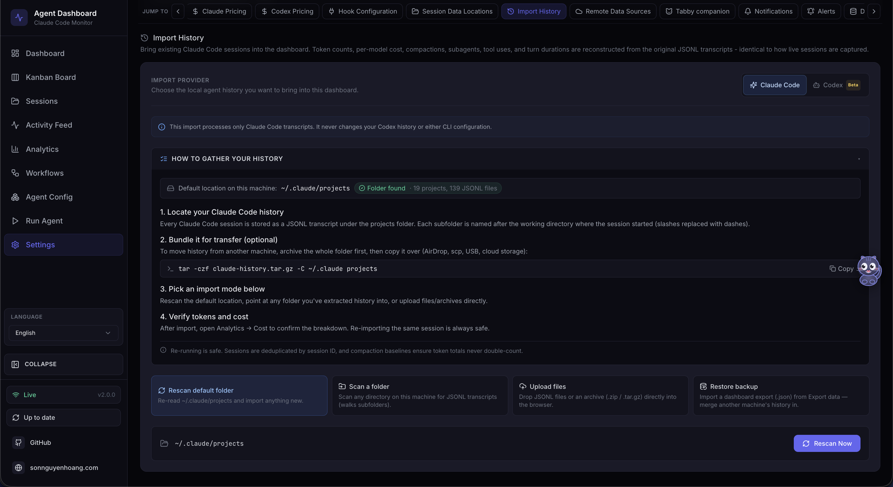
</p>

### WebSocket

Conecte-se a `ws://localhost:4820/ws` para receber mensagens em tempo real:

```json
{
  "type": "agent_updated",
  "data": { "id": "...", "status": "working", "current_tool": "Edit" },
  "timestamp": "2026-03-05T15:43:01.800Z"
}
```

**Tipos de mensagem:** `session_created`, `session_updated`, `agent_created`, `agent_updated`, `new_event`, `alert_triggered`, `alert_updated`, `remote_source.status` (dados `{ id, status: "idle"|"syncing"|"ok"|"error"|"deleted", error?, last_sync_at? }`)

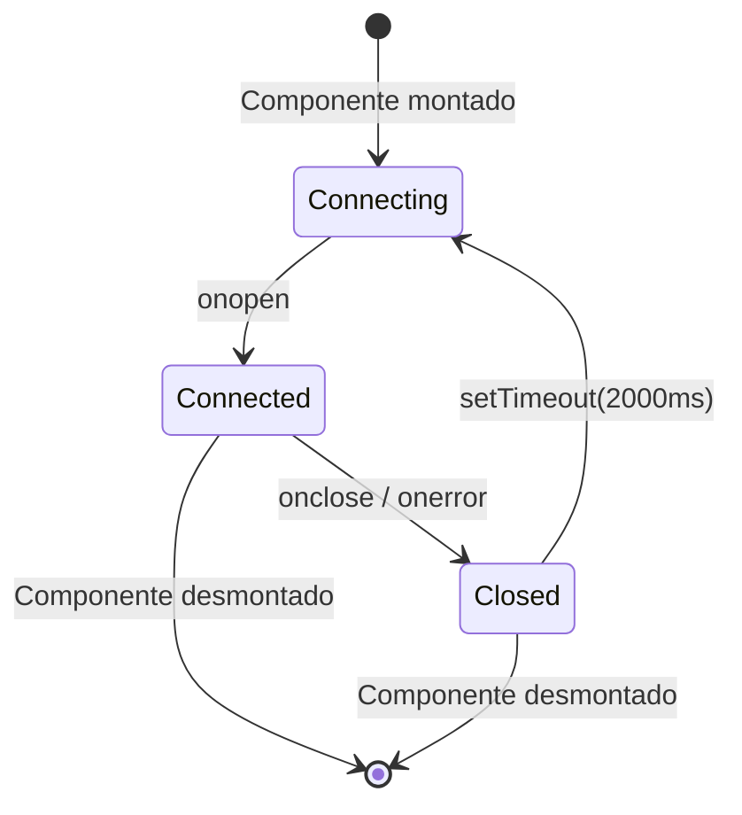
```mermaid
stateDiagram-v2
    [*] --> Connecting: Componente montado
    Connecting --> Connected: onopen
    Connected --> Closed: onclose / onerror
    Closed --> Connecting: setTimeout(2000ms)
    Connected --> [*]: Componente desmontado
    Closed --> [*]: Componente desmontado
```

---

## Eventos de hook

O painel processa estes tipos de hook do Claude Code:

| Tipo de hook | Gatilho | Ação do painel |
| ------------------- | ------------------------------ | -------------------------------------------------------------------------------------------- |
| `SessionStart` | Início de uma sessão do Claude Code | Cria a sessão e o agente principal. Registra `awaiting_input_since` (com `awaiting_reason=session_start`) para que uma sessão nova caia em **Em espera** — exceto um SessionStart de origem `compact` (compactação automática no meio do turno), que deixa a flag intacta para que uma sessão em trabalho continue **Ativa**. Reativa sessões retomadas. Abandona sessões órfãs sem atividade há `DASHBOARD_STALE_MINUTES` (padrão 180) |
| `UserPromptSubmit` | O usuário confirma um prompt | Limpa a flag de espera e promove o agente principal para `working` — o único sinal de que turnos do assistente só de texto começaram, já que eles não emitem `PreToolUse` |
| `PreToolUse` | Um agente começa a usar uma ferramenta | Limpa a flag de espera, coloca o agente em `working` e define `current_tool`. Se a ferramenta for `Agent`, cria um registro de subagente |
| `PostToolUse` | Execução da ferramenta concluída | Limpa a flag de espera (trata aprovações de pedidos de permissão em que a Notification a registrou no meio da ferramenta). Limpa `current_tool`. O agente continua `working` |
| `Stop` | O Claude terminou de responder | Sem erro: agente principal → `waiting` — o Claude terminou seu turno, a bola está com o usuário. `stop_reason=error`: marca o agente e a sessão como `error`. Subagentes em segundo plano continuam rodando |
| `SubagentStop` | Um agente em segundo plano terminou | Associa e conclui o subagente pela descrição, tipo ou tarefa. Propositalmente NÃO limpa a flag de espera — um subagente terminando não diz nada sobre a pessoa. **Dispara, sem aguardar, uma varredura do JSONL** (`scanAndImportSubagents`) que emite eventos `PreToolUse` + `PostToolUse` por ferramenta sob o próprio `agent_id` do subagente, para que a Linha do tempo mostre cada ferramenta que o subagente executou, e não só o marcador de início |
| `Notification` | Notificação de um agente | Registra o evento. Mensagens de pedido de permissão/entrada colocam o agente em `waiting` e registram `awaiting_input_since` (com `awaiting_reason=notification`, identificadas por padrão: `permission`, `waiting for input`, `needs your approval`, …). Notificações de compactação são marcadas como eventos `Compaction`. Dispara uma notificação do navegador, se ativada |
| `SessionEnd` | O processo da CLI do Claude Code termina | Remove a flag de espera. Se a sessão já estiver em `error`, o estado de erro é preservado; caso contrário, marca todos os agentes e a sessão como `completed` |
| `Compaction` | `/compact` detectado no JSONL | Cria um subagente de compactação (tipo `compaction`) e um evento Compaction. Detectado pelas entradas `isCompactSummary` no JSONL da transcrição. Também detectado pelo scanner periódico nas sessões ativas |
| `APIError` | Erro de API na transcrição JSONL | Extraído das entradas `isApiErrorMessage` (cota, limite de taxa, invalid_request) e das respostas brutas `type: "error"`. **Agora marca imediatamente a sessão e o agente como `error`** — antes era registrado como evento sem mudar o status. Armazenado como evento com os detalhes do erro |
| `TurnDuration` | Duração do turno na transcrição JSONL | Extraído das mensagens `system` com subtipo `turn_duration` e `durationMs`. Armazenado como evento para análise da duração por turno |
| `ToolError` | Erro em resultado de ferramenta no JSONL | Extraído das entradas `toolUseResult.is_error`. Acompanha falhas no nível das ferramentas para a análise de propagação de erros |
| `RemoteToolEvent` | Chamada de ferramenta enviada por uma máquina remota | Gravado por `POST /api/hooks/ingest-batch` para cada item de `tool_events[]` que uma máquina itinerante/atrás de NAT envia. Deduplicado por `(session_id, event_type, uuid)` em relação às linhas gravadas e dentro do lote, então reenviar um lote é seguro |
| `RemoteTurn` | Duração de turno enviada por uma máquina remota | Gravado por `POST /api/hooks/ingest-batch` para cada item de `turns[]`, levando o `duration_ms` daquele turno. Mesma deduplicação por `(session_id, event_type, uuid)` que `RemoteToolEvent` |
| `Interrupted` | Turno cancelado pelo usuário (Esc) | Sintetizado pelo vigia — o `Esc` não dispara hook, então uma sessão presa em `working` é detectada pelo marcador `[Request interrupted by user]` da transcrição ou, quando o Esc veio antes de qualquer saída, pelo tempo ocioso em trabalho (`DASHBOARD_WORKING_IDLE_SECONDS`). A sessão passa para **Em espera** (como depois de um `Stop` normal) |

---

## Notificações do navegador

O painel suporta notificações persistentes do navegador via Web Push (VAPID), para alertas em tempo real mesmo quando a aba do painel não está em foco ou o navegador está em segundo plano.

### Como funciona

1. **Ative** as notificações na página de Configurações pela chave geral
2. **Conceda** a permissão do navegador quando solicitado — isso registra um Service Worker e cria uma assinatura push
3. **Configure** quais eventos disparam notificações:

| Evento | Padrão | Descrição |
| ---------------------------- | ------- | --------------------------------------------------------------- |
| Nova sessão iniciada | Ligado | Dispara quando uma nova sessão do Claude Code é criada |
| O Claude terminou de responder | Desligado | Dispara nos eventos `Stop`, quando o Claude termina um turno de resposta |
| Sessão encerrada | Desligado | Dispara no `SessionEnd`, quando o processo da CLI termina |
| Erros de sessão | Ligado | Dispara quando uma sessão termina com erro |
| Subagente iniciado | Desligado | Dispara quando um subagente em segundo plano é criado |

Além disso, qualquer evento de hook `Notification` do Claude Code dispara uma notificação do navegador, independentemente das chaves por evento (desde que a chave geral esteja ativada).

### Arquitetura das notificações

- **Pipeline VAPID:** usa `web-push` no servidor para uma entrega segura das mensagens. As chaves VAPID são geradas automaticamente e armazenadas em `data/vapid-keys.json`.
- **Service Worker:** um worker dedicado (`client/public/sw.js`) trata os eventos `push` recebidos e exibe as notificações com `silent: false` para garantir o som no macOS.
- **Assinaturas:** os endpoints específicos de cada navegador ficam na tabela `push_subscriptions` do SQLite.
- **Persistência:** as notificações chegam mesmo com o navegador fechado, pois o Service Worker opera em segundo plano.
- **Notificação de teste:** um botão nas Configurações permite verificar o pipeline VAPID e a reprodução do som.

### PWA e suporte offline

O projeto traz três Progressive Web Apps independentes — uma para o **painel**, uma para a **página inicial** e uma para o **wiki**. Cada uma tem seu próprio `manifest.json` e Service Worker, então o navegador as trata como aplicativos instaláveis separados.

| Superfície | Manifesto | Service Worker | Estratégia de cache |
| --- | --- | --- | --- |
| Painel (`client/`) | `client/public/manifest.json` | `client/public/sw.js` | Os bundles do Vite com hash de conteúdo em `/assets/*` são servidos com cache primeiro (as URLs são imutáveis por build). Todo o resto — navegações, o próprio SW, `manifest.json`, ícones, a raiz `/` — usa rede primeiro com fallback para o cache, então um novo build sempre mostra a interface mais atual sem recarregamento forçado. Requisições de API (`/api/*`), WebSocket (`/ws`) e HMR do Vite nunca vão para o cache. Os manipuladores de notificações push são mantidos junto da lógica de cache. O middleware estático do Express (`server/index.js`) reforça isso enviando `Cache-Control: public, max-age=31536000, immutable` para `/assets/*` e `Cache-Control: no-cache, must-revalidate` para `index.html`, `sw.js` e `manifest.json`. `client/src/main.tsx` escuta `controllerchange`: quando um novo SW é ativado em uma página já controlada, ela recarrega exatamente uma vez (nas primeiras instalações, não). |
| Página inicial (raiz) | `manifest.json` | `sw.js` | Pré-armazena em cache a estrutura HTML, o favicon e a imagem OG. As capturas PNG vão para o cache na primeira visualização (cache primeiro), para evitar um pré-cache inicial pesado. A navegação usa rede primeiro com fallback offline. |
| Wiki (`wiki/`) | `wiki/manifest.json` | `wiki/sw.js` | Pré-armazena em cache `index.html`, `style.css`, `script.js`, o manifesto e o favicon. Funciona totalmente offline depois de uma visita. HTML com rede primeiro, CSS/JS com cache primeiro. |

**Ciclo de vida do cache:** os três SWs chamam `skipWaiting()` na instalação e excluem caches desatualizados na ativação (identificados por strings de versão como `dashboard-v2`, `landing-v1`, `wiki-v1`). Incrementar a constante de versão força uma atualização limpa.

**Suporte ao iOS:** os três arquivos HTML incluem `<meta name="apple-mobile-web-app-capable" content="yes">` e `<meta name="apple-mobile-web-app-status-bar-style" content="black-translucent">` para o modo independente na tela inicial do Safari.

**Ícones:** os manifestos referenciam `favicon.svg` com `sizes="any"` e `type="image/svg+xml"` — suportado no Chrome 107+, Firefox 110+ e Edge 107+. Os ícones Apple touch também usam o favicon SVG.

---

## Notificador de atualizações

O painel observa seu próprio checkout git e mostra uma janela sempre que o branch padrão canônico tem commits à frente do HEAD. **Ciente de branches e forks:** se você tiver um remote `upstream` (a convenção padrão para forks), ele tem preferência sobre `origin`; o `master`/`main`/`HEAD` do remote escolhido é a referência de comparação. O `manual_command` se adapta à sua situação — `git pull --ff-only` só quando seu branch realmente acompanha a referência canônica; caso contrário, um `git fetch` (e um merge fast-forward no caso de fork), para que o comando nunca engane. Os usuários recebem o comando exato para rodar em um terminal — o servidor **nunca** faz pull nem se reinicia sozinho, o que mantém o mecanismo portátil entre sessões de desenvolvimento, supervisão por pm2/systemd/launchd/Docker e implantações remotas.

<p align="center">
  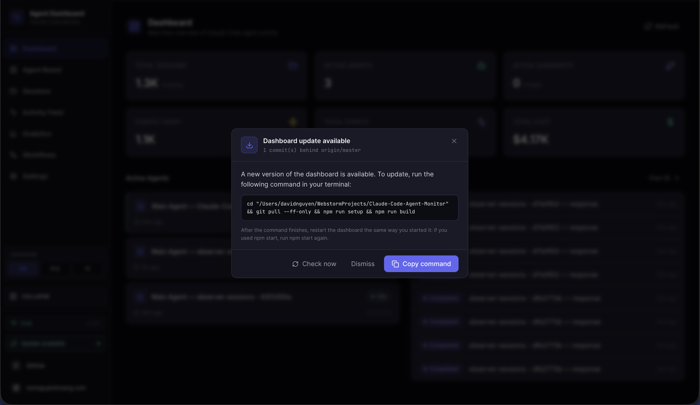
</p>

### Como funciona

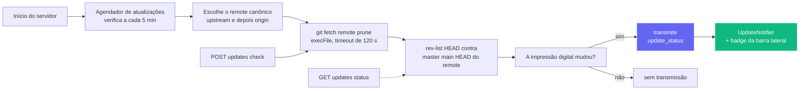
```mermaid
flowchart LR
    S["Início do servidor"] --> SCHED["Agendador de atualizações<br/>verifica a cada 5 min"]
    SCHED --> PICK["Escolhe o remote canônico<br/>upstream e depois origin"]
    PICK --> FETCH["git fetch remote prune<br/>execFile, timeout de 120 s"]
    FETCH --> CMP["rev-list HEAD contra<br/>master main HEAD do remote"]
    CMP --> FP["A impressão digital mudou?"]
    FP -->|sim| WS["transmite<br/>update_status"]
    FP -->|não| IDLE["sem transmissão"]
    WS --> CLIENT["UpdateNotifier<br/>+ badge da barra lateral"]

    CHECK["POST updates check"] --> FETCH
    STATUS["GET updates status"] -.-> CMP

    style WS fill:#6366f1,stroke:#818cf8,color:#fff
    style CLIENT fill:#10b981,stroke:#34d399,color:#fff
```

Uma verificação é barata (`git fetch <remote> --prune` no remote canônico — `upstream`, se configurado; senão `origin`), envolvida em `execFile` (sem shell) com timeout de 120 s. Falhas — rede offline, instalação fora do git, nenhum remote configurado, referência upstream que não se resolve — retornam todas **payloads suaves** (p. ex. `fetch_error: "..."`) em vez de lançar exceção, então um remote instável nunca bloqueia o painel.

### Superfícies da interface

| Superfície | Comportamento |
| --- | --- |
| **Janela** (`client/src/components/UpdateNotifier.tsx`) | Aparece quando `update_available === true` e o usuário ainda não dispensou esse `remote_sha` específico. Mostra quantos commits faltam, a referência acompanhada, uma `situation_note` opcional (em um branch de funcionalidade / fork, a nota explica por que o comando é diferente), o comando para copiar e colar e três botões: **Copiar comando** (principal), **Verificar agora**, **Dispensar**. Esc e cliques no fundo fecham a janela. Indexada por `remote_sha` em `localStorage`, então um commit upstream mais novo reabre a janela automaticamente. |
| **Botão da barra lateral** (`client/src/components/Sidebar.tsx`) | Botão "Verificar atualizações" sempre visível no rodapé. Borda esmeralda + ponto verde quando está atrás, âmbar quando a última verificação encontrou um erro de fetch. Clicar nele limpa qualquer dispensa anterior e dispara `POST /api/updates/check`. |
| **Terminal do servidor** | Quando o agendador passa de "atualizado" para "atrás", ele imprime no stdout um bloco com moldura contendo o comando, para que usuários sem interface também o vejam. |

### Superfície da API

| Endpoint | Finalidade |
| --- | --- |
| `GET /api/updates/status` | Verificação somente leitura: executa `git fetch` no remote canônico, compara o HEAD com o branch padrão dele e retorna o payload. |
| `POST /api/updates/check` | A mesma verificação, mas também transmite `update_status` via WebSocket, para que todos os clientes conectados se atualizem de uma vez. |

Os dois endpoints retornam o mesmo formato de payload:

```json
{
  "git_repo": true,
  "update_available": true,
  "repo_root": "/Users/you/Claude-Code-Agent-Monitor",
  "remote_ref": "upstream/master",
  "canonical_remote": "upstream",
  "current_branch": "master",
  "tracking_upstream": "origin/master",
  "tracks_canonical": false,
  "situation": "fork_or_diverged_tracking",
  "local_sha": "abc1234...",
  "remote_sha": "def5678...",
  "commits_behind": 3,
  "manual_command": "cd \"/...\" && git fetch upstream && git merge --ff-only upstream/master && npm run setup",
  "situation_note": "You're on 'master' tracking 'origin/master'. This command fast-forwards your branch from upstream/master (the canonical default).",
  "message": "3 commit(s) on upstream/master not in your checkout."
}
```

`situation` é um destes valores: `tracking_canonical` (clone típico no branch padrão — `git pull --ff-only` funciona), `fork_or_diverged_tracking` (o nome do branch local coincide com o canônico, mas acompanha outro remote — `git fetch <remote> && git merge --ff-only <ref>`), `feature_branch` (fora do branch padrão — só fetch, a integração fica a cargo do usuário) ou `detached_head`.

### O que **propositalmente não** existe aqui

Não há `POST /api/updates/apply` nem um auxiliar de reinício automático, por design. Atualizar um processo de dentro dele mesmo não é confiável sem um supervisor externo — `npm run dev` (concurrently), `npm start`, `pm2`, `systemd`, `launchd` e Docker precisam, cada um, de uma lógica de reinício diferente, e falhas de `git pull` / `npm install` em um servidor que está parando não têm um caminho limpo de reversão. Ficar só na detecção mantém o comportamento previsível com qualquer supervisor, qualquer sistema operacional e qualquer estado de branch, e ainda fecha a lacuna de informação "quando preciso fazer pull?"; a atualização de fato fica com o usuário, no próprio shell.

### Configuração

| Variável de ambiente | Padrão | Observações |
| --- | --- | --- |
| `DASHBOARD_UPDATE_CHECK` | ativado | Defina como `0` / `false` / `off` para desativar o agendador por completo. |
| `DASHBOARD_UPDATE_CHECK_INTERVAL_MS` | `300000` (5 min) | Intervalo entre as verificações automáticas. O mínimo é 60 000 ms — valores menores são elevados a esse limite. |

---

## Tabby — o gato companheiro flutuante

**Tabby** é um gato companheiro flutuante e fofo, fixado no canto inferior direito de todas as páginas do painel. Sempre presente, ele transforma o fluxo de sessões ao vivo em um mascote reativo, que se entende num relance e com quem você também pode conversar.

<p align="center">
  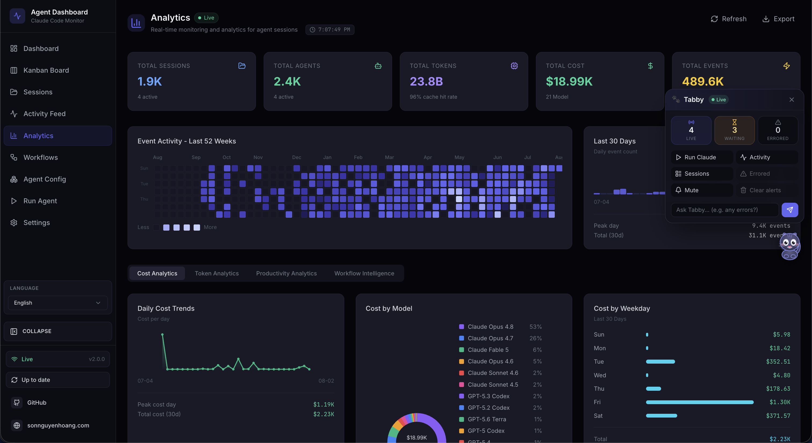
</p>

### Mascote reativo

Tabby é um gato em SVG que segue o cursor, com **oito humores** derivados do fluxo de sessões ao vivo, cada um com sua própria animação:

| Humor | Quando | Animação |
| --- | --- | --- |
| `idle` | Nada de relevante acontecendo | Balanço do rabo em repouso |
| `watching` | Há sessões ativas | Orelhas em pé, olhos seguindo o cursor |
| `happy` | Uma sessão ou execução terminou bem | Aceno de cabeça + brilhos |
| `worried` | Algo parece errado | Tremida sutil |
| `stuck` | Uma sessão parece travada | Alerta "!" |
| `thinking` | Um agente está no meio do trabalho | Aceno de cabeça lento |
| `sleeping` | Tudo quieto há um tempo | `zzz` |
| `disconnected` | O WebSocket caiu | Postura calma e parada |

### Balões de fala

O Tabby mostra automaticamente frases curtas em eventos relevantes (sessão iniciada/concluída, erros, execução finalizada). Os balões são **limitados e agrupados**, para que uma rajada de eventos nunca encha a tela, usam `aria-live` para leitores de tela e podem ser **silenciados** pelo painel.

### Painel

Abra o painel clicando no gato ou pressionando **⌘B / Ctrl+B** (Esc fecha). Ele mostra:

- Uma **linha de status** ao vivo — `N live · M errored · connection state`.
- **Ações rápidas** — ir para Executar Claude, Atividade, Sessões ou sessões com erro; silenciar balões; limpar alertas.
- Uma caixa **Perguntar** (veja abaixo).

### Caixa Perguntar → passagem para Executar Claude

A caixa **Perguntar** responde localmente a perguntas simples de status a partir dos dados em cache — por exemplo "o que está rodando", "algum erro" ou "status". Qualquer outra pergunta é encaminhada à página **Executar Claude** existente (com link direto para `/run?prompt=…`) para iniciar uma sessão real do Claude Code. O Tabby nunca chama um LLM por conta própria; ele simplesmente reutiliza a página Executar Claude para tudo o que vai além de uma consulta rápida de status.

### Acessibilidade e degradação segura

O Tabby é operável pelo teclado, usa `aria-live` nos balões e respeita `prefers-reduced-motion`. Se o WebSocket cair, ele recua com segurança para um estado calmo `disconnected` em vez de gerar erro. Você pode ativar ou desativar o Tabby nas **Configurações** (localizado em inglês, chinês, vietnamita, coreano, espanhol, francês, alemão, português e italiano), e a implementação fica em `client/src/components/Tabby/`.

---

## Sinais sonoros

O painel dá a você um **retorno sonoro sutil** da atividade das sessões ao vivo, para que você possa deixá-lo em um segundo monitor e ainda ouvir quando uma execução termina ou falha. O som vem **ativado por padrão** e pode ser desligado por completo com um clique.

### Síntese sem dependências

Não há nenhum arquivo `.mp3` ou `.wav` no repositório nem biblioteca de áudio no `package.json`. Cada sinal é gerado na hora com a **Web Audio API**: uma lista curta de osciladores (senoidal ou triangular), cada um com seu próprio envelope de ganho exponencial, mixados por um nó de ganho principal e um filtro passa-baixa para que o resultado fique em segundo plano em relação ao seu trabalho, em vez de interrompê-lo. O mecanismo inteiro é um único arquivo, `client/src/lib/sound.ts`.

### Os sinais

| Sinal | Quando toca | Como soa |
| --- | --- | --- |
| `sessionStart` | Uma nova sessão aparece | Quinta justa ascendente (Dó5 → Sol5) |
| `sessionComplete` | Uma sessão termina de responder (`Stop`) ou é encerrada (`SessionEnd`) | Arpejo maior conclusivo (Mi5 → Sol5 → Dó6) |
| `sessionError` | Uma sessão entra no estado `error` | Terça menor suave e descendente em onda triangular — perceptível, sem alarmar |
| `subagentSpawn` | Um subagente é iniciado | Um único dedilhado curto |
| `notification` | O Claude Code emite um evento `Notification` | Par desafinado que soa como um pequeno sino |
| `connected` / `disconnected` | O WebSocket do painel volta ou cai | Subida / descida de duas notas |
| `click` | Você pressiona um botão, link, aba ou chave | Tique quase inaudível |

Os sinais ficam dentro de uma escala de dó maior, para que finais sobrepostos nunca soem dissonantes, e cada envelope decai de forma exponencial em vez de ser cortado, o que evita o estalo de uma parada brusca.

### Sem atrapalhar

Três salvaguardas impedem que o som vire ruído:

- **Tempo de espera por sinal** — o mesmo sinal não se repete em menos de ~350 ms (45 ms para o tique de interação).
- **Orçamento global de rajadas** — no máximo 4 sinais começam em qualquer janela de 1,2 s, então importar o histórico ou reconectar depois de uma queda nunca transforma uma enxurrada de mensagens WebSocket em uma enxurrada de bipes.
- **Política de reprodução automática** — nada toca antes da sua primeira interação com a página (ponteiro, tecla ou toque), conforme as regras do navegador. Sinais anteriores são descartados em silêncio, não enfileirados.

Se o navegador não tiver nenhum suporte a Web Audio, cada chamada é uma operação nula segura — o painel simplesmente fica em silêncio.

### Configurações

**Configurações → Som** tem uma chave geral, um controle de volume e uma chave individual para cada sinal. Ligar uma chave toca o sinal na hora, para você ouvir exatamente o que acabou de ativar, e um botão **Ouvir o som** toca o som de conclusão sob demanda. As preferências ficam em `localStorage` sob `agent-monitor-sound` e valem instantaneamente em todo o app — sem recarregar. O painel está localizado em inglês, chinês, vietnamita, coreano, espanhol, francês, alemão, português e italiano.

Por padrão, início de sessão, conclusão de sessão, erro de sessão, notificações do Claude Code e o tique de interação estão ligados; início de subagentes e mudanças de conexão estão desligados (são os mais falantes). A implementação fica em `client/src/lib/sound.ts` (mecanismo + preferências) e `client/src/hooks/useSoundCues.ts` (ligação ao barramento de eventos), montado uma única vez em `client/src/App.tsx`.

---

## Janela de status da conexão

Clique na pílula **Ao vivo** / **Desconectado** no rodapé da barra lateral para abrir um pequeno painel de detalhes sobre o transporte WebSocket do painel. Ele mostra o endpoint `ws://` ativo, há quanto tempo o socket atual está aberto, o total de eventos recebidos, os principais tipos de evento como gráfico de barras horizontais, uma sparkline da vazão em 60 segundos e os últimos 8 eventos em uma lista de atividade recente. As estatísticas acumuladas (totais, divisão por tipo, lista recente) persistem entre recargas via `localStorage` sob `sidebar-connection-stats`; a sparkline móvel e o cronômetro "conectado desde" são efêmeros de propósito. Um botão **Redefinir** no rodapé limpa tudo sob demanda.

<p align="center">
  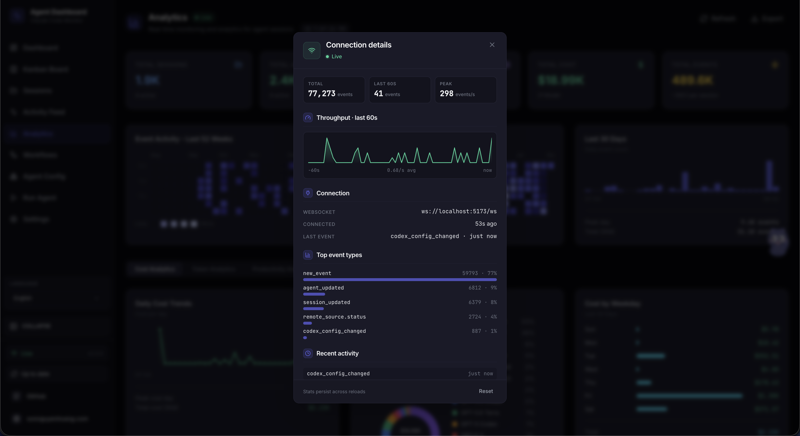
</p>

---

## Extensão do VS Code

O **Claude Code Agent Monitor** está disponível como uma extensão completa do VS Code, permitindo monitorar seus agentes de IA sem sair do editor.

<p align="center">
  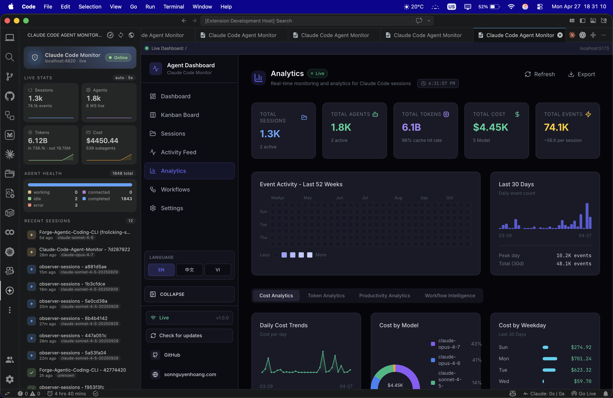
</p>

### 🚀 Principais recursos
- **Barra lateral ao vivo**: visão dedicada na Barra de Atividades mostrando em tempo real a saúde dos agentes (Trabalhando, Em espera, Concluído etc.).
- **Análises de uso**: acompanhe o total de tokens, os custos em USD ao vivo e a contagem de eventos direto na barra lateral.
- **Integração com a barra de status**: monitor de pulso de relance na barra inferior, com sessões e agentes ativos.
- **Navegação direta**: acesso com um clique a visões específicas do painel (Kanban, Análises, Configurações) ou a sessões recentes.
- **Aba integrada**: abre o painel de monitoramento completo como uma aba webview nativa do VS Code.

### 📦 Instalação e configuração
1. Abra o diretório [vscode-extension](./vscode-extension).
2. Instale a extensão pelo Marketplace ou empacote-a você mesmo com `vsce package`.
3. Garanta que o servidor local do painel esteja rodando (`npm run dev`).
4. Clique no **ícone de radar** na Barra de Atividades do VS Code para começar.

Para a configuração detalhada de desenvolvimento, veja os diretórios [.vscode](./.vscode) e [vscode-extension](./vscode-extension).

> [!TIP]
> Extensão no VS Code Marketplace: [Claude Code Agent Monitor](https://marketplace.visualstudio.com/items?itemName=hoangsonw.claude-code-agent-monitor)

---

## App de desktop (macOS e Windows)

O painel também é distribuído como um **aplicativo de desktop nativo** opcional, para instalar uma vez e esquecer — um `.app` para macOS (distribuído como `.dmg`) e um `.exe` para Windows (um instalador NSIS mais uma versão portátil sem instalação). Ele fica no workspace `desktop/`, ao lado de `client/`, `server/`, `mcp/` e `vscode-extension/`, e é construído com **Electron 35**.

<p align="center">
  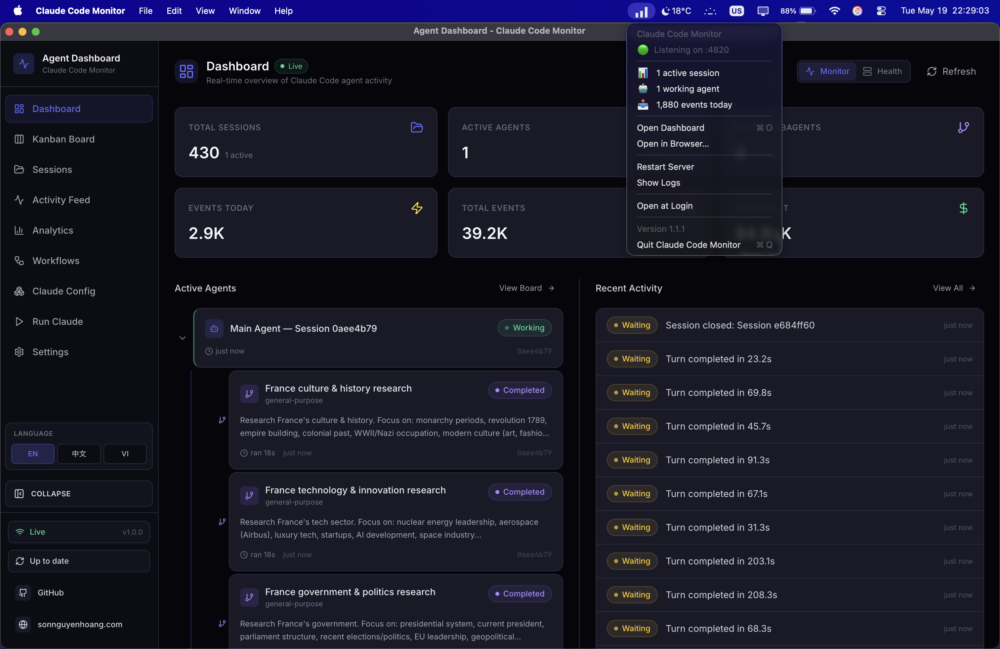
  <br>
  <em>🍎🪟 <strong>App de desktop</strong> — shell nativo com ícone na barra de menus / área de notificação (tray), abertura no login e bloqueio de instância única. O mesmo painel, em uma janela de verdade do sistema (macOS na imagem).</em>
</p>

<p align="center">
  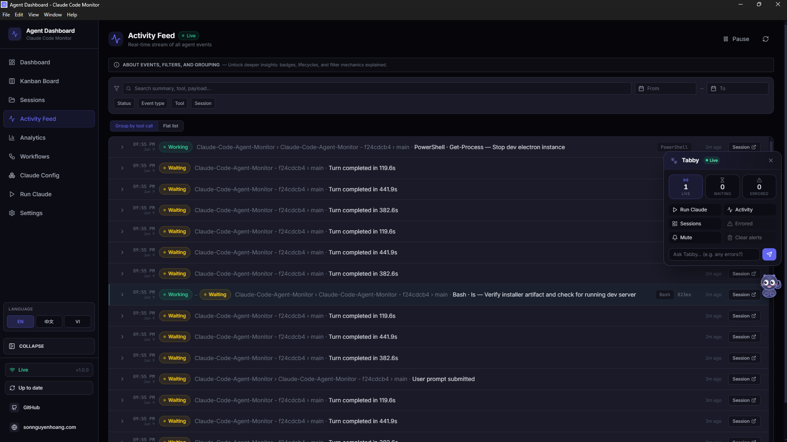
  <br>
  <em>🪟 O mesmo painel como app nativo do Windows — ícone na área de notificação (tray), menu de janela nativo e abertura no login.</em>
</p>

Tudo o que você vê no navegador em `localhost:4820` fica dentro desta janela, com o ciclo de vida nativo do sistema por cima: um ícone de tray, um menu de aplicativo nativo, integração com o início automático e um único botão de sair que encerra o servidor de forma limpa.

### Como funciona

Ao contrário de rodar o painel a partir de um terminal, o app de desktop não precisa de `npm start`, de um shell aberto nem de uma segunda cópia do servidor. O **processo principal** do Electron hospeda o servidor Express **no mesmo processo** — ele faz `require()` de `server/index.js` diretamente no mesmo runtime Node, **sem processo filho nem IPC** — e aponta uma `BrowserWindow` do Chromium para o cliente React compilado.

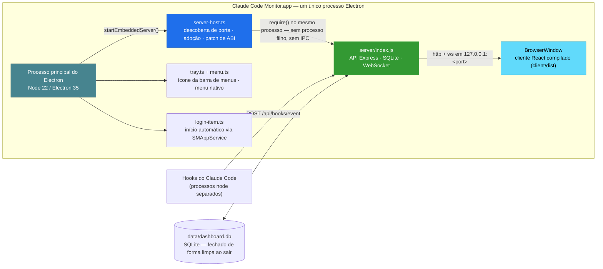
```mermaid
flowchart LR
    subgraph electron["Claude Code Monitor.app — um único processo Electron"]
        main["Processo principal do Electron<br/>Node 22 / Electron 35"]
        host["server-host.ts<br/>descoberta de porta · adoção · patch de ABI"]
        express["server/index.js<br/>API Express · SQLite · WebSocket"]
        win["BrowserWindow<br/>cliente React compilado (client/dist)"]
        tray["tray.ts + menu.ts<br/>ícone da barra de menus · menu nativo"]
        login["login-item.ts<br/>início automático via SMAppService"]
        main -->|"startEmbeddedServer()"| host
        host -->|"require() no mesmo processo — sem processo filho, sem IPC"| express
        main --> tray
        main --> login
        express -->|"http + ws em 127.0.0.1:&lt;port&gt;"| win
    end

    hooks["Hooks do Claude Code<br/>(processos node separados)"] -->|"POST /api/hooks/event"| express
    sqlite[("data/dashboard.db<br/>SQLite — fechado de forma limpa ao sair")] <--> express

    style main fill:#47848F,stroke:#2f5a62,color:#fff
    style express fill:#339933,stroke:#5cb85c,color:#fff
    style win fill:#61DAFB,stroke:#3aa9c9,color:#000
    style host fill:#1f6feb,stroke:#1158c7,color:#fff
```

Ao iniciar, o app:

1. Escolhe uma porta livre — de preferência **4820**, depois **4821–4829** e, por fim, uma porta alta aleatória se todas estiverem ocupadas.
2. Se um servidor de painel saudável já responder a `/api/health` na `4820` (p. ex. você rodou `npm start` em um terminal), ele **adota esse servidor** em vez de fazer um bind duplicado — sem conflito de porta, sem disputa pelo SQLite. Um servidor adotado continua rodando depois que você sai do app.
3. Caso contrário, inicia o servidor embutido e, na **primeira inicialização com servidor próprio**, instala automaticamente os hooks do Claude Code e inicia os serviços em segundo plano (agendador de atualizações, `cc-watcher`, reconciliação de execuções órfãs). Quem instala só o DMG já vê os eventos chegando **sem nenhuma configuração manual** — sem checkout, sem `npm run install-hooks`.
4. **(macOS)** Recupera o **`PATH` do shell de login** para que o recurso **Executar Claude** consiga encontrar e iniciar a CLI `claude` — um app aberto pelo Finder/Dock herda apenas o `PATH` mínimo do launchd e não encontraria CLIs em `~/.local/bin`, `/opt/homebrew/bin`, nos diretórios de gerenciadores de versão etc. (No Windows, o processo já herda o `PATH` do usuário.)
5. Abre a janela do painel — a menos que o app tenha sido iniciado no login (no macOS via itens de login; no Windows via a entrada marcada `HKCU\…\Run`), caso em que ele fica só no tray.
6. Ao sair, encerra o servidor embutido de forma ordenada e **fecha o SQLite de forma limpa** (checkpoint do WAL).

### Recursos

- **Ícone no tray** — superfície de status sempre presente (barra de menus do macOS / área de notificação do Windows). O clique esquerdo mostra/oculta a janela do painel; o clique direito abre um menu de contexto com **Abrir painel**, **Abrir no navegador**, **Reiniciar servidor**, **Mostrar logs**, **Abrir no login** (alternância) e **Sair**. O macOS usa um glifo modelo tingido; o Windows usa o `icon.ico` colorido (um modelo preto sumiria na barra de tarefas escura).
- **Ícone da janela e da barra de tarefas** — a `BrowserWindow` usa o logo colorido do app (`icon.ico` no Windows, `icon.png` nos demais), então a barra de título / de tarefas mostra o ícone real do Claude Code Monitor — até uma execução não empacotada com `npm run desktop:dev` deixou de mostrar o ícone genérico do Electron.
- **Menu de aplicativo nativo** — menu padrão `About` / `File` / `Edit` / `View` / `Window` / `Help` com atalhos `⌘` / `Ctrl`. O item **File → Open Dashboard** (`⌘1`) é **exclusivo do macOS**: o macOS mantém uma barra de menus global depois que a janela é ocultada e, por isso, consegue reabri-la — no Windows/Linux o menu fica preso à janela e não pode ser acionado enquanto ela está oculta, então reabra-a pelo **Abrir painel** do tray (que traz a janela para a frente de forma confiável, mesmo minimizada ou atrás de outras janelas).
- **Início automático no login** — alterne **Abrir no login** pelo tray ou pelo menu do app. No macOS, o registro usa a API moderna `SMAppService`, então a entrada aparece em **Ajustes do Sistema → Geral → Itens de Início**; no Windows, é gravada uma entrada por usuário em `HKCU\Software\Microsoft\Windows\CurrentVersion\Run`, visível em **Gerenciador de Tarefas → Inicialização**.
- **Fechar a janela a oculta, o servidor continua** — fechar a janela apenas a oculta; o servidor e o tray continuam ativos. Clique no tray para trazer a janela de volta.
- **Bloqueio de instância única** — abrir o app de novo apenas coloca a janela existente em foco; sem segundo servidor, sem conflito de porta. (Vale para todas as plataformas.)
- **Os dados sobrevivem a reinstalações e atualizações** — o banco SQLite e as chaves VAPID ficam no diretório de dados do app por usuário, **fora do bundle / diretório de instalação** — `~/Library/Application Support/Claude Code Monitor/data/` no macOS, `%APPDATA%\Claude Code Monitor\data\` no Windows. Um bundle empacotado é somente leitura, então gravar o banco dentro dele quebraria a Importação de histórico e a persistência de eventos; mantê-lo nos dados do app resolve isso e deixa seu histórico importado intacto quando você substitui ou atualiza o app. (O desinstalador NSIS do Windows mantém esses dados por padrão.)
- **CLI `claude` no PATH** — no macOS, o app recupera na inicialização o `PATH` do seu shell de login, então o recurso **Executar Claude** funciona mesmo que um app aberto pelo Finder/Dock normalmente herde só o `PATH` mínimo do launchd. (No Windows, o `PATH` do usuário herdado já o inclui.)
- **Logs** — o processo principal grava em `~/Library/Logs/Claude Code Monitor/desktop.log` (macOS) ou `%APPDATA%\Claude Code Monitor\logs\desktop.log` (Windows); acesse pelo **Mostrar logs** do menu do tray.

### Obter

**Opção A — baixar um instalador pronto (recomendado).** Em **[Releases → latest](https://github.com/hoangsonww/Claude-Code-Agent-Monitor/releases/latest)** (público, sem login no GitHub). A CI publica automaticamente uma nova release `vX.Y.Z` sempre que a versão em `package.json` é incrementada no `master`, então este link sempre entrega o build atual:

| Plataforma | Arquivo | Observações |
| --- | --- | --- |
| macOS (Apple Silicon) | `ClaudeCodeMonitor-<ver>-arm64.dmg` | arraste para `/Applications` |
| macOS (Intel) | `ClaudeCodeMonitor-<ver>-x64.dmg` | arraste para `/Applications` |
| Windows (instalador) | `ClaudeCodeMonitor-Setup-<ver>-x64.exe` | instalação por usuário, sem admin |
| Windows (portátil) | `ClaudeCodeMonitor-<ver>-x64-portable.exe` | roda sem instalar |

Builds novos por commit também ficam disponíveis como artefatos da CI (exige login, retenção de 14 dias): `ClaudeCodeMonitor-dmg` do job `🍎 macOS Desktop (DMG)` e `ClaudeCodeMonitor-win` do job `🪟 Windows Desktop (EXE)` — úteis para testar o `master` antes da próxima tag de release.

**Opção B — compilar você mesmo.** Na raiz do repositório:

```bash
npm run setup                # install root + client deps, build client, install hooks
npm run build                # build the React client (client/dist)
npm run desktop:install      # install Electron + electron-builder into desktop/ (preflights native deps; prints setup help on failure)
npm run desktop:dmg:arm64    # macOS:   fast single-arch DMG → desktop/release/ClaudeCodeMonitor-<ver>-arm64.dmg
npm run desktop:win          # Windows: NSIS installer → desktop/release/ClaudeCodeMonitor-Setup-<ver>-x64.exe
```

> [!NOTE]
> **DMGs são compilados no macOS; `.exe`s do Windows, no Windows** — o electron-builder empacota para o sistema operacional hospedeiro. O build de macOS `npm run desktop:dmg` empacota o app **duas vezes** (uma por arquitetura) e gera **os dois** DMGs por arquitetura (`arm64` + `x64`) — é o build de release; ele não os une em um binário universal. Para o seu próprio Mac, use o `desktop:dmg:arm64` / `desktop:dmg:x64` de arquitetura única. No Windows, o `better-sqlite3` é baixado como binário Electron pré-compilado por `npm run desktop:install`, então nenhuma toolchain C++ do Visual Studio é necessária no caso comum. Se o build falhar mesmo assim (sem binário pré-compilado ou sem toolchain C++), o `desktop:install` mostra a correção exata para cada sistema e uma alternativa sem toolchain, e falha de forma explícita em vez de deixar uma instalação quebrada.

### Instalar

**macOS:**

1. Dê um duplo clique no `.dmg` para montá-lo.
2. Arraste **Claude Code Monitor.app** para a sua pasta `/Applications`.
3. O DMG é **assinado ad hoc** por padrão, então o Gatekeeper avisa na primeira abertura (*"A Apple não pôde verificar…"*). Remova o atributo de quarentena:

   ```bash
   xattr -cr "/Applications/Claude Code Monitor.app"
   ```

   Ou abra **Ajustes do Sistema → Privacidade e Segurança** e clique em **Abrir Mesmo Assim**.

4. Abra o app. O ícone do tray aparece e a janela do painel se abre.

**Windows:**

1. Execute `ClaudeCodeMonitor-Setup-<ver>-x64.exe`. Ele instala **por usuário** em `%LOCALAPPDATA%\Programs\Claude Code Monitor` (sem elevação de administrador) e deixa você escolher o diretório de instalação; ou execute o `*-portable.exe` para abrir sem instalar.
2. O instalador **não é assinado** por padrão, então o **SmartScreen** do Windows pode mostrar *"O Windows protegeu o computador"* na primeira execução — clique em **Mais informações → Executar assim mesmo**.
3. Abra pelo menu Iniciar / atalho da área de trabalho. O ícone da área de notificação (tray) aparece e a janela do painel se abre.

<p align="center">
  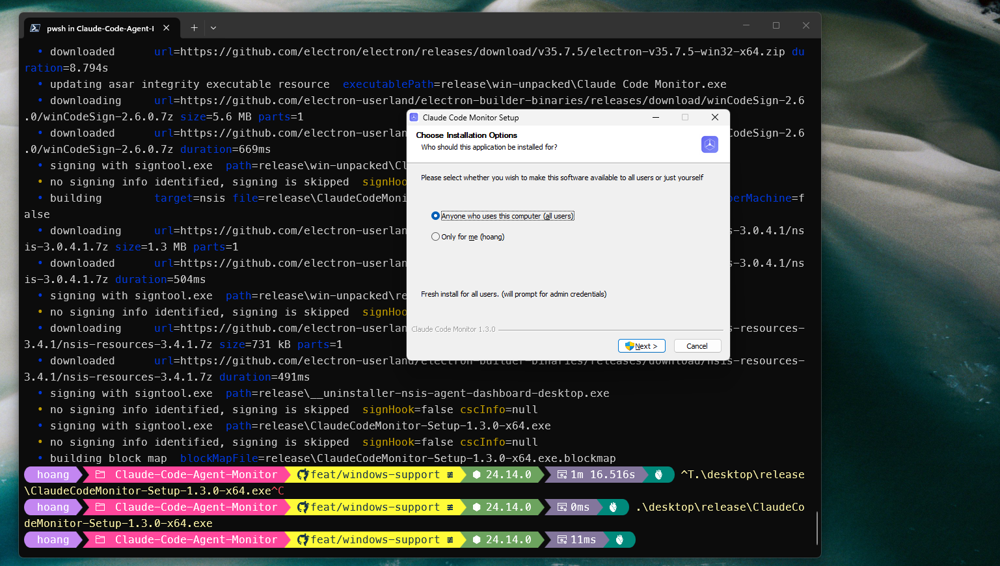
  <br>
  <em>Instalador do Windows · Etapa 1 — <strong>Choose Installation Options</strong> (por usuário "Only for me" ou todos os usuários).</em>
</p>

<p align="center">
  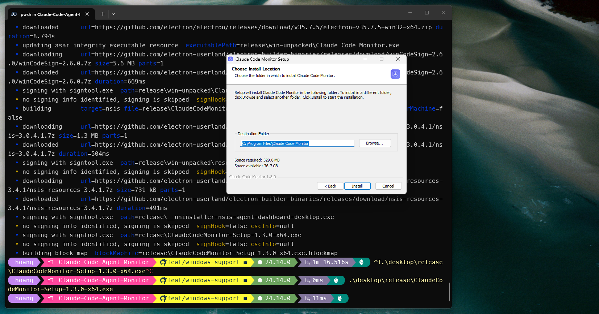
  <br>
  <em>Instalador do Windows · Etapa 2 — <strong>Choose Install Location</strong> (padrão por usuário <code>%LOCALAPPDATA%\Programs</code>).</em>
</p>

<p align="center">
  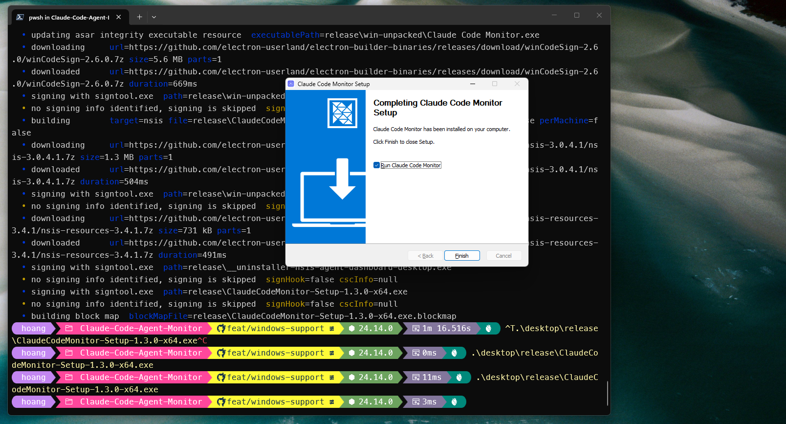
  <br>
  <em>Instalador do Windows · Etapa 3 — <strong>Completing Setup</strong> (finalizar e abrir o app).</em>
</p>

### Comandos de build

Todos os comandos rodam a partir da **raiz do repositório**:

| Comando | O que faz |
| --------------------------- | ---------------------------------------------------------------------------- |
| `npm run desktop:install` | Instala Electron + electron-builder em `desktop/`; recompila o `better-sqlite3` para a ABI do Electron; verifica antes o build nativo do `better-sqlite3` e mostra ajuda prática de configuração (incluindo uma alternativa sem toolchain) em caso de falha |
| `npm run desktop:build` | Compila o código TypeScript do desktop em `desktop/out/` |
| `npm run desktop:dev` | Compila e abre o app Electron para iterar localmente |
| `npm run desktop:test` | Executa o teste de fumaça (inicia o Electron, sonda `/api/health`, encerra) |
| `npm run desktop:dmg` | **macOS:** constrói **os dois** DMGs (arm64 + x64) — o certo para uma release, **mais lento** (empacota cada arquitetura) |
| `npm run desktop:dmg:arm64` | **macOS:** constrói um DMG só para Apple Silicon — **rápido** (~1 min), recomendado para o seu próprio Mac |
| `npm run desktop:dmg:x64` | **macOS:** constrói um DMG só para Intel — **rápido** (~1 min) |
| `npm run desktop:dmg:universal` | **macOS:** constrói um único DMG **universal** combinado (arm64 + x86_64) — opcional, **o mais lento**, e não é o que a release distribui |
| `npm run desktop:win` | **Windows:** constrói o instalador NSIS `.exe` (x64) |
| `npm run desktop:win:portable` | **Windows:** constrói o `.exe` portátil sem instalação (x64) |

O DMG de macOS resultante tem **~80 MB** (≈ 250 MB em disco depois de instalado) e o instalador do Windows é parecido — o custo normal de um bundle Electron.

### Assinatura e notarização

O DMG de macOS é **assinado ad hoc** por padrão, para que qualquer pessoa possa compilar um `.app` funcional sem uma conta paga de Apple Developer — o script `package` define `CSC_IDENTITY_AUTO_DISCOVERY=false` para que um certificado de assinatura já presente no chaveiro de quem contribui nunca seja escolhido automaticamente. A **assinatura Developer ID** de verdade é opcional via `CSC_LINK` (um `.p12` codificado em base64) e `CSC_KEY_PASSWORD`; a **notarização da Apple** é opcional via `APPLE_ID`, `APPLE_TEAM_ID` e `APPLE_APP_SPECIFIC_PASSWORD`. O build do **Windows** **não é assinado** por padrão (o SmartScreen pode avisar na primeira execução — *Mais informações → Executar assim mesmo*); a assinatura Authenticode só é ativada quando um certificado explícito é fornecido via `CSC_LINK` + `CSC_KEY_PASSWORD`. A CI usa tudo isso automaticamente quando fornecido — sem mudar o código.

### Notas de implementação

- **`better-sqlite3`** é o único módulo nativo da árvore de dependências, e um módulo nativo precisa ser compilado para a ABI exata do Node em que roda. O workspace `desktop/` traz sua **própria cópia** do `better-sqlite3`, recompilada para a ABI do Electron, e usa um redirecionamento de `require` local ao processo para apontar o `server/db.js` para ela; a cópia na raiz do repositório continua compilada para o Node do sistema (então `npm run test:server` continua funcionando).
- **Compilar um DMG recompila o `better-sqlite3` para a arquitetura de destino**, o que pode deixar a cópia do desktop compilada para a outra arquitetura de CPU e quebrar `npm run desktop:dev` / `npm run desktop:test` com `ERR_DLOPEN_FAILED`. A etapa `prebuild` do desktop agora **corrige automaticamente** o módulo nativo para a máquina local no build seguinte, então os fluxos de desenvolvimento e de teste de fumaça continuam funcionando depois de um build de DMG específico de uma arquitetura. A etapa `prebuild` também **falha na hora com ajuda de configuração** quando o binário nativo do `better-sqlite3` está totalmente ausente, transformando uma falha em tempo de execução em um erro de build que dá para copiar e colar.
- A **única mudança fora de `desktop/`** é uma refatoração de `server/index.js` que preserva o comportamento: sua inicialização pós-escuta (agendador de atualizações, `cc-watcher`, reconciliação de execuções órfãs) foi extraída para uma função exportada `startBackgroundServices()`, para que o servidor embutido execute exatamente o que `node server/index.js` executa. O caminho independente `node server/index.js` continua funcionalmente igual; `client/`, `scripts/`, `mcp/` e `vscode-extension/` não foram alterados.
- Dois jobs de CI do desktop, filtrados por caminho, compilam, testam e empacotam o app: **`🍎 macOS Desktop (DMG)`** em `macos-latest` (envia o artefato `ClaudeCodeMonitor-dmg` — dois DMGs de arquitetura única) e **`🪟 Windows Desktop (EXE)`** em `windows-latest` (envia o artefato `ClaudeCodeMonitor-win` — instalador NSIS + versão portátil). Em um push que incrementa a versão no `master`, o job `release` anexa **tanto** os DMGs de macOS **quanto** os `.exe` do Windows à GitHub Release `vX.Y.Z` publicada. O ícone do Windows (`desktop/assets/icon.ico`) é versionado no repositório (regenere-o a partir de `icon.png` com `npm run build:win-icon`, PowerShell + .NET, sem ferramentas extras).

Para o guia completo do usuário (download, instalação, Gatekeeper / SmartScreen, menu do tray, início automático), veja [`DESKTOP.md`](./DESKTOP.md); para a referência de contribuição / arquitetura (modelo de processos, ciclo de inicialização, descoberta de porta, pipeline de build — com diagramas Mermaid), veja [`desktop/README.md`](./desktop/README.md).

---

## Armazenamento de dados

- **Mecanismo:** SQLite 3 via `better-sqlite3` (opcional) ou o módulo nativo do Node.js `node:sqlite`
- **Local:** `data/dashboard.db`
- **Modo de journal:** WAL (leituras concorrentes durante as gravações)
- **Redefinir:** exclua `data/dashboard.db` para apagar todos os dados

### Diagrama entidade-relacionamento

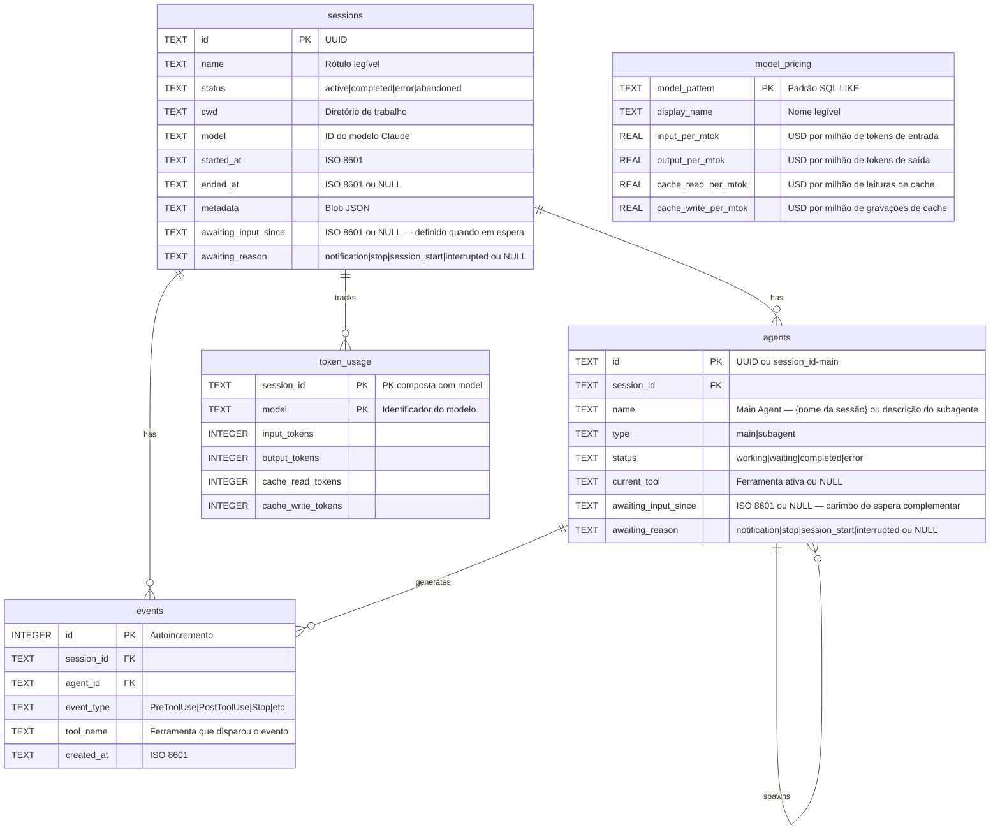
```mermaid
erDiagram
    sessions ||--o{ agents : has
    sessions ||--o{ events : has
    sessions ||--o{ token_usage : tracks
    agents ||--o{ events : generates
    agents ||--o{ agents : spawns

    sessions {
        TEXT id PK "UUID"
        TEXT name "Rótulo legível"
        TEXT status "active|completed|error|abandoned"
        TEXT cwd "Diretório de trabalho"
        TEXT model "ID do modelo Claude"
        TEXT started_at "ISO 8601"
        TEXT ended_at "ISO 8601 ou NULL"
        TEXT metadata "Blob JSON"
        TEXT awaiting_input_since "ISO 8601 ou NULL — definido quando em espera"
        TEXT awaiting_reason "notification|stop|session_start|interrupted ou NULL"
    }

    agents {
        TEXT id PK "UUID ou session_id-main"
        TEXT session_id FK
        TEXT name "Main Agent — {nome da sessão} ou descrição do subagente"
        TEXT type "main|subagent"
        TEXT status "working|waiting|completed|error"
        TEXT current_tool "Ferramenta ativa ou NULL"
        TEXT awaiting_input_since "ISO 8601 ou NULL — carimbo de espera complementar"
        TEXT awaiting_reason "notification|stop|session_start|interrupted ou NULL"
    }

    events {
        INTEGER id PK "Autoincremento"
        TEXT session_id FK
        TEXT agent_id FK
        TEXT event_type "PreToolUse|PostToolUse|Stop|etc"
        TEXT tool_name "Ferramenta que disparou o evento"
        TEXT created_at "ISO 8601"
    }

    token_usage {
        TEXT session_id PK "PK composta com model"
        TEXT model PK "Identificador do modelo"
        INTEGER input_tokens
        INTEGER output_tokens
        INTEGER cache_read_tokens
        INTEGER cache_write_tokens
    }

    model_pricing {
        TEXT model_pattern PK "Padrão SQL LIKE"
        TEXT display_name "Nome legível"
        REAL input_per_mtok "USD por milhão de tokens de entrada"
        REAL output_per_mtok "USD por milhão de tokens de saída"
        REAL cache_read_per_mtok "USD por milhão de leituras de cache"
        REAL cache_write_per_mtok "USD por milhão de gravações de cache"
    }
```

---

## Marketplace de plugins

O CCAM traz **14 plugins** a partir de uma única árvore de código compartilhada. O Claude Code lê `.claude-plugin/marketplace.json`; o Codex lê `.agents/plugins/marketplace.json` mais o `.codex-plugin/plugin.json` de cada plugin. O pacote contém **66 skills de plugins, 18 subagentes do Claude, 34 comandos do Claude, 3 utilitários de CLI, 3 configurações de hooks e 2 plugins com MCP**.

```bash
# Claude Code
claude plugin marketplace add hoangsonww/Claude-Code-Agent-Monitor
claude plugin install ccam-platform@claude-code-agent-monitor-plugins

# Codex
codex plugin marketplace add hoangsonww/Claude-Code-Agent-Monitor
codex plugin add ccam-platform@claude-code-agent-monitor-plugins

# Open Agent Skills / skills.sh-compatible CLI
npx skills add hoangsonww/Claude-Code-Agent-Monitor --list

# Install one skill for Claude Code and Codex in the current project
npx skills add hoangsonww/Claude-Code-Agent-Monitor \
  --skill mcp-server \
  --agent claude-code \
  --agent codex \
  --yes

# Verify, update, and remove the project-scoped skill
npx skills list --json
npx skills update --project --yes
npx skills remove mcp-server --yes

# Add --global to install at user scope, then manage that scope explicitly
npx skills add hoangsonww/Claude-Code-Agent-Monitor \
  --skill mcp-server \
  --agent claude-code \
  --agent codex \
  --global \
  --yes
npx skills list --global --json
npx skills update --global --yes
npx skills remove --global mcp-server --yes
```

A CLI `skills` descobre **77 skills no total no repositório**, incluindo as 66 skills de plugins e as skills de manutenção do repositório. Instalações de projeto usam `.agents/skills/` mais links específicos de cada agente. As skills globais do Claude Code ficam por padrão em `~/.claude/skills/`, ou em `$CLAUDE_CONFIG_DIR/skills/` quando definido. As skills globais do Codex ficam por padrão em `~/.codex/skills/`, ou em `$CODEX_HOME/skills/` quando definido. Instalações para vários agentes podem deduplicar os arquivos por um armazenamento compartilhado e vincular esses destinos. Toda skill de plugin tem frontmatter canônico `name`/`description` e metadados `agents/openai.yaml`. Não é preciso nenhum PR upstream para `vercel-labs/skills` para instalar. O repositório público no GitHub é a origem, e a visibilidade no skills.sh acompanha a publicação e a telemetria real de instalações.

Novos pacotes focados complementam os plugins existentes de análises, produtividade, qualidade, sessões, fluxos, configuração e painel:

- `ccam-runner`: início monitorado, continuação, parada e retomada do Claude Code/Codex, e histórico de execuções
- `ccam-integrations`: regras de alerta, webhooks, notificações push e coleta remota via SSH
- `ccam-platform`: explorador de configuração do Claude/Codex, importação ciente do provedor, restauração de backup, configuração de hooks, atualizações e operações do MCP
- `ccam-reports`: relatórios executivos, de custos, de confiabilidade e de fluxos prontos para apresentar

Valide e regenere os metadados de distribuição com:

```bash
npm run extensions:sync
npm run extensions:validate
```

Catálogo completo, comandos de instalação, comportamento do skills.sh, limites da submissão pública e verificações de instalação limpa: [docs/PLUGINS.md](docs/PLUGINS.md).

---

## Linha de status

Um utilitário independente de linha de status da CLI para o Claude Code que mostra o nome do modelo, o usuário, o diretório de trabalho, o branch git, uma barra de uso da janela de contexto, a contagem de tokens por direção e o custo da sessão — tudo com cores via sequências de escape ANSI.

```
nguyens6@host ~/agent-dashboard/client | Sonnet 4.6 | main | ████████░░ 79% | 3↑ 2↓ 156586c | $0.4231
```

| Segmento | Cor | Exemplo |
| ----------- | -------------------- | -------------------------------------------------------------- |
| Modelo | Ciano | `Sonnet 4.6` |
| Usuário | Verde | `nguyens6` |
| CWD | Amarelo | `~/agent-dashboard` |
| Branch git | Magenta | `main` |
| Barra de contexto | Verde / Amarelo / Vermelho | `████████░░ 79%` |
| Tokens | Verde / Ciano / Esmaecido | `3↑ 2↓ 156586c` (`↑` verde de entrada, `↓` ciano de saída, `c` esmaecido de cache) |
| Custo (USD) | Verde / Amarelo / Vermelho | `$0.4231` (total da sessão — mostrado nos planos de API e de assinatura) |

Faixas de cor do custo: verde abaixo de US$ 5, amarelo de US$ 5 a US$ 20, vermelho a partir de US$ 20.

Veja [`statusline/README.md`](statusline/README.md) para as instruções de instalação.

<p align="center">
  
</p>

---

## Arquitetura do servidor

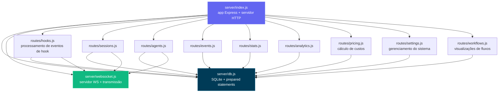
```mermaid
graph TD
    INDEX["server/index.js<br/>app Express + servidor HTTP"]
    DB["server/db.js<br/>SQLite + prepared statements"]
    WS["server/websocket.js<br/>servidor WS + transmissão"]
    HOOKS["routes/hooks.js<br/>processamento de eventos de hook"]
    SESSIONS["routes/sessions.js"]
    AGENTS["routes/agents.js"]
    EVENTS["routes/events.js"]
    STATS["routes/stats.js"]
    ANALYTICS["routes/analytics.js"]
    PRICING["routes/pricing.js<br/>cálculo de custos"]
    SETTINGS["routes/settings.js<br/>gerenciamento do sistema"]
    WORKFLOWS["routes/workflows.js<br/>visualizações de fluxos"]

    INDEX --> DB & WS
    INDEX --> HOOKS & SESSIONS & AGENTS & EVENTS & STATS & ANALYTICS & PRICING & SETTINGS & WORKFLOWS
    HOOKS --> DB & WS
    SESSIONS --> DB & WS
    AGENTS --> DB & WS
    EVENTS --> DB
    STATS --> DB
    ANALYTICS --> DB
    PRICING --> DB
    SETTINGS --> DB
    WORKFLOWS --> DB

    style INDEX fill:#6366f1,stroke:#818cf8,color:#fff
    style DB fill:#003B57,stroke:#005f8a,color:#fff
    style WS fill:#10b981,stroke:#34d399,color:#fff
```

---

## Roteamento do cliente

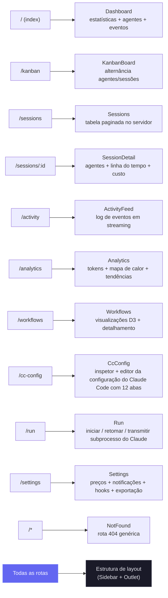
```mermaid
graph LR
    ROOT["/ (index)"] --> DASH["Dashboard<br/>estatísticas + agentes + eventos"]
    K["/kanban"] --> KANBAN["KanbanBoard<br/>alternância agentes/sessões"]
    S["/sessions"] --> SESS["Sessions<br/>tabela paginada no servidor"]
    D["/sessions/:id"] --> DETAIL["SessionDetail<br/>agentes + linha do tempo + custo"]
    A["/activity"] --> ACT["ActivityFeed<br/>log de eventos em streaming"]
    AN["/analytics"] --> ANALYTICS["Analytics<br/>tokens + mapa de calor + tendências"]
    WF["/workflows"] --> WORKFLOWS["Workflows<br/>visualizações D3 + detalhamento"]
    CC["/cc-config"] --> CCCONFIG["CcConfig<br/>inspetor + editor da configuração do Claude Code com 12 abas"]
    RUN["/run"] --> RUNPAGE["Run<br/>iniciar / retomar / transmitir subprocesso do Claude"]
    ST["/settings"] --> SETTINGS["Settings<br/>preços + notificações + hooks + exportação"]
    NF["/*"] --> NOTFOUND["NotFound<br/>rota 404 genérica"]

    ALL["Todas as rotas"] --> LAYOUT["Estrutura de layout<br/>(Sidebar + Outlet)"]

    style ALL fill:#6366f1,stroke:#818cf8,color:#fff
    style LAYOUT fill:#1a1a28,stroke:#2a2a3d,color:#e4e4ed
```

---

## Fluxo do manipulador de hooks

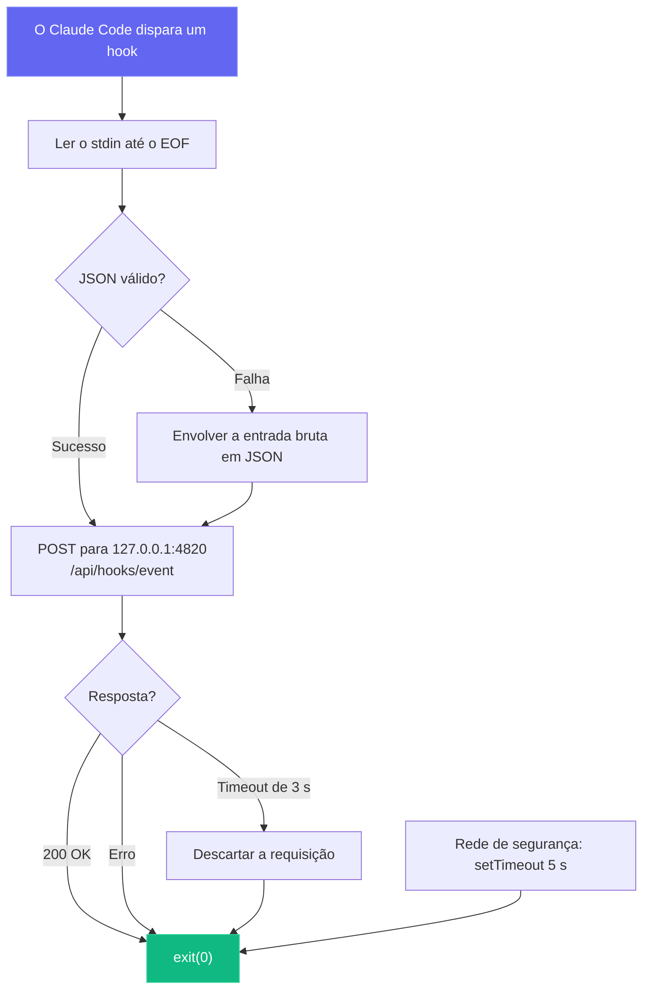
```mermaid
flowchart TD
    START["O Claude Code dispara um hook"] --> STDIN["Ler o stdin até o EOF"]
    STDIN --> PARSE{"JSON válido?"}
    PARSE -->|Sucesso| POST["POST para 127.0.0.1:4820<br/>/api/hooks/event"]
    PARSE -->|Falha| WRAP["Envolver a entrada bruta em JSON"]
    WRAP --> POST
    POST --> RESP{"Resposta?"}
    RESP -->|200 OK| EXIT0["exit(0)"]
    RESP -->|Erro| EXIT0
    RESP -->|Timeout de 3 s| DESTROY["Descartar a requisição"] --> EXIT0
    SAFETY["Rede de segurança: setTimeout 5 s"] --> EXIT0

    style EXIT0 fill:#10b981,stroke:#34d399,color:#fff
    style START fill:#6366f1,stroke:#818cf8,color:#fff
```

---

## Modos de implantação

Suportamos modos de implantação de desenvolvimento e de produção, com arquiteturas de processos diferentes:

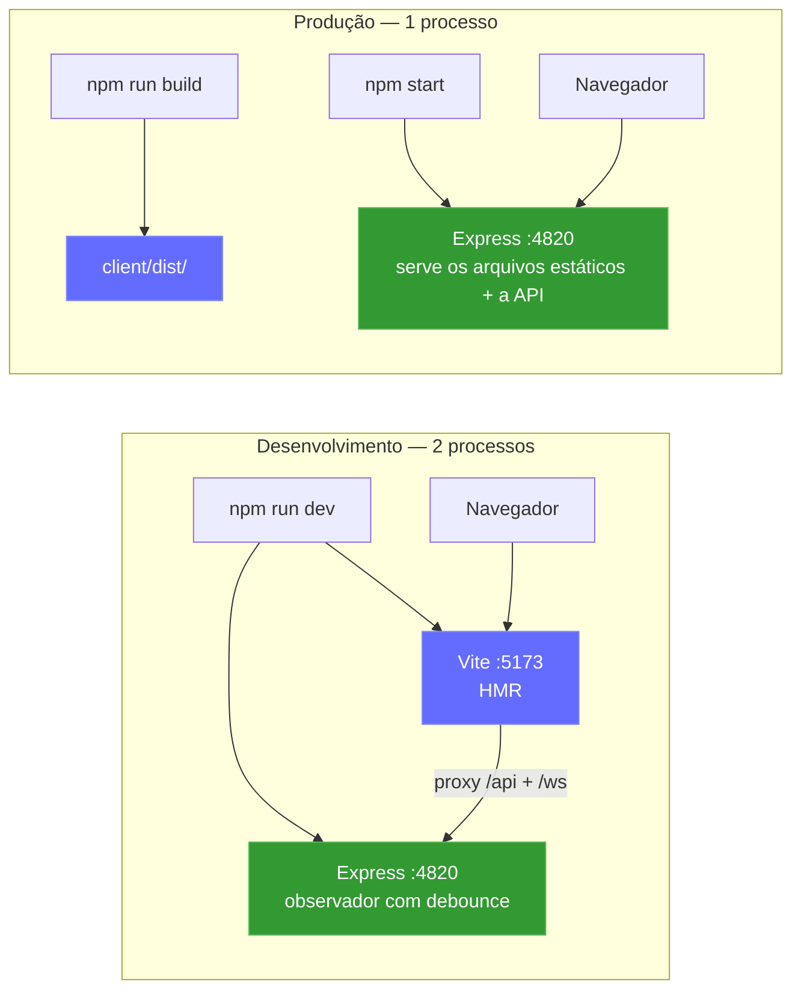
```mermaid
graph LR
    subgraph dev["Desenvolvimento — 2 processos"]
        D_CMD["npm run dev"] --> D_SRV["Express :4820<br/>observador com debounce"]
        D_CMD --> D_VITE["Vite :5173<br/>HMR"]
        D_BROWSER["Navegador"] --> D_VITE
        D_VITE -->|"proxy /api + /ws"| D_SRV
    end

    subgraph prod["Produção — 1 processo"]
        P_BUILD["npm run build"] --> P_DIST["client/dist/"]
        P_START["npm start"] --> P_SRV["Express :4820<br/>serve os arquivos estáticos + a API"]
        P_BROWSER["Navegador"] --> P_SRV
    end

    style D_VITE fill:#646CFF,stroke:#818cf8,color:#fff
    style D_SRV fill:#339933,stroke:#5cb85c,color:#fff
    style P_SRV fill:#339933,stroke:#5cb85c,color:#fff
    style P_DIST fill:#646CFF,stroke:#818cf8,color:#fff
```

Sidecar MCP local opcional (suporta os transportes stdio, HTTP+SSE e REPL):

```mermaid
graph LR
    subgraph "Opções de transporte do MCP"
        M_STDIO["Servidor MCP (stdio)<br/>npm run mcp:start"]
        M_HTTP["Servidor MCP (HTTP)<br/>npm run mcp:start:http<br/>:8819"]
        M_REPL["Servidor MCP (REPL)<br/>npm run mcp:start:repl"]
    end

    H["Host MCP"] -->|"stdin/stdout"| M_STDIO
    RC["Cliente remoto"] -->|"POST /mcp · GET /sse"| M_HTTP
    OP["Operador"] -->|"CLI interativa"| M_REPL

    M_STDIO --> D["Servidor do painel<br/>:4820"]
    M_HTTP --> D
    M_REPL --> D

    style M_STDIO fill:#0f766e,stroke:#14b8a6,color:#fff
    style M_HTTP fill:#0f766e,stroke:#14b8a6,color:#fff
    style M_REPL fill:#0f766e,stroke:#14b8a6,color:#fff
```

**App de desktop (macOS e Windows)** opcional — um único processo Electron que hospeda o servidor Express no mesmo processo (sem terminal, sem processo filho):

```mermaid
flowchart LR
    subgraph desktop["App de desktop (macOS e Windows) — 1 processo Electron"]
        E_MAIN["Processo principal do Electron<br/>(Node 22 / Electron 35)"]
        E_HOST["server-host.ts<br/>require() server/index.js"]
        E_SRV["Express embutido :4820<br/>API · SQLite · WebSocket"]
        E_WIN["BrowserWindow<br/>cliente React compilado"]
        E_TRAY["Ícone da barra de menus (tray)<br/>+ menu de aplicativo nativo"]
        E_MAIN --> E_HOST
        E_HOST -->|"require() no mesmo processo"| E_SRV
        E_MAIN --> E_TRAY
        E_SRV -->|"http + ws em 127.0.0.1"| E_WIN
    end

    E_HOOKS["Hooks do Claude Code"] -->|"POST /api/hooks/event"| E_SRV

    style E_MAIN fill:#47848F,stroke:#2f5a62,color:#fff
    style E_SRV fill:#339933,stroke:#5cb85c,color:#fff
    style E_WIN fill:#61DAFB,stroke:#3aa9c9,color:#000
```

### Implantação na nuvem

A pilha `deployments/` atende qualquer serviço Kubernetes compatível, incluindo EKS, GKE, AKS, OKE e clusters autogerenciados. O CCAM usa SQLite, então todo manifesto suportado impõe **um único escritor ativo do painel por volume persistente**, com rollout do tipo Recreate. HPA, réplicas ativo-ativo, blue-green e canary propositalmente não são suportados enquanto o SQLite for o backend de persistência.

```mermaid
flowchart LR
  CI["CI: testar · validar · varrer · atestar · assinar"] --> HELM["Helm / Kustomize / Terraform"]
  HELM --> APP["Painel do CCAM<br/>exatamente 1 réplica"]
  APP --> PVC[("PVC ReadWriteOnce retido")]
  EDGE["Ingress ou Gateway API<br/>TLS + WebSocket"] --> APP
  PROM["Prometheus Operator"] -->|"Bearer /api/metrics"| APP
  MCP["Sidecar MCP autenticado"] --> APP
```

- **Helm:** escritor único imposto pelo schema, suporte a digests, PVC retido, Ingress ou Gateway API, montagem de token compatível com External Secrets, NetworkPolicy, MCP e ServiceMonitor opcionais.
- **Kustomize:** base com PSS restrito, mais overlays de dev/staging/produção e componentes opcionais de MCP, monitoramento, Gateway API e snapshots CSI.
- **Terraform:** implanta o chart Helm validado em um cluster Kubernetes existente. A rede da nuvem, a identidade do cluster, o CSI, o TLS e a sincronização de segredos continuam por conta do provedor.
- **Operação:** backup online consistente do SQLite com SHA-256, restauração verificada com escala para zero, implantação/rollback/desmontagem sempre precedidos de backup e verificações de saúde autenticadas.
- **Cadeia de suprimentos da CI:** as imagens do app e do MCP são varridas, publicadas para amd64/arm64 com SBOM e procedência SLSA e assinadas sem chave com o Cosign.

```bash
npm run deploy:validate
REGISTRY="ghcr.io/$(gh repo view --json owner -q .owner.login)"
IMAGE_TAG="$(git rev-parse --short HEAD)"

helm upgrade --install agent-monitor deployments/helm/agent-monitor \
  --namespace agent-monitor-production --create-namespace \
  --values deployments/helm/agent-monitor/values-production.yaml \
  --set image.registry= \
  --set image.repository=${REGISTRY}/claude-code-agent-monitor \
  --set image.tag=${IMAGE_TAG} \
  --atomic --wait --timeout 10m
```

> [!NOTE]
> A configuração completa de produção, segredos, pilha Docker/Podman, Gateway API, Terraform, backup, restauração e rollback estão documentados em [DEPLOYMENT.md](DEPLOYMENT.md) e [deployments/README.md](deployments/README.md).

---

## Estrutura do projeto

```
agent-dashboard/
|-- CLAUDE.md                   # Claude Code project memory and working agreements
|-- AGENTS.md                   # Codex project instructions
|-- package.json                # Root scripts (dashboard + MCP helpers) + server dependencies
|-- .claude/
|   +-- rules/                  # Path-scoped Claude rules
|   +-- skills/                 # Claude reusable project skills
|   +-- agents/                 # Claude custom subagents
|-- .claude-plugin/
|   +-- marketplace.json        # Claude Code marketplace manifest (14 plugins)
|-- .agents/plugins/
|   +-- marketplace.json        # Codex marketplace manifest (same 14 plugins)
|-- plugins/
|   |-- ccam-analytics/         # Analytics: session reports, cost breakdown, usage trends, productivity score
|   |   |-- .claude-plugin/plugin.json
|   |   |-- skills/ (4)         # session-report, cost-breakdown, usage-trends, productivity-score
|   |   |-- agents/             # analytics-advisor (Sonnet model)
|   |   |-- hooks/hooks.json    # Stop + SubagentStop event logging
|   |   +-- bin/ccam-stats      # Terminal dashboard CLI
|   |-- ccam-productivity/      # Productivity: standups, reports, sprints, workflow optimizer
|   |-- ccam-devtools/          # DevTools: debug, diagnostics, export, health checks
|   |   +-- bin/                # ccam-doctor + ccam-export CLIs
|   |-- ccam-insights/          # Insights: patterns, anomalies, optimization, comparison
|   |-- ccam-cost-guard/        # Cost guardrails: budgets, spend forecast, cost alerts, model savings
|   |-- ccam-sessions/          # Session forensics: search, timeline, transcript replay, cwd rollup, cleanup
|   |-- ccam-workflows/         # Workflow orchestration: DAG map, delegation audit, concurrency, fleet runs
|   |-- ccam-quality/           # Reliability & SLOs: error scan, API-error report, hook-failure audit, SLO check
|   |-- ccam-config/            # Config & memory governance: config audit, memory review, skill/MCP/hook inventory
|   +-- ccam-dashboard/         # Dashboard connector: status, quick stats, MCP integration
|       +-- .mcp.json           # MCP server configuration
|-- server/
|   |-- index.js                 # Express app, HTTP server, static serving
|   |-- db.js                    # SQLite schema, migrations, prepared statements
|   |-- websocket.js             # WebSocket server with heartbeat
|   +-- routes/
|       |-- hooks.js             # Hook event processing (transactional)
|       |-- sessions.js          # Session CRUD
|       |-- agents.js            # Agent CRUD
|       |-- events.js            # Event listing
|       |-- stats.js             # Aggregate statistics
|       |-- analytics.js         # Token, tool, and trend analytics
|       |-- workflows.js         # Aggregate workflow data and per-session drill-in
|       |-- pricing.js           # Model pricing CRUD and cost calculation
|       +-- settings.js          # System info, data management, export, cleanup
|   +-- lib/
|       +-- transcript-cache.js  # Stat-based JSONL transcript cache with chunked sync byte-stream reader (4 MiB chunks, line-by-line UTF-8 decode) so files larger than V8's max string length (~512 MiB) parse without aborting Node with "FATAL ERROR: v8::ToLocalChecked Empty MaybeLocal". Extracts tokens, compactions, API errors, turn durations, thinking blocks, and usage extras (service_tier, speed, inference_geo)
|   +-- compat-sqlite.js         # node:sqlite compatibility wrapper (fallback for better-sqlite3)
|-- client/
|   |-- package.json             # Client dependencies
|   |-- index.html               # HTML entry point
|   |-- vite.config.ts           # Vite + proxy config
|   |-- tailwind.config.js       # Custom dark theme
|   |-- tsconfig.json            # Strict TypeScript
|   +-- src/
|       |-- main.tsx             # React entry
|       |-- App.tsx              # Router + WebSocket provider
|       |-- index.css            # Tailwind + custom utilities
|       |-- lib/
|       |   |-- types.ts         # Shared TypeScript interfaces
|       |   |-- api.ts           # Typed fetch client
|       |   |-- format.ts        # Date/time formatting utilities
|       |   +-- eventBus.ts      # Pub/sub for WebSocket distribution
|       |-- hooks/
|       |   |-- useWebSocket.ts      # Auto-reconnecting WebSocket hook
|       |   +-- useNotifications.ts  # Browser notification triggers from WebSocket events
|       |-- components/
|       |   |-- Layout.tsx       # Shell with sidebar + outlet
|       |   |-- Sidebar.tsx      # Navigation + connection indicator
|       |   |-- AgentCard.tsx    # Agent info card with status
|       |   |-- StatCard.tsx     # Metric card
|       |   |-- StatusBadge.tsx  # Color-coded status pills
|       |   |-- EmptyState.tsx   # Placeholder for empty lists
|       |   +-- workflows/       # D3.js workflow visualization components
|       |       |-- OrchestrationDAG.tsx            # Horizontal DAG of agent spawning patterns
|       |       |-- ToolExecutionFlow.tsx           # d3-sankey diagram of tool-to-tool transitions
|       |       |-- AgentCollaborationNetwork.tsx   # Force-directed agent pipeline graph
|       |       |-- SubagentEffectiveness.tsx       # Scorecard grid with SVG success rings
|       |       |-- WorkflowPatterns.tsx            # Auto-detected orchestration sequences
|       |       |-- ModelDelegationFlow.tsx         # Model routing through agent hierarchies
|       |       |-- ErrorPropagationMap.tsx         # Error clustering by hierarchy depth
|       |       |-- ConcurrencyTimeline.tsx         # Swim-lane parallel agent execution
|       |       |-- SessionComplexityScatter.tsx    # D3 bubble chart (duration vs agents vs tokens)
|       |       |-- CompactionImpact.tsx            # Token compression events and recovery
|       |       |-- WorkflowStats.tsx               # Aggregate workflow statistics
|       |       +-- SessionDrillIn.tsx              # Per-session agent tree, tool timeline, events
|       +-- pages/
|           |-- Dashboard.tsx      # Overview page
|           |-- KanbanBoard.tsx    # Agents/Sessions toggle, status columns
|           |-- Sessions.tsx       # Server-paginated sessions table
|           |-- SessionDetail.tsx  # Single session deep dive
|           |-- ActivityFeed.tsx   # Real-time event stream
|           |-- Analytics.tsx      # Token usage, heatmap, trends
|           |-- Workflows.tsx      # D3.js workflow visualizations and session drill-in
|           |-- Settings.tsx       # Model pricing, notifications, hooks, export, cleanup
|           +-- NotFound.tsx       # 404 catch-all page
|-- scripts/
|   |-- hook-handler.js          # Lightweight stdin-to-HTTP forwarder
|   |-- install-hooks.js         # Auto-configures ~/.claude/settings.json
|   |-- import-history.js        # Imports sessions from ~/.claude/ with enhanced JSONL extraction (API errors, turn durations, entrypoint, permission modes, thinking blocks, usage extras, tool errors, subagent JSONL files). Re-import is fully incremental: a per-event-type high-water mark (`MAX(created_at) GROUP BY event_type` per session) is computed up-front and only JSONL entries with `ts > cutoff[type]` are inserted, so long-running sessions whose transcripts grow across multiple days continue to receive Stop / PostToolUse / TurnDuration / ToolError events on every re-run. Also rolls `sessions.ended_at` forward when the JSONL advances past the stored value and refreshes message-count metadata on every pass
|   +-- seed.js                  # Sample data generator
|-- mcp/
|   |-- package.json             # MCP package scripts + dependencies
|   |-- README.md                # MCP setup, host config, tool catalog, safety model
|   |-- src/
|   |   |-- index.ts             # MCP runtime entrypoint (transport router)
|   |   |-- server.ts            # MCP server assembly
|   |   |-- clients/             # Dashboard API client with retry/backoff
|   |   |-- config/              # Environment/CLI config parsing
|   |   |-- core/                # Logger, tool registry, result helpers
|   |   |-- policy/              # Mutation/destructive guards
|   |   |-- tools/               # 16 domain modules registering 97 tools
|   |   |-- transports/          # HTTP+SSE server, REPL, tool collector
|   |   |-- ui/                  # ANSI banner, colors, formatter, tables
|   |   +-- types/               # Shared MCP type definitions
|   +-- build/                   # Built MCP runtime output
|-- desktop/
|   |-- package.json             # Electron + electron-builder dependencies and scripts
|   |-- electron-builder.yml     # DMG packaging config; signing/notarization hooks
|   |-- tsconfig.json            # Strict TypeScript (src/ -> out/)
|   |-- README.md                # Desktop app architecture reference (contributor docs)
|   |-- assets/                  # icon.svg + generated icon.icns + tray PNGs
|   |-- src/
|   |   |-- main.ts              # Electron main process entry — lifecycle, wiring
|   |   |-- server-host.ts       # In-process Express boot, port discovery, adoption, DB close
|   |   |-- window.ts            # BrowserWindow + persisted window geometry
|   |   |-- tray.ts              # Menu-bar (tray) icon + context menu
|   |   |-- menu.ts              # Native application menu (File ▸ Open Dashboard is macOS-only)
|   |   |-- login-item.ts        # macOS Login Items auto-start toggle (SMAppService)
|   |   |-- logger.ts            # File logger -> ~/Library/Logs/Claude Code Monitor/desktop.log
|   |   |-- constants.ts         # App name, ports, timeouts, window size
|   |   +-- preload.ts           # Intentionally empty (zero renderer privilege)
|   |-- scripts/
|   |   |-- install.js           # Preflights native deps for desktop:install; prints setup help + exits non-zero on failure
|   |   |-- preflight.js         # Shared better-sqlite3 binary check + actionable per-OS setup help (incl. no-toolchain alternative)
|   |   |-- prebuild.js          # Ensures root + client are built before tsc; fails fast with setup help if native binary missing
|   |   |-- build-icons.sh       # SVG -> PNG/ICNS via qlmanage/sips/iconutil
|   |   +-- notarize.js          # electron-builder afterSign hook (opt-in notarization)
|   +-- tests/
|       +-- smoke.test.mjs       # Spawn Electron + probe /api/health
|-- deployments/
|   |-- README.md                # Production deployment reference
|   |-- nginx/                   # Rootless Nginx edge and opt-in hook/MCP policies
|   |-- secrets/                 # Ignored Compose token/password files
|   |-- terraform/               # Helm deployment to an existing Kubernetes cluster
|   |-- kubernetes/              # One-writer Kustomize base + environment overlays
|   |   |-- base/                # Restricted PSS, Recreate Deployment, PVC, Service, Ingress
|   |   |-- overlays/            # Dev, staging, production namespaces and resources
|   |   +-- components/          # MCP, ServiceMonitor, Gateway API, VolumeSnapshot
|   |-- helm/agent-monitor/      # Schema-enforced Helm chart and environment values
|   +-- scripts/                 # Validate, deploy, backup, restore, rollback, health, teardown
|-- .codex/
|   |-- config.toml              # Codex runtime configuration
|   |-- README.md                # Codex setup guide for agents and skills
|   |-- rules/                   # Codex execution policy rules
|   |-- agents/                  # Codex custom agent templates
|   +-- skills/                  # Codex project skills
|-- statusline/
|   |-- README.md                # Statusline installation & usage guide
|   |-- statusline.py            # Python script that renders the statusline
|   +-- statusline-command.sh    # Shell wrapper for Claude Code's statusLine config
+-- data/
    +-- dashboard.db             # SQLite database (gitignored)
```

---

## Solução de problemas

| Problema | Solução |
| --------------------------------- | ---------------------------------------------------------------------------------------------------------------------------------------------------------------- |
| A instalação do `better-sqlite3` falha | Não é fatal — o servidor recorre automaticamente ao módulo nativo do Node.js `node:sqlite` (Node 22+). Em versões mais antigas do Node, instale o Python 3 e as ferramentas de compilação C++ e depois rode `npm rebuild better-sqlite3` |
| Os hooks não disparam | Rode `npm run install-hooks` e reinicie o Claude Code. Verifique se os hooks estão em `~/.claude/settings.json` |
| O painel não mostra dados | Garanta que o servidor esteja rodando (`npm run dev`) antes de iniciar uma sessão do Claude Code. Confira `http://localhost:4820/api/health` |
| WebSocket desconectado | O cliente reconecta automaticamente a cada 2 segundos. Verifique se a porta 4820 não está bloqueada por um firewall |
| Dados antigos após reiniciar | O banco persiste entre reinicializações. Rode `npm run seed` para ter dados de demonstração novos ou exclua `data/dashboard.db` para redefinir tudo |
| As ferramentas MCP não conectam | Confirme se a API do painel está no ar em `MCP_DASHBOARD_BASE_URL` e recompile/inicie o MCP (`npm run mcp:build`, `npm run mcp:start`) |

---

## Como contribuir

Contribuições são bem-vindas — veja [`.github/CONTRIBUTING.md`](.github/CONTRIBUTING.md) para o guia completo.

Todas as pessoas que contribuem precisam assinar o [Contributor License Agreement](https://github.com/hoangsonww/Claude-Code-Agent-Monitor/blob/master/CLA.md). Isso é aplicado automaticamente em todo pull request pela GitHub Action `🖋️ CLA Assistant`: na primeira vez que você abre um PR, um bot pede que você assine comentando `I have read the CLA Document and I hereby sign the CLA`. A verificação de status **CLA Assistant** do PR fica vermelha até você fazer isso, e assinar uma vez cobre todas as contribuições futuras.

---

## Licença

MIT. Veja [LICENSE](LICENSE) para os detalhes.
