# Bảng điều khiển Agent cho Claude Code, Cursor & Codex

### Nền tảng giám sát thời gian thực cho hoạt động Agent Claude Code, Cursor & Codex 🚀

Bảng điều khiển chuyên nghiệp để theo dõi Claude Code, Cursor và Codex: phiên, công cụ, lịch sử hội thoại, chi phí và điều phối agent phụ theo thời gian thực. Hệ thống kết hợp hook gốc với phát hiện transcript cục bộ theo nhà cung cấp.


**Hỗ trợ ngôn ngữ**: Tiếng Anh (`en`) · 中文 (`zh`) · Tiếng Việt (`vi`) · Tiếng Hàn (`ko`) · Tiếng Tây Ban Nha (`es`)

Tài liệu đã bản địa hóa: [`README.md`](./README.md) · [`README-CN.md`](./README-CN.md) · [`README-VN.md`](./README-VN.md) · [`README-KO.md`](./README-KO.md) · [`README-ES.md`](./README-ES.md)

> [!NOTE]
> Bạn cần hướng dẫn theo tác vụ? [GitHub Wiki](https://github.com/hoangsonww/Claude-Code-Agent-Monitor/wiki) là sổ tay thực hành về sử dụng hằng ngày, vận hành theo nhóm, khắc phục sự cố, tự động hóa CLI/MCP và các quy trình triển khai. [Wiki tĩnh đã bản địa hóa](https://hoangsonww.github.io/Claude-Code-Agent-Monitor/wiki/) vẫn là phần giới thiệu sản phẩm và kiến trúc bằng tiếng Anh, Việt, Trung, Hàn và Tây Ban Nha; các hợp đồng kỹ thuật chính xác vẫn nằm trong [`docs/`](./docs/README.md).

---

## Mục lục

- [Tổng quan](#tổng-quan)
- [Quốc tế hóa (i18n)](#quốc-tế-hóa-i18n)
- [Tính năng](#tính-năng)
- [Bắt đầu nhanh](#bắt-đầu-nhanh)
- [Nó hoạt động như thế nào](#nó-hoạt-động-như-thế-nào)
- [Cấu hình](#cấu-hình)
- [Tập lệnh npm](#tập-lệnh-npm)
- [Thị trường plugin](#thị-trường-plugin)
- [Tiện ích mở rộng Agent](#tiện-ích-mở-rộng-agent)
- [Tích hợp MCP](#tích-hợp-mcp)
- [Tham chiếu API](#tham-chiếu-api)
- [Sự kiện hook](#sự-kiện-móc-nối)
- [Thông báo trình duyệt](#thông-báo-trình-duyệt)
- [Thông báo cập nhật](#thông-báo-cập-nhật)
- [Tabby, mèo đồng hành nổi](#tabby-mèo-đồng-hành-nổi)
- [Tín hiệu âm thanh](#tín-hiệu-âm-thanh)
- [Hộp thoại trạng thái kết nối](#hộp-thoại-trạng-thái-kết-nối)
- [Tiện ích mở rộng VS Code](#tiện-ích-mở-rộng-vs-code)
- [Ứng dụng máy tính để bàn (macOS & Windows)](#ứng-dụng-máy-tính-để-bàn-macos--windows)
- [Lưu trữ dữ liệu](#lưu-trữ-dữ-liệu)
- [Dòng trạng thái](#dòng-trạng-thái)
- [Kiến trúc máy chủ](#kiến-trúc-máy-chủ)
- [Định tuyến client](#định-tuyến-khách-hàng)
- [Luồng trình xử lý hook](#luồng-xử-lý-móc)
- [Chế độ triển khai](#chế-độ-triển-khai)
- [Cấu trúc dự án](#cấu-trúc-dự-án)
- [Khắc phục sự cố](#khắc-phục-sự-cố)
- [Đóng góp](#đóng-góp)
- [Giấy phép](#giấy-phép)

---

## Tổng quan

Theo dõi phiên, giám sát agent theo thời gian thực, trực quan hóa việc sử dụng công cụ, phát lại hội thoại và quan sát điều phối agent phụ qua giao diện web tối chuyên nghiệp. Claude Code và Codex dùng hook gốc; Cursor được hỗ trợ sẵn qua các sự kiện thời gian thực tương thích và khả năng khám phá transcript gốc trong `~/.cursor`.

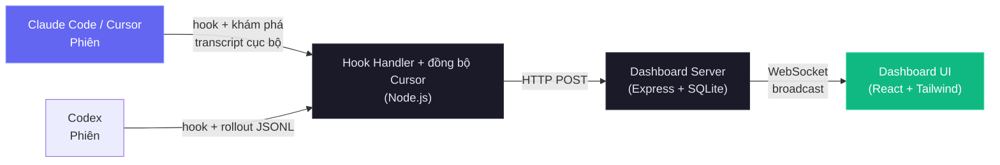
```mermaid
graph LR
    A["Claude Code / Cursor<br/>Phiên"] -->|hook + khám phá<br/>transcript cục bộ| B["Hook Handler + đồng bộ Cursor<br/>(Node.js)"]
    X["Codex<br/>Phiên"] -->|hook + rollout JSONL| B
    B -->|HTTP POST| C["Dashboard Server<br/>(Express + SQLite)"]
    C -->|WebSocket<br/>broadcast| D["Dashboard UI<br/>(React + Tailwind)"]
    style A fill:#6366f1,stroke:#818cf8,color:#fff
    style B fill:#1a1a28,stroke:#2a2a3d,color:#e4e4ed
    style C fill:#1a1a28,stroke:#2a2a3d,color:#e4e4ed
    style D fill:#10b981,stroke:#34d399,color:#fff
```

Ngoài bảng thông tin giám sát thời gian thực, nó còn bao gồm triển khai máy chủ MCP cục bộ trong `mcp/` hiển thị danh mục các công cụ để xem xét nội tâm và quản lý bảng thông tin, giúp dễ dàng tích hợp trực tiếp các hoạt động của bảng thông tin vào quy trình làm việc của Claude Code & Codex của bạn. Ngoài ra còn có một lớp mở rộng tác nhân, cung cấp các plugin, kỹ năng và tác nhân phụ của Claude Code & Codex để tương tác trên trang tổng quan, phân tích và thông tin về quy trình làm việc.

### Quốc tế hóa (i18n)

Giao diện người dùng đi kèm với tính năng chuyển đổi ngôn ngữ tích hợp cho tiếng Anh (`en`), tiếng Trung (`zh`), tiếng Việt (`vi`), tiếng Hàn (`ko`) và tiếng Tây Ban Nha (`es`). Bộ chọn ngôn ngữ là một menu thả xuống tùy chỉnh để không chiếm chỗ khi thêm ngôn ngữ mới. Tài nguyên ngôn ngữ được tải theo không gian tên và được lưu giữ trong bộ nhớ của trình duyệt để mang lại ưu tiên người dùng ổn định trong các lần làm mới.

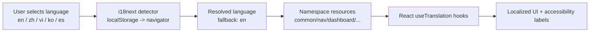
```mermaid
flowchart LR
    A["User selects language<br/>en / zh / vi / ko / es"] --> B["i18next detector<br/>localStorage -> navigator"]
    B --> C["Resolved language<br/>fallback: en"]
    C --> D["Namespace resources<br/>common/nav/dashboard/..."]
    D --> E["React useTranslation hooks"]
    E --> F["Localized UI + accessibility labels"]
```

Để biết kiến ​​trúc đầy đủ và hướng dẫn vận hành, hãy xem [tài liệu/I18N.md](./docs/I18N.md).

### Giao diện người dùng

Giao diện tối thích ứng bao quát toàn bộ quy trình. Mỗi bản xem trước dùng thumbnail thân thiện với thiết bị di động và liên kết tới ảnh gốc rõ nét.

<p align="center">
  <a href="images/dashboard.png">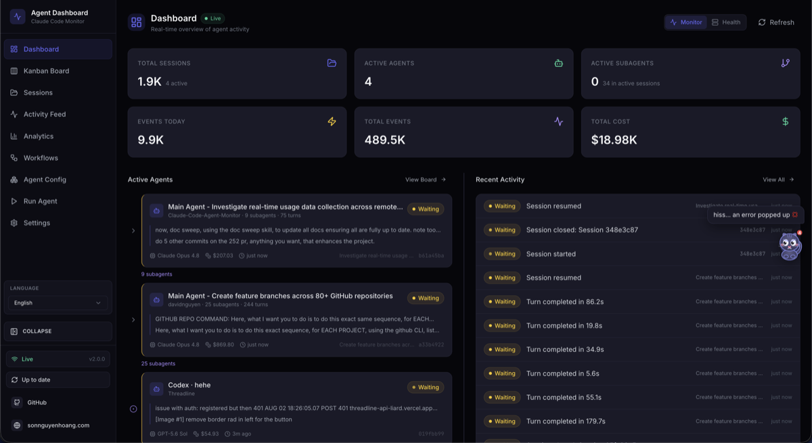</a>
  <br>
  <em>📡 <strong>Dashboard</strong> · tổng số Agent, Agent đang hoạt động, hoạt động gần đây và tín hiệu sức khỏe trực tiếp</em>
</p>

<p align="center">
  <a href="images/tasks-overview.png">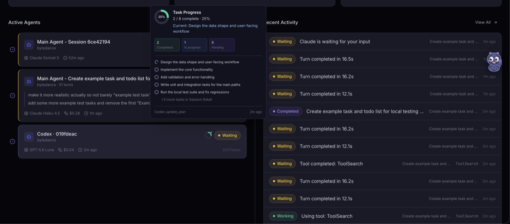</a>
  <br>
  <em>📋 <strong>Tiến độ công việc</strong> · mức hoàn tất gọn và bản xem trước công việc theo chủ sở hữu</em>
</p>

<p align="center">
  <a href="images/dashboard-health.png">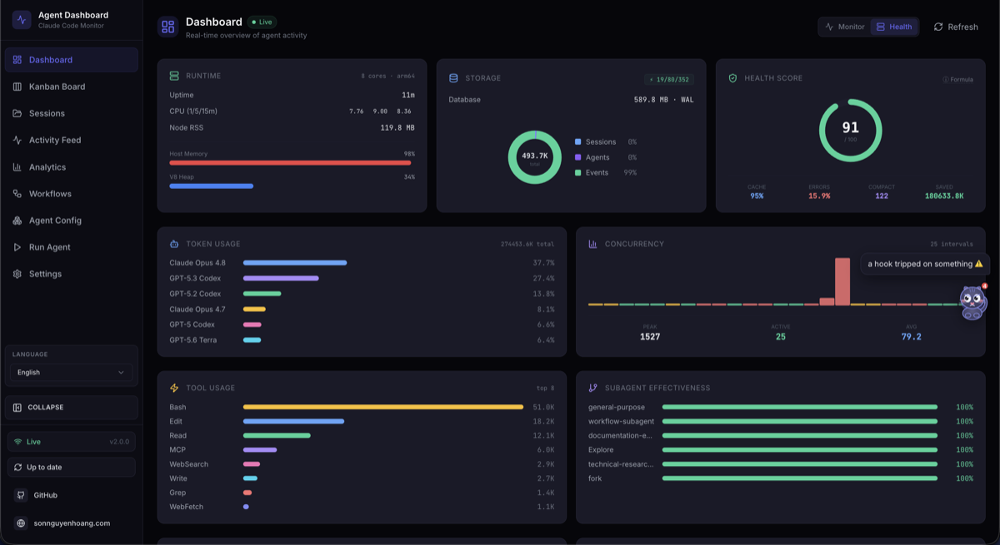</a>
  <br>
  <em>🩺 <strong>Sức khỏe hệ thống</strong> · lưu trữ, cache, lỗi, công cụ, model, Subagent và compaction</em>
</p>

<p align="center">
  <a href="images/board.png">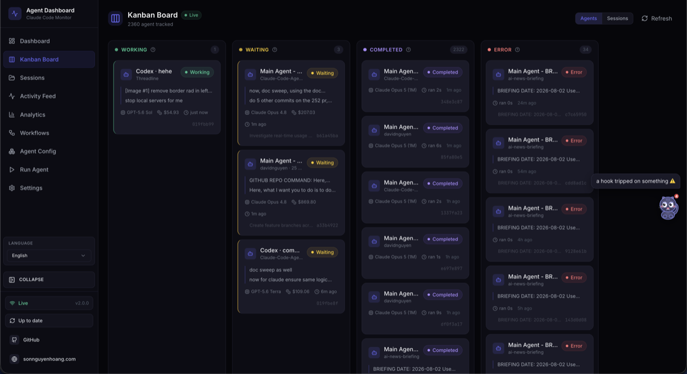</a>
  <br>
  <em>📋 <strong>Bảng Kanban · Agent</strong> · Agent đang làm việc, đang chờ, hoàn tất và lỗi, kèm lý do chờ rõ ràng</em>
</p>

<p align="center">
  <a href="images/board-sessions.png">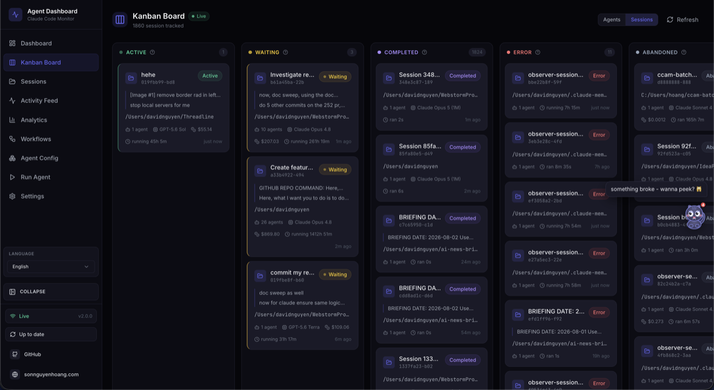</a>
  <br>
  <em>🗂️ <strong>Bảng Kanban · Phiên</strong> · phiên đang hoạt động, đang chờ, hoàn tất, lỗi và bị bỏ dở</em>
</p>

<p align="center">
  <a href="images/sessions.png">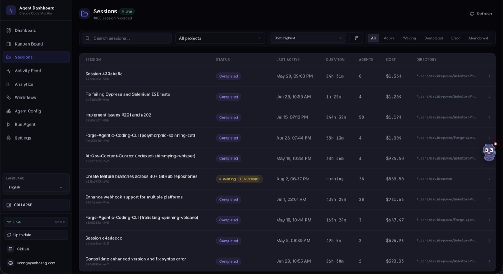</a>
  <br>
  <em>📂 <strong>Phiên</strong> · lịch sử có tìm kiếm, bộ lọc và phân trang phía máy chủ, kèm chi phí và hoạt động</em>
</p>

<p align="center">
  <a href="images/session-agents.png">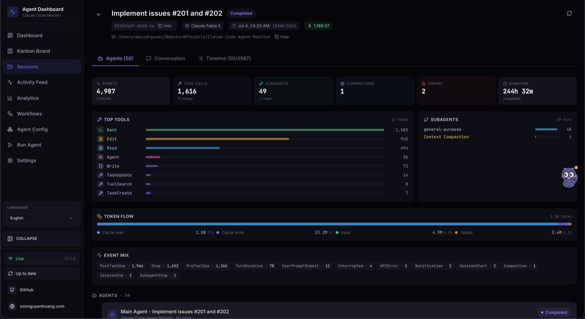</a>
  <br>
  <em>🤖 <strong>Agent trong phiên</strong> · tổng số trực tiếp, mức dùng công cụ, luồng token và hệ thống phân cấp Agent</em>
</p>

<p align="center">
  <a href="images/tasks-details.png">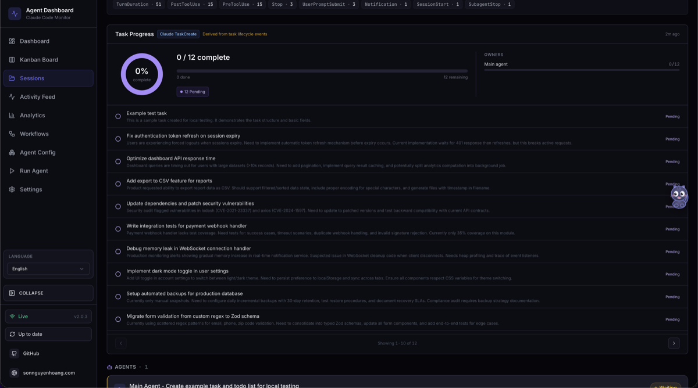</a>
  <br>
  <em>✅ <strong>Chi tiết công việc</strong> · các đoạn hoàn tất, công việc hiện tại, chủ sở hữu và tác vụ được phân trang</em>
</p>

<p align="center">
  <a href="images/session-conversation.png">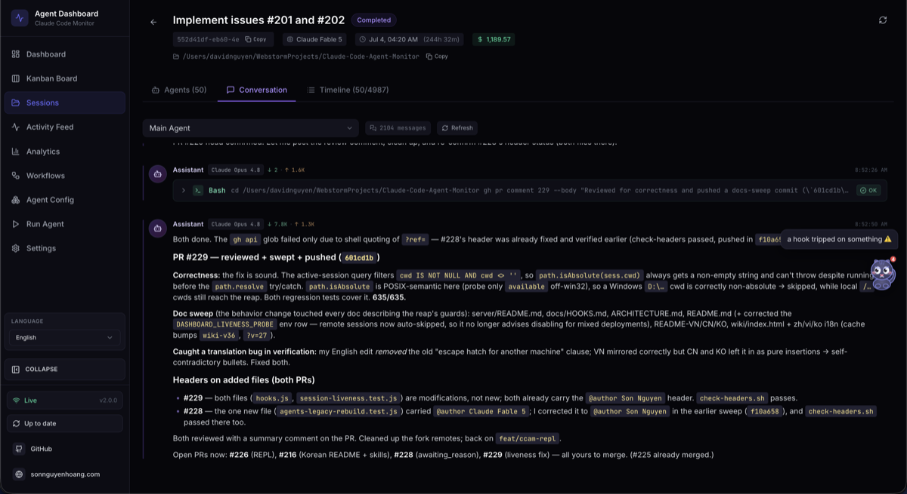</a>
  <br>
  <em>💬 <strong>Hội thoại</strong> · transcript đã kết xuất, mã, lời gọi công cụ, đầu ra lệnh và dấu mốc phiên</em>
</p>

<p align="center">
  <a href="images/session-timeline.png">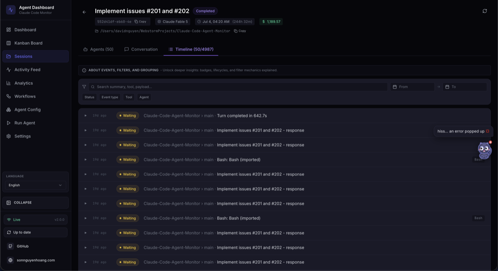</a>
  <br>
  <em>🔬 <strong>Dòng thời gian</strong> · sự kiện theo thời gian, bộ lọc đa chiều và hoạt động công cụ được ghép cặp</em>
</p>

<p align="center">
  <a href="images/feed.png">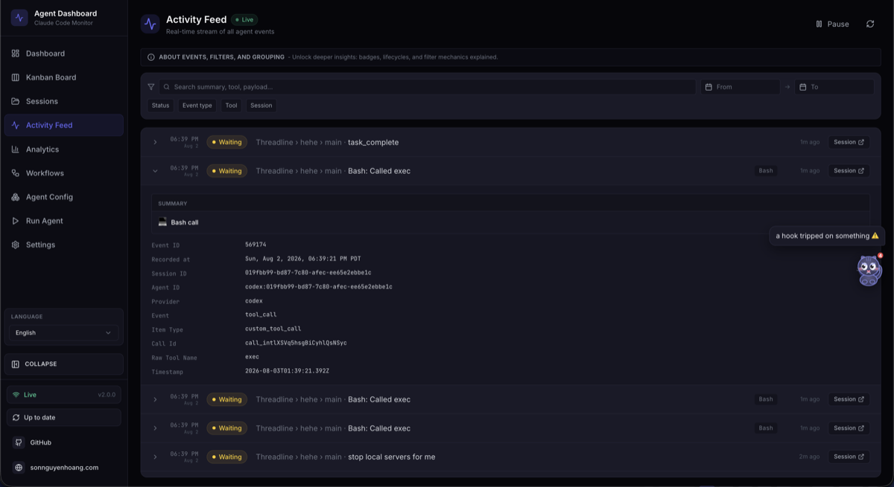</a>
  <br>
  <em>📰 <strong>Luồng hoạt động</strong> · sự kiện trực tiếp có thể tạm dừng, nhóm, lọc và chuyển tới phiên</em>
</p>

<p align="center">
  <a href="images/analytics.png">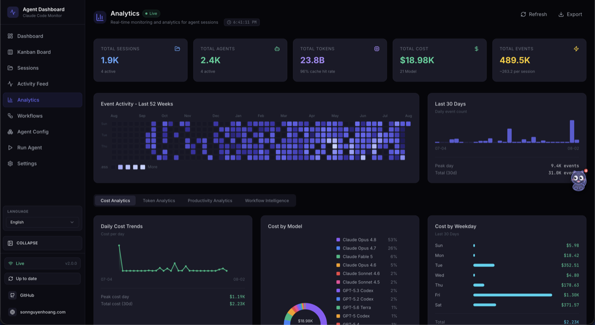</a>
  <br>
  <em>📊 <strong>Phân tích</strong> · token theo model, tần suất công cụ, heatmap hoạt động và xu hướng phiên</em>
</p>

<p align="center">
  <a href="images/workflows.png">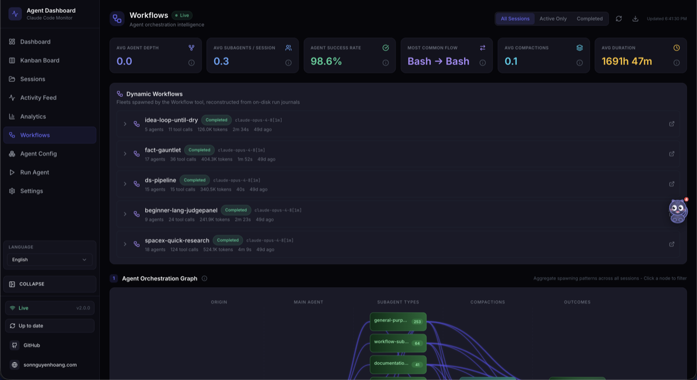</a>
  <br>
  <em>🔀 <strong>Quy trình</strong> · đồ thị điều phối, luồng công cụ, cộng tác, ủy quyền và mẫu</em>
</p>

<p align="center">
  <a href="images/dynamicworkflows-workflows.png">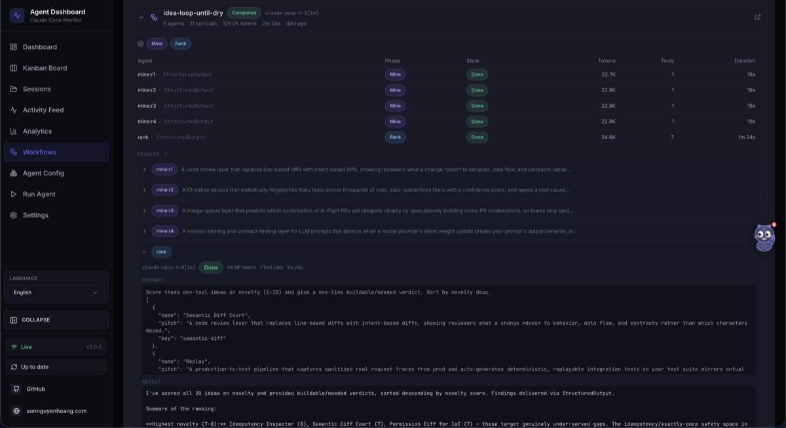</a>
  <br>
  <em>🧬 <strong>Lần chạy quy trình</strong> · trạng thái dựa trên journal, Agent, token, công cụ và thời lượng</em>
</p>

<p align="center">
  <a href="images/dynamicworkflows-workflows2.png">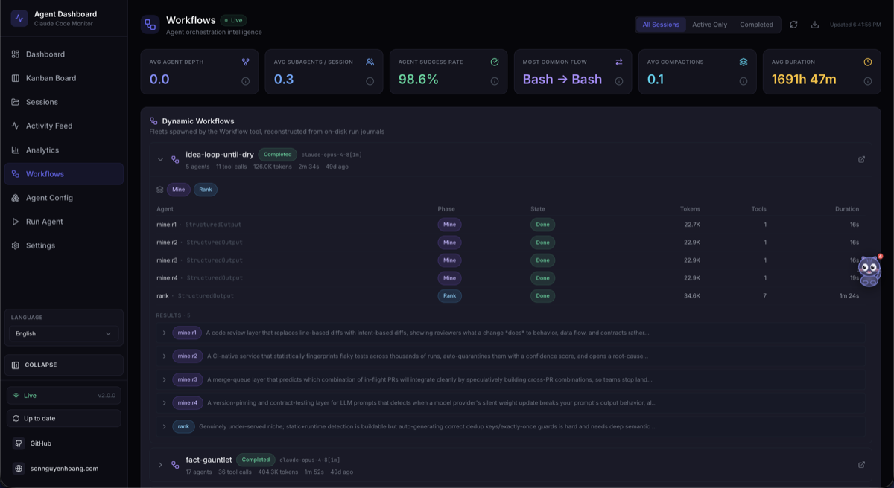</a>
  <br>
  <em>🧬 <strong>Lần chạy mở rộng</strong> · bộ lọc giai đoạn, chỉ số theo Agent, lời nhắc và kết quả đầy đủ</em>
</p>

<p align="center">
  <a href="images/dynamicworkflows-session.png">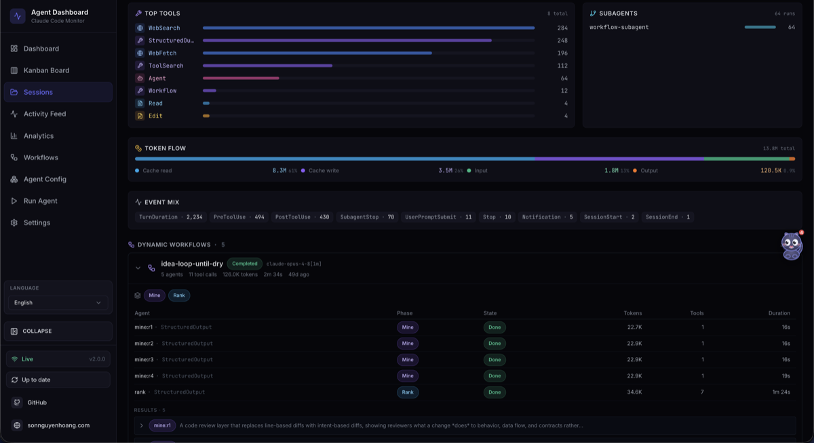</a>
  <br>
  <em>🧬 <strong>Quy trình của phiên</strong> · lần chạy động được liên kết và chi phí token được gộp vào</em>
</p>

<p align="center">
  <a href="images/config.png">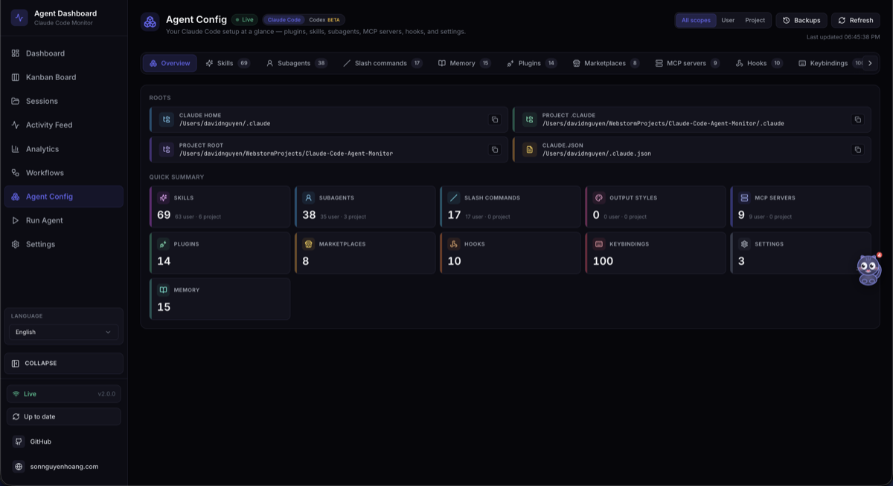</a>
  <br>
  <em>🧰 <strong>Cấu hình Agent</strong> · kiểm tra và chỉnh sửa an toàn cấu hình Claude Code và Codex được hỗ trợ</em>
</p>

<p align="center">
  <a href="images/config-codex.png">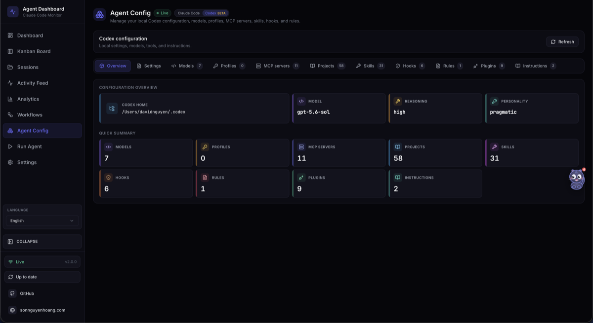</a>
  <br>
  <em>🧰 <strong>Cấu hình Codex</strong> · model, profile, MCP, dự án, skill, hook, quy tắc, plugin và chỉ dẫn</em>
</p>

<p align="center">
  <a href="images/config-skills.png">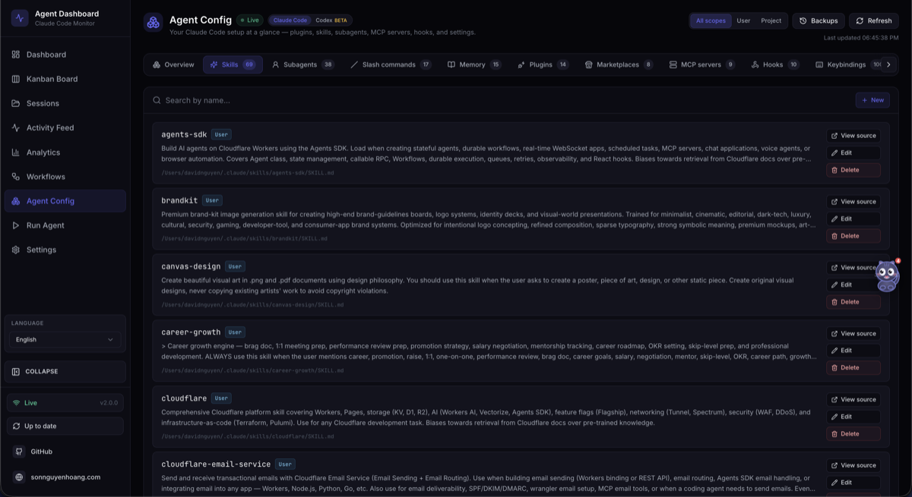</a>
  <br>
  <em>🧩 <strong>Skill</strong> · skill user, dự án và plugin có tìm kiếm cùng chỉnh sửa có sao lưu</em>
</p>

<p align="center">
  <a href="images/run.png">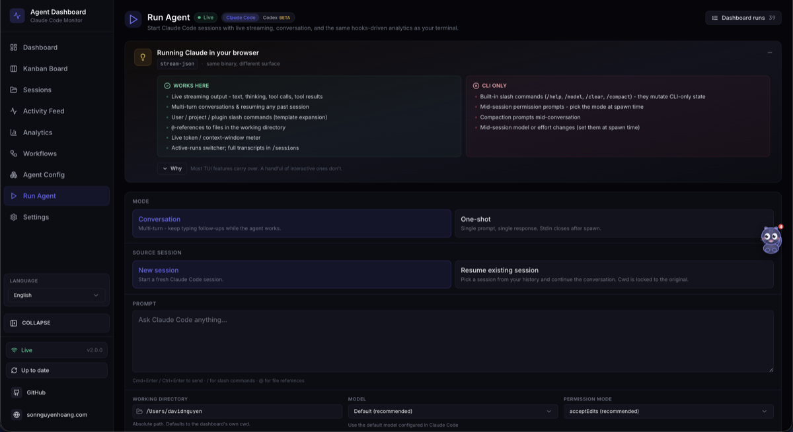</a>
  <br>
  <em>▶️ <strong>Chạy Agent</strong> · khởi chạy Claude Code hoặc Codex với điều khiển gốc theo nhà cung cấp</em>
</p>

<p align="center">
  <a href="images/run-results.png">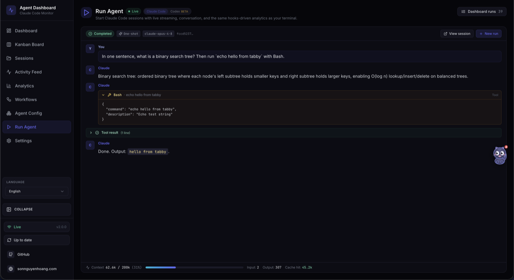</a>
  <br>
  <em>💬 <strong>Lần chạy trực tiếp</strong> · chat phát trực tiếp, suy luận, lệnh, thay đổi tệp, công cụ và gắn lại</em>
</p>

<p align="center">
  <a href="images/settings.png">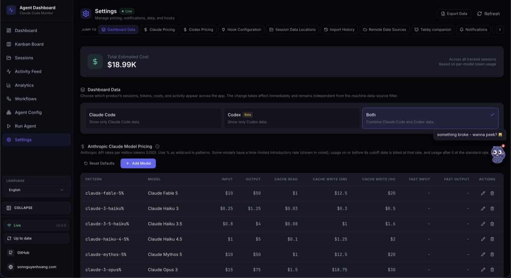</a>
  <br>
  <em>⚙️ <strong>Cài đặt</strong> · định giá, hook, thông báo, dữ liệu, nguồn từ xa và trạng thái hệ thống</em>
</p>

<p align="center">
  <a href="images/alerts.png">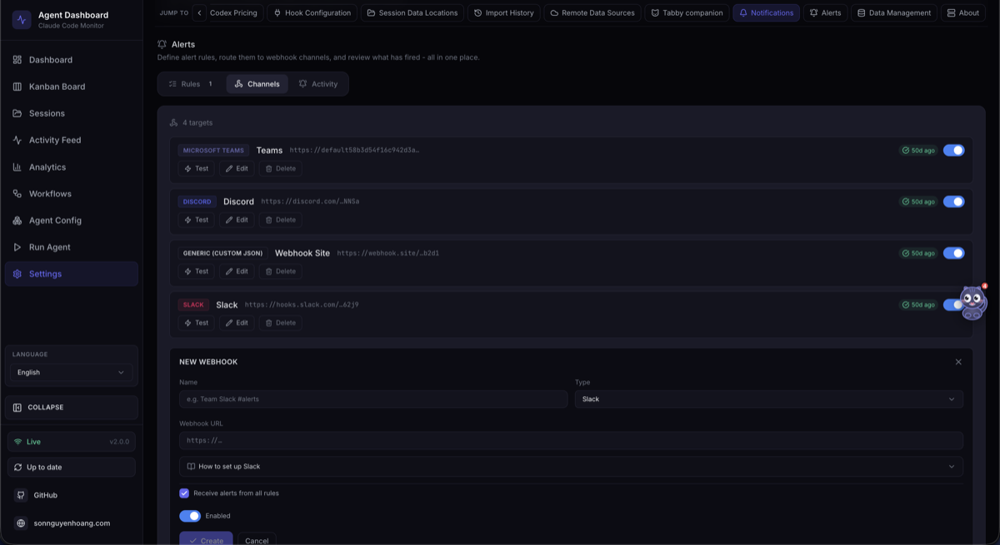</a>
  <br>
  <em>🔔 <strong>Cảnh báo</strong> · quy tắc, cooldown, hoạt động và webhook tích hợp hoặc generic có chữ ký</em>
</p>

<p align="center">
  <a href="images/remote.png">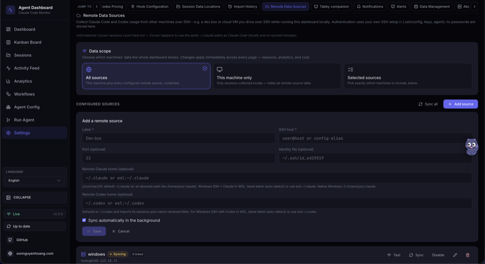</a>
  <br>
  <em>🛰️ <strong>Nguồn dữ liệu từ xa</strong> · đồng bộ SSH theo nhà cung cấp và theo dõi theo phạm vi nguồn</em>
</p>

<p align="center">
  <a href="images/palette.png">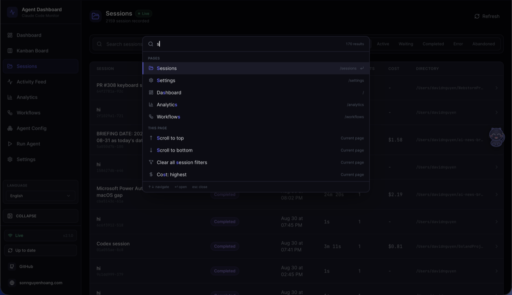</a>
  <br>
  <em>⌘ <strong>Bảng lệnh</strong> · một trình khởi chạy bằng bàn phím cho trang, phiên, dự án, bộ lọc và hành động</em>
</p>

Thanh bên liên kết Dashboard, Bảng Kanban, Phiên, Luồng hoạt động, Phân tích, Quy trình, Cấu hình Agent, Chạy Agent và Cài đặt. Các phần dưới đây mô tả đầy đủ hành vi đằng sau những chế độ xem này.

---

## Tính năng

Dashboard bao quát toàn bộ vòng đời Agent cục bộ. Các hợp đồng vận hành chi tiết vẫn nằm trong những phần được liên kết và tài liệu trong `docs/`.

| Tính năng | Tóm tắt |
| --- | --- |
| **Tiến độ công việc** | Tiến độ theo chủ sở hữu từ công cụ tác vụ Claude, `TodoWrite` cũ và `update_plan` của Codex. Bản xem trước gọn xuất hiện trên thẻ và hàng; Chi tiết phiên bổ sung các đoạn trạng thái, công việc hiện tại, chủ sở hữu và phân trang 10 hàng. Công việc cấp cao nhất mới xóa trạng thái chưa hoàn tất cũ, còn lịch sử đã hoàn tất được giữ lại. |
| **Dashboard** | Hai tab **Monitor** và **Health** được lưu bền vững, kết hợp tổng số Agent, hệ thống phân cấp đang hoạt động, hoạt động gần đây, sức khỏe có trọng số theo thành công/cache/lỗi/heap, lưu trữ, công cụ, model, hiệu quả Subagent và chỉ số compaction. Health làm mới mỗi 5 giây từ `/api/settings/info` và `/api/workflows`. |
| **Bảng Kanban** | Các cột Agent gồm Đang làm việc, Đang chờ, Hoàn tất và Lỗi; các cột phiên bổ sung Đang hoạt động và Bị bỏ dở. Thẻ phân trang 10 mục mỗi lần, chỉ đăng ký chế độ xem WebSocket đang hoạt động, giữ nguyên tiêu đề đầy đủ và giải thích lý do chờ như yêu cầu quyền, kết thúc lượt, đang ở dấu nhắc hoặc bị gián đoạn. |
| **Phiên** | Lịch sử có thể tìm kiếm, lọc và phân trang phía máy chủ, với chi phí chỉ tính trên trang đang hiển thị và một hàng khởi động Codex tạm thời trong bộ nhớ. Tìm kiếm bao quát `id`, `name` và `cwd` với debounce 300 ms. Tên được lấy lần lượt từ tiêu đề rõ ràng, tiêu đề AI rồi lời nhắc người dùng có ý nghĩa đầu tiên. |
| **Chi tiết phiên** | Thống kê trực tiếp, công việc hiện tại, mức dùng công cụ, Subagent, token, hệ thống phân cấp, dòng thời gian sự kiện có bộ lọc, nhóm theo `tool_use_id` và trình kết xuất riêng cho từng công cụ. Chế độ Hội thoại kết xuất lượt chờ, thông báo hệ thống, Markdown, mã được tô sáng và công cụ có kiểu riêng; banner chờ hiển thị lý do và thời gian đã trôi qua. |
| **Luồng hoạt động** | Sự kiện thời gian thực có thể tạm dừng, với bộ lọc dùng chung, phân trang phía máy chủ, nhóm, nguồn dự án/phiên/Subagent, liên kết phiên và badge trạng thái Claude/Codex nhất quán. |
| **Phân tích** | Token theo model, tần suất công cụ, heatmap hoạt động bắt đầu tuần vào Chủ nhật, xu hướng phiên, trạng thái kết nối, skeleton tải khớp bố cục và phân trang cho chú giải dài. |
| **Bảng lệnh** | `Cmd/Ctrl+K` tìm kiếm lệnh gần đây, mọi route, phiên trực tiếp phía máy chủ, hành động của trang, thư mục dự án, chế độ xem con, bộ lọc, Cài đặt, Cấu hình Agent, tùy chọn, phạm vi và ngôn ngữ. Hỗ trợ xếp hạng theo chuỗi con, phạm vi `>`/`@`/`#`, điều khiển đầy đủ bằng bàn phím, nhãn đã dịch, lỗi tìm kiếm im lặng và chỉ điều hướng đối với hành động phá hủy. |
| **Một phím tắt** | `Cmd/Ctrl+K` là tổ hợp toàn cục duy nhất của dashboard, kể cả bên trong trường nhập. Loại bỏ điều hướng nhiều phím để tránh chế độ ẩn; Tabby vẫn dùng `Cmd/Ctrl+B`. |
| **Cập nhật trực tiếp** | WebSocket đẩy cập nhật giao diện mà không cần polling. |
| **Tự động phát hiện** | Tín hiệu nhà cung cấp tự động tạo phiên và Agent. Claude xuất hiện tại `SessionStart`; Codex hiển thị thẻ Đang chờ cục bộ tạm thời trước khi có ID bền vững, tiếp nhận an toàn các luồng đã hoàn tất khi được tiếp tục và không ghi thẻ chưa có danh tính vào tổng số bền vững, phân tích, cảnh báo hay thông báo. |
| **Nhập lịch sử** | Transcript Claude từ `~/.claude/` và rollout Codex từ `~/.codex/sessions` dùng luồng quét và tải lên riêng theo nhà cung cấp, kế toán tiếp nhận trực tiếp dùng chung và ghi idempotent. Rollout Codex bên ngoài được chụp snapshot để hội thoại tồn tại sau khi nguồn bị xóa. |
| **Hệ thống phân cấp Subagent** | Cây cha-con có thể thu gọn trên Dashboard và Chi tiết phiên tự mở rộng khi các Agent con đang hoạt động. |
| **Agent nền** | Subagent chạy nền tiếp tục được theo dõi mà không bị hoàn tất sớm. |
| **Gán công cụ cho Subagent** | `SubagentStop` và quét khi khởi động nhập công cụ JSONL theo từng Subagent, ghép kết quả theo `tool_use_id`, khử trùng lặp, hợp nhất hàng trực tiếp trùng khớp trong 30 giây và dựng lại đúng quan hệ cha lồng nhau từ ID Agent con được tạo. Việc đổi cha là bổ sung và kích hoạt làm mới UI ngay cả khi không chèn hàng. |
| **Theo dõi chi phí** | Định giá có thể cấu hình theo model và phiên, hỗ trợ mức giá giới thiệu có ngày, nhóm khuyến mãi có thể sửa, chi phí riêng của từng Subagent và tổng an toàn qua compaction. Đọc transcript dùng offset byte tăng dần có cache. |
| **Cache transcript** | Phân tích JSONL tăng dần trích xuất token, compaction, lỗi API, thời lượng lượt, suy luận và metadata mức dùng; phân tích đầy đủ sửa bản trùng lặp cũ, còn phân tích phần đuôi chỉ nối thêm. Mảng bị giới hạn bởi `TRANSCRIPT_CACHE_MAX_ARRAY_LEN`, mặc định `1000`, và mục cache chỉ lưu metadata tệp cùng kết quả đã phân tích. |
| **Lưu giữ snapshot transcript** | Snapshot bền vững của Claude, Codex và Cursor giữ hội thoại đầy đủ nhất. Bản sao Claude và Cursor mất nguồn được gzip sau khi round-trip đã xác minh; purge xóa snapshot; giới hạn tuổi/kích thước tùy chọn có thể cắt bản sao cũ duy nhất sau bản xem trước chạy thử trong Cài đặt. |
| **Thông báo** | VAPID Web Push gửi sự kiện đã cấu hình khi chạy nền hoặc khi trình duyệt đóng, có hỗ trợ âm thanh macOS và điều khiển đăng ký. |
| **Cảnh báo** | Cài đặt cung cấp Rules, Channels và Activity cho cảnh báo theo mẫu sự kiện, không hoạt động, Agent bị kẹt và token. Quy tắc sự kiện chạy sau khi tiếp nhận; quy tắc thời gian quét mỗi 60 giây. Cảnh báo bền vững dùng cooldown theo quy tắc/phiên, mặc định 300 giây, gửi qua WebSocket, xác nhận và fan-out webhook có phạm vi tới 14 nhà cung cấp được đặt tên hoặc JSON ký chung với secret được che, timeout và retry có giới hạn. |
| **Thông báo cập nhật** | `git fetch` theo lịch không chặn so sánh checkout với remote chuẩn, rồi hiển thị lệnh cập nhật chính xác trong modal, thanh bên và terminal. CCAM không bao giờ tự pull hay tự khởi động lại. |
| **Cài đặt** | Trạng thái hệ thống và hook, định giá theo nhà cung cấp, thông báo, dọn dẹp, thư mục nhà cung cấp, làm mới dữ liệu tức thì và khôi phục idempotent JSON xuất ra tối đa 25 MiB. Định giá hỗ trợ mặc định theo nhà cung cấp, quy tắc wildcard, hướng dẫn giá công bố, ranh giới GPT 272K và danh mục riêng cho Cursor gốc và bên thứ ba. |
| **Chạy Agent + Cấu hình Agent** | `/run` khởi chạy Claude Code hoặc luồng app-server Codex gốc với model, phê duyệt, sandbox, tiếp tục, dừng, phát trực tiếp và gắn lại theo từng nhà cung cấp. `/cc-config` ghép trình khám phá Claude và Codex có thể chỉnh sửa; tệp người dùng được hỗ trợ dùng lưu atomic có bảo vệ và bản sao lưu có dấu thời gian, bản xem trước che secret, lệnh profile chính xác và watcher riêng theo nhà cung cấp. |
| **Cấu hình Agent Codex** | Hiển thị toàn bộ danh mục model của tài khoản cùng override cơ sở/profile, tạo overlay `<name>.config.toml` chuẩn và bảo vệ chỉnh sửa bằng kiểm tra containment chuẩn hóa cùng symlink. Profile, hook, quy tắc, skill và chỉ dẫn hỗ trợ hành động nguồn/đường dẫn/sửa/xóa với xóa sau khi sao lưu; `config.toml` chỉ được sửa. |
| **Máy chủ MCP (cục bộ)** | Ba transport, stdio, HTTP+SSE và REPL, cung cấp 103 công cụ có kiểu trong 16 module. Một danh mục đã xác thực áp dụng đích localhost hoặc HTTPS, quy tắc bearer token, từ chối redirect, cổng bảo vệ mutation, tải lên 50 MiB mỗi tệp và 100 MiB mỗi lần gọi, phản hồi nhị phân 10 MiB và khôi phục 25 MiB. |
| **Quy trình** | Mười một phần D3 bao quát điều phối, luồng công cụ, cộng tác, hiệu quả, mẫu, ủy quyền, lỗi, đồng thời, độ phức tạp, compaction và drill-in phiên. Tooltip giải thích đã bản địa hóa, lọc chéo, xuất JSON, làm mới trực tiếp có debounce 3 giây và lần chạy động dựng lại từ journal giữ chi tiết giai đoạn, token, công cụ, thời lượng, lời nhắc và kết quả theo Agent. |
| **Theo dõi compaction** | Quét transcript tạo Agent/sự kiện compaction có thời lượng bằng không, sửa thời lượng âm cũ, backfill phiên cũ và định kỳ chỉ kiểm tra phiên đang hoạt động qua giá trị `sessions.transcript_path` đã cache. |
| **Phiên con/Phiên tiếp tục** | Sự kiện mới kích hoạt lại phiên được tiếp tục hoặc mồ côi; một lần quét sau mỗi một phần tư `DASHBOARD_STALE_MINUTES`, giới hạn trong khoảng 60 giây đến 5 phút, phát hiện phiên bị bỏ dở. |
| **Phát hiện phiên có sẵn** | Nhập khi khởi động đánh dấu transcript mới sửa gần đây là đang hoạt động, còn sự kiện Stop về sau kích hoạt lại phiên đã nhập ở trạng thái hoàn tất hoặc bị bỏ dở trước khi cập nhật. |
| **Đồng bộ dự án liên tục** | Một lần quét ngay khi khởi động, watcher hệ thống tệp có debounce và poll `DASHBOARD_SESSION_SYNC_MS`, mặc định 30 giây, dùng chung cache mtime và lần quét hợp nhất. Chỉ tệp mới hoặc đã tiến lên được phân tích lại, với phạm vi watcher an toàn trên Linux và broadcast phiên trực tiếp. |
| **Nguồn dữ liệu từ xa** | Nguồn SSH phản chiếu độc lập thư mục Claude và Codex qua `scp` hoặc `tar` của WSL, gắn `sessions.source`, đối chiếu vòng đời và vẫn khỏe nếu một trong hai nhà cung cấp hoạt động. Polling mặc định 15 giây; fallback cũ chỉ ảnh hưởng nhà cung cấp lỗi. Thông tin xác thực ở lại với SSH của máy chủ. |
| **Tiếp nhận đẩy từ xa** | `POST /api/hooks/ingest-batch` hỗ trợ máy phía sau NAT. Tính năng tắt cho đến khi có `REMOTE_PUSH_TOKEN`, từ chối token trong query string và phiên sở hữu cục bộ, giới hạn batch ở 1000, khử trùng lặp `(session_id, event_type, uuid)`, trả lỗi từng mục và chỉ broadcast sau commit. |
| **Thiết kế thích ứng** | Bố cục di động xếp chồng lưới, cuộn bảng rộng và thu gọn điều hướng. |
| **Bản địa hóa UI** | Tiếng Anh, Trung, Việt, Hàn và Tây Ban Nha bao quát nội dung UI, nhãn trợ năng, giải thích quy trình và tooltip, hướng dẫn định giá model, thư mục nhà cung cấp và Nhập lịch sử. |
| **Dữ liệu mẫu** | Script tích hợp cung cấp dữ liệu demo và phát triển thực tế. |
| **Statusline** | Dải CLI có màu hiển thị model, ngữ cảnh, nhánh Git, token theo chiều và chi phí phiên bằng USD. |
| **Định dạng tên model** | Định danh Claude, GPT và Gemini trở thành tên dễ đọc bằng cách bỏ hậu tố nhà cung cấp/ngày/latest, nối phiên bản số và định dạng tag ngữ cảnh; Cài đặt giữ nguyên mẫu định giá thô. |
| **Thị trường plugin Claude + Codex** | Một cây 14 plugin cung cấp cả hai định dạng manifest và danh mục, 66 skill plugin, 18 Subagent Claude, 34 lệnh Claude, 3 trình trợ giúp CLI và metadata OpenAI. `npx skills add hoangsonww/Claude-Code-Agent-Monitor --list` phát hiện 77 skill của kho mã. |
| **Run Claude** | Chế độ hội thoại và one-shot hỗ trợ tiếp tục/xem lịch sử, nhiều lần chạy nền đồng thời, gắn lại có nhận biết transcript, điều khiển model/effort/quyền/cwd, làm mượt tin nhắn một phần, giữ suy luận, lệnh slash, tệp `@`, đồng hồ ngữ cảnh và chi phí, cùng trạng thái trực tiếp. Bảo vệ same-origin chặn việc tạo ngoài ý muốn; đồng thời mặc định có trần an toàn 10000 và có thể giảm bằng `RUN_MAX_CONCURRENT`. |
| **Trình khám phá cấu hình Claude** | Mười hai tab kiểm tra skill, Agent, lệnh, style, plugin, marketplace, MCP, hook, cài đặt, memory, keybinding và statusline. Đường dẫn chuẩn hóa chặn thoát qua symlink; bề mặt văn bản được hỗ trợ dùng tạo/sửa/xóa atomic với bản sao lưu có dấu thời gian bên ngoài cây, còn cấu hình nhạy cảm chỉ đọc với hướng dẫn CLI chính xác. `cc-watcher` 500 ms broadcast thay đổi bên ngoài. |
| **Tabby** | Linh vật WebSocket không phụ thuộc với tám trạng thái theo hoạt động, lời thoại được throttle, hành động nhanh, câu trả lời trạng thái cục bộ và chuyển tiếp sang Run Claude cho lời nhắc rộng hơn. Có thể dùng bằng bàn phím, nhận biết reduced motion, an toàn khi mất kết nối, có thể cấu hình và đã bản địa hóa. |
| **Tín hiệu âm thanh** | Bảy tín hiệu Web Audio không phụ thuộc bao quát phiên, lỗi, Subagent, thông báo, kết nối và thao tác bấm. Cooldown, ngân sách burst toàn cục, lọc low-pass, an toàn autoplay, âm lượng được lưu và cài đặt theo từng tín hiệu giúp chúng không gây phiền. |
| **Ứng dụng web tiến bộ (PWA)** | Dashboard, trang chủ và Wiki có manifest cùng service worker độc lập. Tài nguyên Vite bất biến dùng cache-first; điều hướng và tệp shell có thể thay đổi dùng network-first; push được giữ nguyên; trang chủ và Wiki precache shell rồi lazy-cache ảnh chụp màn hình; metadata SVG và Apple hỗ trợ cài đặt. |
| **Ứng dụng máy tính để bàn (macOS & Windows)** | Electron 35 đóng gói DMG macOS và EXE trình cài/portable Windows quanh cùng máy chủ Express trong tiến trình và client React. Ứng dụng bổ sung menu gốc, trạng thái/hành động tray, chạy khi đăng nhập, xác nhận thoát, thông báo gốc, khóa một phiên bản, fallback/tiếp nhận cổng an toàn, tắt SQLite sạch và thiết lập hook/nền ở lần chạy đầu. |
| **Tài nguyên tự lưu trữ (không CDN)** | Font, script, Mermaid của Wiki và fallback của extension đều cục bộ. Ứng dụng, trang chủ và Wiki hoạt động ngoại tuyến mà không yêu cầu Google Fonts, jsDelivr hay tài nguyên bên thứ ba khác. |
| **Màn hình splash phiên** | Lời chào đã bản địa hóa và hoạt ảnh đồ thị nút xuất hiện một lần mỗi phiên trình duyệt, đục từ lần vẽ đầu tiên, kéo dài khoảng 2.5 giây, hỗ trợ bấm để bỏ qua và tôn trọng reduced motion. |

> **Phạm vi nhà cung cấp và thư mục:** Cài đặt giữ lựa chọn tương thích Claude (Claude Code + Cursor) / Codex / Cả hai nhất quán trên toàn ứng dụng. Có thể chỉnh sửa thư mục Claude Code và Codex mà không cần khởi động lại dashboard; Cursor được tự động phát hiện từ `~/.cursor` hoặc `DASHBOARD_CURSOR_HOME`.
>
> **Ranh giới an toàn cục bộ:** Chạy Agent chấp nhận mọi thư mục làm việc tuyệt đối đang tồn tại và chuẩn hóa trước khi dùng, nên vẫn hỗ trợ khởi chạy từ thư mục nhà và dự án gần đây. Nhà cung cấp webhook được lưu trữ bắt buộc dùng HTTPS; đích generic và n8n có thể dùng HTTP cho bên nhận cục bộ/tự lưu trữ, và quá trình gửi không theo redirect.

---

## Bắt đầu nhanh

### Điều kiện tiên quyết

- **Node.js** >= 22.22.0 (khuyến nghị 24 LTS)
- **npm** >= 9.0.0

### 1. Cài đặt

```bash
git clone https://github.com/hoangsonww/Claude-Code-Agent-Monitor.git
cd Claude-Code-Agent-Monitor
npm run setup
```

### 2. Cấu hình hook Claude Code

```bash
npm run install-hooks
```

Chọn **Claude Code**, **Codex (beta)** hoặc cả hai bằng phím mũi tên, Space và Enter. Hook Claude được lưu trong `~/.claude/settings.json`, còn hook Codex trong `~/.codex/hooks.json`. Cài lại chỉ thay thế các mục CCAM và giữ nguyên hook không liên quan; hành động tương tự có tại **Settings → Hook Configuration**.

Trong lần khởi chạy đầu tiên, CCAM chỉ kiểm tra những nhà cung cấp đã chọn cho phạm vi dữ liệu hiện tại và đề nghị cài hook còn thiếu. Nếu kiểm tra mức sẵn sàng thất bại, ứng dụng chuyển sang thiết lập thủ công thay vì chặn dashboard.

Quá trình phát hiện nhà cung cấp tiếp tục sau khi thiết lập:

- **Claude Code và Cursor:** Hook Claude cung cấp sự kiện trực tiếp. Cursor không cần hook; chọn Claude Code cũng theo dõi `~/.cursor/chats` và `~/.cursor/projects/*/agent-transcripts`, chụp snapshot hội thoại trước khi Cursor dọn dẹp và tôn trọng `DASHBOARD_CURSOR_HOME`.
- **Codex:** Hook và việc theo dõi rollout `~/.codex/sessions` theo kiểu tăng dần giữ cho vòng đời, lời nhắc, tiêu đề, công cụ, token, chi phí, compaction, hội thoại và trạng thái WebSocket luôn mới. Tệp lỗi được thử lại riêng; đối chiếu chính xác rollout/tiến trình ngăn thẻ đang hoạt động ảo; tiêu đề `/rename` gốc và lịch sử hội thoại phân trang bằng cursor luôn được cập nhật.
- **Cả hai:** Thẻ giữ hai lời nhắc người dùng khác nhau gần nhất, kết xuất tệp ảnh đính kèm đã lưu và khử trùng lặp phản hồi Codex lặp lại. Phạm vi chỉ Codex ẩn journal Dynamic Workflow chỉ dành cho Claude.

### 3. Khởi động

```bash
# Development (hot reload on both server and client)
npm run dev

# Production (single process, built client)
npm run build && npm start
```

> [!TIP]
> **Lựa chọn Makefile:** Mọi lệnh cũng có qua `make` nếu hệ thống đã cài. Chạy `make help` để xem toàn bộ target, hoặc dùng phím tắt như `make dev`, `make build`, `make test`.

### 4. Mở

| Chế độ | URL |
| --- | --- |
| Phát triển | `http://localhost:5173` |
| Sản xuất | `http://localhost:4820` |

### 5. Tùy chọn: Chạy máy chủ MCP cục bộ

```bash
npm run mcp:start              # stdio (default — for MCP host integration)
npm run mcp:start:http         # HTTP + SSE server on port 8819
npm run mcp:start:repl         # interactive CLI with tab completion
ccam mcp stdio                 # stable launcher used by bundled plugins
```

`npm run setup` cài đặt và build gói MCP trước khi liên kết `ccam`. Với chế độ stdio, cấu hình host bằng lệnh `ccam` và đối số `["mcp", "stdio"]`.

Với chế độ HTTP, trỏ client MCP từ xa tới `http://127.0.0.1:8819/mcp` (Streamable HTTP) hoặc `http://127.0.0.1:8819/sse` (SSE cũ).

Xem [mcp/README.md](./mcp/README.md) để biết đầy đủ cấu hình host, chi tiết transport, cờ an toàn và danh mục công cụ.

### Tùy chọn: Nạp dữ liệu demo

```bash
npm run seed
```

Tạo 8 phiên mẫu, 23 Agent và 106 sự kiện để bạn có thể khám phá UI ngay lập tức.

### Lựa chọn khác: Ứng dụng máy tính để bàn (macOS & Windows)

Nếu không muốn giữ terminal mở, hãy cài **ứng dụng máy tính để bàn gốc** tùy chọn. Ứng dụng nhúng máy chủ trong cùng tiến trình, thêm biểu tượng menu-bar / khu vực thông báo (tray) và hỗ trợ tự khởi động khi đăng nhập (macOS Login Items / Windows startup).

Cách nhanh nhất là **tải trình cài đặt dựng sẵn** từ [GitHub Release mới nhất](https://github.com/hoangsonww/Claude-Code-Agent-Monitor/releases/latest) (CI tự động phát hành `vX.Y.Z` mỗi khi `package.json` được tăng phiên bản trên `master`):

- **macOS:** Tải `ClaudeCodeMonitor-<version>-arm64.dmg` (Apple Silicon) hoặc `-x64.dmg` (Intel), rồi kéo **Claude Code Monitor.app** vào `/Applications`.
- **Windows:** Tải `ClaudeCodeMonitor-Setup-<version>-x64.exe` (trình cài đặt) hoặc `ClaudeCodeMonitor-<version>-x64-portable.exe` (không cần cài đặt), rồi chạy tệp.

Nếu muốn tự build:

```bash
npm run desktop:install        # install Electron + electron-builder into desktop/ (preflights native deps; prints setup help on failure)
npm run desktop:dmg:arm64      # macOS: fast single-arch DMG (Apple Silicon)
npm run desktop:win            # Windows: NSIS installer .exe (run on Windows)
```

Phần [Ứng dụng máy tính để bàn (macOS & Windows)](#desktop-app-macos--windows) bên dưới trình bày đầy đủ việc tải xuống, cài đặt, tính năng tray/menu, lệnh build và ký. Xem thêm [`DESKTOP.md`](./DESKTOP.md) (hướng dẫn người dùng) và [`desktop/README.md`](./desktop/README.md) (kiến trúc).

### Lựa chọn khác: Docker / Podman

Image OCI và tệp Compose hỗ trợ Docker và Podman. Runtime chạy non-root, bỏ mọi capability, dùng Tini làm PID 1, bao gồm Git/OpenSSH/SQLite và chuyển sang chỉ đọc ngoại trừ `/app/data`, `/app/config` và `/tmp`.

```bash
# Dashboard only
docker compose up -d --build
# or
podman compose up -d --build

# Complete stack: dashboard + authenticated MCP + Nginx + Prometheus + Grafana
umask 077
openssl rand -hex 32 > deployments/secrets/dashboard-token
openssl rand -hex 32 > deployments/secrets/hook-token
openssl rand -hex 32 > deployments/secrets/mcp-token
openssl rand -base64 32 > deployments/secrets/grafana-admin-password
npm run docker:full:up
```

Mọi cổng host mặc định chỉ bind vào loopback: dashboard `4820`, MCP `8819`, Nginx `8080`, Prometheus `9090` và Grafana `3000`. Thư mục Claude và Codex được mount chỉ đọc; named volume lưu bền SQLite và cấu hình do dashboard sở hữu. Nginx proxy UI, REST API có xác thực và WebSocket, còn hook, metrics và MCP bị chặn ở edge trừ khi được bật rõ ràng. Docker target `agent-runtime` tùy chọn bổ sung Claude Code và Codex CLI được ghim phiên bản cho quy trình Run Agent gốc trong container.

> [!IMPORTANT]
> Cài hook Claude Code/Codex trên host sau khi container khởi động. Với hook đám mây từ xa, đặt `CCAM_DASHBOARD_URL=https://...` và một `CCAM_HOOK_TOKEN` riêng; URL hook không phải loopback bắt buộc dùng HTTPS. Xem [DEPLOYMENT.md](DEPLOYMENT.md).

---

## Nó hoạt động như thế nào

Bảng điều khiển tích hợp với Claude Code thông qua hệ thống hook gốc của nó để cung cấp khả năng giám sát hoạt động của Agent theo thời gian thực. Dưới đây là tổng quan về kiến ​​trúc và luồng dữ liệu:

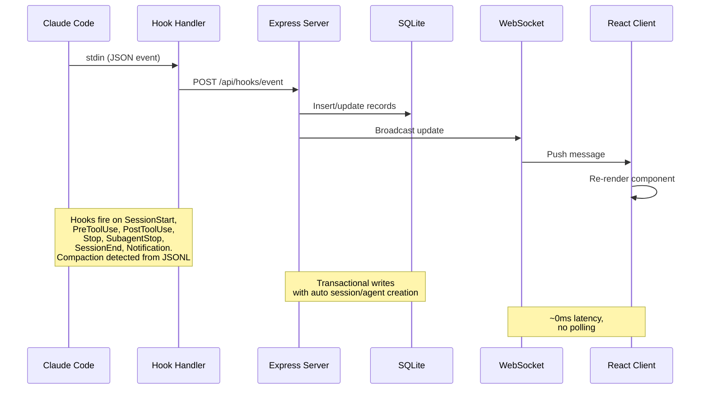
```mermaid
sequenceDiagram
    participant CC as Claude Code
    participant HH as Hook Handler
    participant API as Express Server
    participant DB as SQLite
    participant WS as WebSocket
    participant UI as React Client

    CC->>HH: stdin (JSON event)
    HH->>API: POST /api/hooks/event
    API->>DB: Insert/update records
    API->>WS: Broadcast update
    WS->>UI: Push message
    UI->>UI: Re-render component

    Note over CC,HH: Hooks fire on SessionStart,<br/>PreToolUse, PostToolUse,<br/>Stop, SubagentStop,<br/>SessionEnd, Notification.<br/>Compaction detected from JSONL
    Note over API,DB: Transactional writes<br/>with auto session/agent creation
    Note over WS,UI: ~0ms latency,<br/>no polling
```

> [!QUAN TRỌNG]
> Xem [KIẾN TRÚC.md](./ARCHITECTURE.md) để tìm hiểu sâu về kiến ​​trúc máy chủ, lược đồ cơ sở dữ liệu, tuyến API, thiết kế WebSocket, định tuyến máy khách, luồng trình xử lý hook, chế độ triển khai và sơ đồ vòng đời chi tiết cho phiên và tác nhân.

### Vòng đời hook

1. **Claude Code** phát hook cho phiên, lời nhắc, công cụ, thông báo, Subagent, lượt và thoát.
2. **`scripts/hook-handler.js`** đọc từng sự kiện từ stdin và phát hiện dashboard đang chạy qua `~/.claude/.agent-dashboard.json` hoặc `CLAUDE_DASHBOARD_PORT`. Trình xử lý gửi một lần cho mỗi thư mục dữ liệu SQLite duy nhất, chọn cổng thấp nhất cho listener trùng lặp nhưng vẫn cấp dữ liệu cho dashboard dùng cơ sở dữ liệu riêng. Mỗi đích được cô lập để gửi an toàn khi lỗi, và trình xử lý thoát trong 5 giây.
3. **Máy chủ** commit sự kiện và trạng thái liên quan trong một giao dịch SQLite:
   - Lần liên hệ đầu tạo phiên và Agent chính. `SessionStart` bắt đầu ở trạng thái **Đang chờ**; `UserPromptSubmit` hoặc `PreToolUse` chuyển sang **Đang làm việc**; `PostToolUse` giữ trạng thái làm việc.
   - `Stop` đưa Agent chính về **Đang chờ** trong khi Agent nền tiếp tục. `stop_reason=error` đánh dấu Agent và phiên là **Lỗi**. Thông báo quyền cũng chờ input; chỉ lời nhắc mới hoặc lúc bắt đầu công cụ mới khôi phục lỗi.
   - `SubagentStop` hoàn tất Agent con mà không đổi trạng thái chờ người dùng. Một lần quét tách rời sau đó nhập công cụ JSONL của nó, ghép use/result theo `tool_use_id`, khử trùng lặp và dựng lại đúng quan hệ cha lồng nhau.
   - `SessionEnd` xóa trạng thái chờ và hoàn tất phiên, trừ khi cần giữ lỗi. Công việc mới kích hoạt lại phiên đã hoàn tất, lỗi hoặc bị bỏ dở, kể cả phiên đã nhập và được tiếp tục.
   - `SessionStart` và bảo trì định kỳ đánh dấu phiên không hoạt động là bị bỏ dở sau `DASHBOARD_STALE_MINUTES`, mặc định 180. Lần quét chạy sau mỗi một phần tư giá trị này, giới hạn trong khoảng 60 giây đến 5 phút.
   - Phân tích transcript tăng dần dùng chung ghi lại compaction, lỗi API và công cụ, thời lượng lượt, token và metadata mà không đọc lại byte không đổi. Lần quét phiên đang hoạt động dùng giá trị `sessions.transcript_path` đã lập chỉ mục và loại bỏ mục cache bị bỏ dở.
   - Watchdog 15 giây tìm lỗi API trong transcript sau 10 giây không có hook. Nó cũng khôi phục lần gián đoạn bằng Esc từ dấu mốc transcript hoặc, khi không có dấu mốc, sau `DASHBOARD_WORKING_IDLE_SECONDS`, mặc định 120, chỉ khi không có công cụ chạy và cả hook lẫn transcript đều không tiến lên.
   - Cùng watchdog đó hoàn tất phiên cục bộ đã chết bằng kiểm tra liveness tiến trình sau `DASHBOARD_LIVENESS_IDLE_SECONDS`, mặc định 60. Kiểm tra khi khởi động chạy ngay lập tức và chạy lại sau khoảng 5 giây mà không áp dụng ngưỡng idle. Kiểm tra bỏ qua Windows, container, đường dẫn chuyển tiếp không phải POSIX, phiên nguồn từ xa, lỗi công cụ và `DASHBOARD_LIVENESS_PROBE=0`; hook thật về sau tự sửa một lần hoàn tất sai.
   - Đồng bộ dự án liên tục kết hợp quét ngay lập tức, `fs.watch` có debounce và polling `DASHBOARD_SESSION_SYNC_MS`, mặc định 30 giây. Một cache mtime chỉ phân tích lại transcript mới hoặc lớn hơn và broadcast cùng các frame phiên như hook.
4. **WebSocket** phát thay đổi đã commit.
5. **UI** làm mới chế độ xem bị ảnh hưởng mà không cần polling.

### Máy trạng thái Agent

Trạng thái lưu trữ: `working | waiting | completed | error`. Cột
`awaiting_input_since` là bổ sung — nó theo dõi thời điểm Agent bắt đầu
chờ và dùng để hiển thị thời lượng chờ, nhưng `waiting` giờ là trạng thái
lưu trữ thực sự.

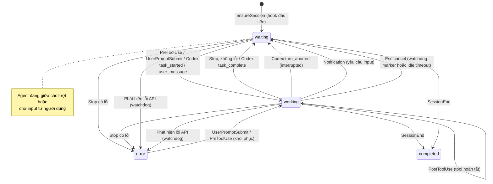
```mermaid
stateDiagram-v2
    [*] --> waiting: ensureSession (hook đầu tiên)
    waiting --> working: PreToolUse / UserPromptSubmit / Codex task_started / user_message
    working --> working: PostToolUse (tool hoàn tất)
    working --> waiting: Stop, không lỗi / Codex task_complete
    working --> waiting: Codex turn_aborted (interrupted)
    working --> waiting: Notification (yêu cầu input)
    working --> waiting: Esc cancel (watchdog marker hoặc idle timeout)
    waiting --> error: Stop có lỗi
    working --> error: Stop có lỗi
    waiting --> error: Phát hiện lỗi API (watchdog)
    working --> error: Phát hiện lỗi API (watchdog)
    error --> working: UserPromptSubmit / PreToolUse (khôi phục)
    working --> completed: SessionEnd
    waiting --> completed: SessionEnd

    note right of waiting
        Agent đang giữa các lượt hoặc
        chờ input từ người dùng
    end note
```

### Máy trạng thái phiên

Trạng thái lưu trữ: `active | completed | error | abandoned`. Trạng thái
**Đang chờ** là lớp phủ UI (status=`active` cộng với `awaiting_input_since`
được đặt).

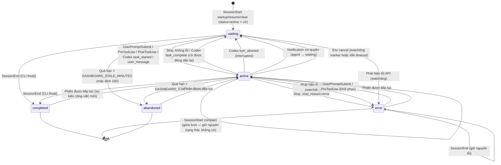
```mermaid
stateDiagram-v2
    [*] --> waiting: SessionStart startup/resume/clear (status=active + cờ)
    active --> active: SessionStart compact (giữa lượt — giữ nguyên trạng thái, không cờ)
    waiting --> active: UserPromptSubmit / PreToolUse / PostToolUse / Codex task_started / user_message
    active --> waiting: Stop, không lỗi / Codex task_complete (cờ được đóng dấu lại)
    active --> waiting: Codex turn_aborted (interrupted)
    active --> waiting: Notification xin quyền (agent → waiting)
    active --> waiting: Esc cancel (watchdog marker hoặc idle timeout)
    active --> error: Stop, stop_reason=error
    active --> error: Phát hiện lỗi API (watchdog)
    waiting --> error: Phát hiện lỗi API (watchdog)
    error --> active: UserPromptSubmit / PreToolUse (khôi phục)
    waiting --> completed: SessionEnd (CLI thoát)
    active --> completed: SessionEnd (CLI thoát)
    error --> error: SessionEnd (giữ nguyên lỗi)
    waiting --> abandoned: Quá hạn > DASHBOARD_STALE_MINUTES (mặc định 180)
    active --> abandoned: Quá hạn > DASHBOARD_STALE_MINUTES
    completed --> active: Phiên được tiếp tục (sự kiện công việc mới)
    error --> active: Phiên được tiếp tục
    abandoned --> active: Phiên được tiếp tục
    completed --> [*]
    error --> [*]
    abandoned --> [*]
```

### Luồng tính toán chi phí

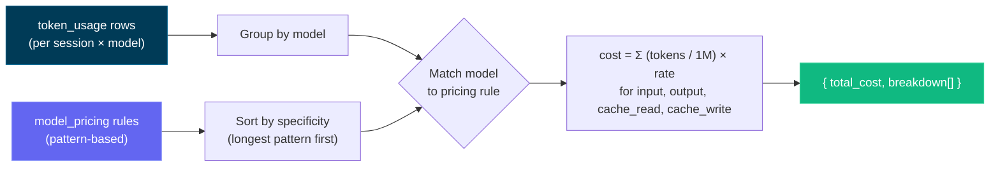
```mermaid
flowchart LR
    TU["token_usage rows<br/>(per session × model)"] --> GROUP["Group by model"]
    PR["model_pricing rules<br/>(pattern-based)"] --> SORT["Sort by specificity<br/>(longest pattern first)"]
    GROUP --> MATCH{"Match model<br/>to pricing rule"}
    SORT --> MATCH
    MATCH --> CALC["cost = Σ (tokens / 1M) × rate<br/>for input, output, cache_read, cache_write"]
    CALC --> RESULT["{ total_cost, breakdown[] }"]
    style TU fill:#003B57,stroke:#005f8a,color:#fff
    style PR fill:#6366f1,stroke:#818cf8,color:#fff
    style RESULT fill:#10b981,stroke:#34d399,color:#fff
```

> [!QUAN TRỌNG]
> Luồng tính toán chi phí dựa trên việc sử dụng mã thông báo và quy tắc định giá mô hình. Đảm bảo quy tắc đặt giá của bạn được cập nhật để phản ánh chi phí chính xác. Cập nhật bảng giá mô hình thông qua trang Cài đặt để duy trì theo dõi chi phí chính xác - bảng thông tin không tự động tìm nạp thông tin cập nhật về giá từ các nguồn bên ngoài. Sau khi bạn đặt quy tắc đặt giá, trang tổng quan sẽ áp dụng chúng cho tất cả các phiên để báo cáo chi phí nhất quán.

---

## Cấu hình

| Biến môi trường | Mặc định | Mục đích |
| --- | --- | --- |
| `DASHBOARD_PORT` | `4820` | Cổng máy chủ Express. |
| `CLAUDE_DASHBOARD_PORT` | `4820` | Cổng trình xử lý hook sử dụng. |
| `NODE_ENV` | `development` | Dùng `production` để phục vụ client đã build. |
| `DASHBOARD_UPDATE_CHECK` | bật | Đặt `0`, `false` hoặc `off` để tắt kiểm tra upstream theo lịch. |
| `DASHBOARD_UPDATE_CHECK_INTERVAL_MS` | `300000` | Khoảng thời gian cập nhật, tối thiểu 60,000 ms. **Check now** thủ công vẫn dùng được. |
| `DASHBOARD_STALE_MINUTES` | `180` | Thời gian không hoạt động trước khi phiên đang hoạt động hoặc Đang chờ bị coi là bỏ dở. Watchdog áp dụng ngưỡng này và bảo trì chạy sau mỗi một phần tư giá trị, giới hạn trong khoảng 60 giây đến 5 phút. |
| `DASHBOARD_WORKING_IDLE_SECONDS` | `120` | Khôi phục lần hủy Esc không có dấu mốc khi không có công cụ, hook hoặc hoạt động transcript tiến lên. Giá trị thấp phản ứng nhanh hơn nhưng có thể tạm phân loại sai lượt im lặng dài; hoạt động mới sẽ tự sửa. Cursor dùng cùng quy tắc. |
| `DASHBOARD_LIVENESS_PROBE` | `1` | Đặt `0` để tắt hoàn tất dựa trên tiến trình cho phiên Claude/Codex cục bộ đã chết. Tự động bỏ qua Windows, container, đường dẫn chuyển tiếp không phải POSIX và nguồn từ xa. |
| `DASHBOARD_LIVENESS_IDLE_SECONDS` | `60` | Ngưỡng transcript hoặc hook cuối không hoạt động cho kiểm tra liveness của watchdog. Kiểm tra lúc khởi động bỏ qua ngưỡng để dọn ngay phiên đã chết. |
| `DASHBOARD_SESSION_SYNC_MS` | `30000` | Poll an toàn cho tệp mới hoặc đã đổi trong `~/.claude/projects`. `fs.watch` vẫn tức thì; `0` chỉ tắt polling. |
| `DASHBOARD_CURSOR_HOME` | `~/.cursor` | Thư mục gốc trạng thái Cursor cho chat, transcript, backfill và snapshot bền vững. |
| `DASHBOARD_CURSOR_SYNC_MS` | `5000` | Poll an toàn Cursor có fingerprint. Watcher vẫn hoạt động khi `0` tắt polling. |
| `DASHBOARD_CODEX_HOME` | `CODEX_HOME` hoặc `~/.codex` | Thư mục gốc trạng thái Codex. Cài đặt lưu override, bật lại watcher và quét ngay. |
| `DASHBOARD_CODEX_SYNC_MS` | `4000` | Poll an toàn rollout Codex. Hook và watcher vẫn hoạt động khi đặt `0`. |
| `DASHBOARD_CODEX_MAX_ATTEMPTS` | `5` | Số lần thử cho một rollout không đọc được và không đổi, tính cả lần đầu. Thay đổi kích thước hoặc mtime đặt lại ngân sách; khi hết chỉ log một lần. |
| `DASHBOARD_CODEX_HOOK_IDLE_SECONDS` | `60` | Hoàn tất phiên Codex chỉ có hook, như `codex exec --ephemeral`, khi `stop` đã báo kết thúc nhưng không nhận `SessionEnd`. Chỉ im lặng thì không đủ điều kiện. |
| `DASHBOARD_TASK_SUMMARY_TTL_MS` | `2000` | Cửa sổ serve-stale cho tóm tắt tác vụ và `todo_snapshot`. Phần nối thêm được phân tích tăng dần; tăng quá 32 MiB sẽ bắt đầu lại từ phần đuôi mới. `0` phân tích mỗi lần nối. |
| `DASHBOARD_SNAPSHOT_COMPRESS` | `1` | Đặt `0`, `false` hoặc `off` để dừng chuyển đổi gzip đã xác minh cho snapshot Claude/Cursor không hoạt động 24 giờ và đã mất nguồn. Cây nguồn không đọc được và snapshot Codex bị bỏ qua. |
| `DASHBOARD_SNAPSHOT_MAX_AGE_DAYS` | chưa đặt | Lần lưu giữ tùy chọn mỗi sáu giờ cho phiên đã kết thúc cũ hơn tuổi này. Phiên bị cắt được tombstone; phiên được tiếp tục được bảo vệ. Xem trước bằng `ccam snapshots prune --days N` vì snapshot có thể là bản sao duy nhất. |
| `DASHBOARD_SNAPSHOT_MAX_BYTES` | chưa đặt | Giới hạn tổng snapshot tùy chọn theo byte hoặc đơn vị như `5GB`. Phiên đã kết thúc cũ nhất bị cắt trước; phiên đang hoạt động hoặc trong 24 giờ gần nhất được bảo vệ. |
| `DASHBOARD_REMOTE_SYNC_MS` | `15000` | Poll nguồn SSH từ xa cho dự án Claude, rollout Codex và chỉ mục tiêu đề Codex. Nguồn mới hoặc được bật lại đồng bộ ngay; `0` vẫn cho phép đồng bộ thủ công. |
| `DASHBOARD_REMOTE_ACTIVE_WINDOW_MS` | `600000` | Coi transcript từ xa đã phản chiếu là đang hoạt động khi sự kiện mới nhất còn trong khoảng này, rồi đối chiếu về hoàn tất. Nhà cung cấp lỗi quay về xử lý stale thông thường. |
| `DASHBOARD_REMOTE_SYNC_TIMEOUT_MS` | `600000` | Timeout theo nguồn cho kéo SSH cộng nhập dữ liệu. |
| `DASHBOARD_REMOTE_TEST_TIMEOUT_MS` | `15000` | Timeout cho kiểm tra SSH của nguồn từ xa. |
| `DASHBOARD_HOST` | `127.0.0.1` | Giao diện bind. `0.0.0.0` công khai dịch vụ và ghi cảnh báo. |
| `DASHBOARD_TOKEN` | chưa đặt | Bảo vệ `/api/*` và WebSocket qua header Bearer, `x-dashboard-token` hoặc `?token=`. Loopback là ranh giới tin cậy mặc định. |
| `DASHBOARD_TOKEN_FILE` | chưa đặt | Token dashboard dựa trên tệp cho secret Docker/Kubernetes; `DASHBOARD_TOKEN` được ưu tiên. |
| `DASHBOARD_HOOK_TOKEN` / `DASHBOARD_HOOK_TOKEN_FILE` | chưa đặt | Bảo vệ độc lập cho `/api/hooks/event` và `/api/hooks/codex` ngoài loopback. |
| `REMOTE_PUSH_TOKEN` / `REMOTE_PUSH_TOKEN_FILE` | chưa đặt | Cổng riêng cho `POST /api/hooks/ingest-batch` công khai. Route mặc định bị tắt và không kế thừa hook token cục bộ. |
| `DASHBOARD_ALLOWED_HOSTS` | loopback | Các giá trị `Host` HTTP và WebSocket bổ sung, phân cách bằng dấu phẩy, cho cơ chế bảo vệ DNS rebinding. |
| `DASHBOARD_ENV_PATH` | `.env` của kho mã | Tệp dotenv có thể ghi dùng để lưu override thư mục nhà cung cấp; container mặc định dùng `/app/config/.env`. |
| `CCAM_DASHBOARD_URL` | phát hiện localhost | Đích hook từ xa. URL không phải loopback bắt buộc dùng HTTPS và hook token. |
| `CCAM_HOOK_TOKEN` / `CCAM_HOOK_TOKEN_FILE` | chưa đặt | Thông tin xác thực client hook gửi dưới dạng `x-ccam-hook-token`. |

> [!IMPORTANT]
> Máy chủ mặc định chỉ chạy trên loopback. Truy cập LAN cần `DASHBOARD_HOST`, `DASHBOARD_TOKEN` và giá trị `DASHBOARD_ALLOWED_HOSTS` tương ứng. Xem [`.env.example`](./.env.example) và [chính sách bảo mật](./.github/SECURITY.md).

Bản sao Git định kỳ fetch remote chuẩn và so sánh nhánh mặc định với checkout hiện tại. Khi bị chậm hơn, terminal và UI hiển thị lệnh cập nhật thủ công chính xác. CCAM không bao giờ tự pull hay tự khởi động lại.

---

## CLI `ccam`

CLI **`ccam`** (`bin/ccam.js` → `cli/`) cung cấp dashboard từ mọi terminal qua cây lệnh Commander.js với tùy chọn kế thừa, xác thực, gợi ý, trợ giúp được tạo và hoàn thành shell. `npm run setup` tự động liên kết CLI. Quá trình phân giải máy chủ kiểm tra `--server` / `CCAM_URL`, các cổng đã cấu hình, sổ đăng ký máy chủ trực tiếp, rồi `http://127.0.0.1:4820`.

```bash
# Server
ccam status | health                  # ● running / ○ not running; version + timestamp
ccam start [--port N] | stop | restart  # background production server
ccam logs [-n N] [-f]                 # tail data/ccam-server.log
ccam open [page] [--session id]       # open the dashboard, a page, or a session
ccam repl                             # interactive shell (also: shell, i)

# Monitoring
ccam overview [--watch]               # one-screen live snapshot (alias: top)
ccam stats | kanban                   # totals + status distributions / status lanes
ccam tail [--session id] [--type T] [--tool N]   # live event feed
ccam stream [--type new_event,…]      # raw real-time WebSocket feed
ccam watch -n 5 <command …>           # re-run any command on an interval

# Data
ccam sessions [--status s] [--q text] [--cwd dir] [--sort price] [--limit n]
ccam sessions get|stats|cost|agents|events|transcripts <id>
ccam sessions transcript <id>         # the conversation as a readable chat log
ccam sessions rename <id> <name…> | update <id> | create | facets
ccam agents [list|get|update|create]  # agents; ccam session <id> = sessions get
ccam events [--type T] [--tool N] [--q text] [--from iso] | events facets

# Insights
ccam analytics                        # tokens, cost, top tools, daily sparklines
ccam workflows [session <id>]         # workflow intelligence + patterns
ccam runs [list|get <run-id>]         # Workflow-tool runs
ccam run list|history|start|follow|send|stop …   # dashboard-launched agents
ccam cost [--session id] [--daily]    # per-model cost, surcharges, unpriced models

# Alerts & webhooks
ccam alerts [--unacked] | ack <id> | ack-all
ccam alert-rules list|types|create|update|enable|disable|delete
ccam webhooks list|get|providers|deliveries|create|update|enable|disable|delete|test

# Pricing
ccam pricing [list] | set <pattern> --input N --output N [--fast-* …] [--intro-* …] | delete | reset
ccam pricing gpt|cursor [list|set|delete]   # OpenAI/Codex and Cursor rate cards

# Import & remote sources
ccam import guide|rescan|path <dir>|upload <files…>|reimport
ccam import-data <file.json>          # restore an export (idempotent)
ccam remote-sources list|get|add|update|enable|disable|test|sync|rm

# Administration
ccam doctor | info | export [file|-] | cleanup --hours N --days M
ccam snapshots [status|compress] | snapshots prune --days N   # transcript snapshots; prune dry-runs unless --apply --confirm PRUNE_SNAPSHOTS
ccam hooks [status|install] | reinstall-hooks | config claude|codex …
ccam updates [status|check] | update-check | metrics [--grep re]
ccam home [set claude|codex <path>] | push key|send|subscribe|unsubscribe
ccam api [METHOD] /api/path [--data JSON]   # any endpoint; writes need --yes
ccam mcp [stdio|http|repl] | clear-data --yes

# CLI
ccam help [command…] | commands [--json] | completion bash|zsh|fish | version
```

Nhóm mặc định liệt kê tài nguyên (`ccam alerts` tương đương `ccam alerts list`); mọi lệnh hỗ trợ `--help`; `ccam commands` in cây lệnh và `ccam commands --json` xuất schema máy có thể đọc.

- **Đầu ra:** TTY nhận bảng, biểu tượng trạng thái, biểu đồ, sparkline, cây Agent, chế độ xem transcript và trợ giúp có màu. Pipe nhận văn bản thuần. `--json` hoặc `CCAM_OUTPUT=json` trả JSON ổn định, với NDJSON cho `tail`, `stream` và `run follow`; lỗi dùng `{"error":{"code":"…","message":"…"}}` trên stderr và mã thoát `0` hoặc `1`.
- **Ghi:** Dùng `y/N` tương tác hoặc `--yes`; ghi không tương tác bắt buộc có `--yes`, và `clear-data` luôn yêu cầu cờ nguyên văn.
- **Chế độ ngoại tuyến:** Lệnh chỉ đọc chuyển sang `data/dashboard.db`, hiển thị banner `⚠ Offline mode` và sửa phiên đang hoạt động đã chết qua chế độ xem liveness. Lệnh chỉ dùng máy chủ giải thích vì sao dashboard không khả dụng.
- **REPL và hoàn thành:** `ccam repl` bổ sung hoàn thành dựa trên cây, lịch sử bền vững, dấu nhắc trực tiếp cùng lệnh tích hợp `help`, `json` và `watch`, mỗi dòng được cô lập trong một tiến trình con. Bật hoàn thành zsh bằng `source <(ccam completion zsh)`.

Nếu `ccam` không có trên `PATH`, hãy chạy `npm link` một lần từ thư mục gốc kho mã. Xem [docs/CLI.md](./docs/CLI.md) để biết hợp đồng đầy đủ.

## Tập lệnh npm

| Yêu cầu                 | Sự miêu tả                                                |
| ----------------------- | ---------------------------------------------------------- |
| `npm run setup`         | Cài phụ thuộc root/client/extension/MCP, build MCP và link `ccam` |
| `npm run dev`           | Khởi động đồng thời máy chủ (chế độ xem) + máy khách (Vite HMR) |
| `npm run dev:server`    | Khởi động Express bằng trình theo dõi chống dội và khởi động lại an toàn |
| `npm run dev:client`    | Chỉ khởi động máy chủ Vite dev                             |
| `npm run build`         | Xây dựng ứng dụng khách React thành `client/dist/`                   |
| `npm start`             | Bắt đầu máy chủ sản xuất (phục vụ máy khách được xây dựng)              |
| `npm run install-hooks` | Định cấu hình móc Claude Code trong `~/.claude/settings.json`   |
| `npm run seed`          | Điền vào cơ sở dữ liệu với dữ liệu mẫu                         |
| `npm run import-history`| Nhập các phiên kế thừa từ `~/.claude/` (cũng chạy khi khởi động) |
| `npm run reconcile-tokens`| Làm mới tổng token cho các phiên đã nhập (không bao giờ hạ thấp một tổng đã có) |
| `npm run repair-tokens` | Tính lại tổng token **không thuộc workflow** cho mọi phiên **Claude** còn transcript trên đĩa (tìm trong `~/.claude/projects/` hoặc theo `transcript_path` đã lưu của phiên) và đưa các baseline nén ngữ cảnh về 0; các hàng workflow và Codex được giữ nguyên. Bản sửa một lần cho cơ sở dữ liệu bị ảnh hưởng bởi cách cộng usage theo từng bản ghi trước v2.0.9 hoặc bị thiếu usage của subagent phẳng cùng model. Hãy dừng dashboard trước |
| `DASHBOARD_TOKEN_REPAIR` | Được bật theo mặc định (`1`). Tự động sửa một lần các tổng Token lịch sử bị ảnh hưởng bởi việc cộng phồng theo từng bản ghi hoặc bỏ sót subagent phẳng cùng model. Bản sửa trực tiếp không thể xử lý lại mọi phiên đã hoàn tất, và `replaceTokenUsage` không thể hạ mốc cao cũ. Chạy một lần cho mỗi cơ sở dữ liệu (có marker, hoãn khỏi đường khởi động, bỏ qua khi có dashboard khác dùng chung thư mục dữ liệu) và sao lưu các hàng cũ sang `token_usage_pre_repair_v2` trước. Đặt `0` để bỏ qua và tự chạy `npm run repair-tokens` |
| `npm run clear-data`    | Xóa tất cả các phiên, tác nhân, sự kiện và việc sử dụng mã thông báo            |
| `npm run mcp:install`   | Cài đặt các phần phụ thuộc cho gói MCP cục bộ (`mcp/`)       |
| `npm run mcp:build`     | Xây dựng TypeScript của máy chủ MCP thành `mcp/build/`             |
| `npm run mcp:start`     | Khởi động máy chủ MCP (stdio Transport - dành cho máy chủ MCP)        |
| `npm run mcp:start:http`| Khởi động máy chủ MCP (truyền tải HTTP + SSE trên cổng 8819)      |
| `npm run mcp:start:repl`| Khởi động máy chủ MCP (REPL tương tác khi hoàn thành tab)   |
| `npm run mcp:dev`       | Chạy máy chủ MCP ở chế độ dev (`tsx`, stdio)                 |
| `npm run mcp:dev:http`  | Chạy máy chủ MCP ở chế độ dev (`tsx`, HTTP + SSE)            |
| `npm run mcp:dev:repl`  | Chạy máy chủ MCP ở chế độ dev (`tsx`, REPL tương tác)      |
| `npm run mcp:typecheck` | Kiểm tra kiểu nguồn MCP mà không phát ra đầu ra bản dựng        |
| `npm run mcp:docker:build` | Xây dựng hình ảnh vùng chứa MCP bằng Docker (`agent-dashboard-mcp:local`) |
| `npm run mcp:podman:build` | Xây dựng hình ảnh vùng chứa MCP bằng Podman (`localhost/agent-dashboard-mcp:local`) |
| `npm run desktop:install` | Cài đặt Electron + electron-builder vào workspace `desktop/` (dựng lại `better-sqlite3` cho ABI của Electron); tiền kiểm bản dựng gốc `better-sqlite3` và in hướng dẫn thiết lập cụ thể (kèm phương án không cần bộ công cụ C++) khi thất bại |
| `npm run desktop:dev`   | Build TypeScript rồi khởi chạy ứng dụng máy tính để bàn Electron |
| `npm run desktop:build` | Biên dịch tiến trình chính của ứng dụng máy tính để bàn thành `desktop/out/` |
| `npm run desktop:test`  | Chạy kiểm thử smoke (spawn Electron rồi thăm dò `/api/health`) |
| `npm run desktop:dmg`   | **macOS:** Tạo **cả hai** DMG theo kiến trúc (arm64 + x64) — đúng cho bản phát hành. **Chậm.** |
| `npm run desktop:dmg:arm64` | **macOS:** Tạo DMG chỉ cho Apple Silicon. **Nhanh.** |
| `npm run desktop:dmg:x64`   | **macOS:** Tạo DMG chỉ cho Intel. **Nhanh.** |
| `npm run desktop:dmg:universal` | **macOS:** Tạo **một** DMG universal hợp nhất (arm64 + x86_64 trong một tệp) — tùy chọn, **chậm nhất**, không phải thứ bản phát hành đi kèm. |
| `npm run desktop:win`   | **Windows:** Tạo trình cài **NSIS** `.exe` (x64) — chạy trên Windows |
| `npm run desktop:win:portable` | **Windows:** Tạo bản **portable** (không cần cài) `.exe` (x64) — chạy trên Windows |
| `npm run monitoring:install` | Chạy `npm install` trong `monitoring/` — tải Prometheus + Grafana qua `postinstall` |
| `npm run monitoring:setup` | Alias của `monitoring:install` |
| `npm run monitoring:up` | Khởi động Prometheus (:9090) + Grafana (:3000) nền (không cần Docker) |
| `npm run monitoring:down` | Dừng stack giám sát do npm quản lý |
| `npm run monitoring:start` | Khởi động foreground (Ctrl+C dừng cả hai) |
| `npm run monitoring:docker:up` | Khởi động Prometheus + Grafana qua Docker Compose |
| `npm run monitoring:docker:down` | Gỡ stack giám sát Docker |
| `npm run docker:up` | Khởi động dashboard container |
| `npm run docker:down` | Dừng dashboard container |
| `npm run docker:full:up` | Dashboard + MCP có auth + Nginx + Prometheus + Grafana |
| `npm run docker:full:down` | Dừng full container stack |
| `npm run deploy:validate` | Rà soát Docker, Compose, Nginx, Helm, Kustomize, Terraform và one-writer invariant. Kết quả chỉ mang tính tham khảo (thoát 0); đặt `CCAM_DEPLOY_VALIDATE_STRICT=1` để biến thành cổng chặn |

---

## Tiện ích mở rộng Agent

Kho lưu trữ này bao gồm lớp mở rộng toàn diện cho cả Claude Code và Codex:

- Claude Code: `CLAUDE.md`, `.claude/rules/`, `.claude/skills/`
- Subagent của Claude: `.claude/agents/`
- Codex: `AGENTS.md`, `.codex/rules/`, `.codex/agents/`, `.codex/skills/`

### Kiến trúc mở rộng

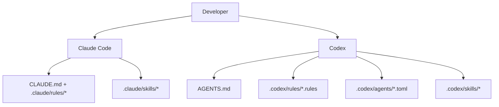
```mermaid
graph TD
    USER["Developer"]
    CLAUDE["Claude Code"]
    CODEX["Codex"]
    MEMORY["CLAUDE.md + .claude/rules/*"]
    C_SKILLS[".claude/skills/*"]
    AGENTS_MD["AGENTS.md"]
    X_RULES[".codex/rules/*.rules"]
    X_AGENTS[".codex/agents/*.toml"]
    X_SKILLS[".codex/skills/*"]

    USER --> CLAUDE
    USER --> CODEX
    CLAUDE --> MEMORY
    CLAUDE --> C_SKILLS
    CODEX --> AGENTS_MD
    CODEX --> X_RULES
    CODEX --> X_AGENTS
    CODEX --> X_SKILLS
```

### Lớp Claude Code

- Bối cảnh liên tục:
  - [`CLAUDE.md`](./CLAUDE.md)
- Quy tắc trong phạm vi đường dẫn:
  - [`.claude/rules/backend-node.md`](./.claude/rules/backend-node.md)
  - [`.claude/rules/frontend-react.md`](./.claude/rules/frontend-react.md)
  - [`.claude/rules/mcp-typescript.md`](./.claude/rules/mcp-typescript.md)
  - [`.claude/rules/docs-markdown.md`](./.claude/rules/docs-markdown.md)
  - [`.claude/rules/file-headers.md`](./.claude/rules/file-headers.md)
  - [`.claude/rules/wiki-i18n.md`](./.claude/rules/wiki-i18n.md)
  - [`.claude/rules/i18n-parity.md`](./.claude/rules/i18n-parity.md)
- Kỹ năng:
  - `repo-onboarding`
  - `ship-feature`
  - `version-release`
  - `mcp-operations`
  - `debug-live-issue`
  - `update-project-docs`
  - `file-headers`
  - `push-to-forked-pr`
  - `i18n-parity`
- Chất phụ:
  - `backend-reviewer`
  - `frontend-reviewer`
  - `mcp-reviewer`

### Lớp Codex

- Bối cảnh liên tục:
  - [`AGENTS.md`](./AGENTS.md)
- Chính sách thực hiện:
  - [`.codex/rules/default.rules`](./.codex/rules/default.rules)
- Mẫu đại diện phụ tùy chỉnh:
  - [`.codex/agents/`](./.codex/agents)
- Kỹ năng:
  - [`.codex/skills/`](./.codex/skills)
- Cài đặt:
  - [`.codex/README.md`](./.codex/README.md)

---

## Tích hợp MCP

Dự án này bao gồm một máy chủ MCP cấp sản xuất cục bộ tại `mcp/` hiển thị các hoạt động trên bảng điều khiển dưới dạng công cụ cho các tác nhân AI. Nó hỗ trợ ba chế độ vận chuyển để phù hợp với các kịch bản tích hợp khác nhau.

### Chế độ vận chuyển MCP

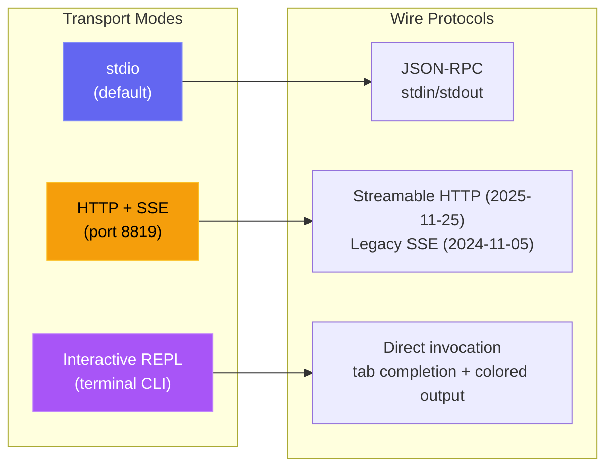
```mermaid
flowchart LR
    subgraph Transports["Transport Modes"]
        STDIO["stdio\n(default)"]
        HTTP["HTTP + SSE\n(port 8819)"]
        REPL["Interactive REPL\n(terminal CLI)"]
    end

    subgraph Protocols["Wire Protocols"]
        P1["JSON-RPC\nstdin/stdout"]
        P2["Streamable HTTP (2025-11-25)\nLegacy SSE (2024-11-05)"]
        P3["Direct invocation\ntab completion + colored output"]
    end

    STDIO --> P1
    HTTP --> P2
    REPL --> P3

    style STDIO fill:#6366f1,stroke:#818cf8,color:#fff
    style HTTP fill:#f59e0b,stroke:#fbbf24,color:#000
    style REPL fill:#a855f7,stroke:#c084fc,color:#fff
```

| Cách thức | Yêu cầu | Trường hợp sử dụng |
| --- | --- | --- |
| **stdio** | `npm run mcp:start` | Claude Code, Claude Desktop, máy chủ IDE MCP |
| **HTTP** | `npm run mcp:start:http` | Máy khách MCP từ xa, tích hợp web, nhiều phiên |
| **REPL** | `npm run mcp:start:repl` | Gỡ lỗi hoạt động, gọi công cụ thủ công, quản trị viên cục bộ |

<p align="center">
  <a href="images/mcp.png">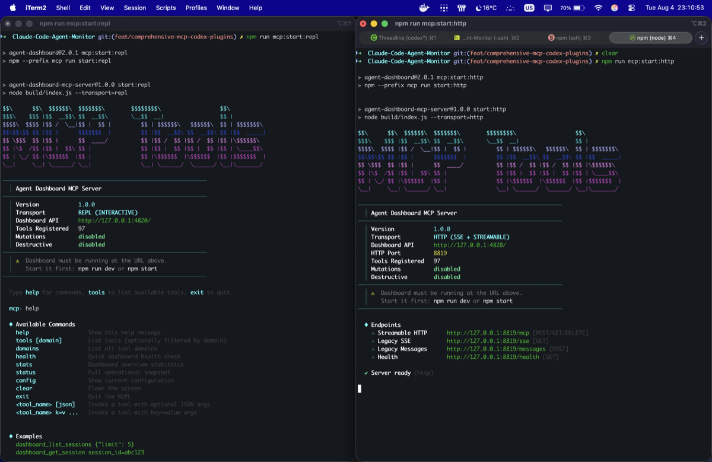</a>
</p>

### Kiến trúc MCP

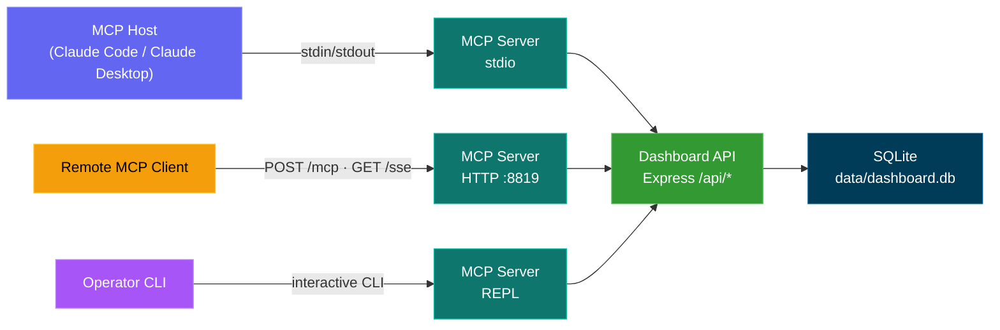
```mermaid
graph LR
    HOST["MCP Host<br/>(Claude Code / Claude Desktop)"]
    HTTP_CLIENT["Remote MCP Client"]
    OPERATOR["Operator CLI"]

    MCP_STDIO["MCP Server<br/>stdio"]
    MCP_HTTP["MCP Server<br/>HTTP :8819"]
    MCP_REPL["MCP Server<br/>REPL"]

    API["Dashboard API<br/>Express /api/*"]
    DB["SQLite<br/>data/dashboard.db"]

    HOST -->|"stdin/stdout"| MCP_STDIO
    HTTP_CLIENT -->|"POST /mcp · GET /sse"| MCP_HTTP
    OPERATOR -->|"interactive CLI"| MCP_REPL

    MCP_STDIO --> API
    MCP_HTTP --> API
    MCP_REPL --> API
    API --> DB

    style HOST fill:#6366f1,stroke:#818cf8,color:#fff
    style HTTP_CLIENT fill:#f59e0b,stroke:#fbbf24,color:#000
    style OPERATOR fill:#a855f7,stroke:#c084fc,color:#fff
    style MCP_STDIO fill:#0f766e,stroke:#14b8a6,color:#fff
    style MCP_HTTP fill:#0f766e,stroke:#14b8a6,color:#fff
    style MCP_REPL fill:#0f766e,stroke:#14b8a6,color:#fff
    style API fill:#339933,stroke:#5cb85c,color:#fff
    style DB fill:#003B57,stroke:#005f8a,color:#fff
```

### Bề mặt công cụ MCP

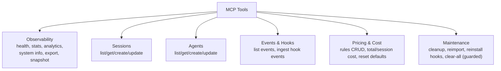
```mermaid
graph TD
    ROOT["MCP Tools"]
    OBS["Observability<br/>health, stats, analytics,<br/>system info, export, snapshot"]
    SES["Sessions<br/>list/get/create/update"]
    AGT["Agents<br/>list/get/create/update"]
    EVT["Events & Hooks<br/>list events, ingest hook events"]
    PRC["Pricing & Cost<br/>rules CRUD, total/session cost, reset defaults"]
    MNT["Maintenance<br/>cleanup, reimport, reinstall hooks, clear-all (guarded)"]

    ROOT --> OBS
    ROOT --> SES
    ROOT --> AGT
    ROOT --> EVT
    ROOT --> PRC
    ROOT --> MNT
```

### Mô hình An toàn MCP

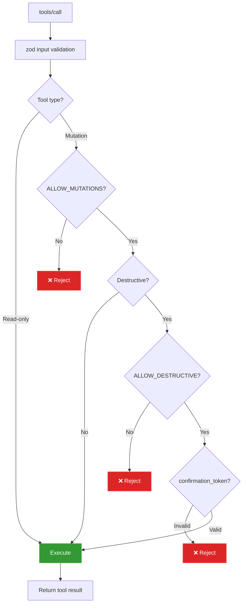
```mermaid
flowchart TD
    CALL["tools/call"] --> VALIDATE["zod input validation"]
    VALIDATE --> TYPE{"Tool type?"}
    TYPE -->|Read-only| EXEC["Execute"]
    TYPE -->|Mutation| M_FLAG{"ALLOW_MUTATIONS?"}
    M_FLAG -->|No| DENY1["❌ Reject"]
    M_FLAG -->|Yes| DEST{"Destructive?"}
    DEST -->|No| EXEC
    DEST -->|Yes| D_FLAG{"ALLOW_DESTRUCTIVE?"}
    D_FLAG -->|No| DENY2["❌ Reject"]
    D_FLAG -->|Yes| TOKEN{"confirmation_token?"}
    TOKEN -->|Invalid| DENY3["❌ Reject"]
    TOKEN -->|Valid| EXEC
    EXEC --> RESULT["Return tool result"]

    style EXEC fill:#339933,stroke:#5cb85c,color:#fff
    style DENY1 fill:#dc2626,stroke:#f87171,color:#fff
    style DENY2 fill:#dc2626,stroke:#f87171,color:#fff
    style DENY3 fill:#dc2626,stroke:#f87171,color:#fff
```

### Chế độ hoạt động MCP

- Chế độ chỉ đọc (mặc định): `MCP_DASHBOARD_ALLOW_MUTATIONS=false`
- Chế độ quản trị viên: `MCP_DASHBOARD_ALLOW_MUTATIONS=true`
- Xác thực: `MCP_DASHBOARD_API_TOKEN` / `_FILE` phải khớp dashboard token; `MCP_HTTP_AUTH_TOKEN` / `_FILE` bảo vệ HTTP/SSE clients
- Bảo vệ truyền tải: HTTP loopback trực tiếp có thể mang token; alias host container phải dùng HTTPS; mọi redirect bị từ chối
- Bảo vệ payload: 50 MiB mỗi tệp upload lịch sử, 100 MiB tổng mỗi lần gọi, 10 MiB phản hồi nhị phân và 25 MiB khôi phục backup
- Chế độ hủy diệt: yêu cầu cả hai:
  - `MCP_DASHBOARD_ALLOW_MUTATIONS=true`
  - `MCP_DASHBOARD_ALLOW_DESTRUCTIVE=true`
  - đầu vào công cụ `confirmation_token: "CLEAR_ALL_DATA"`

Chi tiết đầy đủ: [mcp/README.md](./mcp/README.md)

---

## Tham chiếu API

Tất cả các điểm cuối đều trả về JSON. Phản hồi lỗi có dạng `{ error: { code, message } }`.

### OpenAPI / Swagger / ReDoc

| Phương pháp | Con đường                | Sự miêu tả                         |
| ------ | ------------------- | ----------------------------------- |
| `GET`  | `/api/openapi.json` | Thông số OpenAPI 3.0 thô                |
| `GET`  | `/api/docs`         | Tài liệu giao diện người dùng Swagger tương tác |
| `GET`  | `/api/redoc`        | Tài liệu tham chiếu ReDoc (tài liệu API ba khung được tối ưu cho việc đọc). **Tự lưu trữ**: gói được phân phối cục bộ từ `/api/redoc/redoc.standalone.js`, không dùng CDN, hoạt động ngoại tuyến |
| `GET`  | `/api/redoc/redoc.standalone.js` | Gói ReDoc tự lưu trữ, được backend phục vụ cục bộ để dùng ngoại tuyến mà không cần CDN |

Tài liệu OpenAPI được tạo từ `server/openapi.js` và giao diện người dùng Swagger được phân phối trực tiếp bởi chương trình phụ trợ.

Tệp `openapi.yaml` cũng được commit ở thư mục gốc của kho lưu trữ, phản chiếu thông số trực tiếp và được tạo lại qua `npm run openapi:yaml` (nguồn chính thức là `server/openapi.js`; không bao giờ chỉnh sửa thủ công).

Tài liệu API hiện đã **đầy đủ**: mọi route phụ trợ đều được ghi tài liệu (82 mục đường dẫn) kèm tham số, schema, mô tả trường và ví dụ; các nhóm mới được ghi tài liệu gồm `/api/push`, `/api/cc-config`, `/api/run`, `/api/workflows/runs`, `/api/sessions/facets` và `/api/settings/claude-home`.

<p align="center">
  <a href="images/swagger.png">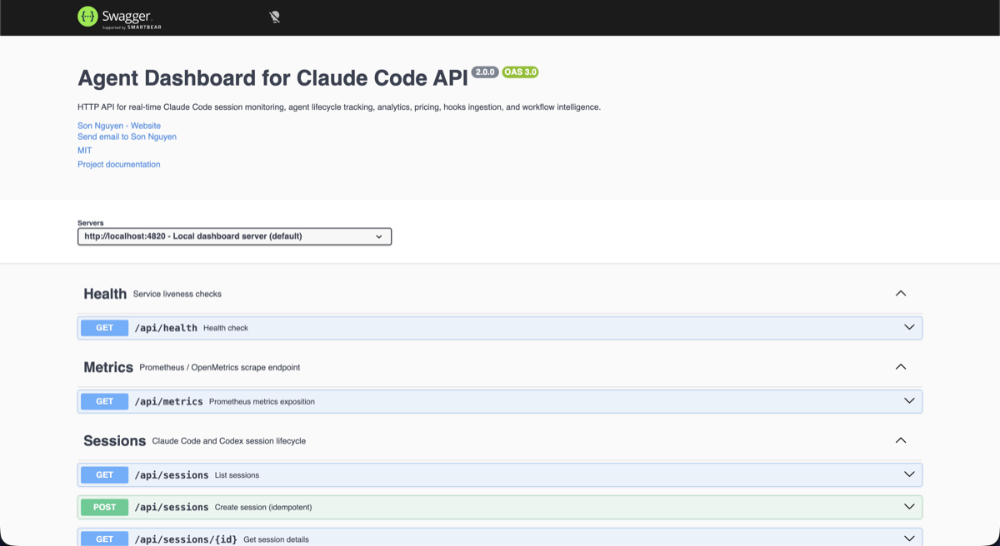</a>
</p>

<p align="center">
  <a href="images/redoc.png">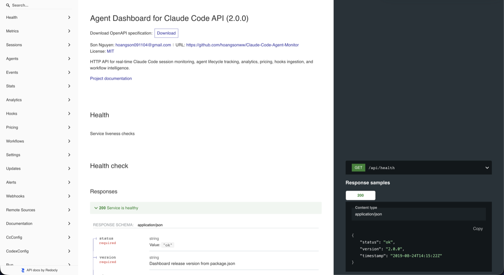</a>
</p>

### Sức khỏe

| Phương pháp | Con đường          | Sự miêu tả                           |
| ------ | ------------- | ------------------------------------- |
| `GET`  | `/api/health` | Trả về `{ status: "ok", timestamp }` |

### Phiên

| Phương pháp  | Con đường                            | Thông số truy vấn                                                | Sự miêu tả                                                                                              |
| ------- | -------------------------------- | ---------------------------------------------------------------- | ------------------------------------------------------------------------------------------------------- |
| `GET`   | `/api/sessions`                  | `status`, `q`, `limit`, `offset`                                 | Liệt kê phiên kèm số lượng Agent và chi phí mỗi phiên. `q` tìm không phân biệt hoa thường trên `id` / `name` / `cwd`; `limit` mặc định 50, tối đa 10000; phản hồi gồm `total` cho bộ phân trang |
| `GET`   | `/api/sessions/:id`              | --                                                               | Chi tiết phiên với các Agent và sự kiện                                                                 |
| `GET`   | `/api/sessions/:id/stats`        | --                                                               | Số liệu tổng hợp cấp phiên cho bảng tổng quan: sự kiện, sự kiện theo loại, top công cụ, số lỗi, số đếm tác nhân theo loại/trạng thái, phân tích loại subagent, tổng token, khoảng thời gian |
| `GET`   | `/api/sessions/:id/transcripts`  | --                                                               | Danh sách bản ghi JSONL có sẵn cho phiên (chính + subagent + nén)                                       |
| `GET`   | `/api/sessions/:id/transcript`   | `agent_id`, `limit`, `offset`, `after`, `before`                 | Phát các tin nhắn từ một bản ghi cụ thể với phân trang theo con trỏ                                     |
| `POST`  | `/api/sessions`                  | --                                                               | Tạo phiên (idempotent trên `id`)                                                                        |
| `PATCH` | `/api/sessions/:id`              | --                                                               | Cập nhật trạng thái/siêu dữ liệu phiên                                                                  |

### Agents

| Phương pháp  | Con đường              | Thông số truy vấn                              | Sự miêu tả                   |
| ------- | ----------------- | ----------------------------------------- | ----------------------------- |
| `GET`   | `/api/agents`     | `status`, `session_id`, `limit`, `offset` | Liệt kê các Agent có bộ lọc      |
| `GET`   | `/api/agents/:id` | --                                        | Chi tiết Agent duy nhất           |
| `POST`  | `/api/agents`     | --                                        | Tạo Agent                  |
| `PATCH` | `/api/agents/:id` | --                                        | Cập nhật trạng thái/nhiệm vụ/công cụ của Agent |

### Sự kiện

| Phương pháp | Con đường          | Thông số truy vấn                    | Sự miêu tả                |
| ------ | ------------- | ------------------------------- | -------------------------- |
| `GET`  | `/api/events` | `session_id`, `limit`, `offset` | Liệt kê các sự kiện (mới nhất trước) |

### Thống kê

| Phương pháp | Con đường         | Sự miêu tả                                            |
| ------ | ------------ | ------------------------------------------------------ |
| `GET`  | `/api/stats` | Số lượng tổng hợp, phân phối trạng thái, kết nối WS |

### Phân tích

| Phương pháp | Con đường             | Sự miêu tả                                                |
| ------ | ---------------- | ---------------------------------------------------------- |
| `GET`  | `/api/analytics` | Tổng hợp mã thông báo/công cụ/phiên cho biểu đồ và chế độ xem xu hướng   |

### Nguồn dữ liệu từ xa

| Phương pháp | Con đường                        | Sự miêu tả                                                  |
| -------- | -------------------------------- | ---------------------------------------------------------- |
| `GET`    | `/api/remote-sources`            | Liệt kê các nguồn dữ liệu từ xa đã cấu hình                |
| `POST`   | `/api/remote-sources`            | Thêm một nguồn từ xa mới                                    |
| `PATCH`  | `/api/remote-sources/:id`        | Cập nhật một nguồn từ xa                                    |
| `DELETE` | `/api/remote-sources/:id`        | Xóa một nguồn từ xa                                         |
| `POST`   | `/api/remote-sources/:id/test`   | Kiểm tra kết nối SSH tới nguồn                              |
| `POST`   | `/api/remote-sources/:id/sync`   | Kích hoạt `scp` + nhập ngay cho nguồn đó                  |

### Hook

| Phương pháp | Con đường               | Sự miêu tả                                  |
| ------ | ------------------ | -------------------------------------------- |
| `POST` | `/api/hooks/event` | Nhận và xử lý sự kiện hook Claude Code |
| `POST` | `/api/hooks/ingest-batch` | Đẩy một batch dữ liệu phiên từ máy roaming/sau NAT (mặc định tắt; xem `REMOTE_PUSH_TOKEN` bên dưới và `server/README.md` để biết cấu trúc payload đầy đủ) |

**Tải trọng sự kiện móc:**

```json
{
  "hook_type": "PreToolUse",
  "data": {
    "session_id": "abc-123",
    "tool_name": "Bash",
    "tool_input": { "command": "ls -la" }
  }
}
```

### Định giá

| Phương pháp   | Con đường                     | Sự miêu tả                              |
| -------- | ------------------------ | ---------------------------------------- |
| `GET`    | `/api/pricing`           | Liệt kê tất cả các quy tắc định giá                   |
| `PUT`    | `/api/pricing`           | Tạo hoặc cập nhật quy tắc đặt giá          |
| `DELETE` | `/api/pricing/:pattern`  | Xóa quy tắc đặt giá                    |
| `GET`    | `/api/pricing/cost`      | Tổng chi phí trên tất cả các phiên           |
| `GET`    | `/api/pricing/cost/:id`  | Phân tích chi phí cho một phiên cụ thể    |

### Quy trình làm việc

| Phương pháp | Con đường                          | Sự miêu tả                                             |
| ------ | ----------------------------- | ------------------------------------------------------- |
| `GET`  | `/api/workflows`              | Dữ liệu quy trình theo provider/source (điều phối, tool đã ghi, mẫu, compaction Codex). Các bộ lọc `?status=active\|completed`, `?sources=...` và `?providers=claude\|codex` áp dụng cho cả 11 phần dữ liệu |
| `GET`  | `/api/workflows/session/:id`  | Drill-in từng phiên theo provider/source (cây agent, dòng thời gian tool đã ghi, sự kiện) |

### Cảnh báo

| Phương thức | Đường dẫn | Mô tả |
| --- | --- | --- |
| `GET` | `/api/alerts` | Luồng cảnh báo đã kích hoạt, mới nhất trước (`?unacked=true`, `limit`, `offset`) |
| `POST` | `/api/alerts/:id/ack` | Xác nhận một cảnh báo |
| `POST` | `/api/alerts/ack-all` | Xác nhận mọi cảnh báo chưa được xác nhận |
| `GET` | `/api/alerts/rules` | Liệt kê quy tắc cảnh báo |
| `POST` | `/api/alerts/rules` | Tạo quy tắc (`event_pattern` \| `inactivity` \| `status_duration` \| `token_threshold`) |
| `PATCH` | `/api/alerts/rules/:id` | Cập nhật tên / cấu hình / trạng thái bật / cooldown (loại quy tắc không thể đổi) |
| `DELETE` | `/api/alerts/rules/:id` | Xóa quy tắc và lịch sử cảnh báo đã kích hoạt của nó |

### Webhook

| Phương thức | Đường dẫn | Mô tả |
| --- | --- | --- |
| `GET` | `/api/webhooks/providers` | Nhà cung cấp được hỗ trợ và trường cấu hình của chúng, dùng để tạo biểu mẫu UI |
| `GET` | `/api/webhooks` | Liệt kê đích webhook, với URL được che và secret được ẩn |
| `POST` | `/api/webhooks` | Tạo đích, gồm 14 nhà cung cấp hạng nhất và `generic` |
| `PATCH` | `/api/webhooks/:id` | Cập nhật tên / URL / trạng thái bật / secret / header / phạm vi quy tắc, loại không thể đổi |
| `DELETE` | `/api/webhooks/:id` | Xóa đích và nhật ký gửi của nó |
| `POST` | `/api/webhooks/:id/test` | Gửi cảnh báo thử tổng hợp và báo kết quả gửi |
| `GET` | `/api/webhooks/:id/deliveries` | Nhật ký gửi gần đây cho một đích (`limit`, `offset`) |

Nhà cung cấp được lưu trữ bắt buộc dùng HTTPS. `generic` và `n8n` có thể dùng HTTP cho bên nhận cục bộ hoặc tự lưu trữ. Quá trình gửi từ chối redirect, nên thông tin xác thực, header tùy chỉnh và chữ ký HMAC không bao giờ được chuyển tiếp tới URL thứ hai.

### Cài đặt

| Phương pháp | Con đường                           | Sự miêu tả                                      |
| ------ | ------------------------------ | ------------------------------------------------ |
| `GET`  | `/api/settings/info`           | Thông tin hệ thống, số liệu thống kê DB, trạng thái hook               |
| `POST` | `/api/settings/clear-data`     | Xóa tất cả các phiên, Agent, sự kiện, sử dụng token |
| `POST` | `/api/settings/reimport`       | Nhập lại các phiên kế thừa từ `~/.claude/`      |
| `POST` | `/api/settings/reinstall-hooks`| Cài đặt lại móc Claude Code                      |
| `POST` | `/api/settings/reset-pricing`  | Đặt lại bảng giá Claude, Codex hoặc cả hai về mặc định |
| `GET`  | `/api/settings/export`         | Xuất tất cả dữ liệu dưới dạng tải xuống JSON                 |
| `POST` | `/api/settings/import`         | Khôi phục một bản xuất tối đa 25 MiB từ `/export` (multipart `file` hoặc JSON `{ path }`). Idempotent + không phá hủy — phiên đã có được bỏ qua toàn bộ |
| `POST` | `/api/settings/cleanup`        | Bỏ các phiên cũ, xóa dữ liệu cũ (và bản sao lưu của các phiên bị xóa) |
| `GET`  | `/api/settings/snapshots`      | Dung lượng bản sao lưu bản ghi theo nhà cung cấp + chính sách lưu giữ |
| `POST` | `/api/settings/snapshots/compress` | Nén không mất dữ liệu các bản sao lưu có bản gốc đã bị xóa |
| `POST` | `/api/settings/snapshots/prune` | Lập kế hoạch (mặc định chạy thử) hoặc thực hiện dọn bản sao lưu; thực hiện cần `confirm: "PRUNE_SNAPSHOTS"` |

### Trình khám phá cấu hình Claude (`/api/cc-config`)

Kiểm tra chỉ đọc mọi bề mặt cấu hình Claude Code, kèm mutation được kiểm soát cẩn thận cho tài nguyên tệp văn bản rủi ro thấp. Khi đọc tệp, máy chủ chuẩn hóa đường dẫn yêu cầu và thư mục gốc được phép để symlink không thể thoát khỏi thư mục Claude đáng tin cậy. Mọi đường ghi tạo bản sao lưu có dấu thời gian trong `<root>/cc-config-backups/<type>/` trước khi thay đổi.

| Phương thức | Đường dẫn | Mô tả |
| --- | --- | --- |
| `GET` | `/api/cc-config/overview` | Thư mục gốc (claude home, project .claude, project root, ~/.claude.json) và số lượng cho mọi bề mặt |
| `GET` | `/api/cc-config/skills` | Skill trong `<scope>/.claude/skills/<name>/SKILL.md` kèm frontmatter đã phân tích; `?scope=user\|project\|all` |
| `GET` | `/api/cc-config/agents` | Subagent trong `<scope>/.claude/agents/*.md` |
| `GET` | `/api/cc-config/commands` | Lệnh slash trong `<scope>/.claude/commands/*.md` |
| `GET` | `/api/cc-config/output-styles` | Output style trong `<scope>/.claude/output-styles/*.md` |
| `GET` | `/api/cc-config/plugins` | Plugin đã cài từ `~/.claude/plugins/installed_plugins.json`, kết hợp `enabledPlugins` từ cài đặt; mỗi mục có `contributes` và metadata `plugin.json` |
| `GET` | `/api/cc-config/marketplaces` | Marketplace từ `known_marketplaces.json`, được bổ sung `marketplace.json` riêng của từng marketplace |
| `GET` | `/api/cc-config/mcp` | Máy chủ MCP từ `~/.claude.json` ở cấp cao nhất và theo dự án, cùng `settings.json` |
| `GET` | `/api/cc-config/hooks` | Hook tổng hợp từ các tệp `settings.json` cấp user / project / project-local |
| `GET` | `/api/cc-config/hook-scripts` | Tệp trong `~/.claude/hooks/` |
| `GET` | `/api/cc-config/keybindings` | `~/.claude/keybindings.json` được phân tích thành cặp phím/hành động nhóm theo ngữ cảnh |
| `PUT` | `/api/cc-config/keybindings` | Ghi đè `keybindings.json` từ `{ groups: [{ context, bindings: [{ key, action }] }] }`; sao lưu trước, giữ metadata cấp cao nhất và từ chối ngữ cảnh/phím trùng |
| `GET` | `/api/cc-config/statusline` | Cấu hình `settings.json.statusLine` cùng nội dung `statusline.py` / `statusline-command.sh` nếu có |
| `GET` | `/api/cc-config/settings` | JSON cài đặt user / project / project-local, với key giống secret được thay bằng `"<redacted>"` |
| `GET` | `/api/cc-config/memory` | Tệp `CLAUDE.md` cấp user + project và memory dựa trên tệp theo từng dự án trong `~/.claude/projects/<slug>/memory/` |
| `GET` | `/api/cc-config/file?path=…` | Nội dung một tệp, với đường dẫn bị giới hạn trong CLAUDE_HOME / project .claude / project CLAUDE.md |
| `GET` | `/api/cc-config/backups` | Liệt kê mọi bản sao lưu có dấu thời gian, có thể lọc bằng `?scope=&type=` |
| `PUT` | `/api/cc-config/file` | Tạo hoặc ghi đè tài nguyên tệp văn bản từ `{ scope, type, name?, content }`; tự sao lưu, ghi atomic, giới hạn 256 KB và kiểm tra nghiêm ngặt `name` |
| `DELETE` | `/api/cc-config/file` | Sao lưu rồi xóa tài nguyên tệp văn bản; toàn bộ thư mục skill được sao lưu trước khi xóa đệ quy |

### Metrics Prometheus & Grafana

`GET /api/metrics` cung cấp metrics văn bản Prometheus cho trạng thái phiên và Agent, sự kiện, token, client thời gian thực, nguồn từ xa, uptime và bộ nhớ tiến trình cùng phiên bản build. [`monitoring/`](./monitoring/README.md) cung cấp Prometheus cùng bốn dashboard Grafana được cấp sẵn tự động, với **CCAM · Overview** làm mặc định.

```bash
# Native dashboard and monitoring
npm start
npm run monitoring:install       # one-time binary setup
npm run monitoring:up            # Grafana on :3000

# Containers
npm run docker:up                 # dashboard only
npm run docker:full:up            # dashboard + Prometheus + Grafana

# Mixed native/container setup
DASHBOARD_ALLOWED_HOSTS=host.docker.internal npm start
npm run monitoring:docker:up
npm run monitoring:verify
```

<p align="center">
  <a href="images/grafana.png">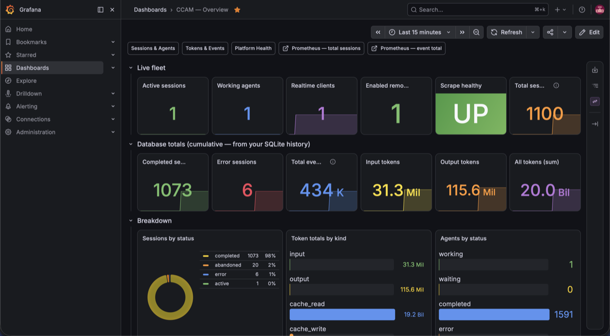</a>
  <br>
  <em>📊 <strong>Grafana · CCAM Overview</strong> · trạng thái toàn bộ Agent, tổng số cơ sở dữ liệu, phân tích và tốc độ từ lần scrape <code>/api/metrics</code> trực tiếp</em>
</p>

<p align="center">
  <a href="images/prometheus-console.png">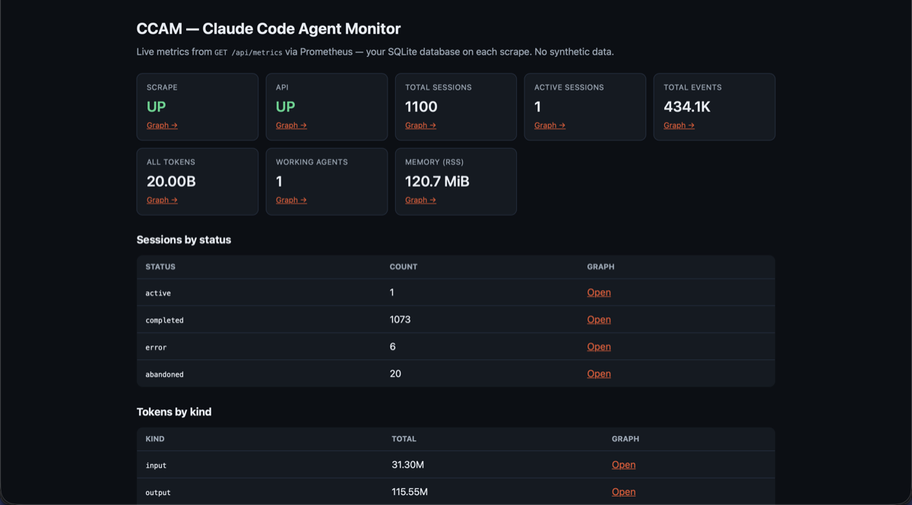</a>
  <br>
  <em>🔥 <strong>Prometheus · CCAM console</strong> · sức khỏe scrape, phiên, sự kiện, token và liên kết drill-down Graph</em>
</p>

<p align="center">
  <a href="images/prometheus-query.png">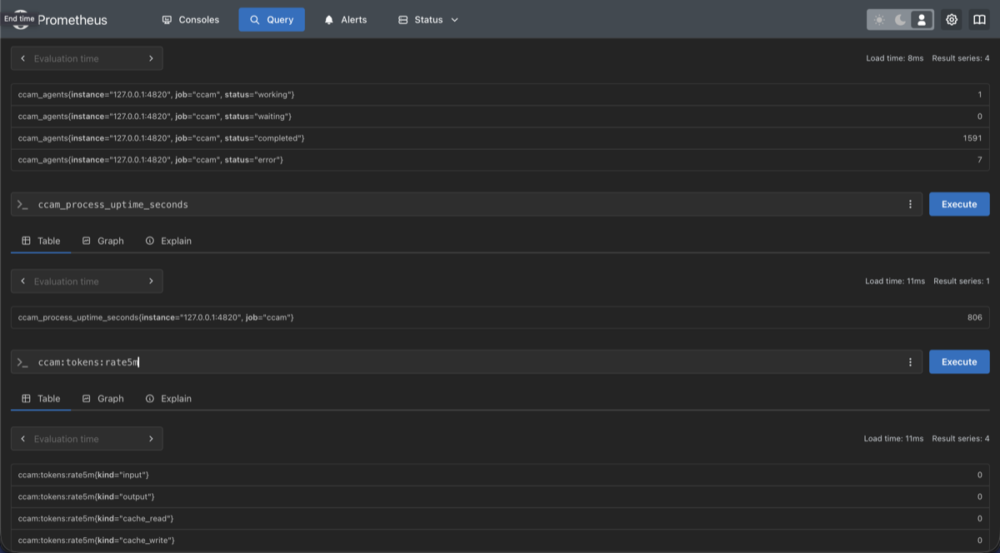</a>
  <br>
  <em>📈 <strong>Prometheus · Graph</strong> · chạy PromQL trên metric CCAM đã scrape từ các liên kết khởi đầu trong console</em>
</p>

Xem [docs/API.md → Metrics](./docs/API.md#metrics) để biết tên metric, xác thực và cấu hình scrape.

### Run Claude (`/api/run`)

Bề mặt HTTP để tạo và giám sát tiến trình con `claude` từ dashboard. Mỗi route có cơ chế bảo vệ same-origin: yêu cầu trình duyệt phải đến từ origin localhost; yêu cầu không có Origin từ CLI/curl được chấp nhận. `cwd` được cung cấp phải là thư mục tuyệt đối đang tồn tại và được chuẩn hóa bằng `realpath`. Nó có thể nằm ngoài kho mã này để Chạy Agent khởi chạy từ thư mục nhà hoặc bất kỳ dự án gần đây nào.

| Phương thức | Đường dẫn | Mô tả |
| --- | --- | --- |
| `GET` | `/api/run` | Liệt kê mọi handle chạy trong bộ nhớ, gồm đang chạy và mới hoàn tất; cũng trả `maxConcurrent` và `activeCount` |
| `GET` | `/api/run/binary` | Kiểm tra `claude` có trên `PATH` và vị trí của nó, để UI báo lỗi rõ ràng trước khi tạo |
| `GET` | `/api/run/cwds` | Thư mục làm việc gợi ý: cwd của máy chủ dashboard, `$HOME` và cwd gần đây từ bảng phiên |
| `GET` | `/api/run/files?cwd=…&q=…` | Tìm tệp fuzzy bên trong `cwd` cho tự hoàn thành tệp `@` của trang Run; bỏ qua `node_modules`, `.git`, `dist`, `build`, `.next`, `.cache`, `coverage`, v.v. |
| `POST` | `/api/run` | Tạo lần chạy mới từ `{ prompt, mode: "headless"\|"conversation", cwd?, model?, permissionMode?, resumeSessionId?, effort? }`. Chế độ headless đặt lời nhắc trong argv qua `-p`; conversation gửi envelope stream-json qua stdin và giữ stdin mở. `resumeSessionId` thêm `--resume <id>`; `effort` ánh xạ tới `--effort`. Luôn dùng `--output-format stream-json --verbose --include-partial-messages`. Đồng thời mặc định có trần 10000 và có thể đổi bằng `RUN_MAX_CONCURRENT` |
| `GET` | `/api/run/:id` | Trạng thái handle hiện tại. `?envelopes=1` bổ sung nhật ký envelope trong bộ nhớ để phát lại khi gắn lại |
| `POST` | `/api/run/:id/message` | Gửi lượt tiếp theo tới hội thoại đang chạy. Body: `{ text }` |
| `DELETE` | `/api/run/:id` | Dừng lần chạy bằng SIGTERM, tăng lên SIGKILL sau 5 s |

Đầu ra truyền qua WebSocket dashboard hiện có bằng ba loại tin nhắn: `run_stream`, `run_status` và `run_input_ack`. Trang Trình khám phá cấu hình đăng ký thêm `cc_config_changed`, do `server/lib/cc-watcher.js` phát qua `fs.watch` trên `~/.claude/` và do `routes/cc-config.js` phát sau mỗi PUT/DELETE thành công. Danh sách Phiên và Chi tiết phiên đánh dấu phiên đang được một Run điều khiển bằng chỉ báo **▶ Run** có thể bấm để quay lại `/run`.

### Nhập lịch sử

**Settings → Import History** nhập transcript Claude Code từ `~/.claude/projects` và rollout Codex từ `~/.codex/sessions` qua quét thư mục hoặc tải lên riêng theo nhà cung cấp. Cả hai tái sử dụng luồng tiếp nhận trực tiếp, giữ token, chi phí, công cụ, baseline compaction, vòng đời và tiêu đề Codex gốc, đồng thời vẫn idempotent. Lịch sử Codex tải lên được sao chép vào vùng lưu trữ dashboard để hội thoại tồn tại sau khi nguồn bị dọn.

**Restore backup** nhận tệp `.json` dashboard đã xuất từ UI, `ccam export` hoặc `GET /api/settings/export`. `POST /api/settings/import` và `ccam import-data <file>` khôi phục mọi bảng mà không ghi đè phiên hiện có, cho phép hợp nhất an toàn từ nhiều máy.

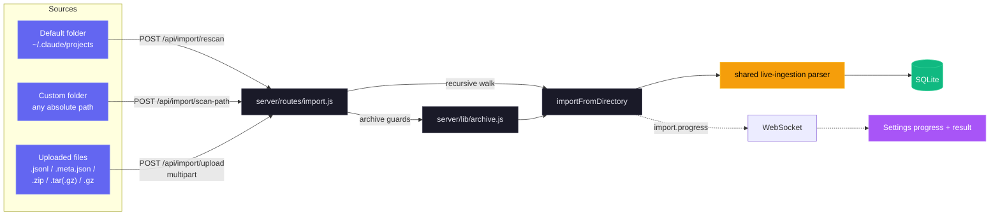
```mermaid
flowchart LR
    subgraph Sources
      A1["Default folder<br/>~/.claude/projects"]
      A2["Custom folder<br/>any absolute path"]
      A3["Uploaded files<br/>.jsonl / .meta.json /<br/>.zip / .tar(.gz) / .gz"]
    end

    A1 -->|POST /api/import/rescan| R["server/routes/import.js"]
    A2 -->|POST /api/import/scan-path| R
    A3 -->|POST /api/import/upload<br/>multipart| R

    R -->|archive guards| X["server/lib/archive.js"]
    R -->|recursive walk| I["importFromDirectory"]
    X --> I
    I --> P["shared live-ingestion parser"]
    P --> D[("SQLite")]
    I -.->|import.progress| W["WebSocket"]
    W -.-> U["Settings progress + result"]

    style A1 fill:#6366f1,stroke:#818cf8,color:#fff
    style A2 fill:#6366f1,stroke:#818cf8,color:#fff
    style A3 fill:#6366f1,stroke:#818cf8,color:#fff
    style R fill:#1a1a28,stroke:#2a2a3d,color:#e4e4ed
    style X fill:#1a1a28,stroke:#2a2a3d,color:#e4e4ed
    style I fill:#1a1a28,stroke:#2a2a3d,color:#e4e4ed
    style P fill:#f59e0b,stroke:#fbbf24,color:#000
    style D fill:#10b981,stroke:#34d399,color:#fff
    style U fill:#a855f7,stroke:#c084fc,color:#fff
```

| Phương thức | Đường dẫn | Mục đích |
| --- | --- | --- |
| `GET` | `/api/import/guide` | Đường dẫn, lệnh archive, phần mở rộng và hướng dẫn theo nhà cung cấp qua `?provider=claude\|codex`. |
| `POST` | `/api/import/rescan` | Quét lại thư mục gốc mặc định đã chọn từ `{ provider }`. |
| `POST` | `/api/import/scan-path` | Quét đệ quy `{ path, provider }` tuyệt đối. |
| `POST` | `/api/import/upload` | Tải tệp hoặc archive được hỗ trợ cùng `provider`. |

- **Đầu vào:** Tệp `.jsonl`, `.meta.json`, `.zip`, `.tar`, `.tar.gz`/`.tgz` và `.gz` rời trong bố cục lồng nhau. Claude hỗ trợ cả hai bố cục Subagent chuẩn; Codex nhận rollout `rollout-*.jsonl` đệ quy hoặc JSONL có `session_meta` cùng tiêu đề `session_index.jsonl` tùy chọn.
- **Độ chính xác:** Khử trùng lặp theo UUID và mức cao nhất của sự kiện ngăn đếm hai lần. Baseline compaction giữ token trước đó; hoạt động mới hơn cập nhật `ended_at` và metadata tin nhắn.
- **Tệp lớn:** Phân tích từng dòng theo chunk 4 MiB dùng chung xử lý transcript vượt giới hạn chuỗi khoảng 512 MiB của V8. Mảng có thể tăng bị giới hạn ở `TRANSCRIPT_CACHE_MAX_ARRAY_LEN`, mặc định `1000`, và được cắt khi đạt hai lần giới hạn trong lúc phân tích.
- **An toàn:** Giải nén từ chối đường dẫn tuyệt đối và `..`. Mặc định giới hạn dữ liệu giải nén ở 4 GB, mỗi lần tải lên ở 1 GB và yêu cầu ở 2000 tệp; staging theo yêu cầu luôn được dọn.
- **Tiến độ:** Các pha WebSocket `import.progress` có throttle gồm `start`, `scan`, `extract`, `parse`, `complete` và `error`. UI cung cấp hướng dẫn kéo-thả cùng tổng số imported, enriched, skipped và error.

### WebSocket

Kết nối với `ws://localhost:4820/ws` để nhận tin nhắn đẩy theo thời gian thực:

```json
{
  "type": "agent_updated",
  "data": { "id": "...", "status": "working", "current_tool": "Edit" },
  "timestamp": "2026-03-05T15:43:01.800Z"
}
```

**Các loại tin nhắn:** `session_created`, `session_updated`, `agent_created`, `agent_updated`, `new_event`, `remote_source.status`

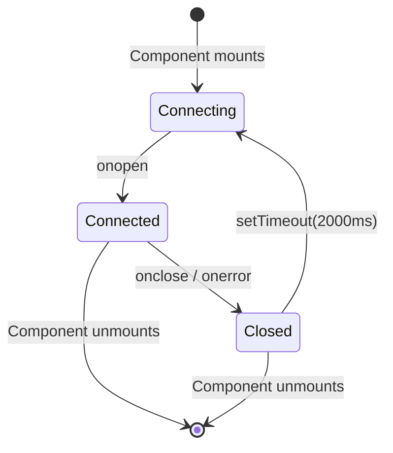
```mermaid
stateDiagram-v2
    [*] --> Connecting: Component mounts
    Connecting --> Connected: onopen
    Connected --> Closed: onclose / onerror
    Closed --> Connecting: setTimeout(2000ms)
    Connected --> [*]: Component unmounts
    Closed --> [*]: Component unmounts
```

---

## Sự kiện móc nối

Bảng điều khiển xử lý các loại hook Claude Code này:

| Loại hook         | Trigger                        | Hành động trên dashboard                                                                             |
| ----------------- | ------------------------------ | --------------------------------------------------------------------------------------------------- |
| `SessionStart`    | Phiên Claude Code bắt đầu      | Tạo phiên và Agent chính. Đóng dấu `awaiting_input_since` (với `awaiting_reason=session_start`) để phiên mới rơi vào **Đang chờ** — trừ SessionStart nguồn `compact` (nén giữa lượt), vốn giữ nguyên cờ để phiên đang chạy vẫn **Hoạt động**. Kích hoạt lại các phiên đã tiếp tục. Bỏ các phiên mồ côi không hoạt động trong `DASHBOARD_STALE_MINUTES` (mặc định 180) |
| `UserPromptSubmit`| Người dùng nhấn enter          | Xóa cờ chờ và đẩy Agent chính sang `working` — tín hiệu duy nhất cho biết các lượt văn bản thuần đã bắt đầu, vì chúng không phát ra `PreToolUse` |
| `PreToolUse`      | Agent bắt đầu sử dụng tool     | Xóa cờ chờ, đặt Agent thành `working`, đặt `current_tool`. Nếu tool là `Agent`, tạo bản ghi Subagent |
| `PostToolUse`     | Tool hoàn tất                  | Xóa cờ chờ (xử lý các phê duyệt prompt xin quyền mà Notification đã đóng dấu giữa lúc tool đang chạy). Xóa `current_tool`. Agent ở lại `working` |
| `Stop`            | Claude trả lời xong            | Không lỗi: Agent chính → `waiting` — Claude xong lượt, đến lượt người dùng. `stop_reason=error`: đánh dấu Agent và phiên `error`. Subagent nền vẫn tiếp tục chạy |
| `SubagentStop`    | Subagent nền đã hoàn tất       | Khớp và hoàn thành Subagent theo mô tả, loại hoặc nhiệm vụ. Cố tình KHÔNG xóa cờ chờ — Subagent xong không nói lên gì về người dùng. **Kích hoạt quét JSONL fire-and-forget** (`scanAndImportSubagents`) phát các sự kiện `PreToolUse` + `PostToolUse` cho từng tool dưới `agent_id` của chính subagent, để Timeline hiển thị đầy đủ tool subagent đã chạy chứ không chỉ marker spawn |
| `Notification`    | Notification Agent             | Ghi sự kiện. Tin nhắn xin quyền/yêu cầu input đặt agent sang `waiting` và đóng dấu `awaiting_input_since` (với `awaiting_reason=notification`, mẫu: `permission`, `waiting for input`, `needs your approval`, …). Notification liên quan đến nén được gắn thẻ `Compaction`. Kích hoạt notification trình duyệt nếu được bật |
| `SessionEnd`      | CLI Claude Code thoát          | Xóa cờ chờ. Nếu phiên đang ở trạng thái `error`, trạng thái lỗi được giữ nguyên; ngược lại đánh dấu tất cả Agent + phiên là `completed` |
| `Compaction`   | `/compact` được phát hiện trong JSONL   | Tạo một tác nhân phụ nén (loại `compaction`) và sự kiện Nén. Được phát hiện qua các mục `isCompactSummary` trong bản ghi JSONL. Cũng được phát hiện bởi máy quét định kỳ cho các phiên hoạt động |
| `APIError`     | Lỗi API trong bản ghi JSONL  | Được trích xuất từ các mục nhập `isApiErrorMessage` (hạn ngạch, giới hạn tỷ lệ, yêu cầu không hợp lệ) và phản hồi thô `type: "error"`. **Ngay lập tức đánh dấu phiên và agent là `error`** — trước đây chỉ ghi nhận sự kiện mà không thay đổi trạng thái. Được lưu trữ dưới dạng sự kiện với chi tiết lỗi |
| `TurnDuration` | Xoay thời gian trong bảng điểm JSONL| Trích xuất từ ​​​​các tin nhắn `system` kiểu con `turn_duration` có `durationMs`. Được lưu trữ dưới dạng sự kiện để phân tích thời gian theo cấp độ |
| `ToolError`    | Lỗi kết quả công cụ trong JSONL     | Trích xuất từ ​​​​các mục `toolUseResult.is_error`. Theo dõi lỗi cấp công cụ để phân tích lan truyền lỗi |
| `RemoteToolEvent` | Tool call do một máy từ xa đẩy lên | Được `POST /api/hooks/ingest-batch` ghi cho mỗi mục `tool_events[]` mà một máy roaming/sau NAT đẩy lên. Khử trùng lặp theo `(session_id, event_type, uuid)` với cả hàng đã commit lẫn trong cùng batch, nên gửi lại batch là an toàn |
| `RemoteTurn` | Thời lượng lượt do một máy từ xa đẩy lên | Được `POST /api/hooks/ingest-batch` ghi cho mỗi mục `turns[]`, mang theo `duration_ms` của lượt đó. Khử trùng lặp giống `RemoteToolEvent` |
| `Interrupted`  | Lượt bị người dùng hủy (Esc) | Được tổng hợp bởi watchdog — `Esc` không kích hoạt hook nào, nên một phiên kẹt ở `working` được phát hiện từ dấu `[Request interrupted by user]` trong transcript hoặc, khi Esc xảy ra trước khi có bất kỳ output nào, từ idle-working timeout (`DASHBOARD_WORKING_IDLE_SECONDS`). Phiên chuyển sang **Đang chờ** (giống như một `Stop` bình thường) |

---

## Thông báo trình duyệt

Bảng điều khiển hỗ trợ thông báo trình duyệt liên tục thông qua Web Push (VAPID) để cảnh báo theo thời gian thực ngay cả khi tab bảng điều khiển không được tập trung hoặc trình duyệt đang ở chế độ nền.

### Nó hoạt động như thế nào

1. **Bật** thông báo trong trang Cài đặt thông qua nút chuyển đổi chính
2. **Cấp** quyền cho trình duyệt khi được nhắc — điều này sẽ đăng ký một Service Worker và tạo một đăng ký đẩy
3. **Định cấu hình** sự kiện nào kích hoạt thông báo:

| Sự kiện                        | Mặc định | Sự miêu tả                                                     |
| ---------------------------- | ------- | --------------------------------------------------------------- |
| Phiên mới bắt đầu           | Bật      | Kích hoạt khi phiên Claude Code mới được tạo                 |
| Claude trả lời xong   | Tắt     | Kích hoạt các sự kiện `Stop` khi Claude kết thúc lượt phản hồi     |
| Phiên đã đóng               | Tắt     | Kích hoạt `SessionEnd` khi quá trình CLI thoát                |
| Lỗi phiên               | Bật      | Kích hoạt khi phiên kết thúc có lỗi                         |
| Subagent sinh ra             | Tắt     | Kích hoạt khi tác nhân phụ nền được tạo                     |

Ngoài ra, bất kỳ sự kiện hook `Notification` nào từ Claude Code đều kích hoạt thông báo trình duyệt bất kể nút chuyển đổi cho mỗi sự kiện (miễn là nút chuyển đổi chính được bật).

### Kiến trúc thông báo

- **Hệ thống VAPID:** Sử dụng `web-push` trên máy chủ để phân phối tin nhắn an toàn. Các khóa VAPID được tạo tự động và lưu trữ trong `data/vapid-keys.json`.
- **Service Worker:** Một worker chuyên dụng (`client/public/sw.js`) xử lý các sự kiện `push` đến và hiển thị thông báo với `silent: false` để đảm bảo phát lại âm thanh trên macOS.
- **Đăng ký:** Các điểm cuối dành riêng cho trình duyệt được lưu trữ trong bảng `push_subscriptions` trong SQLite.
- **Tính liên tục:** Thông báo vẫn đến ngay cả khi trình duyệt đã đóng, vì Service Worker hoạt động ở chế độ nền.
- **Thông báo kiểm tra:** Nút trong Cài đặt cho phép bạn xác minh hệ thống VAPID và phát lại âm thanh.

### PWA & hỗ trợ ngoại tuyến

Dashboard, trang chủ và Wiki là ba PWA có thể cài đặt riêng biệt với manifest và service worker độc lập.

| Bề mặt | Manifest | Service Worker | Chiến lược cache |
| --- | --- | --- | --- |
| Dashboard (`client/`) | `client/public/manifest.json` | `client/public/sw.js` | `/assets/*` bất biến dùng cache-first; điều hướng, worker, manifest, icon và `/` dùng network-first với fallback. `/api/*`, `/ws` và Vite HMR không bao giờ được cache; trình xử lý push vẫn hoạt động. Express gửi header bất biến một năm cho tài nguyên và header revalidation cho tệp shell. `controllerchange` tải lại một lần khi nâng cấp, không bao giờ ở lần cài đầu. |
| Trang chủ (root) | `manifest.json` | `sw.js` | Precache shell, favicon và ảnh OG. Ảnh chụp màn hình được cache ở lần xem đầu; điều hướng dùng network-first với fallback ngoại tuyến. |
| Wiki (`wiki/`) | `wiki/manifest.json` | `wiki/sw.js` | Precache HTML, CSS, JS, manifest và favicon. HTML giữ network-first; CSS và JS dùng cache-first, cho phép dùng ngoại tuyến sau một lần truy cập. |

Mọi worker gọi `skipWaiting()`, xóa cache phiên bản cũ khi kích hoạt và làm mới sạch khi phiên bản cache thay đổi. Mỗi tệp HTML có metadata standalone cho iOS; manifest và Apple touch icon dùng `favicon.svg` với `sizes="any"`.

---

## Thông báo cập nhật

Bảng điều khiển tự giám sát git checkout của chính nó và hiện một modal bất cứ khi nào nhánh mặc định chuẩn có commit mới đi trước HEAD. **Nhận biết nhánh và fork:** nếu có remote `upstream` (quy ước chuẩn cho fork), nó được ưu tiên hơn `origin`; `master`/`main`/`HEAD` của remote được chọn chính là ref so sánh. `manual_command` tự điều chỉnh theo tình huống — chỉ dùng `git pull --ff-only` khi nhánh cục bộ thực sự theo dõi ref chuẩn, ngược lại dùng `git fetch` (kèm fast-forward merge ở trường hợp fork), để lệnh không bao giờ nói dối. Người dùng nhận được lệnh chính xác để chạy trong terminal — máy chủ **không bao giờ** tự pull hoặc khởi động lại, giữ cho cơ chế này có thể chạy đồng nhất giữa các phiên dev, tiến trình được quản lý bởi pm2/systemd/launchd/Docker, và các triển khai từ xa.

<p align="center">
  <a href="images/update.png">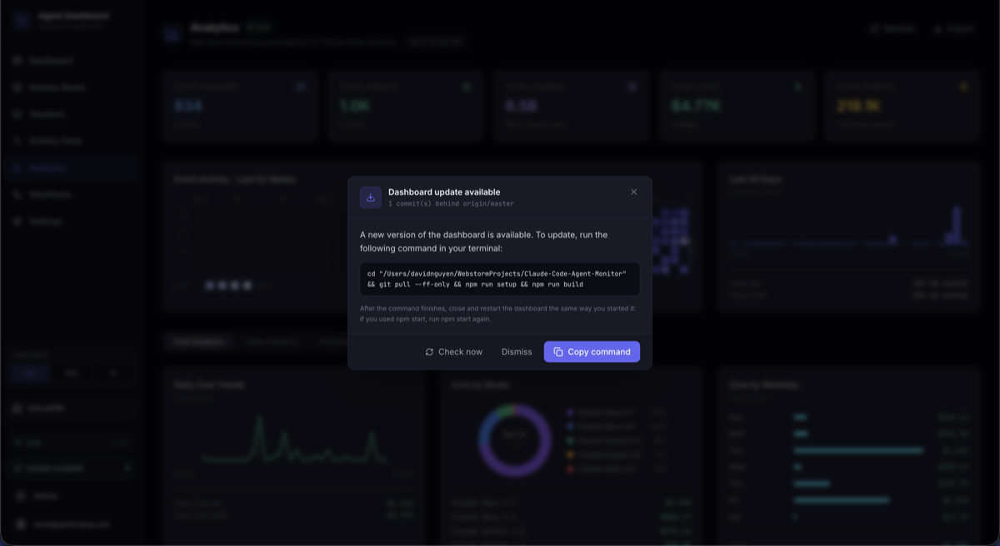</a>
</p>

### Cách hoạt động

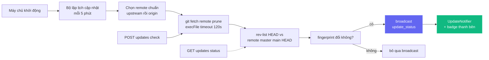
```mermaid
flowchart LR
    S["Máy chủ khởi động"] --> SCHED["Bộ lập lịch cập nhật<br/>mỗi 5 phút"]
    SCHED --> PICK["Chọn remote chuẩn<br/>upstream rồi origin"]
    PICK --> FETCH["git fetch remote prune<br/>execFile timeout 120s"]
    FETCH --> CMP["rev-list HEAD vs<br/>remote master main HEAD"]
    CMP --> FP["fingerprint đổi không?"]
    FP -->|có| WS["broadcast<br/>update_status"]
    FP -->|không| IDLE["bỏ qua broadcast"]
    WS --> CLIENT["UpdateNotifier<br/>+ badge thanh bên"]

    CHECK["POST updates check"] --> FETCH
    STATUS["GET updates status"] -.-> CMP

    style WS fill:#6366f1,stroke:#818cf8,color:#fff
    style CLIENT fill:#10b981,stroke:#34d399,color:#fff
```

Mỗi lần kiểm tra đều rẻ (`git fetch <remote> --prune` với remote chuẩn — `upstream` nếu có, ngược lại `origin`), gói trong `execFile` (không qua shell) và có timeout 120 giây. Các trường hợp lỗi — mất mạng, cài đặt không phải git, không có remote nào, không phân giải được ref upstream — đều trả về **payload mềm** (ví dụ `fetch_error: "..."`) thay vì ném lỗi, nên một remote không ổn định sẽ không bao giờ làm nghẽn bảng điều khiển.

### Điểm hiển thị trong UI

| Bề mặt | Hành vi |
| --- | --- |
| **Modal** (`client/src/components/UpdateNotifier.tsx`) | Mở khi có `remote_sha` mới; hiển thị số commit chậm hơn, ref được theo dõi, ghi chú nhánh/fork tùy chọn, lệnh chính xác và các nút **Copy command**, **Check now**, **Dismiss**. Escape hoặc bấm nền sẽ đóng. Trạng thái bỏ qua được khóa trong `localStorage`, nên SHA mới hơn sẽ mở lại. |
| **Nút thanh bên** (`client/src/components/Sidebar.tsx`) | Luôn hiển thị. Màu xanh lá nghĩa là chậm hơn; màu hổ phách nghĩa là fetch thất bại. Bấm sẽ xóa trạng thái bỏ qua và gọi `POST /api/updates/check`. |
| **Terminal máy chủ** | In lệnh có khung khi trạng thái chuyển từ mới nhất sang chậm hơn, kể cả cho người dùng headless. |

### Giao diện API

| Endpoint | Mục đích |
| --- | --- |
| `GET /api/updates/status` | Kiểm tra chỉ đọc: chạy `git fetch` đối với remote chuẩn, so sánh HEAD với nhánh mặc định của remote đó, trả về payload. |
| `POST /api/updates/check` | Cùng một kiểm tra, nhưng đồng thời broadcast `update_status` qua WebSocket để mọi client đang kết nối cập nhật một lượt. |

Cả hai endpoint trả về cùng một payload:

```json
{
  "git_repo": true,
  "update_available": true,
  "repo_root": "/Users/you/Claude-Code-Agent-Monitor",
  "remote_ref": "upstream/master",
  "canonical_remote": "upstream",
  "current_branch": "master",
  "tracking_upstream": "origin/master",
  "tracks_canonical": false,
  "situation": "fork_or_diverged_tracking",
  "local_sha": "abc1234...",
  "remote_sha": "def5678...",
  "commits_behind": 3,
  "manual_command": "cd \"/...\" && git fetch upstream && git merge --ff-only upstream/master && npm run setup",
  "situation_note": "You're on 'master' tracking 'origin/master'. This command fast-forwards your branch from upstream/master (the canonical default).",
  "message": "3 commit(s) on upstream/master not in your checkout."
}
```

`situation` nhận một trong: `tracking_canonical` (clone thông thường, nhánh cục bộ theo dõi ref chuẩn — `git pull --ff-only` là đủ); `fork_or_diverged_tracking` (tên nhánh cục bộ trùng với chuẩn nhưng theo dõi remote khác, ví dụ fork — `git fetch <remote> && git merge --ff-only <ref>`); `feature_branch` (không ở trên nhánh mặc định — chỉ fetch, để người dùng quyết định cách hợp nhất); `detached_head`.

### Vì sao **không** có tự cập nhật

Không có `POST /api/updates/apply` và cũng không có script tự khởi động lại — đây là lựa chọn thiết kế. Việc để một tiến trình tự thay thế chính nó mà không có trình giám sát bên ngoài là không đáng tin cậy: `npm run dev` (concurrently), `npm start`, `pm2`, `systemd`, `launchd`, Docker đều cần logic khởi động lại khác nhau, và lỗi `git pull` / `npm install` trên một tiến trình đang thoát không có đường rollback sạch sẽ. Chỉ phát hiện thôi giúp hành vi có thể dự đoán được trên mọi trình giám sát, mọi hệ điều hành, mọi trạng thái nhánh, đồng thời vẫn lấp đầy khoảng trống thông tin "khi nào thì mình cần pull?"; thao tác cập nhật thực sự do người dùng tự thực hiện trong shell của mình.

### Cấu hình

| Biến môi trường | Mặc định | Ghi chú |
| --- | --- | --- |
| `DASHBOARD_UPDATE_CHECK` | bật | Đặt `0` / `false` / `off` để tắt hoàn toàn bộ lập lịch. |
| `DASHBOARD_UPDATE_CHECK_INTERVAL_MS` | `300000` (5 phút) | Khoảng thời gian giữa các lần kiểm tra tự động. Sàn là 60 000 ms — giá trị thấp hơn sẽ bị kẹp. |

---

## Tabby, mèo đồng hành nổi

**Tabby** là chú mèo đồng hành nổi dễ thương được ghim ở góc dưới bên phải của mọi trang trong dashboard. Luôn hiện diện, Tabby biến luồng phiên trực tiếp thành một linh vật phản ứng có thể nhìn nhanh và trò chuyện.

<p align="center">
  <a href="images/tabby.png">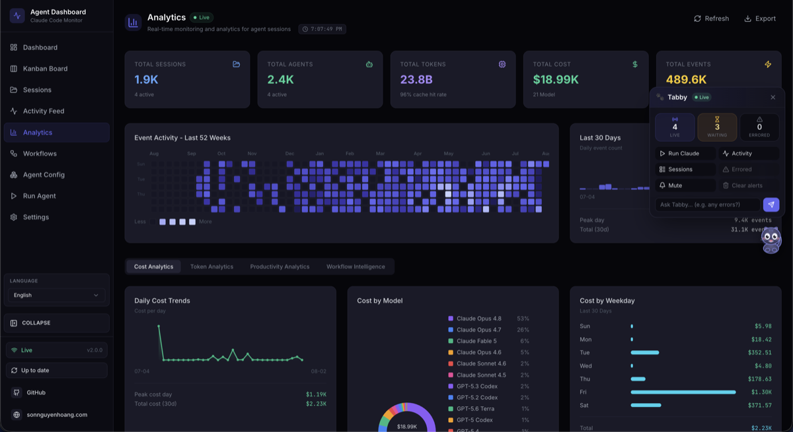</a>
</p>

### Linh vật phản ứng

Tabby là mèo SVG dõi theo con trỏ với **tám tâm trạng** lấy từ luồng phiên trực tiếp, mỗi trạng thái có hoạt ảnh riêng:

| Tâm trạng | Khi nào | Hoạt ảnh |
| --- | --- | --- |
| `idle` | Không có gì đáng chú ý | Đuôi khẽ ve vẩy khi nghỉ |
| `watching` | Có phiên đang hoạt động | Tai dựng lên, mắt dõi theo con trỏ |
| `happy` | Phiên hoặc lần chạy hoàn tất sạch | Gật đầu và lấp lánh |
| `worried` | Có điều bất thường | Rung nhẹ |
| `stuck` | Phiên có vẻ bị chặn | Cảnh báo "!" |
| `thinking` | Agent đang làm việc | Gật đầu chậm |
| `sleeping` | Im lặng một lúc | `zzz` |
| `disconnected` | WebSocket bị ngắt | Tư thế bình tĩnh, đứng yên |

### Bong bóng lời thoại

Tabby tự động hiển thị câu ngắn cho sự kiện đáng chú ý như phiên bắt đầu/hoàn tất, lỗi hoặc lần chạy hoàn tất. Bong bóng được **throttle và hợp nhất** để một loạt sự kiện không làm ngập màn hình, dùng `aria-live` cho trình đọc màn hình và có thể **tắt tiếng** từ bảng điều khiển.

### Bảng điều khiển

Mở bảng bằng cách bấm chú mèo hoặc nhấn **⌘B / Ctrl+B** (Esc để đóng). Bảng hiển thị:

- **Dòng trạng thái** trực tiếp: `N live · M errored · connection state`.
- **Hành động nhanh**: chuyển tới Run Claude, Activity, Sessions hoặc phiên lỗi; tắt tiếng bong bóng; xóa cảnh báo.
- Ô **Ask**, được mô tả bên dưới.

### Ô Ask → chuyển tiếp Run Claude

Ô **Ask** trả lời cục bộ các câu hỏi trạng thái đơn giản từ dữ liệu cache, như "đang chạy gì", "có lỗi không" hoặc "trạng thái". Mọi câu hỏi khác được chuyển sang trang **Run Claude** hiện có qua liên kết sâu `/run?prompt=…` để tạo phiên Claude Code thật. Tabby không tự gọi LLM mà tái sử dụng trang Run Claude cho mọi nội dung vượt quá tra cứu trạng thái nhanh.

### Trợ năng và suy giảm an toàn

Tabby dùng được bằng bàn phím, dùng `aria-live` cho bong bóng và tôn trọng `prefers-reduced-motion`. Nếu WebSocket bị ngắt, nó suy giảm an toàn về trạng thái `disconnected` bình tĩnh thay vì báo lỗi. Có thể bật hoặc tắt Tabby trong **Cài đặt**, với bản địa hóa tiếng Anh, Trung, Việt, Hàn và Tây Ban Nha. Phần triển khai nằm trong `client/src/components/Tabby/`.

---

## Tín hiệu âm thanh

Dashboard cung cấp **phản hồi âm thanh tinh tế** cho hoạt động phiên trực tiếp, nên bạn có thể để nó ở màn hình phụ mà vẫn nghe được khi một lần chạy hoàn tất hay thất bại. Âm thanh **bật sẵn theo mặc định** và có thể tắt hoàn toàn chỉ bằng một cú nhấp.

### Tổng hợp không phụ thuộc

Không có tệp `.mp3` hay `.wav` nào trong kho mã và không có thư viện âm thanh nào trong `package.json`. Mọi tín hiệu đều được tạo ra ngay lúc phát bằng **Web Audio API**: một danh sách ngắn các bộ dao động (sine hoặc triangle), mỗi bộ có envelope gain suy giảm theo hàm mũ riêng, trộn qua một node gain tổng và một bộ lọc thông thấp để kết quả nằm phía sau công việc của bạn thay vì xuyên qua nó. Toàn bộ engine gói gọn trong một tệp: `client/src/lib/sound.ts`.

### Các tín hiệu

| Tín hiệu | Khi nào phát | Nghe như thế nào |
| --- | --- | --- |
| `sessionStart` | Một phiên mới xuất hiện | Quãng năm đúng đi lên (C5 → G5) |
| `sessionComplete` | Một phiên phản hồi xong (`Stop`) hoặc đóng lại (`SessionEnd`) | Hợp âm trưởng giải quyết (E5 → G5 → C6) |
| `sessionError` | Một phiên chuyển sang trạng thái `error` | Quãng ba thứ đi xuống nhẹ nhàng trên sóng triangle — dễ nhận ra nhưng không chói tai |
| `subagentSpawn` | Một subagent được tạo | Một tiếng gảy ngắn |
| `notification` | Claude Code phát ra sự kiện `Notification` | Cặp âm lệch tần ngân như một chiếc chuông nhỏ |
| `connected` / `disconnected` | WebSocket của dashboard trở lại hoặc mất | Hai nốt đi lên / đi xuống |
| `click` | Bạn nhấn nút, liên kết, tab hoặc công tắc | Tiếng tích gần như không nghe thấy |

Các tín hiệu nằm trong tập âm Đô trưởng nên phần đuôi âm chồng lấn không bao giờ nghịch tai, và mọi envelope đều suy giảm theo hàm mũ thay vì cắt đột ngột, tránh tiếng "pop" của một điểm dừng cứng.

### Không làm phiền bạn

Ba lớp bảo vệ giữ cho âm thanh không trở thành tiếng ồn:

- **Thời gian chờ cho từng tín hiệu** — cùng một tín hiệu sẽ không lặp lại trong khoảng ~350 ms (45 ms với tiếng tích tương tác).
- **Ngân sách bùng nổ toàn cục** — tối đa 4 tín hiệu bắt đầu trong bất kỳ cửa sổ 1,2 giây nào, nên việc nhập lịch sử hay kết nối lại sau khi mất kết nối không bao giờ biến một loạt thông điệp WebSocket thành một loạt tiếng bíp.
- **Chính sách autoplay** — không có gì phát ra trước lần tương tác bằng con trỏ, phím hoặc chạm đầu tiên của bạn với trang, theo quy tắc của trình duyệt. Các tín hiệu trước thời điểm đó bị bỏ qua âm thầm chứ không xếp hàng chờ.

Nếu trình duyệt hoàn toàn không hỗ trợ Web Audio, mọi lệnh gọi đều là no-op an toàn — dashboard chỉ đơn giản là im lặng.

### Cài đặt

**Settings → Sound** có công tắc tổng, thanh trượt âm lượng và một công tắc riêng cho từng tín hiệu. Bật một công tắc sẽ phát ngay tín hiệu đó để bạn nghe chính xác thứ vừa bật, và nút **Preview Sound** phát tiếng chuông hoàn tất bất cứ lúc nào. Tùy chọn được lưu vào `localStorage` dưới khóa `agent-monitor-sound` và có hiệu lực tức thì trên toàn ứng dụng — không cần tải lại. Bảng này được bản địa hóa sang tiếng Anh, Trung, Việt, Hàn và Tây Ban Nha.

Theo mặc định, phiên bắt đầu, phiên hoàn tất, phiên lỗi, thông báo của Claude Code và tiếng tích tương tác được bật; subagent được tạo và thay đổi kết nối được tắt (chúng là những mục ồn ào nhất). Mã nguồn nằm tại `client/src/lib/sound.ts` (engine + tùy chọn) và `client/src/hooks/useSoundCues.ts` (đấu nối event bus), được gắn một lần trong `client/src/App.tsx`.

---

## Hộp thoại trạng thái kết nối

Bấm vào nhãn **Live** / **Disconnected** ở chân thanh bên để mở một bảng chi tiết nhỏ về kênh truyền WebSocket của Dashboard. Bảng hiển thị endpoint `ws://` đang dùng, thời lượng của socket hiện tại, tổng số sự kiện đã nhận, biểu đồ thanh ngang các loại sự kiện phổ biến, biểu đồ đường (sparkline) lưu lượng trong 60 giây gần nhất và danh sách 8 sự kiện gần đây. Các số liệu tích lũy (tổng số, phân bổ theo loại, danh sách gần đây) được lưu qua `localStorage` ở khóa `sidebar-connection-stats` nên sẽ giữ nguyên sau khi tải lại; sparkline và bộ đếm "đã kết nối" cố ý chỉ tồn tại tạm thời. Nút **Reset** ở chân hộp thoại xóa toàn bộ số liệu bất cứ lúc nào.

<p align="center">
  <a href="images/live.png">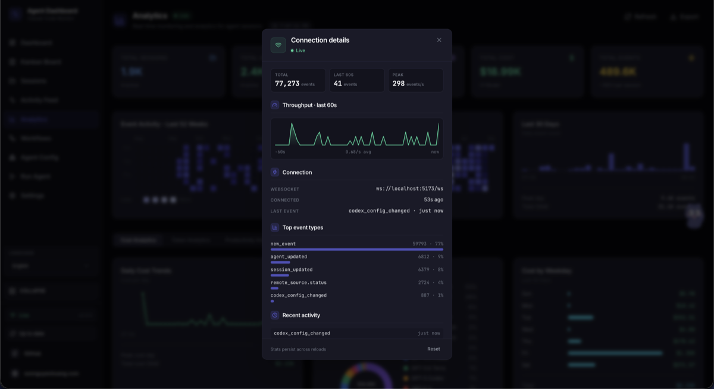</a>
</p>

---

## Tiện ích mở rộng VS Code

**Claude Code Agent Monitor** có sẵn dưới dạng tiện ích mở rộng VS Code hạng nhất, cho phép bạn theo dõi Agent AI mà không rời trình soạn thảo.

<p align="center">
  <a href="vscode-extension/vscode.png">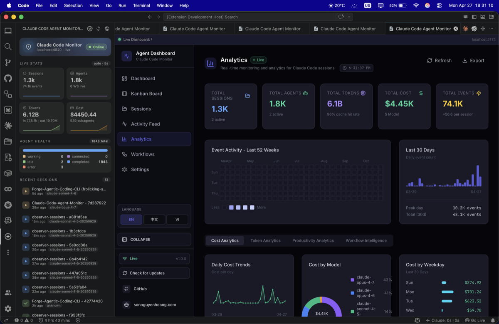</a>
</p>

### 🚀 Tính năng chính

- **Thanh bên trực tiếp:** Chế độ xem Activity Bar chuyên dụng hiển thị tình trạng Agent theo thời gian thực (Đang làm việc, Đang chờ, Hoàn tất, v.v.).
- **Phân tích mức dùng:** Theo dõi tổng token, chi phí USD trực tiếp và số sự kiện ngay trong thanh bên.
- **Tích hợp thanh trạng thái:** Màn hình xung ở thanh dưới cho biết nhanh phiên và Agent đang hoạt động.
- **Điều hướng sâu:** Truy cập một lần bấm tới chế độ xem dashboard cụ thể (Kanban, Analytics, Settings) hoặc phiên gần đây.
- **Tab tích hợp:** Mở toàn bộ dashboard theo dõi dưới dạng tab webview VS Code gốc.

### 📦 Cài đặt và thiết lập

1. Mở thư mục [vscode-extension](./vscode-extension).
2. Cài tiện ích mở rộng Marketplace hoặc tự đóng gói bằng `vsce package`.
3. Đảm bảo máy chủ dashboard cục bộ đang chạy (`npm run dev`).
4. Bấm **biểu tượng Radar** trong VS Code Activity Bar để bắt đầu.

Để biết cấu hình chi tiết cho nhà phát triển, xem các thư mục [.vscode](./.vscode) và [vscode-extension](./vscode-extension).

> [!TIP]
> Tiện ích trên VS Code Marketplace: [Claude Code Agent Monitor](https://marketplace.visualstudio.com/items?itemName=hoangsonw.claude-code-agent-monitor)

---

## Ứng dụng máy tính để bàn (macOS & Windows)

Ứng dụng máy tính để bàn Electron 35 tùy chọn đóng gói cùng dashboard thành `.dmg` macOS, trình cài NSIS Windows hoặc `.exe` portable từ workspace `desktop/`.

<p align="center">
  <a href="images/macos.png">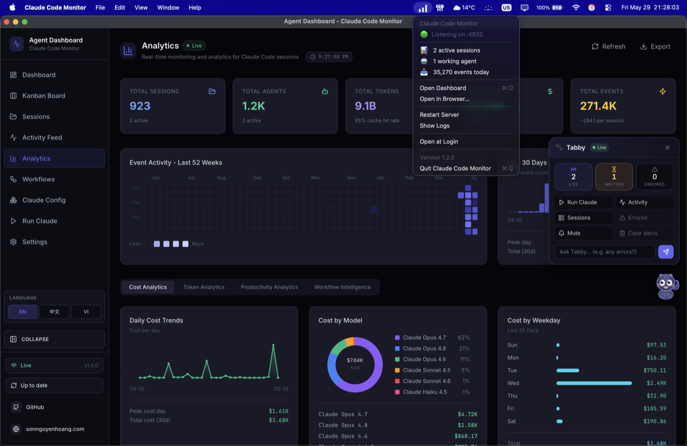</a>
  <br>
  <em>🍎🪟 <strong>Ứng dụng máy tính để bàn</strong> · shell gốc với biểu tượng menu-bar / khu vực thông báo (tray), Open-at-Login và khóa một phiên bản. Cùng dashboard trong cửa sổ hệ điều hành thật, ảnh minh họa trên macOS.</em>
</p>

<p align="center">
  <a href="images/windows_app.png">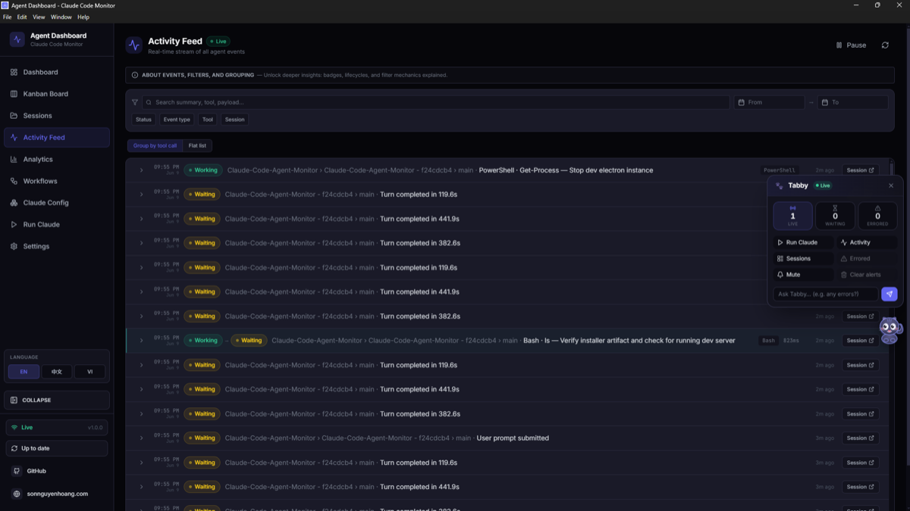</a>
  <br>
  <em>🪟 Cùng dashboard dưới dạng ứng dụng Windows gốc, với biểu tượng khu vực thông báo (tray), menu cửa sổ gốc và Open-at-Login.</em>
</p>

Ứng dụng bổ sung hành vi cửa sổ, tray, menu, đăng nhập và tắt máy gốc quanh cùng UI được phục vụ tại `localhost:4820`.

### Cách hoạt động

Khác với chạy dashboard từ terminal, ứng dụng máy tính để bàn không cần `npm start`, shell đang mở hay bản sao máy chủ thứ hai. **Tiến trình chính** Electron lưu trữ máy chủ Express **trong cùng tiến trình**. Nó `require()` trực tiếp `server/index.js` trong cùng runtime Node, **không có tiến trình con và không có IPC**, rồi trỏ `BrowserWindow` Chromium tới client React đã build.

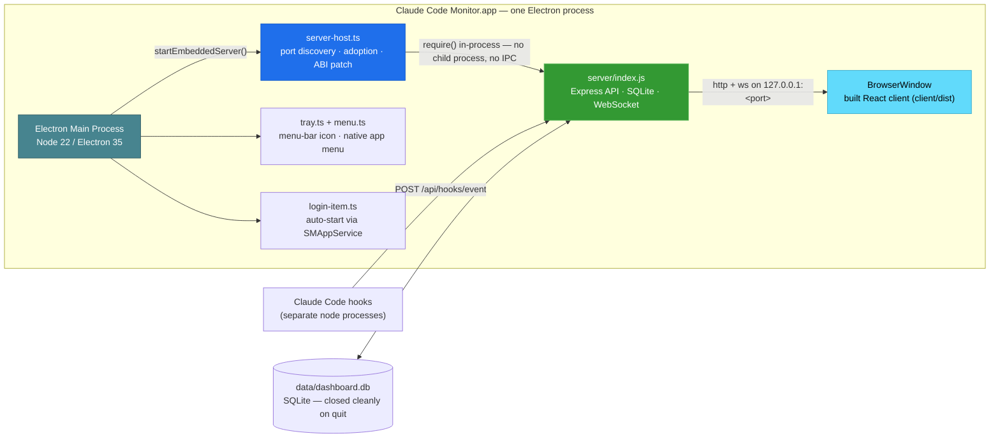
```mermaid
flowchart LR
    subgraph electron["Claude Code Monitor.app — one Electron process"]
        main["Electron Main Process<br/>Node 22 / Electron 35"]
        host["server-host.ts<br/>port discovery · adoption · ABI patch"]
        express["server/index.js<br/>Express API · SQLite · WebSocket"]
        win["BrowserWindow<br/>built React client (client/dist)"]
        tray["tray.ts + menu.ts<br/>menu-bar icon · native app menu"]
        login["login-item.ts<br/>auto-start via SMAppService"]
        main -->|"startEmbeddedServer()"| host
        host -->|"require() in-process — no child process, no IPC"| express
        main --> tray
        main --> login
        express -->|"http + ws on 127.0.0.1:&lt;port&gt;"| win
    end

    hooks["Claude Code hooks<br/>(separate node processes)"] -->|"POST /api/hooks/event"| express
    sqlite[("data/dashboard.db<br/>SQLite — closed cleanly on quit")] <--> express

    style main fill:#47848F,stroke:#2f5a62,color:#fff
    style express fill:#339933,stroke:#5cb85c,color:#fff
    style win fill:#61DAFB,stroke:#3aa9c9,color:#000
    style host fill:#1f6feb,stroke:#1158c7,color:#fff
```

Khi khởi chạy, ứng dụng:

1. Chọn cổng trống, ưu tiên **4820**, sau đó **4821–4829**, rồi cổng cao ngẫu nhiên nếu tất cả đều bận.
2. Nếu máy chủ dashboard khỏe mạnh đã trả lời `/api/health` trên `4820` (ví dụ bạn chạy `npm start` trong terminal), ứng dụng **tiếp nhận máy chủ đó** thay vì bind hai lần. Không có xung đột cổng hay tranh chấp SQLite. Máy chủ được tiếp nhận tiếp tục chạy sau khi thoát ứng dụng.
3. Nếu không, ứng dụng khởi động máy chủ nhúng và ở **lần khởi động máy chủ do ứng dụng sở hữu đầu tiên**, tự cài hook Claude Code rồi khởi động các dịch vụ nền (bộ lập lịch cập nhật, `cc-watcher`, đối chiếu run mồ côi). Vì vậy người chỉ dùng DMG nhận sự kiện với **không cần thiết lập thủ công**, không cần checkout hay `npm run install-hooks`.
4. **(macOS)** Khôi phục **`PATH` của login shell** để **Run Claude** tìm và tạo Claude CLI. Ứng dụng khởi chạy từ Finder/Dock nếu không chỉ kế thừa `PATH` tối thiểu của launchd và bỏ lỡ CLI trong `~/.local/bin`, `/opt/homebrew/bin`, thư mục bin của trình quản lý phiên bản, v.v. Trên Windows, tiến trình đã kế thừa `PATH` của người dùng.
5. Mở cửa sổ dashboard, trừ khi ứng dụng được khởi chạy lúc đăng nhập (trên macOS qua Login Items; trên Windows qua mục `HKCU\…\Run` có tag), khi đó ứng dụng chỉ nằm ở tray.
6. Khi thoát, tắt máy chủ nhúng nhẹ nhàng và **đóng SQLite sạch** bằng WAL checkpoint.

### Tính năng

- **Tray và cửa sổ:** Bấm trái chuyển trạng thái cửa sổ; bấm phải hiển thị **Open Dashboard**, **Open in Browser**, **Restart Server**, **Show Logs**, **Open at Login** và **Quit**. macOS dùng glyph tray template có màu theo giao diện; Windows và cửa sổ/taskbar dùng biểu tượng ứng dụng màu, kể cả lần chạy phát triển chưa đóng gói.
- **Menu gốc:** Menu ứng dụng chuẩn cùng phím tắt `⌘` / `Ctrl`. Chỉ macOS giữ **File → Open Dashboard** (`⌘1`) khi ẩn; Windows/Linux mở lại ổn định qua tray.
- **Đăng nhập và vòng đời:** `SMAppService` đăng ký macOS Login Items; Windows ghi mục theo người dùng `HKCU\Software\Microsoft\Windows\CurrentVersion\Run`. Đóng cửa sổ chỉ ẩn nó trong khi tray và máy chủ tiếp tục; lần khởi chạy thứ hai tập trung phiên bản duy nhất đang có.
- **Dữ liệu bền vững:** SQLite và khóa VAPID ở ngoài bundle trong `~/Library/Application Support/Claude Code Monitor/data/` hoặc `%APPDATA%\Claude Code Monitor\data\`. Cài lại, cập nhật và gỡ NSIS mặc định giữ lịch sử đã nhập.
- **CLI và nhật ký:** macOS khôi phục `PATH` của login shell để lần khởi chạy Finder/Dock chạy được `claude`; Windows dùng `PATH` người dùng kế thừa. **Show Logs** mở `~/Library/Logs/Claude Code Monitor/desktop.log` hoặc `%APPDATA%\Claude Code Monitor\logs\desktop.log`.

### Tải ứng dụng

**Lựa chọn A, tải trình cài dựng sẵn (khuyến nghị).** Từ **[Releases → latest](https://github.com/hoangsonww/Claude-Code-Agent-Monitor/releases/latest)**, công khai và không cần đăng nhập GitHub. CI tự động phát hành bản `vX.Y.Z` mới mỗi khi phiên bản trong `package.json` được tăng trên `master`, nên liên kết này luôn cung cấp build hiện tại:

| Nền tảng | Tài nguyên | Ghi chú |
| --- | --- | --- |
| macOS (Apple Silicon) | `ClaudeCodeMonitor-<ver>-arm64.dmg` | kéo vào `/Applications` |
| macOS (Intel) | `ClaudeCodeMonitor-<ver>-x64.dmg` | kéo vào `/Applications` |
| Windows (trình cài) | `ClaudeCodeMonitor-Setup-<ver>-x64.exe` | cài theo người dùng, không cần admin |
| Windows (portable) | `ClaudeCodeMonitor-<ver>-x64-portable.exe` | chạy không cần cài đặt |

Build mới theo từng commit cũng có dưới dạng artifact CI, yêu cầu đăng nhập và lưu 14 ngày: `ClaudeCodeMonitor-dmg` từ job `🍎 macOS Desktop (DMG)` và `ClaudeCodeMonitor-win` từ job `🪟 Windows Desktop (EXE)`. Chúng hữu ích để thử `master` trước tag phát hành tiếp theo.

**Lựa chọn B, tự build.** Từ thư mục gốc kho mã:

```bash
npm run setup                # install root + client deps, build client, install hooks
npm run build                # build the React client (client/dist)
npm run desktop:install      # install Electron + electron-builder into desktop/ (preflights native deps; prints setup help on failure)
npm run desktop:dmg:arm64    # macOS:   fast single-arch DMG → desktop/release/ClaudeCodeMonitor-<ver>-arm64.dmg
npm run desktop:win          # Windows: NSIS installer → desktop/release/ClaudeCodeMonitor-Setup-<ver>-x64.exe
```

> [!NOTE]
> **DMG được build trên macOS; `.exe` Windows được build trên Windows.** electron-builder đóng gói cho hệ điều hành host. Build macOS `npm run desktop:dmg` đóng gói ứng dụng **hai lần**, một lần cho mỗi kiến trúc, rồi tạo **cả hai** DMG riêng (`arm64` + `x64`) cho bản phát hành. Nó không hợp nhất thành một binary universal. Để dùng trên Mac của bạn, dùng `desktop:dmg:arm64` / `desktop:dmg:x64` theo kiến trúc. Trên Windows, `better-sqlite3` được `npm run desktop:install` tải dưới dạng binary Electron dựng sẵn, nên trường hợp thông thường không cần bộ công cụ Visual Studio C++. Nếu build thất bại do không có binary dựng sẵn hoặc thiếu bộ công cụ C++, `desktop:install` in cách sửa chính xác theo hệ điều hành cùng lựa chọn không cần toolchain và dừng rõ ràng thay vì để lại bản cài hỏng.

### Cài đặt

**macOS:**

1. Bấm đúp `.dmg` để mount.
2. Kéo **Claude Code Monitor.app** vào thư mục `/Applications`.
3. DMG mặc định được **ký ad-hoc**, nên macOS Gatekeeper cảnh báo ở lần chạy đầu (*"Apple could not verify…"*). Xóa thuộc tính quarantine:

   ```bash
   xattr -cr "/Applications/Claude Code Monitor.app"
   ```

   Hoặc mở **System Settings → Privacy & Security** rồi bấm **Open Anyway**.

4. Khởi chạy ứng dụng. Biểu tượng tray xuất hiện và cửa sổ dashboard mở.

**Windows:**

Chạy `ClaudeCodeMonitor-Setup-<ver>-x64.exe` để cài theo người dùng, không cần admin, trong `%LOCALAPPDATA%\Programs\Claude Code Monitor`, với thư mục đích có thể chọn, hoặc dùng `*-portable.exe` mà không cài. Build chưa ký mặc định có thể kích hoạt SmartScreen trong lần chạy đầu; chọn **More info → Run anyway**. Khởi chạy từ Start hoặc lối tắt trên desktop để mở dashboard và biểu tượng tray.

<p align="center">
  <a href="images/setup_win_wizard.png">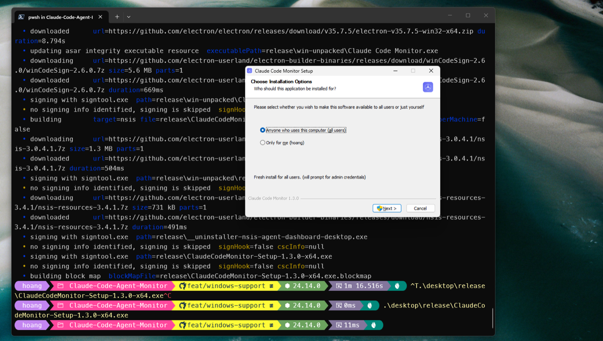</a>
  <br>
  <em>🪟 <strong>Tùy chọn cài đặt</strong> · chọn cài theo người dùng hoặc cho mọi người dùng</em>
</p>

<p align="center">
  <a href="images/setup_win_wizard2.png">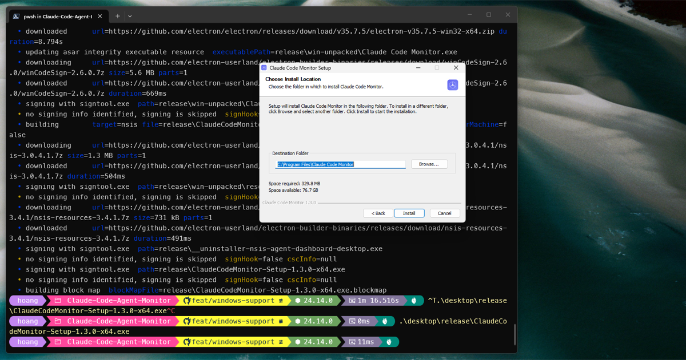</a>
  <br>
  <em>🪟 <strong>Vị trí cài đặt</strong> · xác nhận hoặc thay đổi thư mục đích</em>
</p>

<p align="center">
  <a href="images/setup_win_wizard3.png">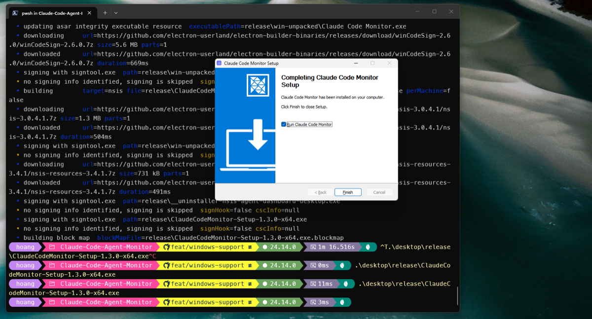</a>
  <br>
  <em>🪟 <strong>Thiết lập Windows hoàn tất</strong> · kết thúc trình cài đặt và khởi chạy Claude Code Monitor</em>
</p>

### Lệnh build

Mọi lệnh chạy từ **thư mục gốc kho mã**:

| Lệnh | Tác dụng |
| --- | --- |
| `npm run desktop:install` | Cài Electron + electron-builder vào `desktop/`; build lại `better-sqlite3` cho ABI của Electron; kiểm tra trước build gốc `better-sqlite3` và in trợ giúp thiết lập có thể thực hiện, gồm lựa chọn không cần toolchain, khi thất bại |
| `npm run desktop:build` | Biên dịch nguồn TypeScript desktop vào `desktop/out/` |
| `npm run desktop:dev` | Build và khởi chạy ứng dụng Electron để lặp cục bộ |
| `npm run desktop:test` | Chạy smoke test, tạo Electron, kiểm tra `/api/health`, rồi tắt |
| `npm run desktop:dmg` | **macOS:** build **cả hai** DMG (arm64 + x64), đúng cho phát hành, **chậm hơn** vì đóng gói từng kiến trúc |
| `npm run desktop:dmg:arm64` | **macOS:** build DMG chỉ Apple Silicon, **nhanh** (~1 min), được khuyến nghị cho máy Mac của bạn |
| `npm run desktop:dmg:x64` | **macOS:** build DMG chỉ Intel, **nhanh** (~1 min) |
| `npm run desktop:dmg:universal` | **macOS:** build một DMG **universal** hợp nhất (arm64 + x86_64), tùy chọn, **chậm nhất**, không phải loại bản phát hành cung cấp |
| `npm run desktop:win` | **Windows:** build trình cài NSIS `.exe` (x64) |
| `npm run desktop:win:portable` | **Windows:** build `.exe` portable không cần cài (x64) |

DMG macOS tạo ra có kích thước **~80 MB** (≈ 250 MB trên đĩa sau khi cài) và trình cài Windows tương đương. Đây là chi phí bundle Electron tiêu chuẩn.

### Ký và công chứng

macOS mặc định dùng chữ ký ad-hoc và đặt `CSC_IDENTITY_AUTO_DISCOVERY=false`, nên certificate cục bộ không bao giờ được chọn ngoài ý muốn. Ký Developer ID dùng `CSC_LINK` cùng `CSC_KEY_PASSWORD`; công chứng bổ sung `APPLE_ID`, `APPLE_TEAM_ID` và `APPLE_APP_SPECIFIC_PASSWORD`. Windows mặc định không ký và bật Authenticode qua cùng `CSC_LINK` cùng biến mật khẩu. CI kích hoạt mỗi đường khi có thông tin xác thực mà không cần đổi mã.

### Ghi chú triển khai

- **ABI gốc:** `desktop/` giữ `better-sqlite3` được build cho Electron và chuyển hướng `server/db.js` tới đó; bản root vẫn tương thích với Node hệ thống và kiểm thử máy chủ. Sau build DMG theo kiến trúc, `prebuild` desktop tự sửa ABI cục bộ và dừng sớm với trợ giúp thiết lập nếu thiếu binary.
- **Ngang bằng máy chủ:** `startBackgroundServices()` được xuất cho máy chủ nhúng cùng bộ lập lịch cập nhật, watcher cấu hình và đối chiếu run mồ côi như `node server/index.js`; đường standalone và workspace khác không đổi hành vi.
- **CI và phát hành:** Job macOS và Windows có bộ lọc đường dẫn smoke-test rồi tải lên hai DMG một kiến trúc cùng EXE NSIS và portable. Lần tăng phiên bản trên `master` đính kèm mọi tài nguyên vào `vX.Y.Z`; tạo lại `desktop/assets/icon.ico` bằng `npm run build:win-icon`.

Xem [`DESKTOP.md`](./DESKTOP.md) để biết cài đặt và sử dụng hàng ngày, cùng [`desktop/README.md`](./desktop/README.md) để biết tiến trình, vòng đời, cổng và build.

---

## Lưu trữ dữ liệu

- **Công cụ:** SQLite 3 qua `better-sqlite3` (tùy chọn) hoặc tích hợp sẵn Node.js `node:sqlite`
- **Vị trí:** `data/dashboard.db`
- **Chế độ nhật ký:** WAL (đọc đồng thời trong khi ghi)
- **Đặt lại:** Xóa `data/dashboard.db` để xóa tất cả dữ liệu

### Sơ đồ mối quan hệ thực thể

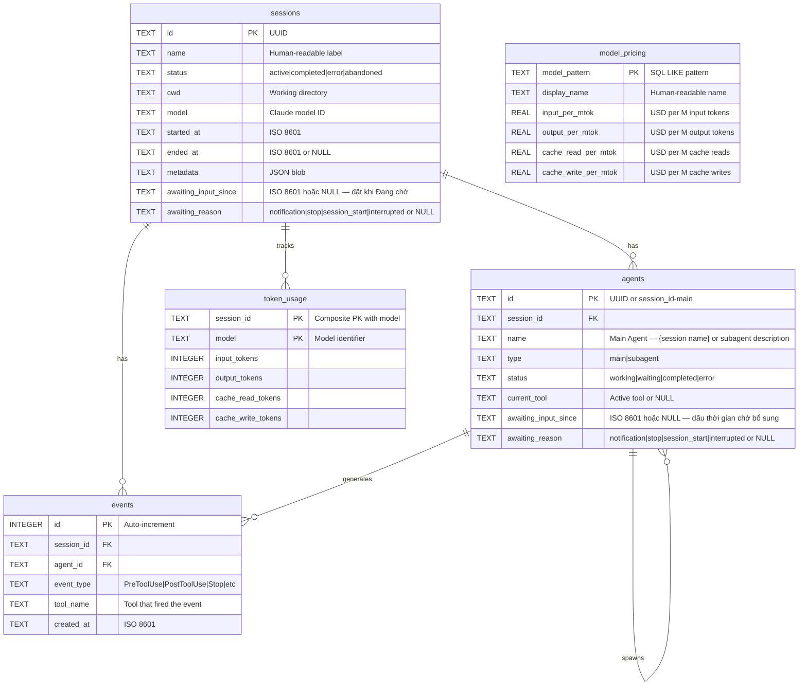
```mermaid
erDiagram
    sessions ||--o{ agents : has
    sessions ||--o{ events : has
    sessions ||--o{ token_usage : tracks
    agents ||--o{ events : generates
    agents ||--o{ agents : spawns

    sessions {
        TEXT id PK "UUID"
        TEXT name "Human-readable label"
        TEXT status "active|completed|error|abandoned"
        TEXT cwd "Working directory"
        TEXT model "Claude model ID"
        TEXT started_at "ISO 8601"
        TEXT ended_at "ISO 8601 or NULL"
        TEXT metadata "JSON blob"
        TEXT awaiting_input_since "ISO 8601 hoặc NULL — đặt khi Đang chờ"
        TEXT awaiting_reason "notification|stop|session_start|interrupted or NULL"
    }

    agents {
        TEXT id PK "UUID or session_id-main"
        TEXT session_id FK
        TEXT name "Main Agent — {session name} or subagent description"
        TEXT type "main|subagent"
        TEXT status "working|waiting|completed|error"
        TEXT current_tool "Active tool or NULL"
        TEXT awaiting_input_since "ISO 8601 hoặc NULL — dấu thời gian chờ bổ sung"
        TEXT awaiting_reason "notification|stop|session_start|interrupted or NULL"
    }

    events {
        INTEGER id PK "Auto-increment"
        TEXT session_id FK
        TEXT agent_id FK
        TEXT event_type "PreToolUse|PostToolUse|Stop|etc"
        TEXT tool_name "Tool that fired the event"
        TEXT created_at "ISO 8601"
    }

    token_usage {
        TEXT session_id PK "Composite PK with model"
        TEXT model PK "Model identifier"
        INTEGER input_tokens
        INTEGER output_tokens
        INTEGER cache_read_tokens
        INTEGER cache_write_tokens
    }

    model_pricing {
        TEXT model_pattern PK "SQL LIKE pattern"
        TEXT display_name "Human-readable name"
        REAL input_per_mtok "USD per M input tokens"
        REAL output_per_mtok "USD per M output tokens"
        REAL cache_read_per_mtok "USD per M cache reads"
        REAL cache_write_per_mtok "USD per M cache writes"
    }
```

---

## Thị trường plugin

CCAM cung cấp **14 plugin** từ một cây nguồn dùng chung. Claude Code đọc `.claude-plugin/marketplace.json`; Codex đọc `.agents/plugins/marketplace.json` cùng `.codex-plugin/plugin.json` của từng plugin. Gói này chứa **66 skill plugin, 18 Subagent Claude, 34 lệnh Claude, 3 trình trợ giúp CLI, 3 cấu hình hook và 2 plugin có MCP**.

```bash
# Claude Code
claude plugin marketplace add hoangsonww/Claude-Code-Agent-Monitor
claude plugin install ccam-platform@claude-code-agent-monitor-plugins

# Codex
codex plugin marketplace add hoangsonww/Claude-Code-Agent-Monitor
codex plugin add ccam-platform@claude-code-agent-monitor-plugins

# Open Agent Skills / skills.sh-compatible CLI
npx skills add hoangsonww/Claude-Code-Agent-Monitor --list

# Install one skill for Claude Code and Codex in the current project
npx skills add hoangsonww/Claude-Code-Agent-Monitor \
  --skill mcp-server \
  --agent claude-code \
  --agent codex \
  --yes

# Verify, update, and remove the project-scoped skill
npx skills list --json
npx skills update --project --yes
npx skills remove mcp-server --yes

# Add --global to install at user scope, then manage that scope explicitly
npx skills add hoangsonww/Claude-Code-Agent-Monitor \
  --skill mcp-server \
  --agent claude-code \
  --agent codex \
  --global \
  --yes
npx skills list --global --json
npx skills update --global --yes
npx skills remove --global mcp-server --yes
```

CLI `skills` phát hiện **77 skill trong toàn bộ kho mã**, gồm 66 skill plugin và các skill bảo trì kho mã. Bản cài theo dự án dùng `.agents/skills/` cùng liên kết riêng theo Agent. Skill Claude Code toàn cục mặc định nằm trong `~/.claude/skills/`, hoặc `$CLAUDE_CONFIG_DIR/skills/` khi được đặt. Skill Codex toàn cục mặc định nằm trong `~/.codex/skills/`, hoặc `$CODEX_HOME/skills/` khi được đặt. Bản cài nhiều Agent có thể khử trùng lặp tệp qua một kho dùng chung rồi liên kết các đích. Mọi skill plugin đều có frontmatter `name`/`description` chuẩn và metadata `agents/openai.yaml`. Không cần PR upstream tới `vercel-labs/skills` để cài đặt. Kho mã GitHub công khai là nguồn, còn mức hiển thị trên skills.sh phụ thuộc vào xuất bản và telemetry cài đặt thực.

Các gói tập trung mới bổ sung cho plugin phân tích, năng suất, chất lượng, phiên, quy trình, cấu hình và dashboard hiện có:

- `ccam-runner`: khởi chạy Claude Code/Codex có theo dõi, gửi lượt tiếp theo, dừng, tiếp tục và lịch sử run
- `ccam-integrations`: quy tắc cảnh báo, webhook, thông báo đẩy và thu thập SSH từ xa
- `ccam-platform`: Trình khám phá cấu hình Claude/Codex, nhập theo nhà cung cấp, khôi phục bản sao lưu, thiết lập hook, cập nhật và thao tác MCP
- `ccam-reports`: báo cáo điều hành, chi phí, độ tin cậy và quy trình sẵn sàng cho stakeholder

Xác thực và tạo lại metadata phân phối bằng:

```bash
npm run extensions:sync
npm run extensions:validate
```

Danh mục đầy đủ, lệnh cài đặt, hành vi skills.sh, ranh giới gửi công khai và kiểm tra cài đặt sạch: [docs/PLUGINS.md](docs/PLUGINS.md).

---

## Dòng trạng thái

Tiện ích dòng trạng thái CLI độc lập dành cho Claude Code hiển thị tên mô hình, người dùng, thư mục làm việc, nhánh git, thanh sử dụng cửa sổ ngữ cảnh và số lượng mã thông báo -- tất cả đều được mã hóa màu bằng các chuỗi thoát ANSI.

```
Sonnet 4.6 | nguyens6 | ~/agent-dashboard/client | main | ████████░░ 79% | 3↑ 2↓ 156586c
```

| Phân đoạn     | Màu sắc                | Ví dụ             |
| ----------- | -------------------- | ------------------- |
| Người mẫu       | lục lam                 | `Sonnet 4.6`        |
| người dùng        | Màu xanh lá                | `nguyens6`          |
| CWD         | Màu vàng               | `~/agent-dashboard` |
| Nhánh Git  | Màu đỏ tươi              | `main`              |
| Thanh ngữ cảnh | Xanh / Vàng / Đỏ | `████████░░ 79%`    |
| Mã thông báo      | mờ                  | `3↑ 2↓ 156586c`     |

Xem [`statusline/README.md`](statusline/README.md) để biết hướng dẫn cài đặt.

<p align="center">
  <a href="images/statusline.png">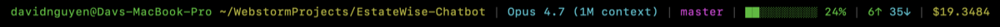</a>
</p>

---

## Kiến trúc máy chủ

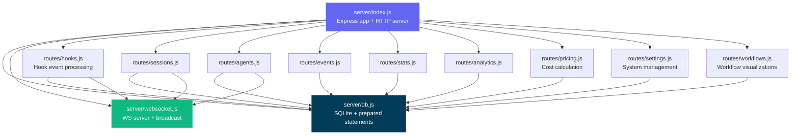
```mermaid
graph TD
    INDEX["server/index.js<br/>Express app + HTTP server"]
    DB["server/db.js<br/>SQLite + prepared statements"]
    WS["server/websocket.js<br/>WS server + broadcast"]
    HOOKS["routes/hooks.js<br/>Hook event processing"]
    SESSIONS["routes/sessions.js"]
    AGENTS["routes/agents.js"]
    EVENTS["routes/events.js"]
    STATS["routes/stats.js"]
    ANALYTICS["routes/analytics.js"]
    PRICING["routes/pricing.js<br/>Cost calculation"]
    SETTINGS["routes/settings.js<br/>System management"]
    WORKFLOWS["routes/workflows.js<br/>Workflow visualizations"]

    INDEX --> DB & WS
    INDEX --> HOOKS & SESSIONS & AGENTS & EVENTS & STATS & ANALYTICS & PRICING & SETTINGS & WORKFLOWS
    HOOKS --> DB & WS
    SESSIONS --> DB & WS
    AGENTS --> DB & WS
    EVENTS --> DB
    STATS --> DB
    ANALYTICS --> DB
    PRICING --> DB
    SETTINGS --> DB
    WORKFLOWS --> DB

    style INDEX fill:#6366f1,stroke:#818cf8,color:#fff
    style DB fill:#003B57,stroke:#005f8a,color:#fff
    style WS fill:#10b981,stroke:#34d399,color:#fff
```

---

## Định tuyến khách hàng

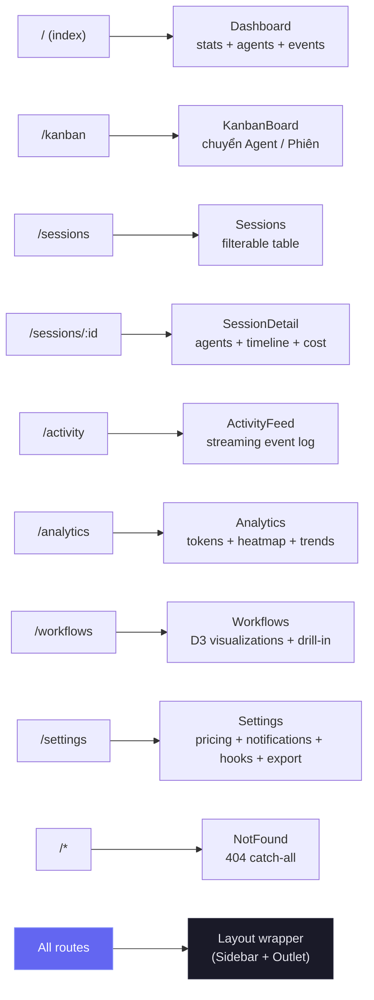
```mermaid
graph LR
    ROOT["/ (index)"] --> DASH["Dashboard<br/>stats + agents + events"]
    K["/kanban"] --> KANBAN["KanbanBoard<br/>chuyển Agent / Phiên"]
    S["/sessions"] --> SESS["Sessions<br/>filterable table"]
    D["/sessions/:id"] --> DETAIL["SessionDetail<br/>agents + timeline + cost"]
    A["/activity"] --> ACT["ActivityFeed<br/>streaming event log"]
    AN["/analytics"] --> ANALYTICS["Analytics<br/>tokens + heatmap + trends"]
    WF["/workflows"] --> WORKFLOWS["Workflows<br/>D3 visualizations + drill-in"]
    ST["/settings"] --> SETTINGS["Settings<br/>pricing + notifications + hooks + export"]
    NF["/*"] --> NOTFOUND["NotFound<br/>404 catch-all"]

    ALL["All routes"] --> LAYOUT["Layout wrapper<br/>(Sidebar + Outlet)"]

    style ALL fill:#6366f1,stroke:#818cf8,color:#fff
    style LAYOUT fill:#1a1a28,stroke:#2a2a3d,color:#e4e4ed
```

---

## Luồng xử lý móc

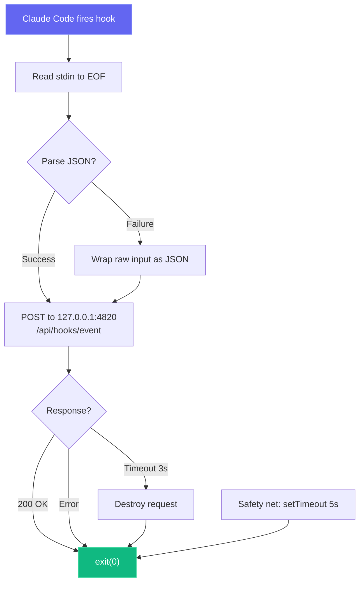
```mermaid
flowchart TD
    START["Claude Code fires hook"] --> STDIN["Read stdin to EOF"]
    STDIN --> PARSE{"Parse JSON?"}
    PARSE -->|Success| POST["POST to 127.0.0.1:4820<br/>/api/hooks/event"]
    PARSE -->|Failure| WRAP["Wrap raw input as JSON"]
    WRAP --> POST
    POST --> RESP{"Response?"}
    RESP -->|200 OK| EXIT0["exit(0)"]
    RESP -->|Error| EXIT0
    RESP -->|Timeout 3s| DESTROY["Destroy request"] --> EXIT0
    SAFETY["Safety net: setTimeout 5s"] --> EXIT0

    style EXIT0 fill:#10b981,stroke:#34d399,color:#fff
    style START fill:#6366f1,stroke:#818cf8,color:#fff
```

---

## Chế độ triển khai

Chúng tôi hỗ trợ cả hai chế độ triển khai phát triển và sản xuất với các kiến ​​trúc quy trình khác nhau:

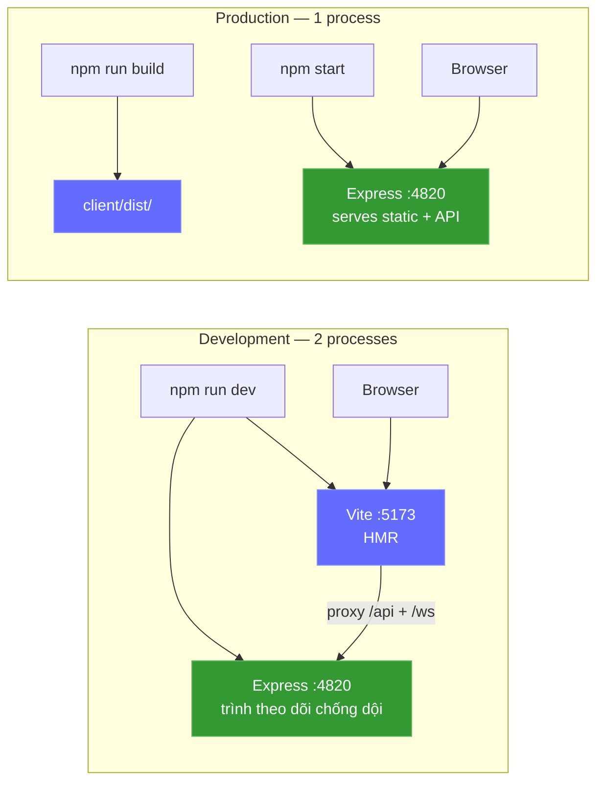
```mermaid
graph LR
    subgraph dev["Development — 2 processes"]
        D_CMD["npm run dev"] --> D_SRV["Express :4820<br/>trình theo dõi chống dội"]
        D_CMD --> D_VITE["Vite :5173<br/>HMR"]
        D_BROWSER["Browser"] --> D_VITE
        D_VITE -->|"proxy /api + /ws"| D_SRV
    end

    subgraph prod["Production — 1 process"]
        P_BUILD["npm run build"] --> P_DIST["client/dist/"]
        P_START["npm start"] --> P_SRV["Express :4820<br/>serves static + API"]
        P_BROWSER["Browser"] --> P_SRV
    end

    style D_VITE fill:#646CFF,stroke:#818cf8,color:#fff
    style D_SRV fill:#339933,stroke:#5cb85c,color:#fff
    style P_SRV fill:#339933,stroke:#5cb85c,color:#fff
    style P_DIST fill:#646CFF,stroke:#818cf8,color:#fff
```

Ngoài hai chế độ trên, ứng dụng máy tính để bàn (macOS & Windows) cung cấp một cách chạy thứ ba — máy chủ Express được nhúng ngay trong tiến trình chính Electron, không cần terminal:

```mermaid
flowchart LR
    subgraph desktopmode["Desktop App (macOS & Windows) — 1 process (Electron Main)"]
        MAIN["Electron Main<br/>Node 22 / Electron 35"]
        EMB["server/index.js<br/>embedded via require()"]
        WIN["BrowserWindow<br/>React dashboard"]
        TRAY["tray icon<br/>menu bar / notification area"]
        MAIN --> EMB
        MAIN --> TRAY
        EMB -->|"http + ws on 127.0.0.1:port"| WIN
    end

    style MAIN fill:#1f6feb,stroke:#1158c7,color:#fff
    style EMB fill:#339933,stroke:#5cb85c,color:#fff
```

Sidecar MCP cục bộ tùy chọn (hỗ trợ truyền tải stdio, HTTP+SSE và REPL):

```mermaid
graph LR
    subgraph "MCP Transport Options"
        M_STDIO["MCP Server (stdio)<br/>npm run mcp:start"]
        M_HTTP["MCP Server (HTTP)<br/>npm run mcp:start:http<br/>:8819"]
        M_REPL["MCP Server (REPL)<br/>npm run mcp:start:repl"]
    end

    H["MCP Host"] -->|"stdin/stdout"| M_STDIO
    RC["Remote Client"] -->|"POST /mcp · GET /sse"| M_HTTP
    OP["Operator"] -->|"interactive CLI"| M_REPL

    M_STDIO --> D["Dashboard Server<br/>:4820"]
    M_HTTP --> D
    M_REPL --> D

    style M_STDIO fill:#0f766e,stroke:#14b8a6,color:#fff
    style M_HTTP fill:#0f766e,stroke:#14b8a6,color:#fff
    style M_REPL fill:#0f766e,stroke:#14b8a6,color:#fff
```

### Triển khai đám mây

`deployments/` chạy trên mọi Kubernetes tương thích, gồm EKS, GKE, AKS, OKE và cụm tự quản lý. CCAM dùng SQLite, vì vậy mọi manifest được hỗ trợ đều bắt buộc **chính xác một dashboard writer đang hoạt động trên mỗi persistent volume** với Recreate. HPA, active-active, nhiều replica, blue-green và canary không được hỗ trợ khi SQLite vẫn là persistence backend.

- **Helm:** schema chặn nhiều replica/HPA, hỗ trợ image digest, retained PVC, Ingress hoặc Gateway API, external Secret, NetworkPolicy, MCP và ServiceMonitor tùy chọn.
- **Kustomize:** Restricted PSS base, overlay dev/staging/production, component MCP, monitoring, Gateway API và CSI snapshot.
- **Terraform:** triển khai Helm chart đã kiểm chứng lên Kubernetes cluster có sẵn; networking, identity, CSI, TLS và secret sync do lớp cloud quản lý.
- **Operations:** SQLite online backup, integrity check, SHA-256, scale-to-zero restore, backup trước deploy/rollback/teardown và health check có auth.
- **CI supply chain:** image app và MCP được scan, publish amd64/arm64 với SBOM, SLSA provenance và Cosign keyless signature.

```bash
npm run deploy:validate
REGISTRY="ghcr.io/$(gh repo view --json owner -q .owner.login)"
IMAGE_TAG="$(git rev-parse --short HEAD)"

helm upgrade --install agent-monitor deployments/helm/agent-monitor \
  --namespace agent-monitor-production --create-namespace \
  --values deployments/helm/agent-monitor/values-production.yaml \
  --set image.registry= \
  --set image.repository=${REGISTRY}/claude-code-agent-monitor \
  --set image.tag=${IMAGE_TAG} \
  --atomic --wait --timeout 10m
```

> [!NOTE]
> Xem [DEPLOYMENT.md](DEPLOYMENT.md) và [deployments/README.md](deployments/README.md) để biết secrets, Docker/Podman, Gateway API, Terraform, backup, restore và rollback.

---

## Cấu trúc dự án

```
agent-dashboard/
|-- CLAUDE.md                   # Claude Code project memory and working agreements
|-- AGENTS.md                   # Codex project instructions
|-- package.json                # Root scripts (dashboard + MCP helpers) + server dependencies
|-- .claude/
|   +-- rules/                  # Path-scoped Claude rules
|   +-- skills/                 # Claude reusable project skills
|   +-- agents/                 # Claude custom subagents
|-- .claude-plugin/
|   +-- marketplace.json        # Manifest marketplace Claude Code (14 plugin)
|-- .agents/plugins/
|   +-- marketplace.json        # Manifest marketplace Codex (14 plugin)
|-- plugins/
|   |-- ccam-analytics/         # Analytics: session reports, cost breakdown, usage trends, productivity score
|   |   |-- .claude-plugin/plugin.json
|   |   |-- skills/ (4)         # session-report, cost-breakdown, usage-trends, productivity-score
|   |   |-- agents/             # analytics-advisor (Sonnet model)
|   |   |-- hooks/hooks.json    # Stop + SubagentStop event logging
|   |   +-- bin/ccam-stats      # Terminal dashboard CLI
|   |-- ccam-productivity/      # Productivity: standups, reports, sprints, workflow optimizer
|   |-- ccam-devtools/          # DevTools: debug, diagnostics, export, health checks
|   |   +-- bin/                # ccam-doctor + ccam-export CLIs
|   |-- ccam-insights/          # Insights: patterns, anomalies, optimization, comparison
|   +-- ccam-dashboard/         # Dashboard connector: status, quick stats, MCP integration
|       +-- .mcp.json           # MCP server configuration
|-- server/
|   |-- index.js                 # Express app, HTTP server, static serving
|   |-- db.js                    # SQLite schema, migrations, prepared statements
|   |-- websocket.js             # WebSocket server with heartbeat
|   +-- routes/
|       |-- hooks.js             # Hook event processing (transactional)
|       |-- sessions.js          # Session CRUD
|       |-- agents.js            # Agent CRUD
|       |-- events.js            # Event listing
|       |-- stats.js             # Aggregate statistics
|       |-- analytics.js         # Token, tool, and trend analytics
|       |-- workflows.js         # Aggregate workflow data and per-session drill-in
|       |-- pricing.js           # Model pricing CRUD and cost calculation
|       +-- settings.js          # System info, data management, export, cleanup
|   +-- lib/
|       +-- transcript-cache.js  # Bộ nhớ đệm JSONL transcript dựa trên stat, đọc tăng dần. Dùng trình đọc byte-stream đồng bộ theo từng khối 4 MiB và phân tích theo dòng, không bao giờ nạp toàn bộ tệp thành chuỗi JS, nên các JSONL lớn hơn giới hạn chuỗi tối đa của V8 (~512 MiB trên Node 20 64-bit) vẫn được phân tích mà không khiến Node thoát với "FATAL ERROR: v8::ToLocalChecked Empty MaybeLocal". Trích xuất token, compaction, lỗi API, thời lượng vòng, khối thinking và usage extras (service_tier, speed, inference_geo)
|   +-- compat-sqlite.js         # node:sqlite compatibility wrapper (fallback for better-sqlite3)
|-- client/
|   |-- package.json             # Client dependencies
|   |-- index.html               # HTML entry point
|   |-- vite.config.ts           # Vite + proxy config
|   |-- tailwind.config.js       # Custom dark theme
|   |-- tsconfig.json            # Strict TypeScript
|   +-- src/
|       |-- main.tsx             # React entry
|       |-- App.tsx              # Router + WebSocket provider
|       |-- index.css            # Tailwind + custom utilities
|       |-- lib/
|       |   |-- types.ts         # Shared TypeScript interfaces
|       |   |-- api.ts           # Typed fetch client
|       |   |-- format.ts        # Date/time formatting utilities
|       |   +-- eventBus.ts      # Pub/sub for WebSocket distribution
|       |-- hooks/
|       |   |-- useWebSocket.ts      # Auto-reconnecting WebSocket hook
|       |   +-- useNotifications.ts  # Browser notification triggers from WebSocket events
|       |-- components/
|       |   |-- Layout.tsx       # Shell with sidebar + outlet
|       |   |-- Sidebar.tsx      # Navigation + connection indicator
|       |   |-- AgentCard.tsx    # Agent info card with status
|       |   |-- StatCard.tsx     # Metric card
|       |   |-- StatusBadge.tsx  # Color-coded status pills
|       |   |-- EmptyState.tsx   # Placeholder for empty lists
|       |   +-- workflows/       # D3.js workflow visualization components
|       |       |-- OrchestrationDAG.tsx            # Horizontal DAG of agent spawning patterns
|       |       |-- ToolExecutionFlow.tsx           # d3-sankey diagram of tool-to-tool transitions
|       |       |-- AgentCollaborationNetwork.tsx   # Force-directed agent pipeline graph
|       |       |-- SubagentEffectiveness.tsx       # Scorecard grid with SVG success rings
|       |       |-- WorkflowPatterns.tsx            # Auto-detected orchestration sequences
|       |       |-- ModelDelegationFlow.tsx         # Model routing through agent hierarchies
|       |       |-- ErrorPropagationMap.tsx         # Error clustering by hierarchy depth
|       |       |-- ConcurrencyTimeline.tsx         # Swim-lane parallel agent execution
|       |       |-- SessionComplexityScatter.tsx    # D3 bubble chart (duration vs agents vs tokens)
|       |       |-- CompactionImpact.tsx            # Token compression events and recovery
|       |       |-- WorkflowStats.tsx               # Aggregate workflow statistics
|       |       +-- SessionDrillIn.tsx              # Per-session agent tree, tool timeline, events
|       +-- pages/
|           |-- Dashboard.tsx      # Overview page
|           |-- KanbanBoard.tsx    # Cột trạng thái Agent / Phiên với nút chuyển
|           |-- Sessions.tsx       # Sessions table
|           |-- SessionDetail.tsx  # Single session deep dive
|           |-- ActivityFeed.tsx   # Real-time event stream
|           |-- Analytics.tsx      # Token usage, heatmap, trends
|           |-- Workflows.tsx      # D3.js workflow visualizations and session drill-in
|           |-- Settings.tsx       # Model pricing, notifications, hooks, export, cleanup
|           +-- NotFound.tsx       # 404 catch-all page
|-- scripts/
|   |-- hook-handler.js          # Lightweight stdin-to-HTTP forwarder
|   |-- install-hooks.js         # Auto-configures ~/.claude/settings.json
|   |-- import-history.js        # Nhập phiên từ ~/.claude/ với trích xuất JSONL nâng cao (lỗi API, thời lượng vòng, entrypoint, permission mode, khối thinking, usage extras, tool error, JSONL của subagent). Re-import hoàn toàn tăng dần: tính sẵn high-water mark theo loại sự kiện (`MAX(created_at) GROUP BY event_type` cho mỗi phiên) và chỉ chèn các mục JSONL có `ts > cutoff[type]`, nhờ đó các phiên dài ngày mà transcript liên tục được nối thêm trong nhiều ngày vẫn nhận đầy đủ các sự kiện Stop / PostToolUse / TurnDuration / ToolError ở mỗi lần chạy lại. Đồng thời tiến `sessions.ended_at` về phía trước khi JSONL đã vượt qua giá trị đã lưu và làm mới message-count trong metadata ở mỗi lượt
|   +-- seed.js                  # Sample data generator
|-- mcp/
|   |-- package.json             # MCP package scripts + dependencies
|   |-- README.md                # MCP setup, host config, tool catalog, safety model
|   |-- src/
|   |   |-- index.ts             # MCP runtime entrypoint (transport router)
|   |   |-- server.ts            # MCP server assembly
|   |   |-- clients/             # Dashboard API client with retry/backoff
|   |   |-- config/              # Environment/CLI config parsing
|   |   |-- core/                # Logger, tool registry, result helpers
|   |   |-- policy/              # Mutation/destructive guards
|   |   |-- tools/               # 16 mô-đun miền đăng ký 103 công cụ
|   |   |-- transports/          # HTTP+SSE server, REPL, tool collector
|   |   |-- ui/                  # ANSI banner, colors, formatter, tables
|   |   +-- types/               # Shared MCP type definitions
|   +-- build/                   # Built MCP runtime output
|-- desktop/
|   |-- package.json             # Electron + electron-builder
|   |-- electron-builder.yml     # DMG config; signing/notarization hooks
|   |-- README.md                # Contributor / architecture reference
|   |-- assets/                  # icon.icns + tray PNGs (generated from SVG)
|   |-- src/
|   |   |-- main.ts              # Main process entry — lifecycle
|   |   |-- server-host.ts       # In-process Express boot, port discovery, adoption
|   |   |-- window.ts            # BrowserWindow + persisted geometry
|   |   |-- tray.ts              # Menu-bar icon + context menu
|   |   |-- menu.ts              # Native application menu (File ▸ Open Dashboard is macOS-only)
|   |   |-- login-item.ts        # macOS Login Items (SMAppService) toggle
|   |   |-- logger.ts            # File logger → ~/Library/Logs/.../desktop.log
|   |   +-- constants.ts         # App name, ports, timeouts, window size
|   |-- scripts/                 # prebuild, build-icons, notarize hooks
|   +-- tests/smoke.test.mjs     # Spawn Electron + probe /api/health
|-- deployments/
|   |-- README.md                # Production deployment reference
|   |-- nginx/                   # Rootless Nginx edge and opt-in hook/MCP policies
|   |-- secrets/                 # Ignored Compose token/password files
|   |-- terraform/               # Helm deployment to an existing Kubernetes cluster
|   |-- kubernetes/              # One-writer Kustomize base + environment overlays
|   |   |-- base/                # Restricted PSS, Recreate Deployment, PVC, Service, Ingress
|   |   |-- overlays/            # Dev, staging, production namespaces and resources
|   |   +-- components/          # MCP, ServiceMonitor, Gateway API, VolumeSnapshot
|   |-- helm/agent-monitor/      # Schema-enforced Helm chart and environment values
|   +-- scripts/                 # Validate, deploy, backup, restore, rollback, health, teardown
|-- .codex/
|   |-- config.toml              # Codex runtime configuration
|   |-- README.md                # Codex setup guide for agents and skills
|   |-- rules/                   # Codex execution policy rules
|   |-- agents/                  # Codex custom agent templates
|   +-- skills/                  # Codex project skills
|-- statusline/
|   |-- README.md                # Statusline installation & usage guide
|   |-- statusline.py            # Python script that renders the statusline
|   +-- statusline-command.sh    # Shell wrapper for Claude Code's statusLine config
+-- data/
    +-- dashboard.db             # SQLite database (gitignored)
```

---

## Khắc phục sự cố

| Vấn đề                           | Giải pháp                                                                                                                                                         |
| --------------------------------- | ---------------------------------------------------------------------------------------------------------------------------------------------------------------- |
| `better-sqlite3` không cài đặt được | Điều này không gây tử vong - máy chủ sẽ tự động quay trở lại trạng thái `node:sqlite` tích hợp của Node.js (Node 22+). Trên các phiên bản Node cũ hơn, hãy cài đặt công cụ xây dựng Python 3 và C++, sau đó chạy `npm rebuild better-sqlite3` |
| Móc không bắn                  | Chạy `npm run install-hooks` và khởi động lại Claude Code. Xác minh hook tồn tại trong `~/.claude/settings.json`                                                             |
| Bảng điều khiển không hiển thị dữ liệu           | Đảm bảo máy chủ đang chạy (`npm run dev`) trước khi bắt đầu phiên Claude Code. Kiểm tra `http://localhost:4820/api/health`                                     |
| WebSocket bị ngắt kết nối            | Máy khách tự động kết nối lại sau mỗi 2 giây. Kiểm tra xem cổng 4820 có bị tường lửa chặn không                                                                    |
| Dữ liệu cũ sau khi khởi động lại          | Cơ sở dữ liệu vẫn tồn tại trong suốt quá trình khởi động lại. Chạy `npm run seed` để có dữ liệu demo mới hoặc xóa `data/dashboard.db` để đặt lại                                            |
| Công cụ MCP không kết nối được         | Xác nhận API bảng điều khiển đã hoạt động trên `MCP_DASHBOARD_BASE_URL` và xây dựng lại/khởi động MCP (`npm run mcp:build`, `npm run mcp:start`)                                         |
| Lần chạy đầu macOS hiện "Apple could not verify…" | DMG được ký ad-hoc theo mặc định. Chạy `xattr -cr "/Applications/Claude Code Monitor.app"`, hoặc nhấp *Open Anyway* trong *System Settings → Privacy & Security* |
| Lần chạy đầu Windows hiện "Windows protected your PC" (SmartScreen) | Trình cài không ký theo mặc định. Nhấp **More info → Run anyway** để khởi chạy |
| "Run Claude" báo `claude` không có trong PATH | (macOS) Một ứng dụng macOS khởi chạy từ Finder/Dock chỉ thừa hưởng `PATH` tối thiểu của launchd. Lỗi này đã được sửa — ứng dụng khôi phục `PATH` của login-shell lúc khởi động. Nếu vẫn còn, hãy chắc chắn `claude` là một tệp thực thi thật (không phải alias/hàm shell) và nằm trên `PATH` của shell. Trên Windows, `PATH` người dùng được thừa hưởng đã bao gồm nó |
| Lịch sử đã nhập biến mất sau khi cài lại/cập nhật ứng dụng máy tính để bàn | Các bản dựng cũ lưu cơ sở dữ liệu bên trong gói ứng dụng có thể bị thay thế. Lỗi này đã được sửa — dữ liệu nay nằm tại `~/Library/Application Support/Claude Code Monitor/data/` (macOS) hoặc `%APPDATA%\Claude Code Monitor\data\` (Windows), bên ngoài gói và sống sót qua các lần cài lại. Sau khi nâng cấp từ bản dựng trước khi sửa lỗi, hãy chạy lại **Import History → Rescan** một lần |

---

## Đóng góp

Mọi đóng góp đều được chào đón. Xem [`.github/CONTRIBUTING.md`](.github/CONTRIBUTING.md) để biết hướng dẫn đầy đủ.

Mọi người đóng góp phải ký [Contributor License Agreement](https://github.com/hoangsonww/Claude-Code-Agent-Monitor/blob/master/CLA.md). Điều này được tự động áp dụng trên mỗi pull request bởi GitHub Action `🖋️ CLA Assistant`: lần đầu mở PR, bot yêu cầu bạn ký bằng cách bình luận `I have read the CLA Document and I hereby sign the CLA`. Kiểm tra trạng thái **CLA Assistant** của PR giữ màu đỏ cho tới khi hoàn tất, và một lần ký áp dụng cho mọi đóng góp về sau.

---

## Giấy phép

MIT. Xem [GIẤY PHÉP](LICENSE) để biết chi tiết.
