# Agent Dashboard for Claude Code, Cursor & Codex

### Real-time monitoring platform for Claude Code, Cursor & Codex agent activity 🚀

A professional dashboard to track and visualize Claude Code, Cursor, and Codex agent sessions, tool usage, conversation history, cost, and subagent orchestration in real time. Built with Node.js, Express, React, and SQLite, it combines native hooks with provider-aware local transcript discovery.


> [!TIP]
> See also: [README-CN.md](./README-CN.md) (中文版本), [README-VN.md](./README-VN.md) (Phiên bản tiếng Việt), [README-KO.md](./README-KO.md) (한국어 버전), and [README-ES.md](./README-ES.md) (versión en español) for localized documentation with region-specific tips and best practices.

> [!NOTE]
> Need task-first help? The [GitHub Wiki](https://github.com/hoangsonww/Claude-Code-Agent-Monitor/wiki) is the practical handbook for everyday use, team operations, troubleshooting, CLI/MCP automation, and deployment recipes. The [localized static Wiki](https://hoangsonww.github.io/Claude-Code-Agent-Monitor/wiki/) remains the English, Vietnamese, Chinese, Korean, and Spanish product and architecture tour; exact technical contracts stay in [`docs/`](./docs/README.md).

---

## Table of Contents

- [Overview](#overview)
- [Internationalization (i18n)](#internationalization-i18n)
- [Features](#features)
- [Quick Start](#quick-start)
- [How It Works](#how-it-works)
- [Configuration](#configuration)
- [npm Scripts](#npm-scripts)
- [Plugin Marketplace](#plugin-marketplace)
- [Agent Extensions](#agent-extensions)
- [MCP Integration](#mcp-integration)
- [API Reference](#api-reference)
- [Hook Events](#hook-events)
- [Browser Notifications](#browser-notifications)
- [Update Notifier](#update-notifier)
- [Tabby — Floating Cat Companion](#tabby--floating-cat-companion)
- [Sound Cues](#sound-cues)
- [Connection Status Modal](#connection-status-modal)
- [VS Code Extension](#vs-code-extension)
- [Desktop App (macOS & Windows)](#desktop-app-macos--windows)
- [Data Storage](#data-storage)
- [Statusline](#statusline)
- [Server Architecture](#server-architecture)
- [Client Routing](#client-routing)
- [Hook Handler Flow](#hook-handler-flow)
- [Deployment Modes](#deployment-modes)
- [Project Structure](#project-structure)
- [Troubleshooting](#troubleshooting)
- [Contributing](#contributing)
- [License](#license)

---

## Overview

Track sessions, monitor agents in real time, visualize tool usage, replay conversations, and observe subagent orchestration through a professional dark-themed web interface. Claude Code and Codex use their native hooks; Cursor is included out of the box through its compatible live events plus native `~/.cursor` transcript discovery.

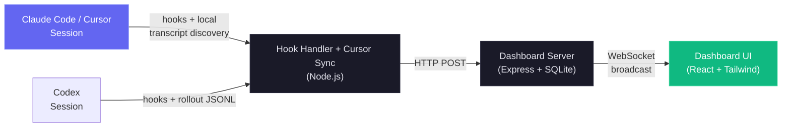

In addition to the real-time monitoring dashboard, it also includes a local MCP server implementation in `mcp/` that exposes a catalog of tools for introspecting and managing the dashboard itself, making it easy to integrate dashboard operations directly into your Claude Code & Codex workflows. There is also an agent extension layer, which provides Claude Code & Codex plugins, skills, and subagents for dashboard interaction, analytics, and workflow intelligence.

### Internationalization (i18n)

The UI ships with built-in locale switching for English (`en`), Chinese (`zh`), Vietnamese (`vi`), Korean (`ko`), and Spanish (`es`). A custom language dropdown prevents the selector from crowding the sidebar as more locales are added. Language resources are loaded by namespace and persisted through browser storage for stable user preference across refreshes.

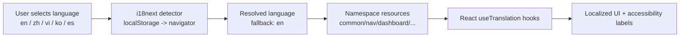

For full architecture and operational guidance, see [docs/I18N.md](./docs/I18N.md).

### User Interface

The responsive dark interface covers the full workflow without turning the repository page into a screenshot wall. Click any preview for the original resolution.

<p align="center">
  <a href="images/dashboard.png"></a>
  <br>
  <em>📡 <strong>Dashboard</strong> · fleet totals, active agents, recent activity, and live health signals</em>
</p>

<p align="center">
  <a href="images/board.png"></a>
  <br>
  <em>📋 <strong>Kanban Board</strong> · working, waiting, completed, and failed agents with clear waiting reasons</em>
</p>

<p align="center">
  <a href="images/session-conversation.png"></a>
  <br>
  <em>💬 <strong>Conversation</strong> · rendered transcripts, code, tool calls, command output, and session markers</em>
</p>

<p align="center">
  <a href="images/analytics.png"></a>
  <br>
  <em>📊 <strong>Analytics</strong> · model tokens, tool frequency, activity heatmaps, and session trends</em>
</p>

<p align="center">
  <a href="images/workflows.png"></a>
  <br>
  <em>🔀 <strong>Workflows</strong> · orchestration graphs, tool flow, collaboration, delegation, and dynamic runs</em>
</p>

<p align="center">
  <a href="images/config.png"></a>
  <br>
  <em>🧰 <strong>Agent Config</strong> · inspect and safely edit supported Claude Code and Codex configuration</em>
</p>

<p align="center">
  <a href="images/run.png"></a>
  <br>
  <em>▶️ <strong>Run Agent</strong> · launch, stream, resume, and reattach Claude Code or Codex sessions</em>
</p>

<p align="center">
  <a href="images/settings.png"></a>
  <br>
  <em>⚙️ <strong>Settings</strong> · pricing, hooks, notifications, data, remote sources, alerts, and system status</em>
</p>

The sidebar links Dashboard, Kanban Board, Sessions, Activity Feed, Analytics, Workflows, Agent Config, Run Agent, and Settings. The sections below describe the complete behavior behind these eight representative views.

---

## Features

The dashboard covers the complete local agent lifecycle. Detailed operational contracts remain in the linked sections and `docs/` references.

| Feature | Summary |
| --- | --- |
| **Task Progress** | Owner-aware progress from Claude task tools, legacy `TodoWrite`, and Codex `update_plan`. Compact previews appear on cards and rows; Session Detail adds status segments, active work, owners, and 10-row paging. New top-level work clears stale unfinished state, while completed history remains. |
| **Dashboard** | Persistent **Monitor** and **Health** tabs combine fleet totals, active hierarchies, recent activity, weighted success/cache/error/heap health, storage, tools, models, subagent effectiveness, and compaction metrics. Health refreshes every 5 seconds from `/api/settings/info` and `/api/workflows`. |
| **Kanban Board** | Agent columns cover Working, Waiting, Completed, and Error; session columns add Active and Abandoned. Cards page 10 at a time, subscribe only to the active WebSocket view, preserve full titles, and explain waiting reasons such as permission input, turn completion, prompt idle, or interruption. |
| **Sessions** | Searchable, filterable, server-paginated history with visible-page cost calculation and a temporary in-memory Codex startup row. Search covers `id`, `name`, and `cwd` with a 300 ms debounce. Names resolve from explicit title, AI title, then the first meaningful user prompt. |
| **Session Detail** | Live stats, active work, tool usage, subagents, tokens, hierarchy, filtered event timelines, `tool_use_id` grouping, and tool-specific renderers. Conversation view renders queued turns, system notices, Markdown, highlighted code, and styled tools; waiting banners show the reason and elapsed time. |
| **Activity Feed** | Pausable real-time events with shared filters, server pagination, grouping, project/session/subagent origin, session links, and consistent Claude/Codex status badges. |
| **Analytics** | Model tokens, tool frequency, Sunday-aligned activity heatmaps, session trends, connection state, layout-matched loading skeletons, and paged long legends. |
| **Command Palette** | `Cmd/Ctrl+K` searches recent commands, all routes, live server-side sessions, page actions, project directories, subviews, filters, Settings, Agent Config, preferences, scope, and language. It supports subsequence ranking, `>`/`@`/`#` scopes, full keyboard control, translated labels, quiet search failure, and navigation-only handling for destructive actions. |
| **One Shortcut** | `Cmd/Ctrl+K` is the sole global dashboard chord, including inside fields. Removed multi-key navigation avoids hidden modes; Tabby retains `Cmd/Ctrl+B`. |
| **Live Updates** | WebSocket push updates the interface without polling. |
| **Auto-Discovery** | Provider signals create sessions and agents automatically. Claude appears at `SessionStart`; Codex shows a temporary local Waiting card before a durable ID exists, safely adopts resumed finished threads, and never writes pre-identity cards into durable totals, analytics, alerts, or notifications. |
| **History Import** | Claude transcripts from `~/.claude/` and Codex rollouts from `~/.codex/sessions` use provider-specific scan and upload flows, shared live-ingestion accounting, and idempotent writes. External Codex rollouts are snapshotted so conversations survive source removal. |
| **Subagent Hierarchy** | Collapsible parent-child trees on Dashboard and Session Detail auto-expand while children are active. |
| **Background Agents** | Background subagents remain tracked without premature completion. |
| **Subagent Tool Attribution** | `SubagentStop` and startup scans import per-subagent JSONL tools, pair results by `tool_use_id`, deduplicate, merge matching live rows within 30 seconds, and reconstruct true nested parents from spawned-child IDs. Reparenting is additive and triggers UI refresh even when no row is inserted. |
| **Cost Tracking** | Configurable per-model and per-session pricing supports dated introductory rates, editable promo categories, each subagent's own cost, and compaction-safe totals. Transcript reads use cached incremental byte offsets. |
| **Transcript Cache** | Incremental JSONL parsing extracts tokens, compactions, API errors, turn durations, thinking, and usage metadata; full parses repair legacy duplicates while tail parses stay append-only. Arrays cap at `TRANSCRIPT_CACHE_MAX_ARRAY_LEN`, default `1000`, and entries store only file metadata plus the parsed result. |
| **Transcript Snapshot Retention** | Durable Claude, Codex, and Cursor snapshots preserve the most complete conversation. Missing-source Claude and Cursor copies gzip after verified round-trip; purge removes snapshots; optional age/size caps can prune the only old copy after a Settings dry-run preview. |
| **Notifications** | VAPID Web Push delivers configured events in background or closed-browser states, with macOS audio support and subscription controls. |
| **Alerts** | Settings provides Rules, Channels, and Activity for event-pattern, inactivity, stuck-agent, and token alerts. Event rules run after ingestion; time rules sweep every 60 seconds. Persisted alerts use per-rule/session cooldown, default 300 seconds, WebSocket delivery, acknowledgement, and scoped webhook fan-out to 14 named providers or generic signed JSON with masked secrets, timeouts, and bounded retries. |
| **Update Notifier** | A non-blocking scheduled `git fetch` compares the checkout with the canonical remote, then shows the exact update command in the modal, sidebar, and terminal. CCAM never pulls or restarts itself. |
| **Settings** | System and hook status, per-provider pricing, notifications, cleanup, provider homes, instant data refresh, and idempotent restore of export JSON up to 25 MiB. Pricing supports provider-scoped defaults, wildcard rules, published-rate guidance, the 272K GPT boundary, and separate Cursor-native and third-party catalogs. |
| **Run Agent + Agent Config** | `/run` launches Claude Code or native Codex app-server threads with provider-specific models, approvals, sandboxing, resume, stop, stream, and reattach. `/cc-config` pairs editable Claude and Codex explorers; supported user files use guarded atomic saves and timestamped backups, secret-redacted previews, exact profile commands, and provider-specific watchers. |
| **Codex Agent Config** | Shows the full account model catalog plus base/profile overrides, creates standard `<name>.config.toml` overlays, and guards editing with canonical containment and symlink checks. Profiles, hooks, rules, skills, and instructions support source/path/edit/delete actions with backup-first deletion; `config.toml` is edit-only. |
| **MCP Server (Local)** | Three transports, stdio, HTTP+SSE, and REPL, expose 103 typed tools across 16 modules. One validated catalog enforces localhost or HTTPS targets, bearer-token rules, redirect rejection, mutation gates, 50 MiB per-file and 100 MiB per-call uploads, 10 MiB binary responses, and 25 MiB restores. |
| **Workflows** | Eleven D3 sections cover orchestration, tool flow, collaboration, effectiveness, patterns, delegation, errors, concurrency, complexity, compaction, and session drill-in. Localized explanatory tooltips, cross-filtering, JSON export, 3-second-debounced live refresh, and journal-reconstructed dynamic runs preserve per-agent phase, token, tool, duration, prompt, and result detail. |
| **Compaction Tracking** | Transcript scans create zero-duration compaction agents/events, repair legacy negative durations, backfill old sessions, and periodically inspect only active sessions through cached `sessions.transcript_path` values. |
| **Subsessions/Resumed Sessions** | New events reactivate resumed or orphaned sessions; a sweep every quarter of `DASHBOARD_STALE_MINUTES`, bounded to 60 seconds through 5 minutes, catches abandoned sessions. |
| **Pre-Existing Session Detection** | Startup import marks recently modified transcripts active, and later Stop events reactivate imported completed or abandoned sessions before updating them. |
| **Continuous Project Sync** | An immediate startup sweep, debounced filesystem watcher, and `DASHBOARD_SESSION_SYNC_MS` poll, default 30 seconds, share an mtime cache and coalesced scan. Only new or advanced files reparse, with Linux-safe watcher scope and live session broadcasts. |
| **Remote Data Sources** | SSH sources independently mirror Claude and Codex homes through `scp` or WSL `tar`, tag `sessions.source`, reconcile lifecycle, and remain healthy if either provider works. Polling defaults to 15 seconds; stale fallback affects only the failed provider. Credentials remain with host SSH. |
| **Remote Push Ingestion** | `POST /api/hooks/ingest-batch` supports machines behind NAT. It stays disabled until `REMOTE_PUSH_TOKEN`, rejects query-string tokens and locally owned sessions, caps batches at 1000, deduplicates `(session_id, event_type, uuid)`, returns per-item partial errors, and broadcasts only after commit. |
| **Responsive Design** | Mobile layouts stack grids, scroll wide tables, and collapse navigation. |
| **UI Localization** | English, Chinese, Vietnamese, Korean, and Spanish cover UI copy, accessibility labels, workflow explanations and tooltips, model-pricing guidance, provider homes, and Import History. |
| **Seed Data** | A built-in script provides realistic demo and development data. |
| **Statusline** | A color CLI strip shows model, context, Git branch, directional tokens, and USD session cost. |
| **Model Name Formatting** | Claude, GPT, and Gemini identifiers become readable names by removing provider/date/latest suffixes, joining numeric versions, and formatting context tags; Settings keeps raw pricing patterns. |
| **Claude + Codex Plugin Marketplace** | One 14-plugin tree ships both manifest formats and catalogs, 66 plugin skills, 18 Claude subagents, 34 Claude commands, 3 CLI helpers, and OpenAI metadata. `npx skills add hoangsonww/Claude-Code-Agent-Monitor --list` discovers 77 repository skills. |
| **Run Claude** | Conversation and one-shot modes support resume/view history, concurrent background runs, transcript-aware reattach, model/effort/permission/cwd controls, partial-message smoothing, thinking preservation, slash commands, `@` files, context and cost meters, and live status. Same-origin protection blocks drive-by spawning; concurrency defaults to a 10000 safety ceiling and can be reduced with `RUN_MAX_CONCURRENT`. |
| **Claude Config Explorer** | Twelve tabs inspect skills, agents, commands, styles, plugins, marketplaces, MCP, hooks, settings, memory, keybindings, and statusline. Canonical paths block symlink escape; supported text surfaces use atomic create/edit/delete with out-of-tree timestamped backups, while sensitive configuration stays read-only with exact CLI guidance. A 500 ms `cc-watcher` broadcasts external changes. |
| **Tabby** | A dependency-free WebSocket mascot with eight activity-derived moods, throttled speech, quick actions, local status answers, and Run Claude handoff for broader prompts. It is keyboard accessible, reduced-motion aware, safe when disconnected, configurable, and localized. |
| **Sound Cues** | Seven dependency-free Web Audio cues cover sessions, errors, subagents, notifications, connection, and clicks. Cooldowns, a global burst budget, low-pass filtering, autoplay safety, persisted volume, and per-cue settings keep them unobtrusive. |
| **Progressive Web App (PWA)** | Dashboard, landing page, and Wiki have independent manifests and service workers. Immutable Vite assets are cache-first; navigation and mutable shell files are network-first; push remains intact; landing and Wiki precache their shells and lazy-cache screenshots; SVG and Apple metadata support installation. |
| **Desktop App (macOS & Windows)** | Electron 35 packages macOS DMGs and Windows installer/portable EXEs around the same in-process Express server and React client. It adds native menus, tray status/actions, login launch, quit confirmation, native notifications, a single-instance lock, safe port fallback/adoption, clean SQLite shutdown, and first-run hook/background setup. |
| **Self-hosted assets (no CDN)** | Fonts, scripts, Wiki Mermaid, and extension fallbacks are local. The app, landing page, and Wiki work offline without Google Fonts, jsDelivr, or other third-party asset requests. |
| **Session splash screen** | A localized, once-per-browser-session greeting and node-graph animation appears opaque from first paint, lasts about 2.5 seconds, supports click-to-skip, and honors reduced motion. |

> **Provider scope and homes:** Settings keeps the Claude-compatible (Claude Code + Cursor) / Codex / Both choice globally consistent. Claude Code and Codex homes remain editable without restarting the dashboard; Cursor is discovered automatically from `~/.cursor` or `DASHBOARD_CURSOR_HOME`.
>
> **Local safety boundaries:** Run Agent accepts any existing absolute working directory and canonicalizes it before use, so home and recent-project launches remain supported. Hosted webhook providers require HTTPS; generic and n8n targets may use HTTP for local/self-hosted receivers, and delivery never follows redirects.

---

## Quick Start

### Prerequisites

- **Node.js** >= 22.22.0 (24 LTS recommended)
- **npm** >= 9.0.0

### 1. Install

```bash
git clone https://github.com/hoangsonww/Claude-Code-Agent-Monitor.git
cd Claude-Code-Agent-Monitor
npm run setup
```

### 2. Configure Claude Code Hooks

```bash
npm run install-hooks
```

Choose **Claude Code**, **Codex (beta)**, or both with the arrow keys, Space, and Enter. Claude hooks are stored in `~/.claude/settings.json` and Codex hooks in `~/.codex/hooks.json`. Reinstalling replaces only CCAM entries and preserves unrelated hooks; the same action is available under **Settings → Hook Configuration**.

On first launch, CCAM checks only the providers selected for the current data scope and offers to install any missing hooks. A failed readiness check falls back to manual setup instead of blocking the dashboard.

Provider discovery continues after setup:

- **Claude Code and Cursor:** Claude hooks feed live events. Cursor needs no hooks; selecting Claude Code also watches `~/.cursor/chats` and `~/.cursor/projects/*/agent-transcripts`, snapshots conversations before Cursor cleanup, and honors `DASHBOARD_CURSOR_HOME`.
- **Codex:** hooks and incremental `~/.codex/sessions` rollout watching keep lifecycle, prompts, titles, tools, tokens, costs, compactions, conversations, and WebSocket state current. Bad files retry in isolation; exact rollout/process matching prevents phantom active cards; native `/rename` titles and cursor-paged conversation history stay live.
- **Both:** cards retain the latest two distinct human prompts, render persisted image attachments, and deduplicate repeated Codex responses. Codex-only scope hides Claude-only Dynamic Workflow journals.

### 3. Start

```bash
# Development (hot reload on both server and client)
npm run dev

# Production (single process, built client)
npm run build && npm start
```

> [!TIP]
> **Makefile alternative** — all commands are also available via `make` if you have it installed on your system. Run `make help` to see every target, or use shortcuts like `make dev`, `make build`, `make test`, etc.

### 4. Open

| Mode        | URL                     |
| ----------- | ----------------------- |
| Development | `http://localhost:5173` |
| Production  | `http://localhost:4820` |

### 5. Optional: Run the local MCP server

```bash
npm run mcp:start              # stdio (default — for MCP host integration)
npm run mcp:start:http         # HTTP + SSE server on port 8819
npm run mcp:start:repl         # interactive CLI with tab completion
ccam mcp stdio                 # stable launcher used by bundled plugins
```

`npm run setup` installs and builds the MCP package before linking `ccam`. For stdio mode, configure your host with command `ccam` and args `["mcp", "stdio"]`.

For HTTP mode, point remote MCP clients at `http://127.0.0.1:8819/mcp` (Streamable HTTP) or `http://127.0.0.1:8819/sse` (legacy SSE).

See [mcp/README.md](./mcp/README.md) for full host configuration, transport details, safety flags, and tool catalog.

### Optional: Seed Demo Data

```bash
npm run seed
```

Creates 8 sample sessions, 23 agents, and 106 events so you can explore the UI immediately.

### Alternative: Desktop App (macOS & Windows)

If you'd rather not keep a terminal open, install the optional **native desktop app**. It embeds the server in-process, adds a menu-bar / notification-area (tray) icon, and supports auto-start at login (macOS Login Items / Windows startup).

The fastest path is to **download a pre-built installer** from the [latest GitHub Release](https://github.com/hoangsonww/Claude-Code-Agent-Monitor/releases/latest) (CI auto-publishes a `vX.Y.Z` whenever `package.json` is bumped on `master`):

- **macOS** — grab `ClaudeCodeMonitor-<version>-arm64.dmg` (Apple Silicon) or `-x64.dmg` (Intel) and drag **Claude Code Monitor.app** into `/Applications`.
- **Windows** — grab `ClaudeCodeMonitor-Setup-<version>-x64.exe` (installer) or `ClaudeCodeMonitor-<version>-x64-portable.exe` (no-install) and run it.

To build it yourself instead:

```bash
npm run desktop:install        # install Electron + electron-builder into desktop/ (preflights native deps; prints setup help on failure)
npm run desktop:dmg:arm64      # macOS: fast single-arch DMG (Apple Silicon)
npm run desktop:win            # Windows: NSIS installer .exe (run on Windows)
```

Full coverage of the desktop app — download, install, tray/menu features, build commands, and signing — is in the [Desktop App (macOS & Windows)](#desktop-app-macos--windows) section below. See also [`DESKTOP.md`](./DESKTOP.md) (user guide) and [`desktop/README.md`](./desktop/README.md) (architecture).

### Alternative: Docker / Podman

The OCI image and Compose files support Docker and Podman. The runtime is non-root, drops all capabilities, uses Tini as PID 1, includes Git/OpenSSH/SQLite, and becomes read-only except for `/app/data`, `/app/config`, and `/tmp`.

```bash
# Dashboard only
docker compose up -d --build
# or
podman compose up -d --build

# Complete stack: dashboard + authenticated MCP + Nginx + Prometheus + Grafana
umask 077
openssl rand -hex 32 > deployments/secrets/dashboard-token
openssl rand -hex 32 > deployments/secrets/hook-token
openssl rand -hex 32 > deployments/secrets/mcp-token
openssl rand -base64 32 > deployments/secrets/grafana-admin-password
npm run docker:full:up
```

All host ports bind to loopback by default: dashboard `4820`, MCP `8819`, Nginx `8080`, Prometheus `9090`, and Grafana `3000`. Claude and Codex homes are mounted read-only; named volumes persist SQLite and dashboard-owned configuration. Nginx proxies the UI, authenticated REST API, and WebSocket, while hooks, metrics, and MCP stay blocked at the edge unless explicitly enabled. The optional `agent-runtime` Docker target adds pinned Claude Code and Codex CLIs for container-native Run Agent workflows.

> [!IMPORTANT]
> Install Claude Code/Codex hooks on the host after the container starts. For remote cloud hooks, set `CCAM_DASHBOARD_URL=https://...` and a separate `CCAM_HOOK_TOKEN`; non-loopback hook URLs require HTTPS. See [DEPLOYMENT.md](DEPLOYMENT.md).

---

## How It Works

The dashboard integrates with Claude Code via its native hook system to provide real-time monitoring of agent activity. Here's an overview of the architecture and data flow:

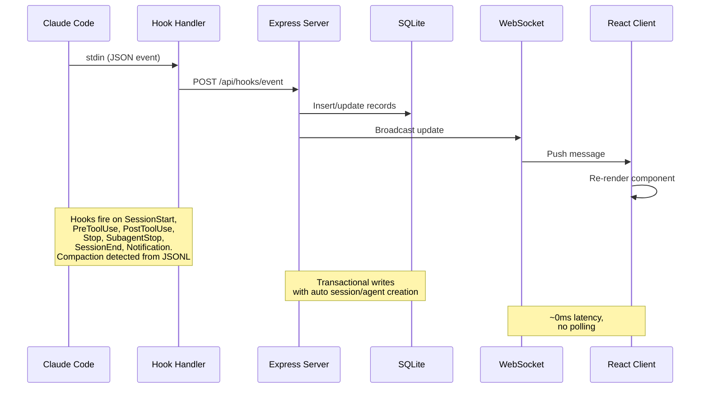

> [!IMPORTANT]
> See [ARCHITECTURE.md](./ARCHITECTURE.md) for a deep dive into the server architecture, database schema, API routes, WebSocket design, client routing, hook handler flow, deployment modes, and detailed lifecycle diagrams for sessions and agents.

### Hook Lifecycle

1. **Claude Code** emits session, prompt, tool, notification, subagent, turn, and exit hooks.
2. **`scripts/hook-handler.js`** reads each event from stdin and discovers live dashboards through `~/.claude/.agent-dashboard.json` or `CLAUDE_DASHBOARD_PORT`. It sends once per unique SQLite data directory, choosing the lowest port for duplicate listeners while still feeding dashboards with separate databases. Delivery is fail-safe: each target is isolated and the handler exits within 5 seconds.
3. **The server** commits the event and related state in one SQLite transaction:
   - First contact creates the session and main agent. `SessionStart` begins in **Waiting**; `UserPromptSubmit` or `PreToolUse` moves it to **Working**; `PostToolUse` keeps it working.
   - `Stop` returns the main agent to **Waiting** while background agents continue. `stop_reason=error` marks the agent and session **Error**. Permission notifications also wait for input; only a new prompt or tool start recovers an error.
   - `SubagentStop` completes that child without changing the human-wait state. A detached scan then imports its JSONL tools, pairs use/results by `tool_use_id`, deduplicates them, and rebuilds true nested parents.
   - `SessionEnd` clears waiting and completes the session unless an error must be preserved. New work reactivates completed, errored, or abandoned sessions, including imported and resumed sessions.
   - `SessionStart` and periodic maintenance abandon inactive sessions after `DASHBOARD_STALE_MINUTES`, default 180. The sweep runs every quarter of that value, clamped to 60 seconds through 5 minutes.
   - Shared incremental transcript parsing records compactions, API and tool errors, turn durations, tokens, and metadata without rereading unchanged bytes. Active-session sweeps use indexed `sessions.transcript_path` values and evict abandoned cache entries.
   - A 15-second watchdog finds transcript API errors after 10 seconds without hooks. It also recovers Esc interruptions from transcript markers or, when no marker exists, after `DASHBOARD_WORKING_IDLE_SECONDS`, default 120, only when no tool is running and neither hooks nor transcript advance.
   - The same watchdog completes dead local sessions through a process-liveness probe after `DASHBOARD_LIVENESS_IDLE_SECONDS`, default 60. Startup probes run immediately and again after about 5 seconds without that idle gate. The probe skips Windows, containers, non-POSIX forwarded paths, remote-source sessions, tool failures, and `DASHBOARD_LIVENESS_PROBE=0`; a later real hook self-heals a false completion.
   - Continuous project sync combines an immediate sweep, debounced `fs.watch`, and `DASHBOARD_SESSION_SYNC_MS` polling, default 30 seconds. One mtime cache reparses only new or grown transcripts and broadcasts the same session frames as hooks.
4. **WebSocket** publishes the committed change.
5. **The UI** refreshes the affected views without polling.

### Agent State Machine

Persisted statuses: `working | waiting | completed | error`. The
`awaiting_input_since` column is supplementary — it tracks when the agent
started waiting and is used for duration display, but `waiting` is now a
real persisted status.

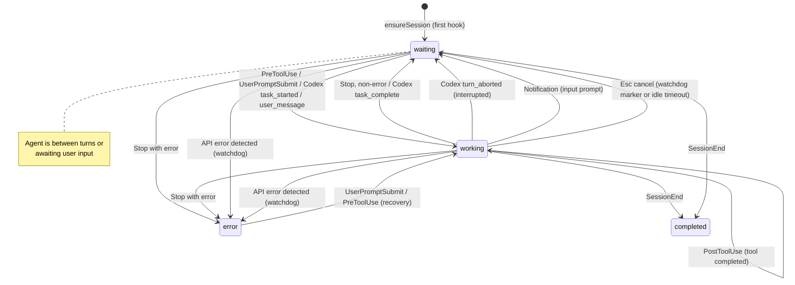

### Session State Machine

Persisted statuses: `active | completed | error | abandoned`. The
**Waiting** session state is a UI overlay (status=`active` with
`awaiting_input_since` set).

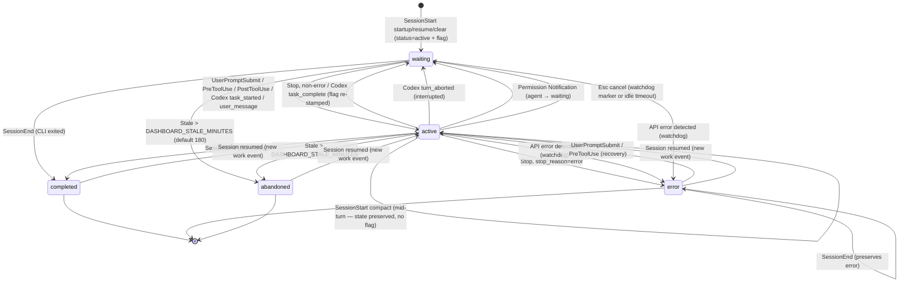

### Cost Calculation Flow

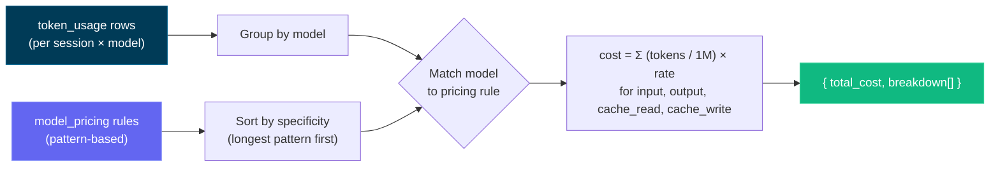

> [!IMPORTANT]
> The cost calculation flow is based on token usage and model pricing rules. Ensure your pricing rules are up-to-date to reflect accurate costs. Update the model pricing table via the Settings page to maintain accurate cost tracking - the dashboard does not automatically fetch pricing updates from external sources. Once you set the pricing rules, the dashboard applies them retroactively to all sessions for consistent cost reporting.

---

## Configuration

| Environment variable | Default | Purpose |
| --- | --- | --- |
| `DASHBOARD_PORT` | `4820` | Express server port. |
| `CLAUDE_DASHBOARD_PORT` | `4820` | Port used by the hook handler. |
| `NODE_ENV` | `development` | Use `production` to serve the built client. |
| `DASHBOARD_UPDATE_CHECK` | enabled | Set `0`, `false`, or `off` to disable scheduled upstream checks. |
| `DASHBOARD_UPDATE_CHECK_INTERVAL_MS` | `300000` | Update interval, minimum 60,000 ms. Manual **Check now** remains available. |
| `DASHBOARD_STALE_MINUTES` | `180` | Inactivity before an active or Waiting session becomes abandoned. The watchdog enforces it and maintenance runs every quarter of this value, clamped to 60 seconds through 5 minutes. |
| `DASHBOARD_WORKING_IDLE_SECONDS` | `120` | Recovers a markerless Esc cancellation when no tool, hook, or transcript activity advances. Lower values react faster but can briefly misclassify long silent turns; new activity self-heals. Cursor uses the same rule. |
| `DASHBOARD_LIVENESS_PROBE` | `1` | Set `0` to disable process-based completion for dead local Claude/Codex sessions. Automatically skips Windows, containers, forwarded non-POSIX paths, and remote sources. |
| `DASHBOARD_LIVENESS_IDLE_SECONDS` | `60` | Transcript or last-hook idle gate for watchdog liveness checks. Startup probes ignore the gate so already-dead sessions clear immediately. |
| `DASHBOARD_SESSION_SYNC_MS` | `30000` | Safety poll for new or changed `~/.claude/projects` files. `fs.watch` remains immediate; `0` disables only polling. |
| `DASHBOARD_CURSOR_HOME` | `~/.cursor` | Cursor state root for chats, transcripts, backfill, and durable snapshots. |
| `DASHBOARD_CURSOR_SYNC_MS` | `5000` | Fingerprinted Cursor safety poll. Watchers stay active when `0` disables polling. |
| `DASHBOARD_CODEX_HOME` | `CODEX_HOME` or `~/.codex` | Codex state root. Settings persists an override, rearms watching, and scans immediately. |
| `DASHBOARD_CODEX_SYNC_MS` | `4000` | Codex rollout safety poll. Hooks and watchers remain active when set to `0`. |
| `DASHBOARD_CODEX_MAX_ATTEMPTS` | `5` | Attempts for one unchanged unreadable rollout, including the first. A size or mtime change resets the budget; exhaustion logs once. |
| `DASHBOARD_CODEX_HOOK_IDLE_SECONDS` | `60` | Completes hook-only Codex sessions, such as `codex exec --ephemeral`, when a reported-finished `stop` never receives `SessionEnd`. Silence alone never qualifies. |
| `DASHBOARD_TASK_SUMMARY_TTL_MS` | `2000` | Serve-stale window for task summaries and `todo_snapshot`. Appends parse incrementally; growth over 32 MiB restarts from a fresh tail. `0` parses every append. |
| `DASHBOARD_SNAPSHOT_COMPRESS` | `1` | Set `0`, `false`, or `off` to stop verified gzip conversion of 24-hour-idle Claude/Cursor snapshots whose source disappeared. Unreadable source trees and Codex snapshots are skipped. |
| `DASHBOARD_SNAPSHOT_MAX_AGE_DAYS` | unset | Optional six-hour retention pass for finished sessions older than this age. Pruned sessions are tombstoned; resumed sessions are protected. Preview with `ccam snapshots prune --days N` because the snapshot can be the only copy. |
| `DASHBOARD_SNAPSHOT_MAX_BYTES` | unset | Optional total snapshot cap in bytes or units such as `5GB`. Oldest finished sessions prune first; active or last-24-hour sessions remain protected. |
| `DASHBOARD_REMOTE_SYNC_MS` | `15000` | SSH remote-source poll for Claude projects, Codex rollouts, and Codex title indexes. New or re-enabled sources sync immediately; `0` leaves manual sync available. |
| `DASHBOARD_REMOTE_ACTIVE_WINDOW_MS` | `600000` | Treats a mirrored remote transcript as active while its latest event is this fresh, then reconciles it to completed. Failed providers fall back to normal stale handling. |
| `DASHBOARD_REMOTE_SYNC_TIMEOUT_MS` | `600000` | Per-source timeout for SSH pull plus import. |
| `DASHBOARD_REMOTE_TEST_TIMEOUT_MS` | `15000` | Timeout for the remote-source SSH test. |
| `DASHBOARD_HOST` | `127.0.0.1` | Bind interface. `0.0.0.0` exposes the service and logs a warning. |
| `DASHBOARD_TOKEN` | unset | Protects `/api/*` and WebSocket via Bearer header, `x-dashboard-token`, or `?token=`. Loopback is the default trust boundary. |
| `DASHBOARD_TOKEN_FILE` | unset | File-backed dashboard token for Docker/Kubernetes secrets; `DASHBOARD_TOKEN` wins. |
| `DASHBOARD_HOOK_TOKEN` / `DASHBOARD_HOOK_TOKEN_FILE` | unset | Independent protection for `/api/hooks/event` and `/api/hooks/codex` beyond loopback. |
| `REMOTE_PUSH_TOKEN` / `REMOTE_PUSH_TOKEN_FILE` | unset | Separate gate for public `POST /api/hooks/ingest-batch`. The route stays disabled by default and never inherits the local hook token. |
| `DASHBOARD_ALLOWED_HOSTS` | loopback | Extra comma-separated HTTP and WebSocket `Host` values for the DNS-rebinding guard. |
| `DASHBOARD_ENV_PATH` | repo `.env` | Writable dotenv file used to persist provider-home overrides; containers default to `/app/config/.env`. |
| `CCAM_DASHBOARD_URL` | localhost discovery | Remote hook destination. Non-loopback URLs require HTTPS and a hook token. |
| `CCAM_HOOK_TOKEN` / `CCAM_HOOK_TOKEN_FILE` | unset | Hook-client credential sent as `x-ccam-hook-token`. |

> [!IMPORTANT]
> The server is loopback-only by default. LAN access requires `DASHBOARD_HOST`, `DASHBOARD_TOKEN`, and matching `DASHBOARD_ALLOWED_HOSTS` values. See [`.env.example`](./.env.example) and [the security policy](./.github/SECURITY.md).

Git clones periodically fetch the canonical remote and compare its default branch with the current checkout. When behind, the terminal and UI show the exact manual update command. CCAM never pulls or restarts itself.

---

## `ccam` CLI

The **`ccam`** CLI (`bin/ccam.js` → `cli/`) exposes the dashboard from any terminal through a Commander.js command tree with inherited options, validation, suggestions, generated help, and shell completion. `npm run setup` links it automatically. Server resolution checks `--server` / `CCAM_URL`, configured ports, the live-server registry, then `http://127.0.0.1:4820`.

```bash
# Server
ccam status | health                  # ● running / ○ not running; version + timestamp
ccam start [--port N] | stop | restart  # background production server
ccam logs [-n N] [-f]                 # tail data/ccam-server.log
ccam open [page] [--session id]       # open the dashboard, a page, or a session
ccam repl                             # interactive shell (also: shell, i)

# Monitoring
ccam overview [--watch]               # one-screen live snapshot (alias: top)
ccam stats | kanban                   # totals + status distributions / status lanes
ccam tail [--session id] [--type T] [--tool N]   # live event feed
ccam stream [--type new_event,…]      # raw real-time WebSocket feed
ccam watch -n 5 <command …>           # re-run any command on an interval

# Data
ccam sessions [--status s] [--q text] [--cwd dir] [--sort price] [--limit n]
ccam sessions get|stats|cost|agents|events|transcripts <id>
ccam sessions transcript <id>         # the conversation as a readable chat log
ccam sessions rename <id> <name…> | update <id> | create | facets
ccam agents [list|get|update|create]  # agents; ccam session <id> = sessions get
ccam events [--type T] [--tool N] [--q text] [--from iso] | events facets

# Insights
ccam analytics                        # tokens, cost, top tools, daily sparklines
ccam workflows [session <id>]         # workflow intelligence + patterns
ccam runs [list|get <run-id>]         # Workflow-tool runs
ccam run list|history|start|follow|send|stop …   # dashboard-launched agents
ccam cost [--session id] [--daily]    # per-model cost, surcharges, unpriced models

# Alerts & webhooks
ccam alerts [--unacked] | ack <id> | ack-all
ccam alert-rules list|types|create|update|enable|disable|delete
ccam webhooks list|get|providers|deliveries|create|update|enable|disable|delete|test

# Pricing
ccam pricing [list] | set <pattern> --input N --output N [--fast-* …] [--intro-* …] | delete | reset
ccam pricing gpt|cursor [list|set|delete]   # OpenAI/Codex and Cursor rate cards

# Import & remote sources
ccam import guide|rescan|path <dir>|upload <files…>|reimport
ccam import-data <file.json>          # restore an export (idempotent)
ccam remote-sources list|get|add|update|enable|disable|test|sync|rm

# Administration
ccam doctor | info | export [file|-] | cleanup --hours N --days M
ccam snapshots [status|compress] | snapshots prune --days N   # transcript snapshots; prune dry-runs unless --apply --confirm PRUNE_SNAPSHOTS
ccam hooks [status|install] | reinstall-hooks | config claude|codex …
ccam updates [status|check] | update-check | metrics [--grep re]
ccam home [set claude|codex <path>] | push key|send|subscribe|unsubscribe
ccam api [METHOD] /api/path [--data JSON]   # any endpoint; writes need --yes
ccam mcp [stdio|http|repl] | clear-data --yes

# CLI
ccam help [command…] | commands [--json] | completion bash|zsh|fish | version
```

Groups list by default (`ccam alerts` equals `ccam alerts list`); every command supports `--help`; `ccam commands` prints the tree, and `ccam commands --json` emits its machine-readable schema.

- **Output:** TTYs get tables, status icons, charts, sparklines, agent trees, transcript views, and colored help. Pipes get plain text. `--json` or `CCAM_OUTPUT=json` returns stable JSON, with NDJSON for `tail`, `stream`, and `run follow`; errors use `{"error":{"code":"…","message":"…"}}` on stderr and exit `0` or `1`.
- **Writes:** use interactive `y/N` or `--yes`; non-interactive writes require `--yes`, and `clear-data` always requires the literal flag.
- **Offline mode:** read-only commands fall back to `data/dashboard.db`, display an `⚠ Offline mode` banner, and correct dead active sessions through the liveness view. Server-only commands explain why the dashboard is unavailable.
- **REPL and completion:** `ccam repl` adds tree-driven completion, persistent history, a live prompt, and `help`, `json`, and `watch` built-ins, with each line isolated in a child process. Enable zsh completion with `source <(ccam completion zsh)`.

If `ccam` is not on `PATH`, run `npm link` once from the repository root. See [docs/CLI.md](./docs/CLI.md) for the full contract.

## npm Scripts

| Command                 | Description                                                |
| ----------------------- | ---------------------------------------------------------- |
| `npm run setup`         | Install root/client/extension/MCP dependencies, build MCP, and link `ccam` |
| `npm run update:pull-setup` | `git pull --ff-only` then `npm run setup` (manual upgrade) |
| `npm run dev`           | Start server (watch mode) + client (Vite HMR) concurrently |
| `npm run dev:server`    | Start Express with a debounced, graceful-restart source watcher |
| `npm run dev:client`    | Start only the Vite dev server                             |
| `npm run build`         | Build the React client to `client/dist/`                   |
| `npm start`             | Start production server (serves built client)              |
| `npm test`              | Run the full suite (server `node --test` + client Vitest)  |
| `npm run verify`        | Run the whole local gate in one command: authorship-header audit, Prettier check, client typecheck, backend tests, frontend tests |
| `npm run check:headers` | Audit that every applicable source file carries the authorship header |
| `npm run typecheck:client` | Typecheck the client (`tsc -b`) — the same check the production build runs before Vite |
| `npm run test:server`   | Run backend tests (`node --test server/__tests__/`)        |
| `npm run test:client`   | Run frontend Vitest tests, including **render snapshots for every screen** (`client/src/pages/__tests__/screens.snapshot.test.tsx`); regenerate baselines after intentional UI changes with `cd client && npx vitest run -u` |
| `npm run install-hooks` | Configure Claude Code hooks in `~/.claude/settings.json`   |
| `npm run seed`          | Populate database with sample data                         |
| `npm run import-history`| Import legacy sessions from `~/.claude/` (also runs on startup) |
| `npm run reconcile-tokens`| Refresh token totals for imported sessions (never lowers a total) |
| `npm run repair-tokens` | Re-derive **non-workflow** token totals for every **Claude** session with a transcript on disk (found under `~/.claude/projects/` or via the session's stored `transcript_path`) and zero the compaction baselines; workflow and Codex rows are preserved. One-time repair for databases affected by the pre-v2.0.9 per-record usage sum or by omitted same-model flat subagent usage. Stop the dashboard first |
| `DASHBOARD_TOKEN_REPAIR` | Enabled by default (`1`). One-time automatic repair of historical token totals affected by per-record inflation or omitted same-model flat subagents. Live fixes cannot revisit every completed session, and `replaceTokenUsage` cannot lower an old high-water mark. Runs once per database (marker-gated, deferred off the boot path, skipped while another dashboard shares the data directory) and snapshots the old rows to `token_usage_pre_repair_v2` first. Set to `0` to skip it and repair manually with `npm run repair-tokens` |
| `npm run clear-data`    | Delete all sessions, agents, events, and token usage            |
| `npm run mcp:install`   | Install dependencies for local MCP package (`mcp/`)       |
| `npm run mcp:build`     | Build MCP server TypeScript into `mcp/build/`             |
| `npm run mcp:start`     | Start MCP server (stdio transport — for MCP hosts)        |
| `npm run mcp:start:http`| Start MCP server (HTTP + SSE transport on port 8819)      |
| `npm run mcp:start:repl`| Start MCP server (interactive REPL with tab completion)   |
| `npm run mcp:dev`       | Run MCP server in dev mode (`tsx`, stdio)                 |
| `npm run mcp:dev:http`  | Run MCP server in dev mode (`tsx`, HTTP + SSE)            |
| `npm run mcp:dev:repl`  | Run MCP server in dev mode (`tsx`, interactive REPL)      |
| `npm run mcp:typecheck` | Type-check MCP source without emitting build output        |
| `npm run extensions:sync` | Regenerate skill names/OpenAI metadata, Codex manifests, and both marketplaces |
| `npm run extensions:validate` | Validate all 14 dual-format plugins and 66 bundled skills |
| `npm run mcp:docker:build` | Build MCP container image with Docker (`agent-dashboard-mcp:local`) |
| `npm run mcp:podman:build` | Build MCP container image with Podman (`localhost/agent-dashboard-mcp:local`) |
| `npm run desktop:install` | Install Electron + electron-builder into the `desktop/` workspace (rebuilds `better-sqlite3` for Electron's ABI); preflights the native `better-sqlite3` build and prints actionable setup help (incl. a no-toolchain alternative) on failure |
| `npm run desktop:dev`   | Build and launch the Electron desktop app for local iteration  |
| `npm run desktop:build` | Compile the desktop TypeScript sources into `desktop/out/`      |
| `npm run desktop:test`  | Run the desktop smoke test (spawn Electron, probe `/api/health`) |
| `npm run desktop:dmg`   | Build **both** macOS DMGs (arm64 + x64) — correct for release, **slower** (packages each arch) |
| `npm run desktop:dmg:arm64` | Build an Apple-Silicon-only DMG — **fast**, recommended for your own Mac |
| `npm run desktop:dmg:x64` | Build an Intel-only DMG — **fast**                           |
| `npm run desktop:dmg:universal` | Build one merged **universal** DMG (arm64 + x86_64) — optional, **slowest**, not what the release ships |
| `npm run desktop:win`   | Build a Windows **NSIS installer** `.exe` (x64) — run on Windows |
| `npm run desktop:win:portable` | Build a Windows **portable** (no-install) `.exe` (x64) — run on Windows |
| `npm run monitoring:install` | Run `npm install` in `monitoring/` — downloads Prometheus + Grafana via `postinstall` |
| `npm run monitoring:setup` | Alias for `monitoring:install` |
| `npm run monitoring:up` | Start Prometheus (:9090) + Grafana (:3000) in the background (no Docker) |
| `npm run monitoring:down` | Stop the npm-managed monitoring stack |
| `npm run monitoring:start` | Foreground monitoring stack (Ctrl+C stops both) |
| `npm run monitoring:docker:up` | Start Prometheus + Grafana via Docker Compose |
| `npm run monitoring:docker:down` | Tear down the Docker monitoring stack |
| `npm run monitoring:verify` | Health-check dashboard, Prometheus, Grafana, and scrape target |
| `npm run docker:up` | Start the dashboard in Docker (`docker compose up -d --build`) |
| `npm run docker:down` | Stop the dashboard container |
| `npm run docker:full:up` | Dashboard + authenticated MCP + rootless Nginx + Prometheus + Grafana |
| `npm run docker:full:down` | Tear down the full Docker stack |
| `npm run deploy:validate` | Review Docker, Compose, Nginx, Helm, Kustomize, Terraform, dependency audits, and the one-writer invariant. Findings are advisory (exit 0); `CCAM_DEPLOY_VALIDATE_STRICT=1` turns them into a hard gate |

---

## Agent Extensions

This repository includes a comprehensive extension layer for both Claude Code and Codex:

- Claude Code: `CLAUDE.md`, `.claude/rules/`, `.claude/skills/`
- Claude subagents: `.claude/agents/`
- Codex: `AGENTS.md`, `.codex/rules/`, `.codex/agents/`, `.codex/skills/`
- Shared distributable plugins: `plugins/`, with both `.claude-plugin/plugin.json` and `.codex-plugin/plugin.json`
- Marketplaces: `.claude-plugin/marketplace.json` for Claude Code and `.agents/plugins/marketplace.json` for Codex
- Open Agent Skills: all plugin skills carry canonical frontmatter plus `agents/openai.yaml`; `npx skills add hoangsonww/Claude-Code-Agent-Monitor --list` discovers 77 repository skills

### Extension Architecture

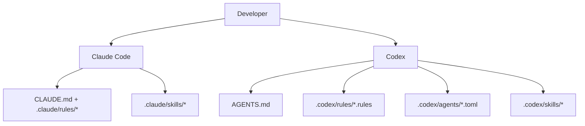

### Claude Code Layer

- Persistent context:
  - [`CLAUDE.md`](./CLAUDE.md)
- Path-scoped rules:
  - [`.claude/rules/backend-node.md`](./.claude/rules/backend-node.md)
  - [`.claude/rules/frontend-react.md`](./.claude/rules/frontend-react.md)
  - [`.claude/rules/mcp-typescript.md`](./.claude/rules/mcp-typescript.md)
  - [`.claude/rules/docs-markdown.md`](./.claude/rules/docs-markdown.md)
  - [`.claude/rules/file-headers.md`](./.claude/rules/file-headers.md)
  - [`.claude/rules/wiki-i18n.md`](./.claude/rules/wiki-i18n.md)
  - [`.claude/rules/i18n-parity.md`](./.claude/rules/i18n-parity.md)
- Skills:
  - `repo-onboarding`
  - `ship-feature`
  - `version-release`
  - `mcp-operations`
  - `debug-live-issue`
  - `update-project-docs`
  - `file-headers`
  - `push-to-forked-pr`
  - `i18n-parity`
- Subagents:
  - `backend-reviewer`
  - `frontend-reviewer`
  - `mcp-reviewer`

### Codex Layer

- Persistent context:
  - [`AGENTS.md`](./AGENTS.md)
- Execution policy:
  - [`.codex/rules/default.rules`](./.codex/rules/default.rules)
- Custom subagent templates:
  - [`.codex/agents/`](./.codex/agents)
- Skills:
  - [`.codex/skills/`](./.codex/skills)
- Setup:
  - [`.codex/README.md`](./.codex/README.md)

---

## MCP Integration

This project includes a local MCP server at `mcp/` with 103 tools across 16 domain modules. It exposes every supported app action, including scoped data reads, transcripts/images, Claude, Cursor, and GPT pricing, workflows, alerts/webhooks, imports and backup restore, Claude/Codex config, Run Agent, remote sources, settings, push, and guarded maintenance. It supports three transport modes.

### MCP Transport Modes

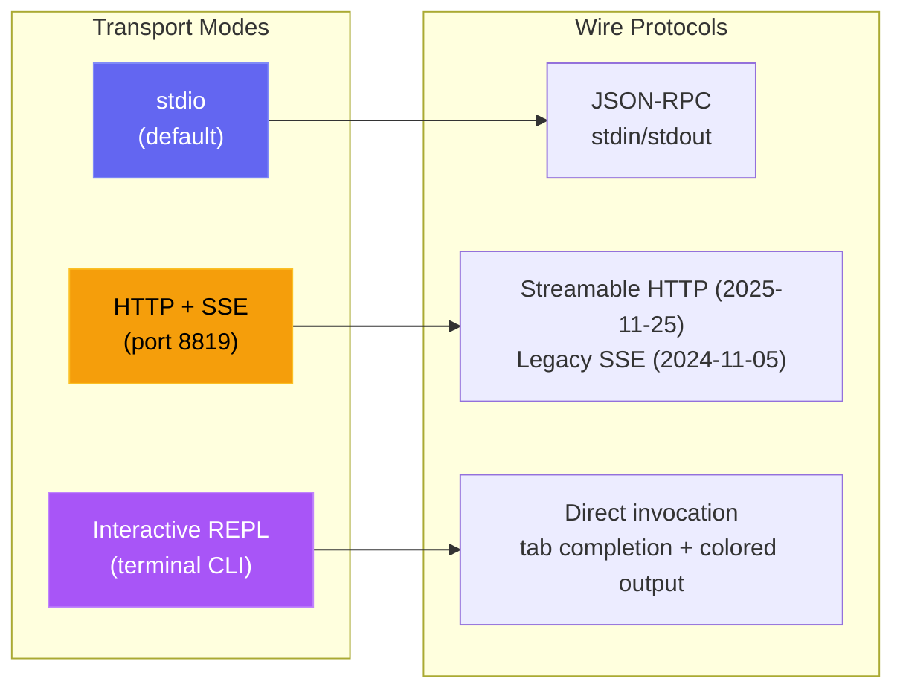

| Mode | Command | Use Case |
| --- | --- | --- |
| **stdio** | `npm run mcp:start` | Claude Code, Claude Desktop, IDE MCP hosts |
| **HTTP** | `npm run mcp:start:http` | Remote MCP clients, web integrations, multi-session |
| **REPL** | `npm run mcp:start:repl` | Ops debugging, manual tool invocation, local admin |

<p align="center">
  <a href="images/mcp.png"></a>
</p>

### MCP Architecture

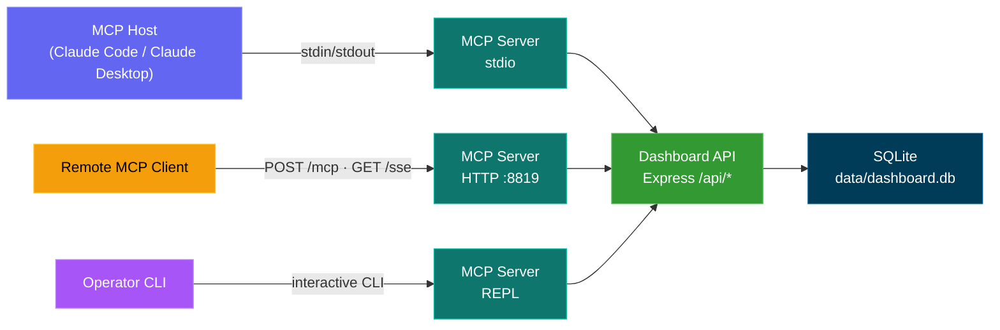

### MCP Tool Surface

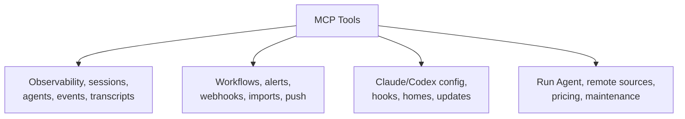

### MCP Safety Model

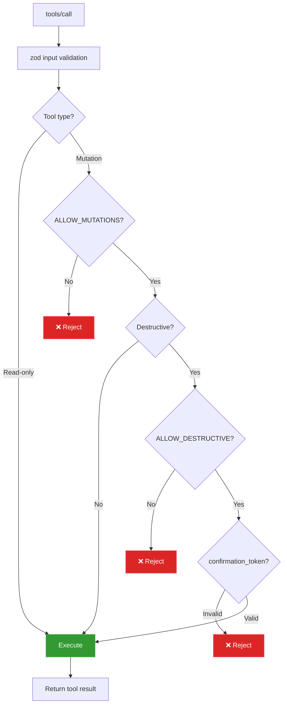

### MCP Operational Modes

- Read-only mode (default): `MCP_DASHBOARD_ALLOW_MUTATIONS=false`
- Admin mode: `MCP_DASHBOARD_ALLOW_MUTATIONS=true`
- Authenticated dashboard: set `MCP_DASHBOARD_API_TOKEN` / `_FILE` to the dashboard token
- Authenticated HTTP/SSE transport: set `MCP_HTTP_AUTH_TOKEN` / `_FILE`; clients send bearer auth or `x-mcp-token`
- Transport guardrails: direct loopback HTTP may carry the token; container-host aliases require HTTPS; redirects are rejected
- Payload guardrails: 50 MiB per uploaded history file, 100 MiB total per call, 10 MiB binary responses, and 25 MiB backup restore
- Destructive mode: requires both:
  - `MCP_DASHBOARD_ALLOW_MUTATIONS=true`
  - `MCP_DASHBOARD_ALLOW_DESTRUCTIVE=true`
  - tool input `confirmation_token: "CLEAR_ALL_DATA"`

Full details: [mcp/README.md](./mcp/README.md)

---

## API Reference

All endpoints return JSON. Error responses follow the shape `{ error: { code, message } }`.

### OpenAPI / Swagger / ReDoc

There are three ways to explore the HTTP API, all driven by a single OpenAPI 3.0.3 spec (default server port `4820`):

| Method | Path                            | Description                                                                                       |
| ------ | ------------------------------- | ------------------------------------------------------------------------------------------------- |
| `GET`  | `/api/openapi.json`             | Raw OpenAPI 3.0.3 JSON spec                                                                        |
| `GET`  | `/api/docs`                     | Interactive **Swagger UI** — try-it-out request execution                                         |
| `GET`  | `/api/redoc`                    | **ReDoc** reference — a clean, read-optimized three-panel rendering of the same spec              |
| `GET`  | `/api/redoc/redoc.standalone.js`| Self-hosted ReDoc bundle (served locally via the `redoc` dependency, never a CDN — works offline) |

The OpenAPI document is generated from `server/openapi.js` (`createOpenApiSpec()`), merged with supplementary fragments under `server/openapi-extra/`. Swagger UI and ReDoc are both served directly by the backend; the ReDoc bundle is served locally (`GET /api/redoc/redoc.standalone.js`) so the reference works fully offline / air-gapped, consistent with the project's no-external-assets policy.

Coverage is comprehensive: every backend route is documented (82 path entries) across these tags — Health, Sessions, Agents, Events, Stats, Metrics, Analytics, Hooks, Pricing, Workflows, Settings, Updates, Alerts, Webhooks, Push, CcConfig (Claude Code config explorer), Run (dashboard-spawned runs), and Documentation — each with parameters, request/response schemas, field-level descriptions, and realistic examples.

A committed **`openapi.yaml`** at the repo root mirrors the live spec. It is generated from `server/openapi.js` (never hand-edited) — regenerate it after API changes with:

```bash
npm run openapi:yaml
```


<p align="center">
  <a href="images/swagger.png"></a>
</p>

<p align="center">
  <a href="images/redoc.png"></a>
</p>

### Health

| Method | Path          | Description                           |
| ------ | ------------- | ------------------------------------- |
| `GET`  | `/api/health` | Returns `{ status: "ok", timestamp }` |

### Sessions

| Method  | Path                            | Query Params                                                     | Description                                                                                  |
| ------- | ------------------------------- | ---------------------------------------------------------------- | -------------------------------------------------------------------------------------------- |
| `GET`   | `/api/sessions`                 | `status`, `q`, `limit`, `offset`                                 | List sessions with agent counts and per-session cost. `q` does case-insensitive search across `id` / `name` / `cwd`. `limit` defaults to 50, max 10000. Response includes `total` for paginators. |
| `GET`   | `/api/sessions/:id`             | --                                                               | Session detail with agents and events                                                        |
| `GET`   | `/api/sessions/:id/stats`       | --                                                               | Aggregated counts powering the Session Detail overview panel: events, events-by-type, top tool usage, error count, agent type/status counts, subagent type breakdown, token totals, time range |
| `GET`   | `/api/sessions/:id/transcripts` | --                                                               | List available JSONL transcripts for the session (main + subagents + compactions)            |
| `GET`   | `/api/sessions/:id/transcript`  | `agent_id`, `limit`, `offset`, `after`, `before`                 | Stream messages from a specific transcript with cursor-based pagination. Assistant `usage` includes `input_tokens`, `output_tokens`, `cache_read_input_tokens`, `cache_creation_input_tokens` so the Run page meter can hydrate fully on resume / re-attach |
| `POST`  | `/api/sessions`                 | --                                                               | Create session (idempotent on `id`)                                                          |
| `PATCH` | `/api/sessions/:id`             | --                                                               | Update session status/metadata                                                               |

### Agents

| Method  | Path              | Query Params                              | Description                   |
| ------- | ----------------- | ----------------------------------------- | ----------------------------- |
| `GET`   | `/api/agents`     | `status`, `session_id`, `limit`, `offset` | List agents with filters      |
| `GET`   | `/api/agents/:id` | --                                        | Single agent detail           |
| `POST`  | `/api/agents`     | --                                        | Create agent                  |
| `PATCH` | `/api/agents/:id` | --                                        | Update agent status/task/tool |

### Events

| Method | Path          | Query Params                    | Description                |
| ------ | ------------- | ------------------------------- | -------------------------- |
| `GET`  | `/api/events` | `session_id`, `limit`, `offset` | List events (newest first) |

### Stats

| Method | Path         | Description                                            |
| ------ | ------------ | ------------------------------------------------------ |
| `GET`  | `/api/stats` | Aggregate counts, status distributions, WS connections |

### Analytics

| Method | Path             | Description                                                |
| ------ | ---------------- | ---------------------------------------------------------- |
| `GET`  | `/api/analytics` | Token/tool/session aggregates for charts and trend views   |

### Remote Data Sources

| Method   | Path                            | Query Params | Description                                                                                 |
| -------- | ------------------------------- | ------------ | ------------------------------------------------------------------------------------------- |
| `GET`    | `/api/remote-sources`           | --           | List configured remote sources with status, last error, and last-sync counts               |
| `POST`   | `/api/remote-sources`           | --           | Create a source. Body: `{ label, host, ssh_port?, identity_file?, remote_home?, remote_codex_home?, enabled? }` |
| `PATCH`  | `/api/remote-sources/:id`       | --           | Update a source (label, connection fields, enabled)                                         |
| `DELETE` | `/api/remote-sources/:id`       | `purge`      | Delete a source; `?purge=true` also deletes that source's imported sessions                 |
| `POST`   | `/api/remote-sources/:id/test`  | --           | Probe SSH connectivity to the source                                                        |
| `POST`   | `/api/remote-sources/:id/sync`  | --           | Pull and re-import from the source now                                                      |

`GET /api/sessions`, `/api/events`, `/api/agents`, `/api/stats`, and `/api/analytics` also accept an optional `sources` query param (comma-separated source ids; omit for all) to scope results by origin, and `GET /api/sessions/facets` returns a `sources` array for the data-scope selector.

### Hooks

| Method | Path               | Description                                  |
| ------ | ------------------ | -------------------------------------------- |
| `POST` | `/api/hooks/event` | Receive and process a Claude Code hook event |
| `POST` | `/api/hooks/ingest-batch` | Push a batch of session data from a roaming/NAT'd machine (disabled by default; see `REMOTE_PUSH_TOKEN` below and `server/README.md` for the full payload shape) |

**Hook event payload:**

```json
{
  "hook_type": "PreToolUse",
  "data": {
    "session_id": "abc-123",
    "tool_name": "Bash",
    "tool_input": { "command": "ls -la" }
  }
}
```

### Pricing

| Method   | Path                     | Description                              |
| -------- | ------------------------ | ---------------------------------------- |
| `GET`    | `/api/pricing`           | List all pricing rules                   |
| `PUT`    | `/api/pricing`           | Create or update a pricing rule          |
| `DELETE` | `/api/pricing/:pattern`  | Delete a pricing rule                    |
| `GET`    | `/api/pricing/cost`      | Total cost across all sessions           |
| `GET`    | `/api/pricing/cost/:id`  | Cost breakdown for a specific session    |

### Workflows

| Method | Path                          | Description                                             |
| ------ | ----------------------------- | ------------------------------------------------------- |
| `GET`  | `/api/workflows`              | Provider/source-scoped workflow data (orchestration, recorded tools, patterns, Codex compactions). Optional `?status=active\|completed`, `?sources=...`, and `?providers=claude\|codex` filters apply to all 11 data sections |
| `GET`  | `/api/workflows/session/:id`  | Provider/source-scoped per-session drill-in (agent tree, recorded tool timeline, events) |

### Alerts

| Method   | Path                     | Description                                                            |
| -------- | ------------------------ | ---------------------------------------------------------------------- |
| `GET`    | `/api/alerts`            | Fired-alert feed, newest first (`?unacked=true`, `limit`, `offset`)    |
| `POST`   | `/api/alerts/:id/ack`    | Acknowledge one alert                                                  |
| `POST`   | `/api/alerts/ack-all`    | Acknowledge every unacked alert                                        |
| `GET`    | `/api/alerts/rules`      | List alert rules                                                       |
| `POST`   | `/api/alerts/rules`      | Create a rule (`event_pattern` \| `inactivity` \| `status_duration` \| `token_threshold`) |
| `PATCH`  | `/api/alerts/rules/:id`  | Update name / config / enabled / cooldown (rule type is immutable)     |
| `DELETE` | `/api/alerts/rules/:id`  | Delete a rule and its fired-alert history                              |

### Webhooks

| Method   | Path                              | Description                                                                          |
| -------- | --------------------------------- | ------------------------------------------------------------------------------------ |
| `GET`    | `/api/webhooks/providers`         | Supported providers + their config fields (drives the UI form)                       |
| `GET`    | `/api/webhooks`                   | List webhook targets (URLs masked, secrets redacted)                                 |
| `POST`   | `/api/webhooks`                   | Create a target (14 first-class providers + `generic`)                               |
| `PATCH`  | `/api/webhooks/:id`               | Update name / url / enabled / secret / headers / rule scope (type is immutable)      |
| `DELETE` | `/api/webhooks/:id`               | Delete a target and its delivery log                                                 |
| `POST`   | `/api/webhooks/:id/test`          | Send a synthetic test alert and report the delivery result                           |
| `GET`    | `/api/webhooks/:id/deliveries`    | Recent delivery log for a target (`limit`, `offset`)                                  |

Hosted providers require HTTPS. `generic` and `n8n` may use HTTP for local or self-hosted receivers. Delivery rejects redirects, so credentials, custom headers, and HMAC signatures are never forwarded to a second URL.

### Settings

| Method | Path                           | Description                                      |
| ------ | ------------------------------ | ------------------------------------------------ |
| `GET`  | `/api/settings/info`           | System info, DB stats, hook status               |
| `POST` | `/api/settings/clear-data`     | Delete all sessions, agents, events, token usage |
| `POST` | `/api/settings/reimport`       | Re-import legacy sessions from `~/.claude/`      |
| `POST` | `/api/settings/reinstall-hooks`| Reinstall Claude Code hooks                      |
| `POST` | `/api/settings/reset-pricing`  | Reset Claude, Codex, or both pricing tables to defaults |
| `GET`  | `/api/settings/export`         | Export all data (sessions, agents, events, token_usage, workflows, dashboard_runs, alert_rules, model_pricing, cursor_model_pricing, gpt_model_pricing) as one versioned JSON download |
| `POST` | `/api/settings/import`         | Restore one bundle up to 25 MiB from `/export` (multipart `file` or JSON `{ path }`). Idempotent + non-destructive — existing sessions are skipped whole |
| `POST` | `/api/settings/cleanup`        | Abandon stale sessions, purge old data (and the purged sessions' snapshots) |
| `GET`  | `/api/settings/snapshots`      | Transcript snapshot storage per provider + retention policy |
| `POST` | `/api/settings/snapshots/compress` | Losslessly compress snapshots whose original transcript is gone |
| `POST` | `/api/settings/snapshots/prune` | Plan (dry run, default) or apply a snapshot prune; applying needs `confirm: "PRUNE_SNAPSHOTS"` |

### Claude Config Explorer (`/api/cc-config`)

Read-only inspection of every Claude Code configuration surface, plus carefully-gated mutations for low-risk text-file artifacts. File reads canonicalize the requested path and allowed roots, so symlinks cannot escape the trusted Claude directories. All write paths create timestamped backups under `<root>/cc-config-backups/<type>/` before mutating.

| Method   | Path                                | Description |
| -------- | ----------------------------------- | ----------- |
| `GET`    | `/api/cc-config/overview`           | Roots (claude home, project .claude, project root, ~/.claude.json) + counts for every surface |
| `GET`    | `/api/cc-config/skills`             | Skills under `<scope>/.claude/skills/<name>/SKILL.md` with parsed frontmatter; `?scope=user\|project\|all` |
| `GET`    | `/api/cc-config/agents`             | Subagents `<scope>/.claude/agents/*.md` |
| `GET`    | `/api/cc-config/commands`           | Slash commands `<scope>/.claude/commands/*.md` |
| `GET`    | `/api/cc-config/output-styles`      | Output styles `<scope>/.claude/output-styles/*.md` |
| `GET`    | `/api/cc-config/plugins`            | Installed plugins from `~/.claude/plugins/installed_plugins.json`, joined with `enabledPlugins` from settings; each entry includes `contributes` (count of skills/agents/commands/hooks/output-styles inside the plugin's install dir) plus `plugin.json` metadata |
| `GET`    | `/api/cc-config/marketplaces`       | Registered marketplaces from `known_marketplaces.json`, enriched with each marketplace's own `marketplace.json` (plugin count, owner, description) |
| `GET`    | `/api/cc-config/mcp`                | MCP servers from `~/.claude.json` (top-level + per-project) and `settings.json` |
| `GET`    | `/api/cc-config/hooks`              | Hooks aggregated across user / project / project-local `settings.json` files |
| `GET`    | `/api/cc-config/hook-scripts`       | Files in `~/.claude/hooks/` (the helper scripts referenced by `hooks.<event>.command`) |
| `GET`    | `/api/cc-config/keybindings`        | `~/.claude/keybindings.json` parsed into context-grouped key/action pairs |
| `PUT`    | `/api/cc-config/keybindings`        | Overwrite `keybindings.json` from `{ groups: [{ context, bindings: [{ key, action }] }] }`. Backs up first, preserves top-level metadata (`$schema`/`$docs`), rejects duplicate contexts/keys. Safe to edit (unlike `settings.json`, the CLI never rewrites it mid-session) |
| `GET`    | `/api/cc-config/statusline`         | `settings.json.statusLine` config + the actual `statusline.py` / `statusline-command.sh` content if present |
| `GET`    | `/api/cc-config/settings`           | User / project / project-local settings JSON, with secret-like keys (matching `/token\|secret\|password\|api[_-]?key\|auth/i`) replaced by `"<redacted>"` |
| `GET`    | `/api/cc-config/memory`             | `CLAUDE.md` files at user + project scope, plus per-project file-based memory: `scope:"auto-memory"` items (each carrying `project`, `name`, `isIndex`, and parsed `frontmatter`) for every `*.md` under `~/.claude/projects/<slug>/memory/`. Mutate via `PUT`/`DELETE /api/cc-config/file` with `{ scope: "auto-memory", type: "auto-memory", project, name }` (backups land in `<memory-dir>/.cc-config-backups/auto-memory/`) |
| `GET`    | `/api/cc-config/file?path=…`        | Body of a single file (path-contained to CLAUDE_HOME / project .claude / project CLAUDE.md) |
| `GET`    | `/api/cc-config/backups`            | Listing of all timestamped backups, optionally filtered `?scope=&type=` |
| `PUT`    | `/api/cc-config/file`               | Create or overwrite a text-file artifact. Body: `{ scope, type, name?, content }`. Auto-backs-up if file exists. Atomic temp + rename. 256 KB content cap, strict `name` regex |
| `DELETE` | `/api/cc-config/file`               | Backup-then-delete a text-file artifact. Skill dirs are backed up whole (preserving bundled assets) before recursive removal |

### Prometheus metrics & Grafana

`GET /api/metrics` exposes Prometheus text metrics for session and agent status, events, tokens, realtime clients, remote sources, process uptime and memory, and build version. [`monitoring/`](./monitoring/README.md) provides Prometheus plus four auto-provisioned Grafana dashboards, with **CCAM · Overview** as the default.

```bash
# Native dashboard and monitoring
npm start
npm run monitoring:install       # one-time binary setup
npm run monitoring:up            # Grafana on :3000

# Containers
npm run docker:up                 # dashboard only
npm run docker:full:up            # dashboard + Prometheus + Grafana

# Mixed native/container setup
DASHBOARD_ALLOWED_HOSTS=host.docker.internal npm start
npm run monitoring:docker:up
npm run monitoring:verify
```

<p align="center">
  <a href="images/grafana.png"></a>
  <br>
  <em>📊 <strong>Grafana · CCAM Overview</strong> · fleet state, database totals, breakdowns, and rates from live <code>/api/metrics</code> scrapes</em>
</p>

<p align="center">
  <a href="images/prometheus-console.png"></a>
  <br>
  <em>🔥 <strong>Prometheus · CCAM console</strong> · scrape health, sessions, events, tokens, and Graph drill-down links</em>
</p>

See [docs/API.md → Metrics](./docs/API.md#metrics) for metric names, authentication, and scrape configuration.

### Run Claude (`/api/run`)

HTTP surface for spawning and supervising `claude` subprocesses from the dashboard. Same-origin guard on every route — browser requests must come from a localhost origin; missing-Origin (CLI/curl) requests pass. A supplied `cwd` must be an existing absolute directory and is canonicalized with `realpath`. It intentionally may be outside this repository so Run Agent can launch from the user's home or any recent project.

| Method   | Path                              | Description |
| -------- | --------------------------------- | ----------- |
| `GET`    | `/api/run`                        | List all in-memory run handles (live + recently finished); also returns `maxConcurrent` and `activeCount` |
| `GET`    | `/api/run/binary`                 | Probe whether `claude` is on `PATH` and where it lives — used by the UI to surface a clear error before spawning |
| `GET`    | `/api/run/cwds`                   | Suggested working directories: dashboard server cwd, `$HOME`, and recent cwds from the sessions table |
| `GET`    | `/api/run/files?cwd=…&q=…`        | Fuzzy file search inside `cwd` for the Run page's `@`-file autocomplete. Skips `node_modules`, `.git`, `dist`, `build`, `.next`, `.cache`, `coverage`, etc. Cwd is required and must exist; results are capped and ranked by basename match |
| `POST`   | `/api/run`                        | Spawn a new run. Body: `{ prompt, mode: "headless"\|"conversation", cwd?, model?, permissionMode?, resumeSessionId?, effort? }`. Headless puts prompt in argv via `-p` and closes stdin. Conversation pipes the prompt over stdin as a stream-json envelope and keeps stdin open for follow-ups. `resumeSessionId` (conversation only) adds `--resume <id>`; when set, `prompt` may be empty — the spawner skips the initial stdin write and `claude` idles on the resumed conversation until the user posts a follow-up via `POST /api/run/:id/message`. `effort` (`low` / `medium` / `high`) maps to `--effort`. The spawner always passes `--output-format stream-json --verbose --include-partial-messages` so the UI can render character-by-character deltas. Concurrency is effectively uncapped (default ceiling 10000 — override with `RUN_MAX_CONCURRENT`) |
| `GET`    | `/api/run/:id`                    | Current handle state. `?envelopes=1` includes the in-memory envelope log so the UI can replay history when re-attaching |
| `POST`   | `/api/run/:id/message`            | Send a follow-up turn to a running conversation (conversation mode only). Body: `{ text }` |
| `DELETE` | `/api/run/:id`                    | Stop a run. SIGTERM, escalating to SIGKILL after 5 s |

Output streams over the existing dashboard WebSocket as three message types: `run_stream` (parsed stream-json envelope, including `stream_event` deltas from `--include-partial-messages`), `run_status` (status transitions), `run_input_ack` (stdin write confirmed). The Config Explorer page subscribes to a fourth message — `cc_config_changed` — broadcast by `server/lib/cc-watcher.js` (via `fs.watch` on `~/.claude/`) and by `routes/cc-config.js` after every successful PUT/DELETE, with payload `{ source: "dashboard"|"fs", action?, scope?, type?, name?, paths? }`. The Sessions list and SessionDetail page poll `/api/run` (and listen for `run_status`) to badge any session currently being driven by an in-flight Run with a clickable **▶ Run** indicator that links back to `/run`.

### Import History

**Settings → Import History** imports Claude Code transcripts from `~/.claude/projects` and Codex rollouts from `~/.codex/sessions` through provider-specific folder scans or uploads. Both reuse live ingestion, preserve tokens, costs, tools, compaction baselines, lifecycle, and native Codex titles, and remain idempotent. Uploaded Codex history is copied into dashboard storage so its conversation survives source cleanup.

**Restore backup** accepts an exported dashboard `.json` from the UI, `ccam export`, or `GET /api/settings/export`. `POST /api/settings/import` and `ccam import-data <file>` restore all tables without overwriting existing sessions, allowing safe multi-machine consolidation.

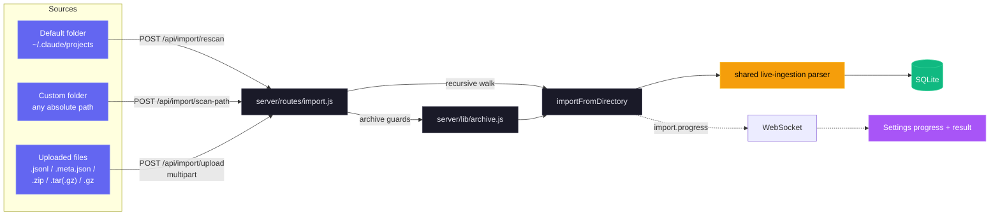

| Method | Path | Purpose |
| --- | --- | --- |
| `GET` | `/api/import/guide` | Provider-aware paths, archive commands, extensions, and instructions via `?provider=claude\|codex`. |
| `POST` | `/api/import/rescan` | Rescan the selected default root from `{ provider }`. |
| `POST` | `/api/import/scan-path` | Recursively scan an absolute `{ path, provider }`. |
| `POST` | `/api/import/upload` | Upload supported files or archives with `provider`. |

- **Inputs:** loose `.jsonl`, `.meta.json`, `.zip`, `.tar`, `.tar.gz`/`.tgz`, and `.gz` files in nested layouts. Claude supports both canonical subagent layouts; Codex recognizes recursive `rollout-*.jsonl` or JSONL with `session_meta` plus optional `session_index.jsonl` titles.
- **Accuracy:** UUID and event high-water dedup prevent double counting. Compaction baselines preserve earlier tokens; later activity advances `ended_at` and refreshes message metadata.
- **Large files:** shared 4 MiB chunked, line-at-a-time parsing handles transcripts beyond V8's roughly 512 MiB string limit. Growable arrays cap at `TRANSCRIPT_CACHE_MAX_ARRAY_LEN`, default `1000`, with trimming at twice the cap during parsing.
- **Safety:** extraction rejects absolute and `..` paths. Defaults cap extracted data at 4 GB, each upload at 1 GB, and requests at 2000 files; per-request staging is always reclaimed.
- **Progress:** throttled `import.progress` WebSocket phases cover `start`, `scan`, `extract`, `parse`, `complete`, and `error`. The UI provides drag-and-drop guidance and imported, enriched, skipped, and error totals.

### WebSocket

Connect to `ws://localhost:4820/ws` to receive real-time push messages:

```json
{
  "type": "agent_updated",
  "data": { "id": "...", "status": "working", "current_tool": "Edit" },
  "timestamp": "2026-03-05T15:43:01.800Z"
}
```

**Message types:** `session_created`, `session_updated`, `agent_created`, `agent_updated`, `new_event`, `alert_triggered`, `alert_updated`, `remote_source.status` (data `{ id, status: "idle"|"syncing"|"ok"|"error"|"deleted", error?, last_sync_at? }`)

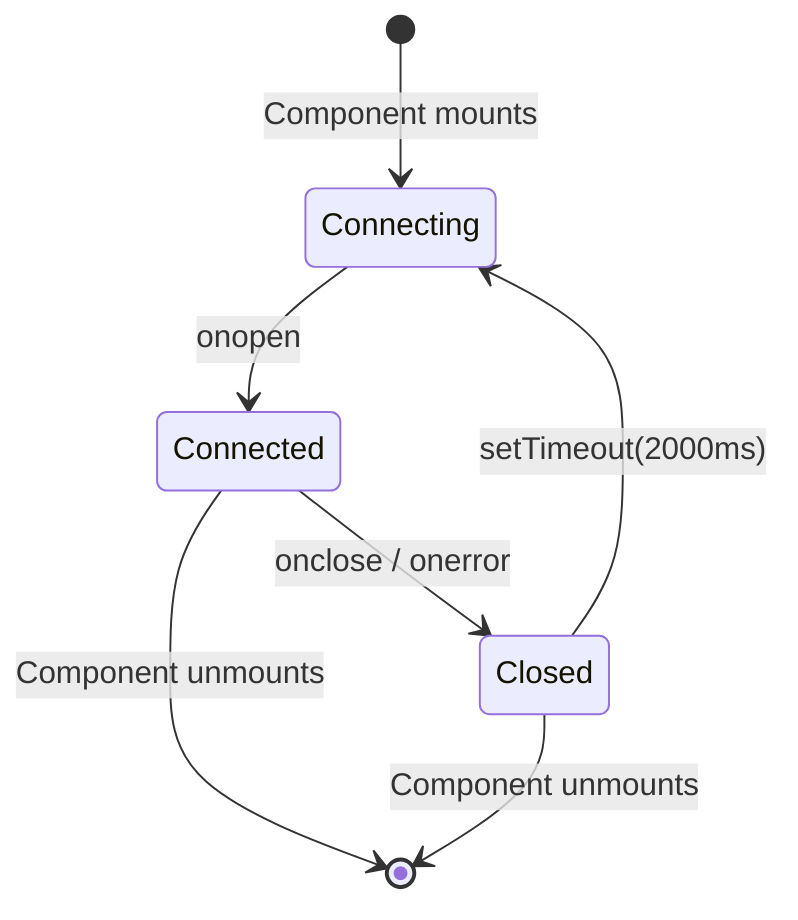

---

## Hook Events

The dashboard processes these Claude Code hook types:

| Hook Type           | Trigger                        | Dashboard Action                                                                             |
| ------------------- | ------------------------------ | -------------------------------------------------------------------------------------------- |
| `SessionStart`      | Claude Code session begins     | Creates session and main agent. Stamps `awaiting_input_since` (with `awaiting_reason=session_start`) so a fresh session lands in **Waiting** — except a `compact`-source SessionStart (mid-turn auto-compaction), which leaves the flag untouched so a working session stays **Active**. Reactivates resumed sessions. Abandons orphaned sessions with no activity for `DASHBOARD_STALE_MINUTES` (default 180) |
| `UserPromptSubmit`  | User hits enter on a prompt    | Clears the waiting flag and promotes the main agent to `working` — the only signal that text-only assistant turns have started, since they emit no `PreToolUse` |
| `PreToolUse`        | Agent starts using a tool      | Clears the waiting flag, sets agent to `working`, sets `current_tool`. If tool is `Agent`, creates a subagent record |
| `PostToolUse`       | Tool execution completed       | Clears the waiting flag (handles permission-prompt approvals where the Notification stamped it mid-tool). Clears `current_tool`. Agent stays `working` |
| `Stop`              | Claude finishes responding     | Non-error: main agent → `waiting` — Claude finished its turn, ball is in the user's court. `stop_reason=error`: marks the agent and session `error`. Background subagents keep running |
| `SubagentStop`      | Background agent finished      | Matches and completes the subagent by description, type, or task. Deliberately does NOT clear the waiting flag — a subagent finishing tells us nothing about the human. **Triggers a fire-and-forget JSONL scan** (`scanAndImportSubagents`) that emits per-tool `PreToolUse` + `PostToolUse` events under the subagent's own `agent_id` so the Timeline shows every tool the subagent ran, not just the spawn marker |
| `Notification`      | Agent notification             | Logs event. Permission/input-prompt messages set the agent to `waiting` and stamp `awaiting_input_since` (with `awaiting_reason=notification`, matched by pattern: `permission`, `waiting for input`, `needs your approval`, …). Compaction notifications are tagged as `Compaction` events. Triggers a browser notification if enabled |
| `SessionEnd`        | Claude Code CLI process exits  | Drops the waiting flag. If the session is already in `error`, the error state is preserved; otherwise marks all agents and the session as `completed` |
| `Compaction`   | `/compact` detected in JSONL   | Creates a compaction subagent (type `compaction`) and Compaction event. Detected via `isCompactSummary` entries in the transcript JSONL. Also detected by periodic scanner for active sessions |
| `APIError`     | API error in JSONL transcript  | Extracted from `isApiErrorMessage` entries (quota, rate limit, invalid_request) and raw `type: "error"` responses. **Now immediately marks the session and agent as `error`** — previously recorded as events without changing status. Stored as event with error details |
| `TurnDuration` | Turn timing in JSONL transcript| Extracted from `system` subtype `turn_duration` messages with `durationMs`. Stored as event for turn-level timing analysis |
| `ToolError`    | Tool result error in JSONL     | Extracted from `toolUseResult.is_error` entries. Tracks tool-level failures for error propagation analysis |
| `RemoteToolEvent` | Tool call pushed by a remote machine | Written by `POST /api/hooks/ingest-batch` for each `tool_events[]` item a roaming/NAT'd machine pushes. Deduped by `(session_id, event_type, uuid)` against committed rows and within the batch, so resending a batch is safe |
| `RemoteTurn`   | Turn duration pushed by a remote machine | Written by `POST /api/hooks/ingest-batch` for each `turns[]` item, carrying that turn's `duration_ms`. Same `(session_id, event_type, uuid)` dedup as `RemoteToolEvent` |
| `Interrupted`  | Turn cancelled by the user (Esc) | Synthesized by the watchdog — `Esc` fires no hook, so a stuck `working` session is detected from the transcript's `[Request interrupted by user]` marker or, when Esc preceded any output, from the idle-working timeout (`DASHBOARD_WORKING_IDLE_SECONDS`). The session moves to **Waiting** (same as a normal `Stop`) |

---

## Browser Notifications

The dashboard supports persistent browser notifications via Web Push (VAPID) for real-time alerts even when the dashboard tab is not focused or the browser is backgrounded.

### How It Works

1. **Enable** notifications in the Settings page via the master toggle
2. **Grant** browser permission when prompted — this registers a Service Worker and creates a push subscription
3. **Configure** which events trigger notifications:

| Event                        | Default | Description                                                     |
| ---------------------------- | ------- | --------------------------------------------------------------- |
| New session starts           | On      | Fires when a new Claude Code session is created                 |
| Claude finished responding   | Off     | Fires on `Stop` events when Claude finishes a response turn     |
| Session closed               | Off     | Fires on `SessionEnd` when the CLI process exits                |
| Session errors               | On      | Fires when a session ends with an error                         |
| Subagent spawned             | Off     | Fires when a background subagent is created                     |

Additionally, any `Notification` hook event from Claude Code triggers a browser notification regardless of the per-event toggles (as long as the master toggle is enabled).

### Notifications Architecture

- **VAPID Pipeline:** Uses `web-push` on the server for secure message delivery. VAPID keys are auto-generated and stored in `data/vapid-keys.json`.
- **Service Worker:** A dedicated worker (`client/public/sw.js`) handles incoming `push` events and displays notifications with `silent: false` to ensure audio playback on macOS.
- **Subscriptions:** Browser-specific endpoints are stored in the `push_subscriptions` table in SQLite.
- **Persistence:** Notifications arrive even if the browser is closed, as the Service Worker operates in the background.
- **Test notification:** button in Settings lets you verify the VAPID pipeline and audio playback.

### PWA & Offline Support

The dashboard, landing page, and Wiki are separate installable PWAs with independent manifests and service workers.

| Surface | Manifest | Service Worker | Caching Strategy |
| --- | --- | --- | --- |
| Dashboard (`client/`) | `client/public/manifest.json` | `client/public/sw.js` | Immutable `/assets/*` are cache-first; navigations, the worker, manifest, icons, and `/` are network-first with fallback. `/api/*`, `/ws`, and Vite HMR are never cached; push handlers remain active. Express sends one-year immutable headers for assets and revalidation headers for shell files. `controllerchange` reloads once on an upgrade, never on first install. |
| Landing page (root) | `manifest.json` | `sw.js` | Precaches the shell, favicon, and OG image. Screenshots cache on first view; navigation is network-first with offline fallback. |
| Wiki (`wiki/`) | `wiki/manifest.json` | `wiki/sw.js` | Precaches the HTML, CSS, JS, manifest, and favicon. HTML stays network-first; CSS and JS are cache-first, enabling offline use after one visit. |

All workers call `skipWaiting()`, remove versioned stale caches on activation, and refresh cleanly when their cache version changes. Each HTML file includes the iOS standalone metadata; manifests and Apple touch icons use `favicon.svg` with `sizes="any"`.

---

## Update Notifier

The dashboard watches its own git checkout and surfaces a modal whenever the canonical default branch has commits ahead of HEAD. **Branch- and fork-aware:** if you have an `upstream` remote (the standard convention for forks), it's preferred over `origin`; the chosen remote's `master`/`main`/`HEAD` is the comparison ref. The `manual_command` adapts to your situation — `git pull --ff-only` only when your branch actually tracks the canonical ref, otherwise a `git fetch` (and a fast-forward merge in the fork case) so the command never lies. Users get the exact command to run in a terminal — the server **never** pulls or restarts itself, which keeps the mechanism portable across dev sessions, pm2/systemd/launchd/Docker supervision, and remote deployments.

<p align="center">
  <a href="images/update.png"></a>
</p>

### How It Works

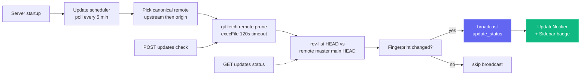

A single check is cheap (`git fetch <remote> --prune` against the canonical remote — `upstream` if configured, else `origin`), wrapped with `execFile` (no shell) and a 120s timeout. Failures — offline network, non-git install, no remotes configured, unresolvable upstream ref — all return **soft payloads** (e.g. `fetch_error: "..."`) rather than throwing, so a flaky remote never blocks the dashboard.

### UI Surfaces

| Surface | Behavior |
| --- | --- |
| **Modal** (`client/src/components/UpdateNotifier.tsx`) | Opens for a new available `remote_sha`; shows commits behind, tracked ref, optional branch/fork note, exact command, and **Copy command**, **Check now**, and **Dismiss**. Escape or backdrop dismisses it. The dismissal is keyed in `localStorage`, so a newer SHA opens again. |
| **Sidebar button** (`client/src/components/Sidebar.tsx`) | Always visible. Green means behind; amber means fetch failure. Clicking clears dismissal and calls `POST /api/updates/check`. |
| **Server terminal** | Prints a framed command when status changes from current to behind, including for headless users. |

### API Surface

| Endpoint | Purpose |
| --- | --- |
| `GET /api/updates/status` | Read-only check: runs `git fetch` against the canonical remote, compares HEAD to its default branch, returns the payload. |
| `POST /api/updates/check` | Same check, but also broadcasts `update_status` over WebSocket so all connected clients update at once. |

Both endpoints return the same payload shape:

```json
{
  "git_repo": true,
  "update_available": true,
  "repo_root": "/Users/you/Claude-Code-Agent-Monitor",
  "remote_ref": "upstream/master",
  "canonical_remote": "upstream",
  "current_branch": "master",
  "tracking_upstream": "origin/master",
  "tracks_canonical": false,
  "situation": "fork_or_diverged_tracking",
  "local_sha": "abc1234...",
  "remote_sha": "def5678...",
  "commits_behind": 3,
  "manual_command": "cd \"/...\" && git fetch upstream && git merge --ff-only upstream/master && npm run setup",
  "situation_note": "You're on 'master' tracking 'origin/master'. This command fast-forwards your branch from upstream/master (the canonical default).",
  "message": "3 commit(s) on upstream/master not in your checkout."
}
```

`situation` is one of `tracking_canonical` (typical clone on the default branch — `git pull --ff-only` works), `fork_or_diverged_tracking` (local branch name matches canonical, but tracks a different remote — `git fetch <remote> && git merge --ff-only <ref>`), `feature_branch` (off the default branch — fetch only, integration left to the user), or `detached_head`.

### What's Intentionally **Not** Here

There is no `POST /api/updates/apply` and no self-restart helper, by design. Self-updating a process from inside itself is unreliable without an external supervisor — `npm run dev` (concurrently), `npm start`, `pm2`, `systemd`, `launchd`, and Docker each need different restart logic, and `git pull` / `npm install` failures on a dying server have no clean rollback path. Detection-only keeps behaviour predictable across every supervisor, every OS, and every branch state, while still closing the "when do I need to pull?" information gap; the user owns the actual update in their own shell.

### Configuration

| Env Var | Default | Notes |
| --- | --- | --- |
| `DASHBOARD_UPDATE_CHECK` | enabled | Set to `0` / `false` / `off` to disable the scheduler entirely. |
| `DASHBOARD_UPDATE_CHECK_INTERVAL_MS` | `300000` (5 min) | Interval between automatic checks. Floor is 60 000 ms — values below are clamped. |

---

## Tabby — Floating Cat Companion

**Tabby** is a cute floating cat companion pinned to the bottom-right corner of every page in the dashboard. Always present, it turns the live session stream into an at-a-glance, reactive mascot you can also talk to.

<p align="center">
  <a href="images/tabby.png"></a>
</p>

### Reactive mascot

Tabby is a cursor-tracking SVG cat with **eight moods** derived from the live session stream, each with its own animation:

| Mood | When | Animation |
| --- | --- | --- |
| `idle` | Nothing notable happening | Resting tail flick |
| `watching` | Sessions are active | Ear perk, eyes follow the cursor |
| `happy` | A session or run finished cleanly | Head bob + sparkle |
| `worried` | Something looks off | Subtle shake |
| `stuck` | A session appears blocked | Alert "!" |
| `thinking` | An agent is mid-work | Slow head bob |
| `sleeping` | Quiet for a while | `zzz` |
| `disconnected` | WebSocket is down | Calm, still pose |

### Speech bubbles

Tabby auto-surfaces short quips on notable events (session started/finished, errors, run completed). Bubbles are **throttled and coalesced** so a burst of events never spams the screen, they use `aria-live` for screen readers, and they can be **muted** from the panel.

### Panel

Open the panel by clicking the cat or pressing **⌘B / Ctrl+B** (Esc closes). It shows:

- A live **status line** — `N live · M errored · connection state`.
- **Quick actions** — jump to Run Claude, Activity, Sessions, or errored sessions; mute bubbles; clear alerts.
- An **Ask** box (see below).

### Ask box → Run Claude handoff

The **Ask** box answers simple status questions locally from cached data — for example "what's running", "any errors", or "status". Any other question is handed off to the existing **Run Claude** page (it deep-links to `/run?prompt=…`) to spawn a real Claude Code session. Tabby never calls an LLM itself; it simply reuses the Run Claude page for anything beyond a quick status lookup.

### Accessibility & safe degradation

Tabby is keyboard-operable, uses `aria-live` for its bubbles, and honors `prefers-reduced-motion`. If the WebSocket is down it degrades safely to a calm `disconnected` state rather than erroring. You can toggle Tabby on or off in **Settings** (localized in English, Chinese, Vietnamese, Korean, and Spanish), and the implementation lives in `client/src/components/Tabby/`.

---

## Sound Cues

The dashboard gives you **subtle audio feedback** for live session activity, so you can leave it on a second monitor and still hear when a run finishes or fails. Sound is **on by default** and can be switched off entirely in one click.

### Zero-dependency synthesis

There are no `.mp3` or `.wav` assets anywhere in the repo and no audio library in `package.json`. Every cue is generated at play time with the **Web Audio API**: a short list of oscillators (sine or triangle), each with its own exponential gain envelope, mixed through a master gain node and a low-pass filter so the result sits behind your work rather than cutting through it. The whole engine is one file, `client/src/lib/sound.ts`.

### The cues

| Cue | When it fires | What it sounds like |
| --- | --- | --- |
| `sessionStart` | A new session appears | Rising perfect fifth (C5 → G5) |
| `sessionComplete` | A session finishes responding (`Stop`) or closes (`SessionEnd`) | Resolving major arpeggio (E5 → G5 → C6) |
| `sessionError` | A session enters the `error` state | Soft falling minor third on a triangle wave — noticeable, not alarming |
| `subagentSpawn` | A subagent spawns | Single short pluck |
| `notification` | Claude Code emits a `Notification` event | Detuned pair ringing like a small bell |
| `connected` / `disconnected` | The dashboard WebSocket returns or drops | Two-note lift / drop |
| `click` | You press a button, link, tab, or switch | Barely-audible tick |

Cues live inside a C-major set so overlapping tails never sound dissonant, and every envelope decays exponentially rather than cutting off, which avoids the click of a hard stop.

### Staying out of your way

Three guards keep audio from becoming noise:

- **Per-cue cooldown** — the same cue will not repeat within ~350 ms (45 ms for the interaction tick).
- **Global burst budget** — at most 4 cues start within any 1.2 s window, so importing history or reconnecting after a drop never turns a flood of WebSocket messages into a flood of beeps.
- **Autoplay policy** — nothing plays until your first pointer, key, or touch interaction with the page, per browser rules. Cues before that are silently dropped, not queued.

If the browser has no Web Audio support at all, every call is a safe no-op — the dashboard simply stays silent.

### Settings

**Settings → Sound** has a master toggle, a volume slider, and an individual switch for each cue. Flipping a switch on plays that cue immediately so you can hear exactly what you just enabled, and a **Preview Sound** button plays the completion chime on demand. Preferences persist to `localStorage` under `agent-monitor-sound` and take effect instantly across the app — no reload. The panel is localized in English, Chinese, Vietnamese, Korean, and Spanish.

By default, session start, session complete, session error, Claude Code notifications, and the interaction tick are on; subagent spawns and connection changes are off (they are the chattiest). Implementation lives in `client/src/lib/sound.ts` (engine + preferences) and `client/src/hooks/useSoundCues.ts` (event-bus wiring), mounted once in `client/src/App.tsx`.

---

## Connection Status Modal

Click the **Live** / **Disconnected** pill in the sidebar footer to open a small details panel about the dashboard's WebSocket transport. It shows the active `ws://` endpoint, how long the current socket has been up, total events received, top event types as a horizontal bar chart, a 60-second throughput sparkline, and the last 8 events as a recent-activity list. Cumulative stats (totals, type breakdown, recent list) persist across reloads via `localStorage` under `sidebar-connection-stats`; the rolling sparkline and "connected since" timer are intentionally ephemeral. A **Reset** button in the footer clears everything on demand.

<p align="center">
  <a href="images/live.png"></a>
</p>

---

## VS Code Extension

The **Claude Code Agent Monitor** is available as a first-class VS Code extension, allowing you to monitor your AI agents without leaving your editor.

<p align="center">
  <a href="vscode-extension/vscode.png"></a>
</p>

### 🚀 Key Features
- **Live Sidebar**: Dedicated Activity Bar view showing real-time Agent Health (Working, Waiting, Completed, etc.).
- **Usage Analytics**: Track total tokens, live USD costs, and event counts directly in the sidebar.
- **Status Bar Integration**: Quick-glance pulse monitor in the bottom bar showing active sessions and agents.
- **Deep Navigation**: One-click access to specific dashboard views (Kanban, Analytics, Settings) or recent sessions.
- **Integrated Tab**: Opens the full monitoring dashboard as a native VS Code webview tab.

### 📦 Installation & Setup
1. Open the [vscode-extension](./vscode-extension) directory.
2. Install the Marketplace extension or package it yourself using `vsce package`.
3. Ensure your local dashboard server is running (`npm run dev`).
4. Click the **Radar icon** in the VS Code Activity Bar to get started.

For detailed developer configuration, see the [.vscode](./.vscode) and [vscode-extension](./vscode-extension) directories.

> [!TIP]
> Extension on VS Code Marketplace: [Claude Code Agent Monitor](https://marketplace.visualstudio.com/items?itemName=hoangsonw.claude-code-agent-monitor)

---

## Desktop App (macOS & Windows)

The optional Electron 35 desktop app packages the same dashboard as a macOS `.dmg`, Windows NSIS installer, or portable `.exe` from the `desktop/` workspace.

<p align="center">
  <a href="images/macos.png"></a>
  <br>
  <em>🍎🪟 <strong>Desktop App</strong> — native shell with a menu-bar / notification-area (tray) icon, Open-at-Login, and a single-instance lock. The same dashboard, in a real OS window (macOS shown).</em>
</p>

<p align="center">
  <a href="images/windows_app.png"></a>
  <br>
  <em>🪟 The same dashboard as a native Windows app — notification-area (tray) icon, native window menu, and Open-at-Login.</em>
</p>

It adds native window, tray, menu, login, and shutdown behavior around the same UI served at `localhost:4820`.

### How it works

Unlike running the dashboard from a terminal, the desktop app needs no `npm start`, no open shell, and no second copy of the server. The Electron **main process** hosts the Express server **in-process** — it `require()`s `server/index.js` directly in the same Node runtime, with **no child process and no IPC** — and points a Chromium `BrowserWindow` at the built React client.

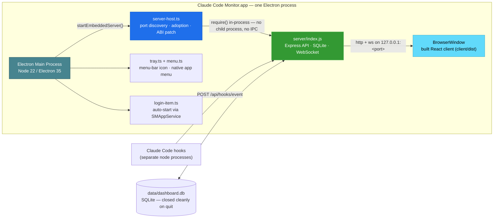

On launch the app:

1. Picks a free port — preferring **4820**, falling back to **4821–4829**, then a random high port if all of those are taken.
2. If a healthy dashboard server already answers `/api/health` on `4820` (e.g. you ran `npm start` in a terminal), it **adopts that server** instead of double-binding — no port collision, no SQLite contention. An adopted server keeps running after you quit the app.
3. Otherwise it boots the embedded server, and on **first owned-server boot** auto-installs the Claude Code hooks and starts the background services (update scheduler, `cc-watcher`, orphaned-run reconciliation). A DMG-only user therefore gets events flowing with **zero manual setup** — no checkout, no `npm run install-hooks`.
4. **(macOS)** Recovers your **login-shell `PATH`** so the **Run Claude** feature can find and spawn the `claude` CLI — a Finder/Dock-launched app otherwise inherits only launchd's minimal `PATH` and would miss CLIs in `~/.local/bin`, `/opt/homebrew/bin`, version-manager bins, etc. (On Windows the process already inherits the user `PATH`.)
5. Opens the dashboard window — unless the app was launched at login (on macOS via Login Items; on Windows via the tagged `HKCU\…\Run` entry), in which case it stays tray-only.
6. On quit, shuts the embedded server down gracefully and **closes SQLite cleanly** (WAL checkpoint).

### Features

- **Tray and window:** left-click toggles the window; right-click offers **Open Dashboard**, **Open in Browser**, **Restart Server**, **Show Logs**, **Open at Login**, and **Quit**. macOS uses a tinted template tray glyph; Windows and the window/taskbar use the colored app icon, including unpackaged development runs.
- **Native menu:** standard application menus and `⌘` / `Ctrl` shortcuts. macOS alone keeps **File → Open Dashboard** (`⌘1`) while hidden; Windows/Linux reopen reliably through the tray.
- **Login and lifecycle:** `SMAppService` registers macOS Login Items; Windows writes the per-user `HKCU\Software\Microsoft\Windows\CurrentVersion\Run` entry. Closing hides the window while the tray and server continue; a second launch focuses the single existing instance.
- **Durable data:** SQLite and VAPID keys stay outside the bundle in `~/Library/Application Support/Claude Code Monitor/data/` or `%APPDATA%\Claude Code Monitor\data\`. Reinstall, update, and the default NSIS uninstall preserve imported history.
- **CLI and logs:** macOS restores the login-shell `PATH` so Finder/Dock launches can run `claude`; Windows uses the inherited user `PATH`. **Show Logs** opens `~/Library/Logs/Claude Code Monitor/desktop.log` or `%APPDATA%\Claude Code Monitor\logs\desktop.log`.

### Get it

**Option A — download a pre-built installer (recommended).** From **[Releases → latest](https://github.com/hoangsonww/Claude-Code-Agent-Monitor/releases/latest)** (public, no GitHub sign-in). CI auto-publishes a new `vX.Y.Z` release whenever the version in `package.json` is bumped on `master`, so this link always serves the current build:

| Platform | Asset | Notes |
| --- | --- | --- |
| macOS (Apple Silicon) | `ClaudeCodeMonitor-<ver>-arm64.dmg` | drag into `/Applications` |
| macOS (Intel) | `ClaudeCodeMonitor-<ver>-x64.dmg` | drag into `/Applications` |
| Windows (installer) | `ClaudeCodeMonitor-Setup-<ver>-x64.exe` | per-user install, no admin |
| Windows (portable) | `ClaudeCodeMonitor-<ver>-x64-portable.exe` | run without installing |

Per-commit fresh builds also live as CI artifacts (sign-in required, 14-day retention): `ClaudeCodeMonitor-dmg` from the `🍎 macOS Desktop (DMG)` job and `ClaudeCodeMonitor-win` from the `🪟 Windows Desktop (EXE)` job — useful for testing `master` before the next release tag.

**Option B — build it yourself.** From the repo root:

```bash
npm run setup                # install root + client deps, build client, install hooks
npm run build                # build the React client (client/dist)
npm run desktop:install      # install Electron + electron-builder into desktop/ (preflights native deps; prints setup help on failure)
npm run desktop:dmg:arm64    # macOS:   fast single-arch DMG → desktop/release/ClaudeCodeMonitor-<ver>-arm64.dmg
npm run desktop:win          # Windows: NSIS installer → desktop/release/ClaudeCodeMonitor-Setup-<ver>-x64.exe
```

> [!NOTE]
> **DMGs build on macOS; Windows `.exe`s build on Windows** — electron-builder packages for the host OS. The macOS `npm run desktop:dmg` build packages the app **twice** (once per architecture) and emits **both** per-arch DMGs (`arm64` + `x64`) — the release build; it does not merge them into one universal binary. For your own Mac use the single-arch `desktop:dmg:arm64` / `desktop:dmg:x64`. On Windows, `better-sqlite3` is fetched as a prebuilt Electron binary by `npm run desktop:install`, so no Visual Studio C++ toolchain is needed in the common case. If the build does fail (no prebuilt binary, or a missing C++ toolchain), `desktop:install` prints the exact per-OS fix plus a no-toolchain alternative and fails loudly instead of leaving a broken install.

### Install it

**macOS:**

1. Double-click the `.dmg` to mount it.
2. Drag **Claude Code Monitor.app** into your `/Applications` folder.
3. The DMG is **ad-hoc signed** by default, so macOS Gatekeeper warns on first launch (*"Apple could not verify…"*). Clear the quarantine attribute:

   ```bash
   xattr -cr "/Applications/Claude Code Monitor.app"
   ```

   Or open **System Settings → Privacy & Security** and click **Open Anyway**.

4. Launch the app. The tray icon appears and the dashboard window opens.

**Windows:**

Run `ClaudeCodeMonitor-Setup-<ver>-x64.exe` for a no-admin, per-user install under `%LOCALAPPDATA%\Programs\Claude Code Monitor`, with a selectable destination, or use `*-portable.exe` without installing. The unsigned default build may trigger SmartScreen on first launch; choose **More info → Run anyway**. Launch from Start or the desktop shortcut to open the dashboard and tray icon.

<p align="center">
  <a href="images/setup_win_wizard3.png"></a>
  <br>
  <em>🪟 <strong>Windows setup complete</strong> · finish the installer and launch Claude Code Monitor</em>
</p>

### Build commands

All commands run from the **repo root**:

| Command                     | What it does                                                                 |
| --------------------------- | ---------------------------------------------------------------------------- |
| `npm run desktop:install`   | Install Electron + electron-builder into `desktop/`; rebuild `better-sqlite3` for Electron's ABI; preflights the native `better-sqlite3` build and prints actionable setup help (incl. a no-toolchain alternative) on failure |
| `npm run desktop:build`     | Compile the desktop TypeScript sources into `desktop/out/`                    |
| `npm run desktop:dev`       | Build and launch the Electron app for local iteration                         |
| `npm run desktop:test`      | Run the smoke test (spawn Electron, probe `/api/health`, shut down)            |
| `npm run desktop:dmg`       | **macOS:** build **both** DMGs (arm64 + x64) — correct for release, **slower** (packages each arch) |
| `npm run desktop:dmg:arm64` | **macOS:** build an Apple-Silicon-only DMG — **fast** (~1 min), recommended for your own Mac |
| `npm run desktop:dmg:x64`   | **macOS:** build an Intel-only DMG — **fast** (~1 min)                         |
| `npm run desktop:dmg:universal` | **macOS:** build one merged **universal** DMG (arm64 + x86_64) — optional, **slowest**, not what the release ships |
| `npm run desktop:win`       | **Windows:** build the NSIS installer `.exe` (x64)                             |
| `npm run desktop:win:portable` | **Windows:** build the no-install portable `.exe` (x64)                     |

The resulting macOS DMG is **~80 MB** (≈ 250 MB on disk once installed) and the Windows installer is comparable — the standard Electron bundle tax.

### Signing & notarization

macOS uses ad-hoc signing by default and sets `CSC_IDENTITY_AUTO_DISCOVERY=false`, so local certificates are never selected accidentally. Developer ID signing uses `CSC_LINK` plus `CSC_KEY_PASSWORD`; notarization adds `APPLE_ID`, `APPLE_TEAM_ID`, and `APPLE_APP_SPECIFIC_PASSWORD`. Windows is unsigned by default and enables Authenticode through the same `CSC_LINK` and password variables. CI activates either path when credentials are present, with no code change.

### Implementation notes

- **Native ABI:** `desktop/` keeps an Electron-built `better-sqlite3` and redirects `server/db.js` to it; the root copy remains compatible with system Node and server tests. After architecture-specific DMG builds, desktop `prebuild` repairs the local ABI automatically and fails early with setup help if the binary is missing.
- **Server parity:** exported `startBackgroundServices()` gives the embedded server the same update scheduler, config watcher, and orphan reconciliation as `node server/index.js`; the standalone path and other workspaces remain behaviorally unchanged.
- **CI and releases:** path-filtered macOS and Windows jobs smoke-test and upload two single-architecture DMGs plus NSIS and portable EXEs. Version bumps on `master` attach all assets to `vX.Y.Z`; regenerate `desktop/assets/icon.ico` with `npm run build:win-icon`.

See [`DESKTOP.md`](./DESKTOP.md) for installation and daily use, and [`desktop/README.md`](./desktop/README.md) for process, lifecycle, ports, and builds.

---

## Data Storage

- **Engine:** SQLite 3 via `better-sqlite3` (optional) or Node.js built-in `node:sqlite`
- **Location:** `data/dashboard.db`
- **Journal mode:** WAL (concurrent reads during writes)
- **Reset:** Delete `data/dashboard.db` to clear all data

### Entity Relationship Diagram

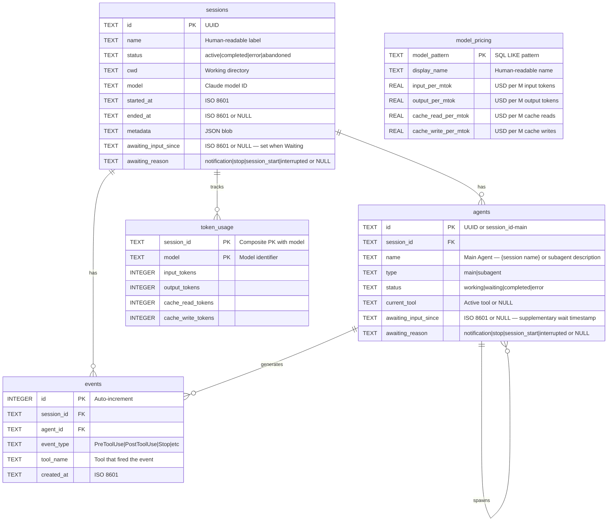

---

## Plugin Marketplace

CCAM ships **14 plugins** from one shared source tree. Claude Code reads `.claude-plugin/marketplace.json`; Codex reads `.agents/plugins/marketplace.json` plus each plugin's `.codex-plugin/plugin.json`. The bundle contains **66 plugin skills, 18 Claude subagents, 34 Claude commands, 3 CLI helpers, 3 hook configurations, and 2 MCP-enabled plugins**.

```bash
# Claude Code
claude plugin marketplace add hoangsonww/Claude-Code-Agent-Monitor
claude plugin install ccam-platform@claude-code-agent-monitor-plugins

# Codex
codex plugin marketplace add hoangsonww/Claude-Code-Agent-Monitor
codex plugin add ccam-platform@claude-code-agent-monitor-plugins

# Open Agent Skills / skills.sh-compatible CLI
npx skills add hoangsonww/Claude-Code-Agent-Monitor --list

# Install one skill for Claude Code and Codex in the current project
npx skills add hoangsonww/Claude-Code-Agent-Monitor \
  --skill mcp-server \
  --agent claude-code \
  --agent codex \
  --yes

# Verify, update, and remove the project-scoped skill
npx skills list --json
npx skills update --project --yes
npx skills remove mcp-server --yes

# Add --global to install at user scope, then manage that scope explicitly
npx skills add hoangsonww/Claude-Code-Agent-Monitor \
  --skill mcp-server \
  --agent claude-code \
  --agent codex \
  --global \
  --yes
npx skills list --global --json
npx skills update --global --yes
npx skills remove --global mcp-server --yes
```

The `skills` CLI discovers **77 total repository skills**, including the 66 plugin skills and repository-maintenance skills. Project installs use `.agents/skills/` plus agent-specific links. Global Claude Code skills default to `~/.claude/skills/`, or `$CLAUDE_CONFIG_DIR/skills/` when set. Global Codex skills default to `~/.codex/skills/`, or `$CODEX_HOME/skills/` when set. Multi-agent installs may deduplicate files through a shared store and link those destinations. Every plugin skill has canonical `name`/`description` frontmatter and `agents/openai.yaml` metadata. No upstream PR to `vercel-labs/skills` is needed for installation. The public GitHub repository is the source, and skills.sh visibility follows publication and real install telemetry.

New focused packs complement the existing analytics, productivity, quality, sessions, workflows, config, and dashboard plugins:

- `ccam-runner`: monitored Claude Code/Codex launch, follow-up, stop, resume, and run history
- `ccam-integrations`: alert rules, webhooks, push notifications, and SSH remote collection
- `ccam-platform`: Claude/Codex Config Explorer, provider-aware import, backup restore, hook setup, updates, and MCP operations
- `ccam-reports`: stakeholder-ready executive, cost, reliability, and workflow reports

Validate and regenerate the distribution metadata with:

```bash
npm run extensions:sync
npm run extensions:validate
```

Full catalog, installation commands, skills.sh behavior, public-submission boundary, and clean-install checks: [docs/PLUGINS.md](docs/PLUGINS.md).

---

## Statusline

A standalone CLI statusline utility for Claude Code that displays model name, user, working directory, git branch, context window usage bar, per-direction token counts, and session cost -- all color-coded with ANSI escape sequences.

```
nguyens6@host ~/agent-dashboard/client | Sonnet 4.6 | main | ████████░░ 79% | 3↑ 2↓ 156586c | $0.4231
```

| Segment     | Color                | Example                                                        |
| ----------- | -------------------- | -------------------------------------------------------------- |
| Model       | Cyan                 | `Sonnet 4.6`                                                   |
| User        | Green                | `nguyens6`                                                     |
| CWD         | Yellow               | `~/agent-dashboard`                                            |
| Git branch  | Magenta              | `main`                                                         |
| Context bar | Green / Yellow / Red | `████████░░ 79%`                                               |
| Tokens      | Green / Cyan / Dim   | `3↑ 2↓ 156586c` (green `↑` in, cyan `↓` out, dim `c` cache)    |
| Cost (USD)  | Green / Yellow / Red | `$0.4231` (session total — shown on API and subscription plans)|

Cost color thresholds: green under $5, yellow $5–$20, red $20+.

See [`statusline/README.md`](statusline/README.md) for installation instructions.

<p align="center">
  <a href="images/statusline.png"></a>
</p>

---

## Server Architecture

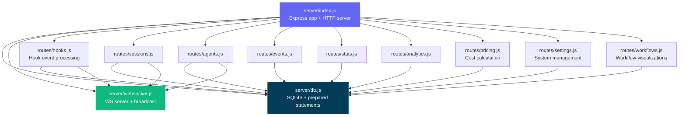

---

## Client Routing

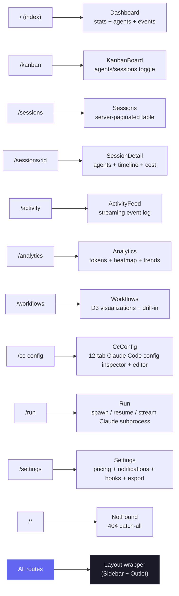

---

## Hook Handler Flow

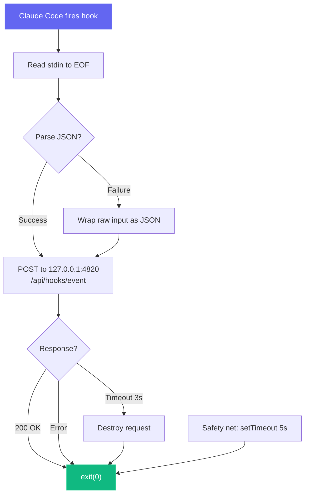

---

## Deployment Modes

We support both development and production deployment modes with different process architectures:

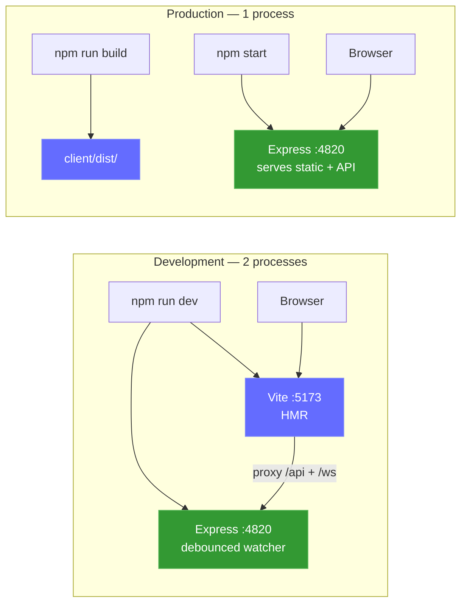

Optional local MCP sidecar (supports stdio, HTTP+SSE, and REPL transports):

```mermaid
graph LR
    subgraph "MCP Transport Options"
        M_STDIO["MCP Server (stdio)<br/>npm run mcp:start"]
        M_HTTP["MCP Server (HTTP)<br/>npm run mcp:start:http<br/>:8819"]
        M_REPL["MCP Server (REPL)<br/>npm run mcp:start:repl"]
    end

    H["MCP Host"] -->|"stdin/stdout"| M_STDIO
    RC["Remote Client"] -->|"POST /mcp · GET /sse"| M_HTTP
    OP["Operator"] -->|"interactive CLI"| M_REPL

    M_STDIO --> D["Dashboard Server<br/>:4820"]
    M_HTTP --> D
    M_REPL --> D

    style M_STDIO fill:#0f766e,stroke:#14b8a6,color:#fff
    style M_HTTP fill:#0f766e,stroke:#14b8a6,color:#fff
    style M_REPL fill:#0f766e,stroke:#14b8a6,color:#fff
```

Optional **desktop app (macOS & Windows)** — a single Electron process that hosts the Express server in-process (no terminal, no child process):

```mermaid
flowchart LR
    subgraph desktop["Desktop App (macOS & Windows) — 1 Electron process"]
        E_MAIN["Electron Main Process<br/>(Node 22 / Electron 35)"]
        E_HOST["server-host.ts<br/>require() server/index.js"]
        E_SRV["Embedded Express :4820<br/>API · SQLite · WebSocket"]
        E_WIN["BrowserWindow<br/>built React client"]
        E_TRAY["Menu-bar (tray) icon<br/>+ native app menu"]
        E_MAIN --> E_HOST
        E_HOST -->|"in-process require()"| E_SRV
        E_MAIN --> E_TRAY
        E_SRV -->|"http + ws on 127.0.0.1"| E_WIN
    end

    E_HOOKS["Claude Code hooks"] -->|"POST /api/hooks/event"| E_SRV

    style E_MAIN fill:#47848F,stroke:#2f5a62,color:#fff
    style E_SRV fill:#339933,stroke:#5cb85c,color:#fff
    style E_WIN fill:#61DAFB,stroke:#3aa9c9,color:#000
```

### Cloud Deployment

The `deployments/` stack targets any conformant Kubernetes service, including EKS, GKE, AKS, OKE, and self-managed clusters. CCAM uses SQLite, so every supported manifest enforces **one active dashboard writer per persistent volume** with a Recreate rollout. HPA, active-active replicas, blue-green, and canary are intentionally unsupported while SQLite remains the persistence backend.

```mermaid
flowchart LR
  CI["CI: test · validate · scan · attest · sign"] --> HELM["Helm / Kustomize / Terraform"]
  HELM --> APP["CCAM dashboard<br/>exactly 1 replica"]
  APP --> PVC[("Retained ReadWriteOnce PVC")]
  EDGE["Ingress or Gateway API<br/>TLS + WebSocket"] --> APP
  PROM["Prometheus Operator"] -->|"Bearer /api/metrics"| APP
  MCP["Authenticated MCP sidecar"] --> APP
```

- **Helm:** schema-enforced one writer, digest support, retained PVC, Ingress or Gateway API, External-Secret-compatible token mount, NetworkPolicy, optional MCP and ServiceMonitor.
- **Kustomize:** restricted-PSS base plus dev/staging/production overlays and optional MCP, monitoring, Gateway API, and CSI snapshot components.
- **Terraform:** deploys the validated Helm chart to an existing Kubernetes cluster. Cloud networking, cluster identity, CSI, TLS, and secret synchronization remain provider-owned.
- **Operations:** consistent SQLite online backup with SHA-256, verified restore with scale-to-zero, backup-first deploy/rollback/teardown, and authenticated health checks.
- **CI supply chain:** app and MCP images are scanned, published for amd64/arm64 with SBOM and SLSA provenance, and keyless-signed with Cosign.

```bash
npm run deploy:validate
REGISTRY="ghcr.io/$(gh repo view --json owner -q .owner.login)"
IMAGE_TAG="$(git rev-parse --short HEAD)"

helm upgrade --install agent-monitor deployments/helm/agent-monitor \
  --namespace agent-monitor-production --create-namespace \
  --values deployments/helm/agent-monitor/values-production.yaml \
  --set image.registry= \
  --set image.repository=${REGISTRY}/claude-code-agent-monitor \
  --set image.tag=${IMAGE_TAG} \
  --atomic --wait --timeout 10m
```

> [!NOTE]
> Full production setup, secrets, Docker/Podman stack, Gateway API, Terraform, backup, restore, and rollback are documented in [DEPLOYMENT.md](DEPLOYMENT.md) and [deployments/README.md](deployments/README.md).

---

## Project Structure

```
agent-dashboard/
|-- CLAUDE.md                   # Claude Code project memory and working agreements
|-- AGENTS.md                   # Codex project instructions
|-- package.json                # Root scripts (dashboard + MCP helpers) + server dependencies
|-- .claude/
|   +-- rules/                  # Path-scoped Claude rules
|   +-- skills/                 # Claude reusable project skills
|   +-- agents/                 # Claude custom subagents
|-- .claude-plugin/
|   +-- marketplace.json        # Claude Code marketplace manifest (14 plugins)
|-- .agents/plugins/
|   +-- marketplace.json        # Codex marketplace manifest (same 14 plugins)
|-- plugins/
|   |-- ccam-analytics/         # Analytics: session reports, cost breakdown, usage trends, productivity score
|   |   |-- .claude-plugin/plugin.json
|   |   |-- skills/ (4)         # session-report, cost-breakdown, usage-trends, productivity-score
|   |   |-- agents/             # analytics-advisor (Sonnet model)
|   |   |-- hooks/hooks.json    # Stop + SubagentStop event logging
|   |   +-- bin/ccam-stats      # Terminal dashboard CLI
|   |-- ccam-productivity/      # Productivity: standups, reports, sprints, workflow optimizer
|   |-- ccam-devtools/          # DevTools: debug, diagnostics, export, health checks
|   |   +-- bin/                # ccam-doctor + ccam-export CLIs
|   |-- ccam-insights/          # Insights: patterns, anomalies, optimization, comparison
|   |-- ccam-cost-guard/        # Cost guardrails: budgets, spend forecast, cost alerts, model savings
|   |-- ccam-sessions/          # Session forensics: search, timeline, transcript replay, cwd rollup, cleanup
|   |-- ccam-workflows/         # Workflow orchestration: DAG map, delegation audit, concurrency, fleet runs
|   |-- ccam-quality/           # Reliability & SLOs: error scan, API-error report, hook-failure audit, SLO check
|   |-- ccam-config/            # Config & memory governance: config audit, memory review, skill/MCP/hook inventory
|   +-- ccam-dashboard/         # Dashboard connector: status, quick stats, MCP integration
|       +-- .mcp.json           # MCP server configuration
|-- server/
|   |-- index.js                 # Express app, HTTP server, static serving
|   |-- db.js                    # SQLite schema, migrations, prepared statements
|   |-- websocket.js             # WebSocket server with heartbeat
|   +-- routes/
|       |-- hooks.js             # Hook event processing (transactional)
|       |-- sessions.js          # Session CRUD
|       |-- agents.js            # Agent CRUD
|       |-- events.js            # Event listing
|       |-- stats.js             # Aggregate statistics
|       |-- analytics.js         # Token, tool, and trend analytics
|       |-- workflows.js         # Aggregate workflow data and per-session drill-in
|       |-- pricing.js           # Model pricing CRUD and cost calculation
|       +-- settings.js          # System info, data management, export, cleanup
|   +-- lib/
|       +-- transcript-cache.js  # Stat-based JSONL transcript cache with chunked sync byte-stream reader (4 MiB chunks, line-by-line UTF-8 decode) so files larger than V8's max string length (~512 MiB) parse without aborting Node with "FATAL ERROR: v8::ToLocalChecked Empty MaybeLocal". Extracts tokens, compactions, API errors, turn durations, thinking blocks, and usage extras (service_tier, speed, inference_geo)
|   +-- compat-sqlite.js         # node:sqlite compatibility wrapper (fallback for better-sqlite3)
|-- client/
|   |-- package.json             # Client dependencies
|   |-- index.html               # HTML entry point
|   |-- vite.config.ts           # Vite + proxy config
|   |-- tailwind.config.js       # Custom dark theme
|   |-- tsconfig.json            # Strict TypeScript
|   +-- src/
|       |-- main.tsx             # React entry
|       |-- App.tsx              # Router + WebSocket provider
|       |-- index.css            # Tailwind + custom utilities
|       |-- lib/
|       |   |-- types.ts         # Shared TypeScript interfaces
|       |   |-- api.ts           # Typed fetch client
|       |   |-- format.ts        # Date/time formatting utilities
|       |   +-- eventBus.ts      # Pub/sub for WebSocket distribution
|       |-- hooks/
|       |   |-- useWebSocket.ts      # Auto-reconnecting WebSocket hook
|       |   +-- useNotifications.ts  # Browser notification triggers from WebSocket events
|       |-- components/
|       |   |-- Layout.tsx       # Shell with sidebar + outlet
|       |   |-- Sidebar.tsx      # Navigation + connection indicator
|       |   |-- AgentCard.tsx    # Agent info card with status
|       |   |-- StatCard.tsx     # Metric card
|       |   |-- StatusBadge.tsx  # Color-coded status pills
|       |   |-- EmptyState.tsx   # Placeholder for empty lists
|       |   +-- workflows/       # D3.js workflow visualization components
|       |       |-- OrchestrationDAG.tsx            # Horizontal DAG of agent spawning patterns
|       |       |-- ToolExecutionFlow.tsx           # d3-sankey diagram of tool-to-tool transitions
|       |       |-- AgentCollaborationNetwork.tsx   # Force-directed agent pipeline graph
|       |       |-- SubagentEffectiveness.tsx       # Scorecard grid with SVG success rings
|       |       |-- WorkflowPatterns.tsx            # Auto-detected orchestration sequences
|       |       |-- ModelDelegationFlow.tsx         # Model routing through agent hierarchies
|       |       |-- ErrorPropagationMap.tsx         # Error clustering by hierarchy depth
|       |       |-- ConcurrencyTimeline.tsx         # Swim-lane parallel agent execution
|       |       |-- SessionComplexityScatter.tsx    # D3 bubble chart (duration vs agents vs tokens)
|       |       |-- CompactionImpact.tsx            # Token compression events and recovery
|       |       |-- WorkflowStats.tsx               # Aggregate workflow statistics
|       |       +-- SessionDrillIn.tsx              # Per-session agent tree, tool timeline, events
|       +-- pages/
|           |-- Dashboard.tsx      # Overview page
|           |-- KanbanBoard.tsx    # Agents/Sessions toggle, status columns
|           |-- Sessions.tsx       # Server-paginated sessions table
|           |-- SessionDetail.tsx  # Single session deep dive
|           |-- ActivityFeed.tsx   # Real-time event stream
|           |-- Analytics.tsx      # Token usage, heatmap, trends
|           |-- Workflows.tsx      # D3.js workflow visualizations and session drill-in
|           |-- Settings.tsx       # Model pricing, notifications, hooks, export, cleanup
|           +-- NotFound.tsx       # 404 catch-all page
|-- scripts/
|   |-- hook-handler.js          # Lightweight stdin-to-HTTP forwarder
|   |-- install-hooks.js         # Auto-configures ~/.claude/settings.json
|   |-- import-history.js        # Imports sessions from ~/.claude/ with enhanced JSONL extraction (API errors, turn durations, entrypoint, permission modes, thinking blocks, usage extras, tool errors, subagent JSONL files). Re-import is fully incremental: a per-event-type high-water mark (`MAX(created_at) GROUP BY event_type` per session) is computed up-front and only JSONL entries with `ts > cutoff[type]` are inserted, so long-running sessions whose transcripts grow across multiple days continue to receive Stop / PostToolUse / TurnDuration / ToolError events on every re-run. Also rolls `sessions.ended_at` forward when the JSONL advances past the stored value and refreshes message-count metadata on every pass
|   +-- seed.js                  # Sample data generator
|-- mcp/
|   |-- package.json             # MCP package scripts + dependencies
|   |-- README.md                # MCP setup, host config, tool catalog, safety model
|   |-- src/
|   |   |-- index.ts             # MCP runtime entrypoint (transport router)
|   |   |-- server.ts            # MCP server assembly
|   |   |-- clients/             # Dashboard API client with retry/backoff
|   |   |-- config/              # Environment/CLI config parsing
|   |   |-- core/                # Logger, tool registry, result helpers
|   |   |-- policy/              # Mutation/destructive guards
|   |   |-- tools/               # 16 domain modules registering 103 tools
|   |   |-- transports/          # HTTP+SSE server, REPL, tool collector
|   |   |-- ui/                  # ANSI banner, colors, formatter, tables
|   |   +-- types/               # Shared MCP type definitions
|   +-- build/                   # Built MCP runtime output
|-- desktop/
|   |-- package.json             # Electron + electron-builder dependencies and scripts
|   |-- electron-builder.yml     # DMG packaging config; signing/notarization hooks
|   |-- tsconfig.json            # Strict TypeScript (src/ -> out/)
|   |-- README.md                # Desktop app architecture reference (contributor docs)
|   |-- assets/                  # icon.svg + generated icon.icns + tray PNGs
|   |-- src/
|   |   |-- main.ts              # Electron main process entry — lifecycle, wiring
|   |   |-- server-host.ts       # In-process Express boot, port discovery, adoption, DB close
|   |   |-- window.ts            # BrowserWindow + persisted window geometry
|   |   |-- tray.ts              # Menu-bar (tray) icon + context menu
|   |   |-- menu.ts              # Native application menu (File ▸ Open Dashboard is macOS-only)
|   |   |-- login-item.ts        # macOS Login Items auto-start toggle (SMAppService)
|   |   |-- logger.ts            # File logger -> ~/Library/Logs/Claude Code Monitor/desktop.log
|   |   |-- constants.ts         # App name, ports, timeouts, window size
|   |   +-- preload.ts           # Intentionally empty (zero renderer privilege)
|   |-- scripts/
|   |   |-- install.js           # Preflights native deps for desktop:install; prints setup help + exits non-zero on failure
|   |   |-- preflight.js         # Shared better-sqlite3 binary check + actionable per-OS setup help (incl. no-toolchain alternative)
|   |   |-- prebuild.js          # Ensures root + client are built before tsc; fails fast with setup help if native binary missing
|   |   |-- build-icons.sh       # SVG -> PNG/ICNS via qlmanage/sips/iconutil
|   |   +-- notarize.js          # electron-builder afterSign hook (opt-in notarization)
|   +-- tests/
|       +-- smoke.test.mjs       # Spawn Electron + probe /api/health
|-- deployments/
|   |-- README.md                # Production deployment reference
|   |-- nginx/                   # Rootless Nginx edge and opt-in hook/MCP policies
|   |-- secrets/                 # Ignored Compose token/password files
|   |-- terraform/               # Helm deployment to an existing Kubernetes cluster
|   |-- kubernetes/              # One-writer Kustomize base + environment overlays
|   |   |-- base/                # Restricted PSS, Recreate Deployment, PVC, Service, Ingress
|   |   |-- overlays/            # Dev, staging, production namespaces and resources
|   |   +-- components/          # MCP, ServiceMonitor, Gateway API, VolumeSnapshot
|   |-- helm/agent-monitor/      # Schema-enforced Helm chart and environment values
|   +-- scripts/                 # Validate, deploy, backup, restore, rollback, health, teardown
|-- .codex/
|   |-- config.toml              # Codex runtime configuration
|   |-- README.md                # Codex setup guide for agents and skills
|   |-- rules/                   # Codex execution policy rules
|   |-- agents/                  # Codex custom agent templates
|   +-- skills/                  # Codex project skills
|-- statusline/
|   |-- README.md                # Statusline installation & usage guide
|   |-- statusline.py            # Python script that renders the statusline
|   +-- statusline-command.sh    # Shell wrapper for Claude Code's statusLine config
+-- data/
    +-- dashboard.db             # SQLite database (gitignored)
```

---

## Troubleshooting

| Problem                           | Solution                                                                                                                                                         |
| --------------------------------- | ---------------------------------------------------------------------------------------------------------------------------------------------------------------- |
| `better-sqlite3` fails to install | This is non-fatal — the server falls back to Node.js built-in `node:sqlite` automatically (Node 22+). On older Node versions, install Python 3 and C++ build tools, then run `npm rebuild better-sqlite3` |
| Hooks not firing                  | Run `npm run install-hooks` and restart Claude Code. Verify hooks exist in `~/.claude/settings.json`                                                             |
| Dashboard shows no data           | Ensure the server is running (`npm run dev`) before starting a Claude Code session. Check `http://localhost:4820/api/health`                                     |
| WebSocket disconnected            | The client auto-reconnects every 2 seconds. Check that port 4820 is not blocked by a firewall                                                                    |
| Stale data after restart          | The database persists across restarts. Run `npm run seed` for fresh demo data, or delete `data/dashboard.db` to reset                                            |
| MCP tools fail to connect         | Confirm dashboard API is up on `MCP_DASHBOARD_BASE_URL` and rebuild/start MCP (`npm run mcp:build`, `npm run mcp:start`)                                         |

---

## Contributing

Contributions are welcome — see [`.github/CONTRIBUTING.md`](.github/CONTRIBUTING.md) for the full guide.

All contributors must sign the [Contributor License Agreement](https://github.com/hoangsonww/Claude-Code-Agent-Monitor/blob/master/CLA.md). This is enforced automatically on every pull request by the `🖋️ CLA Assistant` GitHub Action: the first time you open a PR, a bot asks you to sign by commenting `I have read the CLA Document and I hereby sign the CLA`. The PR's **CLA Assistant** status check stays red until you do, and signing once covers all future contributions.

---

## License

MIT. See [LICENSE](LICENSE) for details.
