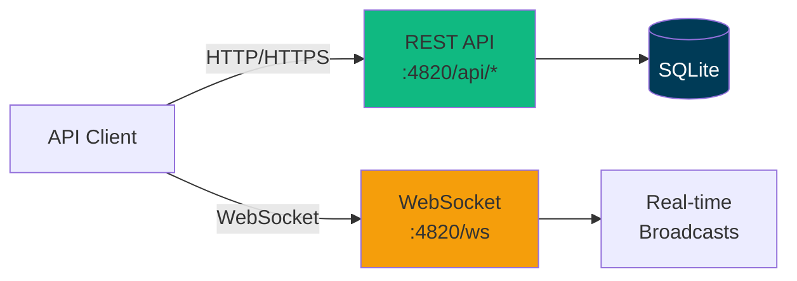
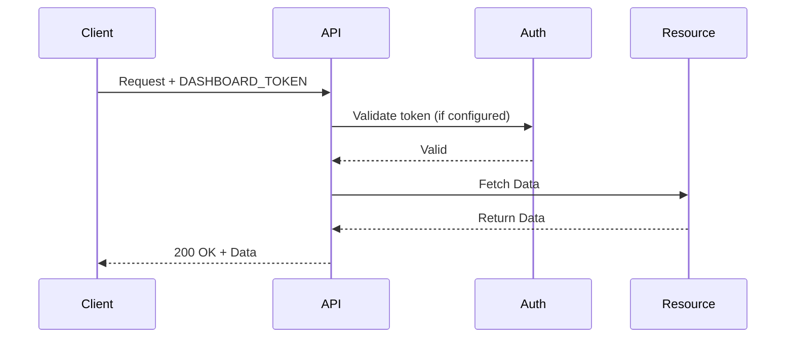
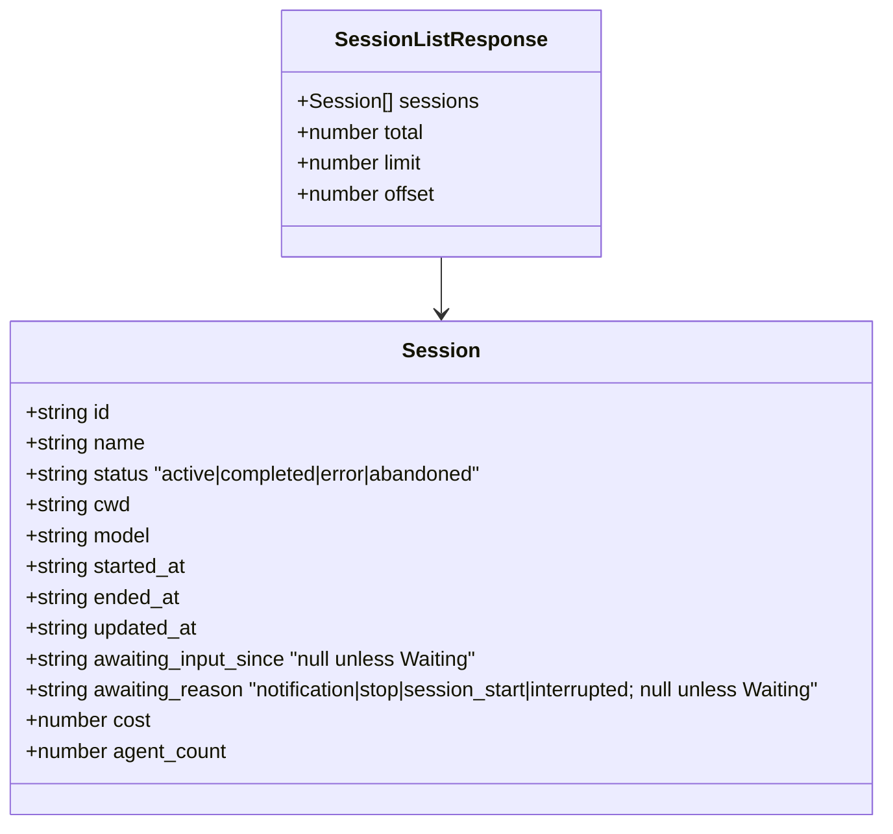
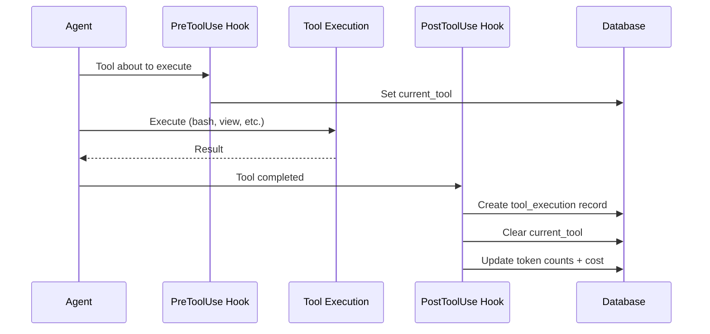
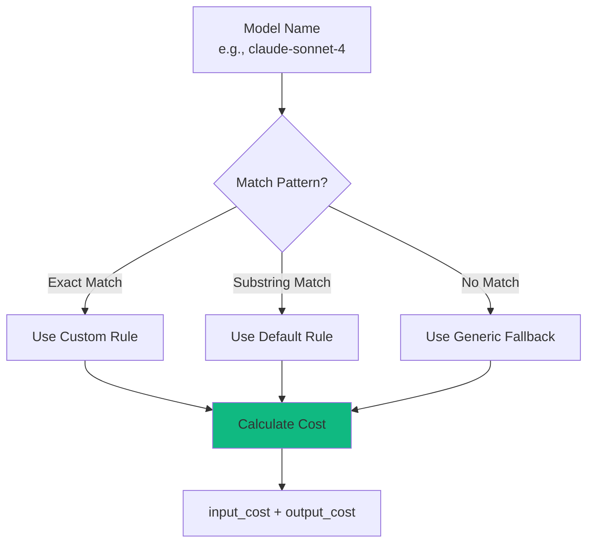
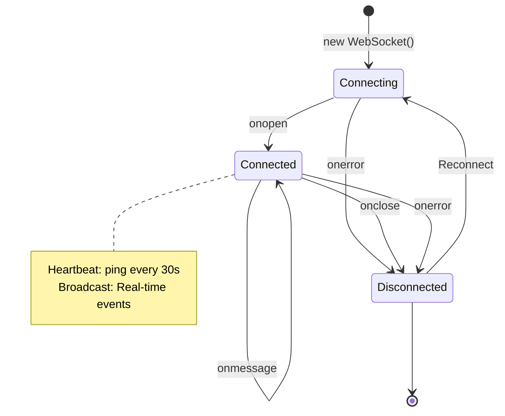
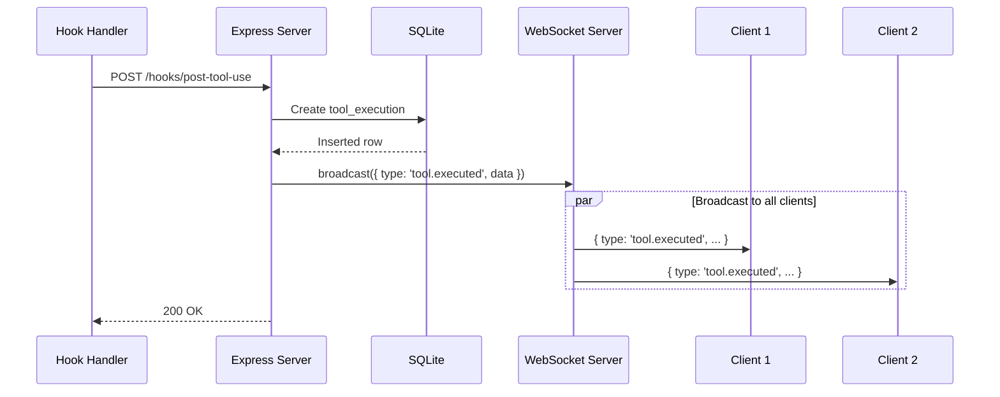
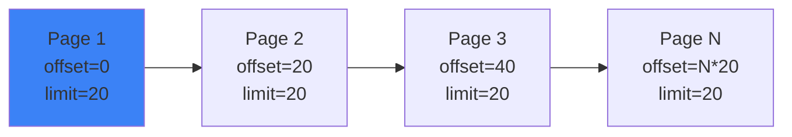

# API Reference

Complete REST API and WebSocket documentation for Agent Dashboard.

---

## Table of Contents

- [Overview](#overview)
- [Authentication](#authentication)
- [Base URL](#base-url)
- [REST API](#rest-api)
  - [Sessions](#sessions)
  - [Agents](#agents)
  - [Tools](#tools)
  - [Metrics](#metrics)
  - [Pricing](#pricing)
  - [Notifications](#notifications)
  - [Remote Data Sources](#remote-data-sources)
  - [Projects](#projects)
  - [Plans & Focus](#plans--focus)
- [WebSocket API](#websocket-api)
- [Error Handling](#error-handling)
- [Rate Limiting](#rate-limiting)
- [Pagination](#pagination)
- [Examples](#examples)

---

## Overview

The Agent Dashboard API provides programmatic access to Claude Code session monitoring data.



**Protocols:**
- **REST API** - HTTP/JSON for queries and mutations
- **WebSocket** - Real-time event streaming

---

## Authentication

The server is **local-first** and is hardened to keep the dashboard off the network by default (see GHSA-gr74-4xfh-6jw9). The trust boundary is the loopback bind, layered with origin and host checks:

- **Loopback bind by default** — the server binds `127.0.0.1`, so it is not network-reachable out of the box. Operators opt into a wider bind with `DASHBOARD_HOST` (e.g. `DASHBOARD_HOST=0.0.0.0` for LAN access), which logs a startup warning.
- **CORS restricted to loopback origins** — cross-origin web pages cannot read API responses. Requests with no `Origin` (curl, server-to-server) still work.
- **Host-header allowlist** — both HTTP requests and WebSocket upgrades are checked against an allowlist to block DNS-rebinding. Add extra LAN names (when you bind beyond loopback) via `DASHBOARD_ALLOWED_HOSTS` (comma-separated).

For deliberate LAN exposure, set `DASHBOARD_HOST` to a non-loopback address and list the names clients use in `DASHBOARD_ALLOWED_HOSTS`.

### Optional token (`DASHBOARD_TOKEN`)

Authentication is **off by default** (the loopback bind is the trust boundary). When `DASHBOARD_TOKEN` is set, every `/api/*` request **and** the WebSocket must present the token. It is strongly recommended whenever you bind beyond loopback. Pass it any of these ways:

- `Authorization: Bearer <token>` header
- `x-dashboard-token: <token>` header
- `?token=<token>` query parameter

These paths stay exempt even when a token is configured: `/api/health`, `/api/openapi.json`, `/api/docs`, and `/api/hooks` (local Claude Code hook ingestion). Requests that fail the check get `401` with error code `EUNAUTHORIZED`.



---

## Base URL

```
http://localhost:4820
```

For production, use HTTPS:

```
https://dashboard.example.com
```

---

## REST API

### Sessions

#### List Sessions

```http
GET /api/sessions
```

Returns all sessions, ordered by most recent activity.

**Query Parameters:**

| Parameter | Type | Default | Description |
|-----------|------|---------|-------------|
| `limit` | integer | 50 | Maximum sessions to return (1-1000) |
| `offset` | integer | 0 | Pagination offset |
| `status` | string | - | Filter by persisted status: `active`, `completed`, `error`, `abandoned`. The UI **Waiting** state is derived from the `awaiting_input_since` column and is not a queryable enum — filter `status=active` and inspect `awaiting_input_since` (non-null = Waiting) |
| `sources` | string | - | Comma-separated data-source ids to include (the built-in local history is `local`; remote SSH machines use their `remote_sources.id`). Omit for all sources. Also accepted on `/api/events`, `/api/agents`, `/api/stats`, `/api/analytics`, and `/api/pricing/cost`. See [Remote Data Sources](#remote-data-sources) |

**Example Request:**

```bash
curl http://localhost:4820/api/sessions?limit=10&status=active
```

**Example Response:**

```json
{
  "sessions": [
    {
      "id": 1,
      "session_id": "sess_abc123",
      "model": "claude-sonnet-4",
      "status": "active",
      "total_cost": 1.23,
      "agent_count": 3,
      "tool_count": 12,
      "created_at": "2024-03-18T12:00:00Z",
      "updated_at": "2024-03-18T14:30:00Z"
    }
  ],
  "total": 42,
  "limit": 10,
  "offset": 0
}
```

**Response Schema:**



---

#### Get Session

```http
GET /api/sessions/:id
```

Returns single session details.

**Path Parameters:**

| Parameter | Type | Description |
|-----------|------|-------------|
| `id` | string | Session ID (e.g., `sess_abc123`) |

**Example Request:**

```bash
curl http://localhost:4820/api/sessions/sess_abc123
```

**Example Response:**

```json
{
  "session": {
    "id": 1,
    "session_id": "sess_abc123",
    "model": "claude-sonnet-4",
    "status": "active",
    "total_cost": 1.23,
    "created_at": "2024-03-18T12:00:00Z",
    "updated_at": "2024-03-18T14:30:00Z"
  }
}
```

**Error Responses:**

| Code | Description |
|------|-------------|
| 404 | Session not found |
| 500 | Internal server error |

---

#### Delete Session

```http
DELETE /api/sessions/:id
```

Permanently deletes one session and its agents/events/token_usage/workflow runs (FK cascade — `foreign_keys` is `ON` for the whole database). Active sessions are refused with `409` so a live/in-progress session can't be deleted out from under itself; let it complete or wait for it to be marked `abandoned` first. Broadcasts `session_deleted` (`{ id }`) over the WebSocket so any open Session Detail page for this session navigates back to the list.

**Path Parameters:**

| Parameter | Type | Description |
|-----------|------|-------------|
| `id` | string | Session ID |

**Example Request:**

```bash
curl -X DELETE http://localhost:4820/api/sessions/sess_abc123
```

**Example Response:**

```json
{ "ok": true }
```

**Error Responses:**

| Code | Description |
|------|-------------|
| 404 | Session not found |
| 409 | Session is still `active` (code `SESSION_ACTIVE`) — wait for it to complete or abandon first |
| 500 | Internal server error |

---

#### Get Session Stats

```http
GET /api/sessions/:id/stats
```

Returns aggregated counts powering the Session Detail overview panel. All aggregation runs in SQL — the response is cheap to compute even for sessions with tens of thousands of events.

**Path Parameters:**

| Parameter | Type | Description |
|-----------|------|-------------|
| `id` | string | Session ID |

**Example Request:**

```bash
curl http://localhost:4820/api/sessions/sess_abc123/stats
```

**Example Response:**

```json
{
  "session_id": "sess_abc123",
  "total_events": 14082,
  "events_by_type": [
    { "event_type": "PreToolUse", "count": 5210 },
    { "event_type": "PostToolUse", "count": 5208 }
  ],
  "tools_used": [
    { "tool_name": "Bash", "count": 1842 },
    { "tool_name": "Read", "count": 1340 }
  ],
  "error_count": 12,
  "first_event_at": "2026-04-26T18:59:00.000Z",
  "last_event_at": "2026-04-29T21:30:14.000Z",
  "agents": {
    "total": 12,
    "main": 1,
    "subagent": 11,
    "compaction": 5,
    "by_status": { "completed": 11, "working": 1 }
  },
  "subagent_types": [
    { "subagent_type": "Explore", "count": 4 }
  ],
  "tokens": {
    "input_tokens": 1376,
    "output_tokens": 760304,
    "cache_read_tokens": 337641891,
    "cache_write_tokens": 5126047
  }
}
```

**Error Responses:**

| Code | Description |
|------|-------------|
| 404 | Session not found |
| 500 | Internal server error |

---

#### Get Session Agents

```http
GET /api/sessions/:id/agents
```

Returns all agents for a session.

**Path Parameters:**

| Parameter | Type | Description |
|-----------|------|-------------|
| `id` | string | Session ID |

**Example Request:**

```bash
curl http://localhost:4820/api/sessions/sess_abc123/agents
```

**Example Response:**

```json
{
  "agents": [
    {
      "id": "sess_abc123-main",
      "session_id": "sess_abc123",
      "name": "Main Agent - my-project",
      "type": "main",
      "subagent_type": null,
      "status": "idle",
      "current_tool": null,
      "task": null,
      "started_at": "2024-03-18T12:00:00Z",
      "ended_at": null,
      "updated_at": "2024-03-18T12:05:00Z",
      "parent_agent_id": null,
      "awaiting_input_since": "2024-03-18T12:05:00Z",
      "awaiting_reason": "stop",
      "cost": 0
    }
  ]
}
```

> **Note on `cost`** — `/api/agents` and `/api/sessions/:id/agents` attach a `cost` (USD) to each agent: the agent's **own** cost, computed server-side from the per-agent token buckets stored in `agents.metadata.tokens` and priced at the current pricing rules (at the agent's start date, so promo/standard cutovers apply — see [Pricing](#pricing)). It is `0` for main agents (whose cost is the session total, reported by `/api/pricing/cost/:sessionId`), for compaction pseudo-agents, and for any subagent whose transcript is unavailable. This lets a subagent card show only what that subagent spent instead of the whole session's total.

> **Note on `status` vs Waiting** — agents are persisted with one of `idle | connected | working | completed | error`. The yellow **Waiting** badge surfaced in the dashboard is a UI overlay derived from `awaiting_input_since` being non-null on a non-terminal agent (typically `idle` after a `Stop`, or `connected` right after `SessionStart`). Filter `?status=idle` on `/api/agents` and inspect `awaiting_input_since` to enumerate currently-waiting main agents.

---

### Agents

#### Get Agent

```http
GET /api/agents/:id
```

Returns single agent details.

**Path Parameters:**

| Parameter | Type | Description |
|-----------|------|-------------|
| `id` | string | Agent ID (e.g., `agent_xyz789`) |

**Example Request:**

```bash
curl http://localhost:4820/api/agents/agent_xyz789
```

**Example Response:**

```json
{
  "agent": {
    "id": 1,
    "agent_id": "agent_xyz789",
    "session_id": "sess_abc123",
    "agent_type": "explore",
    "status": "completed",
    "current_tool": null,
    "input_tokens": 1500,
    "output_tokens": 800,
    "cost": 0.45,
    "created_at": "2024-03-18T12:00:00Z",
    "updated_at": "2024-03-18T12:05:00Z"
  }
}
```

---

#### Get Agent Tools

```http
GET /api/agents/:id/tools
```

Returns tool executions for an agent.

**Path Parameters:**

| Parameter | Type | Description |
|-----------|------|-------------|
| `id` | string | Agent ID |

**Example Request:**

```bash
curl http://localhost:4820/api/agents/agent_xyz789/tools
```

**Example Response:**

```json
{
  "tools": [
    {
      "id": 1,
      "agent_id": "agent_xyz789",
      "tool_name": "bash",
      "duration_ms": 1234,
      "success": 1,
      "error_message": null,
      "created_at": "2024-03-18T12:01:00Z"
    },
    {
      "id": 2,
      "agent_id": "agent_xyz789",
      "tool_name": "view",
      "duration_ms": 45,
      "success": 1,
      "error_message": null,
      "created_at": "2024-03-18T12:02:00Z"
    }
  ]
}
```

**Tool Execution Flow:**



---

### Tools

#### List All Tools

```http
GET /api/tools
```

Returns all tool executions across all sessions.

**Query Parameters:**

| Parameter | Type | Default | Description |
|-----------|------|---------|-------------|
| `limit` | integer | 100 | Max tools to return |
| `tool_name` | string | - | Filter by tool name |
| `success` | boolean | - | Filter by success status |

**Example Request:**

```bash
curl http://localhost:4820/api/tools?limit=50&tool_name=bash
```

**Example Response:**

```json
{
  "tools": [
    {
      "id": 1,
      "agent_id": "agent_xyz789",
      "tool_name": "bash",
      "duration_ms": 1234,
      "success": 1,
      "error_message": null,
      "created_at": "2024-03-18T12:01:00Z"
    }
  ],
  "total": 156
}
```

---

### Metrics

#### Prometheus exposition

```
GET /api/metrics
```

Exposes the dashboard's live counters in the [Prometheus text-exposition format](https://prometheus.io/docs/instrumenting/exposition_formats/) (v0.0.4) so this monitoring dashboard can itself be scraped into Prometheus / Grafana. Read-only. Values are read from the same prepared statements the REST API uses, so they match the UI.

Response `Content-Type: text/plain; version=0.0.4; charset=utf-8`.

| Metric | Type | Labels | Meaning |
| --- | --- | --- | --- |
| `ccam_up` | gauge | — | `1` when the API served the scrape |
| `ccam_build_info` | gauge | `version` | Always `1`; dashboard version rides on the label |
| `ccam_process_uptime_seconds` | gauge | — | Server process uptime |
| `ccam_process_resident_memory_bytes` | gauge | — | Server process RSS |
| `ccam_sessions` | gauge | `status` (`active`/`completed`/`error`/`abandoned`) | Sessions by status |
| `ccam_agents` | gauge | `status` (`working`/`waiting`/`completed`/`error`) | Agents by status |
| `ccam_events_total` | counter | — | Total events recorded |
| `ccam_websocket_clients` | gauge | — | Connected realtime clients |
| `ccam_remote_sources` | gauge | `enabled` (`true`/`false`) | Configured Remote Data Sources |
| `ccam_tokens_total` | counter | `kind` (`input`/`output`/`cache_read`/`cache_write`) | Cumulative token usage |

Status series are always emitted (even at `0`) so a series never disappears from the exposition. The endpoint is mounted under `/api`, so it sits behind the same two guards as every other route: the **Host-header (DNS-rebinding) guard** and the optional **`DASHBOARD_TOKEN`** guard. A scraper that reaches the server as anything other than loopback (e.g. Prometheus in Docker hitting `host.docker.internal`) must be allowlisted with `DASHBOARD_ALLOWED_HOSTS`, or the scrape returns `403 EBADHOST`; if a token is set, the scrape must also send it.

Example scrape config (start the server with `DASHBOARD_ALLOWED_HOSTS=host.docker.internal`):

```yaml
scrape_configs:
  - job_name: ccam
    metrics_path: /api/metrics
    static_configs:
      - targets: ["host.docker.internal:4820"]
    # authorization:              # only if DASHBOARD_TOKEN is set
    #   credentials: "<DASHBOARD_TOKEN>"
```

A ready-to-run Prometheus + Grafana stack (four auto-provisioned dashboards; default home **CCAM — Overview**) lives in [`monitoring/`](../monitoring/README.md). **npm path (no Docker):** `npm run monitoring:install` then `npm run monitoring:up` (binaries are pulled via the monitoring package's `postinstall` — there is no official `grafana`/`prometheus` server package on npm). **Docker path:** `npm run monitoring:docker:up` or `npm run docker:full:up` (set `DASHBOARD_ALLOWED_HOSTS=host.docker.internal` on the dashboard when Prometheus runs in a container). Pre-built Prometheus console: `http://localhost:9090/consoles/index.html`.

---

### Pricing

#### List Pricing Rules

```http
GET /api/pricing
```

Returns all pricing rules (default + custom).

**Example Request:**

```bash
curl http://localhost:4820/api/pricing
```

**Example Response:**

```json
{
  "rules": [
    {
      "id": 1,
      "pattern": "claude-sonnet-4",
      "input_cost_per_1m": 3.0,
      "output_cost_per_1m": 15.0,
      "is_default": true,
      "created_at": "2024-03-18T12:00:00Z"
    },
    {
      "id": 10,
      "pattern": "gpt-5.1-codex",
      "input_cost_per_1m": 2.5,
      "output_cost_per_1m": 10.0,
      "is_default": false,
      "created_at": "2024-03-18T14:30:00Z"
    }
  ]
}
```

**Pricing Rule Matching:**



---

#### Create or Update Pricing Rule

```http
PUT /api/pricing
```

Upsert a pricing rule, keyed by `model_pattern`. The same call creates a new rule or updates an existing one (matched on `model_pattern`). Rates are per **million** tokens.

**Request Body:**

```json
{
  "model_pattern": "claude-sonnet-5%",
  "display_name": "Claude Sonnet 5",
  "input_per_mtok": 3,
  "output_per_mtok": 15,
  "cache_read_per_mtok": 0.3,
  "cache_write_per_mtok": 3.75,
  "cache_write_1h_per_mtok": 6,
  "fast_input_per_mtok": 0,
  "fast_output_per_mtok": 0,

  "intro_until": "2026-08-31",
  "intro_input_per_mtok": 2,
  "intro_output_per_mtok": 10,
  "intro_cache_read_per_mtok": 0.2,
  "intro_cache_write_per_mtok": 2.5,
  "intro_cache_write_1h_per_mtok": 4
}
```

**Fields:**

| Field | Type | Constraints |
|-------|------|-------------|
| `model_pattern` | string | Required. SQL-style glob; `%` matches any characters (e.g. `claude-opus-4-7%`) |
| `display_name` | string | Required |
| `input_per_mtok` / `output_per_mtok` | number | Standard per-MTok rates (default 0) |
| `cache_read_per_mtok` / `cache_write_per_mtok` / `cache_write_1h_per_mtok` | number | Cache rates (default 0) |
| `fast_input_per_mtok` / `fast_output_per_mtok` | number | Fast-mode premium rates (default 0) |
| `intro_until` | string \| null | Optional promo cutoff `YYYY-MM-DD`. Usage **on or before** this date is priced at the `intro_*` rates, after it at the standard rates. Empty/`null` clears the promo (and zeroes the intro rates) |
| `intro_*_per_mtok` | number | Optional introductory (promo) rates, mirroring the standard fields |

The intro block is **optional and backward-compatible**: a request that omits every `intro_*`/`intro_until` field leaves any existing promo untouched, so older clients that send only the standard rates never clobber a promo.

**Validation:** every `*_per_mtok` rate present in the body must be a **non-negative finite number** (numeric strings are coerced); a `NaN`, non-numeric, or negative value is rejected with `400 INVALID_INPUT` naming the offending field, and nothing is written. `intro_until` must be a `YYYY-MM-DD` date (or empty/`null` to clear the promo).

**Example Request:**

```bash
curl -X PUT http://localhost:4820/api/pricing \
  -H "Content-Type: application/json" \
  -d '{
    "model_pattern": "gpt-5.1-codex",
    "display_name": "GPT-5.1 Codex",
    "input_per_mtok": 2.5,
    "output_per_mtok": 10.0
  }'
```

**Example Response:**

```json
{
  "pricing": {
    "model_pattern": "gpt-5.1-codex",
    "display_name": "GPT-5.1 Codex",
    "input_per_mtok": 2.5,
    "output_per_mtok": 10.0,
    "intro_until": null,
    "updated_at": "2026-07-01T14:30:00Z"
  }
}
```

**Error Responses:**

| Code | Description |
|------|-------------|
| 400 | Missing `model_pattern`/`display_name`, or `intro_until` not a `YYYY-MM-DD` date |
| 500 | Database error |

---

#### Delete Pricing Rule

```http
DELETE /api/pricing/:pattern
```

Delete custom pricing rule (default rules cannot be deleted).

**Path Parameters:**

| Parameter | Type | Description |
|-----------|------|-------------|
| `pattern` | string | Pattern to delete (URL-encoded) |

**Example Request:**

```bash
# Pattern must be URL-encoded
curl -X DELETE http://localhost:4820/api/pricing/gpt-5.1-codex
```

**Example Response:**

```json
{
  "deleted": true
}
```

**Error Responses:**

| Code | Description |
|------|-------------|
| 404 | Pattern not found |
| 403 | Cannot delete default rule |
| 500 | Database error |

---

### Notifications

#### Get Session Notifications

```http
GET /api/sessions/:id/notifications
```

Returns notifications for a session.

**Path Parameters:**

| Parameter | Type | Description |
|-----------|------|-------------|
| `id` | string | Session ID |

**Example Request:**

```bash
curl http://localhost:4820/api/sessions/sess_abc123/notifications
```

**Example Response:**

```json
{
  "notifications": [
    {
      "id": 1,
      "session_id": "sess_abc123",
      "notification_type": "backgroundTaskComplete",
      "message": "Explore agent completed",
      "created_at": "2024-03-18T12:05:00Z"
    }
  ]
}
```

### Remote Data Sources

The `/api/remote-sources/*` namespace configures **remote SSH machines** the dashboard pulls Claude Code history from, so one dashboard can consolidate sessions from several machines. **No secrets are stored** — SSH authentication defers entirely to the host's SSH stack (ssh-agent, `~/.ssh/config`, key files). Every imported session is tagged with the source's id in the `sessions.source` column (the built-in local history uses the id `local`), which powers the `sources` filter below.

**RemoteSource shape:**

```json
{
  "id": "4d1f0e2a-7b9c-4c33-8a21-9e0f7b6d4c11",
  "label": "Work laptop",
  "host": "son@studio.local",
  "ssh_port": 22,
  "identity_file": "~/.ssh/id_ed25519",
  "remote_home": "~/.claude",
  "enabled": true,
  "status": "ok",
  "last_error": null,
  "last_sync_at": "2026-07-22T18:41:55.117Z",
  "last_sync_counts": {
    "imported": 9,
    "skipped": 41,
    "backfilled": 0,
    "errors": 0,
    "sessions_seen": 50,
    "sessions_tagged": 50
  },
  "created_at": "2026-07-20T09:15:00.000Z",
  "updated_at": "2026-07-22T18:41:55.117Z"
}
```

`ssh_port`, `identity_file`, `remote_home`, `last_error`, `last_sync_at`, and `last_sync_counts` are nullable. `status` is one of `idle`, `syncing`, `ok`, `error`.

#### List Remote Sources

```http
GET /api/remote-sources
```

Returns all configured remote sources. Response: `{ "sources": RemoteSource[] }`.

#### Create Remote Source

```http
POST /api/remote-sources
```

**Request Body:**

| Field | Type | Required | Description |
|-------|------|----------|-------------|
| `label` | string | Yes | Human-readable name |
| `host` | string | Yes | SSH destination (`user@host`) or a `~/.ssh/config` alias |
| `ssh_port` | integer | No | SSH port (defers to SSH default / config when omitted) |
| `identity_file` | string | No | Private-key path passed to ssh (`-i`) |
| `remote_home` | string | No | Remote Claude home (defaults to remote `~/.claude`) |
| `enabled` | boolean | No | Whether the source is eligible for syncs (default `true`) |

Returns `{ "source": RemoteSource }` with HTTP **201**.

**Error Responses (400):** `{ "error": { "code", "message" } }` with one of:

| Code | Meaning |
|------|---------|
| `INVALID_LABEL` | Missing/blank `label` |
| `INVALID_HOST` | Missing/invalid `host` |
| `INVALID_PORT` | `ssh_port` out of range |
| `INVALID_IDENTITY_FILE` | Invalid `identity_file` value |
| `INVALID_REMOTE_HOME` | Invalid `remote_home` value |

#### Update Remote Source

```http
PATCH /api/remote-sources/:id
```

Partial update — only the keys present in the body change. Same fields (and the same validation codes) as create; both `label` and `host` are optional here. Returns `{ "source": RemoteSource }`, or **404** if the id is unknown.

#### Delete Remote Source

```http
DELETE /api/remote-sources/:id
```

**Query Parameters:**

| Parameter | Type | Default | Description |
|-----------|------|---------|-------------|
| `purge` | boolean | `false` | When `true`, also delete this source's imported sessions. When omitted/`false`, those sessions are **detached** — reassigned to the `local` source so history is preserved |

Returns `{ "ok": true, "purged": <bool> }` (`purged` is `true` only when `?purge=true` deleted the sessions). **404** if the id is unknown.

#### Test Remote Source

```http
POST /api/remote-sources/:id/test
```

Runs an SSH connectivity probe. Returns `{ "ok": <bool>, "message": <string>, "remoteProjects?": string[] }` — `remoteProjects` lists the discovered remote project directories on success. Does not import anything. **404** if the id is unknown.

#### Sync Remote Source

```http
POST /api/remote-sources/:id/sync
```

Pulls Claude Code history from the remote over SSH now, through the same idempotent import pipeline used locally, tagging imported sessions with this source's id. Progress/completion is also broadcast over the WebSocket as [`remote_source.status`](#remote_sourcestatus) frames.

**Example Response:**

```json
{
  "ok": true,
  "imported": 9,
  "skipped": 41,
  "backfilled": 0,
  "errors": 0,
  "sessions_seen": 50,
  "sessions_tagged": 50
}
```

**404** if the id is unknown; **500** with `{ error: { code: "SYNC_FAILED", message } }` on SSH/import failure.

#### Sync All Remote Sources

```http
POST /api/remote-sources/sync-all
```

Pulls history from **every enabled** source sequentially (one SSH connection at a time). Per-source failures are isolated — one unreachable machine never aborts the others — and each outcome is returned in `results`. Always **200**.

**Example Response:**

```json
{ "ok": true, "synced": 2, "results": [{ "id": "src_a", "ok": true }, { "id": "src_b", "ok": false, "error": "ssh exited with code 255" }] }
```

#### The `sources` filter

`GET /api/sessions`, `/api/events`, `/api/agents`, `/api/stats`, and `/api/analytics` accept an optional `sources` query parameter: a comma-separated list of source ids to include (omit for all). `GET /api/sessions/facets` correspondingly returns a `sources: string[]` array (alongside `cwds`) listing the distinct `sessions.source` values so the UI can build the filter dropdown.

```bash
curl "http://localhost:4820/api/sessions?sources=local,4d1f0e2a-7b9c-4c33-8a21-9e0f7b6d4c11"
```

---

### Projects

The `/api/projects/*` namespace groups sessions by the folder(s) they run from into a user-named **project** — an organizational view alongside Sessions/Agents, not a new field on sessions. A project claims one or more working directories; a folder belongs to at most one project. Membership is derived server-side by joining `sessions.cwd` against the project's mapped folders, so nothing needs to be backfilled onto existing sessions. Unlike Alerts/Webhooks, mutations here are **not** broadcast over the WebSocket — like `remote_sources` config CRUD, the client just re-fetches after each change.

**Project shape:**

```json
{
  "id": "b6f1a2d0-3c4e-4f5a-9b8c-1d2e3f4a5b6c",
  "name": "Agent Monitor",
  "paths": [{ "id": 1, "cwd": "/Users/dev/Claude-Code-Agent-Monitor" }],
  "session_count": 12,
  "active_count": 1,
  "last_activity": "2026-07-24T18:41:55.117Z",
  "created_at": "2026-07-01T09:15:00.000Z",
  "updated_at": "2026-07-20T09:15:00.000Z"
}
```

`session_count`, `active_count`, and `last_activity` are aggregated server-side across every folder currently mapped to the project; `last_activity` is `null` when the project has no sessions yet.

#### List Projects

```http
GET /api/projects
```

Returns every project plus an `unassigned` bucket for cwds that have sessions but aren't mapped to any project yet:

```json
{
  "projects": [ /* Project[] */ ],
  "unassigned": {
    "cwds": ["/Users/dev/scratch"],
    "session_count": 3,
    "active_count": 0,
    "last_activity": "2026-07-19T02:10:00.000Z"
  }
}
```

#### Create Project

```http
POST /api/projects
```

**Request Body:**

| Field | Type | Required | Description |
|-------|------|----------|-------------|
| `name` | string | Yes | Display name |
| `cwds` | string[] | No | Folders to attach immediately (deduplicated; each must be unmapped elsewhere) |

Returns `{ "project": Project }` with HTTP **201**. **400** `INVALID_INPUT` for a missing/blank `name` or a non-array `cwds`. **409** `ALREADY_MAPPED` if any requested `cwd` already belongs to another project (no partial creation — the whole request is rejected).

#### Rename Project

```http
PATCH /api/projects/:id
```

**Request Body:** `{ "name": string }` (required, non-blank). Returns `{ "project": Project }`, or **404** if the id is unknown.

#### Delete Project

```http
DELETE /api/projects/:id
```

Deletes the project; its folder mappings cascade away (`ON DELETE CASCADE`). The underlying sessions are **untouched** — they simply fall back into the `unassigned` bucket on the next list call. Returns `{ "ok": true }`, or **404** if the id is unknown.

#### Add Folder to Project

```http
POST /api/projects/:id/paths
```

**Request Body:** `{ "cwd": string }` (required, non-blank). Returns `{ "project": Project }` with HTTP **201**. **404** if the project id is unknown. **409** `ALREADY_MAPPED` if the folder already belongs to this project or another one (message distinguishes the two cases).

#### Remove Folder from Project

```http
DELETE /api/projects/:id/paths/:pathId
```

`pathId` is the numeric id from `Project.paths[].id`. Unmaps the folder — the folder and its sessions are untouched; it becomes unassigned again. Returns `{ "project": Project }`, or **404** if the project id or `pathId` is unknown (or the mapping doesn't belong to that project).

---

### Plans & Focus

**Plan-Aware Monitoring**: each monitored repo may keep a human-approved `AGENT-PLAN.md` at its root (a `# Title` plus numbered checkbox items like `- [ ] 4. Migrate auth — acceptance: login works via SSO`). The dashboard mirrors it **read-only** into the `plans`/`plan_items` tables, keyed by cwd — the file is the source of truth and is never written by the server. Sessions declare which item they are serving with `ccam focus set|push|pop|done`, normally parsed off the `PostToolUse` hook stream; the endpoints below are the read surface plus the explicit (non-hook) write path.

**Plan shape** (`plan` + `items`):

```json
{
  "plan": {
    "cwd": "/Users/dev/Claude-Code-Agent-Monitor",
    "title": "Auth migration",
    "file_path": "/Users/dev/Claude-Code-Agent-Monitor/AGENT-PLAN.md",
    "content_hash": "2f9c…",
    "item_count": 2,
    "missing_at": null,
    "created_at": "2026-07-20T09:15:00.000Z",
    "updated_at": "2026-07-24T18:41:55.117Z"
  },
  "items": [
    {
      "cwd": "/Users/dev/Claude-Code-Agent-Monitor",
      "item_number": 1,
      "text": "Migrate auth",
      "acceptance": "login works via SSO",
      "checked": 0,
      "position": 0,
      "declared_done_at": null,
      "declared_done_session": null,
      "updated_at": "2026-07-24T18:41:55.117Z"
    }
  ]
}
```

`checked` mirrors the file's checkbox (human-owned); `declared_done_*` is the agent's claim via `focus done` and survives re-ingest. `missing_at` is stamped when the file disappears (the row is kept — focus history still references its items).

**Focus wire shape:**

```json
{
  "session_id": "sess_abc123",
  "cwd": "/Users/dev/Claude-Code-Agent-Monitor",
  "item_number": 4,
  "item_text": "Migrate auth",
  "note": "starting with the SSO callback",
  "detour_stack": [
    { "description": "npm conflict", "pushed_at": "2026-07-24T18:20:00.000Z", "prior_item": 4 }
  ],
  "since": "2026-07-24T18:00:00.000Z",
  "drift": null,
  "drift_reason": null,
  "updated_at": "2026-07-24T18:20:00.000Z"
}
```

`drift` is tri-state: `true` (the drift audit flagged the session), `false` (audited, on track), `null` (not audited yet / unknown). It is written only by the background focus drift audit — declarations never touch it.

#### List Plans

```http
GET /api/plans
```

Returns every known plan with its items (small N — one per repo): `{ "plans": [ { ...plan, "items": [...] } ] }`.

#### Get Plan for a Working Directory

```http
GET /api/plans/for-cwd?cwd=/absolute/path
```

Query-param form because cwds contain slashes. Returns `{ "plan": ..., "items": [...] }`. **400** `INVALID_INPUT` for a missing/blank `cwd`; **404** `NOT_FOUND` when the cwd has no stored plan.

#### Get Plans for a Project

```http
GET /api/plans/project/:projectId
```

Per-project rollup — one entry per mapped folder that has a plan:

```json
{
  "project_id": "b6f1a2d0-3c4e-4f5a-9b8c-1d2e3f4a5b6c",
  "plans": [ { "cwd": "/Users/dev/Claude-Code-Agent-Monitor", "plan": { ... }, "items": [ ... ] } ]
}
```

**404** if the project id is unknown.

#### Refresh a Plan

```http
POST /api/plans/refresh
```

**Request Body:** `{ "cwd": string }` (required). Forces an ingest of `<cwd>/AGENT-PLAN.md` right now — the escape hatch when the background poll is disabled (`DASHBOARD_PLAN_POLL_MS=0`), also used by the CLI. Returns `{ "changed": boolean, "plan": ..., "items": [...] }` and broadcasts `plan_updated` when anything changed. **400** `INVALID_INPUT` for a missing `cwd`; **404** `NOT_FOUND` when there is no `AGENT-PLAN.md` **and** no stored plan for that cwd.

#### Bulk Focus Hydrate

```http
GET /api/focus
```

Every **active** session's declared focus in one round-trip — `{ "focus": [ FocusWireShape, ... ] }`. This is the client's initial hydrate; live updates then arrive as `session_focus` WebSocket messages.

#### Get Session Focus

```http
GET /api/sessions/:id/focus
```

One session's focus plus context and history:

```json
{
  "focus": { ...FocusWireShape or null },
  "item": { ...plan_items row for the declared item, or null },
  "plan_title": "Auth migration",
  "history": [
    { "at": "2026-07-24T18:20:00.000Z", "kind": "detour_push", "verb": "push", "item_number": null, "text": "npm conflict" },
    { "at": "2026-07-24T18:00:00.000Z", "kind": "item", "verb": "set", "item_number": 4, "text": "Migrate auth" }
  ]
}
```

`history` is rebuilt from the `Focus` rows in the events table (newest first, capped at 50); `kind` is `item`, `detour_push`, or `detour_pop`. **404** if the session is unknown.

#### Declare Session Focus

```http
POST /api/sessions/:id/focus
```

The explicit (non-hook) focus write path — used by `ccam focus` when run outside a Claude Code session and by integrations. Inside a session, declarations ride the `PostToolUse` hook stream instead (see [docs/HOOKS.md](./HOOKS.md)).

**Request Body:**

| Field | Type | Required | Description |
|-------|------|----------|-------------|
| `verb` | string | Yes | `set`, `push`, `pop`, or `done` |
| `item_number` | integer | For `set`/`done` | The plan item's own number (0–999) |
| `note` | string | No (`set` only) | Free-text note, clamped to 300 chars |
| `description` | string | For `push` | What the detour is, clamped to 300 chars |

Returns `{ "focus": FocusWireShape, "deduped": boolean }`. Unlike the permissive hook path, this endpoint is **strict**: **400** `INVALID_INPUT` for a bad verb/field, **404** for an unknown session, **409** `UNKNOWN_ITEM` (declared item isn't in the ingested plan) or `EMPTY_STACK` (`pop` with no detour in flight). It is also **idempotent**: a declaration whose end state equals the current state returns `"deduped": true` without writing a `Focus` event — CLI-write + hook-parse double delivery is harmless. Declarations never touch the `drift_*` columns.

#### Get Session Todos

```http
GET /api/sessions/:id/todos
```

The session's latest TodoWrite micro-plan, parsed on read from the newest `PostToolUse`/`TodoWrite` event (no materialized copy to keep in sync): `{ "todos": [ ... ] | null, "updated_at": "..." | null }`. **404** if the session is unknown.

---

### Claude Config Explorer

The `/api/cc-config/*` namespace powers the Claude Config Explorer page. All read endpoints are pure file reads under `CLAUDE_HOME` and the project's `.claude/` dir; mutations are limited to low-risk text-file artifacts (skills, subagents, slash commands, output styles, memory) and always create a timestamped backup before writing. Plugins, MCP servers, hooks-in-settings, and live `settings.json` files stay read-only because they are written concurrently by the running Claude Code CLI.

```http
GET /api/cc-config/overview
GET /api/cc-config/skills?scope=user|project|all
GET /api/cc-config/agents
GET /api/cc-config/commands
GET /api/cc-config/output-styles
GET /api/cc-config/plugins
GET /api/cc-config/marketplaces
GET /api/cc-config/mcp
GET /api/cc-config/hooks
GET /api/cc-config/hook-scripts
GET /api/cc-config/keybindings
PUT /api/cc-config/keybindings Body: { groups: [{ context, bindings: [{ key, action }] }] }
GET /api/cc-config/statusline
GET /api/cc-config/settings
GET /api/cc-config/memory
GET /api/cc-config/file?path=<absolute-path>
GET /api/cc-config/backups[?scope=&type=]
PUT /api/cc-config/file        Body: { scope, type, name?, content }
DELETE /api/cc-config/file     Body: { scope, type, name? }
```

`scope` is `"user"`, `"project"`, or `"auto-memory"`. `type` is one of `skills`, `agents`, `commands`, `output-styles`, `memory`, `auto-memory`. `name` is required for everything except `memory` (which is `CLAUDE.md` itself). On `PUT`, `name` is validated against `^[A-Za-z0-9][A-Za-z0-9._-]{0,63}$` (for `auto-memory` it must instead be a flat `*.md` filename). Settings are returned with secret-like keys (matching `/token|secret|password|api[_-]?key|auth/i`) replaced by `"<redacted>"`.

`GET /api/cc-config/memory` also surfaces the per-project file-based memory store — every `*.md` under `~/.claude/projects/<slug>/memory/` (the common pattern of a `MEMORY.md` index plus one file per remembered fact). Those items have `scope: "auto-memory"` and carry `project` (the `projects/<slug>` dir name), `name` (filename), `isIndex` (true for `MEMORY.md` / `INDEX-*.md`, which sort first), and parsed `frontmatter`. They are **editable**: `PUT`/`DELETE /api/cc-config/file` accept `{ scope: "auto-memory", type: "auto-memory", project, name, content? }` and create a timestamped backup under `<memory-dir>/.cc-config-backups/auto-memory/` before mutating (an invalid `project` slug returns `EBADPROJECT`). `GET /api/cc-config/backups` lists these with `scope: "auto-memory"` and `project` set. Bodies are also readable via `GET /api/cc-config/file` (they live under `CLAUDE_HOME`).

`PUT /api/cc-config/keybindings` edits `~/.claude/keybindings.json` from a structured list of context groups (`{ groups: [{ context, bindings: [{ key, action }] }] }`). The server backs the file up first (under `<CLAUDE_HOME>/cc-config-backups/keybindings/`), preserves any top-level metadata (`$schema`/`$docs`), and replaces only the `bindings` array; duplicate contexts or duplicate keys within a context return `EBADCONTENT`. Unlike `settings.json` (which the live CLI rewrites mid-session and is therefore read-only here), `keybindings.json` is safe to edit from the dashboard.

Backup paths look like `<root>/cc-config-backups/<type>/<base>.<ISO>.bak[.dir]` — outside the directories Claude Code scans, so a deleted skill cannot resurface as a backup-named one. The Backups modal in the UI auto-builds `mv` restore commands.

### Run Claude

The `/api/run/*` namespace spawns and supervises `claude` subprocesses from the dashboard. Every route enforces a same-origin / loopback-Origin guard; browser requests must come from `localhost`, `127.0.0.1`, `::1`, or `0.0.0.0`. CLI / curl requests with no `Origin` header pass through. When `DASHBOARD_TOKEN` is set, a valid token is also required here (like the rest of `/api/*` — see [Authentication](#authentication)).

```http
GET    /api/run                       List all handles + concurrency state
GET    /api/run/binary                { found, path } for the `claude` binary
GET    /api/run/cwds                  Suggested cwds (dashboard, home, recent)
GET    /api/run/files?cwd=&q=         Fuzzy file search inside cwd for the @-file autocomplete
                                       (skips node_modules, .git, dist, build, .next, .cache, coverage, vendor)
POST   /api/run                       Spawn — Body: { prompt, mode, cwd?, model?, permissionMode?, resumeSessionId?, effort? }
POST   /api/run/:id/message           Send follow-up turn — Body: { text }
GET    /api/run/:id[?envelopes=1]     Handle state; ?envelopes=1 includes the in-memory envelope log
DELETE /api/run/:id                   Stop (SIGTERM → SIGKILL after 5 s)
```

`mode` is `"headless"` (single-shot, stdin closed after spawn, prompt in argv via `-p`) or `"conversation"` (multi-turn, stdin stays open, prompt and follow-ups piped as stream-json envelopes). `resumeSessionId` requires conversation mode and adds `--resume <id>` so the run continues an existing Claude Code session — the cwd is locked to the original session's cwd. **When `resumeSessionId` is set, `prompt` may be empty** — the spawner skips the initial stdin write and `claude --resume` idles on the resumed conversation until the user posts a follow-up via `POST /api/run/:id/message`. Headless mode and fresh conversations still require a non-empty prompt (`EBADPROMPT` otherwise). `effort` (`"low"` / `"medium"` / `"high"`) maps to `--effort` and tunes the model's thinking budget. The spawner always passes `--output-format stream-json --verbose --include-partial-messages` so output streams over the existing dashboard WebSocket as `run_stream` (parsed envelopes, including `stream_event` deltas for character-by-character rendering), `run_status` (status transitions), and `run_input_ack` (stdin write confirmed). Concurrency is effectively uncapped (default ceiling 10000, override with `RUN_MAX_CONCURRENT`) — the terminal TUI has no cap and neither does the dashboard; the ceiling exists only to prevent fork-bomb footguns from a buggy client.

Spawned `claude` processes fire the dashboard's hooks like any other CLI session, so they show up in `/api/sessions`, the analytics, the Kanban board, and the Workflows page automatically — the Run page itself just owns the live streaming UX.

---

## WebSocket API

### Connection

```javascript
const ws = new WebSocket('ws://localhost:4820/ws');

ws.onopen = () => {
  console.log('Connected to Agent Dashboard');
};

ws.onmessage = (event) => {
  const message = JSON.parse(event.data);
  console.log('Received:', message);
};

ws.onerror = (error) => {
  console.error('WebSocket error:', error);
};

ws.onclose = () => {
  console.log('Disconnected');
};
```

When `DASHBOARD_TOKEN` is configured, pass the token as `?token=<token>` on the `/ws` upgrade (an `x-dashboard-token` header also works):

```javascript
const ws = new WebSocket('ws://localhost:4820/ws?token=YOUR_DASHBOARD_TOKEN');
```

### WebSocket Lifecycle



### Event Types

Server broadcasts JSON messages to all connected clients:

#### session.created

Sent when a new session is created.

```json
{
  "type": "session.created",
  "data": {
    "id": 1,
    "session_id": "sess_abc123",
    "model": "claude-sonnet-4",
    "status": "active",
    "total_cost": 0,
    "created_at": "2024-03-18T12:00:00Z",
    "updated_at": "2024-03-18T12:00:00Z"
  }
}
```

#### session.updated

Sent when session data changes (status, cost, etc.).

```json
{
  "type": "session.updated",
  "data": {
    "id": 1,
    "session_id": "sess_abc123",
    "model": "claude-sonnet-4",
    "status": "completed",
    "total_cost": 1.23,
    "created_at": "2024-03-18T12:00:00Z",
    "updated_at": "2024-03-18T14:30:00Z"
  }
}
```

#### agent.created

Sent when a new agent starts.

```json
{
  "type": "agent.created",
  "data": {
    "id": 1,
    "agent_id": "agent_xyz789",
    "session_id": "sess_abc123",
    "agent_type": "explore",
    "status": "running",
    "current_tool": null,
    "input_tokens": 0,
    "output_tokens": 0,
    "cost": 0,
    "created_at": "2024-03-18T12:00:00Z",
    "updated_at": "2024-03-18T12:00:00Z"
  }
}
```

#### agent.updated

Sent when agent data changes (tokens, status, current_tool).

```json
{
  "type": "agent.updated",
  "data": {
    "id": 1,
    "agent_id": "agent_xyz789",
    "session_id": "sess_abc123",
    "agent_type": "explore",
    "status": "completed",
    "current_tool": null,
    "input_tokens": 1500,
    "output_tokens": 800,
    "cost": 0.45,
    "created_at": "2024-03-18T12:00:00Z",
    "updated_at": "2024-03-18T12:05:00Z"
  }
}
```

#### tool.executed

Sent when a tool execution completes.

```json
{
  "type": "tool.executed",
  "data": {
    "id": 1,
    "agent_id": "agent_xyz789",
    "tool_name": "bash",
    "duration_ms": 1234,
    "success": 1,
    "error_message": null,
    "created_at": "2024-03-18T12:01:00Z"
  }
}
```

#### notification.received

Sent when a notification is created.

```json
{
  "type": "notification.received",
  "data": {
    "id": 1,
    "session_id": "sess_abc123",
    "notification_type": "backgroundTaskComplete",
    "message": "Explore agent completed",
    "created_at": "2024-03-18T12:05:00Z"
  }
}
```

#### run_stream / run_status / run_input_ack

Broadcast by `routes/run.js` and `lib/run-spawner.js` for `/run` page subprocesses. `run_stream.data.envelope` is a parsed stream-json envelope; the spawner runs claude with `--include-partial-messages` so this includes `stream_event` deltas (`message_start`, `content_block_delta` text/thinking deltas, `message_stop`, etc.) for character-level streaming.

```json
{ "type": "run_stream", "data": { "id": "<run-id>", "envelope": { "type": "stream_event", "event": { "type": "content_block_delta", "index": 0, "delta": { "type": "text_delta", "text": "Hello" } } } } }
{ "type": "run_status", "data": { "id": "<run-id>", "status": "running", "at": 1700000000000 } }
{ "type": "run_input_ack", "data": { "id": "<run-id>", "messageId": "<uuid>", "at": 1700000000000 } }
```

#### cc_config_changed

Broadcast whenever Claude Code configuration changes — either by dashboard mutations on `PUT/DELETE /api/cc-config/file` (`source: "dashboard"`) or by `lib/cc-watcher.js` picking up external `fs.watch` events on `~/.claude/` and `~/.claude.json` (`source: "fs"`, debounced at 500 ms). The Config Explorer page subscribes and refetches automatically.

```json
{ "type": "cc_config_changed", "data": { "source": "dashboard", "action": "write", "scope": "user", "type": "skill", "name": "my-skill" } }
{ "type": "cc_config_changed", "data": { "source": "fs", "paths": ["/Users/foo/.claude/settings.json"] } }
```

#### plan_updated

Broadcast whenever a repo's `AGENT-PLAN.md` is (re)ingested with changes — by the background plan poll (`DASHBOARD_PLAN_POLL_MS`), the opportunistic `SessionStart` ingest, `POST /api/plans/refresh`, or a `focus done` declaration (the `declared_done` rollup changed). Carries the full plan + items (see [Plans & Focus](#plans--focus)).

```json
{ "type": "plan_updated", "data": { "plan": { "cwd": "/Users/dev/Claude-Code-Agent-Monitor", "title": "Auth migration", "item_count": 2 }, "items": [ { "item_number": 1, "text": "Migrate auth", "checked": 0 } ] } }
```

#### session_focus

Broadcast whenever a session's declared focus changes (a `ccam focus` declaration applied via the hook stream or `POST /api/sessions/:id/focus`) or the background focus drift audit stamps a verdict. Carries the focus wire shape; the client merges it into `lib/focusStore.ts` on top of the `GET /api/focus` bulk hydrate.

```json
{ "type": "session_focus", "data": { "session_id": "sess_abc123", "cwd": "/Users/dev/Claude-Code-Agent-Monitor", "item_number": 4, "item_text": "Migrate auth", "note": null, "detour_stack": [], "since": "2026-07-24T18:00:00.000Z", "drift": null, "drift_reason": null, "updated_at": "2026-07-24T18:00:00.000Z" } }
```

#### remote_source.status

Broadcast when a remote data source changes sync state (during/after `POST /api/remote-sources/:id/sync`) or is deleted. `status` is one of `idle`, `syncing`, `ok`, `error`, or `deleted`. `error` and `last_sync_at` are optional and present when relevant. See [Remote Data Sources](#remote-data-sources).

```json
{ "type": "remote_source.status", "data": { "id": "4d1f0e2a-7b9c-4c33-8a21-9e0f7b6d4c11", "status": "syncing" } }
{ "type": "remote_source.status", "data": { "id": "4d1f0e2a-7b9c-4c33-8a21-9e0f7b6d4c11", "status": "ok", "last_sync_at": "2026-07-22T18:41:55.117Z" } }
{ "type": "remote_source.status", "data": { "id": "4d1f0e2a-7b9c-4c33-8a21-9e0f7b6d4c11", "status": "error", "error": "ssh exited with code 255" } }
{ "type": "remote_source.status", "data": { "id": "4d1f0e2a-7b9c-4c33-8a21-9e0f7b6d4c11", "status": "deleted" } }
```

### Event Flow



---

## Error Handling

### Error Response Format

All error responses follow this structure:

```json
{
  "error": "Human-readable error message",
  "code": "ERROR_CODE",
  "details": {
    "field": "Additional context"
  }
}
```

### HTTP Status Codes

| Code | Meaning | Example |
|------|---------|---------|
| 200 | Success | Resource retrieved |
| 201 | Created | Resource created |
| 400 | Bad Request | Invalid JSON, missing fields |
| 404 | Not Found | Session/agent not found |
| 409 | Conflict | Duplicate pattern |
| 500 | Server Error | Database error |

### Error Examples

**400 Bad Request:**

```json
{
  "error": "Missing required field: pattern",
  "code": "VALIDATION_ERROR",
  "details": {
    "field": "pattern",
    "message": "Pattern is required"
  }
}
```

**404 Not Found:**

```json
{
  "error": "Session not found",
  "code": "NOT_FOUND",
  "details": {
    "session_id": "sess_invalid"
  }
}
```

**409 Conflict:**

```json
{
  "error": "Pricing rule already exists",
  "code": "DUPLICATE_PATTERN",
  "details": {
    "pattern": "claude-sonnet-4"
  }
}
```

---

## Rate Limiting

Currently, no rate limiting is enforced. For production deployments, implement rate limiting:

```javascript
// Using express-rate-limit
import rateLimit from 'express-rate-limit';

const limiter = rateLimit({
  windowMs: 15 * 60 * 1000, // 15 minutes
  max: 100, // Limit each IP to 100 requests per windowMs
  message: 'Too many requests, please try again later.'
});

app.use('/api/', limiter);
```

---

## Pagination

For endpoints returning lists, use `limit` and `offset`:

```http
GET /api/sessions?limit=20&offset=40
```

**Pagination Pattern:**



**Response includes pagination metadata:**

```json
{
  "sessions": [...],
  "total": 156,
  "limit": 20,
  "offset": 40,
  "has_more": true
}
```

---

## Examples

### Full Session Workflow

```javascript
// 1. List sessions
const sessions = await fetch('http://localhost:4820/api/sessions');
const { sessions: sessionList } = await sessions.json();

// 2. Get specific session
const sessionId = sessionList[0].session_id;
const session = await fetch(`http://localhost:4820/api/sessions/${sessionId}`);
const sessionData = await session.json();

// 3. Get session agents
const agents = await fetch(`http://localhost:4820/api/sessions/${sessionId}/agents`);
const { agents: agentList } = await agents.json();

// 4. Get agent tools
const agentId = agentList[0].agent_id;
const tools = await fetch(`http://localhost:4820/api/agents/${agentId}/tools`);
const { tools: toolList } = await tools.json();

console.log('Session:', sessionData);
console.log('Agents:', agentList);
console.log('Tools:', toolList);
```

### Real-time Monitoring

```javascript
// Connect to WebSocket
const ws = new WebSocket('ws://localhost:4820/ws');

ws.onopen = () => {
  console.log('Connected to real-time stream');
};

ws.onmessage = (event) => {
  const message = JSON.parse(event.data);
  
  switch (message.type) {
    case 'session.created':
      console.log('New session:', message.data.session_id);
      break;
    
    case 'agent.updated':
      console.log('Agent updated:', message.data.agent_id);
      console.log('Cost:', message.data.cost);
      break;
    
    case 'tool.executed':
      console.log('Tool executed:', message.data.tool_name);
      console.log('Duration:', message.data.duration_ms, 'ms');
      break;
  }
};
```

### Creating Pricing Rules

```javascript
// Create custom rule
const response = await fetch('http://localhost:4820/api/pricing', {
  method: 'POST',
  headers: { 'Content-Type': 'application/json' },
  body: JSON.stringify({
    pattern: 'my-custom-model',
    input_cost_per_1m: 5.0,
    output_cost_per_1m: 20.0
  })
});

const { rule } = await response.json();
console.log('Created rule:', rule);

// List all rules
const rules = await fetch('http://localhost:4820/api/pricing');
const { rules: ruleList } = await rules.json();
console.log('All rules:', ruleList);

// Delete rule
await fetch('http://localhost:4820/api/pricing/my-custom-model', {
  method: 'DELETE'
});
```

---

## Summary

The Agent Dashboard API provides:

- ✅ **RESTful endpoints** for querying sessions, agents, tools, pricing
- ✅ **WebSocket streaming** for real-time updates
- ✅ **Type-safe responses** with consistent JSON structure
- ✅ **Error handling** with descriptive error codes
- ✅ **Pagination** for large datasets
- ✅ **Pricing management** with custom rule support

For interactive API exploration with live request/response examples, see the built-in Swagger UI at `/api/docs` and ReDoc at `/api/redoc`. For MCP integration, see [MCP.md](./MCP.md).
