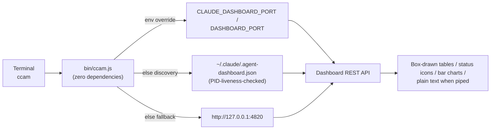

# `ccam` CLI Reference

The complete guide to `ccam`, the Claude Code Agent Monitor command-line interface — the full dashboard feature surface, in your terminal.

---

## Table of Contents

- [Overview](#overview)
- [Installation & Linking](#installation--linking)
- [Server Discovery](#server-discovery)
- [Commands](#commands)
  - [Server Lifecycle](#server-lifecycle)
  - [Interactive REPL](#interactive-repl)
  - [Offline Mode](#offline-mode)
  - [Monitoring](#monitoring)
  - [Data Browsing](#data-browsing)
  - [Insights](#insights)
  - [Alerts & Webhooks](#alerts--webhooks)
  - [Pricing](#pricing)
  - [Import](#import)
  - [Administration](#administration)
- [Safety Model](#safety-model)
- [Output & Scripting](#output--scripting)
- [Troubleshooting](#troubleshooting)

---

## Overview

`ccam` (`bin/ccam.js`) is a **dependency-free** Node.js CLI over the local dashboard API. Everything the web app can do — monitoring, browsing, analytics, alerting, pricing, imports, administration — is available as a terminal command. It ships with the repository, requires no additional install step beyond the normal project setup, and talks only to your local dashboard server.

```
ccam <command> [options]
```



## Installation & Linking

`npm run setup` ends with a fail-soft `npm link` (the `link-cli` script), so after a normal local setup `ccam` is on your PATH from any directory:

```bash
git clone https://github.com/hoangsonww/Claude-Code-Agent-Monitor.git
cd Claude-Code-Agent-Monitor
npm run setup     # installs deps AND links ccam globally
ccam help
```

If linking needed elevated permissions in your environment, setup still succeeds and prints a hint — run `npm link` once from the repo root yourself, or invoke the CLI directly with `node bin/ccam.js <command>`.

## Server Discovery

The CLI finds your running dashboard the same way the Claude Code hook handler does:

| Priority | Source | Notes |
| -------- | ------ | ----- |
| 1 | `CLAUDE_DASHBOARD_PORT` / `DASHBOARD_PORT` env vars | Explicit override wins |
| 2 | `~/.claude/.agent-dashboard.json` | Written by every running dashboard (`{port, pid, startedAt}` entries); stale entries are skipped via a PID liveness check |
| 3 | `http://127.0.0.1:4820` | Default port fallback |

If no server answers, every API-backed command exits `1` with the `○ Dashboard server is NOT running` indicator and the ways to start one (see [Server Lifecycle](#server-lifecycle)).

## Commands

### Server Lifecycle

The CLI talks to the local dashboard server — **API-backed commands require it to be running**. When it isn't, every such command prints a consistent indicator and exits `1`:

```
○ Dashboard server is NOT running (tried http://127.0.0.1:4820)
  This command needs the server. Start it with one of:
    ccam start        # production server in the background
    npm run dev       # dev mode (hot reload), foreground
    npm start         # production mode, foreground
```

| Command | Description |
| ------- | ----------- |
| `ccam status` | At-a-glance up/down indicator (`●` running / `○` not running); exits `1` when down |
| `ccam start [--port N]` | Start the production server **in the background** (detached; survives closing the terminal), wait up to 30 s for `/api/health`, print the URL + PID and the `kill <pid>` stop command. Logs append to `data/ccam-server.log`. No-ops with a pointer when a server is already up. Requires a built client (`npm run build` once) |
| `ccam repl` (aliases `shell`, `i`) | Open the **interactive shell** — see [Interactive REPL](#interactive-repl) |

### Interactive REPL

`ccam repl` (also `ccam shell` / `ccam i`) opens a persistent prompt where you type commands **without the `ccam` prefix** — ideal for a monitoring session where you run `sessions`, drill into a `session <id>`, check `kanban`, then `cost`, without re-typing `ccam` each time. On entry it prints a **CCAM word-mark welcome banner** with the version and live server status.

```
          _____                    _____                    _____                    _____
         /\    \                  /\    \                  /\    \                  /\    \
        /::\    \                /::\    \                /::\    \                /::\____\
        …  (CCAM word-mark)  …
  Claude Code Agent Monitor · interactive shell · v1.3.0   ● 127.0.0.1:4820
  Type commands without the 'ccam' prefix — e.g. sessions --limit 5
  help all commands · help <cmd> details · Tab completes · ↑/↓ history · exit to quit

● ccam 127.0.0.1:4820 › sessions --limit 3
… table …
○ ccam offline › stats        # prompt dot turns red when the server is down
```

- **Live status prompt** — a green `●` + resolved host when the server is up, a red `○` + `offline` when it isn't (probed with a short, cached health check).
- **Tab completion** for commands, subcommands (`alerts ack`, `pricing set`, …), and flags (`--limit`, `--status`, …).
- **Arrow-key history**, persisted across sessions to `data/.ccam_repl_history`.
- **Full command surface** — every command in this reference works inside the shell exactly as on the one-shot CLI (they are dispatched as child `ccam` processes).
- **Shell built-ins:**

  | Built-in | Description |
  | -------- | ----------- |
  | `help` / `?` | Shell built-ins **plus the full grouped command catalog** |
  | `help <command>` | Details (invocation + description) for one command |
  | `commands` | Compact list of every command, grouped by category |
  | `watch [seconds] <command …>` | Re-run a command on a timer (default 2 s), clearing the screen each tick, until `Ctrl+C` — a terminal live view (e.g. `watch 5 kanban`) |
  | `history` | Recent command history |
  | `banner` | Reprint the welcome banner |
  | `clear` / `cls` | Clear the screen |
  | `exit` / `quit` / `q` | Leave the shell (also `Ctrl+D`) |

- **Robust isolation** — each entered line runs as a short-lived child `ccam` process, so a non-zero exit, an offline refusal, or a blocking `tail` / `watch` (both stop on `Ctrl+C`) can **never** take the shell down with it. Offline reads and server-only refusals behave exactly as they do on the one-shot CLI.
- Works with piped input too (`printf 'stats\nexit\n' | ccam repl`) for scripting, running each line in order and exiting at EOF.

### Offline Mode

When the server is down, **read-only commands automatically fall back to reading `data/dashboard.db` directly** (SQLite; a safe second reader). Every offline run starts with a banner:

```
⚠ Offline mode — server not running; reading data/dashboard.db directly.
  Data is as of the last capture — live capture and full features need the server: ccam start
```

| Works offline | Server required (with the printed reason) |
| ------------- | ----------------------------------------- |
| `sessions`, `session <id>`*, `agents`, `events`, `kanban`, `stats`, `pricing` (list), `alerts` (list), `rules`, `export`, `doctor` | `tail` (live capture), `analytics` / `workflows` / `runs` / `cost` (server-side aggregation & pricing math), `alerts ack`, `webhooks` (all), `pricing set/delete/reset`, `import`, `cleanup`, `clear-data`, `reinstall-hooks`, `update-check` (server-side git fetch), `info`, `health` |

\* `session <id>` shows everything except the cost line, which requires the server's pricing engine. Offline export payloads carry `"exported_offline": true`. Offline data is as of the last capture — with no server running, no hooks are being ingested either.

**Status correctness offline:** while the server is down its dead-session liveness reap isn't running, so the DB can hold `active`/`waiting` rows for sessions that have since exited. Offline output therefore runs the **same process-liveness probe** the server's watchdog uses and corrects the *displayed* status of any active session whose cwd has no running `claude` process (footnote: `※ N session(s) displayed as completed by the process-liveness probe`) — the database itself is never modified. Where the probe can't answer (Windows, containers), a `※ Statuses are as stored…` caveat is printed instead whenever active rows are shown.

### Monitoring

| Command | Description |
| ------- | ----------- |
| `ccam health` | One-line reachability check with the resolved URL and server timestamp |
| `ccam stats` | Totals (sessions, agents, events), today's event count, WS connections, and the sessions-by-status distribution |
| `ccam kanban` | The Kanban board as text: sessions grouped into Active / Waiting / Completed / Error / Abandoned and agents into Working / Waiting / Completed / Error, with current tools |
| `ccam tail [--session <id>]` | Live event feed — polls `/api/events` every 2 s and prints only new rows (the Activity Feed without a WebSocket client). `Ctrl+C` stops |

### Data Browsing

| Command | Description |
| ------- | ----------- |
| `ccam sessions [--status s] [--q text] [--limit n]` | Server-filtered session table: short ID, status, name, agent count, duration, model, relative last-update |
| `ccam session <id>` | Deep dive: metadata card, per-session cost, a parent→child **agent tree** (`├─`/`└─`) with live tools, and the most recent events |
| `ccam agents [--status s] [--session id] [--limit n]` | Agent table with type, current tool, and duration |
| `ccam events [--session id] [--limit n]` | Newest-first event log with type, tool, and summary |

### Insights

| Command | Description |
| ------- | ----------- |
| `ccam analytics` | Token totals (input / output / cache read / cache write), top tools by call count, agent-type distribution, average events per session |
| `ccam workflows [--session id]` | Workflow-intelligence stats (sessions analyzed, subagents, success rate, depth, compactions) and the top detected patterns; `--session` drills into one session |
| `ccam runs [--session id]` | Dynamic Workflow-tool runs: status, agent count, tokens, tool calls, duration |
| `ccam cost [--session <id>]` | Total estimated cost with a per-model bar-chart breakdown; `--session` scopes it to one session (mirrors `/api/pricing/cost/:sessionId`). Any billed **server-tool surcharges** (web search $/1k, code-execution container-time) are shown on a surcharges line. Models with usage but **no matching pricing rule** (priced at $0 and excluded from the total) are listed in a warning with their token volume and the `ccam pricing set` invocation that fixes it |

### Alerts & Webhooks

| Command | Description |
| ------- | ----------- |
| `ccam alerts [--unacked] [--limit n]` | Fired-alert feed with state, trigger time, rule, and message |
| `ccam alerts ack <id>` | Acknowledge one alert |
| `ccam alerts ack-all` | Acknowledge every unacknowledged alert |
| `ccam rules` | Alert rules with enabled state, type, and cooldown |
| `ccam webhooks` | Webhook targets (URLs masked server-side, secrets never returned) |
| `ccam webhooks test <id>` | Fire a synthetic test alert at a target and report the delivery result; exits non-zero on failure |

### Pricing

| Command | Description |
| ------- | ----------- |
| `ccam pricing` | All model pricing rules with per-mtok rates, including **Fast In/Out** and **Intro In/Out** columns for fast-mode premiums and time-limited promo pricing |
| `ccam pricing set <pattern> --input N --output N [--cache-read N] [--cache-write N] [--cache-write-1h N] [--name label]` | Create or update a rule (SQL `LIKE` pattern, e.g. `claude-opus-4-6%`) |
| `ccam pricing set <pattern> … [--fast-input N] [--fast-output N]` | Also set **fast-mode** premium rates on the rule |
| `ccam pricing set <pattern> … [--intro-input N] [--intro-output N] [--intro-cache-read N] [--intro-cache-write N] [--intro-cache-write-1h N] --intro-until YYYY-MM-DD` | Set a **time-limited introductory (promo) rate block**. The intro fields are only sent when an `--intro-*` flag is present, so a plain rate edit never clobbers an existing promo; a bare `--intro-until` (no date) clears it |
| `ccam pricing delete <pattern>` | Delete a rule |
| `ccam pricing reset` | Restore the default rate table |

### Import

| Command | Description |
| ------- | ----------- |
| `ccam import rescan` | Re-scan the default `~/.claude/projects` tree (idempotent; prints imported / backfilled / skipped / errors) |
| `ccam import path <dir>` | Recursively import every `.jsonl` under an absolute directory (`~` is expanded server-side) |
| `ccam import-data <file.json>` | Restore a full dashboard export produced by `ccam export` (or **Settings → Export data**). Idempotent and non-destructive — sessions already present are skipped whole, so it safely **consolidates several machines** into one dashboard. The file path is resolved to absolute and read server-side |

### Administration

| Command | Description |
| ------- | ----------- |
| `ccam doctor` | Diagnosis: API reachability, hook installation status + path, database path/size/row counts, server uptime and Node version, WS connections |
| `ccam info` | The raw `/api/settings/info` JSON (pipe it to `jq`) |
| `ccam export [file.json]` | Full JSON data export (sessions, agents, events, tokens, workflows, dashboard runs, alert rules, pricing) — defaults to a dated filename. Re-importable via `ccam import-data` |
| `ccam cleanup --hours N --days M` | Abandon active sessions idle for `N` hours and/or purge completed sessions older than `M` days |
| `ccam reinstall-hooks` | Rewrite the Claude Code hook entries in `~/.claude/settings.json` |
| `ccam update-check` | Ask the server whether the dashboard checkout is behind the canonical remote (branch- and fork-aware). Prints the behind-by count, a situation note for fork/feature-branch checkouts, and the **copy-paste update command** — the dashboard never restarts itself. Also refreshes the update banner in any open dashboard tab (same `update_status` broadcast) |
| `ccam clear-data --yes` | Delete **all** data (schema preserved). Refuses to run without `--yes` |
| `ccam open` | Open the dashboard in your default browser (`open` / `xdg-open` / `start`) |
| `ccam version` | Print the ccam version (also `--version` / `-v`) |
| `ccam help` | Full command reference (also shown with no arguments) |

## Safety Model

- **Read commands are always safe** — they only issue `GET`s.
- **Mutating commands** (`alerts ack`, `pricing set/delete/reset`, `import`, `cleanup`, `reinstall-hooks`) map 1:1 to explicit dashboard actions and run immediately, exactly like clicking the equivalent button.
- **The one destructive command, `clear-data`, refuses to run without `--yes`** and prints exactly what it would delete. There is no bulk-destructive behavior anywhere else.

## Output & Scripting

The CLI renders a full terminal UI while staying 100% script-friendly:

- **Box-drawn tables** with bold headers, right-aligned numeric columns, and terminal-width fitting — over-wide columns are clipped with an ellipsis so the frame never wraps mid-row.
- **Status icons + colors** everywhere a status appears: `● active` (green), `◐ working` (green), `○ waiting` (yellow), `✔ completed` (dim), `✖ error` (red), `◦ abandoned` (dim).
- **Inline bar charts** for the sessions-by-status distribution (`stats`), top tools and agent types (`analytics`), and the per-model cost breakdown (`cost`).
- **Real tree rendering** (`├─`/`└─` with continuation rails) for the agent hierarchy in `session <id>`, and status lanes with branch rows in `kanban`.
- Session tables include a relative **Updated** column (`4m ago`) so freshness is visible at a glance; event types are color-coded consistently across `events`, `tail`, and `session <id>`.
- `ccam start` animates a spinner on a TTY (dot-trail when piped).

Color rules (informal CLI conventions):

| Condition | Effect |
| --------- | ------ |
| stdout is a TTY | Colors **on** |
| Output piped / redirected | Colors **off** automatically — `ccam sessions \| grep error` and `ccam info \| jq .db.counts` see plain text |
| `NO_COLOR=1` env or `--no-color` anywhere on the command line | Colors **off** |
| `FORCE_COLOR=1` or `CCAM_COLOR=1` | Colors **on** even when piped (useful under `watch`/CI) |

- `ccam version` (also `--version` / `-v`) prints the package version.
- Exit codes: `0` success, `1` for unreachable server, API errors, usage errors, unknown commands, or a failed `webhooks test` — safe to use in scripts and CI.

## Troubleshooting

| Symptom | Fix |
| ------- | --- |
| `○ Dashboard server is NOT running` | Start it: `ccam start` (background), `npm run dev`, or `npm start`. If it runs on a custom port, set `DASHBOARD_PORT` or rely on the discovery file |
| `ccam: command not found` | Run `npm link` from the repo root (setup's fail-soft link may have skipped on permissions), or use `node bin/ccam.js …` |
| Wrong server answers (multiple dashboards) | Set `CLAUDE_DASHBOARD_PORT` explicitly — env overrides always beat discovery |
| `tail` shows nothing | Events only flow while hooks are installed and a Claude Code session is active — check `ccam doctor` |
