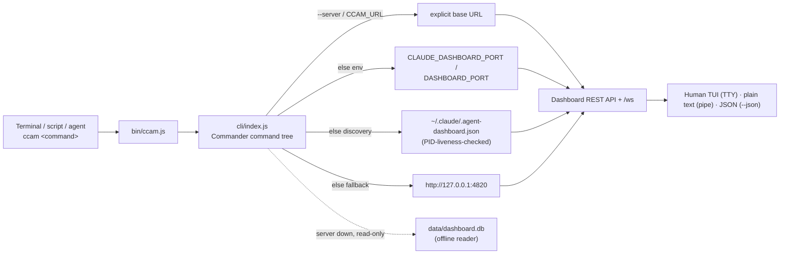

# `ccam` CLI Reference

The complete guide to `ccam`, the Claude Code Agent Monitor command-line interface — the full dashboard feature surface, in your terminal, built for humans **and** for scripts/agents.

---

## Table of Contents

- [Overview](#overview)
- [Architecture](#architecture)
- [Installation & Linking](#installation--linking)
- [Server Discovery](#server-discovery)
- [Global Options](#global-options)
- [Commands](#commands)
  - [Server Lifecycle](#server-lifecycle)
  - [Interactive REPL](#interactive-repl)
  - [Offline Mode](#offline-mode)
  - [Monitoring](#monitoring)
  - [Data Browsing](#data-browsing)
  - [Insights](#insights)
  - [Alerts & Webhooks](#alerts--webhooks)
  - [Pricing](#pricing)
  - [Import](#import)
  - [Remote Sources](#remote-sources)
  - [Administration](#administration)
  - [CLI Meta](#cli-meta)
- [Shell Completion](#shell-completion)
- [Safety Model](#safety-model)
- [Output & Scripting](#output--scripting)
- [Machine-Readable Contract (Agents)](#machine-readable-contract-agents)
- [Troubleshooting](#troubleshooting)

---

## Overview

`ccam` is a Node.js CLI over the dashboard API, built on **[Commander.js](https://github.com/tj/commander.js)** — the Node analogue of Go's Cobra: a real nested command tree (`ccam alerts ack <id>`, `ccam pricing gpt set <pattern>`), generated grouped help at every level, options inherited from the root (`--json`, `--server`, …), typed/validated options with choices, "did you mean" suggestions, and Cobra-style shell completion. Everything the web app can do — monitoring, browsing, transcripts, analytics, alerting, webhooks, pricing, imports, remote sources, runs, configuration, administration — is a terminal command.

```
ccam <command> [subcommand] [arguments] [options]
```

Resource groups list by default: `ccam sessions` ≡ `ccam sessions list` ≡ `ccam sessions ls`. Every command answers `--help`, and `ccam help <path…>` works for any depth (`ccam help alerts ack`).

## Architecture

| Path | Role |
| ---- | ---- |
| `bin/ccam.js` | Executable entry point (linked by `npm link`); resolves its real path and calls `cli/index.js` |
| `cli/index.js` | Builds the Commander program: global options, styled help, exit-code handling, the hidden `__complete` protocol |
| `cli/lib/framework.js` | Shared conventions: `CcamCommand` (ccam-styled/JSON errors with usage lines), `run()` action wrapper with offline routing, `listGroup()`, `confirm()`, option parsers, JSON body input, completion engine, command-schema export |
| `cli/lib/ui.js` | Presentation: palette, status icons, tables, cards, bar charts, sparklines, tree renderer, formatters |
| `cli/lib/http.js` | URL resolution, bearer token, JSON/raw requests, health probe |
| `cli/lib/offline.js` | Read-only SQLite fallback, liveness correction, server-down guidance |
| `cli/lib/runtime.js` | Global state (output mode, target, token) and the error model |
| `cli/commands/*.js` | One module per area: `server`, `monitor`, `data`, `insights`, `alerts`, `pricing`, `sources`, `admin`, `meta` |
| `cli/repl.js` | The interactive shell |


```mermaid
flowchart LR
    U["Terminal / script / agent\nccam &lt;command&gt;"] --> BIN["bin/ccam.js"]
    BIN --> PROG["cli/index.js\nCommander command tree"]
    PROG -->|"--server / CCAM_URL"| URL["explicit base URL"]
    PROG -->|"else env"| ENV["CLAUDE_DASHBOARD_PORT /\nDASHBOARD_PORT"]
    PROG -->|"else discovery"| REG["~/.claude/.agent-dashboard.json\n(PID-liveness-checked)"]
    PROG -->|"else fallback"| DEF["http://127.0.0.1:4820"]
    URL --> API["Dashboard REST API + /ws"]
    ENV --> API
    REG --> API
    DEF --> API
    PROG -.->|"server down, read-only"| DB["data/dashboard.db\n(offline reader)"]
    API --> OUT["Human TUI (TTY) · plain text (pipe) · JSON (--json)"]
```

## Installation & Linking

`npm run setup` ends with a fail-soft `npm link` (the `link-cli` script), so after a normal local setup `ccam` is on your PATH from any directory:

```bash
git clone https://github.com/hoangsonww/Claude-Code-Agent-Monitor.git
cd Claude-Code-Agent-Monitor
npm run setup     # installs deps (incl. commander) AND links ccam globally
ccam help
```

If linking needed elevated permissions in your environment, setup still succeeds and prints a hint — run `npm link` once from the repo root yourself, or invoke the CLI directly with `node bin/ccam.js <command>`.

## Server Discovery

| Priority | Source | Notes |
| -------- | ------ | ----- |
| 1 | `--server <url>` / `CCAM_URL` | A full base URL (e.g. a dashboard behind a reverse proxy) |
| 2 | `CLAUDE_DASHBOARD_PORT` / `DASHBOARD_PORT` env vars | Explicit port override, same contract as the hook handler |
| 3 | `~/.claude/.agent-dashboard.json` | Written by every running dashboard; stale entries are skipped via a PID liveness check |
| 4 | `http://127.0.0.1:4820` | Default port fallback |

`ccam where` prints the resolved target, repo root, and server-log path.

## Global Options

Valid anywhere on the command line, inherited by every command:

| Option | Description |
| ------ | ----------- |
| `--json` | Machine-readable JSON on stdout; errors as a JSON document on stderr. `CCAM_OUTPUT=json` makes it the default |
| `--format <auto\|json\|pretty>` | `pretty` renders human views for commands whose historical default is raw JSON (`run`, `info`, `hooks`, `config`, `import guide`, `webhooks providers/deliveries`, `transcript`, `api`). `CCAM_OUTPUT=pretty` makes it the default |
| `--server <url>` | Target a specific dashboard (env `CCAM_URL`) |
| `--token <token>` | API bearer token (env `DASHBOARD_API_TOKEN` / `CCAM_API_TOKEN`) for dashboards protected by `DASHBOARD_TOKEN` |
| `--no-color` | Plain text (also `NO_COLOR=1`) |
| `-v, --version` | Print the version |
| `-h, --help` | Help for the current command |

## Commands

### Server Lifecycle

API-backed commands need the server. When it isn't running, each prints the same indicator and exits `1` (read-only commands first try [Offline Mode](#offline-mode)):

```
○ Dashboard server is NOT running (tried http://127.0.0.1:4820)
  No offline fallback for this command: cost math (pricing rules, compaction baselines) runs server-side.
  This command needs the server. Start it with one of:
    ccam start        # production server in the background
    npm run dev       # dev mode (hot reload), foreground
    npm start         # production mode, foreground
```

| Command | Description |
| ------- | ----------- |
| `ccam status` | Up/down indicator (`●` running / `○` not running); exits `1` when down |
| `ccam health` | One-line reachability check with version, URL, and server timestamp |
| `ccam start [--port N]` | Start the production server **in the background** (detached), wait up to 30 s for `/api/health`, print URL + PID. Logs append to `data/ccam-server.log`. No-ops when already up. Requires a built client (`npm run build` once) |
| `ccam stop` | Stop the server this CLI targets: the PID registered for its port in the discovery file, `SIGTERM`, escalating to `SIGKILL` after 5 s. Refuses a non-local `--server` target, and refuses to guess when several dashboards are registered but none on that port |
| `ccam restart [--port N]` | `stop` (if running) then `start` |
| `ccam logs [-n N] [-f]` | Print the last `N` lines (default 50) of `data/ccam-server.log`; `-f` follows it |
| `ccam open [page] [--session id] [--print]` | Open the dashboard, a page (`dashboard`, `kanban`, `sessions`, `activity`, `analytics`, `workflows`, `config`, `run`, `settings`), or a session's detail page; `--print` only prints the URL |
| `ccam where` | Which dashboard this CLI targets, repo root, server log, token status |
| `ccam repl` (aliases `shell`, `i`) | The [interactive shell](#interactive-repl) |

### Interactive REPL

`ccam repl` opens a persistent prompt where you type commands **without the `ccam` prefix**. It prints a CCAM word-mark banner with the version and live server status.

```
● ccam 127.0.0.1:4820 › sessions --status active
… table …
● ccam 127.0.0.1:4820 [json] › stats     # after the `json` built-in
○ ccam offline › stats                   # prompt dot turns red when the server is down
```

- **Live status prompt** — green `●` + host when up, red `○ offline` when down (short cached probe); `[json]` when JSON mode is on.
- **Tab completion driven by the real command tree** — commands, nested subcommands, options, and option/argument choices (`sessions --status <Tab>` → `active waiting …`), the same engine as [shell completion](#shell-completion).
- **Arrow-key history**, persisted to `data/.ccam_repl_history`.
- **Isolation** — each line runs as a short-lived child `ccam` process. While it runs, the shell pauses its reader and leaves raw mode, so `Ctrl+C` stops the child (never the shell) and interactive y/N confirmations work.
- A typed `ccam` prefix is tolerated; piped input (`printf 'stats\nexit\n' | ccam repl`) runs each line in order and exits at EOF.

| Built-in | Description |
| -------- | ----------- |
| `help` / `?` | Built-ins plus the grouped command catalog |
| `help <command…>` | Full help for one command path |
| `commands` | Compact grouped list of every command |
| `watch [seconds] <command …>` | Re-run a command on a timer (default 2 s), screen-clearing, until `Ctrl+C` |
| `json [on\|off]` | Toggle `--json` for subsequent commands |
| `history` · `banner` · `clear`/`cls` · `exit`/`quit`/`q` | History, banner, clear screen, leave (also `Ctrl+D`) |

### Offline Mode

When the server is down, **read-only commands fall back to reading `data/dashboard.db` directly** (a safe second SQLite reader), under a banner (on stderr as a JSON `warning` in `--json` mode):

```
⚠ Offline mode — server not running; reading data/dashboard.db directly.
  Data is as of the last capture — live capture and full features need the server: ccam start
```

| Works offline | Server required (the refusal prints the reason) |
| ------------- | ----------------------------------------------- |
| `sessions` / `sessions list`, `session <id>` / `sessions get <id>`*, `agents`, `events`, `kanban`, `stats`, `pricing` (list), `alerts` (list), `rules` / `alert-rules` (list), `export`, `doctor` | everything else — live feeds (`tail`, `stream`, `overview`), aggregation and pricing math (`analytics`, `workflows`, `runs`, `cost`, `sessions stats/cost`), and every mutation |

\* shows everything except cost. Offline exports carry `"exported_offline": true`.

**Status correctness offline:** the offline reader runs the **same process-liveness probe** as the server's watchdog and corrects the *displayed* status of active sessions with no running `claude` process (`※ N session(s) displayed as completed …`); the database is never modified. Where the probe can't answer (Windows, containers) a `※ Statuses are as stored…` caveat is printed instead.

### Monitoring

| Command | Description |
| ------- | ----------- |
| `ccam stats [--sources s] [--providers p]` | Totals, today's events, WS connections, and session **and agent** status distributions |
| `ccam kanban [--per-lane N]` | The Kanban board as status lanes with current tools |
| `ccam overview [-w [secs]]` (alias `top`) | One-screen operational snapshot: active/total sessions and agents, events today, total and today's cost, unacked alerts, live runs, plus the active sessions (with "awaiting input" markers) and working agents. `--watch` refreshes it full-screen |
| `ccam tail [--session id] [--type T,…] [--tool N,…] [--interval s] [--backlog n]` | Live event feed polling `/api/events`; NDJSON with `--json` |
| `ccam stream [--type T,…] [--count n]` | The raw **real-time WebSocket feed** (`/ws`) — every broadcast the web UI receives (`new_event`, `session_updated`, `agent_updated`, `run_stream`, …); pretty lines or NDJSON |
| `ccam watch [-n secs] <command …>` | Re-run any ccam command on an interval, screen-clearing (e.g. `ccam watch -n 5 kanban`) |

`--sources` / `--providers` (comma-separated) mirror the web UI's data-scope selector on `stats`, `kanban`, `overview`, `sessions`, `agents`, `events`, `analytics`, `workflows`, and `cost`.

### Data Browsing

| Command | Description |
| ------- | ----------- |
| `ccam sessions [list] [--status s] [--q text] [--cwd dir] [--sort time\|duration\|price] [--asc] [--limit n] [--offset n]` | Session table: short ID, status, name, agents, duration, model, relative update |
| `ccam sessions get <id> [--events n]` (alias `show`; also `ccam session <id>`) | Metadata card, cost, prompt preview, parent→child **agent tree** with per-agent cost, Workflow-tool runs, recent events |
| `ccam sessions stats <id>` | Aggregates: events, errors, span, agent counts, tokens, and charts of tools, event types, subagent types |
| `ccam sessions cost <id>` | Per-model cost for one session |
| `ccam sessions agents <id>` | The agent tree alone |
| `ccam sessions events <id> [--type] [--tool] [--limit]` | One session's events |
| `ccam sessions transcript <id> [--agent id] [--run id] [--limit n] [--offset n] [--after line] [--before line] [--full]` | The conversation as a **readable chat log** (user/assistant turns, `⚙` tool calls, `↳` results, long blocks clipped unless `--full`); `--json` returns the raw DTO |
| `ccam sessions transcripts <id>` | Transcript files for the session (main + subagents) |
| `ccam sessions facets` | Distinct working directories, sources, providers |
| `ccam sessions rename <id> <name…>` | Rename (confirmed) |
| `ccam sessions update <id> [--name] [--status] [--ended-at] [--metadata JSON]` | Update fields (confirmed) |
| `ccam sessions create --id <id> [--name] [--cwd] [--model] [--metadata JSON]` | Create a record, idempotent by id (confirmed) |
| `ccam agents [list] [--status s] [--session id] [--limit n] [--offset n]` | Agent table |
| `ccam agents get <id>` | One agent's detail |
| `ccam agents update <id> [--name] [--status] [--task] [--current-tool] [--ended-at] [--metadata]` · `ccam agents create --id --session --name …` | Agent writes (confirmed) |
| `ccam events [list] [--session] [--agent] [--type T,…] [--tool N,…] [--q text] [--from iso] [--to iso] [--limit] [--offset]` | Event log with the full server-side filter set |
| `ccam events facets` | Distinct event types and tool names |
| `ccam transcript <session-id> [--text]` | Legacy: the transcript payload as **raw JSON** (scripts depend on it); `--text` / `--format pretty` renders the chat log |
| `ccam transcript-image <session-id> --line N --index N [--output file]` | Download a persisted transcript image |

### Insights

| Command | Description |
| ------- | ----------- |
| `ccam analytics [--top n]` | Token totals, estimated cost, top tools, agent types, **daily events/sessions sparklines**, averages |
| `ccam workflows [--session id] [--patterns n]` · `ccam workflows session <id>` | Workflow-intelligence stats and detected patterns; per-session drill-in |
| `ccam runs [list] [--session] [--status] [--limit] [--offset]` | Workflow-tool runs (status, agents, tokens, tool calls, duration, status counts) |
| `ccam runs get <run-id>` | One run: phases, inner agents, attributed event count |
| `ccam run [list]` · `run history` · `run get <id> [--envelopes]` · `run models\|binary [provider]` · `run cwds` · `run files --cwd dir` | Dashboard-launched Claude Code/Codex runs (raw JSON by default; `--format pretty` for tables/cards) |
| `ccam run start --cwd dir --prompt text [--provider] [--mode] [--model] [--permission] [--resume] [--effort] [--sandbox] [-f] --yes` | Launch a monitored agent; `-f` streams its output immediately |
| `ccam run follow <id>` (alias `logs`) | **Stream a run's output** (assistant text, `⚙` tool calls, results, final cost) until it ends; `Ctrl+C` detaches without stopping it; NDJSON with `--json` |
| `ccam run send <id> --text msg --yes` · `ccam run stop <id> --yes` | Follow-up message / stop |
| `ccam cost [--session id] [--daily] [--days n]` | Total estimated cost with a per-model chart, a daily sparkline (`--daily` for the per-day chart), server-tool surcharges, and a warning listing models with usage but **no pricing rule** |

### Alerts & Webhooks

| Command | Description |
| ------- | ----------- |
| `ccam alerts [list] [--unacked] [--limit n]` · `alerts ack <id>` · `alerts ack-all` | Fired-alert feed and acknowledgement |
| `ccam rules` · `ccam alert-rules [list]` · `ccam alerts rules` | Alert rules with enabled state, type, and cooldown |
| `ccam alert-rules types` | Every rule type with its config fields and an example |
| `ccam alert-rules create --name N --type T [field flags \| --config JSON] [--cooldown s] [--disabled]` | Create a rule. Field flags: `--event-type`, `--tool`, `--contains`, `--count`, `--window` (event_pattern), `--minutes` (inactivity / status_duration), `--agent-status` (status_duration), `--tokens` (token_threshold) |
| `ccam alert-rules update <id> [--name] [field flags \| --config JSON] [--enabled bool] [--cooldown s]` | Partial update; field flags **merge onto the rule's current config**, `--config` replaces it |
| `ccam alert-rules enable\|disable\|delete <id>` | Toggle or delete |
| `ccam webhooks [list]` · `webhooks get <id>` | Targets with provider, redacted URL, last delivery; detail with headers/config |
| `ccam webhooks providers` · `webhooks deliveries <id> [--limit]` | Provider catalog / delivery history (raw JSON; `--format pretty` for tables) |
| `ccam webhooks create --name N --type T [--url] [--secret] [--header k=v …] [--rules ids] [--config JSON] [--disabled]` | Create a target with flags (or `--data JSON`) |
| `ccam webhooks update <id> …` · `webhooks enable\|disable\|delete <id>` | Partial update / toggle / delete |
| `ccam webhooks test <id>` | Synthetic test delivery; exits `1` on failure |

All rule and webhook writes are [confirmed](#safety-model).

### Pricing

| Command | Description |
| ------- | ----------- |
| `ccam pricing [list]` | Claude rules incl. **Fast In/Out** and **Intro In/Out** columns |
| `ccam pricing set <pattern> --input N --output N [--cache-read] [--cache-write] [--cache-write-1h] [--fast-input] [--fast-output] [--intro-* …] [--intro-until [date]] [--name]` | Create/update a rule. **Omitted flags keep the rule's current values** (a new rule defaults them to 0). Intro fields are only sent when an `--intro-*` flag is present (a plain edit never clobbers a promo); bare `--intro-until` clears it |
| `ccam pricing delete <pattern>` | Delete a rule |
| `ccam pricing reset --yes` | Restore the shipped defaults (confirmed — replaces custom rules) |
| `ccam pricing gpt [list]` · `pricing gpt set <pattern> [--input] [--cached-input] [--cache-write] [--output] [--long-*] [--fast-*] [--data JSON]` · `pricing gpt delete <pattern>` | OpenAI/Codex rate card. `set` **merges flags onto the existing row**, so a partial edit never zeroes other rates |
| `ccam pricing cursor [list]` · `pricing cursor set <pattern> [--input] [--output] [--cache-read] [--cache-write]` · `pricing cursor delete <pattern>` | Cursor rate card (same merge semantics) |
| `ccam gpt-pricing [set\|delete]` | Legacy raw-JSON GPT entry point (`set` takes `--data`/`--file` and `--yes`) |

### Import

| Command | Description |
| ------- | ----------- |
| `ccam import guide [--provider claude\|codex]` | Provider history location, archive command, limits (raw JSON; `--format pretty`) |
| `ccam import rescan [--provider]` | Re-scan the provider's configured history tree |
| `ccam import path <dir> [--provider]` | Import a history directory (resolved to an absolute path) |
| `ccam import upload <files…> [--provider]` | Upload JSONL files or archives through the multipart importer |
| `ccam import reimport` | Re-import all local Claude Code and Cursor history (idempotent) |
| `ccam import-data <file.json>` | Restore a dashboard export — idempotent, non-destructive, consolidates machines |

### Remote Sources

SSH machines whose Claude Code / Codex history the dashboard mirrors (Settings → Remote Data Sources). Auth defers to your SSH stack; **no secrets are passed or stored**. `remotes` is an alias.

| Command | Description |
| ------- | ----------- |
| `ccam remote-sources [list]` | Sources with auto-sync, per-provider status, host, session count, last sync (+ relative age) |
| `ccam remote-sources get <id\|prefix\|label>` | Detail incl. provider homes and last error |
| `ccam remote-sources add --label N --host user@host [--port] [--identity] [--remote-home] [--remote-codex-home] [--disabled]` | Add a source |
| `ccam remote-sources update <id> [field flags \| --data JSON] --yes` | Partial update |
| `ccam remote-sources enable\|disable <id>` | Toggle auto-sync (confirmed) |
| `ccam remote-sources test <id>` | Probe SSH + provider paths; exits `1` on failure |
| `ccam remote-sources sync [id]` | Pull now — one source, or every source (failures isolated) |
| `ccam remote-sources rm <id> [--purge --confirm PURGE_REMOTE_SOURCE_DATA]` | Remove (data kept unless purged) |

### Administration

| Command | Description |
| ------- | ----------- |
| `ccam doctor` | Structured checks: API, Claude Code and Codex hooks, database + row counts, uptime, WS clients, remote sources, client build, MCP build. Exits `1` on any failure; `--json` returns `{ ok, checks: [{name, status, detail}] }`. Works offline |
| `ccam info` | `/api/settings/info` (raw JSON; `--format pretty` renders a system card + row table) |
| `ccam export [file\|-]` | Full JSON export to a dated file, or `-` for stdout. Works offline |
| `ccam cleanup --hours N --days M` | Abandon stale active sessions / purge old finished ones (their transcript snapshots are deleted too) |
| `ccam snapshots [status]` · `ccam snapshots compress` | Transcript snapshot storage per provider (Claude Code / Codex / Cursor), compressed share, and retention policy · losslessly compress snapshots whose original transcript is gone |
| `ccam snapshots prune [--days N] [--max-size 5GB] [--orphans]` | **Dry run** listing the finished sessions whose snapshots would be removed; add `--apply --confirm PRUNE_SNAPSHOTS` to delete. A pruned snapshot may be the only remaining copy of a conversation |
| `ccam clear-data --yes` | Delete **all** data (schema preserved). Requires a literal `--yes` — never prompts |
| `ccam reinstall-hooks` · `ccam hooks [status]` · `ccam hooks install [claude] [codex] --yes` | Hook management (status raw JSON; `--format pretty` for a table) |
| `ccam config claude [surface]` | Claude Code Config Explorer: `overview` (default), `skills`, `agents`, `commands`, `output-styles`, `plugins`, `mcp`, `hooks`, `settings`, `memory`, `marketplaces`, `keybindings`, `statusline`, `hook-scripts`, `backups` (`--scope`, `--cwd`, `--type`); `read <path>`; `write` / `delete` / `keybindings-write` with `--data` + `--yes` |
| `ccam config codex [overview]` · `read\|edit <path>` · `write\|delete --data … --yes` · `profile <name> --yes` | Codex Config Explorer |
| `ccam api [METHOD] /api/path [--data JSON\|@file\|- \| --file path]` | Any JSON API route (method defaults to GET, so `ccam api /api/health` works). Non-GET requires `--yes`; clear-data also `--confirm CLEAR_ALL_DATA` |
| `ccam mcp [stdio\|http\|repl]` | Launch the bundled MCP server |
| `ccam updates [status]` · `ccam updates check` · `ccam update-check` | Cached update status / fetch-now check (broadcast to open dashboards); prints the copy-paste update command |
| `ccam metrics [--grep regex]` | Prometheus exposition text; `--json` parses it into `{samples: [{name, labels, value}]}` |
| `ccam home [show]` · `ccam home set claude\|codex <path> --yes` | Show or repoint the Claude / Codex home the dashboard watches |
| `ccam push key` · `push send --title T --body B` · `push subscribe --data JSON --yes` · `push unsubscribe --endpoint URL --yes` | Web-push notifications (VAPID key, test send, subscriptions) |

### CLI Meta

| Command | Description |
| ------- | ----------- |
| `ccam help [command…]` | Help for any command path (also `-h`/`--help`; bare `ccam` prints the root help) |
| `ccam version` | `ccam X.Y.Z` (also `-v`/`--version`; `--json` → `{name, version}`) |
| `ccam commands` | The entire command tree with aliases and descriptions; `--json` emits the machine-readable schema |
| `ccam completion [bash\|zsh\|fish]` | Print a completion script (defaults to `$SHELL`) |

## Shell Completion

Cobra-style: the scripts call back into a hidden `ccam __complete <words…>` command, which walks the live command tree — so completion always matches the installed version, including nested subcommands, options, and declared choices.

```bash
source <(ccam completion bash)                                   # bash, now
ccam completion bash >> ~/.bashrc                                # bash, always
source <(ccam completion zsh)                                    # zsh (after compinit)
ccam completion zsh > "${fpath[1]}/_ccam"                        # zsh, always
ccam completion fish > ~/.config/fish/completions/ccam.fish     # fish
```

## Safety Model

- **Read commands are always safe** — they only issue `GET`s.
- **Writes are confirmed.** Session/agent writes, alert-rule and webhook writes, rate-card writes, `pricing reset`, remote-source updates and enable/disable, run start/send/stop, hook install, config writes, `home set`, and push subscriptions pass with `-y/--yes`; on an interactive terminal they instead ask `? … [y/N]`. Non-interactive shells (scripts, CI, agents) **must** pass `--yes` — the refusal is `CONFIRMATION_REQUIRED`.
- Established one-shot mutations keep their historical behavior without a prompt (`pricing set/delete`, `alerts ack/ack-all`, `cleanup`, `remote-sources add/sync`).
- `clear-data` requires a literal `--yes` (never prompts); the generic `api` route to it additionally requires `--confirm CLEAR_ALL_DATA`.
- Remote-source removal keeps imported data unless `--purge --confirm PURGE_REMOTE_SOURCE_DATA`.
- Webhook tests, push sends, and run launches are real side effects.
- When the server uses `DASHBOARD_TOKEN`, pass `--token` or set `DASHBOARD_API_TOKEN` / `CCAM_API_TOKEN`.

## Output & Scripting

Human output is a full terminal UI: box-drawn tables (right-aligned numbers, terminal-width fitting with ellipsis clipping), status icons (`● active`, `◐ working`, `○ waiting`, `✔ completed`, `✖ error`, `◦ abandoned`), inline bar charts, Unicode sparklines, real `├─`/`└─` trees, key/value cards, a chat-log transcript view, and colored grouped help. Colors follow CLI conventions:

| Condition | Effect |
| --------- | ------ |
| stdout is a TTY | Colors **on** |
| Output piped / redirected | Colors **off** — `ccam sessions \| grep error` sees plain text |
| `--json`, `NO_COLOR=1`, or `--no-color` | Colors **off** |
| `FORCE_COLOR=1` / `CCAM_COLOR=1` | Colors **on** even when piped |

## Machine-Readable Contract (Agents)

- `--json` (or `CCAM_OUTPUT=json`) on **every** command prints one pretty-printed JSON document on stdout — the API payload for reads, the API response for writes. Streaming commands (`tail`, `stream`, `run follow`) emit **NDJSON**, one object per line.
- **Errors** in JSON mode are one line on stderr: `{"error":{"code":"…","message":"…","hints":[…]}}`. Stable codes include `UNKNOWN_COMMAND`, `UNKNOWN_OPTION`, `MISSING_ARGUMENT`, `INVALID_ARGUMENT`, `USAGE`, `CONFIRMATION_REQUIRED`, `SERVER_DOWN`, `TIMEOUT` (reachable but too slow — no offline fallback) (with `url` and the server-only `reason`), `NOT_FOUND`, and `HTTP_<status>` / the API's own code (with `status`). Offline fallbacks add a `{"warning":{"code":"OFFLINE",…}}` line on stderr.
- **Exit codes**: `0` success; `1` any failure (unreachable server, API error, usage error, refused confirmation, failed `webhooks test` / `remote-sources test`, `doctor` failure).
- `ccam commands --json` describes every command, alias, argument (required/variadic/choices), and option (flags, value, choices, default) — enough for an agent to construct any invocation without scraping help text.
- Never prompts when stdin/stdout are not a TTY; pass `--yes` for writes.

```bash
ccam sessions --status active --json | jq -r '.sessions[].id'
ccam cost --json | jq '.total_cost'
ccam tail --json --type PostToolUse | jq -c '{tool: .tool_name, at: .created_at}'
ccam doctor --json | jq '.checks[] | select(.status == "fail")'
```

## Troubleshooting

| Symptom | Fix |
| ------- | --- |
| `○ Dashboard server is NOT running` | `ccam start` (background), `npm run dev`, or `npm start`. Custom port: set `DASHBOARD_PORT`, pass `--server`, or rely on the discovery file |
| `ccam: command not found` | Run `npm link` from the repo root, or use `node bin/ccam.js …` |
| `Cannot find module 'commander'` | Dependencies are missing — run `npm install` (or `npm run setup`) in the repo |
| Wrong server answers (multiple dashboards) | Set `CLAUDE_DASHBOARD_PORT` or pass `--server` — explicit targets beat discovery |
| A write says `CONFIRMATION_REQUIRED` | Non-interactive shell — add `--yes` |
| `tail` / `stream` shows nothing | Events only flow while hooks are installed and an agent session is active — check `ccam doctor` |
| Server won't start | `ccam logs` shows the background server's log |
