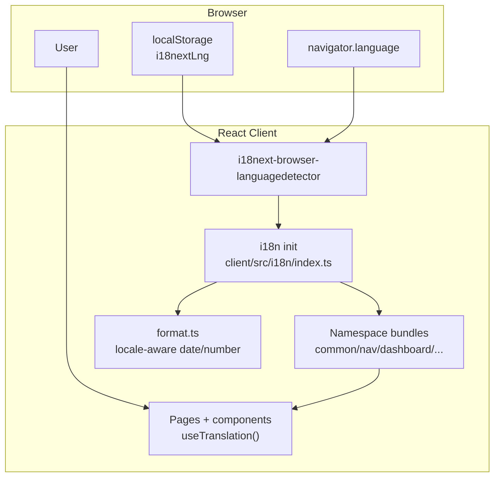
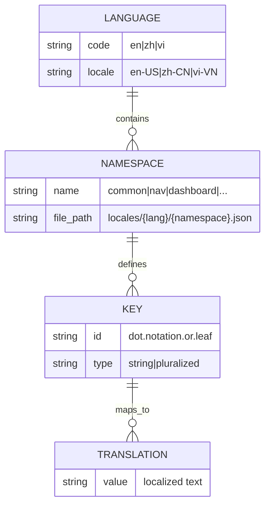
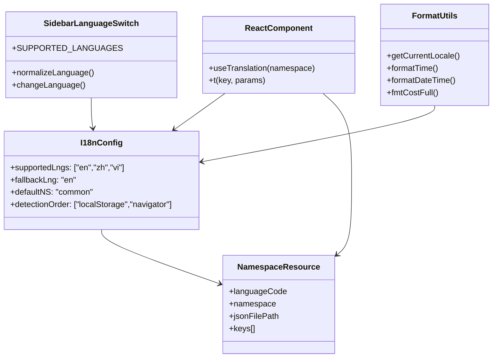
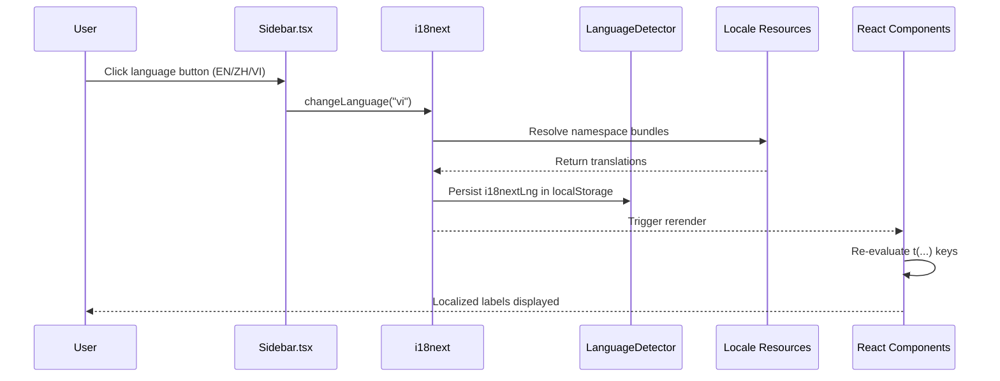
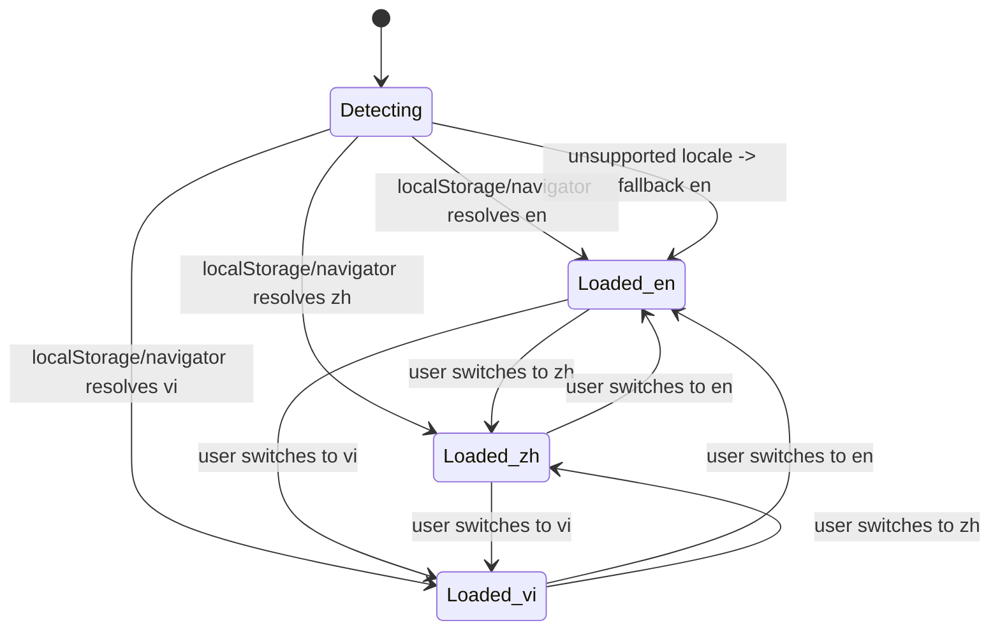
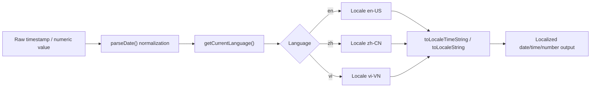
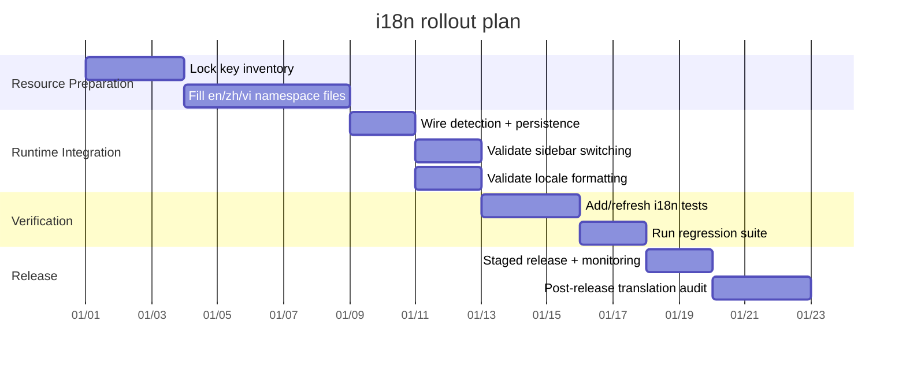

# Internationalization (i18n) Architecture and Usage

This guide documents how localization works in the Agent Dashboard, including architecture, resources, runtime behavior, testing, and rollout.

**Supported languages:** English (`en`), Chinese (`zh`), Vietnamese (`vi`)

---

## 1) Architecture Overview

Localization is implemented in the frontend with `i18next` + `react-i18next` and browser language detection.



**Key runtime facts**
- `supportedLngs`: `["en", "zh", "vi"]`
- `fallbackLng`: `"en"`
- `nonExplicitSupportedLngs`: `true` (e.g. `vi-VN` resolves to `vi`)
- Detection order: `localStorage` → `navigator`

---

## 2) Resource and Namespace Strategy

Translation resources are stored per language and namespace:

- `client/src/i18n/locales/en/*.json`
- `client/src/i18n/locales/zh/*.json`
- `client/src/i18n/locales/vi/*.json`

Active namespaces:
- `common`
- `nav`
- `dashboard`
- `sessions`
- `activity`
- `analytics`
- `workflows`
- `settings`
- `kanban`
- `errors`



**Strategy notes**
- Keep namespace boundaries page/domain focused.
- Keep key parity across `en`, `zh`, `vi` files for the same namespace.
- Keep fallback behavior deterministic by ensuring `en` is always complete.

---

## 3) Key Naming Conventions

Use stable semantic keys, not English sentence literals.

### Convention rules
1. Use namespace-scoped keys: `namespace:key`
2. Use lower camelCase key segments
3. Keep terminology consistent across locales (for example, keep `Agent` / `Subagent` terms stable where required)
4. Use suffixes for plurals when needed (e.g. `_plural`)
5. Group nested concepts by domain (e.g. `time.justNow`, `time.mAgo`)

### Examples
- `nav:dashboard`
- `nav:languageNames.vi`
- `common:time.justNow`
- `common:time.mAgo`
- `kanban:agentCount`
- `kanban:agentCount_plural`



---

## 4) Language Detection and Switching Flow

The sidebar language controls call `i18n.changeLanguage()` and UI updates reactively through `useTranslation`.





---

## 5) Date and Number Localization Behavior

Formatting utilities are centralized in `client/src/lib/format.ts`.

- `en` → `en-US`
- `zh` → `zh-CN`
- `vi` → `vi-VN`

`formatTime`, `formatDateTime`, and `fmtCostFull` use locale-aware `toLocale*` APIs.  
Timestamp parsing normalizes timezone-less SQLite datetime strings to UTC before display formatting.



---

## 6) Testing Strategy

Use client tests to verify translation correctness, fallback behavior, and locale formatting:

- `client/src/i18n/__tests__/i18n.test.ts`
- `client/src/lib/__tests__/format.test.ts`
- `client/src/components/__tests__/Sidebar.test.tsx`

Run:

```bash
npm run test:client
```

### Recommended test matrix

| Area | What to verify | Example |
|---|---|---|
| Resource parity | Same key coverage across `en/zh/vi` | Missing key detection in CI |
| Locale fallback | Unknown locales fall back to `en` | `vi-VN` resolves to `vi` |
| Terminology consistency | Canonical terms stay stable | `Agent`/`Subagent` expectations |
| Date/number formatting | Locale-specific output shape | `zh-CN`, `vi-VN` formatting |
| Runtime switching | UI rerenders without reload | Sidebar language toggle |

---

## 7) Troubleshooting

| Symptom | Likely cause | Resolution |
|---|---|---|
| UI stays in old language after switch | Cached key or stale component state | Confirm `i18n.changeLanguage(...)` is called and component uses `useTranslation` |
| Unexpected fallback to English | Unsupported locale code | Ensure code normalizes to `en|zh|vi` and key exists in target namespace |
| Missing text on one page | Namespace file key missing | Add key to all language files for that namespace |
| Date/time looks wrong | Locale mapping or timezone parse issue | Verify `getCurrentLocale()` and `parseDate()` behavior |
| Inconsistent term translation | Manual translation drift | Enforce glossary and update locale tests |

---

## 8) Rollout Checklist



### Operational checklist
- [ ] Confirm all namespaces exist for `en`, `zh`, `vi`
- [ ] Confirm key parity across all locale JSON files
- [ ] Confirm language switching works in collapsed and expanded sidebar modes
- [ ] Confirm fallback behavior for region tags (e.g., `vi-VN`, `zh-CN`)
- [ ] Confirm date/time/currency formatting for all supported languages
- [ ] Confirm client tests pass before release
- [ ] Confirm docs references are updated (`README`, `ARCHITECTURE`, `docs/README`)

---

## References

- `client/src/i18n/index.ts`
- `client/src/components/Sidebar.tsx`
- `client/src/lib/format.ts`
- `client/src/i18n/__tests__/i18n.test.ts`
- `client/src/lib/__tests__/format.test.ts`
