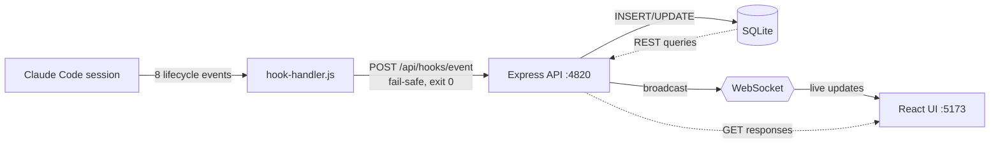

# 01 — Current Architecture (observe-only)

The Claude-Code-Agent-Monitor dashboard is, by deliberate design, a
**unidirectional observer** of Claude Code activity. Nothing about
its architecture sends instructions back to running agents. This
shape has load-bearing consequences for how to extend it with
orchestration.

## Data flow

## Why it's strictly read-side

Every write endpoint in `server/routes/` mutates **dashboard
records**, not running agents:

- `POST /api/agents`, `PATCH /api/agents/:id` — rows in the
  `agents` SQLite table.
- `POST /api/sessions`, `PATCH /api/sessions/:id` — rows in
  `sessions`.
- `POST /api/import/{rescan,scan-path,upload}` — historical JSONL
  import.
- `POST /api/settings/*` — dashboard maintenance.
- `POST /api/hooks/event` — inbound endpoint for hook handler POSTs.
- `POST /api/push/send` — web push to the user's browser.
- `PUT/DELETE /api/pricing` — token cost lookup tables.

There is **no** `/spawn`, `/prompt`, `/interrupt`, or
`/send-message` endpoint. The MCP server in
`mcp/src/tools/domains/` mirrors this pattern: all 24 tools are
CRUD on the dashboard's records, gated by an
`assertMutationsEnabled` policy guard.

## Non-negotiables that constrain extension

From `CLAUDE.md` and `CLAUDE.local.md`:

- "Preserve existing behavior unless explicitly asked to change
  it."
- "Never silently weaken safety controls around destructive
  actions."
- Hook handler **always exits 0** — fail-safe contract (gotcha
  #2). Even though Claude Code's `PreToolUse` and
  `UserPromptSubmit` hooks can technically block or modify
  actions, the dashboard's handler pointedly does not.
- "All DB writes happen before any WS broadcast in the `Stop`
  handler" — added to fix Kanban flicker. Maintain ordering.

## Implications for orchestration

Adding spawn/control endpoints to this codebase **inverts** the
architectural commitment. Two paths preserve it:

1. **External orchestrator process** — a separate Node script,
   plugin, or framework spawns `claude` subprocesses. The
   dashboard observes via the existing
   `POST /api/hooks/event`. No code changes here.
2. **Opt-in module behind an env flag** — if orchestration UI must
   live in the dashboard, gate it behind `ORCHESTRATOR_ENABLED=1`.
   New code in `server/routes/orchestrator.js` and
   `client/src/features/orchestrator/`. Zero changes to existing
   routes or schema. Preserves merge compatibility with upstream
   `hoangsonww/Claude-Code-Agent-Monitor`.

## Subagent observability gap (gotcha #6)

Subagents dispatched via Claude Code's `Task` tool **do not fire
`~/.claude/settings.json` hooks** for their internal tool calls.
The dashboard works around this via `scanAndImportSubagents` in
`scripts/import-history.js`, which reads
`~/.claude/projects/<dir>/subagents/agent-*.jsonl` post-hoc and
synthesizes Pre/PostToolUse events. The asymmetry:

- Top-level CLI sessions: live observability (hooks fire).
- Task-tool subagents: post-hoc observability (JSONL scan after
  `SubagentStop`).
- External orchestrator-spawned `claude -p` processes: live
  observability (each is a top-level session, hooks fire).

Any orchestration design must respect this asymmetry. The post-hoc
scan adds at most ~1 second of latency before subagent activity
appears in the UI.

## What "extending the dashboard" should NOT do

- Add spawn endpoints to `server/routes/`.
- Make hook handler return non-zero on any path.
- Send commands back to Claude Code via stdout from hooks.
- Modify the WebSocket message shape (backward compatibility
  rule).
- Schema changes without migration-safe logic.

If your orchestration design requires any of the above, the design
is wrong for this project. The orchestrator should be a separate
process.
