# 04 — Architecture Patterns

Ten orchestration patterns observed in the surveyed projects, each
with a Mermaid diagram, where it's used, and tradeoffs.

## 1. Observe-only dashboard (current state)

**Used by:** This project (Claude-Code-Agent-Monitor).

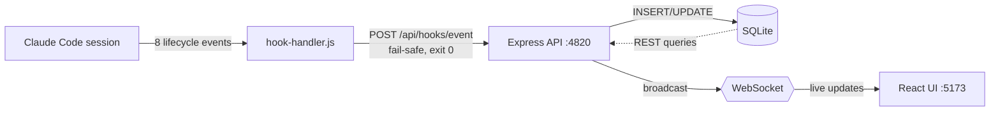

**Tradeoffs.** Zero risk to running agents (nothing flows back).
Cannot spawn or control anything. Hook handler always exits 0
(gotcha #2). Orchestration must be a separate process.

---

## 2. Task tool fork-join (in-process)

**Used by:** Claude Code itself; demonstrated in this conversation
(9 parallel `Task` calls produced the orchestrator analysis).

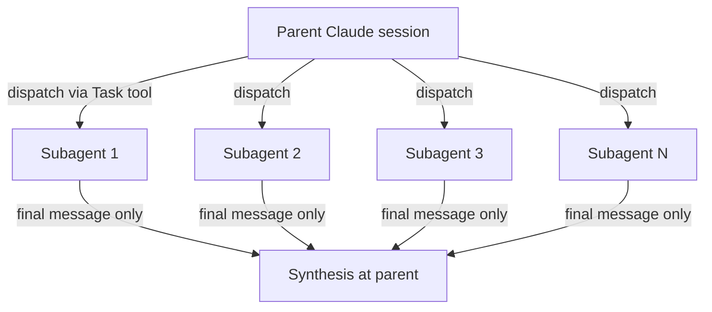

**Tradeoffs.** Native, free, parallel. No inter-subagent
communication during execution. Single final-message return; no
streaming, no partial results. No mid-flight cancel. Subagent
internal tool calls don't fire user hooks (gotcha #6 — backfilled
post-hoc from JSONL by `scanAndImportSubagents`).

---

## 3. CLI subprocess pool (multi-process)

**Used by:** OpenSwarm, mco, cook, hcom — all surveyed CLI
orchestrators.

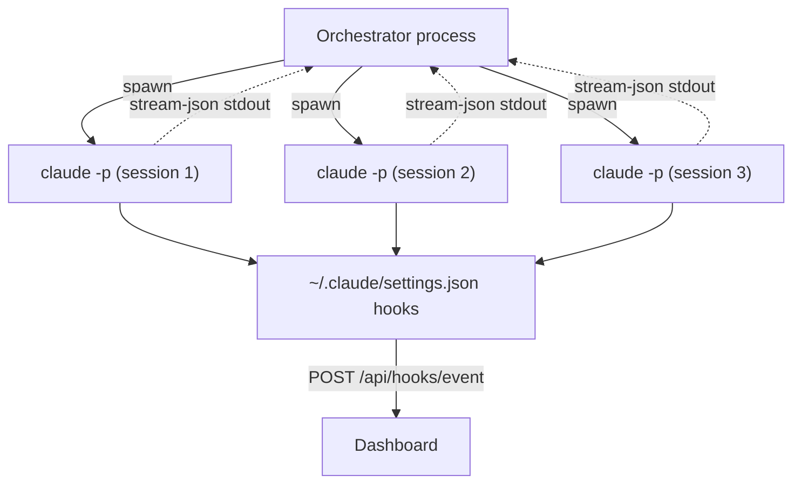

**Tradeoffs.** Full per-process control: cwd, env, kill, settings.
Hooks fire live for everything. Each subprocess is a fresh
top-level session. Highest overhead per agent (~1–2s spawn time).
Most flexible model — anything you can express in a shell script,
you can orchestrate.

---

## 4. Claude Code plugin (in-host)

**Used by:** maestro-orchestrate, metaswarm.

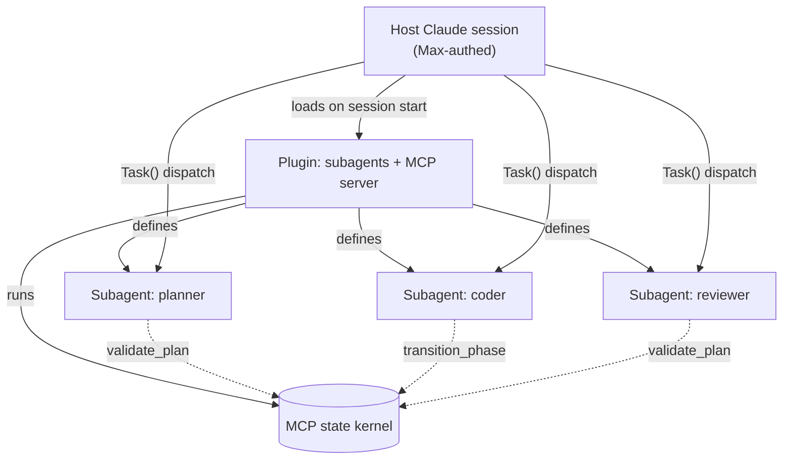

**Tradeoffs.** Inherits host auth, hooks, settings. Zero subprocess
overhead. Constrained by Task tool's limitations (no inter-subagent
comm, single-message return). MCP server provides shared state and
phase gates. Best fit when you want orchestration *inside* an
existing Claude Code session.

---

## 5. Pipeline (linear stages)

**Used by:** OpenSwarm
(`worker → reviewer → tester → documenter`).

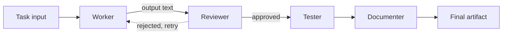

**Tradeoffs.** Predictable, debuggable, linear cost. Reviewer can
loop back to worker on rejection. Brittle when stages depend on
emergent context. Each stage is a separate `claude -p` invocation;
prior stage's output becomes prompt input to next.

---

## 6. DAG (directed acyclic graph)

**Used by:** catlog22/CCW (most explicit DAG executor surveyed).

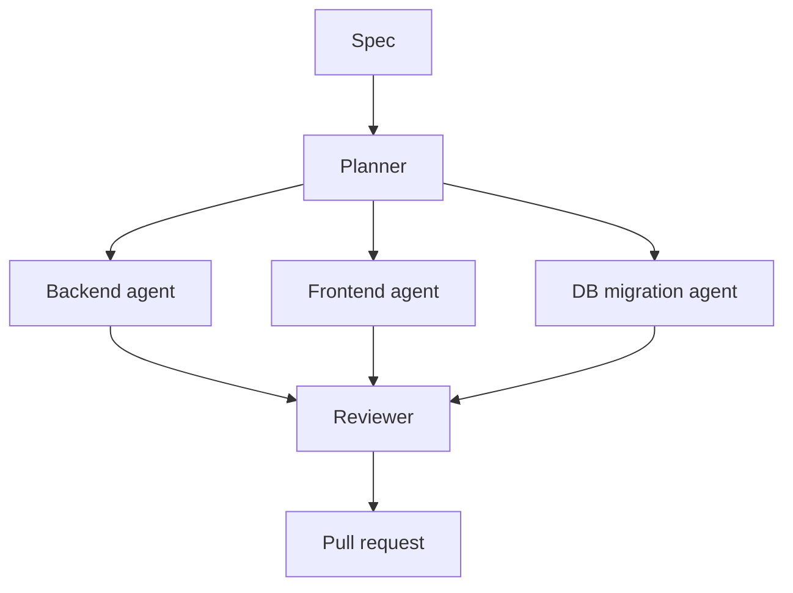

**Tradeoffs.** Topological execution with parallel branches that
share a single planner upstream and a single reviewer downstream.
CCW interpolates `{{var}}` from upstream node outputs into
downstream prompts. Multi-CLI peers possible (A→`claude`,
B→`gemini`, C→`codex`). Requires you to model the workflow as a
graph upfront — heavy for ad-hoc tasks.

---

## 7. Peer messaging

**Used by:** aannoo/hcom.

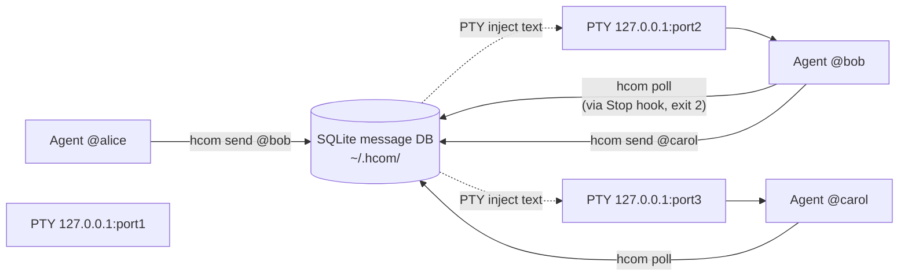

**Tradeoffs.** Emergent dynamics possible: review loops,
ensembles, fork-and-investigate. Mechanically heavy: SQLite
polling on each agent's `Stop` hook + PTY TCP injection on
127.0.0.1. Requires designing agent prompts around the messaging
primitive ("send `hcom send @reviewer-` then `hcom stop`").
"Spawning" each other = `hcom claude --headless` invocations.

---

## 8. Worktree race (parallel exploration)

**Used by:** rjcorwin/cook (`composition` primitive with `vN`/`vs`
racing).

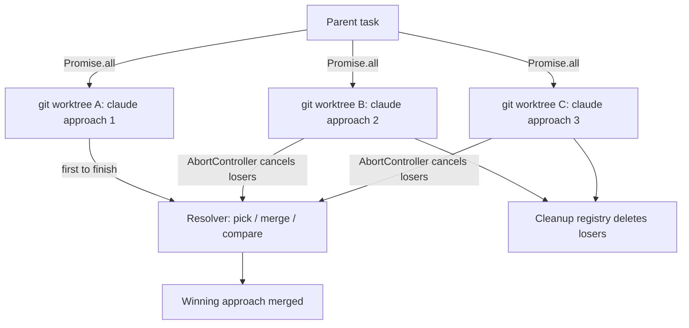

**Tradeoffs.** True parallel exploration with full filesystem
isolation. Cost scales linearly with N (each worktree burns full
inference). Cleanup registry needed to delete losing worktrees.
Uses real `git worktree` (unlike genie's `git clone --shared`).
First-finish wins is an opinionated cost/quality tradeoff.

---

## 9. Hierarchical / supervisor (CEO → dept → role)

**Used by:** claw-empire (literal office sim with 6 SQL-seeded
departments), genie (10-critic council).

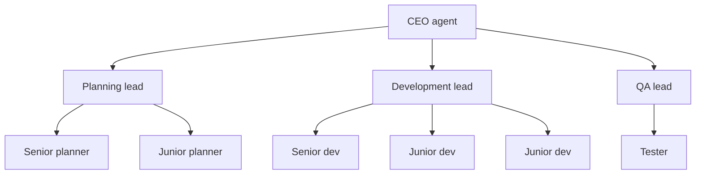

**Tradeoffs.** Clear authority, easy to reason about. Rigid:
can't flexibly recompose roles per task. claw-empire bakes 6
departments into a SQL seed at `seeds.ts:14-63`; genie's
"10-critic council" is similarly fixed. Good for "company
simulation" demos, overkill for ad-hoc orchestration.

---

## 10. Tiled panes (multiplexer)

**Used by:** superset-sh/superset (Electron + node-pty).

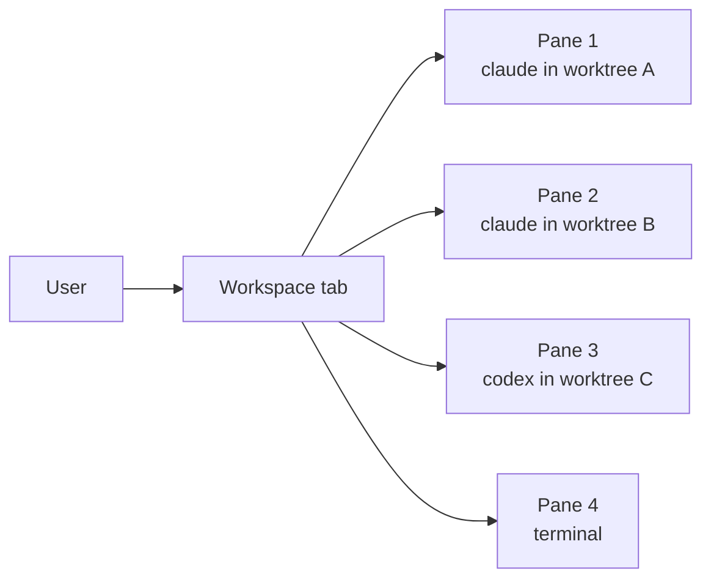

**Tradeoffs.** No agent-to-agent communication; coordination is
purely visual ("user looks at panes side-by-side"). Excellent
ergonomics for human-in-the-loop multi-agent work. Not a
swarm — agents don't know about each other. Per-workspace git
worktree isolation. Long-lived `pty-daemon` survives host-service
restarts.

---

## 11. Hybrid: dashboard + plugin + subprocess (recommended)

**Recommended posture for this project.**

This combines the strengths of each pattern while preserving the
dashboard's observe-only commitment.

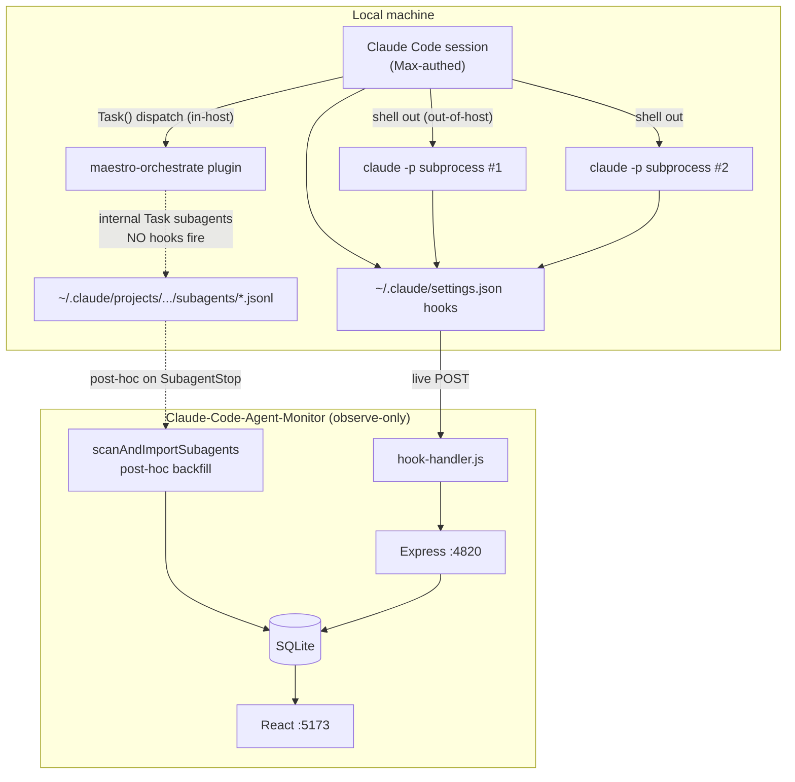

**Tradeoffs.** Best of all worlds:

- Live observability for top-level sessions and `claude -p`
  subprocesses (hooks fire).
- Post-hoc observability for plugin-dispatched subagents
  (JSONL backfill via `scanAndImportSubagents`).
- Dashboard never modified — upstream merges from
  `hoangsonww/Claude-Code-Agent-Monitor` remain clean.
- Orchestrator choice (plugin vs. subprocess vs. both) is
  decoupled from the dashboard.
- Max billing throughout: plugin inherits host auth; subprocesses
  use `claude /login` credentials.

This is the architecture this research recommends. Implementation
is incremental:

1. Install `maestro-orchestrate` as a Claude Code plugin to get
   immediate multi-agent capability.
2. When you outgrow plugin-only orchestration, add a small Node
   script that spawns `claude -p` subprocesses for long-running
   work or peer dynamics.
3. The dashboard observes both modes for free.

## Pattern selection guide

| If your task shape is… | Use pattern |
|---|---|
| "Run N independent analyses, synthesize" | 2 — Task fork-join |
| "Drive code through review/test stages" | 5 — Pipeline |
| "Plan-then-fan-out across components" | 6 — DAG |
| "Try N approaches, keep the best" | 8 — Worktree race |
| "Long-running agents that watch/respond to each other" | 7 — Peer messaging |
| "Human-in-the-loop multi-agent dev" | 10 — Tiled panes |
| "Methodology-as-plugin (gated phases)" | 4 — Plugin |
| "Need persistence + Task speed" | 11 — Hybrid |

## What none of these solve

- **Reliable cross-machine distribution.** Even hcom's MQTT and
  genie's Postgres `LISTEN/NOTIFY` are tuned for local
  same-machine sync, not multi-region orchestration.
- **Token-cost budgeting.** No surveyed orchestrator exposes a
  "stop spending after $X" gate. You roll your own quota check
  via `claude` CLI's quota endpoint
  (`api.anthropic.com/api/oauth/usage`).
- **Deterministic replay of full agent reasoning.** Best you get
  is JSONL transcripts; internal model state is unrecoverable.
- **Native cancellation of in-flight Task subagents.** Only
  CLI-subprocess patterns let you `kill PID` mid-run.

Plan around these gaps; do not assume any framework hides them.
