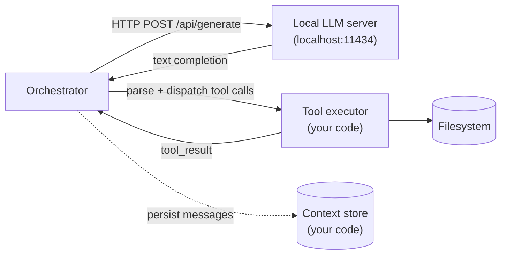
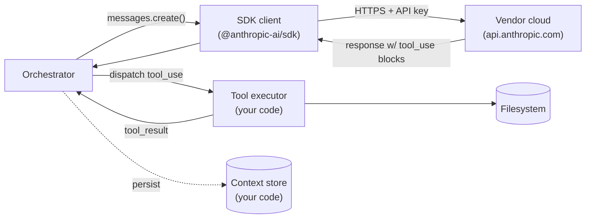
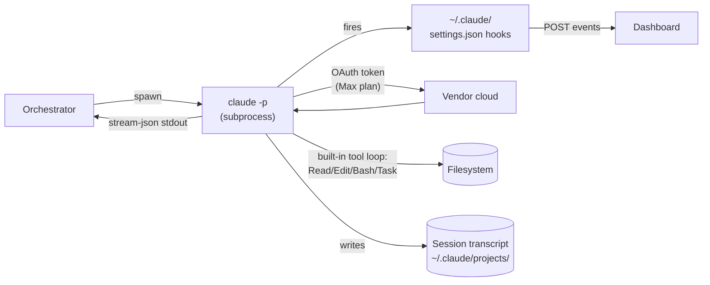
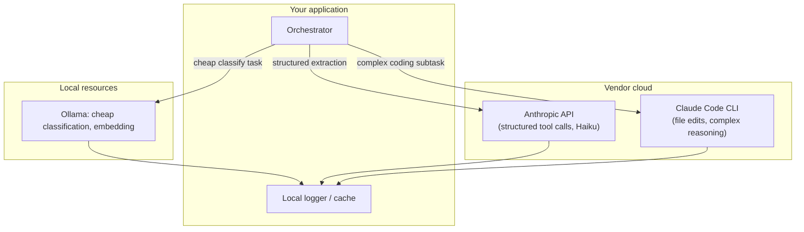

# 05 — Runtime Comparison: Local LLM vs API vs CLI Session

These three runtimes sit at fundamentally different points in the
orchestration design space. The choice isn't just cost or performance
— it determines what observability and orchestration patterns are
even possible.

`04-architecture-patterns.md` covers **agent topology** (how multiple
agents are composed). This document covers **runtime substrate**
(where the LLM actually runs and how a single agent invocation
works). Orthogonal axes; both matter.

## The three topologies

### Local LLM (Ollama, llama.cpp, vLLM on your machine)

**Key property: everything is local; you implement everything.** The
LLM is a text generator. Tool-use loop, context management, session
resume, observability — all your code.

### API-based (Anthropic / OpenAI / etc. SDKs)

**Key property: vendor handles inference; you handle the loop.** SDK
gives you tool-use *primitives* (`tool_use` / `tool_result` blocks),
but you orchestrate the back-and-forth, manage context windows, and
persist sessions yourself.

### CLI session-based (Claude Code, Codex CLI, Gemini CLI)

**Key property: vendor handles inference *and* the tool loop; you
orchestrate processes, not conversations.** Sessions are durable
filesystem artifacts. Hooks fire for free.

## Comparison matrix

| Axis | Local LLM | API-based | CLI session-based |
|---|---|---|---|
| Where inference runs | Your CPU/GPU | Vendor data center | Vendor data center |
| Auth/billing | Free (hardware) | API key, per-token | Subscription via OAuth in CLI |
| Privacy | Data never leaves | Data → vendor ToS | Data → vendor ToS |
| Latency | Hardware-bound (5–80 t/s) | Network + inference (30–150 t/s top models) | Same as API + ~1–2s spawn |
| Capability ceiling | What fits VRAM (typically 7B–70B) | Frontier (Opus, GPT-5, etc.) | Frontier |
| Tool-use loop | You implement | You implement | Built-in |
| Context management | You manage | You manage (manual messages array) | Vendor-managed within session |
| Session persistence | Your problem | Your problem | Filesystem JSONL, free |
| Observability | You log | You log (or use SDK tracing) | Hooks fire automatically |
| Concurrency | VRAM-bound (1–4 typical) | Rate-limit-bound (~1k req/min) | Subscription rate cap (Max ≈ shared) |
| Cancellation | Kill process | HTTP request abort | Kill subprocess (cleanest) |
| Cost shape | High upfront (GPU), zero marginal | Zero upfront, per-token | Flat monthly subscription |
| Cold-start | Model load (1–30s) | None | Subprocess spawn (~1–2s) |
| Failure modes | OOM, model load fails | Rate limits, vendor outages | Subprocess crashes, OAuth expiry |
| What "an agent" is | A function: `prompt → text` | A function: `messages → response` | An OS process with lifecycle |

## What this means for orchestration patterns

The "agent" abstraction collapses differently in each runtime.

- **Local LLM:** an agent is whatever you call between two
  completions — there's no inherent boundary. Patterns must define
  their own agent identity.
- **API-based:** an agent is a `messages` array you maintain. Identity
  is whatever invariant you preserve across calls (system prompt,
  tools, persisted context).
- **CLI session-based:** an agent is a literal OS process with a PID,
  file descriptors, hooks, and a transcript on disk. Identity is
  free — the OS gives it to you.

That's why the patterns surveyed in `04-architecture-patterns.md`
(worktree race, peer messaging, multiplexer, etc.) all assume CLI
session-based — they need processes to spawn, kill, and observe.

### Concurrency models invert across runtimes

| Runtime | Fan-out cost | Pattern bias |
|---|---|---|
| Local LLM | Expensive (each branch needs VRAM) | Sequential, small-fanout (pipeline beats DAG) |
| API-based | Cheap (vendor handles concurrency) | DAG, parallel-N, swarm |
| CLI session-based | Middle (subprocess + memory per branch) | Worktree race up to ~5 wide; bigger fan-out hits rate caps |

### Observability is free with CLI; you build it for the others

This dashboard's hook-driven architecture
(`POST /api/hooks/event`) is structurally coupled to the CLI
runtime. For local-LLM or API-based orchestrators, the dashboard
sees nothing — you'd need to instrument every call site to emit
events to its endpoint.

## Implication for THIS dashboard

The dashboard's design (hook handler → API → SQLite → WS → UI) maps
**only** onto CLI session-based runtime. That's load-bearing:

- For **local LLM** orchestration → no hooks fire → dashboard is
  blind. You'd need to write a shim that POSTs to
  `/api/hooks/event` at every inference call.
- For **API-based** orchestration → no hooks fire → same. You'd
  need an SDK middleware that emits events.
- For **CLI session-based** → hooks fire automatically → dashboard
  works without integration.

This is why the OpenSwarm / cook / mco analyses in
`03-third-party-orchestrators.md` were all CLI-spawning — they're
the only ones that "just work" with this dashboard.

## When to choose which

| Goal | Pick |
|---|---|
| Privacy / air-gapped / offline | Local LLM (only option) |
| Lowest marginal cost per call | API-based (cheap input tokens with prompt caching) |
| Per-call control over messages, tools, schemas | API-based |
| Fastest start, no subscription, structured output | API-based |
| Hooks-driven observability for free | CLI session-based (only option) |
| Subscription-billed (Max plan) | CLI session-based (only option) |
| Long-running stateful agents with file edits | CLI session-based (built-in tool loop is huge) |
| Cross-machine distributed agents | API-based (only one that scales out cleanly) |
| Cheapest per agent if subscription already paid | CLI session-based |
| Highest single-call quality | API-based or CLI (same model access) |

## Hybrid is real and common

Real-world patterns mix runtimes by job type:

- **Triage / classification** → local LLM (fast, free, "is this a
  bug or feature?")
- **Structured extraction** → API with tool-use ("parse this PR
  description into JSON")
- **Complex coding work** → CLI session ("implement this feature,
  run tests, commit")

The classifier doesn't need Opus; the file-editing agent does.
Letting cheap work go to local Ollama saves real money over routing
everything to Claude.

## Key questions to decide your runtime

1. Are you billing per-token or already paying a subscription? If
   subscription, CLI is free at the margin. If per-token, API gives
   you more knobs.
1. Do you need structured outputs / tool schemas your code
   controls? API is the only one that gives you JSON schema
   enforcement out of the box.
1. Is observability "for free" worth more than fine-grained
   control? CLI = free observability via hooks. API = you build it.
1. Do you need to run offline / private? Local LLM is the only
   option.
1. Are your agents long-running with filesystem state? CLI's
   built-in tool loop and session JSONLs are a huge head-start.
1. Do you need >1 frontier-quality agent simultaneously? CLI hits
   subscription rate limits; API scales linearly with cost.

## Cross-references

- `04-architecture-patterns.md` — orchestration patterns that
  compose multiple agents within any of these runtimes.
- `02-claude-orchestration-options.md` — the specific Anthropic
  primitives within the API and CLI columns above.
- `03-third-party-orchestrators.md` — every surveyed project uses
  CLI session-based runtime; that's not a coincidence.
