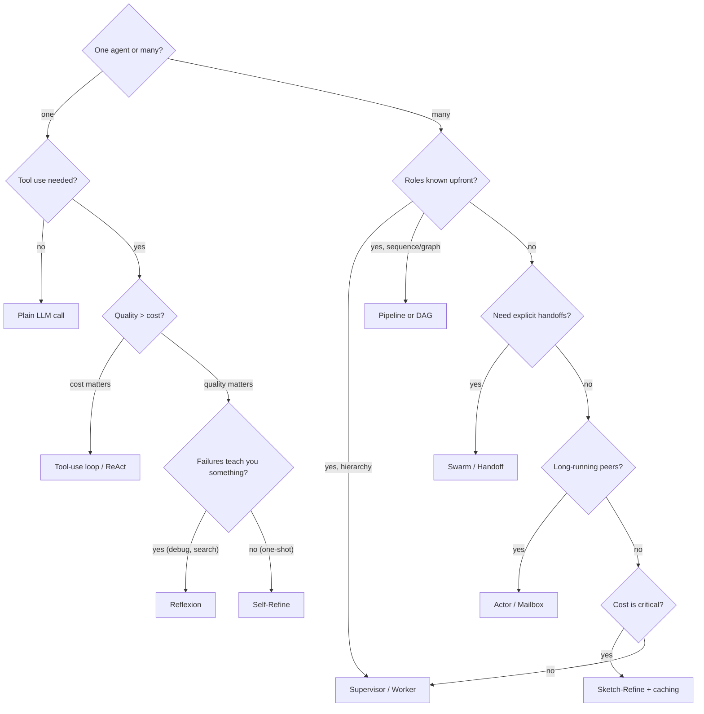

# 06 — Agentic Pattern Archetypes

A canonical reference of agentic patterns from the research literature
and production practice, with implementation sketches in Claude Code
CLI. This document is the *what's possible*; file 04 is *what we
saw*; file 05 is *where it runs*.

## Why patterns matter

Patterns are named, reusable shapes for solving classes of problems.
Most "advanced" agent frameworks (LangGraph, AutoGen, CrewAI,
OpenSwarm) are repackagings of 4–8 patterns from this list. Picking
the right pattern is worth weeks of trial-and-error.

The field is also faddish: a paper introduces a name, a framework
adopts it, then it shows up in three blog posts as if novel.
Recognizing the lineage saves you from being impressed by reskinned
basics.

## Map of the territory

```mermaid
flowchart TD
  ROOT["Agentic patterns"]
  S["Single-agent"]
  M["Multi-agent"]
  F["Frontier / emerging"]

  ROOT --> S
  ROOT --> M
  ROOT --> F

  S --> S1["ReAct"]
  S --> S2["Tool-use loop"]
  S --> S3["Reflexion"]
  S --> S4["Tree of Thoughts"]
  S --> S5["Plan-and-Execute"]
  S --> S6["Self-Refine"]

  M --> M1["Supervisor / Worker"]
  M --> M2["Debate"]
  M --> M3["Critic / Reviewer"]
  M --> M4["Round-table / Consensus"]
  M --> M5["Pipeline"]
  M --> M6["DAG"]
  M --> M7["Swarm / Handoff"]
  M --> M8["Actor / Mailbox"]

  F --> F1["Sketch-Refine"]
  F --> F2["Constitutional"]
  F --> F3["EVR (Edit-Verify-Repair)"]
  F --> F4["Spec-driven"]
  F --> F5["Skill library"]
  F --> F6["Memory-augmented"]
  F --> F7["Sandboxed"]
  F --> F8["Token-budgeted"]
  F --> F9["Prefix-shared cache"]
  F --> F10["Computer Use / ACI"]
  F --> F11["Hindsight relabeling"]
  F --> F12["Self-modifying"]
```



## Single-agent archetypes

These describe how *one* agent's reasoning loop is structured. They
compose: most frontier patterns layer on top of a ReAct or tool-use
core.

| Pattern | Origin | Shape | Use when | Avoid when |
|---|---|---|---|---|
| **ReAct** | Yao et al. 2022 | Interleave `Thought → Action → Observation → Thought` in one stream | Default for tool-using agents; foundational | You need pure CoT without action |
| **Tool-use loop** | Anthropic / OpenAI tool calling | Model emits structured `tool_use` block; runtime executes; result fed back as `tool_result`; repeat until done | You have well-typed tools and want reliable invocation | Tools are fluid / language-defined |
| **Reflexion** | Shinn et al. 2023 | After failure, agent writes a self-reflection to memory; next attempt reads reflection first | Tasks where failures teach you something (debugging, search) | One-shot tasks; cost matters more than quality |
| **Tree of Thoughts** | Yao et al. 2023 | Branch into N candidate thoughts at each step; evaluate; prune; expand survivors | High-stakes reasoning where exploring alternatives pays off | Cheap tasks; latency-sensitive |
| **Plan-and-Execute** | BabyAGI / LangGraph | Planner produces a plan upfront; executor runs steps without re-planning | Plan is knowable upfront; want predictable cost | Plan must adapt to discoveries mid-task |
| **Self-Refine** | Madaan et al. 2023 | `Generate → Critique → Refine` in a loop with same model | Quality matters more than cost; output is well-defined | No clear quality signal; or budget is tight |

`★ Insight ─────────────────────────────────────`
- **ReAct is what Claude Code CLI runs internally for every session.**
  When you invoke `claude -p`, the binary literally interleaves
  reasoning ("I need to read the file") with tool actions
  (`Read("auth.ts")`) with observations (file contents) — that's
  ReAct verbatim. You don't *implement* ReAct on top of Claude Code;
  you *use* it.
- **Reflexion looks like Self-Refine but isn't.** Self-Refine
  improves the *current* output; Reflexion improves the *next
  attempt* by writing learnings to persistent memory. The
  distinction matters: Reflexion needs a memory primitive (file,
  vector DB), Self-Refine just needs a loop.
- **Plan-and-Execute is the right default for "structured" tasks
  but the wrong default for software engineering.** Code tasks
  almost always discover something mid-execution that invalidates
  the plan; ReAct's interleaved replanning fits better. Use Plan
  when the task is "fill out this template", not "fix this bug".
`─────────────────────────────────────────────────`

## Multi-agent archetypes

These describe how multiple agent instances coordinate. They compose
with single-agent patterns underneath: a "Supervisor / Worker" can
have a ReAct supervisor and Tool-use-loop workers.

| Pattern | Origin | Shape | Use when | Avoid when |
|---|---|---|---|---|
| **Supervisor / Worker** | Hierarchical RL lineage | Manager dispatches to specialists, aggregates | Task decomposes cleanly into roles | Roles are similar — overhead dominates |
| **Debate** | Du et al. 2023, Irving 2018 | N agents argue from different starts; convergence or disagreement is the signal | Factuality, contested questions | Low-stakes generation |
| **Critic / Reviewer** | Constitutional AI lineage | Generator + Critic pair; critic rejects or improves | Quality > cost; output structure stable | Tasks where critic and generator confuse each other |
| **Round-table / Consensus** | Wisdom-of-crowds | N independent agents → vote / merge / pick | Reduce variance; ensemble for accuracy | Cost is critical; one model is reliably best |
| **Pipeline** | Software engineering primitives | Output of stage N → input of stage N+1 | Stages are well-defined | Stages need to feedback to earlier ones |
| **DAG** | LangGraph, Airflow | Explicit dependency graph; parallel branches converge at joins | Workflow has known parallel structure | Workflow is exploratory / emergent |
| **Swarm / Handoff** | OpenAI Swarm 2024 | Agents pass control to each other; "handoff" is a first-class operation | Routing is the core problem | You want centralized observability |
| **Actor / Mailbox** | Hewitt 1973 / Erlang | Agents have inboxes; communicate by message; emergent dynamics | Long-running peer agents | You need synchronous coordination |

`★ Insight ─────────────────────────────────────`
- **Debate vs. Round-table is a subtle distinction worth knowing.**
  Debate has agents *interact* (each sees the others' arguments);
  Round-table runs them *independently* and aggregates. Debate
  works for factuality (errors get challenged); Round-table works
  for variance reduction (independent samples). Mixing them up
  produces bad implementations of both.
- **Swarm/Handoff is structurally different from Supervisor/Worker.**
  In supervisor, control returns to the manager after each
  worker finishes. In swarm, control transfers laterally — agent A
  hands off to agent B, then B is in charge. OpenAI Swarm's
  innovation was making "handoff" a primitive return type, not a
  framework concept.
- **Most "multi-agent frameworks" implement 2–3 of these and rebrand
  them.** AutoGen ≈ Supervisor + Critic + Pipeline. CrewAI ≈
  Supervisor + Pipeline. OpenSwarm (the surveyed repo) ≈ Pipeline
  with a Critic loop. Knowing the underlying patterns lets you
  evaluate frameworks faster.
`─────────────────────────────────────────────────`

## Frontier and emerging patterns

These are newer, less canonical, and often more powerful when fit
to the right problem.

| Pattern | Shape | Killer use case |
|---|---|---|
| **Sketch-Refine** | Cheap model produces skeleton; expensive model fills detail | Code generation: Haiku writes the file structure, Opus fills in tricky logic |
| **Constitutional** | Agent has explicit rules; separate critic enforces compliance | Safety / compliance / brand voice |
| **EVR (Edit-Verify-Repair)** | Make change → run tests → if fail, repair with test output as context | Bug fixes, refactors with test coverage |
| **Spec-driven** | Spec → tests → code, in that order | Greenfield features with clear acceptance criteria |
| **Skill library** | Agent maintains a library of reusable skills/programs that grows | Repeated similar tasks (Voyager) |
| **Memory-augmented** | Long-term memory store (vector DB, files); read at start of each session, write at end | Cross-session learning, personalization |
| **Sandboxed / Isolated** | Each agent runs in isolated env (worktree, container, VM) | Parallel exploration; untrusted code |
| **Token-budgeted** | Hard cost ceiling per task; cancel when exceeded | Cost discipline at scale |
| **Prefix-shared cache** | N agents share a long common prefix in prompt cache; diverge on suffix | High-fanout exploration of same codebase |
| **Computer Use / ACI** | Agent perceives via screenshots, acts via mouse/keyboard | UI testing, browser automation, "no API for it" tasks |
| **Hindsight relabeling** | Failed runs are relabeled with what they accomplished, become examples | Self-improving training data |
| **Self-modifying** | Agent edits its own prompts/skills based on past performance | Long-running personalization, Voyager-style learning |

### Notes on the frontier

- **Sketch-Refine and Prefix-shared cache are the highest-leverage
  cost optimizations** if you're billing per-token. The savings
  often exceed any prompt engineering you can do.
- **EVR is the dominant pattern for production code agents.**
  Almost every production coding agent (Devin, Cursor agent,
  aider, Claude Code itself) uses some EVR variant.
- **Computer Use / ACI is a category-defining new primitive.**
  Anthropic's `computer_20241022` tool and OpenAI's Operator make
  this practical. It collapses problems that previously required
  custom integrations.
- **Skill libraries are deceptively hard.** Voyager-style growth
  works in Minecraft (small skill space, clear success signals);
  it's much harder in open-ended coding because skills overlap and
  invalidate each other. `.claude/agents/*.md` is a Claude Code
  approximation that works because the "skill space" is bounded
  by what subagents can do.

## Decision tree: which pattern fits your problem?



### Decision questions in detail

The flowchart above is the fast path. The questions that actually
shape your choice:

1. **Is one agent's context enough?** If your task fits in one
   context window with clear back-and-forth, single-agent ReAct or
   tool-use is almost always enough. Multi-agent is overhead unless
   you actually need it.
1. **Are agent roles natural?** "I need a planner and three
   workers" → Supervisor. "I need a coder and a reviewer" →
   Critic pair. If you're inventing roles to fit a framework,
   you're probably overusing multi-agent.
1. **Where does feedback live?** If the answer is "in the next
   attempt," you want Reflexion. "In the current draft," Self-Refine.
   "Across sessions," Memory-augmented.
1. **Does the workflow shape change?** Static plan upfront →
   Plan-and-Execute. Adapts mid-flight → ReAct. Has known parallel
   structure → DAG. Routing is the core challenge → Swarm.
1. **What's the failure model?** Transient errors → Retry. Logical
   errors → Reflexion. Compliance violations → Constitutional.
   Test failures → EVR.
1. **What's the cost model?** Subscription with quota → fan-out
   freely until rate-limited. Per-token API → Sketch-Refine and
   prompt caching. Local LLM → minimize fanout (each branch needs
   VRAM).

## Implementation reference: each pattern with Claude Code CLI

Minimal sketches showing the canonical Claude Code CLI shape per
pattern. All assume the user is logged in (`claude /login`) and
running on a Max subscription.

### ReAct / tool-use loop

Built into every `claude -p` invocation. No code needed.

```bash
claude -p "fix the failing test in auth.test.ts" \
  --output-format stream-json --verbose
```

### Reflexion

Capture failure, prepend reflection, retry.

```bash
attempt() {
  claude -p "$1" --output-format text > out.txt 2>&1
}

reflect() {
  claude -p "Previous attempt: $(cat out.txt)
Why did it fail? Write a one-paragraph reflection." > reflection.txt
}

attempt "fix bug X" || {
  reflect
  attempt "Reflection: $(cat reflection.txt)
Now fix bug X with that reflection in mind."
}
```

### Plan-and-Execute

Two-stage chain via a plan file.

```bash
claude -p "Write a step-by-step plan for: $TASK
Output to plan.md, no code yet."

claude -p "Read plan.md and execute steps 1-N. \
Mark each completed step in plan.md."
```

### Self-Refine

Loop with critique feedback.

```bash
out=$(claude -p "Generate $TASK")
for i in 1 2 3; do
  critique=$(claude -p "Critique this output: $out")
  out=$(claude -p "Improve based on critique: $critique
Output: $out")
done
echo "$out"
```

### Supervisor / Worker

Parallel `claude -p` per worker, aggregator at end.

```bash
mkdir -p .work
claude -p "Decompose $TASK into 3 independent subtasks. \
Write each as .work/subtask-{1,2,3}.md"

for i in 1 2 3; do
  (claude -p "$(cat .work/subtask-$i.md)" \
    > .work/result-$i.md) &
done
wait

claude -p "Aggregate these into a final answer:
$(cat .work/result-*.md)"
```

### Critic / Reviewer pair

Generator + critic, with explicit roles via separate sessions.

```bash
draft=$(claude -p "Write code for: $TASK")
review=$(claude -p "You are a strict code reviewer. \
Find bugs, security issues, missing tests in:
$draft
Output a numbered list of issues, or 'APPROVED' if none.")

if [[ "$review" != *"APPROVED"* ]]; then
  draft=$(claude -p "Fix these issues:
$review
In: $draft")
fi
```

### Pipeline (sequential stages)

Chain via shared files. Each stage reads previous, writes next.

```bash
claude -p "Read spec.md, write design.md"
claude -p "Read design.md, write tests.md"
claude -p "Read design.md and tests.md, write code"
claude -p "Run tests, fix failures, repeat until green"
```

### DAG (directed acyclic graph)

Orchestrator script respecting deps. Each node is `claude -p`.

```bash
# Node A and B parallel, C waits on both
(claude -p "$PROMPT_A" > a.out) &
(claude -p "$PROMPT_B" > b.out) &
wait
claude -p "Combine: $(cat a.out) and $(cat b.out)" > c.out
```

### Swarm / Handoff

Harder with CLI. Approximation: orchestrator parses an explicit
"HANDOFF: <agent>" sentinel from output and routes to the named
agent.

```bash
current_agent="planner"
input="$TASK"
while [ "$current_agent" != "done" ]; do
  out=$(claude -p --append-system-prompt \
    ".claude/agents/$current_agent.md" "$input")
  if [[ "$out" =~ HANDOFF:\ ([a-z]+) ]]; then
    current_agent="${BASH_REMATCH[1]}"
    input="$out"
  else
    current_agent="done"
  fi
done
```

### Actor / Mailbox

See `aannoo/hcom` analysis in file 03 — SQLite + PTY injection.
Or roll your own with files-as-mailbox:

```bash
# agent reads its mailbox, processes, writes to others
while true; do
  msg=$(head -1 ~/.mailbox/$ME 2>/dev/null) || sleep 5
  [ -z "$msg" ] && continue
  reply=$(claude -p "$msg")
  echo "$reply" >> ~/.mailbox/$RECIPIENT
  sed -i '' '1d' ~/.mailbox/$ME
done
```

### EVR (Edit-Verify-Repair)

The dominant production pattern. Test runner is the verifier.

```bash
for attempt in 1 2 3; do
  claude -p "Make change: $TASK"
  if npm test 2>test.out; then
    break
  fi
  claude -p "Tests failed. Output: $(cat test.out)
Read the test output and repair the code."
done
```

### Sketch-Refine

Cheap then expensive. Use `--model` flag for cost optimization.

```bash
claude -p --model claude-haiku-4-5 \
  "Sketch the file structure and function signatures for: $TASK" \
  > sketch.md

claude -p --model claude-opus-4-7 \
  "Refine this sketch into working code: $(cat sketch.md)"
```

### Skill library (Claude Code's native form)

`.claude/agents/*.md` files. Subagents accumulate over time as
markdown definitions; Claude Code's `Task` tool routes to them by
description match. This is the *canonical* skill-library
implementation in the Claude Code ecosystem.

### Sandboxed / Isolated

Worktree per branch.

```bash
for variant in approach-a approach-b approach-c; do
  git worktree add /tmp/wt-$variant
  (cd /tmp/wt-$variant && claude -p "$TASK using $variant") &
done
wait
# pick winner; clean up losers
```

### Token-budgeted

Hard cap with `--max-turns`.

```bash
claude -p "$TASK" --max-turns 10 || {
  echo "Budget exhausted; escalating to human"
}
```

### Prefix-shared cache

Anthropic's prompt caching applies automatically when prefix is
identical across calls. Make sure your N parallel agents share a
long common prefix (codebase context, instructions) in the same
order, and only differ in the suffix (task variant).

```bash
PREFIX="$(cat CONTEXT.md)"
for variant in 1 2 3; do
  claude -p "$PREFIX

Task variant $variant: ..." &
done
wait
```

The cache hit rate appears in stream-json metadata
(`cache_read_input_tokens` field).

### Memory-augmented

Pass a memory file at session start; instruct model to update it.

```bash
claude -p "Read MEMORY.md for context, then: $TASK
At end, update MEMORY.md with anything you learned."
```

### Constitutional

System prompt + critic pair. Generator writes; constitutional
critic checks against rules.

```bash
draft=$(claude -p --append-system-prompt \
  "You are bound by constitution.md" "$TASK")
verdict=$(claude -p "Check $draft against constitution.md. \
Output: APPROVED or list of violations.")
[[ "$verdict" == *"APPROVED"* ]] || retry_with_violations
```

### Computer Use / ACI

Anthropic's `computer_20241022` tool isn't exposed via Claude Code
CLI directly (no `--tool computer` flag as of writing). For now,
this pattern requires the API path with `@anthropic-ai/sdk` — see
file 02. If you need it under Max subscription, the workaround is
to spawn a Claude Code subprocess that *invokes* a Computer-Use
script that uses the API for that one capability.

## Pattern combinations seen in practice

Real systems compose patterns. Common stacks:

| System | Stack |
|---|---|
| Claude Code CLI itself | ReAct + Tool-use loop + Skill library (`.claude/agents/`) + Memory (CLAUDE.md) |
| OpenSwarm (file 03) | Pipeline + Critic + EVR (with reviewer rejection retry) |
| catlog22/CCW (file 03) | DAG + Multi-CLI peers + Sandboxed (worktree per node) |
| aannoo/hcom (file 03) | Actor / Mailbox + Swarm-ish handoff |
| automagik/genie (file 03) | Plan-and-Execute (brainstorm → wish) + Round-table (10-critic council) + Sandboxed |
| maestro-orchestrate (file 03) | Supervisor + 4-phase Pipeline + Constitutional (validate_plan gates) |
| Production code agents (Devin, Cursor) | EVR + Plan-and-Execute + Memory-augmented + Sandboxed |
| Voyager (Minecraft research) | Skill library + Self-modifying + Reflexion |

Recognizing the stack lets you evaluate "is this novel?" honestly:
most "new" frameworks are 3–5 of these patterns rebadged.

## Anti-patterns

What to recognize and avoid:

- **Multi-agent for the sake of it.** If your "5-agent system" can be
  one ReAct agent with a tool that's a function call, it should be.
- **Critic without termination criteria.** A critic loop that runs
  indefinitely costs money and converges nowhere. Always set a
  max iteration count or quality threshold.
- **Plan-and-Execute on coding tasks.** Codebase discoveries
  invalidate plans. Use ReAct.
- **Round-table with N=2.** "Wisdom of crowds" needs ≥3 to vote;
  with 2 you're paying double for a tiebreaker that doesn't exist.
- **Swarm without an exit node.** Without a "done" handoff target,
  swarms loop forever.
- **Memory-augmented without retrieval.** Stuffing the entire memory
  file into every prompt defeats the purpose of memory and burns
  tokens. Use vector retrieval or summarization.
- **Skill library without invalidation.** Skills go stale as the
  codebase evolves. Without a process to retire stale skills,
  the library degrades into noise.
- **Reflexion without persistence.** Writing reflections to a temp
  file that's deleted at session end is just Self-Refine with
  extra steps. Persist somewhere durable.
- **EVR without test isolation.** If your "verify" step has
  side effects (writes to shared DB, modifies global state), the
  retry loop will corrupt state.

## Cross-references

- File 02 — Anthropic primitives (Task tool, CLI flags) used in
  the implementation sketches above.
- File 03 — surveyed orchestrators mapped to which patterns they
  implement.
- File 04 — orchestration topology patterns (subset of multi-agent
  patterns above, focused on what we observed in the wild).
- File 05 — runtime substrate (where these patterns can run).

## Further reading

Original papers worth knowing:

- ReAct: Yao et al. 2022, "ReAct: Synergizing Reasoning and Acting"
- Reflexion: Shinn et al. 2023
- Tree of Thoughts: Yao et al. 2023
- Self-Refine: Madaan et al. 2023
- Debate: Du et al. 2023, "Improving Factuality and Reasoning"
- Voyager: Wang et al. 2023 (skill library)
- Constitutional AI: Bai et al. 2022 (Anthropic)
- OpenAI Swarm 2024 (handoff primitive)
