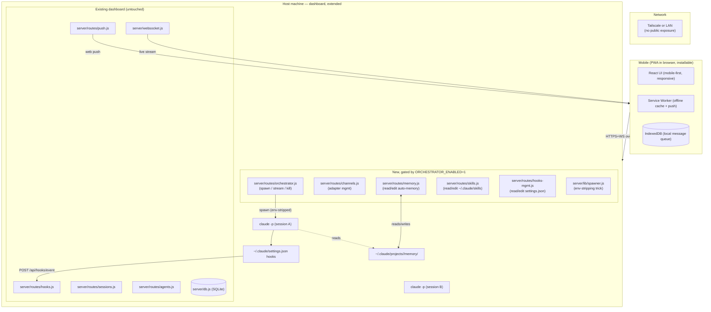

# 10 — PWA-on-Dashboard Design

Strategy: extend the existing Claude Code Agent Monitor dashboard
with mobile/management features, distributed as a PWA. No separate
daemon, no native app, no app store. The dashboard's existing
infrastructure (Express + SQLite + WebSocket + React + push routes
+ hook ingestion) covers ~80% of what's needed.

## Why piggyback on the dashboard

The dashboard already has:

- Express API on `:4820` with route-per-domain layout
- SQLite schema for sessions, agents, events
- WebSocket broadcast (`server/websocket.js`) with stable
  `WSMessage` contract
- Web Push routes (`server/routes/push.js`) and VAPID keys at
  `data/vapid-keys.json`
- Hook ingestion at `POST /api/hooks/event`
- React UI with Vite build pipeline (`client/`)
- Auto-import of historical sessions on startup
- 10 hook events wired (incl. `PreCompact` / `PostCompact`)

A standalone gateway daemon would re-implement all of this. Adding
to the dashboard is one less service to run, one less codebase to
maintain.

## Architecture



The non-negotiable: every new file lives under new paths
(`server/routes/orchestrator.js`, `server/lib/spawner.js`,
`client/src/features/mobile/`). Existing files unchanged.
Upstream merges from `hoangsonww/Claude-Code-Agent-Monitor` stay
clean.

## The big architectural shift

The dashboard's current contract is **observe-only** (per its
`CLAUDE.md` and `01-current-architecture.md`). Adding spawn /
control endpoints inverts that contract.

The safe path, documented in `01-current-architecture.md`:

> Opt-in module behind an env flag. Live in
> `server/routes/orchestrator.js` and
> `client/src/features/orchestrator/`, gated by
> `ORCHESTRATOR_ENABLED=1`. Zero changes to existing routes/schema.

Every new write surface respects this. The dashboard's safety story
becomes "observe-only by default, control mode opt-in", not
"observe-only, period". Subtler to reason about, but acceptable
when the control surface is feature-flagged.

## Phase 0: PWA enablement

The minimum-risk first step. Pure additive. No observe-only
inversion.

```bash
cd client
npm install -D vite-plugin-pwa workbox-window
```

Add to `client/vite.config.ts`:

```typescript
import { VitePWA } from "vite-plugin-pwa";

export default defineConfig({
  plugins: [
    react(),
    VitePWA({
      registerType: "autoUpdate",
      includeAssets: ["favicon.svg", "robots.txt"],
      manifest: {
        name: "Claude Code Agent Monitor",
        short_name: "CCAM",
        theme_color: "#000000",
        icons: [
          { src: "icon-192.png", sizes: "192x192", type: "image/png" },
          { src: "icon-512.png", sizes: "512x512", type: "image/png" },
        ],
        display: "standalone",
        start_url: "/",
      },
      workbox: {
        runtimeCaching: [
          { urlPattern: /\/api\/sessions/, handler: "NetworkFirst" },
          { urlPattern: /\/api\/agents/, handler: "NetworkFirst" },
        ],
      },
    }),
  ],
});
```

Mobile UI shell goes in `client/src/features/mobile/` with bottom
tab nav. Existing desktop pages stay; mobile gets dedicated
layouts. Use `useMediaQuery` to render the right shell at runtime.

After Phase 0, the dashboard is installable on iOS/Android home
screens with offline support and push-ready, with zero functionality
changes.

## Phase 1: Mobile-responsive existing pages

Bottom tab nav for mobile, sidebar for desktop. Render right shell
based on viewport. Existing desktop logic unchanged; mobile gets
dedicated layouts that talk to the same APIs.

## Phase 2: Spawn + stream (the big one)

`server/routes/orchestrator.js` (new):

```javascript
const router = require("express").Router();
const { spawnAgent, killAgent } = require("../lib/spawner");

if (process.env.ORCHESTRATOR_ENABLED !== "1") {
  router.all("*", (req, res) => res.status(404).json({
    error: "orchestrator disabled. Set ORCHESTRATOR_ENABLED=1 to enable."
  }));
  module.exports = router;
  return;
}

router.post("/spawn", async (req, res) => {
  const { prompt, preset, channelId } = req.body;
  const handle = await spawnAgent({ prompt, preset, channelId });
  res.json({ sessionId: handle.id, pid: handle.pid });
});

router.delete("/agents/:id", async (req, res) => {
  await killAgent(req.params.id);
  res.json({ ok: true });
});

module.exports = router;
```

`server/lib/spawner.js` uses claudeclaw's env-stripping trick (file
08). The spawned `claude` fires hooks → existing
`POST /api/hooks/event` → existing dashboard captures live.

Streaming: piggyback on existing WebSocket. Add new message types:

```typescript
export type WSMessage =
  // ... existing types
  | { type: "agent_stream"; sessionId: string; content: StreamJsonChunk }
  | { type: "agent_status"; sessionId: string; status: AgentStatus }
  | { type: "channel_inbound"; channelId: string; message: InboundMessage };
```

The dashboard's existing `WSMessage` discipline makes this
backward-compatible.

## Phase 3: Channels integration

Two paths:

1. **Use Claude Code's native `/channels`** (recommended) — write to
   `~/.claude/settings.json` `channels` block. Mobile UI is just a
   CRUD form over that schema. OAuth flows happen in mobile UI,
   dashboard hosts the callback URL.
1. **Build adapters as in claudeclaw / OpenClaw** — only for
   channels Anthropic doesn't natively support.

`server/routes/channels.js` (new):

```javascript
router.get("/", listChannels);
router.post("/", addChannel);          // OAuth + safe-write to settings.json
router.put("/:id", updateChannel);
router.delete("/:id", removeChannel);
router.post("/:id/test", sendTestMessage);
```

Webhook receiver for non-native channels translates inbound messages
to `spawnAgent` calls.

## Phase 4: Hooks/plugins/skills management

Three new route files: `server/routes/skills.js`,
`server/routes/hooks-mgmt.js`, `server/routes/plugins.js`. Each:

- Reads `~/.claude/*` (settings, plugins/, skills/, projects/,
  agents/)
- Writes with **mandatory backup** (the pattern used to enable
  computer-use earlier — `*.bak` file before any mutation)
- Audit-logs every change in `server/db.js` (new `audit_log` table)

Mobile UI: list views with detail screens. Edit screens preview the
diff before applying.

## Phase 5: Push notifications

The dashboard already has `server/routes/push.js`. Wire it to hook
events: when an interesting event fires (`Stop`, `Notification`,
`SubagentStop`), the server pushes to subscribed mobile clients via
Web Push API.

Mobile UI: subscribe button on first launch (browser permission
prompt). Selectively pick which events trigger pushes.

## Phase 6: Context management

`PreCompact` / `PostCompact` hooks already wired. Build the UI:

- "Compaction events" tab shows when each session compacted
- Click an event to view the pre-compact transcript snapshot
- Pinned context: textarea that gets injected as
  `--append-system-prompt` for every spawn in this session
- Context budget: parse `stream-json` events for token counts;
  render as a horizontal bar

`server/lib/transcript-cache.js` (existing) parses transcripts.
Reuse for pre-compact replay.

## Phase 7: Long-term memory (optional)

Cross-repo memory: write to `~/.claude/CLAUDE.md` (user-scoped,
loads in every session). For vector memory: install the Pinecone
MCP plugin, expose its tools through the dashboard.

## Decision points

| Decision | File | Tradeoff |
|---|---|---|
| **A. Spawn flag preset shape** | `server/lib/presets.js` (new) | Typed (mobile forms friendly) vs free-form (flexibility) |
| **B. Channel adapter interface** (only if you build any) | `server/lib/channels/adapter.js` (new) | Minimal vs rich |
| **C. PWA scope** | `client/vite.config.ts` | Mobile-only PWA features vs desktop-installable too |

## Phased build plan

| Phase | Scope | Time | Touches existing? |
|---|---|---|---|
| **0. PWA enablement** | vite-plugin-pwa, manifest, mobile shell | 1 day | adds files only |
| **1. Mobile-responsive existing dashboard** | Bottom-tab nav, mobile layouts | 2-3 days | may add CSS modules; no logic changes |
| **2. Spawn + stream** | orchestrator route, spawner lib, mobile chat UI | 1-2 weeks | new files only; `ORCHESTRATOR_ENABLED=1` |
| **3. Channels** | channels route, channel mgmt UI | 1 week | new files |
| **4. Memory + skills + hooks management** | 3 new route files + UI | 1 week | new files |
| **5. Push notifications** | wire existing push.js to hook events | 2-3 days | minor: feature flag |
| **6. Context management** | pre-compact replay UI, pinned context, budget | 1 week | new UI; reuses transcript-cache |
| **7. Long-term memory** | user CLAUDE.md sync, optional vector MCP | optional | additive |

**Total: ~5-6 weeks of part-time work** to reach Phase 5.

## Patterns from prior research that map cleanly

| Pattern | Source | Where in dashboard |
|---|---|---|
| Env-stripping daemon spawn | claudeclaw (file 08) | `server/lib/spawner.js` |
| Stream-json `Agent` block detection | claudeclaw (file 08) | Subagent visibility in mobile UI |
| Hook handler always exits 0 | Existing dashboard | Don't change — gotcha #2 |
| Backup-before-edit | This research session's pattern | `server/lib/safe-edit.js` (new helper) |
| Schema preservation | Existing `WSMessage` contract | Add new types, don't break old |
| Worktree race | rjcorwin/cook (file 03) | Optional "try N approaches" preset |
| `bypassPermissions` is dangerous as default | OpenSwarm / mco (file 03) | UI defaults to `acceptEdits` |

## Honest tradeoffs

**Pros:**

- Reuses ~80% of infrastructure
- Single service to run; no separate daemon
- Mobile gets responsive PWA for free
- Dashboard's hooks fire for every spawn — observability automatic
- Less code = less to maintain

**Cons:**

- The dashboard becomes bidirectional. Even with feature flags, the
  safety story shifts. Subtler.
- Upstream merges get more careful. New files don't conflict, but
  if upstream ever adds the same feature names, merge-conflict.
- A bug in new orchestrator code can stress dashboard resources
  (DB writes, WS bandwidth) and degrade observability.
- PWA on iOS still has limits: smaller storage quota, push
  reliability less than APNs, no deep background processing.

## Smallest useful slice (start tomorrow)

1. Add `vite-plugin-pwa` — 1 hour, all win, no risk
2. Add a "mobile shell" wrapper component — bottom tab nav for
   mobile, sidebar for desktop, render right one based on viewport.
   ~50 lines, additive.
3. Add `server/routes/orchestrator.js` with one endpoint:
   `POST /api/orchestrator/spawn` — gated by env flag. Validates
   request, spawns `claude -p` with env-stripping, returns
   sessionId. ~100 lines.
4. Add a mobile chat page that calls `/api/orchestrator/spawn`,
   then subscribes to existing WS for streaming. ~150 lines.

Working "send a prompt from your phone, see Claude work, dashboard
captures everything" in **about a weekend**, with zero
modifications to existing routes.

## Cross-references

- [01-current-architecture.md](01-current-architecture.md) —
  observe-only contract this design respects via feature flags
- [04-architecture-patterns.md](04-architecture-patterns.md) —
  pattern #11 (Hybrid: dashboard + plugin + subprocess) is the
  closest existing pattern
- [07-claude-code-hidden-features.md](07-claude-code-hidden-features.md)
  — `--max-budget-usd`, `--json-schema`, `--effort` flags surface
  in the spawn-flag preset shape
- [08-claudeclaw-deep-dive.md](08-claudeclaw-deep-dive.md) —
  env-stripping daemon trick used in `server/lib/spawner.js`
- [09-memory-and-rag.md](09-memory-and-rag.md) — auto-memory
  directory layout that the memory management UI surfaces
